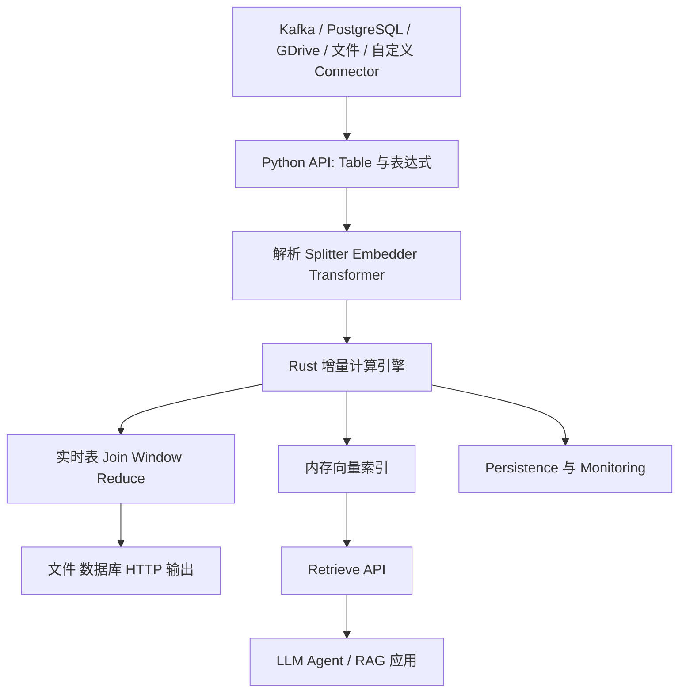
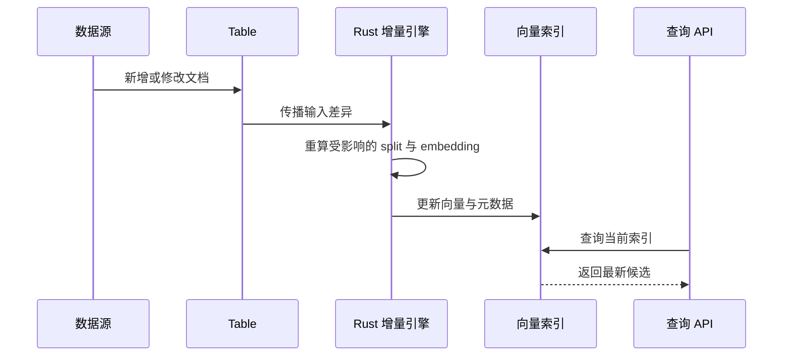
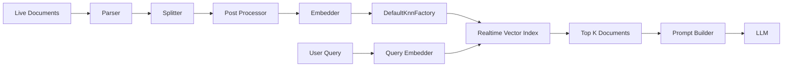
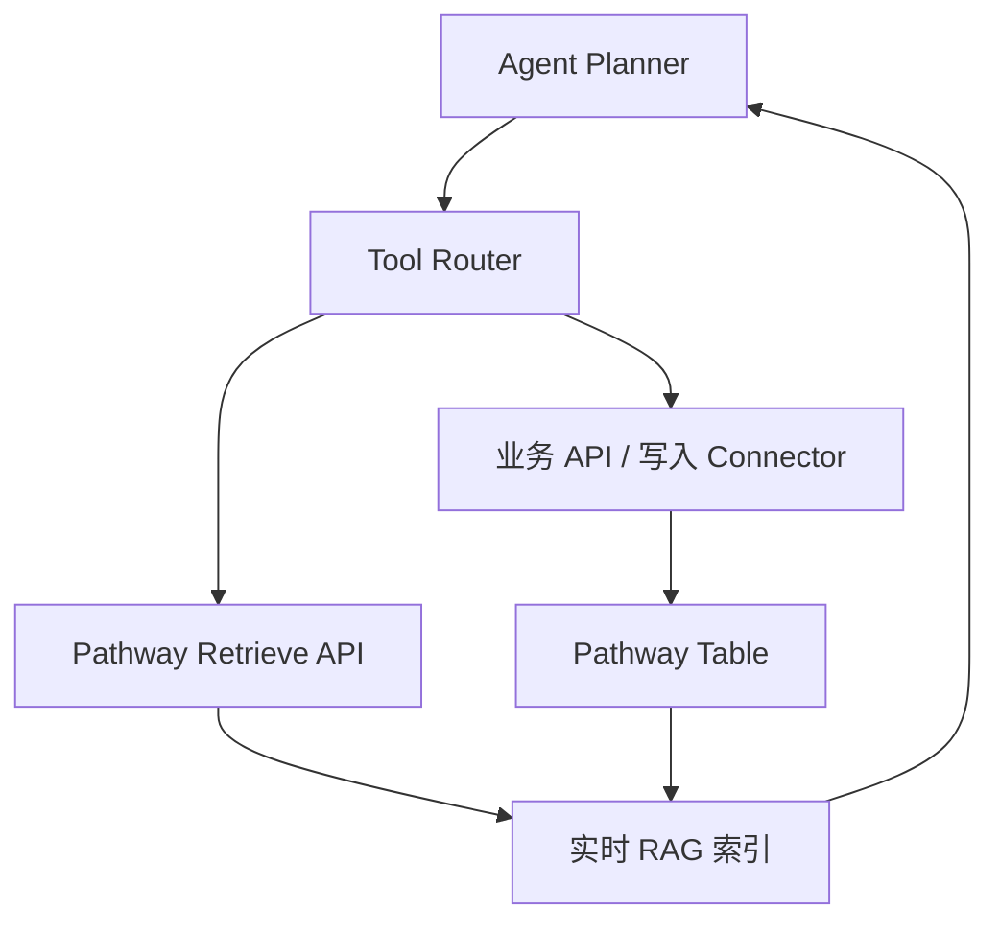

# 【Pathway】核心架构与设计原理深度解析

> 当知识库会持续变化时，RAG 不应该每次靠定时脚本重建索引。Pathway 的核心价值，是把「数据变化」本身纳入计算模型：连接器接收新事件，增量计算更新结果，向量索引随之变化，Agent 查询到的是当前状态。

## 一、为什么需要实时 RAG

传统 RAG 通常是一次性 ETL：读取文件、切分文本、生成 embedding、写入向量库，然后由应用查询。这个方案对静态文档足够，但企业知识库往往同时接入 Git、数据库、网盘、客服工单和消息流。数据变动后，系统必须处理三件事：发现变化、判断受影响的结果、更新索引。

如果每次都全量重建，成本和延迟会随着数据量一起增长；如果只写增量脚本，又要自己维护 watermark、删除传播、乱序事件和失败恢复。Pathway 把这些问题提升为运行时的数据流计算问题，并用同一套 Python 代码兼容批处理与流处理。

## 二、项目定位与现状

Pathway 的 GitHub 仓库是 [pathwaycom/pathway](https://github.com/pathwaycom/pathway)。截至本次调研，仓库约有 **6.26 万颗 Star、1667 个 Fork**，主要语言为 Python，最近提交时间为 2026-07-21。README 将它定义为面向 stream processing、real-time analytics、LLM pipelines 和 RAG 的 Python ETL framework。

需要注意：仓库标注的许可证 SPDX 为 `NOASSERTION`，README 的徽章显示为 BSL。因此生产使用前应阅读仓库中的 `LICENSE.txt`，不能简单把它当作 MIT/Apache 项目。

一句话概括：**Pathway 是以增量数据流引擎为底座、以 Python 表达数据变换、并把 embedding、切分、向量检索和 HTTP 服务纳入同一计算图的实时 AI 数据平面。**

## 三、整体架构



这张图可以分成六层：

1. **输入层**：Kafka、PostgreSQL、GDrive、文件目录以及自定义 Python connector。
2. **表模型层**：输入被建模为 `Table`，列引用和表达式构成计算图。
3. **AI 处理层**：parser、splitter、embedder、reranker 等组件把原始数据变成可检索文档。
4. **执行层**：Python API 描述逻辑，Rust 引擎负责增量计算、多线程和分布式执行。
5. **索引层**：向量索引随上游表的变化维护，查询接口通过 HTTP 暴露。
6. **应用层**：Agent 或 RAG 服务向检索接口提问，再调用 LLM 生成答案。

## 四、核心抽象：Table 不是 DataFrame 的简单替代品

Pathway 的 `Table` 表示「在同一个 universe 上、具有命名列的集合」。源码 `python/pathway/internals/table.py` 中，`Table` 继承 `Joinable`、`OperatorInput`，并持有 `_columns`、`_schema`、`_id_column` 和 `_rowwise_context`。

这带来一个关键差异：DataFrame 通常描述一个当前批次；Pathway Table 描述一个会持续变化的关系。过滤、Join、Reduce 等操作不是立即消费数据，而是在内部构造计算图，等待运行时对输入变化做增量传播。

```python
# 来自 python/pathway/internals/table.py: Table 的 schema、id 和列访问设计
import pathway as pw

class InputSchema(pw.Schema):
    value: int
    source: str

input_table = pw.debug.table_from_markdown("""
value | source
1     | a
-2    | b
3     | c
""", schema=InputSchema)

positive = input_table.filter(input_table.value >= 0)
result = positive.select(
    source=positive.source,
    doubled=positive.value * 2,
)
pw.debug.compute_and_print(result, include_id=False)
```

`id` 列尤其重要。它不是业务主键，而是运行时追踪行身份的内部标识。增量更新需要知道「哪一行被新增、删除或更新」，因此系统不能只依赖列值比较。

## 五、增量计算：从全量重跑转向受影响子图

Pathway README 声称其 Rust 引擎建立在 Differential Dataflow 之上，并执行 incremental computation。可以把一次更新抽象为：

```text
新事件 → 输入表差异 → 受影响的算子 → 受影响的输出差异
```

假设知识库有一百万段文本，但只修改其中一段。全量方案需要重新切分、重新 embedding 并重写一百万条索引；增量方案只需让变化沿计算图传播。Join、window、reduce 等有状态算子必须维护中间状态，才能快速计算新结果。



### 5.1 批处理和流处理共用一套代码

Pathway 的设计目标不是让开发者分别写 batch pipeline 与 streaming pipeline，而是让输入 connector 决定数据如何进入系统，计算逻辑保持一致。

```python
# 来自 README.md: Getting Started 示例
import pathway as pw

class InputSchema(pw.Schema):
    value: int

input_table = pw.io.csv.read("./input/", schema=InputSchema)
filtered_table = input_table.filter(input_table.value >= 0)
result_table = filtered_table.reduce(
    sum_value=pw.reducers.sum(filtered_table.value)
)
pw.io.jsonlines.write(result_table, "output.jsonl")
pw.run()
```

这不是说所有语义都自动相同。数据源的更新能力、删除事件、时间戳和一致性级别仍然由 connector 与部署版本决定。README 明确提到免费版本提供 at-least-once，企业版本提供 exactly-once，因此不能把「实时」误读成「天然 exactly-once」。

## 六、实时 RAG 管道

Pathway 的 LLM 扩展位于 `python/pathway/xpacks/llm/`，模块包括 `document_store`、`embedders`、`parsers`、`splitters`、`rerankers`、`vector_store` 等。它把 RAG 拆成可替换的处理阶段，而不是把所有逻辑封装成一个黑盒函数。



在 `vector_store.py` 中，`VectorStoreServer` 接收一个或多个 `pw.Table`，要求提供 `embedder`，可选提供 parser、splitter 和 post-processors，然后通过 `DefaultKnnFactory` 构造近邻检索器。

```python
# 来自 python/pathway/xpacks/llm/vector_store.py: VectorStoreServer.__init__
import pathway as pw
from pathway.xpacks.llm import embedders, parsers, splitters
from pathway.xpacks.llm.vector_store import VectorStoreServer

class DocSchema(pw.Schema):
    path: str
    data: bytes

docs = pw.io.fs.read(
    "./docs",
    with_metadata=True,
    schema=DocSchema,
)

# 具体 embedder 应按当前 Pathway 版本文档配置，例如 OpenAI、Ollama 或本地模型。
embedder = embedders.OpenAIEmbedder(api_key="YOUR_API_KEY")
server = VectorStoreServer(
    docs,
    embedder=embedder,
    parser=parsers.Utf8Parser(),
    splitter=splitters.TokenCountSplitter(max_tokens=400),
)
server.run_server(host="0.0.0.0", port=8080)
```

上面的接口名称应以安装版本文档为准；真正运行时需要配置对应 provider 的密钥或本地模型。文章不把未验证的模型 endpoint 写死，避免把示例误当成通用配置。

### 6.1 为什么是内存向量索引

Pathway 的向量存储首先是一个随数据流更新的计算节点，而不是单独的外置数据库产品。优点是：

- 文档变更和向量更新处在同一计算图中；
- 可以用 persistence 恢复计算状态；
- 查询接口与数据管道由同一运行时提供；
- 可以将 Pathway Table 与 LangChain、LlamaIndex 组件连接。

代价也明显：索引状态驻留内存，规模、重启恢复、成本和高可用方式需要结合部署方案评估。它更像「实时数据应用引擎中的向量索引」，而不是「专门的分布式向量数据库」。

## 七、Agent 在哪里

Pathway 不是以 Agent loop 为中心的框架，它更接近 Agent 的数据基础设施。一个典型 Agent 系统中，它负责：

- 让工具返回的实时数据持续进入统一 Table；
- 为 Agent 提供最新的检索结果；
- 对事件做窗口聚合、Join 和告警；
- 将结果通过 HTTP、文件或数据库输出。

Agent 的规划、工具选择、反思和最终回答仍由上层应用负责。这个边界很重要：Pathway 并不会自动替你完成多 Agent 协作，也不会凭空拥有长期记忆。它提供的是可被 Agent 调用的实时知识与事件平面。



这种分层适合一个常见场景：Agent 负责决定「查什么、调用哪个工具」，Pathway 负责保证工具产生的事实数据能被持续处理和检索。

## 八、Memory、Embedding 与 RAG 的边界

Pathway 可以构成 RAG 的索引层，但它不是传统意义上包含人格、偏好和会话摘要的 Memory 框架。可以这样区分：

| 层次 | Pathway 的职责 | 不应误解为 |
|---|---|---|
| 原始事实 | 接入持续变化的文档和事件 | 自动理解所有业务语义 |
| 文档处理 | parser、splitter、metadata 变换 | 自动生成高质量知识图谱 |
| 表示学习 | 调用 embedder 生成向量 | 自带唯一最优 embedding 模型 |
| 检索 | KNN、查询 API、实时索引 | 自动完成回答生成 |
| Agent Memory | 可作为外部事实来源 | 完整的 session memory 产品 |

真正的 Memory 设计仍需考虑记忆提取、冲突处理、时间衰减、权限和遗忘。Pathway 的强项是把「会变化的事实」及时映射到检索结果，而不是替上层定义记忆生命周期。

## 九、工具与连接器：扩展性来自输入边界

Pathway 的连接器覆盖 Kafka、GDrive、PostgreSQL、SharePoint 等来源，并提供 Airbyte connector。若没有现成连接器，README 允许开发者编写 custom Python connector。

这个扩展模型比在 Agent 中为每个 SaaS 手写工具更稳健：Agent 工具只需访问稳定的查询或业务接口，连接器负责认证、游标和事件接收，计算图负责下游传播。

```python
# 来自 README.md: Table → transform → sink 的最小数据流
import pathway as pw

class Event(pw.Schema):
    user: str
    text: str

events = pw.io.jsonlines.read("events.jsonl", schema=Event)
clean = events.select(
    user=events.user,
    text=events.text,
).filter(events.text != "")
pw.io.jsonlines.write(clean, "clean-events.jsonl")
pw.run()
```

连接器设计的真正难点不在读数据，而在：重复事件如何处理、删除如何表达、乱序如何修正、checkpoint 如何持久化、外部系统失败后如何重试。生产落地时应优先阅读对应 connector 的一致性和恢复文档。

## 十、向量检索服务的实现思路

`VectorStoreServer.run_server` 的源码显示，它创建 `PathwayWebserver`，通过 `rest_connector` 注册 `/v1/retrieve`、`/v1/statistics` 和 `/v1/inputs` 三类接口，然后在 `pw.run()` 中启动整张计算图。

```python
# 来自 python/pathway/xpacks/llm/vector_store.py: run_server 的 API 边界
import requests

response = requests.get(
    "http://localhost:8080/v1/retrieve",
    params={"query": "如何处理延迟事件", "k": 5},
    timeout=10,
)
response.raise_for_status()
print(response.json())
```

这里体现了 Pathway 的一个工程选择：检索服务不是单独的同步函数，而是计算图的一个输出端。这样做可以让索引更新与查询服务共享运行时状态，但也意味着应用要理解它的生命周期、端口暴露和部署监控。

## 十一、持久化与恢复

实时管道必然面对进程重启和代码升级。README 将 persistence 列为核心能力，用于保存计算状态，使管道能够从故障或更新中恢复。VectorStoreServer 还提供 UDF caching，用于避免同一内容重复请求 embedding provider。

```python
# 来自 python/pathway/xpacks/llm/vector_store.py: run_server 的 persistence 配置
import pathway as pw

backend = pw.persistence.Backend.filesystem("./Cache")
config = pw.persistence.Config(
    backend,
    persistence_mode=pw.PersistenceMode.UDF_CACHING,
)
# 在完整应用中将 config 传给 pw.run(persistence_config=config)
print(config)
```

缓存 embedding 能降低费用，但缓存键、模型版本和文档内容必须纳入运维策略。换模型后是否复用旧向量，不能只看文本是否相同。

## 十二、与同类项目对比：差异在计算模型，不在功能清单

| 项目 | 核心计算模型 | RAG 更新方式 | Agent 边界 |
|---|---|---|---|
| Pathway | Rust 增量数据流 + Python Table | 数据变化沿计算图传播 | 提供实时事实与检索平面 |
| LangGraph | 显式状态图与节点编排 | 通常由节点或外部任务更新 | 负责 Agent 状态机与工具流程 |
| LlamaIndex | 文档索引与检索抽象 | 依赖 index store 和应用侧刷新 | 负责数据连接、检索和 Agent 组件 |
| Kafka Streams / Flink | 流处理运行时 | 通过状态后端维护流计算 | 通常不提供 LLM/RAG 一等抽象 |

### 12.1 Pathway 与 LangGraph

LangGraph 的中心问题是「Agent 下一步走哪个节点」，Pathway 的中心问题是「输入变化后哪些结果需要更新」。前者适合长流程、人工介入和多 Agent 状态机；后者适合持续流入的数据、实时聚合和知识索引。两者可以组合，而不是互相替代。

### 12.2 Pathway 与 LlamaIndex

LlamaIndex 把文档、索引、Retriever 和 Agent 组件组织成应用层抽象；Pathway 把文档处理放入实时计算图，并用 Rust 承担状态更新。若数据大部分静态，LlamaIndex 的应用开发体验可能更直接；若文档持续变化，Pathway 的增量语义更有价值。

### 12.3 Pathway 与 Flink

Flink 是成熟的通用流处理系统，生态和分布式运维能力强；Pathway 通过 Python API 和 LLM xpack 降低 AI 管道的进入门槛。代价是 Pathway 的许可证、生态成熟度、企业功能和索引模型需要单独评估，不能仅凭 Python API 判断它等价于 Flink。

## 十三、优缺点分析

| 左侧：架构简洁性 / 扩展性 / 易用性 | 右侧：性能 / 复杂度 / 维护性 |
|---|---|
| Python API 把连接器、变换和输出串成一张图，原型很快 | 运行时由 Rust 引擎驱动，调试不能只停留在 Python 调用栈 |
| batch 与 streaming 共用计算逻辑，减少两套代码 | 有状态增量计算、乱序和删除传播带来较高认知复杂度 |
| parser、splitter、embedder 可替换，便于适配模型 | embedding provider、模型版本和缓存一致性需要运维治理 |
| 自定义 connector 可以接入企业内部数据 | connector 质量决定重复、丢失、延迟和恢复语义 |
| 实时向量索引与上游数据变化相连，避免周期性全量重建 | 内存索引和计算状态的规模上限、HA 与成本需要压测 |
| HTTP 检索接口适合被 Agent 调用 | Pathway 不是完整 Agent/Memory 产品，上层仍需自行设计 |

## 十四、一个最小的实时 RAG 应用应该如何落地

建议按以下顺序推进：

1. 先用 `pw.debug` 数据构造器验证 Table 变换；
2. 再接本地文件或 JSONL，确认 parser 和 splitter 的输出；
3. 使用固定 embedding 模型建立小规模向量索引；
4. 观察新增、修改、删除和重复事件；
5. 再接 Kafka、PostgreSQL 或 GDrive；
6. 最后用 Docker/Kubernetes 部署，并配置 persistence、monitoring 和限流。

```bash
# 安装与运行一个最小项目
python -m venv .venv
. .venv/bin/activate
pip install -U pathway requests
python main.py
```

不要一开始就把所有数据源和 Agent 工具接入。实时系统最难验证的通常不是第一次查询，而是「修改一条旧记录后，答案多久变得正确」以及「重启后是否继续正确」。

## 十五、趋势与总结

Pathway 值得关注，不是因为它又提供了一个向量库，而是因为它把 AI 应用从「定时构建索引」推进到「索引是持续计算的结果」。这会带来四个趋势：

1. **RAG 将越来越像流处理系统**：知识更新、权限变化和业务事件会直接触发检索状态变化。
2. **Agent 与数据平面分离**：Agent 负责意图和决策，数据运行时负责事实、索引和一致性。
3. **批处理与实时处理统一**：开发者不应为两种运行模式维护两套业务逻辑。
4. **实时向量检索成为一种状态视图**：向量不是最终资产，源数据、metadata、权限和变更历史同样重要。

最终可以用一句话总结：**Pathway 解决的不是「如何让 LLM 记住更多」，而是「如何让 Agent 看到持续变化且可恢复的事实」。** 如果你的应用是静态文档问答，传统向量库可能更简单；如果你的知识来自实时系统、需要增量更新、窗口计算和在线 RAG，Pathway 提供了一条值得认真评估的架构路线。

## 附录：关键资源

- GitHub：[pathwaycom/pathway](https://github.com/pathwaycom/pathway)
- 官网：[pathway.com](https://pathway.com)
- LLM xpack 文档：[Pathway LLM tooling](https://pathway.com/developers/user-guide/llm-xpack/overview)
- 实时 RAG 示例：[Pathway templates](https://pathway.com/developers/templates)
- 许可证：请以仓库当前 `LICENSE.txt` 与商业条款为准，README 显示 BSL，本文不将其表述为宽松开源许可证。
