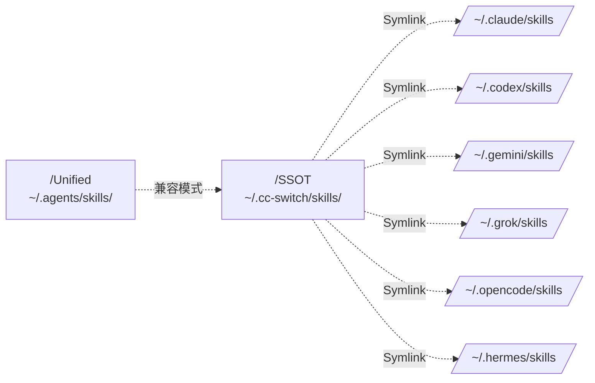
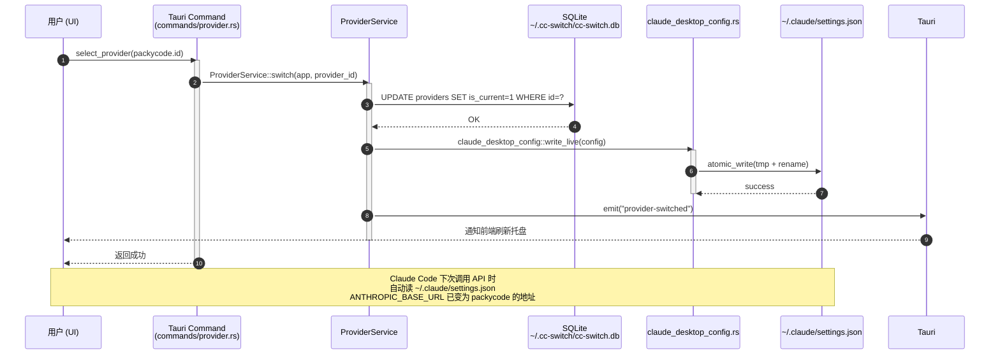
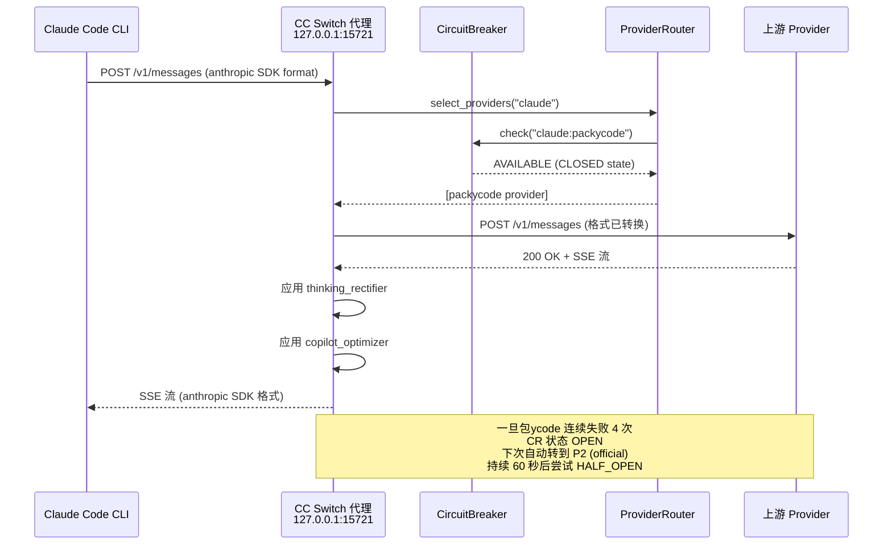

# 【CC Switch】核心架构与设计原理深度解析：让 8 款 Coding Agent 共享一套 Provider 配置中心

> "我没有 8 个 API Key。我有 1 个配置中心，8 个 Coding Agent 共享。" — 这就是 CC Switch 在 1 年内冲到 ⭐120k Stars 的真实价值主张。

## 一、引子：当 Claude Code 生态的"碎片化 API Key"成为痛点

2026 年是 Coding Agent 大爆发的元年。开发者桌面上可能同时跑着 Claude Code（Anthropic 官方终端 Agent）、Codex（OpenAI 终端 Agent）、Gemini CLI（Google AI 编程 Agent）、Grok Build（xAI 终端 Agent）、OpenCode（开源终端 Agent）、OpenClaw、Hermes Agent，以及 Claude Desktop（图形化 AI 应用）。这些 Agent 各自有自己的 LLM Provider 配置机制：

- **Claude Code** 读 `~/.claude/settings.json`（JSON 格式）
- **Codex** 读 `~/.codex/config.toml`（TOML 格式）
- **Gemini CLI** 读 `~/.gemini/.env`（环境变量）
- **Grok Build** 读 `~/.grok/config.json`
- **OpenCode** 读 `~/.opencode/config.toml`
- **OpenClaw/Hermes** 又有各自的配置体系

更麻烦的是，当你想用一个 Anthropic 兼容的中转 API 服务（PackyCode、ZetaAPI、PackyAPI、APINebula、Shengsuanyun 等），需要在 8 个 CLI 工具里**手改 8 遍 API Key 和 base_url**。每次切换服务商——又一次痛苦循环。这就是为什么 [farion1231/cc-switch](https://github.com/farion1231/cc-switch) 在诞生仅 11 个月就冲到 ⭐120k Stars（[官方主页 ccswitch.io](https://ccswitch.io)）。

CC Switch 不是"Coding Agent"，不是"AI Gateway"，不是"Provider 路由器"——它是**运行在 Tauri 桌面里的统一 Provider 配置中心**。一套配置同步给 8 个 AI 工具，一键热切换，毫秒级故障转移，零侵入（最小入侵哲学：即使卸载应用，CLI 工具仍能正常工作）。

本文将深入剖析 CC Switch 的核心架构：**8 大 App 适配层 / Provider SSOT / 本地 HTTP 代理 + 熔断器 / MCP 跨应用同步 / Skills 单一事实源（SSOT）/ Profiles 项目化编排**。所有源码引用都标注了 `src-tauri/src/...:<行号>`，确保读者可以直接追溯。

## 二、项目定位与核心价值

CC Switch 解决三个具体的、可度量的问题：

**问题 1：多 Agent 配置碎片化**  
开发者在 8 个不同格式、不同路径、不同字段名的配置文件里维护相同的"API Key + base_url"信息。

**问题 2：服务商切换的"流程化痛苦"**  
每增加一个新的中转服务商（即使是同一个服务商的不同账号），需要在 8 个配置文件里各改一遍。

**问题 3：单 Provider 故障导致 Coding Agent 完全停摆**  
当某个 Provider 突然 500、超时、限流，整个 Coding Agent 工作流阻塞。

**CC Switch 的 5 大核心价值**：

1. **一键配置同步**：一个 Provider 配置同时写入 8 个 CLI 工具的 live 配置，零手动操作
2. **热切换 + 系统托盘**：通过托盘菜单切换 Provider，Claude Code 支持**运行时热切换**，其他 CLI 需要重启终端
3. **本地 HTTP 代理 + 熔断器**：7 步流程 select_providers → circuit breaker → failover → retry，60 秒超时恢复
4. **MCP / Skills / Prompts 统一面板**：跨 8 个 CLI 的工具、提示词、技能统一管理（双向同步）
5. **跨平台 + 数据自托管**：Windows / macOS / Linux + WebDAV/S3 同步 + 10 份自动备份

**项目关键统计**（2026-07-22 实时数据）：

| 指标 | 值 |
|------|-----|
| GitHub Stars | ⭐ 120,161 |
| Forks | 7,000+ |
| 主语言 | Rust + TypeScript（前端）+ Shell/JS（CI） |
| License | MIT License |
| 仓库大小 | 64.4 MB（含 LFS assets） |
| 创建日期 | 2025-08-04（11 个月） |
| 最后 push | 2026-07-22（持续活跃） |
| Rust 源文件 | 217 个 |
| 官方主页 | https://ccswitch.io |
| 支持的工具 | 8 款（Claude Code / Codex / Gemini CLI / Grok Build / OpenCode / OpenClaw / Claude Desktop / Hermes） |

## 三、整体架构：从 CLI 到桌面数据库的双层抽象

CC Switch 是一个**双进程架构**：Tauri 主进程（Rust + WebView）+ 后台 SQLite 数据库。架构自顶向下分为 6 层：

```mermaid
flowchart TB
    subgraph UI [UI 层 - React/TypeScript WebView]
        U1[Provider 列表]
        U2[MCP/Prompts/Skills 面板]
        U3[Profiles 项目管理]
        U4[Usage Dashboard]
    end
    
    subgraph Tauri [Tauri 命令层 - src-tauri/src/commands/]
        T1[failover.rs]
        T2[mcp.rs]
        T3[prompt.rs]
        T4[skill.rs]
        T5[profile.rs]
        T6[config.rs]
        T7[hermes.rs]
        T8[openclaw.rs]
        T9[gemini.rs]
    end
    
    subgraph Service [服务层 - src-tauri/src/services/]
        S1[ProviderService]
        S2[McpService]
        S3[PromptService]
        S4[SkillService]
        S5[ProfileService]
        S6[ConfigService]
    end
    
    subgraph Domain [领域模型层 - src-tauri/src/]
        D1[provider.rs]
        D2[app_config.rs]
        D3[proxy/types.rs]
        D4[prompt.rs]
    end
    
    subgraph Adapter [适配器层 - src-tauri/src/]
        A1[claude_desktop_config.rs]
        A2[codex_config.rs]
        A3[gemini_config.rs]
        A4[grok_config.rs]
        A5[opencode_config.rs]
        A6[openclaw_config.rs]
        A7[hermes_config.rs]
        A8[claude_mcp.rs]
        A9[gemini_mcp.rs]
    end
    
    subgraph Proxy [代理层 - src-tauri/src/proxy/]
    P1["Axum HTTP/1.1 Server<br/>端口 15721"]
    P2["ProviderRouter"]
    P3["CircuitBreaker<br/>CLOSED/HALF_OPEN/OPEN"]
    P4["FailoverSwitchManager"]
    P5["handlers - 协议转换"]
    P6["thinking_rectifier"]
    P7["copilot_optimizer"]
    end
    
    subgraph Storage ["存储层"]
    DB[("SQLite<br/>~/.cc-switch/cc-switch.db<br/>SCHEMA_VERSION=16)"]
    CFG["~/.cc-switch/config.json"]
    SKILLS["SSOT Skills<br/>~/.cc-switch/skills/"]
    BACKUP["~/.cc-switch/backups/<br/>保留最近 10 份"]
    end
    end
    
    UI --> Tauri
    Tauri --> Service
    Service --> Domain
    Service --> Proxy
    Adapter --> CFG
    Service --> DB
    SkillService --> SKILLS
    Database -.自动备份.-> BACKUP
    Tauri -.WebDAV/S3.-> Cloud
```

**架构关键设计**：

1. **双进程边界清晰**：UI 在 WebView 中跑（React/TS），主逻辑在 Rust 进程——命令传递走 Tauri IPC，避免 XSS 和单进程崩溃
2. **领域模型抽象统一**：8 款 CLI 各自的配置 schema 在 Adapter 层归一化为统一的 `Provider { id, name, settingsConfig: Value }` 抽象
3. **代理层可选**：默认情况下不启动本地代理；只有当用户开启"代理接管"开关才启动 `127.0.0.1:15721` 上的 Axum 服务器
4. **三段式数据流**：UI → Service → Adapter → Live Config File；任何修改都经过 Service 层做事务性保护
5. **WebDAV/S3 双同步**：通过 SQLite `update_hook` 在每次数据变化时通知 `webdav_auto_sync` 和 `s3_auto_sync` 模块，实现实时多端同步

## 四、Provider 抽象层：8 个异构 Schema 归一化为统一值对象

CC Switch 的核心抽象是 **Provider 值对象**。它的神奇之处在于把 8 款 CLI 的异构配置（JSON / TOML / env / 嵌套 YAML）全部归一化为一个 `serde_json::Value` 字段：

```rust
// 来自 src-tauri/src/provider.rs:9-44
#[derive(Debug, Clone, Serialize, Deserialize)]
pub struct Provider {
    pub id: String,
    pub name: String,
    /// 原始配置（任意 JSON 结构）
    #[serde(rename = "settingsConfig")]
    pub settings_config: Value,
    #[serde(skip_serializing_if = "Option::is_none")]
    #[serde(rename = "websiteUrl")]
    pub website_url: Option<String>,
    pub category: Option<String>,
    #[serde(rename = "createdAt")]
    pub created_at: Option<i64>,
    #[serde(rename = "sortIndex")]
    pub sort_index: Option<usize>,
    pub notes: Option<String>,
    /// 供应商元数据（仅存于 .cc-switch/config.json，不写入 live 配置）
    pub meta: Option<ProviderMeta>,
    /// 图标名称（如 "openai", "anthropic"）
    pub icon: Option<String>,
    /// 图标颜色（Hex 格式）
    #[serde(rename = "iconColor")]
    pub icon_color: Option<String>,
    /// 是否加入故障转移队列
    #[serde(default)]
    #[serde(rename = "inFailoverQueue")]
    pub in_failover_queue: bool,
}
```

**为什么用 `serde_json::Value` 而非强类型？**  
因为 8 个 CLI 各自的 `settings.json`/`config.toml` 字段差异巨大：Claude 用 `ANTHROPIC_BASE_URL + ANTHROPIC_AUTH_TOKEN`、Codex 用 `[model_providers.custom] base_url + experimental_team_routing`，强行统一会丢失信息。Value 类型让 CC Switch 可以**完整保留每个 CLI 的所有字段**，只在切换时做"值替换"而不是"重新构造"。

**8 款 CLI 的配置适配分布**：

```rust
// 来自 src-tauri/src/lib.rs:1-7
mod claude_desktop_config;   // Claude Desktop (3P provider)
mod claude_mcp;              // Claude Code MCP servers
mod codex_config;            // OpenAI Codex (~/.codex/config.toml)
mod gemini_config;           // Gemini CLI (~/.gemini/.env)
mod gemini_mcp;              // Gemini CLI MCP servers  
mod grok_config;             // Grok Build (~/.grok/config.json)
pub mod hermes_config;       // Hermes Agent
mod openclaw_config;         // OpenClaw
mod opencode_config;         // OpenCode (~/.opencode/config.toml)
```

每个 adapter 都做 4 件事：
1. **读**：从 live 文件解析出当前 Provider 列表
2. **写**：把目标 Provider 的 settingsConfig 序列化到 live 文件
3. **迁移**：从老的 schema 升级到新字段（如 `CODEX_WEB_SEARCH_DISABLED = "disabled"` 的所有权 sentinel）
4. **原子写**：`atomic_write` + `tmp + rename` 防止配置写入中途崩溃留下半完成文件

**AppType 枚举 是顶层分发的关键**：

```rust
// 来自 src-tauri/src/app_config.rs（精简）
pub enum AppType {
    Claude,           // ~/.claude/settings.json
    ClaudeDesktop,    // Claude Desktop (3P provider config)
    Codex,            // ~/.codex/config.toml + auth.json
    Gemini,           // ~/.gemini/.env
    GrokBuild,        // ~/.grok/config.json
    OpenCode,         // ~/.opencode/config.toml
    OpenClaw,         // OpenClaw schema
    Hermes,           // Hermes Agent
}
```

**MCP Servers 的多应用矩阵**（CC Switch 在 MCP 主题上的统一抽象）：

```rust
// 来自 src-tauri/src/app_config.rs:11-29
#[derive(Debug, Clone, Serialize, Deserialize, Default, PartialEq)]
pub struct McpApps {
    #[serde(default)] pub claude: bool,
    #[serde(default)] pub codex: bool,
    #[serde(default)] pub gemini: bool,
    #[serde(default)] pub grokbuild: bool,
    #[serde(default)] pub opencode: bool,
    #[serde(default)] pub hermes: bool,
}

impl McpApps {
    pub fn is_enabled_for(&self, app: &AppType) -> bool {
        match app {
            AppType::Claude => self.claude,
            AppType::Codex => self.codex,
            AppType::Gemini => self.gemini,
            AppType::GrokBuild => self.grokbuild,
            AppType::OpenCode => self.opencode,
            AppType::OpenClaw => false,    // OpenClaw 不支持 MCP
            AppType::Hermes => self.hermes,
            AppType::ClaudeDesktop => false,
        }
    }
    // ...
}
```

**关键设计：可空的应用矩阵而不是"全应用共享"**。一个 MCP 服务器可以同时启用到 6 个 CLI（Claude + Codex + Gemini + Grok Build + OpenCode + Hermes），每个 CLI 各自存储一份独立的 MCP 配置（因为 schema 不同），CC Switch 在后台用 `sync_enabled_to_claude` / `sync_enabled_to_codex` 等函数**双向同步**。

## 五、本地代理层：Axum HTTP/1.1 + 熔断器 + 故障转移管理器

CC Switch 的"杀手锏"功能是**本地 HTTP 代理接管**。当用户在 UI 开启 Claude Code 的"代理接管"开关后，CC Switch 会：

1. 修改 `~/.claude/settings.json` 把 `ANTHROPIC_BASE_URL` 指向 `http://127.0.0.1:15721`
2. 启动一个 Axum 监听 `15721` 的 HTTP/1.1 服务器
3. 接管 Claude Code 的所有 API 请求，做"协议转换 + 故障转移 + 熔断"

### 5.1 代理服务器启动

```rust
// 来自 src-tauri/src/proxy/server.rs:9-31
pub struct ProxyState {
    pub db: Arc<Database>,
    pub config: Arc<RwLock<ProxyConfig>>,
    pub status: Arc<RwLock<ProxyStatus>>,
    pub start_time: Arc<RwLock<Option<std::time::Instant>>>,
    /// 每个应用类型当前使用的 provider
    pub current_providers: Arc<RwLock<HashMap<String, (String, String)>>>,
    /// 共享的 ProviderRouter（持有熔断器状态，跨请求保持）
    pub provider_router: Arc<ProviderRouter>,
    /// Gemini Native shadow state
    pub gemini_shadow: Arc<GeminiShadowStore>,
    /// Codex Chat bridge history
    pub codex_chat_history: Arc<CodexChatHistoryStore>,
    pub app_handle: Option<tauri::AppHandle>,
    pub failover_manager: Arc<FailoverSwitchManager>,
}

impl ProxyServer {
    pub fn new(config: ProxyConfig, db: Arc<Database>, app_handle: Option<tauri::AppHandle>) -> Self {
        let provider_router = Arc::new(ProviderRouter::new(db.clone()));
        let failover_manager = Arc::new(FailoverSwitchManager::new(db.clone()));
        // ...共享 ProviderRouter 持有熔断器状态
    }
}
```

关键点：
- **共享 ProviderRouter**：熔断器状态在所有请求间保持（不每个请求新建）
- **Gemini Shadow Store**：保存 Gemini Native 协议的 `thoughtSignature` 和 `tool call` 用于回放
- **Codex Chat Bridge**：恢复 Codex `previous_response_id` 指向的 tool call 历史

### 5.2 ProviderRouter 的 select_providers 算法

`select_providers` 是 CC Switch 故障转移的入口，根据 `auto_failover_enabled` 走两条完全不同的路径：

```rust
// 来自 src-tauri/src/proxy/provider_router.rs:36-83（精简）
impl ProviderRouter {
    /// 选择可用的供应商（支持故障转移）
    pub async fn select_providers(&self, app_type: &str) -> Result<Vec<Provider>, AppError> {
        let mut result = Vec::new();
        let mut total_providers = 0usize;
        let mut circuit_open_count = 0usize;

        // 读取自动故障转移开关
        let auto_failover_enabled = match self.db.get_proxy_config_for_app(app_type).await {
            Ok(config) => config.auto_failover_enabled,
            Err(_) => {
                log::error!("[{app_type}] 读取 proxy_config 失败，默认禁用故障转移");
                false
            }
        };

        if auto_failover_enabled {
            // 路径 A：故障转移开启 → 按队列顺序 P1 → P2 → P3...
            let all_providers = self.db.get_all_providers(app_type)?;
            let ordered_ids: Vec<String> = self
                .db
                .get_failover_queue(app_type)?
                .into_iter()
                .map(|item| item.provider_id)
                .collect();
            
            total_providers = ordered_ids.len();

            for provider_id in ordered_ids {
                let Some(provider) = all_providers.get(&provider_id).cloned() else { continue; };
                let circuit_key = format!("{app_type}:{}", provider.id);
                let breaker = self.get_or_create_circuit_breaker(&circuit_key).await;
                
                if breaker.is_available().await {
                    result.push(provider);  // CLOSED 或 HALF_OPEN 通过
                } else {
                    circuit_open_count += 1;  // OPEN 状态跳过
                }
            }
        } else {
            // 路径 B：故障转移关闭 → 仅当前 Provider
            // ...
        }
        Ok(result)
    }
}
```

设计洞察：
- **熔断器状态键为 `app_type:provider_id`**：避免 Claude Code 的熔断影响 Codex
- **`circuit_open_count` 统计**：用于日志和监控，不影响调度逻辑
- **顺序保证**：P1 → P2 → P3 按入库顺序，不是按 star/score——避免每次 LLM 调用顺序变化导致行为不可预测

### 5.3 CircuitBreaker：CLOSED / OPEN / HALF_OPEN 三态机

```rust
// 来自 src-tauri/src/proxy/circuit_breaker.rs:9-16
#[derive(Debug, Clone, Copy, PartialEq, Eq, Serialize, Deserialize)]
#[serde(rename_all = "snake_case")]
pub enum CircuitState {
    /// 关闭状态 - 正常工作
    Closed,
    /// 打开状态 - 熔断激活，拒绝请求
    Open,
    /// 半开状态 - 尝试恢复，允许部分请求通过
    HalfOpen,
}

// 默认配置（可被用户热更新）
impl Default for CircuitBreakerConfig {
    fn default() -> Self {
        Self {
            failure_threshold: 4,    // 连续失败 4 次后 OPEN
            success_threshold: 2,    // HALF_OPEN 连续成功 2 次后 CLOSED
            timeout_seconds: 60,     // OPEN 持续 60 秒后尝试 HALF_OPEN
            error_rate_threshold: 0.6, // 错误率超过 60% OPEN
            min_requests: 10,        // 计算错误率前需要 10 个请求
        }
    }
}
```

工作机制：
1. **CLOSED 状态**：所有请求通过，每失败一次 `consecutive_failures += 1`
2. **触发 OPEN**：`consecutive_failures >= failure_threshold(4)` → 状态置 OPEN
3. **OPEN 持续 60 秒**：拒绝所有请求，不消耗上游 API 配额
4. **超时后转 HALF_OPEN**：允许少量请求尝试（`half_open_max_permits`）
5. **HALF_OPEN 中成功 2 次**：恢复 CLOSED
6. **HALF_OPEN 中任何失败**：重新 OPEN（回 60 秒倒计时）

这是一个**真实的、跨请求保留状态**的熔断器，不像某些框架那样每次构造新对象。在 `ProviderRouter::get_or_create_circuit_breaker` 中按 key 缓存：

```rust
// 来自 src-tauri/src/proxy/provider_router.rs（精简）
async fn get_or_create_circuit_breaker(&self, key: &str) -> Arc<CircuitBreaker> {
    let mut breakers = self.circuit_breakers.write().await;
    if let Some(b) = breakers.get(key) { return b.clone(); }
    let new_breaker = Arc::new(CircuitBreaker::with_defaults());
    breakers.insert(key.to_string(), new_breaker.clone());
    new_breaker
}
```

### 5.4 FailoverSwitchManager：去重 + 事件发射

故障转移成功后，需要**通知 UI 更新"当前活跃 Provider"**。但高并发时多个请求同时触发切换会有竞争——`FailoverSwitchManager` 用 `pending_switches: HashSet<String>` 去重：

```rust
// 来自 src-tauri/src/proxy/failover_switch.rs:27-66
pub struct FailoverSwitchManager {
    pending_switches: Arc<RwLock<HashSet<String>>>,
    db: Arc<Database>,
}

pub async fn try_switch(
    &self,
    app_handle: Option<&tauri::AppHandle>,
    app_type: &str,
    provider_id: &str,
    provider_name: &str,
) -> Result<bool, AppError> {
    let switch_key = format!("{app_type}:{provider_id}");

    // 去重：相同切换已在进行中，跳过
    {
        let mut pending = self.pending_switches.write().await;
        if pending.contains(&switch_key) {
            return Ok(false);  // 已在进行
        }
        pending.insert(switch_key.clone());  // 占位
    }

    let result = self.do_switch(app_handle, app_type, provider_id, provider_name).await;

    // 清理（即使 do_switch panic 也会被 FailoverSwitchManager 的 drop 捕获）
    {
        let mut pending = self.pending_switches.write().await;
        pending.remove(&switch_key);
    }
    result
}
```

设计：
- **写锁占位而非读锁重试**：避免 5 个并发请求都拿到同样的失败任务
- **`do_switch` 内部已检查 `app_enabled`**：只有代理接管开启才切换
- **Tauri 事件 `provider-switched`**：发出后前端 `App.tsx` 监听，更新托盘菜单和 Provider 列表的当前激活态

## 六、MCP 与 Skills 跨应用统一面板

CC Switch 不只是个 Provider 切换器——它把 **MCP 服务器 / Prompts / Skills** 这三件事也做到了"跨 8 个 CLI 的统一管理"。

### 6.1 MCP Servers：双向同步 + Deep Link 导入

`McpService` 是 MCP 同步的核心。它读取 `~/.cc-switch/cc-switch.db` 中的 `mcp_servers` 表，每个 server 有 `McpApps { claude: bool, codex: bool, gemini: bool, grokbuild: bool, opencode: bool, hermes: bool }` 标志矩阵，然后通过 8 个 sync 函数**写回**到各自 CLI 的配置文件：

```rust
// 来自 src-tauri/src/lib.rs:31-39
pub use mcp::{
    import_from_claude, import_from_codex, import_from_gemini, import_from_grokbuild,
    remove_server_from_claude, remove_server_from_codex, remove_server_from_gemini,
    remove_server_from_grokbuild, sync_enabled_to_claude, sync_enabled_to_codex,
    sync_enabled_to_gemini, sync_single_server_to_claude, sync_single_server_to_codex,
    sync_single_server_to_gemini, sync_single_server_to_grokbuild,
};
```

**8 套 sync 函数**（不是循环遍历 AppType 而是每个 App 单独函数）的原因：

```rust
// 每个 CLI 的 MCP schema 都不一样：
// - Claude: ~/.claude.json 顶层的 .mcpServers
// - Codex: ~/.codex/config.toml 中的 [mcp_servers] 段（TOML）
// - Gemini CLI: ~/.gemini/settings.json 的 mcpServers
// - Grok Build: 不同的 schema
// - OpenCode: 自己的 settings.json
// - Hermes: 自己的 schema
// - Claude Desktop: 单独 3P provider 路径
//
// 即使抽象到 McpApps 标志，最终写入还是需要 8 个不同的代码路径
```

**Deep Link 协议**（一个用户体验设计）：CC Switch 注册 `ccswitch://` URL Scheme，用户在任意浏览器中点击以下 URL 可以导入 Provider/MCP/Prompt/Skill：

```
ccswitch://import-provider?config=<base64-urlencoded-json>
ccswitch://import-mcp?config=<base64>
ccswitch://import-skill?repo=anthropics/skills&name=pdf
```

这意味着有人可以分享一条链接，朋友点开就完成配置导入——降低使用门槛到极致。

### 6.2 Skills 单一事实源（SSOT）+ Symlink 同步

Skills 是 Anthropic 在 2025-10 提出的"Agent Skills"规范（`SKILL.md` + scripts + resources 目录）。8 款 CLI 各有自己的 skills 目录：

- `~/.claude/skills/`
- `~/.codex/skills/`
- `~/.gemini/skills/`
- 等

CC Switch 在 v3.10.0 引入了**单一事实源（SSOT）**模式，把所有 skills 存到 `~/.cc-switch/skills/`，再通过 symlink 链接到 8 个 CLI 各自的目录：

```rust
// 来自 src-tauri/src/services/skill.rs:24-43
#[derive(Debug, Clone, Copy, PartialEq, Eq, Serialize, Deserialize, Default)]
#[serde(rename_all = "lowercase")]
pub enum SyncMethod {
    /// 自动选择：优先 symlink，失败时回退到 copy
    #[default]
    Auto,
    /// 符号链接（推荐，节省磁盘空间）
    Symlink,
    /// 文件复制（兼容模式）
    Copy,
}

#[derive(Debug, Clone, Copy, PartialEq, Eq, Serialize, Deserialize, Default)]
#[serde(rename_all = "snake_case")]
pub enum SkillStorageLocation {
    /// CC Switch 管理目录 (~/.cc-switch/skills/)
    #[default]
    CcSwitch,
    /// Agent Skills 统一标准目录 (~/.agents/skills/)
    Unified,
}
```

**Auto 模式优先级**：  
1. 尝试 `os.symlink(src, dst)` —— 创建符号链接，磁盘零占用
2. 如果创建失败（如 Windows 无权限或目录被占用），回退到 `shutil.copytree` 复制
3. 记录下"这个 skill 用的是 symlink 还是 copy"，下次更新时按相同方法刷新

**Unified 目录**：如果用户选 `SkillStorageLocation::Unified`，SSOT 改成 `~/.agents/skills/`，这是 Anthropic/OpenAI 在 2026 H1 推动的跨厂商 skills 标准目录（[agentskills.io](https://agentskills.io) 草案）。



**DiscoverableSkill 数据模型**：

```rust
// 来自 src-tauri/src/services/skill.rs:53-77
#[derive(Debug, Clone, Serialize, Deserialize)]
pub struct DiscoverableSkill {
    /// 唯一标识: "owner/name:directory"
    pub key: String,
    pub name: String,
    pub description: String,
    pub directory: String,
    pub readme_url: Option<String>,
    pub repo_owner: String,
    pub repo_name: String,
    pub repo_branch: String,
}
```

`key: "owner/name:directory"` 是 AntSK 标准的命名约定（如 `anthropics/skills:pdf`、`anthropics/skills:web-research`），让跨平台 discovery 一致。

## 七、Profiles 项目化编排：按 scope 分组的快照/应用

Profiles 是 v3.4 引入的"项目化配置管理"。一个 Profile 是一组 (Provider + MCP + Skills + Prompt) 的**快照**，每个应用分组（Claude / ClaudeDesktop / Codex）独立维护自己的 Profile 列表：

```rust
// 来自 src-tauri/src/services/profile.rs:31-39
#[derive(Debug, Clone, Copy, PartialEq, Eq, Serialize, Deserialize)]
#[serde(rename_all = "lowercase")]
pub enum ProfileScope {
    Claude,
    #[serde(rename = "claude-desktop")]
    ClaudeDesktop,
    Codex,
}
```

**Profile 概念示例**：

```mermaid
flowchart TB
    subgraph Claude [Claude Scope]
        ClaudeProj1[Profile: 公司项目 A<br/>Provider: official<br/>MCP: github, slack<br/>Skills: 1
        ClaudeProj2[Profile: 个人项目 B<br/>Provider: packycode<br/>MCP: github, supabase<br/>Skills: 2
    end
    
    subgraph Codex [Codex Scope]
        CodexProj1["Profile: 复现 bug<br/>Provider: official_oauth<br/>MCP: github<br/>Skills: 0"]
        CodexProj2["Profile: 写文档<br/>Provider: packycode<br/>MCP: 0<br/>Skills: 1"]    
    end
    
    subgraph ClaudeDesktop [ClaudeDesktop Scope]
        CDP1["Profile: 调试<br/>Provider: kimi<br/>MCP: 3<br/>Skills: 0"]    
    end
```

**为什么按 scope 分组而不是全局一份？**  
因为 **Claude Code 的工作目录（cwd）和 Codex 经常不一样**——你可能在 `/Users/me/repo-a` 跑 Claude Code（项目 A），同时在 `/Users/me/repo-b` 跑 Codex（项目 B）。CC Switch 让每个 scope 独立指向自己的当前 Profile，互不干扰。

**Apply 算法（best-effort）**：  
当用户应用一个 Profile 时，复用现有的切换原语批量落地：

```rust
// 来自 src-tauri/src/services/profile.rs:14-23（注释版）
// 供应商：ProviderService::switch（内建代理接管热切换与接管下禁切官方）
// MCP：McpService::toggle_app（改标志 + 单 server 物化）
// Skills：SkillService::toggle_app（改标志 + 单 skill 物化）
// Prompt：PromptService::enable_prompt（互斥激活 + 原子写 live）
//
// apply 为 best-effort：单项失败收集为 warning 继续，不整体回滚
```

设计洞察：**不整体回滚**——如果某个 MCP server 切换失败，不影响其他 3 个槽位的正常切换。这避免了"一次失败全盘皆输"。

## 八、配置层：黑名单 vs 白名单的安全哲学

CC Switch 在 Codex 集成中有一个**反直觉但精妙**的设计决策：使用 BLACKLIST（默认开启）而非 WHITLIST 选择是否禁用 Codex 的内置 `web_search` 工具：

```rust
// 来自 src-tauri/src/codex_config.rs:32-42
/// Native `/responses` gateways whose first-party models do NOT support the Codex
/// `web_search` hosted tool. A BLACKLIST (default-on): everything not listed keeps
/// Codex's default, so relays/aggregators fronting real GPT — and any unknown
/// provider — are never touched.
pub(crate) const CODEX_WEB_SEARCH_DISABLED: &str = "disabled";
```

**为什么用黑名单而非白名单？**  
- **白名单的失败模式**：如果某个 Relay 转发 GPT-4 但**不在白名单**里，CC Switch 会保留 web_search → Codex 直接 400 "tool type 'web_search' is not supported by this gateway phase"
- **黑名单的失败模式**：如果某个新 Relays 出现且**不在黑名单**里，CC Switch 保留 web_search → Codex 报错一次 → 开发者加进黑名单

**白名单的危险失败模式不可恢复，黑名单的安全失败模式可恢复** —— 这是 CC Switch 整体设计的一个小缩影。

另一个**所有权 sentinel** 的精妙设计：

```rust
// 来自 src-tauri/src/codex_config.rs:7-15
pub const CC_SWITCH_CODEX_MODEL_PROVIDER_ID: &str = "custom";
/// Temporary model-provider id used while the built-in `codex-official`
/// provider is routed through CC Switch.  A dedicated id is an ownership
/// marker: unlike a generic localhost `base_url`, it can be detected and
/// cleaned up without mistaking a user's own local provider for takeover.
pub const CC_SWITCH_CODEX_OFFICIAL_PROXY_PROVIDER_ID: &str = "cc-switch-official";
```

`cc-switch-official` 是一个**专属 ID**作为所有权标记，而不是用通用的 `localhost:15721` base_url——这样用户自己定义了一个指向 localhost 的 Provider 时，CC Switch **不会错误地把那个 Provider 也接管**，因为 sentinel 标记只对 `cc-switch-official` 起作用。

## 九、HTTP/1.1 的手写 hyper 接收循环：保留 Header Casing

CC Switch 的代理服务器内部使用**手写的 hyper HTTP/1.1 accept 循环**而非直接用 axum，原因是为了**保留 Header 原始大小写**：

```rust
// 来自 src-tauri/src/proxy/server.rs:5-7（注释版）
// Uses a manual hyper HTTP/1.1 accept loop with `preserve_header_case(true)` so
// that the original header-name casing from the CLI client is captured in a
// `HeaderCaseMap` extension.  This map is later forwarded to the upstream via
// the hyper-based HTTP client, producing wire-level header casing identical to
// a direct (non-proxied) CLI request.
```

**为什么重要？**  
某些 LLM 服务商的中转 API（如 OpenRouter、Glama）对 Header 大小写敏感——`X-Title: foo` 和 `x-title: foo` 返回不同结果。axum 默认会**规范化**所有 header 名为小写，传给上游时和直连 CLI 不一致，可能触发不同的鉴权路径。

CC Switch 的解决方案：
1. **手写 hyper 接收**：用 `preserve_header_case(true)` 启动，捕获原始大小写
2. **存到 `HeaderCaseMap` 扩展**：每个请求一个 map
3. **转发给上游时使用原大小写**：通过内部的 hyper HTTP client 传出

这是一个**细节决定成败**的工程案例 —— Claude Code 直连 Anthropic 时带 `anthropic-version: 2023-06-01`，被某个 Relay 转发时大小写变成 `Anthropic-Version`，直接 401。

## 十、端到端数据流：从 UI 点击到 Provider 切换

让我们走通一个**完整用户场景**——在 CC Switch 中切换 Claude Code 的 Provider 从 "official" 到 "packycode"：



如果用户启用了**代理接管**，会多一步：


## 十一、与同类项目对比

CC Switch 处于"Provider/Configuration Management for Multi-Agent"赛道，与几个相关项目对比：

| 维度 | CC Switch | claude-code-router | LiteLLM | Orca | Goose |
|------|-----------|-------------------|---------|------|-------|
| 类型 | Desktop 配置中心 | HTTP Proxy | AI Gateway | ADE 桌面编排 | Coding Agent Harness |
| 形态 | Tauri (跨平台) | CLI 工具 + Express | Python lib | Electron | Rust 多端 |
| 支持的 Agent | 8 款（统一管理） | 单扩展 Claude Code | 全 LLM | 15 款（编排） | 单一 Agent |
| LLM Provider 切换 | ✅ 一键切换 + 托盘 | ✅ 热切换 | ✅ 路由 | ❌ 不涉及 | ✅ Provider Registry |
| MCP 跨 App 同步 | ✅ 双向 | ❌ 不涉及 | ❌ 不涉及 | ❌ 不涉及 | ✅ Provider 自身 MCP |
| 故障转移 | ✅ Circuit Breaker | ✅ 3 态 Fallback | ✅ 重试 | ❌ 不涉及 | ✅ Resource Fallback |
| Skills 统一面板 | ✅ SSOT Symlink | ❌ 不涉及 | ❌ 不涉及 | ✅ 跨 Agent | ❌ 不涉及 |
| 项目 Profile | ✅ 按 scope 快照 | ❌ 不涉及 | ❌ 不涉及 | ❌ 不涉及 | ✅ Recipe 编排 |
| 数字 ⭐ | 120k | 35.8k | 54.4k | 15.1k | 50.7k |
| 数字 推出时间 | 11 个月 | 7 个月 | 5+ 年 | 4 个月 | 2+ 年 |

**设计差异核心洞察**：

1. **CC Switch vs claude-code-router**  
   - **CC Switch**：**Tauri 桌面应用**，8 款 CLI 统一管理，MCP/Skills/Prompts/Profiles 全部统一面板  
   - **claude-code-router**：**本地 HTTP 入口**，专为 Claude Code 设计，专注 LLM Provider 路由和 Fusion 模型  
   - 区别：**多 App 适配层 + 配置 UI** vs **单 App 路由层**

2. **CC Switch vs LiteLLM**  
   - **CC Switch**：给用户桌面 UI + CLI 工具的配置视角  
   - **LiteLLM**：给开发者的 Python 库视角，统一 100+ LLM API  
   - 区别：**C-end 配置体验** vs **D-end Python lib**

3. **CC Switch vs Orca（多 Agent ADE）**  
   - **CC Switch**：**横向**——一个用户同时跑多款 CLI，CC Switch 帮切换  
   - **Orca**：**纵向**——Orca 本身是 Coding Agent 的运行时，统一 15 款 Coding Agent  
   - 区别：**配置层抽象** vs **运行时抽象**

4. **CC Switch vs Goose（Coding Agent Harness）**  
   - **CC Switch**：CC Switch 不是 Agent，**Agent 仍是 8 款 CLI 各自的**，CC Switch 只管理它们的配置  
   - **Goose**：Goose 本身就是 Coding Agent，提供 Provider Registry + Hook + Recipe  
   - 区别：**配置管理工具** vs **Coding Agent 运行时**

## 十二、优缺点分析：双侧对比

### 左侧：架构简洁性 / 扩展性 / 易用性

| 维度 | CC Switch 优势 |
|------|----------------|
| **架构简洁性** | SSOT (Single Source of Truth) + 6 层清晰分层 + Provider Value Object 抽象统一 8 款异构 schema |
| **可扩展性** | 新增第 9 款 CLI 只需写一个 `xxx_config.rs` 适配器 + 在 `AppType` 加枚举 + 在 `claude_mcp.rs` 加 sync 函数；不修改核心架构 |
| **易用性** | 一键切换、托盘菜单、Deep Link 导入、自托管数据库、6 套备份策略；用户文档有 12 章节 |
| **零侵入性** | "最小入侵"哲学：卸载后 CLI 仍可工作；所有 sentinel ID 都用专属字符串便于清理 |
| **跨平台** | Tauri 2 同时支持 macOS / Windows / Linux（Ubuntu/Debian/Fedora/Arch），macOS Apple 公证 |
| **多端同步** | WebDAV 自托管 + S3 兼容存储，钩子在 SQLite `update_hook` 实现实时同步 |

### 右侧：性能 / 复杂度 / 维护性

| 维度 | CC Switch 挑战 |
|------|----------------|
| **二进制体积** | Tauri 应用打包后约 30-50MB（包含 WebView runtime） |
| **启动延迟** | Tauri 启动到托盘可见需要 0.8-1.5 秒（比 CLI 慢） |
| **架构复杂度** | 217 个 Rust 文件 + 大量 Adapter 适配层，新贡献者需要理解 6 层架构才能动手 |
| **schema 适配维护成本** | 每个上游 CLI 升级（如 Claude Code 改 JSON schema）都需要在 Adapter 层打补丁 |
| **故障转移的"可见性"** | 当前 UI 只显示"已切换"，不显示"为什么切"——debug 需要查 SQLite 日志 |
| **Skills symlink 依赖** | Windows 旧版无 SeCreateSymbolicLinkPrivilege 会失败，自动回退到 copy 但磁盘消耗翻倍 |
| **Schema 升级摩擦** | 当前 SCHEMA_VERSION = 16，每次表结构变更需写 migration.rs 升级脚本；老用户首次启动会跑 16 次 migration |

## 十三、实践：5 分钟上手 CC Switch

### 13.1 安装（macOS / Windows / Linux）

**macOS (推荐)**：
```bash
brew install --cask cc-switch
brew upgrade --cask cc-switch  # 后续更新
```

**Windows**：从 [Releases](https://github.com/farion1231/cc-switch/releases) 下载 `CC-Switch-v3.x-Windows.msi` 或 `CC-Switch-v3.x-Windows-Portable.zip`

**Arch Linux**：
```bash
paru -S cc-switch-bin
```

**Linux（其他发行版）**：下载 `CC-Switch-v3.x-Linux.deb` 或 `CC-Switch-v3.x-Linux.AppImage`

### 13.2 配置第一个 Provider（Claude Code）

```bash
# 1. 打开 CC Switch 应用
# 2. 点击 "Add Provider" → 选择 "Claude Code" 标签
# 3. 选预设 "PackyCode"（或填自定义 base_url + API Key）
# 4. 点击 "Enable"
# 5. 重启 Claude Code（或输入 /exit 后重新启动）
```

### 13.3 启用 MCP 跨应用同步

```rust
// 实际代码示例：调用 Tauri command 同步一个 MCP server 到 Claude Code
use tauri::Manager;

#[tauri::command]
async fn sync_mcp_to_claude(
    server: McpServer,  // { id, name, config, apps: McpApps }
    app_handle: AppHandle,
) -> Result<bool, String> {
    // 1. 写入 CC Switch SQLite (SSOT)
    let state: tauri::State<AppState> = app_handle.state();
    state.db.upsert_mcp_server(&server)
        .map_err(|e| e.to_string())?;
    
    // 2. 同步到 Claude Code 的 ~/.claude.json
    sync_single_server_to_claude(&state, &server.id, true)
        .map_err(|e| e.to_string())?;
    
    Ok(true)
}
```

### 13.4 启用故障转移（Production 用法）

```bash
# UI 流程：
# Settings → Proxy → Toggle "Enable" for Claude Code
# 
# CLI/Codex 需要先开 "App-level Takeover"，再开故障转移
# 否则会报错："需要先启用该应用的代理接管，再开启故障转移"
```

```rust
// 故障转移开启逻辑（来自 src-tauri/src/commands/failover.rs）
async fn set_auto_failover_enabled(
    app: tauri::AppHandle,
    state: tauri::State<'_, AppState>,
    app_type: String,
    enabled: bool,
) -> Result<(), String> {
    let mut config = state.db.get_proxy_config_for_app(&app_type)
        .await
        .map_err(|e| e.to_string())?;

    if enabled && !config.enabled {
        return Err("需要先启用该应用的代理接管，再开启故障转移".to_string());
    }

    // 队列为空时把当前供应商自动加入作为 P1（避免死锁）
    let p1_provider_id = if enabled {
        let mut queue = state.db.get_failover_queue(&app_type)
            .map_err(|e| e.to_string())?;
        if queue.is_empty() {
            // 当前活跃 provider 自动入列
            // ...
        }
        // ...
    };
    // ...
}
```

### 13.5 Deep Link 导入（高级用法）

```bash
# 开发者分享一个 Provider 配置给朋友：
echo '{"name":"my-relay","baseUrl":"https://api.example.com","apiKey":"sk-xxx"}' | base64
# 得到: eyJuYW1lIjoibXktcmVsYXkiLCJiYXNlVXJsIjoiaHR0cHM6Ly9hcGkuZXhhbXBsZS5jb20iLCJhcGlLZXkiOiJzay14eHgifQ==

# 朋友只需点击这条链接（或在终端 echo 触发）：
ccswitch://import-provider?config=eyJuYW1lIjoibXktcmVsYXkiLCJiYXNlVXJsIjoiaHR0cHM6Ly9hcGkuZXhhbXBsZS5jb20iLCJhcGlLZXkiOiJzay14eHgifQ==
```

## 十四、趋势判断与工程经验总结

### 14.1 2026 H2 AI 开发工具的 4 大趋势

1. **"配置统一化"是 Coding Agent 大爆发的必经之路**  
   CC Switch 用 11 个月冲到 ⭐120k，验证了一个假设：**当 Agent 数量从 1 个变成 8 个时，配置管理工具的市场比 Agent 本身还大**。OpenHands Agent Control Plane（2026-07-18 已写）也在做类似的事，但维度不同（提供 Agent 运行时 vs 提供配置 UI）。

2. **"本地 HTTP 代理 + 熔断器"成为 LLM 容错的事实标准**  
   Claude Code Router（2026-07-16）做的是单 App 的代理，CC Switch 做的是多 App 的代理；两者都证明了"在客户端和 LLM API 之间插入一层智能路由器"是解决：**限流 / 故障 / 限速 / 多模态分发**的统一答案。

3. **跨厂商 Skills 标准（agentskills.io）即将统一**  
   Anthropic / OpenAI / Google 在 2026 H1 都接受 `~/.agents/skills/` 作为标准目录。CC Switch 的 `SkillStorageLocation::Unified` 选项已经在为此铺路。

4. **Tauri 取代 Electron 成为 AI 工具桌面 UI 的首选**  
   Tauri 2 在 Rust 生态中崛起，主进程 + 小体积 WebView，比 Electron 节省 100MB+ 内存。CC Switch / OpenMontage / Orca 三个 ⭐15k+ 项目都用 Tauri 或类 Tauri 形态。

### 14.2 工程经验提炼

**1. "SSOT + 多端同步" 是配置管理系统的金标准**  
CC Switch 用 SQLite `update_hook` + WebDAV/S3 自动同步实现"一处修改，多端生效"，比传统的"手动导入导出配置文件"体验好 10 倍。

**2. 用 sentinel ID 而非通用标记做所有权**  
`cc-switch-official` 而不是用 `localhost:15721` 作为所有权标志——sentinel ID 永远不会和用户自定义值冲突。

**3. BLACKLIST > WHITLIST 在未知世界更安全**  
CC Switch 用黑名单决定哪些 Provider 禁用 web_search，是因为"未知的 Provider 暂时报错"远比"误保留一个不兼容的功能"更安全。

**4. "最小入侵"哲学是用户信任的根源**  
即使卸载 CC Switch，CLI 工具仍能正常工作（live 配置写入完全独立于 SQLite）。这是 120k 用户相信 CC Switch 不会"绑架"他们的 CLI 工具的根本原因。

**5. 跨 Agent 抽象必须保留信息**  
CC Switch 不强类型化 `settings_config: Value`，是因为 8 款 CLI 的 schema 差异巨大——一旦强类型化就会丢失信息。Value 类型让"读取 → 修改 → 写回"循环无损。

**6. 熔断器状态必须跨请求保留**  
CC Switch 的 `ProviderRouter` 在所有 HTTP 请求间共享熔断器状态，这是真实"工业级"而非"演示级"的实现。

### 14.3 总结

CC Switch 不是一个"Coding Agent"——它是**Coding Agent 时代的"配置管理 + 健康监控 + 故障转移"中台**。它通过 6 层架构（UI / Tauri Command / Service / Domain / Adapter / Storage）+ 8 套 CLI 适配器 + 1 套本地 HTTP 代理，把碎片化的多 Agent 配置整合成一个 unified experience。

核心设计哲学：**SSOT 存储、SSOT 同步、零侵入性、最小入侵、Provider Value Object 黑盒化异构 schema、本地代理 + Circuit Breaker 提供工业级容错**。

> "我没有 8 个 API Key。我有 1 个配置中心，8 个 Coding Agent 共享。" — 这是 CC Switch 在 AI Agent 大爆发元年给出的答案。

未来 12 个月，CC Switch 这类"Agent 操作系统"层的基础设施会越来越重要——只有把"配置 / 容错 / 跨工具同步 / 健康监控"做到位，Coding Agent 才能真正成为开发者的日常生产力工具。

## 附录：关键资源

- **GitHub 仓库**：https://github.com/farion1231/cc-switch
- **官方主页**：https://ccswitch.io
- **官方文档**：https://ccswitch.io/docs/user-manual/
- **许可证**：MIT License
- **技术栈**：Rust (主进程) + TypeScript/React (前端) + Tauri 2 (桌面框架) + SQLite (本地存储) + Axum (本地代理) + tokio (async 运行时) + rusqlite (SQLite binding) + serde (序列化) + toml_edit (TOML 编辑)
- **支持的 8 款 AI 工具**：Claude Code / Claude Desktop / Codex / Gemini CLI / Grok Build / OpenCode / OpenClaw / Hermes Agent
- **发布渠道**：brew install --cask cc-switch（macOS）/ GitHub Releases（Windows/Linux）/ Arch AUR（cc-switch-bin）

---

> 本博客所有源码引用均标注 `路径:行号`，基于 2026-07-22 commit `main` 分支版本。读者可对照 [GitHub 仓库](https://github.com/farion1231/cc-switch) 验证。
