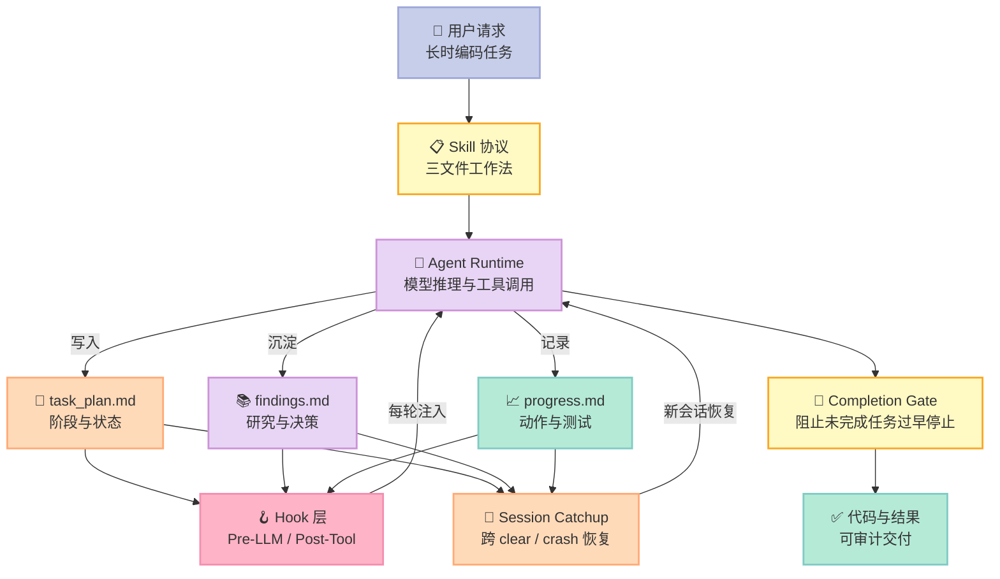
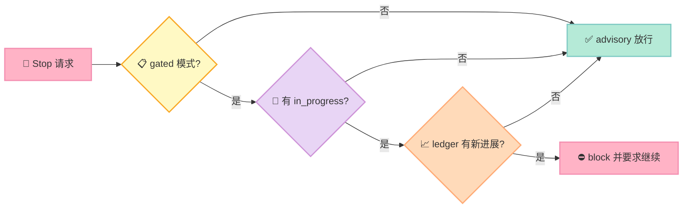

> **Agent 最危险的故障，不是答错，而是“忘了自己已经做过什么”。**
>
> OthmanAdi/planning-with-files 的答案很朴素：不要把任务进度只放在上下文窗口里，把它写进三个普通 Markdown 文件，再用 Hook 在每一轮重新注入。

## 摘要：它把哪一件事做对了？

[Planning with Files](https://github.com/OthmanAdi/planning-with-files) 是一个面向 Coding Agent 和长时任务的文件式规划 Skill。仓库在 2026-07-23 查询到约 **2.56 万 Star**，最近提交于 2026-07-21，MIT 协议；README 宣称覆盖 60+ Agent，并提供 301 个测试用例、96.7% 的内部评测通过率和 3/3 的盲 A/B 胜出结果。后两项是项目维护者自报数据，不能等同于独立基准，但足以说明它把“上下文丢失”当成了可测试的工程问题。

它在 Harness 六件套中的位置不是一个新的模型或 Agent，而是 **Skill + Hook + Script 的组合**：

- **Skill**：规定三文件工作法，以及何时创建、更新、恢复它们。
- **Hook**：在每轮调用前重新注入计划，在写文件后提醒 Agent 更新进度。
- **Script**：执行 session catchup、完成门禁、路径解析和跨 IDE 适配。

核心判断：**Planning with Files 不试图让模型“更聪明”，而是让模型忘记时仍能从磁盘恢复。**

## 一、为什么上下文窗口不是工作记忆

把上下文窗口看成 RAM，把项目文件看成磁盘，会更容易理解这个设计。

RAM 速度快，但会被清空；磁盘慢一点，却可以跨进程、跨崩溃保留。Coding Agent 进行 50 次工具调用后，最先被挤出上下文的往往不是当前句子，而是“为什么做这件事、已经试过哪些方案、下一步是什么”。

项目 README 给出一个具体对比：其内部恢复评测中，带规划文件的新会话平均 **5.0 个回合**恢复工作，原始 Agent 平均 **13.3 个回合**。这是维护者自测，不是公开可复现实验，但它准确指向了指标：恢复成本可以用回合数衡量。

## 二、三文件协议：把模糊记忆拆成三种事实

| 文件 | 保存什么 | 为什么单独保存 |
|---|---|---|
| `task_plan.md` | 阶段、勾选项、当前状态 | 它是“下一步做什么”的唯一入口 |
| `findings.md` | 调研结果、决策、踩坑 | 它避免重复阅读和重复试错 |
| `progress.md` | 会话日志、测试结果、最近动作 | 它回答“刚才到底发生了什么” |

这个切分不是数据库式的复杂 Schema，而是三个任何 Agent 都能读写的 Markdown 文件。项目还支持并行计划：`.planning/YYYY-MM-DD-slug/` 保存隔离目录，`.active_plan` 指向当前计划。

### 架构图：Harness 如何把文件重新送回上下文



## 三、机制与策略：项目为什么没有把所有东西写死

### 3.1 核心机制：上下文注入

在 Hermes 插件实现中，`pre_llm_call` 首先检查项目目录是否存在 `task_plan.md`。存在时，它读取计划头部、`progress.md` 尾部，并提醒 Agent 查看 `findings.md`。这是一条**机制**：在调用模型前，把持久状态变成上下文。

“读取多少行”“当前 Agent 用什么格式”“是否显示提醒”属于**策略**。源码把读取函数、路径规范化和提醒状态拆成独立模块，便于不同宿主适配。

下面的可运行示例复刻了核心协议，不需要 LLM、第三方库或网络：

```python
from pathlib import Path
from tempfile import TemporaryDirectory


def build_context(project: Path, head_lines: int = 20, tail_lines: int = 8) -> str:
    plan = project / "task_plan.md"
    if not plan.exists():
        return ""

    parts = ["[planning-with-files] ACTIVE PLAN — current state:"]
    lines = plan.read_text(encoding="utf-8").splitlines()
    parts.append("\\n".join(lines[:head_lines]))

    progress = project / "progress.md"
    if progress.exists():
        recent = progress.read_text(encoding="utf-8").splitlines()[-tail_lines:]
        parts += ["=== recent progress ===", "\\n".join(recent)]

    if (project / "findings.md").exists():
        parts.append("Read findings.md for research context.")
    return "\\n\\n".join(parts)


with TemporaryDirectory() as raw:
    root = Path(raw)
    (root / "task_plan.md").write_text(
        "# Task Plan\\n### Phase 1: Tests\\n- **Status:** in_progress\\n",
        encoding="utf-8",
    )
    (root / "progress.md").write_text(
        "# Progress\\n- reproduced bug\\n- wrote regression test\\n",
        encoding="utf-8",
    )
    (root / "findings.md").write_text("- SQLite is not needed for the MVP\\n", encoding="utf-8")
    print(build_context(root))
```

运行方式：

```bash
python3 planning_context.py
```

### 3.2 Post-Tool 提醒：把“应该记录”变成半自动约束

源码的 `post_tool_call` 只关心 `write_file` 和 `patch`。工具调用成功后，它不替 Agent 修改业务文件，而是登记一条提醒：更新 `progress.md`，如果阶段完成则更新 `task_plan.md`。

这个边界非常重要：**Hook 负责提醒，模型负责总结，文件负责持久化。** 如果 Hook 自己猜测业务进度，就会把错误判断写入长期状态。

### 3.3 Completion Gate：不是“检测到未完成就永远阻止”

项目的门禁测试展示了一个更成熟的决策表。只有以下条件同时成立才阻止 Stop：

1. 计划处于 gated 模式；
2. 存在 `in_progress` 阶段；
3. 当前不是一次已经被强制续行的 Stop Hook；
4. 阻止次数没有达到上限；
5. 自上次阻止后确实出现了新的 ledger 进展。

其中第 5 条是关键。没有“进展”的无限阻止会把 Agent 变成死循环，所以源码把**阻止**和**停滞放行**同时纳入测试。



## 四、Session Catchup：恢复不是重新开始，而是寻找断点

`session-catchup.py` 的思路不是把所有历史对话塞回上下文，而是：

1. 找出各 IDE 的会话存储；
2. 扫描 `task_plan.md`、`findings.md`、`progress.md` 的最近更新；
3. 从计划更新时间之后提取相关对话和工具动作；
4. 生成一个精简的 catchup 报告。

源码同时处理 Claude Code 的 JSONL 会话与 OpenCode 的存储布局，还对 Windows 路径做了独立归一化。这说明“跨 Agent 兼容”真正难的不是复制一个 SKILL.md，而是**适配不同宿主的生命周期和历史格式**。

Less is More 的判断也在这里出现：模型可以自己学习“总结”，但它无法凭空读取一个已经被宿主删掉的上下文；文件系统、Hook 生命周期和会话解析属于外部世界，必须由 Harness 提供。

## 五、横向对比：三个项目，三种可靠性抽象

| 维度 | Planning with Files | Microsoft Agent Framework | Trigger.dev |
|---|---|---|---|
| 核心抽象 | 三个 Markdown 文件 + Hook | Agent / Workflow / Middleware | Durable Task / Queue / Run |
| 状态来源 | 项目目录，Git 可审计 | 框架状态与 Checkpoint | 平台数据库与运行时 |
| 恢复目标 | 上下文 clear、压缩、崩溃后的认知恢复 | 工作流重启、人工介入、时间旅行 | 长任务重试、排队、弹性执行 |
| 适配方式 | 60+ Agent Skills 与宿主 Hook | Python + .NET，一套框架 API | TypeScript SDK + 云/自托管运行时 |
| 设计取舍 | 极简、可移植，状态语义较弱 | 抽象完整，学习成本更高 | 运行能力强，但引入平台依赖 |

### 5.1 与 Microsoft Agent Framework 的差异：文件协议 vs 工作流协议

[Microsoft Agent Framework](https://github.com/microsoft/agent-framework) 约 1.23 万 Star，支持 Python 和 .NET，提供顺序、并发、handoff、group collaboration、checkpoint、OpenTelemetry、Agent Skills 等能力。它的核心问题是“如何编排和运行生产级 Agent 系统”；Planning with Files 的核心问题是“上下文没了以后，单个 Agent 如何知道自己做到哪”。

前者以对象和工作流图表达状态，适合服务化部署；后者以 Markdown 表达状态，适合跨工具迁移。**一个把状态变成运行时协议，一个把状态变成团队可读的文件协议。**

### 5.2 与 Trigger.dev 的差异：认知恢复 vs 计算恢复

[Trigger.dev](https://github.com/triggerdotdev/trigger.dev) 把 Agent 放进可持久任务：无超时、重试、队列、幂等、Checkpoint、实时订阅和完整追踪。它解决的是“任务进程挂了，如何从基础设施层继续跑”。

Planning with Files 解决的是更上层的“模型下一轮是否还能理解任务”。如果把 Agent 比作施工队：Trigger.dev 负责让工地不断电、机器能重启；Planning with Files 负责把施工图、材料清单和交接记录留在现场。

### 5.3 与传统 Agent 框架的差异：不要把长期状态等同于 Memory

传统对话 Memory 通常保存用户偏好、历史消息或语义向量；Planning with Files 保存的是**当前任务的控制状态**：未完成阶段、研究结论、测试结果和下一步动作。它不是为了回答“用户上次喜欢什么”，而是为了回答“这次重启后先做哪一个测试”。

这是一种很实用的边界：任务状态不一定需要 embedding、向量库或复杂检索；一个可读、可 diff 的 Markdown 文件反而更便于审查。

## 六、优缺点：左侧的轻量，右侧的代价

| 架构简洁性 / 扩展性 / 易用性 | 性能 / 复杂度 / 维护性 |
|---|---|
| ✅ 三文件协议几乎没有部署成本，用户能直接打开修改 | ⚠️ 每轮注入文本会消耗上下文 token，文件变大后会影响延迟与费用 |
| ✅ MIT 协议、纯文本状态天然适合 Git diff、审查和迁移 | ⚠️ Markdown 状态缺少强 Schema，格式写错可能让门禁误判 |
| ✅ Agent Skills 标准让同一套 Skill 可跨 60+ 宿主安装 | ⚠️ 真正可靠的 Hook 仍需逐个适配 Claude Code、Codex、Pi、OpenCode 等生命周期 |
| ✅ Hook 与策略分离：提醒不替模型做业务判断 | ⚠️ 过多提醒会形成“提示噪音”，Hook 也可能被宿主配置静默掉 |
| ✅ Gate 有 cap 和 stall 保护，避免无限阻止 | ⚠️ 门禁只保证“状态上有进展”，不能证明代码本身正确 |

我的结论是：**它非常适合作为单机 Agent 的第一层耐久性，不适合单独承担生产级分布式执行。** 需要跨机器、队列、重试和精确幂等时，应叠加 Durable Workflow 或任务平台，而不是把 Markdown 继续扩展成数据库。

## 七、从零搭建：一个下午能完成的 MVP

### 必须组件

1. 三个文件：`task_plan.md`、`findings.md`、`progress.md`；
2. 每轮开始读取计划头部和进度尾部；
3. 写文件后发送更新提醒；
4. 一个显式的 Stop 检查器；
5. 一个最小测试集，验证“无计划静默、有计划注入、停滞可放行”。

### 可以暂时省略

- 多语言 Skill 包；
- 全部 IDE 的适配器；
- 对话历史 catchup；
- 并行计划目录；
- 分布式数据库和向量检索。

### 15 行可运行的完成检查器

```python
from pathlib import Path
import re

plan = Path("task_plan.md")
if not plan.exists():
    print("advisory: no plan")
    raise SystemExit(0)

text = plan.read_text(encoding="utf-8")
active = bool(re.search(r"Status:\s*in_progress", text, re.I))
if active:
    print("block: finish the in_progress phase")
else:
    print("allow: no active phase")
```

这段代码故意不做模型判断，也不执行工具。它只提供一个可测试的机械信号。下一步再把它接到目标 Agent 的 Stop Hook，而不是一开始就建设完整控制平面。

### 集成踩坑预警

- **计划文件注入过大**：只读头部和尾部，完整历史放在磁盘；
- **写入提醒不等于写入成功**：要在测试中覆盖工具失败、用户取消和并发写；
- **状态竞争**：并行 Agent 不能共享同一个 `progress.md`，应使用隔离目录或追加锁；
- **门禁死循环**：必须记录 block 次数，并检测 ledger 是否真的前进；
- **宿主差异**：同一 Hook 在 Codex、Claude Code、OpenCode 的输入输出协议不同；
- **不要把 Markdown 当事务数据库**：需要强一致的任务状态时，升级为专门的 durable runtime。

## 八、Harness Maturity Model：它处于哪一级？


Planning with Files 覆盖 L2 到 L4：它先把状态落盘，再通过 Hook 自动带回上下文，最后用 completion gate 约束过早停止。它没有试图成为 L5 的队列和分布式运行平台，这种克制正是它的价值。

## 结论：先把状态写下来，再谈更大的 Agent

Planning with Files 最值得借鉴的不是“三个文件”本身，而是一个工程判断：**凡是模型可能忘记、而系统又必须知道的事实，都不应该只存在于上下文窗口。**

如果你正在做 Coding Agent，今天就可以行动：

1. 为一个真实任务创建 `task_plan.md`、`findings.md`、`progress.md`；
2. 给 Agent 加一个“每轮读取计划”的 Hook；
3. 给 Stop 加一个可测试的 `in_progress` 检查；
4. 观察十次上下文压缩后，恢复任务需要多少回合；
5. 只有在单机文件方案达到边界后，再引入队列、Checkpoint 和分布式执行。

**好的 Harness 不是替模型思考更多，而是让关键事实不再随模型的记忆一起消失。**

## 参考资料

- [Planning with Files 仓库](https://github.com/OthmanAdi/planning-with-files)
- [README：三文件模式与评测数据](https://github.com/OthmanAdi/planning-with-files/blob/master/README.md)
- [Hermes 插件 Hook 实现](https://github.com/OthmanAdi/planning-with-files/tree/master/.hermes/plugins/planning-with-files)
- [Completion Gate 测试](https://github.com/OthmanAdi/planning-with-files/blob/master/tests/test_gate.py)
- [Microsoft Agent Framework](https://github.com/microsoft/agent-framework)
- [Trigger.dev](https://github.com/triggerdotdev/trigger.dev)
