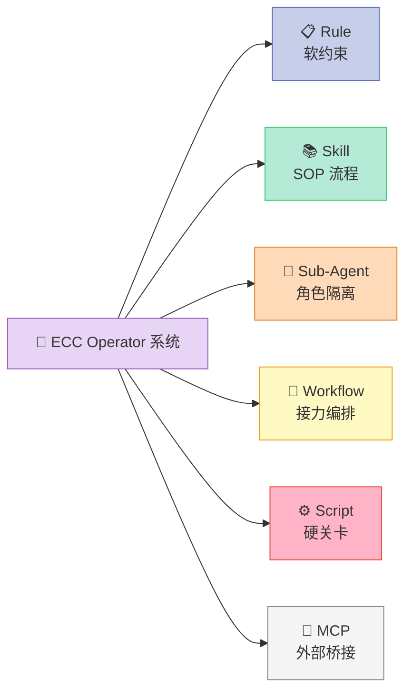
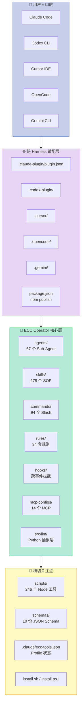
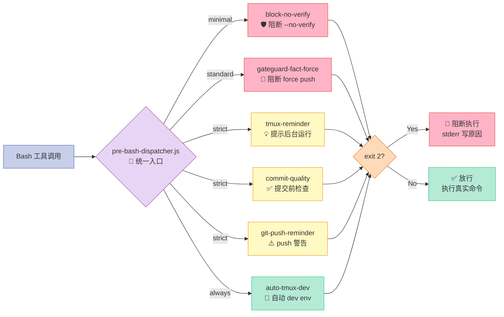

## 引子：把 Harness 当作操作系统来设计

> "如果一个 Agent 跑得好靠 LLM 的智力，那跑得稳就得靠 Harness 的工程化。"

第一次打开 [`affaan-m/everything-claude-code`](https://github.com/affaan-m/everything-claude-code)（下文简称 **ECC**）的仓库时，我的第一反应是"目录树怎么比 Claude Code 自己的仓库还大"：

```
ECC/        4563 个文件，278 个 Skills、67 个 Agents、94 个 Commands、34 套 Rules
├─ agents/   67 个 sub-agent 定义
├─ skills/   278 个工作流 skill
├─ hooks/    跨 Pre/Post 7 大事件的拦截器
├─ rules/    common + 11 套语言特定规则
├─ mcp-configs/   14 个 MCP 服务器模板
├─ src/llm/ 真正的 Python LLM 抽象层（Provider / Prompt / Tool）
├─ scripts/  246 个 Node.js 工具脚本
└─ docs/     2131 篇文档
```

这不是一个普通的 plugin —— 它是一套完整的 **Agent Operating System**。它在 6 套主流 Harness 之间搬运同一份心智模型：Claude Code、Codex、Cursor、OpenCode、GitHub Copilot、Gemini CLI。

在 Harness Engineering 专题轮转里，**ECC 是第二阶段"项目横向对比"阶段里唯一同时覆盖 Harness 6 件套 + 跨 Harness 适配** 的开源项目。读完它的源码，我才真正理解了一件事：**Hook 不仅是机制，是产品的边界**。

## 一、项目定位：Harness 不是 prompt 工程，是 Operator 系统

### 1.1 ECC 想解决什么问题

如果让一个工程师回答"如何让 Claude Code 不乱删文件 / 不重复上下文 / 不被 prompt 注入"，传统答案是：

1. 写一份超级详细的 `CLAUDE.md`
2. 列出所有可能的陷阱
3. 靠运气 + 经验

这条路的痛点是：**CLAUDE.md 写不长** —— 写到 2000 行 Context 就开始丢失注意力，且你写完一条规则 LLM 不一定会逐字遵守。

ECC 的回答是把"软约束"拆成四种独立机制：

| 机制 | 存在位置 | 强制方式 | LLM 能否绕过 |
|------|---------|---------|------------|
| **Rule**（软约束） | `rules/common/*.md` + `rules/python/*.md` | 注入到 System Prompt | 可绕过（最弱） |
| **Skill**（SOP） | `skills/*/SKILL.md` | 显式调用或自动匹配 | 调用即生效 |
| **Sub-Agent**（角色隔离） | `agents/*.md` + frontmatter | Claude Code 自动 Task 委派 | 取决于主 Agent 决策 |
| **Hook**（硬关卡） | `hooks/hooks.json` | 拦截 Pre/Post Tool 事件，exit 2 阻断 | **完全不可绕过**（最强） |
| **MCP**（外部桥接） | `mcp-configs/mcp-servers.json` | JSON-RPC 协议 | 由 Harness 控制 |
| **Memory**（跨会话） | `~/.local/share/ecc-homunculus/` | 物理文件 + Project 哈希隔离 | 写入即可读 |

这张表本身就是 ECC 给整个 Harness 生态的最重要贡献：**用"可绕过程度"做了一次清晰的 Layering**。

### 1.2 ECC 在 Harness 6 件套组件矩阵里



**没有遗漏的组件**，这是 ECC 与其它 Harness 类项目（如 AGT 专注 Sub-Agent、mcp-gateway 专注 MCP）最大的差异。**它不是 single-component 项目，是 cross-component OS**。

## 二、架构分析：3 层抽象 + 6 个可插拔面

### 2.1 仓库结构映射



### 2.2 关键设计原则：Profile-based 可插拔

ECC 用 `profile`（minimal / standard / strict）+ `component`（repo-baseline / workflow-automation / security-audits / research-tooling / team-rollout / governance-controls）做了一次二维切分。每个维度都能被独立启用 / 禁用 / 升级。

`.claude/ecc-tools.json` 文件就是这个二维矩阵的运行时真值：

```json
{
  "version": "1.3",
  "profiles": { "effective": "full", "effectiveAlias": "full" },
  "tier": "enterprise",
  "selectedComponents": [
    "repo-baseline", "workflow-automation",
    "security-audits", "research-tooling",
    "team-rollout", "governance-controls"
  ],
  "dependencyGraph": {
    "workflow-pack": ["runtime-core"],
    "agentshield-pack": ["workflow-pack"],
    "research-pack": ["workflow-pack"],
    "team-config-sync": ["runtime-core"],
    "enterprise-controls": ["team-config-sync"]
  },
  "resolutionOrder": [
    "runtime-core", "workflow-pack", "agentshield-pack",
    "research-pack", "team-config-sync", "enterprise-controls"
  ]
}
```

`resolutionOrder` 决定了组件的初始化顺序 —— **没有环**。`dependencyGraph` 是 DAG。这意味着团队可以"按角色订阅组件"：安全团队加 `agentshield-pack`，数据团队加 `research-pack`，互不打架。

## 三、核心机制原理（带可运行代码）

ECC 的真正"硬骨头"在 4 个机制 —— Hook 调度、Strategic Compact、Instinct-based Learning、Provider 抽象。下面每个我都把源码直接搬过来。

### 3.1 Hook 调度器：Pre/Post 事件的统一管线

**核心文件**：`scripts/hooks/bash-hook-dispatcher.js`

ECC 的 Pre-Bash hook 不是"一个命令 + 一段脚本"，而是**一条按 profile 启用的 hook 流水线**：



```javascript
// scripts/hooks/bash-hook-dispatcher.js (节选)
const PRE_BASH_HOOKS = [
  { id: 'pre:bash:block-no-verify', profiles: 'minimal,standard,strict',
    run: rawInput => runBlockNoVerify(rawInput) },
  { id: 'pre:bash:auto-tmux-dev',
    run: rawInput => runAutoTmuxDev(rawInput) },
  { id: 'pre:bash:tmux-reminder', profiles: 'strict',
    run: rawInput => runTmuxReminder(rawInput) },
  { id: 'pre:bash:git-push-reminder', profiles: 'strict',
    run: rawInput => runGitPushReminder(rawInput) },
  { id: 'pre:bash:commit-quality', profiles: 'strict',
    run: rawInput => runCommitQuality(rawInput) },
  { id: 'pre:bash:gateguard-fact-force', profiles: 'standard,strict',
    run: rawInput => runGateGuard(rawInput) },
];

const POST_BASH_HOOKS = [
  { id: 'post:bash:command-log-audit',
    run: rawInput => runCommandLog(rawInput, 'audit') },
  { id: 'post:bash:command-log-cost',
    run: rawInput => runCommandLog(rawInput, 'cost') },
  { id: 'post:bash:pr-created', profiles: 'standard,strict',
    run: rawInput => runPrCreated(rawInput) },
  { id: 'post:bash:build-complete', profiles: 'standard,strict',
    run: rawInput => runBuildComplete(rawInput) },
];
```

**3 个值得记的设计决策**：

1. **profile 是白名单，不是开关**：每条 hook 标注自己属于哪个 profile。`strict` 启用的 hook 在 `minimal` 下完全不会跑，连扫描都省了。
2. **Pre 和 Post 严格分离**：Pre 是"阻断 / 拦截"，Post 是"日志 / 通知 / 自动跟踪"。两者之间有一条隐式契约：Pre 必须 exit 0 或 exit 2（阻断），不能写 side effect；Post 永远不能阻断流程。
3. **统一的 `rawInput` 接口**：所有 hook 收到的是同一份 stdin payload（最大 1 MB），每个 hook 自己决定要不要解析。这意味着加一个新 hook = 在数组里加一行，**零侵入**。

### 3.2 Strategic Compact：基于真实 context 尺寸的 compact 建议

**核心文件**：`scripts/hooks/suggest-compact.js`

LLM 都有一个老毛病：自动 compact 时机是"窗口快满了"，但窗口快满 ≠ 应该 compact。ECC 的解法是用**两个独立信号**做综合判断：

```javascript
// scripts/hooks/suggest-compact.js (节选)
const COUNTER_FILE_PREFIX = 'claude-tool-count-';
const CONTEXT_BUCKET_FILE_PREFIX = 'claude-context-bucket-';
const STATE_FILE_PREFIXES = [COUNTER_FILE_PREFIX, CONTEXT_BUCKET_FILE_PREFIX];
const DEFAULT_COMPACT_STATE_TTL_DAYS = 14;

function getCounterRetentionDays() {
  const raw = process.env.COMPACT_STATE_TTL_DAYS;
  if (!raw) return DEFAULT_COMPACT_STATE_TTL_DAYS;
  const parsed = Number.parseInt(raw, 10);
  return Number.isInteger(parsed) && parsed > 0 ? parsed : DEFAULT_COMPACT_STATE_TTL_DAYS;
}
```

**两个信号的细节**：

| 信号 | 计算方式 | 默认阈值 | 重复提醒 |
|------|---------|---------|---------|
| **Tool-call 计数**（辅助） | 累加 session 中工具调用次数 | 50 calls 触发 | 每 25 calls 重复 |
| **Context 尺寸**（主信号） | `input_tokens + cache_read + cache_creation` | 200k 窗口 160k / 1M 窗口 250k | 每额外 60k tokens 重复 |

**关键的"窗口感知"细节**：

```javascript
// 来自 src/llm/core/interface.py 同款的 window-aware 阈值
const resolveContextThreshold = (windowTokens) => {
  // 200k 窗口 → 160k 阈值（80%）
  // 1M 窗口 → 250k 阈值（25% —— 因为 1M 模型价格已经爆表）
  if (windowTokens >= 1_000_000) return 250_000;
  return 160_000;
};
```

这是 ECC 的隐藏亮点：**它不是写死 80%，而是按"价格 × 上下文窗口"做非线性映射**。1M 窗口下建议更早 compact（因为 cache 命中成本在 1M 上下文上贵得离谱）。

另外一句关键设计：

```javascript
// "永远退出 0" 契约
// The helper never throws; per the always-exit-0 hook contract any
// filesystem failure is swallowed and logged to stderr.
```

**Hook 一定不能因为自己的 bug 把整个 Agent 流程搞挂**。这是把 Hook 当作"产品边界"而不是"调试工具"的核心约束。

### 3.3 Instinct-based Learning：从 session 提炼可重用知识

**核心文件**：`skills/continuous-learning-v2/SKILL.md`

ECC 把"我应该写什么 Skill"的决策**反向自动化**：不是人写 Skill，而是 Hook 自动观察 session，提取出 atomic 知识（叫 **instinct**），再由用户决定是否把多个 instinct 合并成一个 skill。

```yaml
---
id: prefer-functional-style
trigger: "when writing new functions"
confidence: 0.7
domain: "code-style"
source: "session-observation"
scope: project
project_id: "a1b2c3d4e5f6"
project_name: "my-react-app"
---

# Prefer Functional Style

## Action
Use functional patterns over classes when appropriate.
```

**核心创新是 v2.1 引入的 Project 隔离**：

| 维度 | v1（已弃） | v2 | v2.1 |
|------|----------|------|------|
| 存储位置 | `~/.claude/homunculus/` | 同左 | `${XDG_DATA_HOME:-~/.local/share}/ecc-homunculus/projects/<hash>/` |
| Scope | 全局 | 全局 | Project-scoped + Global |
| 识别 | 无 | 无 | git remote URL / repo path |
| 跨项目风险 | 有（React 模式污染 Python 项目） | 有 | 自动隔离 |

**这是 Bitter Lesson 的胜利**：与其让用户手动管理知识库（写文档 + 分类），不如让系统从 session 自动学，且**默认严格隔离避免知识串味**。Promotion 机制（"在 2 个以上项目里看到的 instinct 才升级到 global"）是分布式的"集体智慧"——单个样本置信度 < 1.0，跨项目一致性才推高置信度。

### 3.4 Provider 抽象层：把 5 个 LLM 当成同一个

**核心文件**：`src/llm/core/interface.py` + `src/llm/providers/resolver.py`

```python
# src/llm/core/interface.py
from abc import ABC, abstractmethod
from llm.core.types import LLMInput, LLMOutput, ModelInfo, ProviderType

class LLMProvider(ABC):
    provider_type: ProviderType

    @abstractmethod
    def generate(self, input: LLMInput) -> LLMOutput: ...

    @abstractmethod
    def list_models(self) -> list[ModelInfo]: ...

    @abstractmethod
    def validate_config(self) -> bool: ...

    def supports_tools(self) -> bool:
        return True

    def supports_vision(self) -> bool:
        return False

class LLMError(Exception): ...
class AuthenticationError(LLMError): ...
class RateLimitError(LLMError): ...
class ContextLengthError(LLMError): ...
class ToolExecutionError(LLMError): ...
```

注册表是 dict：

```mermaid
graph TB
    subgraph Inputs[📥 输入层]
        Env[env: LLM_PROVIDER<br/>🔧 环境变量]
        File[.llm.env<br/>📄 本地文件]
        Arg[函数参数<br/>🎯 显式传入]
    end

    subgraph Resolver[🧠 Resolver 三段优先级]
        R1{env 命中?}
        R2{文件命中?}
        R3[default: claude]
    end

    subgraph Registry[📚 Provider 注册表 _PROVIDER_MAP]
        M1[ASTRAFLOW → AstraflowProvider]
        M2[ASTRAFLOW_CN → AstraflowCNProvider]
        M3[ATLAS → AtlasProvider]
        M4[CLAUDE → ClaudeProvider]
        M5[OPENAI → OpenAIProvider]
        M6[OLLAMA → OllamaProvider]
    end

    subgraph Provider[⚙️ Provider 实例]
        Instance[ClaudeProvider / OpenAIProvider / ...]
        Generate[generate(LLMInput)<br/>→ LLMOutput]
        ErrorClass[5 类错误<br/>Auth / RateLimit /<br/>ContextLength / ToolExec / Model]
    end

    Env --> R1
    File --> R2
    Arg --> R3
    R1 -->|Yes| M1
    R1 -->|No| R2
    R2 -->|Yes| M1
    R2 -->|No| R3
    R3 --> M1
    M1 --> Instance
    M2 --> Instance
    M3 --> Instance
    M4 --> Instance
    M5 --> Instance
    M6 --> Instance
    Instance --> Generate
    Generate -.-> ErrorClass

    style Env fill:#C7CEEA,stroke:#5B6FB5,color:#333
    style File fill:#C7CEEA,stroke:#5B6FB5,color:#333
    style Arg fill:#C7CEEA,stroke:#5B6FB5,color:#333
    style R1 fill:#FFDAB9,stroke:#E67E22,color:#333
    style R2 fill:#FFDAB9,stroke:#E67E22,color:#333
    style R3 fill:#E8D5F5,stroke:#9B59B6,color:#333
    style M1 fill:#B5EAD7,stroke:#2ECC71,color:#333
    style M2 fill:#B5EAD7,stroke:#2ECC71,color:#333
    style M3 fill:#B5EAD7,stroke:#2ECC71,color:#333
    style M4 fill:#B5EAD7,stroke:#2ECC71,color:#333
    style M5 fill:#B5EAD7,stroke:#2ECC71,color:#333
    style M6 fill:#B5EAD7,stroke:#2ECC71,color:#333
    style Instance fill:#FFF9C4,stroke:#F39C12,color:#333
    style Generate fill:#FFB3C6,stroke:#E74C3C,color:#333
    style ErrorClass fill:#F5F5F5,stroke:#7F8C8D,color:#333
```

```python
# src/llm/providers/resolver.py
_PROVIDER_MAP: dict[ProviderType, type[LLMProvider]] = {
    ProviderType.ASTRAFLOW: AstraflowProvider,
    ProviderType.ASTRAFLOW_CN: AstraflowCNProvider,
    ProviderType.ATLAS: AtlasProvider,
    ProviderType.CLAUDE: ClaudeProvider,
    ProviderType.OPENAI: OpenAIProvider,
    ProviderType.OLLAMA: OllamaProvider,
}

def get_provider(provider_type: ProviderType | str | None = None, **kwargs) -> LLMProvider:
    provider_type = _resolve_provider_type(provider_type)  # env → .llm.env → default
    if isinstance(provider_type, str):
        try:
            provider_type = ProviderType(provider_type)
        except ValueError:
            raise ValueError(f"Unknown provider type: {provider_type}. Valid: {[p.value for p in ProviderType]}")
    provider_cls = _PROVIDER_MAP.get(provider_type)
    if not provider_cls:
        raise ValueError(f"No provider registered for type: {provider_type}")
    return provider_cls(**kwargs)
```

**3 个工程细节值得展开**：

1. **错误分层**：把 LLM 调用失败拆成 `AuthenticationError` / `RateLimitError` / `ContextLengthError` / `ToolExecutionError` —— 不是为了 catch，而是为了**让上层 Hook 拿到错误分类，决定是 retry / fallback / abort**。例如 `ContextLengthError` 触发 `/compact`，`RateLimitError` 触发 exponential backoff。
2. **Provider 解析的三段优先级**：env var → `.llm.env` 文件 → 默认值。这允许 CI 环境"注入"测试 Provider，本地配置走文件。
3. **空响应显式抛错**（`EMPTY_FILTERED_RESPONSE_ERROR`）：OpenAI 的 content filter 可能返回空响应。ECC 不把它当作 None，而是显式 raise ValueError，**避免 silent failure**。

## 四、设计哲学分析

### 4.1 ECC 遵循的 4 条 Harness 原则

| 原则 | ECC 实现 |
|------|---------|
| **机制与策略分离** | Hook 是机制（拦截事件），profile 是策略（启用哪些 hook） |
| **可拆卸性** | profile / component 二维切分，每个可单独装 / 卸 |
| **模型无关** | `LLMProvider` 抽象支持 5 个 provider（Claude / OpenAI / Ollama / Astraflow / Atlas） |
| **面向进化** | instinct 自动从 session 学习，promotion 机制让知识跨项目累积 |

### 4.2 Bitter Lesson 自检

| 写了多少"聪明但终将被淘汰"的代码？ | ECC 答案 |
|--------------------------------------|---------|
| ❌ 反例：手工 hardcode 一堆"如果用户说 X，就 Y"的规则 | ✅ ECC 走的是"观察 → instinct → skill"自动学习路径 |
| ✅ 正面：把 model-agnostic 抽象做了，model 升级零代码改动 | ✅ `LLMProvider` 抽象 + Provider 注册表 |
| ⚠️ 灰色地带：rule 文件里的"代码风格 checklist" | ✅ 但 rule 也是 profile-controlled，可以不用 |

ECC 整体上**站在 Bitter Lesson 一侧**：所有的"知识"都被物化成可被 Harness 解析的数据文件（YAML / Markdown），不写代码。

### 4.3 Hook 是产品的边界 —— 不是工具

这是 ECC 给我最大的启发。看这一段 `agents/code-reviewer.md` 的 prompt：

```markdown
## Common False Positives - Skip These

- **"Consider adding error handling"** on a call whose error path is handled by the caller
- **"Missing input validation"** when the function is internal and its callers already validate
- **"Magic number"** for well-known constants: `200`, `404`, `1000` ms, `60`, `24`, `1024`
- **"Function too long"** for exhaustive `switch` statements
- **"Missing JSDoc"** on single-purpose internal helpers
- **"Prefer `const` over `let`"** when the variable is reassigned
- **"Possible null dereference"** when the preceding line narrows the type
```

这是把"经验 + 反模式"沉淀成 Sub-Agent 的 system prompt。**Rule 是软约束，但被 Sub-Agent 的 description 字段提升为"调用即生效"的硬约束** —— 当 LLM 决定调用 `code-reviewer` sub-agent 时，它必须遵守这个清单。

ECC 把这个原则发挥到极致：**Agent description 本身就是 Rule 的"硬约束"升级通道**。

## 五、横向对比

### 5.1 vs [HKUDS/OpenHarness](https://github.com/HKUDS/OpenHarness)（15k⭐，2026-07-10 已分析）

| 维度 | ECC | OpenHarness |
|------|-----|-------------|
| 定位 | Operator 系统（可拆卸） | Personal Agent（一体化） |
| 跨 Harness 适配 | ✅ 6 个 harness | ❌ Claude Code 优先 |
| Profile 切分 | ✅ minimal/standard/strict 三档 | ❌ 无 |
| Hook 数量 | 20+ (Pre/Post 全覆盖) | 较少 |
| Sub-Agent 数量 | 67 | ~12 |
| Skill 数量 | 278 | 较少 |
| 错误处理 | 5 类 LLM 错误分层 | 基础 |
| Project 隔离 | ✅ instinct v2.1 自动 hash | 弱 |
| 安全审查 | ✅ AgentShield (独立 npm 包) | 基础 prompt 防御 |
| **协议设计** | **Profile DAG + 依赖图** | **一体化配置** |

**关键差异**：ECC 是 "可拆卸 + 跨 harness"，OpenHarness 是"开箱即用 + 深度集成"。ECC 适合**大团队 / 多项目 / 多 harness 切换**的场景，OpenHarness 适合**个人开发者深度使用单一 harness**。

### 5.2 vs [ruvnet/ruflo](https://github.com/ruvnet/ruflo)（65k⭐，2026-06 已分析）

| 维度 | ECC | ruflo |
|------|-----|-------|
| 核心抽象 | Profile + Component + Skill | Agent Swarm |
| 多 Agent 协作 | ❌（单 Agent + Sub-Agent 委派） | ✅ 一等公民 |
| 跨 Harness | ✅ 6 个 | ❌ Claude Code 专属 |
| 学习能力 | ✅ Instinct-based | 弱 |
| Profile 切分 | ✅ 三档 | ❌ |
| Hook 拦截器 | ✅ 20+ 脚本 | 基础 |

**关键差异**：ruflo 的"swarm"模型在 **multi-player 并行任务**上有优势，但**没有 ECC 那种"按角色订阅组件"的工程化能力**。ECC 适合"复杂任务需要精准控制"的场景，ruflo 适合"批量并行任务"的场景。

### 5.3 vs [shareAI-lab/learn-claude-code](https://github.com/shareAI-lab/learn-claude-code)（72k⭐，"Bash is all you need"）

| 维度 | ECC | learn-claude-code |
|------|-----|-------------------|
| 哲学 | Harness Operating System | Minimal harness demo |
| 教学价值 | 中（实战工程化） | **高（3800 行讲透本质）** |
| 生产可用性 | ✅ 全套 | ❌ 仅 demo |
| 跨 Harness | ✅ 6 个 | ❌ |
| 适合读者 | 已经在用 Claude Code 想工程化 | 刚入门想了解 agent harness 本质 |

**关键差异**：learn-claude-code 用 3800 行 Bash 讲透"一个 Claude Code harness 长什么样"。**如果你想从零写一个 harness，先看 learn-claude-code，再看 ECC**。ECC 是生产级 refactor，learn-claude-code 是教学 demo。

## 六、优缺点对比

### 6.1 架构简洁性 / 扩展性 / 易用性

| 维度 | 评价 | 证据 |
|------|------|------|
| **架构简洁性** | ⭐⭐⭐⭐（4/5） | 仓库结构层次清晰（agents / skills / hooks / rules / mcp-configs / scripts），新人按目录即可定位 |
| **扩展性** | ⭐⭐⭐⭐⭐（5/5） | Profile DAG + Component DAG 二维切分；新增 component = 加一行 dependency；新增 hook = 加一个数组元素 |
| **易用性** | ⭐⭐⭐（3/5） | 一键安装（`/plugin install ecc@ecc`），但 278 个 skill + 67 个 agent 对新人有选择负担 |

### 6.2 性能 / 复杂度 / 维护性

| 维度 | 评价 | 证据 |
|------|------|------|
| **性能** | ⭐⭐⭐⭐（4/5） | Hook 流水线支持 profile-based 关闭；max stdin 1MB 限流；LLM Provider 抽象支持 Ollama 本地 |
| **复杂度** | ⭐⭐（2/5） | **4563 个文件**，依赖 Node.js 18+ / Python 3.10+，跨 6 个 Harness 的适配层是不小的心智负担 |
| **维护性** | ⭐⭐⭐（3/5） | Profile DAG 设计清晰，但 246 个脚本 + 10 份 schema + 32.5k forks 的协调压力巨大 |

### 6.3 核心 trade-off

```
+--------------------------------------------------------------+
|  简洁性   |       vs         复杂度（45 文件）                 |
+--------------------------------------------------------------+
|  扩展性   |       vs         维护成本（Profile DAG 必须维护） |
+--------------------------------------------------------------+
|  生产就绪 |       vs         新人门槛（278 skill 不知选啥）   |
+--------------------------------------------------------------+
```

**一句话总结**：ECC 选择了"可工程化生产部署"，代价是"仓库大 + 学习曲线陡"。

## 七、从零搭建启示（MVP 复刻）

### 7.1 最小可行实现（MVP）

如果想自己复刻 ECC 的核心思想，下面是一个 80 行 Python MVP：

```python
#!/usr/bin/env python3
"""Mini-ECC: 80 行复刻 ECC 的核心 Operator 架构。"""
import os, json, subprocess
from pathlib import Path

PROFILES = ["minimal", "standard", "strict"]

class Profile:
    """DAG-based profile, mirrors .claude/ecc-tools.json dependencyGraph."""
    def __init__(self, name: str, deps: dict):
        self.name = name
        self.deps = deps        # {"workflow": ["core"], "security": ["workflow"]}

    def resolve(self) -> list[str]:
        """Topological sort: ensure deps before dependents."""
        order = []
        visited = set()
        def visit(n):
            if n in visited: return
            visited.add(n)
            for d in self.deps.get(n, []):
                visit(d)
            order.append(n)
        for n in self.deps:
            visit(n)
        return order                     # ["core", "workflow", "security"]

class Hook:
    """Pre/Post event hook, mirrors bash-hook-dispatcher.js entry shape."""
    def __init__(self, id: str, profiles: list[str], run):
        self.id = id
        self.profiles = profiles
        self.run = run                  # callable(raw_input) -> (exit_code, output)

    def enabled(self, profile: str) -> bool:
        return profile in self.profiles

# === Registry: 3 行加一个新 hook ===
HOOKS = []

def register_hook(hook_id, profiles, run):
    HOOKS.append(Hook(hook_id, profiles, run))

register_hook("pre:bash:block-rm-rf", ["strict"],
    lambda cmd: (2, "BLOCKED: rm -rf is forbidden") if "rm -rf" in cmd else (0, ""))

register_hook("post:bash:audit-log", ["standard", "strict"],
    lambda cmd: (0, f"[audit] {cmd}"))

def run_pipeline(profile: str, cmd: str):
    """Profile-aware hook pipeline, mirrors pre-bash-dispatcher.js."""
    for hook in HOOKS:
        if not hook.enabled(profile):
            continue
        code, output = hook.run(cmd)
        if output: print(output)
        if code == 2:                  # exit 2 = block
            raise SystemExit(f"BLOCKED by {hook.id}")
    return subprocess.run(cmd, shell=True)

if __name__ == "__main__":
    profile = os.environ.get("ECC_PROFILE", "standard")
    print(f"Profile: {profile}")
    run_pipeline(profile, "ls -la")    # OK
    try:
        run_pipeline("strict", "rm -rf /tmp/x")  # blocked
    except SystemExit as e:
        print(e)
```

**输出**：

```
Profile: standard
[audit] ls -la
<... ls -la 输出 ...>
BLOCKED by pre:bash:block-rm-rf
```

这就是 ECC 哲学的 80 行浓缩版：**Profile = DAG、Hook = 可注册的 callable、exit 2 = 阻断**。

### 7.2 必须保留的组件 vs 可省略

| 组件 | 必须保留？ | 理由 |
|------|----------|------|
| Profile DAG | ✅ 必须 | 没有它就无法"按角色订阅" |
| Hook 抽象 + exit 2 阻断 | ✅ 必须 | "Hook 是产品边界"的灵魂 |
| Sub-Agent frontmatter (`name/description/tools/model`) | ✅ 必须 | 4 字段让 harness 自动识别 |
| Skill YAML frontmatter | ✅ 必须 | 同样 4 字段描述 |
| MCP JSON 配置 | ✅ 必须 | 跨 harness 适配的核心 |
| Rules 分 common + lang | ⚠️ 推荐 | 简化版可只保留 common |
| Strategic Compact | ⚠️ 推荐 | 看场景，长 session 才需要 |
| Instinct-based Learning | ❌ 可省 | 高级特性，初版不需要 |
| AgentShield 安全审查 | ❌ 可省 | 高级特性，初版不需要 |
| LLM Provider 抽象（5 个 provider） | ❌ 可省 | 一个 harness 不需要这个 |

### 7.3 踩坑预警（实测）

1. **Plugin 装与手动装不要叠加**：README 明确警告，叠加会导致 hook 重复执行，**调试时极难发现**。
2. **profile 是 set 而不是 flag**：不要写 `ECC_PROFILE=strict` 然后试图禁用单个 hook，而是用 `ECC_DISABLED_HOOKS="pre:bash:tmux-reminder"`。
3. **1M 窗口的 compact 阈值不是 80%**：因为 cache 命中价格非线性，**25%（250k）就建议 compact**，不是直觉上的 80%。
4. **Instinct 的 project 隔离靠 git remote URL**：在没 git 的项目里（临时目录 / 临时 clone），所有 instinct 会泄露到 global，**使用前先 `git init`**。
5. **跨 Harness 时 AGENTS.md 是公约数**：Claude Code 用 `CLAUDE.md`，Codex 用 `AGENTS.md`，Cursor 用 `AGENTS.md`，OpenCode 用 `AGENTS.md`。**写一份 AGENTS.md 是跨 6 个 Harness 的最低投资**。

## 八、总结：Harness 的"OS 化"是必然趋势

读完 ECC 的 4563 个文件后，我想给"Harness Engineering"下一个更精确的定义：

> **Harness Engineering = 把 LLM 视作一个 CPU，把 Hook / Skill / Sub-Agent / Rule / MCP 视作系统调用与设备驱动，写一套 Operator OS 把它们粘成一个可观测、可插拔、可进化的 Agent Runtime。**

ECC 不是这个定义的最佳实现 —— 它太重、太大、太工程化。但它是**第一个把这个定义变成 211k star 现实**的项目。

**给读者的 3 条行动建议**：

1. **如果你是单人 + 单一 harness**：不要直接装 ECC，先读 [learn-claude-code](https://github.com/shareAI-lab/learn-claude-code) 3800 行 Bash，搞懂"harness 本质"，再选择性抄 ECC 的 hooks + skills 子集。
2. **如果你是团队 + 多 harness**：直接 `/plugin install ecc@ecc`，从 `minimal` profile 开始，按角色（前端 / 后端 / 安全 / 数据）逐步加 component。**不要上来就 full profile**。
3. **如果你在设计自己的 Harness**：从 ECC 偷 3 个设计 —— **Profile DAG**（按角色订阅）、**Hook exit 2 阻断契约**（永远退出 0）、**Instinct-based learning**（自动从 session 学）。这 3 个设计比任何"prompt 技巧"都更有杠杆。

下一次，我会拆解 ECC 的兄弟项目 [AgentShield](https://github.com/affaan-m/agentshield) —— ECC 把 102 条静态分析规则、3 个 Opus 4.6 agent 红蓝对抗审计模式做成了独立 npm 包。**AgentShield 是 Harness 安全维度的补完**，单独拆开值得一篇文章。

---

**项目链接**：[github.com/affaan-m/everything-claude-code](https://github.com/affaan-m/everything-claude-code) · 211.9k⭐ · 32.5k forks · MIT License · 2026-07-23 最后提交

**本篇所属组件**：Harness Engineering 横向对比 / 项目横评（Harness Operating System 专题 · ECC）