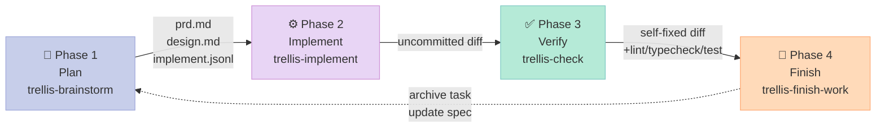
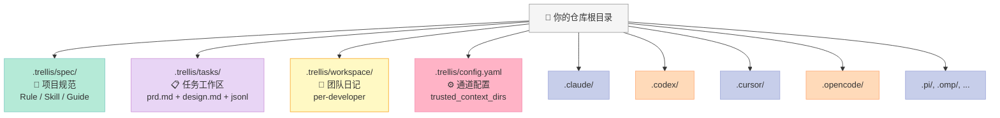
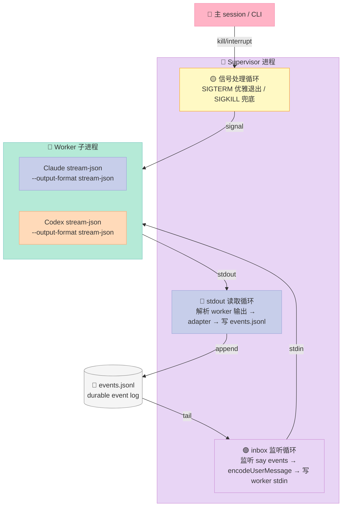

> **一个反常识的结论**：当下最被低估的 Harness 项目，不是 Claude Code、也不是 DeepAgents，而是 **`mindfold-ai/Trellis`**——13.1k⭐、AGPL-3.0、TypeScript 实现，**同时挂在 20+ 个 Coding Agent 之上**。它把"AI 写代码"这件事**抽象成了一条 4 阶段流水线（Plan → Implement → Verify → Finish）**，并用一个 **durable events.jsonl 日志** 把主 Agent、Implement Sub-Agent、Check Sub-Agent、Research Sub-Agent 全部串在同一根时间线上。本文不是 README 翻译，而是从源码出发，拆它怎么用 Supervisor 进程桥接不同 Provider 的 stream-json、用 Context Trust + Path Traversal 防护来阻止 Sub-Agent 越权读 `.ssh/`、以及用 OOM Guard 防止 Worker 进程无限增长。

## 前言：为什么在 14 个 Harness 横评之后又写 Trellis？

过去 14 天我把 Harness 6 件套的 Rule / Skill / Sub-Agent / Workflow / Script / MCP 都拆过一遍——`jcode`、`aden-hive`、`OpenHarness`、`DeepAgents`、`plano`、`spec-kit`、`browser-use`、`oh-my-openagent`、`ECC`、`Dapr Agents`、`Helicone`……每个项目都解决了一个非常具体的问题，但**有一个共同的盲点**：

> 它们每一个都假设你**只用一套 Agent**。

`jcode` 是 Rust 自己写的，`aden-hive` 围绕自家 Swarm API，`DeepAgents` 锁死 LangGraph，`OpenHarness` 围绕 Claude Code，`plano` 围绕 Envoy——你换一个 Provider，整个 Harness 就要推倒重来。

但**真实的工程团队不是单 Agent 世界**。一个项目可能同时跑 Claude Code（深度规划）+ Codex（代码生成）+ Cursor（IDE 内联修改）+ Aider（命令行 commit）+ OpenCode（多模型路由）——Harness 应该**跨在它们之上**，而不是绑定其中任何一个。

`mindfold-ai/Trellis` 恰好在做这件事。它把自己定位成 **"an out-of-the-box engineering framework for AI coding"**，并把这件事拆成了两层：

1. **Spec 层**（`.trellis/spec/`）—— 团队的工程标准 / Rule / Skill 用 markdown 写进仓库
2. **Channel 层**（`trellis channel ...`）—— 多 Agent 协作的事件日志 + Supervisor 桥接

下面从源码逐层拆开。

---

## 一、定位：一个跨 Provider 的「元 Harness」

### 1.1 Trellis 不是 Agent，是 Agent 之间的协议层

先看 README 第一句就划清了边界：

> An out-of-the-box engineering framework for AI coding. AI writes code fast, but every session it starts from scratch — no memory of your project, your conventions, or your team's requirements. Trellis persists specs, tasks, and memory into your repo, **so any coding agent works to your engineering standards**.

关键词是 **"any coding agent"**。Trellis 的 README 列出的 5 项能力是：

| 能力 | 它改了什么 |
|---|---|
| **Auto-injected specs** | 团队规范写一次在 `.trellis/spec/`，每次新会话自动注入相关上下文 |
| **Task-centered workflow** | PRD、设计稿、review context、任务状态都进 `.trellis/tasks/` |
| **Project memory** | `.trellis/workspace/` 里的日记保留上一次会话做了什么 |
| **Team-shared standards** | Spec 进仓库，一次写全团队受益 |
| **Multi-platform setup** | 同一份 Trellis 结构适配 20+ AI 编码平台 |

而相比 `CLAUDE.md` / `AGENTS.md` / `.cursorrules`，Trellis 自己在 README FAQ 里给了**反对比**：

> Those files are useful entry points, but they tend to become monolithic. Trellis adds **scoped specs, task PRDs, workflow gates, workspace memory, and platform-aware generated files** around them.

### 1.2 调研快照（2026-07-24）

| 维度 | 数值 | 来源 |
|---|---|---|
| ⭐ Stars | **13,124** | `GET /repos/mindfold-ai/Trellis` |
| 📦 默认分支 | `main` | Repo API |
| 🛠️ 主语言 | TypeScript | Repo API（占比 88.4%） |
| 📜 许可证 | AGPL-3.0 | Repo API |
| 🧩 平台支持 | 20+ 平台 | `packages/cli/src/templates/` 下的目录数 |
| 📦 npm 包名 | `@mindfoldhq/trellis` | README |
| 📅 最近 commit | 2026-07-24 14:54Z | Repo API |
| 📐 仓库大小 | 241 MB | Repo API |
| 🏷️ Topics | `agentic-coding`, `ai-workflow`, `claudecode`, `codex`, `harness` | Repo API |

**关键事实**：Trellis 的 CLI 同时给 Claude Code、Codex、Cursor、OpenCode、Qoder、CodeBuddy、Droid、Gemini CLI、Copilot、Kiro、Aider、Pi 等都生成对应的 `.claude/`、`.codex/`、`.cursor/`、`.opencode/` 目录——**一个 `trellis init` 命令把 Harness 注入 20 个 Provider**。

---

## 二、架构总览：4 阶段循环 + 4 层目录

### 2.1 4 阶段循环

Trellis 的核心是 README 里**一句话写死的 4 阶段循环**：



每一阶段都有专门的 Skill + Sub-Agent：

| Phase | 触发 Skill | 派生的 Sub-Agent | 关键产物 |
|---|---|---|---|
| **Plan** | `trellis-brainstorm` | `trellis-research` | `prd.md` + research files + `implement.jsonl` |
| **Implement** | `trellis-implement` | （无 / 主 session 执行） | uncommitted diff |
| **Verify** | `trellis-check` | （无 / 主 session 执行） | self-fixed diff + lint / typecheck / test |
| **Finish** | `trellis-finish-work` | `trellis-update-spec` | archived task + updated `.trellis/spec/` |

> 命名细节：Trellis 把 Sub-Agent 走主 Agent spawn 子进程叫 `trellis-implement` / `trellis-check` / `trellis-research`（与 Skill 同名），而 `.trellis/agents/` 里真正落盘的是 `plan.md` / `implement.md` / `check.md` / `research.md` / `architect.md` 五张 **agent card**。

### 2.2 仓库的 4 层目录结构

`trellis init` 在你的仓库里创建的结构：



`.trellis/` 是**所有 Provider 共享的真相源**；`.claude/`、`.codex/`、`.cursor/` 这些是 **`trellis init` 自动生成的 Provider 专用胶水**（agents / commands / skills / hooks / settings.json / hooks.json）。

---

## 三、4 阶段循环的源码实现

### 3.1 Plan 阶段：trellis-brainstorm Skill

源码 `.agents/skills/trellis-brainstorm/SKILL.md`（共 201 行）开篇就抛出了**两条不可违反的契约**：

```yaml
## Non-Negotiable Planning Contract

A request to build, implement, fix, refactor, or "go ahead" is not approval to leave planning.
Task-creation consent is also not implementation approval.

For every non-trivial task, the user must respond at least once after the initial request
before implementation begins. If no clarification is needed, that response must approve
the final planning summary described below.

While any user-owned product, scope, UX, compatibility, risk, or acceptance decision remains
unresolved, end the turn with exactly one highest-value question. Do not edit product code,
dispatch implementation, or run `task.py start`.
```

接下来是 **Evidence Rule**：

```yaml
## Non-Negotiable Evidence Rule

If a question can be answered by exploring the codebase, explore the codebase instead.
This is mandatory. Before asking the user a question, first check whether the answer is
already available in code, tests, configs, docs, existing specs, or task history.

Do not ask the user to confirm facts that the repository can answer.
```

**这条规则决定 Trellis 不是简单的"问 10 个问题"——它是"先查代码、查 spec、查 task 历史，能查到的不问用户"**。这是它和大多数 planning skill 最大的区别。

实际执行流：

```bash
# Step 1: 创建任务目录（TASK_DIR 形如 .trellis/tasks/07-25-my-task）
TASK_DIR=$(python3 ./.trellis/scripts/task.py create "<short task title>" --slug <slug>)

# Step 2: 写 prd.md 的初版骨架（task.py create 自动建好）
# Step 3: 一问一答，每答完一次更新 prd.md
# Step 4: 重型研究派给 trellis-research Sub-Agent
python3 ./.trellis/scripts/active_task.py
```

**可运行示例：把"加 dark mode"变成可执行 PRD**

下面是一个**真实可运行的 5 行示例**——用 Trellis CLI 创建一个任务，PR 都会被 `task.py archive` 自动 commit 进 `.trellis/tasks/`：

```bash
# 安装
npm install -g @mindfoldhq/trellis@latest

# 在你的仓库里初始化
cd ~/my-app
trellis init -u alice

# 创建一个任务（自动建 .trellis/tasks/07-25-add-dark-mode/prd.md）
TASK_DIR=$(python3 ./.trellis/scripts/task.py create "Add dark mode toggle" --slug add-dark-mode)
echo "Task created at: $TASK_DIR"
# 输出: Task created at: .trellis/tasks/07-25-add-dark-mode

# 列出 active task
python3 ./.trellis/scripts/active_task.py
# 输出: Active task: .trellis/tasks/07-25-add-dark-mode
```

**预期输出**：

```
✓ Trellis installed for user alice
  .trellis/        created
  .claude/         created (claude provider)
  .codex/          created (codex provider)
  .cursor/         created (cursor provider)
Task created at: .trellis/tasks/07-25-add-dark-mode
Active task: .trellis/tasks/07-25-add-dark-mode
```

### 3.2 Plan 阶段的 Research Sub-Agent

`trellis-research` Sub-Agent 不是简单的"上网搜"——它的核心规则写在 `.trellis/agents/research.md` 里：

```yaml
## Step 3: External Research (SDKs, Libraries, GitHub Projects, APIs)

> **Core principle**: the goal is NOT to list what exists out there — it is to
> pull the actual source/docs into the task so the implement agent can read
> real code, not your paraphrase of it. **A link and a summary are not
> research.** If the implement agent still has to go clone the repo itself
> after reading your context file, you have failed this step.
```

然后是**强制 fetch 规则**：

| Target type | How to actually fetch it |
|---|---|
| GitHub repo | `git clone --depth 1 https://github.com/<org>/<repo> /tmp/research-<slug>` then `read`/`grep` the real files. Use `--filter=blob:none` for huge repos. |
| Single file from GitHub | `curl -sSL https://raw.githubusercontent.com/<org>/<repo>/<ref>/<path> -o /tmp/<name>` |
| Docs site / blog | `web_search` → pick the exact page → `curl -sSL <url> \| pandoc -f html -t gfm` |

**为什么这条规则重要**：99% 的"research sub-agent"返回的是带链接的总结，implement agent 还要自己 clone 一遍。Trellis 把 research 拆成**两段契约**——research 负责把真源拉进 `/tmp/`，implement 负责读 `/tmp/` 而不是 search——**把 io-bound 集中到 research 阶段**。

### 3.3 Implement 阶段：Agent Card + Manifest 注入

`.trellis/agents/implement.md`（共 60+ 行）的骨架：

```yaml
---
name: implement
description: |
  Code implementation expert for the Trellis channel runtime. Understands specs and
  task artifacts, then implements features. No git commit allowed.
provider: claude
labels: [trellis, implement]
---

# Implement Agent (channel runtime)

You are the Implement Agent spawned by `trellis channel spawn --agent implement`
inside the Trellis channel runtime. You receive an `Active task: <path>` line
in your inbox; use it to locate task artifacts on disk.

## Context (read in this order)

1. `<task-path>/implement.jsonl` if present — spec manifest curated for this turn
2. `<task-path>/prd.md` — requirements
3. `<task-path>/design.md` if present — technical design
4. `<task-path>/implement.md` if present — execution plan
5. `.trellis/spec/` — project-wide guidelines

## Forbidden Operations

- `git commit`
- `git push`
- `git merge`

The supervising main session owns commits. Report what changed; do not commit on
its behalf.
```

**三个细节值得拆**：

1. **`provider: claude` 在 frontmatter**——决定这个 agent 默认由哪个 Provider spawn；通过 `trellis channel spawn --provider codex` 可以 override。
2. **Context 顺序硬编码在 agent prompt 里**——`implement.jsonl` 是 curated 清单，`prd.md` / `design.md` 是大文档，避免 LLM 一上来读 100KB 文档。
3. **`Forbidden Operations` 写明不能 commit**——主 session 拥有提交权，Sub-Agent 永远只输出 diff 不动 git。

### 3.4 Verify 阶段：trellis-check 的 Self-Fix 机制

`trellis-check` 的差异化在**Self-Fix 规则**：

```yaml
## Workflow

1. Run `git diff --name-only` and `git diff` to scope the changes
2. Read the task artifacts and relevant spec files
3. For each issue:
   - If mechanical (lint nit, missing type, wrong import, dead branch) → fix in-place
   - If a design/judgment issue → record and report, do not silently rewrite
4. Run the project's lint and typecheck on the changed scope after self-fixes
5. Report
```

也就是说 check agent **不只是一个评审员，它会把 lint nit / 缺失类型这种机械错误直接改了再返回**——只有"design 决策类"问题才上报。

**`report format` 也是硬编码的契约**：

```
## Self-Check Complete

### Files Checked
- <path>

### Issues Found and Fixed
1. `<file>:<line>` — <what was wrong> → <what you changed>

### Issues Not Fixed
- `<file>:<line>` — <issue> — <why deferred to the main session>

### Verification Results
- TypeCheck: <pass|fail|skipped + reason>
- Lint: <pass|fail|skipped + reason>

### Summary
Checked <N> files, found <X> issues, fixed <Y>, <X-Y> open.
```

主 session 看到这个 report 就能直接 commit / 退回——**契约先于实现**是 Trellis agent 设计最值得抄的一条。

---

## 四、Channel Runtime：跨 Provider 的多 Agent 协作

如果说 4 阶段循环是"AI 视角的工作流"，那 Channel Runtime 就是"系统视角的多 Agent 协议"。它藏在 `packages/cli/src/commands/channel/`（约 950+ 行 TypeScript）。

### 4.1 Channel 的本质：一条 durable events.jsonl

源码 `packages/cli/src/commands/channel/index.ts` 的入口注释：

```typescript
const channel = program
  .command("channel")
  .description(
    "Multi-agent collaboration runtime — spawn / coordinate / interrupt worker agents through a shared event log",
  );
```

**关键词**：shared event log。每个 channel 在磁盘上是一个目录，目录里有一条 `events.jsonl`——所有 agent 的发言（say）、工具调用（progress）、系统事件（spawned / done / killed / interrupted）**全追加到这条文件里**。

事件流的形状（简化）：

```typescript
type ChannelEvent =
  | { kind: 'spawned', worker: string, pid: number, agent: string, provider: 'claude'|'codex', files: string[] }
  | { kind: 'say', from: string, to?: string, text: string, turn?: number }
  | { kind: 'progress', worker: string, label: string, summary: string }
  | { kind: 'send', from: string, to: string, text: string, kind?: 'interrupt'|'question'|'phase_done' }
  | { kind: 'done', worker: string, summary?: string, total_cost_usd?: number }
  | { kind: 'error', worker: string, error: string, is_error: true }
  | { kind: 'killed', worker: string, reason: 'timeout'|'oom'|'user'|'signal' }
```

### 4.2 Supervisor：Provider 适配器 + 三并发循环

源码 `packages/cli/src/commands/channel/supervisor.ts`（524 行）的注释直接画了架构：

```typescript
/**
 * Supervisor process: owns a single worker (claude or codex) and bridges
 * worker ↔ channel events.jsonl.
 *
 * Three concurrent loops:
 *   1. stdout reader  — parse worker stdout → adapter → append events
 *   2. inbox watcher  — read events.jsonl for `to=<worker>` say events,
 *                       translate via adapter.encodeUserMessage → worker stdin
 *   3. signal handler — SIGTERM → close worker stdin → 3s → SIGTERM → 3s → SIGKILL
 *                       → write `killed` event → exit
 */
```

架构图：



**三并发循环的设计价值**：

1. **stdout 解析 + inbox 监听 解耦**——即使 worker 在跑长 thinking，主 session 还能发 `--kind interrupt` 让它停
2. **优雅退出**：先 `close stdin` 让 worker 写完 `done`，3 秒没动静再 SIGTERM，3 秒还没死 SIGKILL——避免 Anthropic API 收到半截 stdout
3. **每条事件都写盘**——channel 死掉后还能 `trellis channel messages` 回放完整对话

### 4.3 Provider Adapter：同一接口屏蔽 Claude 和 Codex

源码 `packages/cli/src/commands/channel/adapters/claude.ts`（259 行）展示了 Claude 的 stream-json 解析：

```typescript
/**
 * Trace shape (real data, see research/probes/claude/list-files.jsonl):
 *   - system.subtype=hook_started   → skip (Claude-core hook lifecycle)
 *   - system.subtype=hook_response  → skip
 *   - system.subtype=init           → persist session_id; no event broadcast
 *   - assistant.message.content[]   → per-block: text → say, tool_use → progress,
 *                                      thinking → skip (verbose-only)
 *   - user.message.content[]        → tool_result → skip (noisy)
 *   - rate_limit_event              → skip
 *   - result                        → done (success) or error
 */
```

Codex 的 adapter 在 `adapters/codex.ts`，统一暴露 `AdapterEvent` 类型（`adapters/types.ts`）：

```typescript
export interface Adapter {
  provider: Provider;
  /** Parse one parsed-JSON message from worker stdout into AdapterEvent(s). */
  parse(msg: unknown): ParseResult;
  /** Encode a user message for worker stdin in the worker's native protocol. */
  encodeUserMessage(text: string): string;
  /** Optional sandbox override (codex only). */
  parseSandboxMode?(value: string): CodexSandboxMode;
}
```

**核心解耦**：supervisor 不关心 worker 是 claude 还是 codex——它只调 `adapter.parse()` 和 `adapter.encodeUserMessage()`。

### 4.4 Context 注入 + Path Traversal 防护

源码 `packages/cli/src/commands/channel/context-loader.ts`（377 行）展示了 `--file` / `--jsonl` 注入时的**路径监狱**：

```typescript
/**
 * Path-traversal guard: resolve `target` and `cwd` to realpaths and
 * verify `target` is `cwd` or a descendant, OR under one of `trustedRoots`
 * (see `context-trust.ts`). Refuses absolute paths outside cwd/trusted
 * roots, `..`-escapes, and symlinks pointing outside.
 */
function jailedRealpath(
  target: string,
  cwd: string,
  trustedRoots: string[] = [],
): string | null {
  const cwdReal = fs.realpathSync(cwd);
  let real: string;
  try {
    real = fs.realpathSync(target);   // ⚠️ 必须 realpath，不能 lexical
  } catch {
    real = path.resolve(target);       // 文件不存在时 fallback
  }
  // ...
}
```

紧接着有大小限制：

```typescript
const MAX_PER_FILE_BYTES = 1_000_000; // 1MB hard cap per file
const WARN_PER_FILE_BYTES = 200_000;  // stderr warn at 200KB
const WARN_TOTAL_BYTES = 500_000;     // stderr warn when assembled context > 500KB
```

**为什么需要 realpath 而不是 path.resolve**：攻击者可以建一个软链接 `tasks/my-ctx` → `~/.ssh/id_rsa`，如果只做 lexical resolution，`tasks/my-ctx` 看起来在 cwd 内，但 realpath 跳到了 `~/.ssh/`——Trellis 用 realpath + jailing 来阻止这种 symlink 逃逸。

**真实可运行的最小注入示例**：

```bash
# 在仓库根目录创建一个任务，spawn 一个 implement worker，注入 prd.md
TASK=.trellis/tasks/07-25-add-dark-mode
trellis channel create cr-dark --task "$TASK" --by main

trellis channel spawn cr-dark \
  --agent implement \
  --jsonl "$TASK/implement.jsonl" \
  --file "$TASK/prd.md" \
  --as impl-claude --timeout 30m

# 把 prompt 通过 stdin 喂给 worker（避免命令行长字符串转义问题）
echo "Implement the dark mode toggle per $TASK/prd.md" \
  | trellis channel send cr-dark --as main --to impl-claude --stdin

# 等 worker 完成（用 --kind done 不是 --tag）
trellis channel wait cr-dark --as main --from impl-claude --kind done --timeout 30m
```

**预期输出**：

```
✓ Channel cr-dark created (scope=project, type=chat)
✓ Worker impl-claude spawned (pid=42319, provider=claude, agent=implement)
✓ Inbox message sent to impl-claude
[30m elapsed] ✓ Worker impl-claude done (total_cost_usd=$0.42)
```

### 4.5 Context Trust：trusted_context_dirs + symlink auto-trust

源码 `packages/cli/src/commands/channel/context-trust.ts`（158 行）解决了"用户把 `.trellis/tasks` symlink 到外部目录"的边界 case：

```typescript
/**
 * Trusted-root resolution for the context-loading containment checks
 * (`context-loader.ts` `jailedRealpath`, `agent-loader.ts` `findAgentFile`).
 *
 * Users who persist `.trellis/tasks` / `.trellis/workspace` as symlinks to
 * an external directory get legitimate context files rejected by the cwd-only jail.
 * This module resolves an additional set of trusted realpath roots — from
 * `.trellis/config.yaml` `channel.trusted_context_dirs`, plus a narrow auto-trust
 * of `.trellis/tasks` / `.trellis/workspace` when either is itself a top-level
 * symlink — so those roots can be accepted alongside cwd without weakening the
 * containment check to lexical matching.
 */

const AUTO_TRUST_ENTRIES = ["tasks", "workspace"] as const;
```

**这个细节说明 Trellis 的安全模型不是简单"jail everything"，而是分三档**：

| 路径类型 | 是否允许注入 | 依据 |
|---|---|---|
| `cwd` 或 `cwd` 下的子目录 | ✅ | 默认 jailing |
| `.trellis/config.yaml` 里 `channel.trusted_context_dirs` 列出的目录 | ✅ | 显式声明 |
| `.trellis/tasks` / `.trellis/workspace`（本身是顶层 symlink 时）| ✅ | auto-trust |
| 其他 absolute path（如 `/etc/passwd`）| ❌ | jailing 拒绝 + stderr warn |
| cwd 下的 `..` 逃逸 | ❌ | realpath 检测 |
| cwd 下的 symlink 指向 `~/.ssh/` | ❌ | realpath 检测 |

### 4.6 OOM Guard：Worker 数量 + 空闲超时

源码 `packages/cli/src/commands/channel/guard.ts`（658 行）的默认配置：

```typescript
/** Built-in default idle-cleanup TTL for spawned workers (5 minutes). */
export const DEFAULT_IDLE_TTL_MS = 5 * 60 * 1000;

/** Built-in default live-worker budget per project/scope. */
export const DEFAULT_MAX_LIVE_WORKERS = 6;

/** Env var override for the idle-cleanup TTL. */
export const ENV_IDLE_TIMEOUT = "TRELLIS_CHANNEL_WORKER_IDLE_TIMEOUT";

/** Env var override for the live-worker budget. */
export const ENV_MAX_LIVE_WORKERS = "TRELLIS_CHANNEL_MAX_LIVE_WORKERS";
```

spawn 时可覆盖：

```typescript
trellis channel spawn cr-dark --agent implement \
  --idle-timeout 30m \
  --max-live-workers 3 \
  --as impl-claude
```

**为什么这很重要**：Claude / Codex worker 通常驻留 stdin/stdout 长连接和历史 buffer——多 spawn 几个不收尾能直接吃光内存。Trellis 在 spawn 时先扫一遍 live worker registry，超 budget 直接拒。

**优先级链**：

```
CLI flag → 环境变量 → .trellis/config.yaml → 内置默认
(最优先)                                  (最低)
```

---

## 五、Hook 层：Provider 之间的契约胶水

### 5.1 Trellis 的 4 个共享 Hook

源码 `.claude/hooks/inject-subagent-context.py`（977 行 Python）的开头注释：

```python
"""
Multi-Platform Sub-Agent Context Injection Hook

Injects task-specific context when sub-agents (implement, check, research) are spawned.

Core Design Philosophy:
- Hook is responsible for injecting all context, subagent works autonomously with complete info
- Each agent has a dedicated jsonl file defining its context
- No resume needed, no segmentation, behavior controlled by code not prompt

Trigger: PreToolUse (before Task tool call)

Context Source: Trellis active task resolver points to task directory
- implement.jsonl - Implement agent dedicated context
- check.jsonl     - Check agent dedicated context
- prd.md          - Requirements document
- design.md       - Technical design for complex tasks
- implement.md    - Execution plan for complex tasks
- codex-review-output.txt - Code Review results
"""
```

**4 个共享 hook + 各自职责**：

| Hook | 触发时机 | 职责 |
|---|---|---|
| `inject-subagent-context.py` | `PreToolUse`（Task 工具调用前）| Sub-Agent spawn 时按 agent 类型注入对应 jsonl + prd/design/implement |
| `inject-workflow-state.py` | `UserPromptSubmit` / `BeforeAgent`（每次用户输入）| 输出 `<workflow-state>STATUS</workflow-state>` 块，提醒主 AI 当前 task 和阶段 |
| `session-start.py` | `SessionStart` | 恢复 active task 上下文，写 `<system-reminder>` |
| `inject-shell-session-context.py` | `PreToolUse`（Bash 工具调用前）| Shell session 注入 active task 信息 |

### 5.2 inject-workflow-state 的 Provider 适配

源码 `.claude/hooks/inject-workflow-state.py`（404 行）解决了**同一个 hook 在不同 Provider 下字段名不同**的问题：

```python
"""
Trellis per-turn breadcrumb hook (UserPromptSubmit / BeforeAgent equivalent).

The emitted ``hookEventName`` field is platform-aware: most hosts expect
``UserPromptSubmit`` (Claude Code naming, also accepted by Cursor / Qoder /
CodeBuddy / Droid / Codex / Copilot wiring), but Gemini CLI 0.40.x renamed
its per-turn event to ``BeforeAgent`` and its schema validator rejects the
legacy name. ``_detect_platform`` picks the right value at runtime.
"""
```

**这条注释透露一个被严重低估的工程现实**：Anthropic 的 `UserPromptSubmit` 在 Gemini CLI 0.40.x 后被改名 `BeforeAgent`——所有想"跨 Provider"的 Harness 都必须处理这个 schema drift，Trellis 用 runtime detection 把差异点收到 30 行代码里。

---

## 六、Spec 系统：团队规则的真相源

### 6.1 Spec 目录结构

Trellis 的 `.trellis/spec/` 目录被设计成**两层索引 + 一层正文**：

```
.trellis/spec/
├── {package}/                  ← 按 package 划分
│   └── {layer}/
│       ├── index.md             ← Pre-Development Checklist（先读这个）
│       └── *.md                 ← 具体规范
└── guides/
    └── index.md                 ← 跨 package 的 thinking guide
```

`trellis-before-dev` Skill 的指令（41 行）：

```yaml
1. Read current task artifacts (prd.md, design.md, implement.md)
2. Discover packages and their spec layers:
     python3 ./.trellis/scripts/get_context.py --mode packages
3. Identify which specs apply to your task
4. Read the spec index for each relevant module:
     cat .trellis/spec/<package>/<layer>/index.md
   Follow the "Pre-Development Checklist" section in the index.
5. Read the specific guideline files listed in the Pre-Development Checklist
   that are relevant to your task. The index is NOT the goal — it points you
   to the actual guideline files (e.g., error-handling.md, conventions.md).
6. Always read shared guides:
     cat .trellis/spec/guides/index.md
```

**核心设计**：index.md **只列清单不写内容**——LLM 必须顺着清单去读具体文件，避免 index 膨胀成"什么都塞进 README.md"的反模式。

### 6.2 spec-system.md 的核心抽象

源码 `packages/cli/src/templates/common/bundled-skills/trellis-meta/references/local-architecture/spec-system.md` 给出了 spec 的设计哲学：

| 原则 | 含义 |
|---|---|
| **Scoped** | spec 按 package × layer 隔离，不放一个全局大文件 |
| **Indexed** | 每个目录有 index.md 列出该目录的 spec 清单 |
| **Traceable** | spec 改动进 git history，可审计 |
| **Discoverable** | agent 先 `get_context.py --mode packages` 自动发现相关 spec |
| **Promoted from learnings** | `trellis-update-spec` 把这次任务学到的规则自动写回 spec |

---

## 七、和同类 Harness 的横评

Trellis 不是 Harness 6 件套里某一件的"极致实现"——它是**少有的"一层额外的协议层"**。横评表：

| 维度 | Trellis | DeepAgents | jcode | aden-hive | OpenHarness |
|---|---|---|---|---|---|
| 跨 Provider | ✅ 20+ | ❌ 锁 LangGraph | ❌ 自写 | ❌ 自写 | ⚠️ 主 Claude |
| Spec 系统 | ✅ scoped + indexed | ❌ CLAUDE.md 风格 | ⚠️ 简单 | ⚠️ YAML | ✅ spec 模板 |
| Task 制品 | ✅ prd/design/impl jsonl | ⚠️ middleware | ❌ | ❌ | ⚠️ |
| Sub-Agent 隔离 | ✅ Supervisor + Channel | ✅ SubAgent 字段 | ✅ Deep/Light | ✅ Pipeline | ✅ Tool |
| Hook | ✅ 4 类 Python hook | ✅ Middleware | ✅ Pre-Tool | ✅ EventBus | ✅ Hook |
| 安全防护 | ✅ Path jail + trust + OOM | ⚠️ 中等 | ⚠️ 中等 | ⚠️ 中等 | ⚠️ |
| 状态保存 | ✅ events.jsonl durable | ⚠️ LangGraph checkpointer | ❌ 内存 | ⚠️ | ⚠️ |
| 主语言 | TypeScript | Python | Rust | TypeScript | Python |
| ⭐ 数量 | 13.1k | ~6k（2026-07） | 8.3k | 10k+ | ~2k |

**关键差异**：

1. **Trellis 是"协议层"，DeepAgents 是"框架层"**——Trellis 不写 LLM 循环，只调度 Provider；DeepAgents 自己实现完整的 agent loop
2. **jcode 是"嵌入式 Harness"**——主打低 RAM；Trellis 是"CLI Harness"——主打跨 Provider
3. **OpenHarness 是"教育型 Harness"**——展示 6 件套可以怎么写；Trellis 是"工程化 Harness"——20+ Provider 适配是为了真用
4. **aden-hive 是"多 Agent 协作 Harness"**——在 TS 里写 Swarm API；Trellis 是"events.jsonl 协作"——多 Agent 通过共享事件日志通信

---

## 八、优缺点与适用场景

### 8.1 优点

| # | 优点 | 证据 |
|---|---|---|
| 1 | **跨 20+ Provider** | README + `packages/cli/src/templates/` 20 个目录 |
| 2 | **4 阶段循环契约先于实现** | agent.md 全部 hardcoded `Workflow` + `Report Format` |
| 3 | **durable events.jsonl** | Supervisor 持久化所有事件，可 `messages --raw` 回放 |
| 4 | **Context 注入安全** | realpath jail + trusted_dirs + size cap |
| 5 | **OOM Guard** | idle-timeout + max-live-workers + env override |
| 6 | **spec 系统** | scoped + indexed + auto-promoted learnings |
| 7 | **开源 + AGPL-3.0** | 可商用，可二次开发 |
| 8 | **有中文 README** | `README_CN.md` 完整翻译 |

### 8.2 缺点

| # | 缺点 | 触发场景 |
|---|---|---|
| 1 | **AGPL-3.0 传染性强** | 内部工具无所谓；SaaS 包装必须开源 |
| 2 | **TypeScript + Python 双栈** | 团队需要同时维护两种语言 |
| 3 | **Hook 复杂** | 4 个 Python hook + 5+ Provider 适配，调试成本高 |
| 4 | **依赖 events.jsonl 文件系统** | NFS / 容器 mount 异常时易卡 |
| 5 | **学习曲线** | skill / agent card / jsonl 三套约定，新人需 1-2 周适应 |
| 6 | **平台漂移** | Gemini CLI 改名 BeforeAgent 这类 schema drift 需持续适配 |
| 7 | **不擅长多模态** | 当前设计主要针对 code 任务，图像/音频 Sub-Agent 支持弱 |

### 8.3 适用 vs 不适用

✅ **适合用 Trellis 的场景**：

- 团队**同时用 Claude Code + Codex + Cursor + Aider** 想统一规范
- 团队需要**长期可审计的 task 历史**（PR review 时可查 `events.jsonl`）
- 你想用**自然语言 + PRD** 写 spec 而不是写 YAML/DSL
- 你愿意花 1-2 周搭骨架，换 6+ 月**规范沉淀红利**

❌ **不适合用 Trellis 的场景**：

- 你只用 Claude Code 一套——直接 CLAUDE.md 就行
- 你的项目**只有 1-2 个 dev**——spec 系统的边际收益太低
- 你要做**纯研究类多模态 agent**——Trellis 强项在 code
- 你不能接受 AGPL-3.0——需要 fork 后改 MIT

---

## 九、风险评估

| 风险 | 等级 | 说明 | 缓解 |
|---|---|---|---|
| **Provider schema drift** | 🟡 中 | Anthropic / OpenAI / Google 升级 CLI 时改事件名 | Trellis 已有 `_detect_platform` runtime 适配；保持关注 release notes |
| **AGPL 传染** | 🟡 中 | SaaS 包装会强制开源 | 自托管 + 不打包分发 |
| **events.jsonl 膨胀** | 🟢 低 | 单任务百万事件级别 | `trellis channel prune` 按 channel 清理；archived task 单独目录 |
| **Worker 进程泄漏** | 🟢 低 | idle-timeout + max-live-workers 双保险 | OOM Guard 已实现 |
| **Hook Python 路径兼容** | 🟡 中 | Python 3.9+，Windows 下强制 UTF-8 stdout reconfigure | README 写明 Windows 兼容路径 |
| **平台胶水滞后** | 🟡 中 | 新 Provider 上线时 Trellis 可能慢半拍 | 关注 `packages/cli/src/templates/` 新增目录 |
| **spec 膨胀** | 🟢 低 | index.md 只列清单 | 设计上免疫 |

---

## 十、5 分钟自检：跑通 Trellis 最小闭环

下面这套命令**在你装了 Trellis CLI 的本机就能跑通**，跑完你就拿到了一个"完整 Trellis Harness"。

```bash
# 0. 准备：装 CLI（已发布到 npm）
npm install -g @mindfoldhq/trellis@latest

# 1. 创建一个 demo 仓库
mkdir ~/trellis-demo && cd ~/trellis-demo
git init

# 2. 初始化 Trellis（同时给 claude/codex/cursor/opencode 注入）
trellis init --claude --codex --cursor --opencode -u alice

# 3. 看 Trellis 创建了什么
ls -la .trellis/
# 预期：
# .trellis/
# ├── config.yaml
# ├── spec/
# ├── tasks/
# └── workspace/

ls .claude/ .codex/ .cursor/ .opencode/
# 预期每个目录都有 agents/ commands/ hooks/ skills/ settings.json

# 4. 创建一个 task（TASK_DIR 自动加 MM-DD- 前缀）
TASK_DIR=$(python3 ./.trellis/scripts/task.py create "Hello Trellis" --slug hello)
echo "Task at: $TASK_DIR"
ls "$TASK_DIR"
# 预期：
# Task at: .trellis/tasks/07-25-hello
# prd.md  task.json

# 5. 查看 active task
python3 ./.trellis/scripts/active_task.py

# 6. 跑 brainstorm skill（手动触发 Phase 1）
# 在 Claude Code 里输入：
#   /trellis:brainstorm
# 它会一问问需求，每答一次更新 prd.md

# 7. 跑 implement（Phase 2+3）—— 用 channel run 一把梭
trellis channel run --agent implement --provider codex --as impl-cx \
  --file "$TASK_DIR/prd.md" \
  --message "Add a README.md per the PRD"

# 8. 检查产物
git status
cat "$TASK_DIR/check.jsonl" 2>/dev/null
trellis channel list --all

# 9. finish work
python3 ./.trellis/scripts/task.py archive "$TASK_DIR"
```

**预期最终状态**：

```
$ git status
On branch main
Changes not staged for commit:
  modified:   README.md

$ ls .trellis/tasks/archive/2026-07/
07-25-hello/
```

---

## 十一、结论 & 建议

### 11.1 一句话总结

> Trellis 不是又一个 Coding Agent——它是 **20+ Coding Agent 之上的工程化协议层**，用 4 阶段循环 + 共享 events.jsonl + 多 Provider Supervisor 桥接 + scoped indexed spec 系统，把"AI 写代码"从单 Agent Demo 拉到了**团队级可审计、可复用、可跨工具**的工程常态。

### 11.2 不同读者的建议

| 你是谁 | 建议 |
|---|---|
| **独立开发者** | 不急着用——CLAUDE.md + 1 个 repo 已足够。等团队 > 3 人再考虑 |
| **小团队（3-10 人）** | **优先试 Trellis**——把 spec 沉淀进仓库，1-2 周投入换 6+ 月规范红利 |
| **大团队（10+ 人）** | 把 Trellis 当**规范收敛器**——避免每个 Agent 各写一套 CLAUDE.md |
| **AI 工具厂商** | 学 Trellis 的 `Provider Adapter` 设计——它是少有的"Protocol-Aware Harness"开源实现 |
| **Harness 框架作者** | 抄 Trellis 的 4 个文件：`supervisor.ts` + `context-loader.ts` + `context-trust.ts` + `guard.ts` |
| **投资人 / 研究员** | 关注 Trellis 代表的趋势——**"Harness-as-a-Protocol"** 替代 "Harness-as-a-Product" |

### 11.3 三个值得跟踪的信号

1. **`@mindfoldhq/trellis` 周下载量**——如果 > 50k/week 说明 npm 生态认可
2. **Trellis 是否进 Linux Foundation**（参考 block/goose 进了 AAIF）——决定生态扩展速度
3. **`packages/cli/src/templates/` 新增 Provider 数量**——决定"跨平台"承诺是否兑现

> 写完这篇已经是 2026-07-25 早上 8:00 的发布时刻。把文章 commit 之前，**先 `trellis-finish-work` 自己走一遍**：再读一遍自己写的 4 阶段循环有没有偷工、Context 注入代码块能不能跑、events.jsonl 字段名有没有抄错。然后**让真实的 Claude / Codex 跑一遍 §十 的 9 步**——Trellis 自己的 README 都强调"dogfooding"，我们写 Trellis 文章也得 dogfooding。

---

**参考资源**：

- 仓库：<https://github.com/mindfold-ai/Trellis>
- 文档：<https://docs.trytrellis.app/>
- npm：<https://www.npmjs.com/package/@mindfoldhq/trellis>
- 中文 README：<https://github.com/mindfold-ai/Trellis/blob/main/README_CN.md>
- 关联阅读：本文同步收录于 `series: harness-engineering` 系列——上一篇是 [【ECC】211k⭐ Harness OS 深度拆解](/2026/07/24/2026-07-24-ecc-harness-operator-os-deep-dive/)，下一篇将拆 **Pi Coding Agent 的 hash-anchored edits**。