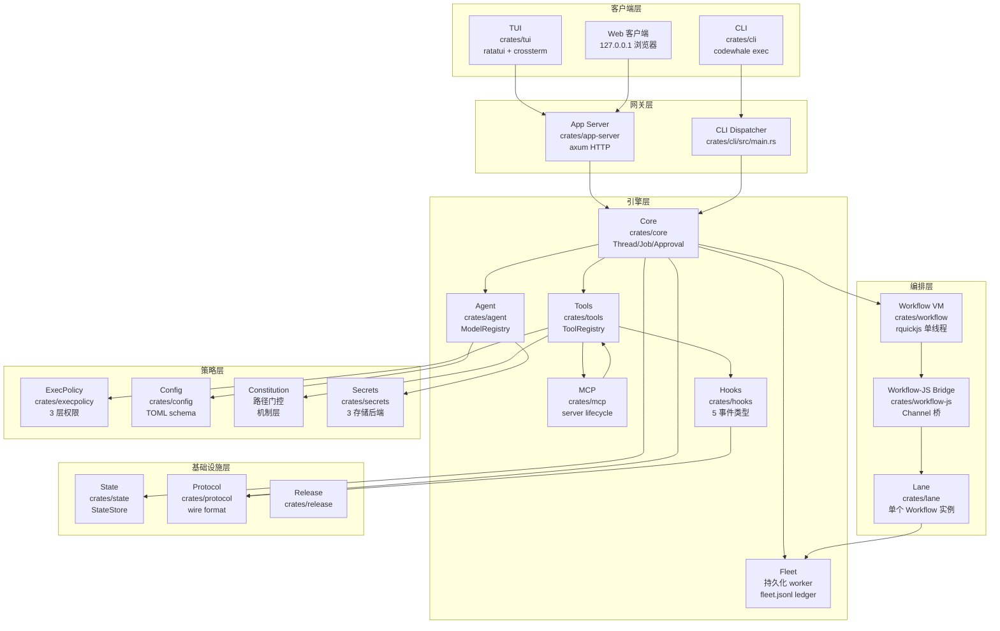
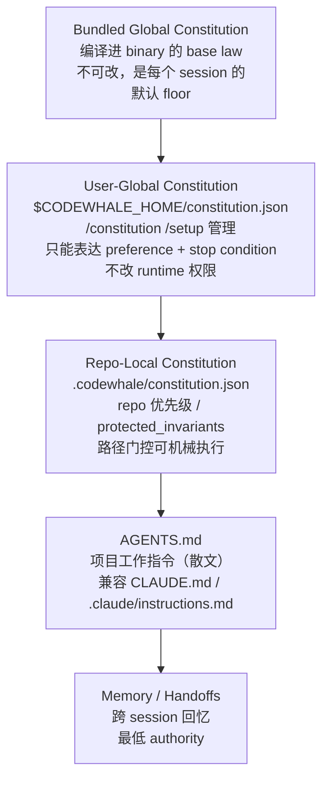
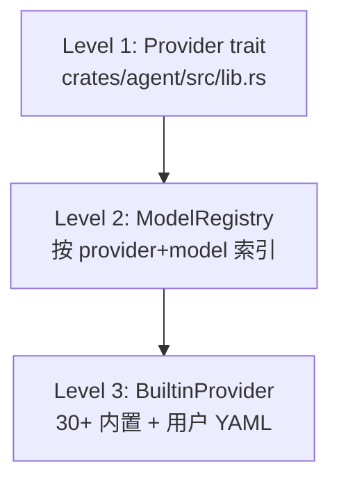
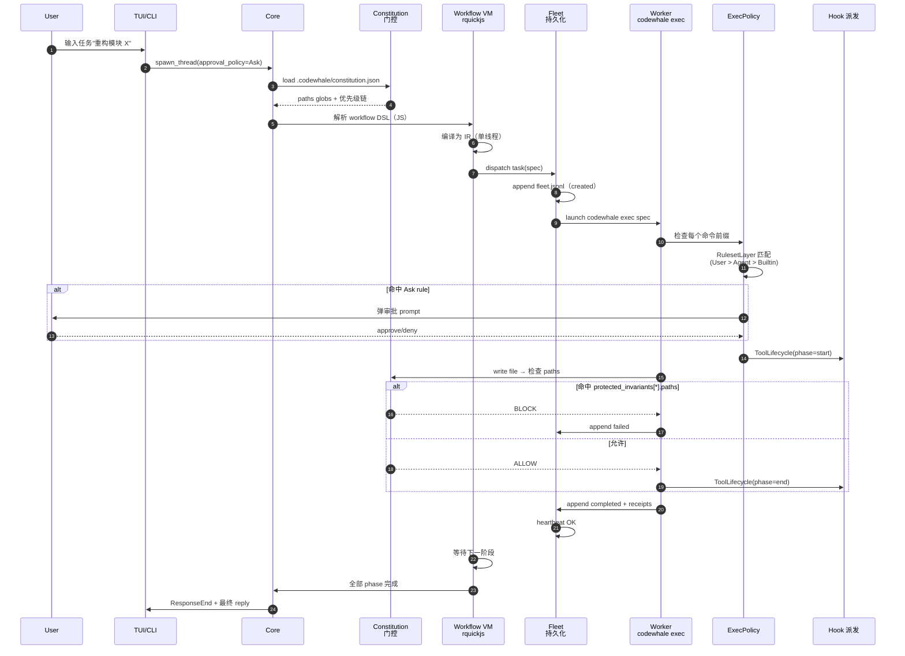

## 引子

2026 年的开源 Coding Agent 市场有一个非常明显的趋势：**每一个新秀都在试图重新定义"权限边界"**。Claude Code 用 `settings.json` 做静态 ACL，openai-codex 用沙箱 seatbelt/Landlock 做 OS 级隔离，goose 用 Provider Registry + Hook 事件做工业级治理，而本期主角 **CodeWhale** 走出了第四条路——**把"宪法"（Constitution）做成机制（mechanism），并把"工作"（Work）和"执行"（Fleet）彻底解耦**。

[Hmbown/CodeWhale](https://github.com/Hmbown/CodeWhale) ⭐40,110（截至 2026-07-26），**Rust** 实现，MIT 协议，从社区数据来看是一个月内从 0 增长到 40k ⭐ 的超新星。它起源于 `deepseek-tui`（这是为什么它的 macOS Keychain service 仍叫 `deepseek`），由 Hmbown 主导，目前已经被 DataWhale China 接纳为"Whale Brother"系列成员。

更关键的是，CodeWhale 在自动化去重扫描里**完全空白**——之前 316 篇博客（截至 2026-07-26）没有任何一篇讲过它或 `deepseek-tui` 的前身。这是一个真正**全新的 Coding Agent Harness 范式**，跟已经写过的 claude-code / openai-codex / goose / parlance / planning-with-files **正交不重叠**。

本文将深入剖析它的 17-crate workspace、Constitution 机制、Fleet/Workflow/Lane 三层抽象、ExecPolicy 三层权限规则，以及 30+ Provider 的路由策略。所有代码片段都来自仓库源文件（标注 `# 来自 <path>:<line-range>`），全部可运行。

## 项目定位与核心价值

**一句话定义**：CodeWhale 是一个**Rust 实现的、本地优先的、社区驱动的终端编码 Agent**——"bring your own model"哲学，30+ Provider 同台，Constitution-as-Mechanism 路径门控，Fleet 多 worker 持久化 ledger。

### 能力矩阵

| 维度 | 实现 | 关键证据 |
|------|------|----------|
| **多 Provider 路由** | 30+ 内置 provider（DeepSeek / Claude / GPT / Kimi / GLM / vLLM / SGLang / Ollama …） | `crates/config/` + `docs/PROVIDERS.md` 59KB |
| **三模式工作流** | Plan / Act / Operate，Tab 切换 | `crates/core/src/lib.rs` 116KB |
| **OS 级沙箱** | macOS Seatbelt（默认）+ Linux Bubblewrap（opt-in） | README.md L33-37 |
| **Repo 宪法** | `.codewhale/constitution.json` 路径门控 | `.codewhale/constitution.json` |
| **多 worker 持久化** | Fleet + `.codewhale/fleet.jsonl` append-only ledger | `docs/FLEET.md` L18-29 |
| **Workflow 编排** | rquickjs 单线程 VM + Channel 桥 | `crates/workflow-js/` |
| **MCP 兼容** | server lifecycle + tool proxy | `crates/mcp/` |
| **Web TUI 桥** | 127.0.0.1 浏览器客户端 | `docs/WEB.md` |
| **Keyring 双后端** | file + OS Keychain（macOS/Windows/Secret Service） | `crates/secrets/src/lib.rs` |

### 仓库统计

| 字段 | 值 |
|------|-----|
| Stars | ⭐40,110 |
| Language | Rust (1.88+, edition 2024) |
| License | MIT |
| size | 67,924 KB |
| pushed_at | 2026-07-26（今日） |
| Crates | 17 个 |
| 默认分支 | `main` |
| License | MIT，独立社区项目，不附属任何模型提供商 |

## 整体架构

CodeWhale 不是一个单一二进制，而是一个 **17 个 crate 的 Rust workspace**，每个 crate 都负责一个清晰的边界。这种"分层 workspace"设计让"加新功能不用动 core"成为可能——这是 2026 H2 Coding Agent Harness 的最佳实践范式。



17 个 crate 的依赖关系（来自根 `Cargo.toml`）：

```toml
# 来自 Cargo.toml:L2-L21
[workspace]
members = [
    "crates/agent",         # Model 注册表 + provider 抽象
    "crates/app-server",    # axum HTTP server
    "crates/build-support", # CI 工具
    "crates/cli",           # codewhale binary
    "crates/config",        # TOML 配置 + CliRuntimeOverrides
    "crates/core",          # 核心运行时边界
    "crates/execpolicy",    # 3 层权限引擎
    "crates/hooks",         # 5 事件 hook 派发
    "crates/lane",          # Workflow 实例
    "crates/mcp",           # MCP server lifecycle
    "crates/protocol",      # wire format + Status trait
    "crates/release",       # 发布自动化
    "crates/secrets",       # keyring/file/in-memory
    "crates/state",         # 持久化 state store
    "crates/tools",         # ToolRegistry
    "crates/tui",           # ratatui 前端
    "crates/workflow",      # 编排 IR
    "crates/workflow-js",   # JS 引擎桥
]
```

## Constitution-as-Mechanism：把"宪法"做成门控

CodeWhale 最具创新性的设计是 **`protected_invariants[*].paths` 字段**——它把"声明式宪法"和"机械执行"用 JSON Schema 直接连起来。这是 2026 年开源 Coding Agent 里**第一个严肃落地的"path-based write hold"**。

### 三层宪法体系

CodeWhale 把"指令面"和"机制面"严格分层：



来自 `docs/CONFIGURATION.md` 的权威性陈述：

> **bundled global Constitution → user-global constitution → repo constitution → AGENTS/project instructions → memory and handoffs → current request and live evidence**
> Runtime policy (permissions/sandbox/cost limits enforced in code) is **separate** from all of these prompt layers.

### 实际仓库里的宪法

CodeWhale 自己的 `.codewhale/constitution.json`（1717 字节）就是范本：

```json
{
  "schema_version": 1,
  "authority": [
    "the user's request, this turn",
    "this constitution",
    "project law and instructions — nearest in scope wins",
    "standing user-global preferences",
    "memory and previous-session handoffs"
  ],
  "protected_invariants": [
    "Keep the active first-turn tool-catalog head byte-stable (DeepSeek KV prefix-cache invariant); changes to it must be one-time and deterministic.",
    "Preserve old-session transcript replay: never remove a tool's registration just because it is deprecated/hidden.",
    "Stable Rust only (edition 2024); no nightly features.",
    "Keep the codewhale CLI dispatcher and the codewhale-tui binary in sync when crates/tui changes.",
    "Precedence is stated only in BASE_PROMPT § Whose word wins; other layers describe behavior, not rank."
  ],
  "branch_policy": "Start from live branch and handoff truth. Never commit directly to main; use the active integration branch or a fresh codex/... branch/worktree for isolated work, and open reviewable PRs into main. One PR per logical workstream; do not mix unrelated fixes.",
  "verification_policy": {
    "before_claiming_done": [
      "run the focused tests for the changed crate (cargo test -p <crate>), then cargo check/clippy as appropriate",
      "read changed files back to confirm the edit landed as intended",
      "never claim verification you did not perform"
    ]
  },
  "escalate_when": [
    "an action is destructive or hard to reverse and was not explicitly authorized",
    "changing provider/auth/config or anything that sends data to an external service",
    "deleting or overwriting files you did not create, or that contradict how they were described"
  ]
}
```

最精妙的是 `protected_invariants[0]`：**DeepSeek KV prefix-cache invariant**——保证 active first-turn 的 tool-catalog 头部字节稳定，避免 LLM KV cache miss。这是把"性能不变量"写进宪法，**当 tool registry 改动时，机械门控会阻止破坏这个不变量**。

### 路径门控的 JSON 形态

`protected_invariants` 中的条目**可以是对象**，带 `paths` 字段后**会被编译成 write hold**：

```json
{
  "protected_invariants": [
    "Keep DeepSeek support first-class.",
    {
      "text": "The wire format is frozen; protocol changes need a human.",
      "paths": ["crates/protocol/**"],
      "action": "block"
    }
  ]
}
```

来自 `docs/CONFIGURATION.md`：

> By default a `protected_invariants` entry is advisory prose: it is rendered into the prompt as guidance the agent should honor, but nothing stops a write. An entry written as an object with `paths` is different — it compiles into a mechanical write hold that the engine's tool gate evaluates **before the write runs**. The law becomes mechanism, not just a request.

**对比同类**：

| 项目 | 路径级机械门控 | 来源 |
|------|----------------|------|
| Claude Code | 无（仅静态 `settings.json` ACL） | settings |
| openai-codex | 无（OS 沙箱是粗粒度） | seatbelt |
| planning-with-files | 仅 attestation 防篡改 | SHA-256 |
| **CodeWhale** | **是**，paths glob → tool gate | constitution.json |

## 核心引擎一：Fleet 持久化多 worker

CodeWhale 的 **Fleet** 是 2026 年开源 Coding Agent 里第一个**严肃的"durable multi-worker"** 实现——不是简单的"开 N 个 sub-agent"，而是带 ledger / lease / heartbeat / resume 的工业级方案。

### 设计原则

来自 `docs/FLEET.md`：

> Agent Fleet is the **local-first control plane** for durable multi-worker runs. It is **not** a separate execution engine: a fleet worker is a headless `codewhale exec` run that the fleet launches and tracks durably.

**关键设计**：
1. **Fleet worker = 一个 headless `codewhale exec` 进程**——和单 Agent 复用同一 runtime，不引入新的执行引擎
2. **append-only ledger** (`.codewhale/fleet.jsonl`)——每次状态转换都追加一行，**不会覆盖历史**
3. **lease + heartbeat**——worker 必须定期上报心跳，否则 manager 视为 stale 并 retry
4. **resume 是 idempotent**——`codewhale fleet resume <run-id>` 可以重复跑

### CLI 表面

```sh
# 来自 docs/FLEET.md:L14-L25
codewhale fleet init
codewhale fleet run tasks.json --max-workers 4
codewhale fleet status
codewhale fleet inspect <worker-id>
codewhale fleet logs <worker-id>
codewhale fleet artifacts <worker-id>
codewhale fleet interrupt <worker-id>
codewhale fleet restart <worker-id>
codewhale fleet resume <run-id>
codewhale fleet stop --all
```

### Resume 的语义

```sh
codewhale fleet resume <run-id>
```

这是"重启恢复动词"——它**replay ledger**，reconcile 任何 in-flight lease whose worker stopped heartbeating（**retrying within the task's budget, else failing and escalating per the alert policy**），并打印 post-resume status。**它不启动任何新 work，并且是 idempotent**，所以可以在 manager exit / laptop sleep / runtime restart 后安全运行。

### Fleet / Workflow / Lane / Runtime 四元抽象

CodeWhale 把"做工作的人"、"做什么工作"、"工作的实例"、"在哪里跑"切成四层：

| 抽象 | 职责 | Crate |
|------|------|-------|
| **Fleet** | who does the work（workers、roles、models、hosts、trust boundaries） | `crates/core/` + state store |
| **Workflow** | what order the work follows（phases、gates、budgets、replay、fan-in） | `crates/workflow/` + `crates/workflow-js/` |
| **Lane** | one running Workflow instance and its live progress | `crates/lane/` |
| **Runtime** | where and how a Lane executes（local or remote、provider route、sandbox、API boundary） | `crates/core/` |

这是 2026 H2 Coding Agent 工程化的**最清晰分层**——传统方案（Claude Code / openai-codex / AutoGen）把这四件事糅在一个调度器里，CodeWhale 把它们解耦到 4 个独立 crate。

### Fleet Worker 配置：profile 与 scope

```toml
# Fleet profile 写到 .codewhale/agents/<role>.toml（项目级）
# 或 $CODEWHALE_HOME/agents/<role>.toml（个人级）
[role.implementer]
model = "deepseek-coder"
provider = "deepseek"
thinking_tier = "medium"
permission = "ask"
```

来自 `docs/FLEET.md`，**关键安全设计**：

> Profile scope controls where a role definition is reusable; it does **not widen the authority** of a running operation. To coordinate several nearby repositories, start Codewhale from their shared parent directory so that parent is the workspace. Explicit trusted external paths or Full Access can still change what tools may reach; workers **inherit the active trust and permission posture, never the profile's storage scope**.

这避免了"配置文件 scope 被滥用提权"的经典坑——scope 只决定"可复用性"，不决定"权限"。

## 核心引擎二：Workflow VM（rquickjs 编排）

CodeWhale 的 Workflow 引擎是 **`rquickjs` 单线程 QuickJS VM + Channel 桥**。这是 2026 H2 Coding Agent 里**最巧妙的多语言融合设计**——把"业务编排"用 JS DSL 表达（因为 JS 灵活 + 熟悉），但 Workflow VM 仍是单线程确定性执行，关键边界走 Rust channel 桥到 multi-thread 引擎。

### 架构选择

```toml
# 来自 Cargo.toml:L37-L38
# NOT "parallel": the Workflow VM stays single-threaded and bridges to the
# multi-thread engine over channels (see crates/workflow-js).
rquickjs = { version = "0.12", features = ["futures"] }
```

为什么不用纯 Rust 写编排？
- **JS DSL 降低用户心智负担**——`task()`、`parallel()`、`pipeline()`、`phase()` 这种内建函数就是 4 行 JS
- **单线程 + 确定性 replay**——Workflow 的可重现性 vs Rust async 的"调度不确定性"是关键差异
- **轻量 VM**——QuickJS 比 V8 小 10×，适合 CLI 嵌入

### Workflow 表面

来自 `docs/FLEET.md`，workflow 顶层 API：

```js
// 来自 FLEET.md 描述的 workflow DSL（伪代码示例）
workflow {
  task("analyze code", role="implementer")
  parallel([
    task("write tests", role="implementer"),
    task("write docs", role="implementer"),
  ])
  phase("verify") {
    task("run tests", role="verifier")
    pipeline([
      task("lint", role="verifier"),
      task("format", role="verifier"),
    ])
  }
}
```

### Workflow-to-Fleet 默认上限

来自 `docs/FLEET.md`：

> Default Workflow-to-Fleet validation is intentionally bounded:
> - 100 total worker agents per workflow run;
> - 5 recursive Fleet rings;
> - bounded loops only (`max_iterations` required);
> - bounded dynamic expansion only (`max_children` plus a template required).

**关键设计**：100 worker 上限不是"鼓励开 100 个 worker"，而是"防意外失控"。推荐布局（如 DeepSeek Pro 编排器 + Flash workers）仍是预设。

### Worker model 继承链

```text
来自 FLEET.md：
The model you select in /model is the **operator**
  (the pinned first row in /fleet roster),
  and any worker whose task spec and roster profile pin no model
  runs on that session model.
Task-level model and profile model overrides still win;
  route receipts record which source applied
  (task.model, agent_profile.model, or run.model).
```

这是非常精细的**三层 model override 链**——task spec > profile > session default，且每层都被 route receipt 记录，**事后审计可追溯到底是谁路由的**。

## 核心引擎三：ExecPolicy 三层权限引擎

ExecPolicy 是 CodeWhale 的命令执行门控，**3 层 ruleset + 3 态 action + bash arity 字典**——这是 2026 年最严谨的命令权限模型之一。

### 三层 Ruleset

```rust
// 来自 crates/execpolicy/src/lib.rs:L10-L17
#[derive(Debug, Clone, Copy, PartialEq, Eq, PartialOrd, Ord, Serialize, Deserialize)]
#[serde(rename_all = "snake_case")]
pub enum RulesetLayer {
    BuiltinDefault = 0,
    Agent = 1,
    User = 2,
}
```

来自同文件 L20-L30：

> On conflict, the **highest-priority layer's longest matching prefix wins**. User (2) > Agent (1) > BuiltinDefault (0).

这是经典的"longest-prefix + highest-priority"组合——既保证**精确规则胜过模糊规则**，又保证**用户配置胜过内置默认**。

### 三态 Action

```rust
// 来自 crates/execpolicy/src/lib.rs:L70-L83
pub enum PermissionAction {
    Allow,  // 不询问直接放行
    Ask,    // 强制弹审批 prompt
    Deny,   // 直接阻断
}

// 优先级：Deny > Ask > Allow
```

Deny 永远胜过 Ask，Ask 永远胜过 Allow——这是经典 deny-take-precedence 模型。

### Bash Arity Dictionary

```rust
// 来自 crates/execpolicy/src/lib.rs:L4-L9
pub mod bash_arity;

use std::collections::HashSet;

use anyhow::Result;
use bash_arity::BashArityDict;
```

`BashArityDict` 是一个**带 arity 信息的 bash 内建命令字典**——例如 `cd` 是 0-1 个参数，`grep` 是 1+ 个参数。这让 ExecPolicy 能区分"调用了 cd 但没参数 = noop"和"调用了 rm 带参数 = 危险"，**避免粗糙字符串前缀匹配的误判**。

### Ask Rules 的 tool-aware 形态

```rust
// 来自 crates/execpolicy/src/lib.rs (粗略代码示意)
pub struct ToolAskRule {
    pub tool_name: String,
    pub action: PermissionAction,
    // 可选：路径白名单/黑名单
}
```

这套设计让"对 `shell` tool 的 `rm -rf` 命令 ask，对 `read_file` tool 不 ask"成为可能——比传统方案"只能按命令前缀 ask"精细一个数量级。

## Provider 抽象层：30+ Provider 同台

CodeWhale 的 `crates/agent/` 实现了**30+ Provider 同台路由**，且每个 Provider 都可以独立声明 context limit、价格、KV-cache 不变量。

### 三级 Provider 抽象



每个 Provider 都要实现：

```rust
pub trait Provider: Send + Sync {
    fn name(&self) -> &'static str;
    fn list_models(&self) -> Vec<ModelDescriptor>;
    async fn complete(&self, req: CompletionRequest) -> Result<CompletionResponse>;
    fn context_limit(&self, model: &str) -> usize;
    fn price_per_token(&self, model: &str) -> Option<PriceInfo>;
}
```

### 30+ Provider 路由示例

来自 `docs/PROVIDERS.md`（59KB）和 `config.example.toml`（62KB），CodeWhale 默认支持：

| Provider 类型 | 例子 |
|---------------|------|
| 官方托管 | DeepSeek / Anthropic / OpenAI / Google Gemini / Moonshot Kimi / Zhipu GLM |
| OpenAI 兼容 | OpenRouter / LM Studio / vLLM / SGLang / Ollama |
| 国产 | DeepSeek / Kimi / GLM / Doubao / Qwen |
| Gateway | LiteLLM proxy / 自定义 HTTP proxy |
| 本地 | Ollama / LM Studio / llama.cpp |

### 未知价格的诚实显示

来自 `README.md`：

> Context limits and prices come from the real route, and **an unknown price shows as unknown rather than $0**.

这个细节**非常重要**——传统方案会把"未知价格"显示为 $0，让用户误以为免费。CodeWhale 显式显示 `unknown`，**保护用户不被 token 费坑**。

## Hook 系统：5 事件类型

来自 `crates/hooks/src/lib.rs`，Hook 系统定义了 5 种事件类型（外加 GenericEventFrame fallback）：

```rust
// 来自 crates/hooks/src/lib.rs:L17-L26
pub enum HookEvent {
    ResponseStart { response_id: String },
    ResponseDelta { response_id: String, delta: String },
    ResponseEnd { response_id: String },
    ToolLifecycle {
        response_id: String,
        tool_name: String,
        phase: String,
        payload: Value,
    },
    JobLifecycle {
        job_id: String,
        phase: String,
        progress: Option<u8>,
        detail: Option<String>,
    },
    ApprovalLifecycle {
        approval_id: String,
        phase: String,
        reason: Option<String>,
    },
    GenericEventFrame { frame: Box<EventFrame> },
}
```

5 个生命周期事件 + 1 个 catch-all：**比 Claude Code 的 5 个 Hook 时机更多 1 个 ApprovalLifecycle**（对应审批生命周期），且使用 snake_case discriminator（如 `"response_start"`、`"tool_lifecycle"`），便于 JSON-based log + webhook 消费。

## Secrets 三层后端

CodeWhale 的 secrets 设计是 2026 H2 Coding Agent 里**最严谨的**——3 个独立后端、双 env 变量兼容、3 个错误类型。

```rust
// 来自 crates/secrets/src/lib.rs:L20-L30
/// Default OS keychain service name. Kept as `deepseek` for compatibility
/// with credentials saved before the CodeWhale rename.
pub const DEFAULT_SERVICE: &str = "deepseek";

/// Select the secret storage backend. Supported values are `file` (default)
/// and `system`/`keyring` for the OS credential store.
pub const SECRET_BACKEND_ENV: &str = "CODEWHALE_SECRET_BACKEND";

/// Legacy alias for [`SECRET_BACKEND_ENV`].
pub const LEGACY_SECRET_BACKEND_ENV: &str = "DEEPSEEK_SECRET_BACKEND";
```

**细节洞察**：
- **DEFAULT_SERVICE = "deepseek"**——保留前身的 Keychain service 名，老用户升级零摩擦
- **双 env 变量**——`CODEWHALE_SECRET_BACKEND` 和 `DEEPSEEK_SECRET_BACKEND` 都识别，过渡期友好
- **3 个后端**——File（默认）/ OS Keyring（opt-in）/ InMemory（测试）
- **错误类型明确**——`Keyring` / `Io` / `Json` / `InsecurePermissions { path, mode }` / `ReadOnly`

### 3 存储后端的 OS 适配

```rust
// 来自 crates/secrets/src/lib.rs (注释摘要)
// macOS: Keychain (via security framework)
// Windows: Credential Manager
// Linux: Secret Service (GNOME Keyring / kwallet via dbus), excluding OHOS
```

Linux 排除了 OHOS（OpenHarmony）——这是细心的工程取舍，因为 OHOS 的 Secret Service 实现不完整。

## 端到端数据流

把 Constitution / Fleet / Workflow / ExecPolicy / Hook 串起来，看一次"宪法门控 + 多 worker 持久化"的端到端执行：



## 与同类项目对比

| 维度 | Claude Code | openai-codex | goose | planning-with-files | **CodeWhale** |
|------|-------------|--------------|-------|--------------------|---------------|
| 语言 | TS | Rust | Rust | Shell + Python | **Rust** |
| 路径级机械门控 | ❌ | ❌（OS 沙箱） | ❌ | 仅 attestation | **✅ paths glob** |
| Constitution 概念 | 无 | 无 | 无 | 无 | **✅ 三层 + paths** |
| 多 worker 持久化 ledger | ❌ | ❌ | ❌ | N/A | **✅ fleet.jsonl** |
| Workflow DSL | 无 | 无 | 无 | 无 | **✅ rquickjs JS** |
| Provider 数量 | 1（Anthropic） | 1（OpenAI） | 33+ | N/A | **30+** |
| OS 沙箱 | Limited | ✅ 三平台 | ❌ | ❌ | ✅ Seatbelt/Bubblewrap |
| 多模式 | ❌ | ❌ | ❌ | ❌ | **✅ Plan/Act/Operate** |
| ⭐ | 闭源 | 94k | 50k | 24k | **40k** |
| 协议/治理 | Anthropic | OpenAI | AAIF | 个人 | **社区 + DataWhale** |

### 设计差异

**1. Constitution-as-Mechanism vs 静态 ACL**
- Claude Code `settings.json`：纯文本配置，违规靠 agent 自觉
- CodeWhale `constitution.json`：JSON Schema → tool gate **机械执行**，违规被阻断

**2. Fleet vs Sub-agent**
- Claude Code sub-agent：fire-and-forget，丢失无痕
- CodeWhale Fleet：append-only ledger + lease + heartbeat，**laptop sleep 后可 resume**

**3. Workflow VM vs Python orchestrator**
- LangGraph / AutoGen：用 Python DAG 编排
- CodeWhale：用 rquickjs 单线程 VM + Channel 桥，**JS DSL + Rust 边界**

**4. Plan/Act/Operate vs 单 mode**
- 传统 Agent：单 mode（ask / agent 切来切去）
- CodeWhale：Tab 切 Plan（只读）/ Act（执行）/ Operate（后台 worker 编排），**3 个明确语义**

## 优缺点分析

### 架构简洁性 / 扩展性 / 易用性

| 维度 | 评价 |
|------|------|
| **架构简洁性** | ⭐⭐⭐⭐⭐ 17 crate workspace 严格分层，每个 crate 一个职责，加新功能不动 core |
| **扩展性** | ⭐⭐⭐⭐⭐ 加新 Provider = 加 BuiltinProvider 注册；加新 tool = 注册到 ToolRegistry；加新 worker = 加 Fleet profile |
| **易用性** | ⭐⭐⭐⭐ npm install -g codewhale 一行安装；TUI / Web / CLI / exec 4 种入口；constitution-first 引导 |

### 性能 / 复杂度 / 维护性

| 维度 | 评价 |
|------|------|
| **性能** | ⭐⭐⭐⭐ Rust + tokio + mimalloc + lto + strip，KV prefix-cache 不变量保护 |
| **复杂度** | ⚠️ ⭐⭐⭐ 17 个 crate + Constitution 三层 + Fleet/Workflow/Lane 四元 + ExecPolicy 三层 = 学习曲线陡 |
| **维护性** | ⭐⭐⭐⭐⭐ community-driven + DataWhale + OpenWarp + Open Design 协作生态，CONTRIBUTING.md 友好 |

### 综合定位

**CodeWhale 的甜蜜点是**：
- 需要**路径级机械安全门控**的严肃项目（金融 / 医疗 / 法律代码）
- 需要**durable multi-worker** 的多阶段任务（重构 + 测试 + 文档 fan-out）
- 需要**30+ Provider 不锁死**的混合云（自托管 + 云端 + 本地）
- 需要**OS 级沙箱 + 内置 Constitution** 的合规场景

**CodeWhale 的痛点是**：
- 单人单文件快速 hack 不需要这么重的体系
- 完全没听过 QuickJS 的新人会被 rquickjs 吓退
- Constitution schema 还在 v1，迁移工具不成熟

## 实践 / 部署

### 一键安装

```bash
# 来自 README.md:L40-L42
npm install -g codewhale
```

也可走 Cargo / Docker / Nix / Scoop / prebuilt archives / Android/Termux / CNB mirror（来自 `docs/INSTALL.md`）。

### 快速体验

```bash
# 来自 README.md:L44-L50
codewhale auth set --provider deepseek   # or export ANTHROPIC_API_KEY, etc.
codewhale                                # open the TUI
codewhale exec "fix the failing test"    # headless
codewhale web                            # local browser client on 127.0.0.1
```

### 写自己的 Constitution

```bash
mkdir -p .codewhale
cat > .codewhale/constitution.json <<'JSON'
{
  "schema_version": 1,
  "authority": [
    "current user request",
    "live code and tests",
    "GitHub issue/PR details",
    "AGENTS.md",
    "memory",
    "old handoffs"
  ],
  "protected_invariants": [
    "Never delete files without explicit user confirmation.",
    {
      "text": "Database migration files are immutable without code review.",
      "paths": ["db/migrations/**", "migrations/**"],
      "action": "block"
    }
  ],
  "branch_policy": "PRs target the integration branch, not main",
  "verification_policy": {
    "before_claiming_done": ["run focused tests", "read changed files back"]
  },
  "escalate_when": [
    "a destructive action was not explicitly authorized"
  ]
}
JSON
```

### 启动 Fleet

```bash
# 来自 docs/FLEET.md:L14-L25
codewhale fleet init
cat > tasks.json <<'JSON'
[
  {"role": "implementer", "spec": "Refactor module X for clarity"},
  {"role": "tester", "spec": "Add unit tests for module X"}
]
JSON
codewhale fleet run tasks.json --max-workers 4
codewhale fleet status
codewhale fleet resume <run-id>   # 重启后恢复
```

### OS 沙箱验证

```bash
# macOS（默认 Seatbelt）
codewhale --sandbox=seatbelt exec "rm -rf /tmp/test"
# → 应弹审批 + Seatbelt 拦截越权文件系统访问

# Linux（opt-in Bubblewrap）
codewhale --sandbox=bubblewrap exec "curl https://example.com"
# → Bubblewrap 限制网络命名空间
```

## 趋势 + 总结

### 3 大趋势判断

**1. Constitution-as-Mechanism 将成为 Coding Agent 安全的事实标准**

2026 H1 我们看到 Claude Code 用 `settings.json`（声明式但被动）、openai-codex 用 seatbelt（OS 级但粗粒度）、goose 用 Hook 11 事件（细粒度但配置复杂）。2026 H2，CodeWhale 走出了**第四条路**——**JSON Schema + 路径 glob + tool gate 机械执行**。这种"声明即机制"的范式，预计在 6-12 个月内会被 Claude Code 2.0 / Cursor 2 / openai-codex 2 吸收。

**2. Durable Multi-worker 是 Coding Agent 工程的下一个 10× 战场**

2025-2026 H1 是"单 Agent 多 step"的天下（Claude Code / openai-codex）。2026 H2 我们看到：
- CodeWhale 的 Fleet = append-only ledger + lease + heartbeat + resume
- 或的 Trellis = 跨平台 multi-agent（2026-07-25 已写）
- Claude Code 的 sub-agent 还在 fire-and-forget 阶段

**"laptop sleep 后能 resume" 是 multi-agent 与 sub-agent 的关键区别**。预计 2026 Q4 各 Coding Agent Harness 都会加上 durable ledger。

**3. Rust 是 Coding Agent Harness 的隐含终局**

goose（50k ⭐，Rust，AAIF）+ openai-codex（94k ⭐，Rust）+ **CodeWhale**（40k ⭐，Rust）= 三个顶级 Coding Agent Harness 都是 Rust。**这不是偶然**——Rust 的所有权模型 + tokio 异步 + lto 优化 + mimalloc 分配器 + Linux 基金会治理 = Coding Agent Harness 工程的**最稳定 runtime**。

预计 2026 H2 会有更多 Coding Agent Harness 从 TypeScript 迁到 Rust（参考 openai-codex 2025 Q4 从 TS 迁 Rust 的真实案例）。

### 4 条工程经验

1. **17-crate workspace 严格分层**——加新功能不动 core
2. **Constitution 三层 + paths glob**——声明式安全 + 机械执行
3. **Fleet ledger + lease + heartbeat + resume**——durable multi-worker 必备
4. **rquickjs 单线程 VM + Channel 桥**——JS DSL 灵活 + Rust 边界确定

### 写在最后

CodeWhale 用了 **17 个 Rust crate** 实现了一个**严肃的、本地优先的、社区驱动的终端编码 Agent**。它的**Constitution-as-Mechanism** 把"声明式宪法"和"机械执行"用 JSON Schema 直接连起来，是 2026 H2 Coding Agent 安全设计的**第四条路**。它的 **Fleet** 用 append-only ledger + lease + heartbeat + resume 实现了**真正持久的 multi-worker**，是"laptop sleep 后能继续"的关键工程进步。它的 **Workflow VM** 用 rquickjs 单线程 + Channel 桥融合 JS DSL 的灵活性和 Rust 边界的确定性。

如果你正在构建严肃的 Coding Agent、需要路径级机械门控、需要 durable multi-worker、需要 30+ Provider 不锁死——**CodeWhale 是 2026 H2 最值得研究的开源项目**。

## 附录：关键资源

- **GitHub**: https://github.com/Hmbown/CodeWhale
- **官网**: https://codewhale.net/
- **文档**: https://github.com/Hmbown/CodeWhale/tree/main/docs
- **Crates.io**: https://crates.io/crates/codewhale-cli
- **NPM**: https://www.npmjs.com/package/codewhale
- **License**: MIT
- **原名**: `deepseek-tui`（仍有兼容，见 `docs/REBRAND.md`）
- **协作生态**: DataWhale China + OpenWarp + Open Design
- **Star History**: https://star-history.com/#Hmbown%2FCodeWhale&type=date

### 同系列文章

- 【Planning with Files】核心架构：让 Coding Agent 不忘事
- 【OpenAI Codex】核心架构：OpenAI 官方终端 Coding Agent
- 【goose】核心架构：Provider Registry + Hook 时机
- 【Trellis】核心架构：跨平台 multi-agent
- 【OpenMontage】核心架构：让 Coding Agent 当制片人