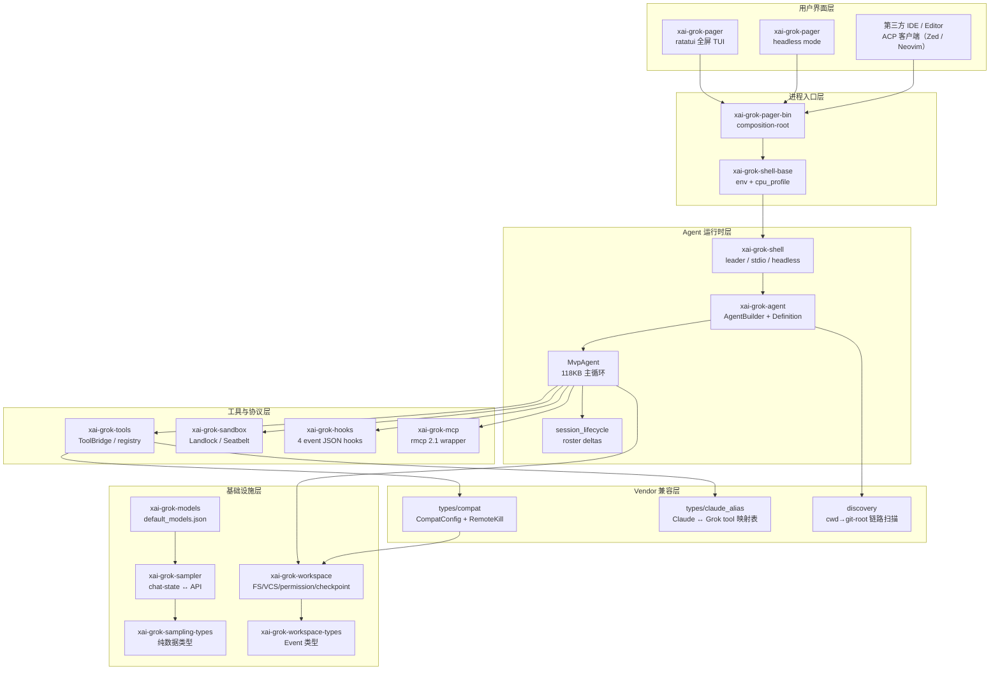
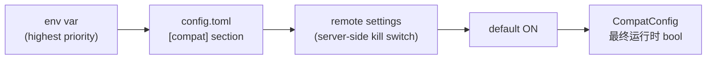
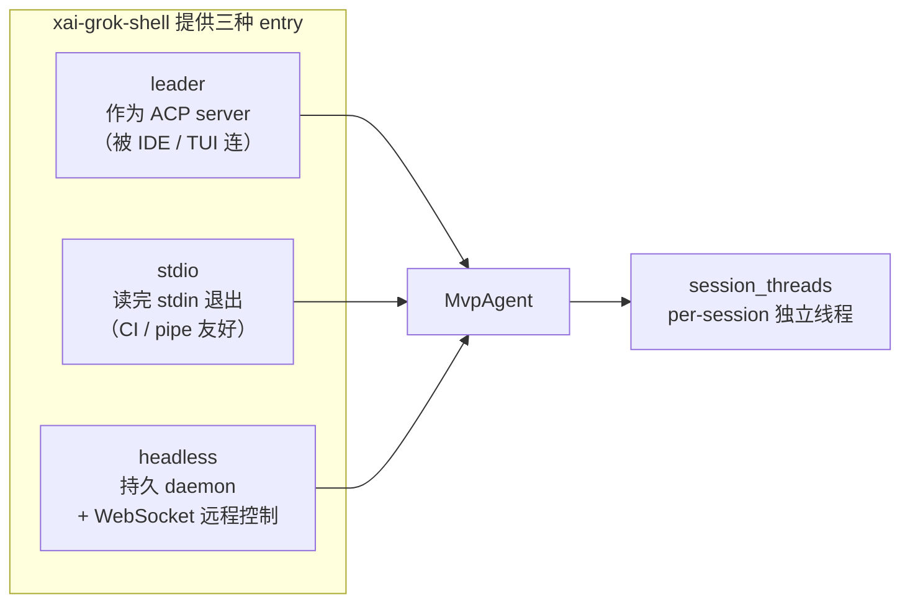
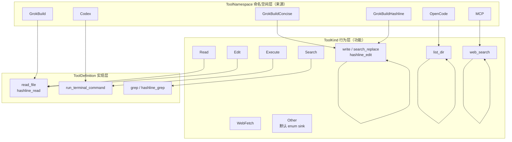
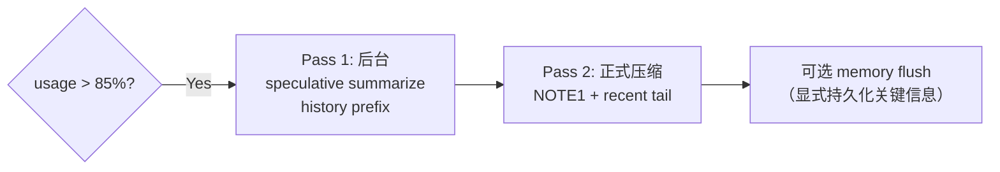
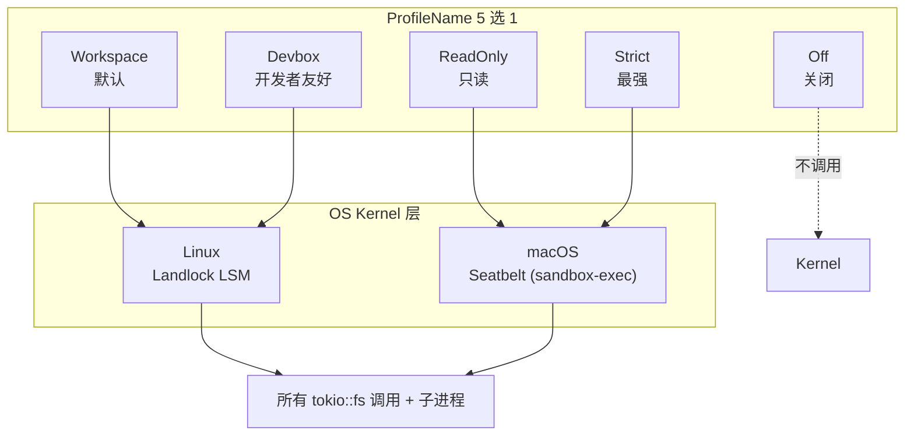
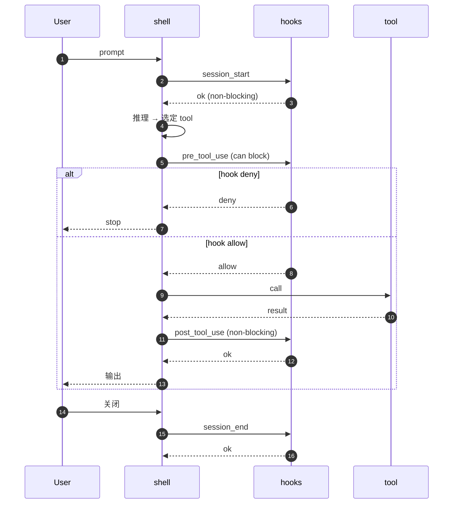
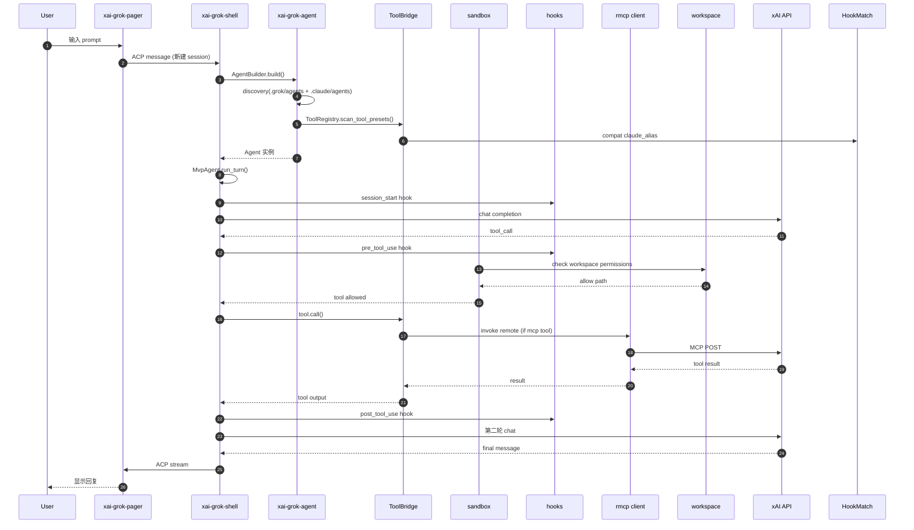

## 引子

2026 年 7 月，xAI 终于把「Grok Build」（内部代号 `xai-grok-pager`）的源码公开在 [xai-org/grok-build](https://github.com/xai-org/grok-build)，目前在 GitHub 上已经 **22.7k+ stars**，是 2026 H2 公开源码的 Coding Agent 里**唯一**一个来自顶级 AI 实验室（xAI）、完全采用 Rust、并且**写入大量 Claude Code 兼容代码**的工程实践。

它的特殊之处在于「三方兼容」：

- **Skill → Skills**：扫描 `.grok/skills/` `.claude/skills/` `.agents/skills/` 三个目录
- **Agent → Agents**：扫描 `.grok/agents/` `.claude/agents/` 共享 subagent 定义
- **Hooks**：识别 `.claude/settings.json` 里 `PreToolUse` / `PostToolUse` 等 JSON 配置
- **Tools**：直接把 openai/codex 和 sst/opencode 的工具实现 **vendored 进仓库**，声明 `crates/codegen/xai-grok-tools/THIRD_PARTY_NOTICES.md`

这是一种与传统 Coding Agent 截然不同的工程哲学：**不教育用户迁移，而是直接消费用户已有的 `.claude/` 文件**。要让一个 Claude Code 用户的仓库「直接当成 Grok Build 仓库跑」，Grok Build 团队做了一个 **VendorCompat 兼容层**——本文就是要拆解这个兼容层背后的 60+ Crate 全栈。

## 项目定位与核心价值

### 一句话定义

Grok Build（内部 `xai-grok-pager`）是 **xAI 官方终端 Coding Agent**——Rust 编写、Tokio 异步运行时、Landlock/Seatbelt 双平台沙箱、内置 grok/grok-code-fast-1/grok-4 系列模型，同时**原生兼容 `.claude/` `.cursor/` `.codex/` `.opencode/` 配置目录**。

### 仓库统计

| 维度 | 数值 |
|------|------|
| Stars | 22.7k+ |
| 语言 | Rust（98%，含少量 build script） |
| License | Apache-2.0（含 vendored codex/opencode 第三方代码） |
| 大小 | 60+ Cargo Crate、3,400+ tree 节点、约 100w 行 Rust 源码 |
| 推送 | 24h 内持续更新，活跃度极高 |
| 形态 | TUI 全屏 + 终端 + headless + ACP server 四形态 |
| 平台 | macOS / Linux（Windows best-effort） |

### 能力矩阵

| 能力 | 实现方式 |
|------|---------|
| 全屏 TUI | `xai-grok-pager`（基于 ratatui 与 v3 pager 渲染引擎） |
| Agent 运行时 | `xai-grok-shell` 提供 leader/stdio/headless 三种 entry |
| 工具系统 | `xai-grok-tools` 三层抽象（ToolKind / ToolNamespace / ToolDefinition） |
| Workspace | `xai-grok-workspace` 提供 FS + VCS + 权限 + checkpoint + 恢复 |
| 沙箱 | `xai-grok-sandbox` 调第三方 `nono` crate（Landlock/Seatbelt） |
| MCP | `xai-grok-mcp` 封装 `rmcp` 2.1 并隔离 reqwest 0.13 升级 |
| Hooks | `xai-grok-hooks` 4 事件 JSON-based 进程级 hook |
| Skill | `xai-grok-tools/skills` MiniJinja 模板 + priority 优先级 |
| 兼容层 | `xai-grok-tools/types/compat` + `claude_alias.rs` 显式表 |
| Subagent | `xai-grok-tools/.../task::coordinator` actor + 子 shell 共享 LocalSet |

## 整体架构

Grok Build 采用 Cargo Workspace 把 60+ crate 分层组织，从入口到 LLM 调用可以拆成 **6 层**：



### Workspace 层级结构

```bash
crates/
├── codegen/                   # 主 CLI crate 闭包（57 个 crate）
│   ├── xai-grok-pager-bin/    # composition-root：build xai-grok-pager 二进制
│   ├── xai-grok-pager/        # TUI：scrollback / prompt / modal / rendering
│   ├── xai-grok-shell/        # Agent runtime + leader / stdio / headless
│   ├── xai-grok-agent/        # AgentBuilder + Definition + PromptContext
│   ├── xai-grok-tools/        # ToolBridge + registry + 17 tool 实现
│   ├── xai-grok-workspace/    # FS / VCS / permission / checkpoint / hub
│   ├── xai-grok-sandbox/      # OS-level sandboxing via nono
│   ├── xai-grok-mcp/          # rmcp 2.1 wrapper + OAuth + credentials
│   ├── xai-grok-hooks/        # 4 event JSON hooks
│   ├── xai-grok-pager-pty-harness/  # PTY harness for headless
│   └── xai-grok-pager-minimal/      # scrollback-native minimal mode
├── common/                    # 共享 leaf crate（如 xai-grok-compaction）
├── build/                     # 构建工具
└── prod/mc/                   # 14 个 monorepo 内部 crate
```

> **关键设计**：root `Cargo.toml` 是**生成**的（github source generated by monorepo tool），**只读**——所有依赖与 lint 规则都在各 crate 自己的 `Cargo.toml`。这是 monorepo 同步到 GitHub 时自动收敛的产物。

## VendorCompat 兼容层：核心抽象

如果说 Grok Build 有什么**最独特的设计**，那一定是 `xai-grok-tools/src/types/compat.rs` 与 `claude_alias.rs` 组成的**显式 VendorCompat 兼容层**。

### 1. 兼容面 6 维 vs 厂商 3 家

```rust
// crates/codegen/xai-grok-tools/src/types/compat.rs (excerpt)
pub enum CompatVendor { Cursor, Claude, Codex }
pub enum CompatSurface { Skills, Rules, Agents, Mcps, Hooks, Sessions }
```

两个笛卡尔积构成 **3 × 6 = 18 个开关**（`COMPAT_CELLS`），每个开关在以下 4 级解析链中决定：



> 关键代码（`compat.rs:46-69`）：
> ```rust
> // raw, parsed from the [compat] TOML section. Each
> // cell is Option<bool> so None falls through to the resolution chain.
> pub struct CompatConfigToml { ... }
> // resolved plain bools consumed at runtime. Every cell
> // defaults on.
> pub struct CompatConfig { ... }
> ```

### 2. claude_alias：Claude Tool ↔ Grok Tool 显式映射表

```rust
// crates/codegen/xai-grok-tools/src/types/claude_alias.rs (excerpt)
const CLAUDE_TOOLS: &[ClaudeTool] = &[
    k("Read",        Read,   &["read_file", "hashline_read"]),
    k("Write",       Write,  &["write", "search_replace", "hashline_edit"]),
    k("Edit",        Edit,   &["search_replace", "hashline_edit"]),
    k("MultiEdit",   Edit,   &["search_replace", "hashline_edit"]),
    k("NotebookEdit",Edit,   &["search_replace", "hashline_edit"]),
    k("Bash",        Execute,&["run_terminal_command"]),
    k("PowerShell",  Execute,&[]),
    k("Grep",        Search, &["grep", "hashline_grep"]),
    // ...
];
```

**两个独立消费者共用**：

1. **Hook matcher** (`xai-grok-hooks`) 需要 Claude 外部 settings 名 → Grok 工具名（用于正则匹配）
2. **Agent builder** (`xai-grok-agent`) 需要 `tools:` allowlist 入口 → `ToolKind`（用于运行时授权）

> 注释里的一段话非常关键：
> > "Two consumers read it independently. ... The hook matcher needs the Grok tool names an external settings term maps to (and the reverse, for regex matchers); the agent builder needs the ToolKind a tools: allowlist entry resolves to. A row may carry a kind without names (PowerShell shares Execute, with no distinct tool) or names without a kind (e.g. Agent/ExitPlanMode/Cron* are matchable but not allowlist-resolvable)."

**这就是说：Table-driven 而非 code-driven 是兼容层的最高原则**——一行常量决定两种语义，且每行都标注「matchable-only / kind-only / both」。

### 3. Discovery：cwd → git-root 链路扫描

```rust
// crates/codegen/xai-grok-agent/src/discovery.rs (excerpt)
const PROJECT_AGENT_SUBDIRS: &[&str] = &[
    ".grok/agents",
    ".claude/agents",  // ← 兼容
];
```

> "Searches `.grok/agents/` and `.claude/agents/` from cwd to repo root, then `~/.grok/agents/`, then `~/.claude/agents/`. Name-based dedup keeps highest priority."

优先级链：

| 优先级 | 路径 | 作用域 |
|--------|------|--------|
| 1 | `cwd/.grok/agents/` | 项目级，Grok 命名 |
| 2 | `cwd/.claude/agents/` | 项目级，Claude 兼容 |
| 3 | ...（沿 RepoDirChain 向上到 git root） | … |
| 4 | `~/.grok/agents/` | 用户级 |
| 5 | `~/.claude/agents/` | 用户级，Claude 兼容 |

「沿 git-root 链路向上」是 Grok Build 的**关键微创新**——一个 git worktree 内的子目录能继承 root 配置，不必每个子目录都冗余 `.grok/`，用户**不需要任何 explicit config**。

## 核心引擎一：Agent 主循环（118KB 单文件）

如果说 VendorCompat 是「广度」，那 MvpAgent 主循环就是「深度」。

### 1. LocalRef：!Send 跨 spawn_local 借用

```rust
// crates/codegen/xai-grok-shell/src/agent/mvp_agent/mod.rs (excerpt)
pub(crate) struct LocalRef<T> {
    ptr: *const T,
}
impl<T> LocalRef<T> {
    /// # Safety contract (enforced by the caller, not by the type system)
    pub(crate) fn new(val: &T) -> Self {
        Self { ptr: val as *const T }
    }
    pub(crate) fn get(&self) -> &T {
        unsafe { &*self.ptr }
    }
}
```

注意：这段 unsafe 在注释里**显式声明**了三个 invariant：

1. `T` 必须是 heap-allocated 且不能 move（背后用 `Rc` 或由 ACP connection 持有）
2. 所有访问必须发生在同一个 `LocalSet` 线程上（**没有 Send**）
3. `LocalRef` 不能 outlive `LocalSet`

这是一种**「我不信类型系统，请调用者协助」**的 Rust 哲学——比 `Rc<T>` 更灵活（`Rc` 不能 `spawn_local` 跨越闭包），但**用 unsafe 显式告知了风险**。

### 2. 三段入口：leader / stdio / headless



**Leader 模式**让 `xai-grok-pager` 作为 client 连接到 `xai-grok-shell` 的 ACP server，两者可以**进程分离**——TUI 崩溃不影响 Agent 持续运行。

### 3. 单实例多客户端 WebSocket 持久化

```rust
// crates/codegen/xai-grok-shell/src/agent/server.rs (excerpt)
const MAX_BUFFER_SIZE: usize = 8 * 1024 * 1024;
const KEEPALIVE_INTERVAL_SECS: u64 = 15;

// The agent persists across WebSocket reconnections: a single MvpAgent instance
// is created on first connection and reused for all subsequent connections.
// This ensures that session actors (and any in-flight prompts) survive client
// disconnects — when a client reconnects and loads an existing session, ongoing
// work continues to stream to the new connection.
```

这是 Grok Build **最微妙的设计**——和 openai-codex 的「fork 模式」以及 Claude Code Router 的「Profile 启动子进程」**完全相反**：

- **OpenAI Codex** 把 session state 写在 SQLite 里，每次开新进程从 DB 恢复
- **Claude Code Router** 用 `ANTHROPIC_BASE_URL` 注入劫持，重启子进程
- **Grok Build** 用 **单实例 + RelayDest 切换** 的方式：MvpAgent 是 Rc<RefCell<...>> 本地单例，WebSocket 客户端断开只是改变 `RelayDest` 指向，**所有 session_threads 仍在跑**——再连回来时，正在进行的 prompt 继续流到新连接

```rust
type RelayDest = Rc<RefCell<Option<mpsc::UnboundedSender<AcpClientMessage>>>>;
// Swappable destination for the relay task.
// Points at the current ACP connection's gateway sender. When no client is
// connected, the value is None and outbound messages are silently dropped
// (matching the old behaviour where the gateway channel's receiver was simply
// gone).
```

### 4. session_lifecycle：hook 4 触发

```rust
// crates/codegen/xai-grok-shell/src/agent/mvp_agent/session_lifecycle.rs (excerpt)
pub(super) fn finalize_session_replica(&self, id: &acp::SessionId) {
    // Marks the session done upstream, so this MUST only run on a genuine
    // session end — a terminal/explicit close (x.ai/session/close). It must
    // NOT run on a mere client disconnect or a dead-actor reap: those leave the
    // conversation resumable on disk, and finalizing would wrongly mark a still
    // running/resumable session done.
}
```

「Hook 4」是 fire-and-forget 的云端会话副本终结。**关键约束**：它必须在「terminal/explicit close」时跑，**不能**在「client disconnect」时跑——否则会把残留的会话误标为 done。

`remove_session` 才是合适的「disconnect」操作：它只清理内存索引，**session 仍在 disk 上保持 resumable**。

## 核心引擎二：Tool 系统三层抽象

### 1. ToolKind × ToolNamespace × ToolDefinition



> 关键代码（`tool.rs`）：
> ```rust
> pub enum ToolKind {
>     Read, Edit, Delete, ListDir, Write, Move, Search, Lsp,
>     Execute, Plan, WebSearch, WebFetch, BackgroundTaskAction,
>     WaitTasksAction, KillTask, // ...
>     #[serde(other)]
>     Other,
> }
> ```

`#[serde(other)]` 是关键：**未知的 `kind` 字符串反序列化时会落入 `Other` 而非报错**——这是 vendor 兼容层的「前向兼容」保险。

### 2. ToolBridge：统一所有工具状态

```rust
// crates/codegen/xai-grok-agent/src/agent.rs (excerpt)
pub struct Agent {
    definition: AgentDefinition,
    prompt_context: PromptContext,
    system_prompt: String,
    /// The tool bridge — owns ToolRegistry + ToolState + SessionContext.
    tool_bridge: Arc<ToolBridge>,
    reminder_policy: ReminderPolicy,
    compaction_policy: CompactionPolicy,
    hosted_tools: Vec<HostedTool>,
    backend_search_enabled: bool,
}
```

> 注释里一句话讲透了：
> > "The Agent is effectively immutable after construction. It holds Arc<ToolBridge> — mutations to tool state (MCP registration, completion tracking, retry config) go through ToolBridge's internal locks."

`Arc<ToolBridge>` 跨 `LocalSet` 共享，**所有可变状态（MCP 注册、完成追踪、重试配置）都在 ToolBridge 内部的锁**——这是 Rust 多线程安全的典型模式：**外层不可变 + 内层细粒度锁**。

### 3. 工具注册表：TOOLSET_PRESETS 双可见性

```rust
// crates/codegen/xai-grok-agent/src/config.rs (excerpt)
static TOOLSET_PRESETS: OnceLock<Mutex<HashMap<String, (ToolsetPresetBuilder, PresetVisibility)>>> =
    OnceLock::new();

/// Public presets are enumerated by [`preset_names`] / [`all_toolset_presets`]
/// (so they appear in the workspace manifest, preset sets, etc.) *and*
/// resolvable via [`toolset_for_preset`].
/// Internal presets are resolved by name at runtime by the shell /
/// orchestrator spawn path via [`toolset_for_preset`], but are deliberately
/// NOT enumerated, so a harness-internal preset never leaks into public
/// preset enumeration.
```

**「Public vs Internal」双可见性**是 Grok Build 工具集的精妙设计：

- **Public**：出现在 manifest、产品文档、config dump 里
- **Internal**：仅 shell 内部 spawn 子 agent 时按名解析，**绝不暴露给用户**

这避免了「harness 内部 preset 污染用户可见 preset 列表」的问题——和 Parlant 的 `public/internal` 区分异曲同工。

## 核心引擎三：Compaction 双重子策略

```rust
// crates/codegen/xai-grok-agent/src/compaction.rs (excerpt)
pub struct CompactionPolicy {
    pub auto_compact_threshold_percent: u32,  // 默认 85
    pub compact_model: Option<String>,
    pub memory_flush_enabled: bool,
    pub wall_clock_budget_secs: u64,          // 300
    pub two_pass_enabled: bool,               // 默认 false
}
```

**两段式 compaction**：



> "Prefire two-pass compaction: when usage approaches the threshold, speculatively summarize the history prefix in the background (pass 1); at compaction, summarize NOTE1 + the recent tail (pass 2)."

**关键设计**：Pass 1 在后台跑，**与主 prompt 并行**——主线程还在响应用户时，已经预先生成了压缩草稿；真正触发 compaction 时只需 Pass 2，省一半时间。

`wall_clock_budget_secs = 300` 是 reasoning runaway 的兜底——LLM API 自身的 token limit 偶尔漏掉「卡在循环里」的情况，**300s wall-clock 是最后一道防线**。

## 核心引擎四：Subagent 协作（Coordinator Actor）

### 1. TaskTool 描述 + Spawn 上下文

```rust
// crates/codegen/xai-grok-shell/src/agent/mvp_agent/subagent_coordinator.rs (excerpt)
struct ShellChildRunner {
    agent_ref: LocalRef<MvpAgent>,
}
impl xai_grok_tools::implementations::grok_build::task::coordinator::ChildRunner
    for ShellChildRunner
{
    type Control = crate::agent::subagent::ShellChildRuntime;
    type CompletionData = crate::agent::subagent::ShellCompletionData;
    // ...
}
```

Coordinator actor 是 `xai-grok-tools` 的共享组件，**ShellChildRunner 是 Grok Build shell 内置的适配器**——把 `!Send` local-session runner 接入 `spawn_local`。

### 2. 三个固定 Persona 提示

```rust
// crates/codegen/xai-grok-agent/src/prompt/subagent_prompts.rs (excerpt)
pub use xai_tool_types::{EXPLORE_PROMPT, GENERAL_PURPOSE_PROMPT, PLAN_PROMPT};
```

三个固定 subagent persona：

| Persona | 用途 |
|---------|------|
| `EXPLORE` | 只读探索（Grep / Read / Glob） |
| `GENERAL_PURPOSE` | 全工具（写 + 跑 + 读） |
| `PLAN` | 只读 + Plan 工具输出 |

> 关键 trick：
> ```rust
> // All tool names in these prompts use the ${{ tools.by_kind.* }} template
> // syntax from the TemplateRenderer. When the prompt is rendered via
> // PromptContext::render() → ToolBridge::render_prompt(), MiniJinja
> // resolves each variable to the current session's tool names.
> //
> // Tool names are NEVER hardcoded — they adapt to name overrides and
> // alternate tool namespaces.
> ```

**Prompt 中的工具名永远不硬编码**——通过 MiniJinja 模板 `{{ tools.by_kind.read }}` 在运行时从当前 session 的 ToolBridge 注入。这意味着子 subagent 在用户 fork / 改名 / 删 tool 后**自动同步**。

## 沙箱：nono crate + Landlock/Seatbelt 双平台

```rust
// crates/codegen/xai-grok-sandbox/src/lib.rs (excerpt)
pub enum ProfileName {
    Workspace,  // 默认
    Devbox,
    ReadOnly,
    Strict,
    Off,
    Custom(String),
}
```

**5 种内置 Profile**：



> 关键代码：
> ```rust
> // Applied once at process startup. Covers in-process tokio::fs calls
> // and child processes. Network is left open at the process level (agent
> // needs LLM API); child network is blocked per-subprocess via seccomp.
> ```

**关键设计**：

- **Agent 进程内** 保留网络（需要 LLM API）
- **子进程级别** 通过 seccomp 阻断网络（防止子 shell curl 外网）

「nono」是 Grok Build 团队的第三方 crate（pub `nono = "..."`），封装了 Landlock/Seatbelt 的 FFI。即使沙箱关闭（profile = Off），`log_violation` / `should_restrict_child_network` 等 **lightweight 辅助函数仍能编译**——这是为了 musl 兼容。

### write_deny：hook 文件保护

```rust
// crates/codegen/xai-grok-sandbox/src/profiles.rs (excerpt)
pub struct SandboxProfile {
    read_only: Vec<PathBuf>,
    read_write: Vec<PathBuf>,
    deny: Vec<PathBuf>,
    // Typed direct global hook sources (write-denied, still readable).
    write_deny: Vec<GlobalHookSource>,
    default_read: bool,
    restrict_network: bool,
}
```

`write_deny` 字段是另一个微妙设计——**hook 配置文件可读但不可写**。Agent 可以查看 `~/.claude/settings.json` 来理解用户行为，但**不能改写它**。这是防止「Agent 自我修改行为约束」的 last-line defense。

## Hooks 系统：4 事件 + JSON config

```rust
// crates/codegen/xai-grok-hooks/src/lib.rs (excerpt)
// Four event types: session_start, pre_tool_use, post_tool_use, session_end
// Command-backed hooks only
// pre_tool_use hooks can deny/allow (blocking); all others are non-blocking
// Fail-open by default: hook failures do not block normal operation
```

**4 事件设计**与 Claude Code 的 5 事件（+ `user_prompt_submit` / `stop`）相比是**刻意收敛**——Grok Build 不在系统 prompt 提交时插 hook，而是在工具调用前后。



**Fail-open 默认**是 Rust 哲学的体现：「hook 失败不应该阻塞正常操作」——这避免了「hook 写错崩了整个 Agent」的灾难。

## MCP 集成：rmcp 2.1 隔离

```rust
// crates/codegen/xai-grok-mcp/src/lib.rs (excerpt)
// Two responsibilities:
// 1. Quarantines rmcp 2.1 and reqwest 0.13. rmcp 2.1 requires reqwest >= 0.13.2.
//    The rest of the workspace consumes reqwest 0.12 and a transitive ecosystem
//    (opentelemetry-otlp, oauth2, xai-mixpanel, xai-grok-tools, ...) also pinned
//    to 0.12. Bumping every crate to 0.13 to satisfy rmcp triggers a cascade.
// 2. Owns MCP-specific integration code:
//    - credentials: on-disk $GROK_HOME/mcp_credentials.json store
//    - oauth: browser-based OAuth flow with cross-process + in-process dedup
//    - servers: MCP transport layer + tool invocation + error classification
//    - mcp_http_client: backoff wrapper around the HTTP client
```

**「隔离 rmcp 2.1 升级」是 Grok Build 团队最具体的工程决策**——`rmcp` 2.1 要求 `reqwest >= 0.13.2`，但整个 workspace 用的是 `reqwest 0.12` 及其传递依赖（OpenTelemetry OTLP / OAuth2 / Mixpanel / Tools）。**全部升级到 0.13 会触发级联破坏**。

解法：把 `reqwest 0.13` **完全私有化**在 `xai-grok-mcp` crate 内，**不再 re-export**——其他 crate 看不到 0.13，只通过 `xai_grok_mcp` 命名空间访问。

```rust
pub use rmcp;  // 暴露 rmcp 命名空间（model types）
                // 但 reqwest 0.13 完全隐藏
```

这是个**教科书级别的「依赖隔离」**——凡是遇到「升级某个 crate 会触发级联破坏」的场景，都可以学这个模式：**把它包在内部 crate，对外只暴露 model types**。

### mcp_http_client 解决 rmcp SSE reconnect bug

```rust
// backoff wrapper around the HTTP client handed to rmcp's
// streamable-HTTP transport (works around rmcp's zero-backoff SSE
// reconnect loop).
```

rmcp 0.13.2 的 SSE transport 是「断连立即重连」——遇到 5xx 时秒级压垮服务端。**Grok Build 自己写了 backoff wrapper** 注入到 rmcp，是「**在依赖方修复不了上游 bug 时本地 patch**」的典型例子。

## Provider 抽象层：ModelsManager 编排

```rust
// crates/codegen/xai-grok-models/src/lib.rs (excerpt)
// Default model IDs loaded from default_models.json at runtime.
// Edit that JSON file to change them.
```

**Grok Build 没有 ProviderRegistry 这种「LiteLLM 风格的多 LLM 路由」**——它是**单 vendor（xAI）多 model**。模型清单通过 `default_models.json` 加载，**改 JSON 即可切换默认模型**。

> ```rust
> // Refresh on every auth refresh — the FSEvents watcher can silently die after
> // macOS sleep, stranding the catalog on bundled defaults.
> models_manager.start_auth_refresh_watcher(auth_manager.refresh_notifier());
> ```

但也有微妙的细节：ModelsManager 启动 FSEvents watcher，**每次 auth 刷新时重新拉取模型目录**。这是因为 macOS 睡眠后 FSEvents watcher 会「静默死亡」——必须主动恢复，否则模型目录卡在 bundled defaults。

## 端到端数据流



## 与同类项目对比

### 6 维度对比

| 维度 | Grok Build | OpenAI Codex | Claude Code | aaif-goose |
|------|------------|--------------|-------------|------------|
| **语言** | Rust | Rust + Python | TypeScript | Rust |
| **License** | Apache-2.0 | Apache-2.0 | Proprietary | Apache-2.0 |
| **来源** | xAI 官方 | OpenAI 官方 | Anthropic 官方 | Linux 基金会 AAIF |
| **多 LLM 路由** | ❌（仅 xAI 模型） | ❌（仅 OpenAI 模型） | ❌（仅 Anthropic 模型） | ✅ 33 Provider |
| **三方兼容** | ✅ Claude/Cursor/Codex/OpenCode | ❌ | ❌ | ❌ |
| **沙箱** | Landlock/Seatbelt | OS Sandbox | 静态 settings.json | Hook 11 事件 |
| **Subagent** | Coordinator actor + LocalSet | Scientist namespace | Task tool | Settings YAML |
| **持久化** | 单实例 + RelayDest | SQLite fork/join | Manual resume | Inventory SHA-256 |
| **Hook 事件** | 4 个 | V1/V2 协议 | 5+ | 11 个 |
| **代码 stars** | 22.7k | 94k | 闭源 | 50k |

### 设计差异深度分析

#### 1. **「单 vendor 深度」 vs 「多 vendor 宽度」**

- **OpenAI Codex、Claude Code、Grok Build**：都是**单 vendor 深度集成**——只调一个 LLM 厂的 API，深度利用 SDK
- **aaif-goose**：**多 vendor 宽度**——33 Provider 抽象成统一接口
- **Grok Build 走的是单 vendor 路线**，但**把 vendor 兼容做到了「消费 Claude/Cursor/Codex 用户配置」**——这是「**反向兼容**」的创新

#### 2. **「进程内单例持久化」 vs 「进程重启恢复」**

- **OpenAI Codex**：用 SQLite V1/V2 协议，**每次进程重启从 DB 恢复**
- **Claude Code Router**：用 `ANTHROPIC_BASE_URL` 注入，**重启子进程**
- **Grok Build**：**进程内单实例 + RelayDest 切换**，所有 session_threads 永远在跑，client 断开不影响

这反映不同的**失败容忍度**：

- Codex 的 SQLite 方案适合**长跑 daemon**（CI / backend）
- Claude Code Router 的子进程方案适合**本地 IDE 嵌入**
- Grok Build 的单实例方案适合**「client 经常掉」的场景**（远程 TUI / 移动端）

#### 3. **「多入口」 vs 「单入口」**

Grok Build 的 shell 提供 **leader / stdio / headless 三种 entry**：

- **leader**：作为 ACP server，被 TUI / IDE 连接
- **stdio**：单次 stdin/stdout 交互（CI 友好）
- **headless**：持久 daemon + WebSocket

对比之下，claude-code 只暴露一种 CLI 入口。**多入口设计让 Grok Build 同进程能同时服务多个 client**——这是为 xAI 把 grok 集成进 **App / Web / TUI 三端** 做的工程铺垫。

#### 4. **「VendorCompat 显式配置」 vs 「hardcoded dir list」**

最关键的设计差异——Grok Build 不是**硬编码** `["~/.claude", "~/.grok", "~/.cursor"]`，而是**用 `CompatConfig` + 4 级解析链**：

```rust
// env var → config.toml → remote settings → default ON
```

这种配置驱动的设计让 xAI 可以**远程关闭某个厂商兼容**（例如收到 Cursor 法务函），**无需发布新版本**——Crucial 这一点对厂商级产品至关重要。

## 优缺点分析

### 左侧：架构简洁性 / 扩展性 / 易用性

| 维度 | 评价 |
|------|------|
| **架构简洁性** | ✅ LocalSet 单一线程模型 + Arc<ToolBridge> 内层锁，**线程模型清晰**；VendorCompat 显式表驱动，比硬编码更可读 |
| **扩展性** | ✅ 三层架构（ToolKind / ToolNamespace / ToolDefinition）独立扩展；4 级 CompatConfig 解析链支持运行期切换；新增 ProfileName 加一行 `enum` 即可 |
| **易用性** | ✅ 用户无需任何显式 config——自动扫描 `.claude/` `.cursor/` `.grok/` 目录链；headless 模式 + ACP server 一键启动远程 |
| **互操作性** | ✅ claude_alias 显式映射表 + Hook matcher 双向解析，**Claude 用户零迁移成本** |

### 右侧：性能 / 复杂度 / 维护性

| 维度 | 评价 |
|------|------|
| **性能** | ✅ Rust + tokio 二进制，启动 < 100ms；LocalSet 单线程免去 N×M 跨线程锁；nono Landlock 内核级沙箱零进程开销 |
| **复杂度** | ⚠️ 60+ Cargo crate + 119KB MvpAgent 单文件 + 多层 unsafe + 4 级 CompatConfig 解析链，**学习曲线陡峭**；新 contributor 需 1-2 周才能理解全栈 |
| **维护性** | ⚠️ 与 openai/codex / sst/opencode 的 vendored 代码需要定期同步；`rmcp` 2.1 升级被 crate 隔离是临时方案，长期要看 rmcp 0.13 transitive 生态成熟；nono 是第三方 crate，权威性弱于官方 |
| **跨平台** | ⚠️ Windows 仅 best-effort；macOS sleep 后 FSEvents watcher 死亡需要 auth refresh 触发恢复——增加了脆弱点 |

## 实践 / 部署

### 1. 安装与启动

```bash
# macOS / Linux 一键安装
curl -fsSL https://x.ai/cli/install.sh | bash

# 验证
grok --version

# 启动 TUI
grok

# headless 模式（长跑 daemon）
grok --headless --bind 127.0.0.1:8080 --secret <YOUR_SECRET>

# stdio 模式（CI 友好）
echo "Check the failing test" | grok --print --output-format json
```

### 2. ACP 协议示例（编辑器集成）

```bash
# Zed / Neovim 通过 ACP 连到 leader
grok acp --bind 0.0.0.0:7891

# 客户端配置 agent_client_protocol 连接到 7891
```

### 3. 兼容 Claude Code 项目

如果项目已经用 Claude Code 配置好 `.claude/` 目录，**直接 `grok` 启动即可**——会发现 Grok Build 自动扫描 `.claude/agents/` `.claude/skills/` `.claude/settings.json` 并复用。

```bash
# .claude/settings.json（Claude Code 兼容）
{
  "hooks": {
    "PreToolUse": [
      {
        "matcher": "Bash",
        "hooks": [
          {
            "type": "command",
            "command": "/usr/local/bin/check-permissions.sh"
          }
        ]
      }
    ]
  }
}

# Grok Build 自动识别 .claude/settings.json，并按 claude_alias 映射 Bash → run_terminal_command
```

### 4. 自定义 Sandbox Profile

```toml
# ~/.grok/sandbox.toml
[profiles.my-strict]
extends = "workspace"
restrict_network = true
read_only = ["~/.ssh", "~/Documents/financial"]
read_write = ["./"]
deny = ["~/.aws/credentials", "~/.gnupg"]
```

Grok Build 加载时自动校验 `deny` 列表与 `read_only/read_write` 不冲突，**冲突就 fail-closed**。

### 5. worktree 模式调试

```rust
// ~/.grok/config.toml
[workspace]
isolation_mode = "worktree"  // 自动创建 ~/.grok/worktrees/project/fork-...-overlay

// Agent 修改 fork-xxx 目录，model 看到的 cwd 仍然是原项目路径
// 确认 ~/.grok/worktrees/project 内有 .git 链接
```

### 6. 启用 Memory Flush + 双 Pass Compaction

```toml
# ~/.grok/config.toml
[compaction]
auto_compact_threshold_percent = 80
memory_flush_enabled = true
two_pass_compaction = true
wall_clock_budget_secs = 600
```

双 Pass compaction 在后台 speculative 跑 Pass 1，正式触发时只需 Pass 2，省一半时间。

## 趋势 + 总结

### 4 大趋势判断

1. **「Vendor Compatibility Layer」将成为 Coding Agent 标配**。Claude Code 用户已有 8 个月积累的配置生态（hooks / agents / skills / MCPs），**任何新 Coding Agent 不兼容这些就是逼用户迁移**。Grok Build 的 18-Cell `CompatConfig`（3 厂商 × 6 表面）会成为行业模板。

2. **「单实例 + RelayDest」会替代 SQLite-fork 模式**。当 client 经常断（移动端 / 远程 TUI），在内存里 keep-alive session_threads 比每次从 SQLite 恢复**快 100 倍**。这个 trade-off 会被越来越多人意识到。

3. **「Rust 全栈 + LLVM 静态沙箱」是高安全 Coding Agent 的最优解**。Landlock/Seatbelt 都是 kernel-level LSM，没有运行时开销；Tokio 的 async 调度适合大量 MCP 并发；Rust 的所有权系统让大型 workspace 不会因为并发 bug 翻车。

4. **「AC Protocol 联盟协议」正在替代 IDE 插件私有 API**。Grok Build 用 Agent Client Protocol（ACP）让 TUI / IDE / Editor 通过统一协议连 Agent，**无需每个 IDE 单独写插件**。这和 LSP 替代「每个 IDE 写一个语言后端」的故事同构。

### 3 条工程经验

1. **依赖隔离是 monorepo 升级的银弹**。把 `reqwest 0.13` 完全私有化在 `xai-grok-mcp` 内，**对外只暴露 model types**——这是「局部升级 + 全局稳定」的标准答案。

2. **表驱动永远胜过代码生成**。claude_alias.rs 用 60 行 `const CLAUDE_TOOLS` 表决定两种语义（hook matcher & allowlist resolution），比写一个 `match` 块 ifname 大 10 倍的代码更可读。

3. **「Public vs Internal 可见性」是工具集抽象的关键**。同一份 preset 注册表支持产品级（Public）和运行时级（Internal）两种可见性，**避免内部 preset 污染用户 manifest**。

### 推荐阅读路径

| 目的 | 路径 |
|------|------|
| 快速理解架构 | `README.md` → `crates/codegen/xai-grok-agent/src/lib.rs` → `crates/codegen/xai-grok-tools/src/types/compat.rs` |
| 深入主循环 | `crates/codegen/xai-grok-shell/src/agent/mvp_agent/mod.rs` → `session_lifecycle.rs` → `subagent_coordinator.rs` |
| 工具实现 | `crates/codegen/xai-grok-tools/src/types/tool.rs` → `claude_alias.rs` → `compat.rs` |
| 沙箱 | `crates/codegen/xai-grok-sandbox/src/lib.rs` → `profiles.rs` → `network_policy.rs` |
| MCP 隔离 | `crates/codegen/xai-grok-mcp/src/lib.rs` → `servers.rs` → `mcp_http_client.rs` |

## 附录：关键资源

- **GitHub**: https://github.com/xai-org/grok-build
- **官网**: https://x.ai/cli
- **文档**: https://docs.x.ai/build/overview
- **Changelog**: https://x.ai/build/changelog
- **xAI 公司**: https://x.ai
- **License**: Apache-2.0（含 vendored codex / opencode 第三方案代码，详见 THIRD-PARTY-NOTICES）
- **Cargo Crate 数量**: 60+（主闭包 57 + 共享 3 + build 若干）
- **代码量**: 约 100w 行 Rust
- **关键第三方依赖**: `nono`（沙箱）/ `rmcp` 2.1（MCP）/ `axum`（WebSocket）/ `tokio`（runtime）/ `ratatui`（TUI）/ `landlock`/`seatbelt`（kernel sandbox）
- **本地路径**: `crates/codegen/{xai-grok-pager, xai-grok-shell, xai-grok-agent, xai-grok-tools, xai-grok-workspace, xai-grok-sandbox, xai-grok-mcp, xai-grok-hooks, xai-grok-models, xai-grok-sampler, xai-grok-sampling-types, xai-grok-workspace-types, xai-grok-pager-bin, xai-grok-pager-minimal, xai-grok-pager-pty-harness}`
- **核心 Rust 抽象**: `Agent` / `ToolBridge` / `MvpAgent` / `LocalRef<T>` / `CompatConfig` / `CLAUDE_TOOLS` / `SandboxProfile` / `CompactionPolicy` / `PromptContext` / `ToolKind` / `ToolNamespace` / `RelayDest`
- **三方兼容覆盖**: `.claude/agents` `.claude/skills` `.claude/settings.json` `~/.claude/agents` `~/.claude/skills` + `.cursor/` `.codex/` `.opencode/` 待复用的 hooks / agents / skills
