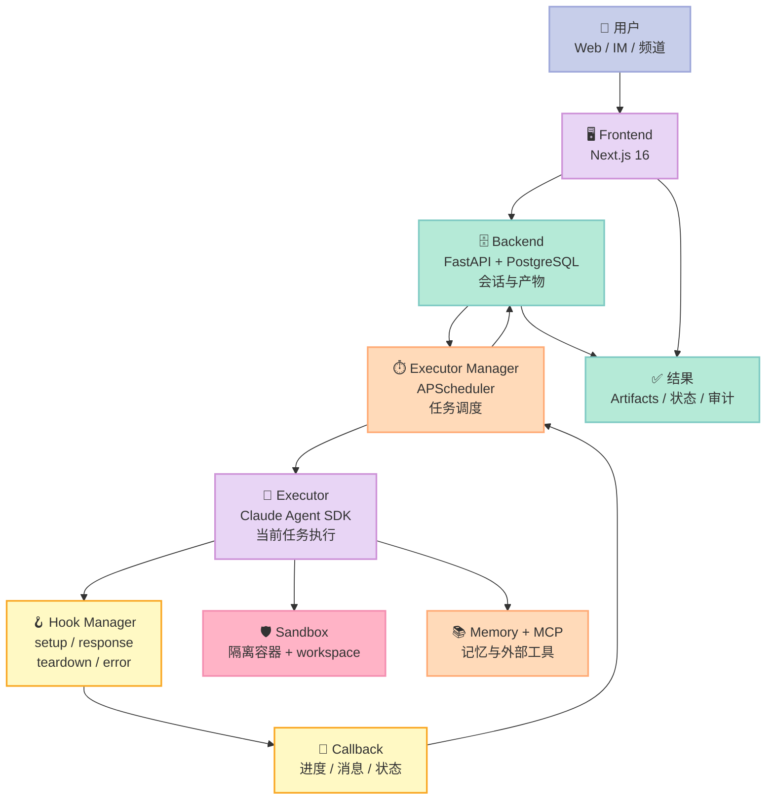
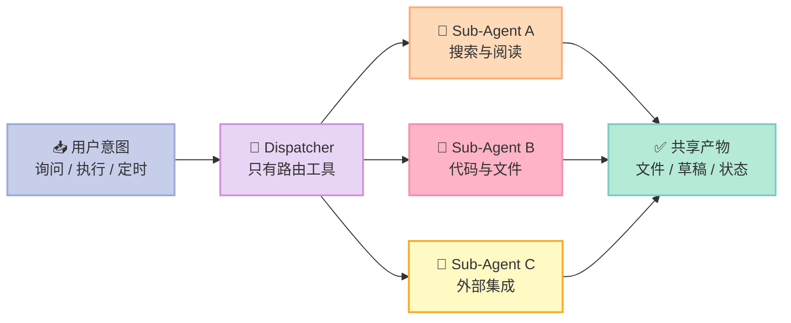
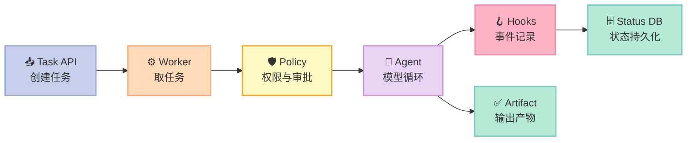

> **真正危险的不是 Agent 会不会调用工具，而是它调用工具之后，没人知道发生了什么。** Poco 的答案不是再写一段更长的系统提示词，而是把“谁负责决策、谁负责执行、谁负责记录”拆成可验证的软件边界。

## 摘要：先给结论

[Poco](https://github.com/poco-ai/poco-claw) 是一个面向长期任务的自托管 Agent 平台：前端负责交互，Executor Manager 负责调度，Executor 负责运行 Claude Agent SDK，Backend 负责持久化，任务则在隔离容器中执行。

它在 Harness 6 件套中最接近 **Sub-Agent + Hook** 的交叉位置：

- **Sub-Agent**：主交互 Agent 只负责判断意图、读写记忆和派发任务；具体工作交给隔离的子任务。
- **Hook**：执行过程通过 `on_setup`、`on_agent_response`、`on_teardown`、`on_error` 四类生命周期事件回传状态。
- **沙箱是横切层**：所有命令在容器里运行，避免“软规则”直接碰宿主机。

我的判断是：**Poco 最有价值的不是 UI，而是把一次 Agent 调用改造成可调度、可回调、可重试的执行单元。**它的不足也很清楚：项目仍强依赖 Claude Agent SDK，跨模型抽象和生产级租户隔离还不是第一优先级。

## 一、项目定位：聊天只是入口，执行才是产品

Poco README 将自己定义为 OpenClaw 的更安全、更易用替代品。仓库快照显示：截至 2026-07-27，项目约 **1,345⭐**，MIT 协议，最近提交为 2026-06-18；技术栈是 Next.js 16、FastAPI、PostgreSQL、Claude Agent SDK 和 APScheduler。

它解决的不是“如何让模型回答一句话”，而是下面这条长期链路：

1. 用户在 Web、IM 或频道中提出任务。
2. 调度器创建会话并安排执行。
3. Executor 在工作区中启动 Agent。
4. Hooks 把进度、消息、错误发回管理服务。
5. Backend 持久化状态，前端可以刷新后继续查看。
6. 任务结束后，产物发布到共享文件区，其他人或 Agent 可以复用。

这比一个 `while True: call_llm()` 循环多了四个物理属性：**身份、生命周期、状态、失败通知**。

### Harness 组件定位

| 组件 | Poco 的实现 | 判断 |
|---|---|---|
| Rule | `CLAUDE.md`、项目配置 | 主要是上下文规则，不是强制权限 |
| Skill | Claude Code 的 Skill 目录、Preset | 可加载 SOP，仍由运行时承载 |
| Sub-Agent | Executor 内配置的 AgentDefinition、独立任务 | 角色和工具边界可分离 |
| Workflow | Executor Manager + APScheduler | 调度与执行解耦 |
| Script | CI、pre-commit、Workspace 准备 | 质量门禁存在，但不是核心卖点 |
| MCP | Memory、Channel Runtime、外部 MCP 配置 | 把外部能力接入 Agent |
| 横切层 | Docker sandbox、回调、持久化 | 决定系统是否可运营 |

## 二、架构：四个服务，一个执行闭环

Poco 的工程切分很朴素：Frontend 不直接运行 Agent，Backend 不承担调度，Executor Manager 不保存业务真相，Executor 只执行当前任务。这种切法看似普通，却避免了一个常见错误：把 Web 请求、模型推理、数据库写入和长任务调度塞进同一个进程。



### 2.1 机制与策略分离

Poco 的核心机制是固定的：

- 任务进入 Executor。
- Executor 准备 workspace。
- HookManager 按顺序触发 setup、response、teardown、error。
- CallbackHook 将事件转换为 `AgentCallbackRequest`。
- Manager 再把状态写回 Backend。

策略则可以替换：

- 使用哪个模型。
- 采用哪种权限模式：`default`、`acceptEdits`、`plan` 或 `bypassPermissions`。
- 启用哪些 MCP Server。
- 给子 Agent 暴露哪些工具。
- 是否启用浏览器、记忆和本地目录挂载。
- 用何种调度间隔和并发上限。

这个边界很重要。**机制负责“什么时候做”，策略负责“允许做什么”。**如果把二者混在一起，每增加一个业务场景，都要改核心执行循环。

### 2.2 完整数据流

```mermaid
sequenceDiagram
    actor User as 👤 用户
    participant UI as 🖥️ 前端
    participant DB as 🗄️ Backend
    participant Sch as ⏱️ Manager
    participant Agent as 🤖 Executor
    participant Hook as 🪝 Hooks
    participant Box as 🛡️ Sandbox

    User->>UI: 创建任务
    UI->>DB: 保存会话与配置
    DB->>Sch: 请求调度
    Sch->>Agent: 派发 prompt + config
    Agent->>Box: 准备 workspace
    Agent->>Hook: on_setup
    Agent->>Box: 执行工具与模型循环
    Agent->>Hook: on_agent_response
    Hook-->>Sch: running callback
    Sch-->>DB: 持久化进度
    Agent->>Hook: on_teardown
    Hook-->>Sch: completed / failed
    Sch-->>DB: 写入最终状态
    DB-->>UI: 查询结果与 artifacts
    UI-->>User: 展示进度和产物
```

## 三、Sub-Agent：不要让一个 Agent 同时当经理和工人

Poco 的架构文件明确写出 **Dispatcher + workers** 模式：精简的交互 Agent 只拥有 memory、spawn、automation 和 draft 工具；Web、文件和集成工具交给子 Agent。

这是一个有效的最小权限（least privilege）设计：

- 交互 Agent 面对用户，负责澄清和路由。
- 子 Agent 面对任务，负责执行。
- 外部集成只挂在确实需要它的子 Agent 上。
- 外部动作先生成 draft，再等待确认。

与“所有工具都给主 Agent”相比，这会多一次派发成本，却减少了上下文污染和误操作面。比如用户只是问“今天有什么安排”，主 Agent 不需要拥有 GitHub 写权限；只有当子任务明确要修改仓库时，才允许它加载对应工具。

### 3.1 Context 隔离的实际边界

Poco 在 Executor 中将配置里的 Agent 定义转换为 Claude SDK 的 `AgentDefinition`，并过滤非法名称、空描述和空 prompt；子 Agent 的模型覆盖被有意禁用。这说明它的抽象重点不是“无限自定义模型”，而是先稳定 **角色、提示词和工具集合**。



## 四、Hook：把“运行中”变成可观测事实

Poco 的 Hook 抽象非常小，只有四个生命周期方法：

```python
from __future__ import annotations

import asyncio
from dataclasses import dataclass, field
from typing import Any


@dataclass
class ExecutionContext:
    session_id: str
    cwd: str
    events: list[dict[str, Any]] = field(default_factory=list)


class AgentHook:
    async def on_setup(self, context: ExecutionContext) -> None:
        pass

    async def on_agent_response(
        self, context: ExecutionContext, message: Any
    ) -> None:
        pass

    async def on_teardown(self, context: ExecutionContext) -> None:
        pass

    async def on_error(
        self, context: ExecutionContext, error: Exception
    ) -> None:
        pass


class AuditHook(AgentHook):
    async def on_setup(self, context: ExecutionContext) -> None:
        context.events.append({"type": "started", "session": context.session_id})

    async def on_agent_response(
        self, context: ExecutionContext, message: Any
    ) -> None:
        context.events.append({"type": "message", "value": str(message)})

    async def on_teardown(self, context: ExecutionContext) -> None:
        context.events.append({"type": "completed"})

    async def on_error(
        self, context: ExecutionContext, error: Exception
    ) -> None:
        context.events.append({"type": "failed", "error": str(error)})


class HookManager:
    def __init__(self, hooks: list[AgentHook]):
        self.hooks = hooks

    async def run(self, context: ExecutionContext, work) -> None:
        try:
            for hook in self.hooks:
                await hook.on_setup(context)
            for message in await work():
                for hook in self.hooks:
                    await hook.on_agent_response(context, message)
        except Exception as error:
            for hook in self.hooks:
                await hook.on_error(context, error)
            raise
        finally:
            for hook in reversed(self.hooks):
                await hook.on_teardown(context)


async def fake_work() -> list[str]:
    await asyncio.sleep(0.01)
    return ["tool:Read", "assistant:done"]


async def main() -> None:
    context = ExecutionContext("demo-1", "/tmp/workspace")
    await HookManager([AuditHook()]).run(context, fake_work)
    print(context.events)


if __name__ == "__main__":
    asyncio.run(main())
```

保存为 `hook_demo.py` 后直接运行：

```bash
python hook_demo.py
```

它会输出 started、两条 message 和 completed。这里有一个容易忽略的工程细节：**teardown 采用逆序执行**。如果未来叠加“写审计日志”“释放浏览器”“上传产物”三个 Hook，后注册的资源先释放，符合栈式资源管理。

### 4.1 CallbackHook 的价值

Poco 的 `CallbackHook` 不负责推理，也不修改模型决策；它只把运行消息序列化成回调请求，并计算 Todo 完成比例。这样前端看到的“进度 60%”不是模型自报，而是任务列表中已完成项目数除以总项目数：

\[
progress = \lfloor completed\_todos / total\_todos \times 100 \rfloor
\]

这种设计仍然不是严格的业务进度——模型可能漏写 Todo——但它比凭借响应文本猜进度可靠，而且回调协议可以继续替换为事件总线、消息队列或 OpenTelemetry。

## 五、Permission 与 MCP：工具不是越多越聪明

Poco 的 `AgentExecutor` 在启动时构造工具权限处理器：计划模式只允许 `Read`、`Grep`、`Glob`、`TodoWrite`、`Task`、`Skill`、`AskUserQuestion` 和 `ExitPlanMode`；用户批准计划后才开放下一阶段。

这是 **策略注入机制** 的一个典型例子：核心循环仍是 Claude SDK 的循环，Poco 只提供 permission handler。

同时，Executor 会按配置注入 Memory MCP、Channel Runtime MCP 和浏览器 MCP。MCP 在这里不是“协议展示”，而是能力边界：

- Memory MCP：让 Agent 通过工具读写长期记忆。
- Channel Runtime MCP：读写频道运行时与共享工作区。
- Browser MCP：只在配置开启时出现。

**Less is More 检查**：

- 模型能学会的：如何组织语言、如何选择下一步工具、如何总结结果。
- 外部系统必须提供的：容器隔离、计划审批、回调持久化、定时调度、文件挂载和 OAuth。
- 不应写进模型提示词的：宿主机边界、凭据保护、任务超时、最终状态落库。

## 六、横向对比：Poco、Boop Agent 与 Claw Orchestrator

这三个项目都把“聊天 Agent”升级成长期执行系统，但协议边界不同。

| 维度 | Poco | Boop Agent | Claw Orchestrator |
|---|---|---|---|
| 核心抽象 | 服务化任务 + Executor | 消息入口 + Dispatcher | 持久化 CLI Session |
| Sub-Agent 边界 | 由配置传入 AgentDefinition，工具受权限模式控制 | Dispatcher 只持有少数工具，子 Agent 承担外部能力 | Council / Autoloop 以工作树和多引擎编排隔离 |
| 状态协议 | Callback 请求回 Manager，再落 Backend | Convex 实时数据库记录消息、记忆、草稿 | Session、事件流、dashboard API |
| Hook 角色 | 执行生命周期与状态回传 | 以 SDK/Convex 事件和任务模型为主 | 运行时事件、熔断、调度、审查流程 |
| 执行环境 | 默认隔离容器，可挂载本地目录 | 个人 Agent 模板，安全责任更多交给部署者 | 包装多个本地 coding CLI，隔离依赖 worktree / runtime |
| 设计重点 | **可运营的执行闭环** | **个人助理的记忆与确认** | **把 CLI 变成可编程多引擎运行时** |

### 为什么不是简单的功能竞争

**Poco 选择服务边界**。它把调度、执行、持久化拆成多个可独立扩缩的服务，适合“很多任务长期运行”的场景，但部署复杂度最高。

**Boop 选择消息边界**。iMessage 是入口，Dispatcher 是交通警察，Convex 是共享状态。它更适合个人使用，架构路径短，但模型运行时和集成服务耦合更紧。

**Claw Orchestrator 选择 Session 边界**。它把 Claude Code、Codex、Cursor Agent 等 CLI 统一包成长期 Session，并用 Council、Fan-out、Autoloop 做更强的编排。它的优势是模型运行时可替换，代价是不同 CLI 的输出和权限语义很难完全统一。

## 七、优缺点：左边是好用，右边是代价

| 架构简洁性 / 扩展性 / 易用性 | 评价 | 性能 / 复杂度 / 维护性 | 评价 |
|---|---|---|---|
| 架构简洁性 | ⚠️ 四服务边界清晰，但本地部署并不轻 | 性能 | ✅ 长任务不阻塞 Web 请求，可由 Manager 调度 |
| 扩展性 | ✅ Hook、MCP、Preset、Git 平台客户端都有插拔点 | 复杂度 | ⚠️ 回调链、数据库、调度器、执行器需要一致的状态协议 |
| 易用性 | ✅ Docker 和 quickstart 降低启动门槛 | 维护性 | ⚠️ Claude SDK、模型配置、沙箱镜像、外部集成共同带来升级矩阵 |
| 机制可理解性 | ✅ HookManager 仅几十行，生命周期直观 | 观测成本 | ⚠️ 必须排查 Frontend → Backend → Manager → Executor → Callback 全链路 |
| 安全默认值 | ✅ 容器执行、计划审批、工具白名单 | 安全风险 | ⚠️ 本地目录挂载会重新扩大权限边界，不能当作绝对沙箱 |

## 八、从零搭建启示：MVP 只需要五个部件

如果从零复刻 Poco，不要第一天就做频道、浏览器、记忆图和多语言集成。最小可行 Harness 可以只有：

1. `POST /tasks`：创建任务并返回 task_id。
2. 一个 worker：从队列取任务，在临时 workspace 执行。
3. 一个 `HookManager`：记录 started、message、completed、failed。
4. 一个 callback/status 表：刷新页面时可以看到真实状态。
5. 一个容器边界：限制工作目录、CPU、内存和超时。

### MVP 数据流



### 可以暂时省略什么

- IM 集成：先用 HTTP API。
- Memory：先用任务数据库，等有召回需求再接向量检索。
- Multi-Agent：先固定一个 worker，工具权限先做好。
- Dashboard：先用轮询接口和日志。
- 多模型：先抽象一个 `ModelRunner`，但只实现一个适配器。

### 三个踩坑预警

**第一，回调不是日志。**日志写在本地，进程死后用户看不到；回调必须有幂等键、重试和最终状态兜底。

**第二，目录挂载会破坏隔离假设。**Poco 支持把宿主机目录挂到 sandbox。方便开发，但如果挂载了整个 home，Agent 的能力边界就重新回到宿主机权限。

**第三，计划审批必须是状态机。**“模型说我已经批准了”不能算批准。审批请求要有服务端 ID、过期时间、用户身份和一次性消费语义；Poco 对 `ExitPlanMode` 设置了 10 分钟过期窗口，这是正确方向。

## 九、设计哲学：Poco 做对了什么，没做什么

### 9.1 符合的 Harness 原则

- **可拆卸性**：Hook、MCP、Preset、Git client 都有明确插口。
- **面向进化**：任务状态、回调和持久化让 Agent 可以从一次性调用成长为长期服务。
- **Less is More**：把调度和安全交给软件，把自然语言决策交给模型。
- **机制与策略分离**：`HookManager` 只负责派发，具体 Callback、Todo、Workspace Hook 负责策略。

### 9.2 Bitter Lesson 的边界

Poco 没有试图手写一套新的推理算法，而是把 Claude Agent SDK 放在执行核心；这是对 Bitter Lesson 的尊重：通用模型能力会提升，业务层更应该投资在状态、权限、工具和反馈回路上。

但它目前的模型运行时仍然偏 Claude。未来如果要真正模型无关，至少需要把以下协议稳定下来：

- tool call 的统一表示。
- stop / interrupt / resume 语义。
- token、成本和延迟统计。
- 子 Agent 交接和取消传播。
- 不同 Provider 的权限结果映射。

## 总结：先把 Agent 变成“可追踪的任务”

Poco 给 Harness 工程的最大启示是：**可靠性首先来自边界，不来自更长的 Prompt。**

一个可运营的 Agent 至少要回答五个问题：

1. 任务是谁创建的？
2. 当前由哪个 Agent 执行？
3. 它能调用哪些工具？
4. 发生了什么，谁能看到？
5. 失败后能否重试、终止或恢复？

Poco 用 Dispatcher、Sub-Agent、Hook、Callback 和 Sandbox 给出了一个偏工程化的答案。它不是所有场景的最佳选择：个人用户可能更喜欢 Boop 的短链路，想统一多个 coding CLI 的团队可能更适合 Claw Orchestrator。但如果你的目标是把 Agent 变成一个**长期运行、可观察、可调度的服务**，Poco 值得从 `executor/app/core/engine.py` 和 `executor/app/hooks/` 开始阅读。

**行动建议**：先复制本文的 Hook MVP，接入一个真实任务队列；再加计划审批；最后才开放 MCP 和本地目录挂载。每一步都用一次失败演练验证：超时、回调失败、重复投递、用户拒绝和容器逃逸。这样你的 Harness 才是在变强，而不是在变大。
