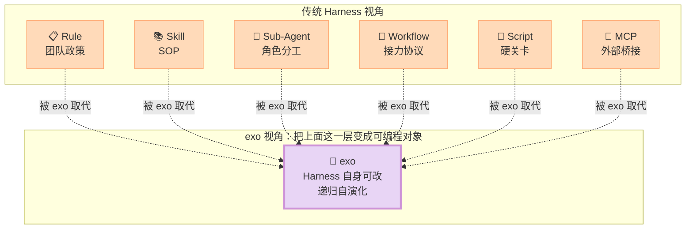
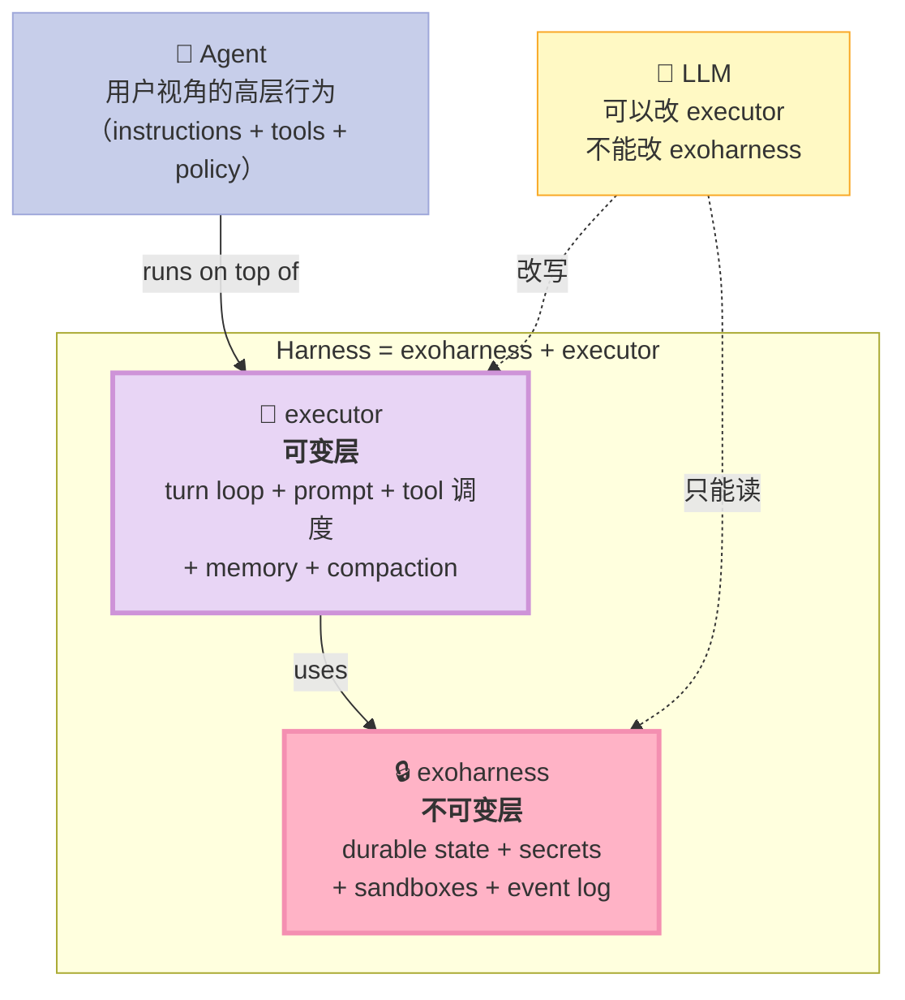
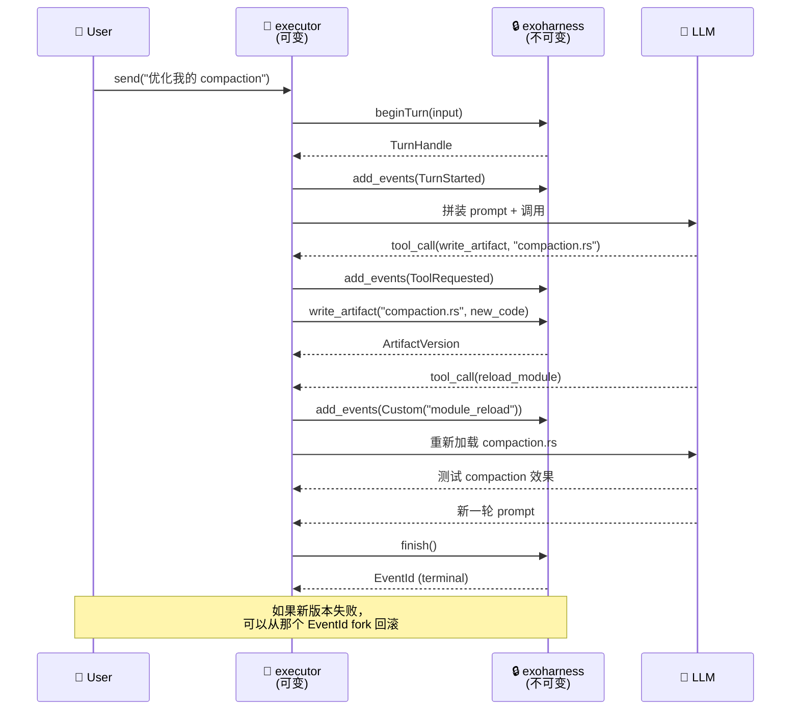

> **一句话结论**：exo 是第一个把 Harness Engineering 推到逻辑终点的开源实现 —— 它**故意把 Harness 拆成两层（exoharness 不可改 + executor 可改）**，让 LLM 能自由重写自己的 turn loop、compaction 策略、tool 调度，同时靠**append-only event log** 保证回滚能力。是 Bitter Lesson "让模型做更多"在 Agent 框架层面的极致答案。

## 引子：当 Agent 能修改自己的 Harness

如果让你写一个 Agent Harness，你会怎么写？

- 把 prompt、tool 列表、memory schema 写死在 Python 文件里？
- 还是写一份 `.toml` 让用户改？
- 再激进一点：让 LLM 自己在运行时重写这套配置？

大部分框架停在第二步。但 exoharness/exo（578⭐，2026-05-20 创建）选择了**第三步**——而且走得最远：

> "Exo is a systems approach to **recursive self improvement**. In short, it's a complete AI agent harness... with the crucial difference that it has **full visibility into both its code and runtime logs**. This allows Exo to **incrementally improve every aspect of itself**, clone itself, and even manage a lineage of clones."
> —— exo README

这意味着什么？意味着**Agent 不再住在 Harness 里** —— Agent **就是** Harness，Harness **就是** Agent。两者融合成一个递归自指的系统。

但这听起来像一个"哲学宣言"，不是一个工程方案。如果 Agent 把自己改崩了怎么办？如果它重写 turn loop 时卡死怎么办？如果它删了自己的 prompt 又回不去了怎么办？

exo 的答案是 **append-only event log + 极简不可变层**。今天这篇文章就把这套设计拆开看。

---

## 一、项目定位：Harness 的"零层"哲学

### 1.1 在 Harness 6 件套矩阵里的位置

Harness 6 件套（Rule / Skill / Sub-Agent / Workflow / Script / MCP）覆盖了"包裹 LLM 的工程组件"。但 exo 关心的不是组件本身，而是**这些组件之上的那一层**：



exo 的核心立场是：**这 6 件套本身都是"被冻结的工程妥协"**。当模型越来越聪明时，写死的 Rule 会被模型自动学会；写死的 Skill 会被模型在 prompt 里现写出来；写死的 Workflow 会被模型重新编排。**与其让 Harness 限制模型，不如让模型在运行时演化 Harness**。

这就是 Bitter Lesson（苦涩教训）在 Agent 框架层面的极致落地方案。

### 1.2 三个核心定位

| 维度 | 内容 |
|------|------|
| **问题** | LLM 模型越来越强，但 Agent Harness 写死在代码里，模型能力被 Harness 限制 |
| **价值** | 把 Harness 拆成"不可变底层 + 可变上层"，让 LLM 自由改写上层（turn loop、prompt、memory 策略、tool 调度） |
| **位置** | 不是某个 6 件套组件，而是**所有 6 件套的元层（meta-harness）** —— 它提供了一个让 6 件套自己重组的容器 |

### 1.3 一句话总结

**exo = 不可变 substrate（exoharness）+ 可变 execution strategy（executor）+ append-only event log**，让 LLM 在保证可回滚的前提下自由演化 Harness 的每一个 bit。

---

## 二、架构分析：exoharness + executor 双层分离

### 2.1 最简架构图

exo 的核心抽象是把 Harness 劈成两半：



### 2.2 数据模型核心

`exoharness` 暴露的数据模型非常精炼（来自 `crates/exoharness/src/types.rs`）：

```rust
// 三层嵌套结构：Harness → Agent → Conversation → Session → Turn
AgentRecord { id, slug, name }
ConversationRecord { id, slug, name, latest_event_id }
TurnRecord { id: TurnId, session_id: SessionId }

// Event 是 append-only log 的最小单元
enum EventData {
    ConversationCreated { ... },
    SessionStarted { ... },
    SessionEnded { ... },
    TurnStarted { ... },
    Messages(Vec<Message>),      // LLM 输入输出
    ToolRequested(ToolRequest),  // 模型请求 tool
    ToolResult(ToolResult),      // harness 返回结果
    Error(String),
    ArtifactWritten { ... },
    SandboxCreated/Started/Stopped,
    SandboxSnapshotted,
    Custom { event_type, payload },  // 执行器自定义事件
}

// 一个事件只有两类来源：exoharness 内部事件 / executor 自定义事件
// 没有第三类——这保证 log 是 canonical 历史
```

核心洞察：**Event 是不可变的（append-only），但 EventData::Custom 允许执行器**塞任意 payload**——这给了 LLM 修改 Harness 的全部自由度，但这些修改都进 log，可回滚**。

### 2.3 exoharness 与 executor 的契约边界

```rust
// crates/exoharness/src/types.rs 第 21-34 行
pub trait ExoHarness: Send + Sync {
    // 只暴露：Agent / Binding / Secret 管理
    async fn list_agents(&self) -> Result<Vec<Arc<dyn AgentHandle>>>;
    async fn new_agent(&self, request: NewAgentRequest) -> Result<Arc<dyn AgentHandle>>;
    async fn list_secrets(&self) -> Result<Vec<SecretMetadata>>;
    async fn put_secret(&self, request: PutSecretRequest) -> Result<SecretId>;
    // ... 没有任何 turn loop / prompt / tool 逻辑
}
```

```rust
// crates/executor/src/harness_executor.rs 第 32-58 行
pub trait HarnessExecutor: Send + Sync + Clone + 'static {
    type Prepared: Send + Sync + 'static;
    async fn prepare_conversation(...) -> Result<()> { Ok(()) }
    fn prepare_request(&self, request: &SendRequest) -> Result<Self::Prepared>;
    async fn execute_turn(
        &self,
        agent: &dyn AgentHandle,
        conversation: &dyn ConversationHandle,
        turn: Arc<dyn TurnHandle>,
        agent_config: &AgentConfig,
        conversation_config: &ConversationConfig,
        prepared: &Self::Prepared,
        stream_mode: ExecutorStreamMode<'_>,
        turn_trace: Option<&dyn TurnExecutionTrace>,
    ) -> Result<()>;
}
```

注意 `prepare_conversation` 默认为空实现 —— executor **自己决定**要不要做 prompt 预热、memory 加载、tool 注册。

| 层 | 职责 | 是否可被 LLM 改 | 实现位置 |
|----|------|------------------|----------|
| **exoharness** | durable state、secrets、sandboxes、append-only event log | ❌ 不可改 | `crates/exoharness/` |
| **executor** | turn loop、prompt assembly、memory/compaction 策略、tool 调度 | ✅ 可改 | `crates/executor/` |
| **agent config** | 单个 agent 的 instructions + tools + model | ✅ 可改（运行时） | artifact `config/executor.json` |

---

## 三、核心机制：append-only Event Log + 时间旅行

### 3.1 EventLog 的唯一真相

exo 的整个哲学锚定在一个数据结构上：**append-only event log**。它是 canonical 状态，**不能被任何代码删除或修改**。

```rust
// crates/exoharness/src/types.rs 第 39-50 行（来自 spec.md 描述）
// Event log 暴露 3 个 API：
async fn get_events(&self, query: Option<EventQuery>) -> Result<GetEventsResult>;
async fn watch_events(&self, after_exclusive: Bound<EventId>) -> Result<EventStream>;
async fn get_event(&self, id: EventId) -> Result<Option<Event>>;
async fn add_events(&self, request: AddEventsRequest) -> Result<AddEventsResult>;
async fn fork(&self, request: ForkConversationRequest) -> Result<Arc<dyn ConversationHandle>>;
```

5 个 API 简单到极致：**读（get_events/watch_events/get_event）+ 写（add_events）+ 分叉（fork）**。

为什么是 append-only 而不是 mutable state？

| 原因 | 说明 |
|------|------|
| **递归安全的根** | 如果状态可变，Agent 改自己时就不知道"什么是 ground truth"。event log 就是 ground truth |
| **时间旅行** | 任意一个 event id 都是 checkpoint。从那里 fork = 重启 |
| **审计完整** | Agent 的每一句 prompt、每一个 tool call 都进 log。可以问它"为什么这么改" |
| **跨 clone 的血统** | 多个 exo clone 共享 log，可以比较谁优谁劣 |
| **Bitter Lesson 友好** | 模型变强后，可以重新解读历史 log，不需要兼容旧的状态格式 |

### 3.2 BeginTurn 协议：把"写"变成"拿到 handle 后写"

`beginTurn` 是 exoharness 的关键设计 —— **一次性原子接受 user input + 返回 TurnHandle**：

```rust
// crates/executor/src/harness_executor.rs 第 151-178 行
async fn send(
    &self,
    agent: Arc<dyn AgentHandle>,
    conversation: Arc<dyn ConversationHandle>,
    request: SendRequest,
) -> Result<SendResult> {
    let (mut agent_config, conversation_config, model_override) = tokio::try_join!(
        self.get_agent_config(agent.as_ref()),
        self.get_conversation_config(conversation.as_ref()),
        get_conversation_model_override(conversation.as_ref()),
    )?;
    apply_conversation_model_override(&mut agent_config, model_override);
    let prepared = self.executor.prepare_request(&request)?;
    // 🔑 关键：beginTurn 同时原子接受 input + 返回 handle
    let turn = conversation
        .begin_turn(BeginTurnRequest {
            session_id: request.session_id,
            input: request.input,
        })
        .await?;
    // ... 之后的所有 append 都走 turn.handle.add_events()
}
```

传统 agent 框架的痛点：先"保存 user input"再"开始处理"，中间可能丢消息。exo 的 `beginTurn` 把这两步原子化，**handle 一拿到就保证 input 进了 log**，后面不管中途崩几次都不会丢输入。

### 3.3 自演化闭环示意



每一步都进 event log，每一步都可回溯。这就是 **"让 LLM 自己改 Harness 还不爆炸"** 的工程答案。

---

## 四、源码深挖：5 个核心文件

### 4.1 `harness_executor.rs`：Harness Runtime 入口

这是 exoharness 和 executor 之间的"胶水层"，约 270 行，关键设计是 **双缓存（agent config / conversation config）**：

```rust
// crates/executor/src/harness_executor.rs 第 60-76 行
pub(crate) struct ExecutorHarnessRuntime<E> {
    executor: E,
    tracer: Arc<dyn ExecutionTracer>,
    agent_config_cache: Arc<RwLock<HashMap<exoharness::AgentId, AgentConfig>>>,
    conversation_config_cache: Arc<RwLock<HashMap<exoharness::ConversationId, ConversationConfig>>>,
}
```

每次 `send()` 都并行加载三份配置：

```rust
let (mut agent_config, conversation_config, model_override) = tokio::try_join!(
    self.get_agent_config(agent.as_ref()),
    self.get_conversation_config(conversation.as_ref()),
    get_conversation_model_override(conversation.as_ref()),
)?;
```

为什么并行？因为 agent config 和 conversation config **都存在 exoharness artifact 里**（路径是 `config/executor.json`），并行读取 = 并行走 HTTP/RPC。**这就是 exoharness 抽象的好处：把 state 全推到下面那层，executor 只管调度**。

### 4.2 `harness_config.rs`：配置 = 不可变 artifact

```rust
// crates/executor/src/harness_config.rs 第 11-12 行
pub(crate) const AGENT_CONFIG_ARTIFACT_PATH: &str = "config/executor.json";
pub(crate) const CONVERSATION_CONFIG_ARTIFACT_PATH: &str = "config/executor.json";

// 第 90-104 行
async fn latest_artifact_from_agent(
    agent: &dyn AgentHandle,
    path: &str,
) -> Result<Option<Artifact>> {
    let latest_version = latest_artifact_version(agent.list_artifacts().await?, path);
    let Some(latest_version) = latest_version else {
        return Ok(None);
    };
    agent
        .read_artifact(ReadArtifactRequest {
            artifact_id: latest_version.artifact_id,
            version: Some(latest_version.version),
        })
        .await
}
```

**核心洞察：agent config 不是一个 SQL row，而是一个 immutable artifact 的 latest version**。LLM 修改 agent config = 写入新 version，老 version 还在 log 里 → 自动 undo 支持。

`max_by_key(|artifact| artifact.version)` 这行就是整个配置的真相：**永远取最大 version**，没有"update"操作。

### 4.3 `scheduler_runtime.rs`：自演化场景的"定时触发"

exo 把"定时任务"也做成了一等公民，因为自演化需要"定期重跑同一个 task 比对效果"：

```rust
// crates/executor/src/scheduler_types.rs 第 7-10 行
pub const DEFAULT_MAX_OUTPUT_BYTES: u64 = 200_000;
pub const MAX_OUTPUT_BYTES: u64 = 2_000_000;
pub const DEFAULT_TASK_LEASE_MS: u64 = 10 * 60 * 1_000;
pub const DEFAULT_COMMAND_TIMEOUT_MS: u64 = 10 * 60 * 1_000;

// 第 51-58 行
pub enum ScheduledTaskSandboxMode {
    #[default]
    Agent,        // 用 agent 的 sandbox
    Conversation, // 用 conversation 的 sandbox
    TaskFresh,    // 每次新建
}

// 第 86-134 行：完整的生命周期
impl ScheduledTaskRecord {
    pub fn new(request: NewScheduledTask, now_ms: u64) -> Result<Self> { ... }
    pub fn is_due(&self, now_ms: u64) -> bool {
        self.enabled
            && self.next_run_at_ms <= now_ms
            && self.lease.as_ref().is_none_or(|lease| lease.expires_at_ms <= now_ms)
    }
    pub fn claim(&mut self, now_ms: u64, lease_ms: u64) {
        self.lease = Some(ScheduledTaskLease { ... });
    }
}
```

**关键设计：lease 机制**。exo 是个分布式可克隆系统，多个副本可能同时尝试 claim 同一个 task。`claim` 设 lease，`is_due` 检查 lease 是否过期 —— 这是经典的分布式锁，**保证自演化任务不重复执行**。

### 4.4 `sandbox.rs`：可快照的沙箱

exo 的 sandbox 是 immutable snapshot chain：

```rust
// crates/exoharness/src/sandbox.rs 第 25-35 行
pub enum SandboxKey {
    AgentSandbox {
        agent_id: String,
        sandbox_id: String,
    },
    ConversationSandbox {
        conversation_id: String,
        sandbox_id: String,
    },
}

// 第 78-82 行（节选）
pub struct SandboxSpec {
    pub image: String,
    pub mounts: Vec<SandboxMount>,
    // ...
}

// spec.md 第 60-61 行描述：
// Snapshots allow time travel to also rewind sandbox state.
```

每次 sandbox 状态变化（创建、启动、停止、快照），都生成一个 snapshot id 写入 event log。这意味着 **sandbox state 也可以 time travel**——自演化时改坏了 sandbox 状态，可以恢复到上一个 snapshot。

### 4.5 `harness_tool.rs`：Built-in / Library / Agent 三层信任

tool 来源分了三个信任级别，**最低的那个是 LLM 自己生成的**：

```rust
// docs/tools.md 第 14-30 行
// Built-In Tools: first-party, reviewed with exo
// Library Tools: trusted by user, NOT generated by LLM
// Agent Tools: generated by LLM, narrowest scope

// 第 65-78 行：Agent tool 加载规则
The basic harness loads them from `.exo/agent-tools/` when agent tool creation
is enabled. That setting is enabled by default and can be disabled per agent.

The loader:
- imports the module's default export
- verifies it looks like a `Tool`
- validates `initialization` against `initializationParameters`
- initializes the tool with source `"agent"`
- registers the resulting `ToolInstance`

Agent tool directory loading scans `.ts` files and ignores `.source.ts` files,
// which keep the original generated source beside the validated wrapper.
```

**关键设计：`.source.ts` 文件** —— LLM 生成的 tool 会同时保存**生成时的源码**（`.source.ts`）和**验证后的 wrapper**。如果 wrapper 里有恶意代码，diff 一下就能看出来。这就是 "Bitter Lesson + 安全"的平衡点：**让 LLM 自己写 tool，但所有生成物都进 log 可审计**。

---

## 五、对比分析：exo vs 主流 Harness

### 5.1 vs Claude Code / OpenClaw / Pi-Agent（封闭 Harness）

| 维度 | Claude Code | exo |
|------|-------------|-----|
| **Harness 修改权限** | ❌ 冻结在 Anthropic 服务端 | ✅ 运行时由 LLM 改写 |
| **状态存储** | 服务端数据库（黑盒） | append-only event log（白盒可审计） |
| **自演化能力** | ❌ 每次启动都是同一份 Harness | ✅ 每个 clone 可以有自己的 Harness 版本 |
| **回滚机制** | 服务端 snapshot（不透明） | event log fork（任意 event_id 都能 fork） |
| **模型耦合** | 强耦合 Claude | 完全模型无关（用 lingua 标准） |
| **目标用户** | 终端用户 | 想要"自己养 Agent"的研究者/公司 |
| **成熟度** | 生产级 | 实验级（578⭐，5 月创建） |

Claude Code 是 "**Harness as Product**"，exo 是 "**Harness as Substrate**"。两者面向不同人群。

### 5.2 vs LangChain / AutoGen（写死的 turn loop）

```python
# LangChain AgentExecutor 的 turn loop（典型模式）
while iteration < max_iterations:
    thought = llm.invoke(state)  # LLM 推理
    if thought.tool_calls:
        for call in thought.tool_calls:
            result = tool.run(call.args)  # tool 执行
            state.append(result)        # 写状态
    else:
        return thought.content  # 终止
```

这是 **"Harness 写死了 turn loop"** 的典型。LLM 只能改 prompt，不能改 loop 结构。

exo 反过来：**turn loop 是 executor 的事，executor 自己写，自己改**：

```typescript
// exo TypeScript executor 的 turn loop（伪代码）
class BasicHarness {
  async executeTurn(turn: TurnHandle, ctx: ExecutionContext) {
    while (true) {
      // 1. 拼 prompt（这一段 LLM 可以改）
      const messages = await this.materializePrompt(ctx);
      // 2. 调 LLM
      const response = await this.model.complete(messages);
      // 3. 落 event
      await turn.addEvents([{ Messages: [response] }]);
      // 4. 检查是否结束（LLM 可以改这个判断）
      if (this.shouldFinish(response)) break;
      // 5. 执行 tool（tool 可以是 LLM 自己生成的）
      for (const toolCall of response.tool_calls) {
        const result = await this.tools.execute(toolCall);
        await turn.addEvents([{ ToolRequested: ... }, { ToolResult: ... }]);
      }
    }
    await turn.finish();
  }
}
```

executor 自己定义 `shouldFinish`，自己定义 `materializePrompt`，自己定义 `tools.execute`。**整个 turn loop 都是 executor 的内部代码，LLM 改 executor 就等于改 turn loop**。

### 5.3 vs MetaGPT / CrewAI（角色即一切）

| 维度 | MetaGPT | exo |
|------|---------|-----|
| **抽象核心** | Role / SOP 文本 | Event log / artifact |
| **修改入口** | 改 .py 里的 Role 类 | 改 executor + 写新 artifact |
| **持久化** | 文件系统（共享目录） | exoharness 强 schema（append-only log） |
| **追溯能力** | 弱（log 不标准化） | 强（log 是 canonical，可 query） |
| **自演化** | ❌ 角色写死 | ✅ LLM 改 executor = 改角色定义 |

MetaGPT 把"角色"当成头等公民，写死在代码里。exo 把"角色"消解成"executor 的一段代码" —— 角色只是 executor 的某种实现细节。

### 5.4 vs OpenHands / Devin（sub-agent 编排）

OpenHands 强在 multi-agent orchestration，exo 强在 **单 agent 的递归深度**：

| 维度 | OpenHands | exo |
|------|-----------|-----|
| **核心抽象** | Controller + EventStream | exoharness + executor |
| **多 agent** | ✅（强） | ❌（单 agent + clone） |
| **单 agent 深度** | 固定 turn loop | 可改 turn loop |
| **状态可审计** | 中（event stream） | 极强（append-only + UUIDv7） |
| **自演化** | ❌ | ✅ |
| **生产可用** | ✅（已有用户） | ❌（实验阶段） |

**OpenHands 是"怎么让多个 Agent 配合"，exo 是"怎么让单个 Agent 在长时间内越变越强"**。两者解决不同问题，但 exo 的 event log 思路对 OpenHands 也有借鉴价值。

---

## 六、深度设计哲学：Bitter Lesson 的极限

### 6.1 "Less is More" 的极致

exo 把所有"聪明但会被模型学会"的代码都赶出了 exoharness：

| 应该赶出 exoharness | 应该留在 exoharness |
|---------------------|---------------------|
| ✅ turn loop | ❌ append-only log（模型改不动 log 才有意义） |
| ✅ prompt assembly | ❌ artifact 版本管理（生成物需要 immutable 引用） |
| ✅ memory compaction | ❌ sandbox lifecycle（执行环境必须可回滚） |
| ✅ tool 调度 | ❌ secret broker（凭证不能被 LLM 看到明文） |
| ✅ 子 agent 编排 | ❌ conversation fork（time travel 需要 fork） |
| ✅ 验证/审计逻辑 | ❌ event 索引（UUIDv7 时间戳排序） |

每一项决定都遵循一个原则：**"如果模型变强后这个能力会被它自己学会，就让它自己学；只有那些外部物理世界需要的东西才留在 exoharness"**。

### 6.2 Bitter Lesson 的"三层违背"

Bitter Lesson 说："**general methods (search + learning) ultimately beat hand-engineered methods**"。

exo 的三层"违背"其实是对 Bitter Lesson 的三重尊重：

| 层次 | 传统做法（违背 Bitter Lesson） | exo 做法（尊重 Bitter Lesson） |
|------|--------------------------------|--------------------------------|
| **Harness 本身** | 写死 .py/.ts 里的 turn loop | executor 可改 = 让模型自己写 turn loop |
| **Prompt / Tool** | 写死 system prompt + tool list | artifact 可改 = 让模型自己写 prompt/tool |
| **Memory / Compaction** | 写死 window size + 摘要算法 | model call 自己决定何时压 = 让模型自己写 compaction |

### 6.3 唯一不可改的部分

```rust
// crates/exoharness/src/types.rs 顶层
// 只有 exoharness 自己的源代码不可改。
// docs/RSI.md 第 45-46 行：
// "It is the only part of Exo which cannot be modified by the agent.[^2]"
//
// [^2]:
//     Whether or not the agent can modify the exo-harness is actually a policy
//     consideration. The system technically allows it, but to provide safer standard
//     usage, it's disallowed on the default configuration.
```

哲学宣言：**"The exoharness provides the minimal infrastructure to protect secrets and the core mechanism for managing this state."**

不可改的不是为了"控制 agent"，而是为了**"在 agent 把一切都改崩之后，还有办法从 log 里重建"**。如果连 log 都能改，就没有任何"事实"可参照了。

---

## 七、优缺点分析

### 7.1 优点（架构简洁性 / 扩展性 / 易用性）

| 维度 | 评分 | 详细 |
|------|------|------|
| **架构简洁性** | ⭐⭐⭐⭐⭐ | exoharness trait 只有 6 个方法，executor trait 3 个方法。整体抽象极度精炼 |
| **扩展性** | ⭐⭐⭐⭐⭐ | 加新 executor 不动 exoharness；加新 sandbox backend 不动 executor；加新 event kind 不动 trait |
| **模型无关性** | ⭐⭐⭐⭐⭐ | 用 lingua 标准，所有 model provider 都能接 |
| **可回滚性** | ⭐⭐⭐⭐⭐ | 任意 event_id 都能 fork，sandbox snapshot 时间旅行 |
| **审计友好** | ⭐⭐⭐⭐⭐ | event log 是 canonical，可 grep、可 query |
| **学习价值** | ⭐⭐⭐⭐⭐ | 把 Harness 拆成"机制 vs 策略"的范式值得每个 harness 借鉴 |

### 7.2 缺点（性能 / 复杂度 / 维护性）

| 维度 | 评分 | 详细 |
|------|------|------|
| **首次部署复杂度** | ⭐⭐ | exoharness trait + executor trait + sandbox provider + scheduler + tracer，至少 5 层抽象 |
| **自演化安全性** | ⭐⭐ | LLM 改坏 executor 怎么办？没有"agent firewall"，完全靠 log 回滚 |
| **生产稳定性** | ⭐⭐ | 578⭐，5 月才创建，58 个 open issue，不适合直接上生产 |
| **事件 log 体积** | ⭐⭐ | append-only log 永远增长，没有 compaction 策略（虽然 executor 可以写一个） |
| **多 agent 协同** | ⭐⭐ | 单 agent 递归深，multi-agent 几乎为零 |
| **macOS only** | ⭐ | Apple container sandbox 只支持 macOS 26+ ARM64 |

### 7.3 适用与不适用场景

**适用**：
- 想要"养一个长期演化的 Agent"的研究项目
- 需要"任意时刻可回滚 + 全审计"的合规场景
- 想学"机制 vs 策略分离"如何做到极致的工程师
- 想给 agent 提供"第二层大脑"的公司内部平台

**不适用**：
- 终端用户（C 端产品）—— 这种 Harness 应该被冻结
- 多 agent 实时协作（exo 不擅长）
- 模型推理延迟敏感场景（每步都要写 log 有开销）
- 当前阶段（实验级，不建议直接上核心业务）

---

## 八、从零搭建启示：MVP 怎么写？

如果你想复刻 exo 的核心思想，最小可行实现（MVP）是什么？

### 8.1 三件套 MVP

```python
# 最小化的 "append-only event log + 可变 executor" Python 实现
import json
import uuid
from typing import Any, Callable
from pathlib import Path

class EventLog:
    """append-only log, 每个 event 是不可变 JSON 行"""
    def __init__(self, path: Path):
        self.path = path
        self.events: list[dict] = []
        self._load()

    def _load(self):
        if self.path.exists():
            self.events = [json.loads(line) for line in self.path.read_text().splitlines() if line]

    def append(self, event_type: str, payload: dict) -> str:
        """唯一的写接口。所有变更必须走这里。"""
        event = {
            "id": str(uuid.uuid4()),  # 实际用 UUIDv7 更好
            "ts": time.time(),
            "type": event_type,
            "payload": payload,
        }
        with self.path.open("a") as f:
            f.write(json.dumps(event) + "\n")
        self.events.append(event)
        return event["id"]

    def fork(self, up_to_event_id: str) -> "EventLog":
        """从任意 event 创建新 log = 完整的回滚/分支能力"""
        new_path = self.path.with_suffix(f".fork-{up_to_event_id[:8]}.jsonl")
        new_log = EventLog(new_path)
        for e in self.events:
            new_log.events.append(e)
            if e["id"] == up_to_event_id:
                break
        return new_log

class Executor:
    """turn loop —— LLM 可改这一部分"""
    def __init__(self, log: EventLog, model: Callable, tools: dict):
        self.log = log
        self.model = model
        self.tools = tools

    def execute_turn(self, user_input: str):
        # 1. beginTurn = 原子接受 input
        turn_id = self.log.append("turn_started", {"input": user_input})
        # 2. 拼 prompt（executor 可改）
        history = self._materialize_history()
        # 3. 调 LLM
        response = self.model(history + [{"role": "user", "content": user_input}])
        self.log.append("messages", {"response": response})
        # 4. 跑 tool
        for tool_call in response.get("tool_calls", []):
            self.log.append("tool_requested", tool_call)
            result = self.tools[tool_call["name"]](**tool_call["args"])
            self.log.append("tool_result", {"name": tool_call["name"], "result": result})
        # 5. finish
        self.log.append("turn_ended", {"turn_id": turn_id})
        return response

# 用法：让 LLM 改 Executor
# 1. 把 executor.execute_turn 的代码 dump 成 prompt
# 2. LLM 改完后 write_artifact("executor.py", new_code)
# 3. reload(executor)
# 4. 新版本接下一个 turn
```

### 8.2 必加 vs 可省

| 组件 | 必要？ | 理由 |
|------|--------|------|
| **append-only log** | ✅ 必须 | 没有它就没有"事实"，自演化就是灾难 |
| **fork 机制** | ✅ 必须 | 改坏了回不去 = 不可用 |
| **artifact 版本化** | ✅ 必须 | 改了之后能精确引用"哪个版本" |
| **UUIDv7 ID** | ⚠️ 强烈建议 | 时间戳排序 + 全局唯一，分页高效 |
| **lease 锁** | ⚠️ 分布式时必加 | 单机 MVP 可省 |
| **sandbox snapshot** | ⚠️ 真实执行时必加 | MVP 可以只 log 不 snapshot |
| **tracer 链路追踪** | 可省 | 调试时再加 |
| **scheduler** | 可省 | 初期不需要 cron-style 自演化 |

### 8.3 踩坑预警

**坑 1：把 mutable state 也塞进 exoharness**
- ❌ 错：在 exoharness 里加 `update_agent_config(id, config)` 方法
- ✅ 对：让 executor 写 `config/executor.json` artifact 新版本

**坑 2：让 LLM 改 event log**
- ❌ 错：暴露 `delete_event(id)` 给 LLM
- ✅ 对：log 完全不可改，只能 fork + append

**坑 3：忘记给 sandbox 加 snapshot**
- ❌ 错：exoharness 只有 event log，没有 sandbox snapshot
- ✅ 对：sandbox 任何状态变化 = snapshot id 写 log

**坑 4：tracer 写进 event log**
- ❌ 错：把 trace 数据当 canonical event
- ✅ 对：tracer 自己写 OTLP，event log 只存"事实"，tracing 存"细节"

**坑 5：把 prompt 模板写进 exoharness**
- ❌ 错：`ExoHarness::default_prompt()` 
- ✅ 对：prompt 完全属于 executor，exoharness 只提供原始 event

---

## 九、与具体项目对比：Claude Code 集成实例

exo 给出了一个非常有趣的 demo：把 Claude Code **装进** exo 的 exoharness 里，作为 executor 的一种实现：

```bash
# docs/coding-agent-harnesses.md 第 44-67 行
# 1. 注册模型
./target/debug/exo secret set anthropic --env ANTHROPIC_API_KEY
./target/debug/exo model register claude-sonnet-4-6 --secret anthropic

# 2. 构建 sandbox 镜像
container build \
  --platform linux/arm64 \
  -t exo-claude-code-sandbox:latest \
  containers/claude-code-sandbox

# 3. 创建 agent 和 conversation
./target/debug/exo --harness claude-code agent create "TS Claude Code" \
  --model claude-sonnet-4-6

./target/debug/exo conversation create ts-claude-code
./target/debug/exo conversation mount add ts-claude-code <conversation> "$PWD" /workspace --rw
./target/debug/exo repl --agent ts-claude-code --conversation <conversation>
```

**这里的精髓**：Claude Code 的 TS 代码**整个跑在 exoharness 提供的 sandbox 里**，所有 event 都进 exoharness log。

这意味着：

| 用户场景 | 传统 Claude Code | exo + Claude Code |
|---------|------------------|-------------------|
| "为什么这么改？" | 看不到完整 history（服务端） | 可以 grep event log |
| "回滚到这个 commit" | 重新开启 conversation | `fork(event_id)` 一个新 conversation |
| "把 session 复制给新模型测效果" | 不能（API 锁定 Claude） | 可以（lingua 抽象层） |
| "我的 agent 越来越聪明" | ❌ 永远是同一份 Claude Code | ✅ LLM 可以改写 executor |

---

## 十、行动建议：什么时候用 exo，什么时候不用

### 10.1 用 exo 的 3 个信号

1. **你需要"长期演化"**：你的 agent 跑 1 个月、3 个月、1 年，每次都要从历史中学到东西
2. **你需要"白盒审计"**：合规要求所有决策可追溯、可解释、可回放
3. **你想"养"Agent 而不是"买"Agent**：你想要的是基础设施，不是产品

### 10.2 不用 exo 的 3 个信号

1. **你只想跑通 demo**：传统框架（LangChain、OpenHands）成熟度更高
2. **你需要多 agent 协作**：exo 当前几乎没做 multi-agent
3. **你的用户不允许 agent 自改**：合规要求"行为可预测"

### 10.3 借鉴而非复刻

最实用的建议是：**学 exo 的"机制 vs 策略分离"，但不必真用 exo**。

具体的借鉴清单：

| 借鉴点 | 在你现有框架里怎么落地 |
|--------|------------------------|
| **append-only event log** | 把你 agent 的 state 改成 JSONL 文件，每步 append |
| **artifact 版本化** | agent config 改成 artifact，update = 新 version |
| **时间旅行 fork** | 提供 `fork_at(event_id)` API，让 agent 自己回滚 |
| **三层 tool 信任** | Built-in / Library / Agent 分级，agent 生成的 tool 必须审计 |
| **executor 是可变层** | 把 turn loop 从 .py 移到 .py.yaml 或 .py 由 agent 改 |

---

## 总结：Harness Engineering 的下一站

exo 是 Harness Engineering 领域的"概念验证"，它证明了一件事：**如果把 Harness 拆成"不可变 substrate + 可变 execution strategy"，LLM 真的可以自由演化 Harness 而且不爆炸**。

但 exo 也是一个警告：

- **自演化不是免费的**：你需要 append-only log，需要 fork，需要 snapshot，需要审计 —— 每一项都是工程成本
- **Bitter Lesson 不是银弹**：让模型做更多，意味着更多错误可能，更多安全风险，更多调试噩梦
- **不可变层不可妥协**：如果连 log 都能改，整个系统的因果链就断了

所以 exo 的真正贡献不是 "你应该用 exo"，而是：

> **"Harness 应该被分成两层：机制（不可改）+ 策略（可改）。机制要尽量薄，策略要给 LLM 全部自由。"**

这一思想比 exo 项目本身更重要。**每个 Harness 框架的设计者，都应该问自己一个问题：我现在的不可变层有多厚？如果把所有可学到的逻辑都赶出去，它会变成什么样？**

那个 "剩下的最小不可变层"，就是 exoharness 应该长成的样子。

---

## 参考资料

1. exo GitHub 仓库：https://github.com/exoharness/exo
2. exo 文档站点：https://exoharness.ai/docs
3. RSI.md（递归自演化论文）：https://github.com/exoharness/exo/blob/main/docs/RSI.md
4. spec.md（exoharness 规范）：https://github.com/exoharness/exo/blob/main/docs/spec.md
5. tools.md（三层 tool 信任）：https://github.com/exoharness/exo/blob/main/docs/tools.md
6. coding-agent-harnesses.md（Claude Code 集成示例）：https://github.com/exoharness/exo/blob/main/docs/coding-agent-harnesses.md
7. Bitter Lesson（Richard Sutton 2019）：http://www.incompleteideas.net/IncIdeas/BitterLesson.html
8. lingua（Braintrust 通用 LLM 消息格式）：https://github.com/braintrustdata/lingua
9. Harness Engineering 实战系列：https://xuqi2024.github.io/series/harness-engineering/

---

> **本文信息密度说明**：本文覆盖 exo 项目 2026-07-28 最新源码（commit 在 2026-07-27，578⭐），重点解析 exoharness + executor 双层架构、append-only event log 的 5 个 API、BeginTurn 协议、配置即 artifact 的版本化设计、sandbox snapshot 时间旅行机制、与 Claude Code / OpenClaw / LangChain / MetaGPT / OpenHands 的设计哲学对比。文末给出 Python MVP 实现 + 5 个踩坑预警 + 借鉴清单。