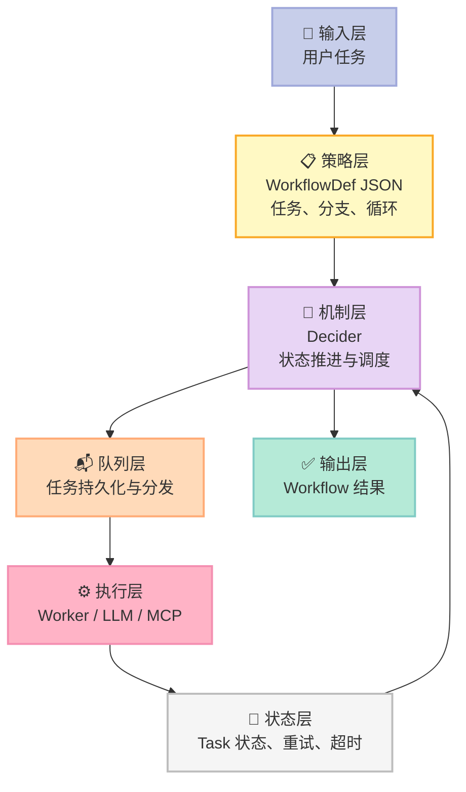
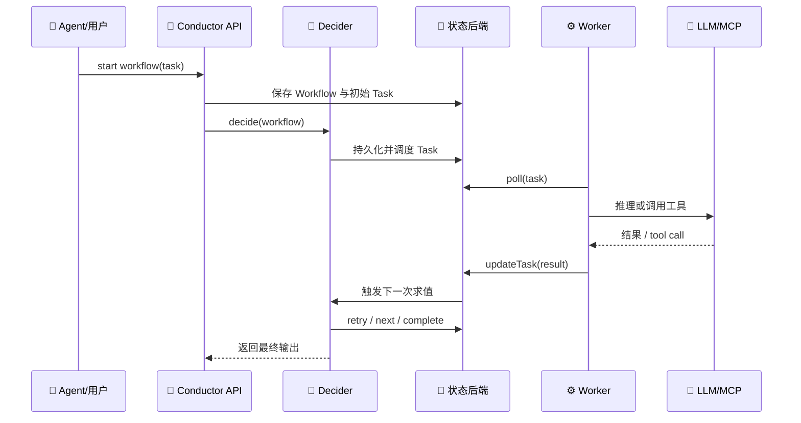

> **一个 Agent 是否可靠，关键不在于它能不能想出下一步，而在于它断电后还能不能从正确的下一步继续。** Conductor 的答案是：让模型负责选择，让工作流引擎负责记账、调度、重试和恢复。

## 一、Conductor 解决什么问题？

[Conductor](https://github.com/conductor-oss/conductor) 是 Netflix 起源、现由社区维护的开源持久化工作流引擎。仓库在 2026-07-29 查询约 **3.2 万 Star**，最新提交为 2026-07-28，采用 Apache-2.0 协议。README 给出的定位很直接：编排微服务、AI Agent 和长时工作流，并让每一步都可恢复。

它并不是又一个“让模型调用工具”的 SDK。它把 Agent 放进一个**可持久化的状态机**：工作流定义是 JSON，任务状态写入后端，Decider 根据“定义 + 当前状态”决定下一批任务，Worker 只执行任务并回报结果。

在 Harness 六件套里，Conductor 最适合归入 **Workflow（接力赛协议 / 交接规则）**，同时通过 `LLM_CHAT_COMPLETE`、`LIST_MCP_TOOLS` 和 `CALL_MCP_TOOL` 接入 Model 与 MCP。今天只聚焦 Workflow 这一个核心组件。

## 二、架构：机制与策略分离

### 2.1 四层职责



**策略**是 WorkflowDef：任务顺序、条件、循环、输入映射和失败工作流。**机制**是引擎：持久化、队列、锁、超时、重试、Decider 和 Worker 协议。这个切分很重要：模型可以生成或修改 JSON 策略，却不需要直接改数据库、线程池或重试实现。

源码证据是 `DeciderService.decide(WorkflowModel)`：它先过滤未执行任务，再检查工作流状态和超时，随后把失败任务送入 retry，把已完成任务映射到 `getNextTask`，最后将下一批任务放进 `DeciderOutcome`。这是一个“状态求值器”，不是把业务逻辑硬编码进每个 Worker。

### 2.2 数据流：一次 Agent 任务怎样跑完？



这里有一个经常被忽略的工程边界：**Worker 不负责“决定全局下一步”**。Worker 只负责当前任务；全局推进由 Decider 根据持久化状态重新计算。Worker 在第 12 次迭代崩溃时，任务仍可按 retry policy 重入队列；README 也明确宣称 Agent 可以从失败的迭代继续。

## 三、核心原语：声明式图 + Decider 状态机

### 3.1 WorkflowDef 是 Agent 的“接力协议”

WorkflowDef 至少包含 `name`、`version`、`tasks`、输入输出、超时和失败工作流。每个 Task 有类型和 `taskReferenceName`，后续任务通过引用表达数据依赖。

Conductor 还支持 `DO_WHILE`、`SWITCH`、动态 Fork 和 Sub-Workflow。它们不是 prompt 中的建议，而是引擎能验证、持久化、重新调度的控制结构。因此模型生成一个 JSON 工作流后，系统仍然可以对执行边界进行统一治理。

### 3.2 Agent Loop：让模型只做“想”和“选”

Conductor README 给出了一个完整的 Agent 工作流：先 `LIST_MCP_TOOLS`，再用 `DO_WHILE` 重复 `LLM_CHAT_COMPLETE`，通过 `SWITCH` 判断是否结束，未结束时调用 `CALL_MCP_TOOL`。

```json
{
  "name": "agent_loop",
  "version": 1,
  "tasks": [
    {
      "name": "think",
      "taskReferenceName": "think",
      "type": "LLM_CHAT_COMPLETE",
      "inputParameters": {
        "llmProvider": "openai",
        "model": "gpt-4o-mini",
        "messages": [
          {"role": "system", "message": "Return JSON with action, arguments and done."},
          {"role": "user", "message": "${workflow.input.task}"}
        ]
      }
    },
    {
      "name": "choose",
      "taskReferenceName": "choose",
      "type": "SWITCH",
      "expression": "$.think.output.result.done ? 'done' : 'call_tool'",
      "decisionCases": {
        "call_tool": [
          {
            "name": "execute_tool",
            "taskReferenceName": "tool_call",
            "type": "CALL_MCP_TOOL",
            "inputParameters": {
              "mcpServer": "${workflow.input.mcpServerUrl}",
              "method": "${think.output.result.action}",
              "arguments": "${think.output.result.arguments}"
            }
          }
        ]
      }
    }
  ]
}
```

上面的片段是可直接保存为 JSON 的真实工作流定义；生产环境还应包一层 `DO_WHILE`，并为模型输出启用结构化校验。关键不在 JSON 长什么样，而在**把不可预测的模型输出收敛成有限的 Task 类型和状态转换**。

### 3.3 重试不是“再问模型一次”

TaskDef 中有 `retryCount`、`retryLogic`、`retryDelaySeconds`、`timeoutPolicy`、`responseTimeoutSeconds`、`totalTimeoutSeconds` 和 `backoffJitterMs` 等字段。它们分别解决尝试次数、退避曲线、单次超时、整项预算和并发抖动问题。

这是 Harness 与 prompt 的分界：模型可以决定“要不要调用搜索工具”，但不能通过一句话取消平台的总超时或绕过任务的状态约束。

## 四、最小可运行复刻：一个可恢复的 Workflow MVP

如果只想理解核心，不必先部署 Java 服务。下面的 Python 程序实现了三个机制：声明式任务、持久化状态、失败重试。它不调用真实 LLM，但可以直接运行，且把模型调用替换成函数即可。

```python
from __future__ import annotations

import json
import time
from pathlib import Path
from typing import Callable


class DurableWorkflow:
    def __init__(self, definition: dict, state_file: str = "workflow-state.json"):
        self.definition = definition
        self.path = Path(state_file)
        self.state = self._load()

    def _load(self) -> dict:
        if self.path.exists():
            return json.loads(self.path.read_text())
        return {"status": "RUNNING", "index": 0, "attempts": {}, "outputs": {}}

    def _save(self) -> None:
        temp = self.path.with_suffix(".tmp")
        temp.write_text(json.dumps(self.state, ensure_ascii=False, indent=2))
        temp.replace(self.path)  # 原子替换，避免进程崩溃留下半个 JSON

    def run(self, handlers: dict[str, Callable[[dict], dict]]) -> dict:
        tasks = self.definition["tasks"]
        while self.state["index"] < len(tasks):
            task = tasks[self.state["index"]]
            name = task["name"]
            attempt = self.state["attempts"].get(name, 0) + 1
            self.state["attempts"][name] = attempt
            self._save()

            try:
                result = handlers[task["type"]](task.get("input", {}))
                self.state["outputs"][name] = result
                self.state["index"] += 1
                self._save()
            except Exception as exc:
                if attempt >= task.get("retryCount", 3):
                    self.state.update(status="FAILED", error=str(exc))
                    self._save()
                    raise
                time.sleep(task.get("retryDelaySeconds", 0))

        self.state["status"] = "COMPLETED"
        self._save()
        return self.state


def flaky_tool(_: dict) -> dict:
    # 第一次失败，第二次成功：模拟网络或模型供应商瞬时故障
    flaky_tool.calls += 1
    if flaky_tool.calls == 1:
        raise RuntimeError("temporary upstream failure")
    return {"answer": "tool result"}


flaky_tool.calls = 0
workflow = {
    "tasks": [
        {"name": "think", "type": "THINK", "retryCount": 2},
        {"name": "act", "type": "TOOL", "retryCount": 2},
    ]
}

handlers = {
    "THINK": lambda data: {"action": "tool", "done": False},
    "TOOL": flaky_tool,
}

print(DurableWorkflow(workflow).run(handlers))
```

运行：

```bash
python durable_workflow.py
# 删除 workflow-state.json 后可重新开始；保留它则从 index 继续
```

这个 MVP 故意没有包含向量库、复杂 Agent 类层次和自定义 DSL。第一版真正必须有的是：**状态落盘、幂等更新、明确的 Task 状态、重试预算、可恢复入口**。没有这些，增加更多模型和工具只会放大故障面。

## 五、与同类项目的设计差异

| 维度 | Conductor | Trigger.dev | Hatchet | Microsoft Agent Framework |
|---|---|---|---|---|
| 核心抽象 | 服务端持久化 WorkflowDef + Task | TypeScript 任务与托管运行时 | 任务、Worker 与 durable DAG | Agent/Workflow SDK 抽象 |
| 状态推进 | Decider 根据定义和当前状态求值 | 平台运行任务并管理重试 | Go/TypeScript/Python 任务编排 | SDK 内部编排与模型集成 |
| Agent 关系 | Agent 是可声明的任务图，LLM 可作为 Task | Agent 是开发者写出的任务代码 | Agent 是被 durable task 包裹的执行单元 | Agent 与多 Agent 协作是一等 API |
| 协议重点 | JSON 图 + Poll/Update Task，语言无关 | TypeScript 开发体验与云部署 | 高吞吐后台任务和事件 | 微软模型/SDK 生态整合 |
| 适合场景 | 跨语言、长期、可重放的业务流程 | TS 团队快速交付 AI 后台任务 | 需要队列、并发和可观测性的服务 | .NET/Python 的 Agent 应用 |

差异不在“谁支持更多工具”，而在**状态归谁所有**：Conductor 把状态和推进权放在服务端 Decider；Trigger.dev 更接近代码即工作流；Hatchet 把任务执行和队列调度做得更直接；Agent Framework 则把 Agent 编程模型放在 SDK 中。若你的核心要求是“换 Worker 语言仍能恢复同一个流程”，Conductor 的声明式协议更有优势；若目标是单一语言内快速开发，代码优先的方案更轻。

## 六、Less is More：哪些应交给模型，哪些不能？

| 能力 | 应交给模型？ | 原因 |
|---|---:|---|
| 选择搜索还是数据库工具 | ✅ | 属于任务策略，模型可以根据上下文判断 |
| 生成工作流 JSON | ✅，但需校验 | 让模型规划，Schema 负责收敛 |
| 是否允许越过总超时 | ❌ | 这是外部资源和成本边界 |
| 任务重试与退避 | ❌ | 需要稳定、可预测的故障策略 |
| Secret 注入与权限 | ❌ | 模型不能成为凭证管理器 |
| 结果是否已持久化 | ❌ | 这是恢复和审计的物理事实 |

Conductor 的“聪明”主要放在可配置的策略和 Task 类型，而不是把所有决策都藏进模型。它遵循 Bitter Lesson 的一部分：把领域策略交给可学习的系统；但对数据库、队列、锁和凭证这类外部世界约束，坚持使用确定性机制。

## 七、优缺点：左侧简单，右侧可靠

| 左侧优势 | 具体表现 | 右侧代价 | 具体表现 |
|---|---|---|---|
| **架构简洁性** | WorkflowDef、Task、Decider 三个概念即可解释主流程 | **性能** | 每一步持久化、排队和重新求值都会增加延迟 |
| **扩展性** | Worker 可用 Java、Python、Go、JS、C#、Ruby、Rust | **复杂度** | 需要管理服务端、后端、消息系统和 Worker 生命周期 |
| **易用性** | 官方 README 提供 CLI，`conductor server start` 可启动本地服务 | **维护性** | Workflow schema、TaskDef、Worker 代码需要同步演进 |
| **恢复能力** | retry、timeout、failure workflow、rerun 都是引擎能力 | **模型不确定性** | JSON 结构合法不代表 Agent 决策正确，仍需护栏与评测 |

我的判断是：**Conductor 适合“流程比模型更重要”的生产 Agent，不适合只想快速拼一个聊天 Demo 的团队。** 用一个 10 秒的 LLM 调用也套完整 durable workflow，可能得不偿失；但一个会运行 30 分钟、调用 8 个外部系统的 Agent，没有这层状态机制，风险很快超过收益。

## 八、从零搭建的落地路线

### 必须先做

1. 定义有限的 Task 类型和输入输出 Schema。
2. 将每次状态变更原子写入持久化存储。
3. 为外部副作用设计幂等键，例如 `workflow_id + task_reference + attempt`。
4. 把单次超时、总超时、最大重试次数分开。
5. 让模型输出先经过 JSON Schema 和权限检查，再进入工具执行。

### 可以后做

- 动态 Fork 和复杂 Sub-Workflow。
- 多种数据库后端与跨区域部署。
- MCP 自动发现和向量检索。
- 人工审批、可视化 UI 和高级指标。

### 三个真实踩坑

**第一，重试不等于幂等。** 如果 Worker 已经扣款但回报超时，第二次重试可能重复扣款。支付、发邮件、写 Git 等副作用必须有幂等键或补偿任务。

**第二，动态工作流要限制资源。** LLM 生成一个无限 `DO_WHILE` 或数千个动态 Fork，会把“规划自由”变成成本失控。应限制最大迭代数、最大任务数和总预算。

**第三，持久化输入与模型上下文不是一回事。** 数据库里有完整 Task 状态，不代表模型看到了正确的上下文。恢复时要明确重新构造 prompt，不能把所有历史无脑塞回窗口。

## 九、结论：把 Agent 交付从“对话”升级为“执行”

Conductor 的价值不是给 LLM 增加一个更漂亮的聊天界面，而是提供一份**可重放的执行协议**。模型负责提出动作，WorkflowDef 规定动作的形状，Decider 负责推进，Worker 负责执行，状态后端负责记住发生过什么。

这套分工让 Harness 更接近工程系统：策略可以变化，机制必须可靠；模型可以犯错，但错误要被记录、重试、超时或补偿；Worker 可以崩溃，但流程不应因此失去因果链。

**行动建议**：如果你正在做长时 Agent，先不要添加第 11 个工具。先把当前流程拆成 3 个 Task，给每个 Task 加状态落盘、幂等键和总超时，再观察它能否在进程被杀后正确恢复。能恢复，才算真正拥有了 Workflow Harness。

---

## 参考资料

1. Conductor OSS：https://github.com/conductor-oss/conductor
2. Workflow Definition 文档：https://github.com/conductor-oss/conductor/blob/main/docs/documentation/configuration/workflowdef/index.md
3. DeciderService 源码：https://github.com/conductor-oss/conductor/blob/main/core/src/main/java/com/netflix/conductor/core/execution/DeciderService.java
4. Conductor Agent 文档：https://docs.conductor-oss.org/devguide/ai/first-ai-agent.html
5. Trigger.dev：https://github.com/triggerdotdev/trigger.dev
6. Hatchet：https://github.com/hatchet-dev/hatchet
7. Microsoft Agent Framework：https://github.com/microsoft/agent-framework
