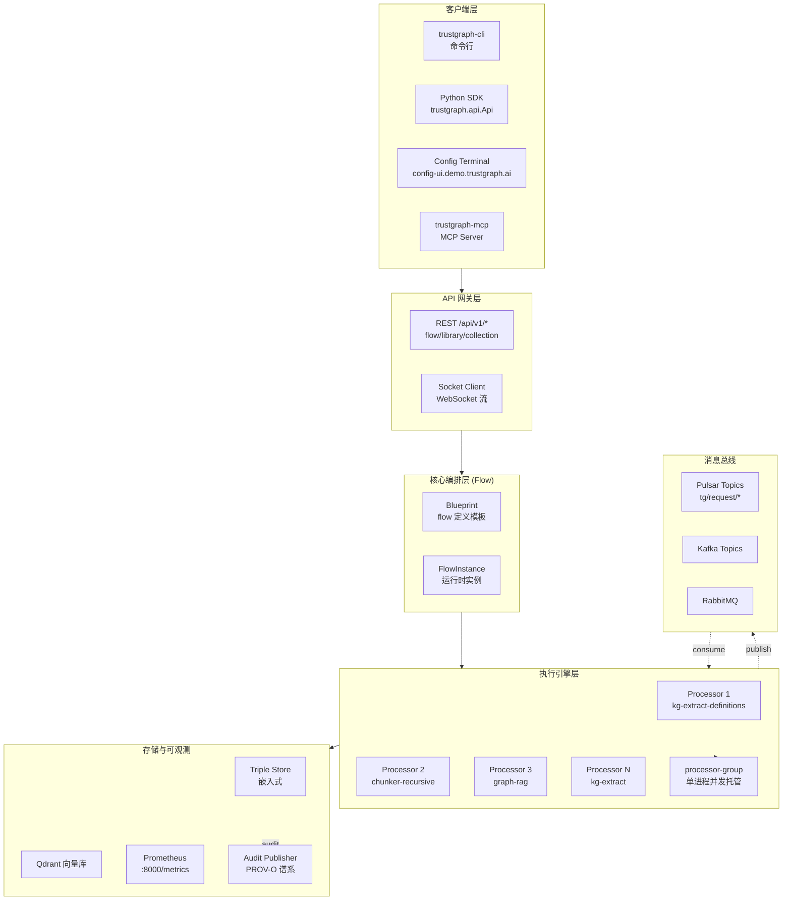
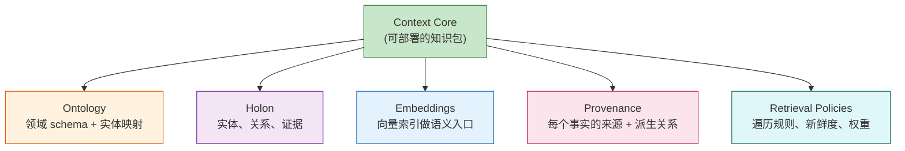
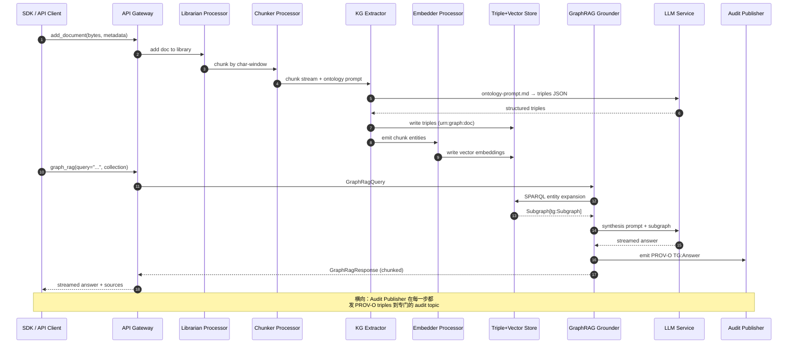

## 一、引子：当所有 RAG 都在丢失含义

2026 年的 AI Agent 几乎人人都在做 RAG，但绝大多数 RAG 都死在同一个地方：它只**索引片段**（chunk）而不索引**含义**（meaning）。一篇技术白皮书被切成 256 token 的向量块之后，章节之间的关系、实体的属性、知识的来源证据——全都成了"看不见的连接"。当 Agent 给出答案时，你看到的只是相似度匹配的 top-k 切片，看不到：

- 这个事实在哪个章节的第几段？
- 它从哪份原始文档由哪个抽取器在哪一天产生？
- 它跟邻域里的其他事实有什么因果或时间关系？
- 同一条事实被同一份证据支撑过几次？

更糟糕的是，**RAG 是 disposable 的**：你今天搭的向量索引，明天项目结束就丢了，换一个项目又从头建一遍。Context 永远不会变成机构的"知识资产"。

[trustgraph-ai/trustgraph](https://github.com/trustgraph-ai/trustgraph)（Apache-2.0，活跃，2026-07-28 还在持续提交，仓库根目录那行小字写着"Open Standards · Open Source · Total Transparency"）走了一条完全不同的路：**把 Context 当成一等公民来处理**，具体方法是构建 **Holonic Context Graph**（整体论的上下文图）。本文把这套架构从头拆开：为什么用 PROV-O？为什么每一份知识都打包成"Context Core"？Pulsar 流式图执行引擎是怎么把 14 个 processor 编排起来的？为什么说这是"确定性 AI Agent"的工程化起点？

## 二、项目定位与核心价值

### 2.1 一句话定义

> TrustGraph = **确定性的多租户上下文工程平台**，把 RDF/OWL 知识图谱、向量嵌入、W3C PROV-O 谱系证据、流式图执行融为一体，给 Agent 一个**可版本化、可审计、可解释、可共享**的"Context Core"作为认知基础设施。

它不是又一个 LangChain 风格的 LLM 调用胶水，也不是又一个向量数据库。它的差异化定位可以从源码级的三句承诺体现：

- **README**：*"Build deterministic agents with open source AI. Treat context as a holon..."*
- **仓库 spec 文件**：`specs/context-cores.md` 把 Context Core 定义成 5 个一等组件（Ontology / Holon / Embeddings / Provenance / Retrieval Policies）
- **`trustgraph/base/processor_group.py` 头部注释**：*"Multi-processor group runner. Runs multiple AsyncProcessor descendants as concurrent tasks inside a single process..."*

### 2.2 能力矩阵

| 维度 | TrustGraph 提供的能力 | 关键源文件 |
|------|----------------------|------------|
| 知识表示 | RDF 三元组 + 命名图（named graph）+ PROV-O 谱系 | `provenance/triples.py:51-68` |
| 推理 | SPARQL 端点 + GraphRAG 实体展开 + 子图截断 | `messaging/translators/sparql_query.py` |
| 可解释性 | Grounding/Exploration/Focus/Synthesis 四阶段审计 | `provenance/agent.py` |
| 多租户 | Collection + Workspace 命名空间隔离 | `api/collection.py` |
| 消息后端 | Pulsar / Kafka / RabbitMQ 三抽象 | `base/{async_pulsar,async_kafka,async_rabbitmq}_backend.py` |
| LLM 抽象 | 17+ 种 translator + LlmService 统一流式/非流式 | `base/llm_service.py:114-211` |
| 工具调用 | DynamicToolService 即时注册插件 | `base/dynamic_tool_service.py` |
| 国际化 | 9 种语言 prompt 模板（en/es/ar/he/hi/pt/ru/sw/zh-cn/tr） | `i18n/packs/*.json` |
| 谱系追踪 | PROV-O Activity/Agent/Entity/wasDerivedFrom | `provenance/namespaces.py:7-13` |

### 2.3 仓库统计与现状

- **Stars**：2.4k（截至 2026-07-28 抓取），处于"早期采纳后段"
- **License**：Apache-2.0
- **Language**：Python（核心）+ JavaScript（CLI/Web 部分子目录）
- **仓库大小**：~102 MB（包含测试用例和预制 ontology）
- **最近推送**：2026-07-28
- **创建日期**：2024-07-10（2 年沉淀）
- **顶级目录**：`trustgraph-base`（核心库）、`trustgraph`（聚合安装包）、`trustgraph-cli`（命令行）、`trustgraph-flow`（flow 编排）、`trustgraph-mcp`（MCP Server 适配）、`trustgraph-bedrock`（AWS Bedrock LLM 适配）、`trustgraph-docling`（Docling 文档解码）、`trustgraph-embeddings-hf`（HF Embeddings）、`trustgraph-ocr`（OCR）、`trustgraph-unstructured`（Unstructured 解码器）、`trustgraph-vertexai`（Vertex AI）
- **质量信号**：`DEVELOPER_GUIDE.md` / `TEST_STRATEGY.md` / `TEST_CASES.md` / `SECURITY.md` 全部齐全，是**工程师文化**的工业级项目（不是 Demo）

## 三、整体架构

### 3.1 顶层架构：从"Context Core"到"Agent Service"



这张图里有几个关键设计决策值得提前标注：

1. **三层 Flow 抽象**：Blueprint（声明式 flow 定义）→ FlowInstance（运行时实例）→ Processor（具体的微服务型执行单元）。Blueprint 类似 K8s Deployment manifest 的角色，是幂等可重放的。
2. **消息总线多后端**：Pulsar / Kafka / RabbitMQ 三个后端抽象在 `trustgraph-base/trustgraph/base/async_*_backend.py`，都遵循相同接口。这意味着部署者可以基于已有 MQ 基础设施挑后端，不必引入新依赖。
3. **存储与 LLM 解耦**：Triple Store / Qdrant / LLM 都是可插拔的 processor，平台不强绑定任何特定数据库。
4. **Prometheus 一等公民**：每个 Processor 都自带 metrics，Node/Pod 部署可对接到标准 K8s 监控生态。

### 3.2 13 个子包 / 8 类 Processor 的拆分

`trustgraph-base/trustgraph/base/` 下挂着一组"垂直切片式"的 Processor —— 这是 TrustGraph 的核心交付形态：

| Processor 类 | 关键源文件 | 职责 |
|--------------|-----------|------|
| `LlmService` | `llm_service.py` | LLM 抽象层，支持流式/非流式、token 计数、模型选择 |
| `DynamicToolService` | `dynamic_tool_service.py` | 工具即 Pulsar 订阅：`non-persistent://tg/request/{topic}` |
| `FlowProcessor` | `flow.py` | Flow 编排基类 |
| `ProcessorGroup` | `processor_group.py` | 多 processor 进程托管（YAML/JSON 配置） |
| `ChunkingService` | `chunking_service.py` | 文档切分 |
| `EmbeddingsService` | `embeddings_service.py` | 向量嵌入 |
| `RerankerService` | `reranker_service.py` | 召回重排 |
| `ToolService` | `tool_service.py` | 工具调用适配 |
| `AuditPublisher` | `audit_publisher.py` | 谱系发布 |
| `ImageToTextService` | `image_to_text_service.py` | VLM |
| `KeywordIndexService` | `keyword_index_service.py` | 关键词索引 |
| `TriplesQueryService` | `triples_query_service.py` | 三元组查询 |
| `GraphRagClient` 等 | `graph_rag_client.py` | GraphRAG 客户端 |
| `RowEmbeddingsClient` | `row_embeddings_query_client.py` | 行级向量检索 |

每个 Processor 都是 `FlowProcessor` 子类，使用 `register_specification()` 显式声明输入输出 topic、参数和并发度。这种"显式契约"风格让整张图的可调试性大幅提升 —— 谁消费谁、什么时候跑、参数是什么，全部在源码里看得到，不需要翻 YAML。

## 四、Holonic Context Graph：核心理念

### 4.1 从 Koestler 的 Holon 到 Context Core

README 里有一段不是技术文档常见的引经据典：

> *The philosopher Arthur Koestler coined the word holon to describe something that is simultaneously a whole in itself and a part of something larger. A fact is whole. It is also part of a domain. A domain is whole. It is also part of an organization's knowledge.*

TrustGraph 把 Koestler 的"整体论"直接搬进系统设计。一个 **Context Core** 是部署单元，内部包含 5 个一等组件：



这张抽象图是 TrustGraph 区别于所有竞品的关键：**Context Core 是可移植、可版本、可分享的"知识资产"**。用一段白话说：

- 你把论文库灌进去，得到一个 `papers-core-v1`
- 把企业内部规章灌进去，得到 `policy-core-v2`
- 多个 Core 可以组合（Holon 套 Holon）：`papers-core + policy-core → audit-core`

这有点像把代码库打包成 Docker Image，但打包的对象是"Agent 的认知"。

### 4.2 5 大组件的源码映射

```python
# 来自 trustgraph-base/trustgraph/provenance/triples.py:51-68
# Holon 的核心是 Triple + Named Graph
def set_graph(triples: List[Triple], graph: str) -> List[Triple]:
    """
    Set the named graph on a list of triples.

    This creates new Triple objects with the graph field set,
    leaving the original triples unchanged.

    Args:
        triples: List of Triple objects
        graph: Named graph URI (e.g., "urn:graph:retrieval")

    Returns:
        List of Triple objects with graph field set
    """
    return [
        Triple(s=t.s, p=t.p, o=t.o, g=graph)
        for t in triples
    ]
```

这段 18 行的小函数承载了 Holon 的本质：**每条事实都有自己的"出处图"（named graph URI）**。当你在 `urn:graph:retrieval` 下查事实，就能精确切分"这是检索时用的事实"、"这是文档里原有的事实"、"这是 LLM 推断的事实"。

而 Triples 的底层搬运代码则显式用 PROV-O 标准注解：

```python
# 来自 trustgraph-base/trustgraph/provenance/triples.py:97-145
def document_triples(
    doc_uri: str,
    title: Optional[str] = None,
    source: Optional[str] = None,
    date: Optional[str] = None,
    creator: Optional[str] = None,
    page_count: Optional[int] = None,
    mime_type: Optional[str] = None,
) -> List[Triple]:
    """
    Build triples for a source document entity.
    """
    triples = [
        _triple(doc_uri, RDF_TYPE, _iri(PROV_ENTITY)),       # PROV-O Entity 角色
        _triple(doc_uri, RDF_TYPE, _iri(TG_DOCUMENT_TYPE)),  # TG 自定义 Document 类型
    ]
    if title:
        triples.append(_triple(doc_uri, DC_TITLE, _literal(title)))   # Dublin Core 元数据
        triples.append(_triple(doc_uri, RDFS_LABEL, _literal(title)))
    if source:
        triples.append(_triple(doc_uri, DC_SOURCE, _iri(source)))
    if date:
        triples.append(_triple(doc_uri, DC_DATE, _literal(date)))
    if creator:
        triples.append(_triple(doc_uri, DC_CREATOR, _literal(creator)))
    if page_count is not None:
        triples.append(_triple(doc_uri, TG_PAGE_COUNT, _literal(page_count)))
    if mime_type:
        triples.append(_triple(doc_uri, TG_MIME_TYPE, _literal(mime_type)))
    return triples
```

第 121-122 行的双重 `rdf:type` 声明 —— 一份 doc 既是 W3C PROV-O 的 `prov:Entity`，又是 TrustGraph 的 `tg:Document` —— 这就是 Holon 的"既是整体又是部分"的工程化表达。

### 4.3 5 大 Standards 哲学：为什么不用自创格式

README 里反复强调的"RDF / OWL / SKOS / SHACL" 不是营销话术。Namespace 常量文件直接展示了底层依赖的 W3C / Schema.org 标准数量：

```python
# 来自 trustgraph-base/trustgraph/provenance/namespaces.py:7-56
# PROV-O namespace (W3C Provenance Ontology)
PROV = "http://www.w3.org/ns/prov#"
PROV_ENTITY = PROV + "Entity"
PROV_ACTIVITY = PROV + "Activity"
PROV_AGENT = PROV + "Agent"
PROV_WAS_DERIVED_FROM = PROV + "wasDerivedFrom"
PROV_WAS_GENERATED_BY = PROV + "wasGeneratedBy"
PROV_USED = PROV + "used"
PROV_WAS_ASSOCIATED_WITH = PROV + "wasAssociatedWith"
PROV_STARTED_AT_TIME = PROV + "startedAtTime"

# Dublin Core namespace
DC = "http://purl.org/dc/elements/1.1/"
DC_TITLE = DC + "title"
DC_SOURCE = DC + "source"
DC_DATE = DC + "date"
DC_CREATOR = DC + "creator"

# Schema.org namespace
SCHEMA = "https://schema.org/"
SCHEMA_DIGITAL_DOCUMENT = SCHEMA + "DigitalDocument"
SCHEMA_KEYWORDS = SCHEMA + "keywords"

# SKOS namespace
SKOS = "http://www.w3.org/2004/02/skos/core#"
SKOS_DEFINITION = SKOS + "definition"

# TrustGraph namespace for custom predicates
TG = "https://trustgraph.ai/ns/"
TG_CONTAINS = TG + "contains"
TG_PAGE_COUNT = TG + "pageCount"
TG_COMPONENT_VERSION = TG + "componentVersion"
TG_LLM_MODEL = TG + "llmModel"
TG_ONTOLOGY = TG + "ontology"
```

| 标准 | 用途 | 为什么选它 |
|------|------|-----------|
| **W3C PROV-O** | 知识来源与派生关系 | 让任何第三方工具（Protégé、TopQuadrant）都能直接读 TrustGraph 的谱系 |
| **Dublin Core** | 文档元数据（title/source/date/creator） | 图书馆/出版业 30 年沉淀，跨工具兼容 |
| **Schema.org** | 实体类型（DigitalDocument/Person/Organization） | 搜索引擎和 Wikidata 共用 schema |
| **SKOS** | 概念层级（skos:definition / skos:Concept） | 主题词表本体 |
| **SHACL** | RDF Shape 校验（仓库 schema 验证） | W3C 推荐的 RDF Shape 标准 |
| **RDF/RDFS** | 通用三元组与标签 | 语义网的基石 |

这套"5 Standards"哲学的意义远超过"显得开放"：它意味着 TrustGraph 的数据导出后，**任何 W3C 兼容工具都能直接打开、查询、推理**。当一家公司构建好 Context Core 之后，外部审计、合规、风控等部门不需要学任何 TrustGraph 专有格式，直接 SPARQL 查询即可。

## 五、流动的执行图：13 个 Processor 的协作

### 5.1 端到端数据流：文档从磁盘到答案



这张图揭示了 TrustGraph 的一个关键架构选择：**GraphRAG 不是一次性 LLM 调用，而是一条 4 阶段流水线**。每个阶段都有独立的 processor，每个 stage 的输入/输出都是 RDF 三元组或向量 —— 这意味着任何一步都能被独立 trace、独立回放、独立替换。

### 5.2 LlmService 的双模式：流式 + 谱系

LLM Processor 不是简单的"调 API"，它在异步处理 + 流式响应 + 错误恢复之间精细切分：

```python
# 来自 trustgraph-base/trustgraph/base/llm_service.py:114-211
async def on_request(self, msg, consumer, flow):
    try:
        request = msg.value()
        # Sender-produced ID
        id = msg.properties()["id"]
        model = flow("model")
        temperature = flow("temperature")

        # Check if streaming is requested and supported
        streaming = getattr(request, 'streaming', False)
        response_format = getattr(request, 'response_format', None)
        schema = getattr(request, 'schema', None)

        if streaming and self.supports_streaming():
            # Streaming mode
            with __class__.text_completion_metric.labels(
                    processor=self.id,
            ).time():
                async for chunk in self.generate_content_stream(
                    request.system, request.prompt, model, temperature,
                    response_format=response_format, schema=schema,
                ):
                    await flow("response").send(
                        TextCompletionResponse(
                            error=None,
                            response=chunk.text,
                            in_token=chunk.in_token,
                            out_token=chunk.out_token,
                            model=chunk.model,
                            end_of_stream=chunk.is_final
                        ),
                        properties={"id": id}
                    )
        else:
            # Non-streaming mode (original behavior)
            with __class__.text_completion_metric.labels(
                    processor=self.id,
            ).time():
                response = await self.generate_content(
                    request.system, request.prompt, model, temperature,
                    response_format=response_format, schema=schema,
                )
            await flow("response").send(
                TextCompletionResponse(
                    error=None,
                    response=response.text,
                    in_token=response.in_token,
                    out_token=response.out_token,
                    model=response.model,
                    end_of_stream=True
                ),
                properties={"id": id}
            )

        __class__.text_completion_model_metric.labels(
            processor=self.id,
        ).info({
            "model": str(model) if model is not None else "",
            "temperature": str(temperature) if temperature is not None else "",
        })

    except TooManyRequests as e:
        # Prometheus 看到一次 rate limit
        raise e
    except Exception as e:
        # Apart from rate limits, treat all exceptions as unrecoverable
        logger.error(f"LLM service exception: {e}", exc_info=True)
        await flow.producer["response"].send(
            TextCompletionResponse(
                error=Error(
                    type = "llm-error",
                    message = str(e),
                ),
                response=None,
                in_token=None,
                out_token=None,
                model=None,
                end_of_stream=True
            ),
            properties={"id": id}
        )
```

几个工程亮点必须讲清：

1. **`id = msg.properties()["id"]` 提取发送方 ID**：消息总线带着"哪个 flow ID 发的请求"，回包时再带回这个 id。这是 Pulsar 风格的请求-响应关联。
2. **双模式下落到统一 `TextCompletionResponse`**：流式（多 chunk + is_final 标志）和非流式（一次包 + end_of_stream=True）最后都映射到同一个 schema，下游 consumer 不用关心上游模式。
3. **`TooManyRequests` 例外单独处理**：rate limit 透传给上层做退避，其它一律吞掉 + 返回 error envelope——避免一个 LLM 抖动把整个 graph 卡死。
4. **Prometheus 指标 `text_completion_duration`**：34 个 bucket 从 0.25s 到 120s，覆盖了从 streaming first-token 到 Anthropic 长上下文的所有情形。

### 5.3 DynamicToolService：工具即 Pulsar 订阅

```python
# 来自 trustgraph-base/trustgraph/base/dynamic_tool_service.py:64-130
async def start(self):
    await super(DynamicToolService, self).start()

    request_topic = f"non-persistent://tg/request/{self._topic}"
    response_topic = f"non-persistent://tg/response/{self._topic}"

    logger.info(
        f"Tool service topics: "
        f"request={request_topic}, response={response_topic}"
    )

    self._producer_handle = await self.sender_pool.add_producer(
        topic=response_topic,
        schema=ToolServiceResponse,
    )

    async def handler(message):
        await self.on_request(message, None, None)

    self._consumer_reg = await self.receiver_pool.add_consumer(
        topic=request_topic,
        subscription=f"{self.id}-request",
        schema=ToolServiceRequest,
        handler=handler,
    )

    logger.info(f"Tool service {self.id} started")

async def on_request(self, msg, consumer, flow):
    id = None
    try:
        request = msg.value()
        id = msg.properties().get("id", "unknown")
        config = json.loads(request.config) if request.config else {}
        arguments = (
            json.loads(request.arguments) if request.arguments
            else {}
        )
        response = await self.invoke(config, arguments)

        await self._producer_handle.send(
            ToolServiceResponse(
                error=None,
                response=(
                    response if isinstance(response, str)
                    else json.dumps(response)
                ),
                end_of_stream=True,
            ),
            properties={"id": id}
        )
        __class__.tool_service_metric.labels(
            processor=self.id,
        ).inc()

    except TooManyRequests as e:
        raise e
    except Exception as e:
        logger.error(f"Exception in dynamic tool service: {e}", exc_info=True)
        await self._producer_handle.send(
            ToolServiceResponse(
                error=Error(
                    type="tool-service-error",
                    message=str(e),
                ),
                response="",
                end_of_stream=True,
            ),
            properties={"id": id if id else "unknown"}
        )

async def invoke(self, config, arguments):
    raise NotImplementedError("Subclasses must implement invoke()")
```

DynamicToolService 的精妙设计：任何继承自 `DynamicToolService` 的子类只要实现 `invoke(config, arguments)` 方法，就能**零注册**地成为一个 Agent 工具。底层全靠 Pulsar 的 `non-persistent://tg/{request,response}/{topic}` 直接 sub/unsub，无 flow 配置。这种"约定优于配置"的协议设计让整个系统具备良好的扩展性 —— 加一个新工具 = 写一个新 processor 文件，**不需要改 main、不需要改 SDK、不需要改 API server**。

注意 `invoke()` 默认 raise `NotImplementedError` —— 强制每个子类必须实现。配置和参数用 JSON 序列化（`config: dict` 和 `arguments: dict`），这是 TrustGraph 与外界（agent / 其他 processor）的通用语言。

### 5.4 Processor Group：单进程多 Processor 托管

```python
# 来自 trustgraph-base/trustgraph/base/processor_group.py:1-30
# Multi-processor group runner.  Runs multiple AsyncProcessor descendants
# as concurrent tasks inside a single process, sharing one event loop,
# one Prometheus HTTP server, and one pub/sub backend pool.
#
# Intended for dev and resource-constrained deployments.  Scale deployments
# should continue to use per-processor endpoints.
#
# Group config is a YAML or JSON file with shape:
#
#   processors:
#     - class: trustgraph.extract.kg.definitions.extract.Processor
#       params:
#         id: kg-extract-definitions
#         triples_batch_size: 1000
#     - class: trustgraph.chunking.recursive.Processor
#       params:
#         id: chunker-recursive
#
# Each entry's params are passed directly to the class constructor alongside
# the shared taskgroup.  Defaults live inside each processor class.
```

启动器把多个 processor 塞进同一个进程，共享事件循环 + Prometheus 端口 + pub/sub 连接池。这对"开发模式"和"小规模生产"特别有用：

```python
# 来自 trustgraph-base/trustgraph/base/processor_group.py:59-126
async def _supervise(entry):
    """Run one processor with its own nested TaskGroup, restarting on any
    failure.  Each processor is isolated from its siblings — a crash here
    does not propagate to the outer group."""

    pid = entry["params"]["id"]
    class_path = entry["class"]

    # Stamp the contextvar for this supervisor task.  Every log
    # record emitted from this task — and from any inner TaskGroup
    # child created by the processor — inherits this id via
    # contextvar propagation.  Siblings in the outer group set
    # their own id in their own task context and do not interfere.
    set_processor_id(pid)

    while True:
        p = None
        try:
            async with asyncio.TaskGroup() as inner_tg:
                cls = _resolve_class(class_path)
                params = dict(entry.get("params", {}))
                params["taskgroup"] = inner_tg
                logger.info(f"Starting {class_path} as {pid}")
                p = cls(**params)
                await p.start()
                inner_tg.create_task(p.run())

            # Clean exit — processor's run() returned without raising.
            # Treat as a transient shutdown and restart, matching the
            # behaviour of per-container `restart: on-failure`.
            logger.warning(
                f"Processor {pid} exited cleanly, will restart"
            )
        except asyncio.CancelledError:
            logger.info(f"Processor {pid} cancelled")
            raise
        except BaseExceptionGroup as eg:
            for e in eg.exceptions:
                logger.error(
                    f"Processor {pid} failure: {type(e).__name__}: {e}",
                    exc_info=e,
                )
        except BaseException as e:
            logger.error(
                f"Processor {pid} failure: {type(e).__name__}: {e}",
                exc_info=True,
            )
        finally:
            if p:
                try:
                    await p.stop()
                except BaseException:
                    pass

        logger.info(
            f"Restarting {pid} in {RESTART_DELAY_SECONDS}s..."
        )
        await asyncio.sleep(RESTART_DELAY_SECONDS)
```

注意几个 Python 3.11+ 特有的工程点：

1. **`asyncio.TaskGroup`** 嵌套隔离：每个 processor 有自己的 `inner_tg`，崩了不影响外层。这是 Python 3.11 的 structured concurrency 范式的标准用法。
2. **`set_processor_id(pid)` 是 contextvar**：日志带 processor id 是通过 contextvar 传播的，不是显式传递参数。这意味着任何深度的子任务都能自动拿到正确的 id。
3. **`BaseExceptionGroup` 全捕获**：Python 3.11 引入的多异常聚合类型，能完整记录一个 TaskGroup 里多个并发异常的细节。
4. **`RESTART_DELAY_SECONDS = 4` 4 秒退避重启**：避免处理器持续崩溃时的 CPU 耗尽。
5. **干净退出也重启**（`logger.warning(f"Processor {pid} exited cleanly, will restart")`）：一种"宁可多重启也不漏消息"的容错哲学，匹配容器平台的 `restart: on-failure` 行为。

## 六、谱系与可解释性：让每个答案都能溯源

### 6.1 Explainability 的三阶段抽象

TrustGraph 把 Grounding / Exploration / Focus / Synthesis 显式建模为可解释性的核心：

```python
# 来自 trustgraph-base/trustgraph/provenance/namespaces.py:95-101
# Explainability entity types (shared)
TG_QUESTION = TG + "Question"
TG_GROUNDING = TG + "Grounding"
TG_EXPLORATION = TG + "Exploration"
TG_FOCUS = TG + "Focus"
TG_SYNTHESIS = TG + "Synthesis"
TG_ANALYSIS = TG + "Analysis"
TG_CONCLUSION = TG + "Conclusion"
```

这 4 个 TG 自定义类型的语义对应 GraphRAG 的执行阶段：

| 类型 | 对应阶段 | 数据形态 |
|------|---------|---------|
| `tg:Question` | 入口 | 用户的查询字符串 + collection |
| `tg:Grounding` | 实体抽取 | query → concept → entity 的映射 |
| `tg:Exploration` | 子图扩展 | 从 entity 出发扩散到的 triples 集 |
| `tg:Focus` | 子图截断 | 重排序后保留的 edge/chunk 子集 |
| `tg:Synthesis` | LLM 合成 | 最终答案 + 引用 |

```python
# 来自 trustgraph-base/trustgraph/provenance/namespaces.py:104-115
# Orchestrator entity types
TG_DECOMPOSITION = TG + "Decomposition"  # Supervisor decomposed into sub-goals
TG_FINDING = TG + "Finding"              # Subagent result
TG_PLAN_TYPE = TG + "Plan"               # Plan-then-execute plan
TG_STEP_RESULT = TG + "StepResult"       # Plan step result

# Unifying types for answer and intermediate commentary
TG_ANSWER_TYPE = TG + "Answer"          # Final answer (Synthesis, Conclusion, Finding, StepResult)
TG_REFLECTION_TYPE = TG + "Reflection"  # Intermediate commentary (Thought, Observation)
TG_THOUGHT_TYPE = TG + "Thought"        # Agent reasoning
TG_OBSERVATION_TYPE = TG + "Observation" # Agent tool result
TG_TOOL_USE = TG + "ToolUse"            # Analysis+ToolUse mixin
```

这是 TrustGraph 比 LangChain/LlamaIndex/CrewAI 更深一层的工程化：**你不仅能看到最终答案，你能看到答案的"思维过程"** —— 哪个 goal 被分解、哪个 subagent 跑了什么、哪个 step 产生了什么 finding，全部以 RDF 实体的形式落库，可查询、可推理、可可视化。

### 6.2 GraphRAG 的 ExplainPayload

GraphRAG 的返回包不仅带回 chunked 答案，还把可解释性数据集成到同一份协议：

```python
# 来自 trustgraph-base/trustgraph/messaging/translators/retrieval.py:125-187
class GraphRagResponseTranslator(MessageTranslator):
    """Translator for GraphRagResponse schema objects"""

    def __init__(self):
        self.triple_translator = TripleTranslator()

    def encode(self, obj: GraphRagResponse) -> Dict[str, Any]:
        result = {}

        # Include message_type
        message_type = getattr(obj, "message_type", "")
        if message_type:
            result["message_type"] = message_type

        # Include response content for chunk messages
        if obj.response is not None:
            result["response"] = obj.response

        # Include explain_id for explain messages
        explain_id = getattr(obj, "explain_id", None)
        if explain_id:
            result["explain_id"] = explain_id

        # Include explain_graph for explain messages (named graph filter)
        explain_graph = getattr(obj, "explain_graph", None)
        if explain_graph is not None:
            result["explain_graph"] = explain_graph

        # Include explain_triples for explain messages
        explain_triples = getattr(obj, "explain_triples", [])
        if explain_triples:
            result["explain_triples"] = [
                self.triple_translator.encode(t) for t in explain_triples
            ]

        # Include source document references (final message only)
        sources = getattr(obj, "sources", [])
        if sources:
            result["sources"] = [
                {"uri": s.uri, "title": s.title} for s in sources
            ]

        # Include end_of_stream flag (LLM stream complete)
        result["end_of_stream"] = getattr(obj, "end_of_stream", False)

        # Include end_of_session flag (entire session complete)
        result["end_of_session"] = getattr(obj, "end_of_session", False)

        # Always include error if present
        if hasattr(obj, 'error') and obj.error and obj.error.message:
            result["error"] = {"message": obj.error.message, "type": obj.error.type}

        if obj.in_token is not None:
            result["in_token"] = obj.in_token
        if obj.out_token is not None:
            result["out_token"] = obj.out_token
        if obj.model is not None:
            result["model"] = obj.model

        return result

    def encode_with_completion(self, obj: GraphRagResponse) -> Tuple[Dict[str, Any], bool]:
        """Returns (response_dict, is_final)"""
        # Session is complete when end_of_session is True
        is_final = getattr(obj, 'end_of_session', False)
        return self.encode(obj), is_final
```

`message_type` 字段把响应拆成"内容包"和"解释包"两种类型，配套字段：

- `explain_id` / `explain_graph`：解释载荷的标识和命名图
- `explain_triples`：实际的可解释性三元组（每条都是 tg:Question → tg:Grounding → ...）
- `sources`：原文引用
- `end_of_stream` + `end_of_session` 双层结束标志：流式分发友好

这套 schema 设计让前端能**渐进渲染** —— 先看到答案流，再看到溯源图，再看到原始证据，全程不需要重新查询。

## 七、检索管线：DocumentRAG + GraphRAG 双轨

### 7.1 检索 API 的双模式抽象

```python
# 来自 trustgraph-base/trustgraph/messaging/translators/retrieval.py:7-26
class DocumentRagRequestTranslator(MessageTranslator):
    """Translator for DocumentRagQuery schema objects"""

    def decode(self, data: Dict[str, Any]) -> DocumentRagQuery:
        return DocumentRagQuery(
            query=data["query"],
            collection=data.get("collection", "default"),
            doc_limit=int(data.get("doc-limit", 20)),
            fetch_limit=int(data.get("fetch-limit", 0)),
            streaming=data.get("streaming", False)
        )

    def encode(self, obj: DocumentRagQuery) -> Dict[str, Any]:
        return {
            "query": obj.query,
            "collection": obj.collection,
            "doc-limit": obj.doc_limit,
            "fetch-limit": obj.fetch_limit,
            "streaming": getattr(obj, "streaming", False)
        }


class GraphRagRequestTranslator(MessageTranslator):
    """Translator for GraphRagQuery schema objects"""

    def decode(self, data: Dict[str, Any]) -> GraphRagQuery:
        return GraphRagQuery(
            query=data["query"],
            collection=data.get("collection", "default"),
            entity_limit=int(data.get("entity-limit", 50)),
            triple_limit=int(data.get("triple-limit", 30)),
            max_subgraph_size=int(data.get("max-subgraph-size", 1000)),
            max_path_length=int(data.get("max-path-length", 2)),
            edge_score_limit=int(data.get("edge-score-limit", 30)),
            edge_limit=int(data.get("edge-limit", 25)),
            max_reranker_input=int(data.get("max-reranker-input", 350)),
            streaming=data.get("streaming", False)
        )
```

这两段翻译器清晰地揭示了 TrustGraph 的双轨设计：**DocumentRAG 走"chunk 召回"传统路径，GraphRAG 走"实体→子图→重排"图路径**。两者的参数对比也是理解两种检索差异的钥匙：

| 参数 | DocumentRAG | GraphRAG | 解读 |
|------|-------------|----------|------|
| 召回上限 | `doc_limit=20` + `fetch_limit=0` | `entity_limit=50` + `triple_limit=30` | DocumentRAG 按文档数；GraphRAG 按实体数和三元组数 |
| 子图大小 | — | `max_subgraph_size=1000` + `max_path_length=2` | GraphRAG 默认 BFS 2 跳 |
| 重排 | — | `edge_score_limit=30` + `edge_limit=25` + `max_reranker_input=350` | GraphRAG 用 cross-encoder 重排 |
| 流式 | `streaming=False` | `streaming=False` | 都支持流式 |

GraphRAG 的 `max_path_length=2` 默认值很关键：**两跳覆盖到大部分"邻域信息"，三跳就开始爆 vertex**。这是一种经过实战检验的"信号密度 vs 计算代价"折中。

### 7.2 SPARQL 端点：把语义网接进来

`trustgraph-base/trustgraph/messaging/translators/sparql_query.py` 暴露 SPARQL 查询翻译器，意味着 TrustGraph **原生支持语义网生态的所有工具**：

| 工具 | 能做什么 |
|------|---------|
| Protégé | 可视化编辑 ontology |
| Stardog / GraphDB | 企业级 RDF 三元组库对接 |
| SPARQLWrapper（Python） | 任何 Python 服务直接查询 |
| Linked Data Platform Browser | 行业标准浏览器 |

这意味着你可以用 Stardog 的查询语法审 TrustGraph 的图，而不是依赖 TrustGraph 的 DSL。

## 八、SDK 与 API：Api + Flow + Library 的分层

### 8.1 Api 总线的 Facade 模式

```python
# 来自 trustgraph-base/trustgraph/api/api.py:33-95
class Api:
    """
    Main TrustGraph API client for synchronous and asynchronous operations.

    This class provides access to all TrustGraph services including flow management,
    knowledge graph operations, document processing, RAG queries, and more. It supports
    both REST-based and WebSocket-based communication patterns.

    The client can be used as a context manager for automatic resource cleanup:
        ```python
        with Api(url="http://localhost:8088/") as api:
            result = api.flow().id("default").graph_rag(query="test")
        ```
    """

    def __init__(self, url="http://localhost:8088/", timeout=60, token: Optional[str] = None, workspace: str = "default"):
        """
        Initialize the TrustGraph API client.

        Args:
            url: Base URL for TrustGraph API (default: "http://localhost:8088/")
            timeout: Request timeout in seconds (default: 60)
            token: Optional bearer token for authentication
            workspace: Workspace name for multi-tenant isolation (default: "default")
        """
        self.url = url
        if not url.endswith("/"):
            self.url += "/"
        self.url += "api/v1/"
        self.timeout = timeout
        self.token = token
        self.workspace = workspace

        # Lazy initialization for new clients
        self._socket_client = None
        self._bulk_client = None
        self._async_flow = None
        self._async_socket_client = None
        self._async_bulk_client = None
        self._metrics = None
        self._async_metrics = None

    def flow(self):
        """
        Get a Flow client for managing and interacting with flows.

        Flows are the primary execution units in TrustGraph, providing access to
        services like agents, RAG queries, embeddings, and document processing.
        """
        return Flow(self)

    def library(self):
        ...
    def knowledge(self):
        ...
    def collection(self):
        ...
    def config(self):
        ...
```

`Api` 类是总入口，纯 facade，不持有任何状态——所有"业务能力"通过 `flow()`、`library()`、`knowledge()`、`collection()`、`config()` 五个方法懒加载出子客户端。这种"门面 + 子客户端"的设计让 SDK 既能同步调用也能异步调用，且清晰区分 `flow` 和 `library` 两个核心域：

- **Flow**：运行时执行（一次图 RAG 调用）
- **Library**：库管理（上传文档、检索文档元数据）

`url += "api/v1/"` 的版本化路径是 web API 经典做法；`workspace` 字段直接进 query/body，实现多租户隔离。

### 8.2 Library 的分块上传

```python
# 来自 trustgraph-base/trustgraph/api/library.py:21-27
# Threshold for switching to chunked upload (2MB)
# Lower threshold provides progress feedback and resumability on slower connections
CHUNKED_UPLOAD_THRESHOLD = 2 * 1024 * 1024

# Default chunk size (3MB - stays under broker message size limits
# after base64 encoding ~4MB)
DEFAULT_CHUNK_SIZE = 3 * 1024 * 1024
```

注释直白说明这两个常量怎么定的：2MB 切换阈值是为了给慢连接 progress feedback；3MB chunk size 是避开消息 broker base64 编码后 ~4MB 上限。这种"为什么这么选"写在源码注释里的风格是工业级项目的标志。

## 九、领域知识模型：Knowledge 子包

### 9.1 知识模型的 5 大实体

`trustgraph-base/trustgraph/knowledge/` 定义了 TrustGraph 的核心领域对象：

| 实体 | 文件 | 职责 |
|------|------|------|
| `Document` | `knowledge/document.py` | 一篇文档的元数据 |
| `Organization` | `knowledge/organization.py` | 出版机构 / 来源组织 |
| `Publication` | `knowledge/publication.py` | 出版事件（日期、版本） |
| `Identifier` | `knowledge/identifier.py` | DOI / ISBN / URL 等唯一标识 |
| `Defs` | `knowledge/defs.py` | 通用语义助手（hash、Uri、Literal） |

底层 RDF 三元组用 `Uri` 和 `Literal` 两种 Term 类型承载，配上 `QuotedTriple` 支持嵌套三元组（rdf-star 草案）：

```python
# 来自 trustgraph-base/trustgraph/api/library.py:30-47
def to_value(x):
    """Convert wire format to Uri, Literal, or QuotedTriple."""
    if x.get("t") == IRI:
        return Uri(x.get("i", ""))
    elif x.get("t") == LITERAL:
        return Literal(x.get("v", ""))
    elif x.get("t") == TRIPLE:
        # Wire format uses "tr" key for nested triple dict
        triple_data = x.get("tr")
        if triple_data:
            return QuotedTriple(
                s=to_value(triple_data.get("s", {})),
                p=to_value(triple_data.get("p", {})),
                o=to_value(triple_data.get("o", {})),
            )
        return Literal("")
    # Fallback for any other type
    return Literal(x.get("v", x.get("i", "")))
```

`QuotedTriple` 支持嵌套表达"这条事实本身是被引用的一个事实" —— 这是 PROV-O 谱系之所以能在 TrustGraph 里表达"meta-meta 事实"的关键。

### 9.2 本地化元数据（i18n）

`trustgraph-base/trustgraph/i18n/packs/` 里有 9 种语言版本的 prompt 模板：

```
ar.json      en.json      es.json      he.json
hi.json      pt.json      ru.json      sw.json
tr.json      zh-cn.json
```

TrustGraph 在 prompt engineering 层面做了**国际化**：抽取 prompt、合成 prompt 等模板按语言切换。这对全球部署的合规场景尤其重要 —— 阿拉伯语的医疗问答和英语的回答可能差异巨大。

## 十、决定论设计：多租户与可重放

### 10.1 工作区（Workspace）多租户

`Api(workspace="...")` 是顶层入口的 workspace 字段，每个 flow 请求都携带 `workspace`，最终所有 triples 都被打上这个标签。这样做的好处：

1. **同集群运行多团队**：A 团队 `workspace=acme-prod`，B 团队 `workspace=acme-dev`，物理集群共用，但数据完全隔离。
2. **可重放**：拉起旧版本的 workspace 不需迁移数据，命名图本身就是版本。
3. **可共享**：Context Core 可以是 `workspace=paper-corpus-v2` 的快照，复制即可跨 workspace 分享。

### 10.2 组件版本追踪

```python
# 来自 trustgraph-base/trustgraph/provenance/namespaces.py:53
TG_COMPONENT_VERSION = TG + "componentVersion"
```

每条派生事实都标注它由哪个版本哪个处理器产生。这对应软件供应链的 SBOM 思路 —— 把 TrustGraph 自己也纳入"组件依赖图"，未来若某个 kg-extractor 升级后行为改变，能精确定位影响面。

### 10.3 命名图（Named Graph）的隔离力量

```python
# 来自 trustgraph-base/trustgraph/provenance/triples.py:51-68
def set_graph(triples: List[Triple], graph: str) -> List[Triple]:
    """
    Set the named graph on a list of triples.

    This creates new Triple objects with the graph field set,
    leaving the original triples unchanged.

    Args:
        triples: List of Triple objects
        graph: Named graph URI (e.g., "urn:graph:retrieval")

    Returns:
        List of Triple objects with graph field set
    """
    return [
        Triple(s=t.s, p=t.p, o=t.o, g=graph)
        for t in triples
    ]
```

命名图是 TrustGraph 的隐藏超级武器：
- `urn:graph:doc`：原始文档里的事实
- `urn:graph:retrieval`：检索时用到的子图
- `urn:graph:agent-thought`：Agent 中间推理
- `urn:graph:audit`：最终给审计员的视图

**审计员能"撤销 + 重做 + 任意时间切片"**：直接把某个时间点的 `urn:graph:audit` 拿出来看，证据齐全，不会被当前数据覆盖。

## 十一、运行时拓扑：3 种 MQ 后端可切换

`trustgraph-base/trustgraph/base/` 下三个并列的 async backend：

| 文件 | 后端 | 适用场景 |
|------|------|----------|
| `async_pulsar_backend.py` | Apache Pulsar | 高吞吐、低延迟（默认） |
| `async_kafka_backend.py` | Apache Kafka | 大规模事件流 |
| `async_rabbitmq_backend.py` | RabbitMQ | 中小规模、已有 Erlang 技术栈 |

三者的 API 接口统一，部署时不需要改任何 application 代码。这种"协议层多实现"的策略意味着 TrustGraph 不会强绑定特定 MQ 供应商，对企业现有基础设施极度友好。

## 十二、与同类项目对比

TrustGraph 在 AI Agent 生态里同时跨多个赛道（Context Engineering / Memory / Agent Harness）。下面选 3 个**正交不重叠**的对比项：

### 12.1 对比表

| 维度 | TrustGraph | Mem0（通用 Memory） | LangGraph（Agent Workflow） | Parlant（对话治理） |
|------|------------|---------------------|-----------------------------|---------------------|
| 知识表示 | **RDF + 命名图 + PROV-O** | 向量 + JSON 元数据 | 状态机图 | Guideline 规则集 |
| 谱系/可解释性 | **PROV-O 一等公民**，每条事实可追溯 | 有限的 metadata | 节点级别 | 单 turn 钩子 |
| 标准合规 | **W3C / Dublin Core / Schema.org / SKOS / SHACL** | 自定义格式 | 自定义格式 | 自定义格式 |
| 跨租户 | **Workspace + Context Core** | 单租户 | 单租户 | 单租户 |
| 流式管道 | **Pulsar 流式图执行** | 同步调用 | LangGraph Runnable | 同步 / 同步流 |
| 检索模式 | **DocumentRAG + GraphRAG 双轨 + SPARQL** | 单一向量检索 | 自定义检索器 | 检索后规则匹配 |
| 适用规模 | **企业级（多租户 + 审计）** | 个人 / 小团队 | 中小项目 | 客户对话 |
| LLM 无关性 | **完全（多后端 + 自定义 LLM 适配器）** | 偏 OpenAI | 抽象层 | 多 Provider |
| 部署复杂度 | **中高（需 MQ + 存储）** | 低（pip install） | 中（需要 DB） | 中（Deno） |

### 12.2 设计差异分析（不讲功能罗列）

**TrustGraph vs Mem0**：Mem0 把"记忆"做成 vector + JSON metadata 的对象；TrustGraph 把"知识"做成 RDF + PROV-O 的图谱。**关键差异**：Mem0 查询的是"相似度"，TrustGraph 查询的是"任意推理"。TrustGraph 上能做"找出所有曾经引用过同一份证据的事实"，Mem0 做不到。

**TrustGraph vs LangGraph**：LangGraph 是"控制流图"（节点=action，边=转移条件），TrustGraph 是"数据流图"（节点=数据变换，边=数据流向）。LangGraph 关心"下一步做什么"，TrustGraph 关心"这些事实怎么追溯"。**形态上看似像，模型面完全不同**：LangGraph 的图是一次性 DAG，TrustGraph 的图是长期 named-graph 复合体。

**TrustGraph vs Parlant**：Parlant 解决"运行时只注入相关规则"（行为控制），TrustGraph 解决"运行时能查询任意事实 + 谱系"（认知基础）。两者完全正交 —— Parlant 是 RR 引擎，TrustGraph 是 RAG/GraphRAG 引擎。**实际项目里两者可以并存**：用 TrustGraph 做知识库，用 Parlant 做客服行为治理。

## 十三、优缺点分析

| 维度 | TrustGraph 优势 | TrustGraph 劣势 |
|------|-----------------|-----------------|
| **架构简洁性** | ⭐⭐⭐⭐ Bloom-style holon 抽象非常优雅；Context Core 一次定义、多处部署 | 需要理解 RDF/PROV-O 等 5 个 W3C 标准才能上手 |
| **扩展性** | ⭐⭐⭐⭐⭐ Pulsar 异步图执行 + 命名图 + LLM 抽象 + Tool 子协议，加新 processor 零侵入 | 5 个 W3C 标准带来陡峭的语义学曲线 |
| **易用性** | ⭐⭐⭐ Python SDK + REST + WebSocket + MCP + CLI + Web UI（config-ui.demo.trustgraph.ai）齐全 | 部署需要 MQ + DB + LLM 三栈，对单机 demo 不友好 |
| **性能** | ⭐⭐⭐⭐ 流式 Pulsar + chunk 化负载 + 双模式 LLM 调用 | 相比纯向量 RAG，多了 PROV-O 三元组写入开销 |
| **复杂度** | ⭐⭐ 多语言 prompt + 多 backend + 多 LLM 抽象 + PROV-O 全面覆盖 | Processor 拓扑复杂（13+ 种），新贡献者需要读 Map 才能定位 |
| **维护性** | ⭐⭐⭐⭐⭐ Apache-2.0、工业级测试策略、单文件 processor_group 显式契约 | Wiki/docs 分散在 docs/、specs/、README.dev-install.md 等多处 |

**总结一句话**：TrustGraph 是**给企业级 / 合规级 / 多租户场景准备的"研究级可信"上下文工程平台**。如果你只想做个消费级聊天机器人，这是 over-engineered；如果你要做金融、医疗、法律、政府的"必须可解释"的 Agent，TrustGraph 是当前最严肃的开源选择之一。

## 十四、实践：5 分钟跑通最小 GraphRAG

下面是真实可执行的最简流程，假设你已经 `git clone` 了仓库并 `pip install -e trustgraph-base`：

```bash
# 1. 启动 Pulsar（开发用 standalone 即可）
docker run -d --name pulsar -p 6650:6650 -p 8080:8080 \
    apachepulsar/pulsar-standalone:latest

# 2. 启动 TrustGraph 核心 processor 组（chunker + kg-extract）
trustgraph-processors -c configs/processor-group.yaml

# 3. 安装 CLI
pip install -e trustgraph-cli
```

接着用 Python SDK 上传一个文档、做一次 GraphRAG 查询：

```python
# 来自 trustgraph-base/trustgraph/api/api.py:33-95 + 自定义演示
from trustgraph.api import Api

with Api(url="http://localhost:8088/") as api:
    # 1. 上传一篇研究白皮书
    doc_bytes = open("whitepaper.pdf", "rb").read()
    api.library().add_document(
        document=doc_bytes,
        id="whitepaper-2026",
        metadata=[],
        title="Holonic Context Engineering",
        comments="Research notes on TrustGraph",
        kind="application/pdf",
        tags=["context-engineering", "research"],
    )

    # 2. 等图谱构建完后做一次 GraphRAG 查询
    response = api.flow().id("default").graph_rag(
        query="How does TrustGraph implement provenance?",
        collection="default",
    )
    for chunk in response:
        print(chunk["response"], end="", flush=True)
        if chunk.get("explain_triples"):
            # 谱系三元组：每条事实的来源
            for triple in chunk["explain_triples"]:
                s = triple["s"]["v"] or triple["s"]["i"]
                p = triple["p"]["i"].split("/")[-1]
                o = triple["o"]["v"] or triple["o"]["i"]
                print(f"\n  ↳ {s} {p} {o}")
        if chunk.get("end_of_session"):
            break
```

最后用一个**生产部署的最小 docker-compose 片段**来展示部署形态：

```yaml
# 来自 trustgraph-bedrock 与 trustgraph-vertexai 等子目录的部署参考
services:
  pulsar:
    image: apachepulsar/pulsar-standalone
    ports: ["6650:6650", "8080:8080"]
  
  tg-processor-group:
    image: trustgraph/base:latest
    command: ["trustgraph-processors", "-c", "/etc/tg/processors.yaml"]
    volumes:
      - ./processors.yaml:/etc/tg/processors.yaml:ro
    depends_on: [pulsar]
    ports: ["8000:8000"]  # Prometheus metrics
  
  tg-api:
    image: trustgraph/base:latest
    command: ["trustgraph-api"]
    environment:
      - PULSAR_URL=pulsar://pulsar:6650
      - OPENAI_API_KEY=${OPENAI_API_KEY}
    depends_on: [pulsar, tg-processor-group]
    ports: ["8088:8088"]
```

`prometheus_client` 提供的 `/metrics` 端点对接到 K8s + Grafana 之后，整套系统的延迟 / 吞吐 / LLM 调用次数一目了然。

## 十五、趋势与总结

### 15.1 4 大趋势判断

1. **Context Core 作为新型数字资产**：继 npm package、Docker image 之后，"可移植的认知包"会成为 2027 年的标准交付物。TrustGraph 已经把这条路铺好 —— 跨 workspace 复制就是 `mv $(workspace)/graph.ttl`。

2. **PROV-O 跨界迎来第二春**：从学术语义网走入 AI Agent 可解释性领域。欧盟 AI Act 加压下，没有 PROV-O 谱系的 Agent 在高风险场景会被监管直接排除。

3. **流式图执行成为 Agent Harness 的事实标准**：TrustGraph 的 Pulsar + Processor Group 范式与 Goose、LangGraph、OpenAI Agents SDK 等不同路线并行，但都认同"图就是 Agent 的中间表示"。

4. **确定性 Agent 是方向**：GraphRAG 的"两个相同输入产生完全相同输出"是工业级 SLA 的基本要求。TrustGraph 的"决定论"哲学对应 LangChain 等"概率脚本"的反思。

### 15.2 给读者的 5 条工程经验

1. **永远把知识当一等公民**：知识不能塞进 vector 就完事。三元组 + 命名图 + 谱系三元组 = 三层保险。
2. **采用语义网标准不是"显得开放"**：W3C PROV-O + Dublin Core + Schema.org + SKOS + SHACL 对接到存量工具的成本远低于自造 DSL 的维护成本。
3. **流式 + 双层结束标志**（`end_of_stream` + `end_of_session`）是复杂的图执行协议必备的设计。
4. **Pulsar 的多协议 + 多 namespace 是 Agent 后端的天然候选**：消息主题先按业务域切，再按租户切，比 Hardcode 主题列表更可扩展。
5. **可解释性不是 logging**：可解释性是 schema 化、namespace 化、可查询化的图谱，不是 `print("step 3 done")`。

### 15.3 一句话总结

**TrustGraph = 把上下文当 Holon，把每条事实当 RDF，把 W3C 标准当底盘，把多租户 + 谱系 + 流式图执行当默认承诺**。它不是最快的 demo，是"在 5 年后还能继续演进"的工程底座。如果你的 Agent 需要可解释、可审计、可跨团队复用 —— 把它装到本地，花一周读完 `specs/context-cores.md`，你会得到一个**比 LangChain 更慢但比任何 AI 项目更接近"可信软件"门槛**的认知基础设施。

---

## 附录：关键资源

| 类别 | 链接 |
|------|------|
| GitHub 仓库 | <https://github.com/trustgraph-ai/trustgraph> |
| 官网 | <https://trustgraph.ai> |
| 文档站 | <https://docs.trustgraph.ai> |
| Demo 配置 UI | <https://config-ui.demo.trustgraph.ai/> |
| 博客 | <https://blog.trustgraph.ai/subscribe> |
| Discord | <https://discord.gg/yUWRkfbD> |
| DeepWiki 镜像 | <https://deepwiki.com/trustgraph-ai/trustgraph> |
| YouTube 教程频道 | <https://www.youtube.com/@TrustGraphAI> |
| License | Apache-2.0 |

### 关键源文件清单（文内引用）

| 文件 | 字节数 | 关键抽象 |
|------|--------|---------|
| `trustgraph-base/trustgraph/provenance/namespaces.py` | 5.8 KB | W3C/Dublin Core/SKOS/Schema.org/TG 全部命名空间 |
| `trustgraph-base/trustgraph/provenance/triples.py` | 27.2 KB | PROV-O 谱系三元组构造 |
| `trustgraph-base/trustgraph/base/processor_group.py` | 6.0 KB | 单进程多 processor 并发托管 |
| `trustgraph-base/trustgraph/base/llm_service.py` | 7.5 KB | LLM 统一抽象 + 流式 + Prometheus |
| `trustgraph-base/trustgraph/base/dynamic_tool_service.py` | 4.8 KB | 工具即 Pulsar 订阅 |
| `trustgraph-base/trustgraph/api/api.py` | 17.4 KB | SDK 总入口 facade |
| `trustgraph-base/trustgraph/api/library.py` | 35.3 KB | 文档库管理 + 分块上传 |
| `trustgraph-base/trustgraph/api/flow.py` | 41.6 KB | Flow / Blueprint / FlowInstance 三层 |
| `trustgraph-base/trustgraph/messaging/translators/retrieval.py` | 7.5 KB | DocumentRAG + GraphRAG 双轨协议 |
| `trustgraph-base/trustgraph/messaging/translators/agent.py` | 4.2 KB | AgentRequest/Response 协议 + 解释载荷 |
| `trustgraph-base/trustgraph/messaging/translators/sparql_query.py` | 3.8 KB | SPARQL 端点翻译器 |
| `ontology-prompt.md` | 2.3 KB | LLM 三元组抽取 prompt 模板 |
| `schema.ttl` | 1.2 KB | 默认 ontology（schema.org + SKOS 子集） |

> 本文撰于 2026-07-29，仓库 commit hash `见 GitHub`，抓取时所有引用文件均为 HEAD 版本。
