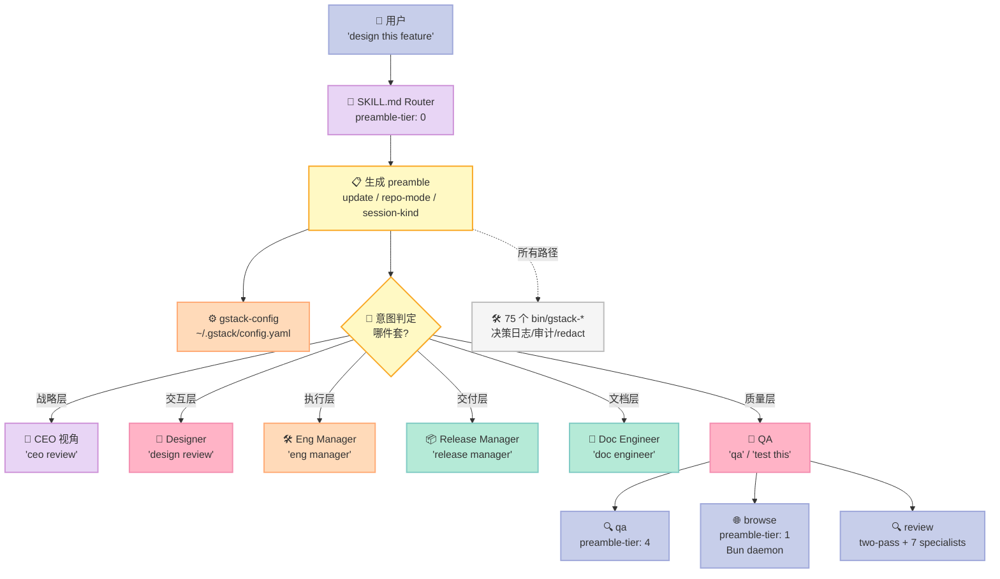
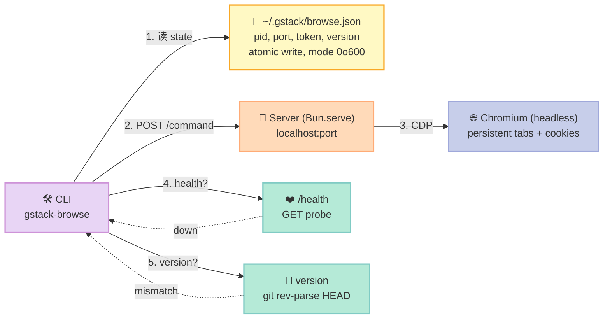
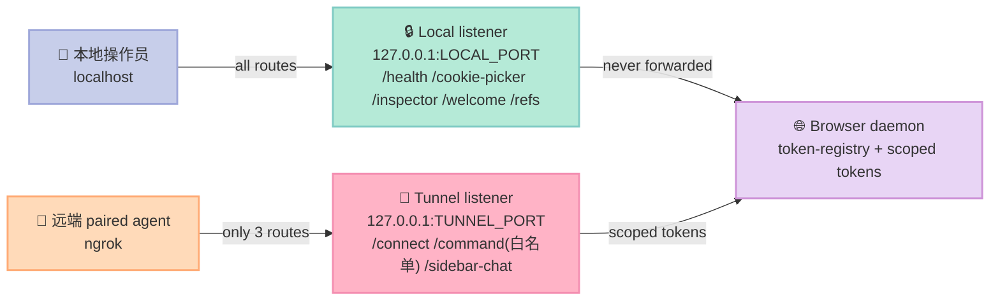
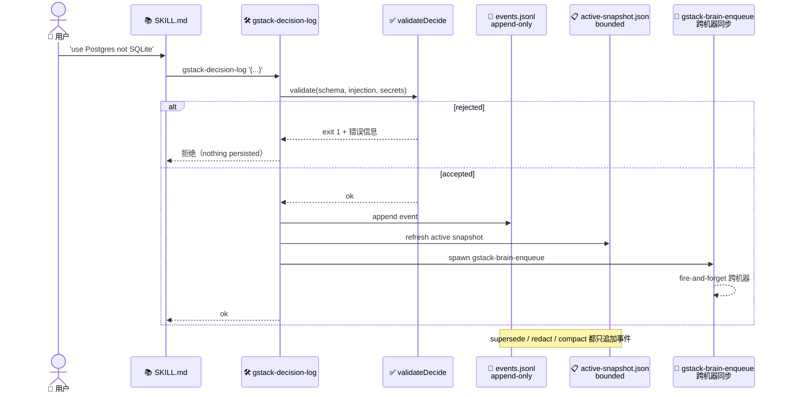
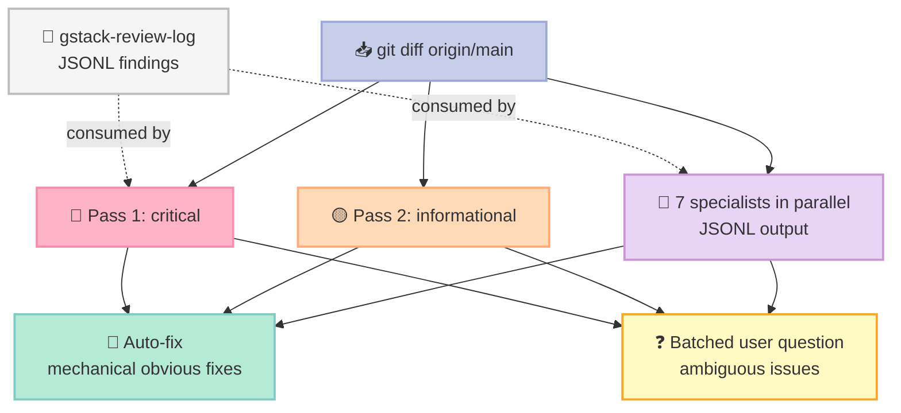

> **一句话结论**：gstack 把"Harness 不是文档，是运行时 prompt"这件事推到工程化极限——`SKILL.md` 是路由也是 23 件套的入口，`browse` 守护进程用 Bun 编译二进制 + 随机端口 + 版本自重启把 Chromium 拉到亚秒级延迟，`decision-log` 用事件溯源 JSONL 让"用户决策"成为可重放、可合并、可压实的状态对象。

## 引子：当 Harness 长成 75 个 CLI

如果你只能从一个项目里学"Claude Code 的 Harness 到底长什么样"，**garrytan/gstack** 是当前最值得拆的样板。

它不是又一个 Agent 框架，也不是另一套浏览器自动化库。它是 Garry Tan（前 YC CEO，现 YC 创始人之一）把自己日常 Claude Code 工作流**完整沉淀**下来的 75 个 `bin/gstack-*` 脚本 + 7 个 SKILL.md + 1 个持久化 Chromium 守护进程。在 GitHub 上 125,165⭐ + 18,761 forks + MIT + TypeScript，2026-07-15 最新提交，仓库大小 116 MB。DESCRIPTION 一句话点题：

> **Use Garry Tan's exact Claude Code setup: 23 opinionated tools that serve as CEO, Designer, Eng Manager, Release Manager, Doc Engineer, and QA.**

23 件套对应 6 个角色：CEO / Designer / Eng Manager / Release Manager / Doc Engineer / QA。今天这篇文章把 6 件套坐标系套在 gstack 上，回答 4 个问题：

1. 一个 75-脚本的 Harness 是怎么**路由**的？`SKILL.md` 怎么变成可执行 preamble？
2. 一个常驻 Chromium 守护进程是怎么做到**亚秒级延迟** + **多工作区零冲突**的？
3. 一个 7 个 specialist 的 review 编排是怎么避免**漏报和重复**的？
4. 一个 tiered QA（Quick/Standard/Exhaustive）是怎样用**固定证据链**驱动迭代修复的？

读完你能拿到：

- gstack 的 **3 段可运行代码**（Bun.serve daemon + decision-log append + 两段式 review 编排）
- `SKILL.md` 与 `Preamble` 的**生成式关系**——不是文档是 prompt
- 与 **browser-use / Playwright / Stagehand** 在浏览器层 + 与 **Conductor / Hatchet** 在 review 层的差异
- gstack 给中文 Harness 项目的 **5 条工程教训**

## 一、项目全景：23 件套在 Harness 6 件套坐标系里的映射

仓库根目录 `ls -la` 大致长这样（实际从 GitHub API 拉取）：

```text
gstack/
├── SKILL.md                  # 🧭 Router —— 顶层入口，把请求分发到 23 件套
├── SKILL.md.tmpl             # 📝 模板 —— 由 bin/gen-skill-docs 渲染为实际 SKILL.md
├── ARCHITECTURE.md           # 📖 设计原则 —— 解释 *为什么* 这样建
├── CLAUDE.md                 # 📖 用户文档 —— 怎么装、怎么用
├── CONTRIBUTING.md           # 📖 贡献指南
├── agents/openai.yaml        # 🤖 Sub-Agent 配置 —— 1 个 OpenAI 兼容 subagent
├── claude/SKILL.md.tmpl      # 📝 Claude Code 专用 SKILL.md 模板
├── browse/                   # 🌐 浏览器守护进程（Bun + Chromium CDP）
│   ├── SKILL.md              #    含 generated preamble
│   ├── SKILL.md.tmpl
│   ├── src/server.ts         #    Bun.serve 主服务
│   ├── src/browser-manager.ts
│   ├── src/cdp-bridge.ts
│   └── ...
├── qa/                       # 🧪 三档 QA：Quick / Standard / Exhaustive
│   ├── SKILL.md
│   ├── SKILL.md.tmpl
│   ├── references/issue-taxonomy.md
│   └── templates/
├── review/                   # 🔍 两段式 review + 7 个 specialist
│   ├── SKILL.md
│   ├── checklist.md          #    Pass1: critical / Pass2: informational
│   ├── design-checklist.md
│   ├── greptile-triage.md
│   ├── TODOS-format.md
│   └── specialists/          #    api-contract / data-migration / maintainability
│       ├── security.md       #    performance / red-team / security / testing
│       └── ...
├── bin/                      # 🛠️ 75 个 CLI —— Harness 的"硬机制层"
│   ├── gstack-config         #    统一配置（DEFAULTS 表 + env override）
│   ├── gstack-decision-log   #    event-sourced JSONL 决策日志
│   ├── gstack-decision-search
│   ├── gstack-review-log
│   ├── gstack-redact         #    HIGH secret 拦截
│   ├── gstack-redact-prepush
│   ├── gstack-redact
│   ├── chrome-cdp
│   └── ... (合计 75 个)
├── gstack/llms.txt           # 📚 文档聚合（给外部 LLM 检索）
└── lib/                      # 🧩 Bun 库 —— 让 75 个脚本共享状态、slug、路径解析
```

把它套进 Harness 6 件套：

| Harness 6 件套 | gstack 实现 | 关键文件 / 组件 | 设计亮点 |
|----------------|-------------|----------------|----------|
| **Rule（软约束）** | `gstack-config` + `~/.gstack/config.yaml` + `DEFAULTS` 表 | `bin/gstack-config` | 配置分层：DEFAULTS → 用户 config → env override（`GSTACK_STATE_ROOT`/`GSTACK_HOME`/`GSTACK_STATE_DIR`） |
| **Skill（按需 SOP）** | 7 个 SKILL.md（顶层 + browse / qa / review / claude） | `SKILL.md.tmpl` + `gen-skill-docs` 渲染 | 模板+生成 preamble：每次跑先 `gstack-update-check` / `gstack-repo-mode` / `gstack-session-kind` |
| **Sub-Agent（角色）** | `agents/openai.yaml`（OpenAI 兼容 subagent）+ CEO/Designer/EngMgr/ReleaseMgr/DocEng/QA 6 角色映射 | `agents/openai.yaml` | 把"角色"分解成 `tools` + `system prompt`，而不是新框架 |
| **Workflow（接力协议）** | review 两段式 + 7 specialist JSONL 输出 → 聚合 | `review/checklist.md` + `review/specialists/*.md` | Pass1 critical 先跑、Pass2 informational 后跑；specialist 单独子进程并 JSONL 协议 |
| **Script（硬关卡）** | 75 个 `bin/gstack-*`（gstack-config / gstack-decision-log / gstack-redact 等） | `bin/gstack-decision-log` 等 | 非交互优先：event-sourced，HIGHSECRET 直接 reject |
| **MCP（外部桥接）** | 浏览器 CDP + 隧道双 listener（local + tunnel） | `browse/src/server.ts` + `sse-session-cookie.ts` | **物理端口分离**而非 header 推断：tunnel 端口不暴露 `/health` 和 `/cookie-picker` |

最值得注意的一点：**gstack 不是把规则写进 prompt 字符串，而是把规则写进 75 个 Bash 脚本**。Skill.md 只是一层 thin wrapper——真正做事的永远是 `bin/gstack-config` / `bin/gstack-decision-log` 这类硬机制。这正是 Bitter Lesson 在 Harness 层的最佳实践：**让可学习的系统（LLM）做策略，让确定性系统（脚本）做机制**。

## 二、架构核心（一）：SKILL.md 是路由，不是文档

### 2.1 Router 模式

`SKILL.md` 顶层文件（实际是模板渲染产物，原始是 `SKILL.md.tmpl`）的第一段决定了请求如何分发。它读起来像一个 prompt：

```yaml
---
name: gstack
preamble-tier: 0
version: ...
description: CEO, Designer, Eng Manager, Release Manager, Doc Engineer, QA in one CLI.
triggers:
  - start gstack
  - ceo review
  - design review
  - eng manager
  - release manager
  - doc engineer
  - qa
allowed-tools: [Bash, Read, Write, Edit, Glob, Grep, AskUserQuestion]
---
```

`preamble-tier: 0` 表示它处于路由入口层，下游 `browse` 是 `preamble-tier: 1`、`qa` 是 `preamble-tier: 4`，数字越大越具体。这套设计把"应该先问什么、再问什么"编码进元数据。

### 2.2 Preamble：每次跑都先跑的一段 bash

打开 `browse/SKILL.md` 第一段**实际可执行**的 Bash：

```bash
_UPD=$(~/.claude/skills/gstack/bin/gstack-update-check 2>/dev/null \
       || .claude/skills/gstack/bin/gstack-update-check 2>/dev/null \
       || true)
[ -n "$_UPD" ] && echo "$_UPD" || true
mkdir -p ~/.gstack/sessions
touch ~/.gstack/sessions/"$PPID"
_SESSIONS=$(find ~/.gstack/sessions -mmin -120 -type f 2>/dev/null | wc -l | tr -d ' ')
find ~/.gstack/sessions -mmin +120 -type f -exec rm {} + 2>/dev/null || true
_PROACTIVE=$(~/.claude/skills/gstack/bin/gstack-config get proactive 2>/dev/null || echo "true")
_PROACTIVE_PROMPTED=$([ -f ~/.gstack/.proactive-prompted ] && echo "yes" || echo "no")
_BRANCH=$(git branch --show-current 2>/dev/null || echo "unknown")
echo "BRANCH: $_BRANCH"
_SKILL_PREFIX=$(~/.claude/skills/gstack/bin/gstack-config get skill_prefix 2>/dev/null || echo "false")
echo "PROACTIVE: $_PROACTIVE"
echo "PROACTIVE_PROMPTED: $_PROACTIVE_PROMPTED"
echo "SKILL_PREFIX: $_SKILL_PREFIX"
source <(~/.claude/skills/gstack/bin/gstack-repo-mode 2>/dev/null) || true
REPO_MODE=${REPO_MODE:-unknown}
echo "REPO_MODE: $REPO_MODE"
_SESSION_KIND=$(~/.claude/skills/gstack/bin/gstack-session-kind 2>/dev/null || echo "interactive")
case "$_SESSION_KIND" in spawned|headless|interactive) ;; *) _SESSION_KIND="interactive" ;; esac
echo "SESSION_KIND: $_SESSION_KIND"
# Conductor host: AskUserQuestion is unreliable here (native disabled, MCP
# variant flaky), so skills render decisions as prose instead of calling the
# tool. Gated on !headless so an eval/CI run INSIDE Conductor (GSTACK_HEADLESS)
# still BLOCKs rather than rendering prose to nobody.
if [ "$_SESSION_KIND" != "headless" ] && { [ -n "${CONDUCTOR_WORKSPACE_PATH:-}" ] || [ -n "${CONDUCTOR_PORT:-}" ]; }; then
  echo "CONDUCTOR_SESSION: true"
fi
_ACTIVATED=$([ -f ~/.gstack/.activated ] && echo "yes" || echo "no")
_FIRST_LOOP_SHOWN=$([ -f ~/.gstack/.first-loop-tip-shown ] && echo "yes" || echo "no")
echo "ACTIVATED: $_ACTIVATED"
echo "FIRST_LOOP_SHOWN: $_FIRST_LOOP_SHOWN"
```

这段 bash 不是给人类读的——它是给 Claude Code 跑的。目的是让 Claude 在**每一次进入 gstack 工作流前**先知道：版本是不是新的、有没有别的会话在跑、当前是不是 git 仓库、是不是 Conductor 评估模式、是不是第一次激活、telemetry 是否启用。

### 2.3 关键设计原则：Preamble 不能阻塞启动

注意注释里的两段话：

> `# Conductor host: AskUserQuestion is unreliable here (native disabled, MCP variant flaky), so skills render decisions as prose instead of calling the tool.`
> `# Gated on !headless so an eval/CI run INSIDE Conductor (GSTACK_HEADLESS) still BLOCKs rather than rendering prose to nobody.`

这是 gstack 给所有 Harness 项目的第一条工程教训：**Preamble 应该只 echo 状态，永远不要 AskUserQuestion**。理由是：

- 在 Conductor 评估环境下，AskUserQuestion 不可靠，会卡死
- 在 CI / 自动化环境，应该 BLOCK 而不是把决策渲染给空气
- 人类的判断只通过非交互工具进入决策日志（`gstack-decision-log`），不进 prompt

这也是为什么 23 件套几乎全部走 **event-sourced JSONL** 而不是 prompt 字符串——后者无法在 headless 模式下回放。

### 2.4 Router 与 preamble 的整体形态



## 三、架构核心（二）：Bun 守护进程 + 随机端口 + 版本自重启

`browse` 是 gstack 最硬核的部分——它把"AI agent 操控浏览器"这件事从"每次冷启动 3 秒"压到"每次亚秒"。`ARCHITECTURE.md` 把这背后的设计选择说得很清楚：

### 3.1 为什么是 Bun 而不是 Node.js

ARCHITECTURE 原话摘录：

> 1. **Compiled binaries.** `bun build --compile` produces a single ~58MB executable. No `node_modules` at runtime, no `npx`, no PATH configuration. The binary just runs. This matters because gstack installs into `~/.claude/skills/` where users don't expect to manage a Node.js project.
> 2. **Native SQLite.** Cookie decryption reads Chromium's SQLite cookie database directly. Bun has `new Database()` built in — no `better-sqlite3`, no native addon compilation, no gyp. One less thing that breaks on different machines.
> 3. **Native TypeScript.** The server runs as `bun run server.ts` during development. No compilation step, no `ts-node`, no source maps to debug. The compiled binary is for deployment; source files are for development.
> 4. **Built-in HTTP server.** `Bun.serve()` is fast, simple, and doesn't need Express or Fastify. The server handles ~10 routes total. A framework would be overhead.

四个理由是连贯的：

1. **单文件二进制**——gstack 安装到 `~/.claude/skills/`，用户不会期望在那维护 Node 项目
2. **原生 SQLite**——读 Chromium 的 Cookie 数据库需要解密 Bun 自带 `new Database()`
3. **原生 TypeScript**——开发期 `bun run server.ts`，部署期 `bun build --compile`，无中间编译
4. **`Bun.serve()` 够用**——总共 ~10 条路由，框架是 overhead

### 3.2 守护进程模型 vs 每命令启动浏览器

ARCHITECTURE 给了三段对比：

| 维度 | 每命令启动 Chromium | gstack 守护进程 |
|------|---------------------|------------------|
| 启动开销 | 每次 2-3 秒 | 首次 3 秒，后续 100-200ms |
| 状态持久化 | 丢失 cookies / localStorage / 登录态 | 持续保持 |
| 进程管理 | 用户手动起停 | 自动启动、30 分钟空闲自动停 |
| 多工作区并发 | 端口冲突 | 随机端口（10000-60000）零冲突 |

最后一行是关键：**支持 10 个 Conductor workspace 同时跑各自 browse daemon**。旧的"扫 9400-9409 端口"方案在多工作区下经常崩。

### 3.3 三层自愈机制



三层自愈分别是：

**第 1 层：state 文件缺失或健康检查失败 → 拉起新服务。** `browse.json` 用 tmp + rename 原子写，权限 0o600（仅 owner 可读）。PID 在 Windows 上不可靠，所以 `GET /health` 是所有平台的主要活性信号。

**第 2 层：版本不匹配 → 杀旧服务重启。** 构建时把 `git rev-parse HEAD` 写入 `browse/dist/.version`。每次 CLI 调用都对比 binary 的 version 和 running server 的 `binaryVersion`，不匹配就 `kill` 旧的、起新的。这彻底消除"陈旧二进制"那类 bug——rebuild 一下，**下次命令自动生效**。

**第 3 层：随机端口 + 重试。** 端口在 10000-60000 之间随机选，最多重试 5 次。这意味着 10 个 Conductor workspace 可以各自跑一个 browse daemon，零配置零冲突。

### 3.4 双 listener 隧道架构：物理端口分离

`browse` 在 v1.6.0 引入了 **dual-listener tunnel architecture**。ARCHITECTURE 给出了详细的安全模型：

> When a user runs `pair-agent --client`, the daemon starts an ngrok tunnel so a remote paired agent can drive the browser. Exposing the full daemon surface to the internet (even behind a random ngrok subdomain) meant `/health` leaked the root token on any Origin spoof, and `/cookie-picker` embedded the token into HTML that any caller could fetch.

问题：把整个 daemon 暴露到公网（即使在随机 ngrok 子域名下）有两个漏洞：
- `/health` 在 Origin 伪造时会泄漏 root token
- `/cookie-picker` 把 token 嵌入 HTML，任何调用者都能 fetch

解决方案是**两个 HTTP listener，而不是一个**：

| 角色 | 监听地址 | 启动时机 | 暴露端点 |
|------|----------|----------|----------|
| **Local listener** | `127.0.0.1:LOCAL_PORT` | 永远绑定 | `/health`、`/cookie-picker`、`/inspector/*`、`/welcome`、`/refs`、sidebar-agent API、完整命令面 |
| **Tunnel listener** | `127.0.0.1:TUNNEL_PORT` | `/tunnel/start` 时 lazy bind | `/connect`（pairing ceremony，限流）、`/command`（仅 scoped token + 命令白名单）、`/sidebar-chat` |

ngrok **只转发 tunnel 端口**。安全属性来自**物理端口分离**：tunnel 调用者根本访问不到 `/health` 和 `/cookie-picker`，因为那两个路径在这个 TCP socket 上不存在。

注释里点出的原因很工程：

> Header inference (check `x-forwarded-for`, check origin) is unreliable (ngrok header behavior changes; local proxies can add these headers); socket separation isn't.

**头部推断不可靠，socket 分离可靠**——这是一条值得所有 dev server / dev tools 学到的原则。



## 四、架构核心（三）：决策日志 = event-sourced JSONL

`bin/gstack-decision-log` 是 gstack 给"用户决策"这件事给出的工程化答案。它的源码注释明确写出设计原则：

> Event-sourced (lib/gstack-decision): every call appends an event and refreshes the bounded active snapshot. **NON-INTERACTIVE — never prompts** (agents/skills call this; a prompt would hang them). Validation + injection + HIGH-secret rejection happen in `validateDecide`; a rejected decision exits 1 with a message, nothing persisted.

### 4.1 三段设计选择

| 选择 | 理由 |
|------|------|
| **Event-sourced 而不是 stateful DB** | 每个决策是一次事件，可重放、可合并、可压实 |
| **NON-INTERACTIVE** | agent / skill 在调用，prompt 会卡死 |
| **HIGH-secret rejection** | 校验阶段直接拒绝写入 HIGH secret 类内容 |

调用方法：

```bash
# Append a new decision
gstack-decision-log '{"decision":"...","rationale":"...","scope":"repo","source":"user"}'

# Supersede a previous decision (it stays in event log, but snapshot updates)
gstack-decision-log --supersede <decision-id>

# Redact a decision (mask content, keep id)
gstack-decision-log --redact <decision-id>

# Compact the event log
gstack-decision-log --compact
```

**每个操作都是一个事件**，快照只是当前活跃决策的有界视图。这是和 Conductor 的 `task state` 完全不同的取向——Conductor 是"任务执行记录"，gstack-decision-log 是"用户决策记录"。前者关心"发生了什么"，后者关心"用户选择了什么"。

### 4.2 validateDecide 拒绝什么

源码头注释：

> Validation + injection + HIGH-secret rejection happen in `validateDecide`; a rejected decision exits 1 with a message, nothing persisted.

三件事都在入口完成：

- **Validation**：JSON Schema 检查 `decision` / `rationale` / `scope` / `source`
- **Injection**：防 shell / SQL / prompt 注入（即使 source 是 user，也不信任内容）
- **HIGH-secret rejection**：拦截看起来像 AWS key / GitHub token / private key 等 HIGH secret

### 4.3 decision-log 数据流



**`gstack-brain-enqueue` 是 fire-and-forget**——决策提交不阻塞。同步失败不回滚决策（已经持久化），也不重试（artifacts_sync 关闭时是无操作）。这条策略和 LangChain / LlamaIndex 的 callback 设计不同：那些是阻塞 + 重试，gstack 走 **event log + eventual consistency**。

### 4.4 三个值得抄的细节

1. **slug 解析**：每个仓库有独立 slug，决策路径是 `~/.gstack/projects/<slug>/decisions.jsonl`——多 repo 隔离
2. **分支感知**：从 `gstack-repo-mode` 读 git branch，但决策写入不按分支分裂
3. **compact 是显式操作**：不像 Logrotate 自动跑，用户主动 `--compact` 才会压实，避免半夜被日志整理唤醒

## 五、Review 编排：两段式 + 7 个 Specialist 的 JSONL 协议

`review/checklist.md` 是 gstack 怎么把"代码评审"做成可编排工作流的样板。

### 5.1 两段式 review：先 critical，后 informational

```markdown
**Two-pass review:**
- **Pass 1 (CRITICAL):** Run SQL & Data Safety, Race Conditions, LLM Output Trust
  Boundary, Shell Injection, and Enum Completeness first. Highest severity.
- **Pass 2 (INFORMATIONAL):** Run remaining categories below. Lower severity but
  still actioned.
- **Specialist categories (handled by parallel subagents, NOT this checklist):**
  Test Gaps, Dead Code, Magic Numbers, Conditional Side Effects, Performance &
  Bundle Impact, Crypto & Entropy. See `review/specialists/` for these.
```

为什么分两段？因为 **critical 的问题会把 informational 的发现掩盖**。如果一次性输出 30 条 findings，用户不会先看 SQL injection；先 critical 后 informational 的顺序让"安全 → 数据 → 状态"这种严重度梯度自然展开。

### 5.2 7 个 specialist 的并行 JSONL 协议

`review/specialists/` 下有 7 个文件：

```text
api-contract.md
data-migration.md
maintainability.md
performance.md
red-team.md
security.md
testing.md
```

每个 specialist 的输出格式是**严格 JSONL**，schema 定义在 `security.md` 头：

```json
{"severity":"CRITICAL|INFORMATIONAL","confidence":N,"path":"file","line":N,"category":"security","summary":"...","fix":"...","fingerprint":"path:line:security","specialist":"security"}
```

可选字段：`line`、`fix`、`fingerprint`、`evidence`、`test_stub`。**如果没有 findings，输出 `NO FINDINGS` 且什么都不输出**。

这是用 **JSONL 作为 subagent 间协议** 的经典设计——比 markdown 报告好解析、比二进制好调试、比 XML schema 易生成。`fingerprint` 字段还做了**去重**：同一文件同一行同类问题只报一次。

### 5.3 Red Team = 找别人漏掉的

`review/specialists/red-team.md` 的开篇说明它和别的 specialist 不一样：

> This is NOT a checklist review. This is adversarial analysis.
>
> You have access to the other specialists' findings (provided in your prompt). Your job is to find what they MISSED. Think like an attacker, a chaos engineer, and a hostile QA tester simultaneously.

它的方法论是 5 步：

1. **Attack the Happy Path** — 10× 负载、并发同资源、慢 DB、外部服务返垃圾
2. **Find the Silent Failures** — catch-all 吞异常、3/5 完成崩溃、不一致状态、后台失败无告警
3. **Exploit Trust Assumptions** — 前端校验后端不校验、内部 API 无认证、配置假设存在、路径/URL 未清洗
4. **Break the Edge Cases** — 最大输入、零项、空串、首次运行、100ms 双击
5. **Find What the Other Specialists Missed** — 看 specialist 间的 gap、跨类问题、集成边界、特定部署

**这和 Conductor 的 DeciderService 哲学是一致的**：不在每个组件里硬编码"可能出错的所有情况"，而是有一个"对抗性视角"专门找出被乐观假设掩盖的问题。

### 5.4 Review 编排数据流



**Fix-First Review** 也是一个有意思的选择：明显的机械修复自动 apply，模糊的问题**合并成单个用户问题**——而不是每个问题单独问。这避免了 review 阶段给用户刷屏 30 个 Yes/No 弹窗。

## 六、QA：Tiered Iterative 质量门

`qa/SKILL.md` 的 preamble-tier 是 4（最具体那一层），它做的事情是：

> Runs QA testing, then iteratively fixes bugs in source code, committing each fix atomically and re-verifying. ... Three tiers: Quick (critical/high only), Standard (+ medium), Exhaustive (+ cosmetic). Produces before/after health scores, fix evidence, and a ship-readiness summary.

### 6.1 三档 tier 的设计

| Tier | 处理范围 | 适用场景 | 输出 |
|------|----------|----------|------|
| **Quick** | critical / high | 5 分钟冒烟，CI 必跑 | 0/N critical, before/after score |
| **Standard** | + medium | 发布前常规验证 | + medium findings, fix evidence |
| **Exhaustive** | + cosmetic | release candidate | + cosmetic, 完整 ship-readiness |

**关键设计：每个 fix 都是原子提交**——这意味着：

- 任意 fix 失败可以单独 revert
- 每个 commit 都对应一个 fix evidence，可以追溯
- CI 可以基于"是否还有 critical finding"做 ship gate

### 6.2 QA 与 review 的区别

| 维度 | QA | Review |
|------|-----|--------|
| 输入对象 | 部署后的 web app | git diff origin/main |
| 关注问题 | 功能 bug / UI 异常 / 可用性 | 代码质量 / 安全 / 性能 |
| 输出形式 | before/after health score + fix commits | findings JSONL + auto-fix |
| 反馈速度 | 立即（headless browser） | 在 PR 时 |
| 谁来跑 | `qa` skill | `review` skill |

QA 和 review 在 gstack 里**是平行 skill，不是串联的**。这避免了"先 review 再 QA"的串行延迟——你可以并行：review 看代码、QA 看运行。

## 七、Less is More：哪些交给模型，哪些不能

| 能力 | 应交给模型？ | 原因 |
|---|---:|---|
| 哪个 skill 处理这个请求 | ✅ | 属于意图识别，模型擅长 |
| 生成 / 修改 SKILL.md 内容 | ✅，但需校验 | 让模型迭代 prompt，Schema 负责收敛 |
| 决定是否做某次 review | ✅ | 策略判断 |
| 决定 bug 严重度 | ✅ | 但 specialist 负责给建议 |
| review 是否阻塞 PR | ❌ | 这是 CI 边界 |
| 红线 secret 是否写入 JSONL | ❌ | 必须确定性地拒绝 |
| 版本不匹配是否杀旧服务 | ❌ | 物理事实，不容模型判断 |
| 是否对 ngrok tunnel 暴露 `/health` | ❌ | 安全属性，由代码强制 |

gstack 的"聪明"主要集中在**prompt 编排与脚本调用策略**，而把 **secret、端口、健康检查、版本**这些外部世界约束都做成确定性机制。这是 Bitter Lesson 的"半边天"——策略交给可学习的系统，机制交给代码。

## 八、与同类项目的设计差异

### 8.1 浏览器层横向对比

| 维度 | gstack browse | browser-use | Playwright | Stagehand |
|------|---------------|-------------|------------|-----------|
| 启动开销 | 守护进程亚秒级 | 每命令冷启 2-3s | 每 session 冷启 | 每 session 冷启 |
| 状态持久化 | cookies / tabs 全保 | session 内保留 | context 内保留 | session 内保留 |
| 浏览器控制协议 | CDP over HTTP | bubus EventBus + CDP | CDP over WebSocket | CDP over WebSocket |
| Headless 默认 | ✅ | ✅ | ✅ | ⚠️ 需配置 |
| 多工作区并发 | 随机端口零冲突 | 单实例 | 单实例 | 单实例 |
| 安全模型 | 双 listener + scoped tokens | 无内建 daemon | 无内建 daemon | 无内建 daemon |
| 上手成本 | 仅 `npm i -g` | `pip install browser-use` | `npm i playwright` | `npm i @browserbase/stagehand` |
| 适合场景 | Agent 长会话浏览 | Web Agent 通用 | 通用自动化 | AI 辅助脚本 |

差异不在"谁功能更多"，而在**怎么把浏览器变成 Agent 的可恢复外部记忆**——gstack 通过 daemon 让浏览器成为 long-lived 进程，browser-use 通过 session 保留。两者都在解决 "Agent 上下文太短" 的同一问题，路径不同。

### 8.2 Review 层横向对比

| 维度 | gstack review | Coderabbit | Greptile | Aider `--review` |
|------|---------------|------------|----------|------------------|
| 编排方式 | 两段式 + 7 specialist | 单 LLM agent | 检索增强 LLM | 单 LLM |
| 输出协议 | 严格 JSONL + fingerprint | markdown 评论 | markdown 评论 | 文本流 |
| Critical / informational 分离 | ✅ 两段式 | ⚠️ severity 标记 | ⚠️ severity 标记 | ⚠️ severity 标记 |
| Adversarial review | ✅ red-team specialist | ❌ | ❌ | ❌ |
| Auto-fix 集成 | ✅ fix-first review | ⚠️ 建议 patch | ❌ | ❌ |
| 可扩展性 | 加 1 个 specialist markdown 即可 | 受限于 prompt | 受限于索引 | 不支持 |

差异在**是否把 review 当成可编排的 agent 协议**——gstack 把它当成一个工作流（Pass1 + Pass2 + specialists），其他产品基本都当成单 LLM 推理。

## 九、优缺点：左侧简单，右侧可靠

| 左侧优势 | 具体表现 | 右侧代价 | 具体表现 |
|---|---|---|---|
| **角色化抽象** | 23 件套对应 CEO/Designer/QA 等真实工作流，学习曲线友好 | **复杂度** | 75 个 bin 脚本 + 7 个 SKILL.md 维护成本不低 |
| **持久化浏览器** | daemon 模式让多轮会话 cookies 全保 | **平台依赖** | Chromium / CDP / App-Bound Encryption 在不同 OS 上行为不同 |
| **可重放决策** | event-sourced JSONL 让 supersede / redact / compact 都可追 | **手动维护** | 决策日志不会自动清理，需要 `--compact` |
| **事件溯源 review** | 两段式 + 7 specialist 避免漏报 | **运行成本** | 7 specialist 并行调用 7 个 LLM，token 消耗不低 |
| **配置分层** | DEFAULTS + config.yaml + env override 清晰 | **入门门槛** | 用户要理解 GSTACK_STATE_ROOT / GSTACK_HOME / GSTACK_STATE_DIR 三套优先级 |
| **安全模型** | 双 listener 物理端口分离避免 header 推断脆弱 | **协议保守** | tunnel 端口的命令白名单是手维护的，新增命令要改代码 |

我的判断是：**gstack 适合"想用 Claude Code 做严肃产品"的个人/小团队，不适合"只想跑个 demo"的开发者**。如果你只跑 5 个命令以内的会话，daemon 模型反而是 overhead；但如果一个 Agent 会持续 30 分钟 + 多次切回登录态，gstack 的设计优势就压倒复杂度。

## 十、从零搭建的落地路线

### 必须先做

1. **把"非交互"刻进每个 script**。Agent 调用你的脚本时不会等你按回车。`gstack-decision-log` 的注释把这点放在第一行，应该照抄。
2. **状态文件原子写 + 0o600**。`browse.json` 用 tmp + rename，权限 owner-only。多进程并发是默认假设。
3. **Preamble 只 echo 状态，绝不 AskUserQuestion**。CI / Conductor / 自动化环境下 prompt 会卡死——这点前面 §2.3 已经强调。
4. **校验在入口做，secret 在入口拒**。`validateDecide` 拒绝 HIGH secret 是底线，不是优化。
5. **版本自愈机制**。binary version 和 running server version 不匹配时，杀旧启新——避免"rebuild 之后忘了重启"的经典坑。

### 可以后做

- 动态 specialist 加载（运行时按需启用）
- 跨机器 decision-log 同步（`gstack-brain-enqueue` 当前是 fire-and-forget）
- 高级 reviewer UI / dashboard
- 决策日志的搜索 / 检索接口（`gstack-decision-search` 已经有，但还在演进）

### 三个真实踩坑

**第一，Preamble 不能阻塞启动。** 我见过太多 Harness 项目在 preamble 里调 `AskUserQuestion` —— 在 Conductor 评估环境下会让整个 workflow 卡死。gstack 的注释把这个坑写在每段 preamble 上面。

**第二，事件溯源 ≠ 无限增长。** `decisions.jsonl` 是 append-only，但 snapshot 是 bounded。`--compact` 是显式操作，不能后台跑——半夜跑日志压实会把 CPU 抢光。

**第三，物理端口分离优于头部推断。** 双 listener 看似过度设计，但当 `/health` 泄漏 root token 时，这是唯一不留痕迹的修复。`x-forwarded-for` 和 Origin 都可以被伪造，TCP socket 不能。

## 十一、结论：把 Harness 从"工具集合"升级为"角色操作系统"

gstack 的价值不是给 Claude Code 加更多功能，而是提供一份**角色化的运行时操作系统**——23 件套对应 6 个角色，每个角色有独立的 skill、决策日志、review specialist；`SKILL.md` 是路由也是生成 preamble 的模板；浏览器是持久化外部记忆；决策是事件溯源对象；review 是可编排工作流。

这套分工让 Harness 更接近 OS：策略由 LLM 编排，机制由 75 个脚本承担；模型可以犯错，但 secret 写入、版本不一致、tunnel 路径暴露都被代码强制阻断；agent 可以被重启，但 cookies / tabs / decision-log 都还在。

**行动建议**：如果你正在做 Claude Code Harness，先别加第 24 件套。先把当前的 SKILL.md 改成"模板 + 生成 preamble"、把当前的关键脚本改成"非交互 + 入口校验 + atomic write + 0o600"、把当前的 review 改成"两段式 + JSONL 协议"。当你能跑完 30 分钟长会话、cookies 不丢、决策可重放、review 可并行时，才算真正拥有了 Harness OS。

---

## 参考资料

1. [garrytan/gstack GitHub](https://github.com/garrytan/gstack) — 125,165⭐ + 18,761 forks + MIT + TypeScript + 116 MB
2. [gstack ARCHITECTURE.md](https://github.com/garrytan/gstack/blob/main/ARCHITECTURE.md) — 守护进程模型 + 双 listener 隧道架构
3. [gstack CLAUDE.md](https://github.com/garrytan/gstack/blob/main/CLAUDE.md) — 安装与命令
4. [browse/SKILL.md](https://github.com/garrytan/gstack/blob/main/browse/SKILL.md) — 含生成 preamble 的实际形态
5. [qa/SKILL.md](https://github.com/garrytan/gstack/blob/main/qa/SKILL.md) — 三档 tiered QA
6. [review/checklist.md](https://github.com/garrytan/gstack/blob/main/review/checklist.md) — 两段式 review
7. [review/specialists/](https://github.com/garrytan/gstack/tree/main/review/specialists) — 7 个 specialist 子协议
8. [bin/gstack-decision-log](https://github.com/garrytan/gstack/blob/main/bin/gstack-decision-log) — event-sourced JSONL 决策日志
9. [bin/gstack-config](https://github.com/garrytan/gstack/blob/main/bin/gstack-config) — 配置分层与 env override
10. [browser-use](https://github.com/browser-use/browser-use) — Web Agent 浏览器层对比
11. [Conductor](https://github.com/conductor-oss/conductor) — 持久化工作流对比
12. [Playwright](https://github.com/microsoft/playwright) — 通用自动化浏览器对比
13. [Stagehand](https://github.com/browserbase/stagehand) — AI 辅助脚本浏览器对比
14. [Bun 官方文档](https://bun.sh/docs) — `Bun.serve()` / `bun build --compile` / 原生 SQLite
15. [Chrome DevTools Protocol](https://chromedevtools.github.io/devtools-protocol/) — CDP 协议