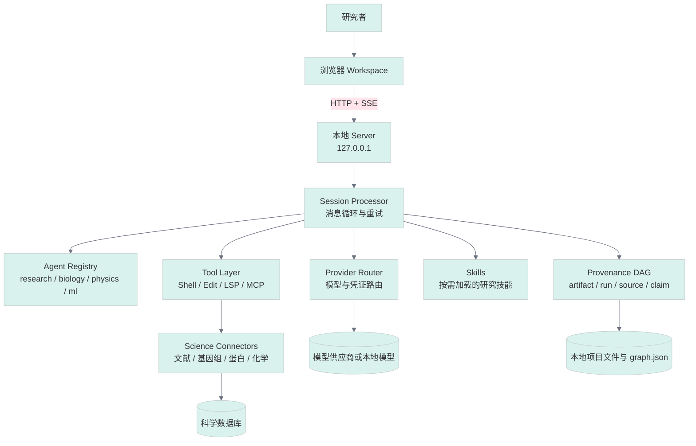
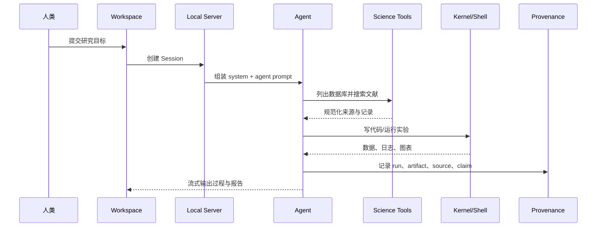

## 引子

“让模型读论文、写代码、跑实验”并不难，难的是把一次看似聪明的回答变成可以复现、检查和继续推进的研究过程。`synthetic-sciences/openscience` 选择了一个很具体的答案：它不是又一个聊天窗口，而是一个本地优先的科学研究工作台。用户给出目标，Agent 通过文献检索、科学数据库、Shell、编辑器和计算工具推进假设，再把代码、数据、图表与结论留在工作区。

本文基于仓库 README、`ARCHITECTURE.md` 以及 Agent、会话处理器、科学工具和 provenance 存储实现（截至 2026-07-30 的仓库状态）分析其设计。项目当前约 2.9k stars，最近提交为 [dc00e07](https://github.com/synthetic-sciences/openscience/commit/dc00e07e81cc98974abdc435527ce01fb33abd49)。

## 项目简介

项目地址：[synthetic-sciences/OpenScience](https://github.com/synthetic-sciences/openscience)。OpenScience 是 Apache-2.0 许可的开源科学研究工作台，支持 Anthropic、OpenAI、Google 等模型，也允许使用本地或其他 OpenAI-compatible provider。它把浏览器工作区、运行在本机的 Bun/TypeScript 服务、Agent runtime、工具层、技能包和科学数据库连接器组合起来。

它解决的核心问题是**研究流程碎片化**：论文在浏览器，实验在 Notebook，数据查询依赖临时脚本，最终报告又丢失了“这个结论由哪次运行产生”的链路。OpenScience 的价值不在于宣称模型会自动发现科学规律，而在于把研究中的检索、执行、产物和证据组织成一条可检查的工作流。

## 架构分析

### 分层结构



这张图对应仓库的真实边界：`backend/cli/src/server` 提供本地 API，`src/session` 负责运行时，`src/agent` 保存 Agent 注册与 prompt，`src/tool` 和 `src/science` 提供行动能力，`src/provider` 负责模型路由。服务绑定 `127.0.0.1` 并检查 Host/Origin，意味着默认部署形态是“个人电脑上的研究环境”，而不是暴露到公网的共享 SaaS。

### Agent 层：专业角色不是多 Agent 炫技

`src/agent/agent.ts` 用结构化的 `Info` 描述 Agent：名称、模式（primary/subagent/all）、权限、模型覆盖、prompt 和步数限制。默认 `research` 负责通用研究，`biology`、`physics`、`ml` 是领域专长，另有 critique、literature-review 和 reviewer 等辅助 prompt。

这里的关键设计是**角色由 prompt、权限和可用工具共同定义**，而不是把多个聊天机器人并列展示。研究流程可以由主 Agent 调用子 Agent 做文献综述或批评，再回到主会话；只读的 plan 模式则把“规划”和“执行”分开，减少模型一开始就修改工作区的风险。

### Model 层：按请求路由，避免把模型写死

Provider router 把 provider ID 与 model ID 解耦。README 明确支持自带 API key，Atlas 只是可选的托管模型与研究图服务。这样做的工程意义是：研究者可以用强模型完成假设生成，用便宜模型做整理，或切换到本地模型处理隐私数据，而不必改 Agent 业务代码。

### Tool 层：科学连接器被压成稳定的工具面

`src/tool/science.ts` 有一个值得注意的取舍：不论注册多少数据库，模型看到的核心入口仍然是 `science_list_dbs` 与 `science_search`（当前版本另增加了 fetch 能力）。先列目录再按 `db` 查询，把“连接器数量”与“模型工具数量”解耦，避免工具列表随数据库增长而膨胀。

连接器返回统一的 `id/title/summary/url` 结果，底层差异被留在 `src/science/connectors`。这不是传统向量 RAG：项目提供 arXiv、OpenAlex、PubMed、UniProt、PDB、ChEMBL、PubChem 等外部科学数据库的结构化查询，Agent 可以先发现来源，再取得记录或文件，随后在本地执行分析。

### Memory 与证据层：本地 provenance DAG

`src/science/provenance/store.ts` 维护一个小型、内容寻址的 provenance DAG。节点包括 `artifact`、`run`、`source`、`claim`，边包括 `produced`、`consumed`、`derived-from`、`supports`、`refutes`。节点 ID 来自规范化内容的 SHA-256，因此相同内容可以去重，研究产物也能沿图回溯。

它更接近“研究审计记忆”而不是向量记忆：

- **写入**：工具或内核运行记录输入、状态和输出产物。
- **检索**：按来源、运行或产物关系追溯，而非只按语义相似度召回。
- **使用**：写报告时把 claim 与 supports/refutes 边连接到数据、图表和运行。

当前实现把图保存为应用数据目录中的单个 JSON 文件，明确定位为小规模研究 Notebook 的审计轨迹，而不是生产图数据库。这种克制让本地安装简单，但也意味着大型团队协作需要额外的同步、锁和权限设计。

## 核心机制

### 一次研究请求的数据流



`SessionProcessor` 是闭环的调度核心。它处理消息生成、工具调用、失败重试、上下文压缩以及 doom-loop 检测。代码中不仅检查重复工具调用，还检查连续的近似文本回合；这是针对弱模型“不断总结却不收敛”的运行时保护。对长研究任务而言，这比单纯增加最大 token 数更实用：系统会识别没有进展的循环，并把控制权交还给人类。

### 少量伪代码：为什么它能从聊天走到实验

```text
while not finished:
    response = model(system_prompt, agent_prompt, context, tools)
    if response.calls_tool:
        result = execute(response.tool, response.input)
        provenance.record(run=response, result=result)
        context.append(result)
    else:
        context.append(response.text)
    if repeated_tool_or_text_loop(context):
        compact_or_stop_with_review()
```

这里的“记忆”不是把所有历史无限塞回上下文，而是把可复核事实外化为文件与 provenance 节点；上下文压缩只负责让当前 Agent 继续工作，审计图负责让未来的研究者找回依据。

### RAG、embedding 与多 Agent 的边界

OpenScience 的研究检索并不依赖一个中心向量库。数据库连接器负责按领域调用原生科学 API，返回带 URL 的结构化结果；技能包提供训练、数据集、分子、论文和云计算等领域知识。对于需要语义检索的项目，用户仍可通过工具或 MCP 接入自己的向量数据库。

多 Agent 也不是默认把任务拆成几十个角色。主 Agent 负责方向和工具调用，专业 Agent/子 Agent 只在领域知识或批评环节提供增量。这个设计降低了协调成本，但要求主模型有足够强的任务分解能力，并且需要人工审查科学结论。

## 对比分析

### 与普通 Agent 框架

LangGraph、PydanticAI 等框架更像可嵌入的运行时组件：开发者定义状态、节点和业务工具。OpenScience 则把 UI、终端、编辑器、技能目录和科学连接器作为完整产品交付。前者适合把 Agent 嵌进现有服务，后者适合研究者直接打开一个可用工作区。

### 与 RAG 平台

RAGFlow、LlamaIndex 等项目的中心问题是把文档切分、索引和召回做好；OpenScience 的中心问题是让检索结果进入“假设—代码—实验—报告”闭环。它可以调用文献数据库，但不把 embedding 召回当作研究完成的终点。两者可以组合：RAG 平台提供企业语料召回，OpenScience 负责实验执行与证据记录。

### 与通用 coding agent

Claude Code、OpenHands 一类工具擅长修改代码和操作终端。OpenScience 也有 Shell、编辑器和 LSP，但额外提供科学数据库、领域 Agent、研究技能以及 provenance 图。差异不在“能否运行 Python”，而在“运行结果能否作为一个 claim 的可追溯支撑”。

## 使用指南

### 安装并启动

```bash
npm install -g @synsci/openscience
openscience
```

也可以不全局安装：

```bash
npx synsci
```

设置任意支持的模型供应商密钥后启动：

```bash
export ANTHROPIC_API_KEY='你的密钥'
openscience ~/code/my-research
```

启动后浏览器会打开本地 Workspace；可以在 Credentials 面板或命令行 `openscience keys add` 配置密钥。Bring-your-own-key 模式不要求 Atlas 账号。

### 一个可执行的研究任务模板

```text
研究目标：比较两种蛋白结构预测方法在指定数据集上的误差。

约束：
1. 先用 science_list_dbs 发现可用的蛋白和文献数据库；
2. 用 science_search 获取来源并保存 URL；
3. 在项目目录写出可重复运行的 Python 实验脚本；
4. 每次运行保存输入、输出、图表和随机种子；
5. 最终报告为每个结论列出支持它的 artifact/source。
```

### 安全与成本边界

默认本地运行并不等于自动安全：Shell、网络和外部目录权限仍应按任务收紧，API key 不应写入项目文件。长实验还要设置预算、步数和超时。对于药物、临床或安全研究，模型生成的假设只能作为候选，不能替代同行评审、实验验证和合规流程。

## 趋势与思考

OpenScience 展示了科学 Agent 的一个可持续方向：模型只是决策层，真正的产品壁垒来自连接器、执行环境、技能和证据链。未来的研究工作台可能会进一步把 provenance 图变成可查询的研究知识图，把实验环境做成可复现沙箱，并让 reviewer Agent 对数据泄漏、统计错误和不支持的 claim 自动报警。

但“自动完成研究”必须保持边界感。科学价值来自可证伪性与复现，而不是报告写得像论文。一个好的 Research Agent 应该让人更容易看见它查了什么、运行了什么、哪里失败、结论依赖哪些假设；OpenScience 把这些要求落到了本地代码和数据结构中，这是它比泛化聊天 Agent 更值得研究的地方。

> 资料： [OpenScience README](https://github.com/synthetic-sciences/openscience#readme)、[架构说明](https://github.com/synthetic-sciences/openscience/blob/main/ARCHITECTURE.md)、[Agent 实现](https://github.com/synthetic-sciences/openscience/blob/main/backend/cli/src/agent/agent.ts)、[会话处理器](https://github.com/synthetic-sciences/openscience/blob/main/backend/cli/src/session/processor.ts)、[科学工具](https://github.com/synthetic-sciences/openscience/blob/main/backend/cli/src/tool/science.ts)、[Provenance 存储](https://github.com/synthetic-sciences/openscience/blob/main/backend/cli/src/science/provenance/store.ts)。
