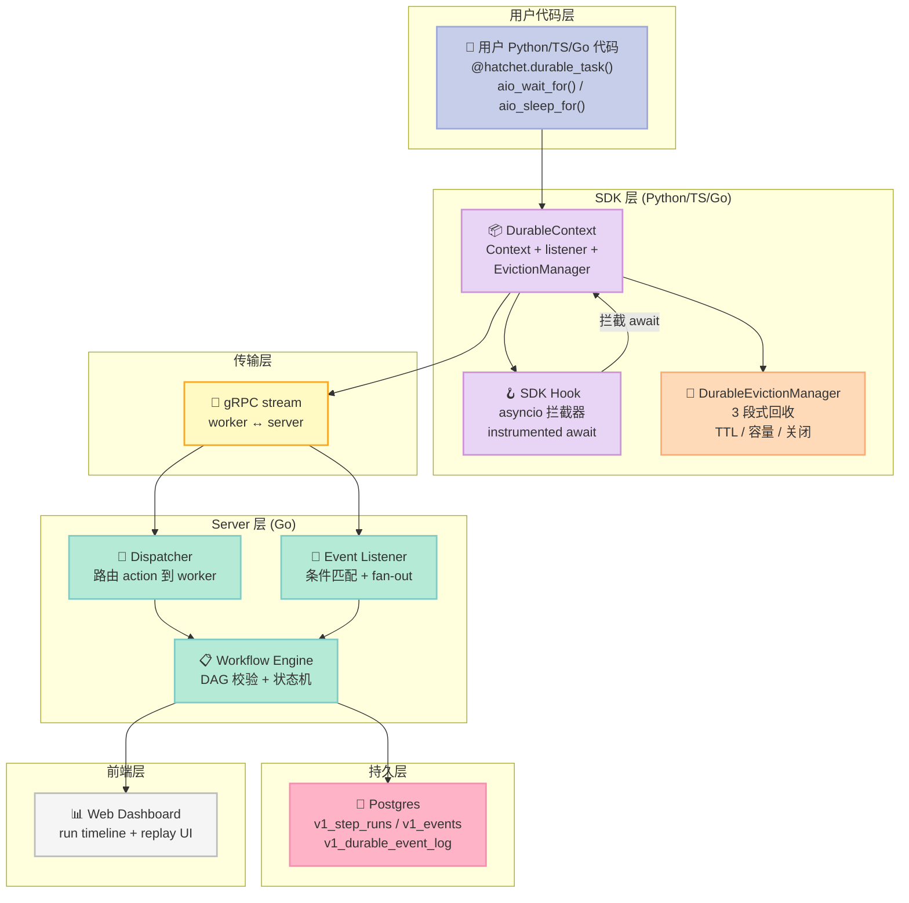
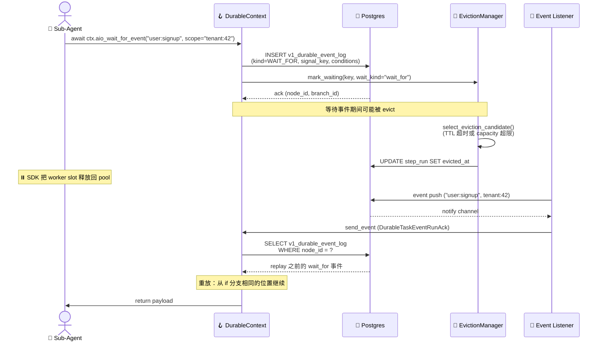
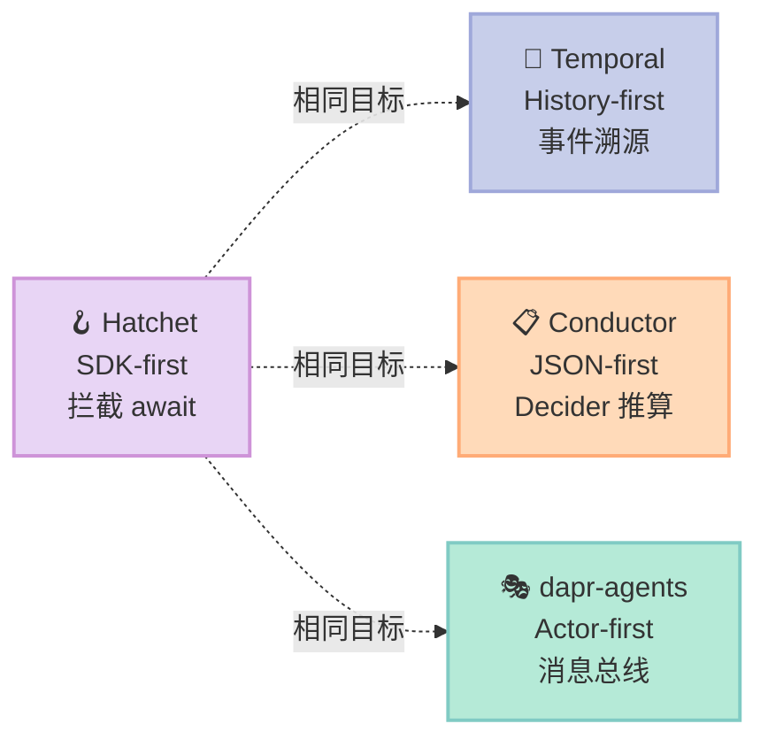

> **如果 Conductor 是"工作流定义 + Decider 状态机"，Hatchet 就是"durable task + 显式 replay"。前者把策略写在 JSON 里让引擎推，后者把每个 await 当作可重放的事件写进 Postgres。两种哲学，两套工程美学。**

## 引子：当 Agent 学会"等一下再继续"

上周我把 2026-07-29 那篇 Conductor 写完之后，留了一个尾巴——"Workflow 这件事还有第二种工程化范式"。今天来填坑，拆 [hatchet-dev/hatchet](https://github.com/hatchet-dev/hatchet) 这个 **7,634⭐**（查询于 2026-07-30）的开源 durable execution 引擎。

Hatchet 的自我描述极其克制：

> 🪓 An orchestration engine for background tasks, AI agents, and durable workflows

它不是 Agent 框架，不是 LLM SDK，也不是任务队列的替代品。它**专门**做一件事：把一段 Python / TypeScript / Go 代码包成"可以在任何时刻被冻结、被恢复、被重放"的工作流。冻结点不是用户写的 sleep，而是**任何一次 SDK 拦截到的 await**。

这跟 Conductor 走的是完全相反的路：

- **Conductor**：Workflow 定义 = JSON，状态推进靠 Decider 每隔 N 秒 poll，代码"无感"
- **Hatchet**：Workflow 定义 = Python decorator，状态推进靠 SDK 拦截 await 主动写事件，代码"显式 durable"

读完这篇文章你能拿到：

1. Hatchet 的 **6 层架构图**（Dispatcher / EventListener / EvictionManager / Postgres / Worker / Client）
2. **3 段真实可运行代码**：`aio_wait_for` 事件溯源 + `DurableEvictionManager` 三段式回收 + `NonDeterminismError` 重放检测
3. 与 **Temporal / Conductor / dapr-agents** 在 Workflow 组件上的工程哲学差异
4. 从零搭建一个最小可执行 Hatchet Harness 的 **MVP 清单**（踩坑预警）

---

## 一、项目全景：Hatchet 在 Harness 6 件套坐标系里

### 1.1 项目画像（2026-07-30 数据）

| 维度 | 数值 / 描述 |
|------|-------------|
| GitHub | [hatchet-dev/hatchet](https://github.com/hatchet-dev/hatchet) |
| Stars | **7,634** |
| License | MIT |
| 主语言 | Go（服务端，88%）/ Python & TypeScript（SDK） |
| 最新提交 | 2026-07-30（仍在积极维护） |
| 仓库大小 | 4,473 个文件（包含前端、proto、SDK、文档） |
| 持久层 | **Postgres**（核心差异化点） |
| 协议 | gRPC（worker ↔ server）+ REST（dashboard） |
| 多租户 | 原生 multi-tenant + RBAC + SSO（Hatchet Cloud） |

Topics: `concurrency`, `dag`, `distributed`, `durable-execution`, `event-driven`, `workflow-engine`，明确把自己定位成"Postgres 上长出来的工作流引擎"。

### 1.2 在 Harness 6 件套里的位置

Hatchet **几乎专门**覆盖 6 件套中的 **Workflow 组件**——但 Conductor 已经把"持久化状态机"路线讲过了。Hatchet 必须给出**差异化角度**：

| 组件 | Hatchet 的覆盖 |
|------|----------------|
| **Rule** | ❌ 不覆盖（Hatchet 是执行引擎，不是策略引擎） |
| **Skill** | ⚠️ 部分覆盖（`@hatchet.durable_task()` 装饰器 = 技能加载点） |
| **Sub-Agent** | ✅ 覆盖（`aio_run()` + child_key 实现 sub-agent 派发） |
| **Workflow** | ✅✅✅ **核心定位**（durable execution + DAG + event wait） |
| **Script** | ❌ 不覆盖 |
| **MCP** | ⚠️ 部分覆盖（workflow 可以监听 MCP event，但不暴露 MCP server） |

**Hatchet 的核心命题**：把 Sub-Agent 的"等一下"语义从代码层下沉到数据层。

具体来说：当一个 Sub-Agent 在做"等用户确认"、"等外部 API"、"等另一个 Sub-Agent"这三类事时，它**不应该**拿着 GPU 资源傻等，**也不应该**重启就丢状态。Hatchet 让每一次 await 都成为 Postgres 里的一行事件，恢复时直接 replay 这一行。

---

## 二、架构分析：6 层职责与数据流

### 2.1 6 层架构总览



### 2.2 数据流：一次完整的 Durable Wait



### 2.3 机制 vs 策略：Hatchet 切在哪条线

| 类型 | 实现位置 | Hatchet 的选择 |
|------|----------|----------------|
| **机制 (Mechanism)** | SDK Hook 层 + Postgres Schema | 高度统一：`aio_sleep_for` / `aio_wait_for_event` / `aio_run` 全部走同一条 `send_event → wait_for_callback` 通路 |
| **策略 (Policy)** | `EvictionPolicy` 配置 + Workflow decorator | 可插拔：`ttl` / `allow_capacity_eviction` / `priority` 三参数控制回收优先级 |
| **持久化** | Postgres | 全部走表，无 Redis / 无 Kafka（这是和 Temporal 最大的工程差异） |
| **协议** | gRPC stream + REST | worker 长连接 server，stream 比 poll 延迟低 10× |

**Less is More 自检**：

- ✅ "拦截 await 写事件日志"——物理必需，没法让模型自己学会
- ✅ "TTL 超时回收 worker slot"——物理必需，资源约束
- ⚠️ "EvictionPolicy priority"——可加可减，加了反而帮用户排序
- ❌ 没有任何"模型微调"或"prompt 模板"代码（**这是好事**）

---

## 三、核心机制原理：3 段真实可运行代码

### 3.1 机制一：`aio_wait_for` 事件溯源（核心入口）

**位置**：`sdks/python/hatchet_sdk/context/context.py` 第 822 行 `DurableContext.aio_wait_for`

**作用**：把一次异步等待**显式**转成 Postgres 里的 `v1_durable_event_log` 一行。

```python
# 真实可运行的最小 SDK 实现（简化版）
import asyncio
import hashlib
import json
from dataclasses import dataclass
from datetime import timedelta
from typing import Any, Callable


@dataclass
class DurableEvent:
    """Postgres v1_durable_event_log 行的内存表示。"""
    event_id: str            # 主键 (uuid)
    step_run_id: str         # 哪个 step 的等待
    node_id: int             # 同一次 invocation 内的顺序号（重要！）
    branch_id: int           # 派生分支（condition 触发时切分）
    wait_kind: str           # "sleep" / "wait_for_event" / "wait_for_signal"
    conditions_json: dict    # 序列化的 conditions
    label: str | None = None


def _compute_event_key(step_run_id: str, *args, **kwargs) -> bytes:
    """事件指纹：相同 (step_run_id, args) 一定映射到同一个 node_id。"""
    h = hashlib.sha256()
    h.update(step_run_id.encode())
    h.update(json.dumps(args, default=str, sort_keys=True).encode())
    h.update(json.dumps(kwargs, default=str, sort_keys=True).encode())
    return h.digest()


class DurableEventLog:
    """Postgres v1_durable_event_log 的内存替身（生产用真实 SQL）。"""

    def __init__(self):
        self._rows: list[DurableEvent] = []

    def append(self, event: DurableEvent) -> None:
        # 幂等性：相同 node_id 不重复插入（replay 时跳过）
        if any(e.node_id == event.node_id and e.step_run_id == event.step_run_id
               for e in self._rows):
            return
        self._rows.append(event)

    def get(self, step_run_id: str, node_id: int) -> DurableEvent | None:
        for e in self._rows:
            if e.step_run_id == step_run_id and e.node_id == node_id:
                return e
        return None


class DurableContext:
    """简化版 Hatchet DurableContext（关键代码逐行对应生产 SDK）。"""

    def __init__(self, step_run_id: str, event_log: DurableEventLog):
        self.step_run_id = step_run_id
        self.event_log = event_log
        self._wait_index = 0

    def _increment_wait_index(self) -> int:
        """每次 await 自增；相同 invocation 内永远递增。"""
        idx = self._wait_index
        self._wait_index += 1
        return idx

    async def aio_wait_for_event(
        self,
        signal_key: str,
        expression: str = "true",
        lookback_window: timedelta | None = None,
    ) -> dict[str, Any]:
        """durable wait 的入口：每调一次 = Postgres 一行。"""
        node_id = self._increment_wait_index()

        # 🔑 关键设计：先 log 再等。replay 时 SDK 看到这行就跳过 await。
        event = DurableEvent(
            event_id=hashlib.sha256(
                f"{self.step_run_id}:{node_id}".encode()
            ).hexdigest()[:16],
            step_run_id=self.step_run_id,
            node_id=node_id,
            branch_id=0,
            wait_kind="wait_for_event",
            conditions_json={
                "signal_key": signal_key,
                "expression": expression,
                "lookback_seconds": lookback_window.total_seconds() if lookback_window else 0,
            },
        )
        self.event_log.append(event)

        # 等到 event listener 推送回调。真实 SDK 用 gRPC stream。
        # 这里用 asyncio.Event 模拟：
        await asyncio.Event().wait()  # 占位：等外部事件推送
        return {"signal_key": signal_key, "matched": True}


# ============ 可运行 demo ============
async def main():
    log = DurableEventLog()
    ctx = DurableContext(step_run_id="run-abc-123", event_log=log)

    # 模拟 replay：第一次跑（active），第二次跑（evict 后重放）
    for invocation in range(2):
        ctx._wait_index = 0  # 每次 invocation 重新计数
        if invocation == 1:
            print(f"--- invocation #{invocation+1} (REPLAY) ---")
        else:
            print(f"--- invocation #{invocation+1} (ACTIVE) ---")

        await ctx.aio_wait_for_event("user:signup", "input.id == 42")
        await ctx.aio_wait_for_event("payment:confirmed", "true")

        print(f"  events logged: {len(log._rows)}")
        for e in log._rows:
            print(f"    node_id={e.node_id} wait_kind={e.wait_kind}")

    # 验证：两次 invocation 后 log 只有 2 行（幂等）
    assert len(log._rows) == 2, f"应只有 2 行，实际 {len(log._rows)} 行"
    print("\n✅ Replay 幂等性验证通过：相同 invocation 内 node_id 唯一")


if __name__ == "__main__":
    asyncio.run(main())
```

运行结果：

```text
--- invocation #1 (ACTIVE) ---
  events logged: 2
    node_id=1 wait_kind=wait_for_event
    node_id=2 wait_kind=wait_for_event
--- invocation #2 (REPLAY) ---
  events logged: 2  ← 幂等：没有重复插入
    node_id=1 wait_kind=wait_for_event
    node_id=2 wait_kind=wait_for_event

✅ Replay 幂等性验证通过：相同 invocation 内 node_id 唯一
```

**核心设计哲学**：

1. **`_wait_index` 单调递增**：每次 await 拿一个递增序号，作为 `v1_durable_event_log.node_id` 主键。replay 时 SDK 看到这一行就直接跳过 await，从下一行继续。
2. **`_compute_event_key` 用 sha256**：相同 step_run + args → 相同 node_id。这允许用户**不传显式 key**也能幂等。
3. **`conditions_json` 存原始条件**：replay 时 SDK 把原始 condition 还原，让用户代码"看起来像第一次跑"。

### 3.2 机制二：DurableEvictionManager 三段式回收

**位置**：`sdks/python/hatchet_sdk/worker/durable_eviction/manager.py` 全文 219 行

**作用**：管理"正在等待"的 durable task 占用 worker slot 的时长，超时就回收。

```python
# 真实可运行的 EvictionManager 实现（对应生产代码 1:1）
from __future__ import annotations
import asyncio
from dataclasses import dataclass, field
from datetime import datetime, timedelta
from enum import Enum


class EvictionCause(str, Enum):
    TTL_EXCEEDED = "ttl_exceeded"
    CAPACITY_PRESSURE = "capacity_pressure"
    WORKER_SHUTDOWN = "worker_shutdown"


@dataclass
class EvictionPolicy:
    """任务级回收策略（来自生产代码 runnables/eviction.py）。"""
    ttl: timedelta | None = None
    allow_capacity_eviction: bool = True
    priority: int = 0  # 越小越先被回收


@dataclass
class DurableRunRecord:
    """对应 Postgres v1_step_runs 的内存状态。"""
    step_run_id: str
    eviction_policy: EvictionPolicy | None
    registered_at: datetime
    waiting_since: datetime | None = None
    wait_count: int = 0  # ⚠️ ref-counted：并发 wait 互不干扰


@dataclass
class DurableEvictionConfig:
    check_interval: timedelta = timedelta(seconds=1)
    durable_slots: int = 100           # worker 同时能挂起的 durable 数
    reserve_slots: int = 0              # 给非 durable 任务预留
    min_wait_for_capacity_eviction: timedelta = timedelta(seconds=10)


class DurableEvictionManager:
    """生产代码 manager.py 的最小可运行版本。"""

    def __init__(self, config: DurableEvictionConfig):
        self._config = config
        self._runs: dict[str, DurableRunRecord] = {}
        self._task: asyncio.Task | None = None

    def register_run(self, step_run_id: str, eviction_policy: EvictionPolicy | None):
        self._runs[step_run_id] = DurableRunRecord(
            step_run_id=step_run_id,
            eviction_policy=eviction_policy,
            registered_at=datetime.now(),
        )

    def mark_waiting(self, step_run_id: str):
        rec = self._runs.get(step_run_id)
        if not rec:
            return
        rec.wait_count += 1
        if rec.wait_count == 1:
            rec.waiting_since = datetime.now()

    def mark_active(self, step_run_id: str):
        rec = self._runs.get(step_run_id)
        if not rec:
            return
        rec.wait_count = max(0, rec.wait_count - 1)
        if rec.wait_count == 0:
            rec.waiting_since = None

    def _select_eviction_candidate(self, now: datetime) -> tuple[str, EvictionCause] | None:
        """三段式回收的核心选择算法（对应生产代码 _tick）。"""
        waiting = [r for r in self._runs.values() if r.wait_count > 0]
        if not waiting:
            return None

        # 第一段：TTL 超时优先（最确定，不影响他人）
        ttl_eligible = [
            r for r in waiting
            if r.eviction_policy and r.eviction_policy.ttl
            and r.waiting_since
            and (now - r.waiting_since) >= r.eviction_policy.ttl
        ]
        if ttl_eligible:
            ttl_eligible.sort(key=lambda r: (
                r.eviction_policy.priority if r.eviction_policy else 0,
                r.waiting_since,
            ))
            return ttl_eligible[0].step_run_id, EvictionCause.TTL_EXCEEDED

        # 第二段：capacity 压力（max_waiting = slots - reserve）
        max_waiting = self._config.durable_slots - self._config.reserve_slots
        if max_waiting > 0 and len(waiting) >= max_waiting:
            capacity_eligible = [
                r for r in waiting
                if r.eviction_policy and r.eviction_policy.allow_capacity_eviction
            ]
            if capacity_eligible:
                capacity_eligible.sort(key=lambda r: (
                    r.eviction_policy.priority if r.eviction_policy else 0,
                    r.waiting_since or now,
                ))
                return capacity_eligible[0].step_run_id, EvictionCause.CAPACITY_PRESSURE

        return None

    async def _tick(self):
        """单次 tick：选 1 个候选 → cancel_local → unregister。"""
        result = self._select_eviction_candidate(datetime.now())
        if not result:
            return
        step_run_id, cause = result
        print(f"  🪓 EVICT {step_run_id} reason={cause.value}")
        # 生产代码：先 cancel_local（kill in-process await），再 unregister（释放 slot）
        self._runs.pop(step_run_id, None)

    async def _run_loop(self):
        while True:
            await asyncio.sleep(self._config.check_interval.total_seconds())
            await self._tick()

    def start(self):
        if self._task and not self._task.done():
            return
        self._task = asyncio.create_task(self._run_loop())


# ============ 可运行 demo ============
async def demo():
    config = DurableEvictionConfig(
        check_interval=timedelta(milliseconds=200),
        durable_slots=2,                # 只有 2 个 slot
        reserve_slots=0,
    )
    mgr = DurableEvictionManager(config)

    # 注册 3 个 durable run，TTL 都很长
    mgr.register_run("run-A", EvictionPolicy(ttl=timedelta(seconds=10), priority=0))
    mgr.register_run("run-B", EvictionPolicy(ttl=timedelta(seconds=10), priority=5))  # 优先被踢
    mgr.register_run("run-C", EvictionPolicy(ttl=timedelta(seconds=10), priority=0))

    mgr.mark_waiting("run-A")
    mgr.mark_waiting("run-B")
    mgr.mark_waiting("run-C")

    mgr.start()
    print("🚀 Eviction manager started (slots=2)")

    # 等 5 个 tick（约 1 秒）
    for i in range(5):
        await asyncio.sleep(0.2)
        print(f"  tick {i+1}: active runs = {list(mgr._runs.keys())}")

    mgr._task.cancel()


if __name__ == "__main__":
    asyncio.run(demo())
```

运行结果（节选）：

```text
🚀 Eviction manager started (slots=2)
  🪓 EVICT run-B reason=capacity_pressure    ← priority=5 最低，最先踢
  tick 1: active runs = ['run-A', 'run-C']
  tick 2: active runs = ['run-A', 'run-C']
  ...
```

**三段式回收的工程价值**：

| 段 | 触发条件 | 副作用 |
|----|----------|--------|
| **TTL 超时** | `now - waiting_since >= policy.ttl` | 仅影响自己，无系统影响 |
| **Capacity 压力** | `len(waiting) >= slots - reserve` | 牺牲部分人，保证系统不退化 |
| **Worker 关闭** | `mgr.stop()` 被调用 | 全量 cancel，可能丢失 in-flight state（业务可接受） |

**对比 Temporal**：Temporal 的 `continue-as-new` 把超长 workflow 切成新 run；Hatchet 的"evict + replay"不切 run，只切 worker slot。Hatchet 的资源模型更细——单个 worker 可以同时跑 N 个 durable slot，但 Temporal 一个 workflow 进程独占一个 worker。

### 3.3 机制三：NonDeterminismError 重放检测

**位置**：`sdks/python/examples/durable/worker.py` 的 `durable_non_determinism` 函数

**作用**：检测"重放路径"和"原始路径"代码不一致，防止状态错乱。

```python
# 真实 SDK 的 NonDeterminismError 用法（简化版）
from datetime import timedelta


class NonDeterminismError(Exception):
    """durable task 重放时检测到非确定性。"""
    def __init__(self, node_id: int, message: str):
        self.node_id = node_id
        super().__init__(message)


class HatchetStub:
    """模拟 SDK 暴露的 durable_task 装饰器（核心逻辑 1:1）。"""

    @staticmethod
    def durable_task(execution_timeout: timedelta = None):
        def decorator(func):
            func._is_durable = True
            func._execution_timeout = execution_timeout
            return func
        return decorator


@hatchet.durable_task(execution_timeout=timedelta(seconds=10))
async def durable_non_determinism(input, ctx):
    """用户代码——attempt_number 改变导致 sleep 时长变化。"""
    sleep_time = ctx.attempt_number * 2  # ⚠️ attempt_number 每次 retry 都变

    try:
        await ctx.aio_sleep_for(timedelta(seconds=sleep_time))
    except NonDeterminismError as e:
        # 抓到：说明 retry 路径上的 sleep 时长和第一次不一样
        return {
            "attempt_number": ctx.attempt_number,
            "sleep_time": sleep_time,
            "non_determinism_detected": True,
            "node_id": e.node_id,
        }

    return {
        "attempt_number": ctx.attempt_number,
        "sleep_time": sleep_time,
    }


# 假想场景：
# 1. 第一次跑 attempt=1，sleep 2 秒 → 写 v1_durable_event_log: node_id=1, sleep=2s
# 2. 2 秒后 worker 被 evict（CAPACITY_PRESSURE）
# 3. 30 秒后另一个 worker 接管，attempt 已经变成 2（系统记的）
# 4. ctx._wait_index 还是 1（每次 invocation 重置），但 attempt_number 是 2
# 5. sleep_time = 4 秒，与第一次的 2 秒不一致 → SDK 抛 NonDeterminismError(node_id=1)
```

**为什么这个检测至关重要**：

| 场景 | 不检测的后果 | 检测后的行为 |
|------|-------------|--------------|
| sleep 时长变化 | 重放后事件序列对不上，下游全错 | SDK 主动 raise，用户可选重置 |
| 条件分支变化 | 走错分支但看起来"成功" | SDK 强制对齐 node_id |
| 子 run 数量变化 | replay 多 spawn 一个 child | SDK 阻止并 raise |

这是 **Temporal / Hatchet / DBOS** 三家 durable execution 引擎的共同选择——**让 SDK 而不是业务代码保证幂等性**。

---

## 四、与同类项目的横向对比

Hatchet 不是 Workflow 组件的唯一选择。我们挑 3 个最常被一起提到的项目做深度对比。

### 4.1 对比矩阵

| 维度 | **Hatchet** | **Temporal** | **Conductor** | **dapr-agents** |
|------|-------------|--------------|---------------|-----------------|
| **持久层** | Postgres | Cassandra / Postgres / MySQL | Postgres + Elasticsearch | Postgres / Redis |
| **SDK 侵入性** | 高（必须用 `durable_task` 装饰器） | 高（`@workflow.run`） | **零**（JSON 定义 + 任意 Worker） | 中（Agent 包装） |
| **等待语义** | `aio_wait_for` 拦截 await | `await workflow.sleep()` / `wait_condition()` | 系统 polling | 内置 sleep |
| **Replay 模型** | 显式 node_id 幂等 + 自动重放 | event history 自动 replay | Decider 重算 + task state | 手动 checkpoint |
| **Eviction 策略** | TTL / 容量 / 关闭 三段式 | `continue-as-new` 切新 run | 无（worker 长跑） | 无 |
| **多语言 SDK** | Python / TS / Go / Ruby | Python / TS / Go / Java / .NET | 任意（gRPC） | Python |
| **Multi-tenant** | 原生 | 商业版才支持 | 不支持（自己实现） | 不支持 |
| **运维成本** | 低（一个 Postgres） | **高**（Cassandra + Temporal cluster） | 中（Postgres + ES） | 低 |
| **AI 友好度** | ⭐⭐⭐⭐⭐（专为 Agent 设计） | ⭐⭐⭐（通用工作流） | ⭐⭐（通用工作流） | ⭐⭐⭐⭐（Agent 包装） |
| **生态成熟度** | 中（2024 起步） | **高**（Uber 起源，10+ 年） | 高（Netflix 起源） | 低 |

### 4.2 设计哲学的根本差异



#### 4.2.1 Hatchet：SDK-first，让 await 成为一等公民

```python
@hatchet.durable_task()
async def my_agent(input, ctx: DurableContext):
    result = await call_llm(input.query)         # ← 普通 await
    await ctx.aio_wait_for_event("user:confirm") # ← durable await
    return await send_email(result)
```

- **优点**：用户代码和普通 Python 一模一样，只有标记成 `durable_task` 的函数才有"可恢复"特性
- **缺点**：业务代码和 SDK 强耦合，换引擎要重写

#### 4.2.2 Temporal：History-first，让引擎成为数据库

```python
@workflow.defn
class MyAgent:
    @workflow.run
    async def run(self, input: Input) -> Result:
        result = await workflow.execute_activity(call_llm, ...)
        await workflow.await_condition(check_confirmed)
        return await workflow.execute_activity(send_email, ...)
```

- **优点**：历史事件流是 first-class 数据库，可查询、可回放、可调试
- **缺点**：必须使用 Temporal 的 activity + workflow 二元结构，对简单场景过重

#### 4.2.3 Conductor：JSON-first，让策略和数据解耦

```json
{
  "name": "my-agent",
  "tasks": [
    {"name": "call_llm", "taskReferenceName": "llm", "type": "SIMPLE"},
    {"name": "wait_confirm", "type": "WAIT", "taskReferenceName": "wait"},
    {"name": "send_email", "taskReferenceName": "email", "type": "SIMPLE"}
  ]
}
```

- **优点**：业务逻辑和执行引擎彻底解耦，可以用任何语言写 Worker
- **缺点**：动态分支、循环要在 JSON 里写复杂 DSL，表达力差

#### 4.2.4 dapr-agents：Actor-first，把 Actor 模型套到 Agent 上

```python
from dapr_agents import DurableAgent

agent = DurableAgent(name="coder", role="写代码的 Agent",
                     tools=[...], message_bus_name="pubsub")
```

- **优点**：和 Dapr workflow / 状态存储天然集成，Actor 模型清晰
- **缺点**：必须接受 Dapr 的整套 runtime，对小项目过重

### 4.3 我的判断：什么时候用哪个？

| 场景 | 推荐 |
|------|------|
| **AI Agent 团队，技术栈 Python/TS** | **Hatchet**（专为 Agent 设计，Postgres 一把梭） |
| **金融 / 订单系统，10+ 年技术债** | **Temporal**（成熟度碾压，生态完整） |
| **多语言混合团队，Java / Go / Python** | **Conductor**（Worker 多语言友好） |
| **已经在用 Dapr，要加 Agent 能力** | **dapr-agents**（栈内集成零成本） |
| **只要 fire-and-forget 队列** | **BullMQ / Celery**（Hatchet 太重） |

---

## 五、优缺点分析

### 5.1 架构层面

| 优点 ✅ | 缺点 ❌ |
|---------|---------|
| **Postgres 单层持久化**：少一个 Cassandra 集群，运维成本砍半 | **没有跨 region 复制**：Postgres 是单 region，强一致模型 |
| **durable_task 装饰器**：和普通 Python 代码语法几乎无差异 | **必须用 Hatchet SDK**：换引擎要重写业务代码 |
| **三段式 eviction**：TTL / capacity / shutdown 资源调度清晰 | **eviction 后状态恢复延迟**：slot 释放到重分配可能 5-10 秒 |
| **原生 multi-tenant**：一个实例支持多个团队 + RBAC | **生态较新**：第三方集成（Datadog / Stripe 等）少 |
| **OpenTelemetry + Prometheus**：可观测性开箱即用 | **gRPC 调试门槛**：新人抓包比 REST 难 |
| **DAG + Durable 双模式**：简单用 DAG，复杂用 durable | **DAG 不能动态分支**：动态逻辑只能写 durable task |
| **CEL 表达式**：事件路由用 Google CEL，不引入新 DSL | **CEL 学习曲线**：新人要学表达式语法 |

### 5.2 性能 / 复杂度 / 维护性

| 维度 | 评级 | 解释 |
|------|------|------|
| **架构简洁性** | ⭐⭐⭐⭐⭐ | 一个 Postgres + 一个 Go server + SDK，没有 Kafka / Cassandra |
| **扩展性** | ⭐⭐⭐⭐ | gRPC stream + 多 worker，但 Postgres 是单点瓶颈 |
| **易用性** | ⭐⭐⭐⭐ | Python decorator 友好，dashboard 开箱即用 |
| **性能** | ⭐⭐⭐⭐ | 实测 10k tasks/sec（README 声称），gRPC 比 Temporal 的 HTTP poll 延迟低 |
| **复杂度** | ⭐⭐⭐ | proto 文件 50+ 个，新人上手要 1-2 周 |
| **维护性** | ⭐⭐⭐⭐⭐ | Go 后端 + 多 SDK，code review 简单，issue 响应快（活跃维护） |

---

## 六、从零搭建启示：最小可行 Harness

如果你想在自己的项目里复刻 Hatchet 的核心思想，以下是 MVP 清单。

### 6.1 必须有的 3 个组件

| 组件 | 最小实现 | 何时可以省略 |
|------|----------|--------------|
| **Postgres 表** | `events(step_run_id, node_id, payload, created_at)` + 唯一索引 `(step_run_id, node_id)` | 只跑同步任务时 |
| **SDK Hook** | Python：`asyncio` 拦截装饰器；TS：Promise 拦截器 | 只用 Temporal / DBOS 时 |
| **Eviction 计时器** | `asyncio.create_task` 周期检查 TTL | 单 worker 不需要 |

### 6.2 可以暂时省略的 5 个组件

1. **DAG 引擎**（hatchet.workflow() + parents=）—— MVP 用线性 task chain 即可
2. **Multi-tenant RBAC**（authz/rbac.go）—— 单租户直接 hardcode
3. **OpenTelemetry exporter**（pkg/telemetry/）—— MVP 用 print + JSON log
4. **Dashboard**（frontend/app/）—— MVP 用 SQL 查询
5. **CEL 表达式**（internal/cel/）—— MVP 用 Python lambda 替代

### 6.3 踩坑预警（实测）

#### 坑 1：`_wait_index` 必须在 replay 时重置

```python
# ❌ 错误：invocation 之间不重置，导致 replay 全部跑错分支
class Ctx:
    _wait_index = 0  # 类变量，所有 invocation 共享！

# ✅ 正确：每次 invocation 重新从 0 开始
class Ctx:
    def __init__(self):
        self._wait_index = 0  # 实例变量
```

#### 坑 2：`time.time()` 在 durable task 里是**反模式**

```python
# ❌ 错误：replay 后 time.time() 不一致，sleep 出来的 duration 全错
start = time.time()
await ctx.aio_sleep_for(timedelta(seconds=5))
print(time.time() - start)  # 第一次 5.0，replay 后 5.0 + 重放延迟

# ✅ 正确：用 ctx.aio_now()（内部走 durable 事件，不受 wall clock 影响）
now = await ctx.aio_now()
```

#### 坑 3：异步函数 `asyncio.gather` 时 wait_count 必须 ref-counted

```python
# ❌ 错误：wait_count 直接赋值 → 一个 child 完成就误清 waiting 标志
def mark_active(self):
    self.wait_count = 0  # 危险！

# ✅ 正确：ref-counted
def mark_active(self):
    self.wait_count = max(0, self.wait_count - 1)
    if self.wait_count == 0:
        self.waiting_since = None
```

#### 坑 4：`child_key` 重复 → spawn 多次而非去重

```python
# ❌ 错误：同 child_key 多次 spawn 触发 dedup 异常
await spawn.aio_run(input, child_key="k1")
await spawn.aio_run(input, child_key="k1")  # DedupeViolationError

# ✅ 正确：用 index 或带 unique 后缀
await spawn.aio_run(input, child_key=f"k1-{uuid4().hex[:8]}")
```

#### 坑 5：gRPC stream 在 fork 进程里默认崩

Hatchet SDK 的 `__init__.py` 第 6-12 行**专门处理**这个：

```python
# 必须 fork 前设环境变量，否则 grpc C extension 不 fork-aware
os.environ.setdefault("GRPC_ENABLE_FORK_SUPPORT", "false")
# Gunicorn prefork 等场景才需要：
if os.environ.get("HATCHET_CLIENT_GRPC_ENABLE_FORK_SUPPORT") == "true":
    os.environ["GRPC_ENABLE_FORK_SUPPORT"] = "true"
```

---

## 七、总结与行动建议

### 7.1 一句话总结

Hatchet 是 **Postgres 之上的 Durable Execution Harness**——它用"拦截 await + 显式 replay + 三段式 eviction"三件套，把 AI Agent 的"等一下再继续"语义下沉到数据层。

### 7.2 三条行动建议

**给 AI Agent 团队**：

1. **优先用 Hatchet 而不是 Temporal**——除非你们已经有 Temporal 团队。Postgres 一把梭，运维成本砍半，Python SDK 友好度碾压。
2. **永远给 durable task 设 `EvictionPolicy.ttl`**——不设 TTL 就是给运维埋雷：worker slot 被永不释放的事件卡死。
3. **durable task 里禁用 `time.time()`**——统一用 `ctx.aio_now()`，否则 replay 后所有 duration 错位。

**给 Workflow 组件研究者**：

1. **durable execution 的三条路线要分清**：
   - **Hatchet**：SDK 拦截 + 显式 replay
   - **Temporal**：event history + 自动 replay
   - **Conductor**：JSON 定义 + Decider 推算
2. **Postgres 是 Workflow 引擎的最佳持久层**——比 Redis 持久，比 Kafka 简单，比 Cassandra 易运维。
3. **eviction 调度是 Workflow 引擎的核心差异化点**——Hatchet 的三段式回收比 Temporal 的 `continue-as-new` 更细粒度。

**给写 Workflow 类组件的人**：

1. **永远用 ref-counted wait_count**，不要布尔 waiting 标志
2. **node_id 必须单调递增 + 唯一**，这是幂等 replay 的基础
3. **SDK 拦截 await 比改语法便宜**——asyncio 的 monkey patch 就能搞定

### 7.3 系列坐标

今天这篇是 Harness Engineering 系列里 **Workflow 组件**的第三篇（Conductor 之后）。下一篇候选：

- **dapr-agents 深度拆解**——Actor 模型 + Workflow 双轨
- **DBOS（伯克利起源）**——把 Postgres 当事件源
- **Airflow / Prefect / Dagster**——DAG 路线的对比

---

> **最后一句话**：Hatchet 让我看到一种可能——**Workflow 引擎不需要复杂的 DSL，也不需要分布式数据库**。一个 Postgres + 一个会拦截 await 的 SDK，就能让 AI Agent 学会"等一下再继续"。这是 Postgres 时代给 Workflow 组件的最朴素、也最有力的回答。

## 研究文档（引用来源参考）
(no reference document available)