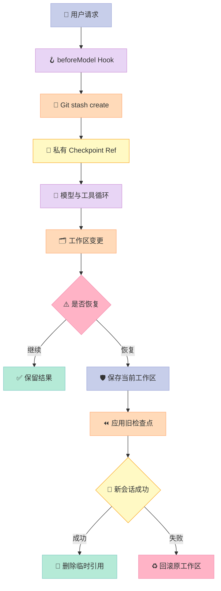
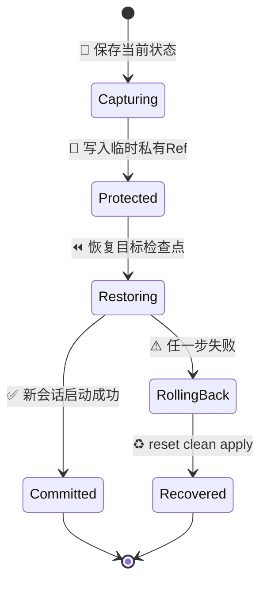
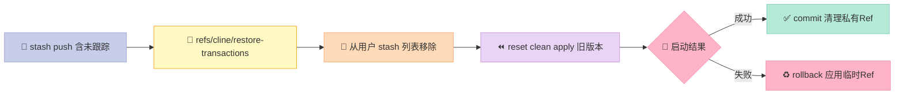
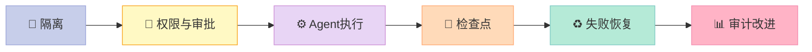

> **编码 Agent 最重要的能力，不是一次改对，而是改错后能完整退回。**Cline 的价值不只在“会调用终端”，更在于它把 Git 对象、会话消息与权限边界组合成了一个可恢复的执行 Harness。

---

## 摘要

Cline 是一个开源编码 Agent。本文聚焦一个容易被功能清单掩盖的设计：**Checkpoint（检查点）不是 UI 上的撤销按钮，而是一套事务协议**。

我基于 `cline/cline` 当前 `main` 分支源码分析了 `checkpoint-hooks.ts`、`checkpoint-restore.ts`、`ClineIgnoreController.ts` 与 MCP policy。核心结论有三点：

1. Cline 在根 Agent 每轮首次模型调用前创建快照，并把 Git 对象挂到 `refs/cline/checkpoints/...` 私有引用，既可被恢复又不污染 `git stash list`。
2. 恢复前会先保存**当前工作区，包括未跟踪文件**；恢复启动失败时执行 rollback，而不是把“撤销”本身变成第二次破坏。
3. `.clineignore` 与 MCP 工具禁用策略提供执行边界，但命令字符串检查不是沙箱，不能替代容器隔离。

项目链接：[cline/cline](https://github.com/cline/cline)。调研时 GitHub API 显示约 **65.3k Stars**、Apache-2.0，2026-07-31 仍有提交。

## 1. 为什么要研究“撤销”而不是“生成”

普通编辑器撤销的是文本。编码 Agent 改动的却可能是一个事务：修改 12 个文件、安装依赖、生成迁移、删除旧目录，再启动测试。只恢复当前文件，等于银行转账失败后只改回余额，却没有撤销流水。

因此，可靠 Harness 至少要回答四个问题：

| 问题 | 朴素撤销 | Cline 的答案 |
|---|---|---|
| 何时留快照 | 用户想起来时 | 根会话每个有效 user run 的首次模型调用前 |
| 快照放哪里 | 复制目录 | Git stash object + 私有 ref |
| 未跟踪文件怎么办 | 常被遗漏 | 恢复事务用 `--include-untracked` 捕获 |
| 恢复失败怎么办 | 留下半恢复状态 | `commit()/rollback()` 事务接口 |

这也是 Harness Engineering 的本质：**模型负责提出变更，Harness 负责让变更可约束、可观测、可逆。**

## 2. Cline 的恢复架构



这里有两套快照，不能混为一谈：

- **历史检查点**：每轮开始前创建，用于用户回到过去。
- **恢复事务快照**：用户点击恢复时创建，用于“恢复操作失败后回到恢复前”。

这像数据库的业务数据与 undo log：前者是目标版本，后者保障切换过程原子化。

## 3. 源码深挖：四个关键设计

### 3.1 只在正确的时刻做检查点

`sdk/packages/core/src/hooks/checkpoint-hooks.ts` 把创建逻辑接到 `beforeModel`，并明确跳过子 Agent 与同一轮的后续迭代：

```typescript
beforeModel: async ({ snapshot }) => {
  if (snapshot.parentAgentId != null || snapshot.iteration !== 1) {
    return undefined;
  }
  const runCount = countUserRunMessages(snapshot.messages);
  if (runCount < 1) return undefined;
  const entry = await createCheckpoint(runCount);
  // entry 随后写入 session metadata
}
```

为什么不是每次工具调用前都存？一次用户请求可能产生数十次模型—工具迭代。逐工具快照会放大 Git I/O，也让用户面对无法理解的版本洪流。Cline 选择**用户轮次**作为一致性边界：足够粗，语义又清楚。

它还用 `runCount` 把 `CheckpointEntry` 与消息历史绑定。恢复代码会筛选 `entry.runCount <= targetRunCount`，因此代码版本与对话版本可以共同后退，而不是让旧代码继续接受未来对话的指令。

### 3.2 私有 Git ref：隐藏不等于丢失

检查点先执行 `git stash create`，得到 stash commit 的 SHA；再执行：

```typescript
const privateRef = `refs/cline/checkpoints/${sessionId}/${runCount}`;
await runGit(cwd, ["update-ref", privateRef, ref]);
```

裸 SHA 虽然暂时可用，却可能被 Git 垃圾回收。挂到 ref 后对象变成可达对象；又因为没有写入 `refs/stash`，用户的 `git stash list` 不会堆满 Agent 内部快照。

这是很漂亮的抽象复用：**用 Git 做内容寻址存储，用自定义命名空间做 Harness 元数据隔离。**删除会话时，`deleteCheckpointRefs()` 枚举该前缀并用 `update-ref -d` 清理；保留会话时则用 `retainCheckpointRefs()` 重新锚定仍需存活的对象。

但源码还有诚实的降级路径：工作区无修改时 `stash create` 可能返回空字符串，系统退回 `HEAD` commit，并把 `kind` 标为 `commit`。这避免“没有 diff”被误判为系统故障。

### 3.3 恢复本身必须是事务

`beginWorktreeRestoreTransaction()` 先验证仓库，记录 `originalHead`，然后执行 `stash push --include-untracked`。这是源码中最值得复用的细节：`stash create` 不包含未跟踪文件，而后续恢复会运行 `git clean -fd`，如果不额外保护，新建但未 add 的文件会永久消失。

恢复事务的状态如下：





源码把结果封装为 `WorktreeRestoreTransaction`：

```typescript
export interface WorktreeRestoreTransaction {
  commit(): Promise<void>;
  rollback(): Promise<void>;
}
```

`rollback()` 的真实顺序是 `reset --hard originalHead`、`clean -fd`、`stash apply --index privateRef`。`--index` 不只恢复文件内容，也尽量恢复暂存区状态。

一个反直觉决定是：`commit()` 删除临时 ref 失败会被吞掉。理由合理——清理失败留下的是一个无害、可恢复的对象；如果因此宣告整个替代会话失败，反而会触发不必要的回滚。**安全系统要区分主路径失败与垃圾回收失败。**

### 3.4 文件与工具边界：有用，但不是沙箱

`ClineIgnoreController` 使用标准 gitignore 语法加载 `.clineignore`，通过 chokidar 监听变更，并支持 `!include` 组合团队规则。路径过滤异常时，批量 `filterPaths()` 返回空数组，体现 fail closed。

MCP 侧的 policy 更直接：把转换后的工具名映射到 `{ enabled: false }`。这使“安装了服务器”与“允许模型调用其中所有工具”分离。

```typescript
return {
  [nameTransform({ serverName, toolName })]: {
    enabled: false,
  },
};
```

不过边界并非完美。`validateAccess()` 对工作区外路径的异常选择允许访问；`validateCommand()` 只是按空白切分命令，并检查 `cat/grep/sed` 等有限命令，难以覆盖 shell 重定向、脚本解释器或组合命令。我的判断是：**`.clineignore` 是减少误读与上下文泄漏的护栏，不是恶意命令防御层。**敏感仓库仍应在容器、低权限账号或临时 worktree 中运行 Agent。

## 4. 与 Aider、OpenHands 的设计对比

这里比较的是设计原语，不是功能多少。

| 维度 | Cline | Aider | OpenHands |
|---|---|---|---|
| 交互边界 | IDE/CLI 会话中的 user run | Git 仓库中的编辑提交循环 | 沙箱内事件流与 Agent 运行时 |
| 可逆原语 | stash object + 私有 ref + 消息截断 | Git commit/undo，历史更贴近开发者提交 | sandbox/session 状态与运行时恢复 |
| 恢复粒度 | 会话轮次，代码与消息共同后退 | 以提交为中心，Git 语义直观 | 环境级，隔离强但设施更重 |
| 工作区保护 | 恢复前额外捕获未跟踪文件 | 强依赖 Git 工作流 | 依赖 sandbox 的文件系统边界 |
| 工具扩展 | MCP 原生且可按工具禁用 | 主要围绕 shell、lint、test 与仓库编辑 | action/observation 工具体系 |
| 核心取舍 | 本地体验与恢复安全平衡 | 简洁、Git-native | 隔离与自治优先 |

**对比一：Cline vs Aider。**Aider 把 Git commit 作为用户可见的一等产物，心智模型更简单；Cline 的私有 refs 则把内部快照藏起来，并额外绑定会话轮次。前者适合愿意让 Agent 操作提交历史的开发者，后者更像 IDE 的时间旅行。

**对比二：Cline vs OpenHands。**OpenHands 倾向把高风险执行放进沙箱，隔离面更强；Cline 直接贴近本地 IDE，因此用 ignore、审批与 checkpoint 补偿风险。隔离和回滚不是同一件事：沙箱限制爆炸半径，checkpoint 负责恢复业务状态，成熟系统最好同时具备。

**对比三：私有 ref vs 复制目录。**复制目录实现容易，但大仓库成本随文件规模增长；Git 对象复用已有内容寻址与差异存储，代价是依赖 Git 仓库、对未跟踪文件必须特殊处理。Cline 的复杂代码正来自这个边界。

## 5. 优缺点与适用性

按任务要求，固定从左侧体验维度与右侧工程维度审视：

| 左侧维度 | 评价 | 右侧维度 | 评价 |
|---|---|---|---|
| 架构简洁性 | ⚠️ 检查点 Hook 清晰，但恢复事务与会话同步并不简单 | 性能 | ✅ Git 对象复用优于全目录复制；每轮一次避免过度快照 |
| 扩展性 | ✅ `createCheckpoint` 可注入自定义实现，Hook 与存储解耦 | 复杂度 | ⚠️ Git ref、stash、消息 runCount 三套状态必须一致 |
| 易用性 | ✅ 用户以会话轮次恢复，不必理解内部 refs | 维护性 | ⚠️ 跨平台 Git 行为、冲突恢复与陈旧 ref 都需长期测试 |

### 优点

- **恢复有原子性意识**：不是直接覆盖工作区，而是先捕获现状，失败可 rollback。
- **不污染用户工作流**：内部对象放在 `refs/cline/...`，不会占据正常 stash 列表。
- **代码与对话对齐**：`runCount` 让恢复后的模型看见与代码版本匹配的消息历史。
- **降级明确**：无 diff 时使用 HEAD；清理临时 ref 失败不颠覆成功主路径。

### 缺点

- **依赖 Git**：非 Git 目录无法使用内建 checkpoint，只能注入自定义实现。
- **未提交与未跟踪状态复杂**：需要 stash、private ref、reset、clean、apply 的精确顺序。
- **权限护栏有限**：命令字符串解析无法形成真正的操作系统级安全边界。
- **私有 refs 也要治理**：异常退出可能留下对象，需要会话删除与保留逻辑清理。

### 适用场景

| 场景 | 建议 | 原因 |
|---|---|---|
| 本地 IDE 中的中小型改造 | ✅ 适合 | 低摩擦且可按轮次撤销 |
| 含大量未提交工作的仓库 | ⚠️ 先人工 commit | 自动保护虽存在，冲突面仍大 |
| 密钥、生产凭据同目录 | ❌ 不应只靠 `.clineignore` | 护栏不是沙箱 |
| CI 中无人值守大规模修改 | ⚠️ 搭配临时 worktree/容器 | 需要更强隔离和审计 |

## 6. 可运行 MVP：复刻私有检查点与事务恢复

下面脚本只依赖 Python 3 与 Git。它在临时仓库中：创建私有检查点、制造已跟踪及未跟踪变更、保护当前工作区、恢复旧版本，再模拟失败并 rollback。代码使用 `subprocess.run([...])`，没有 shell 字符串拼接。

```python
from pathlib import Path
import subprocess
import tempfile
import uuid


def git(cwd: Path, *args: str, check: bool = True) -> str:
    result = subprocess.run(
        ["git", "-C", str(cwd), *args],
        check=check, text=True, capture_output=True,
    )
    return result.stdout.strip()


with tempfile.TemporaryDirectory() as tmp:
    repo = Path(tmp)
    git(repo, "init")
    git(repo, "config", "user.email", "mvp@example.com")
    git(repo, "config", "user.name", "Checkpoint MVP")

    app = repo / "app.txt"
    app.write_text("version=1\n", encoding="utf-8")
    git(repo, "add", "app.txt")
    git(repo, "commit", "-m", "initial")

    # Agent 第一轮修改；stash create 生成对象但不污染 stash list。
    app.write_text("version=2-by-agent\n", encoding="utf-8")
    checkpoint = git(repo, "stash", "create", "mvp checkpoint")
    assert checkpoint
    git(repo, "update-ref", "refs/cline/checkpoints/demo/1", checkpoint)

    # 恢复前的当前状态，还包含一个未跟踪文件。
    app.write_text("version=3-current\n", encoding="utf-8")
    note = repo / "untracked.txt"
    note.write_text("must survive rollback\n", encoding="utf-8")

    txid = uuid.uuid4().hex
    txref = f"refs/cline/restore-transactions/{txid}"
    old_head = git(repo, "rev-parse", "HEAD")
    git(repo, "stash", "push", "--include-untracked", "-m", txid)
    captured = git(repo, "rev-parse", "refs/stash")
    git(repo, "update-ref", txref, captured)
    git(repo, "stash", "drop", "stash@{0}")

    # 尝试恢复历史检查点。
    git(repo, "reset", "--hard", old_head)
    git(repo, "clean", "-fd")
    git(repo, "stash", "apply", checkpoint)
    assert app.read_text(encoding="utf-8") == "version=2-by-agent\n"

    # 模拟后续会话启动失败，执行事务回滚。
    git(repo, "reset", "--hard", old_head)
    git(repo, "clean", "-fd")
    git(repo, "stash", "apply", "--index", txref)
    git(repo, "update-ref", "-d", txref)

    assert app.read_text(encoding="utf-8") == "version=3-current\n"
    assert note.read_text(encoding="utf-8") == "must survive rollback\n"
    print("OK: tracked 与 untracked 状态均已恢复")
```

运行：

```bash
python3 checkpoint_mvp.py
```

预期输出：

```text
OK: tracked 与 untracked 状态均已恢复
```

生产实现还应补充：并发锁、ref 生命周期、Git 缺失处理、冲突提示、磁盘配额和审计日志。MVP 证明的是关键原语，而不是替代 Cline。

## 7. 给 Harness 设计者的三条建议

### 7.1 把“可逆性”做成协议，不要做成按钮

按钮只是入口。协议必须定义：快照时机、状态标识、恢复前保护、成功提交、失败回滚和垃圾回收。少一个步骤，就可能在最需要恢复时丢数据。

### 7.2 让对话状态与外部状态共享版本号

只回滚代码、不回滚消息，会让模型以为已完成的操作仍然存在。Cline 用 `runCount` 建立弱一致性关联。数据库 Agent 则可以使用 transaction ID，浏览器 Agent 可以使用 navigation checkpoint。

### 7.3 回滚不能代替隔离

回滚处理“已经发生的可逆变更”；容器、权限和审批处理“不应该发生的变更”。删除远程数据库、泄露密钥或调用付费 API，通常无法靠 Git 恢复。



## 8. 结论

Cline 的检查点实现说明，优秀编码 Agent 的护城河不只是模型与工具数量，而是**状态管理的纪律**：内部快照不打扰用户，Git 对象不会失联，恢复失败不会覆盖原现场，代码版本与会话版本共同后退。

我的明确判断是：如果团队准备让 Agent 执行跨文件重构，应优先验收三项能力——**未跟踪文件是否受保护、恢复是否有 rollback、对话是否随代码回退**。缺少其中任意一项，就不要把“支持 checkpoint”当成工程级可恢复。

行动上，可以先运行本文 MVP，再故意让恢复中途失败；只有故障注入后仍找得回现场，Harness 才算真正接住了模型。

---

## 参考源码

- [cline/cline](https://github.com/cline/cline)
- [`sdk/packages/core/src/hooks/checkpoint-hooks.ts`](https://github.com/cline/cline/blob/main/sdk/packages/core/src/hooks/checkpoint-hooks.ts)
- [`sdk/packages/core/src/session/checkpoint-restore.ts`](https://github.com/cline/cline/blob/main/sdk/packages/core/src/session/checkpoint-restore.ts)
- [`apps/vscode/src/core/ignore/ClineIgnoreController.ts`](https://github.com/cline/cline/blob/main/apps/vscode/src/core/ignore/ClineIgnoreController.ts)
- [`sdk/packages/core/src/extensions/mcp/policies.ts`](https://github.com/cline/cline/blob/main/sdk/packages/core/src/extensions/mcp/policies.ts)
