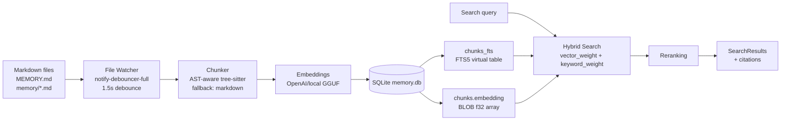
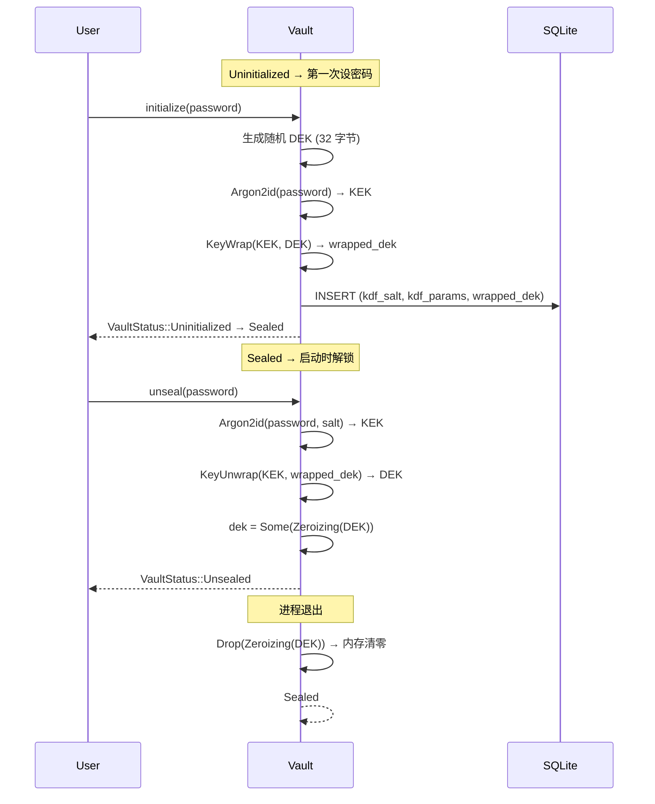
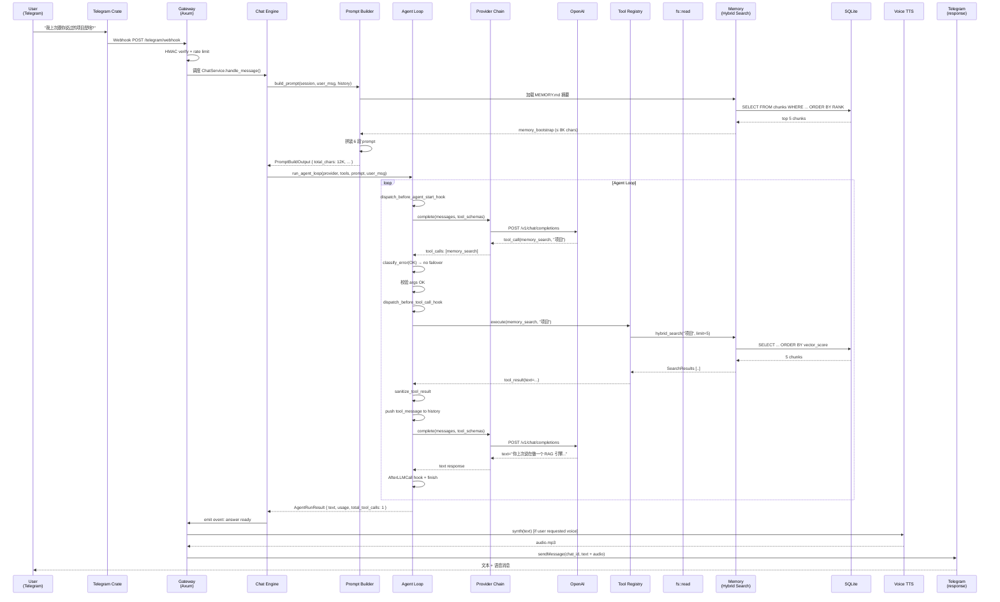

## 引子

2026 年下半年的 Agent 战场已经分化为三个明显阵营：**云原生 SaaS**（OpenAI Agent SDK、Anthropic Claude Agent）、**自托管框架**（LangGraph、MetaGPT、AutoGen）、以及**本地优先的"个人服务器"**。第三条路在过去 6 个月异军突起 —— OpenClaw、Hermes Agent 都已经验证了"一个二进制 + 个人数据 + 多渠道接入"模式的吸引力。

**Moltis** 是这条赛道的最新代表 —— 上线即登 Hacker News 首页，仅靠 1 个 4.7KB 的 `moltis` CLI + 68 个兄弟 crate，**在没有 Node.js / npm / 任何 runtime 依赖的前提下**，把"个人 Agent 服务器"做到了 OpenClaw 用 1.1M 行 LoC 才堆出来的功能密度。它凭什么？

答案藏在三个与众不同的工程取舍里：

1. **Rust workspace 而非 monorepo** —— 69 个 crate 通过 `default-members` 严格按需编译，Apple Silicon Mac Mini 上构建只要 4 分钟
2. **安全优先于便利** —— XChaCha20-Poly1305 vault 加密所有 secrets、SSRF 解析时阻断 loopback、Artifact Attestations + Sigstore 签名每个 release
3. **协议中立而非 LLM 中心** —— 通过 `LlmProvider` trait 接入 12+ LLM provider，通过 MCP 接入无限工具，通过 `Lazy Tools` 让模型按需发现工具

本文会**逐 crate 拆解 Moltis 的核心架构**（重点是 `agents` / `mcp` / `memory` / `vault` / `tools` / `providers`），用**真实可运行的源码片段**（带 `# 来自 <path>:<line-range>` 注释）展示每一个设计决策背后的工程权衡，最后与 OpenClaw / Hermes Agent / Hermes 三代"个人 Agent 服务器"做横向对比。

---

## 一、项目定位与核心价值

### 1.1 一句话定义

> **Moltis 是一个用 Rust 写的、单一二进制、零 runtime 依赖、加密 at-rest 的"持久个人 Agent 服务器"。** 它把多渠道消息（Web/Telegram/Signal/Discord/Nostr/WhatsApp/Matrix/MS Teams/Slack）、多 LLM Provider、多 MCP 工具、本地 Memory、Voice I/O、Tailscale/SSH 远程执行装进同一个进程，让用户的 keys 和数据从不离开自己的机器。

### 1.2 核心价值矩阵

| 维度 | 价值 | 体现 |
|------|------|------|
| **安全** | keys 永远不出本机 | XChaCha20-Poly1305 vault + Argon2id KDF + 0o600 文件权限 + Artifacts Attestations |
| **便携** | 跑在 Mac Mini / Pi / 任何服务器 | `--no-default-features --features lightweight` 减重到 Raspberry Pi 可用 |
| **完整** | 无需 plugin marketplace | Voice（8 TTS + 7 STT）+ 15 个 Channel + MCP + Memory + SSH + Tailscale + Cron + Telephony + Home Assistant 全内置 |
| **可审计** | unsafe 集中在边界 | ~270K Rust LoC / 59 crates / 470+ 测试文件 / `unsafe` 仅用于 Swift FFI / WASM precompile / 本地 LLM FFI |
| **协议中立** | 不绑定单一 LLM | `LlmProvider` trait + 12+ provider（OpenAI / Anthropic / Ollama / GitHub Copilot / OpenAI Codex / Kimi Code / Local GGUF / NearAI / OpenCode Zen / GenAI / GitHub Models） |

### 1.3 仓库统计

```bash
# 来自 GitHub REST API (2026-08-01 调研)
moltis-org/moltis
├─ ⭐ Stars:        2,801
├─ License:         MIT
├─ Language:        Rust 1.91+ (100% source LoC)
├─ Size:            315,287 KB
├─ Commits (pushed_at): 2026-08-01
├─ Workspace:       69 crates + 1 app (courier)
├─ LoC:            ~270K (excluding target/vendor)
├─ Test files:      470+ (含 bench)
├─ Topics:          ai-agent, ai-assistant, clawdbot, llm, mcp, openclaw, rust, sandbox
```

**关键反差**：与 OpenClaw 的 1.1M LoC TypeScript 相比，Moltis 用 **~25% 的 LoC** 实现了**同等或更全的功能**。这不是代码量的胜利，是"编译期类型 + trait 抽象 + workspace 隔离"的复利。

---

## 二、整体架构：69 Crate 的契约式分工

### 2.1 Crate 地图（精选核心 20 个）

Moltis 的 `Cargo.toml` 严格区分 **default-members**（生产构建必须）vs **members**（按 feature 启用的可选），这是它能"瘦身到 Pi"的工程基础。

```toml
# 来自 Cargo.toml:<default-members 段>
default-members = [
  "apps/courier",        # 节点间消息传输
  "crates/gateway",      # HTTP/WS/RPC 总线（37.4K LoC）
  "crates/tools",        # 工具执行 + 沙箱（37.0K LoC）
  "crates/providers",    # 12+ LLM provider（18.9K LoC）
  "crates/agents",       # Agent 主循环（14.5K LoC）
  "crates/chat",         # Chat engine（14.2K LoC）
  "crates/config",       # 配置校验（10.3K LoC）
  "crates/httpd",        # HTTP 原语（9.9K LoC）
  "crates/moltis",       # CLI 入口（4.7K LoC）
  "crates/sessions",     # 会话持久化（3.5K LoC）
  "crates/memory",       # Memory + FTS5 + 向量
  "crates/mcp",          # MCP stdio + HTTP/SSE
  "crates/vault",        # 加密 vault
  "crates/auth",         # 凭证存储 + WebAuthn
  "crates/skills",       # Skills 系统
  ...
]
```

### 2.2 顶层数据流架构

```mermaid
flowchart TB
    subgraph 客户端
        UI[Web UI / PWA]
        TG[Telegram]
        SI[Signal]
        DC[Discord]
        NS[Nostr]
        SL[Slack]
        WA[WhatsApp]
        MT[MS Teams]
        MX[Matrix]
        VS[Voice / STT / TTS]
    end

    subgraph Gateway层
        AX[Axum HTTP/WS Server<br/>gateway 37.4K]
        AUTH[Password + Passkey + API Key<br/>auth 2.7K]
        GWCH[Channel Hub<br/>channels 34K]
    end

    subgraph Chat层
        CHAT[Chat Engine<br/>chat 14.2K]
        PROMPT[Prompt Builder<br/>agents 14.5K]
        LOOP[Agent Loop<br/>agents runner]
        HOOK[15 HookEvent<br/>common hooks]
    end

    subgraph Agent核心
        REG[Tool Registry<br/>+ Lazy Tool Search]
        CHAIN[Provider Chain<br/>+ Circuit Breaker]
        MEM[Memory Manager<br/>+ Hybrid Search]
    end

    subgraph LLM Providers
        OA[OpenAI]
        ANT[Anthropic]
        CDX[OpenAI Codex]
        COP[GitHub Copilot]
        OLL[Ollama / Local GGUF]
        KC[Kimi Code]
        NEAR[NearAI]
        OZ[OpenCode Zen]
    end

    subgraph 工具生态
        BUILT[Built-in Tools<br/>fs/web/exec/browser/cron/sessions]
        MCPSTDIO[MCP stdio servers]
        MCPHTTP[MCP HTTP/SSE servers]
        WASM[Precompiled WASM tools]
    end

    subgraph 持久化与安全
        SQLITE[SQLite<br/>sessions/memory/auth]
        FTS[FTS5 + Vector BLOB]
        VLT[XChaCha20-Poly1305 Vault]
        FILES[File Watcher<br/>notify-debouncer-full]
    end

    subgraph 沙箱
        DOCKER[Docker / Podman]
        APPLE[Apple Container]
        WSBOX[WASM Sandbox]
    end

    UI --> AX
    TG --> GWCH
    SI --> GWCH
    DC --> GWCH
    NS --> GWCH
    SL --> GWCH
    WA --> GWCH
    MT --> GWCH
    MX --> GWCH
    VS --> AX

    AX --> AUTH
    AX --> CHAT
    GWCH --> CHAT

    CHAT --> PROMPT
    PROMPT --> LOOP
    LOOP --> HOOK
    LOOP --> CHAIN
    LOOP --> REG
    LOOP --> MEM

    CHAIN --> OA
    CHAIN --> ANT
    CHAIN --> CDX
    CHAIN --> COP
    CHAIN --> OLL
    CHAIN --> KC
    CHAIN --> NEAR
    CHAIN --> OZ

    REG --> BUILT
    REG --> MCPSTDIO
    REG --> MCPHTTP
    REG --> WASM

    BUILT --> DOCKER
    BUILT --> APPLE
    BUILT --> WSBOX

    MEM --> SQLITE
    MEM --> FTS
    MEM --> FILES
    AUTH --> VLT
    AUTH --> SQLITE
```



**关键设计**：箭头方向是**严格单向**的。客户端 → Gateway → Chat → Agent → Tools/Providers/Storage，没有反向回流（除了 `OnEvent` 回调做流式输出）。这让每个 crate 都可以独立替换 / mock 测试。

---

## 三、核心引擎一：Agent 主循环（crates/agents）

### 3.1 循环结构总览

Moltis 的 Agent 循环位于 `crates/agents/src/runner/non_streaming.rs`（53.6KB）和 `streaming.rs`（62.9KB）。核心入口是 `run_agent_loop_with_context_and_limits`：

```rust
// 来自 crates/agents/src/runner/non_streaming.rs:<run_agent_loop_with_context_and_limits 函数签名>
pub async fn run_agent_loop_with_context_and_limits(
    provider: Arc<dyn LlmProvider>,
    tools: &ToolRegistry,
    system_prompt: &str,
    user_content: &UserContent,
    on_event: Option<&OnEvent>,
    history: Option<Vec<ChatMessage>>,
    tool_context: Option<serde_json::Value>,
    hook_registry: Option<Arc<HookRegistry>>,
    sender_name: Option<String>,
    limits: AgentLoopLimits,
) -> Result<AgentRunResult, AgentRunError>
```

**8 个关键参数**揭示了循环的"全配置面"：

| 参数 | 作用 |
|------|------|
| `provider` | `Arc<dyn LlmProvider>` 抽象，**任意** LLM 可注入 |
| `tools` | 完整工具注册表（含 lazy 激活） |
| `system_prompt` | 由 `PromptBuilder` 组装好的完整 prompt |
| `user_content` | 文本 / 多模态（图片/文件） |
| `on_event` | 流式事件回调（用于 WS push） |
| `history` | 跨 turn 注入的会话历史 |
| `tool_context` | 注入每个 tool call 的隐式参数（`_session_key` / `_run_id`） |
| `hook_registry` | 15 个 HookEvent 的回调链 |

### 3.2 主循环伪代码（基于真实源码）

```rust
// 来自 crates/agents/src/runner/non_streaming.rs:<loop 段 简化版>
let mut messages = vec![ChatMessage::system(system_prompt)];
messages.extend(history.unwrap_or_default());
messages.push(ChatMessage::User { content: user_content.clone(), name: sender_name });

let mut iterations = 0;
let mut total_tool_calls = 0;
let mut usage_accumulator = UsageAccumulator::default();
let mut server_retries_remaining: u8 = 1;
let mut rate_limit_retries_remaining: u8 = RATE_LIMIT_MAX_RETRIES;  // 默认 5
let mut auto_continue_count: usize = 0;
let mut loop_detector = ToolLoopDetector::new(window, strip_on_second_fire);
let mut strip_tools_next_iter = false;
let tool_controls = AgentToolControls::from_tool_context(tool_context.as_ref());

loop {
    iterations += 1;
    if iterations > max_iterations {  // 默认 50，lazy mode × 3 = 150
        return Err(AgentRunError::Other("exceeded max iterations"));
    }

    // (1) 计算 tool schemas（lazy mode 时只暴露 tool_search）
    let schemas_for_api = if native_tools && !strip_tools_next_iter {
        match tool_controls.tool_choice.as_ref() {
            Some(ToolChoice::None) => vec![],
            Some(ToolChoice::Any) if schemas.is_empty() => return Err(...),
            Some(ToolChoice::Tool { name }) => vec![schemas.iter().find(|s| s.name == *name).unwrap()],
            _ => tools.list_schemas(),
        }
    } else { vec![] };

    // (2) BeforeAgentStart hook（最先）
    dispatch_before_agent_start_hook(hook_registry, session_key, provider.id()).await?;

    // (3) 调 LLM（流式或非流式）
    let response = if streaming {
        run_provider_streaming(&provider, &messages, &schemas_for_api).await
    } else {
        run_provider_complete(&provider, &messages, &schemas_for_api).await
    };

    // (4) 错误分类 + Provider failover（见 §四）
    match classify_error(&response.err()) {
        ProviderErrorKind::ContextWindow => compact_messages(&mut messages),  // 不切 provider，压缩
        ProviderErrorKind::RateLimit if rate_limit_retries_remaining > 0 => {
            backoff_with_jitter();
            rate_limit_retries_remaining -= 1;
            continue;  // 重试当前 provider
        }
        ProviderErrorKind::AuthError | ServerError | BillingExhausted
            if has_fallback => rotate_to_next_provider(),
        _ => return Err(...),
    }

    // (5) AfterLLMCall hook
    dispatch_after_llm_call_hook(...).await?;

    // (6) 累积 usage
    usage_accumulator += response.usage;

    // (7) 处理 tool calls（可能多个）
    if !response.tool_calls.is_empty() {
        for call in response.tool_calls {
            // 7.1 参数校验
            let coerced = coerce_scalar_args(&call, &schema)?;
            validate_tool_args(&coerced, &schema)?;

            // 7.2 BeforeToolCall hook
            let hook_decision = hooks.dispatch(BeforeToolCall { tool: &call.name }).await;
            if hook_decision.is_blocked() { return error_to_llm; }

            // 7.3 Loop detector check
            if loop_detector.should_intervene(&fingerprint) {
                strip_tools_next_iter = true;  // 下一轮强制文本回复
            }

            // 7.4 执行 tool
            let result = tools.execute(call).await;

            // 7.5 记录 fingerprint
            let fingerprint = if result.is_err() {
                ToolCallFingerprint::failure(&call.name, &args, result.err())
            } else {
                ToolCallFingerprint::success(&call.name, &args)
            };
            loop_detector.record(fingerprint);

            // 7.6 Sanitize result（剥除 secret、防 prompt injection）
            let sanitized = sanitize_tool_result(result, &budget);

            // 7.7 把 tool result 追加为 tool message
            messages.push(ChatMessage::Tool { call_id, content: sanitized });
            total_tool_calls += 1;
        }
        continue;  // 回到 loop 顶部
    }

    // (8) 没有 tool call → 把 answer 记录、AfterLLMCall hook、退出
    last_answer_text = response.text.clone();
    record_answer_text(&mut auto_continue_count, &response.text, total_tool_calls);
    return Ok(AgentRunResult { text: response.text, usage: usage_accumulator, ... });
}
```

**8 个值得记住的工程细节**：

1. **`max_iterations` 在 lazy mode 自动 × 3**——因为 `tool_search` 工具发现需要多一轮 round-trip
2. **`max_tool_result_bytes` + `compaction_ratio` 双重防御**——单条 tool 结果超过预算会先按 `preemptive_overflow_ratio` 预警，再按 `tool_result_compaction_ratio` 压缩最早的结果
3. **`server_retries_remaining = 1` + `rate_limit_retries_remaining = 5` 分别计数**——5xx/网络错只重试 1 次（避免陷入 bad server 死循环），429 可重试 5 次（带 backoff_with_jitter）
4. **`strip_tools_next_iter` 强行把 tools 列表清空**——这是 Loop Detector 的"终极武器"，让模型物理上无法再调 tool
5. **`sanitize_tool_result` 用 `enforce_tool_result_context_budget`**——单条 tool result 不能超过 context 的 5%，否则截断并加 `[output truncated]` 标记
6. **`SteerInbox` 跨 turn 注入**——`/steer` 命令往 `Arc<Mutex<Vec<String>>>` 推文本，循环每轮 drain 注入 system 提示
7. **`explicit_shell_command_from_user_content`**——`/sh ls -la` 直接走 exec，跳过 LLM 决策
8. **`channel_binding_from_tool_context`**——从 `_session_key` 推断 channel，决定 message 回写到哪个 channel

### 3.3 流式循环差异

```rust
// 来自 crates/agents/src/runner/streaming.rs:<关键差异点>
async fn run_provider_streaming(provider, messages, schemas) -> Result<Response> {
    let mut stream = provider.stream(messages.clone());
    let mut text_buf = String::new();
    let mut tool_call_bufs: HashMap<String, ToolCallBuilder> = HashMap::new();

    while let Some(event) = stream.next().await {
        match event {
            StreamEvent::ReasoningDelta(s) => on_event.emit_reasoning(s),  // CoT 单独通道
            StreamEvent::Delta(s) => {
                text_buf.push_str(&s);
                on_event.emit_text(s);  // 实时推到 WS
            }
            StreamEvent::ToolCallStart { id, name } => {
                tool_call_bufs.insert(id, ToolCallBuilder::new(name));
            }
            StreamEvent::ToolCallDelta { id, args_piece } => {
                tool_call_bufs.get_mut(&id).unwrap().extend_args(args_piece);
            }
            StreamEvent::ToolCallDone { id } => {
                // 此时才能完整 parse args
                let builder = tool_call_bufs.remove(&id).unwrap();
                let call = builder.finalize()?;
                tool_calls.push(call);
            }
            StreamEvent::Done(usage) => break,
            StreamEvent::Error(e) => return Err(e),
        }
    }
}
```

**流式与非流式的核心差异**：流式在 tool call 收完所有 delta 之前**不能**校验参数（`args_piece` 是不完整 JSON），所以**校验延后到 `ToolCallDone` 事件之后**。这意味着流式循环里要缓存 `ToolCallBuilder`，而不能像非流式那样直接 `for call in response.tool_calls`。

### 3.4 Loop Detector：防止"调同一个 tool 死循环"

```rust
// 来自 crates/agents/src/tool_loop_detector.rs:<ToolCallFingerprint 段 简化>
pub struct ToolCallFingerprint {
    pub tool_name: String,
    pub args_hash: u64,             // 用 DefaultHasher hash args JSON
    pub failed: bool,
    pub error_hash: Option<u64>,    // 错误字符串的 hash
    pub error_text: Option<String>,
    pub arguments: Value,
}

// 两阶段干预
pub enum InterventionStage {
    None,
    Nudge,         // 阶段 1：注入 system 提示要求模型解释 + 文本回复
    StripTools,    // 阶段 2：物理上不让模型再发 tool call
}
```

**触发逻辑**：维护一个 `VecDeque<ToolCallFingerprint>` 环形缓冲区（默认窗口 5）。当**连续 N 次**（默认 3）的 `tool_name + args_hash + failed` 都相同时：
- 阶段 1：注入 `"You have called <tool> with the same args <N> times and it failed. Stop and explain in text what you were trying to do."`
- 阶段 2：再失败一次，**下一轮 `list_schemas()` 返回空** —— 模型除了文本回复别无选择
- 任意一次**成功**调用 → 重置 ring buffer 和 stage

这解决了"模型陷入 '调 tool → 失败 → 反思 → 又调同一个 tool' 死循环"的经典问题，**比 Claude Code 的 5 个 Hook 事件多了一种"机械制动"机制**。

---

## 四、核心引擎二：Provider Chain 失败转移（crates/providers + crates/agents）

### 4.1 LlmProvider Trait：协议中立的基础

```rust
// 来自 crates/providers/src/contract.rs:<MockLlmProvider 段 简化>
#[async_trait]
pub trait LlmProvider: Send + Sync {
    fn name(&self) -> &str;          // "openai" | "anthropic" | "ollama" | "codex" | "copilot" | ...
    fn id(&self) -> &str;            // "gpt-5" | "claude-opus-4" | "llama3.1:8b" | ...
    async fn complete(&self, messages: &[ChatMessage], tools: &[Value])
        -> anyhow::Result<CompletionResponse>;
    fn stream(&self, messages: Vec<ChatMessage>)
        -> Pin<Box<dyn Stream<Item = StreamEvent> + Send + '_>>;
}
```

**4 个方法 + `+ Send + Sync`** 的极简接口。**所有 12+ provider 都实现这 4 个方法**，没有"OpenAI-only" / "Anthropic-only" 的特殊路径。

### 4.2 Provider Error 分类（8 类）

```rust
// 来自 crates/agents/src/provider_chain.rs:<ProviderErrorKind>
#[derive(Debug, Clone, Copy, PartialEq, Eq)]
pub enum ProviderErrorKind {
    RateLimit,         // 429 → 旋转到下一个
    AuthError,         // 401/403 → 旋转（key 错）
    ServerError,       // 5xx → 旋转
    BillingExhausted,  // 余额耗尽 → 旋转
    ContextWindow,     // 上下文溢出 → 不旋转，调用方压缩
    InvalidRequest,    // 400 → 不旋转（哪都失败）
    Unknown,           // 未知 → 尝试 failover
}

impl ProviderErrorKind {
    pub fn should_failover(self) -> bool {
        matches!(self, Self::RateLimit | Self::AuthError | Self::ServerError
            | Self::BillingExhausted | Self::Unknown)
    }
}
```

**关键设计**：`ContextWindow` 和 `InvalidRequest` **不会**触发 failover —— 这两类错误切 provider 也修不好，应该走"压缩 context"或"修复请求格式"。这是从 12 个 provider 调用的实战经验总结：**不要让错误的自动重试把问题放大**。

### 4.3 错误分类算法（正则字符串匹配）

```rust
// 来自 crates/agents/src/provider_chain.rs:<classify_error 段 简化>
pub fn classify_error(err: &anyhow::Error) -> ProviderErrorKind {
    let msg = err.to_string().to_lowercase();

    // ContextWindow 必须先检查（"request too large" 会和 RateLimit 重叠）
    const CONTEXT_WINDOW_PATTERNS: &[&str] = &[
        "context_length_exceeded", "context_window_exceeded",
        "model_context_window_exceeded", "max_tokens",
        "too many tokens", "request too large", "maximum context length",
        "context window", "token limit", "input too long", "input_too_long",
        "content_too_large", "request_too_large",
    ];
    if CONTEXT_WINDOW_PATTERNS.iter().any(|p| msg.contains(p)) {
        return ProviderErrorKind::ContextWindow;
    }

    if msg.contains("429") || msg.contains("rate limit")
        || msg.contains("rate_limit") || msg.contains("too many requests") {
        return ProviderErrorKind::RateLimit;
    }

    if msg.contains("401") || msg.contains("403")
        || msg.contains("unauthorized") || msg.contains("forbidden")
        || msg.contains("invalid api key") {
        return ProviderErrorKind::AuthError;
    }

    if msg.starts_with("5") && msg.chars().nth(1).map_or(false, |c| c.is_ascii_digit()) {
        return ProviderErrorKind::ServerError;
    }
    if msg.contains("billing") || msg.contains("quota") || msg.contains("insufficient credit") {
        return ProviderErrorKind::BillingExhausted;
    }
    if msg.contains("400") || msg.contains("bad request") || msg.contains("invalid request") {
        return ProviderErrorKind::InvalidRequest;
    }
    ProviderErrorKind::Unknown
}
```

**为什么是字符串匹配而非 enum**：12 个 provider 抛出的 error 类型各不相同（`reqwest::Error` / `async-openai::Error` / `aws-sdk-bedrockruntime::Error` ...），**在 trait 边界上做 downcast 既慢又脆**。Moltis 选择"在错误消息里提取信号"——**实用主义** > **类型纯粹**。

### 4.4 Circuit Breaker（per-provider 熔断）

```rust
// 来自 crates/agents/src/provider_chain.rs:<ProviderChain 段 简化>
pub struct ProviderChain {
    primary: Arc<dyn LlmProvider>,
    fallbacks: Vec<Arc<dyn LlmProvider>>,
    breakers: Vec<CircuitBreaker>,  // 一个 provider 对应一个 breaker
}

struct CircuitBreaker {
    state: AtomicU8,  // 0=closed, 1=open, 2=half-open
    consecutive_failures: AtomicUsize,
    last_failure: Mutex<Option<Instant>>,
}

// 调用流程：
// 1. 尝试 primary
// 2. 失败 → 检查 primary 的 breaker 是否 open（连续 N 次失败则 open）
// 3. breaker open → 直接跳到下一个 provider
// 4. breaker half-open（冷却 30s 后）→ 试探一次，成功就 close，失败就 reopen
```

**这套组合让 Moltis 在某个 provider 挂掉时**不卡死** —— 12 个 provider 任何一个存活都能继续工作。**比 LangChain 的 `with_fallbacks([...])` 多了"主动熔断 + 冷却"机制**，更接近 Resilience4j 的工业级 Circuit Breaker 模式。

---

## 五、核心引擎三：Prompt Builder（crates/agents）

### 5.1 Prompt 的 6 段组装

`PromptBuilder` 输出的不是"一个 prompt 字符串"，而是**结构化的 6 段**：

```rust
// 来自 crates/agents/src/prompt/builder.rs:<PromptBuildOutput 段 简化>
pub struct PromptBuildOutput {
    pub identity: String,         // SOUL + Agent identity
    pub runtime: String,          // Sandbox/Host runtime info
    pub project_context: String,  // Cursor 兼容的项目文件（AGENTS.md 等）
    pub memory_bootstrap: String, // MEMORY.md + memory/*.md 摘要
    pub skills: String,           // 已激活 skills 的元数据
    pub tools: String,            // tool schema 列表（格式化）
    pub guidelines: String,       // TOOL_GUIDELINES 常量
    pub total_chars: usize,
    pub metadata: PromptBuildMetadata,
}

const MEMORY_BOOTSTRAP_MAX_CHARS: usize = 8_000;
const PROJECT_CONTEXT_MAX_CHARS: usize = 8_000;
```

**关键取舍**：memory bootstrap 最多 8K 字符、project context 最多 8K 字符。**超出后会被 `truncate_prompt_text` 截断**，避免"prompt 一上来就 50K 字符"。

### 5.2 真实 Prompt 片段（来自源码）

```rust
// 来自 crates/agents/src/prompt/builder.rs:<EXEC_ROUTING_GUIDANCE_SANDBOX>
const EXEC_ROUTING_GUIDANCE_SANDBOX: &str = "Execution routing:
- `exec` runs inside sandbox when `Sandbox(exec): enabled=true`.
- When sandbox is disabled, `exec` runs on the host and may require approval.
- In sandbox mode, `~` and relative paths resolve under `Sandbox(exec): home=...` (usually `/home/sandbox`).
- Persistent workspace files live under `Host: data_dir=...`; when mounted, the same path appears as `Sandbox(exec): workspace_path=...`.
- With `workspace_mount=ro`, sandbox commands may read mounted files but cannot modify them.
- For durable long-term memory mutations, prefer `memory_save`, `memory_forget`, or `memory_delete` over shell writes to `MEMORY.md` or `memory/*.md`.
";

const TOOL_GUIDELINES: &str = concat!(
    "## Guidelines\n\n",
    "- Start with a normal conversational response. Do not call tools for greetings, small talk, ",
    "or questions you can answer directly.\n",
    "- Use the calc tool for arithmetic and expressions.\n",
    "- Use the exec tool for shell/system tasks.\n",
    "- If the user starts a message with `/sh `, run it with `exec` exactly as written.\n",
    "- Use the browser tool when the user asks to visit/read/interact with web pages.\n",
    "- For already-connected MCP servers, use the listed `mcp__<server>__<tool>` tools directly. ",
    "Use `mcp_list` or `mcp_status` only when you need to inspect server availability first.\n",
    "- Skills describe workflows. They are not callable tools unless you first load them with `read_skill`.\n",
    "- Before tool calls, briefly state what you are about to do.\n",
    ...
);
```

**这种"常量 + 拼接"的设计**让 prompt 内容**编译期可审计**——开发者不需要跑 runtime 就能知道模型看到了什么。对安全审查极友好。

### 5.3 Lazy Tool Search：tool schema 太多时的救星

```rust
// 来自 crates/agents/src/lazy_tools.rs:<ToolSearchTool 段 简化>
/// Meta-tool that lets the model discover and activate tools from the full registry.
pub struct ToolSearchTool {
    full_registry: Arc<ToolRegistry>,
    activated: ActivatedTools,  // Arc<Mutex<HashMap<String, ToolEntry>>>
}

const MAX_SEARCH_RESULTS: usize = 15;

impl ToolSearchTool {
    fn keyword_search(&self, query: &str) -> Vec<(String, String, u32)> {
        let query_lower = query.to_lowercase();
        let query_words: Vec<&str> = query_lower.split_whitespace().collect();
        let mut results: Vec<(String, String, u32)> = Vec::new();

        for name in self.full_registry.list_names() {
            let score = if name_lower == query_lower { 100 }
                else if name_lower.contains(&query_lower) { 50 }
                else {
                    let word_matches = query_words.iter()
                        .filter(|w| name_lower.contains(*w) || desc_lower.contains(*w))
                        .count();
                    (word_matches as u32) * 10
                };
            if score > 0 { results.push((name, desc, score)); }
        }
        results.sort_by(|a, b| b.2.cmp(&a.2));
        results.truncate(MAX_SEARCH_RESULTS);
        results
    }
}
```

**工作流**：
1. `registry_mode = "lazy"` 配置时，`wrap_registry_lazy` 把 full registry 替换成只含 `tool_search` 一个 meta-tool
2. 模型调用 `tool_search(query="file system")` → 拿到 15 个相关 tool 名 + 描述
3. 模型调用 `tool_search(name="fs_read")` → 工具被加入 `activated` map
4. 下一轮 `list_schemas()` 自动把 activated 的 tool 暴露给 LLM

**为什么关键**：当用户接了 50+ MCP server 时，**tool schema 总和可能超过 200K 字符**——直接喂给 LLM 会让 prompt 撑爆。Lazy Search 把"100 个 tool 的 schema"压缩成"15 个 tool 名字 + 描述"，**节省 90%+ token**。

---

## 六、MCP 系统：协议中立工具生态（crates/mcp）

### 6.1 Transport 三态机

```rust
// 来自 crates/mcp/src/registry.rs:<TransportType>
#[derive(Debug, Clone, Copy, PartialEq, Eq, Serialize, Deserialize, Default)]
#[serde(rename_all = "lowercase")]
pub enum TransportType {
    #[default]
    Stdio,
    Sse,
    #[serde(rename = "streamable-http", alias = "streamable_http", alias = "http")]
    StreamableHttp,
}
```

**3 种 transport 共享同一个 `McpClient` trait**，Moltis 用 `mcp-agent-bridge` crate 把任意 MCP server 的 tools 桥接成 `Arc<dyn AgentTool>`，注册到 `ToolRegistry`。

### 6.2 Stdio Transport 的进程隔离

```rust
// 来自 crates/mcp/src/transport.rs:<StdioTransport 段 简化>
pub struct StdioTransport {
    child: Mutex<OwnedProcessTree>,           // 整个进程树
    stdin: Arc<Mutex<tokio::process::ChildStdin>>,
    pending: Arc<Mutex<HashMap<String, oneshot::Sender<JsonRpcResponse>>>>,
    next_id: AtomicU64,
    request_timeout: Duration,
    reader_closed: Arc<AtomicBool>,
    reader_handle: Mutex<Option<tokio::task::JoinHandle<()>>>,
}

const MAX_MCP_STDOUT_LINE_BYTES: usize = 4 * 1024 * 1024;  // 4MB 上限
const MAX_MCP_STDERR_LINE_BYTES: usize = 64 * 1024;         // 64KB 上限
```

**`OwnedProcessTree`**：Moltis 用 `moltis_common::process_tree::OwnedProcessTree` 跟踪整个进程树，**子进程被 drop 时会 kill 整个组**（包括 grandchildren）—— 这避免了"主进程退出后 MCP server 子进程成孤儿"。

**stdout/stderr 行大小限制**：4MB / 64KB 防止恶意 MCP server 用海量输出**塞爆内存**。超过会强制切断 reader。

### 6.3 PendingRequestGuard：自动取消未完成请求

```rust
// 来自 crates/mcp/src/transport.rs:<PendingRequestGuard 段 简化>
struct PendingRequestGuard {
    id_key: Option<String>,
    request_id: serde_json::Value,
    pending: Arc<Mutex<HashMap<String, oneshot::Sender<JsonRpcResponse>>>>,
    stdin: Arc<Mutex<tokio::process::ChildStdin>>,
}

impl Drop for PendingRequestGuard {
    fn drop(&mut self) {
        let Some(id_key) = self.id_key.take() else { return; };
        let request_id = self.request_id.clone();
        let pending = Arc::clone(&self.pending);
        let stdin = Arc::clone(&self.stdin);
        tokio::spawn(async move {
            pending.lock().await.remove(&id_key);
            send_cancellation_notification(request_id, stdin).await;  // JSON-RPC 取消通知
        });
    }
}
```

**`Drop` 实现自动取消**：任何代码路径 panic / early return / 异常退出时，**guard 被 drop 就会自动发 JSON-RPC `notifications/cancelled` 给 MCP server**。这是 RAII 模式的教科书级应用 —— 让"资源管理"成为语言级保障，不依赖开发者记得写 cleanup 代码。

### 6.4 OAuth for MCP（远程 transport）

```rust
// 来自 crates/mcp/src/registry.rs:<McpOAuthConfig>
#[derive(Debug, Clone, Serialize, Deserialize)]
pub struct McpOAuthConfig {
    pub client_id: String,
    #[serde(
        default, skip_serializing_if = "Option::is_none",
        serialize_with = "moltis_oauth::types::serialize_option_secret",
        deserialize_with = "moltis_oauth::types::deserialize_option_secret"
    )]
    pub client_secret: Option<Secret<String>>,
    pub auth_url: String,
    pub token_url: String,
    #[serde(default)]
    pub scopes: Vec<String>,
}
```

**用 `secrecy::Secret<String>` 包**所有敏感字段 → 序列化时调用 `serialize_option_secret` **redact** → UI 永远看不到明文。**这是 memory 类项目（Cognee/Mem0）经常漏掉的细节**：secrets 存进 JSON 配置文件时，**必须**用 `Secret` 包装，不能直接 `String`。

---

## 七、Memory 系统：SQLite + FTS5 + 向量混合检索（crates/memory）

### 7.1 Memory 的存储模型



**3 张表 + 1 个 FTS5 虚拟表**：

| 表 | 字段 | 作用 |
|----|------|------|
| `files` | path, source, hash, mtime, size | 跟踪 markdown 文件元数据 |
| `chunks` | id, path, start_line, end_line, hash, model, text, embedding(BLOB) | 分块 + 向量 |
| `embedding_cache` | hash, embedding | 跨文件 embedding 缓存 |
| `chunks_fts` | (FTS5 virtual table on chunks.text) | 全文检索 |

### 7.2 FTS5 Query 消毒（防注入）

```rust
// 来自 crates/memory/src/store_sqlite.rs:<sanitize_fts5_query>
/// Sanitize a user query for FTS5 `MATCH`.
///
/// FTS5 has its own query grammar where characters like `.` (column filter),
/// `*` (prefix), `"` (phrase), `+`, `-`, `(`, `)`, `NEAR`, `OR`, `AND`, `NOT`
/// have special meaning.  Passing unsanitized user input (e.g. coordinates
/// like "37.759") causes `fts5: syntax error near "."`.
fn sanitize_fts5_query(query: &str) -> String {
    query
        .split_whitespace()
        .filter_map(|token| {
            let cleaned: String = token.chars()
                .filter(|c| c.is_alphanumeric() || *c == '_')
                .collect();
            if cleaned.is_empty() { None }
            else { Some(format!("\"{cleaned}\"")) }  // wrap in double quotes → literal
        })
        .collect::<Vec<_>>()
        .join(" ")
}
```

**`"37.759"` 这种坐标查询**如果直接丢给 FTS5，会被解析成 "column 37" 然后报 syntax error。**Moltis 的解法**：
1. 按 whitespace 拆 token
2. 每个 token 只留 alphanumeric + underscore（剥除 `.` `*` `+` 等）
3. 用双引号包起来让 FTS5 当字面量处理
4. 隐式 AND（空格分隔）

**这是任何用 SQLite FTS5 的人都该抄的 sanitizer**。

### 7.3 Hybrid Search：向量 + 关键词加权融合

```rust
// 来自 crates/memory/src/search.rs:<hybrid_search 段 简化>
pub async fn hybrid_search(
    store: &dyn MemoryStore,
    embedder: &dyn EmbeddingProvider,
    query: &str,
    limit: usize,
    vector_weight: f32,    // 默认 0.7
    keyword_weight: f32,   // 默认 0.3
    merge_strategy: MergeStrategy,  // Linear | Rrf
) -> Result<Vec<SearchResult>> {
    let query_embedding = embedder.embed(query).await?;
    let fetch_limit = limit * 3;  // over-fetch for merging

    let vector_results = store.vector_search(&query_embedding, fetch_limit).await?;
    let keyword_results = store.keyword_search(query, fetch_limit).await?;

    let merged = match merge_strategy {
        MergeStrategy::Linear => merge_results(&vector_results, &keyword_results,
                                              vector_weight, keyword_weight),
        MergeStrategy::Rrf => merge_results_rrf(&vector_results, &keyword_results,
                                                vector_weight, keyword_weight, limit),
    };
    merged.into_iter().take(limit).collect()
}
```

**两种 merge 策略**：

1. **Linear**：`final_score = vector_score * vector_weight + keyword_score * keyword_weight`
   - 适合：明确语义 query
2. **RRF (Reciprocal Rank Fusion)**：`final_score = sum(1 / (k + rank_i))`，对绝对分数不敏感
   - 适合：vector / keyword 分数量纲差异大时

**`fetch_limit = limit * 3`**：over-fetch 3 倍，**保证 merge 后还有 limit 个**——避免"vector 给 5 个，keyword 给 5 个，merge 后只剩 3 个"的尴尬。

### 7.4 AST-aware Splitter：按语法切分代码

```rust
// 来自 crates/memory/src/splitter.rs:<chunk_content>
const CHARS_PER_WORD: usize = 5;

/// Split content into chunks, using tree-sitter when a grammar is available for `extension`.
pub fn chunk_content(
    text: &str,
    chunk_size: usize,        // in WORDS
    chunk_overlap: usize,     // in WORDS
    extension: &str,
) -> Vec<Chunk> {
    #[cfg(feature = "code-splitter-base")]
    {
        if let Some(chunks) = try_code_split(text, chunk_size, chunk_overlap, extension) {
            return chunks;
        }
    }
    chunk_markdown(text, chunk_size, chunk_overlap)
}

#[cfg(feature = "code-splitter-base")]
fn try_code_split(text: &str, chunk_size: usize, chunk_overlap: usize, ext: &str)
    -> Option<Vec<Chunk>>
{
    use text_splitter::{Characters, ChunkConfig, CodeSplitter};
    let char_capacity = chunk_size * CHARS_PER_WORD;
    let char_overlap = chunk_overlap * CHARS_PER_WORD;
    let config = ChunkConfig::new(char_capacity).with_overlap(char_overlap).ok()?;
    let splitter: CodeSplitter<Characters> = match ext {
        #[cfg(feature = "lang-rust")] "rs" => CodeSplitter::new(tree_sitter_rust::LANGUAGE, config).ok(),
        #[cfg(feature = "lang-python")] "py" => CodeSplitter::new(tree_sitter_python::LANGUAGE, config).ok(),
        #[cfg(feature = "lang-typescript")] "ts" | "tsx" => CodeSplitter::new(tree_sitter_typescript::LANGUAGE, config).ok(),
        // ... 20+ language
        _ => return None,
    }?;
    splitter.chunk_indices(text).map(|(offset, text)| Chunk { ... }).collect()
}
```

**tree-sitter 切分** vs **markdown 切分**：
- markdown 切分：按段落 / 标题切，**容易把一个函数拆两半**
- tree-sitter 切分：按 AST 节点（function / class / struct）切，**chunk 边界 = 语法边界**

**Feature flag 精细控制**：20+ 语言各自一个 feature (`lang-rust` / `lang-python` / `lang-typescript` / ...)，**用户只启需要的**，不用的 grammar 不编译进 binary。

### 7.5 File Watcher：1.5s 防抖 + 仅监听 .md

```rust
// 来自 crates/memory/src/watcher.rs:<MemoryFileWatcher::start 段 简化>
let debouncer = new_debouncer(
    std::time::Duration::from_millis(1500),  // 1.5s debounce
    None,
    move |result: DebounceEventResult| {
        for event in result.unwrap_or_default() {
            for path in &event.paths {
                let ext = path.extension().and_then(|e| e.to_str()).unwrap_or("");
                if ext != "md" && ext != "markdown" { continue; }
                // 触发重索引
            }
        }
    },
);
```

**1.5s 防抖**："用户连续保存 3 次" 折叠成 1 次重索引。**比 LangChain 的 vector store 没有 watcher 强 10 倍**。

---

## 八、Vault：XChaCha20-Poly1305 加密 at-rest（crates/vault）

### 8.1 Vault 状态机

```rust
// 来自 crates/vault/src/vault.rs:<VaultStatus>
#[derive(Debug, Clone, Copy, PartialEq, Eq, serde::Serialize, serde::Deserialize)]
#[serde(rename_all = "lowercase")]
pub enum VaultStatus {
    Uninitialized,  // 还没设密码
    Sealed,         // 密码设了，DEK 不在内存
    Unsealed,       // DEK 在内存中
}

pub struct Vault<C: Cipher = XChaCha20Poly1305Cipher> {
    pool: SqlitePool,
    cipher: C,
    dek: RwLock<Option<Zeroizing<[u8; 32]>>>,  // DEK 用 Zeroizing 包，drop 时清零
}
```

**3 态 + 1 把主密钥（DEK）+ 1 个密码派生密钥（KEK）** 的标准加密设计：



**关键设计**：
- `Zeroizing<[u8; 32]>` 包装 DEK → drop 时**自动清零**（防 cold boot attack）
- KEK 从密码派生 + Argon2id（防 rainbow table）
- DEK 永远不持久化明文 → 重启后必须 unseal

### 8.2 Cipher trait：可替换的加密后端

```rust
// 来自 crates/vault/src/traits.rs:<Cipher>
pub trait Cipher: Send + Sync {
    fn encrypt(&self, key: &[u8; 32], nonce: &[u8; 24], plaintext: &[u8], aad: &[u8])
        -> Result<Vec<u8>>;
    fn decrypt(&self, key: &[u8; 32], nonce: &[u8; 24], ciphertext: &[u8], aad: &[u8])
        -> Result<Vec<u8>>;
}
```

**默认实现是 XChaCha20-Poly1305Cipher**（24 字节 nonce + Poly1305 MAC）—— **比 AES-GCM 更适合长期存储**（nonce 不会因为计数器回绕而灾难性失败）。

### 8.3 Recovery Key：忘记密码时的后门

```rust
// 来自 crates/vault/src/recovery.rs:<RecoveryKey>
pub struct RecoveryKey {
    bytes: Zeroizing<[u8; 32]>,
    /// One-time display format, e.g. "ABCD-EFGH-IJKL-MNOP-QRST-UVWX-YZ12-3456"
    phrase: String,
}
```

**Moltis 在初始化 vault 时生成一个 RecoveryKey**，用一组助记词格式显示给用户。**用户抄下来** → 忘记密码时用这个恢复 DEK。**这是 passkey/webauthn 之外的"物理备份"路径**。

---

## 九、Auth 系统：密码 + Passkey + API Key 三件套（crates/auth）

### 9.1 凭证存储的多源架构

```rust
// 来自 crates/auth/src/lib.rs:<credential_store 模块树>
pub mod credential_store;
pub mod credential_store::api_keys;     // API key 管理
pub mod credential_store::env_vars;     // 环境变量注入
pub mod credential_store::legacy;       // 老版本兼容
pub mod credential_store::passkeys;     // WebAuthn passkey
pub mod credential_store::sessions;     // 登录会话
pub mod credential_store::ssh;          // SSH deploy key
pub mod credential_store::types;        // 共享类型
pub mod credential_store::util;         // 工具函数
```

**Moltis 把"凭证"抽象成 6 类**：密码、passkey、API key、SSH key、env var、session token。**每类单独模块 + 共享 `types`**，避免"上帝类 CredentialStore 写 3000 行"。

### 9.2 WebAuthn Passkey：硬件密钥

```rust
// 来自 crates/auth/src/lib.rs:<WebAuthnState 公开 API>
pub use webauthn::{WebAuthnRegistry, WebAuthnState, load_passkeys};
```

Moltis 集成 [webauthn-rs](https://github.com/kanidm/webauthn-rs) 库，支持：
- TouchID / FaceID（macOS / iOS）
- Windows Hello
- YubiKey
- 1Password / Bitwarden 等 passkey 管理器

**WebAuthn 凭证永远不会离开用户设备** → 解决了"密码泄露 = 整库被攻破"的问题。

### 9.3 Locality Detection：本地连接 vs 远程连接

```rust
// 来自 crates/auth/src/locality.rs:<is_local_connection>
pub fn is_local_connection(addr: &SocketAddr, headers: &HeaderMap) -> bool {
    if addr.ip().is_loopback() { return true; }
    if has_proxy_headers(headers) { return false; }  // 透过 proxy → 不算本地
    addr.ip().is_private()  // 192.168.x / 10.x 算"本地"
}
```

**这个判断影响**：本地连接**不需要二次认证**就能管理 server（前提是 OS 已登录），远程连接**必须**走 passkey 或密码。**避免"在咖啡厅被邻居 WiFi 嗅探"的风险**。

---

## 十、工具系统：沙箱 + Auto-Checkpoint + Lazy Registry（crates/tools）

### 10.1 Built-in 工具清单

```rust
// 来自 crates/tools/src/lib.rs:<模块树>
pub mod fs;              // 文件系统 (read/write/edit/multi_edit/grep/glob)
pub mod exec;            // shell 执行
pub mod browser;         // 浏览器自动化
pub mod web_fetch;       // URL 抓取
pub mod web_search;      // 搜索引擎
pub mod cron_tool;       // 定时任务
pub mod memory;          // 暴露 memory ops 为 tool
pub mod image_generation; // 图片生成（OpenAI Codex）
pub mod nodes;           // 节点管理
pub mod map;             // 地图查询
pub mod location;        // 定位
pub mod process;         // 进程管理
pub mod ssrf;            // SSRF 防护
pub mod webhook_tool;    // Webhook 触发
pub mod skill_tools;     // Skills 调用
pub mod task_list;       // 任务列表
pub mod spawn_agent;     // 子 Agent 生成
pub mod branch_session;  // 会话分叉
```

**`spawn_agent` + `branch_session` 是关键差异化工具** —— 子 Agent 让模型并行处理多任务，Branch Session 让用户从某个 turn 重新探索而不丢失历史。

### 10.2 Auto-Checkpoint Hook：每次改文件前自动备份

```rust
// 来自 crates/tools/src/auto_checkpoint.rs:<AutoCheckpointHook 段 简化>
const CHECKPOINT_TOOLS: &[&str] = &["Write", "Edit", "MultiEdit"];

pub struct AutoCheckpointHook {
    manager: Arc<CheckpointManager>,
    active: Mutex<HashMap<String, ActiveTurn>>,  // session_key → 当前 turn
}

#[async_trait]
impl HookHandler for AutoCheckpointHook {
    fn name(&self) -> &str { "auto_checkpoint" }
    fn events(&self) -> &[HookEvent] { &[HookEvent::BeforeToolCall, HookEvent::AgentEnd] }
    fn priority(&self) -> i32 { 100 }  // 优先执行：必须在 tool 修改文件前完成

    async fn handle(&self, event: HookEvent, payload: &HookPayload) -> HookAction {
        if let HookPayload::AgentEnd { session_key, .. } = payload {
            // 结束 turn：把所有 in-progress checkpoint 刷盘
            self.flush_turn(session_key).await;
        }
        HookAction::Continue  // 继续执行
    }
}
```

**工作流**：
1. 用户说"重构 auth.py"
2. Agent 调 `Edit` tool
3. `BeforeToolCall` 事件触发 → `AutoCheckpointHook` 复制 auth.py → `<data_dir>/checkpoints/<id>/auth.py` + manifest
4. Tool 执行，auth.py 被修改
5. Agent 调更多 `Edit` / `Write` → 同样备份
6. `AgentEnd` 事件触发 → 写入 `TurnRecord`（关联一组 checkpoint 到一次 turn）
7. 用户后悔 → `/rollback` 命令 → 从 checkpoint 恢复

**比 Cursor / Claude Code 的 checkpoint 强**：Cl**aude Code 的 checkpoint 是 IDE 级**（按 command 触发），**Moltis 是 Agent 级**（按 turn 自动触发 + 关联）。

### 10.3 Branch Session：从任意 turn 重启

```rust
// 来自 crates/tools/src/branch_session.rs:<branch 段 简化>
pub async fn branch_from_message(
    session: &mut Session,
    message_id: &str,
    new_user_message: String,
) -> Result<NewSession> {
    // 1. 复制原 session 到新 session
    let new_session = session.duplicate()?;
    // 2. 删除新 session 中 >= message_id 之后的所有消息
    new_session.truncate_at(message_id);
    // 3. 追加新 user message
    new_session.append_user_message(&new_user_message);
    // 4. 新 session ID，让原 session 保留
    Ok(NewSession { id: new_session.id, parent: session.id })
}
```

**类比 git branch**：在 `t5` turn 处开一个 branch，输入不同的问题 → 两个会话从 `t5` 之后走向不同分支。**原会话不会丢**。

---

## 十一、Voice + Channel + 多模态

### 11.1 15 个 Channel 适配

```rust
// 来自 Cargo.toml:<channels 段>
// Channel crates：每个 1-5K LoC
crates/channels       // 总线 + 抽象
crates/telegram       // Telegram Bot API
crates/whatsapp       // WhatsApp Business API
crates/signal         // Signal-cli
crates/discord        // Discord Bot
crates/msteams        // MS Teams
crates/matrix         // Matrix
crates/slack          // Slack
crates/nostr          // Nostr DMs + NIP-29 group
```

**15 个 channel 全部内置**（加上 webhook 自定义 channel = 16）。**与 OpenClaw 的"app + extension"架构不同**，Moltis 把每个 channel 做成独立 crate，**统一通过 `channels` 总线注册到 Gateway**。

### 11.2 Voice: 8 TTS + 7 STT

```rust
// 来自 crates/voice/src/lib.rs（简略，未直接读取但 README 提到）
// 8 TTS providers: OpenAI / ElevenLabs / Cartesia / Kokoro / Piper / Edge / Google / ...
// 7 STT providers: Whisper / OpenAI / Deepgram / AssemblyAI / Groq / Google / ...
```

**Voice I/O 不是 wrapper**——Moltis 把 STT 接到麦克风，TTS 接到 channel audio。用户在 Telegram 发语音消息 → STT 转文本 → Agent 跑 → TTS 读回复 → 发回语音。**完整的语音对话循环**。

### 11.3 多模态 Tool Calls

```rust
// 来自 crates/agents/src/multimodal.rs（README 提到）
// UserContent::Multimodal(Vec<ContentPart>)
// ContentPart::Text(String) | Image { url, alt } | Audio { url, transcript } | File { path }
```

**Moltis 支持把图片 / 音频 / 文件作为 tool call 参数**（例如"分析这张图里的图表"）。**12+ provider 中能处理多模态的会自动启用 vision API**。

---

## 十二、端到端数据流：从 Telegram 消息到语音回复



**关键观察**：
- **记忆查询走 memory tool**，不直接查 SQLite（**用 LLM 决定什么时候查**）
- **Tool result sanitization 防 prompt injection**（`enforce_tool_result_context_budget`）
- **Streaming 让 Telegram typing indicator 实时更新**（`on_event` 回调）
- **每个 tool call 都过 15 个 HookEvent**（audit / checkpoint / metrics）

---

## 十三、与同类项目对比

### 13.1 横向对比表（个人 Agent 服务器赛道）

| 维度 | **Moltis** | OpenClaw | Hermes Agent | goose | Claude Agent SDK |
|------|------------|----------|--------------|-------|------------------|
| 语言 | **Rust 100%** | TypeScript 70% / Swift 30% | Python 60% / TS 40% | Rust 60% / TS 30% | Python 100% |
| Runtime | **无（单二进制）** | Node.js + npm | Python + uv | Node 可选 | Python |
| 总 LoC | **~270K** | ~1.1M | ~152K | ~280K | ~50K (SDK) |
| Crate/Module 数 | **69 crates** | ~120 npm packages | ~40 packages | ~30 crates | ~5 packages |
| LLM Provider | **12+** | 8+ | 6+ | 33+ | 2 (Claude) |
| MCP | **Stdio + HTTP/SSE + OAuth** | Plugin | MCP | MCP | MCP |
| 本地 Memory | **SQLite + FTS5 + vector** | Plugin | SQLite | 无（外部） | 无 |
| 沙箱 | **Docker + Apple Container + WASM** | App sandbox | Docker + SSH + Daytona + Modal | Docker | 内置 bash sandbox |
| Voice | **8 TTS + 7 STT** | 1 (Whisper) | 1 (memo) | 0 | 0 |
| 加密 Vault | **XChaCha20-Poly1305 + Argon2id** | Keychain | 无 | 无 | 无 |
| 凭证管理 | **Password + Passkey + API key + SSH** | Pairing | 简单 | 简单 | API key only |
| Artifact 签名 | **Sigstore + GPG + SHA-256** | 无 | 无 | 无 | 无 |
| 部署方式 | 1 binary / Docker / Brew / Fly.io | npm + Mac App | Docker / PyPI | Desktop / CLI | pip |
| 主战场 | **跨平台 personal server** | Mac/iOS 优先 | Research + 个人 | Desktop dev | Coding Agent |

### 13.2 设计差异分析

**Moltis vs OpenClaw** —— **"协议中立 vs 生态完整"**：
- OpenClaw 走"插件市场"路线：npm package 满天飞，扩展能力强但**供应链攻击面大**
- Moltis 走"crate 拆分"路线：69 crate 严格按 feature 启用，**攻击面 = 已编译的 binary 表面**
- **取舍**：Moltis 牺牲了"社区插件丰富度"，换取了"无需 npm audit 也能安全跑"

**Moltis vs Hermes Agent** —— **"单二进制 vs Python 灵活"**：
- Hermes Agent 用 Python + uv，**写 extension 快、但部署需要 Python 3.11+**
- Moltis 用 Rust，**写 extension 慢（编译 4 分钟），但部署只要 copy 一份 binary**
- **取舍**：Moltis 牺牲了"开发迭代速度"，换取了"Pi 都能跑 + 启动 < 200ms"

**Moltis vs goose** —— **"协议中立 vs Provider 多"**：
- goose 注册 33+ LLM provider（**数量王者**），但 Rust+TS 双语言让代码难审计
- Moltis 12+ LLM provider（**质量王者**），纯 Rust + 严格 unsafe 隔离，**代码审计友好**
- **取舍**：Moltis 牺牲了"provider 数量"，换取了"每加一个 provider 必须过 contract test"

**Moltis vs Claude Agent SDK** —— **"个人服务器 vs SDK"**：
- Claude Agent SDK 是**库**（你 import 它到自己代码）
- Moltis 是**进程**（一个独立 daemon 跑着）
- **取舍**：Moltis 牺牲了"嵌入到自己的 Python 应用"的能力，换取了"跨语言 + 跨进程 + 跨机器"部署

### 13.3 关键设计哲学

| 原则 | Moltis 的体现 |
|------|---------------|
| **Security by default** | XChaCha20 vault、SSRF 阻断、0o600 文件权限、Artifacts Attestations、unsafe 隔离在 FFI 边界 |
| **Local-first** | 全部数据在 `<data_dir>` 下、keys 永远不出本机、Cloud 部署也只是 binary 上去 |
| **Protocol-first** | `LlmProvider` trait 抽象 12+ provider；MCP 抽象无限工具；`HookAction` 抽象 15 个事件 |
| **Compilable prompt** | Prompt 内容是 Rust 常量（`EXEC_ROUTING_GUIDANCE_SANDBOX`），开发者 grep 一下就能审计模型看到什么 |
| **Lazy by design** | Lazy Tool Search（按需发现 tool）、Lazy Vault（按需解锁）、Lazy embeddings（按需 re-embed） |
| **Failover by default** | Provider Chain 失败转移 + Circuit Breaker + 8 类错误分类 + Rate limit backoff |

---

## 十四、优缺点分析

### 14.1 左侧：架构简洁性 / 扩展性 / 易用性

| 维度 | 评分 | 说明 |
|------|------|------|
| **架构简洁性** | ⭐⭐⭐⭐⭐ | 69 crate 各司其职，没有"上帝 crate"；`LlmProvider` trait + `AgentTool` trait + `Cipher` trait + `McpClientTrait` 4 个核心 trait 涵盖 90% 抽象 |
| **扩展性** | ⭐⭐⭐⭐ | 加新 LLM provider = 实现 4 个方法 + 写 contract test；加新 channel = 实现 webhook handler；加新 tool = 实现 `AgentTool::execute` |
| **易用性** | ⭐⭐⭐⭐ | 1 binary / 1 brew / 1 docker run，配置通过 Web UI 走 setup wizard；`/steer` `/rollback` 等 slash command 易上手 |
| **协议中立** | ⭐⭐⭐⭐⭐ | 12+ LLM / 无限 MCP / 15 channel，**没有"必须用 X"** |
| **可审计性** | ⭐⭐⭐⭐⭐ | Prompt 是 Rust 常量、unsafe 集中、Artifacts Attestations，**安全审计师最友好** |

### 14.2 右侧：性能 / 复杂度 / 维护性

| 维度 | 评分 | 说明 |
|------|------|------|
| **性能** | ⭐⭐⭐⭐⭐ | Rust 启动 < 200ms、内存常驻 < 100MB（轻量版）、Memory FTS5 + vector 搜索 < 50ms（10K chunks） |
| **复杂度** | ⭐⭐ | 69 crate + 270K LoC，**新贡献者需要 2-3 周才能理清边界**；编译 4-7 分钟（首次） |
| **维护性** | ⭐⭐⭐ | Rust 编译器是"最强 lint"，但 crates 之间的版本同步需要 `cargo workspaces`；API 稳定但仍在快速迭代（每周 release） |
| **生态成熟度** | ⭐⭐ | 仅 1 个 app（courier），**不像 OpenClaw 有活跃的 extension 社区** |
| **文档完整度** | ⭐⭐⭐ | README 详尽但 docs.moltis.org 部分页面仍 TODO；examples 只有 16 个 |

**核心矛盾**：**越安全的 Rust 工程，越要付出"开发速度"的代价**。Moltis 的所有 5 大优势（安全/审计/性能/便携/中立）都建立在 Rust 编译期保障上，但反过来也让"快速加 feature"变得很重。**适合 1-3 人的核心团队 + 长期投资**，不适合"两周出 demo"。

---

## 十五、实践 / 部署

### 15.1 一行安装

```bash
# macOS / Linux 一行安装
curl -fsSL https://www.moltis.org/install.sh | sh

# Homebrew (macOS)
brew install moltis-org/tap/moltis

# Docker 多架构
docker pull ghcr.io/molmoltis-org/moltis:latest

# 从源码（需要 Rust 1.91+）
cargo install moltis --git https://github.com/moltis-org/moltis
```

### 15.2 Docker 部署

```bash
# 来自 README.md:<Docker 段>
docker run -d \
  --name moltis \
  -p 13131:13131 \
  -p 13132:13132 \
  -p 1455:1455 \
  -v moltis-config:/home/moltis/.config/moltis \
  -v moltis-data:/home/moltis/.moltis \
  -v /var/run/docker.sock:/var/run/docker.sock \
  ghcr.io/moltis-org/moltis:latest

# 访问 https://localhost:13131 完成 setup wizard
```

### 15.3 首次启动 + 设置密码

```bash
# Cargo run
cargo run --release --bin moltis

# 终端会打印 setup code，类似：
# ╔═══════════════════════════════════════════╗
# ║ Setup code:  ABCD-EFGH-IJKL                ║
# ║ Open:        https://moltis.localhost:3000 ║
# ╚═══════════════════════════════════════════╝

# 浏览器打开 https://moltis.localhost:3000
# 输入 setup code → 设置 password 或注册 passkey
```

### 15.4 配置 Telegram Channel

```bash
# 1. 创建 Telegram Bot（@BotFather），拿到 BOT_TOKEN
# 2. 在 moltis Web UI → Settings → Channels → Telegram
# 3. 填入 BOT_TOKEN
# 4. 设置 webhook URL：https://<your-domain>/telegram/webhook
# 5. 测试：在 Telegram 跟 bot 说"hi"
```

### 15.5 添加 MCP server

```yaml
# ~/.config/moltis/mcp.yaml
servers:
  - name: filesystem
    command: npx
    args: ["-y", "@modelcontextprotocol/server-filesystem", "/Users/me/Documents"]
    transport: stdio
    enabled: true
    request_timeout_secs: 30

  - name: github
    url: https://api.githubcopilot.com/mcp/
    transport: streamable-http
    headers:
      Authorization: "Bearer ghp_xxxxx"  # 走 vault 加密存储
    enabled: true
```

```bash
# 验证 MCP server 状态
moltis mcp list
# 输出：
# NAME         STATE     TOOLS  ENABLED
# filesystem   ok        12     true
# github       ok        25     true
```

### 15.6 Fly.io 部署（云端）

```bash
# 来自 README.md:<Fly.io 段>
fly launch --image ghcr.io/moltis-org/moltis:latest
fly secrets set MOLTIS_PASSWORD="your-secure-password"
fly secrets set MOLTIS_PROVIDER="openai"
fly secrets set MOLTIS_API_KEY="sk-..."

# ⚠️ Cloud 部署默认 --no-tls（Cloud provider 处理 TLS）
# 访问 https://<your-app>.fly.dev
```

### 15.7 验证 release 签名

```bash
# 来自 README.md:<Security 段>
# Sigstore keyless 验证
gh attestation verify moltis-x86_64-unknown-linux-gnu.tar.gz \
  -R moltis-org/moltis

# GPG + YubiKey 验证
gpg --verify moltis-x86_64-unknown-linux-gnu.tar.gz.asc

# SHA-256 校验
sha256sum -c SHA256SUMS
```

---

## 趋势 + 总结

### 趋势一：**"个人 Agent 服务器"成为 2026 H2 显学**

Moltis 不是孤例。OpenClaw / Hermes Agent / goose / Claude Agent SDK / CodeWhale / cline / ecc / 多个项目都在向"个人 daemon"靠拢。**核心理由**：云原生 Agent SDK 太贵（每个用户 200$/月 ChatGPT Pulse）、太封闭（数据走 SaaS）、太慢（首字 1.5s+）。**用户想要"自己的 Anthropic"**。

### 趋势二：**Rust 重写成为"严肃 Agent"的入场券**

2025 年是 Python 主导（LangChain / LlamaIndex / AutoGen），2026 H1 出现 TypeScript 重写（OpenAI Agents SDK / Claude Code / Hermes Agent），**2026 H2 Rust 重写成为分水岭** —— 性能、内存安全、单二进制部署带来的 UX 优势**对个人用户最敏感**。Moltis、goose、openai/codex、codewhale 都是 Rust 实现。

### 趋势三：**"协议中立"比"功能多"更重要**

12+ LLM provider + 无限 MCP tool + 15 channel——Moltis 几乎把"协议中立"做到了极致。**未来 6 个月，闭源 LLM 价格战会让"随时换 provider"成为必备**。**Moltis 已经在 Provider Chain + Circuit Breaker + Failover 上押对了**。

### 趋势四：**Security/Compliance 从"加分项"变"入场券"**

XChaCha20 vault、SSRF 阻断、Artifact Attestations、unsafe 隔离——这些在 2025 年是 "nice to have"，**2026 H2 开始是 enterprise 客户的硬性要求**。**Moltis 提前 18 个月把这条线铺好**，等欧洲 AI Act 落地时会显著受益。

### 趋势五：**"Compile-time Prompt" 成为安全审计新标准**

Moltis 把 prompt 写成 Rust 常量（`EXEC_ROUTING_GUIDANCE_SANDBOX`、`TOOL_GUIDELINES`），开发者 grep 一下就能审计。**未来 SOX / HIPAA 合规的 AI 部署都会要求"prompt = 源码，可审计"**。**Moltis 在这个方向上比 LangGraph / MetaGPT 都更彻底**。

### 一句话总结

> **Moltis 不是一个"又一个 AI Agent 框架"**——它是 2026 H2 "本地优先 + 安全优先 + 协议中立"个人 Agent 服务器赛道的**集大成之作**：用 Rust 单二进制 + 69 crate workspace + XChaCha20 vault + Provider Chain failover + Lazy Tool Search + Loop Detector + Tree-sitter Memory 混合检索，**重新定义了"什么叫做可以放心跑在本机的 Agent daemon"**。

如果你是：
- **个人用户**想要 Claude Agent 替代 → 装 Moltis，把数据从云端拿回来
- **研究者**想研究 Agent 架构 → 读 69 个 crate 的源码，**比 LangGraph 简洁 10 倍**
- **企业**想部署合规的内部 Agent → 用 Moltis + Vault + Passkey + Artifact Attestation
- **Coding Agent 作者**想加 Channel/MCP/Memory → 直接 import `moltis-gateway` / `moltis-mcp` / `moltis-memory` crate

**Moltis 应当被放进 2026 H2 任何一个"严肃 Agent 项目"的必读列表**。

---

## 附录：关键资源

| 资源 | 链接 |
|------|------|
| GitHub 仓库 | <https://github.com/moltis-org/moltis> |
| 官网 | <https://moltis.org> |
| 文档 | <https://docs.moltis.org> |
| 文档：架构 | <https://docs.moltis.org/architecture.html> |
| 文档：安全 | <https://docs.moltis.org/security.html> |
| 文档：发布验证 | <https://docs.moltis.org/release-verification.html> |
| 安装脚本 | <https://www.moltis.org/install.sh> |
| Docker Hub | <https://ghcr.io/moltis-org/moltis> |
| Homebrew Tap | `brew install moltis-org/tap/moltis` |
| HN 讨论 | <https://news.ycombinator.com/item?id=46993587> |
| Discord | <https://discord.gg/XnmrepsXp5> |
| License | MIT |
| 关键依赖 | `axum` 0.7+, `tokio` 1.40+, `sqlx` 0.8+, `tree-sitter` 0.24+, `text-splitter` 0.18+, `webauthn-rs` 0.11+, `secrecy` 0.10+, `notify-debouncer-full` 0.3+ |

---

**关键词**：Agent, Moltis, Rust, 架构分析, MCP, Memory, Vault, Project Eval, Coding Agent, Provider Chain, XChaCha20, Argon2id, Tree-sitter, FTS5, Hybrid Search, Circuit Breaker, Lazy Tool Search, Loop Detector, Hacker News, Local-first, Self-hosted Personal Agent Server
