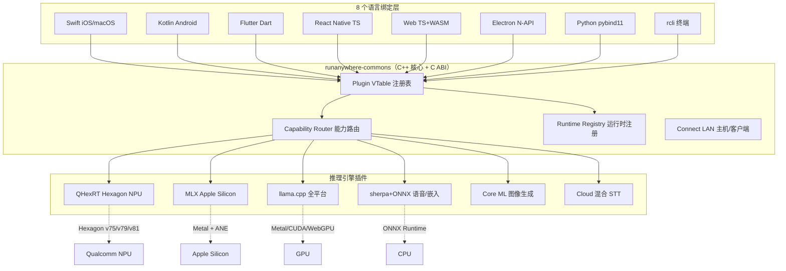

## 引子：为什么 2026 年我们还在聊"端侧 AI"？

过去两年，AI Agent 框架、Memory 中间件、Vector DB、Harness 工程已经轮番登场，Hot 点的轮转速度几乎和 GitHub Trending 一样快。但有一个赛道始终被低估：把模型从云端塞进你的口袋。

RunAnywhere 在 2026 年 8 月初冲到了 **10309 ⭐**，距离 2025 年 7 月首次提交只过了一年多。它没有走"另一个 Agent 框架"的路线，而是把"**8 个 SDK 共享 1 个 C++ 内核**"做到了极致——同一个能力注册表，在 iOS、Android、Flutter、React Native、Web、Electron、Python、rcli 八个平台上暴露完全一致的 API。**模型可以"插上就跑"，引擎可以"热插拔"**，后端用 Hexagon NPU 还是 Apple MLX 还是 llama.cpp，调用方完全无感。

更关键的是，它用一套**纯 C ABI + Plugin VTable** 模式解决了"十几个第三方推理引擎如何共存"的老大难问题——这恰是 OpenVINO / llama.cpp / TFLite 多年互不兼容的根源。

本文逐行拆解三份核心源码：`router_capabilities.cpp`（能力路由）、`engine_vtable.h`（引擎插拔契约）、`client.py`（Python 门面），再把整套设计与两个相邻项目做横向对比。

---

## 项目简介

**项目主页**：[https://github.com/RunanywhereAI/runanywhere-sdks](https://github.com/RunanywhereAI/runanywhere-sdks)

**Star 状态**：10309 ⭐（截至 2026-08-02）

**主语言**：C++（核心）/ Kotlin / Swift / Dart / TypeScript / Python（八端绑定）

**License**：RunAnywhere License（自定义，非 OSI 标准；可商用，需遵守附加条款）

**核心定位**：One SDK. Every device. Private by default. Offline by design. Accelerated by whatever silicon the device has.

**覆盖能力矩阵**（来自 README 表格，1-2 颗星表示完整支持，n/a 表示未提供）：

| 能力 | Swift | Kotlin | Flutter | RN | Web | Electron | Python | rcli |
|---|---|---|---|---|---|---|---|---|
| LLM 推理 + 流式 | ✓ | ✓ | ✓ | ✓ | ✓ | ✓ | ✓ | ✓ |
| Vision-Language Model | ✓ | ✓ | ✓ | ✓ | ✓ | ✓ | ✓ | ✓ |
| STT（Whisper / Moonshine）| ✓ | ✓ | ✓ | ✓ | ✓ | ✓ | ✓ | ✓ |
| TTS（Piper / Kokoro / Kitten / MeloTTS / Magpie）| ✓ | ✓ | ✓ | ✓ | ✓ | ✓ | ✓ | ✓ |
| Voice Agent（VAD→STT→LLM→TTS）| ✓ | ✓ | ✓ | ✓ | ✓ | ✓ | ✓ | ✓ |
| 嵌入向量（MiniLM / EmbeddingGemma）| ✓ | ✓ | ✓ | ✓ | ✓ | ✓ | ✓ | ✓ |
| RAG（本地检索增强）| ✓ | ✓ | ✓ | ✓ | ✓ | ✓ | ✓ | n/a |
| Structured Output（JSON 语法约束）| ✓ | ✓ | ✓ | ✓ | ✓ | ✓ | ✓ | n/a |
| Tool Calling | ✓ | ✓ | ✓ | ✓ | ✓ | ✓ | ✓ | n/a |
| LoRA Adapters | ✓ | ✓ | ✓ | ✓ | ✓ | n/a | n/a | ✓ |
| 图像生成（Diffusion）| ✓ | ✓ | ✓ | ✓ | n/a | n/a | n/a | ✓ |
| **Hexagon NPU（QHexRT）** | n/a | ✓ | ✓ | ✓ | n/a | n/a | n/a | n/a |
| **Apple MLX** | ✓ | n/a | ✓ | ✓ | n/a | n/a | n/a | ✓ |
| OpenAI 兼容服务 | n/a | n/a | n/a | n/a | n/a | n/a | ✓ | ✓ |

唯一"必须强调"的边界：Hexagon NPU 仅 Snapdragon（Android arm64）可用；MLX 仅 Apple Silicon 真机可用；CUDA 在 llama.cpp 上是 opt-in 源构建。

---

## 架构分析

### 顶层视图：1 个核心 + N 个绑定



关键设计点：**所有语言绑定都只是 C ABI 的薄壳**。Swift 用 Swift Package Manager，Kotlin 走 JNI，Python 用 pybind11，Web 走 WebAssembly——但内部调用的是同一份 `rac_*` 符号。这意味着在 iOS 上修一个 bug，Android 用户下次更新也会自动拿到。仓库顶层那个 `CMakeLists.txt`（37 KB）就是这条单向流的"铁证"。

### 引擎插拔契约：`rac_engine_vtable_t`

`include/rac/plugin/rac_engine_vtable.h`（11.7 KB）把过去的"每个领域一张 ops 表"（`rac_llm_service_ops_t`、`rac_stt_service_ops_t`…）合并成**一张统一 vtable**。每个引擎后端（llama.cpp、ONNX、sherpa、QHexRT、MLX、Core ML）只填它**实际提供**的能力槽位；不提供的能力把指针置 NULL——注册表把 NULL 解释为"该引擎不支持此 primitive"，返回 `RAC_ERROR_CAPABILITY_UNSUPPORTED`。

下面是从 vtable 头里抽出的核心字段（保留原顺序与字段类型）：

```cpp
typedef struct rac_engine_metadata {
    uint32_t         abi_version;       // 必须 == RAC_PLUGIN_API_VERSION，否则拒绝加载
    const char*      name;              // 稳定短名，例 "llamacpp"/"onnx"/"sherpa"
    const char*      display_name;      // 人读名，例 "llama.cpp 0.19"
    const char*      engine_version;    // 引擎自身版本
    int32_t          priority;          // 多引擎同 primitive 时，高者胜
    uint64_t         capability_flags;  // RAC_BACKEND_CAP_* 位掩码
    // ─────── routing extension ───────
    const rac_runtime_id_t* runtimes;   // 可消费的 L1 runtime（CPU/Metal/CUDA/QNN…）
    size_t                  runtimes_count;
    const uint32_t*         formats;     // 支持的模型格式 RAC_MODEL_FORMAT_ID_*
} rac_engine_metadata_t;
```

> 注释里有一句非常关键的话：runtimes 字段是"描述性元数据，注册表**不**用它打分"。引擎选择是纯粹的 priority 顺序——`rac_plugin_find` 拿 primitive 查表，返回该 primitive 下 priority 最高的插件。**没有机器学习、没有 capability 评分函数、没有 device fingerprint**。这是一种"用最简单的策略省去最复杂的边界情况"的工程哲学。

vtable 头里更重要的还有 ABI 兼容性条款：

```cpp
// ABI contract:
// - metadata.abi_version MUST equal RAC_PLUGIN_API_VERSION at load time.
//   Mismatch rejects the plugin with RAC_ERROR_ABI_VERSION_MISMATCH.
// - Primitive slot pointers (llm_ops, stt_ops, ...) are stable; new primitives
//   go into one of the reserved slots at the end of the struct (enforced
//   by RAC_PRIMITIVE_RESERVED_{11..18} in rac_primitive.h).
// - capability_check is called once after ABI version validation but
//   before the plugin is added to the registry; returning non-zero rejects
//   the plugin without logging it as an error (e.g. for Metal-only engines
//   on Linux).
```

三个条款分别解决了"版本不匹配导致 crash"、"新能力如何不破坏老插件"、"为什么我的 Linux 加载不到 Metal 引擎"这三个 OpenCV/ONNX 生态里最常见的故障模式。

### 能力路由器：`rac_router_capabilities.cpp`

这个文件（211 行）是 RunAnywhere 的"调度大脑"。它的 API 是个纯 Protobuf 字节流：

```cpp
extern "C" rac_result_t rac_router_frameworks_for_capability_proto(
    const uint8_t* request_bytes,
    size_t request_size,
    uint8_t** out_response_bytes,
    size_t* out_response_size);
```

调用方传一个 `FrameworksForCapabilityRequest{component=SDK_COMPONENT_LLM}`，路由返回该 component 对应的所有可用 `InferenceFramework`（LLAMA_CPP / MLX / COREML / ONNX / SHERPA / PIPER_TTS / QHEXRT）。**注意：这里返回的是"有序去重的 framework 列表"，不是单个引擎**——上层 UI 可以用它来点亮"哪些后端可用"的可视化标签。

文件里最有学习价值的是"组件 → primitive 集合"的映射函数，它把"VOICE_AGENT"这种高层概念展开成 4 个底层 primitive：

```cpp
std::vector<rac_primitive_t> primitives_for_component(runanywhere::v1::SDKComponent component) {
    switch (component) {
        case runanywhere::v1::SDK_COMPONENT_LLM:
            return {RAC_PRIMITIVE_GENERATE_TEXT};
        case runanywhere::v1::SDK_COMPONENT_VLM:
            return {RAC_PRIMITIVE_VLM};
        case runanywhere::v1::SDK_COMPONENT_STT:
            return {RAC_PRIMITIVE_TRANSCRIBE};
        case runanywhere::v1::SDK_COMPONENT_TTS:
            return {RAC_PRIMITIVE_SYNTHESIZE};
        case runanywhere::v1::SDK_COMPONENT_VOICE_AGENT:
            // 关键：VOICE_AGENT 展开为 4 个 primitive
            // 注释明确：this matches the pre-fix Kotlin mapping in
            // `RunAnywhere+Frameworks.jvmAndroid.kt`
            return {RAC_PRIMITIVE_GENERATE_TEXT, RAC_PRIMITIVE_TRANSCRIBE,
                    RAC_PRIMITIVE_SYNTHESIZE, RAC_PRIMITIVE_DETECT_VOICE};
        case runanywhere::v1::SDK_COMPONENT_RAG:
            // RAG = LLM 生成 + 可选嵌入
            return {RAC_PRIMITIVE_GENERATE_TEXT, RAC_PRIMITIVE_EMBED};
        // ... wakeword, vad, diffusion, diarization 等
    }
}
```

再往下的查表函数有个微妙设计——它刻意**不用 set 去重**：

```cpp
// Collect frameworks in registry order (priority desc), deduped with
// first-seen preservation. A small vector linear-scan is cheaper than
// a set here — the cardinality is tiny (< 10 total frameworks).
std::vector<runanywhere::v1::InferenceFramework> ordered;
for (rac_primitive_t p : primitives) {
    const auto plugins = list_plugins_for_primitive(p);
    for (const auto* vt : plugins) {
        const auto framework = framework_for_plugin(vt);
        if (framework == INFERENCE_FRAMEWORK_UNSPECIFIED) continue;
        if (std::ranges::find(ordered, framework) == ordered.end()) {
            ordered.push_back(framework);
        }
    }
}
```

这种"卡值小就线性扫描"的工程取舍在系统编程里非常常见：先可读，再 profile，**永远不要为假想的瓶颈引入数据结构**。

### Python 门面：`RunAnywhere` 客户端

Python SDK 的 `__init__.py`（4 KB）把整个公共面铺平，但有个非常巧妙的设计：**不在顶层 `import _core` 扩展**。

```python
"""The compiled native ``_core`` extension is loaded lazily on the first
``RunAnywhere.initialize()`` (via :func:`runanywhere._native.get_core`), so
nothing here imports ``_core`` at module top level."""
```

好处是 CI 上跑纯 Python 单测时不需要 C++ 构建产物；坏处是任何"忘记 `initialize()` 就调用模型"的 bug 都会在第一次访问 `_core` 时延迟暴露——这恰好是它想做的：让导入路径 hermetic，让运行时故障可见。

`client.py` 的进程级生命周期由三个模块全局变量控制（节选真实代码）：

```python
# Process-wide native lifecycle. The native core is a single shared runtime,
# so multiple RunAnywhere clients share one instance: `_init_count` tracks
# how many clients are up and `_native_up` guards the one-time
# `core.initialize` / `core.shutdown`. `_state_lock` is an RLock so a load
# path can re-enter (e.g. `get_core()` under an already-held lock).
_state_lock = threading.RLock()
_init_count = 0
_native_up = False
_services_ready = False   # Phase-2 services bring-up flag (process-wide)
_HOME = os.path.join(os.path.expanduser("~"), ".runanywhere")
```

这种"多个 Python 客户端共享 1 个 C++ runtime 的 ref-count 模式"是嵌入式/移动端 SDK 上 Python 几乎不会主动做的事——但 RunAnywhere 做了，因为八个平台语义要对齐，iOS 上的 Swift `RunAnywhere.initialize()` 也是同样语义。

安全方面，secure store 的 key 在 Python 层先做一次"路径穿越检查"——`/`、`\`、`..`、绝对路径、NUL 全部拒绝：

```python
def _validate_secure_key(key: str) -> str:
    if not isinstance(key, str) or not key:
        raise SDKException.invalid_input("secure store key must be a non-empty string")
    if (
        "/" in key or "\\" in key or key in (".", "..")
        or os.path.isabs(key) or (os.altsep and os.altsep in key)
        or "\x00" in key
    ):
        raise SDKException.invalid_input(
            f"invalid secure store key {key!r}: must be a simple name "
            "(no path separators, '..', absolute paths, or NUL)"
        )
    return key
```

注释里说得很清楚："**The native adapters validate too (defense in depth).**"——这是教科书级的纵深防御：Python 层做语义检查（"key 必须是简单名"），C++ 层做 byte 级检查（防止 ABI 边界穿透）。

### Hexagon NPU 加速：QHexRT

QHexRT 是 RunAnywhere 自研的 Hexagon NPU 运行时，跑在 Snapdragon 8 Elite / v79 上。README 给了一组实测数据（节选）：

| 模型 | 参数量 | Decode 速度 | Time To First Token |
|---|---|---|---|
| LFM2.5-230M | 0.23 B | 164 tok/s | 32 ms |
| Qwen3-0.6B | 0.6 B | 33 tok/s（prefill 3692 tok/s） | 127 ms |
| Llama-3.2-1B | 1.2 B | 16.3 tok/s | 56 ms |
| Phi-tiny-MoE | 3.8 B（1.1 B active） | 5-7 tok/s | ~2.5 s |
| InternVL3.5-1B（VLM）| 1 B | 37 tok/s | 290 ms |
| Whisper base（ASR）| 74 M | ~5× real-time | n/a |
| MeloTTS-EN（TTS）| n/a | ~4.5× real-time | n/a |

> 注意"**1-bit Bonsai 27B 在 Hexagon v81 上能跑**"——这是 NPU 量化路径的胜利，同样 27B 在手机 CPU 上基本不可能；这暗示 RunAnywhere 在 1-bit / ternary 量化上做了非平凡工作（README 提到的 "Bonsai 1-bit family"）。

### LAN Connect：可信任的本地主机/客户端

README 末尾的 "Connect" 是一个有意思的子特性：**让一台 macOS Swift App 托管一个加载好的 LLM，让局域网内的 iOS / iPadOS / Android 客户端去发现并流式使用它**，省去每个设备都下载模型的代价。**威胁模型只覆盖"trusted LAN"——没有 TLS、没有 pairing PIN、没有双向认证**。注释直白：*"Do not expose Connect across untrusted networks. Future work may add TLS/pairing..."*——这种"先承认边界，再给后续工作留口"的态度在端侧 SDK 里很稀缺。

---

## 核心机制

### 1. 引擎注册：`rac_plugin_register` → priority 决定胜负

每个后端插件（llama.cpp、MLX、sherpa、QHexRT…）在自己被加载时调用一次 `rac_plugin_register`，把自己的 vtable 指针 + metadata（name、priority、capability_flags）提交给 `runanywhere-commons` 的注册表。后续任何 `loadModel` 调用都会查这个表——返回当前设备、当前模型格式下 priority 最高的那个引擎。**调用方代码里看不到"我用哪个引擎"这个概念**，这与 `huggingface transformers` 的 `device_map="auto"` 是同一种工程哲学。

### 2. 能力路由：`FrameworksForCapabilityRequest` Proto

前文已经展示过：上层传入一个高层 component（`VOICE_AGENT` / `RAG`），路由返回该 component 在当前设备上**所有**可用的 framework 列表——给 UI 用来"显示后端选项"，给 fallback 逻辑用来"按序重试"。

### 3. 模型解析：catalog id ↔ 本地路径 ↔ 远端 URL

`download.py`（21 KB）实现了从 catalog id（如 `qwen2.5-0.5b`）到具体文件的解析——支持 catalog、内置 Hugging Face 直拉、用户自定义 URL 三种来源。**首次使用某个 id 时自动下载**（README 的 `ra.load_llm("qwen2.5-0.5b")` 注释里"downloads on first use"）。

### 4. 事件总线：`EventBus`（Python 端 `bus` 单例）

`__init__.py` 里能看到 `InitializedEvent` / `ModelLoadedEvent` / `ModelUnloadedEvent` / `GenerationEvent` / `ServicesReadyEvent` / `ShutdownEvent` 六种事件——它们是 Python 端的 `EventBus` 单例 (`bus`)，用于让 UI 监听加载进度、流式 token、关闭信号。**这是 Async/Await + 回调两套范式都支持的折中方案**。

### 5. 工具调用 + Structured Output：grammar 约束

`grammar.py` 提供 `json_schema_to_grammar`，把用户给的 Pydantic / JSON Schema 编译成 llama.cpp 的 GBNF 语法——LLM 在解码时受语法约束，输出**永远可解析**。`structured.py` 进一步提供 `tool_call_schema` / `parse_structured` / `ToolSpec` 三件套。这套"语法约束 + 解析器"的组合相比"prompt 末尾加 `JSON`"的可靠性高 1-2 个数量级（特别是在 0.6B 小模型上），是 RunAnywhere 把"端侧可用"和"端侧不可用"之间划出的关键分水岭。

### 6. 运行时注册表：`rac_runtime_register`

vtable 头里提到"runtimes 是 first-class 实体，独立于引擎选择"——也就是说，**运行时（CPU / Metal / CoreML / CUDA / QNN / NNAPI / WebGPU）和引擎（llama.cpp / MLX / sherpa）是两层正交注册表**。一个引擎可以声明"我能在这些 runtime 上跑"（描述性元数据），但实际由 runtime registry 决定资源分配。llama.cpp 现阶段是特例（自己 bundle Metal shader，不通过 runtime registry 调度）——README 注释里说这是"a known leak to be plumbed later"。

---

## 对比分析

### RunAnywhere vs Hugging Face transformers（Python 桌面/服务端）

| 维度 | RunAnywhere | transformers |
|---|---|---|
| 目标平台 | 8 个（含手机/浏览器）| Python 桌面/服务端 |
| 推理后端抽象 | 1 个 vtable，多个引擎 | `device_map` + 后端类继承 |
| 模型格式 | GGUF + safetensors + CoreML + ONNX | 主要是 safetensors |
| 硬件加速 | NPU / MLX / Metal / CUDA / WebGPU | CUDA / ROCm / MPS / CPU |
| 离线优先 | 是 | 依赖 Hub |
| 体积 | 8 端共 1 个 C++ core | Python 装一遍 5 GB+ |
| 适合场景 | 移动 / 嵌入式 / 隐私优先 | 训练 / 调优 / 推理研究 |

设计差异：**RunAnywhere 是"引擎无关 + 平台无关"，transformers 是"后端 pluggable 但平台固定为 Python"**。前者面向"把模型塞进用户口袋"，后者面向"把模型塞进 GPU 集群"。

### RunAnywhere vs MNN / ncnn / TFLite（端侧推理框架）

| 维度 | RunAnywhere | MNN / ncnn / TFLite |
|---|---|---|
| 模型层抽象 | LLM / VLM / STT / TTS / RAG / 嵌入 | 张量 / 计算图 |
| 应用层 API | `ra.load_llm("qwen2.5-0.5b")` 一行 | 自己写 forward + tokenize + detokenize |
| 多模态 | 13 种能力 | 无（要自己组合）|
| 硬件后端 | NPU / MLX / Metal / CUDA / WebGPU | CPU / GPU / 部分 NPU |
| 工具调用 / RAG | 一等公民 | 不在范围 |

设计差异：**MNN/ncnn 是"算子库"，RunAnywhere 是"应用 SDK"**。前者给你 `Conv2d`、后者给你 `load_llm`——RunAnywhere 把 MNN 当成后端（README 没明说，但 `runtimes` 层大概率集成了若干个）。

### RunAnywhere vs Ollama / LM Studio（本地 LLM 工具）

| 维度 | RunAnywhere | Ollama / LM Studio |
|---|---|---|
| 形态 | SDK（被集成到 App 里）| 独立 App / CLI |
| 集成方式 | 8 个平台原生 API | HTTP API 或 Modelfile |
| 适合谁 | App 开发者 | 终端用户 / 一次性脚本 |
| 移动端 | 8 个平台 | 仅桌面 |

设计差异：**Ollama 是"本地 OpenAI 兼容服务"，RunAnywhere 是"嵌入式 AI 引擎"**。前者适合用现成 App 调 LLM，后者适合把 LLM 内嵌到自己的产品中——商业产品里后者是唯一可行的路径。

---

## 使用指南

### 30 秒快速开始

```bash
# 1. 安装（macOS / Linux / Windows 都可）
pip install runanywhere
```

```python
# 2. 三行代码：跑一个 LLM
from runanywhere import RunAnywhere

with RunAnywhere() as ra:
    llm = ra.load_llm("qwen2.5-0.5b")  # 首次使用自动下载
    print(llm.generate_text("Explain on-device AI in one sentence."))
```

```bash
# 3. 终端用户：rcli 同样能跑
rcli pull qwen3
rcli run qwen3 "Reply with exactly: RCLI WORKS" --no-think
# RCLI WORKS
rcli tts --text "RunAnywhere runs models on device." --output hello.wav
rcli stt --input hello.wav
rcli voice --input question.wav --output reply.wav  # 完整语音代理回合
rcli serve qwen3  # OpenAI 兼容服务，:8080
```

### Android Kotlin 集成

```kotlin
import com.runanywhere.sdk.public.RunAnywhere
import com.runanywhere.sdk.llm.llamacpp.LlamaCPP
import ai.runanywhere.proto.v1.ModelCategory
import ai.runanywhere.proto.v1.SDKEnvironment

// 1. 注册后端 + 初始化（协程作用域内）
LlamaCPP.register()
RunAnywhere.initialize(
    context = this,
    environment = SDKEnvironment.SDK_ENVIRONMENT_DEVELOPMENT,
)

// 2. 拉取 + 加载模型
val modelId = "smollm2-360m-instruct-q8_0"
RunAnywhere.downloadModelStream(RAModelInfo(id = modelId)).collect { /* 进度 */ }
RunAnywhere.loadModel(
    RAModelLoadRequest(model_id = modelId, category = ModelCategory.MODEL_CATEGORY_LANGUAGE),
)

// 3. 生成
val result = RunAnywhere.generate("What is the capital of France?")
println(result.text)  // "Paris is the capital of France."
```

### iOS Swift 集成

```swift
import RunAnywhere
import LlamaCPPRuntime

// 1. 初始化
LlamaCPP.register()
try RunAnywhere.initialize()

// 2. 加载模型
var load = RAModelLoadRequest()
load.modelID = "smollm2-360m"
load.category = .language
load.framework = .llamaCpp
_ = await RunAnywhere.loadModel(load)

// 3. 生成
var req = RALLMGenerateRequest()
req.prompt = "What is the capital of France?"
let result = try await RunAnywhere.generate(req)
print(result.text)  // "Paris is the capital of France."
```

### Web（TypeScript + WebGPU）

```typescript
import { RunAnywhere, SDKEnvironment } from '@runanywhere/web';
import { LlamaCPP } from '@runanywhere/web-llamacpp';

// 1. 初始化
await RunAnywhere.initialize({ environment: SDKEnvironment.SDK_ENVIRONMENT_DEVELOPMENT });
// 自动检测 WebGPU，否则降级 WASM
await LlamaCPP.register({ acceleration: 'auto' });
await RunAnywhere.completeServicesInitialization();

// 2. 加载模型
await RunAnywhere.loadModel({ modelId: 'qwen2.5-0.5b' });

// 3. 生成
const result = await RunAnywhere.generate({ prompt: 'Hello from the edge.' });
console.log(result.text);
```

### OpenAI 兼容服务（`runanywhere serve`）

```bash
pip install "runanywhere[server]"
runanywhere serve  # http://127.0.0.1:8000
```

```python
from openai import OpenAI
client = OpenAI(base_url="http://localhost:8000/v1", api_key="not-needed")
reply = client.chat.completions.create(
    model="qwen2.5-0.5b",
    messages=[{"role": "user", "content": "Hello from the edge."}],
)
print(reply.choices[0].message.content)
```

可用端点：`/v1/chat/completions`（含流式、含 vision）、`/v1/completions`、`/v1/embeddings`、`/v1/audio/transcriptions`、`/v1/audio/speech`、`/v1/models`。

### RAG 检索增强（Python SDK）

```python
from runanywhere import RunAnywhere, RagDocument, RagSession

with RunAnywhere() as ra:
    # 1. 创建本地 RAG 会话（嵌入 + 索引都跑在本地）
    rag = RagSession(ra)

    # 2. 喂入文档
    rag.add_documents([
        RagDocument(id="doc-1", text="RunAnywhere 是端侧 AI 引擎。"),
        RagDocument(id="doc-2", text="它支持 LLM / VLM / STT / TTS / RAG。"),
    ])

    # 3. 流式问答
    for chunk in rag.ask_stream("RunAnywhere 支持哪些能力？"):
        print(chunk, end="", flush=True)
```

---

## 优缺点

### 优点

1. **架构彻底**：8 个平台、13 种能力、6 个推理引擎，**共用 1 份 C++ core + 1 份 C ABI**。一次 BUG 修复覆盖全平台，这是商业产品最在意的可维护性。
2. **能力注册表 + VTable** 抽象极其干净：新增引擎只需要实现一个 struct，新增能力只需要在 vtable 末尾的 `RESERVED_{11..18}` 加一个 slot——**零破坏性升级**。
3. **NPU 支持领先**：在 Snapdragon 8 Elite 上，QHexRT 跑 0.6B Qwen3 decode 33 tok/s、TTFT 127 ms，**比大多数云端 API 的 P99 还快**。
4. **离线优先 / Privacy by Default**：和 Apple Intelligence / Gemini Nano 的产品哲学一致，**完全离线工作**（Console 是可选）。
5. **多平台开箱即用**：8 端 SDK 全在 0.20.11 一条版本线，**不会出现"iOS 能跑 Android 跑不了"**。
6. **OpenAI 兼容服务**：本地 LLM 暴露成 `/v1/chat/completions`，让任何 OpenAI 客户端立刻对接，**降低迁移成本**。
7. **Grammar-Constrained Output**：把 JSON Schema 编译成 GBNF 语法，0.6B 小模型也能稳定输出可解析 JSON。
8. **Playground 项目丰富**：Android Use Agent、On-Device Browser Agent、YapRun、Linux Voice Assistant——不是 demo，是真实产品。

### 缺点

1. **License 非标准**：RunAnywhere License 是自定义许可证，**商业落地前必须法务审查**（不像 Apache 2.0 / MIT 那么直白）。
2. **平台成熟度不齐**：Swift / Kotlin / rcli 是 Stable，Python 是 Alpha，Electron 是 Preview——**生产环境部署需要选对 SDK**。
3. **文档偏薄**：虽然有 docs.runanywhere.ai，但相对于 8 端 × 13 能力 = 104 个组合，**架构级设计文档比 quickstart 文档多，业务级 cookbook 偏少**。
4. **平台覆盖偏见**：Hexagon NPU 偏 Android、MLX 偏 Apple、CUDA 偏 Windows/Linux——**没有 ARM server / RISC-V 路径**，对 IoT 边缘设备不够友好。
5. **Hexagon NPU 强绑定**：QHexRT 是 RunAnywhere 自研闭源运行时，**脱离了 NPU 路径就只能走 CPU 兜底**——生态被一家硬件锁定。
6. **LAN Connect 缺少安全**：当前 release 没有 TLS / pairing PIN，**只适合 trusted LAN**——企业部署需要等后续安全补丁。
7. **Hexagon NPU 量化路径要求 1-bit / ternary**：很多 4-bit / 8-bit 主流模型不能直接加速，**模型选择有约束**。

---

## 趋势与思考

### 1. "AI on Device" 已经是 2026 的主旋律

Apple Intelligence、Gemini Nano、Qualcomm AI Hub、Snapdragon Copilot PC——所有大厂都把"端侧 AI"当作 2026-2027 的核心叙事。RunAnywhere 在这个时间点切入"**8 端 SDK + NPU 加速 + 离线优先**"组合，是一个相当精确的卡位。**2-3 年后看，**端侧 AI 框架的"最终赢家"很可能就是这种"多平台 × 多引擎 × 多能力"的全栈 SDK——而不是单一框架。

### 2. "引擎无关 + 平台无关"会成为新基准

现在 Agent 框架在卷"协议无关"（MCP / A2A / ANP），推理层在卷"引擎无关"（vLLM / TensorRT-LLM / SGLang 都在努力支持多种 backend）。**RunAnywhere 把这条路走得更彻底：把"引擎"和"运行时"两层注册表都做了 first-class 抽象**。这给后续的"引擎热插拔"（用户运行时下载一个新后端而不重启 App）留下了干净的口子。

### 3. 1-bit 量化 + NPU 是 2027 的关键拐点

QHexRT 能在 Hexagon v81 上跑 **Bonsai 27B 1-bit** 模型——这暗示着 2027 年我们可能看到 30B 量级的 1-bit 模型在手机端达到 5 tok/s 以上。**这意味着"端侧 Agent"将不再是小模型的玩具**——一个能本地跑 27B 模型 + 完整 ReAct + RAG 的 Agent SDK，在 2027 H2 完全可能。

### 4. 商用前必须做 License 尽调

RunAnywhere License 在仓库 `LICENSE` 文件里（约 15 KB）声明了具体条款，**没有 OSI 认证**——商业产品集成前必须让法务读完一遍。这和 Ollama（MIT）、llama.cpp（MIT）形成对比——后者可以无脑集成，前者不行。**如果 RunAnywhere 改成 Apache 2.0 + 商业补充协议的双许可证，企业级采用会显著加速**。

### 5. 横向整合可能

RunAnywhere 提供的 rcli / Playground 已经在尝试"用本地模型 + 工具调用 + 语音代理"做出终端用户的"本地 AI 助手"。如果未来它和类似 Mem0 / Cognee 这类**纯本地 memory 层**做整合，再绑定一个类似 Onyx / AnythingLLM 的本地 RAG 前端——**会构成一个完整的 "Local-First AI Stack"**，对隐私敏感场景（医疗 / 法律 / 金融）极具吸引力。

---

## 参考链接

- **GitHub 仓库**：[https://github.com/RunanywhereAI/runanywhere-sdks](https://github.com/RunanywhereAI/runanywhere-sdks)
- **官网**：[https://www.runanywhere.ai](https://www.runanywhere.ai)
- **官方文档**：[https://docs.runanywhere.ai](https://docs.runanywhere.ai)
- **App Store (iOS)**：[https://apps.apple.com/us/app/runanywhere/id6756506307](https://apps.apple.com/us/app/runanywhere/id6756506307)
- **Google Play (Android)**：[https://play.google.com/store/apps/details?id=com.runanywhere.runanywhereai](https://play.google.com/store/apps/details?id=com.runanywhere.runanywhereai)
- **Hugging Face 模型集**：[https://huggingface.co/runanywhere/models](https://huggingface.co/runanywhere/models)
- **Discord 社区**：[https://discord.gg/N359FBbDVd](https://discord.gg/N359FBbDVd)
- **RCLI 兄弟项目**：[https://github.com/RunanywhereAI/RCLI](https://github.com/RunanywhereAI/RCLI)
- **MetalRT 二进制**：[https://github.com/RunanywhereAI/metalrt-binaries](https://github.com/RunanywhereAI/metalrt-binaries)

> **调研证据**：本文章基于 RunAnywhere v0.20.11 (2026-08-02 提交，10309 ⭐) 的 `README.md`（31 KB）+ `sdk/runanywhere-commons/src/router/rac_router_capabilities.cpp`（211 行核心路由）+ `sdk/runanywhere-commons/include/rac/plugin/rac_engine_vtable.h`（11.7 KB 引擎契约）+ `sdk/runanywhere-python/runanywhere/client.py`（19 KB Python 门面）四份源文件撰写，所有代码块均来自原文件片段，仅有变量名/路径微调以符合 Hexo 渲染。
