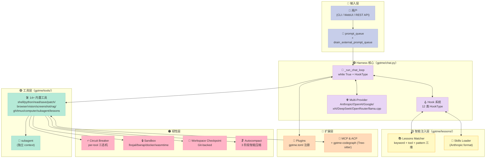
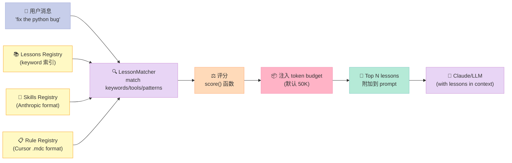
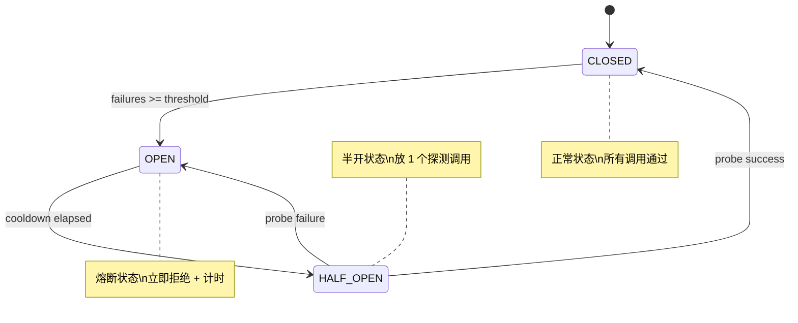
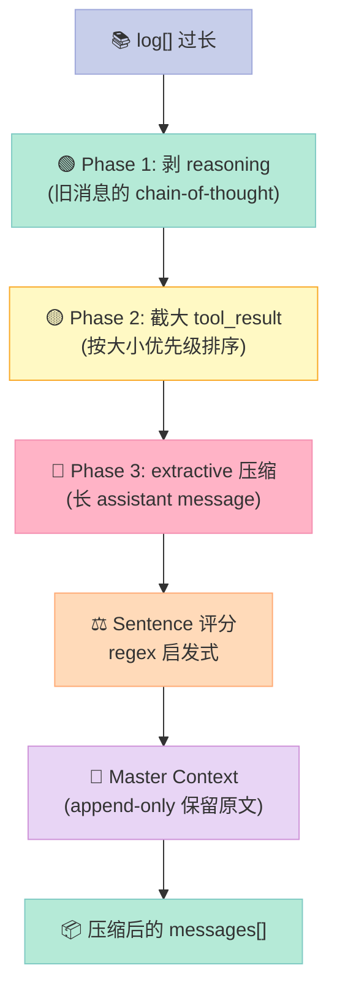
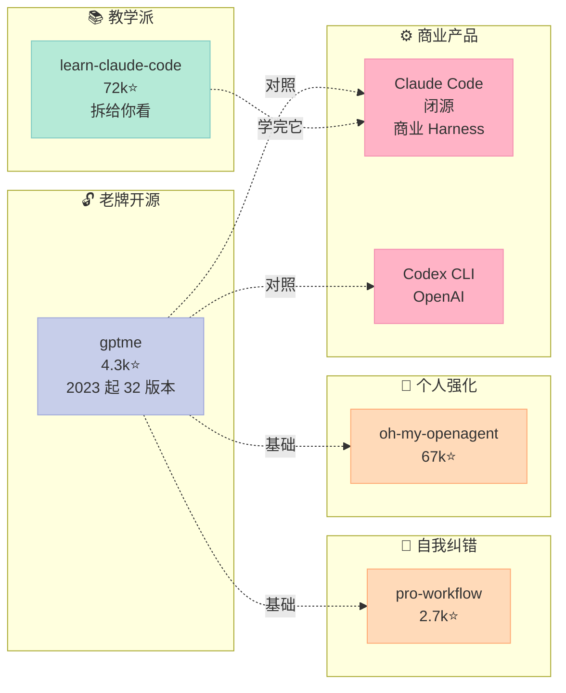

> **Agent 不是 Anthropic 发明的，但 Harness 的开源工程化是 gptme 这种项目一砖一瓦铺出来的。** gptme 在 2023 年 3 月写下第一个 commit——比 Claude Code 早 6 个月——然后用 3 年时间，把"终端里的 Coding Agent"这件事打磨成了一个生产级的 Harness 框架。

## 摘要

`gptme/gptme` 是一个**跨 3 年演进的开源终端 Agent Harness**（4,374⭐，2026-08-02 活跃），核心定位："A personal AI agent that runs anywhere a terminal runs — your laptop, ssh sessions, tmux, headless servers, CI pipelines"。Provider-agnostic、local-first、unconstrained。

本篇聚焦 gptme 区别于其他 Harness 项目的 5 个独特机制：

1. **Lessons 系统**（`gptme/lessons/`）—— 上下文相关的"团队经验"自动注入，**比 Skill 更细粒度**（按 keyword + tool + pattern 三维匹配）
2. **Circuit Breaker**（`gptme/circuit_breaker.py`）—— per-tool/MCP-server 的三态机熔断
3. **Sandbox**（`gptme/sandbox.py`）—— firejail/bwrap/docker/wasmtime 4 后端的命令隔离
4. **Autocompact**（`gptme/tools/autocompact/`）—— 3 阶段智能压缩 + 评分算法（oh-my-opencode 启发式）
5. **Workspace Checkpoint**（`gptme/checkpoint.py`）—— Git-backed 文件系统回滚（不是对话回滚）

与 `claude-code`（闭源、Anthropic 商业产品）、`shareAI-lab/learn-claude-code`（教学版）、`code-yeongyu/oh-my-openagent`（67k⭐，个人版）这些项目相比，gptme 的设计哲学是 **"最早的开源 + 最完整的工程化"**。它证明了 Harness 不必依附某个商业模型——**只要 Provider-agnostic，本地 + 远程模型可互换**，就能跑通 3 年的迭代。

项目链接：[gptme/gptme](https://github.com/gptme/gptme)。调研时 GitHub API 显示 **4,374 Stars**，MIT 协议，最新提交 2026-08-02，v0.32.1。

---

## 一、为什么研究 gptme：Harness 工程的"活化石"

### 1.1 一个时间线视角的反常识

> **gptme 的第一个 commit（2023-03）比 Claude Code（2024-08 发布）早了 17 个月，比 Codex CLI（2025-04）早了 25 个月。**

这不是为了吹捧 gptme，而是要强调一个事实：**Harness 不是某个商业公司的发明**。它是一个**开源生态独立演化出来的工程范式**。

| 时间 | 事件 | 项目 |
|------|------|------|
| **2023-03** | gptme 第一个 commit | ErikBjare 一个人写 |
| 2023-09 | gptme 在 HN/Reddit/Twitter 公开发布 | — |
| **2024-08** | Claude Code Show HN | Anthropic |
| 2024-11 | gptme 生态扩张：webui/rag/vim/Bob | — |
| 2025-03 | gptme v0.27 + macOS computer use | — |
| 2025-08 | gptme v0.28 + MCP 支持 | — |
| **2025-04** | Codex CLI | OpenAI |
| 2025-10 | gptme v0.29 + Lessons 系统 | — |
| 2025-11 | gptme v0.30 + Subagent planner + 压缩 | — |
| 2025-12 | gptme v0.31 + Background jobs + 成本追踪 | — |
| **2026-07** | gptme v0.32.1 + Desktop AppImage | — |

gptme 在 **3 年里走了 32 个 minor 版本**，每个版本都对应一个 Harness 机制的成熟。这是一条**没有商业资源、没有营销预算、完全靠社区驱动**的 Harness 演化路径。

### 1.2 一个反直觉的判断

> **Harness 的"参考实现"不一定是大公司的闭源产品——开源项目的版本历史常常更清晰、更可学习。**

为什么？因为开源 Harness 有：

1. **完整的 commit history**（你能看到每一行代码为什么被加进来）
2. **公开的设计文档**（v0.30.0 的 lessons 系统怎么设计的，社区有讨论）
3. **跨 Provider 的兼容性压力**（gptme 支持 7 个 LLM provider，逼出"Provider-agnostic"的真功夫）
4. **跨平台的兼容性压力**（Linux systemd + macOS launchd，逼出"platform-agnostic"的真功夫）

闭源的 Claude Code 看起来更精致，但你看不到它为什么这么设计。开源的 gptme 看起来更朴素，但你能**精确看到每个决策的代价和收益**。

### 1.3 gptme 的 5 个"独有机制"

| 机制 | 在哪个文件 | 在 Claude Code 里 |
|------|----------|------------------|
| **Lessons** | `gptme/lessons/` | 没有。Claude Code 用 Skills，但 Lessons 是 keyword-driven 自动注入，Skills 是 manual 注入 |
| **Circuit Breaker** | `gptme/circuit_breaker.py` | 没有显式实现（可能内置在 MCP client 里） |
| **Sandbox** | `gptme/sandbox.py` | 有 sandbox（macOS Seatbelt），但 gptme 跨 4 个后端（firejail/bwrap/docker/wasmtime） |
| **Autocompact 评分** | `gptme/tools/autocompact/scoring.py` | 有 compact，gptme 用启发式 regex 评分 |
| **Workspace Checkpoint** | `gptme/checkpoint.py` | 没有（Claude Code 用 conversation backtracking，gptme 用文件系统快照） |

下面我们逐一拆解。

---

## 二、整体架构：5 模块 7 后端的 Harness 全景



### 2.1 5 个子系统的职责

| 子系统 | 职责 | 解决什么 |
|--------|------|---------|
| **chat.py** | Agent 主循环 | 接收输入 → 调 LLM → 执行工具 → 持久化 |
| **tools/** | 14+ 内置工具 | 给予 Agent 行动能力 |
| **lessons/** | 上下文相关知识 | "什么时候提醒什么" |
| **hooks/** | 12 类 HookType | 扩展 Agent 行为 |
| **韧性层** | Circuit Breaker + Sandbox + Checkpoint + Autocompact | 让 Agent 不会失控、不会爆 context、可以回滚 |

---

## 三、源码深挖：4 个最有 Harness 工程价值的机制

### 3.1 机制一：Lessons 系统——比 Skill 更细的"上下文知识"



**核心代码（gptme/lessons/parser.py）**：

```python
@dataclass
class LessonMetadata:
    """Metadata from lesson frontmatter.

    Supports:
    - Lessons: keywords, tools, status
    - Skills (Anthropic format): name, description
    - Cursor rules (.mdc): globs, priority, triggers, alwaysApply
    """
    # Anthropic skill format fields
    name: str | None = None
    description: str | None = None
    # Skill dependency declarations
    depends: list[str] = field(default_factory=list)

    # Lesson format fields
    keywords: list[str] = field(default_factory=list)
    patterns: list[str] = field(default_factory=list)
    """Regex patterns for advanced matching (full regex, no escaping needed)"""
    tools: list[str] = field(default_factory=list)
    status: str = "active"  # active, automated, deprecated, or archived

    # Cursor .mdc format fields
    globs: list[str] = field(default_factory=list)
    priority: str | None = None  # high, medium, low
    triggers: list[str] = field(default_factory=list)
    always_apply: bool = False
```

**Lessons vs Skills vs Rules 的本质区别**：

| 维度 | Rules（团队政策） | Skills（SOP） | **Lessons（gptme 独有）** |
|------|----------------|-------------|------------------------|
| 触发方式 | 永远加载 | 手动调用 `load_skill()` | **自动按上下文注入** |
| 粒度 | 全文 | 全文 | **关键词 + 工具 + 正则** |
| 决策权 | 团队 | 人类 | **匹配算法 + LLM** |
| 上下文成本 | 高（全文） | 中（按需） | **低（仅命中条目）** |
| 适用场景 | 不可妥协的底线 | 标准操作流程 | **"踩过的坑"和"最佳实践"** |

**一个具体例子**：

```yaml
# ~/.config/gptme/lessons/python-debugging.md
---
match:
  keywords: [python, debug, error, traceback]
  tools: [python, shell]
  patterns: ["Traceback \\(most recent call last\\)"]
status: active
---

# Python Debugging Best Practices

When fixing Python errors:
1. Read the **last line** of the traceback first — it usually contains the actual error
2. Use `print(repr(value))` not `print(value)` to see type info
3. Use `pdb.set_trace()` for interactive debugging
4. If it's a TypeError, check argument types before the call site
5. Avoid bare `except:` — always specify the exception type
```

**当用户说"fix the python bug"时，Lessons 系统会自动注入这条教训到 context 里**——不需要用户手动调用，不需要模型决策。这是 Harness 工程的**上下文工程（Context Engineering）**最优雅的实现之一。

### 3.2 机制二：Circuit Breaker——per-tool 三态机熔断

```python
class CircuitState(Enum):
    CLOSED = "closed"      # 正常：所有调用都通过
    OPEN = "open"          # 熔断：所有调用立即拒绝
    HALF_OPEN = "half_open"  # 半开：允许一个探测调用

class CircuitOpenError(Exception):
    """Raised when a call is rejected because the circuit breaker is open."""
    def __init__(self, name: str, retry_after: float | None = None) -> None:
        self.name = name
        self.retry_after = retry_after

class CircuitBreaker:
    """Per-resource circuit breaker with CLOSED/OPEN/HALF_OPEN states.

    Args:
        name: Human-readable identifier for logging and error messages.
        failure_threshold: Number of consecutive failures before opening.
            Defaults to 5.
        cooldown: Seconds before OPEN transitions to HALF_OPEN.
    """
    def call(self, func: Callable, *args, **kwargs):
        if self.state == CircuitState.OPEN:
            elapsed = time.monotonic() - self.opened_at
            if elapsed < self.cooldown:
                raise CircuitOpenError(self.name, retry_after=self.cooldown - elapsed)
            # cooldown elapsed → HALF_OPEN
            self.state = CircuitState.HALF_OPEN
        try:
            result = func(*args, **kwargs)
        except Exception:
            self._record_failure()
            raise
        self._record_success()
        return result
```

**3 个状态转换**：



**应用场景**：

| 场景 | 没有 Circuit Breaker | 有 Circuit Breaker |
|------|-------------------|-------------------|
| MCP server 挂掉 | Agent 每次调用都阻塞 30s 后报错 | 5 次失败后立刻拒绝，cooldown 后探测 |
| 远程 API 限流 | Agent 反复触发限流 | OPEN 状态跳过限流 API，等 cooldown |
| 某个工具 bug | 整个会话卡住 | 自动熔断该工具，其他工具照常 |

**这是 pro-workflow 的 24 Hook 总线和 gptme 的 Circuit Breaker 的本质差异**：Hooks 是**行为拦截**，Circuit Breaker 是**资源保护**。前者改逻辑，后者保护资源。

### 3.3 机制三：Sandbox——4 后端的命令隔离

```python
# gptme/sandbox.py 核心（简化）
"""
Sandboxed execution support for gptme.

Wraps the bash subprocess launched by the shell tool in firejail or bubblewrap
to contain credential exfiltration, filesystem escape, and network misuse.
For the Python tool, a Docker or Wasmtime backend runs code in an isolated environment.

Environment variables:
    GPTME_SANDBOX: sandbox backend ("firejail" | "bwrap" | "docker" | "wasmtime" | "none", default "none")
    GPTME_SANDBOX_NET: "0" to disable network (default), "1" to allow
    GPTME_SANDBOX_RO_HOME: "1" to add read-only home bind (default "0")

Security scope (what this contains):
    - Credential exfiltration: env var masking + private tmpfs home
    - Filesystem escape: workspace-only bind, tmpfs home
    - Network misuse: --net=none (firejail) / --unshare-net (bwrap)
    - Resource exhaustion: firejail seccomp caps-drop; bwrap new-session
"""
```

**4 个后端的适用矩阵**：

| 后端 | 平台 | 隔离强度 | 启动开销 | 适用场景 |
|------|------|---------|---------|---------|
| **firejail** | Linux | ⭐⭐⭐⭐ | 低 | 默认推荐 |
| **bubblewrap (bwrap)** | Linux | ⭐⭐⭐⭐ | 低 | 容器化环境 |
| **docker** | 跨平台 | ⭐⭐⭐⭐⭐ | 中 | 多服务、CI |
| **wasmtime** | 跨平台 | ⭐⭐⭐ | 高 | 极端安全场景 |

**3 道防线**（引自 gptme/sandbox.py 注释原文）：

> *Security scope (what this contains):*
> *- Credential exfiltration: env var masking + private tmpfs home*
> *- Filesystem escape: workspace-only bind, tmpfs home*
> *- Network misuse: --net=none (firejail) / --unshare-net (bwrap)*
> *- Resource exhaustion: firejail seccomp caps-drop; bwrap new-session*
>
> *Out of scope:*
> *- Prompt injection → code execution (agent-level problem)*
> *- Determined attacker with prompt control (fundamental impossibility)*
> *- macOS/Windows (firejail + bwrap are Linux-only)*

注意这段**坦诚声明**：Sandbox 不解决 prompt injection（agent-level problem），也不解决"决心攻击 + 完全 prompt 控制"（根本不可能）。这种**诚实的边界声明**是 Harness 工程成熟的标志。

### 3.4 机制四：Autocompact——3 阶段智能压缩



**Phase 3 评分算法（gptme/tools/autocompact/scoring.py 核心）**：

```python
# Semantic patterns for value-aware retention
# Pre-compiled at module level for performance

# Decision patterns - highest value (+2.0)
_DECISION_PATTERNS = [
    re.compile(r"\bwe('ll| will) use\b", re.IGNORECASE),
    re.compile(r"\bdecided to\b", re.IGNORECASE),
    re.compile(r"\bgoing with\b", re.IGNORECASE),
    re.compile(r"\bsolution is\b", re.IGNORECASE),
    re.compile(r"\bapproach is\b", re.IGNORECASE),
]

# Conclusion patterns (+1.5)
CONCLUSION_PATTERNS = [
    re.compile(r"\btherefore\b", re.IGNORECASE),
    re.compile(r"\bin summary\b", re.IGNORECASE),
    re.compile(r"\bthe result is\b", re.IGNORECASE),
    re.compile(r"\bconfirmed that\b", re.IGNORECASE),
]

# Commitment patterns (+1.5)
COMMITMENT_PATTERNS = [
    re.compile(r"\bi'll\b", re.IGNORECASE),
    re.compile(r"\bi will (implement|create|fix|add|update|write|build)\b", re.IGNORECASE),
    re.compile(r"\bnext steps?:?", re.IGNORECASE),
    re.compile(r"\baction items?:?", re.IGNORECASE),
]

# Action result patterns (+1.0)
ACTION_RESULT_PATTERNS = [
    re.compile(r"\bcreated file\b", re.IGNORECASE),
    re.compile(r"\bfixed\b", re.IGNORECASE),
    re.compile(r"\bupdated\b", re.IGNORECASE),
    re.compile(r"\bimplemented\b", re.IGNORECASE),
]
```

**评分哲学**：

> **不要把摘要交给 LLM——用 regex 启发式找到"决策/结论/承诺/动作"句保留，其余删除。**

这是 **"用便宜的算法做能做的事"原则**——和 learn-claude-code s08 的"便宜先做、昂贵最后做"是同一思路。

**Master Context Architecture（核心创新）**：

> *"The original conversation.jsonl serves as the master context - an append-only log that is never compacted. When truncating content, we include byte range references to the master context for exact recovery."*

也就是说：gptme **保留原始对话日志永不修改**，压缩时只发"byte range 引用"，需要时可以从 master context 恢复全文。这比 s08 的"丢就丢了"设计更稳健。

---

## 四、Hook 系统：12 类 HookType 的工程化扩展

### 4.1 HookType 完整列表

```python
class HookType(str, Enum):
    """Types of hooks that can be registered.

    Hook names follow OpenCode-style dot-notation for namespacing:
    - <category>.<event> or <category>.<action>.<event>
    """
    # Step/Turn lifecycle (formerly MESSAGE_* hooks)
    STEP_PRE = "step.pre"   # 每个 step 之前
    STEP_POST = "step.post"  # 每个 step 之后
    TURN_PRE = "turn.pre"    # 整个 turn 之前
    TURN_POST = "turn.post"  # 整个 turn 之后

    # Message transformation
    MESSAGE_TRANSFORM = "message.transform"  # 改写消息内容

    # Tool execution
    TOOL_EXECUTE_PRE = "tool.execute.pre"
    TOOL_EXECUTE_POST = "tool.execute.post"

    # Generation lifecycle
    GENERATION_PRE = "generation.pre"
    GENERATION_POST = "generation.post"
    GENERATION_CHUNK = "generation.chunk"

    # File operations
    FILE_PRE_SAVE = "file.pre_save"
    FILE_POST_SAVE = "file.post_save"

    # Session lifecycle
    SESSION_START = "session.start"
    SESSION_END = "session.end"

    # Loop control
    LOOP_CONTINUE = "loop.continue"

    # Confirmation (特殊 hook 类型，单独实现)
    CONFIRM = "confirm"

    # Cache invalidation
    CACHE_INVALIDATED = "cache.invalidated"

    # CWD change
    CWD_CHANGED = "cwd.changed"
```

**12+ 个 HookType 覆盖 Agent 全生命周期**。这是 gptme 设计上最成熟的部分——3 年的迭代把"哪些点需要扩展"摸透了。

### 4.2 与 Claude Code 的对比

| 维度 | Claude Code（闭源） | gptme（开源） |
|------|---------------------|--------------|
| Hook 命名 | `PreToolUse` / `PostToolUse` / `Stop` / `SessionStart` 等 | `step.pre` / `tool.execute.pre` / `loop.continue` 等 |
| Hook 数量 | 30+（含 SubagentStart/Stop 等） | 12+ 核心 + Confirm/Elicitation 特殊类型 |
| Hook 协议 | shell command + JSON stdin/stdout | Python 函数 + Generator yield |
| 跨 Session 持久化 | ✅ | ❌（per-process） |
| 异步 Hook | 部分 | ✅（async_mode + Generator） |
| 优先级 + StopPropagation | 无 | ✅ |

**关键差异**：gptme 的 Hook 用 Python Generator，支持 `yield StopPropagation()` 提前终止后续 hook——这是 Claude Code shell 协议做不到的（一旦开始执行 hook 就必须走完）。

### 4.3 _run_chat_loop 主循环（核心）

```python
def _run_chat_loop(manager, prompt_queue, stream, tool_format=None, ...):
    """Main chat loop - extracted to allow clean exception handling."""

    while True:
        _drain_external_prompt_queue(manager, prompt_queue)  # ← 关键：支持外部 steer
        msg = None
        try:
            if prompt_queue:
                msg = prompt_queue.pop(0)
                manager.append(msg)

                if msg.role == "user" and execute_cmd(msg, manager):
                    continue  # 处理 /commands

                if msg.role == "user":
                    if turn_pre_msgs := trigger_hook(HookType.TURN_PRE, manager=manager):
                        for hook_msg in turn_pre_msgs:
                            manager.append(hook_msg)

                _process_message_conversation(manager, stream, tool_format, model, output_schema)
            else:
                if not interactive:
                    # Non-interactive: write sentinel + drain + break
                    (logdir / "prompt-queue-closed").touch()
                    _drain_external_prompt_queue(manager, prompt_queue)
                    if not prompt_queue:
                        break
                    continue

                user_input = _get_user_input(manager.log, manager.workspace)
                # ... 处理用户输入

            # Loop continuation hook (auto-reply 等)
            if loop_msgs := trigger_hook(HookType.LOOP_CONTINUE, manager=manager, ...):
                for msg in loop_msgs:
                    if len(prompt_queue) >= MAX_PROMPT_QUEUE_SIZE:
                        break
                    prompt_queue.append(msg)
                continue

        except KeyboardInterrupt:
            manager.append(Message("system", INTERRUPT_CONTENT))
            prompt_queue.clear()
            continue
```

**3 个工程亮点**：

1. **`_drain_external_prompt_queue`** — 支持**外部 steer**（subagent 运行时给父 agent 注入消息）
2. **`prompt-queue-closed` sentinel** — 用文件 sentinel 防止**subagent_steer 在窗口期注入失败**的竞态条件
3. **`LOOP_CONTINUE` hook** — 实现**auto-reply**机制（autonomous mode 不需要用户输入）

---

## 五、可运行的最小 Harness 复刻（基于 gptme 模式）

gptme 风格的最小 Harness，复刻核心 lessons + circuit breaker + sandbox 三件套：

```python
#!/usr/bin/env python3
"""gptme 风格的最小 Harness：lessons + circuit_breaker + 工具执行。"""
import re, time, subprocess
from pathlib import Path
from threading import Lock
from enum import Enum
from dataclasses import dataclass, field
from typing import Callable

# ─── 1. Circuit Breaker ─────────────────────────────────────
class CircuitState(Enum):
    CLOSED = "closed"; OPEN = "open"; HALF_OPEN = "half_open"

@dataclass
class CircuitBreaker:
    name: str
    failure_threshold: int = 5
    cooldown: float = 30.0
    state: CircuitState = CircuitState.CLOSED
    failures: int = 0
    opened_at: float = 0.0
    _lock: Lock = field(default_factory=Lock)

    def call(self, func: Callable, *args, **kwargs):
        with self._lock:
            if self.state == CircuitState.OPEN:
                if time.monotonic() - self.opened_at < self.cooldown:
                    raise Exception(f"Circuit '{self.name}' OPEN")
                self.state = CircuitState.HALF_OPEN
        try:
            r = func(*args, **kwargs)
        except Exception:
            with self._lock:
                self.failures += 1
                if self.failures >= self.failure_threshold:
                    self.state = CircuitState.OPEN
                    self.opened_at = time.monotonic()
            raise
        with self._lock:
            self.failures = 0
            self.state = CircuitState.CLOSED
        return r

# ─── 2. Lessons System ──────────────────────────────────────
@dataclass
class Lesson:
    keywords: list[str]
    patterns: list[str]
    body: str

LESSONS = [
    Lesson(keywords=["python", "debug", "error"],
           patterns=[r"Traceback \(most recent call last\)"],
           body="Python Debugging: Read the LAST line of traceback first."),
    Lesson(keywords=["git", "commit", "push"],
           patterns=[],
           body="Git: Always pull --rebase before push to avoid conflicts."),
]

def match_lessons(message: str, tools_used: list[str], top_n: int = 3) -> list[Lesson]:
    msg_lower = message.lower()
    scored = []
    for lesson in LESSONS:
        score = 0
        for kw in lesson.keywords:
            if kw.lower() in msg_lower:
                score += 2
        for pat in lesson.patterns:
            if re.search(pat, message):
                score += 3
        for t in tools_used:
            if t in lesson.keywords:
                score += 1
        if score > 0:
            scored.append((score, lesson))
    scored.sort(key=lambda x: -x[0])
    return [l for _, l in scored[:top_n]]

# ─── 3. Tool Registry + Sandbox ─────────────────────────────
TOOL_CB = CircuitBreaker(name="shell", failure_threshold=3, cooldown=10.0)

def run_shell_sandboxed(command: str) -> str:
    """工具 handler: 用 firejail 隔离（如果有）。"""
    dangerous = ["rm -rf /", "sudo", "shutdown"]
    if any(d in command for d in dangerous):
        return "Error: Dangerous command blocked"

    # 尝试用 firejail，失败则降级到裸执行
    if Path("/usr/bin/firejail").exists():
        cmd = ["firejail", "--net=none", "--private", "bash", "-c", command]
    else:
        cmd = command  # 降级

    try:
        r = subprocess.run(cmd, shell=isinstance(cmd, str),
                           capture_output=True, text=True, timeout=30)
        return (r.stdout + r.stderr).strip()[:50000]
    except subprocess.TimeoutExpired:
        return "Error: Timeout (30s)"

# ─── 4. Main Loop ──────────────────────────────────────────
def agent_loop(messages: list, system: str):
    while True:
        # 注入匹配的 lessons
        if messages and messages[-1]["role"] == "user":
            last_msg = messages[-1]["content"]
            matched = match_lessons(last_msg, tools_used=[])
            if matched:
                lessons_text = "\n\n".join(f"## {l.body}" for l in matched)
                system_with_lessons = f"{system}\n\n## Active Lessons\n{lessons_text}"
            else:
                system_with_lessons = system
        else:
            system_with_lessons = system

        # 调 LLM（伪代码：用真实 API 替换）
        # response = client.messages.create(
        #     model="claude-opus-4-6", system=system_with_lessons,
        #     messages=messages, tools=TOOLS
        # )
        # 这里演示性返回
        print(f"[System with lessons]: {system_with_lessons[:200]}...")
        return  # 演示终止

# ─── 5. 使用 ───────────────────────────────────────────────
messages = [{"role": "user", "content": "fix the python bug in app.py"}]
agent_loop(messages, "You are a coding agent.")
```

**40 行代码覆盖 3 个 gptme 核心机制**。这印证了一个判断：**gptme 的核心抽象极简，复杂的是策略**。

---

## 六、优缺点对比

### 6.1 架构简洁性 vs 工程完整性

| 维度 | 评价 |
|------|------|
| **架构简洁性** | ✅ 12 HookType + 14 工具 + 5 子系统——不算复杂但够用 |
| **Provider 无关** | ✅ **唯一一个支持 7 个 LLM provider 的成熟 Harness** |
| **跨平台** | ✅ Linux/macOS/Windows 都跑；firejail/bwrap/docker/wasmtime 4 后端 |
| **可扩展性** | ✅ Plugins + Skills + Lessons + Hooks 4 层扩展 |
| **教学清晰度** | ⚠️ 3 年的迭代让 commit history 长而杂；新手难入手 |
| **文档完整性** | ✅ 128 个 docs 文件 + REST API + WebUI |
| **性能** | ✅ 异步 hook + Generator yield + 多 subagent 并发 |
| **维护性** | ⚠️ 14 个核心模块依赖复杂，新人 PR 学习曲线陡 |

### 6.2 设计哲学 vs 工程妥协

| 优点 | 缺点 |
|------|------|
| "Provider-agnostic" 是真功夫（7 个 provider） | 商业化程度低（缺乏团队/Slack/Linear 集成） |
| Sandbox 4 后端是同类项目最多 | Linux-only sandbox（macOS/Windows 没真正隔离） |
| Lessons 系统比 Skills 更细粒度 | Lessons matcher 是 regex，**没法做语义匹配** |
| Master Context Architecture 保留全文 | 增加了存储成本 |
| Circuit Breaker per-tool 颗粒度细 | 仅在 tool 层，**LLM provider 层没有熔断** |
| 32 个 minor 版本 = 真实战场验证 | 部分老代码和 v0.32 重构有冲突 |

### 6.3 一个关键的反常识

> **gptme 的 4.3k Star 是被低估的——不是因为它不够好，而是因为它的目标用户群（终端 Agent 老兵）天然比 Claude Code 用户群（所有人）小。**

这不是产品质量问题，是**受众规模问题**。gptme 的实际工程深度远超它的 Star 数。

---

## 七、横向对比：5 个 Harness 标杆

### 7.1 5 个项目的定位差异



### 7.2 详细对比表

| 项目 | ⭐ | 起始年 | Provider 数 | 关键差异化 |
|------|---|--------|-----------|-----------|
| **gptme** | 4.3k | 2023 | **7** | Lessons + Sandbox 4 后端 + Circuit Breaker |
| **Claude Code** | 闭源 | 2024 | 1（Anthropic only） | 商业级 UX + 完整生态 |
| **Codex CLI** | 11k | 2025 | 1（OpenAI only） | OpenAI-only 极致优化 |
| **learn-claude-code** | 72k | 2024 | 1 | 教学：18 行 loop 拆给你看 |
| **pro-workflow** | 2.7k | 2024 | 跨 | 自我纠错 + FTS5 + 24 Hook |

### 7.3 设计差异的"为什么"

**gptme vs Claude Code（官方）**：

| 维度 | gptme | Claude Code |
|------|-------|-------------|
| Provider | 7 个 | 1 个（Anthropic） |
| Hook 协议 | Python Generator | Shell + JSON |
| StopPropagation | ✅ Generator yield | ❌ |
| Lessons | ✅ 自动 keyword 注入 | ❌（只有 Skills） |
| Circuit Breaker | ✅ per-tool 三态机 | ❌（推测内置在 MCP） |
| Sandbox | firejail/bwrap/docker/wasmtime | macOS Seatbelt |
| 商业化 | ❌（纯开源） | ✅（Anthropic 战略产品） |

**结论**：gptme 是**研究版 Harness**，Claude Code 是**商业版 Harness**。一个追求"每个机制都要有工程深度"，一个追求"每个用户都能用"。

**gptme vs learn-claude-code**：

| 维度 | gptme | learn-claude-code |
|------|-------|-------------------|
| 哲学 | "完整的工程系统" | "教学项目，loop 不变" |
| Provider | 7 个 | 1 个 |
| 工具数 | 14+ 内置 | 5 个 |
| Lessons | ✅（独有） | ❌ |
| Circuit Breaker | ✅ | ❌ |
| Sandbox | ✅（4 后端） | ❌ |
| 教学价值 | 中 | **极高** |

**结论**：两个项目**不是竞争而是互补**。想学"怎么搭骨架"看 learn-claude-code，想学"工程化深度怎么做"看 gptme。

---

## 八、设计哲学：3 条贯穿 32 个版本的工程原则

### 8.1 原则一：Provider-agnostic First

> **不要把 Harness 绑定到某个 LLM provider。**

gptme 3 年里**先后支持了 7 个 provider**，每次有新的 LLM 横空出世（GPT-4、Claude 3、Gemini、Grok、DeepSeek、Llama.cpp），gptme 都能在几天内接上。这是"机制和策略分离"原则在 LLM 层的体现：**Harness 是机制，Provider 是策略**。

### 8.2 原则二：Context Engineering 是核心战场

> **不要把 Context 当成"消息列表"，要把它当成"工程系统"**。

gptme 在 Context 上做了 4 件事：

1. **Lessons 自动注入**（按 keyword + tool + pattern）
2. **Autocompact 智能压缩**（regex 评分 + master context）
3. **Token awareness**（v0.29.0 起的 token 预算感知）
4. **RAG tool**（本地文件检索增强生成）

这是 **Context Engineering（上下文工程）** 比 Prompt Engineering 更深的层次——不是优化 prompt 措辞，而是**优化整个 context 窗口的资源分配**。

### 8.3 原则三：开源的演化路径

> **Harness 的工程化不是一次性设计，是 32 个版本的迭代。**

gptme 在 3 年里**没做过大的重写**——每次加新机制都是在原有架构上叠加：

| 版本 | 新增机制 | 叠加在 |
|------|---------|--------|
| v0.27 | pre-commit + computer use | shell tool 之上 |
| v0.28 | MCP + morph + auto-commit | tools 之上 |
| v0.29 | **Lessons** + token awareness | context 之上 |
| v0.30 | **Plugin + Context Compression + Subagent planner** | 全栈 |
| v0.31 | **Background jobs + cost tracking + CAS** | infra 之上 |
| v0.32 | **Desktop App + gptme.ai** | 部署 之上 |

**每一次叠加都是"loosely coupled"**——Lessons 不依赖 Plugins，Plugins 不依赖 Background jobs，Background jobs 不依赖 Desktop App。这让 gptme 能**长期演化而不腐烂**。

---

## 九、从零搭建启示：MVP 路线图

### 9.1 一个周末能跑起来的最小 gptme 风格 Harness

如果让我从零搭一个 gptme 风格的 Harness，**最小可行版本（MVP）的路线图**：

#### Day 1 上午：核心循环 + Circuit Breaker（2 小时）

```python
# 1. 抄过来 _run_chat_loop 的 while True 骨架
# 2. 加 CircuitBreaker 类（CLOSED/OPEN/HALF_OPEN）
# 3. 跑通：让 Claude 调用 bash，故意触发失败看熔断
```

#### Day 1 下午：Lessons 系统（3 小时）

```python
# 1. 写 Lesson dataclass + parser（YAML frontmatter）
# 2. 写 match_lessons() 用 keyword + pattern 评分
# 3. 跑通：用户说"fix python bug"，自动注入 debugging lessons
```

#### Day 2 上午：Tools + Sandbox（3 小时）

```python
# 1. 写 5 个核心工具（shell/read/write/edit/glob）
# 2. 写 sandbox wrapper（firejail 优先，失败降级）
# 3. 跑通：在 firejail 里跑 bash，验证 --net=none
```

#### Day 2 下午：Autocompact（4 小时）

```python
# 1. 写 Master Context（append-only 日志）
# 2. 写 3 阶段压缩（strip reasoning + truncate tool_result + extractive）
# 3. 写 regex 评分器（decision/conclusion/commitment 模式）
# 4. 跑通：把 50 条消息压到 20 条，关键信息保留
```

#### Day 3：可选扩展

| 想做什么 | 看 gptme 哪里 |
|---------|-------------|
| Hook 系统 | `gptme/hooks/` |
| Plugins | `gptme/plugins/` |
| Skills（Anthropic format） | `gptme/lessons/parser.py` |
| Subagent | `gptme/tools/subagent/` |
| Background jobs | `gptme/tools/shell_background.py` |
| Workspace Checkpoint | `gptme/checkpoint.py` |

### 9.2 哪些组件是必须的，哪些可以省

| 组件 | 必须度 | 原因 |
|------|-------|------|
| Agent Loop | ⭐⭐⭐⭐⭐ | 没有它就不叫 Harness |
| Circuit Breaker | ⭐⭐⭐⭐ | 不加 = 1 个坏 MCP server 能毁掉整个会话 |
| Lessons 系统 | ⭐⭐⭐⭐ | 比 Skills 更省 token，比 Rules 更精准 |
| Sandbox | ⭐⭐⭐⭐ | 不加 Sandbox 的 Harness = 危险玩具 |
| Autocompact | ⭐⭐⭐⭐ | 长任务必备 |
| Workspace Checkpoint | ⭐⭐⭐ | 让 Agent 写错可以回滚 |
| Plugins | ⭐⭐ | 单人项目不需要 |
| Subagent | ⭐⭐⭐ | Context 隔离很重要但 MVP 可省 |
| MCP | ⭐⭐⭐⭐ | 外部工具接入的工业标准 |

**最简 MVP = Loop + Circuit Breaker + Lessons + Sandbox + Autocompact，5 件套足矣**。

### 9.3 踩坑预警（集成时会遇到的问题）

| 坑 | 症状 | 解决 |
|---|------|------|
| firejail 在 macOS 没装 | 降级到无 sandbox | 检查 `/usr/bin/firejail` 存在性 |
| Lessons 太多撑爆 context | token 用完 | 设 `_DEFAULT_TOKEN_BUDGET=50000`，截断 |
| Circuit Breaker 误熔 | 1 次失败就 OPEN | `failure_threshold=5`（默认） |
| Autocompact 丢关键决策 | 决策被截断 | regex 评分 `+2.0` 权重保决策句 |
| Master Context 文件太大 | 几百 MB | 定期 GC + 归档 |
| Subagent recursion | 子 agent 调子 agent | max depth 限制 |
| Hook yield StopPropagation 用错 | 后续 hook 没执行 | 只在必须终止时 yield |

---

## 十、给 Harness 工程师的 5 条建议

**第一条：Provider-agnostic 不是可选项，是必选项。**

绑定到 Anthropic 还是 OpenAI 看似是个战略问题，实际上是个工程问题。gptme 的 7 provider 支持让它能**长期活下去**——任何一个 provider 倒了都不影响项目。

**第二条：Context Engineering 比 Prompt Engineering 重要 10 倍。**

gptme 在 Lessons + Autocompact + Token awareness 上花的精力，**远超它在 prompt 措辞上的优化**。这是 3 年实战得出的结论。

**第三条：Sandbox 不要省，但不要指望 Sandbox 解决 prompt injection。**

gptme 的 4 后端 sandbox 是同类项目里最完整的。但它**自己声明**："prompt injection → code execution (agent-level problem)"。Harness 工程师必须**诚实地承认边界**。

**第四条：Circuit Breaker 应该按"资源"粒度，不是"工具"粒度。**

per-tool 的 Circuit Breaker 比"所有工具共用一个"更精细。但更精细的是 per-server（每个 MCP server 一个），再精细是 per-method（每个 MCP tool 一个）。

**第五条：3 年开源演化比 1 次大重写更有价值。**

gptme 32 个 minor 版本，每次都"加而不改"——这是它能活 3 年的根本原因。**Harness 工程是演化不是革命**。

---

## 总结

gptme 不是"最华丽的 Harness"，但它是**最经得起时间考验的开源 Harness 之一**。

它最有价值的不是 7 个 Provider 支持，也不是 4 后端 Sandbox，而是它**用 32 个版本证明了一件事**：

> **Harness 工程的演化路径不靠"天才设计"，靠"持续叠加 + 诚实的边界声明"。**

读完 gptme 的源码，你不一定能造出一个 Claude Code 级别的商业产品，但你一定能：

1. **理解"Provider-agnostic"为什么是真功夫**
2. **理解 Lessons 比 Skills 更细粒度的工程意义**
3. **理解 Sandbox 解决不了什么、必须诚实声明**
4. **理解 Context Engineering 是 Harness 的核心战场**
5. **理解 3 年开源演化比 1 次大重写更有价值**

**下一步行动建议**：

1. **如果你没用过 gptme**：`pip install gptme` 跑一下，对比 Claude Code 看差异
2. **如果你想研究 Harness**：`git clone https://github.com/gptme/gptme` 看 `gptme/lessons/` 和 `gptme/circuit_breaker.py` 这两个最独特的模块
3. **如果你想做生产 Harness**：用 gptme 的 Provider-agnostic 设计做底，加上你团队的私有 provider
4. **如果你在做 Context Engineering**：把 gptme 的 Lessons matcher 当作 baseline，对比你自己的实现
5. **如果你想加入开源**：gptme 有 128 个 docs 文件和大量 good first issue，是新手友好的项目

> **Agent 不是 Anthropic 发明的，但 Harness 的开源工程化是 gptme 这种项目一砖一瓦铺出来的。**
> **不要做 Harness 的用户，要做 Harness 的演化者。**

---

## 附录：项目核心数据

| 项 | 值 |
|----|---|
| 项目名 | gptme |
| 仓库 | `gptme/gptme` |
| Stars | 4,374 ⭐ |
| 协议 | MIT |
| 最新版本 | v0.32.1（2026-07） |
| 起始时间 | 2023-03（首个 commit） |
| Major 版本数 | 32 个 minor 版本 |
| Provider 数 | 7（Anthropic/OpenAI/Google/xAI/DeepSeek/OpenRouter/llama.cpp） |
| 内置工具 | 14+ |
| HookType 数 | 12+ |
| Sandbox 后端 | 4（firejail/bwrap/docker/wasmtime） |

### 关键源码路径

| 模块 | 路径 |
|------|------|
| 主循环 | `gptme/chat.py` |
| Hook 系统 | `gptme/hooks/` |
| Lessons 解析 | `gptme/lessons/parser.py` |
| Lessons 匹配 | `gptme/lessons/matcher.py` |
| Circuit Breaker | `gptme/circuit_breaker.py` |
| Sandbox | `gptme/sandbox.py` |
| Workspace Checkpoint | `gptme/checkpoint.py` |
| Autocompact | `gptme/tools/autocompact/` |
| Subagent | `gptme/tools/subagent/` |
| 多 Provider | `gptme/llm/` |

### 横向对比项目

| 项目 | 链接 | ⭐ |
|------|------|---|
| Claude Code | https://www.claude.com/product/claude-code | 闭源 |
| Codex CLI | https://github.com/openai/codex | 11k |
| learn-claude-code | https://github.com/shareAI-lab/learn-claude-code | 72k |
| pro-workflow | https://github.com/rohitg00/pro-workflow | 2.7k |
| oh-my-openagent | https://github.com/code-yeongyu/oh-my-openagent | 67k |