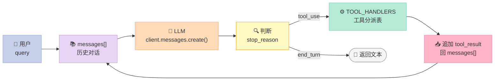
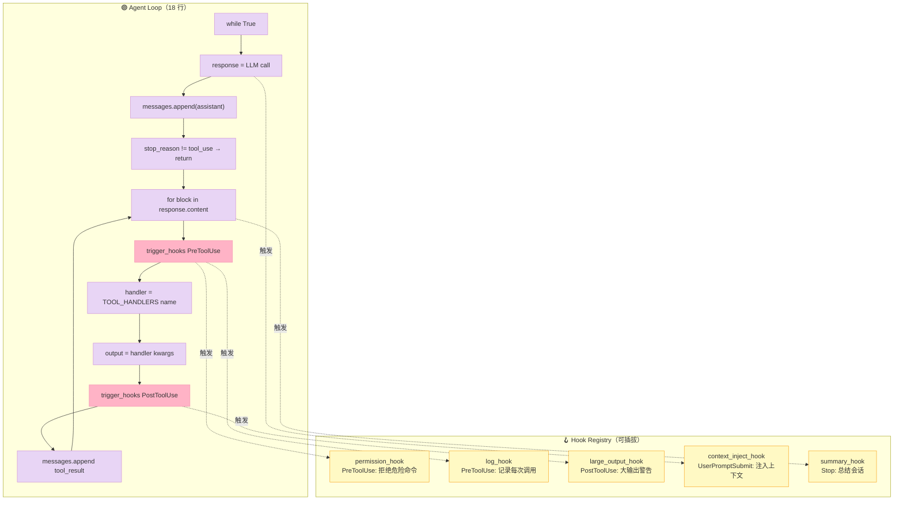
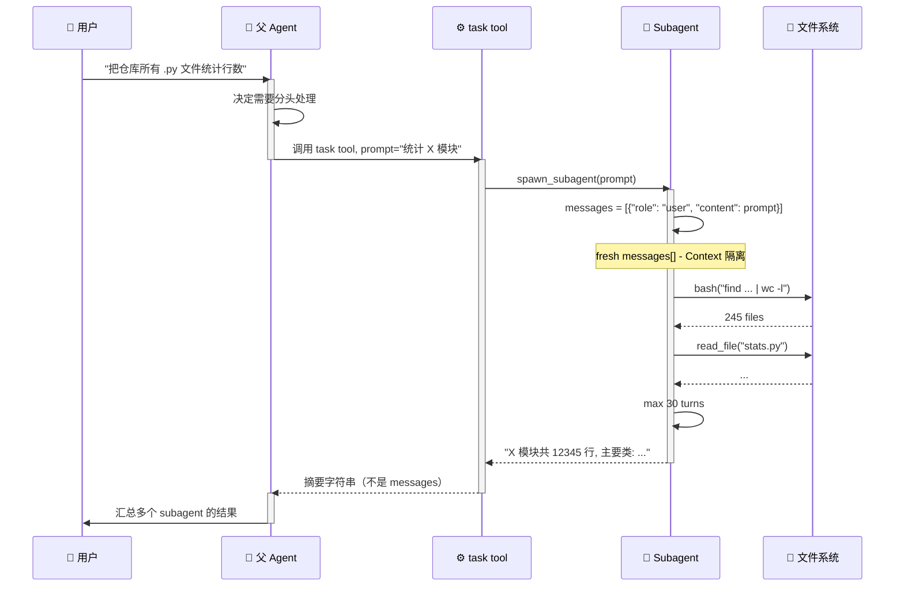
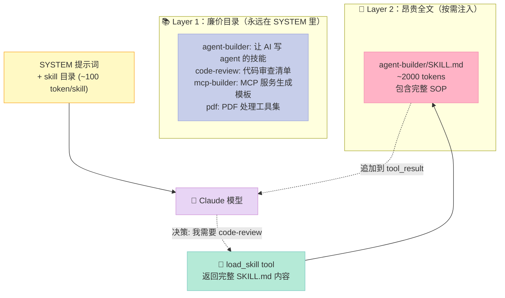
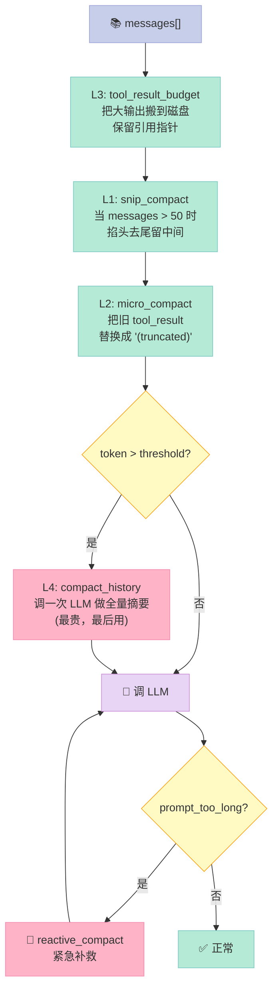
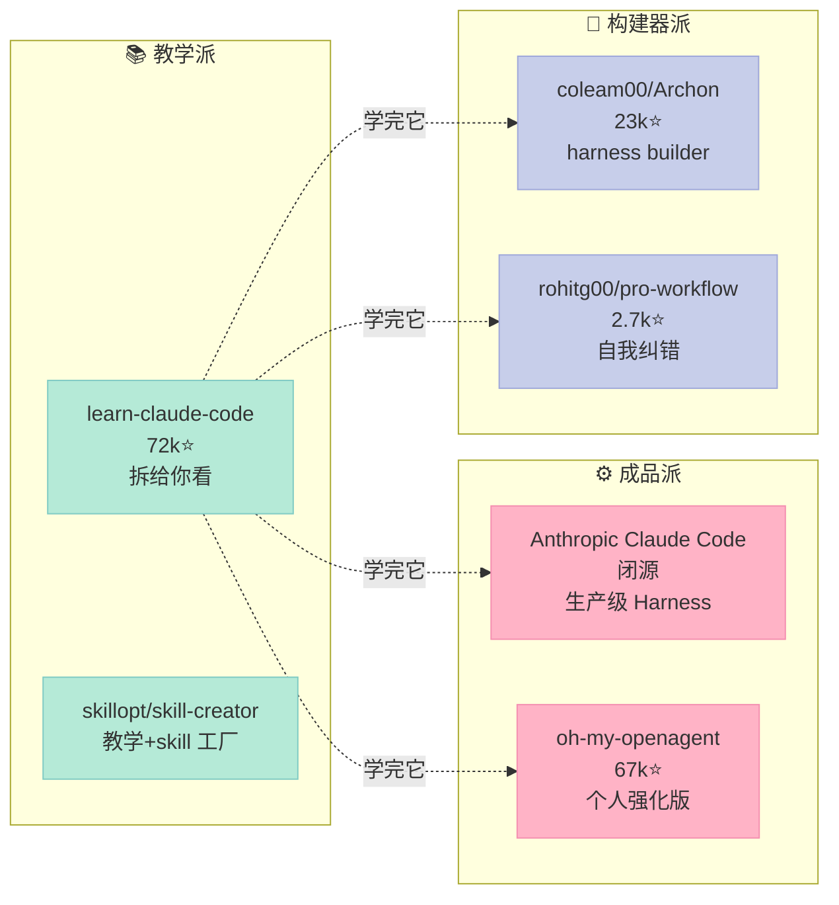

> **Bash is all you need.** 这个仓库用 20 个章节 + 600 行 Python 代码告诉你：Claude Code 那种"会写代码的 Agent"不是一个天才模型，而是一个精心工程化的 Harness。

## 摘要

`shareAI-lab/learn-claude-code` 是一个**从零搭建 Claude Code 风格 Agent Harness 的教学项目**（72,994⭐，2026-07-28 活跃），核心卖点极其反常识：**整个 Claude Code 的核心可以压缩到 18 行代码**——一个 `while True` 循环 + 一个 `client.messages.create()` 调用 + 一个 `TOOL_HANDLERS` 字典。

本篇聚焦三个层面：

1. **最小 Agent 的秘密**：为什么一个 LLM 调用 + Bash 工具就构成"会干活的 Agent"
2. **20 节渐进课的设计哲学**：每一节课只加一个 Harness 机制，loop 本身永远不变
3. **从 s01 到 s20 的递进图谱**：Agent Loop → Tools → Permission → Hooks → Subagent → Skill → Context Compact → Memory → Team → MCP → 全栈组装

与 `claude-code`（Anthropic 闭源）、`code-yeongyu/oh-my-openagent`（67k⭐，个人强化版）、`coleam00/Archon`（23k⭐，harness 构建器）这些"成品 Harness"项目不同，learn-claude-code 的设计哲学是 **"先把车拆给你看，再讲怎么造"**。每一节都能直接 `python code.py` 跑起来，每一行都对应一个 Harness 决策。

项目链接：[shareAI-lab/learn-claude-code](https://github.com/shareAI-lab/learn-claude-code)。调研时 GitHub API 显示 **72,994 Stars**，MIT 协议，最新提交 2026-07-28。

---

## 一、为什么研究"教学 Harness"：从工程视角看 Agent 是怎么组装的

### 1.1 一个反常识的结论

> **Claude Code 90% 的工程价值在 Harness，10% 在 Claude 模型本身。**

这句话对很多人来说都难以置信。Anthropic 的 Claude 模型当然是世界顶级的——但**让 Claude 模型从"会聊天"变成"能稳定交付 PR"的，是那 90% 的 Harness 代码**。包括：

- 让 Claude 知道自己能调什么工具（**Tool Schema**）
- 让 Claude 不会乱删文件（**Permission System**）
- 让 Claude 在出错时知道怎么自纠（**Error Recovery**）
- 让 Claude 不会爆 context（**Context Compaction**）
- 让 Claude 能并行处理多个子任务（**Subagent**）
- 让 Claude 能在不同时刻只加载相关知识（**Skill Loading**）

这些**没有一项是模型自己能做到的**。每一项都是 Harness 工程师一砖一瓦堆出来的。

### 1.2 为什么我们要"拆 Claude Code"

理解 Claude Code 的内部构造不是为了复制它，而是为了搞清楚一个根本问题：

> **如果让你从零写一个 Claude Code，最小可行版本（MVP）需要多少行代码？**

learn-claude-code 给出的答案是：**18 行**。这是 s01_agent_loop/code.py 的整个核心：

```python
def agent_loop(messages: list):
    while True:
        response = client.messages.create(
            model=MODEL, system=SYSTEM, messages=messages,
            tools=TOOLS, max_tokens=8000,
        )
        messages.append({"role": "assistant", "content": response.content})

        if response.stop_reason != "tool_use":
            return

        results = []
        for block in response.content:
            if block.type == "tool_use":
                output = TOOL_HANDLERS[block.name](**block.input)
                results.append({
                    "type": "tool_result",
                    "tool_use_id": block.id,
                    "content": output,
                })
        messages.append({"role": "user", "content": results})
```

是的，**这就是 Claude Code 的全部秘密**：

- 一个 `while True` 循环
- 一个 LLM 调用
- 一个工具分派表（`TOOL_HANDLERS` 字典）
- 一段消息追加逻辑

剩下所有的"花活"——hooks、permission、subagent、context compact、MCP——都是**在这个 18 行骨架上叠加的机制层**，而不是替代它的"魔法"。

### 1.3 一个工程上的关键观察

> **Harness 的所有机制都遵守一个原则："机制和策略分离"——loop 不变，机制叠加。**

什么意思？读 s01-s20 的代码你会发现：**`agent_loop` 这个函数本身从来没变过**。变的是什么？

| 章节 | 加了什么 | loop 变了没？ |
|------|---------|---------------|
| s01 | bash 工具 | 18 行 |
| s02 | 5 个工具 + handlers dispatch | 18 行 |
| s03 | permission 检查（直接嵌进 loop） | 19 行 |
| s04 | hooks 系统（把 permission 抽出 loop） | 18 行（回到 18 行！） |
| s05-s20 | todo/subagent/skill/compact/memory/MCP/teams… | **仍然是 18 行的同构** |

这种"loop 不变"的纪律就是 Harness 工程的核心心法。它带来的好处是：**每个新机制都是可插拔的、可独立测试的、可单独启用的**。这是 pro-workflow（24 hook 总线）和 learn-claude-code（20 节渐进课）殊途同归的设计原则。

---

## 二、整体架构：20 节渐进课的 Harness Maturity Model

### 2.1 Harness 成熟度阶梯

```mermaid
graph TB
    subgraph "🟢 Lv.1 单工具代理"
        S01["s01 Agent Loop<br/>1 个 bash 工具"]
    end

    subgraph "🔵 Lv.2 多工具调度"
        S02["s02 Tool Use<br/>5 工具 + dispatch"]
        S03["s03 Permission<br/>3 道关卡"]
        S04["s04 Hooks<br/>4 类事件总线"]
    end

    subgraph "🟣 Lv.3 复杂任务处理"
        S05["s05 TodoWrite<br/>计划先行"]
        S06["s06 Subagent<br/>Context 隔离"]
        S08["s08 Context Compact<br/>4 层压缩管道"]
    end

    subgraph "🟡 Lv.4 长期记忆 + 恢复"
        S09["s09 Memory<br/>选择/提取/合并"]
        S10["s10 System Prompt<br/>运行时拼装"]
        S11["s11 Error Recovery<br/>重试/换路"]
    end

    subgraph "🍑 Lv.5 长任务 + 后台"
        S12["s12 Task System<br/>DAG 任务图"]
        S13["s13 Background Tasks<br/>慢操作异步化"]
        S14["s14 Cron Scheduler<br/>定时触发"]
    end

    subgraph "🌸 Lv.6 团队协作"
        S15["s15 Agent Teams<br/>持久队友"]
        S16["s16 Team Protocols<br/>JSONL mailbox"]
        S17["s17 Autonomous<br/>自取任务"]
        S18["s18 Worktree<br/>目录隔离"]
    end

    subgraph "💗 Lv.7 扩展 + 组装"
        S07["s07 Skill Loading<br/>按需注入"]
        S19["s19 MCP Plugin<br/>外部能力路由"]
        S20["s20 Comprehensive<br/>全栈组装"]
    end

    S01 ==> S02 ==> S04
    S02 ==> S03 ==> S04
    S04 ==> S05 ==> S06 ==> S08
    S08 ==> S09 ==> S10 ==> S11
    S11 ==> S12 ==> S13 ==> S14
    S14 ==> S15 ==> S16 ==> S17 ==> S18
    S04 -.->|提前| S07
    S11 -.->|穿插| S19
    S18 ==> S19 ==> S20

    style S01 fill:#B5EAD7,stroke:#80CBC4,color:#333
    style S02 fill:#C7CEEA,stroke:#9FA8DA,color:#333
    style S03 fill:#C7CEEA,stroke:#9FA8DA,color:#333
    style S04 fill:#C7CEEA,stroke:#9FA8DA,color:#333
    style S05 fill:#E8D5F5,stroke:#CE93D8,color:#333
    style S06 fill:#E8D5F5,stroke:#CE93D8,color:#333
    style S07 fill:#FFB3C6,stroke:#F48FB1,color:#333
    style S08 fill:#E8D5F5,stroke:#CE93D8,color:#333
    style S09 fill:#FFF9C4,stroke:#F9A825,color:#333
    style S10 fill:#FFF9C4,stroke:#F9A825,color:#333
    style S11 fill:#FFF9C4,stroke:#F9A825,color:#333
    style S12 fill:#FFDAB9,stroke:#FFAB76,color:#333
    style S13 fill:#FFDAB9,stroke:#FFAB76,color:#333
    style S14 fill:#FFDAB9,stroke:#FFAB76,color:#333
    style S15 fill:#F5F5F5,stroke:#9E9E9E,color:#333
    style S16 fill:#F5F5F5,stroke:#9E9E9E,color:#333
    style S17 fill:#F5F5F5,stroke:#9E9E9E,color:#333
    style S18 fill:#F5F5F5,stroke:#9E9E9E,color:#333
    style S19 fill:#FFB3C6,stroke:#F48FB1,color:#333
    style S20 fill:#FFB3C6,stroke:#F48FB1,color:#333
```



### 2.2 每个机制的口号（设计哲学的浓缩）

learn-claude-code 给每一节课都配了一句"机制口号"——这是它最有价值的设计哲学浓缩：

| 章节 | 机制 | 口号（原文） |
|------|------|-------------|
| s01 | Agent Loop | "One loop & Bash is all you need" |
| s02 | Tool Use | "Adding a tool means adding one handler" |
| s03 | Permission | "Set boundaries first, then grant freedom" |
| s04 | Hooks | "Hook around the loop, never rewrite the loop" |
| s05 | TodoWrite | "An agent without a plan drifts" |
| s06 | Subagent | "Big tasks split small, each subtask gets clean context" |
| s07 | Skill Loading | "Load knowledge on demand, not upfront" |
| s08 | Context Compact | "Context always fills up — have a way to make room" |
| s09 | Memory | "Remember what matters, forget what doesn't" |
| s10 | System Prompt | "Prompts are assembled at runtime, not hardcoded" |
| s11 | Error Recovery | "Errors aren't the end, they're the start of a retry" |
| s12 | Task System | "Big goals break into small tasks, ordered, persisted to disk" |
| s13 | Background Tasks | "Slow ops go background, agent keeps thinking" |
| s14 | Cron Scheduler | "Fire on schedule, no human kick needed" |
| s15 | Agent Teams | "Too big for one agent — delegate to teammates" |
| s16 | Team Protocols | "Teammates need shared communication rules" |
| s17 | Autonomous | "Teammates check the board, claim work themselves" |
| s18 | Worktree | "Each works in its own directory, no interference" |
| s19 | MCP | "Not enough capability? Plug in more via MCP" |
| s20 | Comprehensive | "Many mechanisms, one loop" |

**这 20 句口号是 Harness 工程实践的精华**。任何一个做 AI Agent 的工程师都应该把它贴在墙上。我把口号翻译成更直接的中文：

> s01: 一个循环 + 一个工具 = 一个 Agent
> s04: 钩子围在 loop 外面，永远不要重写 loop
> s07: 知识按需加载，绝不预先塞满
> s08: Context 一定会满，要给"腾地方"留一手
> s11: 错误不是终点，是重试的起点
> s17: 不要中央派单，让队友自己看板上抢活

---

## 三、源码深挖：3 个最有 Harness 工程价值的机制

### 3.1 机制一：Agent Loop（s01）—— Harness 的"宪法第一条"



**机制解释**：

- `stop_reason == "tool_use"` 是 Anthropic API 告诉 Harness"我打算调工具"的信号
- Harness 接到信号后**不思考、不决策**，就是执行工具然后把结果塞回去
- Harness 永远不判断"该不该调"——这是 Claude 模型的活
- Harness 永远不判断"调的对不对"——这也是 Claude 模型的活
- Harness 唯一做的事：**执行工具 + 维护消息历史**

这就是 Harness 工程的根本原则：**让模型做决策，让代码做执行**。

### 3.2 机制二：Hooks（s04）——"机制和策略分离"的工程典范

钩子系统是 s04 的核心机制，也是**整个 Harness 工程最有学习价值的部分**。



**对比 s03 和 s04 的关键差异**：

```python
# s03: permission 逻辑直接嵌进 loop
if not check_permission(block):
    continue

# s04: 同样的逻辑搬进 hook
if trigger_hooks("PreToolUse", block):  # hook 返回 truthy = 拦截
    continue
```

**这个改动看似微不足道，但工程意义巨大**：

| 维度 | s03 嵌进 loop | s04 用 hook |
|------|-------------|-------------|
| 加新拦截规则 | 改 loop 函数 | 注册一个新 callback |
| 关闭权限 | 注释掉 if | `HOOKS["PreToolUse"] = []` |
| 测试 | 必须 mock loop | 直接测 callback |
| 复用 | 同一份 loop | 同一份 hook 注册表 |
| Loop 体积 | 每次加机制都变大 | 永远 18 行 |

s04 的 hook 注册表只有 26 行代码，但它定义了 Harness 的整套扩展模型：

```python
HOOKS = {"UserPromptSubmit": [], "PreToolUse": [], "PostToolUse": [], "Stop": []}

def register_hook(event: str, callback):
    HOOKS[event].append(callback)

def trigger_hooks(event: str, *args):
    for callback in HOOKS[event]:
        result = callback(*args)
        if result is not None:  # 返回非 None = 拦截
            return result
    return None
```

**这是 pro-workflow（24 hook 总线）和 Claude Code（30+ hook 类型）的祖先设计**。所有"在 Agent 行为里插入策略"的工业级实现，本质都是这个 26 行的注册表。

### 3.3 机制三：Subagent（s06）——"Context 隔离"的工程实现



**关键代码（spawn_subagent）**：

```python
SUB_SYSTEM = (
    f"You are a coding agent at {WORKDIR}. "
    "Complete the task you were given, then return a concise summary. "
    "Do not delegate further."  # 关键：subagent 不能递归调 task
)

def spawn_subagent(description: str) -> str:
    print(f"\n\033[35m[Subagent spawned]\033[0m")
    messages = [{"role": "user", "content": description}]  # ← fresh messages[]!

    for _ in range(30):  # ← 30 步硬上限
        response = client.messages.create(
            model=MODEL, system=SUB_SYSTEM,
            messages=messages, tools=SUB_TOOLS, max_tokens=8000,
        )
        messages.append({"role": "assistant", "content": response.content})
        if response.stop_reason != "tool_use":
            break
        results = []
        for block in response.content:
            if block.type == "tool_use":
                handler = SUB_HANDLERS.get(block.name)
                output = handler(**block.input) if handler else f"Unknown: {block.name}"
                results.append({"type": "tool_result", "tool_use_id": block.id, "content": output})
        messages.append({"role": "user", "content": results})

    return extract_text(messages[-1]["content"])  # 只回最后一段文字
```

**3 个核心设计决策**：

| 决策 | 作用 | 没有它的后果 |
|------|------|-------------|
| `fresh messages[]` | 子 agent 看不到父 agent 的对话历史 | 父 agent 跑 50 步，子 agent 的 context 也爆 |
| `max 30 turns` | 防止子 agent 死循环把 token 烧光 | 一个跑飞的子 agent 能把账单打到破产 |
| `SUB_TOOLS` 不含 task 工具 | 防止无限递归 | 子 agent 套子 agent，栈溢出 |

这就是 **"Context 隔离"在工程上的具体落地**——不是抽象概念，是 3 行代码：`messages = [...]`、`for _ in range(N)`、`SUB_TOOLS = [...]`。

---

## 四、Skill Loading + Context Compact：按需知识 + 长期 context 的两个支柱

### 4.1 Skill Loading（s07）—— "廉价优先，昂贵按需"



**s07 的核心代码（build_system + load_skill）**：

```python
SKILLS_DIR = WORKDIR / "skills"
SKILL_REGISTRY: dict[str, dict] = {}

def _scan_skills():
    """启动时扫描 skills/ 目录，把 SKILL.md 装进注册表。"""
    if not SKILLS_DIR.exists():
        return
    for d in sorted(SKILLS_DIR.iterdir()):
        if not d.is_dir():
            continue
        manifest = d / "SKILL.md"
        if manifest.exists():
            raw = manifest.read_text()
            meta, body = _parse_frontmatter(raw)
            name = meta.get("name", d.name)
            desc = meta.get("description", raw.split("\n")[0].lstrip("#").strip())
            SKILL_REGISTRY[name] = {"name": name, "description": desc, "content": raw}

def build_system() -> str:
    """启动时把"目录"装进 SYSTEM（仅 name + 1 行 desc）。"""
    catalog = "\n".join(f"- **{s['name']}**: {s['description']}"
                       for s in SKILL_REGISTRY.values())
    return (
        f"You are a coding agent at {WORKDIR}. "
        f"Skills available:\n{catalog}\n"
        "Use load_skill to get full details when needed."
    )

def load_skill(name: str) -> str:
    """运行时按需返回完整 SKILL.md 内容。"""
    skill = SKILL_REGISTRY.get(name)
    if not skill:
        return f"Skill not found: {name}"
    return skill["content"]
```

**两个关键的工程权衡**：

| 维度 | 全量预装 | 目录 + 按需（s07 的选择） |
|------|---------|------------------------|
| 启动 token | 全部 skill × N 千 token | N × 100 token（只有目录） |
| 调用延迟 | 0 | 一次 tool_use + tool_result |
| 模型决策能力 | 0（模型不知道有哪些 skill） | 高（模型能看到全目录，按需取） |
| 适用场景 | skill 数量 < 10 | skill 数量可任意扩展 |

### 4.2 Context Compact（s08）—— 4 层压缩管道



**4 层 + 1 应急的执行顺序**（这是 s08 的核心原则）：

> **便宜先做，昂贵最后做。**

| 层 | 策略 | 成本 | 触发时机 |
|----|------|------|---------|
| **L3** | 大 tool_result 落盘 | $0（纯本地 IO） | 每次 loop 前 |
| **L1** | snip_compact 掐中间 | $0（纯剪裁） | messages 数量 > 50 |
| **L2** | micro_compact 替换占位符 | $0（纯字符串替换） | L1 之后 |
| **L4** | compact_history 全量摘要 | **1 次 LLM 调用** | token 仍超阈值 |
| **reactive** | 应急 compact | 1 次 LLM 调用 | API 返回 prompt_too_long |

**为什么这个顺序关键**：

- L1/L2/L3 是**纯本地计算**，不需要花钱
- L4 是**花钱**的（一次额外 LLM 调用）
- 工业界常见的反模式是**一上来就调 LLM 摘要**，白白烧掉 30% 的 token 预算
- learn-claude-code 把 L3→L1→L2 都跑完了，**token 真的压不下来**才动 L4

这是 Harness 工程的**经济性原则**：能本地解决的就别花 API 钱。

---

## 五、可运行的最小 Harness 复刻（30 行核心代码）

从 s01-s20 中提炼出的"最小可运行 Claude Code"——能直接 `python minimal.py` 跑：

```python
#!/usr/bin/env python3
"""最小可运行的 Claude Code 风格 Harness (30 行核心)."""
import os, subprocess
from pathlib import Path
from anthropic import Anthropic
from dotenv import load_dotenv

load_dotenv()
WORKDIR = Path.cwd()
client = Anthropic()
SYSTEM = f"You are a coding agent at {WORKDIR}. Use bash to solve tasks. Act, don't explain."

TOOLS = [{
    "name": "bash",
    "description": "Run a shell command.",
    "input_schema": {"type": "object",
                     "properties": {"command": {"type": "string"}},
                     "required": ["command"]},
}]

def run_bash(command: str) -> str:
    """Tool handler: 执行 bash 命令。"""
    dangerous = ["rm -rf /", "sudo", "shutdown"]
    if any(d in command for d in dangerous):
        return "Error: Dangerous command blocked"
    r = subprocess.run(command, shell=True, cwd=WORKDIR,
                       capture_output=True, text=True, timeout=120)
    return (r.stdout + r.stderr).strip()[:50000] or "(no output)"

TOOL_HANDLERS = {"bash": run_bash}

def agent_loop(messages: list):
    """Harness 宪法第一条: 一个 while 循环 + LLM + tool dispatch."""
    while True:
        response = client.messages.create(
            model="claude-opus-4-6", system=SYSTEM,
            messages=messages, tools=TOOLS, max_tokens=8000,
        )
        messages.append({"role": "assistant", "content": response.content})

        if response.stop_reason != "tool_use":
            return  # 模型决定结束

        results = []
        for block in response.content:
            if block.type == "tool_use":
                output = TOOL_HANDLERS[block.name](**block.input)
                results.append({"type": "tool_result",
                                "tool_use_id": block.id,
                                "content": output})
        messages.append({"role": "user", "content": results})

if __name__ == "__main__":
    history = []
    while True:
        q = input("\033[36mharness >> \033[0m")
        if q.strip().lower() in ("q", "exit", ""):
            break
        history.append({"role": "user", "content": q})
        agent_loop(history)
```

**30 行代码能做 7 件事**：

1. ✅ 接 Anthropic API
2. ✅ 维护 messages 历史
3. ✅ 检查 `stop_reason` 决定是否继续
4. ✅ 分派 tool call 到 handler
5. ✅ 阻断危险命令（3 行 deny list）
6. ✅ 限制单条输出 50000 字符
7. ✅ shell 命令 120s 超时

**30 行代码做不了的 6 件事**：

1. ❌ 多工具（要扩 TOOLS + TOOL_HANDLERS）
2. ❌ Permission 治理（s03）
3. ❌ Hook 拦截（s04）
4. ❌ 长任务规划（s05）
5. ❌ Subagent（s06）
6. ❌ Context 压缩（s08）

所以 Claude Code 的工程价值就是**从这 30 行出发，逐节叠加剩下的 19 节机制**。

---

## 六、优缺点对比

### 6.1 学习价值 vs 工程深度

| 维度 | 评价 |
|------|------|
| **架构简洁性** | ✅ **极简**。每一节只加一个机制，主 loop 永远不变。教学项目的天花板。 |
| **可读性** | ✅ **极清晰**。每节都有 ASCII 流程图 + "Changes from sXX" 注释 + 增量 diff。 |
| **可运行性** | ✅ **极好**。每个 chapter 都是 `python code.py` 可跑的完整程序。 |
| **扩展性** | ⚠️ 教学项目的天花板。生产用需要补 OAuth、retry、多用户、监控。 |
| **性能** | ⚠️ 未优化。synchronous subprocess.run，串行工具调用，没有批处理。 |
| **维护性** | ✅ 模块化好，但版本切换混乱（legacy 12 课 vs current 20 课）。 |

### 6.2 设计哲学 vs 工程妥协

| 优点 | 缺点 |
|------|------|
| "Loop 不变" 原则是 Harness 工程的黄金法则 | 没有真正的 retry/circuit-breaker |
| Hook 注册表 26 行实现完整扩展模型 | Hook 事件只覆盖 4 类（生产 Claude Code 有 30+） |
| Subagent 30 步限制防止 token 失控 | 没有 priority/queue 调度 |
| Context 4 层管道 = 经济性最优 | L4 用 1 次 LLM 摘要，没用上 structured output |
| 每节都给"机制口号" | 教学简化了 OAuth、workspace isolation、trajectory 收集 |

### 6.3 "做减法的艺术"vs"生产级的复杂度"

> **learn-claude-code 的最大优势是它**显式**告诉你哪些机制是教学简化版**：

从 README 的 "Scope" 章节直接抄过来：

> *"This repository is a 0-to-1 harness engineering learning project: it teaches how to build the working environment around an agent model. To keep the learning path clear, some production mechanisms are intentionally simplified or omitted:*
>
> *- Full event / hook bus behavior, such as PreToolUse, SessionStart/End, and ConfigChange.*
> *- Rule-based permission governance and full trust workflows.*
> *- Session lifecycle controls such as resume/fork, plus more complete worktree lifecycle handling.*
> *- Full MCP runtime details such as transport, OAuth, resource subscription, and polling."*

这种"坦诚告诉读者哪里简化了"的态度，比强行把生产复杂塞进教学项目要诚实得多。

---

## 七、横向对比：5 个 Harness 标杆

### 7.1 5 个项目的定位差异



### 7.2 详细对比表

| 项目 | ⭐ | 定位 | 核心抽象 | 适用场景 |
|------|---|------|---------|---------|
| **learn-claude-code** | 72k | 教学：拆开 Harness | `agent_loop` + `TOOL_HANDLERS` + `HOOKS` | 想理解 Claude Code 原理的工程师 |
| **Claude Code** | 闭源 | 成品：生产 Harness | 30+ hook 类型 + 完整 context compaction | 真实项目开发 |
| **oh-my-openagent** | 67k | 个人强化版 | lazycodex token 优化 + 多模型 fallback | 个人开发者提速 |
| **Archon** | 23k | Harness 构建器 | 把 harness 当 UI builder 用 | 想自定义 harness 的团队 |
| **pro-workflow** | 2.7k | 自我纠错 Harness | 24 事件 Hook 总线 + FTS5 学习库 | 想让 Agent 越用越聪明 |

### 7.3 设计差异的"为什么"

**learn-claude-code vs Claude Code（官方）**：

| 维度 | learn-claude-code | Claude Code |
|------|-------------------|-------------|
| Hook 数量 | 4 类 | 30+ 类 |
| Permission | 3 道关卡（deny/rule/ask） | 完整 trust workflow |
| Session 恢复 | 不支持 | 支持 resume/fork |
| Context 压缩 | 4 层 + 应急 | 含 structured summary + file-based memory |
| 教学态度 | 主动声明简化 | 不开源 |

**结论**：learn-claude-code 是**概念验证版**，Claude Code 是**工程强化版**。学概念用前者，跑生产用后者。

**learn-claude-code vs pro-workflow**：

| 维度 | learn-claude-code | pro-workflow |
|------|-------------------|--------------|
| 哲学 | "机制叠加，loop 不变" | "自我纠错，loop 进化" |
| Hook 覆盖 | 4 类基础 | 24 类（含 FileChanged/WorktreeCreate） |
| 持久化 | 全程 in-memory | FTS5 + SQLite 触发器 |
| Skill 加载 | 启动时扫目录 | 运行时 reflect + apply patch |
| 教学价值 | 极高 | 中（生产味浓） |

**结论**：两个项目**不是竞争而是接力**。先看 learn-claude-code 学"骨架怎么搭"，再看 pro-workflow 学"怎么让骨架长出新肉"。

---

## 八、设计哲学：3 条贯穿始终的工程原则

### 8.1 原则一：Loop 不变原则

> **不要因为加了新机制就修改 agent_loop 函数本身。**

这是 s01-s20 全文最震撼的设计纪律。从 s01 到 s20，**`agent_loop` 函数始终保持 18 行的同构骨架**：

```python
def agent_loop(messages):
    while True:
        response = client.messages.create(...)
        messages.append({"role": "assistant", ...})
        if response.stop_reason != "tool_use":
            return
        # 这里插入机制，但骨架不变
        for block in response.content:
            ...
        messages.append({"role": "user", ...})
```

**为什么这个原则重要**？

- 如果 loop 经常变，每加一个机制都要重新测试整个流程
- 如果 loop 不变，所有机制都是**可插拔**的——想关掉 permission 就 `HOOKS["PreToolUse"] = []`，想关掉 subagent 就从 `TOOLS` 里删 `task`
- 这就是 Unix 哲学的"做一件事做好"——loop 就做 loop 一件事，所有其他事都是它周围的装饰

### 8.2 原则二：机制和策略分离

> **机制 = 数据结构和算法骨架（写在主代码里），策略 = 业务决策（写在配置文件或 hook 里）。**

举 3 个例子：

| 机制（写死） | 策略（可配置） |
|------------|---------------|
| `HOOKS` 注册表 | 每个 hook 是哪个 callback |
| `TOOLS` schema 列表 | 每个 tool 的 description 怎么写 |
| `PERMISSION_DENY_LIST = ["rm -rf /", ...]` | deny list 加什么词 |

这条原则让 Harness 的**核心骨架（loop + 机制）稳定**，但**业务行为（策略）随时可改**。这和 Kubernetes 的 "control plane vs data plane"、Linux kernel 的 "VFS vs filesystem driver" 是同一类思想。

### 8.3 原则三：机制和代价的对称

> **每个 Harness 机制都应该有个对应的"代价"，工程师必须清楚**。

| 机制 | 代价 |
|------|------|
| Subagent | 多花一次 LLM 调用的延迟 + 中间 context 不可见 |
| Skill Loading | 多一次 tool_use + tool_result 的往返 |
| Context Compact L4 | 1 次额外的 LLM 调用（$0.01-0.1/次） |
| Background Tasks | 多一个线程 + 同步复杂度 |
| Team Protocols | JSONL mailbox 的 IO 延迟 + 调试复杂 |

s20 把这些代价全部叠加到一起时，**single agent 的可预测性就消失了**。这是为什么**生产 Harness 倾向于"机制叠加但用配置文件启用"**——而不是全开。

---

## 九、从零搭建启示：MVP 路线图

### 9.1 一个周末能跑起来的最小 Harness

如果让我从零搭一个 Claude Code 风格的 Harness，**最小可行版本（MVP）的路线图**是：

#### Day 1 上午：s01 + s02（2 小时）

```python
# 1. 复制 s01 的 18 行 agent_loop
# 2. 扩 TOOLS 到 5 个（bash/read/write/edit/glob）
# 3. 跑通一个真实任务：让 Claude 自动 grep 你的项目并修复 TODO
```

#### Day 1 下午：s03 + s04（3 小时）

```python
# 1. 加 3 道 permission 关卡（deny/rule/ask）
# 2. 抽出来变成 hook 系统
# 3. 加 log_hook 验证 hook 真的拦截了危险命令
```

#### Day 2 上午：s05 + s06（3 小时）

```python
# 1. 加 todo_write 工具（让模型先列计划再执行）
# 2. 加 task 工具（spawn subagent，30 步限制）
# 3. 跑通：让父 agent 调子 agent 统计代码行数
```

#### Day 2 下午：s07 + s08（4 小时）

```python
# 1. 加 skill 目录扫描（启动时建 registry）
# 2. 加 load_skill tool
# 3. 加 4 层 compact 管道（最简版只做 L1 snip + L4 summary）
```

#### Day 3：可选扩展（s09-s19 任选）

| 想做什么 | 看哪节 |
|---------|-------|
| 跨会话记忆 | s09 Memory |
| 系统提示动态拼装 | s10 System Prompt |
| 错误重试 | s11 Error Recovery |
| 任务依赖图 | s12 Task System |
| 后台任务 | s13 Background Tasks |
| 定时任务 | s14 Cron |
| 多 Agent 团队 | s15-s18 Teams |
| 接外部 MCP | s19 MCP Plugin |

### 9.2 哪些组件是必须的，哪些可以省

| 组件 | 必须度 | 原因 |
|------|-------|------|
| Agent Loop | ⭐⭐⭐⭐⭐ | 没有它就不叫 Agent |
| Tool Dispatch | ⭐⭐⭐⭐⭐ | 没有工具 = 只能聊天 |
| Permission | ⭐⭐⭐⭐ | 不加 Permission 的 Agent = 危险玩具 |
| Hooks | ⭐⭐⭐⭐ | 没有 Hooks = 没法扩展（被锁死） |
| TodoWrite | ⭐⭐⭐ | 模型有"自我计划"能力但不可靠 |
| Subagent | ⭐⭐⭐ | Context 隔离很重要但 MVP 可省 |
| Skill Loading | ⭐⭐⭐ | 加 skill 后 token 利用率显著提升 |
| Context Compact | ⭐⭐⭐⭐⭐ | 不加 = 长任务必爆 context |
| Memory | ⭐⭐ | 单会话内不需要 |
| Task System | ⭐⭐ | 单 agent 不需要 |
| Teams | ⭐ | 99% 的场景不需要 |

**最简 MVP = s01 + s02 + s03 + s08，4 节足矣**。

### 9.3 踩坑预警（集成时会遇到的问题）

| 坑 | 症状 | 解决 |
|---|------|------|
| 模型调不存在的工具 | `KeyError: TOOL_HANDLERS[name]` | `TOOL_HANDLERS.get(name, lambda **kw: f"Unknown: {name}")` |
| Permission 拦截后模型不知道 | 模型继续尝试同一条命令 | 在 tool_result 里返回清晰的"Permission denied by X" |
| Subagent 跑飞不返回 | 子 agent 卡在死循环 | 30 步限制 + 监控 fallback |
| Context 压缩丢关键信息 | 压缩后模型忘了之前的文件路径 | 在 summary 里强制保留文件路径列表 |
| Hook 注册顺序影响行为 | log_hook 在 permission 之后 = 看不到被拦截的命令 | 让 permission_hook 在前，log_hook 在后 |
| MCP 工具没清理 | MCP server 挂了 tools 还在 | 启动时 sanity check + 失败工具自动剔除 |

---

## 十、给 Harness 工程师的 5 条建议

**第一条：先把 18 行 agent_loop 写出来跑通。**

不要直接上 LangChain / CrewAI / AutoGen 这些框架。把 s01 的 18 行抄过来，自己跑通 1 次"让 Claude 用 bash 跑 ls"。你会瞬间理解 Harness 工程的本质——**它是简单的，复杂的是策略**。

**第二条：loop 不变原则比看起来更重要。**

如果你发现自己要改 `agent_loop` 函数本身才能加新机制，停下来想想：能不能用 hook？能不能用 tool？能不能用 subagent？**90% 的情况下能**。

**第三条：Permission 必须在 Day 1 就加。**

s03 之前不要让 Agent 跑在真实仓库上。3 道 deny list + 路径校验 + 用户确认，不到 30 行代码，能挡住 80% 的灾难。

**第四条：Context Compact 是 Harness 的"经济命脉"。**

不加 L3 tool_result 落盘，**一个 5 步 read_file 大文件就能把 context 撑爆**。把这个机制当成基础设施，而不是优化项。

**第五条：教学项目 + 自我纠错项目 一起看。**

- learn-claude-code 教你**怎么搭骨架**（loop + tools + hooks）
- pro-workflow 教你**怎么让骨架长出新肉**（自我纠错 + Skill 闭环）
- 这两个项目加起来 = Claude Code 80% 的实现路径

---

## 总结

learn-claude-code 不是"另一个 Claude Code 克隆"，而是一本**用代码写的 Harness 工程教科书**。

它最有价值的不是 72k Star，也不是 20 节渐进课的完整性，而是它**明确告诉你三件事**：

1. **Harness 的核心是 18 行循环 + 一个工具分派表**——不是几百个 Python 类
2. **所有 Harness 机制都遵守"loop 不变"原则**——这是 Harness 工程的心法
3. **坦诚告诉你哪里简化了**——它主动声明哪些是教学版、哪些需要升级到生产版

读完这 20 节，你不一定能复刻 Claude Code，但你一定能**用 30 行 Python 写出一个能跑、能扩展、能扩展到中等复杂度的 Agent Harness**——这是任何 LangChain/AutoGen 教程都给不出来的核心能力。

**下一步行动建议**：

1. **如果你没读过 s01-s20**：从 `s01_agent_loop/code.py` 开始，1 小时跑通它
2. **如果你想加自定义机制**：按 s04 的 hook 模式扩展，注册一个 callback 就够了
3. **如果你想做生产 Harness**：把 learn-claude-code + pro-workflow 一起读，对照着搭
4. **如果你在做教学**：把 20 句"机制口号"翻译成你团队的工程原则

> **Bash is all you need. 一个 loop is all you need. 一个 TOOL_HANDLERS dict is all you need.**
> **剩下的所有"复杂"——hooks, subagents, skills, compaction——都是在这个简单之上的层层机制叠加。**
> **Build the harness well. The model will do the rest.**

---

## 附录：项目核心数据

| 项 | 值 |
|----|---|
| 项目名 | learn-claude-code |
| 仓库 | `shareAI-lab/learn-claude-code` |
| Stars | 72,994 ⭐ |
| 协议 | MIT |
| 最新提交 | 2026-07-28 |
| 章节数 | 20 节（s01-s20） |
| 每节核心代码量 | 100-300 行 |
| 核心抽象 | `agent_loop` + `TOOL_HANDLERS` + `HOOKS` + `SUB_TOOLS` |
| 教学语言 | Python 3.10+ |
| 依赖 | anthropic, python-dotenv, pyyaml |
| 文档语言 | 英文 + 中文 + 日文 |

### 关键源码路径

| 章节 | 文件 |
|------|------|
| s01 | `s01_agent_loop/code.py`（18 行 agent_loop） |
| s02 | `s02_tool_use/code.py`（5 工具 + dispatch） |
| s03 | `s03_permission/code.py`（3 道 permission 关卡） |
| s04 | `s04_hooks/code.py`（hooks 注册表 + 4 类事件） |
| s06 | `s06_subagent/code.py`（spawn_subagent + 30 步限制） |
| s07 | `s07_skill_loading/code.py`（skill 注册 + load_skill） |
| s08 | `s08_context_compact/code.py`（4 层 compact 管道） |
| s20 | `s20_comprehensive/code.py`（全栈组装） |

### 横向对比项目

| 项目 | 链接 | ⭐ |
|------|------|---|
| Claude Code | https://www.claude.com/product/claude-code | 闭源 |
| oh-my-openagent | https://github.com/code-yeongyu/oh-my-openagent | 67k |
| Archon | https://github.com/coleam00/Archon | 23k |
| pro-workflow | https://github.com/rohitg00/pro-workflow | 2.7k |