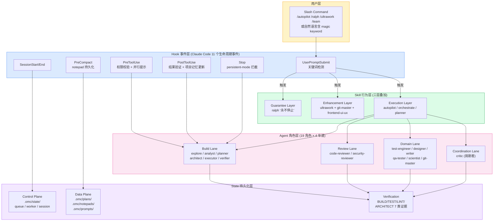
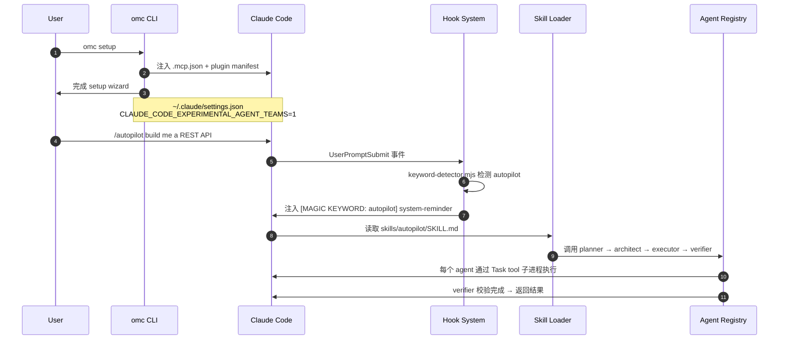
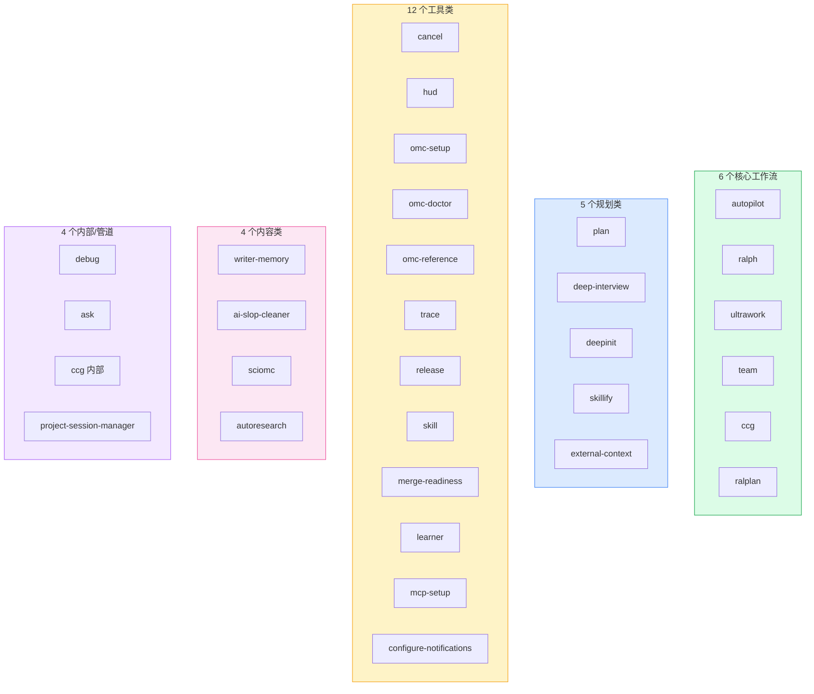
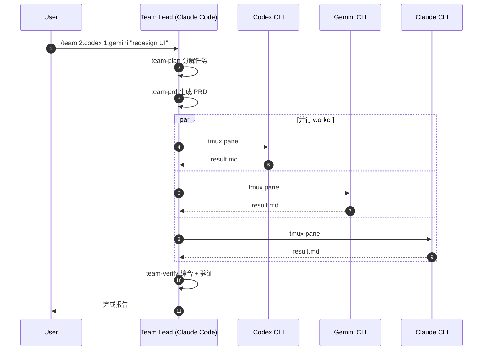

# 【oh-my-claudecode】核心架构与设计原理深度解析

## 一、引子：当 Claude Code 遇上 19 个 Agent

2026 年 8 月，GitHub 上一个名为 `Yeachan-Heo/oh-my-claudecode`（简称 OMC）的项目以 **38k+ ⭐** 的速度冲到了 Claude Code 生态的前列。它的口号只有一句话：

> **Don't learn Claude Code. Just use OMC.**

OMC 是一个**为 Claude Code 量身打造的多智能体编排层**。它做的事情看似简单 —— 让一个 Claude Code 会话里能**同时调度 19 个角色化的 Agent**，并把它们的能力通过 **31 个 Skill**、**11 个生命周期 Hook**、**5 阶段团队流水线**有机串联起来。

但深入源码后你会发现：OMC 不是一个简单的"prompt 模板包"，而是一套**完整的运行时编排引擎**：

- **零依赖学习曲线**：`/setup` → `/autopilot "build me a todo app"` 三步即可
- **多语言魔法关键词**：`autopilot` / `ralph` / `ultrawork` / `ralplan` 在 7 种语言（中/英/日/韩/西/越/葡）下都触发
- **Agent × Skill × Hook 三轴正交**：Agent 决定"谁来做"，Skill 决定"怎么做"，Hook 决定"什么时候做"
- **证据驱动的验证闭环**：BUILD/TEST/LINT/FUNCTIONALITY/ARCHITECT/TODO/ERROR_FREE 七类检查必须 5 分钟内有新鲜证据
- **State 控制面 vs Data 数据面分离**：调度元数据 vs 持久化工件用目录分层，避免状态文件膨胀

本文将带你从架构图、源码、设计哲学三个层面深入 OMC，剖析它为什么能在 Claude Code 这个已经卷得不能再卷的赛道上**短短数月冲到 ⭐38k**。

> **本文不是 OMC 的使用教程**，而是架构层面的深度解析。所有引用代码均来自仓库 `Yeachan-Heo/oh-my-claudecode` 主分支（v4.15.7，pushed 2026-08-02）。

---

## 二、项目定位与核心价值

### 2.1 一句话定义

**oh-my-claudecode (OMC)** 是一个**基于 Claude Code 11 个生命周期事件 Hook 的多智能体编排引擎**，通过 Agent（角色）+ Skill（行为）+ State（持久化）三轴正交抽象，让 Claude Code 从"单兵作战"升级为"团队协同"。

### 2.2 仓库统计

| 指标 | 数值 |
|------|------|
| ⭐ Stars | 38,265 |
| License | MIT |
| 主语言 | TypeScript (ESM) |
| 代码规模 | 72 MB（含 1176 个 src/ 文件 + 19 个 agent prompts + 83 个 skill 文件 + 40 个 docs） |
| npm 包名 | `oh-my-claude-sisyphus` (v4.15.7) |
| 主要 CLI | `omc`、`oh-my-claudecode`、`omc-cli` |
| 最近推送 | 2026-08-02 |
| 核心依赖 | `@anthropic-ai/claude-agent-sdk`、`@modelcontextprotocol/sdk`、`better-sqlite3`、`ajv`、`zod`、`chalk`、`commander` |
| Node 要求 | >= 20.0.0 |

### 2.3 能力矩阵

| 能力 | 实现路径 |
|------|----------|
| 多 Agent 并行 | Task 工具 + `spawn_agent`，最多 6 并发 |
| 多 Provider 协作 | Codex / Gemini / Antigravity / Claude 跨 CLI tmux 调度 |
| 持久化记忆 | `.omc/state/**`（控制面）+ `.omc/plans/**`（数据面）分离 |
| 上下文压缩保护 | `PreCompact` Hook → notepad.md 持久化 |
| 魔法关键词触发 | 1800+ 行 `keyword-detector.mjs` + 7 语言正则 |
| 自动验证闭环 | verifier agent + 7 类证据检查 |
| 团队流水线 | team-plan→team-prd→team-exec→team-verify→team-fix 五阶段 |
| 模型分层路由 | haiku / sonnet / opus 三级，OMG 自动按 agent 角色分配 |
| 持久循环 | ralph/ralplan 共识规划 + persistent-mode Stop 拦截 |
| 跨 CLI 桥接 | `omc team N:codex` 启动 tmux pane |

### 2.4 同生态位对比

OMC 与同家族的 oh-my-openagent（2026-07-13 已写过）、oh-my-codex（OMC 作者的姊妹项目）形成"三件套"：

| 项目 | 面向 | 触发机制 | 核心抽象 |
|------|------|----------|----------|
| **oh-my-openagent** | OpenCode | YAML workflow + Token 优化 | Hashline 编辑协议 |
| **oh-my-claudecode** | Claude Code | Magic keyword + Slash command | Hook + Skill + Agent 三轴 |
| **oh-my-codex** | OpenAI Codex CLI | CLI 适配层 | 同样的编排哲学 + Codex 模型 |

三者在"魔法关键词 → 工作流激活"的核心模式上一脉相承，但 OMC 把"插件化 Claude Code"做到了极致。

---

## 三、整体架构：四层抽象与数据流

### 3.1 顶层架构图



**核心数据流**：

```
User Input
   │
   ▼
UserPromptSubmit Hook  ──→  关键词检测 (multi-lang)
   │
   ▼
Magic Keyword 命中  ──→  Skill 注入 (三层叠加)
   │
   ▼
Skill 调起 Agent  ──→  Agent 按角色路由到模型 (haiku/sonnet/opus)
   │
   ▼
Agent 执行  ──→  PreToolUse 拦截  ──→  PostToolUse 验证
   │
   ▼
完成时  ──→  verifier 检查 7 类证据  ──→  persistent-mode 决定是否停止
   │
   ▼
PreCompact 时  ──→  notepad.md 持久化
```

### 3.2 npm 包结构（src/ 与 dist/）

OMC 是一个**纯 TypeScript ESM 包**，主入口 `dist/index.js`。`package.json` 的 `files` 字段声明了 14 类发布资产：

```jsonc
// 来自 package.json:43-59
{
  "files": [
    "dist",            // 编译产物
    "agents",          // 19 个角色 prompt (.md)
    "bin",             // oh-my-claudecode / omc
    "bridge",          // MCP server + team bridge + claude-md-coordinator
    "commands",        // Claude Code slash command
    "hooks",           // 11 个 lifecycle hook 实现
    "scripts",         // keyword-detector.mjs 等 50+ 脚本
    "skills",          // 31 个 skill (含 SKILL.md + lib/)
    "templates",       // CLAUDE.md / AGENTS.md 模板
    "docs",            // ARCHITECTURE.md / REFERENCE.md / MIGRATION.md
    ".claude-plugin",  // Claude Code 插件清单
    ".mcp.json",       // MCP server 配置
    "README.md",
    "LICENSE"
  ]
}
```

这种**把 plugin + runtime + library 三种使用方式合并到一个 npm 包**的策略，是 OMC "零学习曲线"承诺的工程基础 —— 用户可以走 plugin 路线（最简单）、CLI 路线（最灵活）、SDK 路线（最深度）。

### 3.3 启动与初始化流程



---

## 四、Agent 系统：19 角色 × 4 车道 × 3 模型层级

### 4.1 4 个车道设计

OMC 把 19 个 Agent 分到 4 条**车道（Lane）**，每条车道对应一种工作场景：

| 车道 | Agent 数 | 代表角色 | 工作场景 |
|------|----------|----------|----------|
| **Build / Analysis** | 8 | explore / analyst / planner / architect / debugger / executor / verifier / tracer | 从探索到验证的完整开发周期 |
| **Review** | 2 | code-reviewer / security-reviewer | 交接前的质量门 |
| **Domain** | 8 | test-engineer / designer / writer / qa-tester / scientist / git-master / document-specialist / code-simplifier | 领域专家，按需调起 |
| **Coordination** | 1 | critic | 挑战其他 agent 的方案 |

### 4.2 典型 Agent 工作流

```
explore → analyst → planner → critic → executor → verifier
 (发现)    (分析)    (排序)   (挑战)   (实施)    (验证)
```

**为什么需要 critic 这一关？** —— OMC 的设计哲学是"plan passes only when no gaps can be found"。critic agent 用 opus 模型做"多角度挑刺"，覆盖规划盲区。

### 4.3 Agent 定义代码（核心片段）

每个 Agent 是一个 `AgentConfig` 对象，由 `agents/*.md` 文件动态加载：

```typescript
// 来自 src/agents/definitions.ts:55-65
export const debuggerAgent: AgentConfig = {
  name: 'debugger',
  description: 'Root-cause analysis, regression isolation, failure diagnosis (Sonnet).',
  prompt: loadAgentPrompt('debugger'),  // 从 agents/debugger.md 加载
  model: 'sonnet',
  defaultModel: 'sonnet'
};

export const verifierAgent: AgentConfig = {
  name: 'verifier',
  description: 'Completion evidence, claim validation, test adequacy (Sonnet).',
  prompt: loadAgentPrompt('verifier'),
  model: 'sonnet',
  defaultModel: 'sonnet'
};

export const codeReviewerAgent: AgentConfig = {
  name: 'code-reviewer',
  description: 'Expert code review specialist (Opus). Use for comprehensive code quality review.',
  prompt: loadAgentPrompt('code-reviewer'),
  model: 'opus',
  defaultModel: 'opus'
};
```

### 4.4 模型三级路由

| 层级 | 模型 | 特征 | 典型 Agent |
|------|------|------|-----------|
| LOW | haiku | 快且便宜 | explore、writer |
| MEDIUM | sonnet | 性价比 | executor、debugger、test-engineer |
| HIGH | opus | 顶级推理 | architect、planner、critic、code-reviewer |

**关键洞察**：模型不是按"任务大小"分配，而是按"任务出错成本"分配。架构错误（opus）成本 > 实现错误（sonnet）成本 > 简单查找（haiku）成本。

### 4.5 Agent 角色边界（Do vs Don't）

OMC 显式建模了**角色越权边界**，每个 Agent 的 prompt 里都有 `<Constraints>` 段：

```markdown
<!-- 来自 agents/architect.md -->
**Do**: Code analysis, debugging, verification
**Don't**: Requirements gathering, planning
```

这种"角色宪法"机制避免了 LLM Agent 常见的"scope creep"（越权扩张）问题。

---

## 五、Skill 系统：三层叠加的"行为注入器"

### 5.1 核心设计哲学

Skill 不是"切换 Agent"，而是"在 Agent 之上注入行为"。一个 Skill 可以修改所有 Agent 的工作方式。

### 5.2 Skill 三层叠加模型

```
┌─────────────────────────────────────────────────────────────┐
│  GUARANTEE LAYER (optional)                                  │
│  ralph: "Cannot stop until verified done"                   │
└─────────────────────────────────────────────────────────────┘
                              │
                              ▼
┌─────────────────────────────────────────────────────────────┐
│  ENHANCEMENT LAYER (0-N skills)                              │
│  ultrawork (parallel) | git-master (commits) | frontend-ui-ux│
└─────────────────────────────────────────────────────────────┘
                              │
                              ▼
┌─────────────────────────────────────────────────────────────┐
│  EXECUTION LAYER (primary skill)                             │
│  default (build) | orchestrate (coordinate) | planner (plan) │
└─────────────────────────────────────────────────────────────┘
```

**叠加公式**：`[Execution Skill] + [0-N Enhancements] + [Optional Guarantee]`

例：用户说 `ultrawork: refactor API with proper commits`，激活的 Skill 组合是：
- **Execution**: default（基础构建模式）
- **Enhancement**: ultrawork（并行）+ git-master（提交策略）
- **Guarantee**: 无

### 5.3 核心工作流 Skill 详解

| Skill | 触发器 | 工作模式 | 终止条件 |
|-------|--------|----------|----------|
| **autopilot** | `autopilot` / `build me` | 5 阶段全自动 pipeline | 完成代码 + 验证通过 |
| **ralph** | `ralph` / `don't stop` | 永动循环 | verifier 确认完成 |
| **ultrawork** | `ultrawork` / `ulw` / `uw` | 最大并行（多 agent 同时） | 全部子任务完成 |
| **team** | `/team N:agent-type` | 5 阶段团队流水线 | terminal state (complete/failed/cancelled) |
| **ccg** | `ccg` / `claude-codex-gemini` | 跨 Provider fan-out | Claude 综合完成 |
| **ralplan** | `ralplan` | planner+architect+critic 共识循环 | 三者达成一致 |
| **deep-interview** | `interview` / `deep interview` | 苏格拉底式访谈 | 模糊度门控通过 |

### 5.4 Skill 启动代码（关键片段）

```typescript
// 来自 src/features/magic-keywords.ts:60-72
const ultraworkEnhancement: MagicKeyword = {
  triggers: ['ultrawork', 'ulw', 'uw'],
  description: 'Activates maximum performance mode with parallel agent orchestration',
  action: (prompt: string, agentName?: string, modelId?: string) => {
    // 移除触发词后注入增强指令
    const cleanPrompt = removeTriggerWords(prompt, ['ultrawork', 'ulw', 'uw']);
    return getUltraworkMessage(agentName, modelId) + cleanPrompt;
  }
};
```

### 5.5 31 个 Skill 全景



---

## 六、Hook 系统：11 个生命周期事件编排

### 6.1 Claude Code 11 个 Hook 时机

OMC 在 Claude Code 全部 11 个生命周期事件上注册 Hook，每个事件一个明确的语义：

| 事件 | 触发时机 | OMC 用途 |
|------|----------|----------|
| `UserPromptSubmit` | 用户提交 prompt | 魔法关键词检测 + Skill 注入 |
| `SessionStart` | 会话开始 | 初始 setup + 项目记忆加载 |
| `PreToolUse` | 工具调用前 | 权限校验 + 并行执行提示 |
| `PermissionRequest` | 权限请求 | Bash 命令权限处理 |
| `PostToolUse` | 工具调用后 | 结果验证 + 项目记忆更新 |
| `PostToolUseFailure` | 工具失败后 | 错误恢复处理 |
| `SubagentStart` | 子 agent 启动 | Agent 跟踪 |
| `SubagentStop` | 子 agent 停止 | Agent 跟踪 + 输出验证 |
| `PreCompact` | 上下文压缩前 | 关键信息持久化 |
| `Stop` | Claude 即将停止 | persistent-mode 强制执行 + 代码简化 |
| `SessionEnd` | 会话结束 | 会话数据清理 |

### 6.2 Hook 注册结构（hooks.json）

```json
// 来自 docs/ARCHITECTURE.md
{
  "UserPromptSubmit": [
    {
      "matcher": "*",
      "hooks": [
        {
          "type": "command",
          "command": "node scripts/keyword-detector.mjs",
          "timeout": 5
        }
      ]
    }
  ]
}
```

**结构三要素**：
- `matcher`: 模式匹配（`*` 匹配所有输入）
- `timeout`: 超时秒数（防止 hook 挂死会话）
- `type`: 固定 `"command"`（执行外部命令）

### 6.3 system-reminder 注入模式

Hook 通过 `<system-reminder>` 标签向 Claude 注入上下文：

```xml
<system-reminder>
hook success: Success
</system-reminder>
```

**4 种注入语义**：

| 模式 | 含义 |
|------|------|
| `hook success: Success` | Hook 正常执行，按计划继续 |
| `hook additional context: ...` | 附加上下文，注意采纳 |
| `[MAGIC KEYWORD: ...]` | 魔法关键词命中，执行对应 skill |
| `The boulder never stops` | ralph/ultrawork 模式激活 |

### 6.4 关键 Hook 详解

**① keyword-detector** —— `UserPromptSubmit` 触发，1800+ 行 Node.js 脚本，多语言正则匹配。

**② persistent-mode** —— `Stop` 触发。当 ralph/ultrawork 模式激活时，**拦截 Claude 的停止请求**，强制继续工作直到 verifier 确认完成。

**③ pre-compact** —— `PreCompact` 触发。在上下文压缩前，把关键信息写入 `.omc/notepad.md`，压缩后再注回 context。

**④ subagent-tracker** —— `SubagentStart`/`SubagentStop` 触发。跟踪当前运行的 agent，stop 时验证输出。

**⑤ context-guard-stop** —— `Stop` 触发。监控 context 使用量，接近上限时警告。

**⑥ code-simplifier** —— `Stop` 触发（默认禁用）。启用后，Claude 停止时自动简化刚改过的文件。

### 6.5 Hook 禁用机制

```bash
# 全局禁用
export DISABLE_OMC=1

# 跳过特定 Hook（逗号分隔）
export OMC_SKIP_HOOKS="keyword-detector,persistent-mode"
```

这是 OMC "零侵入"的工程体现 —— 用户可以渐进式启用，逐步接受 Hook 行为。

---

## 七、State 系统：控制面 vs 数据面分离

### 7.1 .omc/ 目录结构

```
.omc/
├── state/                    # 控制面：Per-mode state 文件
│   ├── autopilot-state.json
│   ├── ralph-state.json
│   ├── team/                 # team task state
│   ├── interop/              # 跨工具 task/message envelopes
│   └── sessions/             # per-session state
│       └── {sessionId}/
├── notepad.md                # 压缩抗性备忘录
├── project-memory.json       # 项目知识存储
├── plans/                    # 数据面：执行计划
├── notepads/                 # 数据面：per-plan 知识捕获
│   └── {plan-name}/
│       ├── learnings.md
│       ├── decisions.md
│       ├── issues.md
│       └── problems.md
├── prompts/                  # 数据面：prompt/response 持久化
├── autopilot/                # 数据面：autopilot 工件
│   └── spec.md
├── research/                 # 数据面：研究结果
└── logs/                     # 数据面：执行日志
```

### 7.2 Control Plane vs Data Plane 哲学

OMC 把**调度元数据**和**持久化工件**做了清晰的目录分层：

| 维度 | 控制面 (Control Plane) | 数据面 (Data Plane) |
|------|----------------------|--------------------|
| **位置** | `.omc/state/**` | `.omc/plans/**`、`.omc/notepads/**`、`.omc/prompts/**` |
| **内容** | 队列状态、worker 分配、session state、跨工具 message envelopes | 计划、规格、prompt、结果、追踪 |
| **大小** | 通常小（KB 级） | 可能很大（MB 级） |
| **读取频率** | 高频（每次调度决策） | 低频（按需） |
| **生命周期** | 与 worker/session 同寿命 | 长期持久 |

**设计价值**：调度器保持小巧，状态检查快速；富工件独立存储，可检视、可审计、可清理。

### 7.3 Artifact Descriptors：有界交接协议

当一个 handoff 需要引用大工件时，OMC 不用"把内容塞进 state"，而是用**描述符（Descriptor）**指代：

```typescript
// 来自 docs/ARCHITECTURE.md
interface ArtifactDescriptor {
  kind: string;            // 工件类别 (plan / prompt / result / trace)
  path: string;            // 持久化路径
  contentHash?: string;    // 可选完整性校验
  createdAt: string;       // 创建时间
  producer: string;        // 拥有方（tool/skill/worker）
  sizeBytes?: number;      // 可选大小（阈值决策）
  retention: string;       // 生命周期清理策略
  expiresAt?: string;      // 可选过期时间
}
```

**有界交接三规则**：
1. 小负载 inline（站点阈值允许时）
2. 超阈值时切换为 descriptor + 简短可读摘要
3. descriptor 保留 ownership/retention 元数据，方便后续清理和审计

### 7.4 Notepad：抗压缩记忆

`.omc/notepad.md` 是一个**穿越上下文压缩的备忘录**：

```
┌─────────────────────────────────────────┐
│  PreCompact Hook                        │
│  → 保存关键信息到 notepad.md             │
└─────────────────────────────────────────┘
                  │
                  ▼
┌─────────────────────────────────────────┐
│  上下文窗口被压缩                       │
│  → 大部分历史信息丢失                   │
└─────────────────────────────────────────┘
                  │
                  ▼
┌─────────────────────────────────────────┐
│  PostCompact                            │
│  → notepad.md 内容被重新注入 context     │
└─────────────────────────────────────────┘
```

**3 个 MCP 工具**支持 notepad：

| 工具 | 用途 |
|------|------|
| `notepad_write_priority` | 写入高优先级 memo（永久保留） |
| `notepad_write_working` | 写入工作 memo |
| `notepad_write_manual` | 写入手动 memo |
| `notepad_prune` | 清理过期 memo |
| `notepad_stats` | 查看 memo 统计 |

### 7.5 `<remember>` 标签：跨会话持久化

```xml
<!-- 保留 7 天 -->
<remember>API endpoint changed to /v2</remember>

<!-- 永久保留 -->
<remember priority>Never access production DB directly</remember>
```

| 标签 | 保留期 |
|------|--------|
| `<remember>` | 7 天 |
| `<remember priority>` | 永久 |

这是 OMC 区别于"无状态 Claude Code"的关键 —— 通过 notepad + remember 标签实现**跨 session 的知识延续**。

---

## 八、Team 流水线：5 阶段验证循环

### 8.1 5 阶段状态机

Team 模式是 OMC **v4.1.7 起的官方推荐**多智能体编排方式，替代了已废弃的 `swarm` 模式。

```
team-plan → team-prd → team-exec → team-verify → team-fix (loop)
   │           │          │           │           │
   ▼           ▼          ▼           ▼           ▼
 分解任务    生成 PRD    并行执行    证据验证    修复缺陷
 (planner)  (architect) (workers)   (verifier)  (executor)
```

### 8.2 状态转换规则

| From → To | 触发条件 |
|-----------|----------|
| `team-plan` → `team-prd` | 规划/分解完成 |
| `team-prd` → `team-exec` | 验收标准和范围明确 |
| `team-exec` → `team-verify` | 所有执行任务到达终态 |
| `team-verify` → `team-fix` / `complete` / `failed` | 验证决定下一步 |
| `team-fix` → `team-exec` / `team-verify` / `complete` / `failed` | 修复反馈回执行 |

**终止状态**：`complete` / `failed` / `cancelled`

**循环边界**：`team-fix` 循环有 max attempts 上限，超出则转为 `failed`（**防 lock-step 死循环**）。

### 8.3 Resume 机制

Team 模式支持**中断后恢复**：

```
检测到残留 team state → 从最后未完成 stage 恢复
```

这意味着 Claude Code session 异常退出后，下次 session 可以**无缝续接**。

### 8.4 跨 Provider 团队（tmux 模式）

OMC v4.4.0+ 支持在 tmux pane 里启动**真实的 CLI worker**：

```bash
omc team 2:codex "review auth module for security issues"
omc team 2:gemini "redesign UI components for accessibility"
omc team 2:antigravity "redesign UI components for accessibility"
omc team 1:claude "implement the payment flow"
```

**架构图**：



**Worker Model Resolution**（5 级优先级）：

1. worker launch args 里的 `--model`
2. Provider 模型 env（`ANTHROPIC_MODEL`、`CLAUDE_MODEL`）
3. Provider tier env（`CLAUDE_CODE_BEDROCK_SONNET_MODEL` 等）
4. OMC tier env（`OMC_MODEL_MEDIUM`）
5. Claude Code 默认模型

---

## 九、魔法关键词检测：1800+ 行多语言正则引擎

### 9.1 keyword-detector.mjs 的角色

`scripts/keyword-detector.mjs` 是 OMC **最重要的一个 Hook 实现**。它监听 `UserPromptSubmit` 事件，在用户 prompt 里检测**魔法关键词**，激活对应 skill。

### 9.2 核心算法：Code Block 剥离 + 多语言上下文

```typescript
// 来自 src/features/magic-keywords.ts:13-21
const CODE_BLOCK_PATTERN = /```[\s\S]*?```/g;
const INLINE_CODE_PATTERN = /`[^`]+`/g;

function removeCodeBlocks(text: string): string {
  return text.replace(CODE_BLOCK_PATTERN, '').replace(INLINE_CODE_PATTERN, '');
}
```

**为什么要剥离代码块？** —— 用户在文档里写"ultrawork 这个词很好用"**不应触发** ultrawork 模式。剥离代码块是**最朴素也最有效的反误触发机制**。

### 9.3 信息性意图过滤（防"问问就触发"）

OMC 进一步检查关键词周围的**上下文意图**：

```typescript
// 来自 src/features/magic-keywords.ts:23-28
const INFORMATIONAL_INTENT_PATTERNS: RegExp[] = [
  /\b(?:what(?:'s|\s+is)|what\s+are|how\s+(?:to|do\s+i)\s+use|explain|explanation)/i,
  /(?:뭐야|무엇(?:이야|인가요)?|어떻게|설명|사용법)/u,            // 韩语
  /(?:とは|って何|使い方|説明)/u,                              // 日语
  /(?:什么是|什麼是|怎(?:么|樣)用|如何使用|解释|說明|说明)/u,   // 中/繁中
];
```

**为什么需要这个？** —— 用户问"什么是 ultrawork"时**不应该触发** ultrawork 模式。上下文窗口 `INFORMATIONAL_CONTEXT_WINDOW = 80` 字符足够覆盖"什么/怎么/解释"等意图词。

### 9.4 7 语言关键词支持

OMC 支持 7 种语言的魔法关键词（从 README 多语言徽章和源码正则可推断）：

| 语言 | 关键词 |
|------|--------|
| English | ultrawork / ralph / autopilot / ralplan / ccg |
| 한국어 (Korean) | README.ko.md + 韩语正则 |
| 中文 | README.zh.md + 中文正则 |
| 日本語 (Japanese) | README.ja.md + 日语正则 |
| Español | README.es.md |
| Tiếng Việt | README.vi.md |
| Português | README.pt.md |

### 9.5 关键词优先级与冲突解决

| 规则 | 行为 |
|------|------|
| 大小写 | 不敏感 |
| 位置 | prompt 任意位置 |
| 多关键词 | 取最长匹配（most specific） |
| 显式 `$name` | 覆盖关键词检测 |
| `autopilot`/`ralph`/`ccg` | **硬编码**，不可配置 |

最后一项特别重要 —— autopilot、ralph、ccg 是 OMC 的"招牌技能"，**不允许用户改名为避免误触发**，体现 OMC 设计哲学："**核心抽象稳定，扩展点开放**"。

---

## 十、验证协议：7 类证据驱动

### 10.1 标准检查项

| 检查 | 含义 |
|------|------|
| **BUILD** | 编译通过 |
| **TEST** | 所有测试通过 |
| **LINT** | 无 linting 错误 |
| **FUNCTIONALITY** | 功能如预期 |
| **ARCHITECT** | Opus 级评审通过 |
| **TODO** | 所有任务已完成 |
| **ERROR_FREE** | 无未解决错误 |

### 10.2 证据新鲜度约束

所有证据必须满足：

```
within 5 minutes AND include actual command output
```

这条约束**杜绝了"假完成"**：agent 不能引用 30 分钟前的测试结果作为"已通过"，也不能省略命令输出。这是**证据驱动**（evidence-driven）vs **声明驱动**（claim-driven）的根本差异。

### 10.3 verifier Agent 的角色

verifier agent 是验证协议的核心：

```yaml
# 来自 agents/verifier.md
name: verifier
description: Completion evidence, claim validation, test adequacy (Sonnet)
model: sonnet
level: 2
```

verifier 的工作流程：
1. 读取 agent 的完成声明
2. 验证 7 类证据是否齐备且新鲜
3. 检查证据输出是否真实（不能伪造）
4. 输出 PASS / FAIL + 改进建议

---

## 十一、与同类项目对比

### 11.1 vs MetaGPT（多 Agent 软件公司）

| 维度 | OMC | MetaGPT |
|------|-----|---------|
| **定位** | Claude Code 编排插件层 | 独立多 Agent 框架 |
| **Agent 来源** | Claude Code 内置 Task 工具 | 自研 Role/Action 系统 |
| **触发方式** | Magic keyword + Slash | Python API |
| **State 持久化** | `.omc/` 目录分层 | 内置 Memory 三层 |
| **验证机制** | 7 类证据检查 | Critic + Reviewer |
| **学习曲线** | 零（`/setup` 三步） | 中（需学 SOP/Role 概念） |
| **生态耦合** | 强耦合 Claude Code | 独立（任意 LLM） |

### 11.2 vs AutoGen（对话驱动多 Agent）

| 维度 | OMC | AutoGen |
|------|-----|---------|
| **核心抽象** | Hook + Skill + Agent | Conversation + Agent |
| **协作模式** | 流水线 + 共识循环 | 自由对话 + 群聊 |
| **规划机制** | planner + ralplan 共识 | UserProxyAgent 引导 |
| **持久化** | `.omc/` 分层目录 | 内存 + 可选持久化 |
| **触发方式** | Magic keyword | 显式 API |
| **跨 Provider** | 内置 Codex/Gemini/Antigravity | 需手动配置 |

### 11.3 vs LangGraph（图工作流）

| 维度 | OMC | LangGraph |
|------|-----|-----------|
| **抽象层** | 角色化 Agent + Skill 叠加 | DAG 节点 + 边 |
| **动态性** | 关键词动态激活 Skill | 编译期固定图 |
| **上下文压缩保护** | 内置 notepad + PreCompact | 需手动实现 |
| **证据验证** | 内置 7 类检查 | 需手动实现 |
| **学习曲线** | 零 | 中（图概念） |
| **多 Provider** | 原生 | 需配置 |

### 11.4 OMC 的独特定位

OMC 的核心差异化是**"插件化 Claude Code"**：它不与 Claude Code 竞争，而是把 Claude Code 当作底层 runtime，在上面叠加**多 Agent 编排层**。这种"寄生式"设计带来三个优势：

1. **零学习曲线**：用户已经会 Claude Code，OMC 只是给 Claude Code 加了"超能力"
2. **生态复用**：所有 Claude Code 的 MCP server、slash command、plugin 都直接兼容
3. **版本跟随**：Claude Code 每次升级，OMC 也能即时受益

代价是**生态锁定** —— 离开 Claude Code 后 OMC 无法直接迁移。

---

## 十二、优缺点分析

### 12.1 优势：架构 / 扩展性 / 易用性

| 维度 | 评价 | 证据 |
|------|------|------|
| **架构简洁性** | ★★★★★ | Hook + Skill + Agent 三轴正交，无多余抽象 |
| **扩展性** | ★★★★★ | 新 Agent = 新 .md 文件；新 Skill = 新 SKILL.md |
| **易用性** | ★★★★★ | `/setup` → `/autopilot` 三步上手 |
| **多语言友好** | ★★★★ | 7 语言 README + 多语言关键词检测 |
| **验证严谨性** | ★★★★★ | 7 类证据检查 + 5 分钟新鲜度约束 |

### 12.2 劣势：性能 / 复杂度 / 维护性

| 维度 | 评价 | 风险 |
|------|------|------|
| **性能开销** | ★★ | 11 Hook 每次都跑，keyword-detector 1800 行正则 |
| **复杂度** | ★★ | 1176 个 src/ 文件 + 31 Skill + 19 Agent，心智负担重 |
| **维护性** | ★★★ | TypeScript ESM + 大量 build script，新人贡献门槛高 |
| **生态锁定** | ★ | 强依赖 Claude Code 11 Hook 协议 |
| **文档完备性** | ★★★ | docs/ 40 文件但缺统一索引 |

### 12.3 适用场景 vs 不适用场景

**适用**：
- 已有 Claude Code 订阅，想扩展为多 Agent 团队
- 需要 5 阶段（plan/prd/exec/verify/fix）严格质量门
- 跨 session 知识延续（notepad + remember）
- 跨 Provider 协作（Codex + Gemini + Claude 同时跑）

**不适用**：
- 不在 Claude Code 生态（请用 LangGraph / MetaGPT）
- 极简工作流（OMC 的 31 Skill 是过度设计）
- 实时低延迟场景（Hook 链延迟可达秒级）

---

## 十三、实践：5 分钟跑通 OMC

### 13.1 安装与初始化

```bash
# 方式 1: Claude Code plugin (推荐)
# 在 Claude Code session 里运行:
/plugin marketplace add https://github.com/Yeachan-Heo/oh-my-claudecode
/plugin install oh-my-claudecode

# 方式 2: npm CLI 全局安装
npm i -g oh-my-claude-sisyphus@latest

# 启用 Claude Code native teams
echo '{"env":{"CLAUDE_CODE_EXPERIMENTAL_AGENT_TEAMS":"1"}}' > ~/.claude/settings.json

# 初始化 OMC
omc setup
```

### 13.2 三种使用方式

**方式 A: Slash Command**

```bash
/autopilot "build a REST API for managing tasks"
/ralph "refactor the auth module"
/team 3:executor "fix all TypeScript errors"
```

**方式 B: 自然语言含 Magic Keyword**

```bash
autopilot build me a todo app
ralph: refactor the auth module
ultrawork implement OAuth
ralplan this feature
ccg: review this authentication implementation
```

**方式 C: 终端 CLI**

```bash
omc team 2:codex "review auth flow"
omc ask codex "review this patch"
omc session search "auth"
```

### 13.3 编程化使用（SDK）

```typescript
// 来自 src/index.ts:17-25
import {
  loadConfig,
  getAgentDefinitions,
  omcSystemPrompt,
  createMagicKeywordProcessor,
  detectMagicKeywords,
  continuationSystemPromptAddition
} from 'oh-my-claude-sisyphus';

const config = await loadConfig();
const agents = getAgentDefinitions(config);
const prompt = omcSystemPrompt(config);

const keywords = detectMagicKeywords('ultrawork implement OAuth');
// → [{ trigger: 'ultrawork', skill: 'ultrawork', enhancement: '...' }]
```

### 13.4 自定义 Agent（添加新角色）

在 `~/.claude/agents/` 或项目的 `.claude/agents/` 创建 `my-agent.md`：

```markdown
---
name: my-agent
description: My custom domain agent (Sonnet)
model: sonnet
level: 2
---

<Agent_Prompt>
  <Role>
    You are MyAgent. Your mission is...
  </Role>

  <Why_This_Matters>
    ...
  </Why_This_Matters>

  <Success_Criteria>
    - ...
  </Success_Criteria>

  <Constraints>
    - ...
  </Constraints>
</Agent_Prompt>
```

OMC 通过 `loadAgentPrompt()` 动态加载，无需修改 TypeScript 源码。

### 13.5 团队流水线实战

```bash
# 5 个 executor 并行修复所有 TS 错误
/team 5:executor "fix all TypeScript errors across the project"

# 3 个 debugger 定位构建错误
/team 3:debugger "fix build errors in src/"

# Codex worker 做架构 review
/team 2:codex "review architecture and suggest improvements"

# Team + Ralph 组合: 永动模式跑完整流程
/team ralph "build a complete REST API for user management"
```

---

## 十四、趋势：2026 H2 多智能体编排的方向

### 14.1 趋势 1：插件化优于框架化

OMC 不是"又一个多 Agent 框架"，而是"Claude Code 插件层"。这代表 2026 H2 的方向：

> **当 LLM 工具链足够成熟时，"插件层"会赢过"新框架"。**

理由：用户已经学会 Claude Code，再学一个独立框架的成本太高。OMC 用"插件 + 0 学习曲线"精确命中了这个心理。

### 14.2 趋势 2：Magic Keyword 是 LLM UX 的新原语

OMC 用魔法关键词把"输入 = 配置"做到了极致：

```
用户: autopilot build me a REST API
      ^^^^^^^^^ 触发工作流
```

这是 **LLM 时代的"命令行 alias"** —— 比 GUI 按钮更自然，比配置 JSON 更轻量。预期未来所有 LLM 工具都会采用这种"关键词 = 行为"的范式。

### 14.3 趋势 3：Evidence-Driven Verification

OMC 的 7 类证据检查 + 5 分钟新鲜度约束，代表了 LLM Agent 验证的工业化方向：

```
claim "all tests passed"
   ↓
evidence required: test output within 5 minutes
   ↓
verifier agent checks
   ↓
PASS / FAIL with actual command output
```

这种"声明必须配证据"的模式，会逐步替代 LLM Agent 的"自报完成"机制。

### 14.4 趋势 4：Control Plane vs Data Plane 分离

OMC 把 `.omc/state/**` 和 `.omc/plans/**` 物理分目录，是分布式系统设计经验向 LLM Agent 编排的迁移：

```
调度器需要小状态（KB 级）
数据需要大持久（MB 级）
两者绝不能混在一个 JSON 文件里
```

未来其他 Agent 框架（LangGraph / CrewAI）也会逐步引入类似分层。

### 14.5 趋势 5：跨 Provider Worker Pool

OMC v4.4.0+ 已经在 tmux pane 里跑 Codex/Gemini/Antigravity CLI，**未来 6 个月会出现更多"跨 Provider worker pool"**：

- Claude Code 做编排（规划 + 验证）
- Codex worker 做代码审查（独立视角）
- Gemini worker 做设计（多模态优势）
- Claude worker 做实施

这种"**主控 + 多 Provider worker**"模式，会逐步成为复杂任务的**标准架构**。

---

## 十五、总结：OMC 给我们的启示

### 15.1 工程哲学

1. **零学习曲线 > 功能完备** —— 用户已经在 Claude Code 上投入了学习成本，OMC 不增加新概念，只增加新能力
2. **三轴正交 > 一体化抽象** —— Hook（时机）+ Skill（行为）+ Agent（角色）正交拆分，各自独立演化
3. **Evidence-Driven > Claim-Driven** —— 完成必须有 5 分钟内新鲜的证据，杜绝"假完成"
4. **插件化 > 框架化** —— 寄生在 Claude Code 上，复用生态而非重建生态

### 15.2 技术亮点回顾

| 亮点 | 价值 |
|------|------|
| **19 Agent × 4 Lane × 3 Model Tier** | 角色 × 工作场景 × 模型成本 三维分类 |
| **31 Skill × 3 Layer** | 三层叠加的"行为注入器"模型 |
| **11 Hook × 4 注入语义** | 全生命周期事件编排 |
| **1800+ 行 keyword-detector** | 7 语言 + 代码块剥离 + 上下文意图过滤 |
| **5 阶段 Team Pipeline** | plan → prd → exec → verify → fix 验证循环 |
| **Control Plane vs Data Plane** | 调度元数据 vs 持久化工件分离 |
| **Notepad + `<remember>` 标签** | 跨 session 知识延续 |

### 15.3 OMC 不是银弹

OMC 是**"Claude Code + 多 Agent 编排"的优秀实现**，但不是：

- ❌ 独立的多 Agent 框架（强依赖 Claude Code）
- ❌ 通用 LLM 编排平台（不脱离 Claude Code 生态）
- ❌ 低延迟场景的解决方案（Hook 链开销）

如果你需要**独立的多 Agent 平台**，请看 MetaGPT / AutoGen；
如果你需要**图工作流**，请看 LangGraph；
如果你已经在 Claude Code 生态，**OMC 是不二之选**。

### 15.4 一句话总结

> **oh-my-claudecode 证明了：当一个 LLM 工具有足够强的扩展点（Hook 事件 + Slash Command）时，"插件层"能用 1176 个 TypeScript 文件 + 19 个 Agent + 31 个 Skill 把一个单兵 Claude Code 武装成 5 阶段验证循环的多智能体编排引擎。**

---

## 附录：关键资源

| 资源 | 链接 |
|------|------|
| GitHub | https://github.com/Yeachan-Heo/oh-my-claudecode |
| npm | https://www.npmjs.com/package/oh-my-claude-sisyphus |
| 文档站 | https://yeachan-heo.github.io/oh-my-claudecode-website |
| 架构文档 | https://github.com/Yeachan-Heo/oh-my-claudecode/blob/main/docs/ARCHITECTURE.md |
| 迁移指南 | https://github.com/Yeachan-Heo/oh-my-claudecode/blob/main/docs/MIGRATION.md |
| Claude Code SDK | https://docs.anthropic.com/en/api/agent-sdk/overview |
| 姊妹项目 oh-my-codex | https://github.com/Yeachan-Heo/oh-my-codex |
| Discord | https://discord.gg/jq6jnSGABY |

---

**作者注**：本文基于 oh-my-claudecode v4.15.7（pushed 2026-08-02）源码分析。OMC 在快速迭代中，部分 Skill（如 autopilot）和 Agent 定义可能在新版本调整。建议读者结合最新源码阅读本文。
