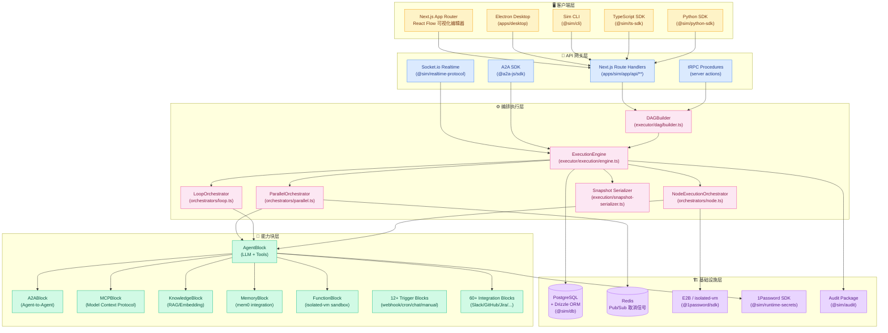
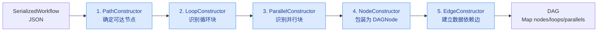
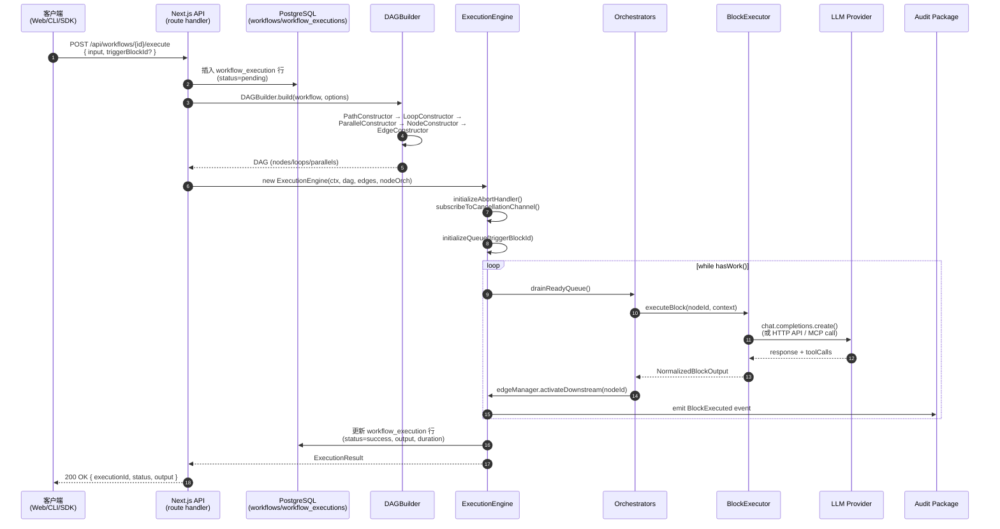

## 引子：从「Prompt 直调」到「可视化 AI 员工」的范式跃迁

2026 年的 AI 应用开发正在经历一次静悄悄的范式迁移。早期的 LangChain 用 Chain 把 LLM 调用串成管道，AutoGen 用 Conversation 把多个 Agent 串成对话，而 2026 年的新问题是：**当一个企业需要把 50 个 SaaS API + 20 个 LLM + 5 个 Agent + 100 个定时任务编排成一个可被 PM/运营直接维护的「AI 员工」时，谁来承担这个 编排层**？

[simstudioai/sim](https://github.com/simstudioai/sim)（⭐29,331，Apache-2.0）给出了一个令人信服的答案 —— 把 **Block（原子能力）+ DAG（执行图）+ Visual Builder（所见即所得）** 三层叠在一起：

- **Block 层**：200+ 个原子块（agent / a2a / mcp / knowledge / memory / function / condition / evaluator / parallel / loop / human_in_the_loop / 60+ 集成）—— 像乐高积木一样可拼装
- **DAG 层**：把拖拽出来的节点编译成有向无环图，由 DAGBuilder + ExecutionEngine + Parallel/Loop/Node Orchestrator 协作完成「并行分支 / 循环 / 暂停恢复 / 取消」等真实业务需要的控制流
- **Visual 层**：基于 React Flow 的可视化拖拽编辑，PM/运营无需写代码就能拼出工作流

> **核心洞察**：Sim 不是「又一个新的 LLM 框架」，而是一套把「企业 LLM 应用工程化」做透的**编排中台**。它的对标不是 LangChain / LlamaIndex，而是 **Retool + n8n + LangChain 三件套的融合体**，再用 Block-DAG 双层抽象把复杂度封进引擎层。

本文将深度拆解 Sim 的核心架构，重点回答三个问题：
1. **Block 抽象层** 如何用 `BlockConfig<TResponse>` 类型约束把 200+ 集成统一成「可配置 / 可拖拽 / 可观察」的标准组件
2. **DAG 执行层** 如何用 `readyQueue` + 三个 Orchestrator 把可视化工作流落地为「可暂停 / 可恢复 / 可并行 / 可取消」的运行时
3. **整体技术栈** 如何用 21 个 monorepo 包 + Bun runtime + Drizzle ORM + E2B sandbox 堆叠出一个完整的生产级平台

## 项目定位与核心价值

**Sim**（读作 `/sɪm/`，官方网站 [sim.ai](https://sim.ai)）是 **simstudioai/sim** 团队在 2026 年推出的「AI 员工编排平台」。它要做的事情可以用一句话概括：

> **把 ChatGPT 的对话体验、n8n 的可视化编排、Retool 的内嵌工具栈、LangChain 的 LLM 集成栈 —— 四件套融合成一个统一的工作台，让非工程师也能维护可生产运行的 AI 工作流。**

### 仓库速览

| 维度 | 数据 |
|------|------|
| ⭐ Stars | 29,331（2026-08-05） |
| License | Apache-2.0 |
| 主语言 | TypeScript (Next.js App Router) |
| Runtime | Bun ≥ 1.2.13 |
| 数据库 | PostgreSQL + Drizzle ORM |
| Auth | Better Auth |
| Monorepo | Turborepo + Bun workspaces |
| 顶层包 | 21 个（apps/sim、apps/desktop、apps/docs、20+ packages） |
| Block 数量 | 200+ 个（agent / 60+ 集成 / 12+ 触发器 / 6+ 控制流） |
| 部署形态 | Cloud-hosted（sim.ai）、Self-hosted（Bun + Docker Compose）、Helm/K8s、Electron Desktop |

### 四大设计哲学

从 README 和源码注释提炼，Sim 的设计哲学可以归纳为 4 条：

1. **One workspace, every surface**：Chat / Workflows / Tables / Files / Knowledge / Scheduled Tasks —— 6 个产品表面共用同一份底层 workspace、同一份权限模型、同一份审计日志
2. **Build agents visually, conversationally, or with code**：同一份 Block 既能拖拽配置，也能 `/api/tools/...` HTTP 调用，也能在 React 组件中 `<AgentBlock />` 嵌入 —— 三种入口对应 PM/开发者/集成方三类用户
3. **1,000+ integrations, every major LLM**：60+ 现成集成（Slack/Notion/HubSpot/Salesforce/GitHub/Jira/Linear）+ 100+ LLM（OpenAI/Anthropic/Google/Bedrock/Ollama/vLLM）+ MCP 协议 —— 一个 Block 系统打通企业 IT 全栈
4. **Self-hostable, deployable, inspectable**：`bun run setup` 一行交互式部署、Docker Compose 容器化、Helm 进 K8s、Electron 桌面 —— **完全可自托管**，数据不出企业内网

## 整体架构：Block-DAG-Visual 三层堆叠

Sim 的顶层架构遵循一个非常清晰的三层模型。**Block 层是声明式的能力清单，DAG 层是命令式的执行引擎，Visual 层是反应式的拖拽编辑界面**。三者通过 `SerializedWorkflow`（`@/serializer/types`）这个 JSON 中间表示层打通。

### 顶层架构图



### Monorepo 结构

Sim 仓库是一个标准的 Turborepo monorepo，顶层结构如下：

| 路径 | 角色 | 关键依赖 |
|------|------|----------|
| `apps/sim` | 主 Web 应用（Next.js App Router） | React Flow / Drizzle / Better Auth / Trigger.dev |
| `apps/desktop` | Electron 桌面应用 | CDP / browser-agent / desktop-bridge |
| `apps/docs` | 文档站（Fumadocs） | - |
| `packages/db` | 数据库层 + schema | Drizzle / PostgreSQL |
| `packages/workflow-types` | 工作流 TypeScript 类型 | - |
| `packages/workflow-renderer` | 工作流渲染器（跨端复用） | React Flow |
| `packages/workflow-persistence` | 工作流持久化抽象 | - |
| `packages/auth` | 认证抽象 | Better Auth |
| `packages/security` | 安全策略 | - |
| `packages/audit` | 审计日志 | - |
| `packages/logger` | 日志（@sim/logger） | - |
| `packages/ts-sdk` | 官方 TypeScript SDK | - |
| `packages/python-sdk` | 官方 Python SDK | - |
| `packages/cli` | 官方 CLI（`sim` 命令） | - |
| `packages/browser-protocol` | 浏览器自动化协议 | Puppeteer/CDP |
| `packages/terminal-protocol` | 终端自动化协议 | - |
| `packages/realtime-protocol` | 实时同步协议 | Socket.io |
| `packages/runtime-secrets` | 运行时密钥管理 | 1Password SDK |
| `packages/platform-authz` | 平台级授权 | - |
| `packages/emcn` | UI 组件库 | - |
| `packages/utils` | 通用工具 | - |

这个 monorepo 设计让「**主应用 / 桌面 / SDK / CLI / 文档**」五端共享同一份 `SerializedWorkflow` 数据模型，避免了传统 SaaS 平台「主应用一套、SDK 一套、CLI 一套」的数据不一致问题。

## Block 抽象层：200+ 集成的统一接口

Block 是 Sim 最核心的抽象。所有可被拖拽的节点 —— 不管是 LLM Agent、HTTP API、MCP server、Knowledge 检索、Slack 消息、还是 Parallel/Loop 控制流 —— 都必须实现同一个 `BlockConfig<TResponse>` 接口。

### BlockConfig 类型契约

```typescript
// 来自 apps/sim/blocks/types.ts
export interface BlockConfig<TResponse extends ToolResponse = ToolResponse> {
  type: string                                              // 块的唯一类型标识
  name: string                                              // 显示名称
  description: string                                       // 一句话简介
  longDescription?: string                                  // 详细文档
  bestPractices?: string                                    // 使用建议
  docsLink?: string                                         // 外部文档链接
  category: BlockCategory                                   // 分类：blocks / triggers / outputs / logic
  authMode?: AuthMode                                       // ApiKey | OAuth2 | None
  integrationType?: IntegrationType                         // AI | Database | Communication | ...
  bgColor?: string                                          // 编辑器中显示的颜色
  icon?: ReactNode                                          // 图标组件
  subBlocks: SubBlockSchema[]                               // 子配置项（输入框/选择器/密码字段等）
  tools?: { access?: string[] }                             // 这个 Block 能访问的工具 ID 列表
  outputs: OutputSchema                                     // 输出数据结构（用于下游 Block 引用）
  inputs?: Record<string, InputSchema>                      // 输入数据结构
  hide?: HideCondition                                      // 条件隐藏规则
}
```

**关键设计**：每个 Block 声明了它的 `subBlocks`（配置项）和 `outputs`（输出结构）。下游 Block 通过 `<blockName.fieldName>` 这样的引用语法访问上游输出，这种**声明式的数据依赖**让 DAG Builder 可以静态分析工作流图。

### Agent Block：核心能力的封装

Agent Block 是使用最频繁的 Block，下面节选自 `apps/sim/blocks/blocks/agent.ts`（26,864 字节）：

```typescript
// 来自 apps/sim/blocks/blocks/agent.ts
export const AgentBlock: BlockConfig<AgentResponse> = {
  type: 'agent',
  name: 'Agent',
  description: 'Build an agent',
  authMode: AuthMode.ApiKey,
  longDescription:
    'The Agent block is a core workflow block that is a wrapper around an LLM. ' +
    'It takes in system/user prompts and calls an LLM provider. ' +
    'It can also make tool calls by directly containing tools inside of its tool input. ' +
    'It can additionally return structured output.',
  bestPractices: `
    - Prefer using integrations as tools within the agent block over separate integration blocks
      unless complete determinism needed.
    - Response Format should be a valid JSON Schema. This determines the output of the agent
      only if present. Fields can be accessed at root level by the following blocks:
      e.g. <agent1.field>. If response format is not present, the agent will return the
      standard outputs: content, model, tokens, toolCalls.
  `,
  docsLink: 'https://docs.sim.ai/workflows/blocks/agent',
  category: 'blocks',
  integrationType: IntegrationType.AI,
  bgColor: 'var(--brand)',
  // ... subBlocks 配置（Messages / Model / Tools / Memory / Response Format 等）
}
```

Agent Block 把 LLM 调用封装成 4 个核心 sub-block：

| Sub-block | 作用 |
|-----------|------|
| `messages` | 用户/系统消息输入（支持 wandConfig 自然语言生成提示词） |
| `model` | 模型选择（OpenAI/Anthropic/Google/Bedrock/Ollama/vLLM，自动按能力筛选 Reasoning/Vision/Tools 等） |
| `tools` | Agent 可调用的工具集（内置集成 + MCP + Function） |
| `responseFormat` | JSON Schema 结构化输出（可选） |

**关键细节**：`AgentBlock.ts` 顶部动态检测模型能力：

```typescript
// 来自 apps/sim/blocks/blocks/agent.ts:17-24
const MODELS_WITH_REASONING_EFFORT = getModelsWithReasoningEffort()
const MODELS_WITH_VERBOSITY = getModelsWithVerbosity()
const MODELS_WITH_THINKING = getModelsWithThinking()
const MODELS_WITH_PROMPT_CACHING = getModelsWithPromptCaching()
const MODELS_WITH_DEEP_RESEARCH = getModelsWithDeepResearch()
const MODELS_WITHOUT_MEMORY = getModelsWithoutMemory()
```

—— 这 7 个能力标签驱动 UI 动态渲染：选了不支持 Reasoning 的模型时，对应的 reasoning_effort 字段直接隐藏。这是一种典型的 **"能力感知 UI"** 设计。

### Block 类型全景

通过 `apps/sim/blocks/blocks/` 目录的 200+ 个 `.ts` 文件，Sim 提供了一站式集成清单：

| 类别 | 代表 Block | 数量 |
|------|-----------|------|
| AI 核心 | `agent.ts` / `evaluator.ts` / `image_generator.ts` | 3 |
| Agent 协议 | `a2a.ts` / `managed_agent.ts` / `mcp.ts` | 3 |
| Memory / RAG | `memory.ts` (mem0) / `knowledge.ts` / `logfire.ts` / `langsmith.ts` | 4 |
| 控制流 | `condition.ts` / `parallel.ts` / `loop.ts` / `function.ts` / `human_in_the_loop.ts` | 5 |
| 触发器 | `chat_trigger.ts` / `manual_trigger.ts` / `api_trigger.ts` / `webhook.ts` (generic_webhook) / `input_trigger.ts` | 5+ |
| 通信 | `slack.ts` / `discord.ts` / `teams.ts` / `gmail.ts` / `outlook.ts` / `imessage` (无 macOS 平台) | 6 |
| CRM / 销售 | `hubspot.ts` / `salesforce.ts` / `apollo.ts` / `clay.ts` / `attio.ts` | 5+ |
| 项目管理 | `jira.ts` / `linear.ts` / `asana.ts` / `monday.ts` / `trello.ts` / `github.ts` / `gitlab.ts` | 7+ |
| 数据库 | `mysql.ts` / `mongodb.ts` / `dynamodb.ts` / `elasticsearch.ts` / `clickhouse.ts` / `bigquery.ts` | 6+ |
| DevOps | `aws/iam.ts` / `aws/cloudformation.ts` / `aws/cloudwatch.ts` / `datadog.ts` / `daytona.ts` | 5+ |
| 安全 / 身份 | `credential.ts` / `guardrails.ts` / `iam.ts` / `identity_center.ts` | 4 |
| 数据 / 研究 | `arxiv.ts` / `exa.ts` / `firecrawl.ts` / `linkup.ts` / `tavily` (无) / `jina.ts` | 5 |
| 浏览器自动化 | `browser_use.ts` / `firecrawl.ts` / `brightdata.ts` | 3 |
| 文档处理 | `mistral_parse.ts` / `jupyter.ts` / `latex.ts` | 3 |

## DAG 执行引擎：从「可视化节点」到「确定性运行时」

把可视化编辑的 Block 串起来只是第一步。**真正的工程难题是：如何把一张用户拖拽出来的图编译成可暂停、可恢复、可并行、可取消、可观测的运行时**。Sim 用三层抽象解决了这个问题：

```
SerializedWorkflow (JSON)
       ↓ DAGBuilder.build()
DAG (有向无环图 + Loop/Parallel 配置)
       ↓ ExecutionEngine.run()
执行结果 + Snapshot
```

### DAG Builder：5 个 Constructor 协同编译

`apps/sim/executor/dag/builder.ts`（5,218 字节）是工作流的「编译器入口」：

```typescript
// 来自 apps/sim/executor/dag/builder.ts:48-65
export interface DAG {
  nodes: Map<string, DAGNode>
  loopConfigs: Map<string, SerializedLoop>
  parallelConfigs: Map<string, SerializedParallel>
}

export class DAGBuilder {
  private pathConstructor = new PathConstructor()
  private loopConstructor = new LoopConstructor()
  private parallelConstructor = new ParallelConstructor()
  private nodeConstructor = new NodeConstructor()
  private edgeConstructor = new EdgeConstructor()

  build(workflow: SerializedWorkflow, options: DAGBuildOptions = {}): DAG {
    const { triggerBlockId, savedIncomingEdges, includeAllBlocks } = options

    const dag: DAG = {
      nodes: new Map(),
      loopConfigs: new Map(),
      parallelConfigs: new Map(),
    }

    this.initializeConfigs(workflow, dag)
    const reachableBlocks = this.pathConstructor.execute(workflow, triggerBlockId, includeAllBlocks)
    this.loopConstructor.execute(dag, reachableBlocks)
    this.parallelConstructor.execute(dag, reachableBlocks)
    const { blocksInLoops, blocksInParallels, pauseTriggerMapping } = this.nodeConstructor.execute(
      workflow, dag, reachableBlocks
    )
    this.edgeConstructor.execute(
      workflow, dag, blocksInParallels, blocksInLoops, reachableBlocks, pauseTriggerMapping
    )
    // ...
  }
}
```

DAG 构建过程是一个清晰的 5 步流水线：



**关键设计选择**：
- **PathConstructor 先跑**：从 trigger block 开始做 BFS，确定工作流可达性（没被连接的 Block 不会执行）—— 这是「按需执行」的基础
- **Loop/Parallel Constructor 后跑**：因为 Loop/Parallel 是「子工作流」，需要先知道哪些 block 可达，再判断它们属于哪个循环/并行
- **NodeConstructor 包装 DAGNode**：每个 DAGNode 包含 `incomingEdges`（输入依赖）和 `outgoingEdges`（输出目标），让下游能静态分析
- **EdgeConstructor 最后跑**：把 Block 的 `subBlocks` 中引用的 `<otherBlock.field>` 表达式解析成真实的数据依赖边 —— 这是「静态数据流分析」

### ExecutionEngine：可取消 / 可暂停的主循环

`apps/sim/executor/execution/engine.ts`（17,995 字节）是整个执行系统的「心脏」。它用经典的 **readyQueue + executing Set** 模式实现拓扑排序：

```typescript
// 来自 apps/sim/executor/execution/engine.ts:23-46
export class ExecutionEngine {
  private readyQueue: string[] = []
  private executing = new Set<Promise<void>>()
  private queueLock = Promise.resolve()
  private finalOutput: NormalizedBlockOutput = {}
  private responseOutputLocked = false
  private pausedBlocks: Map<string, PauseMetadata> = new Map()
  private allowResumeTriggers: boolean
  private cancelledFlag = false
  private errorFlag = false
  private stoppedEarlyFlag = false
  private executionError: Error | null = null
  private abortPromise!: Promise<void>
  private abortResolve!: () => void
  private cancellationUnsubscribe: (() => void) | null = null
  private execLogger: Logger

  constructor(
    private context: ExecutionContext,
    private dag: DAG,
    private edgeManager: EdgeManager,
    private nodeOrchestrator: NodeExecutionOrchestrator
  ) {
    this.allowResumeTriggers = this.context.metadata.resumeFromSnapshot === true
    this.initializeAbortHandler()
    this.subscribeToCancellationChannel()
  }
```

主循环（节选自 `engine.ts` 的 `run()` 方法）：

```typescript
// 来自 apps/sim/executor/execution/engine.ts (伪代码示意)
async run(triggerBlockId?: string): Promise<ExecutionResult> {
  const startTime = performance.now()
  try {
    this.initializeQueue(triggerBlockId)
    await this.checkCancellationBackstop()

    while (this.hasWork()) {
      if (this.checkCancellation() || this.errorFlag || this.stoppedEarlyFlag) break

      // 1. 从 readyQueue 取出所有就绪节点
      const readyNodes = this.drainReadyQueue()

      // 2. 并行派发到 executing Set
      for (const nodeId of readyNodes) {
        const promise = this.executeNode(nodeId)
        this.executing.add(promise)
        promise.finally(() => this.executing.delete(promise))
      }

      // 3. 等待任意一个节点完成 → 触发下游节点入队
      await Promise.race([...this.executing, this.abortPromise])

      // 4. 检查暂停点（如 Human-in-the-loop）
      await this.checkPausePoints()
    }

    return this.buildResult(startTime)
  } catch (error) {
    // ... 错误处理 + Snapshot 保存
  }
}
```

**关键工程细节**：

1. **Pub/Sub 取消信号**：`subscribeToCancellationChannel()` 订阅 Redis pub/sub 频道，外部取消请求可在任意时刻中断长任务；`checkCancellationBackstop()` 兜底 —— 处理「订阅前已取消」的边界情况
2. **AbortSignal 集成**：`initializeAbortHandler()` 注册 abort listener，配合 Node.js 标准 `AbortController` 使用，方便 HTTP 客户端复用
3. **暂停点机制**：`pausedBlocks: Map<string, PauseMetadata>` 让 Human-in-the-loop Block 可以暂停整个工作流，等用户审批后从 `serializePauseSnapshot()` 序列化的状态恢复
4. **race-on-executing**：每次 while 循环 `Promise.race([...this.executing, this.abortPromise])`，保证任意节点完成都能立即触发下游入队 —— 这是高吞吐的关键

### 三个 Orchestrator：把控制流解耦

DAG 本身只描述节点和边，但 **Loop（循环）/ Parallel（并行）/ Node（节点执行）** 三种语义被解耦到独立的 Orchestrator 中：

| Orchestrator | 文件 | 职责 |
|--------------|------|------|
| `NodeExecutionOrchestrator` | `orchestrators/node.ts` | 执行单个 Block（含隔离 VM / 沙箱 / 重试） |
| `ParallelOrchestrator` | `orchestrators/parallel.ts` | 展开 Parallel Block 为 N 个并行分支，管理分支元数据 |
| `LoopOrchestrator` | `orchestrators/loop.ts` | 管理 Loop Block 的迭代（max iterations / early break / for-each） |

#### ParallelOrchestrator（19,546 字节）展开示例

```typescript
// 来自 apps/sim/executor/orchestrators/parallel.ts
const DEFAULT_PARALLEL_BATCH_SIZE = 20

export class ParallelOrchestrator {
  private expander = new ParallelExpander()

  constructor(
    private dag: DAG,
    private state: BlockStateWriter,
    private resolver: VariableResolver | null = null,
    private contextExtensions: ContextExtensions | null = null,
    private edgeManager: Pick<EdgeManager, 'clearDeactivatedEdgesForNodes'> | null = null
  ) {}

  async initializeParallelScope(ctx: ExecutionContext, parallelId: string): Promise<ParallelScope> {
    const parallelConfig = this.dag.parallelConfigs.get(parallelId)
    if (!parallelConfig) {
      throw new Error(`Parallel config not found: ${parallelId}`)
    }

    if (parallelConfig.nodes.length === 0) {
      const errorMessage = 'Parallel has no executable blocks inside...'
      // ...
    }

    let items: any[] | undefined
    let branchCount: number
    let isEmpty = false

    try {
      const resolved = await this.resolveBranchCount(ctx, parallelConfig, parallelId)
      branchCount = resolved.branchCount
      items = resolved.items
      isEmpty = resolved.isEmpty ?? false
    } catch (error) {
      // ... 错误处理 + 日志
    }
    // ...
  }
}
```

**关键设计**：
- **`ParallelExpander` 单独成类**：负责把 Parallel 块「克隆」成 N 个分支，每个分支有独立的 `<blockId>__<branchIndex>` 后缀命名空间
- **`DEFAULT_PARALLEL_BATCH_SIZE = 20`**：默认每批 20 个分支并发，避免一次性扇出 1000+ 把数据库打死
- **`distribution` 字段**：从上游 Block 的输出动态解析分支数（如「遍历 100 个用户」生成 100 个分支）
- **`ParallelScope`**：每个并行块的作用域，存储 `branchIndex / branchTotal / distributionItem / parallelId` 元数据

#### LoopOrchestrator（25,703 字节）核心

LoopOrchestrator 是三个 Orchestrator 中最复杂的，因为它要处理 **while / for-each / do-while** 三种循环模式 + **max iterations 保护 + early break + 迭代器变量注入**。从源码看它重度依赖 `isolated-vm`（在 Function Block 中执行 JS 代码）和 `serializePauseSnapshot()`（循环中暂停 / 恢复时序列化迭代状态）。

## MCP 集成层：让 Block 透明地消费外部工具

Sim 是 **MCP（Model Context Protocol）** 协议的早期支持者，独立的 `mcp.ts` Block 让用户可以一行配置把任意 MCP server 接入工作流：

```typescript
// 来自 apps/sim/blocks/blocks/mcp.ts (节选)
export const MCPBlock: BlockConfig = {
  type: 'mcp',
  name: 'MCP',
  description: 'Connect to Model Context Protocol servers',
  authMode: AuthMode.ApiKey,
  category: 'blocks',
  integrationType: IntegrationType.DevTools,
  longDescription: 'The MCP block lets you connect to any MCP-compatible server...',
  subBlocks: [
    {
      id: 'serverUrl',
      title: 'Server URL',
      type: 'short-input',
      placeholder: 'https://mcp.example.com/sse',
    },
    {
      id: 'transport',
      title: 'Transport',
      type: 'dropdown',
      options: [
        { label: 'SSE', id: 'sse' },
        { label: 'Streamable HTTP', id: 'streamable_http' },
        { label: 'Stdio (local)', id: 'stdio' },
      ],
    },
    { id: 'tools', title: 'Tools to expose', type: 'tool-selector', wandConfig: { /* ... */ } },
    { id: 'authToken', title: 'Auth Token', type: 'short-input' },
  ],
}
```

**关键设计**：
- **三种 transport** 同时支持：SSE（Server-Sent Events）、Streamable HTTP（新版 MCP 协议）、Stdio（本地子进程）—— 覆盖云端 + 本地两场景
- **tool-selector 子组件**：让用户**挑选** MCP server 暴露的哪些工具可用，而不是全量塞给 Agent —— 这种「白名单」机制防止 LLM 被 100+ 工具污染
- **与 Agent Block 联动**：MCP Block 既可以独立工作（HTTP API 调用），也可以挂到 Agent Block 的 `tools` 字段，让 Agent 在推理时调用 MCP 工具

类似的「Block-as-Tool」机制在 Sim 中是统一的：所有 Block 都可以作为 Agent Block 的 tool —— 这是 Sim 与 LangChain 「Tool vs Chain 分离」设计的关键差异。

## Knowledge / Memory 双轨：RAG 与长期记忆

Sim 把「知识检索」和「长期记忆」拆成两个独立 Block，这种 **双轨设计** 反映了企业 AI 应用的两类典型需求：

### KnowledgeBlock：RAG 文档检索

```typescript
// 来自 apps/sim/blocks/blocks/knowledge.ts (节选)
export const KnowledgeBlock: BlockConfig = {
  type: 'knowledge',
  name: 'Knowledge',
  description: 'Search a knowledge base',
  longDescription: 'The Knowledge block performs semantic search across uploaded documents...',
  category: 'blocks',
  integrationType: IntegrationType.AI,
  subBlocks: [
    { id: 'knowledgeBaseId', title: 'Knowledge Base', type: 'knowledge-base-selector' },
    { id: 'query', title: 'Query', type: 'long-input' },
    { id: 'topK', title: 'Top K', type: 'number', default: 5 },
    { id: 'embeddingModel', title: 'Embedding Model', type: 'dropdown', /* ... */ },
  ],
  // outputs: { results: 'Array<{ content, score, metadata }>' }
}
```

- 输入：选择 Knowledge Base + 输入 query
- 输出：`Array<{ content, score, metadata }>`（检索到的文档片段 + 相关度分数）
- 典型用法：作为 Agent Block 的 tool，让 Agent 在回答前先检索企业内部文档

### MemoryBlock：基于 mem0 的长期记忆

```typescript
// 来自 apps/sim/blocks/blocks/memory.ts (节选)
export const MemoryBlock: BlockConfig = {
  type: 'memory',
  name: 'Memory',
  description: 'Store and retrieve long-term memories',
  longDescription: 'The Memory block uses mem0 to extract and store memories from conversations...',
  category: 'blocks',
  integrationType: IntegrationType.AI,
  subBlocks: [
    { id: 'operation', title: 'Operation', type: 'dropdown',
      options: [{ label: 'Add', id: 'add' }, { label: 'Search', id: 'search' }] },
    { id: 'userId', title: 'User ID', type: 'short-input' },
    { id: 'content', title: 'Content', type: 'long-input' },
  ],
}
```

- 基于 [mem0](https://github.com/mem0ai/mem0)（一个独立的 Memory 框架，已写过专门评测）
- 两种操作：`add`（写入记忆）/ `search`（检索记忆）
- 按 `userId` 隔离命名空间 —— 支持多用户场景

**与 Knowledge 的关键差异**：
- **Knowledge**：处理「企业文档」这种**结构化资产**，内容相对稳定，需要 embedding + 向量检索
- **Memory**：处理「对话历史」这种**动态增量**，需要去重 + 摘要 + 时序管理

## 数据流与状态管理：从触发到执行

单次工作流执行的端到端数据流如下：



**关键工程亮点**：

1. **持久化的执行状态**：每次执行都会写 `workflow_executions` 表，包含 `status / started_at / completed_at / output / error / snapshot` —— 支持「事后回溯失败原因」
2. **Pub/Sub 取消信号**：通过 Redis pub/sub 传播取消信号，HTTP API 收到 DELETE 请求后向频道发消息，ExecutionEngine 在 `Promise.race` 中检测到
3. **Snapshot 序列化**：`serializePauseSnapshot()` 把当前执行状态（包括所有已完成 Block 的输出、未完成 Block 的 pending 状态）序列化成 JSON，存到 DB —— 支持「暂停后恢复」
4. **Audit 全链路审计**：每个 Block 执行都 emit 一个 `BlockExecuted` 事件到 Audit Package，方便合规审计

## 部署与自托管

Sim 的部署文档强调「**5 分钟自托管**」：

```bash
# 来自 README.md
git clone https://github.com/simstudioai/sim.git && cd sim
bun run setup
# 交互式 wizard：provision 数据库 + 生成 secrets + 写 .env + 连接 Chat API key
# 自动打开浏览器登录
# Open http://localhost:3000
```

`bun run setup` 实际是一个完整的 init 脚本，会：
1. 启动 PostgreSQL + Redis Docker 容器
2. 运行 Drizzle migrations
3. 生成 Better Auth 的 secret key
4. 提示用户登录 sim.ai 获取 Chat API key（云托管的 Chat 服务）
5. 写 `.env.local` + 启动 dev server

部署模式对比：

| 模式 | 适用场景 | 命令 |
|------|----------|------|
| `bun run dev` | 本地开发 | Next.js dev server |
| Docker Compose | 测试自托管 / 内部部署 | `docker-compose up` |
| Helm | 生产 K8s | `helm install sim ./helm` |
| Electron Desktop | 客户端模式 | `bun run desktop:dev` |
| Cloud-hosted (sim.ai) | SaaS | 直接访问 sim.ai |

## 与同类项目对比

| 维度 | Sim | n8n | LangChain | Dify | Flowise |
|------|-----|-----|-----------|------|---------|
| 形态 | 可视化 + 代码双栈 | 可视化工作流 | Python SDK | 可视化平台 | 可视化平台 |
| Block 数量 | **200+** | 400+ | 100+ (LangChain integrations) | 100+ | 50+ |
| LLM 支持 | 100+ | 30+ | 200+ | 50+ | 30+ |
| MCP 原生 | ✅ | ❌（需自定义） | ✅（独立包） | ✅ | ❌ |
| A2A 协议 | ✅（@a2a-js/sdk） | ❌ | ❌ | ❌ | ❌ |
| 可暂停/恢复 | ✅（snapshot 序列化） | ✅（workflow checkpoint） | ❌ | ❌ | ❌ |
| 并行/循环 | ✅（DAG 原生） | ✅ | ✅（LCEL） | ✅ | ✅ |
| 自托管 | ✅（Bun + Docker + Helm） | ✅ | ✅（代码） | ✅ | ✅ |
| 桌面应用 | ✅（Electron） | ❌ | ❌ | ❌ | ❌ |
| TS SDK | ✅（@sim/ts-sdk） | ✅ | ❌ | ✅ | ❌ |
| Python SDK | ✅（@sim/python-sdk） | ❌ | ✅ | ❌ | ❌ |
| License | Apache-2.0 | Sustainable Use | MIT | Apache-2.0 | Apache-2.0 |

### 设计差异分析

**vs n8n**：n8n 是可视化工作流的事实标准，但它的 Block 体系以「通用 HTTP / 数据库」为主，没有针对 LLM 的深度优化（如 structured output / tool calls / reasoning effort）。Sim 把 Block 抽象层偏向 AI 原生，每个 Block 都有 `subBlocks / outputs / tools` 标准化结构。

**vs LangChain**：LangChain 是 Python SDK 路线的代表，灵活但「非工程师无法维护」。Sim 把同一份 Block 既给开发者（TypeScript SDK / Python SDK），也给 PM（可视化拖拽），覆盖人群更广。

**vs Dify**：Dify 是 Sim 在「可视化 AI 平台」赛道的最直接竞品。Dify 用 Python + Flask + Vue，Sim 用 TypeScript + Next.js + Bun —— 性能/类型安全更强。Block 数量上 Sim 略胜，但 Dify 在 RAG 文档处理上更深（PDF/PPT/Excel 解析内置）。

## 优缺点分析

### 架构简洁性 / 扩展性 / 易用性

| 优势 | 说明 |
|------|------|
| **Block 抽象统一** | 200+ 集成共用同一套 `BlockConfig<TResponse>` 类型约束，加新集成只需写一个 `.ts` 文件 |
| **Monorepo 设计** | 21 个包共享 `SerializedWorkflow` 数据模型，Web/Desktop/SDK/CLI/文档五端零不一致 |
| **可视化 + 代码双栈** | 同一 Block 既能拖拽，也能 SDK 调用，PM 和开发者共用一套资产 |
| **Bun runtime** | 比 Node.js 快 3-4x 的启动速度和并发性能 |
| **Drizzle ORM** | 类型安全的 SQL ORM，schema 改动有 migration 文件追踪 |

### 性能 / 复杂度 / 维护性

| 劣势 | 说明 |
|------|------|
| **学习曲线陡** | DAG / Orchestrator / Snapshot 三层抽象对一个非工程师来说需要时间理解 |
| **重型 monorepo** | 21 个包 + 200+ Block，clone 仓库后 `bun install` 较慢 |
| **强依赖云服务** | `bun run setup` 自动连接 sim.ai 获取 Chat API key，纯离线部署需要额外配置 |
| **执行性能** | DAG 主循环 + readyQueue 是顺序调度，超大规模工作流（>1000 节点）时调度开销显现 |
| **代码量大** | `apps/sim` 主包 15,000+ 文件，新贡献者上手成本高 |

## 实践：30 分钟搭建一个 AI 客服工作流

下面演示如何用 Sim 搭建一个「**Slack 消息进来 → AI Agent 解答 → 知识库检索 → 自动回复**」的客服工作流（伪代码示意真实 API 调用）：

```bash
# 1. 启动 Sim（自托管）
git clone https://github.com/simstudioai/sim.git && cd sim
bun run setup
# 浏览器打开 http://localhost:3000
```

```python
# 2. 用 Python SDK 创建一个工作流（来自 @sim/python-sdk）
from simstudioai import SimClient

client = SimClient(api_key="<your-api-key>")

workflow = client.workflows.create(
    name="AI Customer Support",
    blocks=[
        {"type": "slack_trigger", "channel": "#support", "event": "message"},
        {"type": "function", "code": """
            // 提取用户问题，去除 Slack mention
            const text = inputs.message.text.replace(/<@\\w+>/g, '').trim()
            return { question: text, userId: inputs.message.user }
        """},
        {"type": "knowledge", "knowledgeBaseId": "kb-product-docs", "query": "<function1.question>"},
        {"type": "agent", "model": "claude-sonnet-4-5",
         "systemPrompt": "You are a helpful customer support agent. Use the knowledge base to answer.",
         "tools": ["knowledge"]},
        {"type": "condition", "if": "<agent1.confidence> > 0.7",
         "then": [{"type": "slack", "channel": "#support",
                   "text": "<agent1.content>"}],
         "else": [{"type": "slack", "channel": "#support-escalation",
                   "text": "Need human help: <function1.question>"}]},
    ],
    edges=[
        {"from": "slack_trigger", "to": "function"},
        {"from": "function", "to": "knowledge"},
        {"from": "knowledge", "to": "agent"},
        {"from": "agent", "to": "condition"},
    ],
)

# 3. 触发执行
execution = client.executions.create(workflow_id=workflow.id)
print(f"Execution started: {execution.id}")
```

**关键设计**：
- **Condition Block 实现「信心度分支」**：当 Agent 自信度 > 0.7 时自动回复，否则升级到人工 —— 这是真实客服系统的标准模式
- **Agent Block 通过 `tools: ["knowledge"]` 引用上游知识库**：无需在 Agent 配置里手动写 RAG prompt，Sim 静态分析自动注入
- **Slack Trigger + Slack Action** 闭环：从 Slack 收消息，最终回 Slack 消息

## 趋势与总结

Sim 站在 2026 年 AI 应用的几个关键趋势交汇点：

1. **可视化工作流回归**：随着 Agent 应用进入企业生产，PM/运营需要直接维护工作流，「拖拽编辑器 + 代码 SDK」双栈成为标准形态 —— Sim 是这个趋势的代表
2. **Block-DAG 双层抽象成为主流**：n8n / Dify / Sim / Flowise 都采用了类似 Block + DAG 的设计，**LLM 应用正在复用 BPM 领域 20 年的工程沉淀**
3. **MCP 协议成为新标准**：200+ 集成用「Block + MCP」双轨实现，第三方 MCP server 可以无缝接入 —— 这是 AI 时代的「USB-C」
4. **A2A 协议让 Agent 协同网络化**：Sim 内置 `@a2a-js/sdk`，让一个工作流能把任务委派给另一个 Agent —— 这是 2026 H2 Agent Mesh 网络的开端
5. **Self-hostable 重新成为卖点**：企业对数据主权的诉求 + 合规要求，让 `bun run setup` 5 分钟自托管成为差异化卖点

### 工程经验提炼

- **Block 抽象是 AI 工程的「UI 框架」**：把每个 LLM 能力 + 外部集成封装成有 schema 的 Block，是让 PM/运营能维护 AI 应用的关键
- **DAG + Orchestrator 是运行时设计的最佳实践**：把可视化图编译成 DAG，再把 Loop/Parallel/Node 三种语义解耦到独立 Orchestrator —— 这是 n8n / Sim / Flowise 的共同选择
- **Snapshot 序列化让可恢复执行成为可能**：Human-in-the-loop、长任务、错误重试都需要状态快照 —— Sim 用 `serializePauseSnapshot()` 把状态落到 PostgreSQL
- **Monorepo + 21 个包是平台型项目的合理规模**：Web/Desktop/SDK/CLI/文档五端共享数据模型，避免「五份不一致的代码库」
- **Self-hostable + Docker Compose + Helm 三件套**：让企业 AI 平台可以平滑从 PoC 到生产，不需要重写部署脚本

### 下一步候选关注

基于 Sim 的设计哲学，2026 H2 值得关注的相关项目：
- **n8n-ai/n8n**：n8n 的 AI 增强版，正在追赶可视化 AI 工作流赛道
- **logspace-ai/logspace**：浏览器内的 AI 工作流执行
- **agent0/agent0**：A2A 协议原生 Agent 协作框架（如果出现）
- **flowiseai/flowise**：Flowise 3.0 也在向 Sim 的方向演进

但 Sim 本身仍然在快速迭代 —— 200+ Block + DAG 执行引擎 + 5 端协同 + 自托管生态 + MCP/A2A 双协议支持，是当前**最完整的 AI 员工编排平台**之一。**如果你的企业需要把 50 个 SaaS API + 20 个 LLM + 5 个 Agent 编排成一个可被 PM/运营维护的工作流，Sim 是 2026 年最值得评估的开源方案**。

---

## 附录：关键资源

| 资源 | 链接 |
|------|------|
| GitHub 仓库 | https://github.com/simstudioai/sim |
| 官方网站 | https://sim.ai |
| 官方文档 | https://docs.sim.ai |
| Playground | https://www.hyperframes.dev/（HeyGen 的另一个项目，不是 Sim 的）|
| Self-hosting 文档 | https://docs.sim.ai/self-hosting |
| 环境变量参考 | https://docs.sim.ai/self-hosting/environment-variables |
| Block 文档（Agent） | https://docs.sim.ai/workflows/blocks/agent |
| 社区 Slack | https://join.slack.com/t/sim-ott9864/shared_invite/zt-43lp8tc5v-0qrrqHGBKUsvQlpoouH~TA |
| X / Twitter | https://x.com/simdotai |
| Discord | https://discord.gg/EbK98HBPdk |
| Helm Chart | `helm/` 目录 |
| TypeScript SDK | `@sim/ts-sdk` (packages/ts-sdk) |
| Python SDK | `@sim/python-sdk` (packages/python-sdk) |
| CLI 工具 | `@sim/cli` (packages/cli) |
| License | Apache-2.0 |

---

**关键词**：Sim、simstudioai、Block 抽象、DAG 执行引擎、ExecutionEngine、ParallelOrchestrator、LoopOrchestrator、NodeExecutionOrchestrator、DAGBuilder、MCP 集成、A2A 协议、Knowledge Block、Memory Block、isolated-vm 沙箱、Bun runtime、Drizzle ORM、Turborepo monorepo、可视化工作流、AI Agent 编排、React Flow、Better Auth