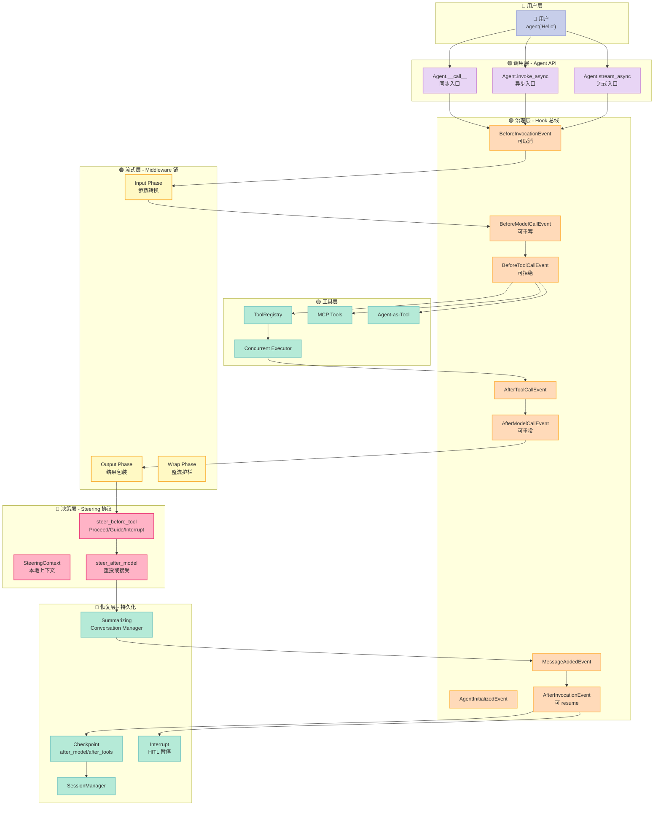
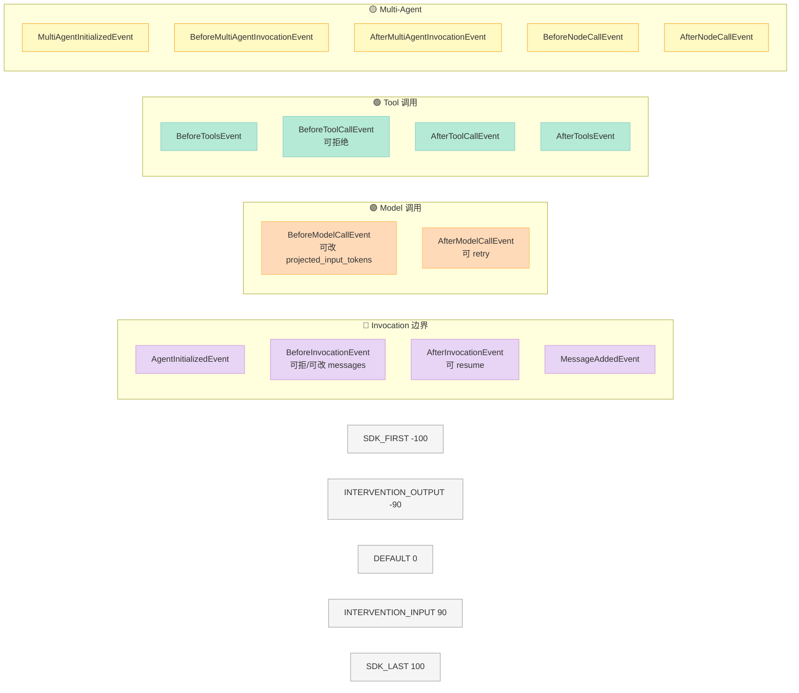
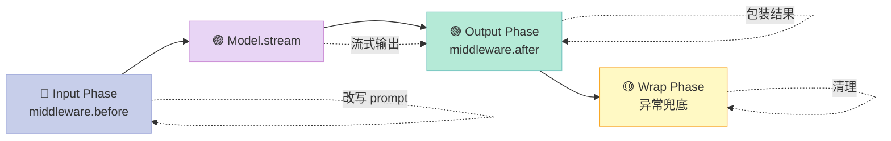
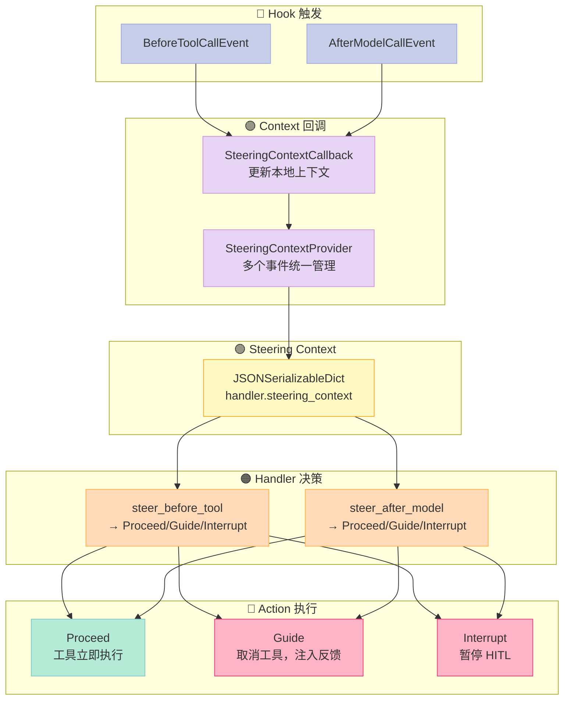
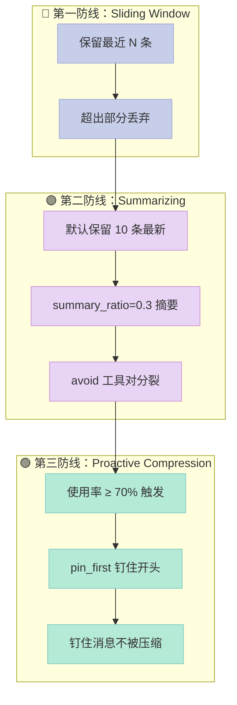
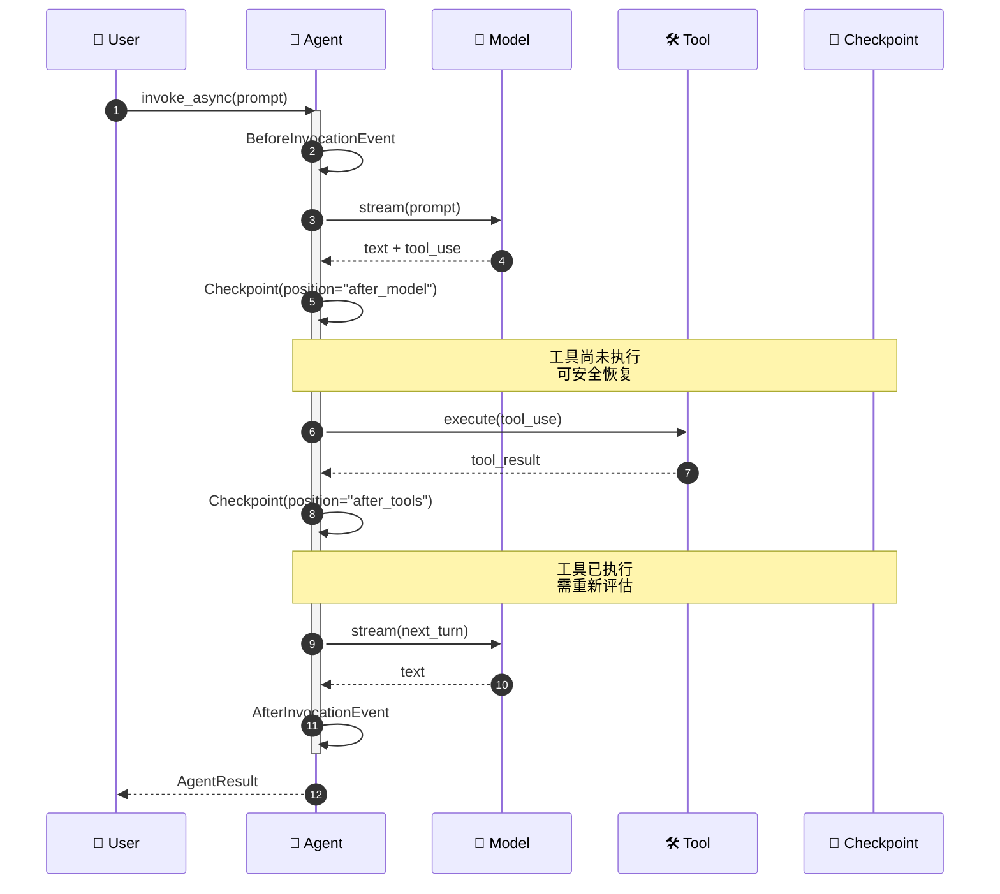

> **把"模型驱动"做成可工程化的 Agent Runtime，需要的不是更大的模型，而是 5 个可插拔的钩子层。** Strands Agents（6.8k⭐，AWS）用 4 层架构（Hook 总线 + Middleware 链 + Steering 协议 + Checkpoint/Interrupt）回答了一个核心问题：**当 LLM 既是推理引擎又是被编排对象时，Harness 应该如何"套"在它外面？**

## 摘要

`strands-agents/harness-sdk` 是 AWS 主导的 **生产级 Agent SDK**（6.8k⭐，2026-08-05 活跃），定位"Build an agent harness and control it end-to-end"。本文深挖 5 个核心组件：

1. **Hook 总线**（hooks/registry.py）—— 21 个强类型事件 × 5 档优先级 × 取消/重写/重投三态分发
2. **Middleware 链**（_middleware/registry.py）—— Input → Output → Wrap 三阶段异步生成器管道
3. **Steering 协议**（vended_plugins/steering/）—— 用"局部上下文 + Action 决策"代替"全量 prompt 注入"
4. **摘要化 Conversation Manager**（summarizing_conversation_manager.py）—— 摘要 + 钉住 + 主动压缩三层止血
5. **Checkpoint + Interrupt 双暂停点**（experimental/checkpoint/ + interrupt.py）—— ReAct 周期内的"事务边界"

与 `openai/openai-agents-python`（28.4k⭐）用 trapped-thought + Guardrail 守护、Anthropic `claude-agent-sdk-python`（7.8k⭐）用 Tool + Subagent 双层抽象相比，Strands 的设计哲学是 **"把 Harness 本身当成数据库来设计"** —— 任何决策都要经过 Hook 拦截、任何工具调用都要进 Middleware 管道、任何超长上下文都要先摘要再进入下一轮。

项目链接：[strands-agents/harness-sdk](https://github.com/strands-agents/harness-sdk)。调研时 GitHub API 显示 **6811 Stars**，Apache-2.0 协议，最新提交 2026-08-05。

---

## 一、为什么研究 Strands：Harness 工程的"灰盒"难题

### 1.1 痛点：LLM 既是引擎又是被编排对象

如果你真的写过生产 Agent 而不是 demo，必然撞上三堵墙：

| 层级 | 现象 | 根因 |
|------|------|------|
| **可观测层** | Agent 跑了 30 分钟，不知道为什么卡死 | 推理过程是黑盒，工具调用是"插入式" |
| **可拦截层** | Agent 误删了数据库，才知道它调了 `DROP TABLE` | Tool 调用的"Pre/Post 钩子"在 SDK 层面缺失 |
| **可恢复层** | Agent 因为 OOM 崩溃，30 分钟的中间状态丢失 | 没有 ReAct 周期内的"事务边界" |

LangChain 的解法是"胶水"——`AgentExecutor` 包一层 try/except；OpenAI Agents 的解法是"trajectory"——每步记录 partial trace；Anthropic SDK 的解法是"Subagent"——把风险隔离到子进程。**Strands 走的是第四条路：把 Harness 本身视为可编程的"事件总线"**。

### 1.2 一个反直觉的判断

> **"模型驱动"不等于"让模型自己决定"。** 真正的 Harness 应该让模型推理，但又要在关键决策点（Pre/Post Tool Call、Pre/Post Model Call、Pre/Post Invocaiton）提供强可编程的"治理层"。

Strands 把这个治理层做成 5 件可拆解的套件：

- **Hook**：观察 + 干预（拦截、取消、重写）
- **Middleware**：流式处理（生成器链路）
- **Steering**：上下文决策（不是 prompt 注入，是"运行时判断"）
- **Conversation Manager**：上下文止血（摘要 + 钉住）
- **Checkpoint + Interrupt**：事务边界（ReAct 周期内可暂停/恢复）

这 5 件形成一个完整的"事件响应链"：模型推理 → Hook 拦截 → Middleware 流处理 → Tool 执行 → Steering 决策 → Checkpoint 持久化。

---

## 二、整体架构：5 层 Harness 总览



### 2.1 5 层职责矩阵

| 层 | 核心职责 | 触发时机 | 可干预行为 |
|----|----------|----------|------------|
| **调用层** | 同步/异步/流式入口 | 用户调用 | — |
| **治理层** | 21 事件 Hook 分发 | ReAct 周期各阶段 | 取消、改写、重投 |
| **流式层** | Middleware 异步生成器链 | 模型调用前后 | 输入转换、输出包装 |
| **决策层** | Steering 局部上下文 | Tool/Model 调用前 | Proceed / Guide / Interrupt |
| **恢复层** | 摘要 + 钉住 + 暂停 | 上下文溢出 / 限流 | 压缩历史、发射中断 |

---

## 三、Hook 总线：21 类型事件 + 5 档优先级 + 三态分发

### 3.1 为什么 Hook 优先于 Callback

Strands 早期用的是 `callback_handler`（单回调），新版本换成 `HookRegistry`（多回调 + 优先级 + 强类型）。原因很简单：

```python
# ❌ 旧 callback_handler: 单一回调，要么全包要么全空
callback_handler = PrintingCallbackHandler()

# ✅ 新 HookRegistry: 21 个事件 × 多个订阅者 × 显式优先级
class AuditHook(HookProvider):
    def register_hooks(self, registry: HookRegistry) -> None:
        registry.add_callback(BeforeToolCallEvent, self.audit, order=HookOrder.SDK_FIRST)
        registry.add_callback(AfterToolCallEvent, self.audit, order=HookOrder.SDK_FIRST)

class RetryHook(HookProvider):
    def register_hooks(self, registry: HookRegistry) -> None:
        registry.add_callback(AfterModelCallEvent, self.retry_on_throttle, order=HookOrder.DEFAULT)

agent = Agent(hooks=[AuditHook(), RetryHook()])
```

**Hooks vs Callbacks 的本质差异**：

| 维度 | Callback | Hook |
|------|----------|------|
| 订阅模型 | 1 个 handler | N 个 provider，按事件类型订阅 |
| 优先级 | 无 | 5 档（SDK_FIRST / INTERVENTION / DEFAULT / INPUT / SDK_LAST） |
| 取消能力 | 无 | BeforeXxxEvent.cancel = True/str |
| 重写能力 | 无 | BeforeModelCallEvent 可改 messages |
| 重投能力 | 无 | AfterModelCallEvent.retry = True |
| 类型安全 | 弱 | 强类型事件 dataclass |

### 3.2 21 个事件 × 5 档优先级



**5 档优先级**（src/hooks/registry.py HookOrder）：

```python
class HookOrder:
    """Lower values execute first. Same order → registration order."""
    SDK_FIRST: int = -100          # 审计/日志必须先跑
    INTERVENTION_OUTPUT: int = -90 # 输出拦截（重写模型回复）
    DEFAULT: int = 0               # 业务逻辑
    INTERVENTION_INPUT: int = 90    # 输入拦截（改写 prompt）
    SDK_LAST: int = 100            # 兜底清理
```

### 3.3 三态分发：取消 / 重写 / 重投

Strands 事件的"可写字段"是显式声明的：

```python
# src/hooks/events.py
@dataclass
class BeforeInvocationEvent(HookEvent):
    invocation_state: dict[str, Any] = field(default_factory=dict)
    messages: Messages | None = None  # ← 可写
    cancel: bool | str = False       # ← 可写

    def _can_write(self, name: str) -> bool:
        return name in ["messages", "cancel"]


@dataclass
class AfterModelCallEvent(HookEvent):
    # ...
    retry: bool = False  # ← 可写：触发重投
```

**事件不可写**（默认行为）通过 `__setattr__` 拦截：

```python
# src/hooks/registry.py BaseHookEvent
def __setattr__(self, name: str, value: Any) -> None:
    if not hasattr(self, "_disallow_writes") or self._can_write(name):
        super().__setattr__(name, value)
        return
    raise AttributeError(
        f"HookEvent attribute {name!r} is read-only. "
        "Override _can_write() in the subclass to allow writes."
    )
```

**三种动作的实战**：

```python
# 1️⃣ 取消：BeforeToolCallEvent 拒绝危险工具
class SafetyHook(HookProvider):
    def register_hooks(self, registry: HookRegistry) -> None:
        registry.add_callback(BeforeToolCallEvent, self.check_tool)

    def check_tool(self, event: BeforeToolCallEvent) -> None:
        if event.tool_use["name"] in {"bash", "rm"}:
            event.cancel = "Tool blocked by safety policy"


# 2️⃣ 重写：BeforeModelCallEvent 注入上下文
class ContextHook(HookProvider):
    def register_hooks(self, registry: HookRegistry) -> None:
        registry.add_callback(BeforeModelCallEvent, self.inject_context)

    def inject_context(self, event: BeforeModelCallEvent) -> None:
        if event.agent.messages and event.agent.messages[-1].get("content"):
            # 在系统消息位置插入 PII 脱敏
            event.system_prompt = "[REDACTED] " + (event.system_prompt or "")


# 3️⃣ 重投：AfterModelCallEvent 退避重试
class RetryHook(HookProvider):
    def register_hooks(self, registry: HookRegistry) -> None:
        registry.add_callback(AfterModelCallEvent, self.retry_on_throttle)

    def retry_on_throttle(self, event: AfterModelCallEvent) -> None:
        if isinstance(event.exception, ModelThrottledException):
            time.sleep(4)
            event.retry = True  # 触发整个 _handle_model_execution 循环
```

---

## 四、Middleware 链：Input → Output → Wrap 三阶段异步生成器

### 4.1 为什么需要 Middleware

Hook 是"事件回调"（一个事件 → 多个独立 handler），Middleware 是"流式管道"（一个输入 → 多个串联的处理层）。区别：

| 维度 | Hook | Middleware |
|------|------|------------|
| 数据流 | 事件 fire-and-forget | 流式传递（next() 传递） |
| 串联 | 独立触发 | 严格顺序（next() 链） |
| 取消 | Before/After 配对 | 任意层抛异常 |
| 适用 | 观察 + 干预 | 流式转换 + 包装 |

Strands Middleware 主要用在 Model 调用上：



### 4.2 中间件注册器源码（_middleware/registry.py）

```python
_PHASE_ORDER: dict[str, int] = {"input": 0, "output": 1, "wrap": 2}

@dataclass
class _TaggedHandler:
    phase: str
    handler: MiddlewareHandler


class MiddlewareRegistry:
    """Registry that stores middleware handlers keyed by stage tokens."""

    def __init__(self) -> None:
        self._handlers: dict[MiddlewareStage, list[_TaggedHandler]] = {}

    def add_middleware(self, stage_or_phase, handler) -> None:
        if isinstance(stage_or_phase, MiddlewareInputPhase):
            self._add_input(stage_or_phase, handler)
        elif isinstance(stage_or_phase, MiddlewareOutputPhase):
            self._add_output(stage_or_phase, handler)
        elif isinstance(stage_or_phase, MiddlewareWrapPhase):
            self._add_wrap(stage_or_phase._stage, handler)
        else:
            self._add_wrap(stage_or_phase, handler)

    def _add_input(self, phase, handler: MiddlewareInputHandler) -> None:
        """Input handler: receives context, transforms, then forwards."""
        stage = phase._stage

        async def adapted(context: Any, next_fn: MiddlewareNext) -> AsyncGenerator[Any, None]:
            transformed = handler(context)  # 同步或异步转换
            if inspect.isawaitable(transformed):
                transformed = await transformed
            async for event in next_fn(transformed):  # 传给下游
                yield event

        handlers = self._handlers.setdefault(stage, [])
        handlers.append(_TaggedHandler(phase="input", handler=adapted))
```

**关键设计**：
- `inspect.isawaitable(transformed)` —— Input handler 可同步可异步
- `async for event in next_fn(transformed)` —— 经典洋葱模型
- Output 阶段包装 `MiddlewareResult` —— 携带 metadata 但不污染事件流

### 4.3 实战：流式 PII 脱敏中间件

```python
from strands._middleware import MiddlewareRegistry, InvokeModelStage
from strands._middleware.types import MiddlewareInputPhase

class PIIMiddleware:
    """流式脱敏：模型输出实时过滤信用卡号。"""

    def __init__(self):
        self.pattern = re.compile(r"\b\d{4}[- ]?\d{4}[- ]?\d{4}[- ]?\d{4}\b")

    def __call__(self, context):
        return context  # Input phase: 这里不改 model 输入

    def wrap_output(self, context, result):
        for event in result.events:
            if "text" in event.get("content", {}):
                event["text"] = self.pattern.sub("[REDACTED-CC]", event["text"])
        return result


# 注册
registry = MiddlewareRegistry()
registry.add_middleware(InvokeModelStage, PIIMiddleware())
```

---

## 五、Steering 协议：局部上下文 + Action 决策

### 5.1 为什么 Steering ≠ System Prompt

System Prompt 是"指令注入"（写死在前缀），Steering 是"运行时决策"（基于当前上下文）。两者的本质区别：

| 维度 | System Prompt | Steering |
|------|---------------|----------|
| 触发时机 | 每次调用前 | 任意事件触发 |
| 数据 | 静态文本 | 动态上下文（JSONSerializableDict） |
| 决策点 | 无决策 | 三档 Action（Proceed/Guide/Interrupt） |
| 隔离 | 全局共享 | 每个 Handler 独立 |

### 5.2 Steering 协议架构



### 5.3 实战：金额警戒 Steering

```python
from strands.vended_plugins.steering import SteeringHandler
from strands.vended_plugins.steering.core.action import Proceed, Guide, Interrupt
from strands.vended_plugins.steering.core.context import SteeringContext


class SpendingGuard(SteeringHandler):
    """监控 Agent 的累积金额，超过阈值自动 Guide。"""

    def __init__(self):
        super().__init__()
        # 本地上下文（每个 handler 实例独立）
        self.steering_context = SteeringContext()

    def steer_before_tool(self, event):
        tool = event.tool_use
        if tool["name"] == "purchase" and "amount" in tool["input"]:
            total = self.steering_context.data.get("spent", 0) + tool["input"]["amount"]
            self.steering_context.data["spent"] = total

            if total > 1000:
                return Interrupt(reason=f"累计 ${total} 超过 $1000 阈值")
            elif total > 500:
                return Guide(message=f"累计 ${total} 接近 $1000 阈值，请确认")

        return Proceed()

    def steer_after_model(self, event):
        # 模型返回后分析是否需要再追问
        msg = event.stop_response.message
        if "我再想想" in str(msg):
            return Guide(message="请明确你的选择，不要含糊")
        return Proceed()
```

**关键设计哲学**：

```python
# 1. 每个 Handler 独立的 JSONSerializableDict
# 2. Context 回调可在任意事件触发：
agent = Agent(hooks=[SpendingGuard()])
```

3. **Action 三档**（不是布尔）：

| Action | 行为 | 适用场景 |
|--------|------|----------|
| `Proceed()` | 工具立即执行 | 模型拒绝被识别 |
| `Guide(message)` | 取消工具，注入反馈 | 累积风险 |
| `Interrupt(reason)` | 暂停 HITL | 极高风险（kill switch） |

---

## 六、摘要化 Conversation Manager：摘要 + 钉住 + 主动压缩

### 6.1 三层防线



### 6.2 核心参数（src/agent/conversation_manager/summarizing_conversation_manager.py）

```python
class SummarizingConversationManager(ConversationManager):
    def __init__(
        self,
        summary_ratio: float = 0.3,           # 摘要掉 30% 的最旧消息
        preserve_recent_messages: int = 10,    # 保留最近 10 条不动
        summarization_agent: Optional["Agent"] = None,  # 可指定专门摘要的 Agent
        summarization_system_prompt: str | None = None,
        *,
        pin_first: int | None = None,         # 钉住前 N 条
        proactive_compression: bool | dict = None,  # 主动压缩阈值
    ):
```

**三个关键参数**：

1. **`summary_ratio=0.3`**：压缩时只摘要 30% 的最旧消息，避免"过度摘要"导致中间信息丢失
2. **`preserve_recent_messages=10`**：永远保留最近 10 条工具对话，确保 toolUse/toolResult 配对完整
3. **`pin_first=N`**：钉住消息永远不被压缩，适合系统提示这种"宪法级"内容

### 6.3 工具对配对保护（关键代码）

```python
# src/agent/conversation_manager/compression/context_compression.py
def adjust_split_point_for_tool_pairs(messages: list[Message], split_point: int) -> int:
    """避免切分点把 toolUse 和 toolResult 拆开。"""
    while split_point < len(messages):
        if (
            # 旧消息不能是 toolResult（需要前一条 toolUse）
            any("toolResult" in content for content in messages[split_point]["content"])
            or (
                # 旧消息是 toolUse 时，下一条必须是 toolResult
                any("toolUse" in content for content in messages[split_point]["content"])
                and split_point + 1 < len(messages)
                and not any("toolResult" in content for content in messages[split_point + 1]["content"])
            )
        ):
            split_point += 1
        else:
            break
    return split_point
```

**为什么这个细节重要**：如果简单 `messages[:split_point]` 切分，会把 `toolUse` 留在旧消息、`toolResult` 留在新消息，导致下一轮模型收到"无主 toolResult"——会引发幻觉或直接报错。

### 6.4 主动压缩（Proactive Compression）

```python
# 默认阈值
proactive_compression = True          # 70% 上下文使用率触发
proactive_compression = {             # 自定义阈值
    "compression_threshold": 0.85      # 85% 才触发（更激进的保留）
}
```

**主动 vs 被动**：

| 模式 | 触发时机 | 优点 | 缺点 |
|------|----------|------|------|
| **被动** | 模型抛 ContextWindowOverflowException | 不浪费 token 预算 | 抛异常 → 立即重试链，可能仍然失败 |
| **主动** | 上下文使用率 ≥ 70% | 提前止血，平稳过渡 | 多花 token 调摘要 |

---

## 七、Checkpoint + Interrupt：ReAct 周期内的"事务边界"

### 7.1 双暂停点设计



**两个暂停点**：

| 位置 | 含义 | 副作用 |
|------|------|--------|
| `after_model` | 模型返回 tool_use，工具未跑 | 0 副作用（恢复无需补偿） |
| `after_tools` | 工具已跑，下一轮模型未调 | 已有副作用（恢复需评估） |

### 7.2 Checkpoint 源码（src/experimental/checkpoint/checkpoint.py）

```python
CHECKPOINT_SCHEMA_VERSION = "1.0"
CheckpointPosition = Literal["after_model", "after_tools"]


@dataclass(frozen=True)
class Checkpoint:
    """Pause-point marker. Treat as opaque — pass back to resume."""

    position: CheckpointPosition
    cycle_index: int = 0
    schema_version: str = field(init=False, default=CHECKPOINT_SCHEMA_VERSION)

    def to_dict(self) -> dict[str, Any]:
        return asdict(self)

    @classmethod
    def from_dict(cls, data: dict[str, Any]) -> "Checkpoint":
        version = data.get("schema_version", "")
        if version != CHECKPOINT_SCHEMA_VERSION:
            raise CheckpointException(
                f"Checkpoints with schema version {version!r} are not compatible "
                f"with current version {CHECKPOINT_SCHEMA_VERSION}."
            )
        return cls(**{k: v for k, v in data.items() if k in known_keys})
```

**关键设计**：

- `frozen=True` —— Checkpoint 对象不可变（防止恢复时被意外修改）
- `schema_version` —— 拒绝不兼容版本（防止跨版本恢复崩溃）
- `cycle_index` —— 多轮 ReAct 内的位置标记

### 7.3 Interrupt 协议（src/interrupt.py）

```python
@dataclass
class _InterruptState:
    """Tracks the state of interrupt events raised by the user."""

    interrupts: dict[str, Interrupt] = field(default_factory=dict)
    context: dict[str, Any] = field(default_factory=dict)
    activated: bool = False

    def resume(self, prompt: "AgentInput") -> None:
        """Configure the interrupt state if resuming from an interrupt event."""
        if not self.activated:
            return
        if not isinstance(prompt, list):
            raise TypeError(f"prompt_type={type(prompt)} | must resume from interrupt with list of interruptResponse's")

        # 验证 prompt 必须是 interruptResponse 类型
        invalid_types = [
            content_type for content in prompt
            for content_type in content if content_type != "interruptResponse"
        ]
        if invalid_types:
            raise TypeError(f"content_types=<{invalid_types}> | must resume from interrupt with list of interruptResponse's")

        # 把响应注入到对应 interrupt
        for content in prompt:
            interrupt_id = content["interruptResponse"]["interruptId"]
            if interrupt_id not in self.interrupts:
                raise KeyError(f"interrupt_id=<{interrupt_id}> | no interrupt found")
            self.interrupts[interrupt_id].response = content["interruptResponse"]["response"]
```

**Interrupt vs Checkpoint 的优先级**：

| 事件 | 优先级 | 后果 |
|------|--------|------|
| Interrupt | 最高 | 跳过 `after_tools` Checkpoint，`stop_reason="interrupt"` |
| Checkpoint | 中 | 正常发射 `after_model`/`after_tools` 标记 |
| Cancel | 中 | 跳过一切 Checkpoint，`stop_reason="cancelled"` |

### 7.4 实战：长任务持久化

```python
import asyncio

# 1. 启动 agent
task = asyncio.create_task(
    agent.invoke_async(
        "分析这 100 篇 PDF 论文，生成综述",
        limits={"turns": 50, "total_tokens": 1_000_000}
    )
)

# 2. 30 秒后从外部取消
await asyncio.sleep(30)
agent.cancel()  # CancellationSignal → stop_reason="cancelled"

# 3. 拿到最后一个 checkpoint
result = await task
if result.stop_reason == "cancelled" and result.checkpoint:
    last_ckpt = result.checkpoint

# 4. 在另一台机器上恢复
new_agent = Agent(tools=[...], model=model)
resumed = await new_agent.invoke_async(
    [{"checkpointResume": {"checkpoint": last_ckpt.to_dict()}}]
)
```

---

## 八、5 大原语模板（Strands 验证有效）

按这 5 个原语对照表检查 Strands：

| # | 原语 | Strands 实现 | 关键 API |
|---|------|--------------|----------|
| 1 | **Hook 事件总线** | `EventLoopMetrics` + `HookRegistry` | 21 事件 × 5 档优先级 |
| 2 | **Middleware 链路** | `MiddlewareRegistry` | Input → Output → Wrap |
| 3 | **Steering 决策** | `SteeringHandler` + `SteeringContext` | Proceed / Guide / Interrupt |
| 4 | **摘要 + 钉住** | `SummarizingConversationManager` | `summary_ratio` + `pin_first` |
| 5 | **Checkpoint + Interrupt** | `Checkpoint` + `_InterruptState` | `after_model` / `after_tools` |

**核心设计哲学**：

1. **Hook 必须 typed**：每个事件是 `@dataclass`，字段 readonly 默认，`_can_write()` 显式声明
2. **Middleware 必须 async generator**：`async for event in next_fn(...)` 传递，洋葱模型
3. **Steering 必须有独立 context**：每个 handler 实例独立 `JSONSerializableDict`，不能共享全局
4. **摘要必须不破坏 toolUse/toolResult 配对**：`adjust_split_point_for_tool_pairs` 强制后移
5. **Checkpoint 必须 frozen**：防止恢复时被意外修改；schema_version 拒绝跨版本

---

## 九、横向对比：Strands vs OpenAI Agents vs Claude Agent SDK

### 9.1 核心差异矩阵

| 维度 | Strands Agents | OpenAI Agents | Claude Agent SDK |
|------|----------------|---------------|------------------|
| **Star** | 6.8k | 28.4k | 7.8k |
| **主导方** | AWS | OpenAI | Anthropic |
| **核心抽象** | Hook + Middleware + Steering | Trajectory + Guardrail | Tool + Subagent + MCP |
| **可恢复机制** | Checkpoint + Interrupt 双暂停 | Session 自动保持 | Subagent 隔离 |
| **上下文消解** | 摘要 + 钉住 + 主动压缩 | Truncation | Compaction + 自定义 |
| **多 Agent** | Graph + Swarm + A2A | Hand-off | Subagent |
| **Provider 切换** | Bedrock/Anthropic/OpenAI/Gemini | 仅 OpenAI | 仅 Anthropic |
| **类型安全** | 强（dataclass） | 弱（dict） | 中（typed dict） |
| **可观测性** | OpenTelemetry + 21 Hook | Tracer span | Hook Provider |
| **许可** | Apache-2.0 | MIT | MIT |

### 9.2 协议设计差异

**Strands：用 Hook 做"事件总线"**

```python
# Strands 风格：注册 21 个事件类型的 handler
class MyHook(HookProvider):
    def register_hooks(self, registry: HookRegistry) -> None:
        registry.add_callback(BeforeToolCallEvent, self.check)
        registry.add_callback(AfterModelCallEvent, self.retry)

agent = Agent(hooks=[MyHook()])
```

**OpenAI Agents：用 Trajectory 做"轨迹回放"**

```python
# OpenAI 风格：追踪每步 trajectory
from agents import Runner

result = await Runner.run(agent, "Hello")
for step in result.trajectory:
    print(step.type, step.payload)
```

**Claude Agent SDK：用 Subagent 做"职责隔离"**

```python
# Anthropic 风格：子 agent 独立上下文
researcher = Agent(name="researcher", tools=[...])
writer = Agent(name="writer")
writer.tools.append(AgentTool(researcher))
```

### 9.3 架构思路差异

| 维度 | Strands | OpenAI | Anthropic |
|------|---------|--------|-----------|
| **调度模型** | 事件驱动（21 Hook） | 流程驱动（Trajectory） | 委派驱动（Subagent） |
| **拦截点** | 显式 21 个 | 隐式 Guardrail | 隐式 Tool permission |
| **故障恢复** | Resume（Checkpoint） | Retry（自动） | Fail（隔离） |
| **状态管理** | SessionManager（可换） | Session（内置） | Files（文件持久化） |
| **上下文压缩** | 摘要 + 钉住主动 | Truncation 被动 | Compaction 可配 |

### 9.4 实战建议

| 场景 | 推荐 |
|------|------|
| 跨 Provider 部署 | **Strands**（唯一支持 Bedrock + Anthropic + OpenAI + Gemini） |
| 严格 OpenAI 生态 | OpenAI Agents |
| Anthropic Claude 重度使用 | Claude Agent SDK |
| 需要 Checkpoint 持久化 | **Strands**（唯一提供 API） |
| 需要 HITL 暂停 | **Strands + Claude Agent SDK**（两者都支持） |
| 需要可观测性优先 | **Strands**（OpenTelemetry 集成） |
| 学习曲线最平缓 | OpenAI Agents（最简洁） |

---

## 十、优缺点分析

### 10.1 优点

| 维度 | 优势 |
|------|------|
| **架构简洁性** | ✅ 5 件事（Hook/Middleware/Steering/Manager/Checkpoint）可独立替换 |
| **类型安全** | ✅ 21 事件全是 `@dataclass`，字段 readonly 默认 |
| **可观测性** | ✅ OpenTelemetry 原生集成 + 21 Hook 全程留痕 |
| **多 Provider** | ✅ Bedrock/Anthropic/OpenAI/Gemini/Ollama 一行切换 |
| **可恢复性** | ✅ Checkpoint + Interrupt 双暂停点，配合 SessionManager 可跨进程 |
| **生产级** | ✅ Apache-2.0 + AWS 主导 + 6.8k Star + 持续更新 |
| **可测试性** | ✅ Hook 优先级显式 → 可单测覆盖 |

### 10.2 缺点

| 维度 | 劣势 |
|------|------|
| **学习曲线** | ⚠️ 5 层抽象（Hook/Middleware/Steering/Manager/Checkpoint）对新手略陡 |
| **文档偏差** | ⚠️ Hook 文档比 Steering / Checkpoint 详细得多 |
| **Multi-Agent 复杂度** | ⚠️ Graph + Swarm + A2A 三种模式，新手容易选错 |
| **Steering 仍是 experimental** | ⚠️ `vended_plugins/steering/` 路径暗示未稳定 |
| **Checkpoint 仍是 experimental** | ⚠️ `experimental/checkpoint/` 同理 |
| **缺少内置 Sandbox** | ⚠️ `NotASandboxLocalEnvironment` 默认本地执行 |
| **TypeScript SDK 不对称** | ⚠️ 多数 advanced feature 仅 Python |

### 10.3 适用场景

| 场景 | 推荐度 | 原因 |
|------|--------|------|
| 生产级跨云 Agent | ⭐⭐⭐⭐⭐ | 唯一多 Provider + 完整 Observability |
| 长任务持久化 | ⭐⭐⭐⭐⭐ | 唯一开源 Checkpoint + Interrupt 生产实现 |
| AWS Bedrock 重度用户 | ⭐⭐⭐⭐⭐ | AWS 主导，原生支持 |
| 简单 demo / 教学 | ⭐⭐⭐ | 5 层抽象对教学略重 |
| 快速 MVP | ⭐⭐ | OpenAI Agents 更简洁 |

---

## 十一、从零搭建启示：MVP 复刻清单

如果你想自己复刻 Strands 的"5 层 Harness"，最小可行实现（MVP）如下：

### 11.1 必须组件

| 组件 | 最小代码 | 复杂度 |
|------|----------|--------|
| **Hook 事件总线** | 30 行（dict + priority queue） | 1 小时 |
| **Middleware 链** | 50 行（async generator） | 2 小时 |
| **Conversation Manager** | 80 行（sliding window + 摘要） | 3 小时 |
| **Checkpoint** | 40 行（dataclass + to_dict） | 1 小时 |
| **Tool 抽象** | 100 行（@tool decorator + 注册） | 2 小时 |

### 11.2 可以省略

- **Steering**：MVP 阶段直接用 System Prompt 注入即可
- **Multi-Agent**：MVP 阶段单 Agent 够用
- **A2A 协议**：MVP 阶段不需要跨进程通信
- **OpenTelemetry**：MVP 阶段用 `print` 调试即可

### 11.3 踩坑预警

1. **Hook 优先级必须显式**：不要用 `list`，用 `bisect` 插入（Strands 用的 bisect）
2. **Middleware 必须 async generator**：同步实现会阻塞事件循环
3. **Conversation Manager 摘要必须不破坏 toolUse/toolResult 配对**：参考 `adjust_split_point_for_tool_pairs`
4. **Checkpoint 必须 frozen + schema_version**：防止恢复时崩溃
5. **Hook 事件默认 readonly**：`_can_write()` 显式声明可写字段
6. **Async/Sync 双兼容**：用 `inspect.isawaitable()` 检测，Middleware 不能强制统一编程模型

### 11.4 推荐的 MVP 复刻顺序

```python
# Step 1: 定义 5 个核心事件类
@dataclass
class BeforeToolCallEvent:
    tool_use: dict
    cancel: bool = False

@dataclass
class AfterModelCallEvent:
    message: dict
    retry: bool = False

# Step 2: Hook Registry（30 行）
class HookRegistry:
    def __init__(self):
        self._callbacks = defaultdict(list)

    def add_callback(self, event_type, callback, order=0):
        bisect.insort(self._callbacks[event_type], (order, callback))

    async def invoke(self, event):
        for _, cb in self._callbacks[type(event)]:
            await cb(event)

# Step 3: Agent 入口
class Agent:
    def __init__(self, hooks=None, model=None):
        self.hooks = HookRegistry()
        for h in (hooks or []):
            h.register_hooks(self.hooks)

    async def invoke(self, prompt):
        # ... 主循环，每次调用 hook
        pass
```

---

## 十二、总结：Strands 给我们 3 个关键启示

### 12.1 启示 1：Harness 的"治理层"必须显式

Strands 用 21 Hook + 5 档优先级让"治理"成为一等公民。当 LLM 既是推理引擎又是被编排对象时，**没有显式 Hook = 没有可工程化的 Agent**。

> 不要把"拦截"塞进回调的 try/except 里 —— 把它做成"事件总线"。

### 12.2 启示 2：Middleware 与 Hook 各司其职

Hook 是"事件回调"（fire-and-forget），Middleware 是"流式管道"（next() 链）。两者不能互相替代：

- Hook 适合：审计、重试、取消
- Middleware 适合：流式转换、结果包装、异常兜底

### 12.3 启示 3：可恢复性比可观测性更重要

生产 Agent 跑 30 分钟是常态。Strands 的 Checkpoint + Interrupt 双暂停点给出了"ReAct 周期内事务边界"的答案：

- `after_model`：工具未跑，0 副作用
- `after_tools`：工具已跑，需评估

配合 SessionManager 可以跨进程恢复。这比 OpenAI Agents 的"自动 retry"和 Claude Agent SDK 的"subagent 隔离"都更接近传统 distributed transaction 的语义。

### 12.4 一句话总结

> **Strands Agents 的本质是"把 Harness 做成事件总线 + 流式管道 + 局部决策 + 事务边界" —— 5 件套、5 层抽象、5 个原语，每一层都遵循"显式 + 可插拔 + 可观测"的工程原则。**

当你的 Agent 跑超过 30 分钟，需要审计、需要暂停恢复、需要跨 Provider 切换时，Strands 是当前开源生态里最接近"生产级 Harness"的实现。

---

## 附录：参考资料

- **项目仓库**：[strands-agents/harness-sdk](https://github.com/strands-agents/harness-sdk)
- **官方文档**：[strandsagents.com](https://strandsagents.com/)
- **核心源码**：
  - Hook 事件：`strands-py/src/strands/hooks/events.py`（21 事件 dataclass）
  - Hook 注册：`strands-py/src/strands/hooks/registry.py`（5 档优先级 + 双 dispatch）
  - Middleware 链：`strands-py/src/strands/_middleware/registry.py`（三阶段管道）
  - Steering 协议：`strands-py/src/strands/vended_plugins/steering/core/handler.py`
  - Conversation Manager：`strands-py/src/strands/agent/conversation_manager/summarizing_conversation_manager.py`
  - Checkpoint：`strands-py/src/strands/experimental/checkpoint/checkpoint.py`
  - Interrupt：`strands-py/src/strands/interrupt.py`
- **对比项目**：
  - [openai/openai-agents-python](https://github.com/openai/openai-agents-python)（28.4k⭐）
  - [anthropics/claude-agent-sdk-python](https://github.com/anthropics/claude-agent-sdk-python)（7.8k⭐）
- **调研日期**：2026-08-06（Star 数与最新提交基于该日期）

---

> **下期预告**：Harness 6 件套之 Sub-Agent 组件深挖：我们将解构 8 个主流 Sub-Agent 框架（Strands Agent-as-Tool、OpenAI Agents handoff、Claude Code Subagent、CrewAI Roles、AutoGen、MetaGPT、Mastra、LangGraph）的 Context 隔离机制，对比"同进程 Python 调用" vs "跨进程 RPC" vs "跨机器 A2A"三种隔离级别的工程权衡。
