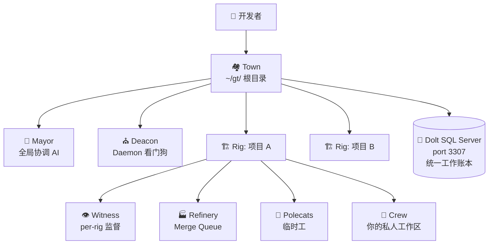
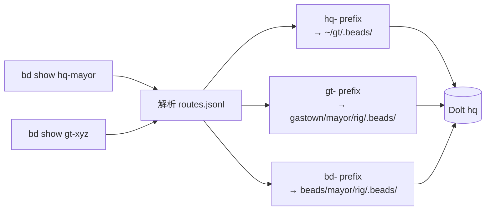
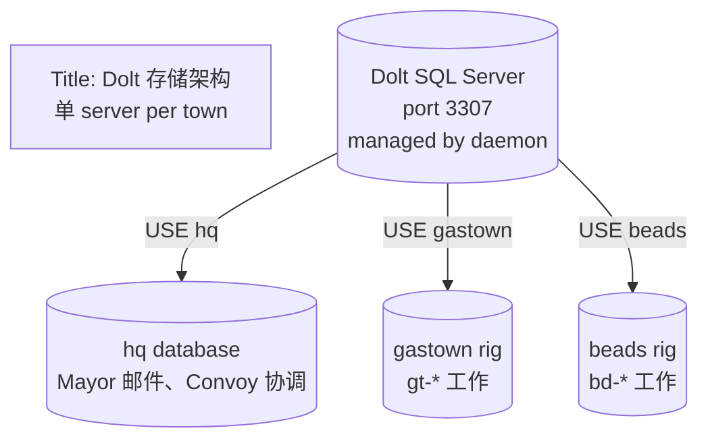
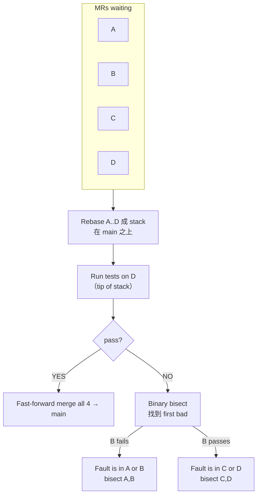
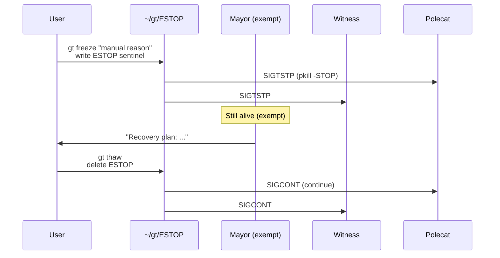
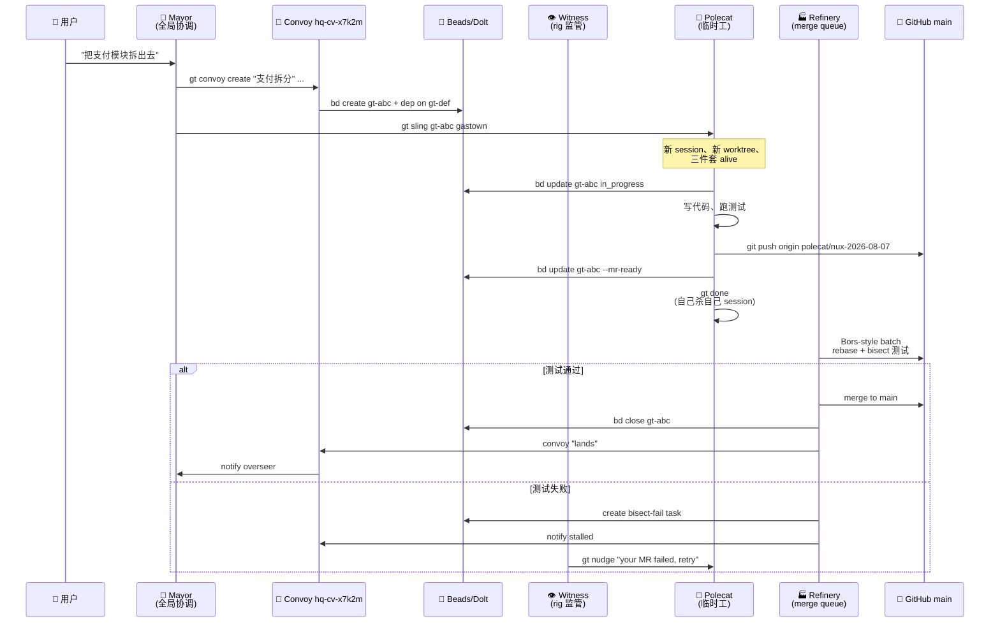

# 【Gas Town】核心架构与设计原理深度解析：让 30 个 AI Agent 像工厂一样协作

> 当 1 个 Coding Agent 已经不够用，当 5 个 Agent 让你手忙脚乱，当 20 个 Agent 失去控制——你需要的不是"又一个 Agent 框架"，而是一套**多 Agent 操作系统**。Gas Town 就是答案。

## 一、引子：当 Agent 从"一个"变成"一群"

2026 年，AI Coding Agent 已经从"个人玩具"变成"工程基础设施"。Claude Code、Codex、Gemini CLI、Copilot、Cursor — 你可以在同一台机器上同时跑 5 个、10 个、20 个 Coding Agent。

但问题接踵而至：

- **谁在做？** 当代码出 bug，你不知道是哪个 Agent 写的
- **谁可靠？** 哪个 Agent 适合做 Go 重构，哪个擅长写测试
- **上下文丢失：** Agent 重启后，前面 3 小时的思考归零
- **工作发散：** 让 5 个 Agent 同时修一个 bug，merge 时一片混乱
- **状态漂移：** Agent 在内存里记账，重启就忘光
- **紧急刹车：** Agent 集体"罢工"跑错方向时，怎么一键全停

传统的多 Agent 框架（LangGraph、AutoGen、CrewAI）是**"协作模式"**——告诉你怎么让两个 Agent 对话。但**当 Agent 数量从 2 涨到 30**，"协作模式"完全失效——你需要的是**"操作系统"**。

**Steve Yegge（著名技术作家 / 工程师）的答案是 Gas Town**——一个把 30 个 Coding Agent 当成"工厂"管理的工作区操作系统。它的核心理念可以用**三句口诀**概括：

| 口诀 | 全称 | 含义 |
|------|------|------|
| **MEOW** | Molecular Expression of Work | 工作按"分子级"拆解到原子 Bead |
| **GUPP** | Gas Town Universal Propulsion Principle | "你的 Hook 上有活，你就必须立刻干" |
| **NDI** | Nondeterministic Idempotence | 不确定的 Agent × 幂等的工作账本 = 最终一致 |

本文将带你**逐层掀开** Gas Town 的核心架构：从七角色分类、Beads/Dolt 工作账本、Polecat 三层生命周期、Convoy 跨项目编队，到 ESTOP 哨兵文件与 365 天哨兵时长等细节——这是一次对**生产级多 Agent 操作系统**的深度考察。

## 二、项目定位：不是框架，是工作区操作系统

| 指标 | 值 |
|------|-----|
| 仓库 | `gastownhall/gastown`（原 `steveyegge/gastown`） |
| Stars | 17,400+ |
| 语言 | Go (87%) + TypeScript + Shell + Python |
| License | MIT |
| Commit 数 | 1,000+ |
| 核心二进制 | `gt`（CLI）+ `bd`（Beads CLI，由独立仓库 `steveyegge/beads` 维护） |
| 活跃度 | 创建 2025-12，pushed 2026-08-05（昨天） |
| 适配 runtime | Claude Code / Codex / Copilot / Gemini / OpenCode |



**与传统方案的差异**：

| 方案 | 关注点 | 上限 |
|------|--------|------|
| LangGraph / AutoGen / CrewAI | 2-5 Agent 协作流程 | 超过 10 个 Agent 难以管理 |
| OpenAI Agents SDK | 单进程工具调用 | 不解决多 Agent 持久化 |
| **Gas Town** | **20-30 Agent 工厂式协同** | **为规模化设计** |

## 三、整体架构：七角色 × 五工作原语 × 三层账本

Gas Town 把"Agent 协作"这件事拆成了**三个清晰维度**：

### 3.1 七角色（Role Taxonomy）

```mermaid
graph LR
    subgraph town_level[Town 级别 - 跨项目]
        Mayor[🎩 Mayor<br/>全局协调]
        Deacon[⛪ Deacon<br/>看门狗后端]
        Dogs[🐕 Dogs<br/>基础设施临时工]
        Boot[🥾 Boot Dog<br/>每 5 分钟自检]
    end
    subgraph rig_level[Rig 级别 - per-project]
        Witness[👁️ Witness<br/>Polecat 监督]
        Refinery[🏭 Refinery<br/>Merge Queue 处理器]
        Polecat1[🦨 Polecat nux<br/>临时工]
        Polecat2[🦨 Polecat furiosa<br/>临时工]
        Crew[👤 Crew joe<br/>人类工作区]
    end
    Deacon --> Boot
    Boot --> Deacon
    Deacon --> Mayor
    Witness --> Polecat1
    Witness --> Polecat2
    Polecat1 -.完成.-> Refinery
    Refinery -.merge.-> GitRepo[(main)]
```



**两类完全不同的 Agent**：

- **Town 级（基础设施）**：Mayor / Deacon / Dogs / Boot — 跨项目协调、巡检、维护
- **Rig 级（项目工作）**：Witness / Refinery / Polecats / Crew — 干具体活

**角色 vs 生命周期对比**：

| 角色 | 类比 | 生命周期 | 工作特征 |
|------|------|----------|----------|
| **Mayor** | 项目总指挥 | Singleton + 持久 | 跨 rig 协调、感知全貌 |
| **Deacon** | 24h 巡检员 | Singleton + 持久 | 后台循环、超时识别 |
| **Boot** | 督察员 | Ephemeral（每 5 分钟） | 自检 Deacon 是否还活着 |
| **Witness** | 工地工头 | per-rig + 持久 | 监管本工地所有 Polecat |
| **Refinery** | 工厂流水线 | per-rig + 持久 | Bors-style 批量合并 MR |
| **Polecat** | 临时工 | 身份持久 / 会话临时 | 被 `gt sling` 后立刻干 |
| **Crew** | 私人助理 | per-project + 持久 | 用户长期对话窗口 |

### 3.2 五工作原语（Work Primitives）

| 原语 | 全称 | 类比 | 关键操作 |
|------|------|------|----------|
| **Bead** | Git-backed atomic work unit | Jira issue 单条 | `bd create`, `bd close` |
| **Formula** | TOML workflow template | 工艺手册 | `bd formula show` |
| **Molecule** | Durable chained Bead workflow | 装配流水线 | `bd mol run` |
| **Wisp** | Ephemeral Bead | 临时传单 | 自动销毁 |
| **Hook** | Per-agent pinned Bead | 个人待办 | `bd hook` 显示"该你干的事" |

### 3.3 三层存储账本

```mermaid
graph TB
    subgraph s1[Town 级账本 ~/gt/.beads/]
        hq[hq-* prefix<br/>跨 rig 协调]
    end
    subgraph s2[Rig 级账本 `<rig>/mayor/rig/.beads/`]
        rig[gt-*/bd-* prefix<br/>本项目工作]
    end
    subgraph s3[运行时数据库 Dolt]
        db[(Dolt SQL Server<br/>port 3307<br/>Git + SQL 双向)]
    end
    hq -.routes.jsonl.-> rig
    s1 -.Dolt commits.-> db
    s2 -.Dolt commits.-> db
```

**为什么用 Dolt 而不是 SQLite / PostgreSQL / MySQL？**

Dolt = Git × SQL。它是**"SQL 数据库，但每一个 commit 都是个版本"**。这跟 Gas Town 的 GUPP 哲学完美契合：

- Agent 写 Bead → Dolt commit → 立即跨 Agent 可见
- 历史可回放 → "谁在什么时候改了这个 issue"
- 分布式协作 → 不需要中央事务锁

**`routes.jsonl` 路由表**：

```jsonl
{"prefix":"hq-","path":"."}
{"prefix":"gt-","path":"gastown/mayor/rig"}
{"prefix":"bd-","path":"beads/mayor/rig"}
```

打 `bd show gt-xyz` 自动路由到 gastown rig 的 `.beads/`。所有 Polecat 共享同一 Dolt 数据库，通过 `.beads/redirect` 软链接（而不是各自拷贝）：

```
polecats/alpha/.beads/redirect  →  ../../mayor/rig/.beads
refinery/rig/.beads/redirect    →  ../../mayor/rig/.beads
```

### 3.4 目录结构总览

```
~/gt/                           Town root（实际是一个 git 仓库）
├── .beads/                     Town 级账本（hq-* 前缀）
├── .dolt-data/                 集中 Dolt 数据
│   ├── hq/                     Town 数据库
│   ├── gastown/                gastown rig 数据库
│   └── beads/                  beads rig 数据库
├── daemon/                     daemon 运行时状态
├── deacon/                     Deacon 工作区
├── mayor/                      Mayor 总指挥
├── settings/
├── directives/                 Town 级角色指令（运营策略）
├── formula-overlays/           Town 级 Formula 覆盖
└── <rig>/                      每个项目一个 rig
    ├── config.json             rig 标识
    ├── mayor/rig/              canonical clone（beads 真身）
    ├── refinery/               Refinery agent 工作区
    ├── witness/                Witness agent 工作区
    ├── crew/<name>/            人类工作区（完整克隆）
    └── polecats/<name>/        临时工（git worktree）
```

`internal/daemon/daemon.go` 是 115KB 的核心 Daemon 文件，启动后监控 Dolt server、调度 Deacon、派发 Dogs。

## 四、核心机制一：GUPP — 让 Agent 不需要"等人推"

**GUPP = Gas Town Universal Propulsion Principle**：Hook 上有活，你就跑。**"The hook IS your assignment. Execute immediately without waiting for confirmation."**

Hook 是 per-agent 的 pinned Bead —— 类似"个人 TODO"。Agent 启动后第一件事是 `bd hook`：

```bash
$ bd hook
gastown/polecats/nux
  gt-abc12:  Fix login validation (P1)
            Status: in_progress
            Branch: polecat/nux-2026-08-05
            Worktree: ~/gt/gastown/polecats/nux
```

如果 Hook 上有活 → 立刻跑。如果没有 → 等待（Deacon 会定期巡查）。

**为什么"Propulsion Principle"是核心？**

传统方案里你得写一段"Agent 启动后检查任务"的样板代码。Gas Town 把这件事**编进 Agent 的存在意义**——它**就是**"看到活就干"的工具人。

**反例 —— Witness 的反 Propulsion**：

跟 Polecat 不同，**Witness 故意不跑 Hook 上的活**。它只**"盯"**，不"干"。如果 Witness 把活也干了，它就成了瓶颈。所以 Witness 跟 Polecat 的职责严格分离：

| Agent | Hook 行为 | 为什么 |
|-------|-----------|--------|
| Polecat | **干** Hook 上的活 | 是劳动者 |
| Crew | **干** Hook 上的活 | 是人类工作区 |
| Witness | **不干** Hook 上的活，只盯 Polecat | 避免自身成为瓶颈 |
| Refinery | **不干** Hook 上的活，只 merge MR | 是合并工人，不是开发 |
| Mayor | **不干** Hook 上的活，只协调 | 是总指挥 |
| Deacon | **不干** Hook 上的活，只巡检 | 是看门狗 |

这个分层是**真正的"工业流水线"思想**——每个角色只负责一件事，做完了就退休（详见 §五）。

## 五、核心机制二：Polecat 三层生命周期

**Polecat 是 Gas Town 最具特色的设计**：它是"临时工"——有持久身份但每次任务开个新会话。一个 Polecat 跑完活后，**身份不退、会话死掉**。

### 5.1 三层职责独立

| 层 | 组件 | 生命周期 | 内容 |
|----|------|----------|------|
| **Identity** | Agent bead + CV chain + work history | **永久** | 这个 Polecat 做过什么、专长 |
| **Sandbox** | worktree + branch + BEADS_DIR | 每任务新建 | 这一次任务的物理隔离 |
| **Session** | Claude Code context window | 每任务新建 | 当前任务的思考上下文 |

**为什么必须三层分离？**

早期版本把三层合在一起（"nuke 一切"），结果：完成任务的 Polecat 又被复用、残留的 session 混淆下一次任务、修过这个 bug 的历史也丢了。

**新模型：完成即退休。**

```
         ┌──────────┐
         │  IDLE    │  ← 刚建好，等接活
         └────┬─────┘
              │ gt sling "fix bug #123"
              v
         ┌──────────┐
         │ WORKING  │  ← session alive、hook 已设
         └────┬─────┘
              │ gt done  ← 完成、推分支、提 MR
              v
         ┌──────────┐
         │  DONE    │  ← session dies、保留 evidence
         └──────────┘
```

"done" 的意思**不是"把会话挂起"**，而是**"把会话杀掉"**。分支/MR metadata 留给 Witness/Refinery 收拾。

### 5.2 Self-Managed Completion

**Witness 故意不处理完成逻辑**——避免成为瓶颈：

> Polecat finishes work
>  → Push branch to remote
>  → Submit MR (bd update --mr-ready)
>  → Update bead status
>  → Tear down worktree
>  → Kill own session  ← 自己杀自己
>  → Go idle (等待下次分配)

Witness 反而只做"盯"——发现 Polecat 长时间不活跃就 nudge、升级、回收。**这是 Producer/Consumer 分离的极致**——完成逻辑不假他人，避免分布式系统里最常见的"等锁/等通知/等响应"。

### 5.3 Polecat 心跳 + keepalive 哨兵

为了让 Witness 能发现"僵尸 Polecat"，每个 Polecat 写一个 `.runtime/keepalive.json`：

```go
// 来自 internal/keepalive/keepalive.go:84
type State struct {
    LastCommand string    `json:"last_command"`
    Timestamp   time.Time `json:"timestamp"`
}

func TouchInWorkspace(workspaceRoot, command string) {
    runtimeDir := filepath.Join(workspaceRoot, ".runtime")
    _ = os.MkdirAll(runtimeDir, 0755)
    state := State{
        LastCommand: command,
        Timestamp:   time.Now().UTC(),
    }
    data, _ := json.Marshal(state)
    _ = os.WriteFile(filepath.Join(runtimeDir, "keepalive.json"), data, 0644)
}
```

**`Ack` 设计哲学：best-effort（最佳努力）**

```go
// 来自 internal/keepalive/keepalive.go:53
func Touch(command string) {
    TouchWithArgs(command, nil)  // 没有返回值，所有错误静默吞
}
```

keepalive 信号**故意设计成"失败也无害"**——盘满、权限、磁盘快照都不应该阻塞 `gt` 命令。

**365 天哨兵时长模式（首次见到）**

```go
// 来自 internal/keepalive/keepalive.go:132
func (s *State) Age() time.Duration {
    if s == nil {
        return 24 * time.Hour * 365   // Sentinel: 把"无信号"当成"最陈旧"
    }
    return time.Since(s.Timestamp)
}
```

调用方可以无脑 `if state.Age() > 5*time.Minute { ... }` —— 没有信号时返回"365 天前"，必然超过任何超时阈值。**这是优雅的"无 nil 守卫"设计**：把"哨兵 / 异常 / 缺失"统一处理。

### 5.4 Nudge 队列 — 实时通信

Polecat 完成或卡住时，Witness 通过 Nudge 队列发消息：

```go
// 来自 internal/nudge/queue.go (节选)
// Nudge 是一条即时消息，直接送进目标 agent 的 session
type Nudge struct {
    Target  string    // "mayor" / "deacon" / "witness" / "laneassist/crew/dom"
    Payload string
    SentAt  time.Time
}
```

通过 `gt nudge` 发送：

```bash
gt nudge mayor "Status update: PR review complete"
gt nudge laneassist/crew/dom "Check your mail — PR ready for review"
```

**Mailbox vs Nudge 的区别**：

| 机制 | 延迟 | 持久化 | 用途 |
|------|------|--------|------|
| **Mail** | 异步 | 跨 session 持久 | "这是详细的多行任务说明" |
| **Nudge** | 即时 | 不持久 | "醒醒，这条 mail 给你" |
| **Handoff** | 即时 | 持久 session 状态 | "我累了，下一个 session 接班" |

## 六、核心机制三：Beads × Dolt × Convoy — 工作编队

### 6.1 Convoy 跨项目工作流

**Convoy 是工作编队的概念**——把"修这个 bug + 加那个 feature + 改这个 typo"打包成一队，让一组 Polecat 协同冲刺：

```bash
$ gt convoy create "Login Refactor" gt-abc gt-def --notify overseer
hq-cv-x7k2m created (3 beads, overseer notified)

$ gt convoy status hq-cv-x7k2m
Convoy  hq-cv-x7k2m  Login Refactor
Beads   gt-abc ✅ closed (nux)
        gt-def ⏳ in_progress (furiosa)
        gt-ghi 📋 ready
Swarm   2 polecats active
ETA     ~12 minutes
```

**Convoy vs Swarm 的区分**：

| 概念 | 持久？ | ID | 含义 |
|------|--------|-----|------|
| **Convoy** | ✅ | `hq-cv-*` | 跟踪单元。你创建、查询、被通知 |
| **Swarm** | ❌ | 无 | "目前在这个 convoy 上的 Polecat" |

**Mountain Convoy**：带 `mountain` 标签的 convoy 启用 **autonomous stall detection + smart skip**——Polecat 死了自动重新派发、卡住的 bead 自动跳过。**这是给"史诗级大项目"准备的**。

### 6.2 Beads 的两层账本设计



Town 级（hq-*）管跨 rig 协调；Rig 级管项目工作。**所有内容最终落到同一 Dolt SQL Server**：



**为什么不直接用 SQLite 或 Postgres？**

Dolt = **Git + SQL**：

| 特性 | SQLite | Postgres | Dolt |
|------|--------|----------|------|
| 版本化历史 | ❌ | ❌ | ✅ 每个 commit 是版本 |
| 分支合并 | ❌ | ❌ | ✅ Git-style merge |
| SQL 查询 | ✅ | ✅ | ✅ |
| 适合 Agent 写 | ✅ 简单 | ⚠️ 需 server | ✅ 一致 commit 即立即可见 |

Dolt 让 **"Agent 写 → Dolt_commit → 跨 Agent 立即可见"**成为原子操作。PostgreSQL 也能做，但需要外部 process 管理；Dolt 把**版本化**作为一等公民内置。

### 6.3 Beads 路由与 redirect

Worktree（polecats / refinery / crew）不存自己的 beads 数据库：

```
polecats/alpha/.beads/redirect  →  ../../mayor/rig/.beads
refinery/rig/.beads/redirect    →  ../../mayor/rig/.beads
```

`ResolveBeadsDir()` **递归跟随 redirect，最多 3 层，带环路检测**——所有 Agent 在一个 rig 共享一个 beads 数据库。

## 七、核心机制四：Refinery — Bors-Style 批量合并

Refinery 处理 Polecat 提交的 MR。Bors 是 Rust 编译器团队发明的**批量测试二分定位**算法，Gas Town 直接复用：



**三阶段落地**（从 `docs/design/architecture.md`）：

| Phase | Bead ID | 内容 | 状态 |
|-------|---------|------|------|
| 1: GatesParallel | gt-8b2i | 每个 MR 并行跑 test + lint | 进行中 |
| 2: Batch-then-bisect | gt-i2vm | Bors-style batching + 二分 | 被 Phase 1 阻塞 |
| 3: Pre-verification | gt-lu84 | Polecat 提交 MR 前跑测试 | 被 Phase 2 阻塞 |

Phase 1 是不可绕过的关键路径：因为只有"并行跑 gates"稳定了，才能进入"批量二分"。**每阶段必须等前一阶段上线**——这种"线性依赖"清晰展示了团队的工程纪律。

## 八、核心机制五：ESTOP 与紧急冻结 — 哨兵文件 + 进程信号

**ESTOP**（Emergency Stop）是 Gas Town 的"红色大按钮"——一个**纯文件系统**实现的 town 级别暂停机制：

```go
// 来自 internal/estop/estop.go:36
const FileName = "ESTOP"   // 哨兵文件名

func IsActive(townRoot string) bool {
    _, err := os.Stat(filepath.Join(townRoot, FileName))
    return err == nil
}

// 激活：写入 sentinel
func Activate(townRoot, trigger, reason string) error {
    ts := time.Now().Format(time.RFC3339)
    content := fmt.Sprintf("%s\t%s\t%s\n", trigger, ts, reason)
    return os.WriteFile(filepath.Join(townRoot, "ESTOP"), []byte(content), 0644)
}
```

**哨兵文件格式**：
```
manual	2026-08-05T10:23:45Z	Suspecting infinite loop in refinery
auto	2026-08-05T11:00:01Z	Deacon detected 5 stuck polecats
```

第一列 `manual` 或 `auto` 表示触发方式。第二列 ISO 时间。第三列原因。

**多粒度 ESTOP**：

```go
// Town 级 vs Rig 级
const FileName = "ESTOP"                            // town 级全局
func RigFileName(rigName string) string {
    return fmt.Sprintf("ESTOP.%s", rigName)         // 命名空间隔离
}
```

**Mayor 豁免**：

```go
// 来自 internal/estop/estop.go:6
// The Mayor is exempt from E-stop so it can coordinate recovery.
```

这是**架构思考的反射**：一旦全停了，所有 Agent 都不能动，但**总得有人能组织恢复**——这个角色只能是 Mayor。一句话注释就把"系统级暂停必须留逃生通道"的设计哲学写透了。

**激活流程**：



**触发自动 ESTOP**：当 Deacon 发现 5+ Polecat 卡住超阈值，自动激活。等 30 秒没人响应即升级到 Overseer。

## 九、Provider 多运行时适配器

Gas Town 的核心抽象：**"跑 Coding Agent"这件事应该是 runtime-agnostic**。

```go
// 来自 internal/agent/provider/provider.go:32
type ACPProvider interface {
    Initialize(ctx context.Context, clientName, clientVersion string) (*InitializeResult, error)
    ListTools(ctx context.Context) ([]Tool, error)
    CallTool(ctx context.Context, name string, args map[string]any) (*CallToolResult, error)
    CreateMessage(ctx context.Context, params CreateMessageParams) (*CreateMessageResult, error)
    GetStatus() AgentStatus
    OnToolCall(callback ToolCallback)
    OnSessionStart(callback SessionStartCallback)
    Close() error
}
```

**ACP = Agent Communication Protocol**——这是 Steve Yegge 在跟 Anthropic 沟通过程中推动的标准（与 LangChain 的 LangGraph、CrewAI 都不一样，ACP 是给"工厂级多 Agent 调度"设计的）。

```go
// 来自 internal/agent/provider/provider.go:12
const (
    StateDisconnected ProviderState = "disconnected"
    StateConnecting   ProviderState = "connecting"
    StateReady        ProviderState = "ready"
    StateBusy         ProviderState = "busy"
    StateError        ProviderState = "error"
)
```

**5 态状态机**让 Witness/Deacon 能精确感知 Agent 状态。

**多种 ACP 后端实现**：

| Backend | 用途 | 位置 |
|---------|------|------|
| `acp.go` | ACP 协议标准实现 | `internal/agent/provider/acp.go` |
| `proxy_unix.go` / `proxy_windows.go` | 平台进程代理 | `internal/acp/` |
| `claudecode.go` | Claude Code 适配 | `internal/agentlog/claudecode.go` |
| `opencode.go` | OpenCode 适配 | `internal/agentlog/opencode.go` |

**Hook 模板**（每个 runtime 都有专属配置）：

```
internal/hooks/templates/
├── claude/
│   ├── settings-autonomous.json
│   └── settings-interactive.json
├── codex/
│   ├── hooks-autonomous.json
│   └── hooks-interactive.json
```

**一个 CLI 同时管 5 种 runtime**——这是 Gas Town 比"Claude Code 外挂"或"Codex 适配"等单点方案高一个维度的地方。

## 十、Formula × Molecule × TOML — 工作流引擎

**Formula 是"工序说明书"**：TOML 文件描述"按这几步执行"。

```toml
# 来自 internal/formula/formulas/code-review.formula.toml (简化)
name = "code-review"
steps = [
    { name = "list-changes", tool = "git", args = ["diff", "main"] },
    { name = "summarize", tool = "llm", prompt = "..." },
    { name = "post-comment", tool = "gh", args = ["pr", "comment", ...] },
]
```

**Formula = 模板**；Molecule = 实例化（带 worktree）；Wisp = 临时实例（不持久）。

**Poured Wisp vs Root-Only Wisp**：

| 类型 | 持久化 | checkpoint recovery | 用途 |
|------|--------|---------------------|------|
| Root-Only Wisp | ❌ 运行时实例化 | 不支持 | 简单流水线 |
| Poured Wisp | ❌ 但步骤有 checkpoint | 支持 | 复杂失败恢复 |

**Operator 覆盖机制**：

```
~/gt/formula-overlays/<formula>.toml      # Town 级
~/gt/<rig>/formula-overlays/<formula>.toml  # Rig 级（完全覆盖 Town 级）
```

三种覆盖模式：`replace` / `append` / `skip`。**Rig 级覆盖 Town 级**，而不是合并——确保**单一来源**。

**Doctor 验证**：升级 Gas Town binary 时，`gt doctor` 自动检查所有 overlay 的 step ID 是否仍有效——避免 stale reference 静默失败。

## 十一、端到端数据流：用户输入到 main 分支



**关键设计**：Mayor/Convoy/Witness/Refinery 是**调度层**，Polecat 是**执行层**。Beads/Dolt 是**共享账本**——任何一方写，所有方立即可见。

## 十二、与同类项目对比

| 维度 | LangGraph / AutoGen | openai-agents-sdk | **Gas Town** |
|------|---------------------|-------------------|--------------|
| 设计目标 | 2-5 Agent 对话/工作流 | 单进程 + Tools | 20-30 Agent 工厂协同 |
| 持久化 | 内存 + 外部 DB | 内存 thread | **Dolt 持久账本** |
| 状态可见性 | 用户视角 | 黑盒 | **每个 Agent 完整 CV** |
| 并发模型 | 协作图 | 单线程 | **Polecat + Worktree 隔离** |
| 错误恢复 | 重试 / 重启 | 重试 | **E-stop + Deacon + 自动 redispatch** |
| 合并策略 | 不管 | 不管 | **Bors-style batch bisect** |
| Runtime 适配 | 单一 LLM | OpenAI | **Claude/Codex/Copilot/Gemini/OpenCode 5 选 1** |

**vs LangGraph**：LangGraph 给你"流程图"；Gas Town 给你"工厂"。
**vs AutoGen**：AutoGen 让 Agent 对话；Gas Town 让 Agent 上工。
**vs openai-agents-sdk**：openai-agents-sdk 是"单 Agent toolkit"；Gas Town 是"多 Agent OS"。
**vs goose / Claude Code**：这些是 **Coding Agent Harness**——"Agent 怎么写代码"；Gas Town 是 **"Coordinator"**——"多个 Agent 怎么一起写代码"。

**Gas Town 不是替代 Harness，是 Harness 的"总调度"。** 实际上 Gas Town 内部就**集成 Claude Code 和 Codex 作为 runtime**——"用 Harness 当工人，Gas Town 当工头"。

**核心洞察**：

> "Most agent frameworks stop at 2-5 agents. Gas Town is the **first to take 20-30 agents seriously** as an operating system problem."

## 十三、优缺点分析

| 维度 | 优势 | 代价 |
|------|------|------|
| **架构清晰** | 七角色 × 五工作原语 × 三层账本是**正交三维**——增删角色不影响其他维度 | 学习曲线陡；新人需理解 30+ 术语 |
| **可扩展性** | 五 Runtime 适配 + Plugin 系统（11 个 plugin 已上线）+ Town/Rig 双层 overlay | 适配新 Runtime 需写 ACPProvider 实现 |
| **持久化** | Dolt = Git × SQL，原子 commit 即跨 Agent 可见 | 单 Dolt server 是潜在 SPOF；daemon 自动监控 + 重启缓解 |
| **可观测性** | Agent bead + audit + CV chain + Convoy 状态面板 | 三大子系统（beads/events/mail）日志格式各异 |
| **健壮性** | ESTOP 三层 + Deacon Patrol + 自动 Bug detection + Stranded Convoy 警告 | Witness 故意不做事——意味着需要 Polecat 自己实现清理，否则会留垃圾 |
| **多 Runtime** | ACP 协议 + 5 后端实现 | ACP 标准仍在演进，runtime 间能力不对等 |
| **DevOps 友好** | Homebrew + npm + OIDC trusted publishing + GoReleaser 一键发布 | 多渠道发布增加 CI 复杂度 |

**关键张力**：**"Deacon 不参与完成，Witness 不管干活"** 是设计优点也是风险——一旦单个 Polecat 罢工，必须**靠外部 Watchdog 触发**才能恢复。Witness 有 stuck detection 但**阈值+冷却时间配置**目前是手工。

## 十四、实践：部署 Gas Town

### 14.1 安装

```bash
# 官方推荐方式
brew install steveyegge/gastown/gt
brew install steveyegge/beads/bd

# 验证
gt --version
bd --version
```

### 14.2 创建 Town

```bash
# 1. 创建 town
gt install ~/gt

# 2. 进入 town
cd ~/gt

# 3. 创建第一个 rig（项目）
gt rig add my-project /path/to/repo

# 4. 启动 Mayor（你的主要 AI 交互入口）
# Mayor 自动以 Claude Code runtime 启动
gt mayor

# 5. 在 Mayor 里启动 Deacon 后台 daemon
gt deacon start
```

### 14.3 给 Polecat 派活

```bash
# 创建工作项
bd create --title="修复登录 bug" --type=bug --priority=P1
# → gt-abc12

# 创建 convoy 跟踪
gt convoy create "登录模块修复" gt-abc12 --notify overseer
# → hq-cv-x7k2m

# 派给 Polecat（注意：新 session、新 worktree）
gt sling gt-abc12 my-project
# → 启动新 Claude Code 实例在 ~/gt/my-project/polecats/<name>/

# 查看进展
gt convoy status hq-cv-x7k2m
bd hook  # 看 Polecat 视角
```

### 14.4 紧急冻结

```bash
# 全 town 暂停
gt freeze manual "Suspecting infinite loop"

# 验证
ls -la ~/gt/ESTOP
cat ~/gt/ESTOP
# manual\t2026-08-07T10:23:45Z\tSuspecting infinite loop

# 单独冻结某个 rig
gt freeze --rig my-project auto "5 stuck polecats detected"

# 解冻
gt thaw
```

### 14.5 健康检查与升级

```bash
# Doctor 系统级诊断
gt doctor
# Checks: dolt running, beads redirect ok, formulas valid, overlays not stale...

# 查看 Polecat 状态
gt polecat list
# IDLE count: 7  WORKING count: 3  STUCK count: 1

# 升级 binary
brew upgrade gt bd
gt doctor --upgrade  # 自动迁移 Dolt schema
```

## 十五、趋势与工程经验

### 趋势 1：MEOW 正在成为多 Agent 协同的事实标准

`Work = Molecule of Beads` 的抽象是**生产力放大器**——把"修三个 bug + 加一个 feature + 改一处 typo"变成 `gt convoy` 一句话。**MEOW 的本质是"工作可分解性假设"**：只要任务能拆到 Bead 粒度，Agent 群就能并行处理。

**未来演进**：
- **跨 town 工作**：通过 `routes.jsonl` 已经实现，但 daemon 层的跨 town 同步还没做
- **动态 Convoy**：根据 Polecat 当前产能自动调整 convoy 大小
- **可观察的 Convoy**：每个 convoy 自带 OpenTelemetry span

### 趋势 2：MEOW × GUPP × NDI 三原则 = "LLM 原生操作系统"的核心公理

- **MEOW** 解决"工作如何拆"（结构问题）
- **GUPP** 解决"Agent 何时跑"（时机问题）
- **NDI** 解决"结果如何稳定"（一致性保证）

这就是为什么 Gas Town 跟 LangGraph 完全不是一个范式——LangGraph 是"prompt + 图"，Gas Town 是"工作原子 + 自主执行 + 账本回放"。

### 趋势 3：Sentinel 文件 + 哨兵时长模式会被广泛采用

ESTOP 用 file sentinel 实现全 town 暂停；keepalive 用 "365 天"哨兵时长表示"无信号"。**这两个模式简洁优雅，会被复制到**：

- **AI Agent 编排**：跨进程暂停 / 恢复（类似 K8s 的 `kubectl cordon`）
- **分布式锁**：file 锁 + 时长哨兵
- **在线/离线检测**：keepalive + 时长兜底

### 趋势 4：Coding Agent OS 层的边界正在形成

2026 H1 已经形成三层栈：

```
┌─────────────────────────────────┐
│  Coding Agent OS                │  ← Gas Town（多 Agent 调度）
│  (workspace + convoy + roles)   │
├─────────────────────────────────┤
│  Coding Agent Harness           │  ← goose/Claude Code/Codex（runtime）
│  (single agent + tools + hooks) │
├─────────────────────────────────┤
│  LLM Provider Registry          │  ← LiteLLM/claude-code-router（模型）
└─────────────────────────────────┘
```

Gas Town 是 **"Coding Agent OS"** 这层的第一个严肃落地——之前大家都在 Harness 层（goose/claude-code/router）或 Provider 层（litellm/portkey）卷，**多 Agent 操作系统是被忽视的金矿**。

### 趋势 5：Dolt 是被低估的数据库

AI Agent 时代，"**谁写了什么 / 什么时候 / 改了什么 / 为什么改**"是核心需求。Git 给代码解决了这个问题，但**Agent 的工作**（issue 状态、commit evidence、CV chain）需要一个**版本化的 SQL 数据库**。Dolt 把这两件事合一。**预测**：未来 12 个月会有越来越多项目用 Dolt 替代 SQLite + 另存 Git。

### 工程经验提炼

1. **GUPP 适合一切"自主执行"的系统**——CI runner、ETL worker、定时任务。看一眼你的 queue 是否有活、有就立刻干。
2. **三层持久化分离（Identity/Sandbox/Session）**适合一切"短期任务、长期身份"的 worker 模型——CronJob、Lambda、Coding Agent。
3. **365 天哨兵时长**是一个**优雅的"无 nil 守卫"模式**——把"缺失/陈旧/异常"统一返回远超任何阈值的时长。
4. **Town/Rig 双层 overlay 完全覆盖而非合并**，避免配置组合爆炸。
5. **Mayor 豁免 ESTOP** 是"系统级暂停必须留逃生通道"的反射——任何"kill switch"设计都要问"谁来恢复"。

## 附录：关键资源

| 资源 | 路径 |
|------|------|
| GitHub | <https://github.com/gastownhall/gastown>（原 steveyegge/gastown） |
| Beads 子项目 | <https://github.com/steveyegge/beads> |
| 核心文档 | `~/gt/CLAUDE.md` + `gt prime`（运行时注入上下文） |
| 角色定义 | `internal/agent/provider/provider.go` |
| 紧急停止 | `internal/estop/estop.go` |
| 心跳实现 | `internal/keepalive/keepalive.go` |
| Polecat 经理 | `internal/polecat/manager.go` |
| 架构设计 | `docs/design/architecture.md`（15.7KB） |
| 角色分类 | `docs/overview.md` + `glossary.md` |
| Convoy | `docs/concepts/convoy.md` + `docs/concepts/polecat-lifecycle.md` |
| ACP 协议 | `internal/agent/provider/acp.go` |
| Distribution | `brew install steveyegge/gastown/gt` / `npx @gastown/gt` |
| License | MIT |

---

**写作总结**：

Gas Town 不是"又一个多 Agent 框架"——它是**多 Agent 操作系统**的开山之作。**MEOW/GUPP/NDI 三原则**给"30 个 Agent 协同"提供了**工程级答案**。当 LangGraph、AutoGen、CrewAI 这些"协作框架"还在 2-5 Agent 挣扎时，Gas Town 已经把 20-30 Agent 当作**工厂流水线**在跑——用 **Dolt 工作账本**承载所有上下文、用 **Polecat 三层生命周期**做到完成即退休、用 **ESTOP 哨兵文件 + 365 天哨兵时长**做"一键冻结"、用 **ACP 多运行时适配器**让 CLI 同时管 5 种 Coding Agent。

如果你正在做"多 Agent 协作"，请**认真研究 Gas Town**——它给出了 2026 年多 Agent 操作系统的**事实标准范式**。
