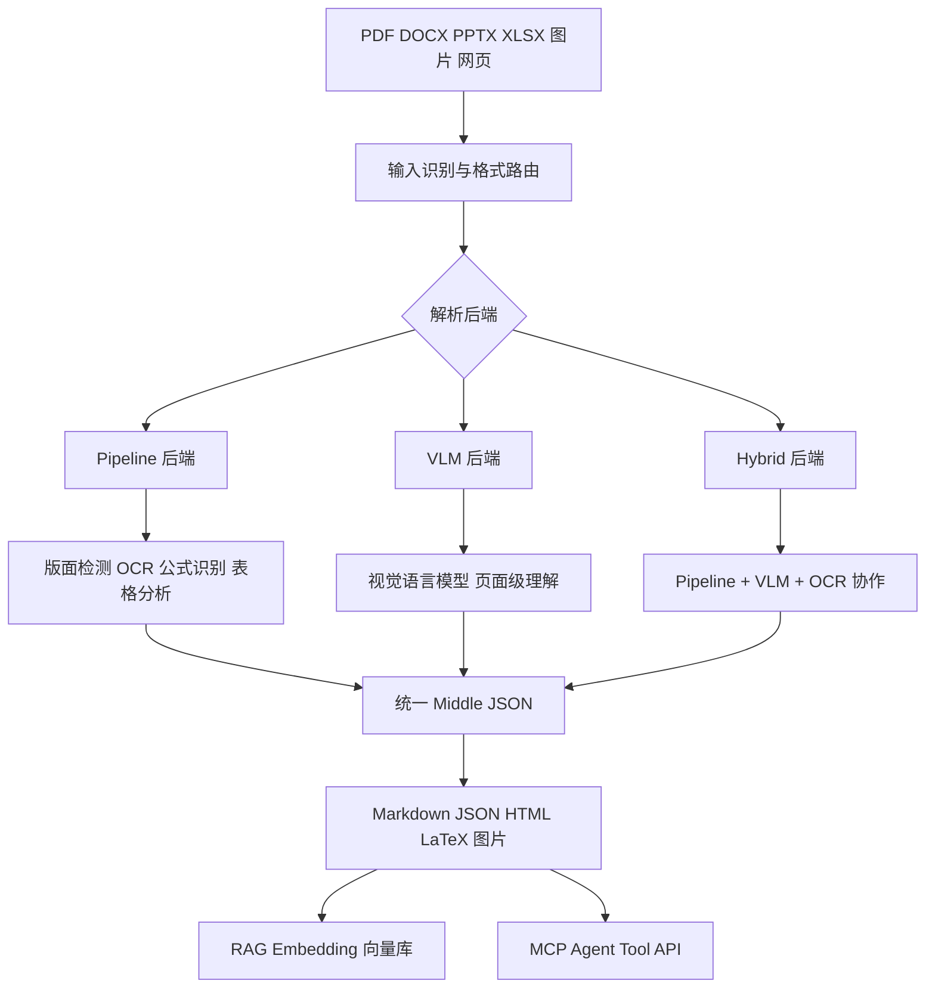
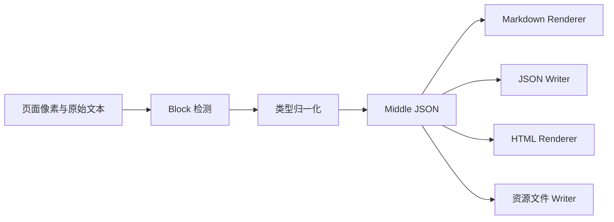
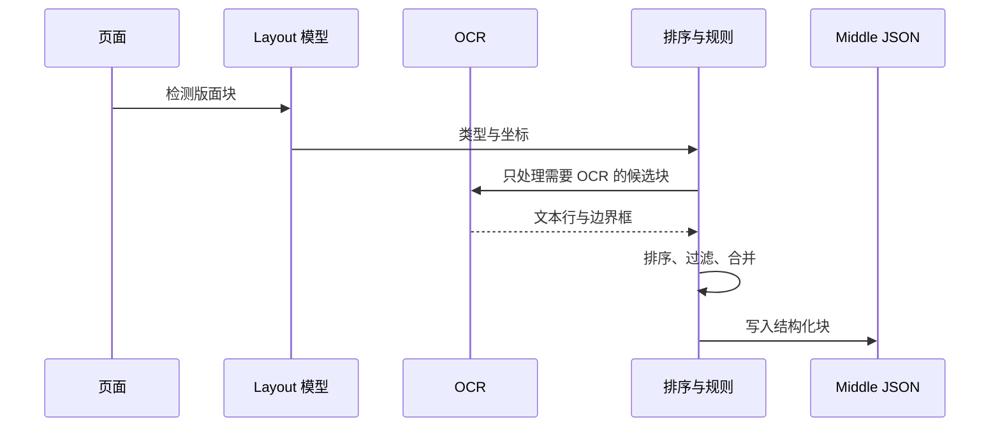
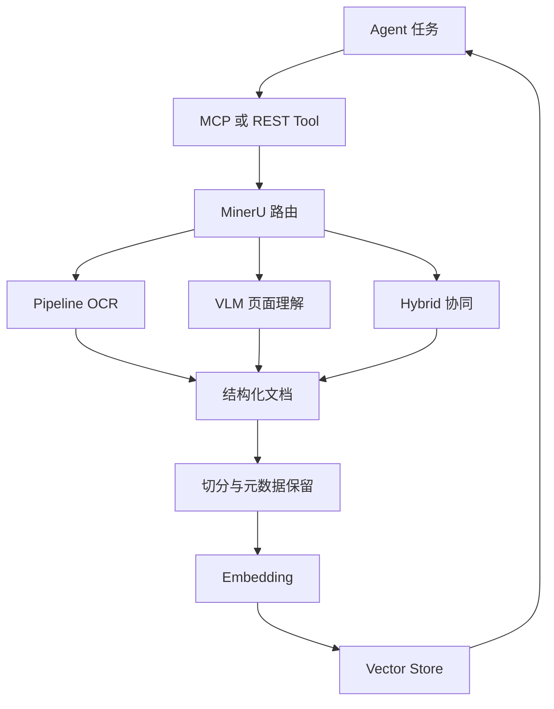
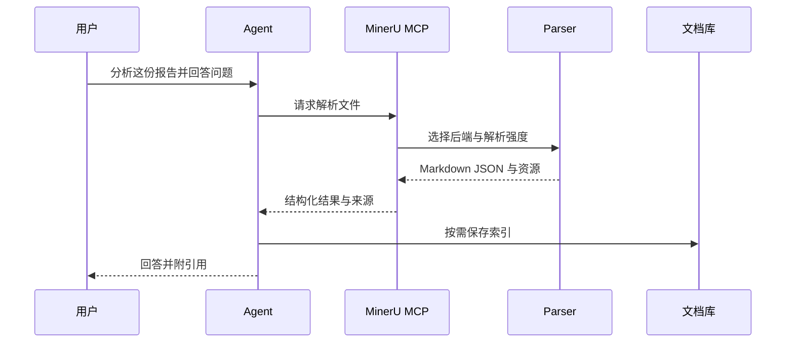

# 【MinerU】核心架构与设计原理深度解析：把复杂文档变成 Agent 能读懂的上下文

> 本文基于 [opendatalab/MinerU](https://github.com/opendatalab/MinerU) 公开仓库进行分析。文中版本数据和源码路径以 2026 年 8 月 7 日调研时可见内容为准。

## 一、引子：Agent 的瓶颈经常不是模型，而是文档

很多 RAG 或 Agent 项目把注意力放在模型、向量库和 Prompt 上，却忽略了最先发生的一步：**文档究竟有没有被正确读出来**。

一份真实的企业 PDF 可能同时包含多栏正文、扫描页、表格、数学公式、页眉页脚、脚注、图片说明和跨页表格。若直接 OCR，阅读顺序会乱；若只提取文本，表格和公式会丢；若只用视觉模型，又会增加推理成本和幻觉风险。

MinerU 的定位不是聊天机器人，也不是向量数据库，而是 Agent 数据入口层：把 PDF、DOCX、PPTX、XLSX、网页和图片转换成保留结构的 Markdown、JSON、HTML、LaTeX 及图片资源。它的价值在于让下游 Agent 接收到**有顺序、有类型、有坐标、有引用边界**的上下文。

## 二、项目定位与核心价值

截至调研日，MinerU GitHub 仓库约有 **7.7 万 stars**，主要语言为 Python，最近仍有提交。README 将它描述为面向 LLM、RAG 和 Agent 工作流的高精度文档解析引擎，并列出 OCR、VLM、MCP Server、CLI、REST API、Docker 以及 LangChain、LlamaIndex、Dify、FastGPT 等集成入口。

它解决的是一个经常被低估的问题：

```text
原始文档 → 版面与内容理解 → 结构化中间表示 → Markdown / JSON → RAG / Agent
```

与简单的 `pdf_to_text` 不同，MinerU 试图保留文档的语义结构：标题仍然是标题，表格仍然是表格，公式转换为 LaTeX，图片和表格可保留位置信息，页眉页脚等噪声可以被过滤。

## 三、整体架构：双引擎与统一中间表示



### 3.1 输入层：先分类，再决定代价

MinerU 不把所有页面都交给同一种模型。源码中的 `ocr_classify()` 会依据 `parse_method` 和 PDF 分类结果决定是否启用 OCR：`auto` 只对被判断为扫描型的文档打开 OCR，`ocr` 则强制启用。

这是一种重要的成本控制：文本型 PDF 可以走快速路径，扫描件才使用更昂贵的视觉处理。对于批处理场景，这比把每页都发送给 VLM 更稳定。

### 3.2 后端层：Pipeline、VLM 与 Hybrid

README 提供了三种推理后端：

| 后端 | 设计重点 | 适合场景 |
|---|---|---|
| Pipeline | 传统视觉模型、OCR、版面分析组合 | 速度、稳定性和本地部署 |
| VLM | 让视觉语言模型直接理解页面 | 复杂版面和高精度语义解析 |
| Hybrid | 文本提取与视觉理解组合 | 在准确率和成本之间折中 |

这里的关键不是后端数量，而是**后端输出必须汇合到同一个中间表示**。下游渲染器不需要知道页面来自 OCR 还是 VLM，只处理统一的 block、bbox、type 和 content。

## 四、统一中间表示：为什么不是直接输出 Markdown

如果解析器直接生成 Markdown，后续系统很难回答这些问题：某个段落来自哪一页？一个表格跨了哪些页面？公式的原始坐标是什么？图片和标题之间是什么关系？

因此 MinerU 先构造 Middle JSON，再由不同 output builder 生成 Markdown、JSON、HTML 等格式。这实际上是编译器式架构：



中间层让同一份解析结果可以服务三类消费者：人类阅读的 Markdown、程序消费的 JSON，以及浏览器展示的 HTML。对于 RAG，JSON 还可以保留页码、bbox、块类型和图片引用，方便生成可追溯引用。

### 4.1 类型系统是上下文工程的基础

源码在 Hybrid 路径中定义了布局标签到 VLM 内容类型的映射。例如 `title` 映射到标题类型，`table` 映射到表格类型，`display_formula` 映射到公式类型，`image` 映射到图像类型。

```python
# 来自 mineru/backend/hybrid/hybrid_analyze.py:1168-1199
MEDIUM_EFFORT_LAYOUT_LABEL_TO_VLM_TYPE = {
    "doc_title": "title",
    "paragraph_title": "title",
    "text": "text",
    "table": "table",
    "display_formula": "equation",
    "image": "image",
    "chart": "chart",
}

HYBRID_ANALYZE_EFFORTS = {"medium", "high"}

def validate_parse_effort(effort="medium"):
    if effort not in HYBRID_ANALYZE_EFFORTS:
        raise ValueError("effort must be medium or high")
    return effort
```

这段代码本身很简单，但设计意义很大：下游不必依赖某个模型的原始标签，而是依赖稳定的语义类型。扩展新模型时，只需增加适配映射。

## 五、核心机制一：版面分析与阅读顺序恢复

文档解析不是识别字符这么简单。一个页面要经过检测、排序、过滤和合并：

1. 检测文本、标题、表格、图片、公式等区域；
2. 根据坐标恢复人类阅读顺序；
3. 移除页眉、页脚、页码等重复噪声；
4. 合并跨页表格和被拆分的内容块；
5. 为每个块补充类型、页号和边界框；
6. 交给渲染器生成目标格式。



Hybrid 源码中，`_is_hybrid_ocr_det_candidate()` 会先判断一个块是否属于需要 OCR 检测的类型，然后把归一化 bbox 转成像素 bbox，裁剪局部图像，再执行 OCR。OCR 完成后，代码会恢复原始归一化坐标，避免下游坐标体系混乱。

这种先裁剪再识别的方式有两个收益：局部图像减少背景干扰，且 OCR 检测可以按分辨率分组批处理。源码同时提供逐页和 batch 两条路径，后者根据 `OCR_DET_BASE_BATCH_SIZE` 控制批量大小。

## 六、核心机制二：OCR、公式和表格的协作

### 6.1 OCR 不是唯一真相

对于原生文本 PDF，直接提取文字通常比 OCR 更快；对于扫描件，需要 OCR；对于复杂图表和公式，视觉模型可能更有优势。因此 MinerU 将不同能力组合，而不是强行使用一个模型。

源码明确设置了若干基础 batch size：版面分析为 1，公式识别为 16，OCR 检测为 8。实际运行时还会根据设备、显存、页面数量和后端配置动态调整。

### 6.2 公式与表格是结构化输出

公式输出为 LaTeX，表格输出为 HTML 或结构化 JSON。这样做比把它们转成普通文本更适合 RAG：检索命中表格时，下游 Agent 仍能知道列和行的关系；命中公式时，数学表达式不会被自然语言 OCR 破坏。

但这里也存在边界：复杂公式识别仍受模型和图像质量影响；表格跨页、合并单元格和手写内容则需要更强的布局后处理。工程上应保留原始页面和 bbox，允许用户回看证据，而不是把解析结果当成不可质疑的真相。

## 七、核心机制三：VLM 与 Hybrid 的取舍

Hybrid 代码中的 `_resolve_effective_image_analysis()` 展示了一个很有代表性的策略：`medium` effort 会强制关闭图片分析，以保持快速路径；只有 `high` effort 才允许启用图片分析。

```python
# 来自 mineru/backend/hybrid/hybrid_analyze.py:1202-1206
def resolve_effective_image_analysis(effort: str, image_analysis: bool) -> bool:
    if effort == "medium":
        return False
    return image_analysis

print(resolve_effective_image_analysis("medium", True))
print(resolve_effective_image_analysis("high", True))
```

输出为：

```text
False
True
```

这不是简单的开关，而是把质量、速度和成本编码成显式运行模式。对 Agent 工作流尤其重要：用户可以让后台批量索引走 medium，把关键合同或复杂图表走 high。

## 八、Agent、Memory、Tool、Model 四层如何连接

MinerU 本身不是 Agent，但它被设计成 Agent 的感知与工具层：

- **Model 层**：OCR、版面检测、公式识别、VLM 等模型；
- **Tool 层**：CLI、Python API、REST API、MCP Server、SDK；
- **Agent 层**：由 Claude、Cursor、Dify 或自定义 Agent 决定何时解析、选择哪个后端、如何处理结果；
- **Memory 层**：下游把 Markdown 或带元数据的 JSON 切分、embedding 后写入向量库或文档库。



需要注意：MinerU 不负责长期 Memory 的存储和召回，也不负责 Agent 的规划。它提供的是高质量、可追溯的原材料。把它误认为完整 RAG 框架，会造成职责边界混乱。

## 九、面向 RAG 的实际接入

下面示例使用 MinerU CLI 生成 Markdown，再用一个最小的本地切分器保留页标题。CLI 参数以仓库文档为准，具体版本可能会增加选项。

```bash
# 安装
pip install -U mineru

# 查看命令帮助
mineru --help

# 将 PDF 解析到输出目录
mineru -p ./manual.pdf -o ./output --method auto
```

若已有解析结果，可以先做结构感知切分，而不是按固定字符数粗暴截断：

```python
from pathlib import Path
import re

# 来自 MinerU 的输出约定：Markdown 是面向人类和下游 LLM 的主格式
text = Path("output/manual/manual.md").read_text(encoding="utf-8")
sections = re.split(r"(?m)^(?=#{1,3} )", text)
chunks = [s.strip() for s in sections if len(s.strip()) >= 80]
for i, chunk in enumerate(chunks[:3]):
    print({"chunk_id": i, "text": chunk[:120]})
```

生产系统还应给每个 chunk 添加 `source_file`、`page`、`heading`、`bbox` 和 `parser_version` 等元数据。Embedding 只负责语义相似度，页码和块类型负责可解释引用。

## 十、MCP 与 Agent 工具化

README 将 MCP Server 列为集成方式之一。其价值是把文档解析变成 Agent 可调用工具：当用户上传文件或要求分析某份报告时，Agent 可以选择调用解析服务，而不是预先把所有文件索引一遍。



工具化的关键不是增加一个接口，而是定义清楚输入输出契约：文件大小、超时、解析状态、错误原因、资源路径和来源信息都应该可观察。否则 Agent 只会得到一个大字符串，无法判断结果是否可信。

## 十一、从源码看一次解析的主循环

下面是一个可运行的简化示例，用于理解 MinerU 的工程思想，不是对内部实现的替代：

```python
from dataclasses import dataclass

@dataclass
class Block:
    kind: str
    bbox: tuple
    text: str = ""


def reading_order(blocks):
    # 真实系统会考虑多栏、标题层级和跨页关系；这里演示统一中间表示的最小形态
    return sorted(blocks, key=lambda b: (b.bbox[1], b.bbox[0]))

blocks = [
    Block("text", (100, 300, 500, 340), "第二段"),
    Block("title", (100, 80, 500, 120), "报告标题"),
    Block("table", (100, 150, 500, 280), "表格数据"),
]
for block in reading_order(blocks):
    print(block.kind, block.text)
```

真实 MinerU 会在这个中间层之前调用模型，在之后调用 renderer。这个分层使模型替换和输出格式替换相互独立。

## 十二、与同类项目的设计差异

| 项目 | 核心抽象 | 设计差异 |
|---|---|---|
| MinerU | 文档解析引擎 + Middle JSON | 先做版面与内容结构恢复，再交给 RAG 或 Agent |
| Unstructured | 文档元素抽取 API | 更强调多格式统一元素接口，部署和组件组合灵活 |
| PaddleOCR | OCR 与视觉基础能力 | 更偏底层识别模型，文档语义编排需要应用层完成 |
| LlamaParse | 托管式解析服务 | 更偏云服务体验，源码和本地推理控制不如 MinerU |

真正的差异不在于谁支持 PDF，而在于抽象层：PaddleOCR 提供识别能力，Unstructured 提供元素化接口，LlamaParse 提供服务化解析，MinerU 则把版面理解、OCR、VLM、资源管理和多输出组织成面向 LLM 的完整入口层。

## 十三、优缺点：简洁性与性能之间的交换

| 左侧：架构简洁性 / 扩展性 / 易用性 | 右侧：性能 / 复杂度 / 维护性 |
|---|---|
| 统一 Middle JSON 让下游 renderer 解耦 | 中间表示和后处理增加内存与调试复杂度 |
| Pipeline、VLM、Hybrid 可按场景选型 | 多后端意味着模型、驱动和版本组合更多 |
| CLI、SDK、API、MCP 覆盖从脚本到 Agent 的入口 | 每种入口都需要独立的错误、超时和资源治理 |
| 保留类型、坐标和资源，便于引用与审计 | 高质量解析依赖模型权重、显存和输入质量 |
| 支持本地和离线部署，数据边界清晰 | 本地部署需要处理模型下载、硬件兼容和升级 |

我的判断是：MinerU 的复杂度主要集中在正确的地方——版面、坐标、格式和模型后端。对于简单文本抽取，它可能显得重；对于企业文档、科研论文和复杂报告，这种复杂度正是可靠性的来源。

## 十四、实践建议：怎样把 MinerU 接入生产 RAG

### 14.1 先分层评估，不要只看最终答案

建议保存三份结果：原始文件、MinerU 输出、RAG 最终回答。评估时分别检查：

- 版面检测是否正确；
- OCR 文本是否漏字；
- 表格与公式是否保真；
- chunk 是否保留来源；
- Agent 是否引用了正确页码。

### 14.2 用解析强度做路由

可以采用如下策略：

```python
def choose_effort(doc_kind: str, need_visual_reasoning: bool) -> str:
    if doc_kind == "scanned" or need_visual_reasoning:
        return "high"
    return "medium"

for args in [("native", False), ("scanned", False), ("native", True)]:
    print(args, choose_effort(*args))
```

批量合同归档可以默认 medium；包含复杂图表、手写批注或版式密集页面的资料再升级 high。这样既能控制成本，也避免把低质量快速结果误用于高风险决策。

### 14.3 为解析结果设置质量门槛

生产系统可以在进入向量库前检查：正文长度、标题数量、表格数量、公式数量、乱码比例和页数是否一致。如果检查失败，转入人工复核或重试另一后端，而不是静默入库。

## 十五、趋势与总结

MinerU 值得关注，不只是因为 stars 高，而是因为它体现了 Agent 基础设施的一个趋势：**上下文工程正在从 Prompt 之前开始**。

第一，文档解析会从单一 OCR 走向 OCR、版面模型和 VLM 的协同；第二，中间表示会成为 RAG 的关键契约，引用、坐标和块类型将和向量相似度同等重要；第三，解析器会越来越工具化，通过 MCP 或 API 按需执行；第四，本地部署和硬件适配会决定企业是否愿意把敏感文档交给云端。

最终可以用一句话概括 MinerU：它不是替 Agent 思考，而是把 Agent 原本看不懂的文档，转换成可检索、可引用、可继续加工的结构化证据。

对于构建知识库或文档 Agent 的团队，最值得借鉴的不是某个具体 OCR 模型，而是这套边界设计：**模型负责感知，统一中间层负责表达，工具负责调用，RAG 负责记忆，Agent 负责决策**。

## 附录：关键资源

- GitHub：[opendatalab/MinerU](https://github.com/opendatalab/MinerU)
- 技术报告：[MinerU](https://arxiv.org/abs/2409.18839)
- MinerU 2.5：[Technical Report](https://arxiv.org/abs/2509.22186)
- 官方网站：[mineru.net](https://mineru.net/)
- 许可证信息：仓库 API 当前返回 `NOASSERTION`，发布前请结合仓库 LICENSE 文件和具体版本条款进行合规确认。
