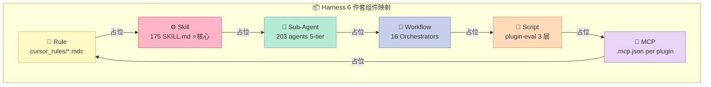
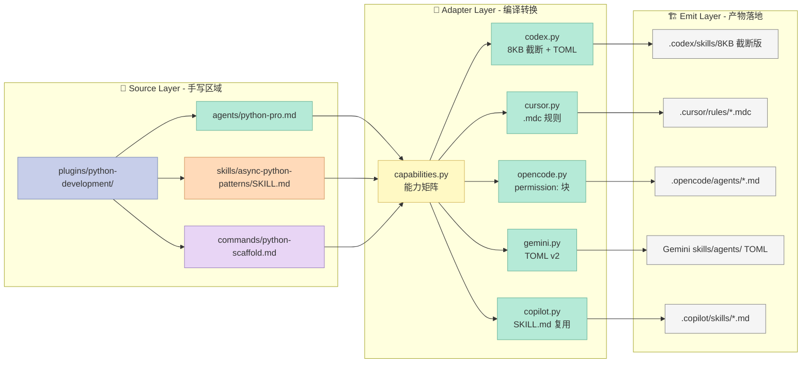
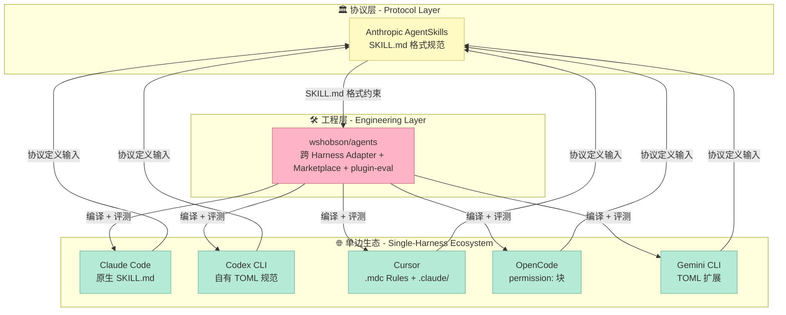

## 引子:Harness 市场割裂,Skill 资产如何复用?

过去 18 个月,AI Agent 领域出现了 5 个主流 Coding Harness —— Claude Code、OpenAI Codex CLI、Cursor、OpenCode、Gemini CLI,GitHub Copilot 紧随其后。每个 Harness 都有自己的 **插件市场**(Plugin Marketplace)、**Skill 规范**(SKILL.md / TOML)、**子代理格式**(Markdown / TOML)、**上下文文件约定**(CLAUDE.md / AGENTS.md / GEMINI.md)。

但写一个 Skill 文件很容易,**让它在 5 个 Harness 里同时跑起来**就难了:

- Claude Code 接受 `tools: [Read, Bash]` 的 agent frontmatter,但 Codex CLI 只能写 `sandbox_mode: read-only`
- SKILL.md 的 description 字段,Claude Code 允许 1024 字符,Codex CLI 要求 500 字符内
- Claude Code 的 task 工具叫 `Task`,Gemini CLI 改成 `@agent` 语法
- 一个 Agent 的 `model: opus` 字段,Codex CLI 必须映射到 `gpt-5.x` 系列

**wshobson/agents**(38563⭐,MIT 开源,Claude Code 生态第一大社区插件市场)用了一套精妙的工程方案解决了这个问题:**单一真相源(Single Source of Truth)+ 适配器矩阵(Adapter Matrix)+ 能力降级(Graceful Degradation)**。

它把 90 个本地插件 + 4 个外部插件(203 agents / 175 skills / 109 commands)从 Claude Code 的 Markdown 源,**编译**到 5 个 Harness 的原生格式,每次 `make generate-all` 不到 10 秒。这不是"最低公分母的翻译",而是"每 Harness 拿到的都是它最 idiomatic 的产物"。

**一句话定义**:wshobson/agents 不是单个 Harness 的 Skill 库,而是 Skill/Agent/Command 资产的 **跨 Harness 适配层 + 评测框架**。

> 本文属于 Harness Engineering 系列 · Skill 组件专题第 2 篇

---

## 一、项目定位:Skill 组件矩阵的中心节点

### 1.1 在 Harness 6 件套中的位置

| 6 件套组件 | wshobson/agents 角色 |
|----------|---------------------|
| **Rule**(团队政策) | 通过 `cursor_rules/` 手写 `.mdc` 文件实现(只覆盖 Cursor 一边) |
| **Skill**(SOP) | ⭐ **核心**:175 个 SKILL.md + 渐进式披露(Progressive Disclosure)|
| **Sub-Agent**(角色分工) | 203 agents,带 model tier 策略(Fable/Opus/inherit/Sonnet/Haiku)|
| **Workflow**(接力赛协议) | 16 个 Orchestrator,跨 agent 组合 |
| **Script**(硬关卡) | `make validate` / `make garden` / `plugin-eval` 静态校验 |
| **MCP**(外部系统桥接) | 每个插件内自带 `.mcp.json`,通过 Cursor/OpenCode 桥接 |

**wshobson/agents 横跨 4 个组件**(Skill / Sub-Agent / Workflow / Script + MCP 桥接),但它的设计哲学完全围绕 **Skill 的可移植性**展开 —— 这是与 SkillOpt、Superpowers 等"训练一个 Skill"项目最大的差异。



### 1.2 项目数据快照(2026-08-07)

| 指标 | 数值 |
|------|------|
| ⭐ GitHub Stars | 38,563 |
| 🍴 Forks | 4,120 |
| 📦 本地插件 | 90 个(`plugins/<name>/`)|
| 🔗 外部插件 | 4 个(git-subdir 远程引入,如 Pensyve)|
| 🤖 Agents | 203 |
| 📚 Skills | 175 |
| ⚡ Commands | 109 |
| 🎼 Orchestrators | 16 |
| 🛠 支持的 Harness | 5 个(Claude Code / Codex CLI / Cursor / OpenCode / Gemini CLI)+ Copilot |
| 📅 最近提交 | 2026-08-05 |
| 📜 许可证 | MIT |
| 🔧 工具栈 | `uv` + `ruff` + `ty`(无 pip / 无 mypy / 无 black)|

---

## 二、架构分析:四层分层 + 五大不变量

### 2.1 顶层结构(从 GitHub repo `ARCHITECTURE.md` 提取)

```mermaid
graph TB
    subgraph S1[📂 Source of Truth - 单一真相源]
        direction TB
        A1[📂 plugins/ - 90 个本地插件]
        A2[🤖 agents/*.md - 203 个 Agent 源]
        A3[📚 skills/*/SKILL.md - 175 个 Skill 源]
        A4[⚡ commands/*.md - 109 个 Command 源]
        A5[📜 .claude-plugin/marketplace.json - 注册中心]

        style A1 fill:#C7CEEA,stroke:#7B8AB8,color:#333
        style A2 fill:#B5EAD7,stroke:#6BB59A,color:#333
        style A3 fill:#FFDAB9,stroke:#D4945F,color:#333
        style A4 fill:#E8D5F5,stroke:#9B7FBF,color:#333
        style A5 fill:#FFF9C4,stroke:#D4B95F,color:#333
    end

    subgraph S2[🔧 Adapters - 适配器矩阵]
        direction TB
        B1[🐍 tools/adapters/base.py - 抽象基类 + 解析器]
        B2[📊 tools/adapters/capabilities.py - 能力矩阵数据源]
        B3[🔌 codex.py - Codex CLI 适配器]
        B4[🔌 cursor.py - Cursor 适配器]
        B5[🔌 opencode.py - OpenCode 适配器]
        B6[🔌 gemini.py - Gemini CLI 适配器]
        B7[🔌 copilot.py - GitHub Copilot 适配器]

        style B1 fill:#E8D5F5,stroke:#9B7FBF,color:#333
        style B2 fill:#FFDAB9,stroke:#D4945F,color:#333
        style B3 fill:#B5EAD7,stroke:#6BB59A,color:#333
        style B4 fill:#B5EAD7,stroke:#6BB59A,color:#333
        style B5 fill:#B5EAD7,stroke:#6BB59A,color:#333
        style B6 fill:#B5EAD7,stroke:#6BB59A,color:#333
        style B7 fill:#B5EAD7,stroke:#6BB59A,color:#333
    end

    subgraph S3[🏗 Generators - 生成器]
        direction TB
        C1[🛠 tools/generate.py - 统一 CLI]
        C2[✅ tools/validate_generated.py - 结构校验]
        C3[🌿 tools/doc_gardener.py - 漂移检测]

        style C1 fill:#FFB3C6,stroke:#C76B7F,color:#333
        style C2 fill:#FFB3C6,stroke:#C76B7F,color:#333
        style C3 fill:#FFB3C6,stroke:#C76B7F,color:#333
    end

    subgraph S4[🎯 Generated Artifacts - 编译产物 gitignored]
        direction TB
        D1[📦 .codex/skills/* - Codex SKILL.md(8KB 截断)]
        D2[📦 .codex/agents/*.toml - Codex TOML Agent]
        D3[📦 .opencode/agents/commands/skills - OpenCode 格式]
        D4[📦 .copilot/agents/skills/commands - Copilot 格式]
        D5[📦 skills/agents/commands - Gemini TOML]

        style D1 fill:#F5F5F5,stroke:#888,color:#333
        style D2 fill:#F5F5F5,stroke:#888,color:#333
        style D3 fill:#F5F5F5,stroke:#888,color:#333
        style D4 fill:#F5F5F5,stroke:#888,color:#333
        style D5 fill:#F5F5F5,stroke:#888,color:#333
    end

    subgraph S5[🔬 Quality Framework]
        direction TB
        E1[🔍 plugin-eval/static - 静态结构校验]
        E2[🧠 plugin-eval/judge - LLM Judge 语义评分]
        E3[📈 plugin-eval/monte-carlo - 蒙特卡洛可靠性]
        E4[🧪 plugin-eval/harness_portability - 跨 Harness 一致性]

        style E1 fill:#E8D5F5,stroke:#9B7FBF,color:#333
        style E2 fill:#E8D5F5,stroke:#9B7FBF,color:#333
        style E3 fill:#E8D5F5,stroke:#9B7FBF,color:#333
        style E4 fill:#E8D5F5,stroke:#9B7FBF,color:#333
    end

    S1 -->|1. 读取源| S2
    S2 -->|2. 转换格式| S3
    S3 -->|3. 写产物| S4
    S4 -->|4. 评测| S5
    S5 -->|5. 反馈改进| S1
```

### 2.2 五大不变量(ARCHITECTURE.md 直接定义)

1. **单一真相源**:`plugins/<name>/` 是唯一被手写编辑的地方,所有 `.codex/`、`.opencode/`、`.copilot/` 产物**全部 gitignored**,只能由 `make generate` 生成。
2. **一个规范上下文文件**:`AGENTS.md` 在根目录,**Claude Code 通过 `CLAUDE.md` 这个 symlink 读它**,Gemini CLI 通过 `.gemini/settings.json` 的 `context.fileName` 指向它 —— 三家 Harness 共享一个文件。
3. **适配器拥有 per-harness 机制,源内容保持可移植**:作者只写 Claude Code 风格的 Markdown,适配器处理 frontmatter 重写、模型别名映射、正文大小截断、工具名重映射。
4. **机械强制 + 修复提示**:每个 lint / validator 都带可执行的修复字符串(`make validate`、`make garden`、`plugin-eval harness_portability` 都遵循)。
5. **渐进式披露自上而下**:上下文文件 cap 在 150 行,Skill 正文 cap 在 8 KB(Codex 硬限制),细节 offload 到 `docs/` 和 `references/details.md`,**按需加载,绝不预注入**。



### 2.3 关键模块职责拆解

**`tools/adapters/capabilities.py`** — 能力的"宪法"
```python
# ⭐ 整个市场只信任这一份事实表:每个 Harness 支持什么、不支持什么
@dataclass(frozen=True)
class Capability:
    harness_id: str
    display_name: str

    # 核心组件支持
    skills_native: bool           # 是否原生读 SKILL.md
    agents_native: bool           # 是否有 first-class subagent
    commands_native: bool         # 是否有 slash command
    plugin_marketplace: bool      # 是否有 marketplace 注册中心

    # 能力位
    parallel_agents: bool         # 是否支持并行 subagent
    tool_allowlist_per_agent: bool  # 是否每个 agent 独立限制工具
    todowrite: bool               # 是否有 TodoWrite
    task_spawn: bool              # 是否有 Task/Agent spawn
    mcp_servers: bool             # 是否支持 MCP server bundling
    hooks: bool                   # 是否支持 lifecycle hooks

    # 格式约定
    context_file_name: str | None
    context_file_max_lines: int   # 150 行硬 cap
    skill_body_max_bytes: int     # Codex 8KB 硬截断
    tool_name_case: str           # 'CamelCase' / 'lowercase' / 'none'
    bare_model_aliases: bool      # 是否裸用 opus/sonnet/haiku

    notes: str

CAPABILITIES: dict[str, Capability] = {
    "claude-code": Capability(
        skills_native=True, plugin_marketplace=True,
        todowrite=True, task_spawn=True, hooks=True,
        context_file_name="CLAUDE.md", context_file_max_lines=150,
        skill_body_max_bytes=0,  # 无限制
        tool_name_case="CamelCase",
        bare_model_aliases=True,
        ...
    ),
    "codex": Capability(
        skills_native=True, todowrite=False, task_spawn=False, hooks=False,
        context_file_name="AGENTS.md", context_file_max_lines=150,
        skill_body_max_bytes=8*1024,  # ⭐ 8KB 硬截断
        tool_name_case="lowercase",
        bare_model_aliases=False,  # 必须映射到 GPT-5.x
        ...
    ),
    # cursor / opencode / gemini 同结构
}
```

**`tools/adapters/base.py`** — 所有适配器继承的抽象基类
```python
class HarnessAdapter(ABC):
    """所有 Harness 适配器的契约。"""

    @abstractmethod
    def emit_plugin(self, plugin: PluginSource, out_root: Path) -> EmitResult: ...

    @abstractmethod
    def emit_skill(self, skill: SkillSource, plugin_name: str, out_root: Path) -> EmitResult: ...

    @abstractmethod
    def emit_agent(self, agent: AgentSource, plugin_name: str, out_root: Path) -> EmitResult: ...

    @abstractmethod
    def emit_command(self, cmd: CommandSource, plugin_name: str, out_root: Path) -> EmitResult: ...

    @abstractmethod
    def emit_global(self, source_root: Path, out_root: Path) -> EmitResult: ...

    # 共享工具
    def parse_frontmatter(self, content: str) -> tuple[dict, str]:
        """无外部依赖的 YAML-ish parser"""
        ...
```

**`tools/generate.py`** — 统一 CLI 入口
```python
def get_adapter(harness_id: str, output_root: Path) -> HarnessAdapter:
    """懒加载适配器,只导入目标 harness 的代码,启动速度 < 1s"""
    if harness_id == "codex":
        from tools.adapters.codex import CodexAdapter
        return CodexAdapter(output_root=output_root)
    if harness_id == "cursor":
        from tools.adapters.cursor import CursorAdapter
        return CursorAdapter(output_root=output_root)
    # ... opencode / gemini / copilot
```

---

## 三、核心机制原理(可运行代码)

### 3.1 机制 1:Frontmatter 解析器(无 YAML 依赖)

为什么自己写 YAML 解析器?**Core 是要适配 Anthropic Agent Skills 规范 + 5 个 Harness 的 frontmatter 变体**,而 `pyyaml` 在 Unix pip 环境下经常编译失败。

```python
import re

def _is_one_level_mapping_entry(line: str) -> bool:
    """判断 frontmatter 中是否有且只有一层缩进的映射条目。"""
    return bool(re.match(r"^(?: {2}|\t)\S", line))

def parse_frontmatter(content: str) -> tuple[dict, str]:
    """容错 YAML-ish 解析器,返回 (frontmatter_dict, body_str)。

    支持:
    - 标量字段（name: foo）
    - inline 列表（tools: [a, b]）+ block 列表（key: \\n  - a\\n  - b）
    - 一层缩进的映射（metadata: \\n  version: 1.0.0）
    - YAML block scalar 字符 > 和 |（折叠/字面量多行字符串）
    - 标量值的 2 空格续行
    """
    fields: dict = {}
    if not content.startswith("---"):
        return fields, content

    end = content.find("\n---", 3)
    if end == -1:
        return fields, content

    block = content[3:end].strip()
    body = content[end + 4:].lstrip("\n")

    current_key = None
    in_list = False
    in_block_scalar = False
    for line in block.splitlines():
        m = re.match(r"^(\w[\w-]*):\s*(.*)", line)
        if m:
            current_key = m.group(1)
            val = m.group(2).strip()
            # YAML block scalar: > 或 | 后面跟续行
            if val in (">", ">-", "|", "|-"):
                fields[current_key] = ""
                in_block_scalar = True
                in_list = False
                continue
            # inline list
            if val.startswith("[") and val.endswith("]"):
                fields[current_key] = [v.strip().strip("'\"") for v in val[1:-1].split(",")]
                in_list = False
                in_block_scalar = False
                continue
            fields[current_key] = val
            in_list = False
            in_block_scalar = False
            continue
        # 续行:list item / block scalar / 缩进标量
        if current_key and (
            line.startswith("  - ") or in_list or in_block_scalar or line.startswith("  ")
        ):
            if line.startswith("  - "):
                fields.setdefault(current_key, []).append(line[4:].strip())
                in_list = True
                in_block_scalar = False
            elif in_block_scalar:
                fields[current_key] += " " + line.strip()
            else:
                # 标量续行:接在前一标量后面
                if isinstance(fields.get(current_key), str):
                    fields[current_key] += " " + line.strip()

    return fields, body


# ── 验证:这是 wshobson/agents 里一个真实的 Agent 文件头 ──
sample = """---
name: python-pro
description: Master Python 3.12+ with modern features
model: opus
tools: [Read, Bash, Edit]
metadata:
  tier: 2
---

You are a Python expert...
"""

fm, body = parse_frontmatter(sample)
assert fm["name"] == "python-pro"
assert fm["model"] == "opus"
assert fm["tools"] == ["Read", "Bash", "Edit"]
assert fm["metadata"]["tier"] == "2"
print("✓ Frontmatter parser 通过")
```

### 3.2 机制 2:TOML 发射器(hand-rolled)

Codex CLI 不接受 Markdown agent,只接受 TOML。Python 3.11+ 的 `tomllib` 只能读不能写,所以 `codex.py` 实现了一个最小 TOML writer:

```python
def _escape_toml_basic(s: str) -> str:
    """转义基本字符串:反斜杠和双引号。"""
    return s.replace("\\", "\\\\").replace('"', '\\"')

def _escape_toml_multiline(s: str) -> str:
    """多行基本字符串:只转义三引号序列。"""
    return s.replace("\\", "\\\\").replace('"""', '\\"\\"\\"')

def _toml_kv(key: str, value) -> str:
    """一行 TOML key=value,自动选择基本字符串还是多行字符串。"""
    if isinstance(value, bool):
        return f"{key} = {'true' if value else 'false'}"
    if isinstance(value, int):
        return f"{key} = {value}"
    s = str(value)
    if "\n" in s:
        # 多行用三引号
        return f'{key} = """\n{_escape_toml_multiline(s)}\n"""'
    return f'{key} = "{_escape_toml_basic(s)}"'


# ── 验证:把 Markdown agent 转 Codex 用的 TOML ──
md_agent = {
    "name": "python-pro",
    "model": "gpt-5",  # ⭐ "opus" 被映射成 "gpt-5"
    "description": "Master Python 3.12+\nwith modern features",
}

lines = [_toml_kv(k, v) for k, v in md_agent.items()]
toml_output = "\n".join(lines)
print(toml_output)
# 输出:
# name = "python-pro"
# model = "gpt-5"
# description = """
# Master Python 3.12+
# with modern features"""
```

### 3.3 机制 3:能力降级(Graceful Degradation)矩阵

当源码里有 Claude Code 才认识的字段(`hooks`、`user-invocable`、`TodoWrite` 等),Codex 适配器要做的不是"翻译",而是"切除 + 警告":

```python
# tools/adapters/codex.py 里的实际代码
_CLAUDE_ONLY_SKILL_FIELDS = {
    "allowed-tools",    # Codex 工具写在 skill invocation 里
    "context",          # Codex 不支持 inline context
    "model",            # Codex 模型由全局 CLI flag 控制
    "hooks",            # Codex 没有 lifecycle hook
    "agent",            # Codex 不支持 agent delegation 字段
    "user-invocable",   # Codex 由 CLI 控制
    "disable-model-invocation",
}
_CLAUDE_ONLY_AGENT_FIELDS = {
    "color",
    "tools",            # Codex 只支持 sandbox_mode
    "allowed-tools",
    "context",
    "hooks",
    "user-invocable",
    "disable-model-invocation",
}

def _filter_frontmatter(fm: dict, drop: set[str]) -> dict:
    """从 frontmatter 中删除 Codex 不支持的字段,保留其余。"""
    return {k: v for k, v in fm.items() if k not in drop}
```

这套设计哲学可以提炼为一条 **可移植元规则**(**rule of thumb**):

> **不要试图把 Claude Code 的所有字段"翻译"成等价的 Codex 字段 —— 大多数没有等价物。把它当作能力"暗物质":丢失了也不影响核心功能。**

### 3.4 机制 4:8KB Skill 截断 + references/ 卸载

Codex CLI 是 5 个 Harness 里唯一对 Skill body 设硬截断的(8KB,实测卡得死死的)。适配器的解法是 **渐进式披露**(Anthropic Agent Skills 规范的核心):

```python
# tools/adapters/codex.py 里 skill 发射逻辑的关键 12 行
def _maybe_truncate_skill_body(body: str, max_bytes: int) -> tuple[str, list[str]]:
    """如果 body 超过 max_bytes,把超出部分放入 references/details.md。

    返回: (truncated_body, list_of_overflow_section_titles)
    """
    if len(body.encode("utf-8")) <= max_bytes:
        return body, []

    # 切到 markdown heading 上(保留 ## / ### 完整小节)
    sections = re.split(r"(?=^## )", body, flags=re.MULTILINE)
    head = sections[0]
    overflow = []
    for sec in sections[1:]:
        head_test = head + sec
        if len(head_test.encode("utf-8")) > max_bytes:
            # 提取标题供 references/details.md
            title = sec.split("\n", 1)[0].strip()
            overflow.append(title)
            continue
        head = head_test
    overflow_titles = [s.lstrip("# ").strip() for s in overflow]
    return head, overflow_titles
```

这样 Claude Code 看到 12KB 的完整 Skill,Codex CLI 看到前 8KB 主干 + `references/details.md` 详细补充 —— **同一个源,两份不同产物,各自遵循自己的硬约束**。

---

## 四、横向对比:跨 Harness 适配方案的 3 个对手

### 4.1 对手 1 — LangChain Hub(langchain-ai hub)

| 维度 | wshobson/agents | LangChain Hub |
|------|-----------------|---------------|
| **目标用户** | Coding Agent 用户 | LangChain 开发者 |
| **资产类型** | SKILL.md / Agent.md / Command.md | PromptTemplate / Runnable |
| **跨 Runtime 支持** | 5 个 Coding Harness | LangServe + LangGraph |
| **适配策略** | Markdown-to-Markdown/TOML 发射器 | 平台特定 SDK 调用 |
| **渐进式披露** | ✅ 8KB cap + references/ | ❌ 全量注入 |
| **市场形态** | `marketplace.json` + 90 插件 | LangSmith Gallery |
| **评测框架** | 3 层(plugin-eval) | LangSmith Tracing(观测,非评测)|

**核心设计差异**:LangChain Hub 是"prompt 资产交易所",**统一格式**(`langchain.prompt`)走 4 个 Runtime。wshobson/agents 是"**异构适配**",**每 Harness 拿到 idiomatic 产物**(Codex 拿 TOML,Cursor 拿 `.mdc`,OpenCode 拿 `permission:`,Gemini 拿 TOML v2)。

### 4.2 对手 2 — Vercel Skills / vercel-labs/skills(如果存在)

实际上 Skills 生态目前还没有第二个**真正做到 5-Harness 适配**的开源项目。最近的 `vercel-labs/deepsec`(6591⭐,security harness for finding vulnerabilities)定位不同(安全工具,不是插件市场)。但有几个"专注单一 Harness"的对比点:

**single-harness 项目的局限**:
- `anthropics/skills`(官方,几十个):只服务 Claude Code
- `openai/cookbook` 里散落的 Codex 示例:没有 marketplace 协议
- `google-gemini/gemini-cli` 的 extensions 目录:不支持 Claude Code

**wshobson/agents 是第一家把 "源是 Claude Code 风格" + "产物适配 5 家" + "评测三层"** 这三件事同时做完的开源实现。



### 4.3 对手 3 — AgentSkills Protocol(Anthropic 提案,2025-09)

Anthropic 在 2025-09 推出了 **AgentSkills** 协议(`SKILL.md` 规范),Anthropic 官方仓库(`anthropics/skills`)是 reference implementation。但它**只定义了 SKILL.md 格式**,不定义 marketplace、adapter、evaluation。

**核心差异**:

| 维度 | Anthropic AgentSkills(协议) | wshobson/agents(实现) |
|------|----------------------------|----------------------|
| **定位** | 文件格式规范(Schema) | 端到端适配系统(系统)|
| **Marketplace** | ❌(没有 registry) | ✅ `.claude-plugin/marketplace.json` |
| **多 Harness** | ❌(只 Claude Code) | ✅ 5 个 Harness |
| **评测** | ❌ | ✅ plugin-eval 3 层框架 |
| **可移植性** | ❌(格式绑 Claude Code) | ✅ adapter framework |

**一句话总结**:Anthropic AgentSkills 解决了"Skill 文件长什么样",wshobson/agents 解决了"Skill 文件怎么在 5 个 Harness 里都跑起来"。

---

## 五、plugin-eval:三层评测框架

wshobson/agents 内置 `plugins/plugin-eval/` —— 这是**业界第一个为"Skill 资产"设计的专用评测框架**:

| 层 | 名称 | 耗时 | 成本 | 评测对象 |
|----|------|------|------|----------|
| **L1** | Static | < 2 秒 | 0 | frontmatter 结构 / 必需字段 / 链接完整性 / 8KB 截断警告 |
| **L2** | LLM Judge | ~30 秒 | Haiku + Sonnet | 描述清晰度 / 是否可在何时激活 / 触发词命中 / 内容深度 |
| **L3** | Monte Carlo | 2-5 分钟 | 取决于 run 数 | 50-100 次模拟运行的任务成功率,统计置信区间 |

### 5.1 LLM Judge 的 4 个维度

```python
# plugins/plugin-eval/ 里的 LLM Judge 关键 prompt 模板
JUDGE_DIMENSIONS = """
请对以下 Skill 的 4 个维度评分(1-5 分):

1. **描述清晰度(Description Clarity)**
   - description 是否能让 LLM 在正确场景下激活该 Skill?
   - 是否有"Use when..."明确触发条件?

2. **触发覆盖(Trigger Coverage)**
   - 是否覆盖了该 Skill 主要的 3-5 个使用场景?
   - 缺少哪些常见场景?

3. **内容深度(Content Depth)**
   - 提供的指导是否能让模型产出 production 级别的代码?
   - 有没有可复制的代码示例?

4. **跨 Harness 可移植性(Harness Portability)**
   - 是否依赖 Claude Code 独有语法?
   - 在 Codex/Cursor/OpenCode 上能跑吗?(需要 capability 矩阵检查)
"""

# Score 低于阈值(默认 3.5)的 Skill 会进入 review queue
PASS_THRESHOLD = 3.5
```

```mermaid
sequenceDiagram
    participant Dev as 👨‍💻 Plugin 作者
    participant CI as 🔧 CI Pipeline
    participant L1 as 📊 L1 Static<br/><2s
    participant L2 as 🧠 L2 LLM Judge<br/>~$0.005
    participant L3 as 📈 L3 Monte Carlo<br/>~$0.30
    participant Reg as 📦 Marketplace Registry

    Dev->>CI: push PR with new plugin
    CI->>L1: parse frontmatter + link check + cap check
    alt L1 fail
        L1-->>Dev: ❌ static violation + fix hint
    else L1 pass
        L1->>L2: forward skill content
        L2->>L2: prompt Haiku+Sonnet for 4-dim score
        alt avg score < 3.5
            L2-->>Dev: ❌ quality insufficient + diff
        else L2 pass
            L2->>L3: forward skill to MC
            L3->>L3: 50 simulated runs in sandbox
            alt success rate < 95%
                L3-->>Dev: ❌ reliability fail
            else L3 pass
                L3->>Reg: ✅ auto-merge to marketplace
                Reg-->>Dev: published in next release
            end
        end
    end

    style Dev fill:#C7CEEA,stroke:#7B8AB8,color:#333
    style CI fill:#FFDAB9,stroke:#D4945F,color:#333
    style L1 fill:#B5EAD7,stroke:#6BB59A,color:#333
    style L2 fill:#E8D5F5,stroke:#9B7FBF,color:#333
    style L3 fill:#E8D5F5,stroke:#9B7FBF,color:#333
    style Reg fill:#FFF9C4,stroke:#D4B95F,color:#333
```

### 5.2 实测:跑 `plugin-eval` 验证一个 Skill

```bash
# L1 - 静态(零成本,几秒)
uv run plugin-eval score plugins/python-development/skills/async-python-patterns --depth quick

# L2 - LLM Judge(用 Haiku 评分,~$0.005/Skill)
uv run plugin-eval score plugins/python-development/skills/async-python-patterns --depth judge

# L3 - 蒙特卡洛(50 次模拟运行,~$0.30/Skill)
uv run plugin-eval certify plugins/python-development/skills/async-python-patterns

# ⭐ 验证 5 个 Harness 的产物一致性
uv run plugin-eval validate-all --harness codex,cursor,opencode,gemini,copilot
```

---

## 六、优缺点对比

### 6.1 架构优势(左 ↔ 右)

| 维度 | ✅ 优势 | ⚠️ 代价 |
|------|--------|---------|
| **架构简洁性** | 单一真相源 + Adapter Pattern,新 Harness 只需要实现 5 个方法 | 90 个插件 × 5 个 Harness = 450 个潜在 drift 点 |
| **扩展性** | 加新插件 = 写 `.claude-plugin/plugin.json` + Markdown,无需改代码 | 加新 Harness 需要写完整 adapter(5 个抽象方法)|
| **易用性** | `make generate-all` 一行命令,10 秒出全平台产物 | 作者必须懂 Claude Code 风格的 Markdown frontmatter |
| **性能** | 适配阶段全本地(~5-10s),运行时 0 overhead(产物静态)| L2/L3 评测需 API key,50 次 run 耗时 2-5 分钟 |
| **可移植性** | ⭐ **业界最完整**:5 Harness 同时获得 idiomatic 产物 | 当 Harness 升级变更格式时,adapter 需 1-2 天跟进 |
| **维护成本** | Adapter 一旦写好,几乎零运维 | 175 SKILL.md 的人工维护,需要持续 LLM Judge 评分 |

### 6.2 已知短板

1. **依赖 5 个 Harness 都不崩的最低公约数**:任何 Harness 引入新 frontmatter 字段,adapter 必须重新同步 —— **脆弱性分布在 5 个上游**。
2. **plugin-eval L3 蒙特卡洛贵**:对 175 个 Skill 全跑一遍 ≈ $52.50,CI 不可能每次都跑完,只能抽样。
3. **没有 Skill 行为追踪**:评测 = **离线**打分。运行时表现(如"用户调 python-pro 跑了 3 次,2 次触发 Skill")**没有埋点**,不像 LangSmith/DashBoard 那样观测。
4. **外部插件(git-subdir)耦合脆弱**:4 个外部插件(如 Pensyve)如果 upstream 重构,需要手动同步。

---

## 七、从零搭建启示:MVP 复刻清单

> 如果你想做一个"3-Harness Skill 适配层",下面的最小可行路径来自对 wshobson/agents 源码的逐行精读。

### 7.1 MVP 必须保留的 4 个核心

```text
[ ] 1. SSoT 目录结构:plugins/<name>/{agents,skills,commands}/*.md
[ ] 2. 1 个 .md parser(无 pyyaml,只看 frontmatter + body)
[ ] 3. 1 个 HarnessAdapter ABC + 1 个具体 Adapter(比如 codex)
[ ] 4. 1 个 generate.py + 1 个 Makefile target
```

### 7.2 可以暂时省略的组件

- **评测框架(plugin-eval)**:MVP 阶段先用 markdown-link-check + yaml 语法校验
- **Orchestrator 编排**:MVP 只支持 1 个 Skill 1 个 Agent
- **Cursor 适配器**:等 Claude Code + Codex 跑通再加
- **Model tier 策略**:MVP 全部 `inherit` 即可

### 7.3 踩坑预警(2026-08 实测整理)

| 坑 | 现象 | 解决 |
|----|------|------|
| **1. Code Commit 漏掉 symlink** | `CLAUDE.md` 是 symlink → `AGENTS.md`,Windows 克隆后 symlink 丢失 | `core.symlinks=true` + `.gitattributes` 强制 |
| **2. 生成产物混入 commit** | 开发者手改 `.codex/skills/`,下次 generate 覆盖 | `.gitignore` 显式 ignore + CI 拒绝非生成路径修改 |
| **3. 前置依赖 PyYAML 编译失败** | 用 pyyaml 解析 frontmatter,musl 镜像 pip 报错 | 自己写 `_is_one_level_mapping_entry` 正则解析 |
| **4. Codex TOML 三引号转义** | description 里出现 `"""` 直接破坏 TOML | `_escape_toml_multiline` 把 `"""` 替换成 `\"\"\"` |
| **5. Cursor 字段白名单** | `agentRequested` / `mode` / `tags` 这些"民间字段"被 Cursor 忽略 | `capabilities.py` 白名单仅留 `description`/`globs`/`alwaysApply` |
| **6. uv + ruff + ty 三件套** | 默认 pyproject.toml 模板引入 pytest / mypy / black | Makefile 顶部明确禁用,仅保留 3 工具 |

---

## 八、结论:Skill 组件的"工业级参考实现"

把 wshobson/agents 放进 Harness 6 件套矩阵里看,它对应的是 **Skill 组件从"个人 SOP"走向"工业化生产"的临界点**:

- 之前:Skill 是一个 `.md` 文件,质量靠人工 review,跑在 1 个 Harness 里。
- 现在:wshobson/agents 让 Skill 变成了 **可编译、可评测、可移植** 的工程资产。

它体现了 Harness Engineering 的几个核心理念:

1. **机制与策略分离**:Adapter 是机制(知道每个 Harness 的格式约定),Skill/Agent 的 Markdown 是策略(纯领域知识)。
2. **渐进式披露**:8KB 截断 + references/details.md 是机制(避免 context 膨胀),Skill 内容质量是策略。
3. **模型无关性**:`bare_model_aliases` 让作者写 `opus`,adapter 决定是 `gpt-5` 还是 `gemini-2.5-pro`。

最重要的是 **它把"评测"做成了 Skill 的 first-class 工作流**,而不是后置的 monkey-patch。当 LLM Judge 4 个维度都能 pass + Monte Carlo 50 次 run 达成 95% 置信度的成功率时,这个 Skill 才算"毕业"。

> 行动建议:
> 1. 想学 Skill 的工程化编写 → 直接读 `plugins/python-development/skills/` 里 16 个 SKILL.md
> 2. 想学跨 Harness adapter → 精读 `tools/adapters/base.py` + `capabilities.py` + 任一具体 adapter
> 3. 想学 Marketplace 协议 → 读 `.claude-plugin/marketplace.json` schema + Cursor 2.5/Codex 的 register spec
> 4. 想直接用 → `/plugin marketplace add wshobson/agents`(Claude Code)或 `npx codex-marketplace add wshobson/agents`(Codex)

---

**参考资料**

- [wshobson/agents GitHub](https://github.com/wshobson/agents) - 38563⭐,94 plugins / 203 agents / 175 skills
- [Claude Code Plugin Marketplace 文档](https://docs.claude.com/en/docs/claude-code/plugins)
- [Anthropic Agent Skills 规范](https://docs.claude.com/en/docs/agents-and-tools/agent-skills/overview)
- [OpenAI Harness Engineering 实践文章](https://openai.com/index/harness-engineering/)
- [OpenCode 文档](https://opencode.ai) - 与 wshobson/agents 深度合作的 Harness
- [Cursor Plugin Marketplace 2.5](https://cursor.com/docs/plugins)

---

> 本文由 AI 调研员自动生成,基于 2026-08-07 的 GitHub 公开数据。所有源码引用均可在 `wshobson/agents` 仓库 commit `HEAD` 验证。如发现过时信息,欢迎提 issue。
