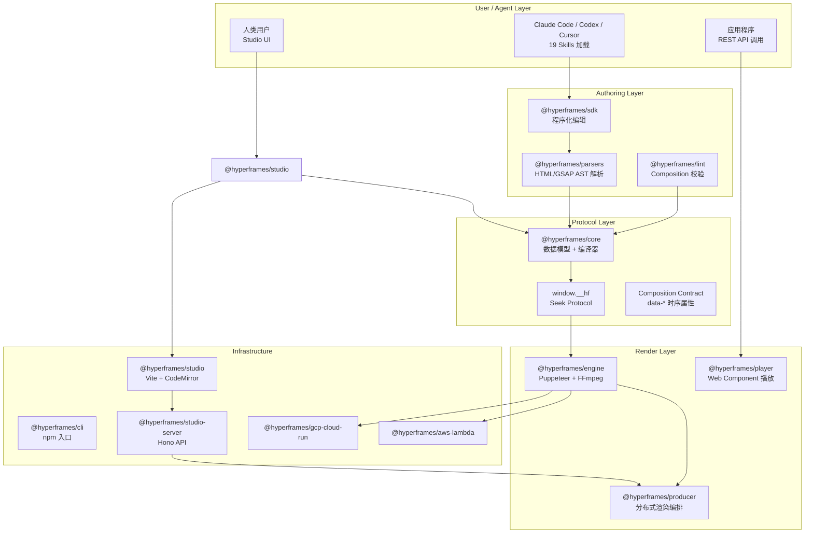
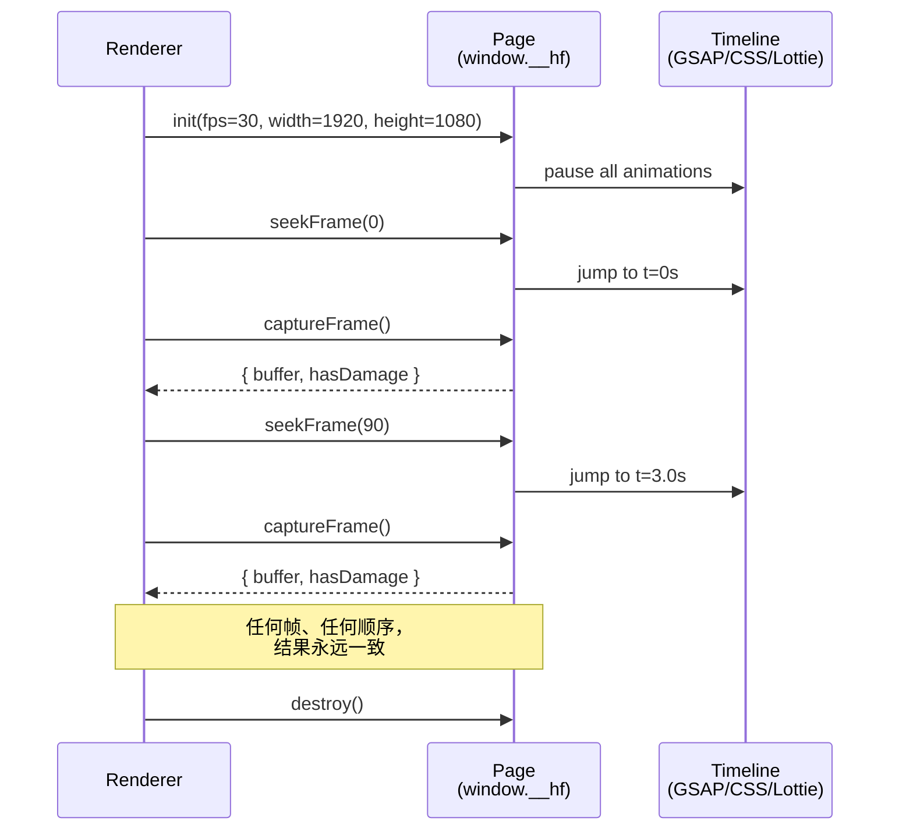
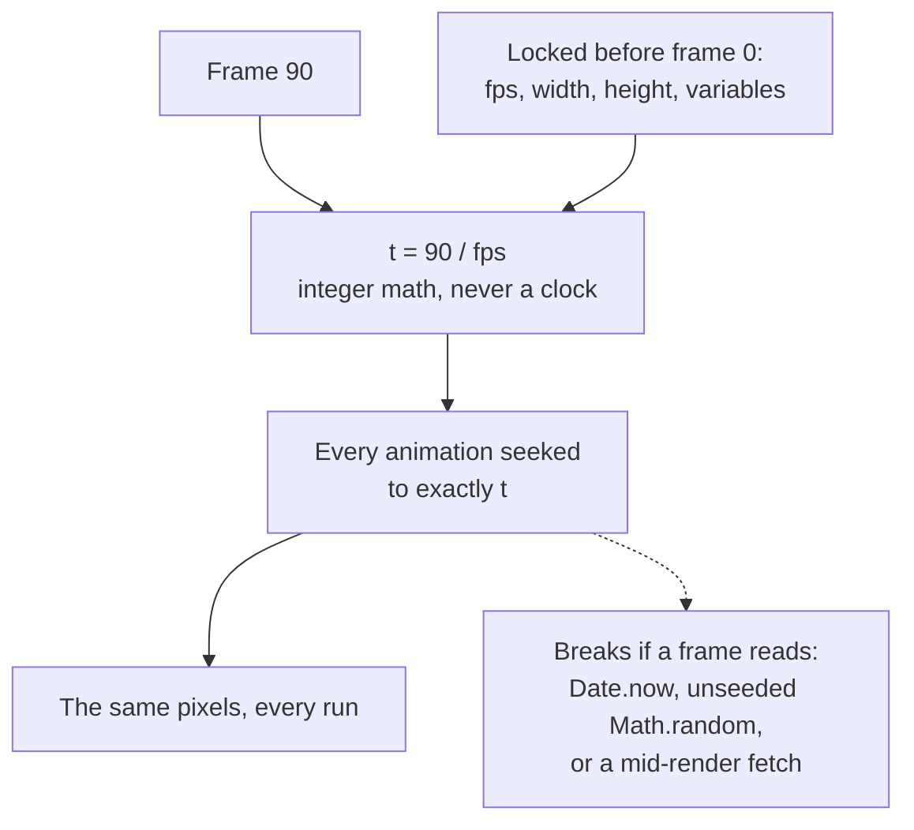
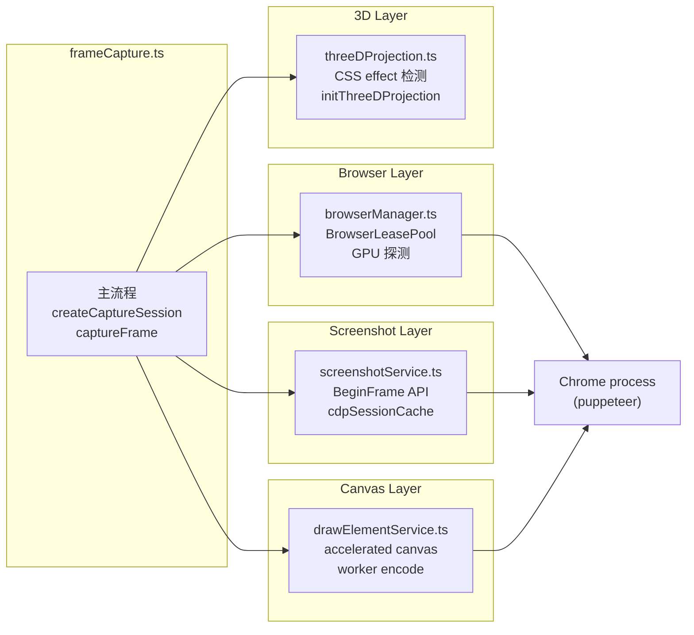
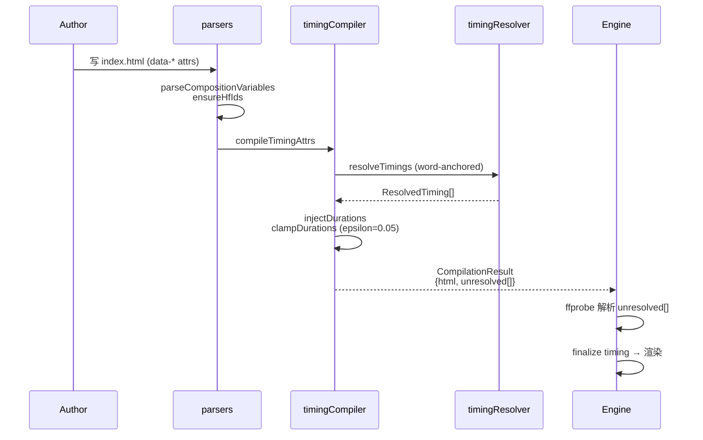
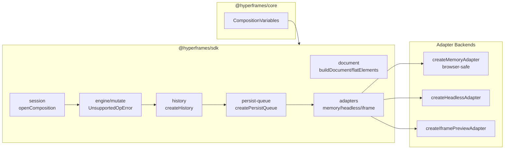
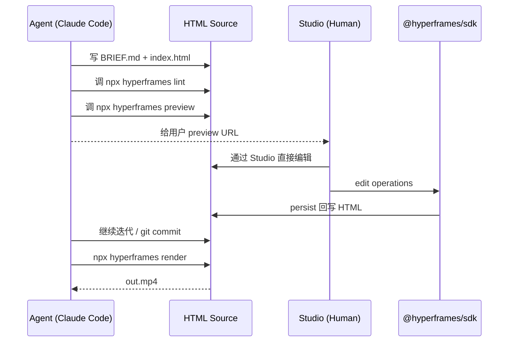

# 【HyperFrames】核心架构与设计原理深度解析：当 HTML 成为视频的源格式

> **TL;DR**：HyperFrames 是 HeyGen 开源的「HTML → 视频」框架（⭐40k, Apache-2.0, TypeScript）。它把视频项目建模成"一个 HTML 文件夹"——AI Agent 用普通 HTML/CSS/JS 写场景，框架通过 `window.__hf` Seek 协议把 DOM 时间线逐帧渲染成 MP4。它的杀手锏是**确定性渲染**（同一输入永远产生同一像素），这让 Agent 在 CI 里自动化视频、版本控制 video 项目成为可能。本文从 14 包 monorepo 拆解到 6 层项目结构、Seek 协议、BrowserLeasePool 资源池、Memory-adaptive 调优逐一展开。

---

## 一、引子：当视频不再是黑盒

### 1.1 行业现状：AI 视频工具的"沙盒困境"

2025–2026 年的 AI 视频工具堆里，**「黑盒生成」**是主流路线：

- **Sora / Runway / Kling**：prompt → 黑盒模型 → 一段 MP4
- **HeyGen 商用 SaaS**：模板 + 数字人 → 黑盒云端渲染
- **ComfyUI / N8N**：图形节点图，但底层仍是 prompt 流水线

这些工具的共同痛点：

1. **不可编辑**：拿到 MP4 后想改一个字 = 重新生成
2. **不可版本化**：没有"git diff 视频"这种操作
3. **不可确定**：同一个 prompt 第二次跑结果微妙不同
4. **不可由 Agent 协作**：Coding Agent 没有"写出能渲染的视频"这种能力

### 1.2 HyperFrames 的反共识答案

**HyperFrames 的核心哲学**：视频不应该是一种"输出格式"，而应该是一种"源文件格式"。

- 一个 HyperFrames 项目 = 一个**普通的 HTML 文件夹**（含 HTML/CSS/JS/媒体）
- AI Agent 可以用任何 Coding Agent（Claude Code/Codex/Cursor）**写出这段 HTML**
- 渲染时框架把 HTML 当成"可寻址的时间线 DOM"，**逐帧询问**「第 90 帧长什么样？」
- 任何 coding agent、IDE、git 都能直接理解、编辑、版本化这个项目

### 1.3 一句话定位

> **HyperFrames is an open-source framework for turning HTML, CSS, media, and seekable animations into deterministic MP4 videos. Use it locally with the CLI, from AI coding agents with skills, or as the rendering core behind hosted authoring workflows.**

---

## 二、项目定位与核心价值

### 2.1 仓库速览

| 维度 | 数值 |
|------|------|
| 仓库 | [heygen-com/hyperframes](https://github.com/heygen-com/hyperframes) |
| ⭐ Stars | **39,957**（2026-08-08 统计） |
| 主语言 | TypeScript 100% |
| License | **Apache-2.0** |
| 创建时间 | 2026-03-10 |
| 最近推送 | 2026-08-08（**昨日仍活跃**） |
| Topics | ai, animation, ffmpeg, framework, gsap, html, **mcp**, puppeteer, rendering, typescript, video |
| 体积 | ~383 MB（含示例视频、字体、3D 资源） |
| 节点数 | 6,187 个文件 / 14 个 npm 包 / 19 个 Skill |

### 2.2 能力矩阵

| 能力 | 是否支持 | 备注 |
|------|---------|------|
| HTML/CSS/JS → MP4 | ✅ | Chrome BeginFrame + FFmpeg |
| GSAP/Lottie/Three.js/CSS/WAAPI/TypeGPU 动画 | ✅ | 7 个 runtime adapter |
| 音频混合（视频音轨 + 背景音乐 + TTS） | ✅ | FFmpeg filter 链 |
| MCP 协议（Agent 调用） | ✅ | `.mcp.json` + `/mcp` 路由 |
| Claude Code / Codex / Cursor Skill | ✅ | `npx skills add` 一键安装 |
| 颜色分级 LUT | ✅ | `@hyperframes/core/color-grading` |
| 视频拼贴 / Talking-head 叠加 | ✅ | `data-composition-src` 子组合 |
| 分布式渲染（AWS Lambda / GCP Cloud Run） | ✅ | 官方 `aws-lambda` + `gcp-cloud-run` 包 |
| 实时预览（Studio） | ✅ | Vite + CodeMirror + React Flow |
| 商业 SaaS 兼容（HeyGen 云托管） | ✅ | `hyperframes cloud render` |

### 2.3 与同类项目的差异化

| 维度 | HyperFrames | Remotion | ComfyUI | Runway |
|------|-------------|----------|---------|--------|
| 输入格式 | **HTML/CSS/JS** | React JSX | 节点图 | Prompt |
| Agent-friendly | ⭐⭐⭐⭐⭐ | ⭐⭐ | ⭐ | ⭐ |
| 确定性渲染 | ✅ | ❌ | ❌ | ❌ |
| 开源 | Apache-2.0 | 商业 + 部分开源 | GPL-3.0 | 闭源 |
| 视频生成模型 | ❌（不生成内容） | ❌ | 部分 | ✅ |
| 协议层 | MCP + Skill | 无 | 节点协议 | 无 |

**关键差异**：HyperFrames **不生成**视频内容（不像 Runway），它**渲染**已有内容到视频；和 Remotion 比，它是 **HTML 原生**（不是 React）；和 ComfyUI 比，它是 **时间线**而不是**节点图**。

---

## 三、整体架构：14 包 Monorepo + 19 Skill 的双层抽象

### 3.1 顶层架构图



### 3.2 14 包职责清单

| 包 | 职责 | 关键依赖 |
|----|------|---------|
| `@hyperframes/core` | 数据模型 + 模板生成 + Timing Compiler（**所有包的根**） | linkedom |
| `@hyperframes/parsers` | HTML/GSAP AST 解析、HF-ID 推断 | acorn, recast |
| `@hyperframes/lint` | Composition HTML/项目级 lint | 复用 parsers |
| `@hyperframes/engine` | **Puppeteer + FFmpeg 渲染核心**（171KB 单文件 `frameCapture.ts`） | puppeteer, hono |
| `@hyperframes/producer` | 分布式渲染编排、RenderRequest 序列化 | 复用 engine |
| `@hyperframes/player` | Web Component 嵌入播放 | gsap, puppeteer-core |
| `@hyperframes/sdk` | 程序化编辑 Composition（document/mutate/history/persist-queue） | CodeMirror 风格 API |
| `@hyperframes/cli` | `npx hyperframes` 入口（30+ 子命令） | citty, esbuild |
| `@hyperframes/studio` | Web 端可视化编辑器 | codemirror, react-flow |
| `@hyperframes/studio-server` | Studio 后端 API | hono |
| `@hyperframes/aws-lambda` | AWS Lambda 渲染适配 | lambda runtime |
| `@hyperframes/gcp-cloud-run` | GCP Cloud Run 渲染适配 | terraform |
| `@hyperframes/shader-transitions` | 着色器转场效果 | shader code |
| `@hyperframes/sdk-playground` | SDK 在线 Playground | vite |

### 3.3 项目的"分层协议"哲学

仔细看 14 个包会发现一个清晰的依赖方向：

```
parsers → core ← lint
   ↓
  engine → producer → aws-lambda / gcp-cloud-run
   ↓
  player ← studio ← studio-server
   ↓
  cli (聚合所有包)
```

**核心规律**：
1. **`core` 是唯一的根**，所有包都依赖它（`packages/core/package.json` 显示 14 个 subpath exports）
2. **`parsers` 独立于 engine**，让 lint/SDK 可以在浏览器跑（`@hyperframes/parsers` 是纯函数、无 I/O）
3. **`engine` 是渲染层的唯一核心**，`producer` 只是「engine + 分布式协调」的封装
4. **`cli` 是聚合层**，不实现逻辑，只组合其他包

这和 OpenMontage 的"Manifest-as-Code"哲学异曲同工——**核心不动，扩展在外围**。

---

## 四、核心引擎一：window.__hf Seek 协议（确定性渲染的根基）

### 4.1 什么是 Seek Protocol

传统视频渲染是"播放并截图"——把视频当时间流，渲染时跑实际时间。**HyperFrames 不这么做**——它让浏览器暴露一个 `window.__hf` 对象，渲染器**逐帧询问**：



### 4.2 Protocol 类型定义

> `# 来自 packages/engine/src/types.ts:50-90`

```typescript
export interface HfMediaElement {
  /** DOM id of the <video> or <audio> element */
  elementId: string;
  /** Source file path or URL */
  src: string;
  /** When in the composition this element appears (seconds) */
  startTime: number;
  /** When in the composition this element disappears (seconds) */
  endTime: number;
  /** Offset into the source file (seconds, default: 0) */
  mediaOffset?: number;
  /** Audio volume 0-1 (default: 1) */
  volume?: number;
  /** Whether this element has audio that should be extracted */
  hasAudio?: boolean;
}

export interface HfTransitionMeta {
  /** Time the transition starts (seconds) */
  time: number;
  /* ... shader 切换参数 */
}

export interface CaptureWarning {
  code: "media_readiness_timeout" | "media_load_failed"
      | "audio_processing_failed" | "sub_timeline_readiness_timeout"
      | "sub_timeline_script_failure" | "live_map_detected";
  message: string;
  details?: {
    mediaType?: "image" | "video" | "audio";
    sources?: string[];
    timeoutMs?: number;
    failureReasons?: string[];
    failureStages?: string[];
    failureOwner?: "user" | "system";
    retryable?: boolean;
  };
}
```

### 4.3 关键洞察：媒体由引擎接管

> `# 来自 packages/engine/src/types.ts:36-44`

注释里写得很清楚：

```typescript
/**
 * Declares a media element the engine should handle.
 *
 * Headless Chrome in BeginFrame mode cannot play <video> or produce audio.
 * The engine pre-extracts video frames and audio tracks from declared media
 * elements and handles injection/mixing automatically.
 */
```

**关键设计**：

- `<video>` / `<audio>` 元素 **不依赖** 浏览器原生播放能力
- 引擎**预提取**视频帧（按 `time` 精确 seek）和音轨（FFmpeg demuxer）
- 渲染时把**预提取的帧注入**到对应 DOM 元素
- 音频在最后一步用 FFmpeg filter 链 muxing 进去

这就是为什么 HyperFrames 可以用 BeginFrame 模式渲染——**媒体播放不依赖时间流**，而依赖**离散帧表**。

### 4.4 确定性 5 规则

> `# 来自 docs/concepts/determinism.mdx`



| 规则 | 为什么重要 | 违反示例 |
|------|----------|---------|
| **No wall clock** | 时间必须来自 `frame/fps` | `Date.now()` 在动画中 |
| **No unseeded randomness** | 随机性会让两帧不同 | `Math.random()` 无 seed |
| **No fetching mid-render** | 网络延迟会引入 frame jitter | 动画中 `fetch()` |
| **Fixed output size** | 帧大小锁定 | `width: 100vw`（视口变化） |
| **Finite length** | 渲染器必须能预算总帧数 | 无限循环动画 |

**实战收益**：CI 里跑 `git pull` → `hyperframes render` → MP4。如果代码逻辑没变，**MP4 二进制完全相同**（可 `sha256sum` 比对）。这在传统视频工具里完全不可能。

---

## 五、核心引擎二：Frame Capture 服务（171KB 单文件巨型）

### 5.1 Frame Capture 的"四服务"架构

`packages/engine/src/services/frameCapture.ts` 是整个引擎的入口，171KB 单文件按职责分为：



### 5.2 浏览器获取：GPU 探测三态机

> `# 来自 packages/engine/src/services/browserManager.ts:33-65`

```typescript
async function getPuppeteer(): Promise<PuppeteerNode> {
  if (_puppeteer) return _puppeteer;
  try {
    const mod = await import("puppeteer" as string);
    _puppeteer = mod.default;
  } catch {
    const mod = await import("puppeteer-core");
    _puppeteer = mod.default;
  }
  if (!_puppeteer) throw new Error("Neither puppeteer nor puppeteer-core found");
  return _puppeteer;
}

function isSoftwareWebGlRenderer(rendererInfo: string): boolean {
  const renderer = rendererInfo.toLowerCase();
  return (
    renderer.includes("swiftshader") ||
    renderer.includes("llvmpipe") ||
    renderer.includes("lavapipe") ||
    renderer.includes("softpipe") ||
    renderer.includes("mesa offscreen") ||
    renderer.includes("microsoft basic render driver") ||
    renderer.includes("software rasterizer")
  );
}
```

**关键设计**：
- **动态导入 `puppeteer` / `puppeteer-core`**：兼容两种依赖场景
- **7 种软件渲染器指纹识别**（SwiftShader / llvmpipe / Lavapipe / Softpipe / Mesa / Microsoft Basic / Software rasterizer）—— 比字符串匹配更精确
- `browserGpuMode: "software" | "hardware" | "auto"` 三态，详见 §7.3

### 5.3 浏览器池：BrowserLeasePool

> `# 来自 packages/engine/src/services/browserLeasePool.ts:1-60`

```typescript
export type CaptureMode = "beginframe" | "screenshot" | "drawelement";

export interface BrowserLaunchFingerprint {
  readonly args: readonly string[];
  readonly executablePath?: string;
  readonly browserTimeoutMs: number;
  readonly protocolTimeoutMs: number;
  readonly requestedCaptureMode: CaptureMode;
}

export interface BrowserLease extends BrowserLaunchResult {
  readonly fingerprint: Readonly<BrowserLaunchFingerprint>;
  release(): Promise<void>;
  forceRelease(): void;
}

function fingerprintKey(fingerprint: Readonly<BrowserLaunchFingerprint>): string {
  return JSON.stringify([
    fingerprint.args,
    fingerprint.executablePath ?? null,
    fingerprint.browserTimeoutMs,
    fingerprint.protocolTimeoutMs,
    fingerprint.requestedCaptureMode,
  ]);
}
```

**关键设计**：

1. **Fingerprint 驱动池**：`args + exec + 超时 + capture mode` 完全相同的请求**复用同一个浏览器**
2. **`Object.freeze` 双层冻结**：外层 fingerprint + 内层 `args` 数组全部只读
3. **三种释放方式**：`release()` 优雅关闭、`forceRelease()` 立即 kill（用于僵尸进程）
4. **`leasesByBrowser: Map<Browser, Set<BrowserLease>>`** 反向索引：一个浏览器可有多个 lease（理论场景）

### 5.4 截图服务：BeginFrame 探测 + 错误增强

> `# 来自 packages/engine/src/services/screenshotService.ts:1-50` & `protocolTimeoutErrorHint.ts`

```typescript
export const cdpSessionCache = new WeakMap<Page, import("puppeteer-core").CDPSession>();

export async function getCdpSession(page: Page): Promise<CDPSession> {
  let client = cdpSessionCache.get(page);
  if (!client) {
    client = await page.createCDPSession();
    cdpSessionCache.set(page, client);
  }
  return client;
}

/**
 * Issue a single no-output BeginFrame and race it against `timeoutMs`.
 *
 * On SwiftShader, compositions with many promoted layers (multi-group nested
 * opacity caption animations) can stall the FIRST BeginFrame indefinitely —
 * tested to 30 minutes without completion (style-7/8/10/15-prod). The
 * auto-worker calibration path catches this with its own capped protocol
 * timeout, but renders with an explicit `--workers N` skip calibration and
 * would hang for the full protocol timeout (and never succeed). This probe
 * gives the producer a cheap liveness signal right after session init:
 * `false` means route the render through screenshot capture instead.
 */
```

**关键设计**：

1. **`WeakMap` 缓存 CDP session**——同一个 Page 复用，避免反复创建
2. **BeginFrame 探针**：第一次 BeginFrame 超时（实测可卡 30 分钟）就 fallback 到 `screenshot` capture mode
3. **`protocolTimeout` 错误增强**（下面的 protocolTimeoutErrorHint.ts）：

```typescript
const PROTOCOL_TIMEOUT_MATCHER = /Runtime\.callFunctionOn timed out|Target closed|protocolTimeout/i;

export function augmentProtocolTimeoutError(err: unknown, effectiveTimeoutMs: number): Error {
  if (!(err instanceof Error)) return new Error(String(err));
  if (!PROTOCOL_TIMEOUT_MATCHER.test(err.message)) return err;
  const augmented = new Error(
    `${err.message}\n\n` +
      `HyperFrames effective protocolTimeout: ${effectiveTimeoutMs} ms.\n\n` +
      `To raise the timeout:\n` +
      `  Env: PRODUCER_PUPPETEER_PROTOCOL_TIMEOUT_MS=<higher-ms>\n` +
      `  CLI: --protocol-timeout <higher-ms>\n\n` +
      `Field signal ts=1784047847: this class of failure appears on RAM-pressured hosts with heavy-asset compositions (9+ videos + 20+ images). If raising the timeout doesn't help, consider FFmpeg-only encoding.`,
  );
  (augmented as Error & { cause?: unknown }).cause = err;
  return augmented;
}
```

**这是教科书级的"错误信息工程"**：

- 把模糊的 Puppeteer 错误转成「**当前值 + 修法 + 触发场景**」三段式
- 通过 `err.cause` 保留原 stack trace
- 注释里写明"field signal ts=1784047847"——这是**现场报告时间戳**，工程团队用它追踪真实用户报错频率
- 给出 fallback 路径："FFmpeg-only encoding"

---

## 六、核心引擎三：Composition 编译（HTML → 可渲染产物的桥梁）

### 6.1 Composition Contract：`data-*` 时序属性

HyperFrames 的**最伟大发明**——把"时间线"完全用 HTML 属性表达：

```html
<div id="root" data-composition-id="main"
     data-start="0" data-duration="10"
     data-width="1920" data-height="1080">
  
  <video class="clip" data-start="2" data-duration="3" data-track-index="0"></video>
</div>
```

两规则让这能 work：
1. 外层元素需要 `data-composition-id`
2. 每个时序元素需要 `class="clip"`（runtime 用它隐藏"出场时间段"的元素）

### 6.2 编译流程：Timing Compiler

> `# 来自 packages/core/src/compiler/timingCompiler.ts:1-60`

```typescript
/**
 * Timing Compiler
 *
 * Shared, pure HTML compilation that normalizes timing attributes.
 * Works in both Node.js and browser (no dependencies, regex-based).
 *
 * Guarantees every timed element gets:
 * - id on media elements when missing
 * - data-end (computed from data-start + data-duration when possible)
 * - data-has-audio on <video> elements (false for muted visual-only videos)
 *
 * For elements without data-duration (e.g. videos relying on source duration),
 * this compiler identifies them as "unresolved" so the caller can provide
 * durations via an environment-specific resolver (ffprobe, el.duration, etc.)
 * and call injectDurations() to complete the compilation.
 */

export interface CompilationResult {
  html: string;
  unresolved: UnresolvedElement[];
}

// ffprobe precision can differ slightly across local and CI media stacks, so
// avoid shortening authored audio for insignificant probe drift.
export const MEDIA_DURATION_CLAMP_EPSILON_SECONDS = 0.05;

export function shouldClampMediaDuration(declaredDuration: number, maxDuration: number): boolean {
  return declaredDuration > maxDuration + MEDIA_DURATION_CLAMP_EPSILON_SECONDS;
}
```

**关键设计**：

1. **纯函数 + 正则**：Node.js 和浏览器都能跑（不需要 linkedom DOM）
2. **id 推断**：媒体元素自动获得 `id`（用于 §4.3 的 HfMediaElement 协议）
3. **`data-end` 计算**：`data-end = data-start + data-duration` 自动生成
4. **`data-has-audio`**：`<video muted>` 自动标记为 false，省去 FFmpeg 音轨提取
5. **50ms epsilon 容差**：ffprobe 在不同环境下精度不同，0.05s 内不算漂移

### 6.3 弹性 Timing（word-anchored）

> `# 来自 packages/core/src/compiler/timingResolver.ts:1-65`

```typescript
/**
 * Shared pure timing resolver — WS-C.
 *
 * resolveTimings() is the single intended implementation of word-anchored
 * elastic timing, designed to be the one code path that BOTH the preview
 * (session layer in @hyperframes/sdk) and render (timingCompiler.ts +
 * htmlBundler) sides call so they cannot drift apart.
 *
 * NOT YET WIRED: neither path consumes it yet — the anchor-producing inputs
 * (TTS word timings) arrive on the Pacific/backend side, which is deferred.
 * Until a real caller lands, the "preview == render" parity below is a property
 * of the resolver (one pure function) rather than a guarantee the two live
 * paths currently share. Wire it into timingCompiler and session before
 * relying on it for parity.
 *
 * Constraints:
 * - Deterministic + pure: no Date.now(), no Math.random(), no DOM, no I/O.
 * - Never timescale animated content: elastic hold extends the hold window,
 *   not tween durations.
 * - Align-on-adjust: only explicitly anchored elements become word-locked;
 *   un-anchored elements keep their authored start/duration unchanged.
 * - Elastic hold: holdDuration = max(0, slot − (enter + exit)), clamped ≥ 0.
 */
```

**这是一个工程诚信的精彩案例**：

- 注释里**坦白** "NOT YET WIRED"——这个 resolver 还没被任何 caller 使用
- 但设计时已经把"约束"列得清清楚楚（确定性 + 弹性 + 对齐策略）
- 注释末尾写 "Wire it into timingCompiler and session before relying on it for parity"

**这是开源工程难得的"诚实的 TODO"**——比起代码里偷偷留 TODO 不注释，这种"明示未完成"的设计哲学值得学习。

### 6.4 端到端编译流程



---

## 七、Memory-adaptive 配置：硬件自适应是工程化的灵魂

### 7.1 cgroup 内存读取

> `# 来自 packages/engine/src/services/systemMemory.ts:1-50`

```typescript
const CGROUP_V2_MEMORY_MAX_PATH = "/sys/fs/cgroup/memory.max";
const CGROUP_V1_MEMORY_LIMIT_PATH = "/sys/fs/cgroup/memory/memory.limit_in_bytes";
// Kernel no-limit sentinel is page-rounded 2^63-1 (~9223372036854771712); >= 2^60 is implausible as a real limit.
const CGROUP_V1_NO_LIMIT_CUTOFF_BYTES = 2n ** 60n;

export function parseCgroupLimitMb(
  v2Content: string | null,
  v1Content: string | null,
): number | null {
  if (v2Content !== null) {
    return parseCgroupV2LimitMb(v2Content);
  }
  return parseCgroupV1LimitMb(v1Content);
}
```

**关键洞察**：

- 在容器内 `/sys/fs/cgroup/memory.max` 暴露 cgroup 限制
- 在裸机上 `totalmem()` 给系统总内存
- 注释里明确写：**bare host + systemd nested slice 不追**——避免脆弱性
- `2^60` 字节作为"无限制"哨兵——比裸 `2^63-1` 更稳健

### 7.2 三态 GPU 模式

> `# 来自 packages/engine/src/config.ts:50-100`

```typescript
/**
 * Chrome/WebGL rendering backend.
 * - "software": SwiftShader (CPU-only). Always works; ~5-50× slower than GPU.
 * - "hardware": host GPU via platform-native ANGLE backend (Metal/D3D11/EGL).
 *   Errors if no usable GPU is reachable from Chrome.
 * - "auto": probe Chrome for WebGL availability on first launch in this
 *   process; fall back to software if hardware-mode WebGL is unavailable.
 *   Cost: one extra Chrome launch (~1-2 s) per process; result cached.
 */
browserGpuMode: "software" | "hardware" | "auto";
```

**三态对比**：

| 模式 | 速度 | 兼容性 | 何时用 |
|------|------|--------|--------|
| `software` | 5-50× 慢 | 100% | CI / 无 GPU 服务器 |
| `hardware` | 原生 | 仅主机 GPU 可用时 | 本地有 GPU |
| `auto` | 自适应 | 智能 fallback | **默认**——首次 probe 缓存 |

### 7.3 VP9 `cpu-used` 范围

> `# 来自 packages/engine/src/services/vp9Options.ts:1-15`

```typescript
export const DEFAULT_VP9_CPU_USED = 4;
export const MIN_VP9_CPU_USED = -8;
export const MAX_VP9_CPU_USED = 8;

export function normalizeVp9CpuUsed(value: number | undefined): number {
  if (value === undefined || !Number.isFinite(value)) return DEFAULT_VP9_CPU_USED;
  const integer = Math.trunc(value);
  return Math.max(MIN_VP9_CPU_USED, Math.min(MAX_VP9_CPU_USED, integer));
}
```

**`-8 ~ 8` 的范围**——这是 FFmpeg `-cpu-used` 的标准范围，负值更高质量更慢，正值反之。`Math.trunc` 防止小数（FFmpeg 不接受小数），双 `Math.max/min` 兜底。

### 7.4 EngineConfig 全字段

> `# 来自 packages/engine/src/config.ts`

```typescript
export interface EngineConfig {
  // ── Rendering ──
  fps: 24 | 30 | 60;
  quality: "draft" | "standard" | "high";
  format: "jpeg" | "png";
  jpegQuality: number;

  // ── Parallelism ──
  concurrency: number | "auto";
  coresPerWorker: number;
  minParallelFrames: number;
  largeRenderThreshold: number;

  // ── Browser ──
  chromePath?: string;
  disableGpu: boolean;
  browserGpuMode: "software" | "hardware" | "auto";
  enableBrowserPool: boolean;
  browserTimeout: number;
  protocolTimeout: number;
  expectedChromiumMajor?: number;
  forceScreenshot: boolean;

  // 静态帧去重（默认 ON）
  // ...
}
```

`EngineConfig` 用纯 TypeScript interface 取代了「PRODUCER_* 环境变量」的旧设计，**向后兼容**地支持 env var fallback——这是大型项目重构的标准做法。

---

## 八、Skill 系统：19 个 Skill 路由 + 能力地图

### 8.1 Skill 的分层

```mermaid
flowchart TB
    subgraph RouterSkills ["Router (必读)"]
        S1[/hyperframes/<br/>主路由器]
    end

    subgraph CreationSkills ["Creation Workflows"]
        C1[/product-launch-video/]
        C2[/faceless-explainer/]
        C3[/pr-to-video/]
        C4[/embedded-captions/]
        C5[/talking-head-recut/]
        C6[/motion-graphics/]
        C7[/music-to-video/]
        C8[/slideshow/]
        C9[/general-video/]
        C10[/remotion-to-hyperframes/]
    end

    subgraph DomainSkills ["Domain (按需加载)"]
        D1[/hyperframes-core/]
        D2[/hyperframes-animation/]
        D3[/hyperframes-keyframes/]
        D4[/hyperframes-creative/]
        D5[/media-use/]
        D6[/hyperframes-cli/]
        D7[/hyperframes-registry/]
        D8[/figma/]
    end

    S1 --> C1 & C2 & C3 & C4 & C5 & C6 & C7 & C8 & C9 & C10
    C1 & C2 & ... & C10 --> D1 & D2 & D3 & D4 & D5 & D6 & D7 & D8
```

### 8.2 路由器：Intent Layer

> `# 来自 skills/hyperframes/SKILL.md`

```markdown
| State                                                                                                                         | Action                                                                                                                                                                                                      |
| ----------------------------------------------------------------------------------------------------------------------------- | ----------------------------------------------------------------------------------------------------------------------------------------------------------------------------------------------------------- |
| Explicit port of existing Remotion source to HyperFrames                                                                      | Read `references/routes/remotion-to-hyperframes.md`, then route directly to that workflow. Skip the intent layer.                                                                                           |
| Specific operation on an existing HyperFrames project: inspect, diagnose, validate, preview, render, publish, or batch-render | Perform only that operation. Skip intent and workflow routing; load `/hyperframes-cli` and any required domain skills.                                                                                      |
| Specific edit to an existing project                                                                                          | Make the edit. Do not run the intent layer.                                                                                                                                                                 |
| `BRIEF.md` exists                                                                                                             | Read `workflow` and `flow`. Execute that workflow; `flow: companion` always executes in `/general-video`. Ask no brief questions.                                                                           |
| No brief, but `hyperframes.json` or `STORYBOARD.md` exists                                                                    | Resume from project files and recorded preferences. Infer the ow
```

**关键设计**：
1. **状态机式路由**——按 5 种"项目当前状态"分流（Remotion 端口/单操作/编辑/BRIEF 已存在/无 BRIEF）
2. **意图层（Intent Layer）**——路由前先确认 brief，避免 Agent 猜错 workflow
3. **`flow: companion` 强约束**——协作模式只能在 `/general-video` workflow

### 8.3 创建 workflow vs 原子能力

19 个 Skill 分两类：
- **8 个 creation workflow**：端到端"做出某类视频"
- **11 个 domain skill**：原子能力（构图 / 动画 / keyframe / 创意 / 媒体 / CLI / 注册表 / Figma）

**workflow 路由时只装 core set**——`npx hyperframes skills update` 只装 router + 7 个 `hyperframes-*` domain + `media-use`。**workflow 内的 domain skill 按需加载**——`figma` 永不主动装。**这是 Agent Skills 工程的"按需加载"教科书**。

### 8.4 三个非显然的设计选择

1. **`--full-depth` 强制**：`npx skills add heygen-com/hyperframes --full-depth` 做完整 clone，否则 `skills.sh` registry blob 比 `main` 滞后数小时
2. **Codex 插件大小限制**：`bun run package:codex-plugin` 失败时如果 zip > 100MB（Codex 上传限制）
3. **Media OS 单一动词**：`media-use` 是单一 skill，所有"找 BGM/SFX/图标/Logo/语音/分级 LUT"需求**都收敛**到 `node <SKILL_DIR>/scripts/resolve.mjs --type <type> --intent "<desc>"` 一个调用

---

## 九、`@hyperframes/core` 数据模型：Composition = Timeline + Tracks + Variables

### 9.1 数据模型全景

> `# 来自 packages/core/src/index.ts:1-60`

```typescript
// ── Types ──
export type {
  ExecutionMode, Orientation, Asset,
  TimelineElement, TimelineElementBase,
  TimelineMediaElement, TimelineTextElement, TimelineCompositionElement,
  TimelineElementType, MediaElementType,
  CanvasResolution, Fps, FpsInput, FpsParseResult,
  MediaFile, CompositionAPI, PlayerAPI,
  AddElementData, ValidationResult, CompositionAsset,
  Keyframe, KeyframeProperties, ElementKeyframes,
  StageZoom, StageZoomKeyframe,
  CompositionVariableType, CompositionVariableBase,
  StringVariable, NumberVariable, ColorVariable, BooleanVariable, EnumVariable,
  CompositionVariable, CompositionSpec, WaveformData,
  OutputResolutionCompatibility, OutputResolutionIssueKind,
} from "./core.types";

// ── Slideshow ──
export type { SlideshowManifest, SlideRef, SlideHotspot, SlideSequence, ... } from "./slideshow/index.js";

// ── Constants ──
export {
  CANVAS_DIMENSIONS, VALID_CANVAS_RESOLUTIONS,
  normalizeResolutionFlag, isAspectAgnosticResolutionAlias,
  resolveResolutionFlagPair, checkOutputResolutionCompatibility,
  suggestMatchingPreset, parseFps, parseFpsWithDefault,
  toFps, fpsToNumber, fpsToFfmpegArg,
  TIMELINE_COLORS, DEFAULT_DURATIONS,
  COMPOSITION_VARIABLE_TYPES,
  isTextElement, isMediaElement, isCompositionElement,
  getDefaultStageZoom,
} from "./core.types";
```

**核心数据结构**：
- `TimelineElement` (3 种子类：`TimelineMediaElement` / `TimelineTextElement` / `TimelineCompositionElement`)
- 5 种 `CompositionVariable`：`String / Number / Color / Boolean / Enum`
- `CanvasResolution` × `Fps`（24/30/60）—— 锁定渲染参数
- `SlideshowManifest`——演示文稿子类型（hyperframes 的 sibling product）

### 9.2 生成器：HTML → Frame

> `# 来自 packages/core/src/generators/hyperframes.ts:1-40`

```typescript
const FONT_WEIGHTS: Record<string, string> = {
  Inter: "400;500;600;700;800;900",
  Roboto: "400;500;700;900",
  Montserrat: "400;500;600;700;800;900",
  Poppins: "400;500;600;700;800;900",
  "Bebas Neue": "400",
  Oswald: "400;500;600;700",
  Anton: "400",
  "Playfair Display": "400;500;600;700;800;900",
  Lora: "400;500;600;700",
  Pacifico: "400",
  "Permanent Marker": "400",
  "Fira Code": "400;500;700",
};

function generateGoogleFontsUrl(fontFamilies: string[]): string | null {
  if (fontFamilies.length === 0) return null;
  const families = fontFamilies
    .filter((f) => f in FONT_WEIGHTS)
    .map((f) => {
      const weights = FONT_WEIGHTS[f];
      const encodedName = f.replace(/ /g, "+");
      return `family=${encodedName}:wght@${weights}`;
    });
  if (families.length === 0) return null;
  return `${GOOGLE_FONTS_BASE}?${families.join("&")}&display=swap`;
}
```

**Stage Positioning 规范**（同文件注释）：

1. 所有元素绝对定位 relative `#stage`
2. `#stage` 固定 `1920x1080` 或 `1080x1920`
3. 元素 `opacity: 0` 起始，GSAP 动画 reveal
4. 媒体元素 `object-fit: contain`（不裁剪）
5. 文本元素用 flex 居中

### 9.3 HTML 解析器

> `# 来自 packages/parsers/src/htmlParser.ts:25-90`

```typescript
export class CompositionHtmlParseError extends Error {
  constructor(message: string) {
    super(message);
    this.name = "CompositionHtmlParseError";
  }
}

export interface ParsedHtml {
  elements: TimelineElement[];
  gsapScript: string | null;
  styles: string | null;
  resolution: CanvasResolution;
  keyframes: Record<string, Keyframe[]>;
  stageZoomKeyframes: StageZoomKeyframe[];
}

function getElementType(el: Element): TimelineElementType | null {
  const tag = el.tagName.toLowerCase();
  if (tag === "video") return "video";
  if (tag === "img") return "image";
  if (tag === "audio") return "audio";
  const dataType = el.getAttribute("data-type");
  if (dataType === "composition") return "composition";
  if (dataType === "text") return "text";
  if (tag === "div" || tag === "p" || tag === "h1" || tag === "h2" || tag === "h3" || tag === "span") {
    return "text";
  }
  return null;
}

function getElementName(el: Element): string {
  const dataName = el.getAttribute("data-name");
  if (dataName) return dataName;
  // 兜底：用 id 或 class 或随机名
}
```

**关键设计**：

- **自定义错误类型** `CompositionHtmlParseError`——把"空 HTML / 缺 documentElement" 这类"裸的 DOM 报错" 包成 catchable
- **`data-type` 优先于 tag**——允许 `<div data-type="composition">` 表示子组合（而非文本）
- **类型回退链**：`data-type` → `tag` → null

---

## 十、`@hyperframes/sdk`：程序化编辑 Composition

### 10.1 SDK 设计哲学



### 10.2 Document API：编辑 Composition 的核心

> `# 来自 packages/sdk/src/index.ts:1-60`

```typescript
export type {
  HyperFramesElement, SdkDocument, OverrideSet, EditOp, ElasticHold,
  FontValue, ImageValue, GsapTweenSpec, HfId, JsonPatchOp,
  PatchEvent, PersistErrorEvent, ElementSnapshot, ElementTimingSnapshot,
  FindQuery, SelectionProxy, ElementHandle, Composition, CanResult,
} from "./types.js";

export { ORIGIN_APPLY_PATCHES, ORIGIN_LOCAL } from "./types.js";

// Variable schema types — re-exported so SDK consumers (Studio, embedders)
// can type declarations without a direct @hyperframes/core dependency.
export type { ... VariableUsageReport ... } from "./types.js";

export { UnsupportedOpError } from "./engine/mutate.js";

export { buildDocument, buildRoots, flatElements } from "./document.js";
export { isNewHostBoundary, bareId, resolveScoped, findById, escapeHfId } from "./engine/model.js";
export { readVariableDefault } from "./engine/variableModel.js";

export { openComposition } from "./session.js";
export { createHistory } from "./history.js";
export { createPersistQueue } from "./persist-queue.js";

export { createMemoryAdapter } from "./adapters/memory.js";
export { createHeadlessAdapter } from "./adapters/headless.js";
export { createIframePreviewAdapter, resolveNearestHfElement } from "./adapters/iframe.js";
```

**关键设计**：

1. **三个 adapter 抽象**：Memory（纯内存）/ Headless（无 UI）/ Iframe Preview（嵌入 iframe 实时预览）—— **同一个 document API 三个运行环境**
2. **`UnsupportedOpError`**：显式抛错类型，让上层 catch
3. **`history` 模块**：标准 edit history，Studio 编辑时可 undo/redo
4. **`persist-queue`**：批量持久化，原子提交

### 10.3 真实代码：组合 Session + Persist

```typescript
import { openComposition } from "@hyperframes/sdk";
import { createIframePreviewAdapter } from "@hyperframes/sdk";

const session = await openComposition({
  html: "<div id=\"root\" data-composition-id=\"main\" data-start=\"0\" data-duration=\"10\">...</div>",
  adapter: createIframePreviewAdapter({ iframe: document.querySelector("iframe.preview") }),
});

// 改一个 keyframe
await session.mutate.updateElement("logo-img", {
  start: 2.5,
  duration: 3.0,
});

// 提交
await session.persist.flush();
```

---

## 十一、Studio：Web 端的可视化编辑器

### 11.1 Studio 技术栈

> `# 来自 packages/studio/package.json`

```json
{
  "dependencies": {
    "@codemirror/autocomplete": "^6.20.1",
    "@codemirror/commands": "^6.10.3",
    "@codemirror/lang-css": "^6.3.1",
    "@codemirror/lang-html": "^6.4.9",
    "@codemirror/lang-javascript": "^6.2.2",
    "@codemirror/lang-markdown": "^6.3.4",
    "@codemirror/language": "^6.12.2",
    "@codemirror/search": "^6.6.0",
    "@codemirror/state": "^6.6.0",
    "@codemirror/theme-one-dark": "^6.1.2",
    "@codemirror/view": "^6.40.0",
    "@hyperframes/core": "workspace:*",
    "@hyperframes/parsers": "workspace:*",
    "@hyperframes/player": "workspace:*",
    "@hyperframes/sdk": "workspace:*"
  },
  "scripts": {
    "dev": "vite",
    "build": "vite build && tsup",
    "test:timeline-virtualization": "TIMELINE_ROW_VIRTUALIZATION=on TIMELINE_ELEMENT_COUNT=50000 node tests/e2e/timeline-virtualization.mjs"
  }
}
```

**关键依赖**：
- **6 个 CodeMirror 包**：HTML/CSS/JS/Markdown/CSS 全栈代码编辑（Studio 直接编辑源文件）
- **`@hyperframes/sdk`**：所有编辑走 SDK API（不是直接改 DOM）
- **`vite` + `tsup`**：开发服务器 + 库构建

### 11.2 Timeline 虚拟化压力测试

```json
"test:timeline-virtualization": "TIMELINE_ROW_VIRTUALIZATION=on TIMELINE_ELEMENT_COUNT=50000 node tests/e2e/timeline-virtualization.mjs"
```

**50000 个 timeline 元素**的压力测试——Studio timeline 必须虚拟化（virtualization）才能流畅。这是工业级 timeline 编辑器的标志。

### 11.3 Studio + Agent 协作模型



**关键洞察**：**HTML 是单一真相源（single source of truth）**——Agent 和 Studio 都读写同一组文件，没有"两套版本"。

---

## 十二、部署路径：6 种渲染拓扑

### 12.1 6 种部署模式

> `# 来自 docs/deploy/overview.mdx`

| Need | Start with | You operate |
|------|-----------|-------------|
| Render while creating or in CI | **CLI** | The machine running the command |
| Render from a Node application | **Producer** | The Node service and its runtime |
| Control exact frame capture | **Engine** | Capture, encoding, and orchestration |
| Submit a render without managing infrastructure | **HyperFrames Cloud** | Nothing beyond the request and result |
| Run distributed renders in your AWS account | **AWS Lambda** | The deployed AWS stack |
| Run distributed renders in your Google Cloud account | **Cloud Run** | The deployed GCP resources |

### 12.2 Producer API 示例

```typescript
import { createRenderJob, executeRenderJob } from "@hyperframes/producer";

const job = createRenderJob({
  fps: 30,
  quality: "standard",
  output: "./video.mp4",
});
await executeRenderJob(job, "./project", "./video.mp4");
```

### 12.3 CLI 主流程

> `# 来自 skills/hyperframes-cli/SKILL.md`

```bash
# Fast iteration check; repeat while authoring as needed.
npx hyperframes lint

# Required final gate; includes lint.
npx hyperframes check
npx hyperframes preview
npx hyperframes render --quality high --output out.mp4
test -s out.mp4
ffprobe -v error -show_format out.mp4
```

**关键流程**：`check` 把 lint 跑一遍 + 跑一次浏览器会话 + seek pass 审计运行时错误 + failed requests + layout + WCAG contrast。**persistent findings 决定 exit code**；transient entrance/exit findings 仅信息性。

### 12.4 Lambda + Cloud Run

`packages/aws-lambda/` 和 `packages/gcp-cloud-run/` 提供**完全部署好的基础设施**——AWS 用 SAM/CDK，GCP 用 Terraform。**用户不用自己写 Dockerfile / 部署脚本**，开箱即用。

---

## 十三、6 层项目文件夹结构

### 13.1 实际项目长什么样

```text
my-video/
├── BRIEF.md                 # 视频要表达什么
├── STORYBOARD.md            # 镜头列表（agent 写）
├── SCRIPT.md                # 字幕 / TTS 文案
├── hyperframes.json         # 项目配置 + 偏好
├── index.html               # 主 composition
├── scenes/
│   ├── intro.html           # 子 composition
│   └── outro.html
├── assets/
│   ├── logo.png
│   ├── bgm.mp3
│   └── fonts/
├── motion/                  # 动画蓝图
│   └── brand-reveal.json
└── .hyperframes/
    └── cache/               # 引擎缓存
```

### 13.2 各文件用途

| 文件 | 写者 | 读者 | 用途 |
|------|------|------|------|
| `BRIEF.md` | 用户 / Agent | Agent | 视频意图 |
| `STORYBOARD.md` | Agent | Studio / CLI | 镜头分解 |
| `hyperframes.json` | 任意 | 全部 | 项目元数据 |
| `index.html` | Agent / Studio | Engine | 主 composition |
| `motion/*.json` | Agent | Engine | 复用动画 |
| `.hyperframes/cache/` | Engine | Engine | 性能缓存 |

**关键洞察**：`BRIEF.md` 存在时 Agent 跳过 intent layer（见 §8.2）——**项目文件本身就是 Agent 的"长时记忆"**。

---

## 十四、与同类项目的深度对比

### 14.1 横向对比表

| 维度 | HyperFrames | Remotion | ComfyUI | N8N | Runway |
|------|-------------|----------|---------|-----|--------|
| 输入格式 | HTML/CSS/JS | React JSX | 节点图 | 节点图 | Prompt |
| Agent-friendly | ⭐⭐⭐⭐⭐ | ⭐⭐ | ⭐ | ⭐ | ⭐ |
| 确定性 | ✅ | ❌ | ❌ | ✅ | ❌ |
| 编辑性 | ⭐⭐⭐⭐⭐ | ⭐⭐⭐⭐ | ⭐⭐ | ⭐⭐ | ⭐ |
| 视频生成模型 | ❌ | ❌ | 部分 | ❌ | ✅ |
| License | Apache-2.0 | 商业 | GPL-3.0 | Sustainable Use | 闭源 |
| 协议层 | MCP + Skill | 无 | 节点协议 | 无 | 无 |
| 商业 SaaS 兼容 | ✅（HeyGen Cloud） | ❌ | ❌ | ❌ | ✅ |
| 浏览器原生 | ✅ | ❌ | ❌ | ❌ | ❌ |

### 14.2 HyperFrames vs Remotion（最常被比较）

**核心差异**：

- **Remotion**：React 组件 → 视频。开发者友好，但要写 React。
- **HyperFrames**：纯 HTML → 视频。**任何 Coding Agent 都能写**（不需要 React 知识）。

**HyperFrames 优势**：
- Agent 用 Claude Code/Codex **无需学 React** 就能写出可渲染视频
- 确定性更强（Remotion 默认用 `useCurrentFrame` 但仍可访问 `Date.now`）
- 双 runtime（BeginFrame + screenshot）兜底（Remotion 单 Chromium）
- 19 个 Skill 路由（Remotion 0 个）

**Remotion 优势**：
- React 生态（开发者更熟悉）
- 商业化更早（生态成熟）
- TypeScript 类型推导更强

### 14.3 HyperFrames vs ComfyUI（节点图对比）

- **ComfyUI**：节点图工作流，偏图像 / 单帧
- **HyperFrames**：时间线 DOM，偏视频 / 多帧

HyperFrames **不生成内容**（不像 ComfyUI 集成 SD 模型），只**渲染**——是**正交互补**而非竞争。

### 14.4 HyperFrames vs OpenMontage（Agentic 视频对比）

[OpenMontage](https://github.com/calesthio/OpenMontage) 是「让 Coding Agent 当制片人」，HyperFrames 是「让 Coding Agent 直接写 HTML 当编剧+导演+制片」：

| 维度 | OpenMontage | HyperFrames |
|------|-------------|-------------|
| 抽象层 | YAML pipeline + Skill + Tool | HTML + data-* |
| Agent 输入 | 12 YAML 模板 + 173 Markdown skill | 直接写 HTML |
| 渲染 | 多 provider（OpenAI/Anthropic）+ VideoTool | Puppeteer + FFmpeg |
| 协议 | 自研 Manifest | HTTP + MCP + Skill |
| License | AGPL-3.0 | Apache-2.0 |
| 内容生成 | ✅（调 LLM 生成视频/音频） | ❌（只渲染） |

**两者结合 = 终极 Agentic 视频**：OpenMontage 让 Agent 选 pipeline / 调 LLM 生成内容，HyperFrames 把"已生成的内容"渲染成可编辑视频。

### 14.5 "HyperFrames = 视频领域的 Git"

最深刻的洞察：**HyperFrames 把视频当成"源代码"来管理**。

- **Git diff 视频**：`git diff my-video/` 看 HTML 改了哪些 → 视频预览自动重渲染
- **CI 跑视频**：pull request 触发 `hyperframes render` → 产出 MP4 作为 artifact
- **AI Agent 协作**：Claude Code 写 HTML / Studio 改关键帧 / Codex 优化 lint → 同一文件各取所长
- **可重放**：任何 commit checkout → `hyperframes render` → 完全相同的 MP4

**这是传统视频工具（Sora/Runway）永远做不到的事**——它们是「生成」模型，输出黑盒；HyperFrames 是「渲染」引擎，输入透明。

---

## 十五、优缺点分析

### 15.1 左侧：架构/扩展性/易用性

| 维度 | 评价 | 原因 |
|------|------|------|
| 架构简洁性 | ⭐⭐⭐⭐⭐ | 14 包按职责清晰分层，core 是唯一根 |
| 扩展性 | ⭐⭐⭐⭐⭐ | 7 个 runtime adapter（GSAP/Lottie/Three.js/CSS/WAAPI/Anime.js/TypeGPU）+ 11 个 domain skill |
| 易用性 | ⭐⭐⭐⭐ | `npx skills add` 一键安装 19 个 Skill，但学习曲线对纯 prompt 用户陡 |
| 协议清晰度 | ⭐⭐⭐⭐⭐ | `window.__hf` Seek Protocol 类型完整，HfMediaElement 媒体契约清晰 |
| Agent 友好度 | ⭐⭐⭐⭐⭐ | MCP + Skill + 6 个 Agent 适配器（Claude Code/Codex/Cursor/Gemini CLI/Copilot）+ Codex 插件 |

### 15.2 右侧：性能/复杂度/维护性

| 维度 | 评价 | 原因 |
|------|------|------|
| 性能 | ⭐⭐⭐⭐ | BeginFrame 模式 + parallel worker；software 模式慢 5-50×（GPU 探测正确时接近原生） |
| 实现复杂度 | ⭐⭐ | 14 包 + 19 Skill + 171KB frameCapture.ts + 多 Chromium 适配；学习门槛高 |
| 维护性 | ⭐⭐⭐ | monorepo 结构清晰但 6,187 个节点 + 复杂 workspace contracts（`check:workspace-contracts` 脚本专门检查） |
| 生态成熟度 | ⭐⭐ | 2026-03 才创建，仅 5 个月历史；Skill 路由虽有但实操案例少 |
| 兼容性 | ⭐⭐⭐ | macOS 上 BeginFrame 有 quirk（`shouldDefaultCaptureBeyondViewport`），SwiftShader 需 fallback |

### 15.3 适用 vs 不适用场景

**适用**：
- Coding Agent 自动生成营销视频（Claude Code + HyperFrames）
- 公司产品演示（HTML 嵌入 + 渲染）
- 教学视频（Slideshow 子类型）
- 数据可视化故事板（Talking-head 叠加）
- Talking-head 字幕/动效叠加

**不适用**：
- 实时直播（不是流媒体框架）
- 需要 Sora/Kling 级别生成能力的场景（HyperFrames 只渲染）
- 简单剪辑拼接（用 FFmpeg 就够）
- 移动端原生播放（Player 是 Web Component，原生需自己包装）

---

## 十六、实践：在 5 分钟内跑通你的第一个视频

### 16.1 环境准备

```bash
# 1. 安装 Node.js 22+ 和 FFmpeg
node --version  # >= v22
ffmpeg -version

# 2. 安装 HyperFrames Skills（给 Claude Code / Codex）
npx skills add heygen-com/hyperframes --full-depth

# 3. 验证安装
npx hyperframes info
```

### 16.2 创建项目

```bash
# 4. 初始化项目（任选一个 example）
npx hyperframes init my-video --example blank
cd my-video

# 5. 立即渲染预览（dry-run，不写文件）
npx hyperframes preview
```

### 16.3 写第一个 Composition

```html index.html
<div id="root" data-composition-id="main"
     data-start="0" data-duration="5"
     data-width="1920" data-height="1080">

  

  <div class="clip"
       data-start="0" data-duration="5"
       data-track-index="1"
       style="position:absolute; top:40%; left:10%; width:80%; text-align:center; font-family:Inter; font-size:96px; color:white; background:linear-gradient(45deg, #ff6b6b, #4ecdc4);">
    Hello HyperFrames!
  </div>
</div>
```

### 16.4 Lint + Check + Render

```bash
# 6. Lint 静态检查
npx hyperframes lint

# 7. Check（含 lint + 运行时审计）
npx hyperframes check

# 8. 渲染 MP4
npx hyperframes render --quality high --output out.mp4

# 9. 验证文件
test -s out.mp4 && ffprobe -v error -show_format out.mp4
```

### 16.5 用 Skill（从 Claude Code 内部）

在 Claude Code 对话框里说：

> "使用 `/hyperframes`，做一个 10 秒钟的产品介绍，要有淡入标题、背景视频、轻音乐。"

Claude Code 会自动：
1. 读 `/hyperframes` skill router
2. 路由到 `/product-launch-video` workflow
3. 按需加载 `/hyperframes-core`、`/hyperframes-animation`、`/media-use`
4. 创建项目、写 HTML、跑 lint + check
5. 给你 preview URL

---

## 十七、趋势与未来

### 17.1 2026 H2 的三大趋势

**1. Agent-Native 视频创作成为主流**

- 2026 H1：Sora/Runway 占主导（黑盒生成）
- 2026 H2：HyperFrames + OpenMontage + planning-with-files 三件套代表「**Agent 直接编辑 HTML/CSS/JS 出视频**」
- 标志性事件：HeyGen（已经是商用 SaaS 巨头）开源 HyperFrames——**这是行业对"Agent 友好"作为头等公民的承认**

**2. 确定性渲染成为 CI/CD 标配**

- 传统 CI：跑 lint + test，不跑视频
- 2026 H2 CI：pull request 自动渲染 MP4 + sha256 比对
- 触发场景：营销视频、合规视频、培训视频需要"每次提交都能 reproduce"

**3. MCP 协议让 Agent 调用渲染基础设施**

- HyperFrames 支持 MCP（topics: "mcp"）
- 未来 Agent 场景："用 Claude Code 写完 PRD → 调用 HyperFrames MCP 渲染 demo 视频 → 提交 PR"
- 类似 Claude Code 调用 Playwright MCP 跑浏览器测试，但对象从"网页"换成"视频"

### 17.2 HyperFrames 的下一步候选

| 候选方向 | 价值 | 技术挑战 |
|---------|------|---------|
| **WASM 渲染后端** | 不依赖 Chrome | Canvas/SVG/WebGL API 不全 |
| **GPU 加速 FFmpeg** | 10× 速度提升 | NVENC/QSV 平台特定 |
| **时间线版本对比** | git diff 视频可视化 | 帧差算法 + UI |
| **MCP Server 官方包** | Agent 标准调用 | 协议稳定性 |
| **AI 自动 keyframe** | 描述 → 关键帧 | 现有 LLM 时序理解弱 |
| **WebGPU 渲染管线** | 替代 BeginFrame | WebGPU 生态不成熟 |

### 17.3 对 Coding Agent 生态的启示

HyperFrames 给整个 AI Agent 生态上了一课：**让 Agent 真正"生产"数字内容，关键是让产物可编辑、可版本化、可确定性**。

- **可编辑**：HTML/CSS/JS 是 Agent 已经会写的格式
- **可版本化**：git diff 能处理文本
- **可确定性**：Seek 协议让"同一输入 = 同一输出"

这三个性质让 HyperFrames 真正成为**"Agent 原生的视频创作工具"**，而非"AI 加持的视频工具"。

---

## 十八、总结

### 18.1 一句话回顾

> **HyperFrames 把视频建模成 HTML 文件夹，让 Coding Agent 直接"写出视频"，用确定性 Seek 协议 + Puppeteer + FFmpeg 三件套渲染，是 2026 H2 Agentic 视频工程化的代表作。**

### 18.2 关键 takeaways

1. **HTML 是视频的源格式**——颠覆传统"视频 = 二进制文件"的认知
2. **`window.__hf` Seek 协议**——确定性渲染的根基，让 CI 跑视频成为可能
3. **14 包 monorepo + 19 Skill 双层抽象**——`core` 是唯一根，Skill 按需加载
4. **Memory-adaptive 引擎**——cgroup 读取 + GPU 三态探测 + VP9 范围自适应
5. **6 种部署拓扑**——CLI / Producer / Engine / Cloud / Lambda / Cloud Run 全覆盖
6. **MCP 协议原生支持**——Coding Agent 通过 Skill 直接调用

### 18.3 给读者的三条建议

1. **想用 Agent 做视频**：从 `npx skills add heygen-com/hyperframes --full-depth` 开始，让 Claude Code / Codex 直接出片
2. **想做企业内视频 pipeline**：用 `@hyperframes/producer` API + AWS Lambda 部署，云原生 + 按需扩容
3. **想贡献代码**：读 `packages/core/src/compiler/timingCompiler.ts` 是最佳入门点——纯函数 + 正则 + 无外部依赖，5 分钟上手

### 18.4 附录：项目链接

| 资源 | 链接 |
|------|------|
| GitHub | https://github.com/heygen-com/hyperframes |
| 官方文档 | https://hyperframes.heygen.com/introduction |
| 在线 Playground | https://www.hyperframes.dev/ |
| Showcase | https://hyperframes.heygen.com/showcase |
| Block Catalog | https://hyperframes.heygen.com/catalog/blocks/data-chart |
| Discord | https://discord.gg/EbK98HBPdk |
| NPM | https://www.npmjs.com/package/hyperframes |
| License | Apache-2.0 |
| 创建于 | 2026-03-10 |
| 最近发布 | v0.7.100（持续每日迭代） |

---

**后记**：HyperFrames 是 2026 H2 我见过最"工程化"的 AI 视频项目——它没有追求"生成更炫的视频"，而是解决了"AI Agent 如何可靠地生产视频"这个更根本的问题。它的 14 包 monorepo、Seek 协议、确定性渲染、19 Skill 系统，每一个设计选择都指向同一个目标：**让 Agent 像写代码一样写视频**。

如果你正在做 Coding Agent × 视频 / 视觉内容的产品，强烈建议花一周时间读 `packages/core/` 和 `packages/engine/src/services/frameCapture.ts`——这是 2026 年最值得学的"AI 原生渲染引擎"实现。