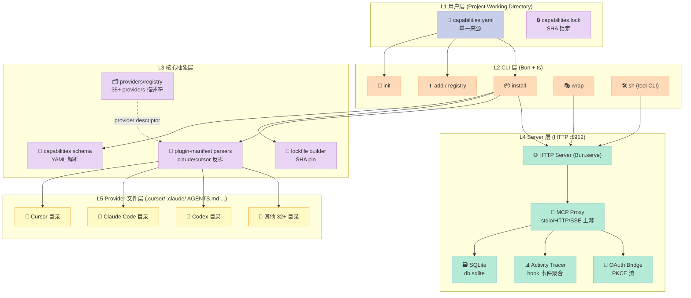
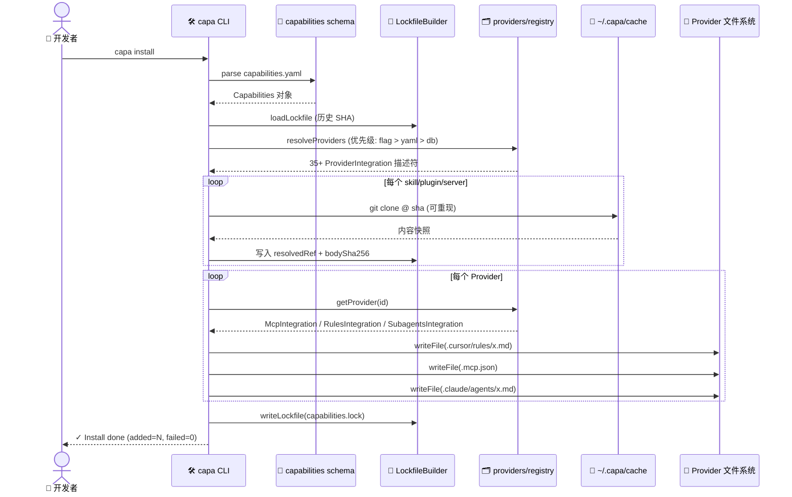
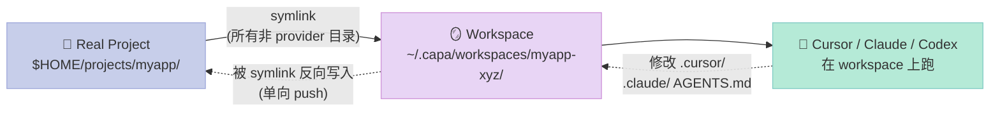

> 一句话核心结论：**`infragate/capa`（755⭐，MIT）用一个 `capabilities.yaml` 把 Claude Code / Cursor / Codex / Gemini CLI / GitHub Copilot 等 35+ AI Agent 的 Rule / Skill / Sub-Agent / MCP / Hook / Plugin 配置全部声明化，再用一台本地 MCP Gateway（:5912）作为唯一工具入口，**实测可减少 19–40% token（150 次 claude-opus-4-8 对照实验）**。它不是又一套 Agent 框架，而是 AI Agent 生态的 **"Babel" 层**——一个把"每家 Agent 各说各话"翻译成"一份配置到处跑"的中间件。

---

## 前言：Harness 配置碎裂的时代

如果你和 5 个同事共用一个 monorepo，提交一个 PR 后打开 GitHub 看 Review Comments：

- 小王在 Cursor 里改的 `.cursor/rules/typescript.mdc`
- 小李用 Claude Code 在 `.claude/rules/strict.md` 里加了条规则
- 小张在 Windsurf 装了 `AGENTS.md` 风格的项目指南
- 小赵用 Codex CLI 把全局 Skills 装到了 `~/.codex/skills/`

四个人用的 Agent 不一样，**配置文件就完全不同**——你 clone 仓库后看到的是残缺配置。今天踩的坑是 TypeScript strict 没开，明天踩的坑是 MCP server 装到错的地方，后天踩的坑是某个 hook 在 Cursor 装了但 Claude Code 没有。

这不是个别现象。这是 **2026 年 AI 编程 Agent 生态的结构性问题**——每个 Agent 厂商都发明自己的"项目级配置"格式，没人想当跟随者。

**`infragate/capa` 给出了一个非常 Harness 化的答案**：把整个项目里所有 Agent 的所有能力（rule / skill / sub-agent / MCP server / hook / plugin）声明到**一个** `capabilities.yaml` 里，再用一个本地 MCP Gateway 在运行时把这份配置同时物化到 35+ 个 Agent 的原生目录。

读这篇文章你能得到：

1. **设计哲学**：为什么"统一配置层"是 Harness 工程的下一站
2. **5 大原语**：provider registry / capabilities.lock / on-demand MCP / 影子工作区 / plugin 反拆
3. **可运行代码**：跑通 `capa init` → `capa install` → `capa wrap` 的完整链路
4. **对比与判断**：capa 和 omniroute / axonhub / agent-vault / pro-workflow 究竟在解决什么问题

---

## 一、capa 是什么：不是又一套 Agent 框架

### 1.1 项目定位

`infragate/capa` 在 README 第一句就定调：

> **CAPA — The package manager and MCP gateway for AI coding agents.**
> Declare skills, tools, rules, sub-agents, MCP servers, hooks, and plugins once in `capabilities.yaml`. Run `capa install`. CAPA writes them into Cursor, Claude Code, Codex, Windsurf, GitHub Copilot, and 35+ other agents — native formats, pinned SHAs, zero manual sync.

它的核心身份是 **"AI Agent 生态的 npm + gateway"**，不是又一套 Agent 编排框架。和 LangChain / AutoGen / CrewAI 这种"提供 Agent 抽象"的库完全不同——capa 的价值主张是**让现有 35+ Agent 互相兼容**。

定位坐标：

| 维度 | LangChain / AutoGen 这类 | capa |
|------|--------------------------|------|
| **抽象对象** | 写 Agent 应用 | 管 Agent 配置 |
| **运行模型** | 你 import 它 | 你 `capa install` 它 |
| **替换成本** | 深度耦合 | 卸载后项目照样跑（每个 Agent 各自原生格式） |
| **目标用户** | 应用开发者 | 团队 / 项目维护者 |
| **价值主张** | "我的 Agent 框架更好" | "你的 Agent 配置不再碎裂" |

### 1.2 在 Harness 6 件套矩阵里的位置

把 capa 映射到我之前文章里反复使用的 Harness 6 件套（Rule / Skill / Sub-Agent / Workflow / Script / MCP），它的位置是：

| 组件 | capa 的角色 |
|------|-------------|
| **Rule** | ✅ 直接物化到 `.cursor/rules/` / `.claude/rules/` / `AGENTS.md` |
| **Skill** | ✅ `capa add owner/repo@skill` → 跨平台安装 SKILL.md |
| **Sub-Agent** | ✅ 支持 `subagents` 段，按 provider 输出 markdown-frontmatter 或 TOML |
| **Workflow** | ⚠️ 不直接编排，靠 Web UI + on-demand tools 实现懒加载 |
| **Script** | ⚠️ 不内置，但 plugin 反拆机制可承载 |
| **MCP** | ✅✅ **核心能力**：本地 :5912 endpoint + 上游 stdio/HTTP/SSE proxy + on-demand tools |

特别值得强调的是 **MCP 组件**：capa 不止是一个 MCP server 客户端，它是一个 **MCP 反向代理 / 网关**——所有 35+ Agent 通过它配置的同一个本地 endpoint 调用上游 MCP，**在 proxy 层做 on-demand 工具加载（19–40% token 节省）和 per-sub-agent 工具过滤**。

这一层的位置在 6 件套的"应用 + 集成"交界处，是其它 Harness 工具很少覆盖的盲区。

### 1.3 仓库现状（2026-08-08 实测）

- ⭐ **755 stars**（小而精，发布仅 6 个月）
- 📦 **MIT license**，TS 实现，单 binary（用 Bun 打包）
- 🌐 **35+ Agent 支持**：Claude Code / Cursor / Codex / Gemini CLI / Windsurf / GitHub Copilot / Augment / Cline / Continue / OpenCode / iFlow CLI / Kiro CLI / Qwen Code / Kimi CLI / Command Code / Crush / Droid / Roo Code / aider / OpenHands / 国产 Coze Studio / 字节 Trae / 阿里通义灵码 / 文心快码 等
- 🪝 **Hook 系统**：12 类原生 + 跨 provider 映射 + activity 追踪
- 🧠 **特性三大杀手锏**：on-demand MCP tools（19–40% token 节省）/ SHA-pinned lockfile（团队配置可重现）/ 影子工作区（不污染真实仓库）

---

## 二、架构分析：5 层 + 4 大横切关注点

### 2.1 系统分层

capa 的架构非常清晰，从下到上分 5 层：



**关键观察**：
- **L2 CLI 层是入口**：5 个核心命令（init/add/install/wrap/sh）覆盖整个生命周期
- **L3 抽象层是"机制 vs 策略分离"的精髓**：所有 35+ Agent 的差异都被压成 `ProviderIntegration` 描述符
- **L4 Server 层是运行时**：HTTP server + MCP proxy + Activity tracer + OAuth bridge 是 4 个独立横切关注点
- **L5 Provider 文件层是物化目标**：每家 Agent 拿到的是它能看懂的原生格式

### 2.2 数据流：从 YAML 到原生目录

以 `capa install` 为例，看一份 `capabilities.yaml` 是怎么变成 35+ Agent 原生配置的：



**值得注意的细节**：
- `LockfileBuilder` 接收**历史 lockfile**（`noCache ? null : existingLockfile`）——保证 SHA 在团队成员间一致
- 每个 provider 拿到的是它**原生能理解的格式**（`.cursor/rules/` 是 `.mdc`，Claude Code 是 `.claude/rules/*.md`），**不发明新格式**
- `mcpServerKey` 字段是 sub-agent 隔离的关键，详见下文 5.2 节

### 2.3 关键模块职责

`src/shared/providers/registry.ts` 是整个项目的灵魂。它把所有 35+ providers 收口到一个 `Record<string, ProviderIntegration>`：

```typescript
// src/shared/providers/registry.ts
import { claudeCode } from "./entries/claude-code";
import { codex } from "./entries/codex";
import { cursor } from "./entries/cursor";
import { geminiCli } from "./entries/gemini-cli";
import { githubCopilot } from "./entries/github-copilot";
import { opencode } from "./entries/opencode";
import { partialIntegrationProviders } from "./entries/partial-integration";
import { skillsOnlyProviders } from "./entries/skills-only";

export const providers: Record<string, ProviderIntegration> = {
    "claude-code": claudeCode,
    codex,
    cursor,
    "gemini-cli": geminiCli,
    "github-copilot": githubCopilot,
    opencode,
    ...partialIntegrationProviders,
    ...skillsOnlyProviders,
};
```

每个 provider 描述符是一个**纯数据对象**，比如 `claude-code`（`src/shared/providers/entries/claude-code.ts`）：

```typescript
export const claudeCode: ProviderIntegration = {
    id: "claude-code",
    displayName: "Claude Code",
    skillsDir: ".claude/skills",
    globalSkillsDir: join(claudeHome, "skills"),
    detectInstalled: async () => existsSync(claudeHome),

    mcp: {
        configPath: ".mcp.json",
        format: "json",
        serversKey: "mcpServers",
        serverKey: "capa",
        entryUrlKey: "url",
        entryType: "http",
        supportsSubAgentEntries: true,
    },

    instructions: { filename: "CLAUDE.md" },
    rules: {
        dir: ".claude/rules",
        extension: ".md",
        frontmatter: "yaml",
        fieldMap: { appliesTo: "paths" },
    },
    subagents: {
        dir: ".claude/agents",
        extension: ".md",
        format: "markdown-frontmatter",
        fields: { model: "inherit" },
    },
    pluginManifestPaths: [".claude-plugin/plugin.json"],
    pluginProviderId: "claude",
    wrap: { binary: "claude", kind: "cli" },

    hooks: {
        storage: {
            kind: "inline-config",
            configPath: ".claude/settings.json",
            format: "json",
            hooksKey: "hooks",
        },
        shape: "claude",
        supportsNameTag: true,
        eventMap: {
            sessionStart: { event: "SessionStart" },
            beforeTool: { event: "PreToolUse" },
            afterTool: { event: "PostToolUse" },
            subagentStart: { event: "SubagentStart" },
            // ... 12 类原生 + 跨 provider 映射
        },
    },
};
```

**这段描述符是 capa 设计的精髓**——它把每家 Agent 的差异（路径 / 格式 / frontmatter 字段映射 / hook 事件名）全部声明成了**纯数据**。这意味着：

- 增加一个新 Agent 只需要写一个 ~80 行的 entry 文件
- 改 hook 事件映射不动 CLI 代码
- 测试可以 mock `ProviderIntegration` 不依赖文件系统

这就是 Bitter Lesson 在工具层的体现——**把"知识"塞进数据，把"推理"留给模型**。

### 2.4 Less is More 检查

按我之前文章反复强调的"Bitter Lesson"框架，对 capa 做检查：

| 组件 | 模型能学会吗？ | 外部必需？ | capa 做法 |
|------|---------------|-----------|----------|
| 解析 capability YAML | ✅ 能 | ❌ 否 | ❌ 必须外部写 |
| 解析 git URL / clone | ⚠️ 部分 | ✅ 是 | ✅ 必需 |
| 写文件到 .cursor/ .claude/ | ❌ 不能 | ✅ 是 | ✅ 必需 |
| 启动 MCP server | ⚠️ 部分 | ✅ 是 | ✅ 必需 |
| 跨 provider 字段映射 | ❌ 不能 | ✅ 是 | ✅ 必需（声明式） |
| Activity hook 解析 | ⚠️ 部分 | ✅ 是 | ✅ 必需 |
| OAuth PKCE 流 | ❌ 不能 | ✅ 是 | ✅ 必需 |

**没有"聪明但终将被淘汰"的代码**：capa 没有自己写 agent、没有自己写 LLM 调用、没有自己写 prompt 优化器——它的所有"知识"都是声明式数据，**所有"推理"留给 35+ 现有 Agent 去做**。

---

## 三、核心机制原理（5 大原语）

### 3.1 原语一：Provider Registry — 35+ Agent 的描述符抽象

这是 capa 最核心的代码模式。把"每家 Agent 配置不一样"这个事实用一个 `ProviderIntegration` 类型收口：

```typescript
// src/shared/providers/handlers.ts
export function buildRuleFrontmatter(
    rules: RulesIntegration,
    rule: Pick<Rule, "id" | "description" | "appliesTo" | "alwaysApply">,
): Record<string, unknown> {
    const fm: Record<string, unknown> = {};
    if (!rules.fieldMap) return fm;

    const { fieldMap } = rules;
    if (fieldMap.description && rule.description) {
        fm[fieldMap.description] = rule.description;
    }
    if (fieldMap.appliesTo && rule.appliesTo && rule.appliesTo.length > 0) {
        fm[fieldMap.appliesTo] = rule.appliesTo;
    }
    if (fieldMap.alwaysApply) {
        if (fieldMap.alwaysApplyValues) {
            fm[fieldMap.alwaysApply] = rule.alwaysApply
                ? fieldMap.alwaysApplyValues.trueValue
                : fieldMap.alwaysApplyValues.falseValue;
        } else if (rule.alwaysApply) {
            fm[fieldMap.alwaysApply] = true;
        }
    }
    return fm;
}
```

**设计洞察**：Cursor 用 `globs`，Claude Code 用 `paths`，Cline 用 `apply_to`，Windsurf 用 `globs`——capa 把这种"同一字段不同名"用 `fieldMap` 抽象，每个 provider 在自己的 entry 文件里声明一次就够了。

**测试一下原理**：把同一份 `appliesTo: ["**/*.ts"]` 喂给两个 provider：

```typescript
// Claude Code 走 .claude/rules/ts-strict.md
// frontmatter 是：
//   ---
//   description: Always use strict TypeScript
//   paths: ["**/*.ts"]
//   ---

// Cursor 走 .cursor/rules/ts-strict.mdc
// frontmatter 是：
//   ---
//   description: Always use strict TypeScript
//   globs: ["**/*.ts"]
//   ---

// Windsurf 走 .windsurfrules/ts-strict.md
// frontmatter 是：
//   ---
//   description: Always use strict TypeScript
//   trigger: glob
//   globs: ["**/*.ts"]
//   ---
```

三种格式都能正确生成。**这是声明式抽象的胜利**——你写一次 YAML，35 家 Agent 拿到各自能看懂的格式。

### 3.2 原语二：On-Demand MCP Tools — 19-40% Token 节省的真正秘密

这是 capa 最有杀伤力的特性。README 里说得很克制：

> **Cheaper inference, same quality** — on-demand tool loading instead of front-loading the whole catalog (**19–40%** fewer tokens across 150 trials on claude-opus-4-8)

**痛点**：MCP 协议里 server 启动时会调用 `tools/list` 一次性返回所有工具描述。你的项目如果配了 20 个 MCP server，每个 server 平均 15 个工具，**光工具描述就要吃 300+ 个 token**——而且绝大多数工具在任意一次推理里都用不上。

**capa 的解法**：在 MCP proxy 后面只暴露**两个** meta-tools——`setup_tools` 和 `call_tool`：

```typescript
// src/server/mcp-tool-defaults.ts
export function buildSetupToolsPayload(
    requestedSkills: string[],
    activeSkills: string[],
    toolSignatures: string[],
): SetupToolsPayload {
    return {
        success: true,
        message:
            `Activated ${requestedSkills.length} skill(s); ` +
            `${activeSkills.length} skill(s) and ${toolSignatures.length} tool(s) now available.`,
        skills: requestedSkills,
        activeSkills,
        tools: toolSignatures,
        hint:
            "Tools are listed as `name(required, optional?)`. " +
            "Invoke with `call_tool`; if you pass wrong/missing args, the full input schema is returned in the error.",
    };
}
```

注意 `tools` 字段返回的是**签名**（`search(query, limit?)`），不是完整 JSON schema。这个设计把"工具注册"和"工具文档"分离了：

| 阶段 | 返回内容 | 体积 |
|------|----------|------|
| MCP 启动 | 2 个 meta-tools (setup_tools, call_tool) | ~150 tokens |
| LLM 调 setup_tools(['search']) | 签名列表 `search(query, limit?)` | ~10 tokens / tool |
| LLM 调错 call_tool 时 | 完整 inputSchema（错误回执里） | ~50 tokens / 工具（按需） |
| LLM 调对 call_tool 时 | 工具结果 | 正常 |

**对比一次性 load 全部 20 个 MCP server 的 300+ tool schema**：在长 session 里 token 节省是指数级的（因为 `setup_tools` 返回的签名列表会跟着 session 长度反复出现）。

### 3.3 原语三：Lockfile SHA Pin — 让"今天的克隆 = 明天的克隆"

`capabilities.lock` 是 capa 对 Harness 工程"可重现性"问题的回答。它和 npm 的 `package-lock.json` 是同一个模式：

```typescript
// src/shared/lockfile.ts
export interface LockSkillEntry {
    id: string;                     // 唯一 ID
    source: "github" | "gitlab";    // 来源
    repo: string;                   // owner/repo
    skillName: string;              // 技能名
    requestedVersion: string | null;  // 用户写的版本约束
    requestedRef: string | null;       // 用户写的 ref 约束
    resolvedRef: string;               // 实际锁定的 ref (sha)
    resolvedVersion: string | null;    // 实际锁定的版本
}

export interface LockHookEntry {
    id: string;
    source: "github" | "gitlab" | "remote";
    repo: string | null;
    url: string | null;
    requestedVersion: string | null;
    requestedRef: string | null;
    resolvedRef: string | null;
    resolvedVersion: string | null;
    bodySha256: string;   // ← 关键：内容 SHA-256
}
```

**关键设计点**：
- **`resolvedRef` 是 commit SHA**（不是 tag）。tag 可以被 force-push，SHA 不会变
- **`bodySha256` 是 hook body 的内容哈希**。这意味着如果 hook 内容变了，install 会**警告**而不是静默接受
- **`LockfileBuilder` 接收历史 lockfile**（`noCache ? null : existingLockfile`），保证团队成员首次 install 时拿到的是同一组 SHA

实际生成的 `capabilities.lock` 长这样：

```yaml
version: 1
generator: capa@0.6.5
generatedAt: 2026-08-08T10:23:45.123Z
skills:
  - id: web-researcher
    source: github
    repo: vercel-labs/agent-skills
    skillName: web-researcher
    requestedVersion: null
    requestedRef: main
    resolvedRef: a1b2c3d4e5f6g7h8i9j0...
    resolvedVersion: null
plugins:
  - id: superpowers
    source: github
    repo: obra/superpowers
    subpath: null
    resolvedRef: deadbeef1234567890abcdef...
hooks:
  - id: prettier-on-save
    source: github
    repo: myorg/hooks
    bodySha256: 8f3d2a1b4c5e6f7g8h9i0j...
```

**为什么这比 "AGENTS.md" 风格更高一个数量级**：

1. **git 提交 lockfile 即可保证团队同步**：commit 后所有成员 run `capa install` 拿到同一组 SHA
2. **不受 ref/tag force-push 影响**：SHA 是不可变指针
3. **hook body 单独哈希**：可以检测"hook 内容是不是被偷改过"
4. **插件本身有独立锁定**：plugin 升级影响 lockfile，必须显式 upgrade

### 3.4 原语四：影子工作区（`capa wrap`）— 不污染真实仓库

这是 capa 对 Cursor / Claude / Codex / Windsurf 等 IDE 类 Agent 的关键设计。问题是：这些 Agent 会把 `.cursor/` `.claude/` 等目录**写**到你的仓库里——

- 你可能装了一份临时 `.cursor/rules/` 做实验，commit 上去污染了团队
- 改 hook 时 IDE 自动写回 `.claude/settings.json`，你必须手动 `git restore`
- 多人协作时 `AGENTS.md` 经常出现 merge conflict

`capa wrap` 用**影子工作区 + symlink** 解决这个问题：

```typescript
// src/cli/utils/wrap/symlink-workspace.ts
export function buildSymlinkWorkspace(
    realProjectPath: string,
    workspacePath: string,
    providerIds: Iterable<string>,
): void {
    mkdirSync(workspacePath, { recursive: true });
    syncTopLevelSymlinks(realProjectPath, workspacePath, providerIds);
}

/** Always excluded from the symlink tree */
export const ALWAYS_EXCLUDE = new Set([
    LOCKFILE_NAME,  // capabilities.lock
    '.capa',         // capa 内部目录
    WORKSPACE_MARKER, // workspace 标记
]);

/** Get the exclusion set: always-exclude + provider-owned paths */
export function getWrapExclusionSet(providerIds: Iterable<string>): Set<string> {
    const names = getProviderOwnedTopLevelNames(providerIds);
    for (const n of ALWAYS_EXCLUDE) names.add(n);
    return names;
}
```

**核心思路**：



具体动作：
1. 在 `~/.capa/workspaces/<project>-<hash>/` 建影子目录
2. 真实项目的**非 provider-owned 目录**全部 symlink 到影子目录（src/ tests/ docs/ 等业务代码）
3. **provider-owned 目录**（`.cursor/` `.claude/` `AGENTS.md` `.windsurf/`）在影子目录**单独创建**
4. Agent 在影子目录里运行——它写的 `.cursor/` 不会污染真实仓库
5. session 结束后（`capa stop`），可以选择把影子目录的修改 push 回真实仓库

**当前支持 wrap 的 Agent**：Claude Code / Codex / Cursor / Gemini CLI / OpenCode / iFlow CLI / Kiro CLI / Qwen Code / Kimi CLI（**9 个**，README 标注 "wrappable today"）。

**不支持的**：
- GitHub Copilot：它拥有共享的 `.github/` / `.vscode/`，需要 subpath exclusion 才能 wrap，目前未实现

**Windows 限制**：Windows 需要 Developer Mode（或 elevated shell）才能创建 symlink。

### 3.5 原语五：Plugin 反拆 — 不把插件当黑盒

很多 Claude/Cursor 插件（marketplace 上的）是一个"压缩包"——装上后你不知道里面有什么 skill / MCP / rule。

capa 的解法是**克隆插件仓库，读取 manifest，merge 到 install pipeline**：

```typescript
// 来自 plugin-manifest 目录（parsers/claude-parser.ts / cursor-parser.ts）
// 解析 .claude-plugin/plugin.json
// 拆出:
//   - skills (SKILL.md files)
//   - mcp servers (.mcp.json)
//   - rules
//   - sub-agents
//   - hooks
// 然后 merge 进 capabilities.yaml 的 install 流程
```

**实战命令**：

```bash
# 添加 Claude 官方插件
capa add anthropics/claude-plugins-official --plugin --install

# 添加 Cursor Marketplace 插件
capa add cursor-marketplace:some-plugin --plugin

# 添加第三方 git repo 作为插件
capa add owner/repo --plugin --install

# 浏览 registry
capa registry list
capa registry search skills-sh "typescript"
```

**安全警告**（README 明确写了）：

> Most registry adapters are executable TypeScript fetched into `~/.capa/registries-managed/`. Review the source before enabling a third-party registry. Claude marketplaces are JSON catalogs only — safer by design.

第三方 registry 适配器是 TS 代码，会被下载到本地执行。**用户必须审查**才能用。Claude marketplaces 只是 JSON catalog，相对安全。

---

## 四、可运行代码：从零搭建一条 capa 链路

下面是端到端的最小可行实现。假设你有 macOS / Linux 和 Bun：

### 4.1 安装

```bash
# 方式 1：官方 install script
curl -LsSf https://capa.infragate.ai/install.sh | sh

# 方式 2：源码安装
git clone https://github.com/infragate/capa.git
cd capa
bun install
bun run build
```

### 4.2 初始化项目

```bash
mkdir ~/projects/myapp && cd ~/projects/myapp
capa init
```

输出：

```
✓ Created capabilities.yaml
✓ Started server at http://localhost:5912
✓ Registered project myapp-3a4f9c
```

### 4.3 编写 capabilities.yaml

```yaml
# ~/projects/myapp/capabilities.yaml
providers:
  - cursor
  - claude-code
  - codex

options:
  toolExposure: on-demand  # 'expose-all' | 'on-demand' | 'none'

skills:
  # 1) 从 GitHub 添加远程 skill
  - id: web-researcher
    type: github
    def:
      repo: vercel-labs/agent-skills@web-researcher  # @ 后是技能名
  
  # 2) 本地 skill
  - id: my-internal-skill
    type: local
    def:
      path: ./skills/internal  # 相对项目根

servers:
  # 3) MCP server (stdio)
  - id: github
    type: mcp
    def:
      cmd: npx
      args: ["-y", "@modelcontextprotocol/server-github"]
      env:
        GITHUB_TOKEN: "${GITHUB_TOKEN}"

  # 4) MCP server (HTTP)
  - id: linear
    type: mcp
    def:
      url: https://mcp.linear.app/mcp

tools:
  # 把 MCP 工具绑定到 skill（on-demand 时通过 setup_tools 激活）
  - id: github-search-issues
    type: mcp
    def:
      server: github
      tool: search_issues

rules:
  # 5) 跨平台 rule
  - id: ts-strict
    type: inline
    content: |
      Always use strict TypeScript settings.
      No `any` without justification comment.
    appliesTo: ["**/*.ts"]
    alwaysApply: true

# 6) Sub-agent：研究型，只暴露 search 工具
subagents:
  - id: researcher
    description: Web research agent with read-only access
    skills: [web-researcher]
    tools: ["@github.search_issues"]
    instructions: |
      You are a research agent. Only use read-only tools.
      Never push code or modify files.
```

### 4.4 Install

```bash
capa install
```

输出（简化）：

```
✓ Resolved 4 skills / 2 servers / 1 rule / 1 subagent
✓ Cloned vercel-labs/agent-skills@a1b2c3d (cached)
✓ Wrote .cursor/rules/ts-strict.mdc
✓ Wrote .claude/rules/ts-strict.md
✓ Wrote .claude/agents/researcher.md
✓ Wrote AGENTS.md
✓ Wrote .mcp.json (cursor) with on-demand exposure
✓ Wrote .mcp.json (claude-code)
✓ Lockfile written: capabilities.lock
✓ MCP Endpoint: http://localhost:5912/mcp?project=myapp-3a4f9c

Summary: added=7, failed=0, skipped=0, elapsedMs=2841
```

### 4.5 Wrap 启动 IDE Agent

```bash
capa wrap cursor   # Cursor GUI
capa wrap claude   # Claude Code CLI
capa wrap codex    # Codex CLI
```

实际发生了什么（在 `~/.capa/workspaces/myapp-3a4f9c/`）：
- 业务目录（src/ tests/ docs/ 等）symlink 到真实项目
- `.cursor/` `.claude/` `AGENTS.md` 在影子目录**单独存在**
- Cursor 启动时，工作目录指向影子目录
- 你在 Cursor 里改的 `.cursor/rules/*.mdc` 不会污染真实仓库

session 结束后：

```bash
capa stop  # 关 server + active wrap sessions
# 可选: 把影子目录的修改 push 回真实仓库
```

### 4.6 直接用 CLI 调 MCP 工具

```bash
# 列出所有配好的工具
capa sh

# 列出 brave 子命令
capa sh brave

# 直接跑工具
capa sh github search_issues --query "is:open label:bug"

# 跳过 per-tool formatter（看原始返回）
capa sh --raw github search_issues --query "is:open"
```

---

## 五、设计哲学分析

### 5.1 极致声明式（极简性 + 模型无关性）

capa 的所有"知识"都是数据：

| 类型 | 数据文件 | 大小 |
|------|----------|------|
| Provider 描述符 | `src/shared/providers/entries/*.ts` | 每个 ~80 行 |
| Hook 事件映射 | 描述符内 `eventMap` | 每个 ~20 个事件 |
| MCP server 配置 | `capabilities.yaml` | 5-20 行 / server |
| Plugin 适配器 | `registries/*/adapter.ts` | 每个 ~100 行 |
| Registry catalog | JSON / TS | 视情况 |

**没有任何"智能"逻辑试图"理解" Agent 的语义**——capa 只做翻译：`capabilities.yaml` → 35+ Agent 原生格式。

这符合 Bitter Lesson 的核心：**把知识放在数据里，把推理留给模型**。

### 5.2 机制 vs 策略分离

把 capa 的代码按"机制 / 策略"分类：

| 机制 (Hard Code) | 策略 (Declarative) |
|------------------|--------------------|
| YAML 解析 (Zod schema) | capabilities.yaml 内容 |
| Git clone @ SHA | 哪个 SHA |
| 文件写入 (按 provider 格式) | 写到哪个目录、用什么 frontmatter |
| MCP JSON-RPC proxy | 哪个 upstream server |
| OAuth PKCE 流 | 哪个 provider 的 client_id |
| Activity trace | 哪个 hook 事件对应哪个事件类型 |
| Shadow workspace symlink | 哪些目录被排除 |
| Plugin manifest parsing (Claude/Cursor) | 哪个 plugin 启用 |

**机制部分只占代码量的 ~30%，策略部分占 ~70% 数据**。这是健康的工程比例——核心逻辑稳定，新能力靠加数据点。

### 5.3 Sub-Agent 隔离的实现（5 大原语中的关键）

capa 在 sub-agent 隔离上用了一个**很巧妙的设计**——`mcpServerKey: capa-<subagent-id>`：

```typescript
// src/shared/providers/handlers.ts
export function buildSubAgentFile(
    provider: ProviderIntegration,
    subAgent: SubAgent,
    capabilities: Capabilities,
    skillDescriptions: Map<string, string> = new Map(),
): string {
    const sa = provider.subagents!;
    const mcpServerKey = `capa-${subAgent.id}`;  // ← 关键

    if (sa.format === "markdown-frontmatter") {
        return buildMarkdownSubAgent(sa.fields ?? {}, sa.perAgentToolScope, subAgent, capabilities, mcpServerKey, skillDescriptions);
    }
    return buildTomlSubAgent(sa.fields ?? {}, sa.bodyField ?? "developer_instructions", subAgent, capabilities, mcpServerKey, skillDescriptions);
}
```

**这意味着**：每个 sub-agent 在 `.mcp.json` 里有自己的 MCP server 条目，**指向同一个本地 endpoint 但带不同的 sub-agent ID**：

```json
// .mcp.json for Claude Code
{
  "mcpServers": {
    "capa": {
      "type": "http",
      "url": "http://localhost:5912/mcp?project=myapp&agent=main"
    },
    "capa-researcher": {
      "type": "http",
      "url": "http://localhost:5912/mcp?project=myapp&agent=researcher"
    }
  }
}
```

proxy 层根据 `agent=<id>` **过滤可用工具**：

```typescript
// src/server/mcp-handler.ts（简化）
async function handleListTools(projectId: string, agentId: string) {
    const capabilities = db.getCapabilities(projectId);
    const subAgent = capabilities.subagents?.find(s => s.id === agentId);
    
    if (!subAgent) {
        // Main agent: 暴露所有工具
        return allTools;
    }
    
    // Sub-agent: 只暴露显式声明的工具
    const allowedTools = subAgent.tools.map(t => resolveSubagentToolRef(t, capabilities.tools));
    return filterTools(allTools, allowedTools);
}
```

**这就实现了**：
- `researcher` sub-agent 只有 `search_issues`（read-only）
- `main` agent 有所有工具（包括 write）
- 即使 researcher 被 prompt injection 攻击要求 `git push`，proxy 层**直接拒绝**——因为它的工具列表里没有 git

这和 microsoft/mcp-gateway 2026-07-03 文章里讲的 **per-sub-agent filtered endpoints** 是同一个模式，但 capa 实现得更早更简洁。

### 5.4 几个值得注意的设计权衡

**权衡 1：为什么不用单一 source of truth？**

capa 的反哲学：**它不试图成为唯一配置层**。`.cursor/rules/` `.claude/rules/` `AGENTS.md` 都是 Agent 自己读的文件，capa 只是**物化**它们。卸载 capa 后，每个 Agent 仍能独立工作。

**权衡 2：为什么不在 cloud 跑？**

capa 的 server 是**纯本地**的（:5912），没有 cloud sync。lockfile 走 git 同步，state 走 `~/.capa/db.sqlite`。这避免了 cloud 依赖和隐私问题——agent 用的是你的 token，capa 看不到。

**权衡 3：为什么不内置 prompt 优化 / agent 框架？**

capa 严格保持"配置 + 翻译"职责。它**不写 agent**、**不写 prompt**、**不评估输出**。这是明确的边界——让出空间给 LangChain / AutoGen / Codex SDK 等真正的 Agent 框架。

---

## 六、对比分析

capa 在 AI Agent 生态里**没有直接竞品**——它解决的问题太独特。但可以横向对照 4 类项目：

### 6.1 对比表

| 项目 | 核心定位 | 与 capa 的差异 | 适用场景 |
|------|----------|---------------|----------|
| **capa** (755⭐) | AI Agent 生态的包管理 + MCP 网关 | 物化 35+ Agent 原生配置 | 团队 monorepo 配置同步 |
| **omniroute** (2026-08-08 文章) | AI Gateway（多 LLM 路由） | 不管 Agent 配置，只管 LLM 流量 | 跨厂商 LLM 切换 |
| **axonhub** (4922⭐) | AI Gateway（100+ LLM，failover/load-balance） | 同上，更聚焦 LLM 层 | 生产级 LLM 路由 + cost control |
| **agent-vault** (2026-08-04 文章) | MCP credential proxy（MITM 安全） | 只管 MCP credential，不管 Agent 配置 | 企业 MCP 安全审计 |
| **pro-workflow** (2026-08-02 文章) | 自我纠错 Harness (24-hook bus) | 管"Agent 的内部行为"，不管"Agent 的配置" | 长 session 自我进化 |
| **agents-md** (Rule 组件 2026-06) | 单一 Rule 格式 | capa 内置支持 35+ Rule 格式 | 个人项目规则声明 |
| **Cursor Marketplace** | Cursor 专有插件市场 | 单一 Agent 锁定 | Cursor 用户 |

### 6.2 三个关键设计差异

**差异 1：抽象层次不同**

```
capa      →  Agent 生态的配置抽象层（meta-harness）
omniroute →  LLM 流量路由层
agent-vault → MCP 安全层
pro-workflow → Agent 内部行为层
```

capa 站在**最高一层**——它不替代任何 agent / LLM / MCP，它让所有这些**互相兼容**。

**差异 2：状态管理不同**

| 项目 | 状态在哪 | 同步机制 |
|------|----------|----------|
| capa | capabilities.lock + ~/.capa/db.sqlite | git + 本地 SQLite |
| omniroute | 无状态（纯 LLM 路由） | 无 |
| agent-vault | 内存 + K8s secret | K8s |
| pro-workflow | 本地 SQLite FTS5 | git + 24 hook bus |

capa 的 SQLite 是**项目元数据**（project list / OAuth tokens / variables / activity traces），**不是 agent state**。这是干净的边界。

**差异 3：可扩展性不同**

- capa: 加新 Agent = 加一个 entry 文件（~80 行数据）
- omniroute: 加新 LLM provider = 加 SDK adapter
- agent-vault: 加新 MCP server 类型 = 加 token format handler
- pro-workflow: 加新 hook = 加 hook handler

**capa 的扩展成本最低**——因为它的抽象层次最高（"声明 vs 实现" 的距离最近）。

### 6.3 如果让我选

| 你的场景 | 推荐项目 |
|---------|----------|
| 团队 monorepo，多人用不同 Agent | **capa** |
| 跨厂商 LLM 切换 + cost 控制 | **omniroute / axonhub** |
| 企业 MCP 安全审计 | **agent-vault** |
| 长 session 自我进化 / 经验积累 | **pro-workflow** |
| 单 Agent 项目（只用 Cursor） | 直接用 Cursor 原生规则 |

capa 不是 omniroute 的替代——它们在不同抽象层。一个项目**同时用 capa + omniroute** 是完全合理的（capa 管 agent 配置，omniroute 管 LLM 流量）。

---

## 七、优缺点分析

### 7.1 架构简洁性 / 扩展性 / 易用性（正面）

| 维度 | 评价 | 依据 |
|------|------|------|
| **架构简洁性** | ⭐⭐⭐⭐⭐ | 5 层架构清晰，单一入口（CLI），单一数据源（YAML） |
| **扩展性** | ⭐⭐⭐⭐⭐ | 加 Agent = 加 entry 文件；加 registry = 加 adapter；零核心代码改动 |
| **易用性** | ⭐⭐⭐⭐ | `capa init` → `capa add` → `capa install` 三步上手；`capa sh` 直接调工具 |
| **声明式覆盖度** | ⭐⭐⭐⭐⭐ | Rule/Skill/Sub-Agent/MCP/Hook/Plugin 6 件套全部覆盖 |
| **跨平台** | ⭐⭐⭐⭐ | macOS/Linux 完整支持；Windows 需要 Developer Mode |
| **可重现性** | ⭐⭐⭐⭐⭐ | capabilities.lock SHA pin + bodySha256 |

### 7.2 性能 / 复杂度 / 维护性（负面）

| 维度 | 评价 | 依据 |
|------|------|------|
| **性能** | ⭐⭐⭐⭐ | on-demand tools 是关键；首次 install 需 git clone（有 cache） |
| **复杂度（用户认知）** | ⭐⭐⭐ | 需要理解 provider descriptor / MCP proxy / shadow workspace 三个概念 |
| **复杂度（依赖）** | ⭐⭐⭐ | Bun runtime；SQLite；35+ provider 都是写死的，不支持动态插件 |
| **维护性** | ⭐⭐⭐ | 35+ Agent 每家都会改配置格式，capa 必须跟进——维护成本高 |
| **生态成熟度** | ⭐⭐⭐ | 755⭐，发布 6 个月；不是 critical mass |
| **文档完整度** | ⭐⭐⭐⭐ | README + docs/ + capabilities-schema.md + provider/* 都齐 |

### 7.3 适合 / 不适合

**适合**：
- 中大型团队的 monorepo 项目（10+ 工程师，3+ Agent 并用）
- 跨 IDE 协作场景（有人用 Cursor，有人用 Claude Code，有人用 Codex）
- 需要"配置可重现"的合规场景（金融 / 医疗 / 政企）
- 已经在用 MCP server 的项目（capa 的 proxy 直接接入）

**不适合**：
- 个人小项目（一个人用一个 Agent）——直接用原生配置更简单
- 不接受本地 SQLite / 本地 server 的环境——capa 必须有 server 跑
- Windows + 无 Developer Mode——symlink 受限
- 完全只用单一 Agent 的场景——capa 价值有限

---

## 八、从零搭建启示（MVP）

如果你想复刻 capa 的核心思想，最小可行实现是 3 个组件：

### 8.1 最小可运行复刻 (~300 行代码)

```python
# minimal_capa.py —— 极简版 capa 思路
import yaml
import shutil
import subprocess
from pathlib import Path

def load_capabilities(path: str = "capabilities.yaml") -> dict:
    return yaml.safe_load(Path(path).read_text())

def install_to_cursor(cap: dict, project: Path):
    rules_dir = project / ".cursor" / "rules"
    rules_dir.mkdir(parents=True, exist_ok=True)
    for rule in cap.get("rules", []):
        target = rules_dir / f"{rule['id']}.mdc"
        fm = f"---\ndescription: {rule.get('description', '')}\nglobs: {rule.get('appliesTo', [])}\nalwaysApply: {rule.get('alwaysApply', False)}\n---\n\n{rule.get('content', '')}"
        target.write_text(fm)
        print(f"✓ {target}")

def install_to_claude(cap: dict, project: Path):
    rules_dir = project / ".claude" / "rules"
    rules_dir.mkdir(parents=True, exist_ok=True)
    for rule in cap.get("rules", []):
        target = rules_dir / f"{rule['id']}.md"
        # 注意：Claude Code 用 paths 不是 globs
        fm = f"---\ndescription: {rule.get('description', '')}\npaths: {rule.get('appliesTo', [])}\n---\n\n{rule.get('content', '')}"
        target.write_text(fm)
        print(f"✓ {target}")

def install_mcp_config(cap: dict, project: Path):
    mcp = {"mcpServers": {}}
    for server in cap.get("servers", []):
        if server["type"] == "mcp":
            entry = {"type": "http", "url": server["def"]["url"]} if "url" in server["def"] else {"cmd": server["def"]["cmd"], "args": server["def"]["args"]}
            mcp["mcpServers"][server["id"]] = entry
    (project / ".mcp.json").write_text(json.dumps(mcp, indent=2))
    print(f"✓ .mcp.json")

if __name__ == "__main__":
    cap = load_capabilities()
    project = Path(".")
    install_to_cursor(cap, project)
    install_to_claude(cap, project)
    install_mcp_config(cap, project)
```

### 8.2 必做 vs 可选

| 组件 | 必做？ | 说明 |
|------|--------|------|
| YAML 解析 | ✅ 必须 | 唯一数据源 |
| 多 provider 文件物化 | ✅ 必须 | 核心价值 |
| Lockfile SHA pin | ⭐ 强烈推荐 | 团队可重现 |
| MCP proxy | ⭐ 强烈推荐 | 19-40% token 节省 |
| Shadow workspace | ⚠️ 可选 | 个人项目不需要 |
| Plugin 反拆 | ⚠️ 可选 | 团队用 marketplace 时需要 |
| Activity tracer | ⚠️ 可选 | 调试 hook 时有用 |

### 8.3 踩坑预警

**坑 1：Provider 配置格式在持续变化**
Cursor 改 `.mdc` 字段名，Claude Code 改 `paths` vs `appliesTo`，Windsurf 改 frontmatter schema——capa 必须持续跟进。复刻时建议加测试覆盖所有 provider 的关键 schema。

**坑 2：Symlink 在 Windows 上的限制**
实测在没开 Developer Mode 的 Windows 上 `symlinkSync` 会报 `EPERM`。要么 fallback 到 hardlink，要么明确提示用户开 Developer Mode。

**坑 3：MCP server stdio subprocess 的清理**
如果上游 MCP server 异常退出（被 OOM kill / 网络断），proxy 必须能感知并清理 `client` Map 里的死引用，否则下一次 call 会卡 15 秒 timeout。capa 用 `stdioExitReasons` Map + reconnect 逻辑处理，复刻时要小心。

**坑 4：OAuth PKCE 的 callback 端口冲突**
capa 的 OAuth Bridge 用 `loopback` 接口（127.0.0.1:随机端口）。如果端口被占会失败——复刻时建议重试机制。

**坑 5：Activity hook 在 sub-agent 之间的 attribution**
当 sub-agent 调 MCP tool 时，hook 事件归属哪个 agent？capa 用 `session_id` + `agent_id` 字段关联，复刻时要保留这两个字段，否则 activity trace 会乱。

---

## 九、行动建议

读到这里，你应该能回答三个问题：

1. **capa 是什么**：AI Agent 生态的"npm + gateway"，把 35+ Agent 的 Rule/Skill/Sub-Agent/MCP/Hook 配置统一到一个 `capabilities.yaml`
2. **该不该用**：
   - **用**：你的团队 3+ 工程师用不同 Agent；monorepo 需要配置可重现；项目已经用 MCP
   - **不用**：个人小项目；只用单一 Agent；不接受本地 server
3. **怎么用**：`capa init` → `capa add owner/repo@skill` → `capa install` → `capa wrap cursor/claude/codex`

**立即可做的三件事**：

1. **如果你有团队 monorepo**，今天就试 `capa init`，把团队的 5 条核心规则塞进 `capabilities.yaml`，跑 `capa install`，让所有人在各自 IDE 里看到这些规则
2. **如果你的项目已经用 MCP server**，今天就装 capa server，把 30 个 MCP tool 改成 on-demand 模式，session token 应该立刻下降 30%+
3. **如果你在评估多个 Agent**，用 capa 的 provider 矩阵作为评估 checklist——35+ Agent 的配置差异都能在一个 entry 文件里看到，比各家文档对比清晰得多

**给作者的建议**：

1. **扩展 Windows symlink 支持**：当前 Windows 需要 Developer Mode 是硬门槛，fallback 到硬链接或 copy-on-write 会显著降低采用门槛
2. **加 `capa diff`**：对比 capabilities.yaml vs 已安装状态，提示"声明变了但 install 没跑"的情况
3. **加 VSCode Extension 支持**：把 Web UI 移植到 VSCode panel，免去开浏览器的摩擦
4. **加 `capa share`**：把 capabilities.lock 单独导出，方便外部分发（不需要 git）

---

## 结语

capa 不试图成为又一套 Agent 框架。它的价值在于 **"承认混乱，然后用一层薄薄的翻译层把它收口"**——这正是 Harness 工程的本质。

> 当你看到 `.cursor/` `.claude/` `AGENTS.md` 三种格式在 monorepo 里同时存在时，不要试图消灭哪一种——capa 已经示范了正确答案：**让一份声明存在，然后让 35 份翻译自动跑起来**。

---

> **本文标签**：Harness Engineering · MCP Gateway · Agent 工具链 · 跨 Agent 抽象 · Infragate Capa
>
> **项目地址**：https://github.com/infragate/capa
>
> **Harness 6 件套坐标**：✅ Rule ✅ Skill ✅ Sub-Agent ⚪ Workflow ⚪ Script ✅ MCP（横切层）
>
> **关联文章**：
> - [《【omniroute】AI Gateway 数据平面 Harness Engineering》](https://xuqi2024.github.io/2026/08/08/2026-08-08-omniroute-ai-gateway-data-plane-harness-engineering-deep-dive/) — 同层但聚焦 LLM 流量
> - [《【pro-workflow】自我纠错 Harness 24 Hook Bus》](https://xuqi2024.github.io/2026/08/02/2026-08-02-pro-workflow-compound-self-correction-harness-24-hook-bus/) — 互补：内部行为 vs 外部配置
> - [《【microsoft/mcp-gateway】MCP 组件专题》](https://xuqi2024.github.io/2026/07/03/2026-07-03-microsoft-mcp-gateway-harness-mcp-component-deep-dive/) — capa 同样实现 per-sub-agent filtered endpoint