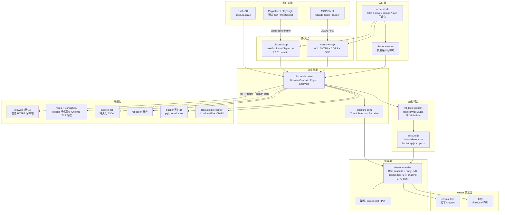
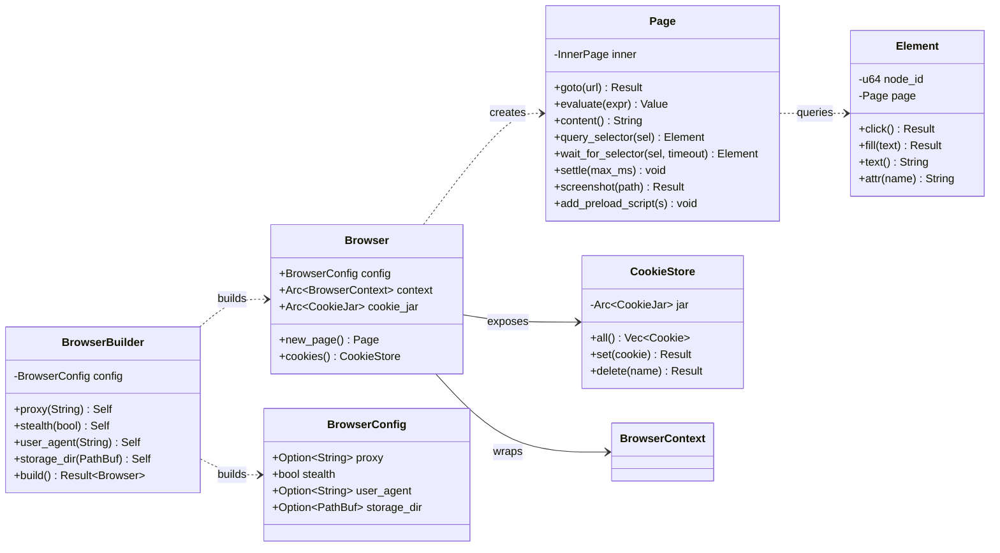
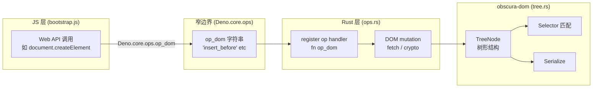
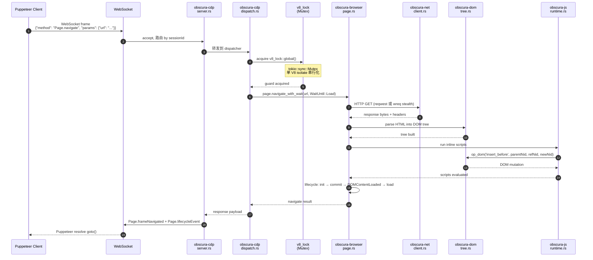
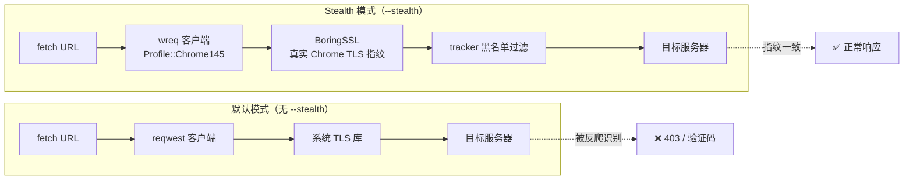

## 引子

2024 年 GitHub 上突然冒出一个叫 **Obscura** 的项目，4 个月从 0 干到 **20k star**，主打"**轻量、隐身、Rust 编写的 headless 浏览器**"。在 Puppeteer/Playwright 当道的年代，它选择了最笨的方法——**自己实现 V8 运行时、自己写 DOM、自己做 CSS 布局、自己画 CPU paint**，把 Headless Chrome 200MB 的内存占用压到 30MB、把 70MB 的二进制压到 30MB 内。

这不是另一个浏览器 wrapper。它是**浏览器引擎本身**。

如果你正在用 browser-use、Puppeteer、Playwright 做 AI Agent 的网页自动化，你大概率踩过这些坑：
- Headless Chrome 在 Kubernetes 里启动要 2 秒、内存 200MB+，并发 50 个实例就要 10GB
- Cloudflare、Akamai、DataDome 一秒识别你是 bot，连正常的代理池都救不了
- Chromium 依赖链复杂，Docker 镜像 1GB+，serverless 部署基本无解
- LLM 驱动的 web agent（browser-use 等）想要一个反检测 + MCP 原生接入的浏览器，找不到

Obscura 用 **9 个 Rust crate + 自研渲染栈 + wreq/BoringSSL TLS 伪装 + MCP 服务器**给出了一个**完整的答案**。本文深度拆解其架构设计的核心巧思。

---

## 一、项目定位与核心价值

**Obscura**（[h4ckf0r0day/obscura](https://github.com/h4ckf0r0day/obscura)）是一个**Rust 编写的开源 headless 浏览器引擎**，专为 AI Agent 自动化与大规模网页抓取设计，目标是成为 Headless Chrome 的 **drop-in 替代**——同样的 CDP 协议接口，同样的 Puppeteer/Playwright 兼容性，但**内存只要 30MB、启动 instant、内置反检测**。

仓库统计（截至 2026-08-09）：

| 维度 | 数据 |
|------|------|
| ⭐ Stars | 20,769（4 个月从 0 起） |
| 🍴 Forks | 1,491 |
| 💻 主语言 | Rust（核心 + CLI） + JS（少量 bootstrap） + Python（vendor） |
| 📜 License | Apache-2.0 |
| 📦 Size | 10,265 KB |
| 📅 最近 push | 2026-08-08（昨天，极活跃） |
| 🏷️ Topics | `antidetect-browser` / `browser-automation` / `cdp` / `browser` / `antidetect` |
| 🔗 官网 | [obscura.sh](https://obscura.sh) |

**能力矩阵**（vs Headless Chrome）：

| 指标 | Obscura | Headless Chrome |
|------|---------|------------------|
| 内存 | **30 MB** | 200+ MB |
| 二进制大小 | **70 MB** | 300+ MB |
| 反检测 | **内置** | 无 |
| 页面加载 | **85 ms** | ~500 ms |
| 启动 | **Instant** | ~2s |
| Puppeteer 兼容 | ✅ | ✅ |
| Playwright 兼容 | ✅ | ✅ |
| MCP 原生支持 | ✅ | ❌ |
| Chromium 依赖 | ❌（自研 V8 + DOM + 渲染） | ✅ |
| 容器友好度 | ⭐⭐⭐⭐⭐ | ⭐⭐ |

**核心定位**：Obscura 不是给"开发者做日常浏览器自动化"的——那是 Puppeteer/Playwright 的活。Obscura 是给"**需要在反爬虫环境、在 serverless / Kubernetes / 容器化环境大规模部署 AI Agent 网页自动化**"的团队准备的：**轻到 30MB、隐到 TLS 指纹一致、稳到 MCP 原生对接**。

---

## 二、整体架构：9-crate Workspace 的职责切分

Obscura 整个仓库是一个 **9 个 crate 的 Rust workspace**，按"一层一个 crate"原则严格切分：

```
obscura-cli       CLI 入口点。子命令：fetch / serve / scrape / mcp
obscura-cdp       Chrome DevTools Protocol server。WebSocket + dispatch + 22 个 domain handler
obscura-browser   Page 类型、navigation、lifecycle events、PDF 生成
obscura-js        V8 运行时（通过 deno_core）。bootstrap.js + Rust ops 桥接
obscura-dom       DOM 树实现（树形存储 + 选择器 + 序列化）
obscura-net       HTTP 客户端、隐身客户端、Cookie jar、robots.txt 缓存、tracker 黑名单
obscura-mcp       Model Context Protocol server（stdio / HTTP）
obscura-render    CSS 级联、retained layout、文字 shaping、CPU paint
obscura           Embeddable Rust 库 API（Browser / Page / Element / CookieStore）
```

整体架构图：



**Workspace 约定**（来自 `docs/Architecture-overview.md`）：
- **One crate per layer**：一层一个 crate
- **跨 crate 调用只能走上一层**：CDP 调用 browser，browser 调用 dom/net/js，**不能侧向**（dom 直接调 net 是禁止的）
- **所有 async 都用 tokio + LocalSet**：因为 V8 是 `!Send`，跨线程会 panic
- **所有 DOM 操作走 `op_dom`**：JS/Rust 边界只有一个窄入口

这种严格分层的好处是**任何一层都可独立替换**——你想换 HTTP 客户端？改 `obscura-net`；想换 JavaScript 引擎？改 `obscura-js`；想加新 CDP method？改 `obscura-cdp` 而不动 browser。

---

## 三、9 大核心抽象

Obscura 的架构深度来自**9 大核心抽象**的精确分层。下面逐一拆解。

### 3.1 Browser / Page / Element 三件套（obscura crate）

obscura 是 embeddable 库 API，给 Rust 应用用的：

```rust
// 来自 crates/obscura/src/lib.rs:1-19（doctest 注释）
use obscura::Browser;

#[tokio::main]
async fn main() -> anyhow::Result<()> {
    let browser = Browser::builder()
        .stealth(true)
        .build()?;
    let mut page = browser.new_page().await?;
    page.goto("https://example.com").await?;
    println!("Content: {} bytes", page.content().len());
    Ok(())
}
```

`BrowserConfig` 4 个核心字段（`crates/obscura/src/config.rs`）：

```rust
// 来自 crates/obscura/src/config.rs:1-20
pub struct BrowserConfig {
    pub proxy: Option<String>,         // 代理 URL，如 "socks5://127.0.0.1:1080"
    pub stealth: bool,                 // 启用隐身模式（指纹伪装）
    pub user_agent: Option<String>,    // 自定义 User-Agent
    pub storage_dir: Option<PathBuf>,  // 持久化 Cookie 存储目录
}
```

`BrowserBuilder` 用 builder pattern 链式配置（`crates/obscura/src/browser.rs:50-78`）：

```rust
let browser = Browser::builder()
    .proxy("socks5://127.0.0.1:1080")
    .stealth(true)
    .user_agent("Mozilla/5.0 ...")
    .storage_dir("/tmp/obscura-storage")
    .build()?;
```

**API 链非常简洁**：browser 创建 → new_page → goto → evaluate → query_selector。这套 API 与 Puppeteer `page.goto(url)` / `page.evaluate(expr)` / `page.$$(selector)` 几乎一致，便于 Puppeteer 用户迁移。

### 3.2 CDP 协议层（obscura-cdp）

CDP（Chrome DevTools Protocol）是 Chrome 的私有协议，让外部客户端（DevTools、Puppeteer、Playwright）能与浏览器交互。Obscura 实现了 **22 个 CDP domain**，包括 `Page` / `Network` / `DOM` / `Runtime` / `Emulation` / `Fetch` / `Browser` 等。

请求流（来自 `docs/Architecture-overview.md`）：

```
CDP client (Puppeteer)
        │ WebSocket frame
        ▼
obscura-cdp/server.rs           accept, route by sessionId
        │
        ▼
obscura-cdp/dispatch.rs         method router, acquires v8_lock
        │
        ▼
obscura-cdp/domains/page.rs     Page.navigate handler
        │
        ▼
obscura-browser/page.rs         navigate_with_wait
        │
        ├──► obscura-net/client.rs        HTTP fetch
        │
        ├──► obscura-dom/tree.rs          parse HTML into the tree
        │
        └──► obscura-js/runtime.rs        run inline scripts
                  │
                  └──► bootstrap.js + ops.rs    DOM bindings
```

**关键设计**：
- **Session ID 路由**：每个 CDP 客户端连接可绑定到多个 target（Page），session ID 格式 `"{targetId}-session"`，dispatcher 按 sessionId 路由到正确的 Page
- **`process_with_interception`**：把 navigation / eval 等长任务 spawn 到 tokio `LocalSet`，**释放 dispatcher**继续处理其他 CDP 消息——这是为什么 `Target.createTarget` 在多客户端并发场景下每个 `newPage` 立即返回
- **WebSocket 心跳 + lifecycle events**：`Page.frameNavigated` / `Page.lifecycleEvent` 等事件回推到客户端，Puppeteer/Playwright 的 `goto` 在客户端按 `Page.lifecycleEvent` 触发 resolve

**CDP 测试套件** 19 个集成测试（`crates/obscura-cdp/tests/`），覆盖：
- `cdp_click_submit_parity.rs` - 点击与表单提交 parity
- `concurrent_connections_heavy_page.rs` - 多连接并发
- `execution_context_pruned_on_navigation.rs` - 导航后上下文清理
- `iframe_event_dispatch.rs` - iframe 事件分发
- `form_submit_method_bypasses_listener.rs` - 表单提交绕过监听器

这种 parity 测试矩阵保证了与 Puppeteer/Playwright 客户端的兼容度。

### 3.3 单 V8 Isolate + tokio LocalSet（obscura-js）

V8 是 `!Send`（不能在多线程间安全转移），所以 Obscura 做了一个**反直觉的设计**：

> 所有页面**共享一个 V8 isolate**，**单线程**。

```rust
// 来自 docs/Architecture-overview.md（"Single V8 isolate" 章节）
let _guard = obscura_js::v8_lock::global().lock().await;
page.evaluate(expr).await
```

`obscura_js::v8_lock::global()` 是一个 `tokio::sync::Mutex`，**串行化所有 V8 工作**。这看起来像瓶颈，但实际：

- **单 isolate 共享 vs 多 isolate 多线程**：共享 isolate 切换成本几乎为 0，多 isolate 需要每个 page 独立 V8 runtime，启动慢、内存大
- **`LocalSet` + 单线程 runtime**：dispatcher 把 navigation 等长任务 spawn 到 `tokio::LocalSet`，**释放 dispatcher** 处理其他 CDP 消息
- **`v8_lock` 保护**：多个客户端并发 `Target.createTarget` 时，每个 `newPage` 立即返回，实际导航在 spawned task 中运行

**Watchdog 防护体系**（`obscura-js/runtime.rs` + `obscura-js/cdp_watchdog.rs`）：
- `arm_watchdog` + `run_event_loop_bounded`：从独立线程终止超时的 V8 isolate（因为 `tokio::time::timeout` 不能抢占同步 V8 代码）
- `OBSCURA_CDP_COMMAND_TIMEOUT_MS`：每个 CDP 命令的 watchdog 超时
- `catch_unwind` 包裹 `op_dom`：DOM-op panic 降级为 null 而非通过 V8 FFI frame abort 进程
- `obscura-dom/tree.rs` 拒绝循环 reparenting：防止树遍历死循环
- `OBSCURA_FETCH_TIMEOUT_MS`：脚本 `fetch()`/XHR 和模块加载都有超时上限

**这种"一个页面挂掉不会拖死整个进程"的 robustness 设计，是 AI Agent 长时间无人值守运行的关键。**

### 3.4 DOM 树与 ops 桥接（obscura-dom + obscura-js/ops）



**核心关系**：

DOM 是 `obscura-dom` crate 实现的：

- **tree.rs** - 树形存储 + cyclic reparenting 检测
- **selector.rs** - CSS 选择器匹配
- **serialize.rs** - outerHTML / innerHTML 序列化
- **tree_sink.rs** - DOM 树变更回调

JS/Rust 边界只有一个窄入口 `op_dom`：

```js
// 来自 docs/Architecture-overview.md（"JS bridge" 章节）
Deno.core.ops.op_dom('insert_before', parentNid, refNid, newNid);
```



**添加一个新 Web API 的流程**（来自 `Adding-a-CDP-method-or-Web-API.md`）：

1. JS shim in `bootstrap.js` - 暴露 API 表面
2. Rust op in `ops.rs` - 执行副作用（DOM mutation / fetch / crypto）
3. 在 `build_extension()` 中注册 op

**这种"窄边界 + 显式注册"的设计让 JS 桥接稳定可调试**，不像 Node.js N-API 那样复杂。

### 3.5 自研渲染栈（obscura-render）

这是 Obscura 最大的技术赌注——**不依赖 Chromium，自己写渲染引擎**：

```
obscura-render consumes the shared DOM and computed style state.
Taffy provides the flex/grid foundation;
Obscura adds browser formatting behavior, text shaping, intrinsic replaced-element sizing,
retained geometry, scrolling, and CPU-backed paint.
```

**关键设计**：
- **vendor/cosmic-text** - 文字 shaping（字体回退、bidi、断字）
- **vendor/taffy** - Flex/Grid 布局引擎（来自 Druid 项目）
- **CSS cascade** - 浏览器原生 CSS 级联行为
- **Retained layout** - 几何信息在 captures 之间保留，按 DOM / style / viewport / scroll / animation / font / resource 变化 invalidate
- **CPU paint** - 不依赖 GPU，直接 CPU 画到 bitmap（截图、PDF）

**Layout retained** 是关键洞察：浏览器 API（`getBoundingClientRect`）和 paint 共享同一份几何，避免"测量模型 vs 截图模型"分叉。

**API 暴露链路**：
- `obscura-js` 把 renderer-owned geometry 暴露给 DOM API
- `obscura-browser` 准备资源 + 拥有 capture
- `obscura-cdp` 把 screenshots / screencast frames / raster PDF 映射到 CDP 协议

### 3.6 Stealth Transport（obscura-net/wreq_client）

反检测是 Obscura 的核心卖点。Stealth 模式使用 `wreq`（不是 reqwest）作为 HTTP 客户端 + **BoringSSL**：

```rust
// 来自 crates/obscura-net/src/wreq_client.rs:80-95
pub fn with_proxy(cookie_jar: Arc<CookieJar>, proxy_url: Option<&str>) -> Self {
    let emulation_opts = wreq_util::Emulation::builder()
        .profile(wreq_util::Profile::Chrome145)
        .platform(wreq_util::Platform::Windows)
        .build();

    let mut builder = wreq::Client::builder()
        .emulation(emulation_opts)
        .timeout(Duration::from_secs(30))
        .redirect(wreq::redirect::Policy::none());
    // ...
}
```

**Stealth 模式的 6 层防护**：

1. **TLS ClientHello 指纹**：wreq 用 `Profile::Chrome145` 模拟 Chrome 145 的 TLS ClientHello、ALPN、cipher order
2. **HTTP header 一致性**：`sec-ch-ua-platform` 与 User-Agent 一致
3. **Navigator 指纹**：`navigator.webdriver = false`，patched native functions mask
4. **WebGL 一致性**：Canvas / WebGL 输出与 Chrome 一致
5. **tracker 黑名单**：`pgl_domains.txt` 阻止已知 tracker 域名
6. **subresource 同步指纹**：脚本内的 `fetch()`/XHR 也走 stealth 客户端，与导航请求指纹一致

**关键洞察**（来自 README 与源码注释）：

> The wreq emulation sends this exact UA and `sec-ch-ua-platform` "Windows" on the wire. navigator has to report the same identity, otherwise the TLS/HTTP layer and the JS layer disagree and a site cross-checks the mismatch as a bot signal.

**TLS 层 + JS 层指纹必须一致**，否则交叉验证就是 bot 信号。Obscura 通过 `STEALTH_USER_AGENT` / `STEALTH_NAVIGATOR_PLATFORM` / `STEALTH_UA_PLATFORM` 三个常量强制 navigator 报告与 TLS 指纹一致的 platform。

**Release 变体**：

| 后缀 | 渲染 | Stealth transport |
|------|------|-------------------|
| 无 | ✅ | ❌ |
| `-stealth` | ✅ | ✅ |
| `-no-render` | ❌ | ❌ |
| `-no-render-stealth` | ❌ | ✅ |

**4 种 binary 变体**让用户按需选：纯 DOM extraction 用 no-render；需要截图就用 render；反爬环境用 stealth；serverless 环境用 no-render-stealth 兼顾隐身与轻量。

### 3.7 Request Interceptor（CDP Fetch-style）

CDP 提供 `Fetch.enable` 让客户端拦截每个请求，Obscura 完整实现：

```rust
// 来自 crates/obscura-net/src/interceptor.rs:1-13
pub enum InterceptAction {
    Continue,
    Block,
    Fulfill(Response),
    ModifyHeaders(HashMap<String, String>),
}

#[async_trait::async_trait]
pub trait RequestInterceptor {
    async fn intercept(&self, request: &RequestInfo) -> InterceptAction;
}
```

**4 种拦截动作**：
- `Continue` - 放行
- `Block` - 阻止
- `Fulfill(Response)` - 直接返回伪造响应（无需真实网络请求）
- `ModifyHeaders(headers)` - 修改请求头

Page API（`crates/obscura/src/page.rs`）暴露对应的 `enable_fetch_interception` / `on_fetch_request` / `on_fetch_response` 三个回调。

**Use case**：
- 拦截 analytics 跟踪器（与 tracker 黑名单互补）
- 拦截广告网络请求以加速页面加载
- 在测试环境用 `Fulfill` 直接返回 mock 响应
- 在反爬环境 modify Authorization headers 注入 token

### 3.8 MCP 服务器（obscura-mcp）

MCP（Model Context Protocol）是 2024 年由 Anthropic 推出的 LLM 应用与外部工具的统一协议。Obscura 是**首批原生支持 MCP 的浏览器**之一：

```rust
// 来自 crates/obscura-mcp/src/lib.rs:30-50
const DEFAULT_TEXT_LIMIT: usize = 4000;
// 默认返回文本限制在 4000 字符，避免一次 tool call 烧光 context window

pub struct BrowserState {
    tabs: std::collections::BTreeMap<String, Page>,
    active_tab: Option<String>,
    tab_counter: u32,
    context: Arc<BrowserContext>,
    user_agent: Option<String>,
    console_messages: Vec<String>,
    interactive_refs: HashMap<String, NodeId>,
}
```

**32 个 MCP tool 定义**（所以 `obscura-mcp/src/lib.rs` 需要 `#![recursion_limit = "512"]` 突破默认 128 宏递归限制）。核心 tool 包括：

- `browser_navigate` - 导航到 URL
- `browser_snapshot` - 返回当前页面的 accessibility tree + interactive element refs（如 `e3` / `e7`）
- `browser_click` - 通过 ref 点击
- `browser_type` - 通过 ref 输入文本
- `browser_screenshot` - 返回 PNG（MCP image content）
- `browser_pdf` - 返回 PDF（MCP embedded resource）
- `browser_evaluate` - 执行 JS
- `browser_console_messages` - 取控制台消息
- `browser_tabs` / `browser_new_tab` / `browser_select_tab` / `browser_close_tab` - 多标签管理

**关键设计**：

1. **Element-ref table**：Agent 通过 `browser_snapshot` 获取当前页面的 interactive elements，每个元素有 ref（如 `"e3"`）。Agent 通过 ref 点击/输入，**无需自己猜 CSS selector**。refs 在 snapshot 内稳定，导航/切换 tab 后失效。
2. **BTreeMap 排序 tabs**：Agent 推理 "tab #2" 确定性，迭代顺序稳定
3. **DEFAULT_TEXT_LIMIT = 4000**：默认返回文本限制在 4000 字符，**避免一次 tool call 烧光 context window**（可被 caller 参数覆盖）
4. **HTTP + CORS + SSE**：除 stdio 外还支持 HTTP transport（SSE 流），可被远程 MCP client 访问

**AI Agent 集成示例**：

```bash
# 启动 MCP server（stdio）
obscura mcp

# 启动 MCP server（HTTP/SSE）
obscura mcp --http --port 3000
```

Claude Code / Cursor 等支持 MCP 的 Agent 把 Obscura 当作 `browser_*` 工具集，就能直接做 web automation——**比 browser-use 这种把 LLM 循环塞进 Python 进程的方案更解耦**：LLM 在 Agent 侧、浏览器在 Obscura 侧、通过 MCP 协议通信。

### 3.9 CLI 子命令 + Worker 并行（obscura-cli）

CLI 是 4 个子命令的入口：

```rust
// 来自 crates/obscura-cli/src/main.rs（全局 flags）
struct Args {
    #[arg(long, global = true)]
    stealth: bool,  // 全局 flag，对 fetch / serve / scrape / mcp 都生效

    #[arg(long, global = true)]
    allow_private_network: bool,  // 允许 loopback / RFC1918 / link-local，SSRF 修复

    #[arg(long, value_name = "FLAGS", allow_hyphen_values = true)]
    v8_flags: Option<String>,  // 透传给 V8，如 "--max-old-space-size=4096"
    // ...
}
```

**4 个子命令**：

1. **`fetch`** - 单页抓取：`--dump text` / `--eval "document.title"` / `--screenshot page.png`
2. **`serve`** - 启动 CDP WebSocket 服务器（默认 127.0.0.1:9222），供 Puppeteer/Playwright 连接
3. **`scrape`** - 多 URL 并行抓取（用 worker 子进程）
4. **`mcp`** - 启动 MCP 服务器（stdio 或 HTTP）

**Worker 并行抓取**（`crates/obscura-cli/src/worker.rs`）：scrape 子命令会 fork 多个 worker 子进程，每个 worker 通过 stdin/stdout JSON-RPC 与主进程通信：

```rust
// 来自 crates/obscura-cli/src/worker.rs:10-30
#[derive(Debug, Deserialize)]
#[serde(tag = "cmd")]
enum WorkerCommand {
    Navigate { url: String },
    Evaluate { expression: String },
    Title,
    DumpHtml,
    DumpText,
    Shutdown,
}
```

**Worker 设计优势**：
- **进程隔离**：一个 URL 解析崩溃不影响其他 URL
- **资源控制**：每个 worker 独立 V8 isolate + cookie jar + storage
- **简单协议**：JSON over stdin/stdout，比 IPC 简单，调试容易
- **可水平扩展**：worker 数量可按 CPU/内存配置

### 3.10 Lifecycle 6 阶段（obscura-browser/lifecycle）

页面生命周期分 6 个事件：

```
init → commit → domcontentloaded → load → networkidle2 → networkidle0
```

`Page.navigate` 的 `waitUntil` 阻塞到指定级别：

- `WaitUntil::Commit` - 收到首字节
- `WaitUntil::DOMContentLoaded` - DOM 解析完
- `WaitUntil::Load` - 所有资源加载完（默认）
- `WaitUntil::NetworkIdle2` - 最多 2 个网络连接
- `WaitUntil::NetworkIdle0` - 0 个网络连接

Puppeteer/Playwright 的 `goto({ waitUntil: 'networkidle0' })` 解析为对应的 lifecycle event 触发。

---

## 四、CDP 请求流（端到端 sequenceDiagram）

从 Puppeteer 调用 `page.goto(url)` 到 Obscura 返回响应的完整链路：



**每个阶段都做了 protection**：
- VL（v8_lock）防止 JS 并发执行破坏 isolate 状态
- `process_with_interception` 让 dispatcher 在 navigation 期间不阻塞
- `arm_watchdog` 在 CDP 命令级别加 timeout（`OBSCURA_CDP_COMMAND_TIMEOUT_MS`）
- lifecycle event 让 Puppeteer 客户端能精确同步

---

## 五、Stealth Mode vs 默认模式

两种模式的差异不是开关，而是一个完整的网络栈切换：



**核心差异**：
- **reqwest** 用系统 TLS 库（OpenSSL / SecureTransport / SChannel），指纹是 "Rust reqwest" —— 已知 bot 指纹库
- **wreq + BoringSSL** 用预编译的 Chrome 145 TLS ClientHello 模板，ALPN / cipher order / extensions 都一致 —— **TLS 层就和真 Chrome 一样**

**为什么必须两层一致**：现代反爬（Cloudflare Bot Management、Akamai、DataDome）会做**多层交叉验证**：
1. TLS ClientHello 指纹 → 应该是 Chrome
2. HTTP `User-Agent` / `sec-ch-ua-platform` → 应该是 Chrome on Windows
3. JS `navigator.userAgent` / `navigator.platform` → 应该是 Chrome on Windows
4. WebGL renderer / Canvas hash → 应该是 Chrome on Windows
5. `navigator.webdriver` → 应该是 `false`

如果任何一层指纹"错位"，反爬会标 bot。Obscura 通过 `STEALTH_USER_AGENT` / `STEALTH_NAVIGATOR_PLATFORM` / `STEALTH_UA_PLATFORM` 三个常量强制一致：

```rust
// 来自 crates/obscura-net/src/wreq_client.rs
pub const STEALTH_USER_AGENT: &str =
    "Mozilla/5.0 (Windows NT 10.0; Win64; x64) AppleWebKit/537.36 (KHTML, like Gecko) Chrome/145.0.0.0 Safari/537.36";
pub const STEALTH_NAVIGATOR_PLATFORM: &str = "Win32";
pub const STEALTH_UA_PLATFORM: &str = "Windows";
pub const STEALTH_UA_PLATFORM_VERSION: &str = "15.0.0";
```

**Stealth build 命令**：

```bash
# 完整渲染 + stealth（最大）
cargo build --release -p obscura-cli --bins --features render,stealth

# 无渲染 + stealth（轻量 + 反爬）
cargo build --release -p obscura-cli --bins --no-default-features --features stealth
```

**默认模式 vs Stealth 模式选型**：
- 内部测试 / 开发环境 → 默认（无 stealth）
- 生产环境 + 反爬网站 → `--stealth`（必须 stealth build）
- 纯数据提取 → `--no-render-stealth`（DOM-only + TLS伪装）

---

## 六、与同类项目对比

| 维度 | Obscura | Headless Chrome | Playwright / Puppeteer | browser-use |
|------|---------|------------------|-------------------------|-------------|
| **类型** | 浏览器引擎 | 浏览器引擎 | 浏览器 wrapper | AI Agent framework |
| **语言** | Rust 100% | C++ | Node.js / Python | Python |
| **内存** | 30MB | 200MB+ | 200MB+（含 Chromium） | 200MB+ |
| **二进制** | 70MB | 300MB+ | 取决于 wrapper | 取决于 wrapper |
| **Chromium 依赖** | ❌（自研 V8 + DOM + 渲染） | ✅（必要） | ✅（必要） | ✅（必要） |
| **反检测** | 内置（wreq + BoringSSL） | ❌ | ❌（需 stealth plugin） | ❌（需 stealth plugin） |
| **CDP 兼容** | ✅ 22 个 domain | ✅ | ✅ | ✅（经 Playwright） |
| **MCP 原生** | ✅ | ❌ | ❌ | ❌ |
| **JIT 编译** | V8 | V8 | V8 | V8 |
| **DOM 自研** | ✅（自研树形结构） | ✅ | ✅ | ✅ |
| **CSS 渲染** | ✅（自研 + taffy + cosmic-text） | ✅（Skia + LayoutNG） | ✅ | ✅ |
| **页面加载** | 85ms | ~500ms | ~500ms | ~500ms |
| **并发 100 实例** | 3GB | 20GB | 20GB+ | 20GB+ |
| **License** | Apache-2.0 | BSD | Apache-2.0 | MIT |
| **活跃度** | 🚀 4 月 20k star | 已成熟 | 已成熟 | 🚀 增长中 |

**设计差异深度分析**：

**1. Obscura vs Headless Chrome**——**自研渲染 vs 完整 Chromium**
- Chromium 包含 ~2500 万行 C++，包含 V8、Skia、LayoutNG、Blink 全部
- Obscura 选了**精简子集**：V8（JS 执行）+ 自研 DOM + taffy（Flex/Grid）+ cosmic-text（文字）+ CPU paint
- **取舍**：放弃长尾 CSS / service worker / GPU effects / 平台字体光栅化，换取 **30MB vs 300MB** 体积差、**85ms vs 500ms** 启动差
- 实际 AI Agent 用例 90% 时间不需要长尾 CSS——主要做 data extraction / 表单提交 / 截图分析

**2. Obscura vs Playwright / Puppeteer**——**引擎 vs 客户端**
- Playwright/Puppeteer 是 **CDP client**，默认连 Chromium
- Obscura 是 **CDP server**，自己实现 CDP 协议
- 用户可同时用 Playwright API + Obscura 引擎：`obscura serve --port 9222` + `chromium.connectOverCDP('http://localhost:9222')`
- 这给已有 Playwright 代码库的团队**零迁移成本**

**3. Obscura vs browser-use**——**浏览器 vs Agent**
- browser-use 是 Python Agent framework，把 LLM 循环塞进 Playwright 控制
- Obscura 是浏览器引擎，**不调 LLM**，只暴露 CDP/MCP 给外部 Agent
- **互补关系**：browser-use 可换成 Obscura 后端，**降低 6 倍内存** + 内置反检测
- 但 browser-use 自带 LLM 决策循环（GPT-4o / Claude），Obscura 不做这件事

**4. Obscura vs Playwright Stealth Plugin**——**内置 vs 插件**
- `playwright-extra` + `puppeteer-extra-plugin-stealth` 是社区插件，patch CDP 协议层
- Obscura stealth 是**编译期 feature** + **wreq 替换 reqwest**，从 TLS 层开始就是 Chrome 指纹
- 插件方案靠 patch CDP 消息 header，**TLS 层仍是 reqwest 默认 OpenSSL 指纹**——很多反爬系统已经升级到 TLS 层检测

---

## 七、优缺点分析

### 7.1 优势（架构简洁性 / 扩展性 / 易用性）

| 优势 | 详解 |
|------|------|
| **极致轻量** | 30MB 内存 / 70MB 二进制，相比 Chromium 6-10 倍轻。Serverless / Kubernetes / 边缘部署友好 |
| **内置反检测** | wreq + BoringSSL 真实 Chrome 145 TLS 指纹 + navigator 一致性，比 plugin 方案更难被识别 |
| **CDP 兼容** | 22 个 domain + 19 个 parity 集成测试，可直接接 Puppeteer / Playwright 客户端 |
| **MCP 原生** | 32 个 tool + HTTP/SSE transport，是 AI Agent 最直接接入方式 |
| **9-crate 严格分层** | 一层一个 crate，跨层只能走上一层，可独立替换任何层 |
| **Watchdog robustness** | V8 / CDP / fetch 三层超时防护，单页面挂掉不会拖死进程 |
| **Worker 并行** | 多进程 scrape，一个 URL 崩溃不影响其他 |
| **4 种 binary 变体** | render / no-render / stealth / stealth+no-render 按需选 |
| **持久化存储** | Cookie jar + localStorage 持久化到 `--storage-dir`，重启保留 |
| **SSRF 默认安全** | 默认阻止 loopback / RFC1918 / link-local，需 `--allow-private-network` 才放行 |
| **Apache-2.0** | 完全开源，无功能门禁，商业可用 |

### 7.2 劣势（性能 / 复杂度 / 维护性）

| 劣势 | 详解 |
|------|------|
| **长尾 CSS 不支持** | 不像 Chromium 完整实现，service worker / Web Animations API / 部分 CSS Houdini / GPU 效果缺失 |
| **PDF 不完整** | 不提供可选文字、tagged PDF、outlines、页眉页脚、完整 CSS paged-media |
| **平台字体缺失** | 用 cosmic-text 自带 NotoSans + Liberation 系列，不调用系统字体——视觉与原生 Chrome 有差 |
| **V8 单线程** | 单 isolate 串行化所有 JS——多核 CPU 利用率低（但内存省了） |
| **Stealth build 体积大** | `--features render,stealth` 编译产物 ~100MB，编译时间长（首次 ~5 分钟） |
| **9-crate 编译复杂** | 401 个节点、vendor cosmic-text + taffy 全套，Rust 编译对新手不友好 |
| **学习曲线陡** | CDP / V8 / DOM / Rust 全栈都得懂才能改——相比 Playwright 易上手 |
| **v1.x 阶段** | 4 个月从 0 到 20k star 但还在快速增长期，API 可能 break |
| **浏览器渲染 parity 不 100%** | 自研渲染有视觉差异，UI testing 场景不如 Playwright 准确 |

---

## 八、实践：5 分钟快速上手

### 8.1 安装（macOS Apple Silicon）

```bash
# 下载 release
curl -LO https://github.com/h4ckf0r0day/obscura/releases/latest/download/obscura-aarch64-macos.tar.gz
tar xzf obscura-aarch64-macos.tar.gz

# 验证
./obscura fetch https://example.com --eval "document.title"
# Output: Example Domain
```

### 8.2 截图 + 自定义 UA

```bash
# 截图
./obscura fetch https://example.com --screenshot page.png

# 滚动到底再截图
./obscura fetch https://example.com \
  --eval "window.scrollTo(0, document.documentElement.scrollHeight)" \
  --screenshot bottom.png

# 自定义 User-Agent
./obscura fetch https://example.com \
  --user-agent "Mozilla/5.0 (iPhone; CPU iPhone OS 17_0 like Mac OS X) ..." \
  --dump text
```

### 8.3 Stealth 模式（反检测）

```bash
# 必须用 stealth build（编译期 feature）
cargo build --release -p obscura-cli --bins --features render,stealth

# 全局 --stealth flag 对所有子命令生效
./obscura --stealth fetch https://bot-detection-site.com --screenshot protected.png
./obscura serve --stealth --port 9222  # 启动 stealth CDP server
./obscura --stealth mcp --http --port 3000  # 启动 stealth MCP server
```

### 8.4 CDP 模式（Puppeteer 连接）

```bash
# 启动 CDP server
./obscura serve --port 9222

# Puppeteer 连接（Node.js）
node -e '
const puppeteer = require("puppeteer-core");
(async () => {
  const browser = await puppeteer.connect({
    browserURL: "http://localhost:9222"
  });
  const page = await browser.newPage();
  await page.goto("https://example.com");
  console.log("Title:", await page.title());
  await page.screenshot({ path: "shot.png" });
  await browser.disconnect();
})();
'
```

### 8.5 MCP 模式（Claude Code / Cursor 集成）

```bash
# 启动 MCP server（stdio）
./obscura mcp

# 在 Claude Code 配置里加：
# ~/.config/claude/mcp.json
{
  "mcpServers": {
    "obscura": {
      "command": "/path/to/obscura",
      "args": ["mcp"]
    }
  }
}
```

启动后 Claude Code 自动获得 `browser_navigate` / `browser_snapshot` / `browser_click` / `browser_screenshot` 等 32 个 tool。

### 8.6 Rust API 集成

```toml
# Cargo.toml
[dependencies]
obscura = "0.1"
tokio = { version = "1", features = ["full"] }
```

```rust
use obscura::Browser;

#[tokio::main]
async fn main() -> anyhow::Result<()> {
    let browser = Browser::builder()
        .stealth(true)
        .user_agent("Mozilla/5.0 ...")
        .storage_dir("/tmp/obscura-data")
        .build()?;
    
    let mut page = browser.new_page().await?;
    page.goto("https://example.com").await?;
    
    // 提取数据
    let title: String = page.evaluate("document.title")
        .as_str()
        .unwrap_or("")
        .to_string();
    println!("Title: {}", title);
    
    // 截图
    page.screenshot("/tmp/shot.png").await?;
    
    // 操作 element
    if let Some(input) = page.query_selector("#search") {
        input.fill("Obscura").await?;
        input.click().await?;
    }
    
    // 持久化 cookie
    let cookies = browser.cookies();
    println!("Cookies: {:?}", cookies.all());
    
    Ok(())
}
```

---

## 九、趋势与生态判断

### 9.1 趋势一：**"Headless Browser as API Service"**

2025-2026 年出现了多个"headless browser as a service"商业产品（Browserless、Steel Browser、Anchor Browser 等）。Obscura 用 **Apache-2.0 + 30MB + stealth 内置** 把这条赛道重新拉回**自托管**领域——

> 开发者不再需要为"反爬虫浏览器"付月费，自己跑 Obscura 在 K8s 里，**100 个实例只要 3GB 内存**。

### 9.2 趋势二：**"Browser-Use Agent 拆分"**

传统 Agent 框架（browser-use）把 LLM 循环 + Playwright 控制塞在 Python 进程里。Obscura + MCP 把这两件事**解耦**：

- **LLM 在 Agent 侧**（Claude Code / Cursor / 自建）跑对话循环
- **浏览器在 Obscura 侧**跑 DOM / V8 / 渲染
- **MCP 协议做桥接**

**这种拆分让 Agent 可以并行跑 10 个独立 tab 而不爆 Python GIL**，也让 Obscura 可被任何支持 MCP 的客户端复用。

### 9.3 趋势三：**"反检测从协议层下沉到 TLS 层"**

早期反爬只检测 HTTP header（User-Agent / Referer），中期检测 JS（navigator.webdriver），**2025 年起反爬全面升级到 TLS 指纹层**（ClientHello 解析、ALPN、cipher order）。Obscura 用 `wreq + BoringSSL + Chrome145 Profile` 在 **TLS 层就给出一致指纹**——比 `playwright-extra-stealth` 这种只在 CDP 层 patch 的方案更难被识别。

### 9.4 趋势四：**"AI Coding Agent 的浏览器集成"**

Claude Code / Cursor / Codex 等 Coding Agent 越来越需要 web automation 能力（搜文档、抓 GitHub issue、读 API 文档）。Obscura 提供：

- **轻量**：MCP server 跑在 Coding Agent 旁边进程不爆内存
- **隐身**：访问 Cloudflare 保护页面不被拦截
- **直接**：MCP tool 名 `browser_navigate` / `browser_snapshot` 直接对应 Agent 推理

**未来 12 个月，所有 Coding Agent IDE 都会内置一个"浏览器 panel"——大概率基于 Obscura 或类似项目**。

---

## 十、总结

Obscura 用 **9 个 Rust crate + 自研 V8/DOM/渲染栈 + wreq/BoringSSL TLS 伪装 + CDP/MCP 双协议**重新定义了 headless 浏览器：

- **极轻**：30MB 内存 / 70MB 二进制 / 85ms 启动
- **极隐**：真实 Chrome 145 TLS 指纹 + navigator 一致性
- **极稳**：V8 单 isolate + watchdog + 多进程 worker + 19 个 CDP parity 测试
- **极兼容**：22 个 CDP domain + 32 个 MCP tool + Puppeteer/Playwright 零迁移

**与 Headless Chrome 的关系**：不是替代，而是**精简子集**——放弃长尾 CSS / GPU 效果，换 6-10 倍体积压缩。
**与 browser-use 的关系**：不是竞争，而是**互补**——Obscura 是引擎，browser-use 是 Agent。
**与 Playwright Stealth Plugin 的关系**：不是同类，而是**协议层下沉到 TLS 层**——更难被识别。

如果你的团队在做 AI Agent 网页自动化、serverless 部署、反爬虫数据采集，**Obscura 应该是 2026 H2 你评估的 Top 3 浏览器之一**。

---

## 附录：关键资源

| 类型 | 链接 |
|------|------|
| GitHub | https://github.com/h4ckf0r0day/obscura |
| 官网 | https://obscura.sh |
| 文档 | https://docs.obscura.sh |
| 架构文档 | https://github.com/h4ckf0r0day/obscura/blob/main/docs/Architecture-overview.md |
| CLI 参考 | https://github.com/h4ckf0r0day/obscura/blob/main/docs/CLI-reference.md |
| Puppeteer/Playwright 接入 | https://github.com/h4ckf0r0day/obscura/blob/main/docs/Connect-Puppeteer-or-Playwright.md |
| Stealth / Proxy 配置 | https://github.com/h4ckf0r0day/obscura/blob/main/docs/Configure-stealth-and-proxies.md |
| 数据提取 | https://github.com/h4ckf0r0day/obscura/blob/main/docs/Extract-data.md |
| 拦截请求 | https://github.com/h4ckf0r0day/obscura/blob/main/docs/Intercept-and-modify-requests.md |
| 添加 CDP/Web API | https://github.com/h4ckf0r0day/obscura/blob/main/docs/Adding-a-CDP-method-or-Web-API.md |
| License | Apache-2.0 |
| 当前版本 | 0.x（v1 前快速增长期，API 可能 break） |