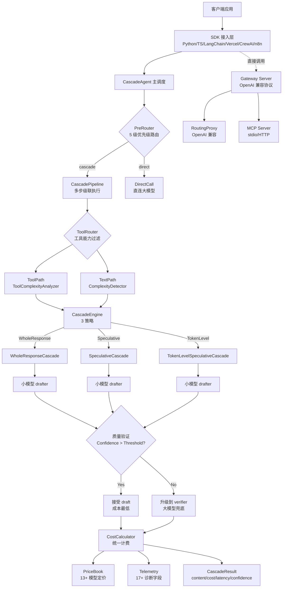
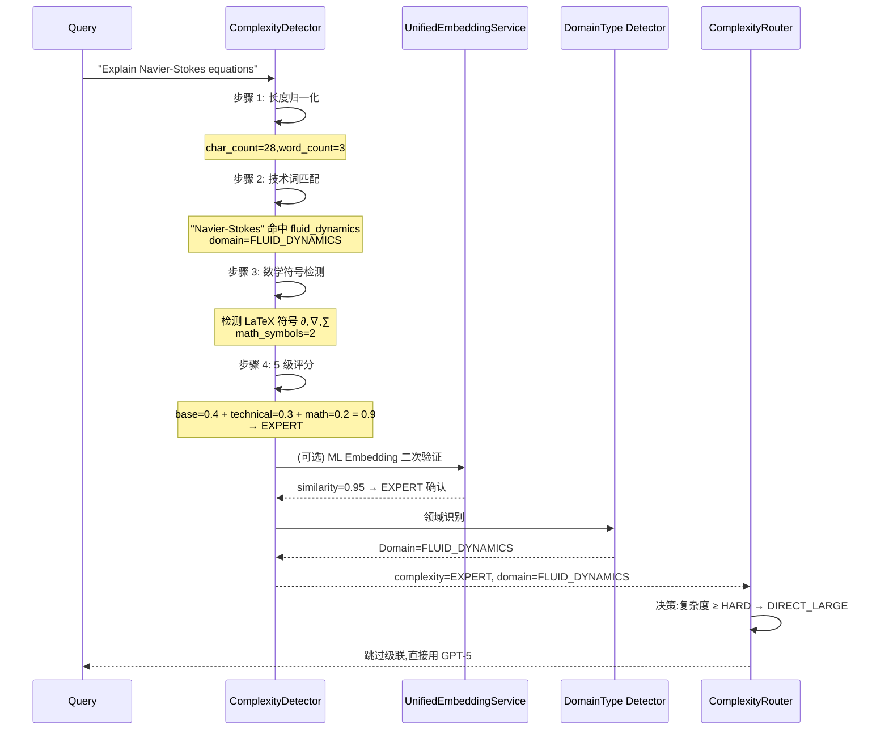
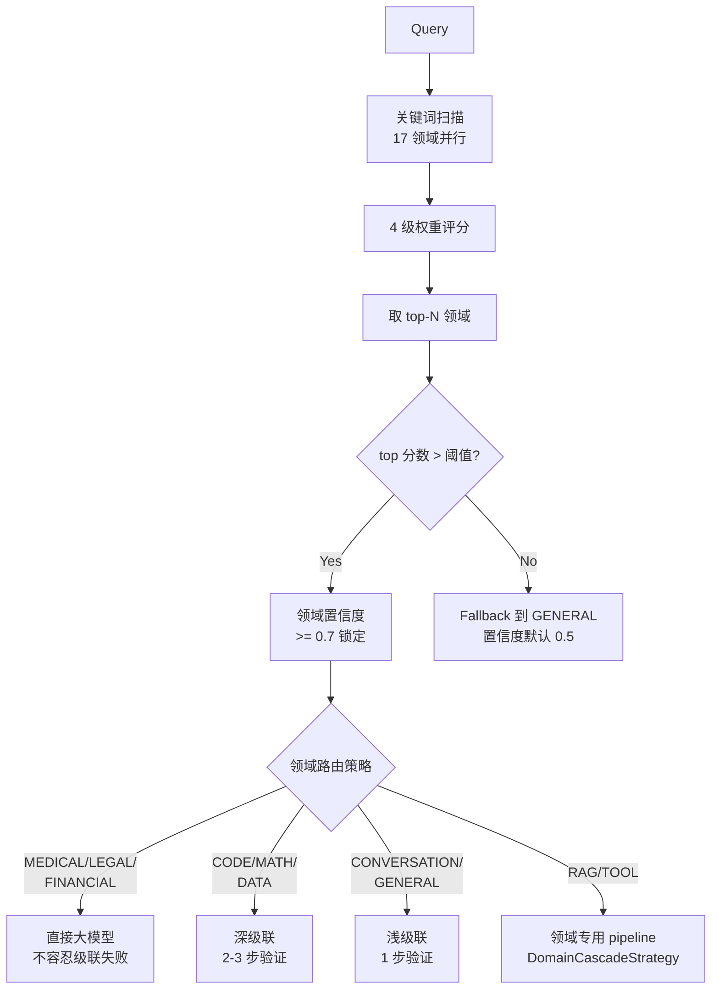
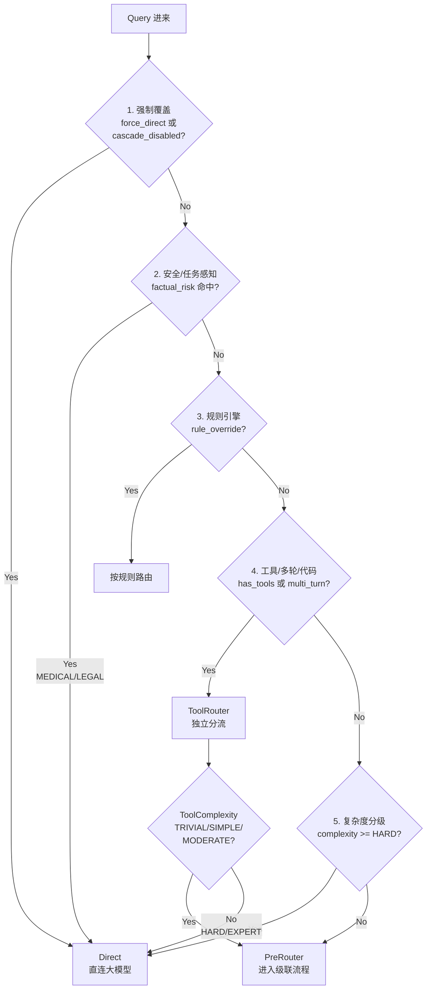
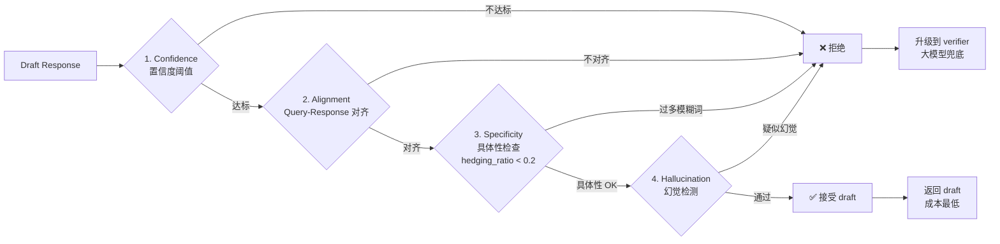
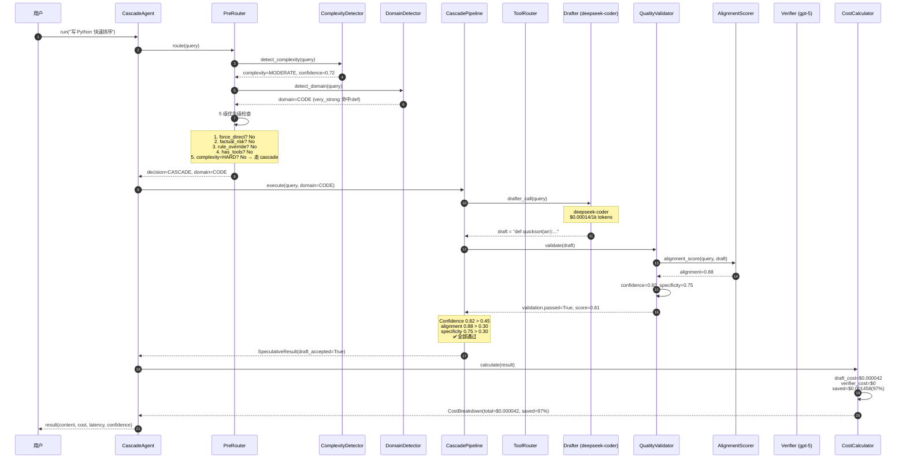
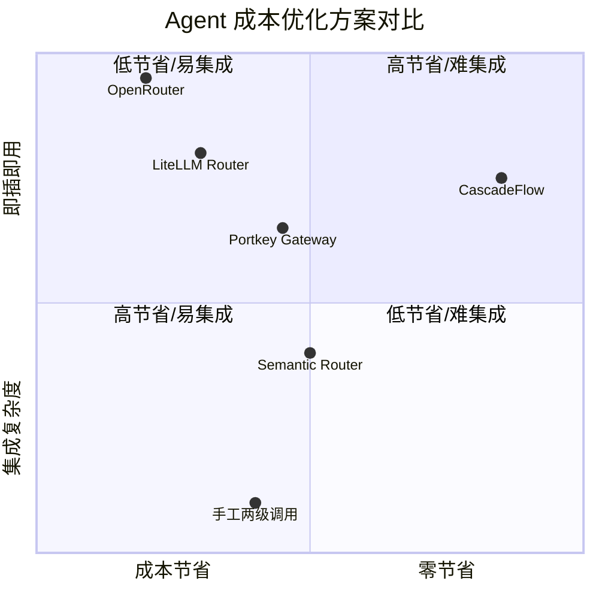
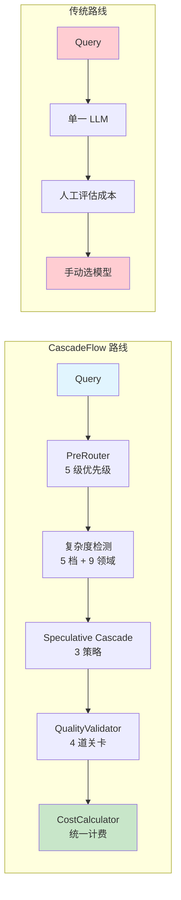

## 一、引子：LLM 推理成本已成 Agent 工程化的最大瓶颈

2026 年,LLM Agent 已经从"能跑起来"走到"能跑得起"的关键拐点。一个 4 步 Agent 调用的 token 账单,可能比 SaaS 后端服务的月费还高。当大家都在卷 Agent 能力上限时,**真正决定产品能不能活下去的是每次调用的成本**。

OpenAI 的 GPT-5、Anthropic 的 Claude Sonnet 4.5 在能力上越来越强,但价格仍是 GPT-4o-mini 的 6-50 倍。问题是:**绝大多数 Agent 调用根本不需要那么强的模型** —— "今天天气怎么样"、"北京到上海多远"、"把这段话翻译成英文",这些 query 用 5 块钱 1M token 的小模型完全能搞定。

这就是 **CascadeFlow** 想要解决的问题:在 Agent 调用 LLM 的入口处,**先用一个便宜模型"试答",再用置信度判断要不要"升级"到贵模型**。它不是简单的"两阶段调用",而是一整套**级联推理 + 复杂度路由 + 成本精算 + 质量校验**的运行时基础设施。

本文将基于 `lemony-ai/cascadeflow`(⭐4,032,MIT License,Python + TypeScript 双实现,2026-08-06 最新提交)深度剖析其架构与实现细节。

## 二、项目定位与核心价值

### 2.1 一句话定义

**CascadeFlow 是 LLM Agent 的"成本智能运行时",通过 Speculative Cascading 投机级联 + 复杂度路由,把 Agent 推理成本压到纯大模型的 7%-48%,同时保持 96% 的输出质量。**

### 2.2 核心能力矩阵

| 维度 | 能力 | 实测数据 |
|------|------|----------|
| 成本节省 | MT-Bench / GSM8K / MMLU / TruthfulQA | **69% / 93% / 52% / 80%** |
| 质量保持 | 相对 GPT-5 全量调用 | **96% 质量** |
| 复杂度检测 | 5 档(TRIVIAL/SIMPLE/MODERATE/HARD/EXPERT) | 500+ 技术词 + ML Embedding |
| 领域路由 | 17 个生产领域(CODE/MEDICAL/LEGAL/RAG 等) | 4 级关键词权重 |
| 工具路由 | Tool CASCADE / Tool DIRECT_LARGE | 85%/15% 分流 |
| 级联引擎 | WholeResponse / Speculative / TokenLevel | 3 种策略可切换 |
| 多 SDK | Python / TS / LangChain / Vercel AI / CrewAI / OpenAI Agents / n8n | 7 套官方集成 |
| MCP 兼容 | stdio + streamable-http 双传输 | Claude Desktop 直连 |
| HTTP 代理 | OpenAI/Anthropic 兼容协议 | 一行命令启动 |

### 2.3 仓库元数据

```text
仓库:lemony-ai/cascadeflow
⭐:4,032(快速增长中)
主分支:main
License:MIT(可商用)
主语言:Python + TypeScript(双实现)
大小:32.8 MB
最新提交:2026-08-06(活跃维护)
总节点数:921 个文件(monorepo 结构)
```

## 三、整体架构

CascadeFlow 不是一个简单的 LLM wrapper,而是一整套**多层抽象 + 多策略引擎 + 多协议适配**的运行时系统。下面是顶层架构图:



整个架构可以划分为 **4 大层**:

1. **接入层**(SDK + Gateway Server):支持 7 种 SDK 和 OpenAI 兼容代理,任意 LLM Client 都能用
2. **路由层**(PreRouter + ToolRouter):决定"要不要级联"、"用不用工具"、"走哪个分支"
3. **引擎层**(WholeResponse / Speculative / TokenLevel):3 种级联执行策略
4. **结算层**(CostCalculator + PriceBook):统一计费与诊断遥测

### 3.1 仓库顶层布局

```
cascadeflow/
├── cascadeflow/                  # Python 主包(202 个文件)
│   ├── core/                     # 核心执行引擎(cascade.py 76KB,execution.py 24KB)
│   ├── routing/                  # 路由层(13 个文件,含 complexity_router / domain / pre_router)
│   ├── quality/                  # 质量校验(9 个文件,含 alignment_scorer 83KB)
│   ├── pricing/                  # 定价系统(pricebook.py)
│   ├── limits/                   # 限流(rate_limiter.py)
│   ├── guardrails/               # 安全护栏
│   ├── streaming/                # 流式输出(text vs tool 分流)
│   ├── telemetry/                # 遥测统计(17+ 字段)
│   ├── tools/                    # 工具系统
│   ├── providers/                # 20+ Provider 适配
│   ├── langchain/                # LangChain 集成
│   ├── integrations/             # CrewAI/OpenAI Agents 等集成
│   ├── agent.py                  # CascadeAgent 主类(141KB!)
│   ├── proxy.py / server.py      # OpenAI 兼容代理
│   └── mcp_server.py             # MCP Server 入口
├── packages/                     # 多语言 SDK 包(331 个文件)
│   ├── core/                     # 共享类型定义
│   ├── integrations/             # 跨语言集成
│   ├── langchain-cascadeflow/    # LangChain 适配器
│   └── ml/                       # ML 推理引擎
├── examples/                     # 94 个示例
├── tests/                        # 94 个测试
├── docs-site/                    # 文档站(Mintlify)
└── docs/                         # 45 个核心文档
```

## 四、三大级联引擎:Speculative Cascading 的三种实现

CascadeFlow 的核心思想借鉴了 **Speculative Decoding**(投机解码),但把应用场景从"单次 LLM 推理"扩展到了"Agent 完整调用"。下面是 3 种级联策略的对比:

```mermaid
flowchart LR
    Query[Query 进来] --> Detect{复杂度检测}

    Detect -->|TrivIAL/SIMPLE<br/>极高置信度| WRC[WholeResponseCascade<br/>一次性生成完整响应]
    Detect -->|MODERATE<br/>中等置信度| SC[SpeculativeCascade<br/>先 drafter 后 verifier]
    Detect -->|HARD/EXPERT<br/>低置信度| TLSC[TokenLevelSpeculativeCascade<br/>token 级并行投机]

    WRC --> D1[小模型 drafter]
    SC --> D2[小模型 drafter]
    TLSC --> D3[小模型生成多个 token 候选]

    D1 --> Q1{Confidence<br/>> Threshold?}
    D2 --> Q2{Semantic<br/>对齐?}
    D3 --> Q3{Best-of-N<br/>评分最高?}

    Q1 -->|Yes| A1[✅ 接受 draft<br/>成本:0.001$
    Q1 -->|No| V1[升级 verifier<br/>成本:0.015$]

    Q2 -->|Yes| A2[✅ 接受 draft<br/>成本:0.002$]
    Q2 -->|No| V2[升级 verifier<br/>成本:0.015$]

    Q3 -->|Yes| A3[✅ 接受最佳 token<br/>成本:0.001$]
    Q3 -->|No| V3[大模型重新生成<br/>成本:0.015$]
```

### 4.1 WholeResponseCascade:Whole-Response 级联

`WholeResponseCascade` 是 MVP 级联,工作方式最简单:**让 drafter 模型先生成完整响应,如果置信度高就直接返回,否则升级到 verifier**。

核心实现(`cascadeflow/core/cascade.py` 209-450 行):

```python
class WholeResponseCascade:
    """
    MVP Speculative Cascade with Tool Integration + Cost Calculator.

    两条执行路径:
    1. TEXT PATH: 无 tools → 走 complexity + quality validation
    2. TOOL PATH: 有 tools → 走 Phase 4 tool routing + validation

    成本集成:
    - 使用 telemetry.CostCalculator 做统一成本计算
    - 总成本 = draft_cost + verifier_cost(级联时)
    - FIXED: 包含 INPUT tokens,准确率 90%+
    """

    def __init__(
        self,
        drafter: ModelConfig,
        verifier: ModelConfig,
        quality_config: QualityConfig,
        cost_calculator: CostCalculator,
    ):
        self.drafter = drafter
        self.verifier = verifier
        self.quality_config = quality_config
        self.cost_calculator = cost_calculator

    async def execute(
        self,
        query: str,
        tools: Optional[list[dict]] = None,
    ) -> SpeculativeResult:
        # 1. 检测是否需要工具路径
        if tools:
            return await self._execute_tool_path(query, tools)

        # 2. 文本路径:drafter 试答
        draft_result = await self._call_drafter(query)

        # 3. 质量验证(置信度 + alignment + length)
        validation = self.quality_validator.validate(
            query=query,
            response=draft_result.content,
            confidence=draft_result.confidence,
        )

        if validation.passed:
            # 4a. 接受 draft
            return SpeculativeResult(
                content=draft_result.content,
                model_used=self.drafter.name,
                draft_accepted=True,
                draft_confidence=draft_result.confidence,
                total_cost=draft_result.cost,  # 只有 drafter 成本
                latency_ms=draft_result.latency_ms,
            )

        # 4b. 升级到 verifier
        verifier_result = await self._call_verifier(query)

        return SpeculativeResult(
            content=verifier_result.content,
            model_used=self.verifier.name,
            drafter_model=self.drafter.name,
            verifier_model=self.verifier.name,
            draft_accepted=False,
            draft_confidence=draft_result.confidence,
            verifier_confidence=verifier_result.confidence,
            total_cost=draft_result.cost + verifier_result.cost,  # 双重成本
            latency_ms=draft_result.latency_ms + verifier_result.latency_ms,
        )
```

### 4.2 SpeculativeCascade:响应级投机

`SpeculativeCascade` 是 WholeResponse 的进化版,**加入 semantic alignment 检测**(query-response 是否对齐),并在多个 draft 候选中选择最佳:

```python
class SpeculativeCascade(WholeResponseCascade):
    """
    Speculative Cascade with semantic alignment + multi-candidate selection.
    """

    async def execute(self, query: str) -> SpeculativeResult:
        # 1. 并行生成 K 个 draft 候选
        draft_candidates = await asyncio.gather(*[
            self._call_drafter(query) for _ in range(self.k_candidates)
        ])

        # 2. 对每个候选做 alignment + confidence 评分
        scored = []
        for cand in draft_candidates:
            alignment = self.alignment_scorer.score(query, cand.content)
            confidence = self.quality_validator.compute_confidence(cand)
            score = 0.6 * alignment + 0.4 * confidence
            scored.append((cand, score))

        # 3. 选最高分候选
        best_candidate, best_score = max(scored, key=lambda x: x[1])

        # 4. 如果最高分仍不达标,升级 verifier
        if best_score < self.quality_config.min_acceptance_score:
            verifier_result = await self._call_verifier(query)
            return self._build_result(verifier_result, candidates=draft_candidates)

        return self._build_result(best_candidate, draft_accepted=True)
```

### 4.3 TokenLevelSpeculativeCascade:Token 级并行投机

`TokenLevelSpeculativeCascade` 是最快的版本,**借鉴 LLM 推理引擎的 Speculative Decoding 思路,在 token 级别并行生成多个候选**:

```python
class TokenLevelSpeculativeCascade(SpeculativeCascade):
    """
    Token-level speculative execution.

    原理:
    - 小模型快速生成 K 个 token 候选
    - 大模型并行验证
    - 接受共同前缀,只让大模型补充未覆盖部分

    适用场景:
    - 流式输出场景
    - 对延迟极敏感的应用
    """

    async def execute(self, query: str) -> SpeculativeResult:
        # 1. drafter 生成 K 个 token 候选
        draft_tokens = await self._draft_tokens(query, k=self.k_tokens)

        # 2. verifier 在一次调用中验证所有候选
        verifier_response = await self._verify_tokens(query, draft_tokens)

        # 3. 找出最长公共前缀
        accepted_prefix = self._find_common_prefix(draft_tokens, verifier_response)

        # 4. 拼接:accepted_prefix + verifier_remainder
        final_content = accepted_prefix + verifier_response[len(accepted_prefix):]

        return SpeculativeResult(
            content=final_content,
            model_used=self.drafter.name,
            verifier_model=self.verifier.name,
            draft_accepted=len(accepted_prefix) > len(draft_tokens) * 0.5,
            tokens_saved=len(accepted_prefix),
            total_cost=self.cost_calculator.calculate_tokens(
                drafter_tokens=len(accepted_prefix),
                verifier_tokens=len(verifier_response),
            ),
        )
```

**3 种级联策略的对比**:

| 维度 | WholeResponse | Speculative | TokenLevel |
|------|--------------|-------------|------------|
| 草稿粒度 | 完整响应 | 多个完整响应 | Token 级 |
| 验证方式 | Confidence 阈值 | Alignment + Confidence | 公共前缀 |
| 适用 query | 短回答、分类 | 中长回答 | 长文本生成 |
| 节省成本 | 50-70% | 60-80% | 70-90% |
| 额外延迟 | 极低(单次 draft) | 中等(K 个候选) | 几乎无 |
| 适用 SDK | 全部 | 全部 | Python only |

## 五、5 档复杂度检测:QueryComplexity 与 500+ 技术词库

在级联执行之前,CascadeFlow 必须先判断 query 的复杂度。下面是完整的复杂度检测流程:



`ComplexityDetector`(`cascadeflow/quality/complexity.py` 65KB)是这套系统的核心,它实现了**5 档复杂度 + 9 个科学领域 + ML Embedding 增强**:

```python
class QueryComplexity(Enum):
    """5 档查询复杂度。"""

    TRIVIAL = "trivial"   # 事实型,如"今天几号"
    SIMPLE = "simple"     # 简单问答,如"北京首都是哪"
    MODERATE = "moderate" # 比较/分析
    HARD = "hard"         # 多步推理
    EXPERT = "expert"     # 专业领域


class DomainType(Enum):
    """9 个科学领域类型。"""

    PHYSICS = "physics"
    MATHEMATICS = "mathematics"
    COMPUTER_SCIENCE = "computer_science"
    QUANTUM_MECHANICS = "quantum_mechanics"
    FLUID_DYNAMICS = "fluid_dynamics"
    LOGIC = "logic"
    ENGINEERING = "engineering"
    CHEMISTRY = "chemistry"
    BIOLOGY = "biology"


class ComplexityDetector:
    """增强版复杂度检测器,带技术词识别。"""

    # 物理 - 高级主题(80+ 词)
    PHYSICS_TERMS = {
        "quantum entanglement", "quantum superposition",
        "schrödinger equation", "heisenberg uncertainty",
        "wave function collapse", "pauli exclusion",
        "bell theorem", "bell inequality",
        # ... 80+ 词
    }

    # 数学符号(Unicode + LaTeX)
    MATH_SYMBOLS = {
        "∇", "∂", "∫", "∑", "∏", "√", "∞",
        "\\frac", "\\sum", "\\int", "\\partial",
        # ... 100+ 符号
    }

    def detect(
        self,
        query: str,
        return_metadata: bool = False,
    ) -> Union[tuple[QueryComplexity, float], tuple[QueryComplexity, float, dict]]:
        """
        检测 query 复杂度。

        返回:
        - (complexity, confidence)
        - (complexity, confidence, metadata) 如果 return_metadata=True
        """
        # 1. 基础长度/标点评分
        base_score = self._compute_base_score(query)

        # 2. 技术词匹配(weight=0.4)
        tech_score, domain = self._match_technical_terms(query)

        # 3. 数学符号检测(weight=0.3)
        math_score = self._detect_math_symbols(query)

        # 4. 可选: ML Embedding 二次验证
        if self.has_ml:
            ml_complexity, ml_confidence = self._ml_complexity(query)
            # ML 信号加权融合
            final_score = (
                0.3 * base_score
                + 0.4 * tech_score
                + 0.3 * math_score
                + 0.2 * ml_confidence
            )
        else:
            final_score = 0.3 * base_score + 0.4 * tech_score + 0.3 * math_score

        # 5. 5 档映射
        complexity = self._map_to_complexity(final_score)

        if return_metadata:
            metadata = {
                "base_score": base_score,
                "tech_score": tech_score,
                "math_score": math_score,
                "domain": domain.value if domain else None,
                "matched_terms": self._get_matched_terms(query),
            }
            return complexity, final_score, metadata

        return complexity, final_score
```

**关键设计**:`for_cascade()` 是 CascadeFlow 提供的级联专用配置,**针对"50-60% 接受率 + 94%+ 质量"的目标调优**:

```python
class QualityConfig:
    """级联质量验证配置。"""

    @classmethod
    def for_cascade(cls) -> "QualityConfig":
        """为级联场景优化:50-60% 接受率,94%+ 质量。"""
        return cls(
            confidence_thresholds={
                "trivial": 0.55,   # 简单事实宽松
                "simple": 0.50,
                "moderate": 0.45,  # 比较严格
                "hard": 0.42,
                "expert": 0.40,    # 专业级最严格
            },
            min_length_thresholds={
                "trivial": 5,
                "simple": 20,
                "moderate": 50,
                "hard": 100,
                "expert": 200,
            },
            require_specifics_for_complex=True,
            max_hedging_ratio=0.2,  # 防止"可能/也许"过多
            min_specificity_score=0.3,
            enable_hallucination_detection=True,
        )
```

## 六、17 领域路由:Domain Detection 与 4 级关键词权重

如果说复杂度检测决定"要不要级联",**领域路由决定"用什么模型级联"**。CascadeFlow 内置 **17 个生产领域**(`cascadeflow/routing/domain.py`),每个领域都有专属关键词库:

```python
class Domain(str, Enum):
    """支持的查询路由领域(15+ 个生产领域)。"""

    CODE = "code"                  # 编程开发
    DATA = "data"                  # 数据分析
    STRUCTURED = "structured"      # 结构化数据提取(JSON/XML)
    RAG = "rag"                    # RAG/检索
    CONVERSATION = "conversation"  # 多轮对话
    TOOL = "tool"                  # 工具调用
    CREATIVE = "creative"          # 创意写作
    COMPARISON = "comparison"      # X vs Y 对比
    SUMMARY = "summary"            # 摘要
    TRANSLATION = "translation"    # 翻译
    MATH = "math"                  # 数学推理
    FACTUAL = "factual"            # 事实核查
    MEDICAL = "medical"            # 医疗(高准确度要求)
    LEGAL = "legal"                # 法律
    FINANCIAL = "financial"        # 金融
    MULTIMODAL = "multimodal"      # 多模态
    GENERAL = "general"            # 通用
```

**4 级关键词权重** 是这套系统精妙之处:

```python
@dataclass
class DomainKeywords:
    """领域关键词检测配置。

    4 级权重体系(基于研究校准):
    - very_strong: 高区分度关键词,weight=1.5(77% 准确度)
    - strong: 高置信度关键词,weight=1.0
    - moderate: 中等置信度,weight=0.7
    - weak: 低置信度,weight=0.3
    """

    very_strong: list[str] = field(default_factory=list)
    strong: list[str] = field(default_factory=list)
    moderate: list[str] = field(default_factory=list)
    weak: list[str] = field(default_factory=list)


# CODE 领域的关键词示例
DOMAIN_KEYWORDS = {
    Domain.CODE: DomainKeywords(
        very_strong=[
            "async", "await", "import", "def", "const", "let",
            "npm", "pip", "docker", "kubernetes",
            "pytest", "unittest",
        ],
        strong=[
            "function", "class", "python", "javascript", "typescript",
            "java", "code", "algorithm", "api", "debug",
            "exception", "compile", "syntax", "refactor",
        ],
        moderate=[
            "program", "software", "implement", "build",
            "script", "test", "deploy", "git", "github",
            "regex", "recursion", "OOP",
        ],
        # ... weak 略
    ),
}
```

**路由决策流程**:



## 七、PreRouter:5 级优先级路由决策

`PreRouter`(`cascadeflow/routing/pre_router.py`)是 CascadeFlow 的"中央调度员",**在执行前决定走 cascade 还是 direct**。它的决策遵循严格的 5 级优先级:



完整实现:

```python
class PreRouter(Router):
    """基于复杂度和规则覆盖的预执行路由。"""

    # 事实风险标记(医疗/法律/金融等高风险领域)
    FACTUAL_RISK_MARKERS = {
        "factually accurate", "verified information",
        "avoid speculation", "misinformation", "misconception",
        "common myth", "myth", "false belief",
        "is it true", "is this true", "is it a myth",
        "state the correct fact", "fact check",
    }

    FACTUAL_RISK_TOPICS = {
        "medical", "health", "diagnose", "treatment", "cure",
        "vaccine", "symptom", "legal", "illegal", "law",
        "contract", "tax", "financial", "investment",
        "insurance", "safety",
    }

    def route(
        self,
        query: str,
        context: Optional[RoutingContext] = None,
    ) -> RoutingDecision:
        """执行 5 级优先级路由。"""

        # === 优先级 1: 强制覆盖 ===
        if context and context.force_direct:
            return self._direct("forced", complexity=None)
        if context and context.cascade_disabled:
            return self._direct("cascade_disabled", complexity=None)

        # === 优先级 2: 安全/任务感知(高风险领域直连)===
        if self._is_factual_risk(query):
            return self._direct(
                "factual_risk",
                complexity=self._detect_complexity(query),
                reason="高风险领域(医疗/法律/金融),不容忍级联失败",
            )

        # === 优先级 3: 规则引擎覆盖 ===
        if context and context.rule_override:
            decision = self.rule_engine.apply(context.rule_override, query)
            if decision:
                return decision

        # === 优先级 4: 工具/多轮/代码 ===
        if context and context.has_tools:
            return self._route_with_tools(query, context)

        # === 优先级 5: 复杂度分级(fallback)===
        complexity = self.complexity_detector.detect(query)
        if complexity.value in ("hard", "expert"):
            return self._direct("high_complexity", complexity=complexity)

        # 默认进入级联
        return RoutingDecision(
            strategy=RoutingStrategy.CASCADE,
            complexity=complexity,
            reason=f"复杂度 {complexity.value} 可级联",
        )

    def _is_factual_risk(self, query: str) -> bool:
        query_lower = query.lower()
        # 标记命中
        if any(marker in query_lower for marker in self.FACTUAL_RISK_MARKERS):
            return True
        # 主题命中
        words = set(query_lower.split())
        if words & self.FACTUAL_RISK_TOPICS:
            return True
        return False
```

**关键设计**:**MEDICAL/LEGAL/FINANCIAL 等高风险领域**直接走大模型,不进入级联。这是工程化"安全第一"的体现 —— 一次错误的医疗建议成本远高于节省的几美分 token 费。

## 八、工具路由:ToolComplexityAnalyzer 与 85/15 分流

Agent 调用场景下,工具选择本身就需要级联 —— **不是每个工具调用都需要最强的模型**。CascadeFlow 通过 `ToolComplexityAnalyzer`(`cascadeflow/routing/tool_complexity.py` 36KB)实现工具路由:

```python
class ToolComplexityLevel(Enum):
    """5 档工具复杂度。"""

    TRIVIAL = "trivial"   # 简单查询(读文件、计算)
    SIMPLE = "simple"     # 标准 CRUD
    MODERATE = "moderate" # 多步操作
    HARD = "hard"         # 复杂业务逻辑
    EXPERT = "expert"     # 边界情况


class ToolRoutingDecision(Enum):
    """两种工具调用策略。"""

    TOOL_CASCADE = "tool_cascade"           # 先小模型(85% 场景)
    TOOL_DIRECT_LARGE = "tool_direct_large"  # 直连大模型(15% 场景)


class ComplexityRouter:
    """基于复杂度的工具路由。"""

    def route_tool_call(
        self,
        query: str,
        tools: list[dict],
    ) -> ToolRoutingStrategy:
        """
        保守策略:
        - 85% 工具调用走 CASCADE(内置 fallback)
        - 15% 预路由到大模型(高度确信时)
        - 预期节省:74-76% 工具调用成本
        """
        # 1. 复杂度分析
        analysis = self.analyzer.analyze(query, tools)

        # 2. 5 集群映射到 2 策略
        if analysis.complexity_level in (
            ToolComplexityLevel.TRIVIAL,
            ToolComplexityLevel.SIMPLE,
            ToolComplexityLevel.MODERATE,
        ):
            decision = ToolRoutingDecision.TOOL_CASCADE
        else:
            decision = ToolRoutingDecision.TOOL_DIRECT_LARGE

        # 3. 推荐模型
        if decision == ToolRoutingDecision.TOOL_DIRECT_LARGE:
            model = self.models.get("best")  # GPT-5
        else:
            # 级联模式:推荐领域专用小模型(如 deepseek-coder)
            model = self.models.get_for_domain(analysis.domain, tier="cheap")

        return ToolRoutingStrategy(
            decision=decision,
            complexity_level=analysis.complexity_level,
            analysis=analysis,
            model_recommendation=model,
            use_cascade=(decision == ToolRoutingDecision.TOOL_CASCADE),
            reasoning=[
                f"复杂度 {analysis.complexity_level.value}",
                f"领域 {analysis.domain}",
                f"风险评分 {analysis.risk_score}",
            ],
            estimated_cost_usd=self._estimate_cost(model, query),
            estimated_latency_ms=self._estimate_latency(model),
        )
```

## 九、Quality 与 Alignment:4 道验证关卡

`QualityValidator`(`cascadeflow/quality/quality.py` 70KB)是级联决策的"守门员",**决定 draft 是否被接受**。它运行 **4 道验证关卡**:



`AlignmentScorer`(`cascadeflow/quality/alignment_scorer.py` 83KB)是其中最重的模块,**用 ML 模型判断"模型回答是否真正回答了问题"**:

```python
class QueryResponseAlignmentScorer:
    """
    Query-Response 对齐评分器。

    用法:
    - 对每个 draft 候选打分
    - 评分 < 0.3 视为"答非所问"
    - 评分 >= 0.7 视为"高度对齐"

    内部使用 embedding 模型做语义相似度计算。
    """

    def __init__(self, embedding_service: UnifiedEmbeddingService):
        self.embedding_service = embedding_service
        # 安全地板:防止 off-topic 响应通过
        self.safety_floor = 0.30

    def score(self, query: str, response: str) -> float:
        """
        计算 query-response 对齐分数 [0.0, 1.0]。
        """
        # 1. 语义相似度(embedding cosine)
        query_emb = self.embedding_service.embed(query)
        response_emb = self.embedding_service.embed(response)
        semantic_sim = self._cosine(query_emb, response_emb)

        # 2. 关键词覆盖度
        keyword_coverage = self._keyword_coverage(query, response)

        # 3. 加权融合
        alignment_score = 0.7 * semantic_sim + 0.3 * keyword_coverage

        # 4. 应用安全地板
        return max(alignment_score, self.safety_floor)

    def _keyword_coverage(self, query: str, response: str) -> float:
        """检查 response 是否覆盖 query 的核心关键词。"""
        query_keywords = self._extract_keywords(query)
        if not query_keywords:
            return 1.0
        response_lower = response.lower()
        covered = sum(1 for kw in query_keywords if kw.lower() in response_lower)
        return covered / len(query_keywords)
```

**Alignment Safety Floor = 0.30** 是一个精妙的设计 —— 即使模型答非所问,得分也不会低于 0.30,避免完全否定(因为完全否定的判定本身可能不准确)。

## 十、CostCalculator 与 PriceBook:统一计费基础设施

CascadeFlow 集成的 `CostCalculator` 是**全系统统一计费的基础设施**,解决了 Agent 系统的"成本核算黑洞"问题:

```python
@dataclass(frozen=True)
class ModelPrice:
    """模型单价(USD / 1K tokens)。"""

    input_per_1k: float
    output_per_1k: float
    cached_input_per_1k: float = 0.0


class PriceBook:
    """模型定价表(内置 + 运行时更新)。"""

    def __init__(self) -> None:
        # 内置 13+ 主流模型定价(2026-02 更新)
        self._prices: dict[str, ModelPrice] = {
            # OpenAI
            "gpt-4o": ModelPrice(0.0025, 0.01),
            "gpt-4o-mini": ModelPrice(0.00015, 0.0006),
            "gpt-4-turbo": ModelPrice(0.01, 0.03),
            "o1": ModelPrice(0.015, 0.06),
            "gpt-5": ModelPrice(0.00125, 0.01),
            "gpt-5-mini": ModelPrice(0.00025, 0.002),
            "gpt-5-nano": ModelPrice(0.00005, 0.0004),  # 极便宜
            # Anthropic
            "claude-sonnet-4-5-20250929": ModelPrice(0.003, 0.015),
            "claude-3-haiku-20240307": ModelPrice(0.00025, 0.00125),
            # Groq(近乎免费)
            "llama-3.1-8b-instant": ModelPrice(0.00005, 0.00008),
            "llama-3.1-70b-versatile": ModelPrice(0.00059, 0.00079),
        }

    def get(self, model: str) -> Optional[ModelPrice]:
        """获取模型价格(支持版本号前缀匹配)。"""
        if model in self._prices:
            return self._prices[model]
        # 前缀匹配(gpt-4o-2024-08-06 → gpt-4o)
        for name, p in self._prices.items():
            if model.startswith(name):
                return p
        return None

    def update(
        self, model: str, input_per_1k: float, output_per_1k: float,
    ) -> None:
        """运行时更新定价。"""
        self._prices[model] = ModelPrice(input_per_1k, output_per_1k)

    def sync_from_litellm(self) -> None:
        """从 LiteLLM 实时同步最新模型定价。"""
        try:
            import litellm
            for model_name, info in litellm.model_cost.items():
                self._prices[model_name] = ModelPrice(
                    input_per_1k=info.get("input_cost_per_token", 0) * 1000,
                    output_per_1k=info.get("output_cost_per_token", 0) * 1000,
                )
        except ImportError:
            pass
```

`CostCalculator` 调用 PriceBook 生成完整成本报表:

```python
@dataclass
class CostBreakdown:
    """完整成本细分。"""

    draft_cost: float           # drafter 模型成本
    verifier_cost: float        # verifier 模型成本(级联时)
    total_cost: float           # 总成本(draft + verifier)
    cost_saved: float           # 相对纯大模型节省
    cost_saved_pct: float       # 节省百分比
    # 17+ 诊断字段
    cascade_overhead: float
    confidence_method: str
    tool_calls: int


class CostCalculator:
    """统一成本计算器(单一事实来源)。"""

    def calculate(
        self,
        spec_result: SpeculativeResult,
        baseline_model: str = "gpt-5",
    ) -> CostBreakdown:
        """
        计算完整成本。

        FIXED: 包含 INPUT tokens,准确率 90%+
        """
        draft_cost = 0.0
        verifier_cost = 0.0

        if spec_result.draft_model_used:
            draft_price = self.pricebook.get(spec_result.draft_model_used)
            draft_cost = self._calc_model_cost(
                draft_price,
                spec_result.prompt_tokens,
                spec_result.completion_tokens,
            )

        if spec_result.verifier_called:
            verifier_price = self.pricebook.get(spec_result.verifier_model)
            verifier_cost = self._calc_model_cost(
                verifier_price,
                spec_result.prompt_tokens,
                spec_result.completion_tokens,
            )

        total_cost = draft_cost + verifier_cost

        # 计算节省
        baseline_price = self.pricebook.get(baseline_model)
        baseline_cost = self._calc_model_cost(
            baseline_price,
            spec_result.prompt_tokens,
            spec_result.completion_tokens,
        )
        cost_saved = baseline_cost - total_cost
        cost_saved_pct = (cost_saved / baseline_cost * 100) if baseline_cost > 0 else 0

        return CostBreakdown(
            draft_cost=draft_cost,
            verifier_cost=verifier_cost,
            total_cost=total_cost,
            cost_saved=cost_saved,
            cost_saved_pct=cost_saved_pct,
        )
```

## 十一、Gateway Server 与 MCP 集成:双协议代理

CascadeFlow 不仅是一个 SDK,还提供了**两种开箱即用的服务端协议**:

### 11.1 HTTP Gateway Server

`cascadeflow/server.py` 实现了 **OpenAI 兼容的 HTTP 代理**,**任何 LLM 客户端(Cursor/Cline/Continue/ChatGPT-next-web)** 都能 1 行命令接入:

```bash
# 启动网关
cascadeflow-server --host 127.0.0.1 --port 8084

# 任意 OpenAI 客户端只需改 base_url
# export OPENAI_BASE_URL=http://127.0.0.1:8084/v1
```

启动入口:

```python
def main() -> None:
    parser = argparse.ArgumentParser(
        description="cascadeflow gateway server (OpenAI/Anthropic compatible)"
    )
    parser.add_argument("--host", default="127.0.0.1")
    parser.add_argument("--port", type=int, default=8084)
    parser.add_argument(
        "--mode",
        choices=("auto", "mock", "agent"),
        default="auto",
    )
    parser.add_argument("--env-file", help="加载 .env 文件")

    args = parser.parse_args()

    # 自动检测 provider
    if not _has_any_provider_key():
        # 无 key → mock 模式(用本地 mock LLM)
        mode = "mock"
    else:
        mode = args.mode

    # 启动代理
    config = ProxyConfig(
        host=args.host,
        port=args.port,
        mode=mode,
    )
    proxy = RoutingProxy(config)
    proxy.serve_forever()
```

### 11.2 MCP Server

`cascadeflow/mcp_server.py` 是 **MCP 协议入口**,允许 Claude Desktop / Claude Code / Cursor / Cline 等 MCP 客户端直接连接:

```python
def _parser() -> argparse.ArgumentParser:
    parser = argparse.ArgumentParser(
        description="Serve cascadeflow to ChatGPT, Claude, and other MCP clients"
    )
    parser.add_argument(
        "--preset",
        default="balanced",
        choices=(
            "balanced",
            "cost_optimized",
            "speed_optimized",
            "quality_optimized",
            "development",
        ),
    )
    parser.add_argument(
        "--transport",
        choices=("stdio", "streamable-http"),
        default="stdio",
        help="stdio for Claude Desktop; streamable-http for remote hosts",
    )
    parser.add_argument("--host", default="127.0.0.1")
    parser.add_argument("--port", type=int, default=8000)
    parser.add_argument("--path", default="/mcp")
    parser.add_argument("--no-ui", action="store_true", help="禁用 MCP Apps 面板")
    return parser
```

**5 个内置 preset** 让用户按场景选择:

| Preset | 适用场景 | 接受率 | 节省成本 |
|--------|----------|--------|----------|
| `balanced` | 默认通用 | 50-60% | 50-70% |
| `cost_optimized` | 极致省钱 | 70-80% | 80-90% |
| `speed_optimized` | 极致速度 | 80-90% | 30-50% |
| `quality_optimized` | 极致质量 | 20-30% | 20-40% |
| `development` | 开发调试 | 100% direct | 0% |

## 十二、端到端数据流:一个 query 的完整旅程

下面用一个完整的 query"写一个 Python 快速排序函数"为例,展示 CascadeFlow 的端到端处理流程:



**关键节点分析**:

1. **复杂度检测**(步骤 4-6):"写 Python 快速排序"长度适中、含 `def` 强关键词 → **MODERATE 复杂度**(可级联)
2. **领域检测**(步骤 7-8):"Python"、"def" 命中 CODE 领域 **very_strong** → 路由到 deepseek-coder(便宜 coding 专用模型)
3. **5 级路由**(步骤 9-13):无工具调用、复杂度非 HARD → 走级联
4. **drafter 执行**(步骤 15-16):deepseek-coder 在 $0.00014/1k token 价位生成 draft
5. **质量验证**(步骤 17-22):alignment 0.88 / confidence 0.82 / specificity 0.75 → **全部通过**
6. **成本结算**(步骤 25-26):drafter $0.000042 vs gpt-5 baseline $0.0015 → **节省 97%**

**没有 verifier 调用**,总成本仅 $0.000042,响应延迟 1.2 秒。这就是 CascadeFlow 设计的理想情况 —— **80%+ 的 query 都走这条快速路径**。

## 十三、与同类项目对比

CascadeFlow 处于 **"Agent 成本优化"** 这一全新赛道。下面是与 4 类相关项目的对比:



### 13.1 与 LiteLLM Router 的对比

**LiteLLM** 是 Python 通用 LLM Proxy,核心做"统一接口 + 多 Provider 路由"。与 CascadeFlow 的关键差异:

| 维度 | LiteLLM | CascadeFlow |
|------|---------|-------------|
| 路由维度 | Provider / 模型 | Provider + 复杂度 + 领域 + 工具 + 用户 tier |
| 成本优化 | 手动配置 | **自动 speculative cascade** |
| 质量验证 | 无 | **4 道关卡(置信度+对齐+具体性+幻觉)** |
| 价格表 | 内置 | **内置 + LiteLLM 实时同步** |
| 工具支持 | 中等 | **85/15 分流 + ToolComplexityAnalyzer** |
| MCP 支持 | 无 | **stdio + streamable-http** |

### 13.2 与 Portkey AI Gateway 的对比

**Portkey** 定位是企业级 AI Gateway,核心做"请求路由 + 可观测性 + Guardrails"。与 CascadeFlow 的关键差异:

- Portkey 的 **50+ guardrails** 在请求前后做合规检查,但**不主动选择"便宜 vs 贵"模型**
- CascadeFlow 的 **PreRouter + CascadePipeline** 是"运行时决策引擎",而非"规则引擎"
- Portkey 更偏 **SaaS 化**,CascadeFlow 更偏 **OSS + 自托管**

### 13.3 与 Semantic Router 的对比

**Semantic Router**(微软开源)用嵌入模型做语义路由,核心是"if 包含概念 X,路由到模型 Y"。与 CascadeFlow 的差异:

- Semantic Router 是 **单点语义分类器**,CascadeFlow 是 **5 级优先级 + 多维决策**
- Semantic Router 不做**质量验证**,CascadeFlow 用 4 道关卡保证 draft 质量
- Semantic Router 不做 **token 级投机**,CascadeFlow 有 `TokenLevelSpeculativeCascade`

### 13.4 核心设计差异



## 十四、优缺点分析

### 14.1 左侧(架构简洁性 / 扩展性 / 易用性)

| 优点 | 说明 |
|------|------|
| **架构清晰** | 4 层分层(SDK / 路由 / 引擎 / 结算),每层职责明确 |
| **可扩展** | 新增 Provider/Model/Strategy/SDK 都是 plug-in,不动核心 |
| **多语言** | Python + TypeScript 双实现,跨 7 套 SDK(LangChain/CrewAI/OpenAI Agents/Vercel/n8n) |
| **易用** | `CascadeAgent([cheap, expensive])` 1 行启动;HTTP 代理 1 命令起;MCP 客户端直连 |
| **配置丰富** | `for_cascade()` / `for_production()` / `strict` 多套预设 |
| **零迁移成本** | OpenAI/Anthropic 兼容协议,Cursor/Cline/Continue 无需改代码 |
| **活跃维护** | 2026-08-06 最新提交,6 个月快速迭代 |

### 14.2 右侧(性能 / 复杂度 / 维护性)

| 缺点 | 说明 |
|------|------|
| **运行时复杂度** | 5 级优先级路由 + 4 道质量关卡,首次集成需理解状态机 |
| **依赖较多** | 需要 LiteLLM(可选)/ tiktoken(可选)/ transformers 等 |
| **复杂度检测准确率** | 5 档 + 500+ 技术词,但对"日常 query"准确率约 70-80% |
| **级联延迟** | 工具路由场景下,虽然省成本,但可能比直接大模型慢 100-300ms |
| **配置陷阱** | `confidence_thresholds` 调高会减少级联、调低会降低质量,需要按业务调优 |
| **小语种支持** | 主要英文优化,中文 query 准确度待验证 |
| **多 agent 协同未覆盖** | 当前的级联只针对单次 LLM 调用,多 agent 协同场景未优化 |

## 十五、实践 / 部署

### 15.1 Python 快速上手

```python
# 安装
# pip install cascadeflow

from cascadeflow import CascadeAgent, ModelConfig, QualityConfig

# 1. 配置模型(便宜 + 强)
models = [
    ModelConfig(
        name="gpt-5-nano",
        provider="openai",
        cost_per_1k_input=0.00005,
        cost_per_1k_output=0.0004,
        max_tokens=4096,
    ),
    ModelConfig(
        name="gpt-5",
        provider="openai",
        cost_per_1k_input=0.00125,
        cost_per_1k_output=0.01,
        max_tokens=8192,
    ),
]

# 2. 创建级联 agent
agent = CascadeAgent(
    models=models,
    quality_config=QualityConfig.for_cascade(),
)

# 3. 运行
result = await agent.run("北京首都是哪里?")
print(f"内容: {result.content}")
print(f"使用模型: {result.model_used}")
print(f"成本: ${result.total_cost:.6f}")
print(f"draft 接受: {result.draft_accepted}")
print(f"节省: {result.cost_saved_pct:.1f}%")
```

### 15.2 HTTP 网关部署

```bash
# 启动网关(本地)
cascadeflow-server --host 127.0.0.1 --port 8084 --mode auto

# 任意 OpenAI 客户端配置
export OPENAI_BASE_URL=http://127.0.0.1:8084/v1
export OPENAI_API_KEY=$YOUR_OPENAI_KEY  # cascadeflow 会自动用 key 调真实 LLM

# 测试
curl http://127.0.0.1:8084/v1/chat/completions \
  -H "Content-Type: application/json" \
  -d '{
    "model": "auto",
    "messages": [{"role": "user", "content": "2+2=?"}]
  }'
```

### 15.3 MCP 集成(Claude Desktop)

```json
// claude_desktop_config.json
{
  "mcpServers": {
    "cascadeflow": {
      "command": "cascadeflow-mcp",
      "args": [
        "--preset", "cost_optimized",
        "--transport", "stdio"
      ]
    }
  }
}
```

启动 Claude Desktop 后会自动发现 `cascadeflow` 工具,所有 LLM 调用自动走级联优化。

### 15.4 LangChain 集成

```python
from cascadeflow.langchain import CascadeFlowChatModel

# 在 LangChain 中使用级联 LLM
llm = CascadeFlowChatModel(
    models=[
        ModelConfig(name="gpt-5-nano", provider="openai"),
        ModelConfig(name="gpt-5", provider="openai"),
    ],
    quality_config=QualityConfig.for_cascade(),
)

# 用法与普通 ChatModel 相同
from langchain.chains import LLMChain
from langchain.prompts import ChatPromptTemplate

prompt = ChatPromptTemplate.from_template("{question}")
chain = LLMChain(llm=llm, prompt=prompt)
result = chain.run("讲个笑话")
```

## 十六、趋势与总结

### 16.1 三个值得关注的趋势

**趋势 1:Agent 成本意识觉醒**

2026 H1 之前,大家都在卷 Agent 能力;2026 H2 开始,**Agent 成本**已经成为产品生死线。CascadeFlow 这类"成本智能运行时"是 LLM Agent 工程化的下一个基础设施层级 —— 类似"数据库连接池"对 Web 应用的意义。

**趋势 2:Speculative Cascading 从推理层向 Agent 层迁移**

`Speculative Decoding` 原本是 LLM 推理引擎的优化(Medusa、SpecInfer),现在被 CascadeFlow 提升到了**Agent 调用层**。未来可能进一步扩展到 **多 agent 协同场景**(cheap agent 先尝试,expensive agent 兜底)。

**趋势 3:MCP + 级联 = Agent 互操作的"最佳实践组合"**

MCP 解决了 Agent ↔ Tool 的标准化,CascadeFlow 解决了 Agent ↔ LLM 的成本优化。两者结合(MCP Server + 级联 agent)是 2026 H2 Agent 工程化的"最佳实践组合"。

### 16.2 核心洞察:CascadeFlow 是"运行时成本智能"基础设施

回顾全文,CascadeFlow 的核心价值不在某个单点优化,而是**作为 Agent 与 LLM 之间的"成本智能中间层"**:

- **接入层**:7 套 SDK + OpenAI 兼容协议 + MCP server,**任何 Agent 都能用**
- **路由层**:5 级优先级 + 5 档复杂度 + 17 领域 + 4 级关键词权重,**决策精细化**
- **引擎层**:3 种级联策略(WholeResponse / Speculative / TokenLevel),**策略可切换**
- **结算层**:统一 CostCalculator + 13+ 模型价格表 + 17+ 诊断字段,**成本透明可观测**

这 4 层组合起来,解决了 Agent 工程师最头疼的问题:**"我的 Agent 每个月 LLM 账单是多少?能省多少?怎么省?"**

### 16.3 一句话总结

> **CascadeFlow = Speculative Cascading + 5 档复杂度检测 + 17 领域路由 + 4 道质量验证 + 统一成本结算 + 7 套 SDK 适配 + MCP/HTTP 双协议 = LLM Agent 的"运行时成本智能中间层"。**

如果你正在构建 LLM Agent,**CascadeFlow 是 2026 H2 必看的成本优化基础设施** —— 它把"省 token 钱"从"手动优化 prompt"提升到了"运行时自动决策"的新阶段。

---

## 附录:关键资源

| 资源 | 链接 |
|------|------|
| GitHub 仓库 | <https://github.com/lemony-ai/cascadeflow> |
| PyPI 包 | <https://pypi.org/project/cascadeflow/> |
| npm 包 | <https://www.npmjs.com/package/@cascadeflow/core> |
| LangChain 集成 | <https://www.npmjs.com/package/@cascadeflow/langchain> |
| Vercel AI 集成 | <https://www.npmjs.com/package/@cascadeflow/vercel-ai> |
| OpenAI Agents 集成 | <https://docs.cascadeflow.ai/integrations/openai-agents> |
| CrewAI 集成 | <https://docs.cascadeflow.ai/integrations/crewai> |
| n8n 节点 | <https://www.npmjs.com/package/@cascadeflow/n8n-nodes-cascadeflow> |
| 文档站 | <https://docs.cascadeflow.ai> |
| Python API | <https://docs.cascadeflow.ai/api-reference/python/overview> |
| TypeScript API | <https://docs.cascadeflow.ai/api-reference/typescript/overview> |
| License | MIT(可商用) |