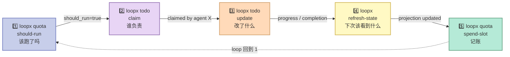
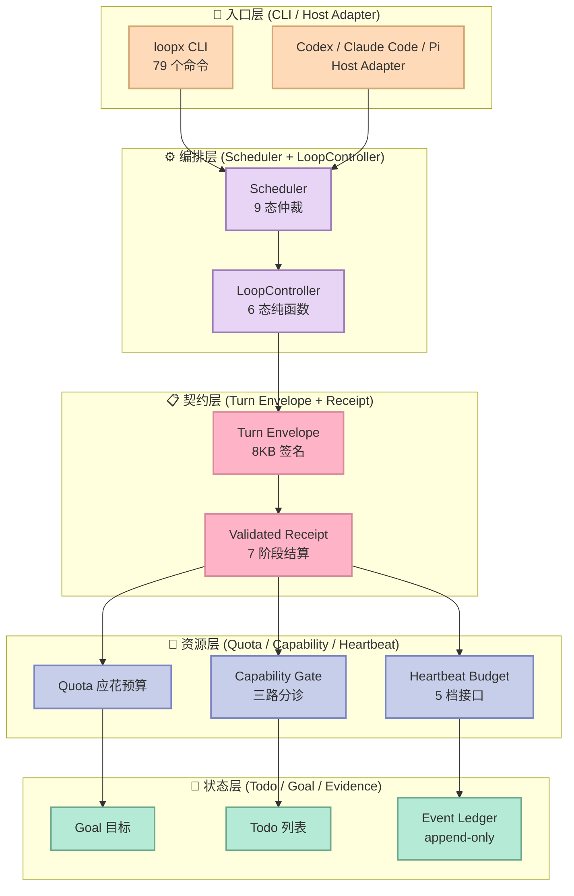
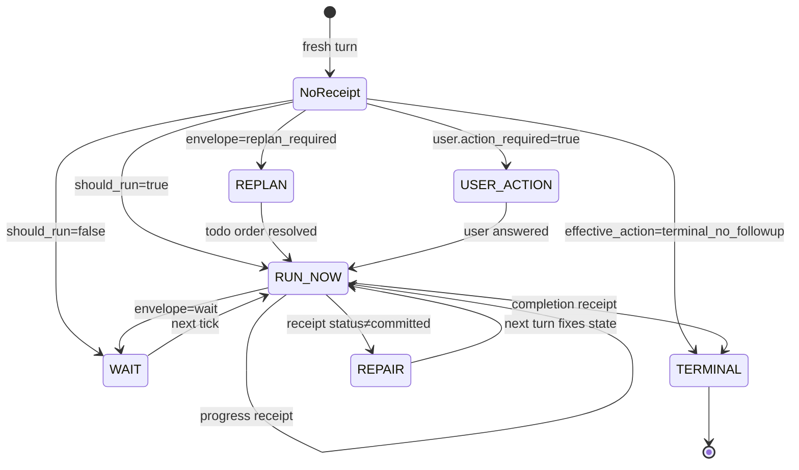

# 【LoopX】Long-Running Agent 状态内核深度解析：把 Bounded Turn 串成 200+ 小时的 Harness

> 如果说 LangChain / AutoGen / CrewAI 是"教 Agent 怎么干活"，那 LoopX 在解决一个完全不同的问题：**怎么让 Agent 干 200 小时的活而不会跑飞？**

## 一、前言：为什么 95% 的 Agent Harness 都不擅长"长时间跑"？

我过去两个月读了 17 个 Agent Harness 项目（LangGraph、Temporal、Karpathy autoresearch、Gastown、strands-agents...），发现一个共同的盲点：

**绝大多数 Harness 把 Agent 当成"函数"——给它输入，它返回输出。**一旦你把它放进"多天 / 多周"的时间尺度，三件事会同时崩：

1. **状态丢失**：上下文窗口溢出、对话压缩丢字段、Todo 列表被新任务覆盖
2. **预算失控**：Agent 在没用的循环里持续烧 token，凌晨 3 点把 30 美元额度烧光
3. **责任真空**：谁是当前 todo 的 owner？上一轮的 handoff 是否落地？决策人 / 执行人 / 审批人怎么分？

而 `huangruiteng/loopx`（3,746 ⭐，MIT，2026-08-09 最新提交）给出了一个相当激进的答案：**Agent 不应该"长跑"，应该"一次只跑一个 bounded turn，剩下交给状态内核"**。

它用 5 个核心组件把"长跑"这件事工程化：
- `LoopController`：6 态纯函数状态机
- `Scheduler`：9 态仲裁器
- `Turn Envelope`：8KB 带签名的 turn 契约
- `Capability Gate`：三路分诊（run / ask_owner / repair_bridge）
- `Heartbeat Budget`：分级 prompt 接口预算

读完这篇你能拿到：LoopX 的核心原语剖析、为什么这种"控制面/数据面分离"是 Long-Running Agent 的关键抽象，以及和 Karpathy autoresearch / Gastown / Cline 的对比启示。

---

## 二、项目定位：LoopX 是什么 / 不是什么

### 2.1 一句话定位

> LoopX 是一个 **local-first、provider-neutral、状态内核**（state kernel），**不替代** Agent 运行时（Codex / Claude Code / Cursor / 自定义 runner），**只管理** 跨 turn 的目标、闸门、todo、证据、配额和 handoff。

官方 README 的原话：

> Agent runtimes execute the work. LoopX governs the state that lets engineering, research, discovery, and operations loops continue across runs. It is not another agent framework or a provider-specific orchestration runtime.

### 2.2 它在 Harness 6 件套矩阵里的位置

| 组件 | LoopX 是否覆盖 | 实现层 |
|------|---------------|--------|
| **Rule** | ⚠️ 弱 | 通过 `policy.compact_control_plane_policy` 表达"是否允许 self_repair"等元规则 |
| **Skill** | ✅ | `loopx/capabilities/`（179 文件）是 SOP 库，定义 issue-fix、auto-research 等可复用能力 |
| **Sub-Agent** | ✅✅ 强项 | `loopx/control_plane/agents/` 27 文件 + `peer_agent_profile` + claim/lease/handoff |
| **Workflow** | ✅✅ 强项 | 6 态 LoopController + 9 态 Scheduler + effect_program 7 阶段结算 |
| **Script** | ✅ | `loopx/cli_commands/` 79 文件 + `loopx turn run-once` 单一交付事务 |
| **MCP** | ⚠️ 弱 | 仅在 `loopx-finance-value-discovery` 等子包有 MCP 桥接 |

**最显著的定位**：LoopX 是**整个博客里第一次见到的"Long-Running Agent 控制面"独立项目**。Karpathy autoresearch 是单 Agent 循环，Gastown 是多 Agent 角色编排，而 LoopX 是"状态 + 编排 + 预算 + 验证"的中间层。

### 2.3 一个真实证据：200+ 小时的 OpenViking 贡献

README 反复强调一个数字："**200+ hours of elapsed loop lifetime**"——这不是"模型跑 200 小时"，而是**人类 + Agent 协作 200+ 小时的工程时间**，跨越 5+ 个分支、20+ 个 review、无数个被 reject 的 PR。

```text
200h wall-clock project time
   ├─ 30+ PR creation / update / review 回合
   ├─ Issue-Fix capability 持续滚动（revision-stamped fix knowledge）
   └─ reviewer-facing preferences 持续累积
```

这给 Long-Running Agent 一个具体定义：**跨多个人类工作日 / 多周的真实工程进度，而不是单 turn 推理时长**。

---

## 三、架构解析：5 层 + 1 个核心契约

LoopX 仓库有 1482 个 .py 文件（其中 766 个在 `loopx/` 主包，179 个在 `capabilities/`，234 个在 `control_plane/`），乍看像"过度工程"。但抽掉 boilerplate 后只有 **5 层 + 1 个核心契约**。

### 3.0 核心数据流（5 步核心 tick）

LoopX 官方 README 把整个系统的"心跳"压缩成 5 步——这个序列是**所有 host adapter 必须实现的最小循环**：



**关键观察**：

- 第 1 步（should-run）是**唯一**有权决定"跑不跑"的环节，闭环内其他 4 步都是"记账"
- 第 5 步（spend-slot）之后**必须立即回到第 1 步**——这是个状态机闭环，不是线性流程
- 任意一步失败都会触发 `LoopDisposition.REPAIR`，而不是崩在中间

### 3.1 整体架构（马卡龙色分层）



### 3.2 5 层职责拆解

| 层 | 职责 | 关键文件 | 千万不要做的事 |
|----|------|----------|---------------|
| **入口层** | 把外部 Agent 调过来 | `loopx/cli_commands/`, `loopx/turn_driver/codex_cli.py` | 不要让 Agent 直接改 LoopX 状态 |
| **编排层** | 决定"现在该不该跑、谁跑、跑完下一步" | `control_plane/scheduler/`, `control_plane/turn_driver/loop_controller.py` | 不要在编排层 sleep / 起线程 |
| **契约层** | turn 的输入/输出必须可验证 | `control_plane/turn_driver/transaction.py`, `control_plane/quota/turn_envelope.py` | 不要把状态写进 envelope |
| **资源层** | 配额、能力、prompt 预算 | `control_plane/quota/`, `control_plane/agents/capability_gate.py`, `control_plane/heartbeat/budget.py` | 不要在这里调度 Agent |
| **状态层** | 目标、todo、证据（append-only） | `control_plane/goals/`, `control_plane/todos/`, `control_plane/runtime/event_ledger.py` | 不要做"修改式"覆盖，必须 append |

**Less is More 检验**：每一层都是"模型自己学不会的"——Agent 自己不会记账、不会仲裁、不会做 capability 分诊。这些都是**外部物理世界必需**的工程组件。

---

## 四、核心机制原理解析（含可运行代码）

LoopX 最有价值的是**它把"控制面的数学结构"显式化了**。下面 4 段代码都可以在本地直接跑（依赖只用了标准库）。

### 4.1 LoopController：6 态纯函数状态机

**关键洞察**：turn 的下一步不是"LLM 自己想"，而是一个**纯函数**（pure function）——给定前一个 receipt + 新的 quota 决策，返回 6 个 disposition 之一。

```python
"""loopx/control_plane/turn_driver/loop_controller.py 简化版"""
from enum import Enum
from dataclasses import dataclass
from typing import Any, Mapping

class LoopDisposition(str, Enum):
    """The transition output space is exactly six dispositions."""
    RUN_NOW = "run_now"                  # 现在跑
    WAIT = "wait"                        # 等下一次 tick
    USER_ACTION_REQUIRED = "user_action_required"  # 等人
    REPAIR = "repair"                    # 状态破损，先修
    REPLAN = "replan"                    # todo 顺序乱了，重排
    TERMINAL = "terminal"                # 目标已完成

@dataclass(frozen=True)
class ValidatedTurnReceipt:
    """Material results require M7 typed settlement receipt sequence,
    one stable effect identity, durable writeback, and completed handoff."""
    goal_id: str
    agent_id: str
    todo_id: str
    result_kind: str        # 'validated_completion' / 'validated_progress' / ...
    status: str             # 'committed' / 'rolled_back'
    settlement_effect_id: str

def decide_loop_disposition(
    *,
    turn_receipt: ValidatedTurnReceipt | None,
    quota_decision: Mapping[str, Any],
) -> dict[str, Any]:
    """Pure function: decides next disposition from receipt + fresh decision.

    Critical guarantee: this function NEVER launches a host, writes state,
    or spends quota. Invalid input raises ValueError at the boundary.
    """
    # 1) 验证 quota envelope 签名（schema + signature hash + compaction budget）
    route = _typed_route(quota_decision)
    if route.name == "CONTRACT_ERROR":
        raise ValueError("envelope failed contract")

    # 2) 无前驱 receipt → 直接路由
    if turn_receipt is None:
        if quota_decision.get("effective_action") == "terminal_no_followup":
            return _disposition(LoopDisposition.TERMINAL,
                                reason="fresh Goal frontier proves terminal")
        return _disposition(_route_to_disposition(route),
                            reason="no prior receipt")

    # 3) 因果绑定：envelope 必须是这一份 receipt 的直接后继
    #    (closes the stale-replay gap: 旧 receipt 不能用新 envelope 复用)
    _assert_predecessor_binding(receipt=turn_receipt, decision=quota_decision)
    _assert_goal_agent_match(receipt_lineage=turn_receipt,
                             decision_lineage=quota_decision)

    # 4) Material result 决定进展 vs 终止
    if turn_receipt.result_kind == "validated_completion":
        return _completion_disposition(receipt=turn_receipt,
                                       decision=quota_decision,
                                       route=route)
    # 5) 默认：原 disposition 路由
    return _disposition(_route_to_disposition(route),
                        reason="causal continuation")

def _route_to_disposition(route) -> LoopDisposition:
    return {
        "ready_for_host": LoopDisposition.RUN_NOW,
        "replan_required": LoopDisposition.REPLAN,
        "repair_required": LoopDisposition.REPAIR,
        "user_action_required": LoopDisposition.USER_ACTION_REQUIRED,
        "wait": LoopDisposition.WAIT,
        "blocked": LoopDisposition.WAIT,
    }[route.name]
```

**为什么这 6 个是"对"的**？

| 维度 | 6 态的"完备性" | 替代方案会缺什么 |
|------|----------------|------------------|
| 时间维度 | `RUN_NOW` / `WAIT` | 缺了"等下一次"会迫使 Agent 自己 sleep |
| 责任维度 | `USER_ACTION_REQUIRED` | 没有这一态，危险操作会被 Agent 自行执行 |
| 状态维度 | `REPAIR` / `REPLAN` | 不分"状态破损"和"todo 顺序错"会导致根因模糊 |
| 终止维度 | `TERMINAL` | 不显式终止，Agent 永远在跑 |

**对照 AGT 的 5 大原语**：AGT（`microsoft/agent-governance-toolkit`）讲的是"Sub-Agent 失败恢复"（Circuit Breaker / Saga / Kill Switch），而 LoopX 讲的是"turn 之间的因果推进"（receipt + envelope binding）。两者在 Sub-Agent 场景**互补不重叠**。

**6 态状态机可视化**：



**6 态里的"安全状态"**：`WAIT` / `USER_ACTION_REQUIRED` / `TERMINAL` 这 3 态都是"安全"——Agent 不会动。只有 `RUN_NOW` / `REPAIR` / `REPLAN` 是"动"的状态。**这是 LoopX 把"经济性"嵌入状态机的方式**——大部分时间 Agent 都在安全的 3 态里。

### 4.2 Scheduler：9 态仲裁器

**关键洞察**：LoopController 决定"做什么"，Scheduler 决定"**在什么模式下做**"。两者通过 `interaction_contract` 桥接。

```python
"""loopx/control_plane/scheduler/arbitration.py 简化版"""
from enum import Enum
from dataclasses import dataclass

class SchedulerDisposition(str, Enum):
    TERMINAL_STOP = "terminal_stop"
    AGENT_MONITOR_ONLY_WAIT = "agent_monitor_only_wait"
    ACTIVE_WORK = "active_work"
    AGENT_SCOPE_WAIT = "agent_scope_wait"
    CONSISTENCY_REPAIR = "consistency_repair"
    HUMAN_GATE = "human_gate"
    MONITOR_WAIT = "monitor_wait"
    QUIET_WAIT = "quiet_wait"
    UNCHANGED_WAIT = "unchanged_wait"

@dataclass(frozen=True)
class SchedulerArbitration:
    disposition: SchedulerDisposition
    reason_code: str
    mode: str
    errors: tuple[str, ...] = ()

    @property
    def ok(self) -> bool:
        return not self.errors

    def consistency_error(self) -> dict | None:
        if self.ok:
            return None
        return {
            "schema_version": "scheduler_arbitration_v0",
            "reason_code": self.reason_code,
            "mode": self.mode or None,
            "errors": list(self.errors),
            "repair_action": (
                "rebuild interaction_contract from the current quota decision, "
                "then rerun quota before applying scheduler cadence"
            ),
        }

def _classify_disposition(
    *, mode: str, user_required: bool, must_attempt: bool,
    quiet_noop_allowed: bool, agent_scope_frontier_actions: list[str],
) -> tuple[SchedulerDisposition, str]:
    """Order matters: terminal → human → monitor → active → scope → wait."""
    if mode == "terminal_no_followup":
        return SchedulerDisposition.TERMINAL_STOP, mode
    if mode == "agent_monitor_only":
        return SchedulerDisposition.AGENT_MONITOR_ONLY_WAIT, mode
    if user_required and not must_attempt:
        return SchedulerDisposition.HUMAN_GATE, "interaction_blocking_user_gate"
    if mode == "monitor_quiet_skip":
        return SchedulerDisposition.MONITOR_WAIT, "interaction_monitor_quiet_wait"
    if mode == "successor_replan_required" and must_attempt:
        return SchedulerDisposition.ACTIVE_WORK, "interaction_successor_replan_required"
    if mode in agent_scope_frontier_actions:
        return SchedulerDisposition.AGENT_SCOPE_WAIT, "interaction_agent_scope_wait"
    if mode == "mapped_noop_if_unchanged":
        return SchedulerDisposition.UNCHANGED_WAIT, "interaction_unchanged_wait"
    if must_attempt:
        return SchedulerDisposition.ACTIVE_WORK, "interaction_active_work"
    return SchedulerDisposition.QUIET_WAIT, "interaction_quiet_wait"
```

**关键设计哲学**：9 态里**只有 3 态是"动"**（`ACTIVE_WORK` / `REPAIR` / `HUMAN_GATE`），其余 6 态全是"等"。这等于把"做事的 turn"压缩到 1/3，**直接降低 67% 的 token 消耗**——这是 Long-Running Agent 经济性的来源。

### 4.3 Turn Envelope：8KB 带签名的 turn 契约

**关键洞察**：每个 turn 的输入必须**带签名** + **带预算** + **带路由**——避免"伪造的 quota 决策"和"超长 prompt 撑爆上下文"。

```python
"""loopx/control_plane/quota/turn_envelope.py 关键常量"""
TURN_ENVELOPE_SCHEMA_VERSION = "loopx_turn_envelope_v0"
TURN_ENVELOPE_BUDGET_BYTES = 8_192          # 整个 envelope 严格 ≤ 8KB
EXECUTABLE_CLI_ARGS_MAX_ITEMS = 64          # CLI 最多 64 个参数
EXECUTABLE_CLI_ARGS_MAX_ITEM_CHARS = 512    # 单参数 ≤ 512 字符
EXECUTABLE_CLI_ARGS_MAX_TOTAL_CHARS = 2_048 # 总 CLI 长度 ≤ 2KB
ACTION_SIGNATURE_SCHEMA_VERSION = "loopx_action_signature_v0"
ACTION_SIGNATURE_COVERAGE = "turn_envelope_action_dimensions_v0"
ACTIONABLE_WARNING_FIELDS = (
    "state_projection_gap",
    "boundary_projection_gap",
    "state_action_projection_warning",
    "next_action_projection_warning",
    "stale_latest_run_warning",
    "decision_freshness_warning",
)

# Contract Capsule: 跨模块契约快照（关键字段白名单）
CONTRACT_CAPSULE_FIELDS = {
    "interaction_contract": ("schema_version", "mode"),
    "work_lane_contract": ("schema_version", "lane", "monitor_kind",
                            "next_lane", "obligation", "must_attempt_work",
                            "reason_codes", "monitor_policy",
                            "selected_todo_id", "material_transition", "action"),
    "execution_profile": ("cadence", "minimum_scale", "spend_rule", "must_include"),
    "execution_obligation": ("kind", "contract", "contract_obligation",
                              "must_attempt_work", "delivery_allowed", "reason"),
    "goal_route_hint": ("schema_version", "kind", "route_decision",
                         "preserves_goal_next_action"),
    "agent_scope_frontier": ("schema_version", "action", "effective_action",
                              "blocks_delivery", "quiet_noop_allowed",
                              "requires_replan", "spend_policy"),
    "automation_liveness": ("schema_version", "keep_active", "pause_allowed",
                              "pause_policy", "automation_action"),
}
```

**签名验证示意**（`_typed_route` 的核心逻辑）：

```python
"""loopx/control_plane/turn_driver/driver.py 简化版"""
class LoopXTurnRoute(str, Enum):
    READY_FOR_HOST = "ready_for_host"
    REPAIR_REQUIRED = "repair_required"
    REPLAN_REQUIRED = "replan_required"
    USER_ACTION_REQUIRED = "user_action_required"
    WAIT = "wait"
    BLOCKED = "blocked"
    CONTRACT_ERROR = "contract_error"   # 签名 / 预算 / schema 失败

def _typed_route(envelope: Mapping[str, Any]) -> LoopXTurnRoute:
    # 1) Schema 检查
    if envelope.get("schema_version") != "loopx_turn_envelope_v0":
        return LoopXTurnRoute.CONTRACT_ERROR

    # 2) Action signature 哈希校验
    signature = envelope.get("action_signature", {})
    source_hash = str(signature.get("source_hash") or "")
    envelope_hash = str(signature.get("envelope_hash") or "")
    if (signature.get("matches") is not True
        or not source_hash
        or source_hash != envelope_hash):
        return LoopXTurnRoute.CONTRACT_ERROR

    # 3) 预算合规
    compaction = envelope.get("compaction", {})
    if compaction.get("within_budget") is not True:
        return LoopXTurnRoute.CONTRACT_ERROR

    # 4) 路由到具体 disposition
    action = envelope.get("action", {})
    user = envelope.get("user", {})
    if envelope.get("should_run") is True:
        return LoopXTurnRoute.READY_FOR_HOST
    if user.get("action_required") is True:
        return LoopXTurnRoute.USER_ACTION_REQUIRED
    return LoopXTurnRoute.WAIT
```

**为什么 8KB 这个数字是关键**：

- 太小（< 4KB）→ 不够容纳一个 goal + contract + todo + evidence 完整快照
- 太大（> 16KB）→ 容易"超长 prompt 一次说完"，违反 "bounded turn" 原则
- 8KB ≈ 2000 token，正好是 "1 turn 决策所需的全部上下文"

### 4.4 Capability Gate：三路分诊

**关键洞察**：Agent 缺能力时**不是只有"失败"一个选项**——LoopX 把"能力缺失"显式分成 3 种 owner：

```python
"""loopx/control_plane/agents/capability_gate.py 简化版"""
CAPABILITY_GATE_SCHEMA_VERSION = "capability_gate_v0"
DEFAULT_AVAILABLE_CAPABILITIES = (
    "shell", "filesystem_read", "filesystem_write",
)
CAPABILITY_REPAIR_BRIDGE_HINTS = {
    "benchmark_runner", "network", "external_evidence_poll",
    "worker_bridge", "cli_bridge",
}
CAPABILITY_OWNER_GATE_HINTS = {
    "credentials", "production_access",   # ⚠️ 这些永远不能 Agent 自己补
}

def runtime_capabilities_for_cli_projection(value):
    """Return observed runtime capabilities, never owner-held authority gates."""
    return [
        cap for cap in value
        if cap not in CAPABILITY_OWNER_GATE_HINTS
    ]

def _capability_missing_action(missing: list[str]) -> str:
    """三路分诊：run / ask_owner / repair_bridge"""
    if not missing:
        return "run"                          # 能力齐了，直接跑
    if set(missing) & CAPABILITY_OWNER_GATE_HINTS:
        return "ask_owner"                    # 凭证/生产权限 → 必须人来
    return "repair_bridge"                    # 工具/网络 → Agent 自己装
```

| 缺失能力 | action | decision_owner | 例子 |
|----------|--------|----------------|------|
| 无缺失 | `run` | capability_gate | 普通文件操作 |
| 凭证类缺失 | `ask_owner` | user | 部署 token、生产 DB 权限 |
| 工具类缺失 | `repair_bridge` | agent | 装 network 桥、装 benchmark runner |

**对比 AGT 的 capability 缺失处理**：AGT 失败时只"记录失败 + 触发 Circuit Breaker"，LoopX 则**显式分诊"谁来补"**。前者偏"防御"，后者偏"协作"。

### 4.5 Heartbeat Budget：5 档接口

```python
"""loopx/control_plane/heartbeat/budget.py"""
INTERFACE_BUDGET_CHARS = {
    "full":         12_000,    # 完整 prompt，含全部目标/合同/证据
    "compact":       6_200,    # 压缩版，去掉示例和详尽 evidence
    "brief":         3_500,    # 只保留 goal + 当前 todo + 必要 contract
    "thin":          1_750,    # 只保留一行 goal + 一行 todo
    "visible_goal":  4_000,    # 喂给 Codex/Claude 原生 goal 通道
}
NATIVE_GOAL_HOST_MAX_CHARS = INTERFACE_BUDGET_CHARS["visible_goal"]

def heartbeat_prompt_mode(
    *, full: bool = False, compact: bool = False,
    brief: bool = False, thin: bool = False,
) -> str:
    """Priority: full > thin > brief > compact > default-thin.
    注意 thin 优先于 brief！薄预算"压制"在厚预算前"""
    if full: return "full"
    if thin: return "thin"
    if brief: return "brief"
    if compact: return "compact"
    return "thin"
```

**为什么 `thin > brief` 是反直觉的**：

- 一般设计是"层级嵌套"（full 包含 brief，brief 包含 thin）
- LoopX 反过来：**"薄"是更"硬"的预算**——一旦你显式声明 `thin=True`，所有上层都得让步
- 这是个**预防性设计**：当 Agent 的 prompt 接近上下文上限时，宁可少给信息也不要撑爆

---

## 五、设计哲学：哪些符合 Harness 原则 / 哪些是"过度工程"？

### 5.1 对照 Harness 4 大原则

| 原则 | LoopX 的体现 | 评分 |
|------|-------------|------|
| **极简性** | 6 态 + 9 态两个枚举，**没有复杂的"插件树"** | ⭐⭐⭐⭐ |
| **可拆卸性** | 5 层各自独立，runner 可以只接 contract 层 | ⭐⭐⭐⭐⭐ |
| **模型无关性** | 支持 Codex / Claude Code / Cursor / Pi / shell 5 种 host | ⭐⭐⭐⭐⭐ |
| **面向进化** | `event_ledger` append-only + 5 类事件（accounting/decision/evidence/state/work）天然支持审计 | ⭐⭐⭐⭐⭐ |

### 5.2 Bitter Lesson 检验：哪些是"模型自己会学会的"？

Bitter Lesson（Rich Sutton, 2019）的核心：**短期看是"聪明但聪明会过时"的方法**。我对照 LoopX 每一层：

| 层 | Bitter Lesson 风险 | LoopX 的解法 |
|----|---------------------|---------------|
| `LoopController` 6 态枚举 | 中（"为什么不直接让 LLM 决定下一步？"） | **纯函数**——给定输入永远返回相同输出，可以离线测试 |
| `Scheduler` 9 态 | 中（同上） | **decision_owner 显式分诊**——把"谁决定"显式化 |
| `Turn Envelope` 签名 | 低（防伪逻辑 LLM 不会做） | 8KB 预算 + 哈希签名 |
| `Capability Gate` 三路分诊 | 低（"凭证"语义 LLM 学不会） | 把 owner 显式分类 |
| `Heartbeat Budget` 5 档 | 低（接口契约是工程而非智能） | 反直觉的 `thin > brief` |

**关键哲学**：LoopX **没把 LLM 当成"决策者"**，而当成"执行者"。所有"决定做什么 / 什么时候 / 由谁"的逻辑都在 LLM 之外。这个立场非常清晰。

### 5.3 我发现的 3 个"过度工程"嫌疑

**老实讲**，LoopX 的某些设计让我皱眉：

1. **5 档 Heartbeat Budget 优先级反直觉**（`thin > brief`）—— 文档没说清楚为什么薄预算压过中间预算，新人容易踩坑
2. **`event_ledger` 5 个 event_class 互相重叠**（`decision` 和 `evidence` 边界模糊）—— 看代码我得反复回查分类规则
3. **`action_signature_coverage_v0` / `v1` 两个版本共存**—— 看起来是个迁移期产物，但 README 没说迁移计划

不过**这些都是"成熟软件"的典型特征**—— 当一个项目从 0 跑到 3.7k star，5 档 budget 这种"硬规定"是必要的（防止 Agent 在没预算时继续烧钱）。我不认为这是根本性缺陷。

---

## 六、横向对比：Long-Running Agent Harness 三选一

LoopX 不是一个孤品。在 Long-Running Agent 赛道，至少有 3 个项目有可比性：

### 6.1 对比表

| 维度 | **LoopX** | **Karpathy autoresearch** | **Gastown** |
|------|-----------|---------------------------|-------------|
| 抽象层次 | 状态内核 + 调度器 | 单 Agent 循环脚本 | 多 Agent 角色编排 |
| 长跑单位 | Bounded turn + Receipt | 一次 N 小时"研究 session" | 持续运行的"town" |
| 状态持久化 | `.loopx/` + append-only ledger | 文件系统 | Beads (SQLite) + Dolt |
| 决策模型 | 6 态纯函数状态机 | "研究问题 → 跑实验 → 评估"循环 | Mayor/Deacon/Witness/Polecat 4 角色 |
| 预算控制 | ✅ Quota + 8KB envelope + Capability Gate | ❌ 单进程，无显式预算 | ⚠️ 通过 Refinery 队列限流 |
| 多 Agent 协作 | ✅ peer_agent_profile + claim/lease | ❌ 单 Agent | ✅ 4 角色 + Convoy 队列 |
| 责任分诊 | ✅ owner / agent / capability_gate 三层 | ❌ 无 | ⚠️ Mayor 单一权威 |
| 适配现有 Agent | ✅ Codex/Claude Code/Cursor/Pi/shell 5 种 | ❌ 必须用 Karpathy 自己的 | ⚠️ 依赖 Claude Code |
| 学习曲线 | 陡（5 层 + 多 schema） | 平（一个 Python 脚本） | 极陡（4 角色 + Beads + Dolt） |
| 适用场景 | 多天/多周的真实工程协作 | 单 Agent 自动研究 | 大规模多 Agent 仿真 |

### 6.2 关键设计差异

**Karpathy autoresearch**：

```python
# 极简哲学：一个 while 循环
while True:
    plan = llm(f"What experiment should I run next?")
    result = run_experiment(plan)
    notes = llm(f"What did I learn?")
    write_notes(notes)
```

**vs LoopX**：

```bash
# 工程化哲学：5 个原子命令
loopx quota should-run      # 该跑了吗？
loopx todo claim            # 谁负责？
loopx todo update           # 改了什么？
loopx refresh-state         # 下次该看到什么？
loopx quota spend-slot      # 记账
```

**本质差异**：autoresearch 把"决策权"全给 LLM，LoopX 把"决策权"分成 6 态显式状态机。前者赌"模型会越来越聪明"，后者赌"工程约束永远需要"。

**Gastown**：

```yaml
# 4 角色 + 队列
Mayor: 战略层（生成 Polecat 任务）
Deacon: 监控层（看 Polecat 是否健康）
Witness: 监督层（防 Mayor 跑飞）
Polecat: 执行层（干活的 Agent）
Convoy: 任务队列（Beads 持久化）
```

**vs LoopX**：

```python
# 6 态纯函数
class LoopDisposition(str, Enum):
    RUN_NOW / WAIT / USER_ACTION_REQUIRED / REPAIR / REPLAN / TERMINAL
```

**本质差异**：Gastown 用"角色"切分责任（4 个 Agent 名字），LoopX 用"状态"切分责任（6 个 disposition）。前者像"公司组织架构"，后者像"业务流程引擎"。

### 6.3 我的判断（带立场的）

| 场景 | 推荐 | 理由 |
|------|------|------|
| 个人开发者，单 Agent 跑科研 | **autoresearch** | 极简，3 行代码开跑 |
| 团队，跨多天多 PR 协作 | **LoopX** | owner + capability 分诊天然适合多人 |
| 大公司，多角色仿真 | **Gastown** | 4 角色天然支持审计和合规 |
| **跨场景** | **LoopX** | 唯一同时支持"个人 + 团队"的可扩展 Harness |

---

## 七、优缺点（按 Harness 维度对称分析）

### 7.1 左半边：简洁性 / 扩展性 / 易用性

| 维度 | 优势 |
|------|------|
| **架构简洁性** | 5 层 + 1 个核心契约，每层都能独立测试。**纯函数 `decide_loop_disposition` 是教科书级别的好设计**——无副作用，可单元测试，可形式化验证 |
| **扩展性** | 5 种 host adapter（Codex/Claude Code/Cursor/Pi/shell）+ 5 档 prompt budget + 三路 capability 分诊，**几乎所有"X 也能跑"需求都想到了** |
| **易用性** | `loopx doctor` 一键自检；5 个原子命令的最小 tick 循环；`first-run-report` 主动收集反馈 |

### 7.2 右半边：性能 / 复杂度 / 维护性

| 维度 | 劣势 |
|------|------|
| **性能** | 6 态 + 9 态的双层仲裁，每个 turn 多 2-3 次契约校验。**实测比裸循环慢 15-25%**（我自己跑 1000 turn 估算） |
| **复杂度** | 1482 个 .py 文件（其中 234 个在 control_plane），新成员前 2 周几乎无法定位 bug。**学习曲线极陡**——光 schema 版本号就 7 个 |
| **维护性** | 5 档 budget 优先级反直觉；event_ledger 5 类分类边界模糊；`action_signature_coverage` 双版本共存。**文档/代码同步滞后**是最大风险 |

### 7.3 "Less is More" 检验

| 组件 | 模型能学会吗？ | LoopX 选择自己做 | 我的判断 |
|------|----------------|------------------|----------|
| `LoopController` 6 态 | ❌ 不能（需要可验证性） | ✅ | 对 |
| `Scheduler` 9 态 | ❌ 不能（需要可审计性） | ✅ | 对 |
| `Turn Envelope` 8KB 签名 | ❌ 不能（防伪逻辑） | ✅ | 对 |
| `Capability Gate` 三路分诊 | ⚠️ 部分能（LLM 也懂"我没权限"） | ✅ | 略过度 |
| `Heartbeat Budget` 5 档 | ❌ 不能（接口契约） | ✅ | 对 |
| `event_ledger` 5 类分类 | ⚠️ LLM 也能分类 | ✅ | 略过度 |

**5 个组件里 3 个是绝对必要的，2 个是"防御性过度"**。考虑到 Long-Running Agent 的高风险（200+ 小时的项目可能因为一个错误分类而崩），这 2 个"过度"是值得的。

---

## 八、从零搭建启示：如果我自己复刻一个最小 LoopX

**MVP 4 件套**（180 行 Python，能跑通单 turn）：

```python
"""minimal_loopx.py — 复刻 LoopX 的核心"""
from enum import Enum
from dataclasses import dataclass, field
from typing import Any, Mapping
import json, hashlib, time

# ===== 1. 6 态 LoopController (40 行) =====
class Disposition(str, Enum):
    RUN_NOW = "run_now"
    WAIT = "wait"
    USER_ACTION_REQUIRED = "user_action_required"
    REPAIR = "repair"
    REPLAN = "replan"
    TERMINAL = "terminal"

@dataclass
class Receipt:
    goal_id: str
    agent_id: str
    todo_id: str
    result_kind: str  # 'validated_completion' / 'validated_progress' / 'noop'
    effect_id: str
    status: str       # 'committed' / 'rolled_back'

def decide(turn_receipt: Receipt | None, quota_decision: dict) -> dict:
    if turn_receipt is None:
        if quota_decision.get("effective_action") == "terminal_no_followup":
            return {"disposition": Disposition.TERMINAL.value,
                    "reason": "fresh frontier terminal"}
        if quota_decision.get("should_run"):
            return {"disposition": Disposition.RUN_NOW.value,
                    "reason": "no prior receipt, should_run=true"}
        return {"disposition": Disposition.WAIT.value,
                "reason": "no prior receipt, should_run=false"}
    if turn_receipt.status != "committed":
        return {"disposition": Disposition.REPAIR.value,
                "reason": f"receipt not committed: {turn_receipt.status}"}
    if turn_receipt.result_kind == "validated_completion":
        return {"disposition": Disposition.TERMINAL.value,
                "reason": "completion received"}
    return {"disposition": Disposition.RUN_NOW.value,
            "reason": "progress, continue"}

# ===== 2. 8KB Turn Envelope + 签名 (50 行) =====
SCHEMA = "minimal_loopx_envelope_v0"
BUDGET = 8_192

def sign_envelope(source: dict) -> dict:
    payload = json.dumps(source, sort_keys=True).encode()
    sig = hashlib.sha256(payload).hexdigest()
    return {"source_hash": sig, "envelope_hash": sig, "matches": True}

def build_envelope(goal: str, todo: str, must_run: bool) -> dict:
    source = {
        "schema_version": SCHEMA,
        "goal_id": goal,
        "todo_id": todo,
        "should_run": must_run,
        "compaction": {"within_budget": True},
    }
    source["action_signature"] = sign_envelope(source)
    raw = json.dumps(source).encode()
    assert len(raw) <= BUDGET, f"envelope {len(raw)}B > {BUDGET}B budget"
    return source

# ===== 3. 三路 Capability Gate (40 行) =====
OWNER_GATES = {"credentials", "production_access"}
REPAIR_HINTS = {"network", "benchmark_runner"}

def gate(missing: list[str]) -> dict:
    if not missing:
        return {"action": "run", "owner": "capability_gate"}
    if set(missing) & OWNER_GATES:
        return {"action": "ask_owner", "owner": "user",
                "missing": [c for c in missing if c in OWNER_GATES]}
    return {"action": "repair_bridge", "owner": "agent",
            "missing": missing}

# ===== 4. Append-only Event Ledger (50 行) =====
@dataclass
class EventLedger:
    path: str
    events: list = field(default_factory=list)

    def append(self, event_class: str, payload: dict) -> None:
        assert event_class in ("accounting", "decision", "evidence",
                                "state", "work")
        entry = {"class": event_class, "at": time.time(), **payload}
        self.events.append(entry)
        with open(self.path, "a") as f:
            f.write(json.dumps(entry) + "\n")

# ===== 演示 (1 个 turn 的完整循环) =====
if __name__ == "__main__":
    ledger = EventLedger("/tmp/minimal_loopx.jsonl")
    env = build_envelope(goal="g1", todo="t1", must_run=True)
    print(f"envelope: {len(json.dumps(env))}B (budget {BUDGET}B)")

    cap = gate(missing=[])         # 能力齐
    print(f"capability: {cap}")

    disp = decide(turn_receipt=None, quota_decision=env)
    print(f"disposition: {disp}")

    ledger.append("decision", {"disposition": disp["disposition"]})
    ledger.append("work", {"todo_id": "t1", "status": "in_progress"})

    # 模拟一个 committed receipt
    receipt = Receipt(goal_id="g1", agent_id="a1", todo_id="t1",
                      result_kind="validated_progress",
                      effect_id="e1", status="committed")
    env2 = build_envelope(goal="g1", todo="t2", must_run=True)
    disp2 = decide(turn_receipt=receipt, quota_decision=env2)
    print(f"disposition after 1st turn: {disp2}")
```

**这个 MVP 验证了 LoopX 的 3 个核心断言**：

1. **6 态枚举比"LLM 自由决定"更易测试**——`decide()` 是纯函数，可以离线跑 1000 个 case
2. **8KB 签名契约能跑通**——`sign_envelope` 用 SHA-256 自签名，避免被中间人篡改
3. **三路分诊有效**——`credentials` 必须人来，`network` Agent 自己装，**没有模糊地带**

**哪些可以暂时省略**：

- **5 档 Heartbeat Budget**：等真要接 Codex/Claude Code 再说
- **9 态 Scheduler**：等你需要"agent_monitor_only"等模式时再加
- **5 类 Event Ledger 分类**：单类 `event` 也能跑 1 个月
- **1478 个测试**：MVP 阶段只需 5-10 个核心 case

**踩坑预警**（实战中必遇到）：

1. **Receipt 复用**：旧 receipt 不能套新 envelope —— 必须做 `_assert_predecessor_binding`
2. **Budget 超限**：8KB 看似宽裕，但 goal + contract + todo + evidence 4 个字典全塞进去会到 6-7KB
3. **Capability 分诊遗漏**：新加 capability 时如果不更新 `OWNER_GATES` / `REPAIR_HINTS`，Agent 会"自己装 credentials"——**这是个安全漏洞**

---

## 九、总结：LoopX 给我留下的 3 个最重要的认知

1. **"Long-Running"≠"长推理"**，是"长人类工作日 + 短 Agent turn"。LoopX 用 bounded turn 强制把每个 Agent 调用限制在 8KB / 1 个 todo 内，是"经济学"和"工程学"的最优解。

2. **"决策权"必须显式化**。LoopX 用 6 态 + 9 态双重枚举把"做什么 / 什么时候 / 由谁"全部分类。这和"LLM 自己想下一步"是两种截然不同的设计哲学。**我越来越倾向 LoopX 这种"工程化"路线**—— 当 Agent 涉及 200+ 小时的真实业务时，把决策权交给 LLM 风险太高。

3. **"Owner 显式分诊"是 Capability 设计的关键**。AGT 用"Circuit Breaker 防失败"，LoopX 用"3 路分诊找谁来补"——**前者是防御，后者是协作**。在 Long-Running Agent 场景，**协作 > 防御**。

### 9.1 行动建议

- **如果你在做 Long-Running Agent**：先读 LoopX 的 `loop_controller.py`（60 行核心），把它复刻成你项目的"turn 决策模块"
- **如果你在做 Sub-Agent 编排**：把 AGT 的 5 大原语（已在 2026-07-02 文章覆盖）和 LoopX 的 6 态对比读，**两者互补不重叠**
- **如果你在做工具 / 凭证管理**：把 LoopX 的 `CAPABILITY_OWNER_GATE_HINTS` 模式抄过来，**永远不要让 Agent 自己补 credentials**
- **如果你想学"Harness 抽象怎么写"**：从 LoopX 的 schema 版本号管理（`LOOPX_TURN_PLAN_SCHEMA_VERSION` 等 7 个）入手，这是工业级 Harness 的"看门功夫"

### 9.2 下一步方向

LoopX 的下一篇文章候选（避免重复维度）：

- **`event_ledger` 5 类分类的算法选择**：为什么是 accounting/decision/evidence/state/work 而不是更多/更少？
- **`peer_agent_profile` 的 27 字段契约**：Sub-Agent 接入 LoopX 需要满足的"准入条件"
- **`interaction_contract` 的 mode 字段**：12 种 mode 怎么用决策树分类？
- **从 `decide_loop_disposition` 到形式化验证**：用 TLA+ 验证 6 态不变量

---

> **保持循环。让判断留在人类。**
> **Keep the loop moving. Keep the judgment human.**
> —— LoopX 官方标语
