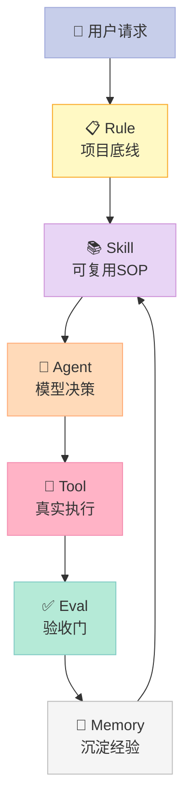
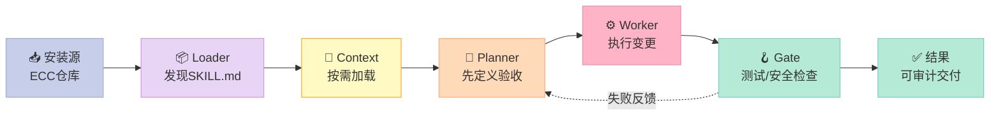

> **核心结论：ECC 的价值不在于“给模型更多提示词”，而在于把工程经验变成可安装、可验证、可迭代的运行时协议。**

## 引子：为什么 Agent 会“会写代码，却交付不了”

一个模型可能第一次就写出能运行的函数，却在第二次修改时破坏测试、忘记项目约定，甚至把同一套插件安装两遍。问题通常不在生成能力，而在**缺少包裹模型的工程外壳（Harness）**：没有明确的规则、没有可复现的 Skill、没有硬性的验证关卡。

ECC（Everything Claude Code）截至 2026-08-11 在 GitHub 上约 **239k ⭐**，README 明确给出 67 个 Agent、285 个 Skill、94 个旧式命令，并支持 Claude Code、Codex 等多种 Harness。它很适合用来观察 Skill 组件如何从“文档”升级为“操作系统”。

本文只聚焦 ECC 的 **Skill 组件**，不重复此前对 Hook 总线、记忆系统或其他项目的完整展开。

## 一、ECC 在 Harness 六件套中的位置

六件套可理解为：Rule 定义底线，Skill 描述 SOP，Sub-Agent 划分上下文，Workflow 管接力，Script 做硬门禁，MCP 连接外部世界。ECC 的核心是 Skill，但它会把 Skill 接到 Rule、Hook、Eval 和 Memory 上，形成复合 Harness。



**关键判断**：Skill 是策略层，不应直接承担权限隔离和文件写入安全；Hook、沙箱、测试命令才是机制层。ECC 的安装器也提醒用户不要叠加安装方式，否则会产生重复 Skill、命令和配置——这是一个具体的“配置状态一致性”问题。

## 二、架构：把 Skill 从提示词变成包

ECC 的 Skill 采用目录协议：每个 Skill 至少有一个 `SKILL.md`，可带 `agents/openai.yaml` 和 `references/`。例如仓库的 `tdd-workflow` Skill 不是一段散文，而是一个有触发条件、步骤、代码模式和验证标准的 SOP。



### 2.1 机制与策略分离

- **机制**：目录发现、安装范围、Hook 触发、测试命令执行、报告落盘。这些事情需要软件可靠执行，不能只靠模型“记住”。
- **策略**：何时启用 TDD、覆盖率目标是多少、哪些文件先读、如何做安全审查。这些适合放在 Skill 中，并允许团队替换。
- **桥接协议**：`SKILL.md` 的 frontmatter 提供名称、描述和工具约束；正文提供人类与模型都能读取的步骤；`agents/openai.yaml` 提供跨 Harness 的适配信息。

这种切分符合 Less is More：模型可以学习命名和重构建议，但无法凭空保证“每次都运行回归测试”，也无法替代确定性的退出码、权限检查和版本化文件。

### 2.2 数据流：从请求到经验

以“添加认证功能”为例：请求进入后，Agent 选择 TDD Skill；Skill 先要求写用户旅程和能力评测，再执行 RED → GREEN → REFACTOR；代码测试器返回 PASS/FAIL；最终报告进入项目目录，后续会话可以复用。

ECC 的 eval-harness 明确把 `pass@1`、`pass@3` 和 `pass^3` 分开：前者衡量 k 次尝试至少成功一次，后者衡量连续稳定成功。这个区别把“偶尔成功”和“工程可靠”区分开了。

## 三、核心机制一：Skill 是可组合的上下文协议

一个可迁移 Skill 的最小结构如下。下面代码不依赖 ECC，可直接运行，用来演示真实的 Skill 加载与工具白名单校验：

```python
from pathlib import Path
import re


def load_skill(path: str, allowed_tools: set[str]) -> dict:
    text = Path(path).read_text(encoding="utf-8")
    if not text.startswith("---\n"):
        raise ValueError("missing frontmatter")
    _, frontmatter, body = text.split("---", 2)
    metadata = {}
    for line in frontmatter.splitlines():
        if ":" in line:
            key, value = line.split(":", 1)
            metadata[key.strip()] = value.strip()
    declared = {x.strip() for x in metadata.get("allowed-tools", "").split(",") if x.strip()}
    forbidden = declared - allowed_tools
    if forbidden:
        raise PermissionError(f"tools not allowed: {sorted(forbidden)}")
    return {"metadata": metadata, "body": body.strip()}


if __name__ == "__main__":
    p = Path("demo-skill.md")
    p.write_text("---\nname: demo\nallowed-tools: Read, Bash\n---\n# Run tests\n", encoding="utf-8")
    skill = load_skill("demo-skill.md", {"Read", "Write", "Bash"})
    print(skill["metadata"]["name"], skill["body"])
    p.unlink()
```

这段代码展示一个重要边界：**Skill 可以声明需要什么，但宿主 Harness 决定实际允许什么**。如果把权限判断也交给模型，Skill 就从 SOP 变成了不可审计的自然语言承诺。

## 四、核心机制二：把 Eval 变成硬关卡

ECC 的 eval-harness 建议优先使用代码型 Grader，因为确定性检查比模型评审更稳定。下面是一个可执行的最小评测器：

```python
from pathlib import Path
import subprocess


def run_eval(command: list[str], expected_file: str) -> bool:
    result = subprocess.run(command, text=True, capture_output=True)
    exists = Path(expected_file).exists()
    passed = result.returncode == 0 and exists
    print(f"returncode={result.returncode}, artifact_exists={exists}")
    print("PASS" if passed else "FAIL")
    if result.stdout:
        print(result.stdout[-500:])
    if result.stderr:
        print(result.stderr[-500:])
    return passed


if __name__ == "__main__":
    Path("eval-artifact.txt").write_text("ok", encoding="utf-8")
    assert run_eval(["python", "-c", "print('build complete')"], "eval-artifact.txt")
    Path("eval-artifact.txt").unlink()
```

生产环境可将 `expected_file` 换成测试报告、构建产物或数据库迁移标记。**重点不是报告长短，而是把“完成”定义成机器可检查的事实。**

## 五、ECC 的设计哲学

### 5.1 面向进化，而不是一次性提示

ECC 把“计划、测试、实现、审查、验证、记忆、改进”串成循环。Skill 文件可以版本化，评测可以回归，Hook 可以在会话边界采集摘要。这样，团队积累的是可 diff 的工程资产，而不是某位专家脑中的隐性经验。

### 5.2 跨 Harness，但不假装完全等价

README 明确写出 Claude Code 是当前最佳支持路径，Codex 有同步路径，其他编辑器属于能力受限适配。这种“承认能力矩阵”的做法比宣称全平台一致更可靠：不同宿主对 Hook、权限和生命周期的支持不同，Skill 只能提供共同协议，不能抹平运行时差异。

### 5.3 Bitter Lesson：保留可验证的通用结构

ECC 有大量领域 Skill，但它没有把每个任务都硬编码成一条巨型决策树。更有生命力的部分是：文件协议、测试门、报告格式、安装边界和可替换工具。模型能力提升后，具体提示可能过时；**可执行的验证与状态管理仍然有价值**。

## 六、横向对比：ECC、Superpowers 与 wshobson/agents

| 维度 | ECC | Superpowers | wshobson/agents |
|---|---|---|---|
| 核心抽象 | 全套工程操作系统：Skill + Hook + Eval + Memory | 以软件开发流程为中心的 Skill 组合 | 多 Harness 插件/Skill 市场 |
| 协议设计 | 目录、frontmatter、命令、生命周期事件共同组成协议 | 更强调流程顺序与角色协作 | 更强调跨工具分发与安装 |
| 可靠性来源 | 代码 Grader、TDD、回归评测、权限边界 | 约束式开发流程与上下文切换 | 生态规模和可发现性 |
| 适合场景 | 团队想建立长期工程闭环 | 想快速复制成熟开发习惯 | 想寻找并安装某个专用能力 |
| 主要代价 | 组件多，安装和版本管理复杂 | 领域偏窄，扩展需遵守既有流程 | 质量和兼容性取决于插件作者 |

设计差异在于：Superpowers 把 Harness 看作“开发流程教练”，wshobson/agents 把它看作“插件分发层”，ECC 则试图把两者和持续评测、记忆沉淀放进同一个操作系统。ECC 的优势是闭环完整，风险是**表面积太大**：67 个 Agent 和 285 个 Skill 并不等于每个项目都应该全部启用。

## 七、优缺点：左边好用，右边要付账

| 架构简洁性 / 扩展性 / 易用性 | 性能 / 复杂度 / 维护性 |
|---|---|
| Skill 目录协议清楚，新增能力只需添加目录 | 每次加载更多上下文会增加 token 与延迟 |
| 适配多个 Harness，迁移成本低于重写整套提示 | 各宿主 Hook 能力不一致，跨平台只能做能力降级 |
| TDD 与 Eval 模板降低新团队上手门槛 | 285 个 Skill 带来发现、冲突、版本漂移问题 |
| 代码 Grader 结果明确，失败可回放 | 模型 Grader 仍有主观性，不能替代安全人工审查 |
| MIT 开源，可按项目裁剪 | 维护者需要持续同步多个宿主和安装通道 |

我的结论是：**ECC 适合“选择性安装”，不适合“全量堆叠”。** 一个后端项目先启用 `tdd-workflow`、`security-review` 和 `verification-loop`，通常比一次装完所有 Skill 更容易获得稳定收益。

## 八、从零复刻：一个下午做出最小 Harness

MVP 只需要四个部件：

1. `skills/<name>/SKILL.md`：定义触发条件和步骤；
2. `loader.py`：按任务关键词加载 Skill，并校验工具白名单；
3. `gate.py`：执行测试、构建和产物检查；
4. `runs/`：保存输入、Skill 版本、命令、退出码和结果。

暂时可以省略：多模型评审、跨平台安装器、复杂记忆、插件市场。先让一次“修改—验证—失败回放”闭环跑通。

### 踩坑预警

- **重复安装**：同一 Harness 同时走插件和手动复制，会出现重复命令与 Hook；
- **权限幻觉**：Skill 写了 `Bash` 不代表宿主真的允许执行 Bash；
- **上下文膨胀**：不要把所有 Skill 全部注入每一轮；
- **假绿色**：只检查模型说“完成”不够，必须检查退出码和产物；
- **能力错配**：Claude Code 支持的生命周期事件，另一个编辑器可能没有，发布前要做能力矩阵。

## 九、总结：Skill 的终点不是更多文件，而是更少返工

ECC 给 Harness Engineering 的启示很直接：把稳定性放在模型之外。模型负责提出方案，Skill 负责给出流程，Script/Hook 负责执行边界，Eval 负责判断事实，Memory 负责让下一次少走弯路。

如果你正在搭建自己的 Agent，今天就做三件事：**选一个高频任务写成 SKILL.md；为它定义一个可执行 Grader；把一次失败保存成回归样例。** 三步完成后，你才真正拥有了一个会进化的 Harness，而不只是一个更长的系统提示词。

---

**资料来源**

- [ECC GitHub 仓库](https://github.com/affaan-m/ECC)（README、`.agents/skills/`、`eval-harness`、`tdd-workflow`，访问日期：2026-08-11）
- [ECC 中文 README](https://github.com/affaan-m/ECC/blob/main/README.zh-CN.md)
- [wshobson/agents](https://github.com/wshobson/agents)
- [obra/superpowers](https://github.com/obra/superpowers)
