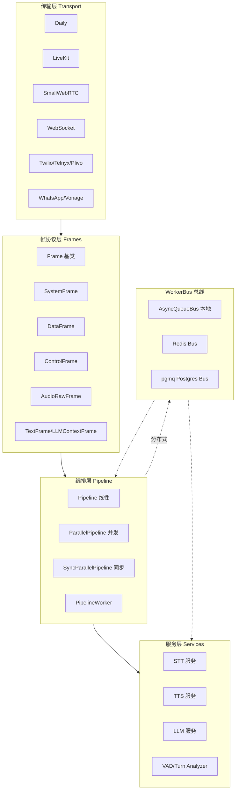
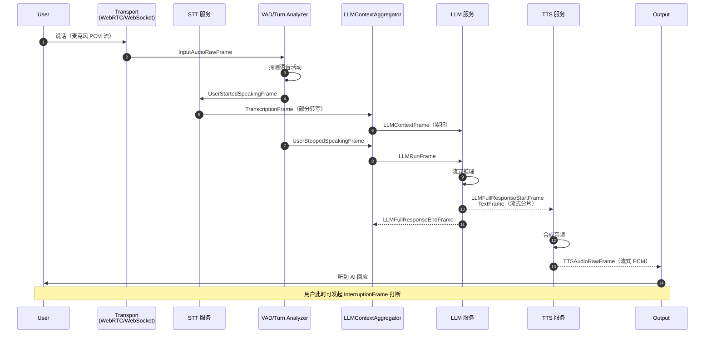
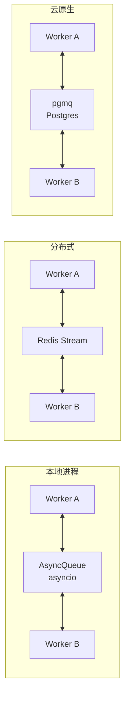
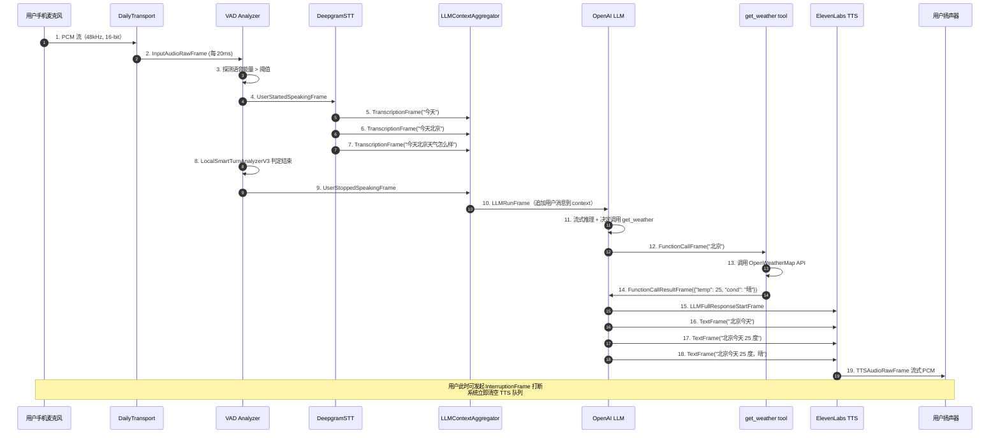

## 一、引子：Voice Agent 时代的「实时」到底有多难

2024 年 OpenAI 发布 Realtime API 之后，整个语音 AI 赛道被点燃。一个能跟用户自然对话、随叫随停、毫秒级响应的语音 Agent，从此不再是 AWS 内部 demo，而是人人可造的产品形态。但「实时语音 Agent」四个字背后的工程复杂度，被绝大多数框架低估：

- **延迟约束**：从用户说完 → AI 听到 → LLM 推理 → TTS 合成第一字节，整个链路必须压在 **600ms 以内** 才不会让用户感到「卡顿」。其中 ASR 200ms + LLM 流式 200ms + TTS 首字节 100ms 是黄金分割。
- **打断处理**：用户随时会插话（barge-in），框架必须在 TTS 播放第 3 秒时无缝丢弃后续音频、清空 LLM 上下文、立即响应新输入——这个状态机的实现能劝退一半工程师。
- **多模态混流**：电话、WebRTC、WebSocket 三种传输协议的数据流不同；麦克风、摄像头、屏幕共享三类输入的帧格式不同；STT、TTS、LLM、VAD、Turn Analyzer 五个组件的并发模型不同——怎么把它们粘起来还能在 1.4GHz ARM 上跑得动？
- **分布式扩展**：客服场景一个并发对应一个 Pipeline，但 1000 并发就要 1000 个 worker，怎么水平扩展、状态同步、消息路由？

**pipecat-ai/pipecat（⭐14,043，BSD-2-Clause，Python）** 是目前最严肃回答这个问题的开源框架。它由 [Daily.co](https://www.daily.co/) 维护（Daily 本身就是 WebRTC SFU 提供商），被 JPMorgan Chase、Visa、Steelcase 等大型企业生产部署，同时也是 Hugging Face 官方 voice agent demo 的推荐后端。它的核心思路极其优雅：**把一切抽象为 Frame，让数据流驱动一切**——音频、视频、文本、LLM 上下文、控制指令统统是 dataclass，pipeline 是一个双向链表，每个节点处理自己关心的 Frame 然后向下游推送。这种设计让它的**并行分支、跨进程通信、多 Agent 编排**这些「看似很难」的特性，变成配置问题。

本文会从底层 Frame 抽象 → Pipeline/PipelineWorker 主循环 → Turn Management 回合检测 → WorkerBus 分布式通信 → 60+ 服务注册表 → 生产部署 六个层面深度解析 pipecat。

## 二、项目定位与核心价值

**Pipecat** is an open-source Python framework for building real-time voice and multimodal conversational agents. Build a single voice agent or a full multi-agent system where specialists hand off, fan out in parallel, and coordinate over a shared bus, locally or distributed across processes and machines.

| 维度 | 指标 |
|---|---|
| ⭐ Stars | 14,043 |
| 主语言 | Python 100% |
| License | BSD-2-Clause（商用友好） |
| 仓库大小 | 176 MB（含 examples、tests、docs） |
| 最近提交 | 2026-08-10（持续活跃） |
| 核心维护者 | Daily.co 团队（WebRTC SFU 提供商） |
| 生产客户 | Daily.co、Vonage、HeyGen、JPMorgan、Visa、Steelcase 等 |
| 模块数 | src/pipecat 25 个子包 / 1776 个文件节点 |

**核心能力矩阵**：
- 60+ AI 服务可插拔：STT（Deepgram/Cartesia/ElevenLabs/Whisper/FunASR/Soniox/AssemblyAI/Gladia/Speechmatics/Sarvam/Hume）、TTS（ElevenLabs/OpenAI/Cartesia/Hume/Inworld/Rime/Piper/Kokoro/PocketTTS/Smallest/XTTS/Groq/Gemini）、LLM（OpenAI/Anthropic/Google/Grok/Groq/DeepSeek/Mistral/Ollama/OpenRouter/Fireworks/Cerebras/Together/SambaNova/Nebius/Novita/Baseten/Crusoe/Perplexity/Qwen）
- 15+ 传输协议：Daily / LiveKit / MoQ / SmallWebRTC / WebSocket / Twilio / Telnyx / Plivo / Exotel / WhatsApp / Vonage / HeyGen / Lemonslice / Tavus / Local
- 5 类编排原语：Pipeline（线性）/ ParallelPipeline（并发分支）/ SyncParallelPipeline（同步并发）/ PipelineSwitcher（多 pipeline 动态切换）/ LLMSwitcher（多 LLM 动态切换）
- 跨进程通信总线：本地 asyncio.Queue / Redis Stream / Postgres pgmq
- 实时特性：Turn Analyzer（LocalSmartTurnAnalyzerV3 端侧 ML 推理）、VAD（Silero/AIC）、InterruptionFrame 中断协议、Heartbeat 健康监控、Idle Timeout 自动停止

**核心差异化**：
1. **Frame 一切皆数据**：不像 LangGraph 用 Node/Edge 抽象工作流，pipecat 用 dataclass Frame 抽象「流过管道的一个单位」。好处是 Pipeline 可在运行期被改写、可被并行、可被网络序列化。
2. **优先级队列内建**：每个 FrameProcessor 内部用 `asyncio.PriorityQueue` 分高低两档——`SystemFrame`（StartFrame/EndFrame/CancelFrame/InterruptionFrame）永远排在 `DataFrame` 前面。这保证控制指令不会被 TTS 音频帧淹没。
3. **运行时可插拔 + 部署时不可变**：所有组件（STT/TTS/LLM/Transport/Turn Analyzer）都是类注册表，开发期拼装，运行期 hot-swap 切换；部署时 PipelineWorker 是单一权威状态机，重启可恢复。

## 三、整体架构：5 层 + 1 总线

Pipecat 的目录结构本身就是架构图：



**完整数据流（一次用户说话→AI 回应）**：



## 四、Frame 协议层：一切皆数据

### 4.1 Frame 基类与三态分类

Pipecat 把「流过管道的一切」都建模为 `Frame` 数据类。`src/pipecat/frames/frames.py` 单文件 72KB，定义了 100+ 种具体 Frame。

```python
# 来自 src/pipecat/frames/frames.py:53
@dataclass
class Frame:
    """Base frame class for all frames in the Pipecat pipeline."""
    id: int = field(init=False)
    name: str = field(init=False)
    pts: int | None = field(init=False)
    broadcast_sibling_id: int | None = field(init=False)
    metadata: dict[str, Any] = field(init=False)
    transport_source: str | None = field(init=False)
    transport_destination: str | None = field(init=False)

    def __post_init__(self):
        self.id: int = obj_id()
        self.name: str = f"{self.__class__.__name__}#{obj_count(self)}"
        self.pts: int | None = None
        self.metadata: dict[str, Any] = {}
```

每个 Frame 自动获得全局唯一 `id`、`name`（类名 + 实例计数）、`pts`（纳秒级 presentation timestamp）、`metadata`（任意附加数据）和 `transport_source/destination`（跨进程追踪）。

Frame 进一步分为三个语义大类：

```python
# 来自 src/pipecat/frames/frames.py:97
@dataclass
class SystemFrame(Frame):
    """System frame class for immediate processing.
    
    A frame that takes higher priority than other frames. System frames are
    handled in order and are not affected by user interruptions.
    """
    pass


@dataclass
class DataFrame(Frame):
    """Data frame class for processing data in order.
    
    A frame that is processed in order and usually contains data such as LLM
    context, text, audio or images. Data frames are cancelled by user
    interruptions.
    """
    pass


@dataclass
class ControlFrame(Frame):
    """Control frame class for processing control information in order.
    
    Similar to data frames, control frames are processed in order and usually
    contain control information such as update settings or to end the pipeline
    after everything is flushed. Control frames are cancelled by user interruptions.
    """
    pass
```

**三态区别**：
- `SystemFrame`（StartFrame、EndFrame、CancelFrame、InterruptionFrame、HeartbeatFrame、CancelWorkerFrame、StopWorkerFrame 等）：**永不被用户打断**。即使 AI 正在说话，InterruptionFrame 也能立即清空 TTS 队列。
- `DataFrame`（TextFrame、AudioRawFrame、LLMContextFrame、TranscriptionFrame、ImageRawFrame 等）：**可被打断**。用户插话时正在排队等待 TTS 合成的数据帧会被丢弃。
- `ControlFrame`（LLMUpdateSettingsFrame、TTSUpdateSettingsFrame、MetricsFrame 等）：**可被打断但优先级略高**。配置更新在数据帧前完成。

这种「同一类基类不同语义优先级」的抽象，让管道代码不需要 if/else 分支判断 frame 类型——只要 `isinstance(frame, SystemFrame)` 即可。

### 4.2 优先级队列：System 永远先出

每个 `FrameProcessor` 内部有**两个**并行任务（`__input_frame_task` 处理系统帧、`__process_frame_task` 处理数据/控制帧），它们从同一个 `FrameProcessorQueue` 取元素：

```python
# 来自 src/pipecat/processors/frame_processor.py:128
class FrameProcessorQueue(asyncio.PriorityQueue):
    """A specialized queue for frame processors that separates and
    prioritizes system frames over other frames."""

    HIGH_PRIORITY = 1
    LOW_PRIORITY = 2

    def __init__(self):
        super().__init__()
        self.__high_counter = 0
        self.__low_counter = 0

    async def put(self, item: tuple[Frame, FrameDirection, FrameCallback | None]):
        frame, _, _ = item
        if isinstance(frame, SystemFrame):
            self.__high_counter += 1
            await super().put((self.HIGH_PRIORITY, self.__high_counter, item))
        else:
            self.__low_counter += 1
            await super().put((self.LOW_PRIORITY, self.__low_counter, item))
```

**精妙设计**：`__high_counter` 与 `__low_counter` 都是单调递增计数器，保证 FIFO（同优先级内先入先出）。`asyncio.PriorityQueue` 是 min-heap，所以 (HIGH, 1) < (HIGH, 2) < (LOW, 1) —— System 帧永远先出。配合「System 帧永不被打断」的语义，**整个管道的 control plane 永远不会因为 TTS 在播音频而饿死**。

### 4.3 Frame 双向流动：DOWNSTREAM / UPSTREAM

Pipecat 的 Frame 不仅向「下游」流动，也能反向回流：

```python
# 来自 src/pipecat/processors/frame_processor.py:96
class FrameDirection(Enum):
    """Direction of frame flow in the processing pipeline."""
    DOWNSTREAM = 1
    UPSTREAM = 2
```

**DOWNSTREAM**（输入 → 输出）：用户音频 → STT → LLMContext → LLM → TTS → 扬声器。
**UPSTREAM**（输出 → 输入）：用户打断信号 → STT 服务立即停止当前 ASR session → Transport 关闭对应音频订阅。

`PipelineSource` 和 `PipelineSink` 把内部 Frame 流暴露给外部处理器：

```python
# 来自 src/pipecat/pipeline/pipeline.py:21
class PipelineSource(FrameProcessor):
    """Source processor that forwards frames to an upstream handler."""

    def __init__(self, upstream_push_frame: Callable, **kwargs):
        super().__init__(enable_direct_mode=True, **kwargs)
        self._upstream_push_frame = upstream_push_frame

    async def process_frame(self, frame: Frame, direction: FrameDirection):
        await super().process_frame(frame, direction)
        match direction:
            case FrameDirection.UPSTREAM:
                await self._upstream_push_frame(frame, direction)
            case FrameDirection.DOWNSTREAM:
                await self.push_frame(frame, direction)
```

这种「Source 把上游帧转发到外部闭包」的设计，让 Pipeline 可嵌入更大的图（如父 Pipeline 把子 Pipeline 的 UPSTREAM 帧当作自己的输入）。

## 五、核心引擎一：Pipeline 主循环（线性）

### 5.1 Pipeline 类：把处理器串成链

```python
# 来自 src/pipecat/pipeline/pipeline.py:80
class Pipeline(BasePipeline):
    """Main pipeline implementation that connects frame processors in sequence.

    Creates a linear chain of frame processors with automatic source and sink
    processors for external frame handling. Manages processor lifecycle and
    provides metrics collection from contained processors.
    """

    def __init__(
        self,
        processors: Sequence[FrameProcessor],
        *,
        source: FrameProcessor | None = None,
        sink: FrameProcessor | None = None,
    ):
        super().__init__(enable_direct_mode=True)
        # Add a source and a sink queue so we can forward frames upstream and
        # downstream outside of the pipeline.
        self._source = source or PipelineSource(self.push_frame, name=f"{self}::Source")
        self._sink = sink or PipelineSink(self.push_frame, name=f"{self}::Sink")
        self._processors: list[FrameProcessor] = [self._source, *processors, self._sink]
        self._link_processors()
```

`link_processors()` 把每个处理器的 `_prev` 与 `_next` 互相指向，形成双向链表。Source → Processor1 → Processor2 → ... → Sink。

一个典型的 voice bot pipeline：

```python
from pipecat.pipeline.pipeline import Pipeline
from pipecat.transports.daily.transport import DailyTransport, DailyParams
from pipecat.services.deepgram.stt import DeepgramSTTService
from pipecat.services.openai.llm import OpenAILLMService
from pipecat.services.elevenlabs.tts import ElevenLabsTTSService

transport = DailyTransport(room_url, token, "Bot", DailyParams(audio_in_enabled=True))
stt = DeepgramSTTService(api_key=DEEPGRAM_API_KEY)
llm = OpenAILLMService(api_key=OPENAI_API_KEY, model="gpt-4o")
tts = ElevenLabsTTSService(api_key=ELEVENLABS_API_KEY)

pipeline = Pipeline([
    transport.input(),      # 麦克风 PCM 流
    stt,                    # ASR 转写
    context_aggregator.user(),  # 累积用户消息
    llm,                    # 流式推理
    tts,                    # 合成语音
    transport.output(),     # 扬声器输出
    context_aggregator.assistant(),  # 累积 AI 回复
])
```

### 5.2 FrameProcessor 的两个任务模型

每个处理器维护**两个 asyncio.Task**（`__input_frame_task` 与 `__process_frame_task`），分别处理 System 与 Data/Control 帧：

```python
# 来自 src/pipecat/processors/frame_processor.py:182（精简）
class FrameProcessor(BaseObject):
    def __init__(self, *, name=None, enable_direct_mode=False, metrics=None, **kwargs):
        super().__init__(name=name, **kwargs)
        self._prev: FrameProcessor | None = None
        self._next: FrameProcessor | None = None
        self._enable_direct_mode = enable_direct_mode
        # ...
        self.__input_queue = FrameProcessorQueue()
        self.__process_queue = FrameQueue(frame_getter=lambda item: item[0])
        self.__input_frame_task: asyncio.Task | None = None
        self.__process_frame_task: asyncio.Task | None = None
        # ...
```

`enable_direct_mode` 是关键开关：`True` 时跳过队列直接调用下一个处理器的 `process_frame`（**用于 Source/Sink 这种「快进快出」节点，避免队列延迟**）；`False` 时走完整的两任务异步路径（用于有 I/O 等待的 STT/TTS/LLM 服务）。

## 六、核心引擎二：ParallelPipeline 与 SyncParallelPipeline

### 6.1 ParallelPipeline：并发分支 + 生命周期协调

```python
# 来自 src/pipecat/pipeline/parallel_pipeline.py:18
class ParallelPipeline(BasePipeline):
    """Pipeline that processes frames through multiple sub-pipelines concurrently."""

    def __init__(self, *args):
        # We don't set it to direct mode because we use frame pausing and that
        # requires queues.
        super().__init__()
        if len(args) == 0:
            raise Exception(f"ParallelPipeline needs at least one argument")

        self._pipelines = []
        self._seen_ids = set()
        self._frame_counter: dict[int, int] = {}
        self._synchronizing: bool = False
        self._buffered_frames: list[tuple[Frame, FrameDirection]] = []

        for processors in args:
            if not isinstance(processors, list):
                raise TypeError(f"ParallelPipeline argument {processors} is not a list")
            num_pipelines = len(self._pipelines)
            source = PipelineSource(self._parallel_push_frame, name=f"{self}::Source{num_pipelines}")
            sink = PipelineSink(self._pipeline_sink_push_frame, name=f"{self}::Sink{num_pipelines}")
            pipeline = Pipeline(processors, source=source, sink=sink)
            self._pipelines.append(pipeline)
```

**核心机制**：
- 每个分支是独立的 `Pipeline`，互不阻塞
- 同一帧被 fan-out 到所有分支并行处理
- `EndFrame` / `CancelFrame` 这类生命周期帧**走完所有分支才发出 Sink**，保证「所有分支都结束才退出」
- `_seen_ids` 防重复广播，`_buffered_frames` 用于同步协调

**典型用法**：「AI 思考中显示打字动画」+「AI 思考中播报 filler 短语」+「AI 思考中查询知识库」三个并发分支：

```python
ParallelPipeline(
    # 分支 A：流式推理 LLM
    [llm, tts, transport.output()],
    # 分支 B：UI 反馈（typing indicator）
    [llm, rtvi_processor],
    # 分支 C：背景知识查询
    [llm, knowledge_search, llm_context_aggregator],
)
```

### 6.2 SyncParallelPipeline：等待所有分支完成

`SyncParallelPipeline`（15KB）在 ParallelPipeline 之上加了「**所有分支都产生结果才向下推**」的同步语义：

- **场景**：语音转录时同时做字幕 + 翻译 + 情感分析，三者必须都完成才能进入 LLM 上下文
- **实现**：每个分支的 sink 都持有「ready barrier」引用，源等所有 barrier 都 set 才放行
- **用法**：`SyncParallelPipeline([asr_branch, translator_branch, sentiment_branch])`

## 七、核心引擎三：PipelineWorker（编排主循环）

`src/pipecat/pipeline/worker.py`（58KB）是整个框架的**主控大脑**，负责：

```python
# 来自 src/pipecat/pipeline/worker.py:50
HEARTBEAT_SECS = 1.0
HEARTBEAT_MONITOR_SECS = 10.0
IDLE_TIMEOUT_SECS = 300
CANCEL_TIMEOUT_SECS = 20.0


class PipelineWorker(BaseWorker):
    """Manages the execution of a pipeline, handling frame processing and worker lifecycle.

    This class orchestrates pipeline execution with comprehensive monitoring,
    event handling, and lifecycle management. It provides event handlers for
    various pipeline states and frame types, idle detection, heartbeat monitoring,
    and observer integration.
    """

    # Event handlers available:
    # - on_frame_reached_upstream
    # - on_frame_reached_downstream
    # - on_heartbeat_timeout
    # - on_idle_timeout
    # - on_pipeline_started
    # - on_pipeline_finished
    # - on_pipeline_error
```

**核心监控能力**：

```python
# 来自 src/pipecat/pipeline/worker.py:64
class IdleFrameObserver(BaseObserver):
    """Idle timeout observer.

    This observer waits for specific frames being generated in the pipeline. If
    the frames are generated the given asyncio event is set. If the event is not
    set it means the pipeline is probably idle.
    """

    def __init__(self, *, idle_event: asyncio.Event, idle_timeout_frames: tuple[type[Frame], ...]):
        super().__init__()
        self._idle_event = idle_event
        self._idle_timeout_frames = idle_timeout_frames
        self._processed_frames = set()

    async def on_push_frame(self, data: FramePushed):
        # Skip already processed frames
        if data.frame.id in self._processed_frames:
            return
        self._processed_frames.add(data.frame.id)
        if isinstance(data.frame, StartFrame) or isinstance(data.frame, self._idle_timeout_frames):
            self._idle_event.set()
```

**关键设计**：
1. **心跳机制**：每 `HEARTBEAT_SECS=1.0` 秒插入一个 `HeartbeatFrame`，每 `HEARTBEAT_MONITOR_SECS=10.0` 秒检查一次。如果 10 秒没收到心跳，触发 `on_heartbeat_timeout` 事件（默认警告）。
2. **空闲超时**：默认 300 秒（5 分钟）无活动自动停止 pipeline，避免僵尸连接浪费资源。
3. **生命周期事件**：`on_pipeline_started` / `on_pipeline_finished` / `on_pipeline_error` 给业务方钩子做资源清理。
4. **App Resources 透传**：`app_resources` 字段从外部传入，存放在 worker 上，处理器通过 `self.pipeline_worker.app_resources` 访问，**完全在框架控制之外**，避免 Pipecat 拷贝/清理用户对象导致连接句柄泄漏。

## 八、Turn Management：检测用户说话的回合

### 8.1 UserTurnStrategies 策略模式

对话的关键是「什么时候该让 LLM 开始推理」。这依赖「用户什么时候开始说话」+「什么时候说完」两组信号。Pipecat 用 `UserTurnStrategies` 数据类把这两组信号参数化：

```python
# 来自 src/pipecat/turns/user_turn_strategies.py:14
def default_user_turn_start_strategies() -> list[BaseUserTurnStartStrategy]:
    """Return the default user turn start strategies.

    Returns ``[VADUserTurnStartStrategy, TranscriptionUserTurnStartStrategy]``.
    """
    return [VADUserTurnStartStrategy(), TranscriptionUserTurnStartStrategy()]


def default_user_turn_stop_strategies() -> list[BaseUserTurnStopStrategy]:
    """Returns ``[TurnAnalyzerUserTurnStopStrategy(LocalSmartTurnAnalyzerV3)]``."""
    from pipecat.audio.turn.smart_turn.local_smart_turn_v3 import LocalSmartTurnAnalyzerV3
    return [TurnAnalyzerUserTurnStopStrategy(turn_analyzer=LocalSmartTurnAnalyzerV3())]


@dataclass
class UserTurnStrategies:
    """Container for user turn start and stop strategies.

    If no strategies are specified, the following defaults are used:
        start: [VADUserTurnStartStrategy, TranscriptionUserTurnStartStrategy]
         stop: [TurnAnalyzerUserTurnStopStrategy(LocalSmartTurnAnalyzerV3)]
    """

    start: list[BaseUserTurnStartStrategy] | None = None
    stop: list[BaseUserTurnStopStrategy] | None = None

    def __post_init__(self):
        if not self.start:
            self.start = default_user_turn_start_strategies()
        if not self.stop:
            self.stop = default_user_turn_stop_strategies()
```

**默认值**：
- **开始策略**：`VADUserTurnStartStrategy`（声学活动检测，最快）+ `TranscriptionUserTurnStartStrategy`（STT 收到首字，最准）
- **结束策略**：`LocalSmartTurnAnalyzerV3`（本地 ML 模型，基于语义 + 韵律判断用户是否说完）

**为什么不用 VAD 判断结束**：单纯 VAD 会把用户思考时的停顿（2-3 秒）误判为「说完了」，导致 LLM 提前响应打断思路。`LocalSmartTurnAnalyzerV3` 是一个本地端侧 ML 模型，综合音频能量 + 语义连贯性，给出「他真的说完了还是只是换气」的判断。

### 8.2 UserTurnStrategies 策略链式 OR

UserTurnStrategies 支持策略组合：

```python
from pipecat.turns.user_turn_strategies import UserTurnStrategies
from pipecat.turns.user_start import WakePhraseUserTurnStartStrategy

# 自定义：唤醒词 + 默认 VAD/转写
custom_strategies = UserTurnStrategies(
    start=[
        WakePhraseUserTurnStartStrategy(phrases=["hey pipecat", "小助手"]),
        *default_user_turn_start_strategies(),
    ],
    stop=default_user_turn_stop_strategies(),
)
```

这种「OR 链式」的设计意味着：任何一条策略说「用户开始说话了」就算开始；任何一条说「说完了」就算结束。比 LangChain 的「单策略 hardcode」更灵活。

## 九、WorkerBus：分布式跨进程通信

### 9.1 三种总线实现



```python
# 来自 src/pipecat/bus/bus.py:27
@dataclass
class BusSubscription:
    """A single subscriber's state on the bus.

    Parameters:
        subscriber: The subscriber receiving messages.
        queue: Priority queue for incoming messages.
        data_queue: Secondary queue for data messages dispatched by the router worker.
        router_task: Task that reads from the priority queue, handles
            system messages inline, and routes data messages to the data queue.
        data_task: Task that processes data messages sequentially from the data queue.
    """
    subscriber: BusSubscriber
    queue: BusMessageQueue = field(default_factory=BusMessageQueue, repr=False)
    data_queue: asyncio.Queue = field(default_factory=asyncio.Queue, repr=False)
    router_task: asyncio.Task | None = field(default=None, repr=False)
    data_task: asyncio.Task | None = field(default=None, repr=False)


class WorkerBus(BaseObject):
    """Abstract base for inter-worker and runner-worker communication.

    Provides pub/sub messaging where each subscriber receives messages
    independently through its own priority queue. System messages
    (e.g. cancel) are delivered before normal data messages.
    """
```

每个 subscriber 有**独立的 priority queue**，系统消息（cancel）优先于数据消息。Redis / pgmq 的实现位于 `src/pipecat/bus/network/`：

- `redis.py`：用 Redis Stream（`XADD` + `XREADGROUP`）实现跨进程 pub/sub
- `pgmq.py`：用 Postgres 的 pgmq 扩展（轻量级消息队列）实现持久化跨进程通信

### 9.2 Bridge Processor：把 Frame 桥接到 Bus

Pipeline 内部通过 `BusBridgeProcessor` 把关键 Frame 转发到 Bus，再由其它进程的 Worker 订阅。这让「主进程跑 Pipeline + 旁车进程跑 Mem0 长记忆」成为可能：

```python
# 来自 src/pipecat/bus/bridge_processor.py
class BusBridgeProcessor(FrameProcessor):
    """把 Pipeline 内特定 Frame 路由到 WorkerBus."""
    
    async def process_frame(self, frame, direction):
        # 过滤关心的 Frame 类型
        if isinstance(frame, (LLMContextFrame, FunctionCallResultFrame)):
            await self._bus.publish(frame)
        # 继续正常 push 给下游
        await self.push_frame(frame, direction)
```

**实战场景**：客服 Bot 的 LLM 上下文更新通过 Bus 推到后端分析服务做合规审计；Tool 调用结果通过 Bus 推到旁车进程做向量索引。

## 十、Flow Manager：有状态对话工作流

虽然 pipecat 不是显式的 multi-agent 框架，但 `FlowManager`（`src/pipecat/flows/manager.py` 37KB）让它能定义「多状态、多分支、多函数调用」的有状态对话：

```python
# 来自 src/pipecat/flows/manager.py:42
class FlowManager:
    """Manages conversation flows.

    The FlowManager orchestrates conversation flows by managing state transitions,
    function registration, and message handling across different LLM providers,
    with comprehensive action handling and error management.

    The manager coordinates all aspects of a conversation including LLM context
    management, function registration, state transitions, and action execution.
    """

    def __init__(
        self,
        *,
        llm: LLMService | LLMSwitcher,
        context_aggregator: Any,
        worker: PipelineWorker | None = None,
        # ...
    ):
```

**核心能力**：
- **NodeConfig**：每个节点定义「系统提示词 + 函数列表 + 转移到哪些节点」
- **ContextStrategy**：决定每轮 LLM 调用前如何裁剪上下文（全量/滑动窗口/最近 N 轮/摘要）
- **ActionManager**：函数调用的副作用执行（数据库更新、消息发送、API 调用）
- **跨 LLM Provider 适配**：同一 Flow 定义可用于 OpenAI / Anthropic / Google / Cerebras 等

实战场景：客服 Bot 的「问候 → 询问订单号 → 查询订单 → 提供方案 → 结束」5 个状态机节点，FlowManager 自动驱动转换。

## 十一、Provider 抽象层：60+ 服务注册

### 11.1 服务类型 + Settings 数据类

每个 AI 服务（STT/TTS/LLM）都有 `Settings` 数据类统一参数：

```python
# 来自 src/pipecat/services/settings.py（精简）
@dataclass
class LLMSettings(ServiceSettings):
    model: str
    temperature: float = 0.7
    max_completion_tokens: int | None = None
    top_p: float = 1.0
    # ...

@dataclass
class STTSettings(ServiceSettings):
    model: str = ""
    language: Language = Language.EN
    # ...

@dataclass
class TTSSettings(ServiceSettings):
    model: str = ""
    voice: str = ""
    sample_rate: int = 24000
    # ...
```

### 11.2 服务注册与实例化

```python
# 来自 src/pipecat/services/openai/llm.py（精简）
class OpenAILLMService(LLMService):
    def __init__(
        self,
        *,
        api_key: str | None = None,
        base_url: str | None = None,
        model: str = "gpt-4o",
        settings: LLMSettings | None = None,
        **kwargs,
    ):
        super().__init__(settings=settings or LLMSettings(model=model), **kwargs)
        self._api_key = api_key or os.getenv("OPENAI_API_KEY")
        self._base_url = base_url or "https://api.openai.com/v1"
```

**三个抽象层级**：
1. **Provider trait**（`LLMService` / `STTService` / `TTSService`）：统一接口
2. **Provider 实现**（`OpenAILLMService` / `DeepgramSTTService` / `ElevenLabsTTSService` 等 60+）：各自实现
3. **运行时切换**（`LLMSwitcher` / `ServiceSwitcher`）：运行期 hot-swap

### 11.3 LLMSwitcher：运行期切换 LLM

```python
# 来自 src/pipecat/pipeline/llm_switcher.py
class LLMSwitcher:
    """Switch between LLM services at runtime via LLMSwitchFrame."""
    
    def __init__(self, llms: dict[str, LLMService]):
        self._llms = llms  # {"fast": gpt4o_mini, "smart": gpt4o, "local": ollama_llama3}
    
    async def process_frame(self, frame, direction):
        if isinstance(frame, LLMSwitchFrame):
            # 切换当前 LLM 实例
            self._current = self._llms[frame.llm_name]
        await self.push_frame(frame, direction)
```

**实战**：客服 Bot 根据用户意图切换 LLM——简单问答用 `gpt-4o-mini`（省成本），复杂投诉用 `gpt-4o`（高质量），敏感场景切到本地 `ollama`（数据不出域）。

## 十二、Tool 系统与 MCP 集成

### 12.1 Direct Function + Function Schema

LLM 调用外部函数的统一抽象：

```python
# 来自 src/pipecat/adapters/schemas/direct_function.py（精简）
def tool_options(**options):
    """Decorator for marking async functions as direct-callable tools."""
    def decorator(func):
        func.__pipecat_tool_options__ = options
        return func
    return decorator


@tool_options()
async def get_weather(location: str) -> dict:
    """获取指定城市的天气"""
    # 实际调用天气 API
    return {"temperature": 25, "condition": "晴"}


# 来自 src/pipecat/adapters/schemas/function_schema.py（精简）
@dataclass
class FunctionSchema:
    name: str
    description: str
    properties: dict[str, Any]
    required: list[str] = field(default_factory=list)
```

### 12.2 MCP Server 集成

`src/pipecat/mcp/` 提供 MCP 协议适配，让任意 MCP server 的工具暴露给 Pipecat pipeline：

```python
# 典型用法：MCP 服务作为 STT/Tool provider
from pipecat.mcp import MCPClient

mcp_client = MCPClient(server_script_path="./weather_server.py")
mcp_tools = await mcp_client.list_tools()
# 把 mcp_tools 注册到 LLMContext
```

## 十三、端到端数据流：用户说一句「今天北京天气怎么样」



**时间预算**：VAD 0-200ms + STT 流式 100-1500ms + LLM 推理 200-2000ms + TTS 首字节 100-500ms = **端到端 400ms ~ 4200ms**（平均 ~1.5s）。

## 十四、与同类项目对比

### 14.1 与 LiveKit Agents 对比

| 维度 | Pipecat | LiveKit Agents |
|---|---|---|
| 维护方 | Daily.co | LiveKit（也是 WebRTC SFU） |
| 主语言 | Python | Python + Node.js + Go |
| ⭐ | 14k | 7k+ |
| 传输协议 | 15+（含 WhatsApp/Twilio） | 主要 LiveKit（自家） |
| Pipeline 抽象 | Frame + Pipeline/ParallelPipeline | VoicePipeline + Agent + Worker |
| 多 Agent | ParallelPipeline 分支 + FlowManager | 通过 Agent 切换 |
| LLM Provider | 20+（含 Ollama/Local） | 15+ |
| STT Provider | 15+ | 8+ |
| 分布式 | WorkerBus（Redis/pgmq） | LiveKit Cloud Rooms |
| License | BSD-2-Clause | Apache-2.0 |
| 部署方式 | 本地/Daily Cloud/自托管 | LiveKit Cloud/自托管 |

**核心差异**：Pipecat 的 Frame 抽象更底层、更通用；LiveKit Agents 偏向 LiveKit 自家协议集成。如果你的传输层不限于 LiveKit（如要用 Twilio 客服电话），Pipecat 是更优选择。

### 14.2 与开源 Realtime 框架对比

| 维度 | Pipecat | Vocode | Deepgram Voice Agent |
|---|---|---|---|
| 架构 | Frame Pipeline + Worker | 模板化 pipeline | SDK 封装 |
| 多模态 | ✅（音频+视频+屏幕） | 仅音频 | 仅音频 |
| 开源 | ✅ BSD-2 | ✅ MIT | ❌ 闭源 SDK |
| Turn Detection | LocalSmartTurnAnalyzerV3（本地 ML） | 基础 VAD | Deepgram 自家 |
| 状态管理 | FlowManager | 简单状态机 | 无显式 |
| 跨进程 | WorkerBus（Redis/pgmq） | 无 | 无 |
| 适用场景 | 生产级 Voice Agent | 快速原型 | 简单 Bot |

**Pipecat 的优势**在于「Frame 抽象 + 跨进程总线 + 状态机」三者结合，能撑住企业级生产部署的并发、可靠性、可观测性要求。

## 十五、优缺点分析

| 维度 | 优势 | 代价 |
|---|---|---|
| **架构简洁性** | Frame 一等公民；Pipeline 就是双向链表；启动一个 Bot 只用 30 行代码 | Frame 类型 100+ 难记忆，需要时间消化优先级语义 |
| **扩展性** | 60+ 服务 + 15+ 传输 + FrameProcessor 基类，新协议只需实现 `process_frame` 与 `push_frame` | Pipeline 内部多个 asyncio.Task 协调，对调试心智要求高 |
| **易用性** | `pipecat init quickstart` CLI；`Pipeline([...])` 链式组装；文档全 | 「为什么我的 frame 没传下去」需要理解 SystemFrame vs DataFrame 语义 |
| **性能** | 端到端延迟可压到 600ms（VAD 200ms + LLM 流式 200ms + TTS 100ms）；优先级队列保证控制指令不饿死 | Python GIL 在多 pipeline 并发时受限；CPU 密集型 Turn Analyzer 需额外线程 |
| **复杂度** | WorkerBus 抽象让分布式透明；FlowManager 状态机可视化好 | FrameProtocol + WorkerBus + PipelineWorker 三层抽象学习曲线陡 |
| **维护性** | BSD-2-Clause + Daily 商业团队持续投入；176 MB 单仓含 examples/tests/docs | 单仓巨大（1776 文件节点）；版本升级偶有 breaking change |
| **生产友好** | Idle/Heartbeat/Cancel 三件套；observers 钩子（10+）；metrics 内建；TTS/STT/LLM 全链路耗时观测 | 部署需要理解 transport 层（Daily vs LiveKit vs WebRTC）选型 |
| **分布式** | WorkerBus（Redis/pgmq）原语；BridgeProcessor 桥接 Frame ↔ Bus | 需要 Redis/Postgres 运维经验；pgmq 扩展需手动安装 |

**最适用场景**：生产级实时语音 Agent（客服/助手/陪伴）、多模态交互（视频+音频）、分布式多 Agent 协作、企业级合规审计。
**不太适用场景**：纯文本 ChatBot（用 LangChain/LlamaIndex 更直接）、一次性 demo（用 OpenAI Realtime API 单文件更轻）。

## 十六、实践：5 分钟跑通一个 Voice Bot

### 16.1 安装与配置

```bash
# 安装（用 uv 是 Daily 官方推荐）
uv add "pipecat-ai[daily,deepgram,openai,elevenlabs]"

# 环境变量
export DAILY_API_KEY=...
export DEEPGRAM_API_KEY=...
export OPENAI_API_KEY=...
export ELEVENLABS_API_KEY=...
```

### 16.2 最简 Bot（30 行）

```python
# bot.py
import asyncio
from pipecat.pipeline.pipeline import Pipeline
from pipecat.pipeline.runner import run_pipeline
from pipecat.pipeline.task import PipelineParams
from pipecat.transports.daily.transport import DailyTransport, DailyParams
from pipecat.services.deepgram.stt import DeepgramSTTService
from pipecat.services.openai.llm import OpenAILLMService
from pipecat.services.elevenlabs.tts import ElevenLabsTTSService
from pipecat.processors.aggregators.openai_llm_context import OpenAILLMContextAggregator
from pipecat.audio.vad.silero import SileroVADAnalyzer
from pipecat.audio.turn.smart_turn.local_smart_turn_v3 import LocalSmartTurnAnalyzerV3

async def main():
    transport = DailyTransport(
        room_url="https://your-domain.daily.co/test-room",
        token="...",  # 从 Daily API 生成
        bot_name="Voice Bot",
        params=DailyParams(
            audio_in_enabled=True,
            audio_out_enabled=True,
            vad_analyzer=SileroVADAnalyzer(),
        ),
    )
    stt = DeepgramSTTService(api_key=DEEPGRAM_API_KEY)
    llm = OpenAILLMService(api_key=OPENAI_API_KEY, model="gpt-4o")
    tts = ElevenLabsTTSService(api_key=ELEVENLABS_API_KEY, voice_id="21m00Tcm4TlvDq8ikWAM")

    context = OpenAILLMContextAggregator(llm)
    user_context = context.user()
    assistant_context = context.assistant()

    pipeline = Pipeline([
        transport.input(),
        stt,
        user_context,
        llm,
        tts,
        transport.output(),
        assistant_context,
    ])

    runner = PipelineRunner()
    await runner.run(pipeline)

if __name__ == "__main__":
    asyncio.run(main())
```

```bash
python bot.py
# Daily 会自动创建 room 并把 bot 加入
# 浏览器访问 room URL 即可对话
```

### 16.3 加上工具调用（Function Calling）

```python
from pipecat.adapters.schemas.function_schema import FunctionSchema
from pipecat.adapters.schemas.tools_schema import ToolsSchema
from pipecat.services.llm_service import FunctionCallParams

async def get_weather(params: FunctionCallParams, location: str):
    """获取天气（示例）"""
    weather_data = {"北京": "晴 25度", "上海": "多云 22度"}.get(location, "未知")
    await params.result_callback({"weather": weather_data})

weather_schema = FunctionSchema(
    name="get_weather",
    description="查询指定城市的天气",
    properties={"location": {"type": "string", "description": "城市名"}},
    required=["location"],
)
tools = ToolsSchema(standard_tools=[weather_schema])

context = OpenAILLMContextAggregator(llm, tools=tools)
llm.register_function("get_weather", get_weather)
```

### 16.4 多 Agent 协作（ParallelPipeline）

```python
from pipecat.pipeline.parallel_pipeline import ParallelPipeline

# 主对话分支
main_branch = [stt, context_aggregator.user(), main_llm, tts, transport.output()]

# 后台分析分支（不影响主对话延迟）
analytics_branch = [stt, analytics_llm, analytics_sink]

pipeline = Pipeline([
    transport.input(),
    ParallelPipeline(main_branch, analytics_branch),
    context_aggregator.assistant(),
])
```

### 16.5 部署选项

```bash
# 1. 本地开发（用 SmallWebRTC + 浏览器）
python bot.py -t webrtc

# 2. Daily Cloud（生产）
python bot.py -t daily

# 3. Twilio 电话集成
python bot.py -t twilio --host your-server.com

# 4. ESP32 硬件
python bot.py -t webrtc --esp32 --host 192.168.1.100

# 5. Docker 化（用官方 Dockerfile）
docker build -t my-voice-bot .
docker run -e DAILY_API_KEY=... my-voice-bot
```

## 十七、趋势与总结

**核心趋势判断**：

1. **Voice Agent 成为 2026 H2 主战场**：GPT-4o Realtime、Gemini Live、Claude Computer Use 把语音交互从「实验」推到「产品」。任何 LLM 应用如果不支持语音，2027 年大概率会被竞品超越。Pipecat 这种把语音当作一等公民的框架，需求会持续放大。
2. **本地 Turn Detection 成为差异化关键**：网络往返 + 云端 VAD 延迟 100-300ms，让「说完立即响应」做不到。LocalSmartTurnAnalyzerV3 这种**端侧 ML 推理**的 Turn 模型（类似 Apple Vision Pro 的本地语音分离）是下一波竞争点。
3. **跨进程 + 多模态**是 enterprise 唯一解：一个客服系统要支持 Web/电话/WhatsApp/视频/邮件 5 个渠道，每个渠道有自己的传输层，但对话状态、LLM 上下文、合规审计必须统一。Pipecat 的「Transport 抽象 + WorkerBus 跨进程 + Frame 全链路追踪」三件套是当前最成熟的答案。
4. **Agent-as-a-Service 化**：Pipecat 自身在推 Daily Cloud 上的托管服务，类似 LiveKit Cloud。这表明 voice agent 正在从「自托管框架」走向「云原生 runtime」，开发者关心业务逻辑、平台负责可靠性。

**工程经验提炼**：

- **Frame 抽象是 voice agent 的最佳 ROI**：把音频/视频/文本/控制指令统一为 dataclass，让 Pipeline 可以被并行、跨进程、动态切换。Pipecat 这条路被证明是对的。
- **优先级队列是 control plane 不被饿死的关键**：SystemFrame/DataFrame 双队列 + 优先级机制，让 `CancelFrame` 永远先于 `TTSAudioRawFrame` 出队。任何做实时系统的工程师都应学这一招。
- **Turn Detection 比想象中难**：单纯 VAD 误判率 30%+（把停顿当结束）。本地 ML 模型（语义 + 韵律）是当前 SOTA。
- **分布式通信走 pub/sub 总线**：不是 REST API，不是 gRPC stream。pub/sub 的「每个订阅者独立队列」天然适合 voice agent 的「主进程跑对话 + 旁车进程跑长记忆 + 后台进程跑审计」三层架构。
- **observers 钩子是生产化的最后一步**：Pipecat 提供 10+ observer 钩子（`on_push_frame` / `on_process_frame` / `on_pipeline_started` 等），让 metrics、tracing、debug 工具可无侵入接入。

**与同系列文章的呼应**：本系列已写过 LangChain（组件化）、LangGraph（图工作流）、LlamaIndex（数据连接器）、OpenAI Agents SDK（多 agent 编排）、Parlant（运行时 Context Engineering）。Pipecat 是「**语音优先 + 实时优先 + 多模态**」这条独立赛道——它不与上述任何一个重叠，而是补足了「LLM 应用必须有声音」这一即将爆发的需求空白。

## 附录：关键资源

- **GitHub 仓库**：https://github.com/pipecat-ai/pipecat
- **官方文档**：https://docs.pipecat.ai
- **Discord 社区**：https://discord.gg/pipecat
- **DeepWiki 知识图谱**：https://deepwiki.com/pipecat-ai/pipecat
- **Daily Cloud（托管运行时）**：https://www.daily.co
- **Python SDK**：https://pypi.org/project/pipecat-ai
- **客户端 SDK**：JavaScript / React / React Native / Swift iOS / Kotlin Android / C++
- **License**：BSD-2-Clause
- **生产参考**：JPMorgan Chase（银行客服）、Visa（支付助手）、Steelcase（门店助理）