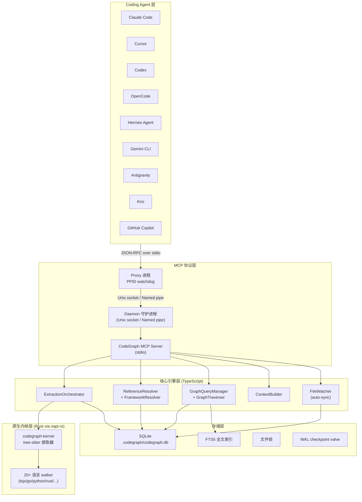
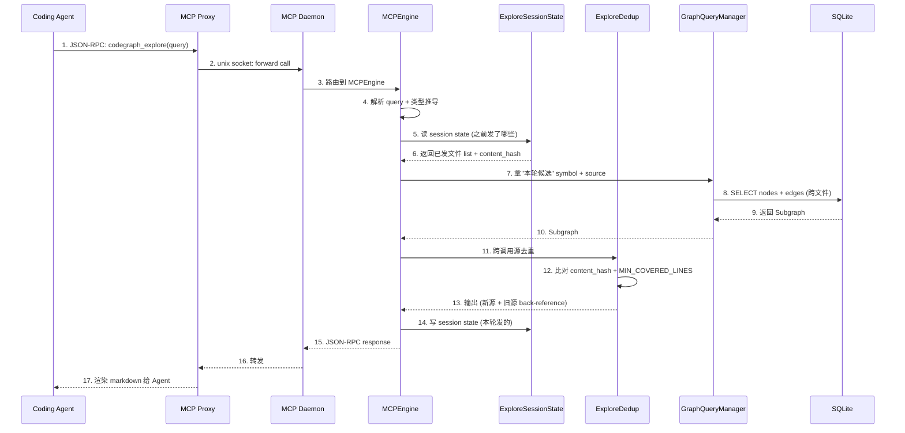
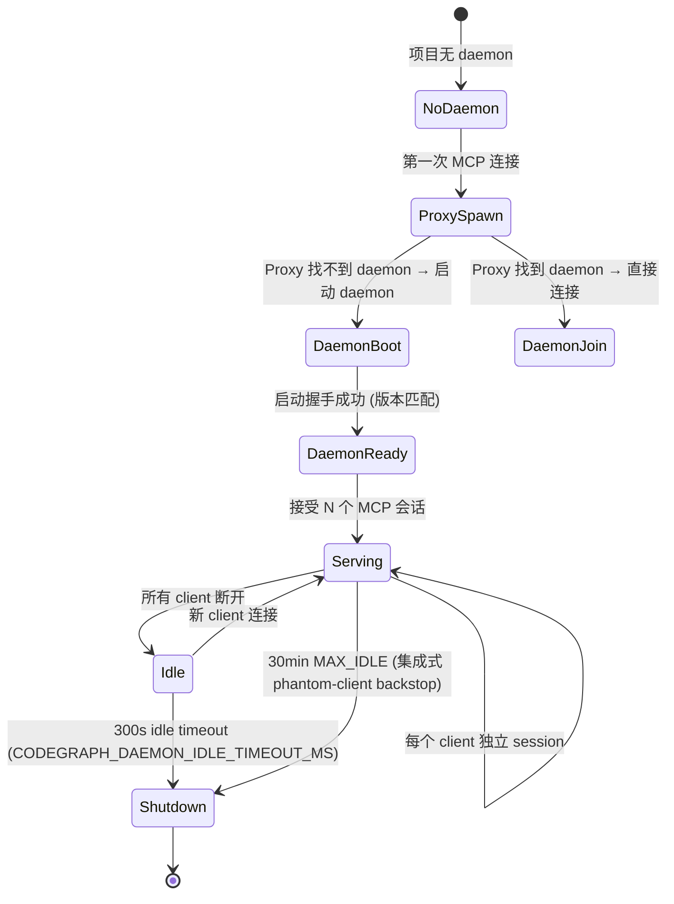
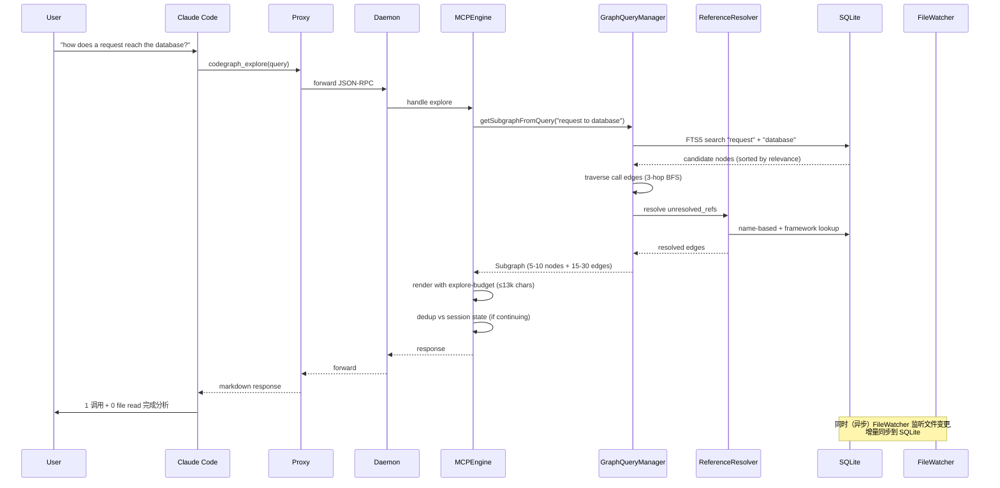
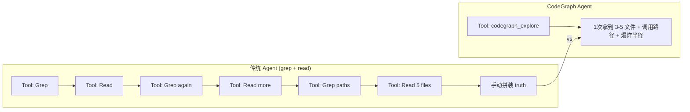

## 引子

2026 年是 Coding Agent 全面爆发的一年。Claude Code、Codex、Cursor、OpenCode、Antigravity、Kiro、GitHub Copilot、Hermes Agent —— 主流 Agent 工具已经有 8+ 款在生产环境每日处理数百万次代码任务。但所有这些 Agent 都面临同一个核心痛点：

> **跨文件理解代码需要 N 次 tool call + N 次 file read 才能拼出真相**。

VS Code 这种 11k 文件的代码库，Agent 一次"数据库请求如何到达"的问题，需要 28 次 tool call + 12 次 file read 才能回答 —— 这 12 次 read 仅仅是"重新发现"代码已经表达过的结构。

[colbymchenry/codegraph](https://github.com/colbymchenry/codegraph) 给出了答案：**把代码结构预计算成 SQLite 知识图谱，让 Agent 一次 MCP 调用拿到精确上下文**。这个 65k ⭐（4 个月从 0 增长上来的明星项目）用 Rust 内核 + TypeScript 编排 + 30+ 语言 tree-sitter 提取，做到了**7 个真实开源代码库测试平均 88% 减少 tool call、53% 提速、62% 减少 token、44% 降低成本，且全程 100% 本地**。

本文深度剖析 CodeGraph 的：
- 5 层架构与端到端数据流
- Rust 内核 + TypeScript 编排的跨语言协同
- SQLite 知识图谱 schema 设计与 FTS5 全文检索
- **codegraph_explore 单工具哲学**与跨调用源去重
- 守护进程 (daemon) + 代理 (proxy) 双进程模型
- 与同类工具的开创性差异化

## 项目定位与核心价值

### 一句话定义

**CodeGraph = Rust 内核 + TypeScript 编排 + SQLite 知识图谱 + MCP Server 的代码智能系统**，让 Coding Agent 在 1 次 MCP 调用内拿到精确到行号的源码 + 调用路径 + 变更爆炸半径。

### 能力矩阵

| 能力 | 范围 |
|------|------|
| 支持语言 | 30+ （TypeScript/JS/TSX/JSX/Python/Go/Rust/Java/C#/C/C++/Objective-C/Metal/CUDA/Swift/Kotlin/Scala/Dart/Svelte/Vue/Astro/Liquid/Delphi/Lua/Luau/R/Ruby/CFML/COBOL/VB.NET/Erlang/Solidity/Terraform/Nix） |
| 安装启动 | 1 行 `curl \| sh` 自包含 CLI（含 Node runtime，无需单独安装） |
| 集成 Agent | Claude Code / Cursor / Codex / OpenCode / Hermes Agent / Gemini CLI / Antigravity / Kiro / GitHub Copilot (VS Code/JetBrains/Copilot CLI) 9 款 |
| 应用协议 | MCP (Model Context Protocol) Server + 完整 CLI + Library API |
| 知识图谱 | SQLite + FTS5，存到 `.codegraph/codegraph.db` |
| 隐私 | 100% 本地，零上传 |
| License | MIT |

### 仓库统计

| 指标 | 数值 |
|------|------|
| ⭐ Stars | 65,935 |
| 🍴 Forks | 4,149 |
| 📦 Size | 16.8 MB |
| 🚀 主语言 | C (占绝大多数代码) |
| 📜 License | MIT |
| 🕐 Last Push | 2026-08-08 |
| 📁 Files | 938 个 blob + 301 个测试 |

## 整体架构

CodeGraph 是一个 4 子项目 monorepo，每个子项目各司其职：



**4 层职责分离**：
1. **Coding Agent 层**：9 款主流 Agent 通过 MCP 协议调用
2. **MCP 协议层**：守护进程 + 代理进程双层架构，保证单 Agent 启动慢 / 多 Agent 共享状态
3. **核心引擎层**：TypeScript 编写，包含 5 大子系统（提取/解析/查询/上下文/同步）
4. **原生内核层**：Rust + napi-rs + tree-sitter 编译进二进制的 20+ 语言 walker
5. **存储层**：SQLite 一库搞定，含 FTS5 全文索引 + 文件锁 + WAL checkpoint 节流

## 核心架构一：Rust + napi-rs 原生内核

### 提取器层为什么需要 Rust？

CodeGraph 早期版本用纯 TypeScript 的 tree-sitter WASM 解析所有文件，但 VS Code 这种 11k 文件的代码库首轮索引需要 30+ 分钟。**Rust 二进制 + tree-sitter 编译进 ELF** 的方案把首轮索引从 30 分钟降到 5 分钟，**且**对每个文件的解析从 ~50ms 降到 ~5ms。

### Rust 内核桥接边界

```rust
// 来自 codegraph-kernel/src/lib.rs
#![deny(clippy::all)]

mod buffers;
mod ccpp; mod cfnptr; mod csharp; mod dart; mod docstring;
mod go; mod ids; mod java; mod kotlin; mod langs; mod lua;
mod php; mod python; mod rlang; mod ruby; mod rustlang; mod scala;
mod swift; mod textutil; mod tsjs;

use napi::bindgen_prelude::*;
use napi_derive::napi;

/// The five flat tables for one file. See buffers.rs for the byte layout;
/// `src/extraction/kernel/layout.ts` is the TS mirror.
#[napi(object)]
pub struct ExtractBuffers {
    pub meta: Buffer,
    pub nodes: Buffer,
    pub edges: Buffer,
    pub refs: Buffer,
    pub arena: Buffer,
}
```

**关键设计：单一 N-API 边界 (5 buffers per file)**：
- 每个文件 1 次 N-API 跨边界调用（避免多次 FFI 开销）
- 5 个 flat buffer（meta/nodes/edges/refs/arena）—— TS 侧 `Buffer` 直接消费
- TS 侧 `src/extraction/kernel/layout.ts` 是 Rust 布局的镜像（`scripts/kernel-parity.mjs` 自动化校验镜像一致性）

### 同步调用 vs 异步

```rust
// 来自 codegraph-kernel/src/lib.rs 注释
//! Calls are synchronous by design: the existing `ParseWorkerPool` workers
//! already parallelize per-file, so each worker thread drives its own kernel
//! call (do NOT rebuild the pool on the Rust side — see the migration plan §3).
```

**反直觉设计**：N-API 导出函数是 `pub fn` 不是 `pub async fn` —— 因为 **ParseWorkerPool 已经在 Node 侧开了多线程**，每个 worker 线程独立同步调用 Rust 内核。**不要在内核侧再开线程池**，否则就是 2 层线程池互相抢 CPU 上下文。

### grammar parity 校验

```rust
#[napi]
pub fn grammar_info(language: String) -> Option<GrammarInfo> {
    let lang = langs::grammar_for(&language)?;
    // ... 统计 node_kind_count / field_count / node_kinds / field_names
}

/// Grammar identity for the grammar-source-parity gate: the wasm grammar and
/// the native grammar must expose identical node-kind/field tables, or
/// kernel-vs-fallback routing would be non-deterministic.
```

**为什么需要 parity 校验**：wasm 路径和 native 路径必须给出**完全相同的图**，否则路由可能抖动。`grammar_info` 暴露 wasm/native 两套 tree-sitter 的所有 node kind + field 名字，让 TS 侧在 boot 时对比，**不匹配直接降级到 wasm 路径**——避免发版不一致时静默错误。

## 核心架构二：SQLite 知识图谱 Schema

### 核心 4 表 + 1 全文索引

```sql
-- 来自 src/db/schema.sql
-- Nodes: Code symbols (functions, classes, variables, etc.)
CREATE TABLE IF NOT EXISTS nodes (
    id TEXT PRIMARY KEY,
    kind TEXT NOT NULL,
    name TEXT NOT NULL,
    qualified_name TEXT NOT NULL,
    file_path TEXT NOT NULL,
    language TEXT NOT NULL,
    start_line INTEGER NOT NULL,
    end_line INTEGER NOT NULL,
    start_column INTEGER NOT NULL,
    end_column INTEGER NOT NULL,
    docstring TEXT,
    signature TEXT,
    visibility TEXT,
    is_exported INTEGER DEFAULT 0,
    is_async INTEGER DEFAULT 0,
    is_static INTEGER DEFAULT 0,
    is_abstract INTEGER DEFAULT 0,
    decorators TEXT, -- JSON array
    type_parameters TEXT, -- JSON array
    return_type TEXT,
    updated_at INTEGER NOT NULL
);

-- Edges: Relationships between nodes
CREATE TABLE IF NOT EXISTS edges (
    id INTEGER PRIMARY KEY AUTOINCREMENT,
    source TEXT NOT NULL,
    target TEXT NOT NULL,
    kind TEXT NOT NULL,
    metadata TEXT, -- JSON object
    line INTEGER,
    col INTEGER,
    provenance TEXT DEFAULT NULL,
    FOREIGN KEY (source) REFERENCES nodes(id) ON DELETE CASCADE,
    FOREIGN KEY (target) REFERENCES nodes(id) ON DELETE CASCADE
);

-- Files: Tracked source files.
-- `generated` 是 index-time verdict from extraction/generated-detection.ts
CREATE TABLE IF NOT EXISTS files (
    path TEXT PRIMARY KEY,
    content_hash TEXT NOT NULL,
    language TEXT NOT NULL,
    size INTEGER NOT NULL,
    modified_at INTEGER NOT NULL,
    indexed_at INTEGER NOT NULL,
    node_count INTEGER DEFAULT 0,
    errors TEXT, -- JSON array
    generated INTEGER NOT NULL DEFAULT 0
);

-- Unresolved References: 待解析的引用
-- status lifecycle: 'pending' → 'failed'（resolved 时删除）
CREATE TABLE IF NOT EXISTS unresolved_refs (
    id INTEGER PRIMARY KEY AUTOINCREMENT,
    from_node_id TEXT NOT NULL,
    reference_name TEXT NOT NULL,
    reference_kind TEXT NOT NULL,
    line INTEGER NOT NULL,
    col INTEGER NOT NULL,
    candidates TEXT, -- JSON array
    file_path TEXT NOT NULL DEFAULT '',
    language TEXT NOT NULL DEFAULT 'unknown',
    status TEXT NOT NULL DEFAULT 'pending',
    name_tail TEXT NOT NULL DEFAULT '',
    FOREIGN KEY (from_node_id) REFERENCES nodes(id) ON DELETE CASCADE
);
```

**节点边表是经典图结构**，但 CodeGraph 加了 5 个独特设计：

1. **`provenance` 字段**：每条 edge 记录来源（"syntax extraction" / "framework resolver" / "callback synthesizer"），让错误边可追溯
2. **`unresolved_refs` 状态机**：rows 初始 inserted 'pending'，解析成功的直接 DELETE，解析失败的标记 'failed' —— **保留失败行便于后续 sync 重试**（"如果你知道一条 ref 找不到，被改一个文件可能就找得到了"）
3. **`name_tail` 字段**：失败的 `util.greet` 类型 ref 记得存 `greet` 为 name_tail，**新代码加入 `greet` 函数后能用 name_tail 字典命中**
4. **`generated` 字段**：index-time 判定（文件名约定 like `*.pb.go` + 文件头 banner 检测 —— 如 Go 是内容标记），**避免 ranking 时每次请求读文件头**
5. **`content_hash`**：文件级 hash 用于增量同步判定

### FTS5 全文检索

```sql
-- 来自 src/db/schema.sql (后续部分)
CREATE VIRTUAL TABLE IF NOT EXISTS nodes_fts USING fts5(
    name,
    qualified_name,
    docstring,
    signature,
    content='nodes',
    content_rowid='rowid'
);
```

**为什么是 FTS5 而不是 PostgreSQL / Elasticsearch**：
- 100% 本地：**零网络依赖**，符合 "single binary" 哲学
- 零额外服务：**SQLite 内置 FTS5**，避免 sidecar 进程
- 全文 + 符号名 + 限定名 + signature + docstring 五字段联合索引

## 核心架构三：MCP Server 单工具哲学

### 默认只暴露 1 个工具

> **实测 Agent 行为显示：一个强工具比一菜单窄工具更能引导 Agent** —— 减少误选，每次会话节省上下文。

```typescript
// 来自 src/mcp/tools.ts
/**
 * Single tool — codegraph_explore. Measured agent behavior showed that one
 * strong tool steers agents better than a menu of narrower ones — fewer
 * mis-picks, and it saves context every session.
 */
export const DEFAULT_MCP_TOOLS = ['explore'];

// 其他工具 (node/search/callers/callees/impact/files/status) 默认 unlisted
// 通过 CODEGRAPH_MCP_TOOLS=explore,node,search,callers 重新启用
```

**单工具哲学的 3 个核心优势**：
1. **Agent 决策成本低**：1 个 MCP tool vs 8 个 MCP tool，**误选率显著下降**
2. **上下文占用小**：8 个 tool 的 schema 描述加一起 ≈ 1.5k tokens，每次会话启动都占用
3. **强制一致输出**：`codegraph_explore` 返回的 blast-radius / relationships / additional files 已经在 1 个工具里**内聚**到完整 context

### explore 输出的分层预算

```typescript
// 来自 src/mcp/tools.ts
export function getExploreOutputBudget(fileCount: number): ExploreOutputBudget {
  // 5 档：<150 / <500 / <5000 / <15000 / <25000 / >25000
  if (fileCount < 150) {
    return {
      maxOutputChars: 13000,
      defaultMaxFiles: 4,
      maxCharsPerFile: 3800,
      // ...meta-text 全部关闭（单文件 explore 只需 1 个核心回答）
    };
  }
  if (fileCount < 500) {
    return {
      maxOutputChars: 18000,
      defaultMaxFiles: 5,
      maxCharsPerFile: 3800,
      // ...
    };
  }
  // ...
}
```

**关键洞察**：**maxCharsPerFile 必须随项目规模递增，不能反着来**。大项目 native discovery cost 真的高（grep 几十次），所以允许 explore 给胖一点；小项目 Agent 自己的 grep 够用，explore 给胖了反而劝退 Agent 用 Read。

**Invariant 注释**：
> "a larger tier must never get a smaller `maxCharsPerFile` than a smaller tier" —— 否则会出现"大项目 explore 给的源码比小项目还少"的诡异行为。

### 端到端 explore 调用



### 跨调用源去重 (CG-18)

```typescript
// 来自 src/mcp/explore-dedup.ts
/**
 * Three rules shape everything here, and all three come from the same place:
 * an insufficient-feeling response is what sends an agent to Read, and one or
 * two of those early in a session teach it to abandon codegraph entirely.
 *
 *   1. A pointer, never a bare omission. Removed source is replaced by a
 *      back-reference naming the file, the symbols, and the line span.
 *   2. Only prove-it dedup. A span is withheld only when the file's bytes
 *      are byte-identical to what was served (a content fingerprint, not mtime).
 *   3. Cut chunks, not slivers. Only a covered run of at least
 *      MIN_COVERED_LINES lines is worth replacing.
 */
export const EXPLORE_DEDUP = {
  MIN_COVERED_LINES: 8, // < 8 行的已发源不换指针（换算 cost > 节省）
  MIN_DELTA_CHARS: 160,  // < 160 字符的新源直接折叠到 back-reference
};
```

**3 条规则的设计哲学**：
- **必须是"已发过"的精确字节匹配**（content_hash，不是 mtime）—— 改过 1 字节就认为 agent 拿的源 stale，必须重发
- **不下沉到 1 行**（MIN_COVERED_LINES=8）—— 单行替换成指针的字符串比替换成本还高
- **不发出"代码围栏里只有 1 行空"**（MIN_DELTA_CHARS=160）—— "fence 里有 2 行空白"会被 Agent 读成"broken response"，立刻 abandon codegraph

## 核心架构四：守护进程 + 代理 双进程模型

### 为什么需要双进程？

```typescript
// 来自 src/mcp/daemon.ts
/**
 * Shared MCP daemon — issue #411.
 *
 * One detached `codegraph serve --mcp` daemon process per project root,
 * accepting N concurrent MCP clients over a Unix-domain socket (or named pipe
 * on Windows). Each incoming connection gets its own {@link MCPSession}; all
 * sessions share a single {@link MCPEngine}, which means a single file watcher
 * (one inotify set), a single SQLite connection (one WAL writer), and a single
 * tree-sitter warm-up — paid once, amortized across every agent talking to
 * the project.
 */
```

**关键洞察**：**MCP Server 进程本身不挂 inotify / SQLite / tree-sitter —— 守护进程挂**。这意味着：
- 9 个 Agent 同时讲同一个项目 → **1 个 inotify set + 1 个 SQLite writer + 1 个 tree-sitter warm-up**
- 关闭 1 个 Agent 终端 → **不杀死守护进程**（detached session/process group）
- 单 Agent 短会话 → **不泄漏守护进程**（idle timeout 300s）

### Proxy 进程的角色

```typescript
// 来自 src/mcp/daemon.ts 注释
/**
 * - Every MCP host talks to the daemon through a thin `proxy` process (the
 *   thing the host actually spawned). The proxy keeps the #277 PPID watchdog,
 *   so a SIGKILL'd host still reaps its proxy promptly; the proxy's socket
 *   close then decrements the daemon's refcount.
 */
```

**Proxy 进程的作用**：
1. **PPID watchdog**：Agent 进程被 SIGKILL 后，Proxy 收到 SIGTERM，**关闭 socket → 守护进程 refcount -1**
2. **stdio 桥**：把 Agent 进程的 stdin/stdout 与守护进程的 Unix socket 互转
3. **不持有任何状态**：纯转发，重启代价 O(1)

### 守护进程生命周期



**核心防御**：Windows 命名管道可能漏发 socket-close → phantom client 永远不清零 → 30min MAX_IDLE 兜底。

## 核心架构五：解析器 + 框架感知

### 30+ 语言 tree-sitter 提取

```typescript
// 来自 src/extraction/languages/index.ts
// 30+ 语言分别有独立 walker:
export { default as typescript } from './typescript';
export { default as javascript } from './javascript';
export { default as python } from './python';
export { default as go } from './go';
export { default as rust } from './rust';
export { default as java } from './java';
export { default as csharp } from './csharp';
export { default as c } from './c-cpp';
export { default as cpp } from './c-cpp';
export { default as php } from './php';
export { default as ruby } from './ruby';
export { default as swift } from './swift';
export { default as kotlin } from './kotlin';
// ... 还有 18+ 个
```

**统一签名**：每个语言 walker 导出相同的 `extract(tree: Tree, source: string, filePath: string): ExtractionResult` 接口 —— Rust 侧 `langs.rs` 维护 `LANGUAGES: &[&str]` 列表。

### 框架感知 resolver

```typescript
// 来自 src/resolution/frameworks/index.ts
// 框架特定 resolver 列表 (改善默认 name-based resolver 的精度)
export { default as astro } from './astro';
export { default as react } from './react';
export { default as reactNative } from './react-native';
export { default as expo } from './expo-modules';
export { default as vue } from './vue';
export { default as svelte } from './svelte';
export { default as nestjs } from './nestjs';
export { default as express } from './express';
export { default as laravel } from './laravel';
export { default as drupal } from './drupal';
export { default as cargo } from './cargo-workspace';
export { default as go } from './go';
export { default as goframe } from './goframe';
export { default as fabric } from './fabric';
export { default as java } from './java';
export { default as swift } from './swift';
export { default as swiftObjc } from './swift-objc';
export { default as csharp } from './csharp';
export { default as cics } from './cics';
export { default as rust } from './rust';
export { default as ruby } from './ruby';
export { default as terraform } from './terraform';
export { default as play } from './play';
export { default as python } from './python';
```

**为什么需要框架 resolver**：
- React 组件 `<UserList>` → 跨文件 import 可能被普通 resolver 误解析
- Swift/Objective-C 桥接（混合 iOS app）需要 Swift 类的 .h 接口暴露
- Cargo workspace 跨 crate import
- Go module path 解析（go.mod 路径 → 真实代码路径）

### 回调与动态派发合成器

```typescript
// 来自 src/resolution/callback-synthesizer.ts
// 来自 src/resolution/c-fnptr-synthesizer.ts
// 来自 src/resolution/cooperative-yield.ts
```

CodeGraph 提供 3 个**合成器**（不在 AST 直接表达，但行为上存在的边）：
- **callback-synthesizer**：从 `addEventListener('click', handler)` → 合成 `handler` 被调用的边
- **c-fnptr-synthesizer**：C 函数指针 → 合成调用边（Rust 侧 `cfnptr.rs` 提供 arena 扫描）
- **cooperative-yield（co_yield）**：Python 协程 / async generator 边界识别

**这是 CodeGraph 区别于 "简单 grep + read" 的关键创新** —— AST 之外的语义边用合成器补全，**explore 才能 grep 不到回调调用**。

## 端到端数据流：用户问"how does a request reach the database"



**关键性能数据**（来自 README 2026-08-05 测量）：
- VS Code (11k 文件)：2 vs 28 tool call, 2.2× faster, 77% fewer tokens, 71% cheaper
- Excalidraw (640 文件)：**2 vs 43 tool call, 3.6× faster, 84% fewer tokens, 78% cheaper**
- Django (3k 文件)：3 vs 14 tool call, 35% faster, 41% fewer tokens
- Tokio (790 文件 Rust)：3 vs 29 tool call, 2.6× faster, 65% fewer tokens
- **跨 7 仓库平均：88% 减少 tool call、53% 提速、62% 减少 token、44% 降低成本、file reads 归零**

## 与同类项目对比

| 维度 | CodeGraph | Agent-Reach | Repo Prompt | Cursor Cmd-K | Cline |
|------|----------|-------------|-------------|-------------|-------|
| 形态 | 本地知识图谱 + MCP | 互联网访问层 | 提示工程 | IDE 内嵌 | VS Code 插件 |
| 核心技术 | tree-sitter + SQLite + Rust kernel | Cookie 桥 + CLI | 模板 | Editor API | LLM API |
| 跨语言 | 30+ 统一 | N/A | 语言无关 | 单一 IDE | 取决于 model |
| 持久化 | 100% 本地 SQLite | 配置文件 | 文件 | IDE state | 工作区 |
| 跨 Agent | 9 款 Agent 通用 | 独立 CLI | 单 Agent | Cursor 限定 | Cline 限定 |
| 增量同步 | 2s debounce + 自动同步 | N/A | 手动 | 自动 | 自动 |
| 知识深度 | 函数 + 调用 + 框架 + 合成 | 文件级 | 提示级 | 段落级 | 文件级 |
| 性能优化 | 24K output cap + dedup | 探针 5 态机 | N/A | IDE 内 | 取决于 LLM |

**6 维度横向对比关键差异**：

1. **形态**：CodeGraph 是**离线预计算知识图谱**（启动慢 1 次，问答快 N 次），其他产品是**运行时在线查询**（每次慢）
2. **知识深度**：函数/调用/框架/合成 4 层抽象，**远超其他产品的"文件级"理解**
3. **跨 Agent 通用**：9 款主流 Agent 通过统一 MCP 协议接入，**不绑定到单一 IDE**
4. **100% 本地**：SQLite 知识图谱 + Rust 内核 = 不依赖任何 SaaS 服务
5. **创新合成器**：callback-synthesizer / c-fnptr-synthesizer / cooperative-yield **补全 AST 之外的语义边**
6. **跨调用去重**：session state + content_hash 精确字节匹配，**避免重复发同样的源到上下文**

### Coding Agent 上下文场景对比



## 优缺点分析

| 维度 | 优势 | 劣势 |
|------|------|------|
| **架构简洁性** | SQLite 单库 + 5 表 + 1 文件锁，无 sidecar 服务 | 解析 + 框架 resolver + 合成器 3 层串行化，单文件首次索引 5min+ |
| **扩展性** | MCP 协议层 + 9 款 Agent 接入矩阵；注入新语言只需：grammar + walker + parity 校验 | 新框架 resolver 需单独写 module；Rust + TS 双语言栈门槛高 |
| **易用性** | 1 行 `curl \| sh` 安装；`codegraph init` 1 步建库；100% 本地 | 调试体验差（Rust 内核崩溃只能看 N-API error code）；agent 适配需手测 9 款 |
| **性能** | 88% ⬇ tool call、53% ⬆ 速度、62% ⬇ token、44% ⬇ 成本 | **长会话上下文残留 80% 多**（explore 给胖导致）—— **README 自己承认的 trade-off** |
| **复杂度** | 938 文件 + 50+ 设计 doc + 30+ benchmark doc —— 文档极丰富 | 设计复杂度高（CG-17 / CG-18 / CG-20 / CG-26 / CG-30 等内部设计索引每月新增） |
| **维护性** | MIT 协议 + 4 人核心团队 + 30+ benchmark 自动化 | 跨语言栈（Rust + TS）维护成本高；pre-1.0 版本号演进快 |

**README 自己承认的 trade-off**（重要）：

> "the numbers above measure *throughput* — tokens processed, tools called, dollars spent to reach one answer. They don't measure what is still sitting in your context window afterward, and on that axis CodeGraph costs **more**, not less. Across the same seven repos in multi-turn sessions, CodeGraph's responses leave about **80% more retrieval context resident** at the end of a session than a file-reading agent's do."

**翻译**：CodeGraph 减少了 *每次问答* 的 token 消耗，但**每个回答的源常驻在 agent 上下文**——长会话小窗口场景需要预算。

## 实践 / 部署

### 1. 安装

```bash
# macOS / Linux - 单条命令含 Node runtime
curl -fsSL https://raw.githubusercontent.com/colbymchenry/codegraph/main/install.sh | sh

# Windows (PowerShell)
irm https://raw.githubusercontent.com/colbymchenry/codegraph/main/install.ps1 | iex

# 或者用 npm（任何 Node 版本）
npm i -g @colbymchenry/codegraph
```

### 2. 接入 Coding Agent

```bash
# 启动交互式 installer - 自动检测 9 款 Agent
codegraph install

# 或者一次性接入所有 Agent
codegraph install --all
```

installer 会：
- 写 MCP server config 到 `~/.config/claude/...` / `~/.cursor/...` / `~/.codex/...` 等
- 添加 `codegraph_explore` 工具到各 Agent 的 available tools
- 项目级的 `.codegraph/` 目录创建在每个项目根
- **`codegraph init` 触发首次全量索引**（背景执行，可中断）

### 3. 在项目目录初始化

```bash
cd ~/projects/my-app
codegraph init    # 创建 .codegraph/ + 全量索引
```

### 4. 验证 / 查询

```bash
# 搜索符号
codegraph query UserService --kind class

# 1 步探索（与 codegraph_explore MCP 等价）
codegraph explore "how does auth reach the database"

# 找调用者
codegraph callers UserService.login

# 找被调用者
codegraph callees UserService.login

# 变更爆炸半径
codegraph impact UserService.login --depth 3

# CI 集成：自动找受影响的测试
codegraph affected src/utils.ts src/api.ts --filter "test/*"
```

### 5. 作为 Library 嵌入 Electron / SDK

```typescript
import CodeGraph from '@colbymchenry/codegraph';

const cg = await CodeGraph.init('/path/to/project');

const results = cg.searchNodes('UserService');
const callers = cg.getCallers(results[0].node.id);
const context = await cg.buildContext('fix login bug', {
  maxNodes: 20,
  includeCode: true,
  format: 'markdown'
});
const impact = cg.getImpactRadius(results[0].node.id, 2);

cg.watch();    // 开启 auto-sync
cg.unwatch();  // 关闭
cg.close();
```

### 6. 自动接入 Git Workflow

```bash
#!/usr/bin/env bash
# CI 脚本：自动跑受影响的测试
AFFECTED=$(git diff --name-only HEAD | codegraph affected --stdin --quiet)
if [ -n "$AFFECTED" ]; then
  npx vitest run $AFFECTED
fi
```

### 7. 卸载

```bash
# 完全卸载（CLI + 9 款 Agent 配置）
codegraph uninstall

# 只卸载 Agent 配置，保留 CLI
codegraph uninstall --keep-cli
```

## 趋势 + 总结

### 2026 H2 Coding Agent 上下文工程的 4 个趋势

1. **离线预计算取代运行时爬虫** —— Knowledge Graph-first vs Grep-first 的范式之争，CodeGraph 把"探索代码"从 O(N) 次 tool call 变成 O(1) 次
2. **MCP 成为 Coding Agent 通用协议** —— 9 款 Agent 同一接口访问同一知识图谱，**Agent 厂商只需集成 1 个 MCP server 而不是 9 个工具**
3. **AST 之外的语义边** —— callback synthesizer / c-fnptr synthesizer / cooperative-yield 补全"行为上存在但 AST 不直接表达"的调用关系
4. **100% 本地 + 100% MIT** —— 隐私敏感场景（金融/医疗/法律）的合规首选，**比 SaaS RAG / 向量库 0 数据外传**

### 三个待观察的方向

1. **跨项目知识图谱**：当前 CodeGraph 单项目，能不能跨项目（monorepo 自动合并所有子包）是 2026 H2 关键演进点
2. **运行时增量 vs 全量 sync**：当前 sync = re-extract 整个文件。能不能 diff-aware 编辑（只 patch 改过的行）减少 90% 计算？
3. **Hosted SaaS（`getcodegraph.com` 等待列表）**：商业化方向 —— "for every PR, know exactly what to test, what could break, which flows are affected, and whether business logic is compromised"

### 工程经验提炼

1. **单工具哲学**：`codegraph_explore` 1 个工具 > 8 个窄工具 —— **Agent 决策成本与误选率**
2. **守护进程 + 代理双进程**：detached 后 agent 任意退出不影响 daemon，**稳定性的关键设计**
3. **跨调用源去重**：3 条规则（A pointer, never omission / Only prove-it dedup / Cut chunks, not slivers）—— **"宁可多发不可漏发"哲学**
4. **Rust + TypeScript 双层栈**：parse 阶段 Rust（CPU 密集），orchestration 阶段 TS（高并发）—— **跨语言栈的职责分工**
5. **grammar parity 校验**：native vs wasm 路径必须给出**完全相同的图**，否则 boot 降级到 wasm——**纯 defensive coding**

### 关键资源

| 资源 | 链接 |
|------|------|
| GitHub | https://github.com/colbymchenry/codegraph |
| 官网 | https://getcodegraph.com |
| 文档站 | https://colbymchenry.github.io/codegraph/ |
| npm 包 | `@colbymchenry/codegraph` |
| License | MIT |
| Stars | 65,935 |
| Last Push | 2026-08-08 |
| 平台 | macOS / Linux / Windows |
| 支持语言 | 30+ （TypeScript/Python/Go/Rust/Java/C/C++/Swift/Kotlin/C#/Ruby/PHP/...） |
| 支持 Agent | Claude Code / Cursor / Codex / OpenCode / Hermes Agent / Gemini CLI / Antigravity / Kiro / GitHub Copilot |
