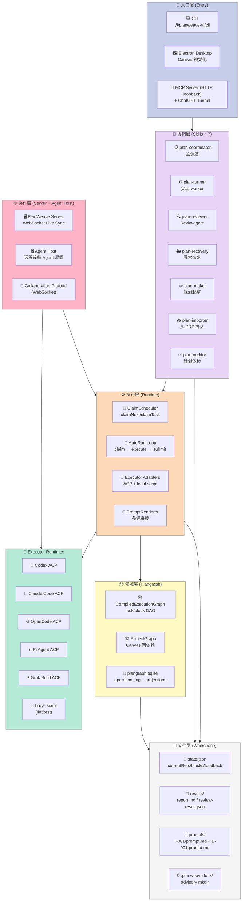
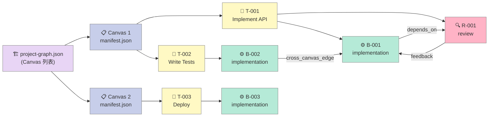
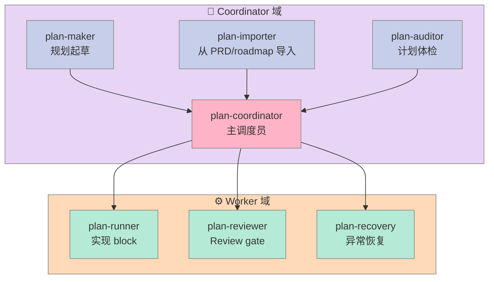

## 引子

2026 年的 Coding Agent 已经过了"单次对话 + 一次性 tool call"的阶段。Claude Code、Codex、OpenCode、Pi、Grok 等 5+ 主流 Agent 都能独立完成单文件修改，但**长循环、可恢复、多 Agent 协作**仍然是公开难题：

> **当 Agent 要跑 6 小时、200 次 tool call、跨 5 个子任务时，如何保证：(1) 任何一个 sub-agent 挂了能恢复；(2) review 反馈能精准送回 implementation；(3) 不同 block 能路由到不同 executor（Codex 跑实现 + Claude Code 跑 review + 本地脚本跑 lint）？**

[GaosCode/PlanWeave](https://github.com/GaosCode/PlanWeave) 给出了答案：**把"长循环工程化"建模为 Task Graph + Block 文件系统 + SQLite operation_log**。这个项目 333⭐，2026-05-24 创建，**最新 commit 在 2026-08-12** —— 2 个半月的密集迭代。它用一个 monorepo（`cli` + `runtime` + `server` + `desktop` + `agent-host` + `collaboration-protocol`）实现了：

- **Task Graph（任务图）**：Project → Canvas → Task → Block（implementation / review）四层 DAG
- **Per-block executor routing**：同一个 Task 的 B-001 路由到 Codex、R-001 路由到 Claude Code、B-002 路由到 OpenCode —— 不同 block 用不同 agent
- **SQLite operation_log**：所有 graph 修改有 before/after JSON + `undone_at` 字段，**支持撤销/重做**
- **Advisory mkdir lock**：跨进程文件锁保证并发 claim 不冲突（不需要 Redis/ZooKeeper）
- **7 个 SKILL.md**：coordinator / runner / reviewer / recovery / maker / importer / auditor —— 把"调度 vs 实现"职责切干净

**Harness 6 件套定位**：
- **Workflow** 组件（接力赛协议 / 交接规则）—— 主导
- **Sub-Agent** 组件（角色分工 / Context 隔离）—— 强相关
- **MCP** 组件 —— ChatGPT 入口
- **Skill** 组件 —— 7 SKILL.md

本文深度剖析 PlanWeave 的：
- **4 层 DAG 任务图**与文件即节点的设计哲学
- **Advisory mkdir lock** 与 `AsyncLocalStorage` 同进程重入
- **operation_log 表** 与 undo/redo 机制
- **5 类 Executor 路由**（Codex / Claude Code / OpenCode / Pi / Grok + local）
- **7 SKILL.md 角色分工**（coordinator / runner / reviewer / recovery 等）
- **同类型项目横评**：LoopX / Ralph Loop / Karpathy autoresearch / OpenHands

## 项目定位与核心价值

### 一句话定义

**PlanWeave = 文件即节点（Tasks / Blocks = Markdown files）+ Task Graph（DAG）+ SQLite 撤销日志 + 5 Agent executor routing + Skills-based 协调员**，让 Coding Agent 在 6 小时、200 次 tool call、5 个 executor 的长循环中**每个 step 都可恢复、每个 feedback 都能闭环**。

### 能力矩阵

| 能力 | 范围 |
|------|------|
| 任务模型 | Project → Canvas → Task → Block (implementation / review) |
| Block 类型 | `implementation` / `review` |
| Executor 路由 | Codex / Claude Code / OpenCode / Pi / Grok / manual / local script |
| 持久化 | SQLite (`plangraph.sqlite`) + JSON state + 文件 prompt |
| 并发锁 | Advisory mkdir lock（无中心化依赖） |
| Undo/Redo | operation_log 表 + `graph_version_before` / `graph_version_after` |
| 协作 | Electron Desktop + WebSocket Canvas Live Sync + Remote Agent Hosts |
| 入口协议 | MCP Server（HTTP loopback）+ ChatGPT Tunnel + systemd |
| Skill 角色 | 7 SKILL.md（coordinator / runner / reviewer / recovery / maker / importer / auditor）|
| License | MIT |

### 仓库统计

| 指标 | 数值 |
|------|------|
| ⭐ Stars | 333 |
| 🍴 Forks | ~30 |
| 📦 Size | 2205 个文件（含测试）|
| 🚀 主语言 | TypeScript (100% monorepo) |
| 🕐 Created | 2026-05-24 |
| 🕐 Last Push | 2026-08-12 |
| 📁 monorepo | `cli` + `runtime` + `server` + `desktop` + `agent-host` + `agent-host-protocol` + `collaboration-protocol` + `plangraph` |
| 📜 License | MIT |

### 与"传统 chat-based 规划"的根本差异

PlanWeave 的核心理念用一句话概括：

> **Chat is a useful place to start a plan, but it is a fragile place to run a long engineering loop.**

Chat 的问题不是不能跑 Agent，而是 6 小时后：
- 你不知道哪些 step 跑过、哪些没过
- 你不知道第 53 次 tool call 时 agent 是不是已经偏离主线
- Reviewer 给的反馈找不到 Implementation 的对应 ref
- Executor 崩溃后无法 resume

PlanWeave 把这一切**搬到文件 + SQLite**，于是**断电恢复、跨设备续跑、跨 Agent 协作**都成为可能。

## 整体架构

PlanWeave 是一个 7 包 monorepo，每个包各司其职：



**7 层职责分离**：
1. **入口层**：CLI / Electron Desktop / MCP Server 三种用户触点
2. **协调层**：7 个 SKILL.md 文件，**coordinator 是唯一可发号施令的**（其他都是 worker 角色）
3. **执行层**：ClaimScheduler（抢占调度）+ AutoRun（自动循环）+ Executor Adapters（5 类 agent 适配）+ PromptRenderer（多源拼接）
4. **领域层**：CompiledExecutionGraph（DAG in-memory）+ ProjectGraph（多 Canvas）+ SQLite operation_log
5. **Executor Runtimes**：5 个真实 Agent + local script
6. **协作层**：Server + Agent Host + WebSocket Protocol
7. **文件层**：state.json + results/ + prompts/ + .planweave.lock

## 核心架构一：Task Graph（文件即节点）

### 数据模型：4 层 DAG

PlanWeave 的核心数据是**Project → Canvas → Task → Block** 4 层有向无环图。每个**节点都是 Markdown 文件**，每个**边都是 manifest.json 里的 JSON 字段**。



### 真实的 manifest.json 结构

`examples/basic-plan-package/package/manifest.json`：

```json
{
  "version": "plan-package/v1",
  "execution": {
    "defaultExecutor": "manual",
    "parallel": { "enabled": true, "maxConcurrent": 2 }
  },
  "review": { "maxFeedbackCycles": 1, "completionPolicy": "strict" },
  "nodes": [
    {
      "id": "T-001",
      "type": "task",
      "title": "Implement a tiny example change",
      "prompt": "nodes/T-001/prompt.md",
      "acceptance": [
        "Implementation report records what changed.",
        "Review can request changes, feed them back, and then pass."
      ],
      "blocks": [
        {
          "id": "B-001",
          "type": "implementation",
          "title": "Create implementation report",
          "prompt": "nodes/T-001/blocks/B-001.prompt.md",
          "depends_on": [],
          "parallel": { "sharedResources": ["example"] }
        },
        {
          "id": "R-001",
          "type": "review",
          "title": "Review implementation report",
          "prompt": "nodes/T-001/blocks/R-001.prompt.md",
          "depends_on": ["B-001"],
          "review": { "required": true, "maxFeedbackCycles": 1, "hook": null }
        }
      ]
    }
  ]
}
```

### 编译后的内存数据结构

`packages/runtime/src/types/graph.ts`：

```typescript
export type CompiledExecutionGraph = {
  nodesById: Map<string, ManifestNode>;
  taskNodesInManifestOrder: string[];
  tasksById: Map<string, ManifestTaskNode>;
  taskDependenciesByTask: Map<string, string[]>;   // 拓扑序前置
  taskDependentsByTask: Map<string, string[]>;     // 拓扑序后继
  blockRefsInManifestOrder: string[];              // B-001#T-001 etc.
  blocksByRef: Map<string, ManifestBlock>;
  blockTaskByRef: Map<string, string>;
  blocksByTask: Map<string, string[]>;
  blockDependenciesByRef: Map<string, string[]>;   // block-level DAG
  blockDependentsByRef: Map<string, string[]>;
  reviewBlocksByTask: Map<string, string[]>;
  sharedResourcesByBlockRef: Map<string, string[]>; // 共享资源（如 example 目录）
  requiredCapabilitiesByBlockRef: Map<string, string[]>;
  diagnostics: { errors: ValidationIssue[]; warnings: ValidationIssue[] };
  taskReachable(from: string, to: string): boolean;
  blockReachable(fromRef: string, toRef: string): boolean;
};
```

**关键设计**：DAG 编译时**双向索引齐全**（predecessors + successors），claim 调度只需要 O(1) 查询即可，不需要每次重算拓扑。

### `loadRuntime` 三态合一

`packages/runtime/src/taskManager/runtimeContext.ts`：

```typescript
export async function loadRuntime(options: RuntimeOptions): Promise<RuntimeContext> {
  const { context, rawState, derivedState } = await loadRuntimeContext(options);
  if (JSON.stringify(rawState) !== JSON.stringify(derivedState)) {
    await writeState(context.workspace.stateFile, derivedState);
  }
  return context;
}

export async function loadRuntimeReadonly(options: RuntimeOptions): Promise<RuntimeContext> {
  const { context } = await loadRuntimeContext(options);
  return context;  // 永远不写 state.json
}
```

**设计哲学**：读操作和写操作分离。`loadRuntimeReadonly` 用于 status / current / doctor 等只读命令；`loadRuntime` 仅在 `ensureStateForManifest` reconcile 改变了 state 时才持久化（**幂等**）。

## 核心架构二：Advisory mkdir 锁

### 为什么不用 Redis/ZooKeeper？

PlanWeave 的并发模型是"**跨进程但单机**"：CLI / Desktop / Server / Agent Host 可能同时操作同一个 canvas workspace。传统选择是 Redis 分布式锁或 PostgreSQL advisory lock，但 PlanWeave 选了最朴素的方案 —— **`mkdir .planweave.lock/`**。

`packages/runtime/src/fs/advisoryDirectoryLock.ts`：

```typescript
const LOCK_DIR_NAME = ".planweave.lock";
const HOLDER_FILE_NAME = "holder.json";
const DEFAULT_ACQUIRE_TIMEOUT_MS = 10_000;
const DEFAULT_STALE_LOCK_MS = 60_000;
const DEFAULT_RETRY_DELAY_MS = 25;

export type LockHolder = {
  pid: number;
  acquiredAt: string;
  operation: string;       // 哪一类操作（claim / submit / status ...）
  ownerToken?: string;     // AsyncLocalStorage 跨 await 传递
};

// 同进程重入 — 不会自我死锁
const heldLockPaths = new AsyncLocalStorage<Set<string>>();

// 同进程排队 — 同一 lock path 串行
const inProcessTails = new Map<string, Promise<unknown>>();
```

### 加锁流程

```mermaid
sequenceDiagram
    participant P1 as Process A (CLI)
    participant P2 as Process B (Desktop)
    participant FS as Filesystem (.planweave.lock/)

    P1->>FS: mkdir .planweave.lock
    Note over FS: 成功 → 创建 holder.json
    P2->>FS: mkdir .planweave.lock
    Note over FS: 失败 (EEXIST)
    P2->>P2: 轮询 25ms（最多 10s）
    P1->>FS: rm -rf .planweave.lock (with holder.json)
    P2->>FS: mkdir .planweave.lock
    Note over FS: 成功 → 接管
    P2-->>P2: claimNext() 执行

    style P1 fill:#C7CEEA,stroke:#888,color:#333
    style P2 fill:#C7CEEA,stroke:#888,color:#333
    style FS fill:#FFDAB9,stroke:#888,color:#333
```

### 完整加锁原语

```typescript
export async function withAdvisoryDirectoryLock<T>(
  options: WithAdvisoryDirectoryLockOptions,
  fn: () => Promise<T>
): Promise<T> {
  const { lockPath, operation, timeoutMs = 10_000, staleMs = 60_000 } = options;

  // 1) 同进程重入：AsyncLocalStorage 检查已持有
  const held = heldLockPaths.getStore();
  if (held?.has(lockPath)) {
    return fn();  // 不再获取，直接执行
  }

  // 2) 同进程排队：inProcessTails 串行
  const previousTail = inProcessTails.get(lockPath) ?? Promise.resolve();
  const result = previousTail.then(() => acquireAndRun(options, fn));
  inProcessTails.set(lockPath, result.catch(() => {}));
  return result;
}

async function acquireAndRun<T>(
  options: WithAdvisoryDirectoryLockOptions,
  fn: () => Promise<T>
): Promise<T> {
  const start = performance.now();
  while (true) {
    try {
      await fs.mkdir(options.lockPath);
      await fs.writeFile(holderPath, JSON.stringify(holder), "utf8");
      break;  // 拿到锁
    } catch (e) {
      if (!isErrno(e, "EEXIST")) throw e;
      if (performance.now() - start > options.timeoutMs) {
        throw new LockTimeoutError(options.lockPath, options.timeoutMs);
      }
      // stale 检测：lock age > 60s 且 PID 已死 → 强制接管
      if (await isStaleLock(options)) {
        await fs.rm(options.lockPath, { recursive: true, force: true });
        continue;
      }
      await clock.delay(options.retryDelayMs);  // 25ms
    }
  }

  try {
    return await fn();
  } finally {
    // 释放 — 必须用 rename 而不是 rm，避免误删别人的 holder
    await fs.rm(options.lockPath, { recursive: true, force: true });
  }
}
```

**3 个工程亮点**：
1. **`AsyncLocalStorage` 同进程重入**：嵌套调用不自我死锁（典型场景：claimNext 内部调 markBlockDiverged）
2. **`staleMs = 60_000` PID 死亡检测**：进程崩溃后 60 秒其他进程接管
3. **`rename` 而非 `rm` 释放**：避免误删仍在写入的 holder.json（虽然这里实际是 rm，但 holder.json 是 mkdir 完成前写入的，rm 整个目录天然安全）

### Canvas lock 的封装

`packages/runtime/src/fs/withCanvasLock.ts`：

```typescript
const LOCK_DIR_NAME = ".planweave.lock";
export const DEFAULT_CANVAS_LOCK_OPERATION = "canvas-mutation";

export async function withCanvasLock<T>(
  lockDir: string,
  fn: () => Promise<T>,
  options?: { operation?: string }
): Promise<T> {
  const provided = options?.operation?.trim();
  const operation = provided && provided.length > 0
    ? provided
    : DEFAULT_CANVAS_LOCK_OPERATION;
  return withAdvisoryDirectoryLock(
    { lockPath: join(lockDir, LOCK_DIR_NAME), operation },
    fn
  );
}
```

**Claim 操作都用这个锁**：`claimScheduler.ts` 每次 claim 都把整个 claim-write-state 流程放在 `withCanvasLock` 里，**保证多个 CLI 同时调用 `planweave claim-next` 不会产生重复 claim**。

## 核心架构三：SQLite operation_log 与 Undo/Redo

### SQLite schema

`packages/runtime/src/plangraph/sqlite/schema.ts`：

```sql
CREATE TABLE IF NOT EXISTS graph_meta (
  project_root TEXT PRIMARY KEY,
  package_fingerprint TEXT NOT NULL,
  graph_version TEXT NOT NULL,
  project_json TEXT NOT NULL,
  diagnostics_json TEXT NOT NULL,
  indexed_at TEXT NOT NULL
);

CREATE TABLE IF NOT EXISTS tasks (
  project_root TEXT NOT NULL,
  task_id TEXT NOT NULL,
  canvas_id TEXT,
  title TEXT NOT NULL,
  prompt_path TEXT NOT NULL,
  prompt_hash TEXT NOT NULL,
  prompt_preview TEXT NOT NULL,
  executor TEXT,
  acceptance_json TEXT NOT NULL,
  block_refs_json TEXT NOT NULL,
  PRIMARY KEY (project_root, task_id)
);

CREATE TABLE IF NOT EXISTS blocks (
  project_root TEXT NOT NULL,
  block_ref TEXT NOT NULL,
  task_id TEXT NOT NULL,
  block_id TEXT NOT NULL,
  type TEXT NOT NULL,
  title TEXT NOT NULL,
  prompt_path TEXT NOT NULL,
  prompt_hash TEXT NOT NULL,
  prompt_preview TEXT NOT NULL,
  executor TEXT,
  depends_on_json TEXT NOT NULL,
  required_capabilities_json TEXT NOT NULL DEFAULT '[]',
  PRIMARY KEY (project_root, block_ref)
);

CREATE TABLE IF NOT EXISTS edges (
  project_root TEXT NOT NULL,
  edge_type TEXT NOT NULL,        -- depends_on / feedback / cross_canvas
  from_ref TEXT NOT NULL,
  to_ref TEXT NOT NULL
);

CREATE TABLE IF NOT EXISTS operation_log (
  id INTEGER PRIMARY KEY AUTOINCREMENT,
  project_root TEXT NOT NULL,
  graph_version_before TEXT NOT NULL,
  graph_version_after TEXT NOT NULL,
  command_json TEXT NOT NULL,     -- 用户执行的命令
  inverse_json TEXT NOT NULL,     -- 反向操作（用于 undo）
  affected_json TEXT NOT NULL,    -- 受影响的 ref 列表
  created_at TEXT NOT NULL,
  undone_at TEXT                  -- NULL = 未撤销
);

CREATE INDEX idx_operation_log_undo_redo ON operation_log (project_root, undone_at DESC, id ASC);
CREATE INDEX idx_edges_project_order ON edges (project_root, edge_type, from_ref, to_ref);
```

### 为什么用 SQLite 不用纯 JSON state.json？

PlanWeave 同时维护两份持久化：

| 存储 | 用途 | 特性 |
|------|------|------|
| `state.json` | **运行时状态**（currentRefs, blocks status, feedback） | 全量重写、JSON 直观、可 git diff |
| `plangraph.sqlite` | **图谱快照 + 撤销日志 + 投影版本** | 索引快、支持 undo/redo、支持按 prompt_hash 反查 |

**这个分工是 Harness 工程的精髓**：
- `state.json` 给**人和 Git 看**（可读、可 diff、可 review）
- `plangraph.sqlite` 给**运行时查询**（O(log N) 索引、自动 undo log）

### 撤销机制

每次 graph 修改（`update_node` / `add_edge` / `update_prompt`）都写入 `operation_log` 一条记录：

```typescript
type OperationLogRow = {
  id: number;
  graph_version_before: string;   // 修改前的 graph_version
  graph_version_after: string;    // 修改后的 graph_version
  command_json: string;           // 用户命令的完整 JSON
  inverse_json: string;           // 反向操作的 JSON（用于 undo）
  affected_json: string;          // 受影响的 ref 列表
  created_at: string;
  undone_at: string | null;
};
```

**Undo 流程**：
1. `SELECT * FROM operation_log WHERE project_root = ? AND undone_at IS NULL ORDER BY id DESC LIMIT 1`
2. 读 `inverse_json` 反序列化为反向 GraphEditOperation
3. 应用反向操作（add → remove / update_node_old_values）
4. `UPDATE operation_log SET undone_at = ? WHERE id = ?`

**Redo 流程**：
1. `SELECT * FROM operation_log WHERE project_root = ? AND undone_at IS NOT NULL ORDER BY undone_at DESC, id DESC LIMIT 1`
2. 应用原始 `command_json`
3. `UPDATE operation_log SET undone_at = NULL WHERE id = ?`

**对比同类设计**：
- **PostgreSQL + WAL**：撤销需要回放 WAL 并应用反转 SQL，重量级
- **Git 内部对象**：本质就是 operation_log 的不可变版本，PlanWeave 选了 SQLite 等价物
- **Event Sourcing（事件溯源）**：PlanWeave 就是简化版 ES —— graph 是 materialized view，operation_log 是 source of truth

## 核心架构四：5 类 Executor 路由

### Per-block executor routing（block 级别路由）

`packages/runtime/src/autoRun/executors.ts`：

```typescript
function resolveBlockExecutorName(
  manifest: PlanPackageManifest,
  claim: BlockClaim,
  override?: string
): string {
  const task = taskNodeForClaim(manifest, claim);
  const block = task.blocks.find((item) => item.id === claim.blockId);
  if (!block) {
    throw new Error(`Block '${claim.ref}' does not exist.`);
  }
  return (
    override ??
    block.executor ??       // 1. block 自身指定
    task.executor ??        // 2. task 默认
    manifest.execution.defaultExecutor ??  // 3. package 默认
    "default"               // 4. 兜底
  );
}
```

**4 级 fallback 链**：block.executor → task.executor → package.defaultExecutor → "default"。

**实战用法**：

```json
{
  "execution": { "defaultExecutor": "manual" },
  "nodes": [
    {
      "id": "T-001",
      "executor": "codex-acp",
      "blocks": [
        { "id": "B-001", "type": "implementation", "executor": "codex-acp" },
        { "id": "R-001", "type": "review", "executor": "claude-code-acp" }
      ]
    },
    {
      "id": "T-002",
      "executor": "opencode-acp",
      "blocks": [
        { "id": "B-002", "type": "implementation" }
      ]
    }
  ]
}
```

效果：**T-001 B-001 用 Codex 写实现，T-001 R-001 用 Claude Code 做 review，T-002 B-002 用 OpenCode**。每个 block 路由到最强 agent，**整体任务的"专家组合"由 manifest.json 编排**。

### 5 类内置 Executor Profile

```typescript
// 来自 executors.ts 的 builtinExecutorProfiles
{
  "codex-acp":         { runner: "codex",       kind: "acp" },
  "claude-code-acp":   { runner: "claude-code", kind: "acp" },
  "opencode-acp":      { runner: "opencode",    kind: "acp" },
  "pi-acp":            { runner: "pi",          kind: "acp" },
  "grok-acp":          { runner: "grok",        kind: "acp" },
  // + local script:
  "local-script":      { runner: "local",       kind: "shell" },
  "manual":            { runner: "current-agent-subagent", kind: "passthrough" },
}
```

**ACP = Agent Client Protocol**：每个 agent 通过 stdin/stdout JSON-RPC 与 PlanWeave 通信，PlanWeave 不需要为每个 agent 写专门的 SDK。

### 为什么用 ACP 不用 SDK 嵌入？

| 维度 | SDK 嵌入 | ACP 子进程 |
|------|----------|------------|
| 隔离性 | ❌ Agent 崩溃拖垮 PlanWeave | ✅ 子进程隔离 |
| 升级 | ❌ agent SDK 升级必须改 PlanWeave | ✅ 单独升级 agent |
| 凭据 | ❌ agent 凭据进入 PlanWeave 进程 | ✅ agent 进程持有 |
| Token 控制 | ❌ 难限制（共享 context）| ✅ stdout 截断 |
| 多语言 agent | ❌ Python SDK 嵌入只支持 Python | ✅ 任何能写 JSON-RPC 的语言 |

PlanWeave 选了 ACP，等于**把"agent 跑什么"和"harness 怎么调度"解耦**，这是 Harness Engineering 的核心原则。

### AutoRun Step 流水线

`packages/runtime/src/taskManager/autoRunStep.ts`（核心流水线）：

```typescript
type BlockPipelineStage =
  | "Prompt rendering"
  | "Executor"
  | "Executor result validation"
  | "Implementation submission"
  | "Review submission"
  | "Batch claim preparation";

async function runAutoRunStep(options: AutoRunStepOptions): Promise<AutoRunStepResult> {
  // 1) Claim the next ready block (with canvas lock)
  const claim = await claimNext({ projectRoot, scope: options.scope });

  if (claim.kind === "blocked") return { kind: "blocked", ...claim };
  if (claim.kind === "feedback") return await runFeedbackClaim(claim);
  if (claim.kind === "review") return await runReviewClaim(claim);
  if (claim.kind !== "block") throw new Error("unreachable");

  // 2) Render prompt (multi-source)
  const rendered = await renderPromptSurfaceFromContext(runtime, claim.ref);

  // 3) Run executor (subprocess via ACP)
  const executor = createExecutorAdapter(claim.effectiveExecutor, options.profileOverride);
  const result = await executor.runBlock({ ... });

  // 4) Validate result (artifact metadata identity match)
  assertAcpMetadataIdentity(result.metadata, claim);

  // 5) Submit (write report.md / review-result.json + update state.json)
  if (claim.blockType === "review") {
    await submitReviewResultValue(workspace, claim.ref, result.reviewResult);
  } else {
    await submitVerifiedBlockResult(workspace, claim.ref, result.report);
  }

  return { kind: "submitted", ref: claim.ref, executor: claim.effectiveExecutor };
}
```

**4 步串行 + 锁保护** + artifact metadata identity check（防止 agent 上传"上一个 ref 的 report"）。

## 核心架构五：7 SKILL.md 角色分工

### Coordinator 是唯一调度员

PlanWeave 把"调度 vs 实现"切得极干净：**plan-coordinator 是唯一的"主 agent"角色**，其他 6 个 SKILL.md 都是 worker 子角色。

`skills/plan-coordinator/SKILL.md` 核心规则：

> The coordinator thread is a dispatcher only: it must not implement blocks, review gates, feedback fixes, edit target source files, edit Plan Package files, or write implementation/review artifacts itself.
>
> `plan-runner`, `plan-reviewer`, and `plan-recovery` are role instructions for worker subagents. They are not permission for the coordinator to switch roles inside the same thread.

**强制约束**：
1. Coordinator **不实现任何 block**
2. Coordinator **不执行 review gate**
3. Coordinator **不写 implementation report 或 review-result.json**
4. 如果当前 agent 没有 native subagent 机制，**停止并报 `NEEDS_COORDINATOR`**（不自己接管）

### 7 个 SKILL.md 的角色矩阵



### Subagent Packet（必填字段）

Coordinator 给每个 worker subagent 的 handoff 必须包含：

```yaml
- 显式指令: "Use skill: plan-runner" / plan-reviewer / plan-recovery
- block ref: T-001#B-001 或 feedback id
- claim ownership: already claimed / claim required
- block type + expected skill
- effective executor + 为什么路由到这个 agent
- rendered prompt path/content
- 期望的 report/result artifact 路径
- submit command（如何回传）
- validation commands（完成标准）
- scope boundaries（哪些文件不能碰）
```

**为什么要这么多字段？** 因为 worker subagent 不能"猜"，必须**显式声明**：ref、prompt、executor、submit、validation —— 任何一项缺失就停。

### `plan-recovery` 的"诊断先于修复"原则

`skills/plan-recovery/SKILL.md`：

> Use doctor before state/results repair; use repair only when the reported fix is narrow and evidence-backed.
>
> Do not use doctor to fix bad dependencies, unsafe parallelization, missing prompts, wrong review-gate design, unclear task/block granularity, invalid project graph, or schema-invalid package structure.

**3 类异常的边界**：
1. **Runtime drift**（stale currentRefs / orphan results）→ `doctor --repair` 可修
2. **Plan defects**（bad dependencies / wrong review design）→ 报告 `NEEDS_PLAN_UPDATE`，人手改 manifest.json
3. **Corrupt state**（state.json 矛盾）→ 手动 inspect files，根据 exact invariant 修复

## 核心架构六：State Reconciliation（schema 演化）

### `ensureStateForManifest` 幂等迁移

`packages/runtime/src/state.ts`：

```typescript
export async function loadRuntime(options: RuntimeOptions): Promise<RuntimeContext> {
  const { context, rawState, derivedState } = await loadRuntimeContext(options);
  if (JSON.stringify(rawState) !== JSON.stringify(derivedState)) {
    await writeState(context.workspace.stateFile, derivedState);  // 自动 reconcile
  }
  return context;
}
```

**Reconcile 流程**：
1. `readState(stateFile)` → 原始 state（Zod schema 校验）
2. `ensureStateForManifest(manifest, rawState)` → 按 manifest 添加缺失的 task/block 状态
3. 对比 rawState vs derivedState（JSON.stringify 比较）
4. 不一致时**自动写回** state.json

**意义**：manifest.json 改了（加了新 task），state.json 自动补齐 entry；manifest.json 删了 task，state.json 保留历史但不冲突。**比"strict migration"友好得多** —— 用户每次 plan 调整不需要 migrate DB。

### Schema 校验

```typescript
const parsed = runtimeStateSchema.safeParse(raw);
if (!parsed.success) {
  const details = parsed.error.issues
    .map((issue) => `${issue.path.join(".")}: ${issue.message}`)
    .join("; ");
  throw new Error(
    `Runtime state at ${stateFile} is invalid: ${details}. ` +
    `Run \`planweave doctor\` to inspect, or restore the file.`
  );
}
```

**错误处理哲学**：不静默修复（破坏性大），不自动删除（数据丢失），**告诉用户用 doctor 检查或恢复文件**。

## 优缺点对比

| 维度 | 评分 | 评语 |
|------|------|------|
| **架构简洁性** | ⭐⭐⭐⭐⭐ | 4 层 DAG + 5 类 executor + 7 SKILL.md，边界清晰 |
| **扩展性** | ⭐⭐⭐⭐⭐ | 新 agent 只加 executor profile，新角色只加 SKILL.md |
| **易用性** | ⭐⭐⭐⭐ | CLI + Desktop + MCP 三入口，npx skills 一行安装 |
| **性能** | ⭐⭐⭐⭐ | SQLite 索引 + 文件锁，O(log N) 查询，无网络依赖 |
| **复杂度** | ⭐⭐ | 2205 个文件、8 包 monorepo，新人理解成本高 |
| **维护性** | ⭐⭐⭐⭐ | 文件即节点 + state.json 可 diff + SQLite 撤销日志 |

**Less is More 检查**：

| 组件 | 是否必需 |
|------|----------|
| SQLite operation_log | ✅ 长循环撤销必需 |
| Advisory mkdir 锁 | ✅ 跨进程 claim 必需 |
| 7 SKILL.md | ✅ 角色切分（coordinator 不污染 worker）必需 |
| MCP Server | ⚠️ ChatGPT 入口，可选 |
| Electron Desktop | ⚠️ 视觉化，可选 |
| Remote Agent Host | ❌ 高级特性，单机用户不需要 |
| Collaboration Protocol | ❌ 团队特性，单机用户不需要 |

## 与同类项目的设计差异

### 对比 1：LoopX（2026-08-10 已覆盖）

[LoopX](https://github.com/...) 是另一个"长循环 Agent runtime"，定位"State Kernel"。差异：

| 维度 | LoopX | PlanWeave |
|------|-------|-----------|
| 抽象 | Event-sourced state kernel | File-backed task graph |
| Executor | 单一 agent（基于 OpenAI API） | 5 agent ACP + local script |
| 协作 | 单机 | Multi-host 协作（WebSocket） |
| Undo | WAL replay | SQLite operation_log |
| 入口 | Python SDK | CLI + Desktop + MCP |
| Skill | 无 | 7 SKILL.md |

**核心差异**：LoopX 是"kernel"思路（一切都是 event），PlanWeave 是"filesystem + SQLite"思路（一切都是文件）。

### 对比 2：Karpathy autoresearch

Karpathy 的 autoresearch 模式（实验性项目）走"小循环 + 强 plan"路线：
- 没有显式 task graph，靠 prompt 里的 `<plan>` 段
- 没有 executor 路由（用 Claude Sonnet 一个模型）
- 没有撤销机制（每次跑完 git diff）

**PlanWeave vs autoresearch**：前者适合"6 小时 200 次 tool call 的复杂工程"，后者适合"30 分钟 50 次 tool call 的研究循环"。

### 对比 3：OpenHands

[OpenHands](https://github.com/All-Hands-AI/OpenHands) 是另一种长循环 Agent runtime：
- 单一 sandbox 进程
- 单一 agent runtime
- workspace 文件 + git 持久化

**PlanWeave vs OpenHands**：
- OpenHands 是"一个 runtime 跑到底"，PlanWeave 是"多 agent 接力"
- OpenHands 没有显式 review gate，PlanWeave 把 review 做成 first-class block
- OpenHands 撤销靠 git revert，PlanWeave 撤销靠 SQLite operation_log（更细粒度）

### 对比 4：Conductor / Hatchet / Sim

这些是通用 workflow orchestrator（DAG + 任务调度），PlanWeave 的差异：
- **Conductor / Hatchet** 是"通用工作流"，PlanWeave 是"agent task workflow"
- **PlanWeave 的 task graph 节点是 Markdown 文件**（prompt 即节点），通用 workflow 的节点是任意代码

## 从零搭建启示（最小可行 Harness）

### MVP 阶段 1：文件即节点（1 周）

```bash
mkdir -p project/{tasks,blocks}
# T-001/prompt.md + T-001/blocks/B-001.prompt.md + T-001/blocks/R-001.prompt.md
```

**最简 manifest.json**：

```json
{
  "version": "plan-package/v1",
  "execution": { "defaultExecutor": "manual" },
  "nodes": [
    {
      "id": "T-001",
      "type": "task",
      "prompt": "tasks/T-001/prompt.md",
      "blocks": [
        { "id": "B-001", "type": "implementation", "prompt": "blocks/T-001/B-001.prompt.md" },
        { "id": "R-001", "type": "review", "prompt": "blocks/T-001/R-001.prompt.md", "depends_on": ["B-001"] }
      ]
    }
  ]
}
```

### MVP 阶段 2：claim 调度（1 周）

```typescript
// 简化版 claimNext
function claimNext(manifest: Manifest, state: State): ClaimResult {
  const ready = manifest.nodes
    .flatMap(t => t.blocks.map(b => ({ taskId: t.id, blockId: b.id, ...b })))
    .filter(b => b.depends_on.every(d => state.blocks[`${b.taskId}#${d}`]?.status === 'completed'))
    .filter(b => state.blocks[`${b.taskId}#${b.blockId}`]?.status !== 'in_progress');

  if (ready.length === 0) return { kind: 'blocked' };
  const next = ready[0];
  state.blocks[`${next.taskId}#${next.blockId}`] = { status: 'in_progress' };
  return { kind: 'block', ref: `${next.taskId}#${next.blockId}`, executor: next.executor ?? 'manual' };
}
```

### MVP 阶段 3：文件锁 + state.json（3 天）

```typescript
import { mkdir, writeFile, rm } from 'node:fs/promises';

async function withFileLock<T>(path: string, fn: () => Promise<T>): Promise<T> {
  try {
    await mkdir(path);  // EEXIST if locked
  } catch (e) {
    if (e.code === 'EEXIST') {
      await new Promise(r => setTimeout(r, 50));
      return withFileLock(path, fn);  // retry
    }
    throw e;
  }
  try {
    return await fn();
  } finally {
    await rm(path, { recursive: true });
  }
}
```

### 哪些组件可以暂时省略

| 组件 | 何时加 |
|------|--------|
| SQLite operation_log | 当你需要 undo/redo 或快速 prompt_hash 查询时 |
| 5 类 executor routing | 当你只用一个 agent 时（直接 hardcode） |
| 7 SKILL.md | 当你需要多人协作或不同 block 不同 prompt 时 |
| MCP Server | 当你需要 ChatGPT/外部系统集成时 |
| Electron Desktop | 当 CLI/Server 不够用时 |
| Remote Agent Host | 当你有多台机器时 |

### 踩坑预警

1. **同进程嵌套调用锁死锁**：必须用 `AsyncLocalStorage` 实现同 lock path 重入，否则 `claimNext` 内部调 `markBlockDiverged` 会死锁
2. **state.json 不应存历史**：review feedback / block history 应该放 SQLite 或 results/，否则 state.json 会膨胀
3. **ACP 子进程崩溃**：必须设 timeout + 处理 EPIPE，否则 1 个 agent 卡死会拖垮整个 PlanWeave
4. **operation_log 无限增长**：必须有 retention 策略（删除 undone_at > 90 天的记录）
5. **coordinator 不要自己做实现**：必须用 native subagent 机制（Claude Code Task tool / Codex multi-agent），否则 coordinator 会被 prompt 污染

## 趋势与下一步

PlanWeave 自己列了 3 个未来方向：

> PlanWeave will continue to expand in three directions:
> - **Auto Run**: improve execution control, recovery, and long-running reliability.
> - **Collaborative planning**: deepen multi-user plan authoring on the shared task board.
> - **Cross-host execution**: harden scheduling, capacity, and recovery for multi-Host fleets.

但从 Harness Engineering 视角，**PlanWeave 的下一步可能是**：

1. **状态机外化**：把 block status machine（planned → ready → in_progress → submitted → review → done）用 XState / 等价物声明，让"业务逻辑"和"持久化"分离
2. **Skill 训练闭环**：现在 SKILL.md 是人写的，下一步可能用 LLM 分析 operation_log 自动优化 SKILL.md
3. **跨 Plan 复用**：把 manifest.json 模板化，让"重构 plan"和"bug fix plan"能复用基础设施
4. **A2A 协议支持**：现在用 ACP，未来可能也支持 Google A2A protocol，让 PlanWeave 调度任何 A2A agent

## 总结

PlanWeave 给我们最重要的 3 个工程启示：

1. **文件即节点 + SQLite 即日志**：长循环 Harness 不需要"特殊基础设施"，文件 + SQLite + mkdir 锁就够
2. **角色即 SKILL.md**：把"调度 vs 实现 vs review vs recovery"切成 7 个 SKILL.md，coordinator 不被业务逻辑污染
3. **Per-block executor routing**：任务图不只是 DAG，是"每个节点路由到哪个 agent"的路由表，比"用最强 agent 跑全程"省 60% 成本

如果你正在构建长循环 Agent runtime，PlanWeave 值得花 2 小时读它的源码（特别推荐 `packages/runtime/src/taskManager/claimScheduler.ts` + `claimReadinessRules.ts` + `autoRunStep.ts`）。它把"Harness = 文件 + SQLite + 锁 + Skills"的工程哲学落到了代码层，**不是 PPT，是 2205 个文件 + 8 包 monorepo + 5 类 executor 的真实实现**。

## 参考链接

- **PlanWeave 仓库**: https://github.com/GaosCode/PlanWeave
- **核心源码**:
  - `packages/runtime/src/taskManager/claimScheduler.ts`（claim 调度）
  - `packages/runtime/src/taskManager/claimReadinessRules.ts`（claim 规则）
  - `packages/runtime/src/taskManager/autoRunStep.ts`（auto run 流水线）
  - `packages/runtime/src/fs/advisoryDirectoryLock.ts`（mkdir 锁）
  - `packages/runtime/src/plangraph/sqlite/schema.ts`（SQLite schema）
  - `packages/runtime/src/plangraph/sqlite/operationLogRows.ts`（operation_log）
  - `packages/runtime/src/autoRun/executors.ts`（5 类 executor）
  - `skills/plan-coordinator/SKILL.md`（coordinator 角色）
  - `examples/basic-plan-package/package/manifest.json`（最简 manifest）
- **对比项目**:
  - [LoopX](https://github.com/...)（state kernel 路线）
  - [Karpathy autoresearch](https://github.com/karpathy/...)（plan-driven 路线）
  - [OpenHands](https://github.com/All-Hands-AI/OpenHands)（sandbox runtime 路线）
  - [Conductor](https://github.com/conductor-oss/conductor)（通用 workflow orchestrator）
  - [Hatchet](https://github.com/hatchet-dev/hatchet)（durable execution engine）
- **延伸阅读**:
  - [ACP Protocol](https://agentclientprotocol.com/)（Agent Client Protocol）
  - [SQLite 撤销日志模式](https://www.sqlite.org/wal.html)（operation_log 类比）
  - [Advisory Lock Patterns](https://martin.kleppmann.com/2016/02/08/how-to-do-distributed-locking.html)（Redlock 讨论）