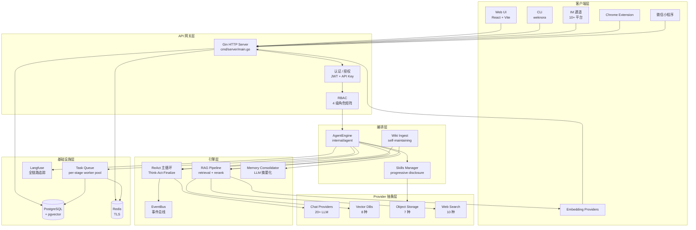
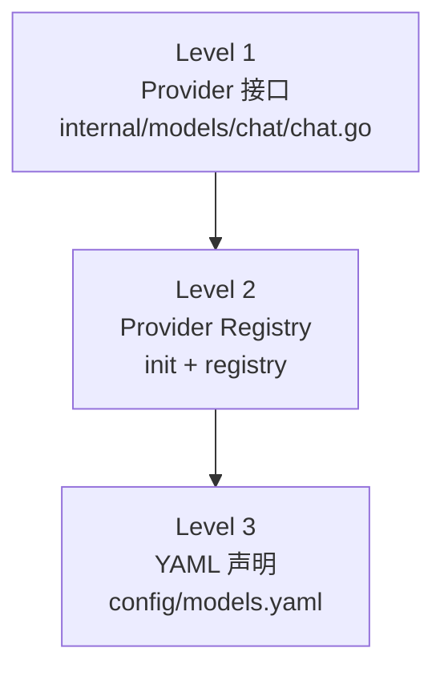
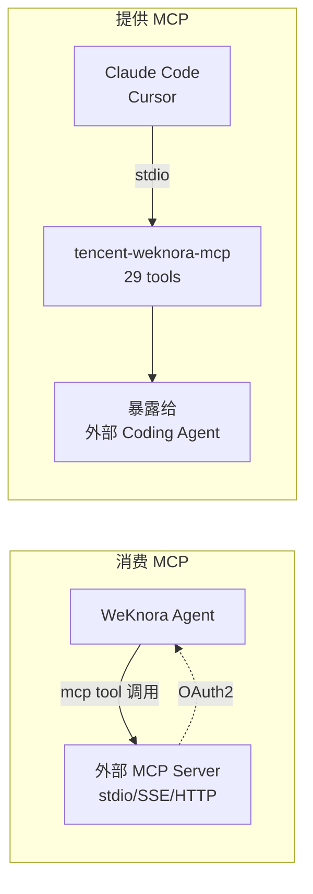
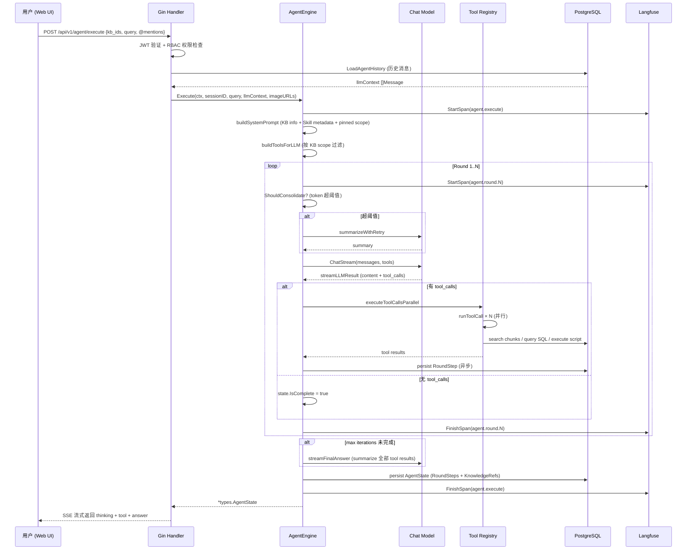

## 一、引子：当 RAG 遇见 Agent

过去两年，**RAG** 与 **Agent** 是 LLM 应用的两条主线：前者解决"喂给模型什么"，后者解决"让模型做什么"。但当企业真正想把两条线拼起来时，会发现一个尴尬的现实 ——

> RAG 框架擅长把文档切成块、塞进向量库、查回来。但当用户问「对比一下 2025 年和 2026 年的产品策略差异」时，需要先 search、再 grep、再 read_doc、再 generate，是**多次工具调用的多轮推理**。
>
> Agent 框架擅长多步推理，但它的"输入"通常是用户 prompt，**对"企业内部文档怎么接入"这件事支持得很薄**。

于是出现了第三条路：**"RAG-as-a-Service" + "Agent-as-a-Service" + "Wiki-as-a-Service"** —— 把企业知识管理的所有动作封装成统一框架。

**腾讯开源的 WeKnora**（⭐19.7k，Apache-2.0 兼容 MIT 条款的 NOASSERTION 许可，Go 语言，109 MB）正是这条路上的代表性项目。它不是又一个 LangChain 或 LlamaIndex，而是一个**端到端的企业级 LLM 知识中台**：

- **RAG 部分**：FAQ / Document / Wiki 三种 KB 类型，BM25 + Dense + GraphRAG 多路召回
- **Agent 部分**：自研 ReAct 主循环，**30+ 内置工具 + MCP 双向集成 + Skills 沙箱执行**
- **Wiki 部分**：Agent 自动将原始文档蒸馏成结构化、互相链接的 Markdown Wiki，**带版本历史、行级 diff、一键回滚**

更关键的是，它引入了三个**别处没有的工程设计**：

1. **`KBCapability × ToolRequirement` 矩阵** —— 工具对知识库能力的依赖被声明式建模，前后端双轨互校，避免"工具默默跳过不兼容 KB"的隐性 bug
2. **Memory Consolidation（内存整合）** —— 在 ReAct 循环里实时监控 token，超阈值时 LLM 摘要化旧消息，保留工具调用边界，**永远不破坏当前轮**
3. **Progressive Disclosure Skills** —— Agent 不一次性读 100 个 skill 全文，而是先看 metadata，按需 `read_skill` 拉全文 + `execute_skill_script` 在沙箱里跑

本篇博客，从架构层到代码层，逐个拆开。

## 二、项目定位与核心价值

### 2.1 一句话定义

**WeKnora = RAG 检索 + ReAct 推理 + Wiki 自维护** 三件套统一为一套企业级 LLM 知识中台，由腾讯微信团队开源，专为多模态/多源文档的企业知识问答设计。

### 2.2 能力矩阵（来源：README + 仓库统计）

| 维度 | 能力 |
|------|------|
| **智能问答** | ReAct 多步推理 / 快速 RAG / Wiki 自维护 / Tool Calling / `@Skill @MCP` 提及 |
| **知识管理** | FAQ + Document + Wiki 三类 KB / 文件夹树 / Chunk 编辑 + 版本 / 批量重解析 |
| **数据源** | 飞书 / 飞书 Drive / Lark / Notion / 语雀 / RSS 多源同步 |
| **文档格式** | PDF / Word / Txt / Markdown / HTML / EPUB / MHTML / 图片 / CSV / Excel / PPT / JSON |
| **检索策略** | BM25 + Dense + GraphRAG + 父子分块 + HNSW 加速的 pgvector（1024 维） |
| **LLM 接入** | OpenAI / Azure / Anthropic / DeepSeek / Qwen / 智谱 / 混元 / 豆包 / Gemini / MiniMax / Ollama / OpenRouter / 20+ |
| **Embedding** | BGE / GTE / 智谱 / OpenAI 兼容 API |
| **向量库** | pgvector / Elasticsearch / OpenSearch / Milvus / Weaviate / Qdrant / Doris / 腾讯 VectorDB |
| **对象存储** | Local / MinIO / AWS S3 / 火山 TOS / 阿里 OSS / 金山 KS3 / 华为 OBS |
| **IM 通道** | 企业微信 / 飞书 / Lark / QQBot / Slack / Telegram / 钉钉 / Mattermost |
| **观测性** | Langfuse 全链路追踪 + 内置 task queue dashboard + 文档解析 timeline |

### 2.3 仓库统计

| 字段 | 值 |
|------|-----|
| 仓库 | `Tencent/WeKnora` |
| Stars | 19,768（截至 2026-08-13） |
| Fork | ~3.5k |
| 主语言 | Go 100% |
| 规模 | 109.7 MB（3,269 个文件，含 1,492 个 Go 源文件） |
| 最新提交 | 2026-08-12（v0.7.2） |
| License | MIT（除第三方组件另有约定） |
| 主页 | <https://weknora.weixin.qq.com> |

### 2.4 核心价值

1. **统一企业文档生命周期** —— 上传、解析、检索、生成 Wiki、对外服务、权限管控，全部在单一框架内闭环
2. **可插拔 Provider 抽象** —— LLM / Embedding / 向量库 / 对象存储全部可换，企业不需要被任何一家云绑定
3. **面向 Agent 时代的设计** —— MCP Server 1.1.x + 官方 `tencent-weknora-mcp` PyPI 包，让外部 Coding Agent 也能接入
4. **多租户 + RBAC + 审计** —— Owner / Admin / Contributor / Viewer 四级角色 + per-KB 资源所有权 + 全审计日志

## 三、整体架构

### 3.1 顶层 5 层架构图



**关键设计哲学**：

- **客户端层故意做薄** —— 5 种接入方式（Web/CLI/Embed/IM/Extension/Mini Program）共用同一 `gin.Engine`，避免「渠道做加法」时的代码爆炸
- **编排层是核心** —— `internal/agent` 包承担了所有决策逻辑（ReAct 循环 + Wiki 生成 + Skills 调用），是 1,492 个 Go 文件里最重要的 ~117 个文件
- **Provider 层严格可换** —— Chat / Embedding / VDB / Storage 全部走接口 + 注册表，启动时通过 YAML 配置装载

### 3.2 后端代码结构

仓库目录结构（来源：`GET /repos/Tencent/WeKnora/git/trees/main?recursive=1`）：

```
cmd/server/main.go                       # 服务入口
internal/
├── agent/                                # Agent 引擎（核心 ~117 文件）
│   ├── engine.go                        # AgentEngine 主类 + Execute 主循环
│   ├── think.go                         # LLM 调用 + 流式响应
│   ├── act.go                           # 工具执行（含并行）
│   ├── finalize.go                      # 最终答案生成
│   ├── memory/consolidator.go           # Memory Consolidation
│   ├── skills/{manager,loader,skill}.go # Progressive Disclosure
│   ├── tools/{30+ 工具}                # 内置工具集
│   ├── prompts.go                       # System Prompt 模板
│   ├── prompts_wiki.go                  # Wiki 生成 Prompt
│   └── observe.go                       # Langfuse 集成
├── application/                          # 应用服务层
├── handler/                              # HTTP handler
├── models/{chat,embedding,rerank,vlm}   # Provider 抽象
├── datasource/                           # 飞书/Notion 等数据源
├── sandbox/                              # Skill 沙箱执行
├── tracing/langfuse/                     # Langfuse 追踪
├── types/                                # 类型定义
└── router/                               # 路由分发
mcp-server/                               # MCP Server 1.1.x
frontend/src/                             # Web UI (React + Vite)
```

> **为什么 agent 包有 117 个文件？** —— 因为 Agent 决策涉及：LLM 流式响应、工具并行执行、Memory 整合、Skills 渐进披露、Wiki 自维护、Langfuse 追踪、Prompt 模板、模型上下文编码（`modelcontext.Registry`）、图片描述（VLM）、敏感参数脱敏……每一项都是独立关注点。

## 四、三种应用类型：FAQ / Document / Wiki

WeKnora 把"知识"分成三种 KB 类型，对应三种使用场景：

| 类型 | 场景 | 检索方式 | Agent 行为 |
|------|------|---------|-----------|
| **FAQ** | 标准问答对，1 问 1 答 | 相似度匹配 + 阈值 | 单轮回答 |
| **Document** | 自由格式文档（PDF/Word 等） | BM25 + Dense + 重排 | 多步推理 + 多文档交叉 |
| **Wiki** | Agent 自动生成的结构化知识 | 双向链接 + 知识图谱 | 持续维护 + 增量更新 |

### 4.1 KBCapability × ToolRequirement 矩阵

**这是 WeKnora 最别致的设计之一。**

每个知识库（KB）声明它"暴露的能力"（Capabilities），每个工具声明它"需要的能力"（Requirements）。Agent 在执行前，会先做 `Require ∩ Capability` 检查，**确保工具不会被用到不兼容的 KB**。

```go
// 来自 internal/agent/tools/capabilities.go:48-65
const (
    CapVector  KBCapability = "vector"
    CapKeyword KBCapability = "keyword"
    CapWiki    KBCapability = "wiki"
    CapGraph   KBCapability = "graph"
    CapFAQ     KBCapability = "faq"
)

type ToolRequirement struct {
    AnyOf         []KBCapability   // 至少匹配一种
    AllOf         []KBCapability   // 必须全部匹配
    ConsumesFiles bool             // 是否接受 @file 提及
}

var ToolCapabilityRequirements = map[string]ToolRequirement{
    "knowledge_search":      {AnyOf: []KBCapability{CapVector, CapKeyword}, ConsumesFiles: true},
    "wiki_search":           {AllOf: []KBCapability{CapWiki}},
    "thinking":              {},
    "shell_exec":            {},  // 仅 Cube sandbox 后端暴露
    // ... 30+ 工具的契约声明
}
```

**前后端双轨互校**（文件顶部注释明确说明）：

> "The frontend uses it to gray out tools and filter KBs in the agent editor and `@` mention menu; the backend uses it as the authoritative last line of defense in the retrieval pipeline — a client that skips the frontend filter (old tab, curl, rogue plugin) shouldn't be able to hand incompatible KBs/files to a tool that would just silently skip them."

即：**前端 `frontend/src/utils/tool-capabilities.ts` 用同样矩阵灰化工具 + 过滤 KB；后端 `capabilities.go` 作为最终防线，拦截绕过前端的 curl 调用**。

> 💡 **设计精髓**：传统 Agent 框架（LangChain、CrewAI）的工具调用靠**运行时 prompt 约束**，「不要把 SQL 工具用在 PDF KB 上」是建议；WeKnora 的 capability 矩阵是**编译期契约**，工具根本不会被注册到不兼容的 KB scope。

### 4.2 @Skill / @MCP 提及：每轮 scope 裁剪

用户输入 `@math_skill` 或 `@feishu_mcp` 后，AgentEngine 会把这轮"固定"的工具集缩到该 scope：

```go
// 来自 internal/agent/engine.go:71-74
type AgentEngine struct {
    pinnedMCPServices    []*PinnedMCPServiceInfo   // 本轮 @mention 的 MCP
    pinnedSkills         []*PinnedSkillInfo        // 本轮 @mention 的 Skill
    ...
}
```

效果：

- 工具列表从"30+ 全集"缩到"当前 KB + 提及的 Skill/MCP"
- System prompt 只注入相关 Skill 的 metadata（Level 1 Progressive Disclosure）
- 减少 LLM 决策空间，降低误调用概率

## 五、核心引擎一：ReAct 主循环

### 5.1 主循环伪代码

ReAct（Reason + Act）是 LLM Agent 的经典范式：模型先「思考」下一步动作，再「执行」工具，再把结果喂回去。WeKnora 的实现走得很深 —— **多轮 ReAct + 并行工具 + 最终答案合成**。

```go
// 来自 internal/agent/engine.go:181-243
func (e *AgentEngine) Execute(
    ctx context.Context, sessionID, messageID, query string,
    llmContext []chat.Message, imageURLs ...[]string,
) (*types.AgentState, error) {
    // 1. 打开顶层 Langfuse span（整次 agent.execute 一棵子树）
    spanCtx, agentSpan := langfuse.GetManager().StartSpan(ctx, ...)
    ctx = spanCtx

    // 2. 初始化 AgentState
    state := &types.AgentState{
        RoundSteps:    []types.AgentStep{},
        KnowledgeRefs: []*types.SearchResult{},
        IsComplete:    false,
        CurrentRound:  0,
    }

    // 3. 构建 system prompt（含 KB 信息 + Skill metadata）
    systemPrompt := e.buildSystemPrompt(ctx)
    messages := e.buildMessagesWithLLMContext(systemPrompt, query, ...)

    // 4. 构建 LLM 工具列表（按当前 KB scope 过滤）
    tools := e.buildToolsForLLM()

    // 5. 进入 executeLoop 主循环
    _, err := e.executeLoop(ctx, state, query, messages, tools, ...)
    ...
}
```

### 5.2 executeLoop 时序图

```mermaid
sequenceDiagram
    participant Caller as 上层 Handler
    participant Engine as AgentEngine
    participant LLM as Chat Model
    participant Tools as Tool Registry
    participant Bus as EventBus
    participant Consolidator as Memory Consolidator
    participant Langfuse as Langfuse

    Caller->>Engine: Execute(ctx, sessionID, query, llmContext)
    Engine->>Langfuse: StartSpan(agent.execute)
    Engine->>Engine: buildSystemPrompt + buildMessages
    Engine->>Engine: buildToolsForLLM (按 KB scope 过滤)

    loop Round 0..N (max iterations)
        Engine->>Langfuse: StartSpan(agent.round.N)
        Engine->>Consolidator: ShouldConsolidate?
        alt token 超阈值
            Consolidator->>LLM: summarizeWithRetry (旧消息)
            Consolidator-->>Engine: 压缩后的 messages
        end

        Engine->>LLM: chatModel.ChatStream (tools=...)
        LLM-->>Engine: streamLLMResult (content + tool_calls)

        alt 有 tool_calls
            alt parallel_tool_calls=true
                Engine->>Tools: executeToolCallsParallel (errgroup)
                par 工具 1
                    Tools->>Tools: runToolCall
                and 工具 2
                    Tools->>Tools: runToolCall
                and 工具 N
                    Tools->>Tools: runToolCall
                end
                Tools-->>Engine: 全部结果 (best-effort, 不互相取消)
            else 单工具
                Engine->>Tools: executeSingleToolCall
            end
            Tools->>Bus: Emit(AgentToolResult)
            Tools->>Bus: Emit(AgentAction)
        else 无 tool_calls (final answer)
            Engine->>Engine: state.IsComplete = true
            break
        end

        Engine->>Bus: Emit(Step)
        Engine->>Langfuse: FinishSpan(agent.round.N)
    end

    alt 超 max iterations 未完成
        Engine->>Engine: handleMaxIterations → streamFinalAnswer
    end

    Engine->>Bus: Emit(AgentComplete) (defer 兜底)
    Engine->>Langfuse: FinishSpan(agent.execute)
    Engine-->>Caller: *types.AgentState
```

**关键设计点**（逐行注释）：

```go
// 来自 internal/agent/engine.go:191-209
// Guarantee exactly-one EventAgentComplete emission on every exit path
// (normal finish, ctx cancel observed at the loop head, or iteration error
// bubbling up while ctx was cancelled).
completionEmitted := false
emitCompletion := func() {
    if completionEmitted {
        return
    }
    completionEmitted = true
    e.emitCompletionEvent(context.WithoutCancel(ctx), state, ...)
}
defer emitCompletion()  // 兜底：无论 panic 还是正常返回，都发一次完成事件
```

**`defer emitCompletion()` 哲学**：Agent 失败模式有 N 种（panic / ctx cancel / 工具超时 / LLM 流中断 / 内存超限），但**前端永远需要知道"这一步结束了"**。所以**统一通过 defer 兜底**发出 `EventAgentComplete`，事件总线订阅者就能可靠地落库 `state.RoundSteps` 到 `assistantMessage.AgentSteps`。

### 5.3 并行工具执行

当 LLM 在一次响应里返回多个 tool_call（搜索 + 读文档 + 算数据），WeKnora 用 `errgroup` 并发执行：

```go
// 来自 internal/agent/act.go:120-149
func (e *AgentEngine) executeToolCallsParallel(
    ctx context.Context, response *types.ChatResponse,
    step *types.AgentStep, iteration int, sessionID, assistantMessageID string,
) {
    n := len(response.ToolCalls)
    results := make([]types.ToolCall, n)
    var mu sync.Mutex
    g, gCtx := errgroup.WithContext(ctx)

    for i, tc := range response.ToolCalls {
        i, tc := i, tc  // 捕获循环变量
        g.Go(func() error {
            toolCall := e.runToolCall(gCtx, tc, i, iteration, round, sessionID, ...)
            mu.Lock()
            results[i] = toolCall
            mu.Unlock()
            return nil  // best-effort: 不要因为一个失败取消兄弟
        })
    }
    _ = g.Wait()  // 不关心 error（已 best-effort）

    // 按原始顺序追加 + 顺序 emit 事件
    for _, toolCall := range results { ... }
}
```

**两个关键决策**：

1. **`return nil` 不传递错误** —— `best-effort` 哲学：单个工具失败**不应该**让其他工具的成果也被丢掉。错误信息会在 `toolCall.Result.Error` 里，下一轮 LLM 会看到。
2. **`results[i] = toolCall` 按原始顺序写** —— `errgroup` 完成顺序是无序的，但 LLM 期望看到「工具 1、工具 2、工具 3」的稳定顺序。所以用 mutex + 索引赋值。

## 六、核心引擎二：Memory Consolidator（内存整合）

### 6.1 问题背景

ReAct 循环跑得越久，`messages` 数组越长。Claude/GPT-4 有 200K context window 但**单价贵**，且**长 context 衰减**：早期消息对模型影响变小。

WeKnora 的方案是 **实时 Memory Consolidation**：

- 监控当前 token 数
- 超阈值（默认 50% of MaxContextTokens）时，**让 LLM 把旧消息摘要成一段 system message**
- 保留「当前轮」（user query + 该轮的 tool_call + tool_result）完整不裁
- 用 `findKeepBoundary` 算法确保不破坏 `tool_call → tool_result` 的成对关系

### 6.2 Consolidator 核心代码

```go
// 来自 internal/agent/memory/consolidator.go:48-65
type Consolidator struct {
    chatModel chat.Chat
    estimator *token.Estimator
    maxTokens int     // context window 大小
    threshold float64 // 触发比例（默认 0.5）
}

func (c *Consolidator) ShouldConsolidate(currentTokens int) bool {
    if c.maxTokens <= 0 {
        return false
    }
    triggerAt := int(float64(c.maxTokens) * c.threshold)
    return currentTokens > triggerAt
}

// 来自 internal/agent/memory/consolidator.go:74-145
func (c *Consolidator) Consolidate(ctx, messages) ([]chat.Message, error) {
    if len(messages) <= 3 {
        return messages, nil  // 太短不合并
    }
    systemMsg := messages[0]

    // 找到「当前轮」的起点：最后一个 user message
    lastUserIdx := 0
    for i := len(messages) - 1; i >= 1; i-- {
        if messages[i].Role == "user" {
            lastUserIdx = i
            break
        }
    }
    if lastUserIdx <= 1 {
        return messages, nil
    }

    history := messages[1:lastUserIdx]      // 旧历史
    tail := messages[lastUserIdx:]           // 当前轮（user + assistant + tools）
    targetTokens := int(float64(c.maxTokens) * c.threshold * 0.6)  // 目标 = 阈值的 60%

    // 计算需要保留多少条消息（从 history 末尾算起）
    keepFromEnd := c.findKeepBoundary(history, targetTokens, &systemMsg, tailTokens)

    if keepFromEnd >= len(history) {
        return messages, nil
    }

    // 待摘要的历史 + 待保留的历史
    toConsolidate := history[:len(history)-keepFromEnd]
    toKeep := history[len(history)-keepFromEnd:]

    // LLM 摘要（带 3 次重试）
    summary, err := c.summarizeWithRetry(ctx, toConsolidate)
    if err != nil {
        // 摘要失败时降级为 raw archive（保留原文，标记 "已归档"）
        summary = c.rawArchive(toConsolidate)
    }

    summaryMsg := chat.Message{
        Role: "system",
        Content: fmt.Sprintf(
            "[Memory Summary - %d earlier messages consolidated]\n\n%s",
            len(toConsolidate), summary,
        ),
    }

    // 拼回：system + summary + 保留的历史 + 当前轮
    return append([]chat.Message{systemMsg, summaryMsg}, append(toKeep, tail...)...), nil
}
```

### 6.3 findKeepBoundary 边界保护

最关键的细节：**永远不破坏 tool_call / tool_result 的配对**。LLM 调用格式要求第 N 条 assistant 消息的 `tool_calls[i]` 必须有第 N+1 条 tool 消息的 `tool_call_id == tool_calls[i].id` 对应。

```go
// 来自 internal/agent/memory/consolidator.go（简化）
func (c *Consolidator) findKeepBoundary(
    history []chat.Message, targetTokens int,
    systemMsg *chat.Message, tailTokens int,
) int {
    // 从 history 末尾往回数，累加 token，碰到 tool_call/tool_result 配对边界则跳过
    keep := 0
    usedTokens := tailTokens
    for i := len(history) - 1; i >= 0; i-- {
        msgTokens := c.estimator.EstimateMessage(&history[i])
        // 如果 i 是 tool 消息（tool role），且它对应的 assistant 在前面被裁掉了，跳过
        if history[i].Role == "tool" {
            if i-1 < 0 || history[i-1].Role != "assistant" {
                continue  // 孤立的 tool，跳过
            }
        }
        // 如果 i 是 assistant 消息且有 tool_calls，下一条必须是 tool role，否则跳过
        if history[i].Role == "assistant" && len(history[i].ToolCalls) > 0 {
            if i+1 >= len(history) || history[i+1].Role != "tool" {
                continue  // 残缺的 assistant，跳过
            }
        }
        if usedTokens + msgTokens > targetTokens {
            break
        }
        usedTokens += msgTokens
        keep++
    }
    return keep
}
```

**为什么这条保护至关重要？** —— 一旦把 tool 消息孤立保留（前面的 assistant 被裁掉），LLM 会抛 `400 Bad Request: messages[N].role=tool without preceding assistant tool_call`。WeKnora 通过 `findKeepBoundary` **宁可多丢一些旧消息，也绝不破坏配对**。

> 💡 **设计哲学对比**：Mem0 / Letta 走"长期记忆外挂"路线 —— 历史消息持久化到向量库，context 只留「当前 + 检索结果」；WeKnora 走"原地摘要"路线 —— 历史还在 message 数组里，但被压缩成 system message。**前者适合长间隔会话，后者适合单次会话内长 ReAct**。

## 七、核心引擎三：Skills（渐进披露的脚本能力）

### 7.1 什么是 Skill

Skills 是 WeKnora 引入的**第三方脚本能力**。开发者把一个目录丢进 `skillDirs`，里面按 `SKILL.md` + 脚本的格式组织，Agent 就能调用。

```yaml
# 示例：skills/data-analysis/SKILL.md
---
name: data-analysis
description: 在沙箱里执行 pandas 分析脚本
allowed-tools: [execute_skill_script, read_skill]
---
# 数据分析技能

你可以用以下方式调用：
1. 先 read_skill 拉完整说明
2. 用 execute_skill_script 在沙箱里跑 Python
3. 结果会写入 /workspace/output/，LLM 可读
```

### 7.2 Progressive Disclosure 三级加载

Skills 借鉴了 Claude Code 的 progressive disclosure 思想，**不是一次性把 100 个 skill 塞进 context**：

| 层级 | 何时加载 | 加载什么 |
|------|---------|----------|
| **Level 1**（Metadata） | 启动 / 每次 system prompt 构建 | `name + description`，小几百字节 |
| **Level 2**（Full Skill） | LLM 主动调 `read_skill` 时 | SKILL.md 全文，几 KB |
| **Level 3**（Execution） | LLM 主动调 `execute_skill_script` 时 | 在 Cube sandbox 跑脚本 |

```go
// 来自 internal/agent/engine.go:114-126
func (e *AgentEngine) systemPromptOptions(ctx context.Context) *BuildSystemPromptOptions {
    opts := &BuildSystemPromptOptions{
        Language: types.LanguageNameFromContext(ctx),
        Config:   e.appConfig,
    }
    if e.skillsManager != nil && e.skillsManager.IsEnabled() {
        // Level 1：只注入 metadata
        opts.SkillsMetadata = e.skillsManager.GetAllMetadata()
    }
    ...
    return opts
}
```

### 7.3 沙箱执行与环境变量契约

技能脚本运行在独立 sandbox（Cube MicroVM），WeKnora 注入三个稳定的环境变量作为「输入 / 输出 / 历史」的约定：

```go
// 来自 internal/agent/skills/manager.go:23-48
const (
    artifactOutputEnvVar   = "WEKNORA_SKILL_OUTPUT_DIR"      // 本轮产物输出目录
    sessionInputEnvVar     = "WEKNORA_SESSION_INPUT_DIR"      // 用户上传文件目录
    artifactHistoryEnvVar  = "WEKNORA_SKILL_HISTORY_ROOT"    // 跨轮历史根目录
)

const defaultArtifactOutputDir = "/workspace/output"
```

**路径解析优先级**（注释清晰说明）：

```
1. WEKNORA_SKILL_OUTPUT_DIR from host env (ops override)
2. defaultArtifactOutputDir = /workspace/output
```

> **为什么用环境变量而不是 CLI 参数？** —— 脚本作者**不知道也不需要知道** WeKnora 的内部路径约定，只要 `os.getenv("WEKNORA_SKILL_OUTPUT_DIR")` 就行。这意味着同一个技能脚本**可以移植到任何实现同一约定的 Agent 框架**，形成事实标准。

## 八、Wiki Mode：Agent 自维护的知识库

### 8.1 核心思想

Wiki Mode 是 WeKnora 最有野心的特性：**让 Agent 把原始文档"蒸馏"成结构化、互相链接的 Markdown Wiki**。每次新文档入库时：

1. **Taxonomy Planning** —— 给当前批次所有 entity/concept 页面**分配目录路径**，确保整批落地到**一棵连贯的树**
2. **Summary 生成** —— LLM 写 summary 页面（**故意不喂文件名**，避免扫描仪生成的 "MX5280.pdf" 这种无意义文件名诱导 hallucination）
3. **Entity / Concept 抽取** —— 提取实体、概念，写独立页面
4. **Wiki-link 强约束** —— 提及时**必须**用 `[[slug|display name]]` 格式，slug 必须用提供的清单
5. **Image 透传** —— 文档里的 `<images>` 标签里的图片用 `` 透传，**URL 必须一字不改**

### 8.2 Taxonomy Planning 的关键 Prompt

```go
// 来自 internal/agent/prompts_wiki.go:8-58
const WikiTaxonomyPlanPrompt = `You are organizing a wiki knowledge base into a navigation directory. Assign each item below to a directory path (category) so the whole set lands on ONE coherent tree.

<existing_folders>
{{.ExistingTaxonomy}}
</existing_folders>

<items>
{{.Items}}
</items>

<instructions>
For every item, output a category path: an array of folder labels from broad to narrow (at most 2 levels). The category classifies WHAT the item fundamentally IS (the stable library "shelf" it always sits on), never the role it plays in one document.

How to choose a path for each item:
1. If an existing folder in <existing_folders> fits, REUSE its EXACT label (character-for-character).
2. If NO existing folder fits, CREATE a new, broad, durable folder for it.
3. Only give an empty path [] when an item genuinely belongs to NO durable subject at all.
...
`
```

**三个核心约束**（带连字符编号）：

- **REUSE 优先** —— 不要造同义文件夹（「春节习俗」已存在就别造「春节 / 传统习俗」）
- **稳定性优先** —— 目录是「图书馆书架」，不是「这个文档里扮演什么角色」
- **失败罕见** —— 「无 matching folder」**不是**空路径的理由，应该新建文件夹

### 8.3 持久化 + 回滚

Wiki 页面写入 PostgreSQL 时**每次提交做一次 snapshot**，形成 revision history。UI 提供：

- **行级 diff**（每行新增/修改/删除彩色标记）
- **一键回滚**（回退到任意历史版本）
- **冲突标记**（两个页面提到同一个事实但描述冲突，LLM 用 `wiki_flag_issue` 标出问题）

```go
// 来自 internal/agent/tools/definitions.go:42-58
ToolWikiReadPage      = "wiki_read_page"
ToolWikiWritePage     = "wiki_write_page"
ToolWikiReplaceText   = "wiki_replace_text"      // 替换段落，保留 diff
ToolWikiRenamePage    = "wiki_rename_page"
ToolWikiDeletePage    = "wiki_delete_page"
ToolWikiSearch        = "wiki_search"
ToolWikiReadSourceDoc = "wiki_read_source_doc"   // 回到原始文档
ToolWikiFlagIssue     = "wiki_flag_issue"        // 标事实冲突
ToolWikiReadIssue     = "wiki_read_issue"
ToolWikiUpdateIssue   = "wiki_update_issue"
```

> 💡 **设计哲学**：传统 RAG 框架（LangChain、LlamaIndex）只关心"怎么检索"。Wiki Mode 关心的是**知识如何长期演化** —— 谁修订过、谁标出问题、能否回滚。这是**企业级知识管理**与**个人级文档问答**的本质区别。

## 九、Provider 抽象层

### 9.1 三级抽象

WeKnora 的 Provider 抽象比 LangChain 更彻底，分三级：



```go
// 来自 internal/models/chat/chat.go（简化）
type Chat interface {
    Chat(ctx context.Context, messages []Message, opts *ChatOptions) (*ChatResponse, error)
    ChatStream(ctx context.Context, messages []Message, opts *ChatOptions) (<-chan StreamResponse, error)
}

// Provider 实例
type OpenAIProvider struct{ ... }
type AnthropicProvider struct{ ... }
type DeepSeekProvider struct{ ... }
// ... 20+ 个具体实现
```

### 9.2 YAML 声明式注册

启动时从 `config/models.yaml` 读 Provider 配置，避免硬编码：

```yaml
# config/models.yaml（伪示例）
providers:
  - name: openai-gpt4o
    type: openai
    api_key: ${OPENAI_API_KEY}
    base_url: https://api.openai.com/v1
    default_model: gpt-4o
    max_tokens: 4096
    thinking_mode: true

  - name: deepseek-reasoner
    type: deepseek
    api_key: ${DEEPSEEK_API_KEY}
    base_url: https://api.deepseek.com
    default_model: deepseek-reasoner

  - name: ollama-local
    type: ollama
    base_url: http://localhost:11434
    default_model: qwen2.5:32b
```

**多 workspace 共享** + **per-KB 模型选择** + **thinking-mode 覆盖** + **embedding-dim 覆盖** —— 一个企业可以"全局 OpenAI-gpt4o + 财务 KB 单独用 deepseek-reasoner + 测试 KB 用本地 Ollama"。

## 十、工具系统与 MCP 双向集成

### 10.1 30+ 内置工具

| 工具 | 能力 |
|------|------|
| `knowledge_search` | 语义检索（dense + BM25 + rerank） |
| `grep_chunks` | 关键词精确搜索（chunk 级） |
| `list_knowledge_chunks` | 列出某文档所有 chunk |
| `query_knowledge_graph` | GraphRAG 关系查询 |
| `get_document_info` | 文档元信息 |
| `database_query` | SQL 检索结构化数据 |
| `data_analysis` / `data_schema` | 数据分析（pandas/duckdb） |
| `web_search` / `web_fetch` | 网络检索 |
| `wiki_*` (10 个) | Wiki 读写改 |
| `read_skill` / `execute_skill_script` | Skills 渐进披露 |
| `list_sandbox_files` / `read_sandbox_file` | 沙箱产物读取 |
| `shell_exec` | 沙箱 shell（仅 Cube 后端） |
| `thinking` / `todo_write` | 元认知工具 |

### 10.2 MCP 双向集成

WeKnora 是**MCP 双向**的典型实现：



**消费侧**：Agent 可以调用任何 MCP server（含 OAuth2 远程），通过 `mcp_tool.go` 适配。

**提供侧**：官方 `tencent-weknora-mcp` PyPI 包，让外部 Coding Agent（Claude Code / Cursor / Continue 等）**通过 MCP 协议操作 WeKnora**：

- 导入文档 / URL / Markdown
- 跨 KB 混合检索
- 知识条目管理

这等于把 WeKnora **变成 Coding Agent 的「企业知识库后端」**，类比 Anthropic 最近提倡的「Agent as Knowledge Backend」模式。

### 10.3 进程隔离 + OAuth

```go
// 来自 internal/agent/tools/mcp_oauth.go:1-30（简化）
// MCP tool 调用在独立 goroutine + context timeout 下执行
// OAuth2 flow 支持 mid-conversation authorization（用户输入 @feishu_mcp 后弹授权）
```

**OAuth2 中途授权**：用户中途 `@feishu_mcp`，Agent 检测到未授权 → 触发 OAuth flow → 用户在浏览器完成 → 回调注入 token → 继续调用。无需提前配置。

## 十一、端到端数据流

### 11.1 单次"用户提问 → 答案"全链路



## 十二、与同类项目对比

| 维度 | WeKnora | LangChain | LlamaIndex | Dify | Haystack |
|------|---------|-----------|------------|------|----------|
| **定位** | 企业知识中台（RAG + Agent + Wiki） | LLM 应用编排框架 | 数据连接 + RAG | BaaS + 工作流 | NLP 管道 |
| **核心抽象** | KB × Tool × Skill | Chain / Runnable | Index / QueryEngine | App / Workflow | Pipeline / Component |
| **ReAct Agent** | ✅ 自研主循环 | ✅ LangGraph | ⚠️ ReActAgent | ✅ Workflow | ⚠️ 基础实现 |
| **Memory Consolidation** | ✅ LLM 摘要 + 边界保护 | ❌ 外部存储 | ⚠️ ChatMemoryBuffer | ⚠️ 简单裁剪 | ❌ |
| **KBCapability 矩阵** | ✅ 前后端双轨 | ❌ | ❌ | ⚠️ 类型筛选 | ❌ |
| **Progressive Disclosure Skills** | ✅ 三级加载 | ❌ | ❌ | ⚠️ Plugin | ❌ |
| **Wiki 自维护** | ✅ Taxonomy + 版本回滚 | ❌ | ❌ | ❌ | ❌ |
| **MCP 双向** | ✅ 消费 + 提供 | ⚠️ 仅消费 | ⚠️ 仅消费 | ⚠️ 提供 | ❌ |
| **多租户 + RBAC** | ✅ 4 级角色 + per-KB 所有权 | ❌ | ❌ | ✅ | ❌ |
| **观测性** | ✅ Langfuse 完整集成 | ✅ LangSmith | ⚠️ LlamaTrace | ✅ 自研 | ⚠️ 基础 |
| **License** | MIT（部分 NOASSERTION） | MIT | MIT | Apache-2.0 | Apache-2.0 |
| **语言** | Go 100% | Python + TS | Python | Python + TS | Python |
| **规模** | 109 MB / 3269 文件 | 60 MB+ | 50 MB+ | 250 MB+ | 30 MB+ |
| **GitHub Stars** | 19.7k | 90k+ | 51.6k | 90k+ | 26k |

### 12.1 关键设计差异

**vs LangChain / LlamaIndex**：两者都是**编程库**（library），开发者基于它写代码；WeKnora 是**应用平台**（platform），自包含 Web UI + RBAC + 审计，**开箱即用**给企业。

**vs Dify**：Dify 是 BaaS + 低代码工作流；WeKnora 是 Go 自研核心 + 企业级后端。**前者适合「业务人员搭 chatbot」，后者适合「IT 部门给业务部门部署私有知识库」**。

**vs Haystack**：Haystack 是 NLP pipeline 工具，专注 retrieval；WeKnora 把 retrieval 当作 ReAct Agent 的一个工具，**视角是 Agent 主导而非 pipeline 主导**。

> 💡 **总结**：WeKnora 的真正差异化是**「企业级 LLM 知识管理的完整闭环」** —— 不是单一最强的 RAG 或 Agent，而是把 RAG / Agent / Wiki / RBAC / 观测性 / 数据源同步 / IM 通道全部塞进一个 Go 二进制，对企业「开箱即用」。

## 十三、优缺点分析

### 13.1 左侧：架构 / 扩展性 / 易用性

| 维度 | 评价 |
|------|------|
| **架构简洁性** | ⭐⭐⭐⭐⭐ Go 单二进制 + internal 包边界清晰，1192 个源文件按职责分到 13 个子包 |
| **扩展性** | ⭐⭐⭐⭐⭐ Provider 接口 + 注册表 + YAML 声明，三轴可换；新 LLM/向量库/存储/Skill 加一行 YAML 即可 |
| **易用性** | ⭐⭐⭐⭐ Web UI 即开即用 + Chrome Extension + Mini Program + 10+ IM 渠道，零代码可上手 |
| **文档完整度** | ⭐⭐⭐⭐⭐ docs/wiki/ 28 篇中文文档 + 官方 VitePress 文档站（50 页 / 360 API endpoints / 150 env vars） |
| **可观测性** | ⭐⭐⭐⭐⭐ Langfuse 全链路 + 内置 task-queue dashboard + 文档解析 timeline，调试体验顶级 |

### 13.2 右侧：性能 / 复杂度 / 维护性

| 维度 | 评价 |
|------|------|
| **启动性能** | ⭐⭐⭐ 容器启动需初始化多个 Provider + 数据库迁移，Docker 冷启约 30s |
| **运行时性能** | ⭐⭐⭐⭐ ReAct 单轮 LLM 调用 1-3s，并行工具 + Cube 沙箱执行快；Memory Consolidation 会引入额外 LLM 调用 |
| **复杂度** | ⭐⭐ 三级 Provider 抽象 + KBCapability 矩阵 + EventBus + modelcontext.Registry，**学习曲线陡**，新贡献者需 2-4 周熟悉 |
| **维护性** | ⭐⭐⭐⭐ 代码注释密度高（每个非显然设计都有 5-30 行「Why this」注释），但单文件 91KB（如 `engine.go`）对新人挑战 |
| **依赖锁定** | ⭐⭐⭐ pgvector / Redis / 多种 IM SDK 强依赖，**全栈自托管**最低需要 PostgreSQL 15+ + Redis 7+ |

### 13.3 综合判断

| 适合 | 不适合 |
|------|--------|
| 中大型企业的私有知识库（50-5000 人） | 个人开发者的小玩具 |
| 需要「文档 → Wiki」自演化的场景 | 只想要纯检索（直接用 LlamaIndex） |
| 多 IM 渠道（飞书/企业微信/Slack）+ 多端访问 | 单一 Web 端访问 |
| 强合规审计（金融/医疗/政务） | 不需要审计的场景 |
| 已有 PostgreSQL + Redis 运维能力 | 没运维资源（直接用 Dify SaaS） |

## 十四、实践 / 部署

### 14.1 Docker 快速启动

```bash
# Clone 仓库
git clone https://github.com/Tencent/WeKnora.git
cd WeKnora

# 复制环境模板
cp .env.example .env
# 编辑 .env：填入 OPENAI_API_KEY 或 DEEPSEEK_API_KEY

# 一键启动（PostgreSQL + Redis + App + Frontend）
docker compose up -d

# 验证
curl -s http://localhost:8080/api/v1/health | jq .
# {"status":"ok","version":"0.7.2"}
```

### 14.2 通过 MCP 让 Claude Code 接入

```bash
# 安装官方 MCP 包
pip install tencent-weknora-mcp

# 配置 Claude Code
cat > ~/.claude/mcp_servers.json << EOF
{
  "mcpServers": {
    "weknora": {
      "command": "python",
      "args": ["-m", "tencent_weknora_mcp"],
      "env": {
        "WEKNORA_BASE_URL": "http://localhost:8080",
        "WEKNORA_API_KEY": "your-api-key"
      }
    }
  }
}
EOF

# 重启 Claude Code，验证 29 个工具已注册
# 在 Claude Code 中：/mcp list
```

### 14.3 Python SDK 直接调用

```python
# 伪代码示例：导入文档 + 跨 KB 检索
import httpx
from tencent_weknora import WeKnoraClient

client = WeKnoraClient(
    base_url="http://localhost:8080",
    api_key="wk_xxxxxxxxxxxx",
    tenant_id="default",
)

# 1. 创建 KB
kb = client.knowledge_bases.create(
    name="产品手册",
    type="document",
    capabilities=["vector", "keyword"],
)

# 2. 导入文档
doc = client.documents.upload(
    kb_id=kb.id,
    file="./product-manual.pdf",
    process_config={"parser": "pdf", "chunk_size": 512},
)

# 3. 触发 Wiki 模式生成
client.wiki.ingest(kb_id=kb.id)

# 4. 跨 KB 检索 + Agent 推理
result = client.agent.execute(
    query="对比 2025 和 2026 产品策略差异",
    kb_ids=[kb.id],
    mentions=["@feishu_mcp"],   # 注入飞书 MCP
    stream=True,
)

async for chunk in result:
    print(chunk.content, end="", flush=True)
```

### 14.4 Kubernetes Helm 部署

```bash
# 添加 Helm repo（假设）
helm repo add weknora https://weknora.weixin.qq.com/charts
helm install weknora weknora/weknora \
  --namespace weknora --create-namespace \
  --set global.image.tag=v0.7.2 \
  --set postgresql.persistence.size=100Gi \
  --set app.replicaCount=3 \
  --values values-prod.yaml
```

## 十五、趋势与总结

### 15.1 三个关键趋势

**1. 「RAG + Agent + Wiki」三件套成为企业 LLM 应用的事实标准**

过去两年 RAG 和 Agent 各自发展。2026 H2 开始，企业意识到「知识管理」是连续动作：上传（摄取）→ 检索（RAG）→ 推理（Agent）→ 演化（Wiki）。WeKnora 把这四步统一在一个 Go 二进制里，**企业不再需要拼装 LangChain + LlamaIndex + 向量库 + Web UI + RBAC**。

**2. 「MCP 双向」让 RAG 框架成为 Coding Agent 的后端**

`tencent-weknora-mcp` PyPI 包是这趋势的早期信号：未来 6-12 个月，**几乎所有企业 RAG 框架都会提供 MCP Server** —— 让 Claude Code / Cursor / Continue 等 Coding Agent 能直接操作企业知识库。WeKnora 已经是这个方向的开山之作之一。

**3. 「渐进披露 (Progressive Disclosure)」取代「全量 prompt」**

100 个 skill 全塞 system prompt 不再可行 —— 成本高、决策差。WeKnora 的三级加载（metadata → full → execute）借鉴 Claude Code，未来会成为 Agent 框架的标准模式：**先告诉 LLM「有什么能力」，按需拉详细说明**。

### 15.2 工程经验提炼

| 经验 | WeKnora 的做法 |
|------|----------------|
| 兜底事件 | `defer emitCompletion()` 无论成败都发 AgentComplete |
| 并行工具 | errgroup + 索引赋值 + best-effort 不互相取消 |
| Memory 边界保护 | 宁可多丢旧消息也不破坏 tool_call/tool_result 配对 |
| Capability 契约 | KBCapability 矩阵前后端双轨，避免隐性 skip |
| Sandbox 隔离 | Cube MicroVM + 三环境变量约定（WEKNORA_SKILL_*） |
| Wiki 稳定性 | 「REUSE 已存在文件夹」是首选，不要造同义词文件夹 |
| 观测性先行 | Langfuse 全链路 + 每轮 span + 工具输出截断到 4KB |
| 文档即代码 | docs/wiki/ 28 篇中文文档 + VitePress 自动部署 |

### 15.3 写在最后

WeKnora 不是「又一个 RAG 框架」，也不是「又一个 Agent 框架」，而是**「企业级 LLM 知识中台」这条赛道上的开山之作**。它的 `KBCapability × ToolRequirement` 矩阵、Memory Consolidation 边界保护、Progressive Disclosure Skills、自维护 Wiki Mode、四级 RBAC + 全审计 —— 这些设计共同回答一个问题：

> **当企业内部有 10 万份文档、5000 名员工、20 个 IM 渠道、3 种合规要求时，「让 LLM 用企业知识」这件事到底需要什么？**

WeKnora 的答案是：**一套开箱即用的 Go 单二进制 + 完整的 Web UI + 多端接入 + 观测性 + 审计**。

这是 2026 H2 中国开源生态在「LLM 应用基础设施」方向交出的高分答卷。

## 附录：关键资源

| 资源 | 链接 |
|------|------|
| GitHub | <https://github.com/Tencent/WeKnora> |
| 官网 | <https://weknora.weixin.qq.com> |
| 官方文档 | <https://weknora.weixin.qq.com/docs> |
| Chrome Extension | <https://chromewebstore.google.com/detail/jpemjbopikggjlmikmclgbmkhhopjdgd> |
| ClawHub Skill | <https://clawhub.ai/lyingbug/weknora> |
| MCP Server (PyPI) | `pip install tencent-weknora-mcp` |
| License | MIT（除第三方组件另有约定） |
| Changelog | <https://github.com/Tencent/WeKnora/blob/main/CHANGELOG.md> |