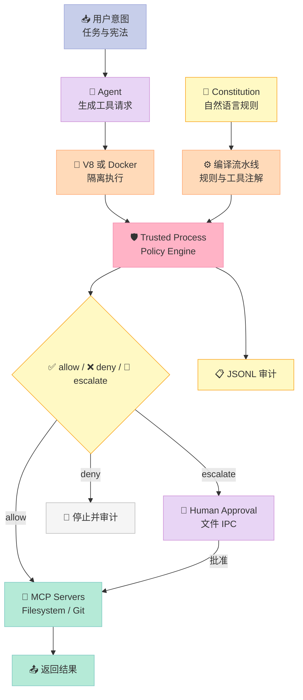

## 引子：把“请勿执行危险操作”变成不可绕过的内核

如果 Agent 要替你运行 `git push`、读取 SSH 密钥或访问外部服务，真正危险的不是它“会不会犯错”，而是**一次 Prompt Injection 是否能把模型的临时意图变成真实副作用**。

**IronCurtain 的关键判断很明确：模型永远不可信。** 用户先用自然语言写“宪法”（constitution），系统再把它编译成可执行的规则；运行时由确定性代码检查每一次工具调用，而不是让模型临场决定“这条命令是否安全”。

> 这不是把安全提示词写得更长，而是把提示词变成边界：Agent 只能提出请求，真正的 `allow / deny / escalate` 由 Harness 安全内核决定。

## 一、项目定位：它属于 Harness 哪一件套？

| 组件 | 关联程度 | 作用 |
|---|---:|---|
| Rule | 强 | 用自然语言表达治理意图，编译成运行时规则 |
| MCP | 强 | 用标准 MCP 请求承载文件、Git、网络等副作用 |
| Script / Sandboxing | 强 | V8 isolate、容器、OS 沙箱和策略执行器 |
| Skill / Sub-Agent | 弱相关 | 负责角色流程，但安全边界不依赖角色声明 |
| Workflow | 辅助 | 可对不同工作流、Persona、会话复用或热切换规则 |

**核心定位**：一个**安全内核（Security Kernel）**：把 LLM 的“我想做”变成系统可审计、可拒绝、可升级审批的“我可以请求”。

截至本文调研时，仓库显示约 576 stars，2026-08-13 仍有提交；项目同时声明自己是 research prototype，因此应把它当作有启发性的架构样本，而不是已经完成形式化验证的安全产品。

## 二、整体架构：四层边界，而不是一句 System Prompt



### 数据流拆开看

1. 用户写入宪法与任务；Agent 在沙箱中生成结构化 MCP 请求。
2. 工具注解把参数映射为 `path`、`url` 等角色，避免只靠工具名判断。
3. Trusted Process 先执行结构不变量，再执行编译后的规则。
4. `allow` 直接调用真实 MCP Server；`escalate` 进入人工审批；`deny` 终止并记录。
5. 结果、模型调用和决策写入审计或诊断文件，形成事后可解释的证据链。

## 三、核心机制：自然语言如何变成确定性规则？

### 3.1 机制与策略分离

IronCurtain 最有价值的设计，是把“如何决策”拆成两层：

| 层 | 能否被宪法覆盖 | 例子 |
|---|---:|---|
| 结构不变量 | ❌ 不可以 | protected path、未知工具、路径是否越出 sandbox |
| 编译规则 | ✅ 可以 | 某类 Git 命令需要审批、特定域名允许访问 |

源码注释把优先级写得非常清楚：`deny > escalate > allow`。同一条规则内部，先处理路径和域名，再处理 server/tool 等非路径条件；如果无法完整解释参数，默认拒绝。

这种拆分的工程意义是：**用户可以放宽业务策略，但不能用自然语言把安全底座抹掉。** 例如，宪法可以说“允许推送到公司仓库”，却不能把“禁止读取 SSH 私钥”的结构约束删掉。

### 3.2 真实策略模型：最小可执行 Python 模拟

下面的代码没有伪造项目 API，而是把源码中的“两阶段 + 最严格结果获胜”原语压缩成可运行 Python。它可以独立执行，适合复刻实验。

```python
from dataclasses import dataclass, replace
from enum import IntEnum
from pathlib import PurePosixPath
from typing import Callable, Iterable

class Decision(IntEnum):
    ALLOW = 0
    ESCALATE = 1
    DENY = 2

@dataclass(frozen=True)
class Call:
    server: str
    tool: str
    args: dict

@dataclass(frozen=True)
class Rule:
    servers: frozenset[str]
    tools: frozenset[str]
    paths: tuple[str, ...]  # 允许空；空表示不约束路径
    verdict: Decision

def inside(path: str, root: str) -> bool:
    a, b = PurePosixPath(path).parts, PurePosixPath(root).parts
    return len(a) >= len(b) and a[:len(b)] == b

def evaluate(call: Call, protected: set[str], sandbox: str, rules: Iterable[Rule]) -> Decision:
    # 结构不变量：未知工具绝不能靠规则放行。
    if call.server == "filesystem" and call.tool not in {"read", "write"}:
        return Decision.DENY

    requested = [str(call.args.get("path", ""))]
    for path in requested:
        if not path:
            return Decision.DENY
        if any(inside(path, p) for p in protected):
            return Decision.DENY
        if not inside(path, sandbox):
            return Decision.DENY

    result = Decision.ALLOW
    for rule in rules:
        if rule.servers and call.server not in rule.servers:
            continue
        if rule.tools and call.tool not in rule.tools:
            continue
        if rule.paths and not all(inside(path, rule.paths[0]) for path in requested):
            continue
        result = max(result, rule.verdict, key=int)
    return result

rules = [
    Rule(frozenset({"filesystem"}), frozenset({"write"}), ("/workspace",), Decision.ESCALATE)
]
assert evaluate(Call("filesystem", "write", {"path": "/workspace/a.txt"}), {"/etc"}, "/workspace", rules) == Decision.ESCALATE
assert evaluate(Call("filesystem", "read", {"path": "/etc/passwd"}), {"/etc"}, "/workspace", rules) == Decision.DENY
assert evaluate(Call("filesystem", "exec", {"path": "/workspace/a"}), {"/etc"}, "/workspace", rules) == Decision.DENY
print("IronCurtain-style policy: OK")
```

这段示例体现三个工程原则：参数是策略对象，而不是模型自然语言；不可判定时默认拒绝；规则可以热替换，但物理边界不应交给模型解释。

### 3.3 真实 TypeScript：双层策略引擎的精简版

IronCurtain 的 `policy-engine.ts` 是 TypeScript 实现。下面的可运行版本保留了源码中最关键的结构：先做结构检查，再在规则链中按“更严格优先”合并结果。

```typescript
type Verdict = "allow" | "escalate" | "deny";
type Call = { server: string; tool: string; args: Record<string, unknown> };
type Rule = { servers: string[]; tools: string[]; verdict: Verdict };

const rank: Record<Verdict, number> = { allow: 0, escalate: 1, deny: 2 };
const protectedRoots = ["/etc", "/home/user/.ssh"];

function inside(path: string, root: string): boolean {
  const a = path.split("/").filter(Boolean);
  const b = root.split("/").filter(Boolean);
  return b.every((part, i) => a[i] === part);
}

function evaluate(call: Call, rules: Rule[]): Verdict {
  // 结构不变量优先，且无法识别的工具不能进入规则链。
  if (call.server === "filesystem" && call.tool !== "read" && call.tool !== "write") {
    return "deny";
  }
  const path = String(call.args.path ?? "");
  if (!path || protectedRoots.some((root) => inside(path, root))) return "deny";
  if (!inside(path, "/workspace")) return "deny";

  return rules
    .filter((r) => r.servers.includes(call.server) && r.tools.includes(call.tool))
    .reduce<Verdict>((best, r) => rank[r.verdict] > rank[best] ? r.verdict : best, "allow");
}

const result = evaluate(
  { server: "filesystem", tool: "write", args: { path: "/workspace/a.txt" } },
  [{ servers: ["filesystem"], tools: ["write"], verdict: "escalate" }],
);
if (result !== "escalate") throw new Error(`unexpected: ${result}`);
console.log("IronCurtain-style TypeScript policy: OK");
```

## 四、与同类方案的设计差异

| 项目 | 核心抽象 | 安全边界 | 机制与策略 | 适合场景 |
|---|---|---|---|---|
| **IronCurtain** | constitution → compiled policy → MCP proxy | V8 / Docker + trusted process | 结构不变量与编译规则明确分层 | 需要高风险工具治理的研究型 Agent |
| **OpenSandbox** | 统一 sandbox API + SDK | 容器运行时与统一资源面 | 把资源生命周期做成平台 API | Coding、GUI、评测与 RL 的通用沙箱 |
| **Microsoft MCP Gateway** | session-aware MCP data/control plane | 路由、认证、生命周期管理 | 网关负责管理，不直接定义自然语言宪法 | 多租户 MCP 服务部署与统一治理 |
| **AgentScope Runtime** | Agent runtime + tool sandbox + API/observability | 集成式运行平台 | 框架内建安全能力，抽象更宽 | Python Agent 应用快速生产化 |

### 设计差异的关键，不是“有没有沙箱”

- **IronCurtain** 把策略表达放在 Harness 核心：`constitution` 是面向人的入口，`compiled-policy` 是运行时真正执行的对象。
- **OpenSandbox** 更像一个通用资源抽象：把 Docker/Kubernetes、文件操作和命令执行统一起来，调用方主要消费 SDK。
- **MCP Gateway** 解决“多个 MCP 服务如何被管理”，IronCurtain 解决“Agent 发出某次 MCP 调用前是否应该执行”。
- **AgentScope Runtime** 把运行时、工具沙箱、API 和可观测性整合成框架；IronCurtain 则把可验证的决策点收缩到一个可信进程。

这意味着四者可以组合：OpenSandbox 提供容器，IronCurtain 提供 Policy Gateway，MCP Gateway 负责会话与路由，AgentScope Runtime 负责 Agent 生命周期。**把它们误当成同一种产品，会导致安全责任边界重叠或留白。**

## 五、优缺点：按左侧与右侧看

| 左侧：架构简洁性 / 扩展性 / 易用性 | 右侧：性能 / 复杂度 / 维护性 |
|---|---|
| ✅ 两层策略模型清楚，新增工具只需补充注解和规则 | ⚠️ 规则编译、路径解析、动态列表和审批 IPC 增加运行时步骤 |
| ✅ MCP 作为统一副作用出口，天然适合工具治理 | ⚠️ V8、Docker、MCP Proxy、MITM Proxy 与审计同时存在，部署复杂度高 |
| ✅ 允许、拒绝、升级三种结果比二值授权更符合真实工作流 | ⚠️ 每次工具调用都要检查结构约束，安全收益换来了同步开销 |
| ✅ 自然语言宪法降低业务规则书写门槛 | ❌ LLM 编译出的规则仍需生成测试、版本化和人工验证 |
| ✅ Docker 模式可接入 Claude Code、Goose 等外部 Agent | ❌ 研究原型，API、配置格式和威胁边界仍可能变化 |
| ✅ 审计和 escalation 为失败解释提供证据 | ⚠️ 沙箱不可用时默认 warn，运维不当可能退化为非安全模式 |

## 六、Less is More 与 Bitter Lesson

### 模型不必学会的东西

模型可以学习“解释路径意图”，但不应被授予读取任意主机文件、直接执行 shell 或自行决定权限的能力。**权限判断属于外部物理世界规则**：只有 Host OS、容器或 trusted process 才能真实做到“不可读”“不可出网”或“不可写”。

### 聪明但可能被淘汰的代码

1. **大量路径、域名、动态列表匹配逻辑**：会持续增加，但它们是输入语义与物理资源之间的真实接口。
2. **把自然语言规则直接塞进 System Prompt**：这是 Bitter Lesson 的反例。模型变强并不会让系统获得内核级隔离。
3. **为每个模型写专门工具适配**：应通过 MCP、结构化请求和注解解耦；否则模型迁移会产生高维护成本。

因此，IronCurtain 最可复制的不是某个正则，而是**把策略从模型提示中拿出去，再把 MCP 请求放回一个可审计的 trusted boundary**。

## 七、从零搭建：最小可行 Harness

### 必须保留的四个模块

1. **请求协议**：`server / tool / args` 结构化，不允许模型直接传 shell。
2. **结构不变量**：未知工具、路径越界、受保护路径一律拒绝。
3. **确定性策略引擎**：规则按优先级合并，缺失信息默认拒绝。
4. **审计与升级**：每次决策可解释；敏感动作可以转人工审批。

### 暂时可以省略

- 不必第一天就做 V8 isolate、Docker 和 MITM；先用一个独立进程代理工具。
- 不必让宪法 LLM 编译复杂动态列表；先用固定 YAML 验证决策语义。
- 不必接几十个 MCP Server；先用 filesystem 与 Git 两类工具覆盖真实攻击面。

### 实际踩坑预警

- **路径字符串不等于真实路径**：symlink、规范化路径和根目录边界必须单独处理。
- **工具名相同不代表参数角色相同**：`repo_path`、`file`、`url` 的治理语义不同。
- **规则不能只写“禁止危险命令”**：Agent 可能改用等价 API，必须在能力出口上检查。
- **自然语言规则要经过对抗性测试**：至少覆盖越界路径、未知工具、URL 重定向和审批绕过。
- **Docker 并不自动等于隔离**：挂载目录、网络、凭证注入和 privileged 能力都要显式配置。
- **审批通道也要成为不可绕过的边界**：不要让 Agent 自己生成“用户已批准”的文件。

## 八、趋势判断

安全 Harness 的方向会从“更长的 Prompt”转向**可编译的治理层**：用户表达意图，系统验证规则，运行时执行不可变的不变量。真正成熟的形态还要补上规则版本、策略回放、红队测试和跨 Agent 策略分发。

IronCurtain 最有价值的信号不是 stars 数量，而是它把 **Rule、MCP、Docker 沙箱与脚本式工具调用**拼成了一条可信链路。下一次 Agent 框架升级时，模型可以替换，安全请求协议、策略优先级和审计语义不应随之消失。

## 总结与行动建议

如果你要复刻一个安全 Harness，今天先做这四件事：定义结构化工具协议；写 protected-path 与 unknown-tool 两个硬约束；实现 `deny > escalate > allow` 的确定性合并；最后再给 filesystem 和 Git 加真实审计。

不要先问“如何让 Agent 更聪明”，先问“它发出的每一个副作用，谁有最终决定权？”把答案固定在代码和操作系统边界里，才是 Harness Engineering 对可靠性最实际的贡献。

## 参考资料

- [IronCurtain GitHub 仓库](https://github.com/provos/ironcurtain)
- [README：Architecture 与威胁模型](https://github.com/provos/ironcurtain#architecture)
- [SANDBOXING.md：分层安全架构](https://github.com/provos/ironcurtain/blob/main/SANDBOXING.md)
- [Policy Engine 源码](https://github.com/provos/ironcurtain/blob/main/src/trusted-process/policy-engine.ts)
- [SECURITY.md：五层安全说明](https://github.com/provos/ironcurtain/blob/main/SECURITY.md)
- [OpenSandbox](https://github.com/opensandbox-group/OpenSandbox)
- [Microsoft MCP Gateway](https://github.com/microsoft/mcp-gateway)
- [AgentScope Runtime](https://github.com/agentscope-ai/agentscope-runtime)
