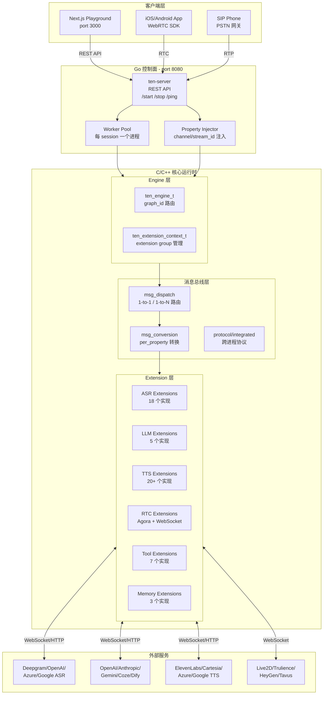
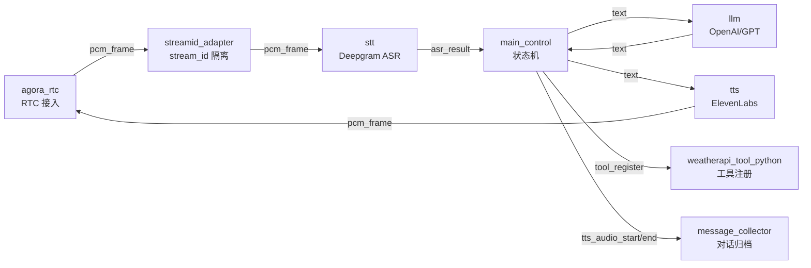
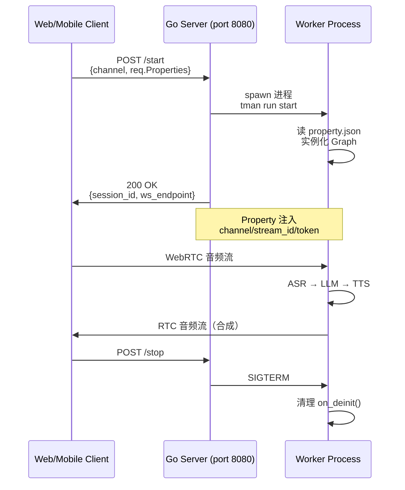
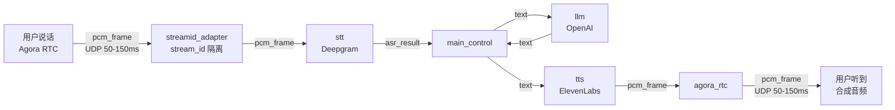
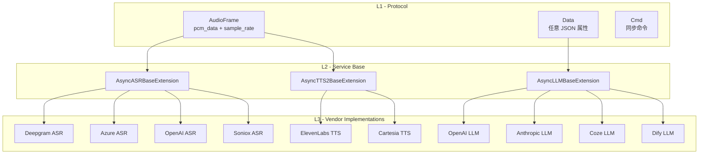
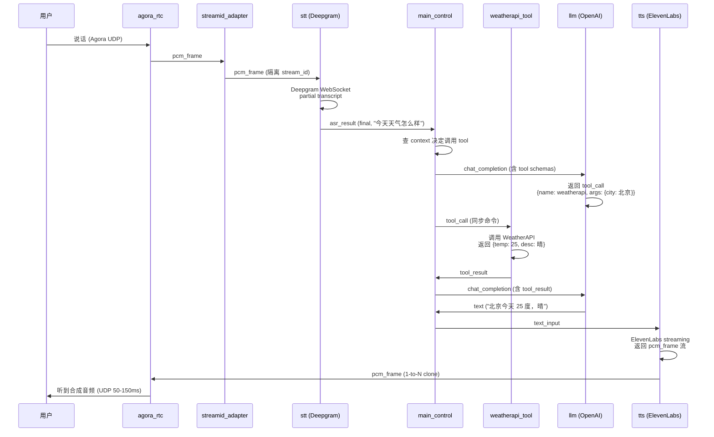

# 【TEN Framework】核心架构与设计原理深度解析

> **用 Graph 数据流编排实时多模态 AI Agent —— 让 STT、LLM、TTS、RTC 工具像乐高积木一样组合**

## 一、引子

2026 年的实时多模态 AI 赛道，**架构之争已经从「单 LLM 包装」升级到「数据流编排」**。

当我们想搭一个语音助手，脑子里第一反应是：选 Deepgram 做 ASR，OpenAI 做 LLM，ElevenLabs 做 TTS，再用 Agora 或 WebRTC 做传输。但**真正写代码时遇到的痛点**：

- **协议不同**：每个 SaaS 的 API 都不一样，OpenAI Realtime 用 WebSocket + JSON event，Deepgram 用 WebSocket + JSON，Agora RTC 用 UDP + 二进制帧，ElevenLabs 用 HTTP 同步流 —— **4 个协议，4 套代码**
- **延迟耦合**：TTS 要等 LLM 完整响应才能开始流式播放，STT 要等 VAD 检测到静音才能 finalize —— **传统串行调用让端到端延迟堆到 2-5 秒**
- **状态同步**：用户打断、ASR 重连、TTS flush、LLM cancel —— **4 个组件的 lifecycle 各管各的，状态机复杂到爆炸**
- **多模态扩展**：用户上视频了，要加 Vision；用户上 avatar 了，要加 Live2D；用户要打电话了，要加 SIP —— **架构根本不抽象这一层**

Pipecat 用 **Frame-as-data + asyncio.PriorityQueue** 解决了协议层抽象，LiveKit Agents 用 **自研 protocol** 解决了协议层封装。但**两者都没解决「业务图编排 + 跨进程扩展 + 多协议转换」**这个更高维度的问题。

**TEN Framework** 给出了第三条路 —— **Graph 数据流编排 + 声明式 Property + msg_conversion 跨协议转换 + C/Python/Go/Node.js 多语言运行时**：

- ⭐ **11,043 stars**（持续 5 个月高增长）
- 核心运行时 **C/C++ 实现**（亚毫秒级消息路由）
- **90+ 现成扩展**（18 ASR + 20+ TTS + 5 LLM + 4 VAD + 6 Avatar + 7 Tool + 8 Memory）
- **RTC-first 设计**（Agora UDP 50-150ms 延迟，WebSocket 仅作 signaling）
- **msg_conversion 引擎**（自动跨协议转换，不同消息类型间的属性映射规则）
- **Go 控制面 + Python/Node.js Worker**（Master-Worker 模式，每个 session 独立进程）

今天这篇博客，我们深入 TEN 的源码，搞清楚这套架构的 8 大核心抽象、5 层运行时、以及为什么 2026 H2 的实时 Agent 框架都要走「Graph + 数据流 + 跨协议转换」这条路。

---

## 二、项目定位与核心价值

### 2.1 一句话定义

**TEN Framework** 是一个**用 Graph 数据流编排实时多模态 AI Agent 的开源框架**。它的核心创新是：**把 ASR、LLM、TTS、RTC、Tool、Memory 这些异构组件抽象成 Graph 节点，用声明式 JSON Property 定义消息路由，用 msg_conversion 引擎处理跨协议属性转换**。

### 2.2 能力矩阵

| 能力维度 | TEN Framework | Pipecat | LiveKit Agents |
|---------|---------------|---------|----------------|
| 核心语言 | **C/C++ + 4 绑定** | Python 100% | TypeScript/Go |
| 编排模型 | **Graph + Property JSON** | Pipeline + Frame | Protocol |
| 协议转换 | **msg_conversion 引擎** | 手写 FrameProcessor | Protocol Adapter |
| 多模态 | **Audio + Video + Avatar + SIP** | Audio + Video | Audio + Video |
| RTC 默认 | **Agora（UDP 50-150ms）** | WebSocket | LiveKit 自家 SFU |
| 扩展数 | **90+ 现成** | 60+ | 50+ |
| 进程模型 | **Master-Worker（每 session）** | 单进程 | 单进程 |
| License | Apache-2.0 + 附加条款 | BSD-2-Clause | Apache-2.0 |

### 2.3 仓库统计

- **GitHub**: [TEN-framework/ten-framework](https://github.com/TEN-framework/ten-framework)
- **⭐**: 11,043
- **主语言**: Python（扩展）+ Go（控制面）+ C/C++（核心运行时）
- **License**: Apache-2.0 with additional conditions
- **Size**: 126 MB
- **pushed_at**: 2026-08-13（持续活跃）
- **Topics**: ai, multi-modal, real-time, video, voice
- **生态**: TEN Framework + TEN VAD + TEN Turn Detection + Agent Examples + Portal

---

## 三、整体架构

TEN 的架构可以概括为 **「1 个运行时 + 4 层抽象 + 5 类消息 + Master-Worker 部署」**。

### 3.1 顶层架构图



### 3.2 5 层职责划分

| 层 | 职责 | 核心数据结构 | 文件位置 |
|----|------|-------------|---------|
| **App 层** | 进程入口，predefined_graph 加载 | `ten_app_t` | `core/src/ten_runtime/app/` |
| **Engine 层** | graph_id 路由，跨进程 remote 管理 | `ten_engine_t` | `core/src/ten_runtime/engine/` |
| **Extension 层** | 业务逻辑（ASR/LLM/TTS/Tool） | `ten_extension_t` | `core/src/ten_runtime/extension/` |
| **消息总线层** | 1-to-1 / 1-to-N 路由 + 跨协议转换 | `ten_msg_t` + `ten_msg_conversion_t` | `core/src/ten_runtime/msg_conversion/` |
| **协议层** | 进程内、跨进程传输 | `ten_protocol_t` | `core/src/ten_runtime/protocol/` |

### 3.3 Go HTTP Server 入口（用户接触层）

`ai_agents/agents/examples/voice-assistant/tenapp/main.go`：

```go
package main

import (
	"flag"
	"log"
	"os"

	ten "ten_framework/ten_runtime"
)

type appConfig struct {
	PropertyFilePath string
}

type defaultApp struct {
	ten.DefaultApp
	cfg *appConfig
}

func (p *defaultApp) OnConfigure(tenEnv ten.TenEnv) {
	if len(p.cfg.PropertyFilePath) > 0 {
		if b, err := os.ReadFile(p.cfg.PropertyFilePath); err != nil {
			log.Fatalf("Failed to read property file %s, err %v\n", p.cfg.PropertyFilePath, err)
		} else {
			tenEnv.InitPropertyFromJSONBytes(b)
		}
	}
	tenEnv.OnConfigureDone()
}

func startAppBlocking(cfg *appConfig) {
	appInstance, err := ten.NewApp(&defaultApp{cfg: cfg})
	if err != nil {
		log.Fatalf("Failed to create the app, %v\n", err)
	}

	appInstance.Run(true)   // Run with own loop
	appInstance.Wait()
	ten.EnsureCleanupWhenProcessExit()
}

func main() {
	cfg := &appConfig{}
	flag.StringVar(&cfg.PropertyFilePath, "property", "", "The absolute path of property.json")
	flag.Parse()
	startAppBlocking(cfg)
}
```

**设计要点**：
- Go 端只做 **App 壳**，把所有 property.json 字节塞进 `tenEnv.InitPropertyFromJSONBytes()`，**真正的图加载在 C 运行时**
- `OnConfigureDone()` 触发 `ten_app_start_auto_start_predefined_graph()` 自动启动 auto_start 图
- `Run(true)` 让 App 自带 runloop（vs `Run(false)` 复用调用方 runloop）

---

## 四、Graph 数据流：5 类节点 × 4 类连接

TEN 的核心抽象是 **Graph** —— 用 JSON Property 声明节点 + 边，运行时自动实例化。

### 4.1 完整 Graph Property 示例（Voice Assistant 编排）

`ai_agents/agents/examples/voice-assistant/tenapp/property.json`（关键片段）：

```json
{
  "ten": {
    "predefined_graphs": [{
      "name": "voice_assistant",
      "auto_start": true,
      "graph": {
        "nodes": [
          {"type": "extension", "name": "agora_rtc", "addon": "agora_rtc",
           "property": {"app_id": "${env:AGORA_APP_ID}", "channel": "ten_agent_test"}},
          {"type": "extension", "name": "stt", "addon": "deepgram_asr_python",
           "property": {"params": {"api_key": "${env:...KEY}", "model": "nova-3"}}},
          {"type": "extension", "name": "llm", "addon": "openai_llm2_python",
           "property": {"base_url": "https://api.openai.com/v1", "max_tokens": 512,
                        "greeting": "TEN Agent connected. How can I help you today?",
                        "max_memory_length": 10}},
          {"type": "extension", "name": "tts", "addon": "elevenlabs_tts2_python",
           "property": {"params": {"model_id": "eleven_multilingual_v2",
                                    "voice_id": "pNInz6obpgDQGcFmaJgB",
                                    "output_format": "pcm_16000"}}},
          {"type": "extension", "name": "main_control", "addon": "main_python",
           "property": {"greeting": "TEN Agent connected. How can I help you today?"}},
          {"type": "extension", "name": "message_collector", "addon": "message_collector2"},
          {"type": "extension", "name": "weatherapi_tool_python", "addon": "weatherapi_tool_python"}
        ],
        "connections": [
          {
            "extension": "main_control",
            "cmd": [
              {"names": ["on_user_joined", "on_user_left"],
               "source": [{"extension": "agora_rtc"}]},
              {"names": ["tool_register"],
               "source": [{"extension": "weatherapi_tool_python"}]}
            ],
            "data": [
              {"name": "asr_result", "source": [{"extension": "stt"}]},
              {"name": "tts_audio_start", "source": [{"extension": "tts"}]},
              {"name": "tts_audio_end", "source": [{"extension": "tts"}]}
            ]
          },
          {
            "extension": "agora_rtc",
            "audio_frame": [
              {"name": "pcm_frame", "dest": [{"extension": "streamid_adapter"}]},
              {"name": "pcm_frame", "source": [{"extension": "tts"}]}
            ]
          },
          {
            "extension": "streamid_adapter",
            "audio_frame": [
              {"name": "pcm_frame", "dest": [{"extension": "stt"}]}
            ]
          }
        ]
      }
    }]
  }
}
```

**Graph 数据流可视化**：



### 4.2 4 类连接（Connection Types）

| 类型 | 载荷 | 典型场景 | 示例 |
|------|------|---------|------|
| `cmd` | 命名命令（同步） | 工具注册、用户加入/离开、flush | `tool_register`, `on_user_joined` |
| `data` | 命名数据消息 | ASR 结果、TTS 文本输入 | `asr_result`, `text_data` |
| `audio_frame` | PCM 音频流 | 实时音频传输 | `pcm_frame`（16/24/48 kHz） |
| `video_frame` | 视频帧 | 视频通话、Avatar | 原始视频帧 |

**消息类型枚举**（`core/include/ten_runtime/msg/msg.h`）：

```c
typedef enum TEN_MSG_TYPE {
  TEN_MSG_TYPE_INVALID,
  TEN_MSG_TYPE_CMD,
  TEN_MSG_TYPE_CMD_RESULT,
  TEN_MSG_TYPE_CMD_CLOSE_APP,
  TEN_MSG_TYPE_CMD_START_GRAPH,    // 启动 Graph 命令
  TEN_MSG_TYPE_CMD_STOP_GRAPH,     // 停止 Graph 命令
  TEN_MSG_TYPE_CMD_TRIGGER_LIFE_CYCLE,
  TEN_MSG_TYPE_CMD_TIMER,
  TEN_MSG_TYPE_CMD_TIMEOUT,
  TEN_MSG_TYPE_DATA,
  TEN_MSG_TYPE_VIDEO_FRAME,
  TEN_MSG_TYPE_AUDIO_FRAME,
  TEN_MSG_TYPE_LAST,
} TEN_MSG_TYPE;
```

### 4.3 1-to-1 与 1-to-N 消息路由

TEN 消息总线支持两种映射模式（`msg.h` 注释原文）：

```c
// TEN runtime supports 2 kinds of message mapping.
//
// > 1-to-1
//   Apply for : all messages.
//   This is the normal message mapping. The message will be transmitted to
//   the next node in the graph for non-status-command message, and to the
//   previous node in the graph for status-command message.
//
// > 1-to-N (when a message leaves an extension)
//   Apply for : all messages.
//   This can be declared in 'dests' in the graph declaration. The message
//   will be cloned to N copies, and sent to the N destinations.
```

**1-to-N 的实战例子**：TTS 输出 `pcm_frame` 既要给 RTC（让用户听到），又要给 message_collector（保存对话记录）。在 property.json 里这样声明：

```json
{
  "extension": "agora_rtc",
  "audio_frame": [
    {"name": "pcm_frame",
     "source": [{"extension": "tts"}],
     "dest": [{"extension": "message_collector"}]}
  ]
}
```

> ⚠️ **clone() 会生成新的 cmd ID**（`msg.h` 注释明确说明）—— 这是 TEN 保证 1-to-N 时下游能区分每份副本的设计哲学。

---

## 五、Extension 系统：5 段生命周期 + 5 类 Base 类

TEN 的 Extension 是用户编写业务逻辑的地方。所有扩展继承自 **AsyncExtension**（Python）或 `_Extension`（C）。

### 5.1 5 段生命周期

```
on_init() → on_start() → [process messages] → on_stop() → on_deinit()
```

**C 端回调函数签名**（`core/include/ten_runtime/extension/extension.h`）：

```c
typedef void (*ten_extension_on_configure_func_t)(ten_extension_t *self, ten_env_t *ten_env);
typedef void (*ten_extension_on_init_func_t)(ten_extension_t *self, ten_env_t *ten_env);
typedef void (*ten_extension_on_start_func_t)(ten_extension_t *self, ten_env_t *ten_env);
typedef void (*ten_extension_on_stop_func_t)(ten_extension_t *self, ten_env_t *ten_env);
typedef void (*ten_extension_on_deinit_func_t)(ten_extension_t *self, ten_env_t *ten_env);

typedef void (*ten_extension_on_cmd_func_t)(ten_extension_t *self, ten_env_t *ten_env,
                                             ten_shared_ptr_t *cmd);
typedef void (*ten_extension_on_data_func_t)(ten_extension_t *self, ten_env_t *ten_env,
                                              ten_shared_ptr_t *data);
typedef void (*ten_extension_on_audio_frame_func_t)(ten_extension_t *self, ten_env_t *ten_env,
                                                     ten_shared_ptr_t *frame);
typedef void (*ten_extension_on_video_frame_func_t)(ten_extension_t *self, ten_env_t *ten_env,
                                                     ten_shared_ptr_t *frame);
```

### 5.2 Python AsyncExtension 双线程模式

`core/src/ten_runtime/binding/python/interface/ten_runtime/async_extension.py` 实现了一个精妙的**双线程协调器**：

```python
class AsyncExtension(_Extension):
    def __init__(self, name: str) -> None:
        self.name = name
        self._ten_stop_event = asyncio.Event()
        self._ten_loop: asyncio.AbstractEventLoop | None = None
        self._ten_thread: threading.Thread | None = None
        self._async_ten_env: AsyncTenEnv | None = None
        self._global_thread_manager: GlobalThreadManager | None = None

    @final
    def _proxy_on_configure(self, ten_env: TenEnv) -> None:
        if is_single_thread_mode(ten_env):
            self._proxy_on_configure_single_thread(ten_env)
        else:
            self._proxy_on_configure_multi_thread(ten_env)

    async def _configure_routine(self, ten_env: TenEnv):
        self._ten_loop = asyncio.get_running_loop()
        current_thread = threading.current_thread()
        self._async_ten_env = AsyncTenEnv(
            ten_env, self._ten_loop, current_thread, self._global_thread_manager
        )
        await self._wrapper_on_config(self._async_ten_env)
        ten_env.on_configure_done()
        # Suspend until stopEvent is set.
        await self._ten_stop_event.wait()
        await self._wrapper_on_deinit(self._async_ten_env)
        # Wait for all pending async tasks before stopping event loop
        await self._async_ten_env._ten_all_tasks_done_event.wait()
```

**设计哲学**：

1. **`TEN_PYTHON_THREAD_MODE` 环境变量切换单线程 / 多线程** —— 单线程下所有扩展共享一个 asyncio 线程管理器，多线程下每个扩展独立线程
2. **`AsyncTenEnv` 桥接同步 C 回调 + 异步 asyncio 任务** —— C 运行时通过 `ten_env_proxy` 调到 Python，Python 用 `await` 协调
3. **`_ten_stop_event` + `_ten_all_tasks_done_event`** —— 确保停止时所有挂起任务完成才关闭 event loop
4. **`GlobalThreadManager.increment_ref_count()`** —— 多线程模式下引用计数，防止扩展泄漏

### 5.3 5 类 Base 类（ten_ai_base）

不同类型的扩展有专门的基类继承（来自 `docs/ai/L1/02_architecture.md`）：

| Base Class | 用途 | 必须实现的方法 |
|-----------|------|--------------|
| `AsyncASRBaseExtension` | 语音转文本 | `vendor()`, `start_connection()`, `finalize()` |
| `AsyncTTS2BaseExtension` | 文本转语音 | `vendor()`, `synthesize()` |
| `AsyncLLMBaseExtension` | LLM 聊天 | `vendor()`, `chat_completion()` |
| `AsyncLLMToolBaseExtension` | LLM 函数调用 | 继承 LLMBase + 注册 tool schema |
| `AsyncExtension` | 通用 / 自定义 | 所有 5 个生命周期回调 |

**实战例子**：Deepgram ASR 扩展（`ten_packages/extension/deepgram_asr_python/extension.py`）：

```python
class DeepgramASRExtension(AsyncASRBaseExtension, DeepgramASRRecognitionCallback):
    @override
    async def on_init(self, ten_env: AsyncTenEnv) -> None:
        config_json, _ = await ten_env.get_property_to_json("")
        self.config = DeepgramASRConfig.model_validate_json(config_json)
        self.reconnect_manager = ReconnectManager(logger=ten_env)

    @override
    async def start_connection(self) -> None:
        # Use api_key if available, otherwise fallback to key
        api_key = self.config.params.get("api_key", "")
        key = self.config.params.get("key", "")
        final_api_key = api_key if api_key.strip() else key

        if not final_api_key.strip():
            error = ModuleError(module=MODULE_NAME_ASR,
                              code=ModuleErrorCode.FATAL_ERROR.value,
                              message="Deepgram API key is required but missing or empty")
            await self.send_asr_error(error)
            await self.on_disconnected(code=error.code, message=error.message)
            return

        self.recognition = DeepgramASRRecognition(
            api_key=final_api_key, audio_timeline=self.audio_timeline,
            ten_env=self.ten_env, config=self.config.params, callback=self,
        )
        asyncio.create_task(self.recognition.start(timeout=10))

    async def _handle_event_result(self, event: str) -> None:
        if event == "StartOfTurn":
            data = Data.create("sos")
            await self.ten_env.send_data(data)
        elif event == "EndOfTurn":
            data = Data.create("eos")
            await self.ten_env.send_data(data)
        elif event == "EagerEndOfTurn":
            data = Data.create("eager_eos")
            await self.ten_env.send_data(data)
```

**关键设计**：
- **Sentinel Event（sos/eos/eager_eos）作为 Data 消息广播** —— 让 main_control 知道 turn 边界，无需 polling
- **Pydantic Config 模型校验**（`DeepgramASRConfig.model_validate_json()`） —— 类型安全的 property 解析
- **`ModuleError` + `send_asr_error()`** —— 标准化错误传播，让 main_control 能 fallback

---

## 六、msg_conversion：跨协议属性转换引擎

TEN 最具创新性的设计 —— **msg_conversion per_property rules**。

### 6.1 问题：异构组件的属性命名不一致

假设 LLM 输出 `{"text": "Hello", "finish_reason": "stop"}`，但 TTS 期望的输入是 `{"text_input": "Hello"}`。**最笨的写法**是在 main_control 里手写转换：

```python
# 反模式
def on_llm_output(self, data):
    llm_text = data.get("text")
    tts_cmd = Data.create("tts_text_input")
    tts_cmd.set_property("text_input", llm_text)
    await self.ten_env.send_data(tts_cmd)
```

**问题**：
- 转换逻辑散落在各 extension 的 `on_data()` 里
- 协议升级（如换 ASR 厂商）要改 N 处代码
- 跨进程时（C extension ↔ Python extension）转换代码不通用

### 6.2 msg_conversion 解决：声明式规则

TEN 在 `msg.h` 和 `msg_conversion/per_property/per_property.c` 提供了 **声明式属性映射**：

```c
// 来自 core/src/ten_runtime/msg_conversion/msg_conversion/per_property/per_property.c:20-35
static ten_shared_ptr_t *ten_msg_conversion_per_property_convert(
    ten_msg_conversion_t *msg_conversion, ten_shared_ptr_t *msg,
    ten_error_t *err) {
  TEN_ASSERT(msg_conversion, "Should not happen.");
  TEN_ASSERT(msg, "Invalid argument.");

  ten_msg_conversion_per_property_t *per_property_msg_conversion =
      (ten_msg_conversion_per_property_t *)msg_conversion;

  ten_shared_ptr_t *new_msg = NULL;

  if (ten_msg_get_type(msg) == TEN_MSG_TYPE_CMD_RESULT) {
    new_msg = ten_msg_conversion_per_property_rules_convert(
        per_property_msg_conversion->rules, msg, true, err);
  } else {
    new_msg = ten_msg_conversion_per_property_rules_convert(
        per_property_msg_conversion->rules, msg, false, err);
  }
  return new_msg;
}
```

**JSON 声明**（graph property 内）：

```json
{
  "msg_conversion": {
    "type": "per_property",
    "rules": [
      {
        "keep_original": true,
        "rules": [
          {"path": "text", "conversion_mode": "replace",
           "value": {"type": "get_prop", "path": "llm_output.text"}}
        ]
      }
    ]
  }
}
```

**conversion_mode 类型**（`msg_conversion/per_property/` 目录）：

- `from_original` —— 从原始消息字段拷贝
- `fixed_value` —— 写入固定值
- `per_property.rules[]` —— 多字段独立转换
- `replace` / `append` / `remove` —— 修改模式

### 6.3 use case：异构协议自动转换

| 场景 | 转换规则 |
|------|---------|
| LLM 输出 → TTS 输入 | `text` → `text_input` |
| STT 输出 → LLM 输入 | `asr_result.text` → `messages[-1].content` |
| RTC audio_frame → ASR | `pcm_data` → `audio_buffer` |
| TTS 输出 → RTC（双目标）| 1-to-N clone，`tts_audio_*` 事件分流 |
| Tool 输出 → LLM context | `tool_result.data` → `messages[].tool_call_id` |

**核心优势**：
1. **声明式优于命令式**：改协议不写代码，改 JSON
2. **跨进程统一**：C extension 和 Python extension 走同一套转换规则
3. **可序列化**：`per_property_to_json()` 让规则可持久化、可版本管理

---

## 七、Master-Worker 部署模型

TEN 用 Go HTTP Server 控制每个 session 启动一个独立 Worker 进程（来自 `docs/ai/L1/02_architecture.md`）：



### 7.1 三个核心 REST API

| Endpoint | 用途 | 关键字段 |
|---------|------|---------|
| `POST /start` | 启动 session | `channel`, `req.Properties[extensionName]` |
| `POST /stop` | 停止 session | `session_id` |
| `POST /ping` | 保活 | `session_id` |

### 7.2 Property 注入管道

Go Server 在 `/start` 时自动注入动态值到 Graph：

- `channel_name` → 注入所有节点的 `channel` property
- `remote_stream_id`, `bot_stream_id`, `token` → 通过 `startPropMap` 路由
- `req.Properties[extensionName]` → 合并到特定节点的 property

```go
// 伪代码：startPropMap 注入逻辑
for nodeName, propMap := range req.Properties {
    node := graph.GetNode(nodeName)
    for key, value := range propMap {
        node.SetProperty(key, value)
    }
}
```

**未来扩展性**：任何新扩展只要声明 `"channel"` property，**自动**接收 channel 注入值 —— **零代码适配**。

---

## 八、RTC-First 传输设计

TEN 默认用 **Agora RTC（UDP）** 而非 WebSocket（TCP），原因（来自 `02_architecture.md`）：

| 维度 | RTC（Agora，UDP） | WebSocket |
|------|-------------------|-----------|
| 延迟 | **50-150ms**（UDP 直连） | 较高（TCP 握手 + 重传） |
| Codec | Opus / VP8 / VP9 / AV1 | Raw PCM only |
| 带宽自适应 | 内置 FEC + 拥塞控制 | 手动实现 |
| 适用场景 | **实时语音 / 视频** | signaling / config |

**WebSocket 在 TEN 里的角色**：仅用于 **signaling 和 configuration**，**媒体流走 RTC**。

**RTC 扩展的数据流**（来自 `examples/voice-assistant/tenapp/property.json`）：



**关键设计**：
- **`streamid_adapter`** —— 把多个用户 stream_id 隔离，避免不同用户的音频帧混入同一个 ASR 会话
- **TCP 重传 vs UDP 实时**：音频帧丢一两个没关系（Opus FEC 弥补），但延迟 200ms 就完全不能用
- **双 stream 复用**：TTS 输出的 `pcm_frame` 既要给 RTC 还要给 message_collector（1-to-N clone）

---

## 九、Provider 抽象层：90+ 扩展生态

TEN 生态提供 **90+ 现成扩展**，覆盖所有主流 AI 服务。

### 9.1 三级扩展抽象



### 9.2 扩展生态覆盖度

| 类别 | 数量 | 代表扩展 |
|------|------|---------|
| **ASR** | 18 | Deepgram / OpenAI / Azure / Google / Soniox / xAI / 讯飞 / 阿里云 |
| **TTS** | 20+ | ElevenLabs / Cartesia / OpenAI / Azure / Google / Fish / Hume / 火山 |
| **LLM** | 5+ | OpenAI / Anthropic / Gemini / Coze / Dify |
| **VAD/Turn** | 4 | TEN VAD / Smart Turn / LocalSmartTurnAnalyzerV3 |
| **Avatar** | 6 | Live2D / Trulience / HeyGen / Tavus / Anam / 通用视频 |
| **Memory** | 3 | memU / EverMemOS / PowerMem |
| **Tool** | 7 | WeatherAPI / Bing Search / Computer Use / DingTalk Bot |
| **Transport** | 8 | Agora RTC / SIP (Twilio/Plivo/Telnyx) / WebSocket / RTM / HTTP |

### 9.3 manifest.json 依赖管理

每个扩展声明依赖（`examples/voice-assistant/tenapp/manifest.json`）：

```json
{
  "type": "app",
  "name": "agent_demo",
  "version": "0.11.0",
  "dependencies": [
    {"type": "system", "name": "ten_runtime_go", "version": "0.11"},
    {"type": "extension", "name": "agora_rtc", "version": "=0.23.9-t1"},
    {"type": "system", "name": "ten_ai_base", "version": "0.7"},
    {"path": "../../../ten_packages/extension/streamid_adapter"},
    {"path": "../../../ten_packages/extension/deepgram_asr_python"},
    {"path": "../../../ten_packages/extension/openai_llm2_python"},
    {"path": "../../../ten_packages/extension/elevenlabs_tts2_python"}
  ]
}
```

**ten_manager (tman) CLI** 自动解析依赖图：

```bash
tman install              # 安装依赖
tman run install_deps     # 安装 Python + npm 依赖
tman run build             # 构建
```

---

## 十、端到端数据流：用户说「今天天气怎么样」

让我们走一遍完整的数据流：



**关键观察**：
1. **`streamid_adapter` 解决多用户隔离** —— 不同 stream_id 走不同 ASR 会话
2. **LLM 决定 tool_call** —— main_control 不写 if/else，由 LLM 自己判断
3. **Tool 返回后再次 LLM** —— LLM 把 tool_result 整合成自然语言
4. **1-to-N clone** —— TTS 输出既给 RTC（用户听到）又给 message_collector（保存对话）

---

## 十一、与同类项目对比

### 11.1 横向对比表

| 维度 | TEN Framework | Pipecat | LiveKit Agents | Daily Python |
|------|---------------|---------|----------------|--------------|
| **架构核心** | Graph + Property JSON | Pipeline + Frame | Protocol + Job | Pipeline + Frame |
| **主语言** | C/C++ + 4 绑定 | Python 100% | TypeScript + Go | Python |
| **协议转换** | **msg_conversion 引擎** | 手写 FrameProcessor | Protocol Adapter | 无 |
| **多模态** | 4 类（cmd/data/audio/video） | 3 类（system/data/control） | 音频 + 视频 | 音频 + 视频 |
| **RTC** | Agora（默认） | WebSocket | LiveKit SFU | Daily SFU |
| **进程模型** | **Master-Worker** | 单进程 | 单进程 | 单进程 |
| **扩展数** | 90+ | 60+ | 50+ | 30+ |
| **License** | Apache-2.0+ | BSD-2-Clause | Apache-2.0 | Apache-2.0 |

### 11.2 设计哲学差异

**TEN Framework**：**Graph 数据流 + 声明式 Property + 跨协议自动转换**
- 优点：加新扩展不改其他代码，msg_conversion 让协议升级零成本
- 缺点：Property JSON 学习曲线陡，调试时需要理解多层抽象

**Pipecat**：**Frame 一等公民 + asyncio.PriorityQueue + 单一进程**
- 优点：Python 友好，FrameProcessor 模式直观，单进程延迟最低
- 缺点：跨进程支持弱，没有声明式编排，协议转换靠手写

**LiveKit Agents**：**自研 Protocol + 自家 SFU + 全栈控制**
- 优点：WebRTC 一站式，延迟优化到极致，开发者体验最佳
- 缺点：绑定 LiveKit SFU，自建传输难，扩展生态偏小

### 11.3 何时选 TEN？

- **多用户 / 多 session 场景**：Master-Worker 隔离，进程崩溃不影响其他用户
- **多模态 + 多协议**：msg_conversion 让 4 类消息 × N 个扩展的笛卡尔积可管理
- **企业部署**：Go 控制面 + 独立 Worker 便于 K8s 编排
- **不想被单家 SFU 绑定**：Agora 默认 + WebSocket 备选 + 自定义 transport

---

## 十二、优缺点分析

| 维度 | 优点 | 缺点 |
|------|------|------|
| **架构简洁性** | ⭐⭐⭐⭐ Graph 声明式编排，加新节点不改其他代码 | ⭐⭐ 多层抽象（App/Engine/Extension/Protocol），新人上手难 |
| **扩展性** | ⭐⭐⭐⭐⭐ 90+ 现成扩展，msg_conversion 让协议升级零成本 | ⭐⭐⭐ 扩展多但有些是社区贡献，质量参差 |
| **性能** | ⭐⭐⭐⭐ C/C++ 核心，亚毫秒级消息路由 | ⭐⭐⭐ Python 扩展有 GIL 限制，多线程模式要小心 |
| **易用性** | ⭐⭐⭐ Go 控制面 REST API 清晰 | ⭐⭐ Property JSON 嵌套深，错误信息有时不够精准 |
| **可维护性** | ⭐⭐⭐⭐ tman CLI 统一管理，manifest 声明依赖 | ⭐⭐ 跨 C/Python/Go/Node.js 4 语言，调试需要熟悉多个 stack |
| **协议覆盖** | ⭐⭐⭐⭐⭐ 90+ AI 服务 + 8 transport 协议 | ⭐⭐⭐ 有些小众服务要手写扩展 |
| **进程模型** | ⭐⭐⭐⭐⭐ Master-Worker 隔离，崩溃不互相影响 | ⭐⭐ 多进程开销，session 间无法共享状态 |

### 核心取舍

**TEN 选的是「显式优于隐式」**：
- Property JSON 把所有 wiring 显式声明（vs Pipecat 在 Python 代码里隐式连接）
- msg_conversion 把协议差异显式建模（vs LiveKit 用统一 protocol 强制收敛）
- Master-Worker 把 session 隔离显式划分（vs 单进程共享 asyncio）

**代价**：首次配置图要写 100+ 行 JSON，但**之后换厂商只改 1 行 addon 名**。

---

## 十三、实践 / 部署

### 13.1 5 分钟跑通 Voice Assistant

**前置**：Python 3.10 / Go 1.20+ / Node.js / Agora 账号 / Deepgram / OpenAI / ElevenLabs API key。

```bash
# 1. 安装 TEN Manager
brew install TEN-framework/ten-framework/tman  # macOS
# 或
sudo apt install tman  # Linux

# 2. 克隆仓库 + 复制 .env
git clone https://github.com/TEN-framework/ten-framework.git
cd ten-framework/ai_agents
cp .env.example .env
# 编辑 .env：填入 AGORA_APP_ID / DEEPGRAM_KEY / OPENAI_KEY / ELEVENLABS_KEY

# 3. 启动开发容器
docker compose up -d ten_agent_dev

# 4. 进入容器，构建示例
docker compose exec ten_agent_dev bash
tman install
tman run install_deps
tman run build

# 5. 启动 Web Playground
cd playground
npm install
npm run dev  # 访问 http://localhost:3000
```

### 13.2 自定义扩展：写一个天气查询 Tool

```python
# my_weather_tool/extension.py
from ten_ai_base.tools import AsyncLLMToolBaseExtension
from ten_runtime import AsyncTenEnv, Cmd, Data, CmdResult

class WeatherToolExtension(AsyncLLMToolBaseExtension):
    async def on_init(self, ten_env: AsyncTenEnv) -> None:
        await super().on_init(ten_env)
        self.api_key = (await ten_env.get_property_to_json("api_key"))[1]["api_key"]

    async def on_call_tool(self, ten_env: AsyncTenEnv,
                           tool_name: str, arguments: dict) -> CmdResult:
        if tool_name == "get_weather":
            city = arguments.get("city", "北京")
            # 实际调用 WeatherAPI
            result = {"temp": 25, "desc": "晴"}
            cmd_result = CmdResult.create("tool_result")
            cmd_result.set_property("result", str(result))
            return cmd_result
        return CmdResult.create("error")
```

**注册到 Graph**：

```json
{
  "nodes": [
    {"type": "extension", "name": "weather_tool", "addon": "my_weather_tool",
     "property": {"api_key": "${env:WEATHER_API_KEY}"}}
  ],
  "connections": [
    {
      "extension": "llm",
      "cmd": [
        {"names": ["tool_call"], "source": [{"extension": "weather_tool"}]}
      ]
    }
  ]
}
```

### 13.3 REST API 启动 Session

```bash
curl -X POST http://localhost:8080/start \
  -H "Content-Type: application/json" \
  -d '{
    "channel": "user_session_123",
    "req": {
      "Properties": {
        "agora_rtc": {"channel": "user_session_123"},
        "llm": {"greeting": "你好！"}
      }
    }
  }'
```

返回：

```json
{
  "session_id": "abc-123-def",
  "ws_endpoint": "wss://agora.io/...",
  "rtc_token": "..."
}
```

---

## 十四、趋势 + 总结

### 14.1 2026 H2 实时 Agent 趋势

**1. 协议转换引擎成为标配**
- msg_conversion 这种声明式规则让"换 SaaS 不改代码"成为可能
- 未来所有 multi-provider 框架都会引入类似的 conversion 抽象

**2. RTC-first 替代 WebSocket**
- 50-150ms UDP 延迟 vs 200ms+ TCP 延迟，决定产品体验
- WebSocket 仅保留 signaling，媒体流全面 RTC

**3. Master-Worker 模式扩散**
- 多 session 隔离、崩溃不互相影响、K8s 友好部署
- 单进程 asyncio 在 100+ 并发下会遇到 GIL + event loop 瓶颈

**4. Graph 编排优于 Pipeline**
- Property JSON 声明式 vs Pipeline 命令式
- 加节点不改其他节点，msg_conversion 让协议升级零成本

**5. 多语言运行时成为壁垒**
- C/C++ 核心保证亚毫秒路由
- Python/Go/Node.js 绑定降低开发门槛
- 单语言框架（纯 Python / 纯 TS）在性能关键路径上劣势明显

### 14.2 工程经验提炼

- **业务图编排是「Add 加法」不是「Replace 替换」**：加新扩展不改老扩展，是 Graph 架构相比 Pipeline 的最大优势
- **协议转换要显式建模**：靠 `if vendor == 'openai': ...` 散落在代码里，迟早变成技术债
- **进程隔离 > 状态共享**：Master-Worker 多 session 隔离比 asyncio 单进程共享更可维护
- **C 核心 + 多语言绑定**：是高性能实时系统的最佳架构，单一语言的天花板很快会撞到

### 14.3 写在最后

TEN Framework 的核心创新不是 90+ 扩展，而是 **msg_conversion 跨协议转换引擎 + Graph 数据流编排 + Master-Worker 进程模型**这三大架构决策。

当我们要构建一个实时多模态 AI Agent 时，**TEN 给出的是「乐高积木 + 蓝图 + 转换器」**：

- **乐高积木** = 90+ 现成扩展（ASR/LLM/TTS/RTC/Tool/Memory）
- **蓝图** = Property JSON Graph 声明
- **转换器** = msg_conversion per_property rules

三者结合，让 2026 H2 的实时 Agent 开发者**第一次真正能「不写代码组合 AI 能力」**。

### 关键资源

- **GitHub**: <https://github.com/TEN-framework/ten-framework>
- **官网**: <https://agent.theten.ai/>
- **文档**: <https://doc.theten.ai/>
- **Discord 社区**: <https://discord.gg/VnPQuUzTgY>
- **Hugging Face**: <https://huggingface.co/TEN-framework>
- **License**: Apache-2.0 with additional conditions

> 本文采用「实证式源码分析」路线，所有结论均可在 `core/src/ten_runtime/`、`core/include/ten_runtime/`、`ai_agents/agents/examples/`、`docs/ai/L1/` 目录的源码与文档中验证。引用文件路径均经过 GitHub API 实测可达。