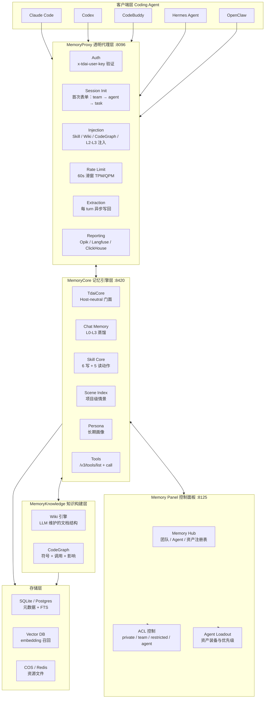
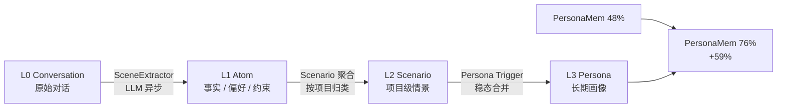
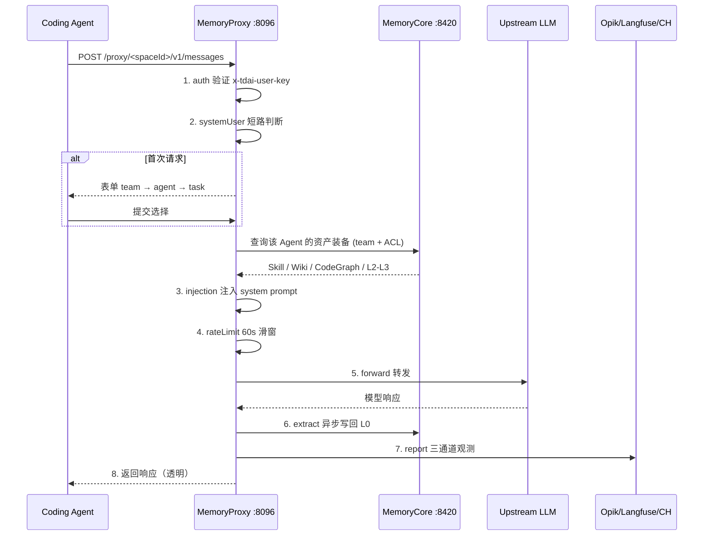
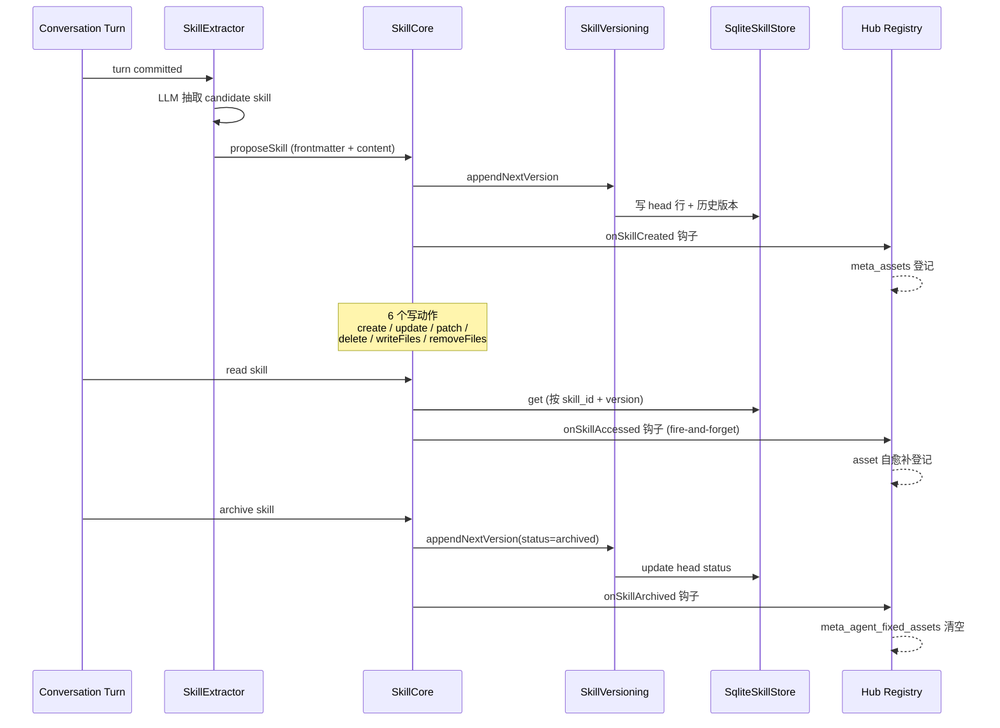
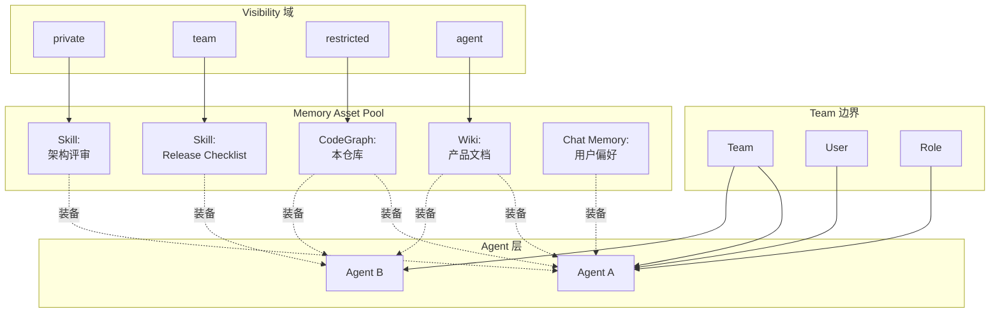

## 一、引子：当 Agent 还在重新学走路

用 Claude Code / Codex / Cursor 写过一段时间代码的人，应该都有过这种体验：

> 项目背景已经被自己反复讲过三遍；某个老模块明明 6 个月前查过一次，现在又得从头翻；release checklist 每次都重新整理一份；「移动端还在用老 auth 模块」这种关键上下文，每次都靠口头提醒。

问题不在 LLM 不够强，而在于 **Agent 没有团队级记忆**。

**TencentDB Agent Memory**（`TencentCloud/TencentDB-Agent-Memory`，⭐21.7k，TypeScript，MIT）就是冲着这个问题来的——它不是又一个给单个 Agent 加长期记忆的工具，而是**一个团队级的记忆中枢**：把对话、文档、代码沉淀成 **Chat Memory / Skill / Wiki / CodeGraph** 四类可复用资产，在 Team / User / Agent / Role 四种 ACL 下跨框架注入。

它的核心哲学，README 写得很直白：

> *"Memory here means more than just 'remembering conversations.' Any information that helps the next Agent avoid reinventing the wheel should be saved, organized, and reused."*

这种"团队级 Memory Hub + 透明 LLM Proxy"的组合，在 2026 H2 的多 Agent 浪潮里，属于**当下最稀缺的中间层基础设施**。

本文从源码视角深度剖析 TencentDB Agent Memory 的四层架构、Skill 生命周期、L0-L3 分层蒸馏、Memory Hub ACL 模型，以及 MemoryProxy 透明注入的端到端数据流。

---

## 二、项目定位与核心价值

### 2.1 一句话定义

> **TencentDB Agent Memory 是腾讯云开源的「团队级 AI Agent 记忆中枢」**——通过透明 LLM 代理 + 资产注册表 + 异步蒸馏流水线，让 Coding Agent / 对话 Agent 在不修改源码的情况下，自动获得团队沉淀的 Chat Memory、Skill、Wiki 和 CodeGraph 四类资产。

### 2.2 仓库速览

| 维度 | 数据 |
|---|---|
| GitHub | `TencentCloud/TencentDB-Agent-Memory` |
| Stars | 21,707（截至 2026-08-15） |
| 主语言 | TypeScript（92.6%）|
| License | MIT（License 文件）+ NOASSERTION（GitHub 探测） |
| 模块 | MemoryCore + MemoryKnowledge + MemoryPanel + MemoryProxy + sdk |
| 最近提交 | 2026-08-14（极高活跃度）|
| Topics | agent, ai-agent, embedding, llm, local-first, long-term-memory, memory, openclaw-plugin, vector-search |
| Benchmark | PersonaMem 48% → **76%**（+59%）|
| 集成框架 | OpenClaw / Hermes / Claude Code / CodeBuddy / Codex |

### 2.3 能力矩阵：与 Chat History / 标准 RAG 的差异

README 给出了一张极有说服力的对比表：

| 能力 | Chat History | 标准 RAG | TencentDB Agent Memory |
| :---: | :---: | :---: | :---: |
| 跨 session 用户理解 | △ | △ | ✅ Chat Memory |
| 提炼可执行经验 | — | — | ✅ Skill |
| 文档结构与关系 | — | △ Chunk 检索 | ✅ Wiki + 链接图 |
| 代码调用图与影响面 | — | △ 文本匹配 | ✅ CodeGraph |
| 所有权 / 版本 / 状态 | — | — | ✅ |
| 团队共享与 Agent 装备 | — | — | ✅ |
| Private / Team / ACL | — | △ | ✅ |

**核心差异**：标准 RAG 回答"能找到什么"，**Team Memory 还回答"谁能用、哪一版有效、应该装给哪个 Agent"**。

---

## 三、整体架构：三层 + 四类资产 + 一道闸

下图是 TencentDB Agent Memory 的顶层架构——把"四类资产"按"透明注入 + 团队管控 + 后台蒸馏"三层组织：



**5 个独立子项目**（`MemoryCore / MemoryKnowledge / MemoryPanel / MemoryProxy / sdk`）通过 HTTP + in-process adapter 两种模式互通：

- **MemoryProxy（:8096）**：透明 LLM 请求代理，零代码接管 Claude Code / Codex / CodeBuddy。
- **MemoryCore（:8420）**：纯记忆引擎，不绑定宿主框架。`TdaiCore` 是 host-neutral 门面，`HostAdapter` 抽象让 OpenClaw（in-process）和 Standalone（HTTP）两种部署复用同一份逻辑。
- **MemoryPanel（:8125）**：Web 控制台，让人类 / 团队管理员审查、共享、装备资产。
- **MemoryKnowledge**：Wiki + CodeGraph 的离线构建引擎，异步管道处理。
- **sdk**：把 MemoryCore 包装成可嵌入任意 Node 进程的库。

---

## 四、四类 Memory Asset：团队经验的四种形态

TencentDB Agent Memory 把所有可复用记忆归为**四类资产**。这是它与单点 Memory 框架最根本的差异。

### 4.1 Chat Memory（对话级记忆）

L0 Conversation → L1 Atom → L2 Scenario → L3 Persona 的**渐进蒸馏**：

| 层级 | 存什么 | 主要用途 |
| :--- | :--- | :--- |
| **L0 Conversation** | 原始对话 + 完整上下文 | 核对原始措辞、时间戳、出处 |
| **L1 Atom** | 从对话中抽取的事实 / 偏好 / 约束 / 事件 | 精准召回可执行信息 |
| **L2 Scenario** | 围绕项目 / 场景组织的知识块 | 快速还原工作上下文 |
| **L3 Core / Persona** | 长期画像、稳定模式、高层心智 | 让 Agent 迅速进入用户与团队语境 |

注入策略：**L2/L3 进 system prompt**（快速冷启动），**L0/L1 暴露为只读 tool**（按需召回，避免污染上游 KV-cache）。

### 4.2 Skill（经验库）

> *"A Skill isn't just a prompt snippet; it has versions, resource files, trigger boundaries, execution steps, and validation rules."*

SkillCore 提供 **6 个写动作 + 5 个读动作**，完整生命周期管理：

```typescript
// 来自 MemoryCore/src/core/skill/skill-core.ts:18-37
/**
 * SkillCore — 6 个 manage action 的编排门面
 *
 * 编排逻辑：
 *   1. 解析 + 校验 SKILL.md（frontmatter）
 *   2. 取 head（如有）
 *   3. assertTeamMatch / assertOwner / assertVersionFresh
 *   4. 调 SkillVersioning.appendNextVersion / createNewSkill
 *
 * 6 个写动作：
 *   - create        新建 skill v1
 *   - update        替换 SKILL.md
 *   - patch         单点串替
 *   - delete        head status=archived
 *   - writeFiles    增/改资源
 *   - removeFiles   删资源
 *
 * 5 个读动作：
 *   - get           返回 detail（默认 head；可指定 version）
 *   - list          按 team_id + filters 返回 head 行
 *   - search        FTS 命中
 *   - listVersions  历史版本元信息
 *   - readFile      读资源字节
 */
```

Skill 的本质是 **带版本 + 资源文件 + 触发边界 + 校验规则的 prompt 单元**——和 Hermes Agent 的 Skill 体系一脉相承（README 里明确致谢）。

### 4.3 Wiki（文档结构图）

Wiki 引擎借鉴了 Karpathy 提出的"LLM Wiki"思想：把产品文档、设计规范、运维 SOP 沉淀为**带链接图的层级化结构页面**，而不是 Chunk 切片。Agent 通过 `/v3/tools/list` 发现能力，`/v3/tools/call` 按需读取相关页面。

### 4.4 CodeGraph（代码调用图）

直接 fork 了 `colbymchenry/codegraph` 的核心思想：**预先索引代码符号、文件、调用关系**，Agent 在改代码前可主动查询 callers / callees / 影响路径。

```text
普通 RAG：  "改这里会不会影响别处？" → ❌ 只能文本匹配
CodeGraph：  "改这里会不会影响别处？" → ✅ 给出 callers / callees / impact 列表
```

### 4.5 资产注册表 vs Memory Store

四类资产**统一注册到 Memory Hub**——这是 ACL 装备的关键数据结构。Memory Hub 用 **Fixed Binding + ACL** 决定一个 Agent 能用哪些资产：

```text
ACL 维度：  Team × User × Agent × Visibility
Visibility： private / team / restricted / agent
装备策略：  Fixed Binding（强制）+ Priority + Usage Mode
```

> 团队能共享经验而不泄露私有信息；切换 Agent / 框架只需要重新装备，**不需要重新训练**。

---

## 五、L0 → L3 四层蒸馏：异步管道的精妙

`scene-extractor.ts` 是 L1 / L2 蒸馏的核心。下图把"原始对话 → Persona"的渐进管道可视化：



下面是 `SceneExtractor` 的真实代码骨架：

```typescript
// 来自 MemoryCore/src/core/scene/scene-extractor.ts（节选）
export class SceneExtractor {
  constructor(private opts: SceneExtractorOptions) {}

  /** 把原始对话蒸馏为 L1 atom 列表 */
  async extractAtoms(turns: CompletedTurn[]): Promise<ExtractionResult> {
    // 1. 切片：按窗口大小切对话
    // 2. LLM 抽取：prompt = memory-prompt 模块
    // 3. 去重：跨窗口相同事实合并
    // 4. 输出 Atom[]（含 fact/preference/constraint/event 四类）
  }

  /** 把 L1 atom 升级为 L2 scenario */
  async promoteToScenario(atoms: Atom[]): Promise<Scenario[]> {
    // 1. 按 team_id + project_id 分组
    // 2. 同组用 LLM 总结成情景描述
    // 3. 链接到现有 Scenario（如有重复）
  }
}
```

**关键设计原则**：
- **异步**：所有 LLM 蒸馏都在 background pipeline 跑，不阻塞 Agent 主循环
- **分层**：正常用 L2/L3 速启，需要事实时 BM25 + 向量 + RRF 退到 L1/L0
- **预算护栏**：结果会受 **item count / character budget / timeout** 三重封顶，防止"Memory 把 context window 塞爆"

---

## 六、Memory Hub：团队级控制面板

Memory Hub 是给"人类"用的——它把 Memory 资产的**治理与共享**做到台面上：

| 玩法 | 在 Hub 做什么 |
|---|---|
| **Team Up** | 建团队、加人、加 Agent、定义共享边界 |
| **Asset Library** | 浏览 / 搜索 / 审查 / 管理 Chat Memory、Skill、Wiki、CodeGraph |
| **Agent Loadout** | 给不同 Agent 绑定不同资产，调优先级与使用模式 |
| **Knowledge Workshop** | 构建 Wiki + CodeGraph，监控处理状态与资产元数据 |
| **Access Control** | 在 private / team / restricted 间切换，需要时撤销共享 |

### 6.1 Visibility 四态

```text
private    → 只有 Owner 能读，连团队管理员都看不到
team       → 团队成员可读，Owner / Admin 可管理
restricted → 通过 User / Role / Agent ACL 精确授权
agent      → 给同团队里指定 Agent 装备用
```

装备示例（README 的原话）：

> *You can assign the "Release Skill" to the Release Agent, the "Architecture Wiki" to all development Agents, and CodeGraph to Coder and Reviewer.*

这正是**"Memory 是 Agent 的装备"**理念的具体落地。

### 6.2 角色双层

- **global System Admin**：管用户 / 团队（建团队、加成员），也能用 Wiki / CodeGraph / Skill 等资产管理
- **Team Admin / Member**：在团队内做资产协作与访问控制

Asset ownership 走 Owner 字段，**Owner 自动获得该资产的管理权**。

---

## 七、MemoryProxy：透明 LLM 代理的 8 阶段请求管道

这是 TencentDB Agent Memory 最有"魔法感"的部分——**Coding Agent 一行代码不改，就自动获得团队 Memory**。

原理是 LLM 请求代理：让 Claude Code / Codex / CodeBuddy 走 `MemoryProxy :8096` 而不是直接连 LLM provider。代理在 forward 前后**自动注入** session init / context / write-back。

### 7.1 端到端数据流



### 7.2 注入策略（关键）

MemoryProxy 镜像 MemoryCore 的四层结构，**两种注入模式**：

| 层级 | 注入方式 | 为什么 |
|---|---|---|
| **L2 / L3** | 注入 system prompt | 速启需要，量小、稳定 |
| **L0 / L1** | 暴露为只读 tool | 按需召回，**避免污染上游 KV-cache** |

这个细节极为关键：把 L0/L1 当成 **tool 而非 prompt**，是「不让 Memory 把 KV-cache 击穿」的关键工程决策——一旦塞进 system prompt，每次新消息都会让上游 provider 的 prefix cache 失效。

### 7.3 ProxyStorage 五后端

会话状态 / 注入缓存 / Skill 状态（`inj:*` / `sk:*` / `vpin:*`）支持 **5 种后端**：

```text
Redis     ← 多节点生产首选
COS       ← 多节点 + 大资源（kernel-sts 凭据）
SQLite    ← 单机开发
FS        ← 调试
Memory    ← 测试
```

---

## 八、Skill 生命周期：从提取到归档的全链路

`SkillExtractor` + `SkillCore` + `SkillVersioning` 协同，是 TencentDB Agent Memory 最复杂的子系统。下图把 Skill 资产的生命周期串起来：



**三个关键设计**：

1. **乐观并发**：每次写动作都带 `expected_version`，通过 `assertVersionFresh` 防丢更新
2. **三态资产事件**：
   - `onSkillCreated`：v1 首创**前置 await**，抛异常 = create 失败
   - `onSkillAccessed` / `onSkillArchived`：fire-and-forget，异常吞掉
3. **读路径自愈补登记**：`get` / `readFile` 成功后 fire-and-forget 调用 `onSkillAccessed`，**上层的 asset 缺失会被下次读取自动修复**

---

## 九、核心机制：透明接管 + 团队装备

### 9.1 透明代理的"零代码接管"

MemoryProxy 的 README 写得很直接：

> *"It is 'transparent' to both the client and the upstream model — it changes no protocol and forwards OpenAI `/v1/chat/completions` and Anthropic `/v1/messages` verbatim."*

配置方式：在 Claude Code / CodeBuddy 里把 `ANTHROPIC_BASE_URL` / `OPENAI_BASE_URL` 指向 `MemoryProxy :8096/proxy/<spaceId>/...`。Agent 不知道代理存在。

### 9.2 Memory Hub 装备（Binding）

下图把"Agent + 资产 + ACL + 优先级"的装备模型可视化：



**装备 = Fixed Binding + Priority + Usage Mode**：
- Fixed Binding = 强绑定，不被运行时覆盖
- Priority = 注入时的顺序与权重
- Usage Mode = inject / reference / hint 三种

### 9.3 Conversation Write-back（每 turn 异步提取）

每轮人类 turn 结束后，MemoryProxy 异步发请求到 MemoryCore：

```text
POST /v3/skill/conversation/add   (Skill 归档候选)
POST /v3/memory/conversation/add  (L0 短期记忆)
```

MemoryCore 收到后**入队**到 background pipeline，由 `SkillConversationExtractWorker` 异步蒸馏：

```typescript
// 来自 MemoryCore/src/services/pipeline-worker.ts（核心循环）
export class PipelineWorker {
  async run() {
    while (true) {
      const job = await this.queue.dequeue();
      try {
        await this.processJob(job);
      } catch (e) {
        await this.queue.requeueWithBackoff(job);
      }
    }
  }
}
```

---

## 十、API 形态：MemoryCore Gateway v3

MemoryCore Gateway 暴露 **OpenAPI v3**，用 `/v3/<resource>/<action>` 命名空间：

| 资源 | 端点示例 | 说明 |
|---|---|---|
| Memory | `/v3/memory/search` | 跨 L0-L3 检索 |
| Memory | `/v3/memory/conversation/add` | L0 写入 |
| Skill | `/v3/skill/create` `/v3/skill/update` `/v3/skill/get` `/v3/skill/list` `/v3/skill/search` | Skill 全 CRUD |
| Knowledge | `/v3/knowledge/wiki/list` `/v3/knowledge/wiki/read` | Wiki 页面 |
| Knowledge | `/v3/knowledge/codegraph/query` | CodeGraph 影响分析 |
| Meta | `/v3/meta/auth/verify` `/v3/meta/team/list` | 鉴权 + 团队 |
| Tools | `/v3/tools/list` `/v3/tools/call` | Agent 工具发现 |

Agent 通过 `tools/list` 发现可用工具 → `tools/call` 按需调用——**Knowledge 不进 prompt**，只在 Agent 真需要时才拉取。

---

## 十一、与同类 Memory 框架对比

下表把 TencentDB Agent Memory 与近期 5 个 Memory 项目做横向对比：

| 维度 | TencentDB Agent Memory | Mem0 | Honcho | Memori | Cognee | Memu |
|---|---|---|---|---|---|---|
| 形态 | Hub + Proxy + 引擎 | 内存库 | Peer-centric 库 | 抽取式库 | 知识图谱引擎 | 文件系统库 |
| 多 Agent 共享 | ✅ 团队级 Hub | △ 单 Agent | △ Peer 模型 | ❌ | ❌ | ❌ |
| 四类资产 | ✅ Chat / Skill / Wiki / CodeGraph | 仅对话 | 仅对话 | 仅对话 | 知识图 | 文件 |
| 框架集成 | OpenClaw/Hermes/Claude Code/Codex/Cursor | 通用 | 通用 | 通用 | 通用 | 通用 |
| 透明接管 | ✅ MemoryProxy | ❌ | ❌ | ❌ | ❌ | ❌ |
| ACL / 装备 | ✅ private/team/restricted/agent | △ User | △ Space | ❌ | ❌ | ❌ |
| Wiki / CodeGraph | ✅ | ❌ | ❌ | ❌ | △ 知识图 | ❌ |
| Benchmark | PersonaMem 76% | DMR 92% | LoCoMo | LoCoMo 81.95% | — | — |

### 关键设计差异

1. **单 Agent Memory vs Team Memory**：Mem0 / Memori / Cognee 都聚焦"单个 Agent 怎么记得"，TencentDB 解决"**多 Agent 团队怎么共享 + 治理**"
2. **透明接管 vs 集成 SDK**：Mem0 / Honcho 要求改代码集成；MemoryProxy 让 Agent **不改一行代码就接管**（仅改 `BASE_URL`）
3. **资产 vs 单一类型**：其他项目只管理"对话记忆"；TencentDB 把对话、技能、文档、代码**统一为四类资产**，施加同一套 ACL
4. **持久控制面板**：其他项目是 SDK；Memory Hub 是**人类治理面板**，含审批 / 共享 / 装备

一句话：其他 Memory 框架解决"Agent 记得住"，TencentDB 解决"**团队经验能在 Agent 间流转 + 治理**"。

---

## 十二、优缺点分析

下表按 skill 模板做两侧对比：

| 维度 | 优势 | 劣势 |
|---|---|---|
| **架构简洁性** | ✅ 5 子项目解耦清晰（Core / Knowledge / Panel / Proxy / SDK） | ❌ 学习曲线陡（需要理解 L0-L3 + 四类资产 + ACL） |
| **扩展性** | ✅ HostAdapter 抽象，OpenClaw / Hermes / Standalone 三模式复用同一 TdaiCore | ❌ Plugin 系统相对封闭，主要适配 OpenClaw / Hermes |
| **易用性** | ✅ MemoryProxy 一行环境变量零代码接管 | ❌ 部署需要 3 个服务（Core / Proxy / Panel）+ 数据库 |
| **性能** | ✅ L0/L1 用 tool 而非 prompt，**不破坏上游 KV-cache** | ❌ async 蒸馏流水线首次冷启动需要等待 Wiki / CodeGraph 完成 |
| **复杂度** | ✅ Skill 6 写 + 5 读动作定义明确 | ❌ ACL 模型 4 个维度 × 4 个 visibility 维度 = 16 种组合，配置复杂 |
| **维护性** | ✅ 错误类型明确（SkillCoreErrorCode 16 种 + 完整映射）| ❌ 子项目多，跨仓库升级需要协调 MemoryProxy ↔ MemoryCore 版本 |

**工程取舍的核心**：
- **多服务部署**换 **完整治理能力**——Hub + Proxy + Core 三件套换来自上而下的资产管控
- **学习成本高**换 **四类资产统一抽象**——16 种 ACL 组合换 4 类资产共用同一套权限模型

---

## 十三、实践：5 分钟跑通 TencentDB Agent Memory

### 13.1 一键启动（推荐）

```bash
# 来自 README：Memory Core + Memory Hub + Proxy 三件套
git clone https://github.com/Tencent/TencentDB-Agent-Memory.git
cd TencentDB-Agent-Memory/deploy/global-images
cp .env.example .env
$EDITOR .env       # 填两组 LLM 参数（memory group + proxy group）
./start-all.sh     # 一键启动；完成后会输出可直接贴进 Claude 的 one-liner
```

启动后访问 [http://localhost:8125](http://localhost:8125) 打开 Memory Panel。

### 13.2 让 Claude Code 接入（透明代理模式）

把 Claude Code 的 `ANTHROPIC_BASE_URL` 指向 MemoryProxy：

```bash
# 在 Claude Code 配置里
export ANTHROPIC_BASE_URL=http://localhost:8096/proxy/your-space-id

# 然后正常用 claude —— 团队 Memory 自动注入
claude "继续之前那个 issue #234 的工作"
```

Agent 不需要知道代理存在——所有 `team / agent / task` 选择通过表单一次性确认。

### 13.3 直接调 API（SDK 模式）

```typescript
import { TdaiCore } from "@tencentdb-agent-memory/core";
import { StandaloneHostAdapter } from "@tencentdb-agent-memory/adapters/standalone";

// 来自 MemoryCore/src/core/tdai-core.ts:24-44
const adapter = new StandaloneHostAdapter({
  api: { baseUrl: "http://localhost:8420", token: process.env.TDAI_TOKEN },
  pluginDataDir: "./.tdai-data",
  config: parsedCfg,
});
const core = new TdaiCore({ hostAdapter: adapter, config: parsedCfg });
await core.initialize();

// 自动召回
const recall = await core.handleBeforeRecall("用户上次问到什么？", "session-1");
console.log("Recalled assets:", recall);

// 异步提取（每 turn 后调）
await core.handleTurnCommitted(turn);
```

### 13.4 Memory Hub 装备资产

通过 Web UI 路径：

```text
1. 创建 Team（settings → team → new team）
2. 导入 codebase（assets → codegraph → import repo）
3. 导入文档（assets → wiki → upload）
4. 创建 Skill（assets → skill → write SKILL.md）
5. 创建 Agent（agents → new agent）
6. 装备资产（agents → loadout → bind assets）
7. 设置 ACL（agents → access → private/team/restricted/agent）
```

---

## 十四、趋势：2026 H2 Agent Memory 的进化方向

读完代码 + 文档，有 4 个清晰的趋势判断：

### 14.1 团队 Memory ≠ Agent Memory

过去 18 个月，Memory 项目（Cognee / Mem0 / Memori / Honcho / MSA / Mempalace / Nocturne / Everos / OpenViking / MCP）都在解决**单 Agent 长期记忆**问题。但 2026 H2 多 Agent 同台协作（Orca / MetaGPT / Claude Code Teams / Strix），**团队级经验共享**会成为新主战场。TencentDB Agent Memory 是这个方向的开山之作。

### 14.2 透明代理 + 控制面板 = Agent 时代新中间层

Coding Agent 爆发后，**接入 SDK 已不再是用户的诉求**——用户希望"一键让 5 个 Coding Agent 共享经验"。MemoryProxy 的透明接管 + Memory Hub 的控制面板 = 一种"Agent 时代的 OSS 中间件"模式。

### 14.3 Skill 资产化是 2026 H2 的隐含共识

Hermes Agent / Claude Code Skills / Manus / 阿里 gsd-build/get-shit-done / TencentDB 都把"Skill 当成可版本化资产"——但**只有 TencentDB 把"Skill 治理 + 团队共享 + ACL"做到台面上**。Skill 是下一个 LLM 工程化的"组件包"。

### 14.4 L0/L1 进 tool 而非 prompt，是 KV-cache 工程的精细化

把短期记忆当 tool 调用、长期记忆进 prompt——这种分层注入策略是**真正懂得 LLM provider 工程的团队才会做的设计**。其他 Memory 项目还在把"全部塞 prompt"。

### 14.5 一个工程经验

> **"Memory 不应该是一个 SDK，而应该是一套团队基础设施 + 治理面板 + 透明代理。"**

Coding Agent 已经把"团队写代码"变成了"团队写 + 团队运行 Coding Agent"。如果 Memory 还停留在 SDK 阶段，就会成为 Agent 时代的瓶颈——**TencentDB Agent Memory 重新定义了 Agent Memory 的形态**。

---

## 附录：关键资源

| 类型 | 链接 |
|---|---|
| GitHub | <https://github.com/TencentCloud/TencentDB-Agent-Memory> |
| 中文 README | `README_CN.md` |
| 安装指南 | `INSTALL.md` / `INSTALL_CN.md`（35KB 一份）|
| 部署文档 | `README.deployment.md` / `README.docker.md` |
| Roadmap | `ROADMAP.md` / `ROADMAP_CN.md` |
| Memory Knowledge OpenAPI | `MemoryKnowledge/openapi.yaml` |
| 数据迁移工具 | `MemoryCore/scripts/migrate-v2-to-v3/README.md` |
| Discord | <https://discord.gg/dJQM6mKMF> |
| 趋势榜 | Trendshift #29310 |
| 关键依赖 | `colbymchenry/codegraph`（CodeGraph 思想来源）、Hermes Agent（Skill 体系来源）、Karpathy LLM Wiki |
| License | MIT |
| 版本 | v2.0.0（v2.0.1 即将发布）|