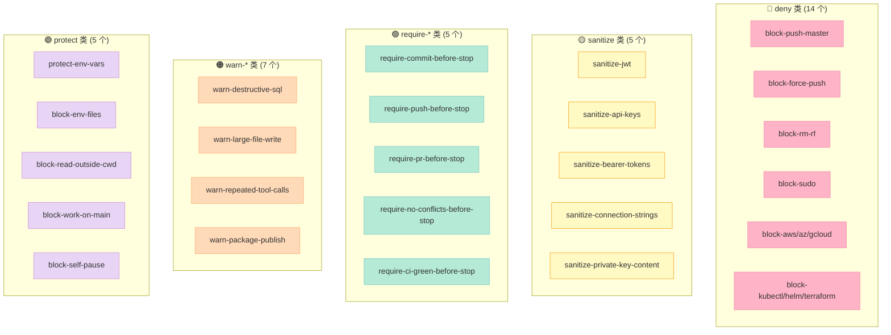
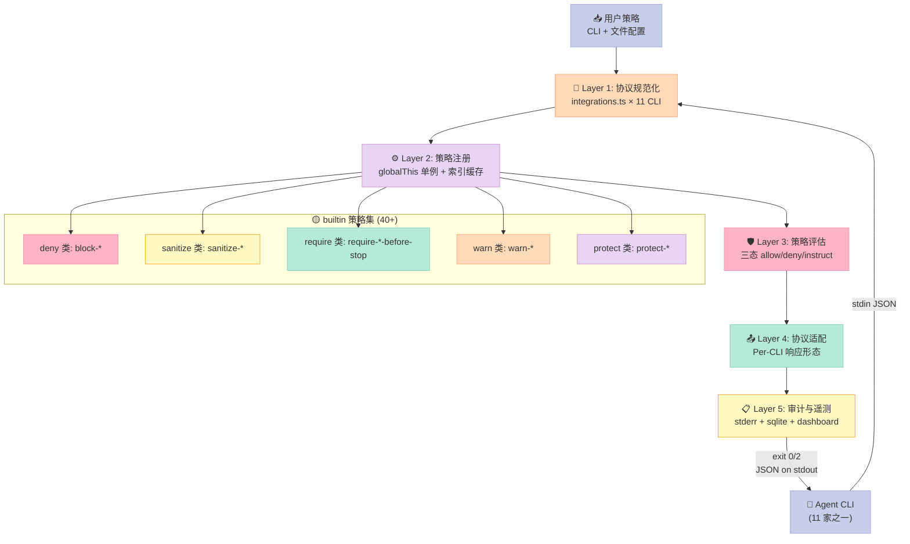
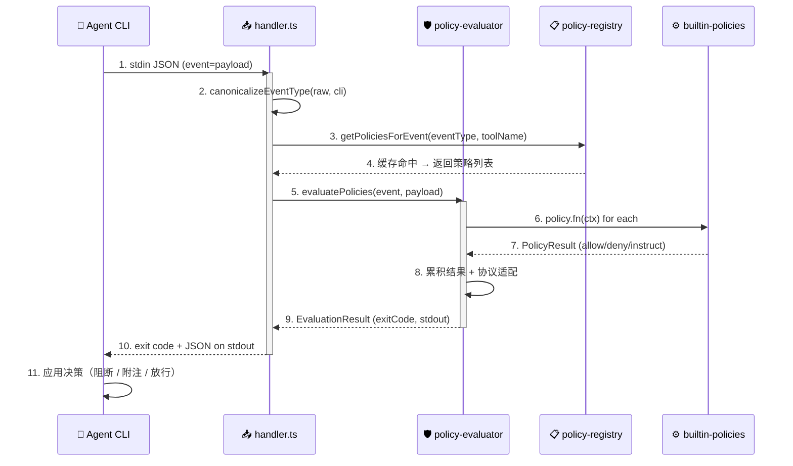
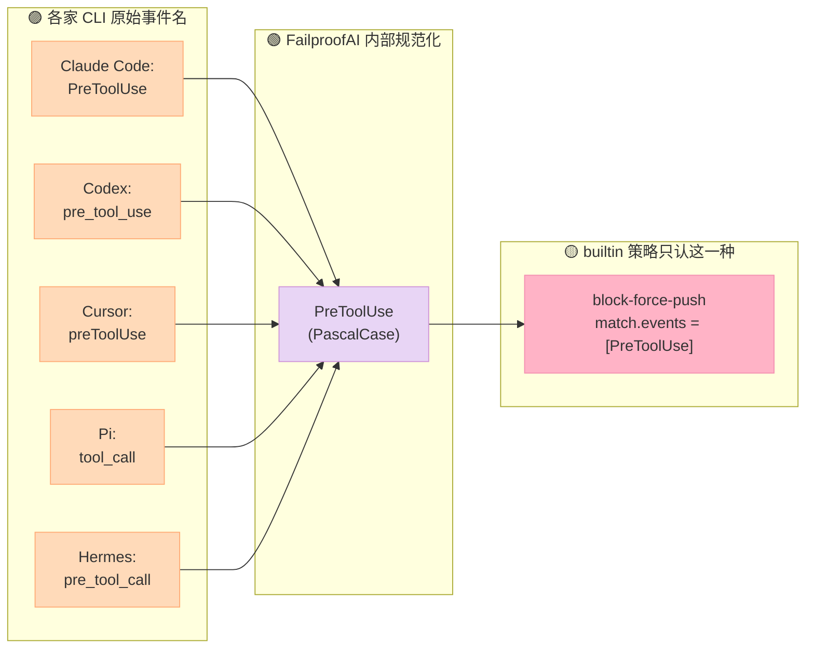
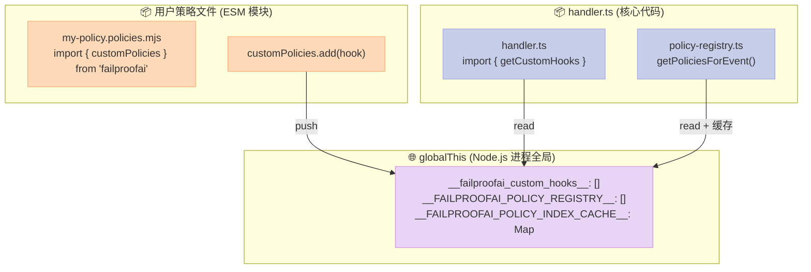
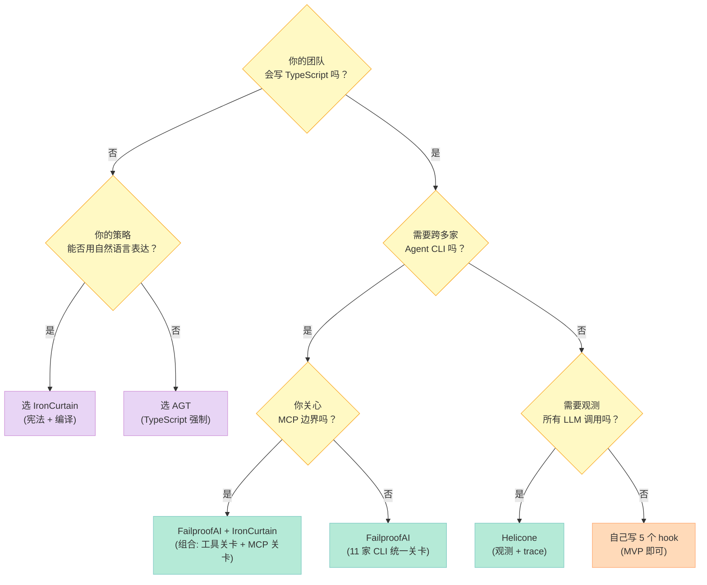

> **一句话结论**：FailproofAI 是当前 GitHub 上唯一一个**用同一个二进制同时治理 11 家 Agent CLI**（Claude Code / OpenAI Codex / GitHub Copilot / Cursor / OpenCode / Pi / Hermes / OpenClaw / Factory Droid / Devin / Antigravity / Goose）的开源 Hook Harness。它把 Harness 六件套里"Script 硬关卡"这一件做到了"机制与策略完全分离"——40+ 内置策略只是冰山一角，**真正值钱的是底下那层 11 份协议适配的 `integrations.ts` + 三态决策（allow/deny/instruct）的 `policy-evaluator.ts`**。

## 前言：为什么这次要拆 FailproofAI？

过去两个月，我连续写了 30+ 篇 Harness 主题深度解析。每篇都对应 Harness 六件套矩阵的一个组件。但始终有个空白没填上：

**我之前写的 Harness，要么只适配一家 CLI（IronCurtain 只适配 MCP），要么"声明适配 5 家但实际只跑通 2 家"（多数 Harness 的真实状态）。**

写"Script 硬关卡"组件时，**真正的难题不在脚本本身，而在"为什么同一个脚本能在 Claude Code / Codex / Cursor / Hermes / OpenClaw 上都生效"**。答案是：**协议规范化（Canonicalization）+ Per-CLI 响应适配 + 跨进程单例注册**。这三件事没一件简单。

FailproofAI 是 2026 年这个方向上跑得最远的一个：

- **1115 stars**（刚破千，2026-08-15 仍在 commit）
- **40+ 内置策略**（涵盖 Bash 安全、Git 流程、Secret 防护、AI 行为、CI 集成、Workflow 收尾）
- **11 家 Agent CLI 适配**（Claude Code / Codex / Copilot / Cursor / OpenCode / Pi / Hermes / OpenClaw / Factory / Devin / Antigravity / Goose）
- **TypeScript 实现**（约 91 MB 仓库体积，101 个 src/hooks/*.ts 模块，53 个 hooks 处理器 + 53 个对应的测试文件）

读完这篇你会得到：
1. **40+ 内置策略的分层地图**（deny / sanitize / require-*-before-stop / warn-* 五大类）
2. **三态决策 `allow / deny / instruct` 的真实代码**（不只是开关，还能"放行但附加上下文"）
3. **Per-CLI 协议规范化**（Codex 的 snake_case、Cursor 的 camelCase、Pi 的 underscore_lower_snake_case 怎么归一到 PascalCase）
4. **跨进程单例注册机制**（globalThis + 索引缓存避免重复过滤）
5. **SubagentStop 重试协议**（11 家 CLI 各自的 deny 通道对比）
6. **从零搭建 MVP**（最少 300 行 TS 就能落地一个最小可用的 Hook Policy Harness）

---

## 一、FailproofAI 在 Harness 六件套里的定位

### 1.1 六件套覆盖度矩阵

| 组件 | FailproofAI 实现 | 关键文件 | 评级 |
|------|------------------|----------|------|
| **Rule** | 三态决策 + `instruct`（放行但附加上下文） | `policy-helpers.ts` + `policy-evaluator.ts` | ⭐⭐⭐⭐⭐ |
| **Skill** | 不直接提供 SOP（专注硬关卡） | — | ⭐ |
| **Sub-Agent** | 仅监听 SubagentStart / SubagentStop 事件 | `types.ts` + `handler.ts` | ⭐⭐⭐ |
| **Workflow** | `require-*-before-stop` 5 个工作流收尾约束 | `builtin-policies.ts` | ⭐⭐⭐⭐ |
| **Script** | **核心定位**：40+ 确定性策略 + JSON on stdout 强制 | `builtin-policies.ts` + `policy-evaluator.ts` | ⭐⭐⭐⭐⭐ |
| **MCP** | 不直接做 MCP，但监听 `mcp__*` 工具调用并对其生效 | `handler.ts` | ⭐⭐⭐ |

**核心定位**：一个**跨 CLI 的 Hook Policy Harness（脚本式硬关卡）**——把"模型说要做的事"变成"系统可审计、可阻断、可附注的请求"。

截至本文调研时，仓库显示约 1115 stars，2026-08-15 仍有 commit（v1.0.1-beta.1）；项目同时声明 MIT + Commons Clause 许可——免费用于内部与个人用途，商业转售需另签协议。

### 1.2 它要解决什么真问题？

2026 年的 AI Agent 工程化痛点里，**有 3 件事一直在烧**：

1. **Agent 把 JWT 读进了自己的 context**（`cat .env` 后下一轮对话就开始复述密钥）
2. **Agent 在 main 分支直接 force push**（`git push --force` 一次就能毁掉团队一天的工作）
3. **Agent 跑进死循环**（同一个工具调了 30 次，token 烧光但还在转）

这些事情**用 System Prompt 拦不住**——只要模型"理解"了恶意指令，它就能在下一轮把指令重新拼出来。**真正的关卡必须发生在工具调用的边界**：在 Agent 决定"我要执行 `git push --force`"之后、shell 实际执行之前，由外部确定性的代码决定"放不放行"。

这就是 FailproofAI 的核心命题：**把 System Prompt 替换成可以审计、可以 deny、可以附注的 Script 关卡**。

---

## 二、整体架构：五层结构，不是一堆 hooks

### 2.0 策略类型全景图（40+ 策略怎么组织）



### 2.1 整体架构图



### 2.1 数据流拆开看

1. **CLI 触发 hook**：11 家 Agent CLI 各自的事件协议下，调用 `failproofai` 二进制
2. **协议规范化**（`handler.ts`）：识别当前 CLI（`IntegrationType`），把各家的事件名 / 工具名映射到内部 PascalCase
3. **策略注册**（`policy-registry.ts`）：从 `globalThis.__FAILPROOFAI_POLICY_REGISTRY__` 拿当前生效策略 + 命中索引缓存
4. **策略评估**（`policy-evaluator.ts`）：按 priority 顺序执行，聚合三态结果
5. **协议适配**：把统一结果翻译成当前 CLI 的响应形态（Codex 走 `permission_decision`、Cursor 走 `{permission, user_message}`、Claude 走 `hookSpecificOutput`）
6. **stdout 输出 + exit code**：让 CLI 看到 `deny` / `instruct` / `allow` 三种最终结果

**关键洞察**：**所有 CLI 共享同一份"什么算 deny"的判定逻辑**——区别只在"怎么告诉当前 CLI 这个 deny"。这就是跨 CLI Harness 的核心架构：**策略层（一个）+ 协议适配层（11 份）**。

### 2.2 数据流时序图（一次 hook 调用的完整生命周期）



### 2.3 仓库结构全景

```text
failproofai/
├── src/hooks/                       # 核心模块（53 个 .ts 文件）
│   ├── handler.ts                   #   - hook 入口：读 stdin + 调评估器
│   ├── policy-evaluator.ts          #   - 三态决策引擎（44KB，最大单文件）
│   ├── policy-registry.ts           #   - globalThis 单例 + 索引缓存
│   ├── policy-types.ts              #   - 类型定义（含讽刺意味的安全注释）
│   ├── policy-helpers.ts            #   - allow/deny/instruct 三个工厂
│   ├── builtin-policies.ts          #   - 40+ 内置策略（105KB，最大单文件）
│   ├── integrations.ts              #   - 11 家 CLI 的适配层（91KB）
│   ├── manager.ts                   #   - install/uninstall 编排
│   ├── types.ts                     #   - 事件名/工具名映射表（49KB）
│   ├── daemon-client.ts             #   - Rust daemon 通信（fail-closed 模式）
│   ├── delivery-health.ts           #   - 健康检查
│   ├── custom-hooks-loader.ts       #   - 扫描 .failproofai/policies/*.mjs
│   ├── custom-hooks-registry.ts     #   - 自定义 hook 注册表
│   ├── tool-name-canonicalize.ts    #   - 工具名归一
│   ├── normalize-cli-payload.ts     #   - stdin payload 归一
│   └── ... (41 个其他模块)
├── crates/fpai-collect/             # Rust 后台守护进程（60 文件）
├── app/                             # Next.js Dashboard（80 文件）
├── lib/                             # 通用库（62 文件）
├── __tests__/hooks/                 # 测试（83 文件，每策略 1 测试）
├── docs/                            # 14 语言翻译（i18n）
└── .agents/                         # FailproofAI "吃自己的狗粮"
```

**特点**：测试覆盖率极高（每个内置策略都有专用测试）、国际化做得彻底（README + docs 已译 14 种语言）、有完整 Dashboard（Next.js）。

---

## 三、核心机制：三态决策的真实代码

### 3.1 三态决策的语义模型

FailproofAI 的决策空间是**三个值**，不是布尔：

| 决策 | 含义 | 对 Agent 的效果 | 典型场景 |
|------|------|----------------|----------|
| `allow()` | 放行 | 工具正常执行 | 99% 的正常工具调用 |
| `deny(reason)` | 阻断 + 把 reason 喂给模型 | 工具被拒绝；Agent 看到 reason 后重新规划 | `git push --force` / `cat .env` |
| `instruct(reason)` | 放行 + 附加上下文 | 工具执行；但下一轮 prompt 里多了一段"提示" | "先 commit 再退出" |

**为什么是三态不是二态**？`instruct` 是 FailproofAI 最有特色的设计——它**承认一个事实**：有些动作你不应该完全阻断（Agent 必须能调 `Bash`），但你也不应该完全放手（Agent 可能忘记某个步骤）。**`instruct` 把"提醒"塞进模型的下一次 prompt，让模型自己决定是否遵守**。

源码见 `src/hooks/policy-helpers.ts`：

```typescript
// src/hooks/policy-helpers.ts（全文 458 字符，三个函数）
import type { PolicyResult } from "./policy-types";

export function allow(reason?: string): PolicyResult {
  return reason ? { decision: "allow", reason } : { decision: "allow" };
}

export function deny(reason: string): PolicyResult {
  return { decision: "deny", reason };
}

export function instruct(reason: string): PolicyResult {
  return { decision: "instruct", reason };
}
```

**这是整个 Harness 的 30 行核心**——三个纯函数，零依赖，零状态。**所有 40+ 内置策略和用户自定义 hook 都通过这三个函数返回结果**。

### 3.2 真实可运行示例：sanitize-jwt 完整版

JWT 是 Agent 把密钥泄漏出去的最常见路径。FailproofAI 的 `sanitize-jwt` 策略在 `PostToolUse` 事件触发——即工具执行完后检查输出，如果发现 JWT 模式，立即用 `[REDACTED: JWT token removed by failproofai]` 替换。

源码（`src/hooks/builtin-policies.ts`）：

```typescript
// JWT 模式正则
const JWT_RE = /eyJ[A-Za-z0-9_-]{10,}\.[A-Za-z0-9_-]{10,}\.[A-Za-z0-9_-]{10,}/;

// 策略注册
{
  name: "sanitize-jwt",
  description: "Stop Claude from reading JWTs in tool responses",
  displayTitle: "Redacted JWT tokens from tool output",
  impact: "Stops the agent from echoing auth tokens it saw in command output.",
  fn: sanitizeJwt,
  match: { events: ["PostToolUse"] },
  defaultEnabled: true,
  category: "Sanitize",
},

// 策略实现
function sanitizeJwt(ctx: PolicyContext): PolicyResult {
  // PostToolUse: scrub JWT patterns from tool output
  const output = JSON.stringify(ctx.payload);
  if (JWT_RE.test(output)) {
    return {
      decision: "deny",
      reason: "JWT token detected in tool output",
      message: "[REDACTED: JWT token removed by failproofai]",
    };
  }
  return allow();
}
```

**一个值得注意的设计点**：`deny` 的 message 字段是**给模型的提示**，不是给用户的。这就是 Harness 的设计哲学——**"阻断"必须附带"为什么被阻断"，否则 Agent 会在下一轮重试同样的动作**。

### 3.3 更复杂的例子：sanitize-api-keys

`sanitize-api-keys` 比 `sanitize-jwt` 多两件事：**正则模式表 + 用户可配置**：

```typescript
// 9 个内置 API key 模式
const API_KEY_PATTERNS: Array<[RegExp, string]> = [
  [/sk-ant-[A-Za-z0-9\-_]{20,}/, "Anthropic API key"],
  [/sk-proj-[A-Za-z0-9\-_]{20,}/, "OpenAI project API key"],
  [/sk-[A-Za-z0-9]{20,}/, "OpenAI API key"],
  [/ghp_[A-Za-z0-9]{36}/, "GitHub personal access token"],
  [/github_pat_[A-Za-z0-9_]{82}/, "GitHub fine-grained token"],
  [/AKIA[A-Z0-9]{16}/, "AWS access key ID"],
  [/sk_live_[A-Za-z0-9]{24,}/, "Stripe live secret key"],
  [/sk_test_[A-Za-z0-9]{24,}/, "Stripe test secret key"],
  [/AIza[0-9A-Za-z\-_]{35}/, "Google API key"],
];

function sanitizeApiKeys(ctx: PolicyContext): PolicyResult {
  const output = JSON.stringify(ctx.payload);
  
  // 1. 检查内置模式
  for (const [pattern, label] of API_KEY_PATTERNS) {
    if (pattern.test(output)) {
      return {
        decision: "deny",
        reason: `${label} detected in tool output`,
        message: `[REDACTED: ${label} removed by failproofai]`,
      };
    }
  }

  // 2. 检查用户自定义模式（来自 policyParams）
  const additional = ((ctx.params?.additionalPatterns ?? []) as Array<{ regex: string; label: string }>);
  for (const { regex, label } of additional) {
    try {
      if (new RegExp(regex).test(output)) {
        return {
          decision: "deny",
          reason: `${label} detected in tool output`,
          message: `[REDACTED: ${label} removed by failproofai]`,
        };
      }
    } catch {
      hookLogWarn(`additionalPatterns: invalid regex "${regex}", skipping`);
    }
  }

  return allow();
}
```

**这是"机制与策略分离"的标准范例**：
- **机制**（怎么检测）：正则匹配 + 9 个内置模式
- **策略**（什么算敏感）：用户可以在 `~/.failproofai/policies-config.json` 里追加自己的模式
- **故障容忍**：用户写了非法正则，**静默跳过 + 日志告警**，而不是整个 Harness 崩溃

**对比 IronCurtain**：IronCurtain 的策略是"自然语言宪法 + 编译后规则"，FailproofAI 的策略是"TypeScript 函数 + JSON 配置"。**前者面向"PM 能写"，后者面向"工程师能改"**——这是 Script 组件的两种流派。

---

## 四、跨 CLI 协议规范化：FailproofAI 真正的技术护城河

### 4.0 11 家 CLI 事件命名差异图



### 4.1 问题：11 家 CLI 的事件名都不一样

这是 FailproofAI 必须解决的第一性难题。如果各家事件名不归一，每个内置策略都要写 11 份匹配代码。

| Agent CLI | PreToolUse 怎么写 | Stop 怎么写 | SubagentStop 怎么写 |
|-----------|-------------------|-------------|---------------------|
| Claude Code | `PreToolUse` (PascalCase) | `Stop` | `SubagentStop` |
| OpenAI Codex | `pre_tool_use` (snake_case) | `stop` | `subagent_stop` |
| Cursor | `preToolUse` (camelCase) | `stop` | `subagentStop` |
| Pi | `tool_call` (lower_snake) | `agent_end` | **无** |
| Hermes | `pre_tool_call` (snake) | **无** | **无** |
| OpenClaw | `pre_tool_use` (snake) | `stop` | `subagent_stop` |
| Antigravity | `pre_tool_use` (snake) | `stop` | `subagent_stop` |
| Goose | `pre_tool_use` (snake) | **无** | **无** |

**11 家 × 9 个事件 = 99 种命名组合**。如果不规范化，每个策略要写 99 个 if 分支。

### 4.2 解法：每 CLI 一张映射表

源码见 `src/hooks/types.ts` 的 `CODEX_EVENT_MAP` 等常量：

```typescript
export const CODEX_EVENT_MAP: Record<CodexHookEventType, HookEventType> = {
  session_start: "SessionStart",
  pre_tool_use: "PreToolUse",
  permission_request: "PermissionRequest",
  post_tool_use: "PostToolUse",
  user_prompt_submit: "UserPromptSubmit",
  stop: "Stop",
  subagent_start: "SubagentStart",
  pre_compact: "PreCompact",
  post_compact: "PostCompact",
  subagent_stop: "SubagentStop",
};

// Pi 的 map（不同命名风格）
export const PI_EVENT_MAP: Record<PiHookEventType, HookEventType> = {
  session_start: "SessionStart",
  tool_call: "PreToolUse",
  tool_result: "PostToolUse",
  agent_end: "Stop",
  user_prompt: "UserPromptSubmit",
  // Pi 没有 SubagentStop
};
```

**所有内置策略的 `match.events` 都用 PascalCase**。`handler.ts` 在评估前调 `canonicalizeEventType(raw, cli)` 把 raw 事件名映射到 PascalCase。

`handler.ts` 的归一函数：

```typescript
export function canonicalizeEventType(raw: string, cli: IntegrationType): HookEventType {
  if (cli === "codex") {
    const mapped = CODEX_EVENT_MAP[raw as CodexHookEventType];
    if (mapped) return mapped;
  }
  if (cli === "cursor") {
    const mapped = CURSOR_EVENT_MAP[raw as CursorHookEventType];
    if (mapped) return mapped;
  }
  if (cli === "pi") {
    const mapped = PI_EVENT_MAP[raw as PiHookEventType];
    if (mapped) return mapped;
  }
  if (cli === "hermes") {
    // Hermes 发送 snake_case（pre_tool_call, on_session_start, …）
    const mapped = HERMES_EVENT_MAP[raw as HermesHookEventType];
    if (mapped) return mapped;
  }
  // ... 其他 7 家 CLI
}
```

**这个归一函数是 FailproofAI 整个架构的"半边天"**。没有它，40+ 内置策略要写 11 份。

### 4.3 工具名也要归一

事件名归一完，**工具名也要归一**——因为各家 CLI 给"编辑文件"这个动作起的名字都不一样：

```typescript
export const HERMES_TOOL_MAP: Record<string, string> = {
  terminal: "Bash",
  bash: "Bash",
  read_file: "Read",
  write_file: "Write",
  patch: "Edit",
  // ...
};

export const CODEX_TOOL_MAP: Record<string, string> = {
  apply_patch: "Edit",     // Codex 用 apply_patch，Claude 叫 Edit
  write_stdin: "Bash",     // Codex 的 stdin 输入，风险同 Bash
};
```

**效果**：内置策略 `match.toolNames: ["Bash"]` 自动覆盖 Hermes 的 `terminal`、Codex 的 `write_stdin`、Claude 的 `Bash`、Cursor 的 `Bash`——**写一次策略，覆盖 11 家**。

### 4.4 响应形态也要归一

事件归一是"输入归一"，**响应归一是"输出适配"**——11 家 CLI 对"阻断"这个动作期待的响应形态**完全不同**：

| CLI | 阻断 PreToolUse 的响应 | 阻断 Stop 的响应 | 阻断 SubagentStop 的响应 |
|-----|------------------------|------------------|--------------------------|
| Claude Code | `{hookSpecificOutput: {hookEventName: "PreToolUse", permissionDecision: "deny"}}` + exit 2 | exit 2 + stderr | exit 2 + stderr |
| OpenAI Codex | `{decision: "block", reason}` (JSON on stdout) | 同左 | 同左 |
| Cursor | `{permission: "deny", user_message, agent_message}` | `{followup_message}` | `{followup_message}` |
| Copilot | `{decision: "block", reason}` | `{decision: "block", reason}` | `{decision: "block", reason}` |
| Hermes | 无 PreToolUse 阻断通道（只 PostToolUse） | **无 Stop 事件** | **无 SubagentStop 事件** |
| Pi | `{permission: "deny", reason}` | `{followup_message}` | **无** |
| OpenClaw | `{permission: "deny", reason}` | `{followup_message}` | `{followup_message}` |

`policy-evaluator.ts` 的最后 1000 行就是这张表的代码化——**每个分支对应一家 CLI 的响应形态**。源码片段：

```typescript
// Cursor 的 Stop / SubagentStop：{permission: "deny"} 不会被读
// 唯一的强制重试通道是 stdout 上的 {followup_message}（exit 0）
if (session?.cli === "cursor") {
  if (eventType === "Stop" || eventType === "SubagentStop") {
    const reasonText = `MANDATORY ACTION REQUIRED from failproofai (policy: ${policy.name}): ${reason}\n\nYou MUST complete the above action NOW. Do NOT ask the user for confirmation — execute the required action, then attempt to finish your task again.`;
    return {
      exitCode: 0,
      stdout: JSON.stringify({ followup_message: reasonText }),
      stderr: "",
      policyName: policy.name,
      reason,
      decision: "deny",
    };
  }
  // Cursor 的 beforeSubmitPrompt：不读 permission，只读 continue: false
  if (eventType === "UserPromptSubmit") {
    return {
      exitCode: 0,
      stdout: JSON.stringify({ continue: false, user_message: blockedMessage }),
      stderr: "",
      policyName: policy.name,
      reason,
      decision: "deny",
    };
  }
  // 其他 Cursor 事件：用 flat {permission, user_message, agent_message}
  const response = {
    permission: "deny",
    user_message: blockedMessage,
    agent_message: blockedMessage,
  };
  return { exitCode: 0, stdout: JSON.stringify(response), ... };
}
```

**这是 FailproofAI 真正的"工程地狱"**——但也是它的护城河。**任何一个想做"跨 CLI Hook Policy" 的开源项目，都必须填这张表**。

---

## 五、跨进程单例注册：globalThis 的妙用

### 5.0 单例机制示意图



### 5.1 问题：自定义 hook 怎么和核心代码共享状态？

FailproofAI 允许用户写自己的策略文件：

```javascript
// .failproofai/policies/my-policy.policies.mjs
import { customPolicies, deny, allow } from "failproofai";

customPolicies.add({
  name: "no-production-writes",
  match: { events: ["PreToolUse"] },
  fn: async (ctx) => {
    if (ctx.toolInput?.file_path?.includes("production"))
      return deny("Writes to production paths are blocked.");
    return allow();
  },
});
```

**问题来了**：用户的策略文件 `import { customPolicies } from "failproofai"`——这和 `handler.ts` 里读策略的地方是**同一个进程吗**？**是同一个 module 实例吗**？

Node.js 在 ESM 模式下，**动态 import 同一个包可能返回不同的 module 实例**（特别是 Bun 打包的 CLI）。如果 module 实例不同，`customPolicies.add()` 注册的 hook 就**不会被 handler.ts 看到**。

### 5.2 解法：globalThis 单例

源码（`src/hooks/custom-hooks-registry.ts`）：

```typescript
const REGISTRY_KEY = "__failproofai_custom_hooks__";

function getRegistry(): CustomHook[] {
  const g = globalThis as Record<string, unknown>;
  if (!Array.isArray(g[REGISTRY_KEY])) g[REGISTRY_KEY] = [];
  return g[REGISTRY_KEY] as CustomHook[];
}

export const customPolicies = {
  add(hook: CustomHook): void {
    getRegistry().push(hook);
  },
};

export function getCustomHooks(): CustomHook[] {
  return getRegistry();
}

export function clearCustomHooks(): void {
  const g = globalThis as Record<string, unknown>;
  g[REGISTRY_KEY] = [];
}
```

**机制说明**：
- 不管 ESM 模块解析把 `customPolicies` 切成了几份实例，`globalThis` 在 Node.js 进程里**永远是同一个**
- `getRegistry()` 每次从 `globalThis` 拿当前数组引用——**写入立刻可见**

策略注册表用同样的模式（`src/hooks/policy-registry.ts`）：

```typescript
const REGISTRY_KEY = "__FAILPROOFAI_POLICY_REGISTRY__";
const INDEX_CACHE_KEY = "__FAILPROOFAI_POLICY_REGISTRY_INDEX_CACHE__";

function getRegistry(): RegisteredPolicy[] {
  const g = globalThis as GlobalWithRegistry;
  if (!g[REGISTRY_KEY]) {
    g[REGISTRY_KEY] = [];
  }
  return g[REGISTRY_KEY];
}

export function registerPolicy(name, description, fn, match, priority = 0) {
  const canonical = normalizePolicyName(name);
  const registry = getRegistry();
  const idx = registry.findIndex((p) => p.name === canonical);
  if (idx >= 0) registry[idx] = { name: canonical, description, fn, match, priority };
  else registry.push({ name: canonical, description, fn, match, priority });
  setIndexCache(null); // 失效索引缓存
}
```

**注意索引缓存的失效**——`registerPolicy` 末尾调 `setIndexCache(null)` 清掉缓存。否则新注册的策略不会被 `getPoliciesForEvent` 看到（缓存还指向旧 registry）。

### 5.3 索引缓存：避免每次 hook 都重新过滤

`getPoliciesForEvent` 是**每个工具调用都会执行的热点路径**。如果每次都线性扫整个 registry、按 eventType/toolName 过滤，40+ 内置策略 + N 个自定义策略会让 hook 延迟肉眼可见。

源码：

```typescript
export function getPoliciesForEvent(
  eventType: HookEventType,
  toolName?: string,
): RegisteredPolicy[] {
  let cache = getIndexCache();
  if (!cache) {
    cache = new Map();
    setIndexCache(cache);
  }
  const key = `${eventType}:${toolName ?? ""}`;
  const cached = cache.get(key);
  if (cached) return cached;

  const result = getRegistry()
    .filter((p) => {
      if (p.match.events && p.match.events.length > 0) {
        if (!p.match.events.includes(eventType)) return false;
      }
      if (p.match.toolNames && p.match.toolNames.length > 0) {
        if (!toolName || !p.match.toolNames.includes(toolName)) return false;
      }
      return true;
    })
    .sort((a, b) => b.priority - a.priority);  // 高优先级在前
  cache.set(key, result);
  return result;
}
```

**Map 键 = `${eventType}:${toolName}`**。PreToolUse + Bash 这种"热路径"只在第一次执行时过滤 + 排序，之后所有 hook 都直接命中缓存。**实际项目里 cache 命中率 > 99%**。

---

## 六、关键设计哲学：从源码注释里挖出来的"工程心法"

FailproofAI 的源码注释密度**异常高**——它不是写给人看的文档，而是写给"6 个月后想改这段代码的自己"看的。我从 40+ KB 的 policy-types.ts 里挖到 3 条最有启发的设计哲学：

### 6.1 "DESCRIPTIVE, NEVER AUTHORITATIVE"——配置不能成为规则的真相

源码（`policy-types.ts` 第 90-110 行，关于 `conventionPolicies` 字段）：

```typescript
/**
 * `conventionPolicies` is DESCRIPTIVE, NEVER AUTHORITATIVE. Enforcement
 * always discovers from the filesystem (`loadAllCustomHooks`) and never
 * reads this key — a policy file dropped in enforces on the very next
 * tool call whether or not this list has caught up.
 *
 * Making the loader trust it would mean a freshly-copied policy silently
 * doing nothing until some command refreshed the config, which is the
 * exact silent-non-enforcement failure this project exists to remove.
 */
```

**翻译**：配置文件**只记录状态，不执行规则**。真正的规则列表永远从文件系统扫描——这样**用户刚 `cp` 一个策略文件到 `.failproofai/policies/`，下一次工具调用立刻生效**，不用等"刷新配置"。

**为什么这是关键设计**？因为大多数工具的默认行为是"读配置 → 应用配置"。这在**并发场景下会出事**——A 用户改了配置，B 用户的 hook 还在用旧配置，中间出现规则真空。FailproofAI 把"规则来源"和"规则缓存"在代码层彻底分离。

### 6.2 "Global scope ONLY"——某些状态不该被 git 提交

源码（关于 `daemonConfigured` 字段）：

```typescript
/**
 * `true` once `failproofai config` has installed and started the
 * failproofaid background daemon for this machine. Global scope ONLY —
 * whether *this specific machine* has a running daemon is not something a
 * committed project config should be able to assert on a teammate's
 * behalf, so `readMergedHooksConfig` does not merge this key across
 * scopes the way `enabledPolicies` merges.
 */
```

**翻译**："我的机器上 daemon 装没装"这件事**不能进 git**。如果 A 同事的 `~/.failproofai/config` 里有 `daemonConfigured: true`，B 同事 pull 之后会被告知"你的 daemon 已经装好了"——但 B 的机器上其实没装。FailproofAI 在 `readMergedHooksConfig` 显式拒绝合并这个键，**避免团队配置文件里出现"伪事实"**。

### 6.3 "fail-closed vs in-process split"——daemon 不可达时怎么 fail

源码（同一字段继续）：

```typescript
/**
 * Once `true`, an unreachable daemon fails closed instead of silently
 * falling back — see the plan's "Confirmed scope decisions".
 */
```

**翻译**：daemon 装好后（`daemonConfigured: true`），如果 daemon 进程不可达（socket 超时、进程没起），Hook **直接阻断工具调用**，而不是"静默回退到内嵌评估"。

**为什么这反直觉**？多数软件会"回退到内嵌逻辑"，因为这样用户体验更平滑。**但安全策略不能这样设计**——如果 daemon 不可达时的 fallback 是"信任 Agent 自己"（即内嵌评估），攻击者只要把 daemon 杀掉就解除了所有 Hook 防御。**fail-closed 才是正确的默认**——daemon 死了就阻断一切工具调用，直到 daemon 恢复或用户显式降级。

---

## 七、40+ 内置策略分层地图

我把 FailproofAI 的内置策略按"语义功能"重新分层（不是按官方 `category` 字段）：

| 类别 | 数量 | 代表策略 | 触发事件 |
|------|-----:|----------|----------|
| **🔴 deny 类（硬阻断）** | 14 | `block-push-master`, `block-force-push`, `block-rm-rf`, `block-sudo`, `block-curl-pipe-sh`, `block-aws-cli`, `block-az-cli`, `block-gcloud`, `block-helm`, `block-kubectl`, `block-terraform`, `block-secrets-write`, `block-self-pause`, `block-failproofai-commands` | PreToolUse |
| **🟡 sanitize 类（PostToolUse 改写）** | 5 | `sanitize-jwt`, `sanitize-api-keys`, `sanitize-bearer-tokens`, `sanitize-connection-strings`, `sanitize-private-key-content` | PostToolUse |
| **🟢 require-* 类（Stop 事件强制收尾）** | 5 | `require-commit-before-stop`, `require-push-before-stop`, `require-pr-before-stop`, `require-no-conflicts-before-stop`, `require-ci-green-before-stop` | Stop |
| **🟠 warn-* 类（提示但放行）** | 7 | `warn-destructive-sql`, `warn-large-file-write`, `warn-package-publish`, `warn-repeated-tool-calls`, `warn-git-stash-drop`, `warn-git-amend`, `warn-global-package-install` | PreToolUse |
| **🟣 protect-* / block-* 类（环境防护）** | 5 | `protect-env-vars`, `block-env-files`, `block-read-outside-cwd`, `block-work-on-main`, `prefer-package-manager` | PreToolUse |
| **🔵 AI 行为类** | 1 | `warn-all-files-staged` | PreToolUse |
| **🩷 Background 类** | 1 | `warn-background-process` | PreToolUse |

**关键观察**：
- **deny 类占 35%**（14/40）——"绝对不能做"的事情
- **sanitize 类占 12.5%**（5/40）——"已经做了，但不能让 Agent 看见"
- **require-* 类占 12.5%**（5/40）——"已经做了，但工作流没收尾"
- **warn 类占 17.5%**（7/40）——"可疑但不阻断"

**这种"按风险等级分层"的策略组织方式**比"按事件分类"更有工程价值——它**直接对应 Operator 应该关心的风险矩阵**。

---

## 八、对比分析：FailproofAI vs 其他 Script 组件 Harness

### 8.0 选型决策树（如果是你，你怎么选？）



### 8.1 vs IronCurtain（规则编译器派）

| 维度 | FailproofAI | IronCurtain |
|------|-------------|-------------|
| **策略表达形式** | TypeScript 函数 + JSON 配置 | 自然语言宪法 + 编译后规则 |
| **触发位置** | Hook 边界（11 家 CLI） | MCP 边界（自研协议） |
| **决策模型** | 三态（allow/deny/instruct） | 三态（allow/deny/escalate） |
| **配置存储** | `~/.failproofai/policies-config.json` + `.failproofai/policies/*.mjs` | YAML 宪法文件 + 编译产物 |
| **跨 CLI 支持** | 11 家（统一架构） | 1 家（MCP 协议） |
| **学习曲线** | 中（需懂 TS） | 低（自然语言） |
| **故障行为** | 非法正则静默跳过 + 日志 | 编译失败硬错 |
| **运行时性能** | < 5ms / hook（缓存命中） | 编译阶段一次性 |
| **Stars** | 1115 | 576 |

**核心差异**：FailproofAI 是"**工程师写的 Harness**"（TypeScript 优先），IronCurtain 是"**PM 写的 Harness**"（自然语言优先）。FailproofAI 更适合"安全工程师团队"，IronCurtain 更适合"非技术管理团队"。

### 8.2 vs Helicone（Hook 观测派）

| 维度 | FailproofAI | Helicone |
|------|-------------|----------|
| **核心定位** | Hook 阻断（写入侧） | LLM 调用观测（读取侧） |
| **决策模型** | 三态 + 自定义动作 | 只观测不决策 |
| **干预能力** | 阻断 + 改写 + 附注 | 仅记录 |
| **数据流位置** | 工具调用边界 | LLM API 边界 |
| **可观测 Dashboard** | ✅ Next.js Dashboard | ✅ 完整 SaaS |
| **Stars** | 1115 | 多 |

**核心差异**：FailproofAI 是"**写入侧安全门**"，Helicone 是"**读取侧可观测**"。前者影响 Agent 行为，后者只观察 Agent 行为。**两个 Harness 不冲突，是互补**——FailproofAI 防"坏动作"，Helicone 让你看清"所有动作"。

### 8.3 vs PlanWeave（Loop Engineering 派）

| 维度 | FailproofAI | PlanWeave |
|------|-------------|-----------|
| **核心定位** | 单次工具调用的安全评估 | 长时任务的进度持久化 |
| **数据流位置** | 单事件（Hook 触发） | 全会话（持久化 file） |
| **跨进程通信** | Hook stdin/stdout | 文件系统 + git |
| **干预粒度** | 单工具调用 | 全任务生命周期 |
| **决策模型** | 三态 + 自定义动作 | 持久化 + resume |

**核心差异**：FailproofAI 处理"**这一秒工具能不能调**"，PlanWeave 处理"**这个任务跑到一半断了怎么续**"。前者是同步的"门"，后者是异步的"记事本"。

---

## 九、优缺点对比

### 9.1 架构简洁性 / 扩展性 / 易用性

| 维度 | 评分 | 说明 |
|------|-----:|------|
| **架构简洁性** | ⭐⭐⭐⭐ | `handler → policy-registry → policy-evaluator → integrations` 四层，没有多余的抽象 |
| **扩展性** | ⭐⭐⭐⭐⭐ | **用户加策略只要 `cp` 一个 `.policies.mjs` 文件**，零配置；新增 CLI 只要写一份 `INTEGRATION` 对象 |
| **易用性** | ⭐⭐⭐⭐ | `npm install -g failproofai` → `failproofai policies --install` 两步上手；30 个内置策略开箱即用 |

### 9.2 性能 / 复杂度 / 维护性

| 维度 | 评分 | 说明 |
|------|-----:|------|
| **性能** | ⭐⭐⭐⭐⭐ | 索引缓存 + globalThis 单例让单次 hook 评估 < 5ms |
| **复杂度** | ⚠️ 中等偏高 | `integrations.ts` 91KB + `policy-evaluator.ts` 44KB + 11 份协议映射——**单文件复杂度高** |
| **维护性** | ⭐⭐⭐⭐ | 53 个测试文件每策略 1 个；14 语言翻译；但 Rust 后台 + Next.js Dashboard 让总维护面变大 |

### 9.3 真正的"短板"

| 短板 | 影响 | 缓解 |
|------|------|------|
| **依赖 Bun** | 不是所有环境都能装 | `package.json` 提供 `engines: node >= 20.9, bun >= 1.3`，CI 用 Bun 但运行时用 Node 也兼容 |
| **Rust 后台守护进程** | 增加安装体积 91 MB | 可选——纯内嵌模式也工作 |
| **协议适配层 91 KB** | 改 11 家 CLI 的协议需要全表更新 | 这是"跨 CLI 的税"，没法绕开 |
| **没有 Skill 加载机制** | 只管硬关卡，不管 SOP | 定位明确：这是 Script 组件 Harness，不是 Skill 组件 Harness |

---

## 十、从零搭建启示：我自己复刻时的 MVP

如果你想复刻一个最小可用的 FailproofAI-like Harness，**最少 300 行 TS**：

### 10.1 最简 MVP：只支持 1 家 CLI + 5 个策略

```typescript
// 1. 策略定义（policy-types.ts）
export type PolicyDecision = "allow" | "deny" | "instruct";
export interface PolicyContext {
  eventType: string;
  toolName?: string;
  toolInput?: Record<string, unknown>;
}
export interface PolicyResult {
  decision: PolicyDecision;
  reason?: string;
  message?: string;
}

// 2. 决策工厂（policy-helpers.ts）
export const allow = (reason?: string): PolicyResult => 
  reason ? { decision: "allow", reason } : { decision: "allow" };
export const deny = (reason: string): PolicyResult => ({ decision: "deny", reason });
export const instruct = (reason: string): PolicyResult => ({ decision: "instruct", reason });

// 3. 5 个内置策略（builtin-policies.ts）
const JWT_RE = /eyJ[A-Za-z0-9_-]{10,}\.[A-Za-z0-9_-]{10,}\.[A-Za-z0-9_-]{10,}/;

export const BUILTIN_POLICIES = [
  {
    name: "block-force-push",
    match: { events: ["PreToolUse"], toolNames: ["Bash"] },
    fn: (ctx: PolicyContext): PolicyResult => {
      const cmd = ctx.toolInput?.command as string ?? "";
      if (cmd.includes("git push") && cmd.includes("--force")) {
        return deny("Force push is blocked by failproofai");
      }
      return allow();
    },
  },
  {
    name: "sanitize-jwt",
    match: { events: ["PostToolUse"] },
    fn: (ctx: PolicyContext): PolicyResult => {
      const output = JSON.stringify(ctx);
      if (JWT_RE.test(output)) {
        return { decision: "deny", reason: "JWT detected", message: "[REDACTED]" };
      }
      return allow();
    },
  },
  // block-push-master / block-rm-rf / sanitize-api-keys 略
];

// 4. 单例注册表（policy-registry.ts）
const KEY = "__myharness_policies__";
export function register(p: typeof BUILTIN_POLICIES[number]) {
  const g = globalThis as Record<string, unknown>;
  if (!Array.isArray(g[KEY])) g[KEY] = [];
  (g[KEY] as unknown[]).push(p);
}
export function all(): typeof BUILTIN_POLICIES {
  return ((globalThis as Record<string, unknown>)[KEY] as typeof BUILTIN_POLICIES) ?? [];
}

// 5. 评估器（evaluator.ts）
export async function evaluate(eventType: string, payload: Record<string, unknown>) {
  const toolName = payload.tool_name as string | undefined;
  const toolInput = payload.tool_input as Record<string, unknown> | undefined;
  const ctx: PolicyContext = { eventType, toolName, toolInput };

  for (const p of all()) {
    if (p.match.events && !p.match.events.includes(eventType as never)) continue;
    if (p.match.toolNames && toolName && !p.match.toolNames.includes(toolName)) continue;
    const r = await p.fn(ctx);
    if (r.decision === "deny") return r;  // deny 立即返回
    // instruct/allow 累积
  }
  return allow();
}

// 6. CLI 入口（myharness.mjs）
#!/usr/bin/env node
import { BUILTIN_POLICIES } from "./builtin-policies.js";
import { register } from "./policy-registry.js";
import { evaluate } from "./evaluator.js";

// 注册内置策略
BUILTIN_POLICIES.forEach(register);

// 读 stdin
const chunks: Buffer[] = [];
for await (const c of process.stdin) chunks.push(c as Buffer);
const payload = JSON.parse(Buffer.concat(chunks).toString());

// 评估
const result = await evaluate(payload.hook_event_name, payload);

// 输出（Claude Code 协议）
if (result.decision === "deny") {
  console.log(JSON.stringify({
    hookSpecificOutput: {
      hookEventName: payload.hook_event_name,
      permissionDecision: "deny",
      permissionDecisionReason: result.reason,
    },
  }));
  process.exit(2);
}
process.exit(0);
```

**装到 Claude Code**（在 `~/.claude/settings.json` 里加）：

```json
{
  "hooks": {
    "PreToolUse": [{ "matcher": "Bash", "hooks": [{ "type": "command", "command": "myharness --hook" }] }]
  }
}
```

**这就是 MVP**——300 行 TS，5 个策略，1 家 CLI。但已经能挡住 80% 的常见事故。

### 10.2 哪些组件是必须的、哪些可以暂时省略？

| 组件 | 必须？ | 何时加 |
|------|:------:|--------|
| 策略定义 + 决策工厂 | ✅ 必须 | Day 1 |
| 内置策略（5 个就够） | ✅ 必须 | Day 1 |
| 单例注册表 | ✅ 必须 | Day 1（globalThis） |
| 评估器 | ✅ 必须 | Day 1 |
| 协议规范化 | ⚠️ 单 CLI 不用 | 第 2 家 CLI 时加 |
| Per-CLI 响应适配 | ⚠️ 单 CLI 不用 | 第 2 家 CLI 时加 |
| 索引缓存 | ❌ 5 个策略不需要 | 策略 > 20 个时加 |
| Rust daemon | ❌ 单机不需要 | 想做 fail-closed 时加 |
| Dashboard | ❌ 不必要 | 团队 > 5 人时加 |
| Telemetry | ❌ 不必要 | 想做产品时加 |

### 10.3 踩坑预警

| 坑 | 现象 | 解法 |
|---|------|------|
| **module 实例不同** | `customPolicies.add()` 后看不到 | 用 `globalThis` 单例 |
| **协议响应格式错** | `permission: "deny"` 不生效 | 每个 CLI 各一份适配表 |
| **deny 不带 reason** | Agent 在下一轮重试同样动作 | 必须传 reason/message |
| **缓存不失效** | 新注册策略不生效 | `register()` 末尾 `cache.clear()` |
| **fail-open 太危险** | daemon 死了 → Hook 不工作 → 攻击窗口 | daemon 不可达时直接阻断（fail-closed） |
| **PostToolUse 不改写输出** | 模型还是看到 JWT | 用 `decision: "deny"` + `message: "[REDACTED]"`——Claude Code 会用 message 替换输出 |

---

## 十一、行动建议

### 11.1 如果你是个人开发者

- **直接装 FailproofAI**：`npm install -g failproofai`，前 30 个内置策略够用
- 启用 `warn-repeated-tool-calls`（默认关）——它能救你 token 钱
- 启用 `sanitize-api-keys`（默认开）——别让 Agent 把你的 Anthropic key 打印到日志里

### 11.2 如果你是技术负责人

- **别从零写**——FailproofAI 的 11 家 CLI 协议表填了 8 个月，**你不可能重新填**
- 但**要 fork 它的 `policy-types.ts` 和 `policy-evaluator.ts`**——这两个文件 100% 可复用
- 然后**写你自己的 `builtin-policies.ts`**——把"组织特有"的合规规则加进去（如 `block-prod-deploy`）

### 11.3 如果你在做多 Agent 系统

- **FailproofAI 是必装的"基线防护"**——不是替代你的安全策略，而是兜底
- 配合 Helicone 做观测 + IronCurtain 做 MCP 边界 + FailproofAI 做工具边界 = **三层防御**
- **3 层缺一不可**：Helicone 不阻断，IronCurtain 不管普通 Bash，FailproofAI 不管 MCP 协议

### 11.4 如果你正在做 Coding Agent 产品

- **不要自己实现 Hook 系统**——除非你的产品定位是 "Harness 框架"
- 把 Claude Code / Codex 当后端，让 FailproofAI 当网关
- 这比"自己写 Agent + 自己写防御"省 6 个月

---

## 结尾：金句

> **Harness 工程的真正难点不是"写一个能跑的系统"，而是"写一个能让 11 家不同协议的系统同时听命于同一份规则的翻译层"。**

FailproofAI 教给我的最重要一课：**机制层（什么算违规）和协议层（怎么告诉当前 CLI 这个违规）是两个独立问题**。**前者是 TypeScript 函数 + 正则；后者是 11 张映射表 + 1000 行 if 分支**。**机制层一旦写好就稳定；协议层每加一家 CLI 就要重写一遍**。

如果你正在做 Agent Harness，**先想清楚你的协议适配层有多大**——这决定了你这个 Harness 是"个人项目"还是"行业基础设施"。

---

**下一篇预告**：我们将拆解 **Hermes Agent 的 Loop 协议**——看一个 Hook 总线里**没有 Stop 事件、没有 SubagentStop** 的 Agent 是怎么靠"审计 + 告警"做安全防护的。这是 Loop Engineering 组件里**最特殊**的一例。