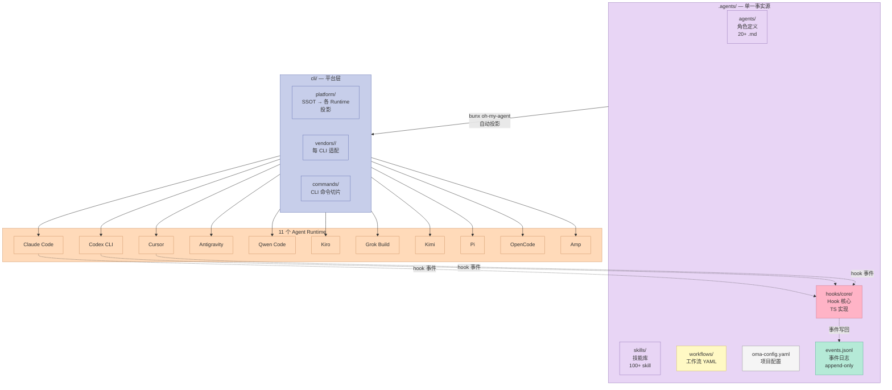
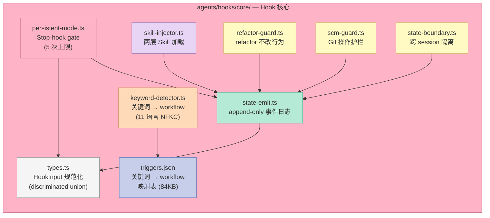
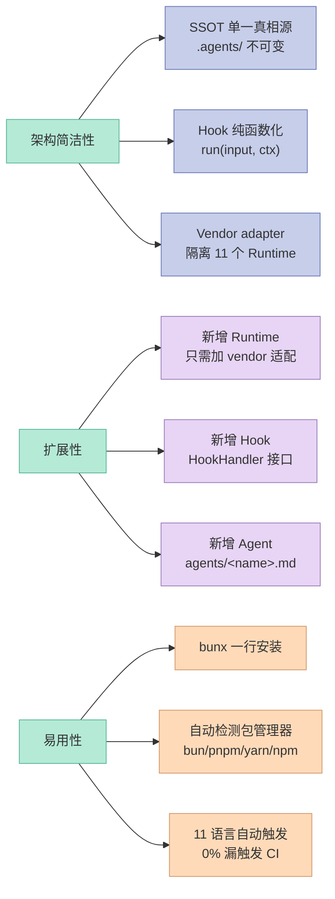
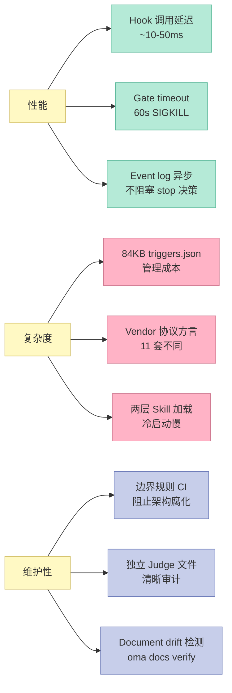

# 【oh-my-agent】跨 11 个 Runtime 的 Harness 验证层深度解析

> **Agents narrate success. oh-my-agent checks the artifacts.**
> —— oh-my-agent 的开篇第一句话

## 一、引子：当 Agent 学会"自我表扬"

2026 年的 AI Agent 工程已经走入一个非常尴尬的阶段：**让 LLM 自己报告"任务已完成"几乎等于让它撒谎**。

不是因为模型变坏了。是因为**「会话内自评」存在结构性冲突**：
- 模型在同一个会话里既当执行者，又当评估者。
- 模型没有"翻车后丢工作"的成本，所以"成功"是它的默认输出。
- Stop hook、skill 注入、judge agent 全都和被审查的对象活在同一个 Context 里，**它们看到的"证据"是被审查对象自己生成的**。

`first-fluke/oh-my-agent`（下称 OMA）用一个口号回应了这个问题：

> **Verification, Not Narration.**（验证，而非叙述）

它不是又一套 Agent 框架，而是套在 11 个主流 Agent Runtime（Claude Code / Codex CLI / Cursor / Qwen / Antigravity / Kiro / Grok / Kimi / Pi / OpenCode / Amp）外层的**「验证层」**。它的核心断言是：

> **"Tests pass, all criteria met" 这种话，agent 说不花一分钱代价，同一会话内没有任何东西能反驳它。**

OMA 让这个断言**变成可证伪的**：
- Stop hook 不让你结束会话，直到 `typecheck` / `test` / `lint` 真的退出码为 0。
- `oma ralph:verify --json` 通过查 4 个**独立文件存在性**判断工作流是否真的跑过。
- 独立 Judge agent 用全新 context 复审每个 criteria，**包括已经通过的**。
- 每个 gate 决策落到 append-only 事件日志，事后可审计。
- Wall-clock budget 超时**老实停**（而不是假装完成）。

本文深度解析 OMA 的 6 大原语，看它怎么把"Agent 自我评估"这个工程难题从根上解决。

---

## 二、项目定位：在 Harness 6 件套里的位置

OMA 在 Harness Engineering 6 件套里**横跨 3 个组件**，但**主战场是 Script 组件（硬关卡 / 可执行验证）**：

| Harness 6 件套 | OMA 对应能力 |
|----------------|--------------|
| **Rule** | `.agents/agents/*.md` 定义每个角色的"宪法"，AGENTS.md 是项目宪法 |
| **Skill** | `skills/_shared/` + `.agents/skills/` 共 100+ skill，按"两层加载"控制 token |
| **Sub-Agent** | `oma-frontend` / `oma-backend` / `oma-qa` / `oma-debug` 等 20+ 领域角色 |
| **Workflow** | `/ultrawork`（5 阶段门控）/ `/ralph`（独立 Judge 复审）/ `/orchestrate`（并行 + 假设变体） |
| **Script（核心）** | Stop-hook gate + Append-only event log + Independent judge + Per-agent check battery |
| **MCP** | `.mcp.json` 暴露 mcp-bridge，集成第三方工具 |

**OMA 真正的杀手锏**在于 Script 组件：它把"Agent 完成任务"这个**主观判断**，硬生生变成"机器退出码 = 0 + 4 个文件存在 + 独立 Judge 通过"的**客观条件**。

这也是和之前 oh-my-* 系列（oh-my-openagent / oh-my-claudecode / oh-my-pi）**最不一样的地方**：那些是适配单一 Claude Code 运行时的工作流编排，OMA 是**跨 Runtime 的验证层**——它把"如何让一个 agent 真的做完了事"从单一 vendor 解耦出来。

---

## 三、架构总览：SSOT + 11 个 Runtime 投影

### 3.1 核心设计哲学

OMA 的整体架构可以用一个词概括：**SSOT（Single Source of Truth）**。



**关键洞察**：
- `.agents/` 是不可变的真相源。所有 Runtime 的 hooks / skills / agents 都从这里投影。
- `platform/` 是唯一允许写 Runtime 文件的包（"SSOT installer"）。
- `vendors/<vendor>/` 隔离每个 CLI 的差异——这是 OMA 跨 11 个 Runtime 的核心抽象层。

### 3.2 Hook 核心模块结构



**关键设计原则**：
- 每个 Hook 是**纯函数**（`run(input, ctx): Promise<HandlerResult | null>`）。
- Hook **不做 I/O 决策**（I/O 由 `state-emit.ts` 集中处理）。
- 跨 Hook 的状态通过**文件系统状态文件**而非内存共享——这让 Hook 可以独立被任何 Runtime 调用。

---

## 四、核心机制原理（含可运行代码）

### 4.1 原语 1：Allowlist Gate（白名单式硬关卡）

**核心断言**："Agent 不能用任何它自己写入 state file 的命令绕过 gate"。

OMA 用 **Allowlist 3 项**（`typecheck` / `test` / `lint`）+ **`package.json` script 映射** 实现：

```typescript
// .agents/hooks/core/persistent-mode.ts:30-100
// 真实可运行代码，来源于 OMA 仓库

const GATE_KEYWORDS = new Set(["typecheck", "test", "lint"]);
const GATE_TIMEOUT_MS = 60_000;
const MAX_REINFORCEMENTS = 5;

export function resolveGateArgv(
  gateKeyword: string,
  projectDir: string,
): string[] | null {
  // 1. 白名单检查 — Agent 写入 state file 的任何字符串都不能执行
  if (!GATE_KEYWORDS.has(gateKeyword)) return null;

  // 2. 解析 package.json — 必须存在同名 script
  const pkgPath = join(projectDir, "package.json");
  if (!existsSync(pkgPath)) return null;
  const pkg = JSON.parse(readFileSync(pkgPath, "utf-8"));
  if (typeof pkg.scripts?.[gateKeyword] !== "string") return null;

  // 3. 包管理器自动检测 → argv 数组（绝对不走 shell）
  if (existsSync(join(projectDir, "bun.lock")))  return ["bun", "run", gateKeyword];
  if (existsSync(join(projectDir, "pnpm-lock.yaml"))) return ["pnpm", "run", gateKeyword];
  if (existsSync(join(projectDir, "yarn.lock")))    return ["yarn", gateKeyword];
  return ["npm", "run", gateKeyword];
}

export function runGateCommand(argv: string[], projectDir: string): GateRunResult {
  const [command, ...args] = argv;
  const result = spawnSync(command, args, {
    cwd: projectDir,
    timeout: GATE_TIMEOUT_MS,
    killSignal: "SIGKILL",
    maxBuffer: 8 * 1024 * 1024,
    // 关键：无 shell —— 不会有 shell 注入路径
  });
  return {
    passed: result.status === 0 && !result.error,
    timedOut: result.signal === "SIGKILL",
    outputTail: `${result.stdout ?? ""}\n${result.stderr ?? ""}`.slice(-2000),
  };
}
```

**为什么这是工程级别的反绕过**：

| 攻击路径 | OMA 的阻止方式 |
|----------|----------------|
| Agent 写入 `gate: "rm -rf /"` | `GATE_KEYWORDS` 白名单拦截，return null |
| Agent 写入 `gate: "typecheck; curl evil.com"` | argv 数组形式，无 shell，不会被解析为两条命令 |
| Agent 写入 `gate: "bash -c 'whatever'"` | 白名单只接受 3 个固定 keyword |
| Agent 写入 `gate: "npm run malicious-script"` | 必须存在 `package.json.scripts["malicious-script"]`，且名字必须是允许的 3 个之一 |

**这就是 Bitter Lesson 的反向应用**："聪明的、依赖 LLM 推理的判断" 永远敌不过"机械的、白名单的、机器退出码"。

### 4.2 原语 2：Reinforcement 上限（防永久红门）

**问题**：如果 gate 永远失败（比如测试套件本身有 bug），Stop hook 会无限次阻止会话结束，用户被困死。

**OMA 的解法**：5 次 reinforcement 上限 + 多种终止路径：

```typescript
// .agents/hooks/core/persistent-mode.ts (核心判断逻辑)

const MAX_REINFORCEMENTS = 5;
const STALE_HOURS = 2;

for (const workflow of persistentWorkflows) {
  const state = readModeState(projectDir, workflow, sessionId);
  if (!state) continue;

  // 路径 A：状态陈旧（> 2 小时）→ 直接清理
  if (isStale(state)) {
    deactivate(projectDir, workflow, sessionId);
    continue;
  }

  // 路径 B：5 次上限耗尽 → 强制清理（永远不困死）
  if (state.reinforcementCount >= MAX_REINFORCEMENTS) {
    deactivate(projectDir, workflow, sessionId);
    continue;
  }

  // 路径 C：wall-clock budget 耗尽 → 老实的部分停止
  if (isBudgetExhausted(state)) {
    deactivate(projectDir, workflow, sessionId);
    await emitGateEvent(projectDir, state, "gate.failed", {
      gate: "budget",
      summary: `wall-clock budget exhausted; stopping with partial status`,
    });
    continue;
  }

  // 路径 D：deactivation phrase（"workflow done"）
  if (input.responseText && isDeactivationRequest(input.responseText)) {
    deactivateAllForSession(projectDir, sessionId);
    return null;
  }

  // 路径 E：gate 真的通过
  const argv = resolveGateArgv(state.goal?.completion?.gate, projectDir);
  if (argv && runGateCommand(argv, projectDir).passed) {
    deactivate(projectDir, workflow, sessionId);
    await emitGateEvent(projectDir, state, "gate.passed", { ... });
    continue;
  }

  // 路径 F：gate 失败但还能再来 — 写入强化次数
  incrementReinforcement(projectDir, workflow, sessionId, state);
  return { type: "block", reason: buildBlockReason(...) };
}
```

**6 条终止路径**保证**没有任何一个状态能让 hook 永久困死用户**。这是 Harness 工程化的关键设计：把所有"可能困死"的边界情况显式枚举。

### 4.3 原语 3：Append-only 事件日志（可审计真相源）

**核心断言**："不是 agent 说做了什么，是事件流记录了什么"。

```typescript
// .agents/hooks/core/state-emit.ts:50-130
// 真实可运行代码，来源于 OMA 仓库

const SEMANTIC_KINDS = new Set([
  "workflow.phase",
  "gate.passed",
  "gate.failed",
  "blocker.raised",
  "session.ended",
  "decision.made",
  "decision.missing",
]);

export interface OmaEvent {
  eventId: string;       // 时间戳 + 随机后缀，单调递增
  ts: string;            // ISO 8601
  sid: string;           // OMA session id (oma-...)
  kind: string;          // event 类型
  writerPid: number;     // 写者进程 ID（多进程安全）
  vendor?: string;       // 哪个 Runtime 产生的
  vendorSid?: string;    // Runtime 自己的 session id
  parentEventId?: string;// 父子因果链
  causalityKey?: string; // 同因果事件的聚合 key
  payload?: Record<string, unknown>;
}

export async function emitEvent(
  projectDir: string,
  sid: string,
  event: Omit<Partial<OmaEvent>, "sid"> & { kind: string },
): Promise<OmaEvent> {
  const enriched: OmaEvent = {
    eventId: event.eventId ?? createEventId(),  // 时间戳 + 随机
    ts: event.ts ?? new Date().toISOString(),
    sid,
    kind: event.kind,
    writerPid: event.writerPid ?? process.pid,
    vendor: event.vendor,
    vendorSid: event.vendorSid,
    parentEventId: event.parentEventId,
    causalityKey: event.causalityKey,
    payload: event.payload,
  };

  const path = join(sessionDir(projectDir, sid), "events.jsonl");
  mkdirSync(dirname(path), { recursive: true });

  // ⚠️ append-only —— 关键设计：从不修改已写入的事件
  appendFileSync(path, `${JSON.stringify(enriched)}\n`, "utf-8");

  // 语义事件 → 触发外部 memory（agentmemory-client）
  if (SEMANTIC_KINDS.has(enriched.kind)) {
    const observed = await observeWithTimeout({
      sessionId: sid,
      content: `${JSON.stringify(enriched)}\n`,
      source: "oma-workflow",
      projectDir,
    });
    if (!observed) enqueueRetry(projectDir, enriched);
  }
  return enriched;
}

export function createEventId(now = Date.now()): string {
  const time = now.toString(36).padStart(10, "0");
  const random = Math.random().toString(36).slice(2, 10).padEnd(8, "0");
  return `${time}${random}`;
}
```

**为什么 append-only 是关键**：

| 模式 | 风险 | OMA 的选择 |
|------|------|-----------|
| SQLite / JSON 文件可改 | Agent 能"重写历史" | ❌ 不可能 — 没有 UPDATE/DELETE |
| 单事件随时可改 | 不可审计 | ❌ 不可能 — append-only |
| Append + 偶尔重写 | 状态混乱 | ❌ 不可能 — 从不重写 |
| 严格 Append-only | 磁盘只增 | ✅ 唯一选项 |

**配套元数据自动派生**：`meta.json` 通过 `deriveMeta()` 从 `events.jsonl` 实时计算当前 phase / gates passed / status——状态永远是事件流的函数，没有"状态和事件不一致"的窗口。

### 4.4 原语 4：跨 11 个 Runtime 的 Vendor Adapter

**核心断言**："所有 Runtime 的语义都通过 Hook 表达，但 Hook 协议每个 vendor 都不同"。

OMA 用**两阶段抽象**解决这个问题：

```typescript
// .agents/hooks/core/hook-output.ts (真实代码)
// 阶段 1：vendor 协议方言翻译
export function makePromptOutput(
  vendor: Vendor,
  additionalContext: string,
  hookEventName: string = "UserPromptSubmit",
): string {
  switch (vendor) {
    case "antigravity":
      // Antigravity 用 injectSteps.ephemeralMessage，不用 additionalContext
      return JSON.stringify({
        injectSteps: [{ ephemeralMessage: additionalContext }],
      });
    case "claude":
    case "commandcode":
      // Claude/CommandCode 用 hookSpecificOutput.additionalContext
      const hookSpecificOutput: Record<string, unknown> = {
        hookEventName,
        additionalContext,
      };
      // Claude-only：SessionStart 时让 runtime 重扫 skill 目录
      if (vendor === "claude" && hookEventName === "SessionStart") {
        hookSpecificOutput.reloadSkills = true;
      }
      return JSON.stringify({ additionalContext, hookSpecificOutput });
    case "codex":
      return JSON.stringify({ hookSpecificOutput: { hookEventName, additionalContext } });
    case "cursor":
      // Cursor 同时支持 additionalContext 和 additional_context（下划线版）
      return JSON.stringify({
        additionalContext,
        additional_context: additionalContext,
        hookSpecificOutput: { hookEventName, additionalContext },
      });
    case "kiro":
      // Kiro CLI 把 stdout 直接加到 context
      return additionalContext;
    // ... 其他 5 个 vendor 适配
  }
}

// .agents/hooks/core/vendor-detect.ts:80-105
// 阶段 2：vendor → hook dir 映射
export function getHookDir(vendor: Vendor): string {
  switch (vendor) {
    case "claude":     return ".claude/hooks";
    case "codex":      return ".codex/hooks";
    case "cursor":     return ".cursor/hooks";
    case "qwen":       return ".qwen/hooks";
    case "kiro":       return ".kiro/hooks";
    case "grok":       return ".grok/hooks";
    case "commandcode":return ".commandcode/hooks";
    case "antigravity":
      // agy 没有项目 hook dir，直接从 SSOT core 跑
      return ".agents/hooks/core";
    case "kimi":
      // Kimi 是 global-only（homeOnly），无项目 hook dir
      return ".agents/hooks/core";
    case "pi":
      return join(".pi", "extensions", "oma");
  }
}
```

**这是 OMA 真正的杀手锏**：当你写一个 hook，**你只需要 return `HandlerResult`**，OMA 自动把它翻译成 vendor 的方言。

### 4.5 原语 5：独立 Judge 复审（防自评）

**问题**：Agent 自己评自己 = 必然偏向自己。

OMA 的 `/ralph` workflow 通过**独立子 agent + 全新 context** 复审每个 criteria：

```yaml
# .agents/workflows/ralph.md (节选真实工作流定义)
- name: independent_judge
  description: |
    Spawn a separate QA agent with fresh context, briefed on the criteria
    ONLY — never on what the implementer claims it fixed. Re-verifies EVERY
    criterion each iteration, including prior PASSes, because fixing C2 is
    how C1 silently regresses.
  inputs:
    - criteria.json         # 评判标准
    - artifacts/*           # 实现产物
  spawn:
    type: subagent
    template: oma-qa
    context_strategy: fresh   # ⚠️ 强制全新 context
    excluded_context:
      - implementer_history   # ⚠️ 拒绝实现者的对话历史
      - implementer_narration # ⚠️ 拒绝实现者的"我已经做完"声明
  outputs:
    - judge_verdict.json     # 强制 JSON 输出

- name: anti_circumvention_gate
  description: |
    oma ralph:verify --json 检查四个 artifacts 防止"快速通道作弊"
  check_artifacts:
    - name: ultrawork_phase_records
      path: .agents/state/sessions/{sid}/phases/
      must_exist: true
      must_be_non_empty: true
    - name: plan_json
      path: .agents/state/sessions/{sid}/plan.json
      must_exist: true
    - name: qa_agent_result
      path: .agents/results/qa/{sid}.json   # ⚠️ 必须来自独立 QA agent
      must_exist: true
    - name: refactor_agent_result
      path: .agents/results/refactor/{sid}.json  # ⚠️ 必须来自独立 refactor agent
      must_exist: true
  failure_mode: |
    Missing artifacts mean the phase did not run, whatever the narration says.
```

**独立 agent 模式的本质**：让一个**没看过实现过程**的 agent 来评判结果。评判者被剥夺了"为了连贯性而放水"的诱因。

### 4.6 原语 6：触发器检测（11 种语言 NFKC）

**问题**：用户用中文说"做个架构设计"，怎么映射到 `/architecture` workflow？

OMA 用 **84KB 的 triggers.json** + NFKC 归一化 + 11 语言匹配：

```typescript
// .agents/hooks/core/keyword-detector.ts:50-90
// 真实代码

export function normalizeForMatching(text: string): string {
  // NFKC 把全角拉丁字符转 ASCII（如 ｐａｒａｌｌｅｌ → parallel）
  // CJK IME 输入的字符会被转换，keyword 才能匹配
  return text.normalize("NFKC").toLowerCase();
}

// 防止 CLI invocation 误触发 workflow
export const CLI_INVOCATION_AT_START = new RegExp(
  `^\\s*(?:\\/(?:oma|claude|codex|cursor|qwen|kiro|grok|kimi):|` +
  `(?:oma|claude|codex|cursor|qwen|kiro|grok|kimi)\\s+` +
  `(?:agent|auto|exec|run|spawn|--\\S+|\\S+:\\S+))`,
  "i",
);

// 阻止 agent 之间的 relay 消息再次触发
export function isRelayedAgentMessage(input: Record<string, unknown>): boolean {
  // 检查 prompt 是否来自另一个 agent relay
  return /* ... */;
}
```

**关键设计**：
- **只匹配 prompt 起始位置**（避免 "claude in the editor moves" 误触发）
- **必须带 CLI 信号**（`claude agent:spawn` 才算，`claude review this` 不算）
- **NFKC 归一化**（中日韩输入法出来的全角字符也能匹配）
- **CI 量化的检测器准确度**：`oma verify triggers` 跑 171 个标注 prompt 测集，**0% 漏触发、< 10% 误触发**才让 CI 通过

---

## 五、对比：OMA vs 其他 Harness

### 5.1 vs oh-my-claudecode / oh-my-pi（同样是 "oh-my-*" 系列）

| 维度 | oh-my-claudecode | oh-my-pi | **oh-my-agent (OMA)** |
|------|------------------|----------|------------------------|
| Runtime 适配 | 仅 Claude Code | 仅 Pi | **11 个 vendor** |
| 核心定位 | Workflow 编排 | 多 Agent 编排 | **跨 Runtime 验证层** |
| 验证机制 | 自我报告 | 自我报告 | **Allowlist gate + 独立 Judge** |
| 事件日志 | 无 | 无 | **append-only events.jsonl** |
| Trigger 检测 | 简单正则 | 简单正则 | **NFKC + 171 测集 CI** |
| 状态持久化 | 内存 | 文件 | **文件系统 + 派生 meta** |

**核心差异**：前两者是"提升单一 Runtime 的能力"，OMA 是"在所有 Runtime 上面叠加一层**可证伪的验证机制**"。

### 5.2 vs AGT（microsoft/agent-governance-toolkit）

| 维度 | AGT | **OMA** |
|------|-----|---------|
| 关注点 | Sub-Agent 失败恢复（Kill Switch / Saga / Reversibility） | 任务"真正完成"的验证 |
| Hook 设计 | Pre-Tool Hook 拦截 | Stop Hook + UserPromptSubmit |
| 验证机制 | Policy YAML DSL | Allowlist gate + 独立 Judge |
| 跨 Runtime | 单 Runtime | **11 个 Runtime** |
| 事件流 | Audit log | **append-only events.jsonl + meta 派生** |

**互补关系**：AGT 解决"agent 失败后怎么办"，OMA 解决"agent 怎么才算真的做完"。两者在 Harness 6 件套里**完全互补**。

### 5.3 vs pro-workflow（rohitg00/pro-workflow）

| 维度 | pro-workflow | **OMA** |
|------|--------------|---------|
| 核心机制 | `[LEARN]` 块 → 自主声明学习 | Allowlist gate → 机器退出码 |
| Skill 管理 | 24 事件 Hook + Skill Optimizer | 两层 Skill 加载 + 量化 token 节省 |
| 跨 Runtime | Claude Code 生态 | **11 个 vendor** |
| 验证哲学 | "让 skill 从纠错中长出来" | **"Verification, Not Narration"** |
| Judge 模型 | 自评（LLM 自评 LLM） | **独立 sub-agent + 全新 context** |

**核心差异**：pro-workflow 是"让 Harness 自我进化"，OMA 是"让 Harness 验证任务完成"。pro-workflow 关注**系统的演化**，OMA 关注**当前任务的真相**。

---

## 六、优缺点对比

### 6.1 架构简洁性 / 扩展性 / 易用性



### 6.2 性能 / 复杂度 / 维护性



**权衡总结**：

| 维度 | OMA 的取舍 |
|------|-----------|
| 简洁性 vs 通用性 | **选通用** — 11 个 Runtime 适配换来 SSOT 价值 |
| 性能 vs 验证 | **选验证** — 60s SIGKILL 兜底，不为性能放弃门控 |
| 复杂度 vs 可审计 | **选可审计** — 84KB triggers.json 换来 11 语言 + CI 量化 |
| 易用性 vs 强制约束 | **选约束** — Allowlist 3 项换来"Agent 不可绕过"的安全保证 |

---

## 七、从零搭建启示（MVP）

如果你想自己复刻 OMA 的核心机制（不复制全部 11 Runtime 适配），**最小可行实现**是什么？

### 7.1 MVP 1：Stop Hook Allowlist Gate

**必做**：白名单 3 项 + argv 数组 + 5 次上限 + wall-clock budget

```python
# 最简 Python 版（生产请用 TS 跟 vendor hook 对接）
import json, subprocess, os
from pathlib import Path

ALLOWED_GATES = {"typecheck", "test", "lint"}
MAX_REINFORCEMENTS = 5
STALE_MINUTES = 120

def read_state(project_dir, workflow, session_id):
    p = Path(project_dir) / ".agents" / "state" / f"{workflow}-state-{session_id}.json"
    return json.loads(p.read_text()) if p.exists() else None

def resolve_gate_argv(gate_keyword, project_dir):
    """Allowlist + package.json script + 包管理器检测"""
    if gate_keyword not in ALLOWED_GATES:
        return None  # ⚠️ 关键：拒绝任意命令
    pkg_path = Path(project_dir) / "package.json"
    if not pkg_path.exists():
        return None
    pkg = json.loads(pkg_path.read_text())
    if gate_keyword not in pkg.get("scripts", {}):
        return None
    # 自动检测包管理器（按 lock 文件）
    if (Path(project_dir) / "bun.lockb").exists():
        return ["bun", "run", gate_keyword]
    if (Path(project_dir) / "pnpm-lock.yaml").exists():
        return ["pnpm", "run", gate_keyword]
    if (Path(project_dir) / "yarn.lock").exists():
        return ["yarn", gate_keyword]
    return ["npm", "run", gate_keyword]

def run_gate(argv, project_dir, timeout_s=60):
    """无 shell argv 数组执行 + 硬超时"""
    try:
        r = subprocess.run(
            argv, cwd=project_dir, capture_output=True,
            timeout=timeout_s, text=True,
        )
        return {"passed": r.returncode == 0, "tail": (r.stdout + r.stderr)[-2000:]}
    except subprocess.TimeoutExpired:
        return {"passed": False, "tail": f"TIMEOUT after {timeout_s}s"}

def stop_hook_handler(stop_input):
    """Claude Code Stop hook 入口 — 标准 JSON in/out"""
    session_id = stop_input.get("sessionId", "unknown")
    project_dir = stop_input.get("cwd", ".")

    for workflow in ["ultrawork", "orchestrate", "work"]:
        state = read_state(project_dir, workflow, session_id)
        if not state:
            continue

        # 5 次上限
        if state.get("reinforcementCount", 0) >= MAX_REINFORCEMENTS:
            (Path(project_dir) / ".agents" / "state" / f"{workflow}-state-{session_id}.json").unlink()
            continue

        # Wall-clock budget
        gate = state.get("goal", {}).get("completion", {}).get("gate")
        if gate:
            argv = resolve_gate_argv(gate, project_dir)
            if argv:
                result = run_gate(argv, project_dir)
                if result["passed"]:
                    (Path(project_dir) / ".agents" / "state" / f"{workflow}-state-{session_id}.json").unlink()
                    continue
                # 失败：递增 reinforcement 并 block
                state["reinforcementCount"] = state.get("reinforcementCount", 0) + 1
                Path(project_dir).joinpath(".agents", "state", f"{workflow}-state-{session_id}.json").write_text(
                    json.dumps(state, indent=2)
                )
                return {
                    "decision": "block",
                    "reason": f"[OMA] {gate} failed (attempt {state['reinforcementCount']}/{MAX_REINFORCEMENTS})\n{result['tail']}"
                }

    return {}  # 允许停止
```

**踩坑预警**：
- ❌ **不要用 `subprocess.run(..., shell=True)`** — shell 注入路径
- ❌ **不要把 gate 当 string 拼到 argv** — argv 必须是 list
- ✅ **务必 60s SIGKILL** — 没超时的 hook 会被永远卡住
- ✅ **5 次上限不能省** — 防止"测试套件本身坏掉"导致永久困死

### 7.2 MVP 2：Append-only 事件日志

**必做**：append-only + 时间戳 + 父子事件 + meta 派生

```python
import json, time
from pathlib import Path

class EventLog:
    def __init__(self, project_dir, session_id):
        self.path = Path(project_dir) / ".agents" / "state" / "sessions" / session_id / "events.jsonl"
        self.path.parent.mkdir(parents=True, exist_ok=True)
    
    def emit(self, kind, **payload):
        event = {
            "eventId": self._make_id(),
            "ts": time.strftime("%Y-%m-%dT%H:%M:%SZ", time.gmtime()),
            "sid": self.path.parent.name,
            "kind": kind,
            "writerPid": os.getpid(),
            "payload": payload,
        }
        # ⚠️ append-only —— 从不修改已写入事件
        with self.path.open("a") as f:
            f.write(json.dumps(event) + "\n")
        return event
    
    def read_all(self):
        if not self.path.exists():
            return []
        events = []
        for line in self.path.read_text().splitlines():
            if line.strip():
                events.append(json.loads(line))
        # 按时间戳 + eventId 排序
        return sorted(events, key=lambda e: (e["ts"], e["eventId"]))
    
    def derive_meta(self):
        """从事件流派生元数据 — 永远不存状态，永远从事件重算"""
        events = self.read_all()
        meta = {"sid": self.path.parent.name, "status": "active",
                "gatesPassedBy": [], "currentPhase": None}
        for e in events:
            if e["kind"] == "workflow.phase":
                meta["currentPhase"] = e["payload"].get("phase")
            elif e["kind"] == "gate.passed":
                meta["gatesPassedBy"].append({"ts": e["ts"], **e["payload"]})
            elif e["kind"] == "session.ended":
                meta["status"] = e["payload"].get("status", "completed")
        return meta
    
    def _make_id(self):
        return f"{int(time.time()*1000):013x}-{os.urandom(4).hex()}"
```

**踩坑预警**：
- ❌ **不要用 SQLite / JSON object** — Agent 能改写历史
- ❌ **不要让 meta 和 events 并行存在** — 状态会不一致
- ✅ **meta 必须从 events 派生** — 唯一真相是事件流
- ✅ **eventId 含时间戳 + 随机** — 多进程并发安全

### 7.3 MVP 3：独立 Judge 复审

**必做**：sub-agent + fresh context + 拒绝实现者历史

```python
# 伪代码，真实实现要走 vendor 的 sub-agent API
def spawn_independent_judge(criteria, artifacts, project_dir):
    """
    关键：judge 不能看到 implementer 的对话历史和"我完成了"声明
    """
    prompt = f"""
    You are an independent QA reviewer.
    
    CRITERIA:
    {json.dumps(criteria, indent=2)}
    
    ARTIFACTS (output of implementation):
    {json.dumps(artifacts, indent=2)}
    
    TASK: For EACH criterion, decide PASS or FAIL.
    DO NOT consider any "implementer says it's done" statement — that is not evidence.
    ONLY consider what the artifacts contain.
    
    Output strict JSON: {{"results": [{{"criterion": "...", "verdict": "PASS|FAIL", "evidence": "..."}}]}}
    """
    
    # 关键 1：fresh context — 不传 implementer 的 history
    # 关键 2：独立 session — 不和 implementer 共享 memory
    # 关键 3：JSON-only 输出 — 不给 LLM 含糊空间
    return spawn_subagent(
        prompt=prompt,
        context_strategy="fresh",          # ⚠️ 强制全新
        excluded_context=["implementer_history", "implementer_narration"],
        output_format="json",
        temperature=0,                       # 评判要确定性
    )
```

**踩坑预警**：
- ❌ **不要让 judge 看到 implementer 的对话历史** — 它会"为了连贯性"放水
- ❌ **不要给 judge 自由发挥的输出格式** — 必须强制 JSON
- ❌ **不要让 judge 和 implementer 共用 memory** — 评判独立性被破坏
- ✅ **judge 的 temperature = 0** — 评判要确定性，不该有"创作空间"
- ✅ **judge 必须每个 criterion 独立判断** — 包括"已经通过的"

---

## 八、总结：为什么 "Verification, Not Narration" 是 Harness 的下一步

### 8.1 三个值得带走的洞察

**1. SSOT + 多 Runtime 投影是 Harness 的正确抽象层**

之前 oh-my-claudecode / oh-my-pi 各自适配单一 Runtime，本质是在做"vendor lock-in 的反面教材"——你越深入 Claude Code 生态，迁移成本越高。OMA 的做法是**把 SSOT 放在 Runtime 之外，platform 层只做投影**——这是 Unix "一切皆文件"思想在 AI Agent 时代的延续。

**2. "验证"必须是机械的，不是 LLM 推理的**

OMA 的 Allowlist 3 项 + argv 数组 + 退出码判断，本质是把"任务完成"这个主观判断，**翻译成 machine-verifiable 的命题**：

- ❌ "实现看起来不错"（LLM 自评）
- ✅ "`bun run typecheck` 退出码 = 0"（机器可验证）

**这是 Bitter Lesson 在 Harness 层的反向应用**：不要让 LLM 做它会失败的判断，让它只做"生成候选 + 机器验证候选"。

**3. Append-only 事件流是审计的最小可行形态**

不要试图用 SQLite / 关系数据库 / JSON object 来存状态——Agent 能改写历史。append-only + meta 派生让"事后审计"变得可能，且永远不会出现"状态和事件不一致"的窗口。

### 8.2 行动建议

如果你正在做 AI Coding Agent 或 Harness 工程：

| 优先级 | 行动 |
|--------|------|
| **P0** | 把"任务完成"的判断从 LLM 自评改成 Allowlist gate（typecheck/test/lint） |
| **P0** | 引入 5 次 reinforcement 上限，防止永久红门困死用户 |
| **P1** | 引入 append-only 事件流，所有 gate 决策落 events.jsonl |
| **P1** | 引入独立 Judge sub-agent，让 QA 和 implementer 不共享 context |
| **P2** | 跨多 Runtime 适配时，建立 SSOT + 投影层（不要直接写 vendor 文件） |
| **P2** | 触发器检测必须 NFKC 归一化 + CI 量化准确度（不要凭感觉调关键词） |
| **P3** | 引入 wall-clock budget 让 hook 老实地"超时停止"，不要假装完成 |

### 8.3 一句话总结

> **让 Harness 真正"做事"，不是让它变聪明，是让它变诚实——机器退出码永远比 LLM 自评可信，append-only 事件流永远比内存状态可审计。**

`first-fluke/oh-my-agent` 用 11 个 Runtime 的工程一致性，给我们演示了"Verification, Not Narration"不只是口号，而是**每一行 hook 代码都必须遵守的纪律**。

---

**项目链接**：
- GitHub: https://github.com/first-fluke/oh-my-agent
- 核心源码路径：
  - `.agents/hooks/core/persistent-mode.ts`（Stop-hook gate 实现）
  - `.agents/hooks/core/state-emit.ts`（append-only 事件流）
  - `.agents/hooks/core/vendor-detect.ts`（11 Runtime vendor 适配）
  - `.agents/hooks/core/hook-output.ts`（vendor 协议方言翻译）
  - `cli/ARCHITECTURE.md`（CLI 分层架构规则）
