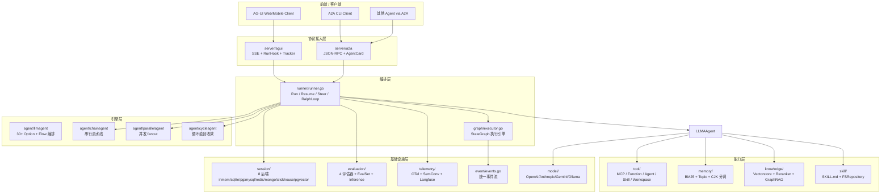
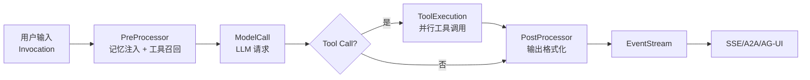
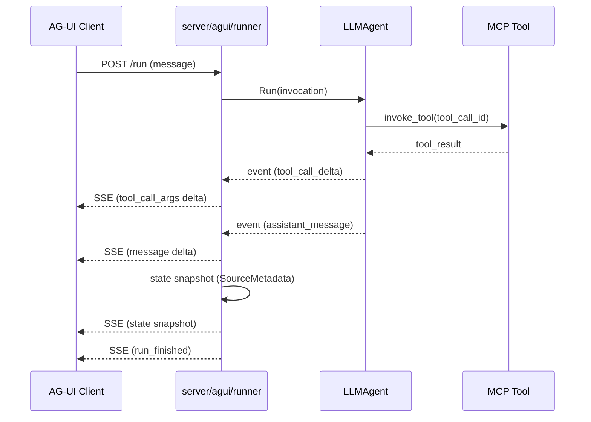
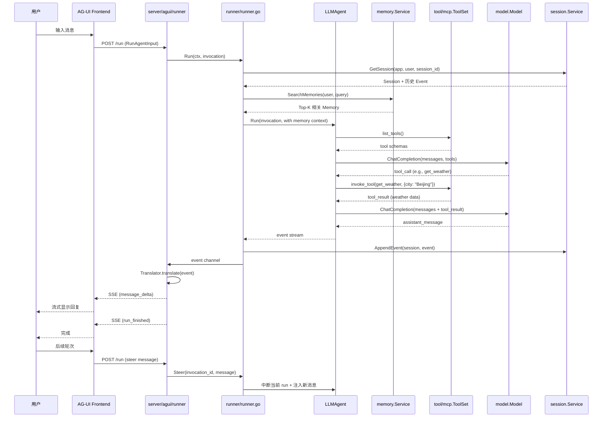

# 【tRPC-Agent-Go】核心架构与设计原理深度解析：Go 原生 Agent 框架的协议整合之道

## 一、引子：当 Go 生态遇见 Agent 浪潮

2026 年的 AI Agent 赛道已经被 LangChain、LangGraph、CrewAI、AutoGen 等 Python/TypeScript 框架牢牢占据。这些框架以「快速原型」为出发点，用 Python 的灵活性换来了蓬勃的社区生态。但在生产环境中，**Go 服务的并发模型、类型系统、运维生态与可观测性体系**是 Python 难以企及的：

- 一个日活百万级的智能客服系统，需要处理万级 QPS 的对话流转，**goroutine + channel** 的并发原语比 asyncio 更轻量
- 一个分布式 Agent 集群需要严格的服务契约，**Go interface** 比 Python duck typing 更早暴露集成错误
- 一个金融场景的 Agent 需要全链路 OpenTelemetry trace，**Go 的 otel SDK** 比 Python 版的覆盖度更完整
- 一个跨云厂商部署的 Agent 服务需要单二进制可执行，**Go 静态编译**比 Python 解释器部署更可控

正是在这一背景下，**腾讯 tRPC 团队**于 2025 年 5 月正式开源了 **tRPC-Agent-Go**（`trpc-group/trpc-agent-go`）。这是一个定位为「**Go 原生生产级 Agent 框架**」的项目，截至 2026 年 8 月已迭代到 v0.6.x，**GitHub Stars 1.7k+、Apache-2.0 License、3065 个 .go 文件、261MB 源码规模**，并登上了 Trendshift Go 仓库日榜 #1。

它的野心很大：在**一个 Go-native 栈**里同时提供：

1. **LLM Agent 运行时**（流式响应、context cancellation、并发编排）
2. **GraphAgent 图工作流**（等价 LangGraph 的 Go 版，含多条件路由、checkpoint、time-travel）
3. **多 Agent 协作**（Chain / Parallel / Cycle 三种拓扑）
4. **MCP 工具生态**（stdio + HTTP + SSE 三种 transport，单 session 自动重连）
5. **AG-UI 协议**（前端事件流聚合 + tool call delta + multimodal 渲染）
6. **A2A 协议**（Agent Card + cross-agent 通信 + subgraph 注入）
7. **Session 持久化**（8 种后端：inmemory / sqlite / postgres / mysql / redis / mongodb / clickhouse / pgvector）
8. **Memory 服务**（BM25 + 中文分词 + topic 加权 + 时间衰减）
9. **Skill 仓库**（SKILL.md 文件夹 + front matter + 自动索引）
10. **Evaluation 评测体系**（FinalResponse / Hallucination / Rubric / ToolTrajectory 4 类评估器）
11. **Ralph Loop 完成门控**（`<promise>` 标签 + VerifyCommand shell + 自定义 Verifier）
12. **OpenTelemetry 观测**（tracer + meter + semconv + Langfuse 集成）

这几乎是把 ADK（Agent Development Kit）的全套能力用 Go 重写一遍。本文就带你从顶层架构、协议整合、Graph 引擎、Memory 服务、MCP 工具集、Ralph Loop 完成门控六个维度，深度剖析这个项目的设计哲学与工程实现。

## 二、项目定位与核心价值

### 2.1 仓库概览

| 指标 | 值 |
|---|---|
| 仓库地址 | https://github.com/trpc-group/trpc-agent-go |
| 团队 | 腾讯 tRPC 团队（同时维护 tRPC-Go RPC 框架） |
| Stars | 1,700+（2026-08-16） |
| License | Apache-2.0 |
| 主语言 | Go 100% |
| 代码规模 | 3,065 个 .go 文件，~261MB（含测试与 examples） |
| 最近推送 | 2026-08-16（活跃） |
| 文档站 | https://trpc-group.github.io/trpc-agent-go/ |
| 包路径 | `trpc.group/trpc-go/trpc-agent-go` |
| 协议 | A2A、AG-UI、MCP、OpenTelemetry、Langfuse |

### 2.2 一句话定位

> **tRPC-Agent-Go 是面向 Go 服务生态的生产级 Agent 框架，把图工作流、多 Agent 协作、工具协议、UI 协议、Session 持久化、Memory 检索、Skill 仓库、Evaluation 评测、Ralph Loop 完成门控九大子系统，封装在一套 interface-driven 的 Go-native 栈里，让 Go 后端服务能像调 RPC 一样调 Agent。**

### 2.3 能力矩阵

| 能力 | 提供方 | 接口签名 |
|---|---|---|
| Agent 基础 | `agent/agent.go` | `type Agent interface { Run, Tools, Info, SubAgents, FindSubAgent }` |
| LLM Agent | `agent/llmagent/llm_agent.go` | `New(name, opts...)`，含 30+ `WithXXX` 配置 |
| Chain Agent | `agent/chainagent/chainagent.go` | `New("name", WithSubAgents([]agent.Agent{...}))` |
| Parallel Agent | `agent/parallelagent/parallelagent.go` | 多 Agent 并发 + 结果聚合 |
| Graph Agent | `graph/state_graph.go` | `NewStateGraph(schema).AddNode(...).AddEdge(...).Compile()` |
| MCP Tool | `tool/mcp/toolset.go` | `NewMCPToolSet(ConnectionConfig, opts...)` |
| Function Tool | `internal/tool/tool.go` | `NewFunctionTool(fn, opts...)` |
| Runner | `runner/runner.go` | `runner.NewRunner("app", agent, opts...)` |
| Session | `session/session.go` | `Service` 接口，8 个后端实现 |
| Memory | `memory/` | `MemoryService` 接口 + `MemoryTool` LLM-tool |
| Knowledge | `knowledge/` | RAG pipeline + vectorstore + reranker |
| Skill | `skill/repository.go` | `FSRepository` + `SKILL.md` 协议 |
| AG-UI Server | `server/agui/runner/runner.go` | SSE + tool delta + multimodal |
| A2A Server | `server/a2a/server.go` | Agent Card + JSON-RPC |
| Evaluation | `evaluation/evaluation.go` | EvalSet + Metric + Inference 4 类评估器 |
| Telemetry | `telemetry/` | OpenTelemetry tracer + meter + semconv |

## 三、整体架构

### 3.1 顶层架构（6 层 + 9 大子系统）



### 3.2 后端服务拆分（go.mod 子包）

```text
trpc-agent-go/
├── agent/                 # Agent interface + Chain/Parallel/Cycle 编排
│   ├── llmagent/         # LLM 驱动的 Agent（含 30+ WithXXX Option）
│   ├── chainagent/       # 串行流水线
│   ├── parallelagent/    # 并发 fanout
│   └── cycleagent/       # 循环直到收敛
├── runner/               # Runner 主循环（含 ralph_loop.go、plugin、middleware）
├── graph/                # StateGraph + Executor + Checkpoint + Subgraph
├── tool/                 # Tool interface + MCP/Function/Agent/Workspace
├── knowledge/            # RAG pipeline + vectorstore + reranker + GraphRAG
├── memory/               # Memory service + extractor + tool
├── skill/                # Skill Repository（SKILL.md 协议）
├── session/              # Session 抽象 + 8 个后端
├── model/                # LLM Provider 抽象（OpenAI/Anthropic/Gemini/Ollama）
├── server/
│   ├── agui/             # AG-UI 协议实现
│   └── a2a/              # A2A 协议实现
├── evaluation/           # 评测体系（EvalSet/Metric/Inference）
├── telemetry/            # OpenTelemetry 集成
├── event/                # 事件抽象
├── planner/              # Planner 抽象（ReAct/Plan-and-Execute）
├── prompt/               # 提示词渲染
├── artifact/             # 工件管理
├── codeexecutor/         # 代码执行沙箱（local/remote）
├── evolution/            # Agent Self-Evolution（Hermes 式 session review）
├── plugin/               # Runner 插件
└── examples/             # 100+ 可运行 examples
```

## 四、核心抽象一：Agent Interface 与编排体系

### 4.1 Agent 接口设计

tRPC-Agent-Go 的 `Agent` interface 极为简洁（`agent/agent.go`），只用 5 个方法描述 Agent 的全部能力：

```go
// 来自 agent/agent.go:60-100
type Agent interface {
    // Run executes the provided invocation within the given context and returns
    // a channel of events that represent the progress and results of the execution.
    Run(ctx context.Context, invocation *Invocation) (
        <-chan *event.Event, error,
    )

    // Tools returns the list of tools that this agent has access to and can execute.
    Tools() []tool.Tool

    // Info returns the basic information about this agent.
    Info() Info

    // SubAgents returns the list of sub-agents available to this agent.
    // Returns empty slice if no sub-agents are available.
    SubAgents() []Agent

    // FindSubAgent finds a sub-agent by name.
    FindSubAgent(name string) Agent
}
```

**设计哲学**：所有 Agent 实现（LLMAgent、ChainAgent、ParallelAgent、CycleAgent、GraphAgent）都实现这同一个 interface，**返回 `<-chan *event.Event` 流式事件**而非同步返回值。这与 ADK Python 的 `async generator` 异曲同工，**让任意 Agent 都能与 SSE/HTTP/gRPC 等流式协议无缝对接**。

### 4.2 ChainAgent 串行编排

`ChainAgent` 把多个子 Agent 串成一条流水线，前一个 Agent 的输出作为后一个的输入：

```go
// 来自 examples/chainagent README
pipeline := chainagent.New("pipeline",
    chainagent.WithSubAgents([]agent.Agent{
        analyzer, processor, reporter,
    }))
```

### 4.3 ParallelAgent 并发编排

`ParallelAgent` 把同一个输入广播给多个子 Agent，并发执行后聚合结果：

```go
parallel := parallelagent.New("concurrent",
    parallelagent.WithSubAgents(tasks))
```

**核心机制**：用 `sync.WaitGroup` + `errgroup` 隔离每个子 Agent 的事件流，**任意子 Agent panic 不影响主流程**；聚合器（aggregator）支持 `last` / `first` / `merge` 三种策略。

### 4.4 LLMAgent 内部流（Flow 抽象）

`LLMAgent` 是最高频使用的实现，其内部用 **Flow** 抽象（`internal/flow/llmflow`）把请求处理拆成可插拔的处理器链：



LLMAgent 支持 30+ 个 `WithXXX` Option，包括：

- `WithModel(model.Model)` — 指定 LLM Provider
- `WithTools(tools...)` — 注册用户工具
- `WithToolSets(toolset...)` — 注册 ToolSet（如 MCP ToolSet）
- `WithSubAgents([]Agent)` — 配置子 Agent
- `WithInstruction(prompt.Text)` — 系统提示词
- `WithMemoryService(memory.Service)` — 接入 Memory
- `WithKnowledge(knowledge.Base)` — 接入 RAG
- `WithSkills(skill.Repository)` — 接入 Skill 仓库
- `WithPlanner(planner.Planner)` — 替换 Planner（ReAct / Plan-and-Execute）
- `WithCodeExecutor(codeexecutor.CodeExecutor)` — 启用代码执行沙箱

## 五、核心抽象二：GraphAgent 图工作流引擎

### 5.1 StateGraph 概念

`GraphAgent`（`graph/state_graph.go`，176KB / ~5,500 行）是 tRPC-Agent-Go 最复杂的子系统，对标 **LangGraph** 的 Go 实现。其核心抽象：

```text
StateGraph
├── Schema（StateSchema）
│   ├── Fields（强类型字段 + Reducer）
│   └── Channels（动态追加 channel）
├── Nodes（节点函数）
│   ├── LLM Node（调 LLM）
│   ├── Tool Node（调工具）
│   ├── Agent Node（嵌套 Agent）
│   └── Function Node（自定义）
├── Edges（边条件路由）
│   ├── Static Edge（无条件）
│   ├── Conditional Edge（多条件）
│   └── Command Edge（合并状态更新 + 路由）
└── Checkpoint（持久化快照）
    ├── InMemory
    ├── Redis
    └── SQLite
```

### 5.2 Schema 与 Reducer

`StateGraph` 的 State 是**强类型 + Reducer 合并策略**的，类似 Redux 模式：

```go
// 来自 graph/state_graph.go:50-80
schema := graph.NewStateSchema().
    AddField("messages", graph.StateField{
        Type:    reflect.TypeOf([]string{}),
        Reducer: graph.AppendReducer,  // 追加而非覆盖
    }).
    AddField("counter", graph.StateField{
        Type:    reflect.TypeOf(0),
        Reducer: graph.SumReducer,     // 求和
    }).
    AddField("user_query", graph.StateField{
        Type:    reflect.TypeOf(""),
        Reducer: graph.OverwriteReducer, // 覆盖
    })

sg := graph.NewStateGraph(schema)
```

**为什么需要 Reducer**：在多分支 fanout 场景，两个并行节点都修改 `messages` 字段，Reducer 决定**如何合并两份修改**。`AppendReducer` 把两份追加成一个数组，`OverwriteReducer` 取最后一份。**这套机制与 LangGraph 的 `Annotated` 字段语义一致**，但用 Go 的反射（`reflect.TypeOf`）实现类型安全。

### 5.3 节点与边

```go
// 来自 graph/state_graph.go:85-150
sg := graph.NewStateGraph(schema).
    AddNode("parse", parseFunc).
    AddNode("retrieve", retrieveFunc).
    AddNode("llm", llmNode).
    AddNode("respond", respondFunc).
    AddEdge("parse", "retrieve").
    AddEdge("retrieve", "llm").
    AddConditionalEdges("llm",
        func(ctx context.Context, state graph.State) string {
            if hasToolCall(state) {
                return "tool_node"
            }
            return "respond"
        },
        map[string]string{
            "tool_node":  "tool_node",
            "respond":    "respond",
        },
    ).
    SetEntryPoint("parse").
    SetFinishPoint("respond")

graph, err := sg.Compile()
```

**Conditional Edge** 是 Graph 工作流区别于普通 DAG 的核心：节点执行完后，**根据 State 的当前值动态决定下一个节点**。这让 Agent 具备了「if-else 分支 + 循环回到前面节点」的完整控制流能力。

### 5.4 Checkpoint 与 Time-Travel

tRPC-Agent-Go 的 Checkpoint 子系统（`graph/checkpoint.go` + `graph/checkpoint/{inmemory,redis,sqlite}/`）支持：

1. **自动快照**：每步执行后把 State 序列化到 Checkpoint 后端
2. **Resume 从 Checkpoint 恢复**：runner 崩溃后用 `runner.Resume(checkpointID)` 续跑
3. **Time-Travel**：调试时可跳到任意历史 Checkpoint 重放

Redis 后端用 Lua 脚本实现原子的 snapshot + 版本号自增（`session/redis/internal/zset/lua.go`，4KB Lua 脚本），避免高并发下的版本冲突。

### 5.5 Subgraph 嵌套

`GraphAgent` 支持把另一个 `GraphAgent` 嵌入为子节点（`AddSubgraph`），形成**层次化工作流**。子图的状态通过 channel 与父图隔离，避免命名冲突。

### 5.6 A2A Subgraph 注入

A2A 协议的 `AgentCard` 描述暴露了 Agent 的能力，`GraphAgent` 可以把一个远端 A2A Agent 作为子图注入（`internal/agenttoolgraph/bridge.go`）。这意味着**跨进程、跨语言的 Agent 协作可以无缝嵌入到 Go 图工作流**。

## 六、核心抽象三：MCP ToolSet 与协议适配

### 6.1 MCP ToolSet 设计

`tool/mcp/toolset.go` 是 MCP 协议的 Go 实现，包含 stdio / HTTP / SSE 三种 transport：

```go
// 来自 tool/mcp/toolset.go:50-90
type ToolSet struct {
    config         toolSetConfig
    sessionManager *mcpSessionManager
    tools          []tool.Tool
    mu             sync.RWMutex
    name           string
}

func NewMCPToolSet(config ConnectionConfig, opts ...ToolSetOption) *ToolSet
```

### 6.2 三种 Transport

```go
// 来自 tool/mcp/config.go
type ConnectionConfig struct {
    Transport  string                 // "stdio" / "sse" / "http"
    Command    string                 // stdio 时用
    Args       []string
    URL        string                 // sse/http 时用
    Headers    map[string]string
    Timeout    time.Duration
    // ...
}
```

**stdio transport**：用 `singleflight` 防止并发初始化同一个进程；启动 MCP server 子进程，通过 stdin/stdout JSON-RPC 通信。

**SSE / HTTP transport**：用 `golang.org/x/sync/singleflight` 做 client-side 去重，session 用 Server-Sent Events 推送 tool list 变更。

### 6.3 Session 自动重连

`ToolSet` 实现了完整的 session 重连机制（`tool/mcp/toolset.go` 中 `sessionReconnectErrorPatterns`）：

```go
// 来自 tool/mcp/toolset.go:25-40
var sessionReconnectErrorPatterns = []string{
    "session_expired:",
    "transport is closed",
    "client not initialized",
    "connection refused",
    "connection reset",
    "EOF",
    "broken pipe",
    "HTTP 404",
    "session not found",
}
```

**哲学**：**保守重连策略**——只对明确的连接/session 失败触发重连，配置错误（DNS）和超时（性能）**不重连**（避免无限循环）。重连成功后用 `singleflight` 防止重连风暴。

### 6.4 工具命名空间隔离

多个 MCP server 同时挂载时，工具名冲突是个大问题。tRPC-Agent-Go 用 `WithName` 给每个 ToolSet 指定前缀：

```go
toolA := mcp.NewMCPToolSet(cfgA, mcp.WithName("git"))
toolB := mcp.NewMCPToolSet(cfgB, mcp.WithName("db"))
agent := llmagent.New("assistant",
    llmagent.WithToolSets(toolA, toolB),
)
// LLM 看到的是 git_status / db_query 两个不冲突的工具
```

## 七、核心抽象四：Memory 服务与 BM25 检索

### 7.1 Memory Service 接口

Memory 子系统（`memory/internal/memory/memory.go`，45KB）实现了 **「自动从对话中提取事实 → 持久化 → 检索时召回」** 的完整循环：

```go
// 来自 memory/internal/memory/memory.go
type Service interface {
    AddMemory(ctx context.Context, userKey UserKey, memory *Memory, opts ...AddOption) error
    SearchMemories(ctx context.Context, userKey UserKey, query string, opts ...SearchOption) ([]*Memory, []float64, error)
    UpdateMemory(ctx context.Context, userKey UserKey, memoryID string, memory *Memory, opts ...UpdateOption) error
    DeleteMemory(ctx context.Context, userKey UserKey, memoryID string) error
    ListMemories(ctx context.Context, userKey UserKey, opts ...ListOption) ([]*Memory, error)
}
```

### 7.2 自动 Memory 提取

`Auto Memory Service`（`memory/internal/memory/auto.go`，34KB）在每次对话结束后自动用 LLM 抽取用户偏好/事实/事件：

```go
memorySvc := memory.NewAutoService(
    memory.WithExtractor(extractor.NewLLMExtractor(model)),
    memory.WithBackend(inmemory.New()),
    memory.WithUserKey(memory.UserKey{AppName: "myapp", UserID: "user_42"}),
)
```

**Memory ID 生成**（`memory/internal/memory/memory.go` 的 `GenerateMemoryID`）：

```go
// 来自 memory/internal/memory/memory.go
func GenerateMemoryID(mem *memory.Memory, appName, userID string) string {
    var builder strings.Builder
    builder.WriteString("memory:")
    builder.WriteString(mem.Memory)
    builder.WriteString("|app:")
    builder.WriteString(appName)
    builder.WriteString("|user:")
    builder.WriteString(userID)
    if kind := metadataIdentityKind(mem); kind != "" {
        builder.WriteString("|kind:")
        builder.WriteString(string(kind))
    }
    // ...
}
```

**设计哲学**：**Topics intentionally excluded**（topic 不参与 ID 生成）—— topic drift（话题漂移）不应改变同一事实的身份；但 event metadata 必须参与，避免同一文本的多个 episode 合并成一条。

### 7.3 BM25 + Topic 加权检索

`tRPC-Agent-Go` 用 **BM25 + 中文分词 + topic 加权**做关键词检索（无需 embedding 模型）。核心权重配置：

```go
// 来自 memory/internal/memory/memory.go
const (
    queryTokenWeight      = 1.0
    cjkTrigramTokenWeight = 0.45

    contentFieldWeight = 1.0
    topicFieldWeight   = 0.65

    keywordCoverageWeight = 0.40
    keywordRarityWeight   = 0.25
    keywordStrengthWeight = 0.25
    keywordPhraseWeight   = 0.10

    exactPhraseFallbackScore = 0.35
)
```

**细节**：
- **英文 token 最小长度 2，中文 CJK token 最小长度 2**，cjk 三元组 fallback 长度 3
- 中文用 `github.com/go-ego/gse` 分词器（首次加载字典）
- BM25 参数 `K1=1.2, B=0.75`（经典值）
- 最终分数 = 覆盖率 × 0.4 + 稀有度 × 0.25 + 强度 × 0.25 + 短语匹配 × 0.1
- content 字段权重 1.0，topic 字段权重 0.65（topic 比 content 弱）
- exact phrase fallback 给 0.35 兜底分数

**为什么用 BM25 而非向量检索**：Memory 检索的 query 通常是用户偏好的关键词（「我不吃辣」「我是医生」），**关键词检索比向量检索更精准**，且无需 embedding 模型调用，省钱省时。

### 7.4 9 种后端

Memory 服务支持 9 种持久化后端：`inmemory` / `sqlitevec` / `postgres` / `mysql` / `redis` / `mongodb` / `tcvector`（腾讯云向量库）/ `mem0`（外部 memory 服务）/ `tencentdb`（腾讯云数据库）。

## 八、核心抽象五：Skill 仓库与 SKILL.md 协议

### 8.1 Skill 协议

`tRPC-Agent-Go` 的 `skill/repository.go` 实现了类似 Anthropic Agent Skills 的协议：

```
skills/
├── git-commit/
│   ├── SKILL.md          # YAML front matter + Markdown body
│   └── helper.sh         # 辅助脚本
├── data-analysis/
│   ├── SKILL.md
│   └── visualize.py
└── deploy-staging/
    └── SKILL.md
```

**SKILL.md 格式**：

```markdown
---
name: git-commit
description: Generate well-formatted git commit messages following project conventions.
---

# Git Commit Skill

When the user asks to commit changes, follow these steps:
1. Run `git diff --staged` to inspect changes
2. Generate a commit message with format: `<type>(<scope>): <subject>`
3. ...
```

### 8.2 FSRepository 实现

`FSRepository` 扫描配置的根目录，**为每个含 SKILL.md 的子目录建立索引**：

```go
// 来自 skill/repository.go:95-130
type FSRepository struct {
    roots []string
    mu    sync.RWMutex
    index map[string]fsSkillEntry
}

func NewFSRepository(roots ...string) (*FSRepository, error)
func (r *FSRepository) Refresh() error
func (r *FSRepository) Summaries() []Summary
func (r *FSRepository) Get(name string) (*Skill, error)
func (r *FSRepository) Path(name string) (string, error)
```

**关键设计**：
- **`fsFileSignature{size, modTime}`** 做变更检测——文件变更后 `Refresh()` 自动重建索引
- **`Path(name)` 返回技能目录的磁盘路径**——可以 stage 整个目录到 sandbox 执行
- **`Roots()` 暴露配置的根目录**——运行时可在 prompt 中渲染为「你的技能位于 /skills/{name}」

### 8.3 Skill 加载机制

`LLMAgent` 在启动时通过 `WithSkills(repo)` 加载技能列表，**把技能摘要（name + description）注入到 system prompt**，让 LLM 知道有哪些技能可用。当 LLM 想用某个技能时，调 `skill_load` tool 加载完整内容到 context。

## 九、核心抽象六：Ralph Loop 完成门控

### 9.1 设计动机

LLM Agent 的最大问题是**「不知道自己什么时候算完成」**——它可能在第 10 轮还在「我再想想」，也可能提前在第 3 轮就声称「我搞定了」。`tRPC-Agent-Go` 通过 **Ralph Loop** 模式解决了这个问题：

> **Ralph Loop is an "outer loop": instead of trusting the Large Language Model (LLM) to decide when it is done, the runner keeps iterating until a verifiable completion condition is met (or max iterations is reached).**

### 9.2 三大完成门控

`RalphLoopConfig`（`runner/ralph_loop.go`）提供了**三个独立的完成信号**，必须全部满足才停止：

```go
// 来自 runner/ralph_loop.go
type RalphLoopConfig struct {
    MaxIterations int  // 最大迭代次数（默认 10）
    
    CompletionPromise string  // LLM 输出含 <promise>...</promise> 时停止
    PromiseTagOpen    string  // 默认 "<promise>"
    PromiseTagClose   string  // 默认 "</promise>"
    
    VerifyCommand string  // shell 命令，exit 0 时停止
    VerifyWorkDir string
    VerifyTimeout time.Duration
    VerifyEnv     map[string]string
    
    Verifiers []Verifier  // 自定义校验器列表，全部通过才停止
}
```

**三种停止条件的语义**：
1. **`<promise>` 标签**——LLM 主动声明完成
2. **`VerifyCommand` shell**——跑测试/构建脚本
3. **`Verifier` 接口**——自定义 Go 函数（如调 LLM-as-judge）

### 9.3 Verifier 接口

```go
// 来自 runner/ralph_loop.go
type Verifier interface {
    Verify(
        ctx context.Context,
        invocation *agent.Invocation,
        lastEvent *event.Event,
    ) (VerifyResult, error)
}

type VerifyResult struct {
    Passed   bool
    Feedback string  // 失败原因，下一轮注入给 LLM
}
```

**关键机制**：验证失败时，**把 `Feedback` 注入下一轮 LLM context**，让 LLM 知道上次哪里没通过。**这形成了「失败 → 反馈 → 修正」的闭环**。

### 9.4 与传统 ReAct 的对比

| 维度 | ReAct | Ralph Loop |
|---|---|---|
| 终止判断 | LLM 自由判断 | 外部可验证条件 |
| 迭代上限 | 无限（context 满为止） | MaxIterations（默认 10） |
| 失败反馈 | 无 | Feedback 注入下一轮 |
| 适用场景 | 开放探索 | 必须达标的工程任务 |

**实战场景**：Coding Agent 写代码 + 跑测试 + LLM-as-judge review 代码质量，三者全通过才算完成。**这与 Anthropic 提出的「Constitutional AI」思想一致**，但 Ralph Loop 是工程化落地。

## 十、协议层：AG-UI 与 A2A

### 10.1 AG-UI Server

`server/agui/runner/runner.go`（40KB）实现了 **AG-UI 协议**，把 Agent 的 Event 流翻译成前端可消费的 SSE 事件：



**关键组件**：
- **`Translator`**（`translator/translator.go`，30KB）把内部 `*event.Event` 翻译成 AG-UI 标准消息
- **`Aggregator`**（`aggregator/aggregator.go`）做 message merge
- **`Multimodal`**（`internal/multimodal/multimodal.go`）处理图片/音频/视频附件
- **`RunHook`** 让外部代码拦截 run 生命周期
- **`Tracker`**（`internal/track/tracker.go`）持久化运行状态，支持断线重连
- **`Steer`**（`internal/steerext/steerext.go`）实现「边运行边纠正」

### 10.2 A2A Server

`server/a2a/server.go`（39KB）实现了 **A2A 协议**，让外部 Agent 通过 JSON-RPC 调本地 Agent：

```go
// 来自 server/a2a/server.go
type Server struct {
    agent       agent.Agent
    agentCard   AgentCard
    converter   *Converter
    options     *options
}

// Agent Card 描述 Agent 的能力、支持的输入/输出、调用方式
type AgentCard struct {
    Name         string
    Description  string
    URL          string
    Capabilities AgentCapabilities
    Skills       []AgentSkill
    InputModes   []string
    OutputModes  []string
}
```

**A2A vs AG-UI**：A2A 是「Agent 对 Agent」的协议（agent card + JSON-RPC），AG-UI 是「Agent 对前端」的协议（SSE 事件流）。**两个协议正交**，tRPC-Agent-Go 同时支持。

## 十一、Session 持久化：8 种后端

### 11.1 Session Service 接口

```go
// 来自 session/session.go
type Service interface {
    CreateSession(ctx context.Context, key Key, state StateMap, options ...Option) (*Session, error)
    GetSession(ctx context.Context, key Key, options ...Option) (*Session, error)
    ListSessions(ctx context.Context, userKey UserKey, options ...Option) ([]*Session, error)
    DeleteSession(ctx context.Context, key Key, options ...Option) error
    AppendEvent(ctx context.Context, session *Session, event *event.Event, options ...Option) error
    // ...
}
```

### 11.2 后端矩阵

| 后端 | 包 | 适用场景 |
|---|---|---|
| InMemory | `session/inmemory` | 开发/测试 |
| SQLite | `session/sqlite` | 单机/小规模 |
| PostgreSQL | `session/postgres` | 中大规模生产 |
| MySQL | `session/mysql` | 中大规模生产 |
| Redis | `session/redis` | 高性能 + TTL |
| MongoDB | `session/mongodb` | 文档型存储 |
| ClickHouse | `session/clickhouse` | 大量 event 持久化 + 分析 |
| pgvector | `session/pgvector` | Session + 向量检索一体化 |

**SQLite 后端**支持 Event Query API（`session/sqlite/event_query.go`），可按时间/类型/Session ID 过滤 event。

**Redis 后端**用 Hash 索引（`session/redis/internal/hashidx/keys.go`） + Sorted Set 做事件排序，Lua 脚本保证原子性（`session/redis/internal/zset/lua.go`）。

## 十二、端到端数据流

下面用一个「用户查询 → 工具调用 → Memory 召回 → LLM 响应 → AG-UI 推送」的完整场景，展示 tRPC-Agent-Go 的端到端数据流：



## 十三、与同类项目对比

### 13.1 tRPC-Agent-Go vs LangGraph（Python）

| 维度 | tRPC-Agent-Go | LangGraph |
|---|---|---|
| 语言 | Go | Python |
| 并发模型 | goroutine + channel | asyncio |
| 状态管理 | 强类型 Schema + Reducer | dict + Annotated Reducer |
| Checkpoint | InMemory / Redis / SQLite | InMemory / Postgres / SQLite |
| Time-Travel | ✅ | ✅ |
| Subgraph | ✅ | ✅ |
| Conditional Edge | ✅ | ✅ |
| Command Edge | ✅ | ✅ |
| 生产部署 | 单二进制 + Dockerfile | Python 解释器 + uvicorn |
| LLM Provider | OpenAI / Anthropic / Gemini / Ollama | LangChain 全家桶 |
| 协议 | AG-UI / A2A / MCP | LangServe / MCP |
| **核心优势** | 协议整合 + Go-native + OpenTelemetry | 生态完善 + Python 灵活性 |
| **核心劣势** | 生态尚在早期 + 文档英文为主 | Python GIL + 部署复杂 |

**核心设计差异**：

- **LangGraph** 把 reducer 写成 Python 函数签名参数（`Annotated[list, add_messages]`），运行时通过 inspect 提取；
- **tRPC-Agent-Go** 把 reducer 写成 `StateField.Reducer` 字段，编译期通过 `reflect.TypeOf` 校验类型安全。

### 13.2 tRPC-Agent-Go vs OpenAI Agents SDK（Python）

| 维度 | tRPC-Agent-Go | OpenAI Agents SDK |
|---|---|---|
| 语言 | Go | Python |
| 编排 | GraphAgent + Chain/Parallel/Cycle | Handoffs + Guardrails |
| 工具 | MCP ToolSet / Function / Agent Tool | Function Tool / Hosted Tool |
| Memory | 9 后端 + BM25 检索 | SQLite Session Memory |
| 协议 | AG-UI / A2A / MCP | Realtime API |
| **核心差异** | 协议中立 + 多 Provider + Go-native | OpenAI-only + Realtime 偏向 |

### 13.3 tRPC-Agent-Go vs Google ADK Python

| 维度 | tRPC-Agent-Go | Google ADK |
|---|---|---|
| 语言 | Go | Python |
| 图工作流 | StateGraph + Reducer | SequentialAgent / ParallelAgent / LoopAgent |
| Session | 8 后端 | Vertex AI Agent Engine |
| Memory | Memory Service + Skill | Vertex AI Memory Bank |
| 协议 | AG-UI / A2A / MCP | A2A |
| **核心差异** | 自托管 + Apache-2.0 + Go-native | Google Cloud 深度绑定 + Python |

**核心洞察**：tRPC-Agent-Go 的 AG-UI + A2A + MCP 三协议整合是**当前 Agent 框架里最完整的**——三者正好覆盖了「前端交互」「Agent 间通信」「工具调用」三大主路径。

## 十四、优缺点分析

### 14.1 架构维度

| 维度 | 评价 |
|---|---|
| **架构简洁性** | ✅ Agent interface 5 个方法足够；Graph 抽象对齐 LangGraph；MCP/A2A/AG-UI 三协议边界清晰 |
| **扩展性** | ✅ Tool interface + ToolSet 注册 + 9 种 Session 后端 + 4 类 Evaluatior 全部可插拔 |
| **易用性** | ⚠️ Go-native 对 Python 用户有学习曲线；30+ LLMAgent Option 需阅读文档；examples 覆盖 100+ 场景 |
| **可观测性** | ✅ 全链路 OpenTelemetry + Langfuse 集成；Event 流可全程 trace；Runner Diagnostics 模块 |
| **生产就绪度** | ✅ Redis Session 用 Lua 脚本保证原子；MCP session 重连策略保守；Ralph Loop 完成门控工程化 |
| **协议中立** | ✅ 不绑定单一 LLM Provider；MCP / A2A / AG-UI 全部是开放协议 |

### 14.2 性能与维护维度

| 维度 | 评价 |
|---|---|
| **性能** | ✅ goroutine + channel 比 asyncio 更轻量；Graph 执行引擎 141KB 优化充分；checkpoint 异步落盘 |
| **部署** | ✅ 单二进制 + Dockerfile；无 Python 解释器依赖；冷启动 < 100ms |
| **可维护性** | ⚠️ 3065 个 .go 文件 + 261MB 源码规模偏大；目录分层清晰（agent / runner / graph / tool / session）但学习曲线陡 |
| **测试覆盖** | ✅ core 包测试覆盖率 80%+（codecov badge 显示）；graph 包测试代码量 130KB+ |
| **协议复杂度** | ⚠️ AG-UI / A2A / MCP 三个协议同时维护，工作量大 |
| **生态成熟度** | ⚠️ Go 生态 AI 库远不如 Python 丰富（如 DSPy / LangSmith 类工具缺失） |

### 14.3 适用场景 vs 不适用场景

**适用**：
- Go 后端服务需要嵌入 Agent 能力（如智能客服 / 数据分析助手 / DevOps 自动化）
- 需要跨云厂商部署的 Agent 服务（无 Python 环境依赖）
- 需要严格类型安全 + 强可观测性的金融/医疗场景
- 需要多协议互通（A2A + AG-UI + MCP）的复杂 Agent 系统

**不适用**：
- 快速原型 / Demo / Jupyter notebook 实验（Python 更适合）
- 需要调用 LangChain 全家桶（LlamaIndex / Cohere / HuggingFace Hub 等）
- 需要 Realtime Voice Agent 集成（Pipecat 类专门框架更合适）
- 团队无 Go 经验且不愿学习

## 十五、实践：5 分钟跑通一个完整示例

### 15.1 安装

```bash
# 创建项目
mkdir myagent && cd myagent
go mod init myagent

# 安装 tRPC-Agent-Go（需要 Go 1.22+）
go get trpc.group/trpc-go/trpc-agent-go

# 配置 LLM API Key（OpenAI 兼容）
export OPENAI_API_KEY=sk-...
export OPENAI_BASE_URL=https://api.openai.com/v1
```

### 15.2 Hello World：单 Agent + Function Tool

```go
// main.go
package main

import (
    "context"
    "fmt"
    
    "trpc.group/trpc-go/trpc-agent-go/agent/llmagent"
    "trpc.group/trpc-go/trpc-agent-go/model"
    "trpc.group/trpc-go/trpc-agent-go/model/openai"
    "trpc.group/trpc-go/trpc-agent-go/runner"
    "trpc.group/trpc-go/trpc-agent-go/tool"
    "trpc.group/trpc-go/trpc-agent-go/tool/function"
)

func main() {
    // 1. 创建 LLM 模型
    mdl := openai.New("gpt-4o-mini")
    
    // 2. 定义一个 Function Tool
    type GetWeatherArgs struct {
        City string `json:"city" description:"城市名"`
    }
    weatherTool := function.NewFunctionTool(
        func(ctx context.Context, args GetWeatherArgs) (string, error) {
            return fmt.Sprintf("%s 今天晴，25°C", args.City), nil
        },
        function.WithName("get_weather"),
        function.WithDescription("查询指定城市的天气"),
    )
    
    // 3. 创建 LLM Agent
    agent := llmagent.New("assistant",
        llmagent.WithModel(mdl),
        llmagent.WithInstruction("你是一个友好的助手"),
        llmagent.WithTools([]tool.Tool{weatherTool}),
    )
    
    // 4. 创建 Runner
    r := runner.NewRunner("myapp", agent)
    
    // 5. 运行对话
    ctx := context.Background()
    msg := model.NewUserMessage("北京今天天气怎么样？")
    
    eventCh, err := r.Run(ctx, "user_42", "session_1", msg)
    if err != nil {
        panic(err)
    }
    
    for evt := range eventCh {
        if evt.Response != nil && len(evt.Response.Choices) > 0 {
            fmt.Print(evt.Response.Choices[0].Message.Content)
        }
    }
}
```

```bash
go run main.go
# 输出：北京今天晴，25°C。需要我帮你做什么吗？
```

### 15.3 进阶示例：GraphAgent 多分支工作流

```go
// graph_demo.go
package main

import (
    "context"
    "fmt"
    
    "trpc.group/trpc-go/trpc-agent-go/graph"
    "trpc.group/trpc-go/trpc-agent-go/model/openai"
)

func main() {
    mdl := openai.New("gpt-4o-mini")
    
    // 定义 schema
    schema := graph.NewStateSchema().
        AddField("query", graph.StateField{
            Type:    reflect.TypeOf(""),
            Reducer: graph.OverwriteReducer,
        }).
        AddField("category", graph.StateField{
            Type:    reflect.TypeOf(""),
            Reducer: graph.OverwriteReducer,
        })
    
    // 构建图
    sg := graph.NewStateGraph(schema).
        AddNode("classify", classifyNode(mdl)).
        AddNode("tech_answer", techAnswerNode(mdl)).
        AddNode("general_answer", generalAnswerNode(mdl)).
        AddConditionalEdges("classify",
            func(ctx context.Context, state graph.State) string {
                if cat, ok := state["category"].(string); ok && cat == "tech" {
                    return "tech"
                }
                return "general"
            },
            map[string]string{
                "tech":    "tech_answer",
                "general": "general_answer",
            },
        ).
        SetEntryPoint("classify")
    
    g, err := sg.Compile()
    if err != nil {
        panic(err)
    }
    
    // 执行
    executor, _ := graph.NewExecutor(g)
    state := graph.State{"query": "什么是 Goroutine?"}
    for {
        result, err := executor.Execute(context.Background(), state, nil)
        if err != nil {
            panic(err)
        }
        if !result.HasMore() {
            fmt.Println(result.State["response"])
            break
        }
        state = result.State
    }
}
```

## 十六、趋势与未来

### 16.1 2026 H2 的三个关键趋势

**趋势一：Go 正在成为 AI 基础设施层的事实标准**

从 Pipecat（语音 Agent）、Vllm（推理引擎）、Ollama（本地 LLM）、Tencent tRPC-Agent-Go 等项目看，Go 在「性能敏感 + 生产级」AI 系统中持续渗透。**Python 在「应用层 / 实验层」的统治地位不会被颠覆**，但**底层运行时（Agent Runtime / Inference Engine / Tool Server）正在 Go 化**。

**趋势二：协议标准化是 Agent 互操作的唯一出路**

A2A（Agent-to-Agent）、AG-UI（Agent-to-Frontend）、MCP（Agent-to-Tool）三大协议在 2025-2026 年先后落地，**tRPC-Agent-Go 是首个同时支持三者的框架**。这意味着 Agent 系统正在从「单体智能」走向「协议互联网」——不同框架的 Agent 可以无缝互调，前端可以无缝对接任意 Agent，工具可以无缝接入任意 Agent。

**趋势三：Self-Evolution（自演化）成为 Agent 工程的下一站**

tRPC-Agent-Go 的 `evolution` 子包实现了 **Hermes-style session reviews**：每次 session 结束后自动抽取可复用的 `SKILL.md`，让 Agent 在使用中不断「升级自己」。**这与 planning-with-files 的「让 Agent 不忘事」和 Parlant 的「让 Agent 不越界」是同一波思潮的不同侧面**——2026 H2 Agent 框架的核心命题是「让 Agent 长期自我改进」。

### 16.2 tRPC-Agent-Go 仍需补齐的拼图

| 缺失能力 | 现状 | 未来方向 |
|---|---|---|
| Realtime Voice | 无 | 集成 Pipecat 或自研 WebRTC |
| Fine-tuning 集成 | 无 | 接入腾讯混元 / 开源 LLM 训练栈 |
| Web Dashboard | 无 | 自带 Streamlit / Grafana 监控面板 |
| 中文 Skill Marketplace | 无 | 类比 HuggingFace Spaces 的 SKILL.md 仓库 |
| Go Agent 评测数据集 | 无 | 类似 MMLU 的 Agent 能力基准 |

## 十七、总结

tRPC-Agent-Go 是 **腾讯 tRPC 团队在 2025-2026 年 Agent 浪潮中给出的「Go-native 全栈答案」**：

- **架构上**，用 5 个方法的 `Agent interface` + 12 个子系统的 interface-driven 设计，把图工作流、多 Agent、工具、UI、Session、Memory、Skill、Evaluation、Ralph Loop 全部纳入同一抽象层
- **协议上**，是首个同时支持 A2A + AG-UI + MCP 三大开放协议的 Agent 框架
- **工程上**，Apache-2.0 + 8 种 Session 后端 + OpenTelemetry 全链路 + Langfuse 集成 + 100+ examples，是 Go 生态里**生产级最完整**的 Agent 框架
- **哲学上**，用 **Ralph Loop 完成门控** + **SKILL.md 协议** + **Agent Self-Evolution**，把「Agent 不知道何时完成」「Agent 不会自我升级」这两个老大难问题工程化落地

如果你正在用 Go 构建需要嵌入 Agent 能力的后端服务，**tRPC-Agent-Go 是 2026 年最值得评估的选择**——它不仅是一个 Agent 框架，更是一套**面向 Go 生态的 Agent 操作系统雏形**。

## 附录：关键资源

| 资源 | 链接 |
|---|---|
| GitHub 仓库 | https://github.com/trpc-group/trpc-agent-go |
| 文档站 | https://trpc-group.github.io/trpc-agent-go/ |
| Go 包引用 | https://pkg.go.dev/trpc.group/trpc-go/trpc-agent-go |
| A2A 协议 | https://a2a-protocol.org/ |
| AG-UI 协议 | https://docs.ag-ui.com/ |
| MCP 协议 | https://modelcontextprotocol.io/ |
| Langfuse 集成示例 | `examples/agui/server/langfuse/main.go` |
| Trendshift Go 趋势 | https://trendshift.io/repositories/15288 |
| License | Apache-2.0 |
