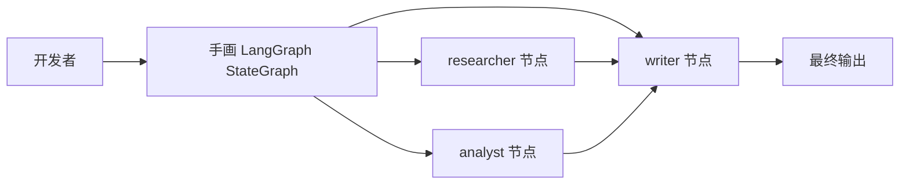
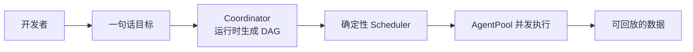
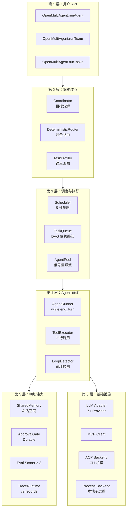
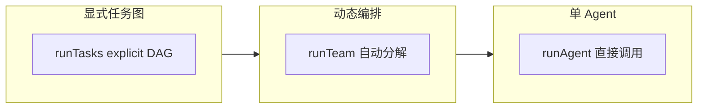
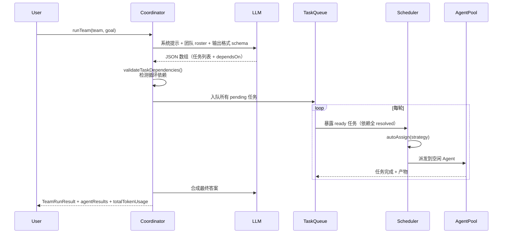
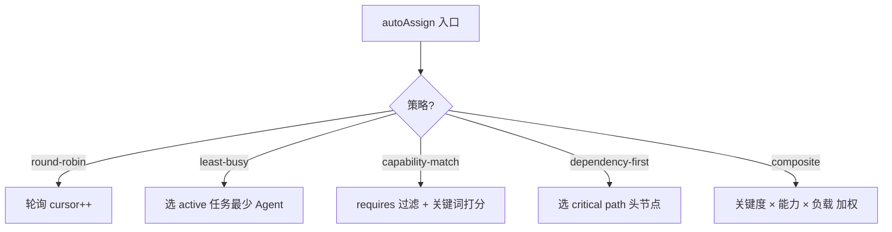
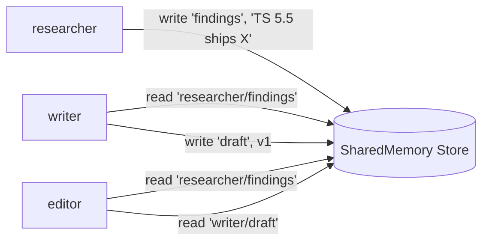
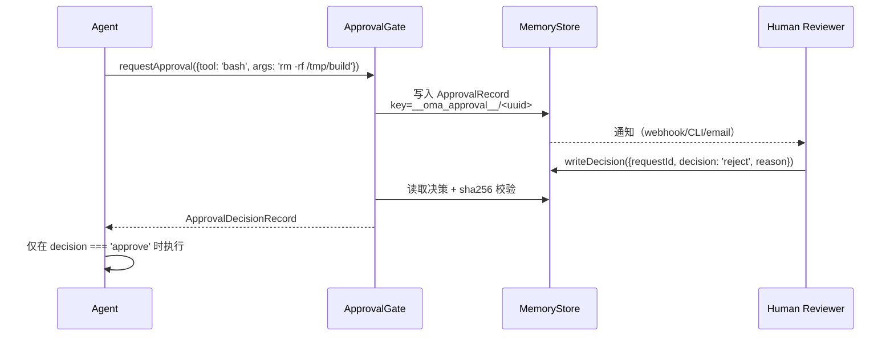
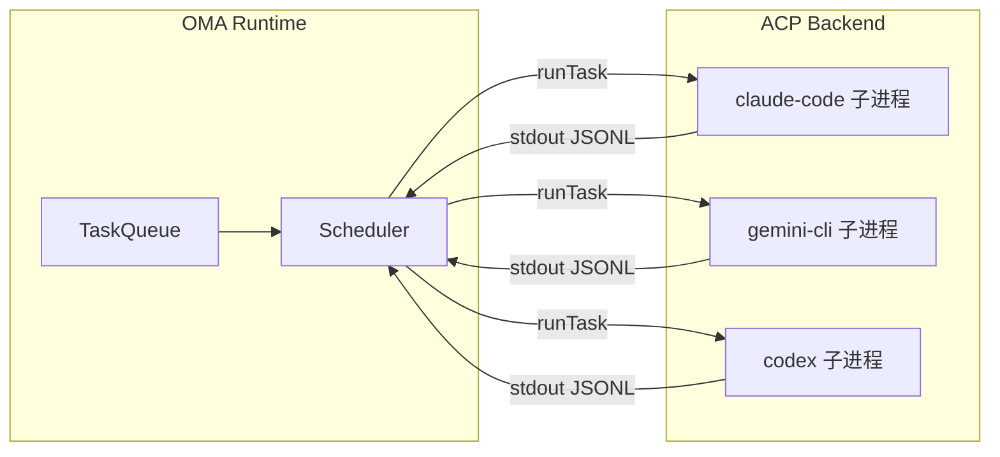
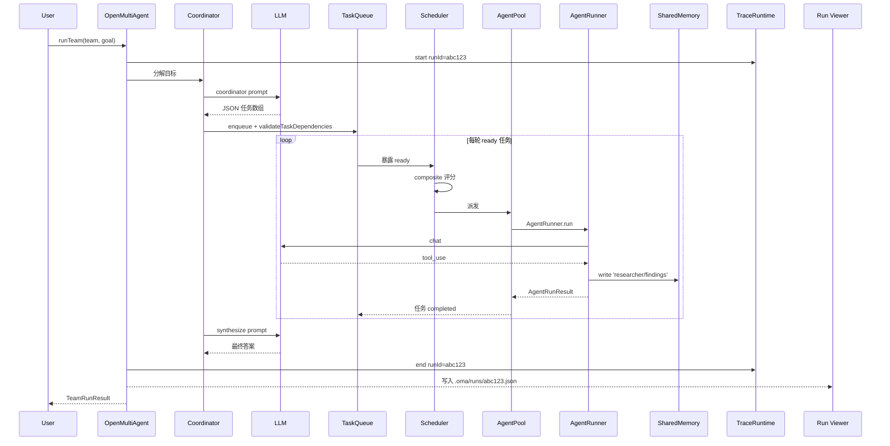

# 【open-multi-agent】核心架构与设计原理深度解析只描述目标不画任务图的运行时多 Agent 编排框架

## 一、引子：从「画图」到「说目标」的范式跃迁

如果你让 5 个 LLM Agent 协作完成「对比三种 TypeScript ORM 框架并给出推荐」，传统做法是：



每加一个「还要支持性能基准」的需求，你都要回到画板重新编辑 StateGraph 的边。这是一种「**图优先（Graph-First）**」的范式：用编排图把执行流程「钉死」，LLM 只是图上的填空器。

2026 年 4 月，一个名为 **open-multi-agent**（以下简称 OMA）的项目提出了截然相反的口号——**「Describe the goal, not the graph」**（只描述目标，不画任务图）：



OMA 让 **Coordinator 在运行时把一个目标分解为任务 DAG**，由确定性调度器分派给团队执行，整个运行过程始终是「可审查、可审批、可回放」的数据。这是 2026 H2 多 Agent 框架里**最被低估的范式转变**——它把「图」从开发期的硬编码产物变成了运行时的派生数据。

本文将基于 `open-multi-agent/open-multi-agent` 仓库（⭐6,783、MIT 协议、2026-08-17 最新提交）的真实源码，从 Coordinator 调度、5 种调度策略、命名空间共享内存、Durable Approval、评估闭环、OpenTelemetry 兼容等 6 大维度展开深度分析。

---

## 二、项目定位与核心价值

### 2.1 一句话定义

**open-multi-agent（OMA）** 是一个面向 **TypeScript 后端**的多智能体编排框架，可以直接 `npm install @open-multi-agent/core` 嵌入任意 Node.js 应用。它运行的是「**动态工作流（Dynamic Workflows）**」：Coordinator 在运行时将目标分解为任务 DAG，由确定性 Scheduler 分派给团队执行，整个运行过程始终是可审查、可审批、可回放的数据。

### 2.2 能力矩阵

| 维度 | 能力 |
|------|------|
| 运行时模式 | `runAgent()` 单 Agent / `runTeam()` 动态多 Agent / `runTasks()` 显式任务管道 |
| 模型支持 | Claude / OpenAI / Gemini / DeepSeek / Copilot / Bedrock / Azure OpenAI / 自定义 OpenAI 兼容 + AI SDK |
| 多进程后端 | Process 后端 + **ACP 后端（Agent Control Protocol）** 把 Claude Code / Gemini CLI / Codex 接到同一任务图 |
| 共享内存 | 命名空间 SharedMemory（`<agentName>/<key>`）+ 可插拔 `MemoryStore` |
| 工具系统 | `defineTool()` Zod schema + 默认拒绝（default-deny）+ Tool Presets + MCP 集成 |
| 调度策略 | 5 种：round-robin / least-busy / capability-match / dependency-first / composite |
| 持久化 | Checkpoint + 恢复 + Durable Approval + 共识校验（refute/lens）+ 计划冻结与回放 |
| 评估 | 8 类 Scorer（cost / relevancy / dependency / duplicate-work / no-progress / structured-output / tool-call）+ EvalSet + Eval Gate（CI 卡点） |
| 可观测性 | 稳定 RunIdentity + Execution Receipts + Span 瀑布 + **离线 Run Viewer** + OpenTelemetry 适配器 |
| 安全 | 工具 default-deny + 调用门控 + Telemetry 隐私控制 + 出站策略（Egress Policy） |

### 2.3 仓库统计

```bash
# 来自 https://api.github.com/repos/open-multi-agent/open-multi-agent
⭐ 6,783 stars | 🍴 2,416 forks | 📝 TypeScript 95.4% | 📜 MIT License
📦 仓库大小 14 MB | 📅 最近推送 2026-08-17 | 🚀 首次发布 2026-04-01
```

**关键事实**：OMA 在 4 个月内冲到 ⭐6.8k，**是国内 + 海外双社区共同推动的项目**——README 同时提供英文与中文版本，且描述里明确写了「natively integrated Chinese providers」。

---

## 三、整体架构

OMA 的 6 层架构可以用下面这张图完整呈现：



### 3.1 顶层类关系

```typescript
// 来自 packages/core/src/orchestrator/orchestrator.ts:1-50
export class OpenMultiAgent {
  // 把 5 个子系统串成一条线
  private coordinator: Coordinator        // 目标 → 任务 DAG
  private scheduler: Scheduler            // 任务 → Agent
  private queue: TaskQueue                // DAG 依赖感知
  private pool: AgentPool                 // 并发控制
  private runners: Map<string, AgentRunner> // LLM 循环
}
```

### 3.2 `npm create oma-app` 生成的项目结构

```bash
my-oma/
├── package.json
├── tsconfig.json
├── .oma/                       # 持久化目录
│   ├── runs/                   # 每次运行的 JSON 记录
│   ├── checkpoints/            # 中断恢复快照
│   └── approvals/              # 待审批请求
├── src/
│   ├── teams/                  # Team 定义
│   ├── tools/                  # 自定义工具
│   └── server.ts               # Express/Hono 入口
└── tests/
    └── eval/                   # EvalSet 定义
```

启动后内置的 **Run Viewer Dashboard** 会自动打开一个本地 Web 页面，把每一次运行的 DAG 与 Span 瀑布可视化——这是「**可回放**」承诺的工程化兑现。

---

## 四、三种运行模式

OMA 故意提供三种粒度递增的 API，让用户在不同阶段按需切换：



### 4.1 `runAgent()` —— 最简单的入口

```typescript
// 来自 packages/core/src/index.ts:13-19
const orchestrator = new OpenMultiAgent({ defaultModel: 'claude-opus-4-6' })
const result = await orchestrator.runAgent(
  { name: 'assistant', model: 'claude-opus-4-6' },
  'Explain monads in one paragraph.',
)
console.log(result.output)
```

### 4.2 `runTeam()` —— 杀手特性

```typescript
// 来自 packages/core/src/index.ts:21-35
const team = orchestrator.createTeam('writers', {
  name: 'writers',
  agents: [
    { name: 'researcher', model: 'claude-opus-4-6', systemPrompt: 'You research topics thoroughly.' },
    { name: 'writer',     model: 'claude-opus-4-6', systemPrompt: 'You write clear documentation.' },
  ],
  sharedMemory: true,
})
const result = await orchestrator.runTeam(team, 'Write a guide on TypeScript generics.')
console.log(result.agentResults.get('coordinator')?.output)
```

**注意这段代码里完全没有 DAG**——`runTeam()` 内部会动态启动一个临时的「coordinator agent」，让它把「Write a guide on TypeScript generics」分解为若干任务，再分派给 `researcher` 和 `writer`。

### 4.3 `runTasks()` —— 退路

当你已经知道明确的依赖关系、想跳过 Coordinator 这一步，可以直接用 `runTasks()` 提交显式任务数组：

```typescript
await orchestrator.runTasks([
  { title: '调研 TS 5.5 新特性', assignee: 'researcher', dependsOn: [] },
  { title: '写初稿',             assignee: 'writer',     dependsOn: ['调研 TS 5.5 新特性'] },
  { title: '代码示例验证',        assignee: 'coder',      dependsOn: ['调研 TS 5.5 新特性'] },
  { title: '最终校对',            assignee: 'editor',     dependsOn: ['写初稿', '代码示例验证'] },
])
```

这三种 API 共用一套底座（TaskQueue + Scheduler + AgentPool），所以切换的成本极低。

---

## 五、核心引擎一：Coordinator —— 把目标翻译成任务 DAG

Coordinator 是 OMA 最具差异化的子系统。当 `runTeam()` 被调用时：



### 5.1 Coordinator 提示词组装

```typescript
// 来自 packages/core/src/orchestrator/coordinator.ts:60-80
export function buildCoordinatorPrompt(team: Team, goal: string): string {
  const roster = team.config.agents.map(a =>
    `- ${a.name} (model=${a.model ?? 'inherit'}): ${a.systemPrompt}`
  ).join('\n')

  return `You are a coordinator. Decompose this goal into tasks for the team below.

## Team
${roster}

## Goal
${goal}

## Output Format
Return a JSON array of tasks. Each task: { title, description, assignee?, dependsOn?: string[], priority?, requires? }

Rules:
- Use exact assignee names from the roster
- dependsOn must reference earlier task titles
- Prefer parallelism: do not serialize independent work
- Keep tasks atomic: one concrete deliverable per task`
}
```

**关键设计**：Coordinator 输出**强 schema 的 JSON 数组**而非自然语言。`extractJSON()` 解析后 `validateTaskDependencies()` 会检测循环依赖。

### 5.2 验证任务依赖的循环检测

```typescript
// 来自 packages/core/src/task/task.ts
export function validateTaskDependencies(tasks: Task[]): void {
  const titleToId = new Map(tasks.map(t => [t.title, t.id]))
  const adj = new Map<string, string[]>()
  for (const t of tasks) {
    adj.set(t.id, (t.dependsOn ?? [])
      .map(title => titleToId.get(title))
      .filter((id): id is string => !!id))
  }
  // DFS 检测环
  const WHITE = 0, GRAY = 1, BLACK = 2
  const color = new Map<string, number>()
  function dfs(node: string): void {
    color.set(node, GRAY)
    for (const next of adj.get(node) ?? []) {
      if (color.get(next) === GRAY) {
        throw new Error(`Cycle detected: ${t.title} → ${next} → ${t.title}`)
      }
      if (color.get(next) === WHITE) dfs(next)
    }
    color.set(node, BLACK)
  }
  for (const id of adj.keys()) {
    if (color.get(id) === WHITE) dfs(id)
  }
}
```

### 5.3 合成最终答案

任务全部跑完后，Coordinator 会再做一次「合成 LLM 调用」，把各 Agent 的产物整合成最终答复：

```typescript
// 来自 packages/core/src/orchestrator/coordinator.ts (synthesis 段)
async function synthesizeFinalAnswer(
  coordinator: Agent,
  goal: string,
  agentResults: Map<string, AgentRunResult>,
): Promise<string> {
  const aggregated = Array.from(agentResults.entries())
    .filter(([name]) => name !== 'coordinator')
    .map(([name, r]) => `## ${name}\n${r.output}`)
    .join('\n\n')

  return coordinator.run({
    systemPrompt: 'You are a coordinator. Synthesize the team outputs into one cohesive answer.',
    userPrompt: `Goal: ${goal}\n\nTeam outputs:\n${aggregated}\n\nProduce the final answer.`,
  })
}
```

---

## 六、核心引擎二：Scheduler —— 5 种任务-智能体匹配策略

OMA 的 Scheduler 不只是「把任务扔给空闲的 Agent」这么简单，它封装了 **5 种策略**：

```typescript
// 来自 packages/core/src/orchestrator/scheduler.ts:1-15
/**
 * Five strategies for mapping pending Tasks onto an Agent pool:
 * - round-robin        — Distribute tasks evenly across agents by index.
 * - least-busy         — Assign to whichever agent has the fewest active tasks.
 * - capability-match   — Filter explicit requirements, then score capability/keyword affinity.
 * - dependency-first   — Prioritise tasks on the critical path (most blocked dependents).
 * - composite          — Combine criticality, capability fit, and current load.
 */
export class Scheduler {
  private roundRobinCursor = 0
  // 全部策略共享一个 TaskQueue
  autoAssign(queue: TaskQueue, agents: Agent[]): Map<string, Task> { ... }
}
```

### 6.1 5 种策略选择



### 6.2 capability-match 示例

```typescript
// 来自 packages/core/src/orchestrator/scheduler.ts (capability-match 段)
function capabilityMatch(task: Task, agent: AgentConfig): number {
  // requires 字段是硬约束：不满足直接淘汰
  if (task.requires?.modelFamily && agent.model !== task.requires.modelFamily) {
    return -Infinity
  }
  // 否则按关键词相似度打分
  const taskText = `${task.title} ${task.description}`.toLowerCase()
  const agentText = `${agent.name} ${agent.systemPrompt ?? ''}`.toLowerCase()
  const tokens = taskText.split(/\W+/).filter(t => t.length > 3)
  const hits = tokens.filter(t => agentText.includes(t)).length
  return hits / Math.max(tokens.length, 1)
}
```

### 6.3 默认调度：composite

大多数场景下，**composite** 是默认策略——它把任务的关键度（被依赖的子孙越多越关键）、能力匹配度、当前负载三件事加权成单一分数：

```typescript
const score =
  0.5 * criticality(task) +     // 被多少任务 dependsOn
  0.3 * capabilityMatch(task, agent) +
  0.2 * (1 - loadFactor(agent)) // 越闲分越高
```

**这是 OMA 的「**承认不确定**」哲学**——它不试图用一个万能公式，而是让用户按需切换 5 种策略。

---

## 七、核心引擎三：AgentPool + AgentRunner

### 7.1 AgentPool —— 信号量限流 + Per-Agent Mutex

```typescript
// 来自 packages/core/src/agent/pool.ts:1-50
export class AgentPool {
  private readonly agents: Map<string, Agent> = new Map()
  private readonly semaphore: Semaphore                 // 全局并发上限
  private readonly agentLocks: Map<string, Semaphore>  // 单 Agent 互斥

  async runParallel<T>(jobs: Job[]): Promise<T[]> {
    // 1. 全局并发上限
    const permits = await this.semaphore.acquire(jobs.length)
    try {
      // 2. 同名 Agent 自动串行（Per-Agent Mutex）
      const byAgent = groupBy(jobs, j => j.agent)
      return await Promise.all(
        Object.entries(byAgent).map(([name, group]) =>
          this.runSerializedForAgent(name, group)
        )
      )
    } finally {
      this.semaphore.release(permits)
    }
  }
}
```

**两个关键设计**：
1. **全局信号量** 控制所有 Agent 的并发上限（避免打爆 LLM API 限流）。
2. **Per-Agent Mutex** 保证同一个 Agent 实例的两条任务**严格串行**——否则两个任务同时往 `this.messages` 推会破坏 LLM 上下文。

### 7.2 AgentRunner —— 经典 while-end_turn 主循环

```typescript
// 来自 packages/core/src/agent/runner.ts (核心循环)
async run(input: AgentRunInput): Promise<AgentRunResult> {
  const messages: LLMMessage[] = [...input.history]
  let usage: TokenUsage = { input: 0, output: 0 }
  while (true) {
    // 1. 调 LLM
    const response = await this.adapter.chat({
      model: this.model,
      messages,
      tools: this.toolDefs,
      signal: this.abortSignal,
    })
    usage = addUsage(usage, response.usage)

    // 2. 提取文本 + 工具调用
    const toolCalls = response.content.filter(b => b.type === 'tool_use')
    if (response.stopReason === 'end_turn' || toolCalls.length === 0) {
      return { output: response.text(), messages, usage }
    }

    // 3. 并行执行工具调用
    const results = await this.toolExecutor.executeAll(toolCalls, input.context)

    // 4. 把工具结果追加回 messages
    messages.push({ role: 'assistant', content: response.content })
    messages.push({ role: 'user', content: results.map(toToolResult) })

    // 5. 循环检测（防 Agent 卡死）
    if (this.loopDetector.shouldStop(messages)) {
      throw new LoopDetectedError()
    }

    // 6. 检查 token 预算
    if (usage.input + usage.output > this.budget.maxTokens) {
      throw new TokenBudgetExceededError()
    }
  }
}
```

**关键工程细节**：
- **工具调用并行执行**（`executeAll`），而不是串行——大幅缩短 latency。
- **LoopDetector** 检测重复模式（同一组 tool call 出现 ≥ N 次），防止 Agent 陷入死循环。
- **Token 预算**硬约束，超额直接抛 `TokenBudgetExceededError`——让「Agent 烧光所有 token」不可能发生。

---

## 八、共享内存：Namespaced SharedMemory

OMA 的 SharedMemory 设计非常优雅——**每个 Agent 写入时使用自己的命名空间，但读取时不受限制**：

```typescript
// 来自 packages/core/src/memory/shared.ts:30-60
export class SharedMemory {
  async write(agentName: string, key: string, value: SharedMemoryValue): Promise<void> {
    const fullKey = `${agentName}/${key}`             // 命名空间化
    await this.store.set(fullKey, this.encodeValue(value))
  }

  async read(key: string): Promise<SharedMemoryEntry | null> {
    // 可以省略 agentName 前缀：自动取所有 agent 的同名 key
    // 也可以用完整 namespace：精确读取
    return this.store.get(key)
  }

  async getSummary(): Promise<string> {
    // 给人读的摘要：按 agent 分组
    const all = await this.store.list()
    const byAgent = groupBy(all, e => e.key.split('/')[0])
    return Object.entries(byAgent)
      .map(([agent, entries]) => `## ${agent}\n${entries.map(e => `- ${e.key.split('/')[1]}: ${summarize(e.value)}`).join('\n')}`)
      .join('\n\n')
  }
}
```



### 8.1 MemoryStore 抽象

```typescript
// 来自 packages/core/src/memory/store.ts
export interface MemoryStore {
  get(key: string): Promise<MemoryEntry | null>
  set(key: string, entry: MemoryEntry): Promise<void>
  list(prefix?: string): Promise<MemoryEntry[]>
  delete(key: string): Promise<void>
  clear(): Promise<void>
}

export class InMemoryStore implements MemoryStore { /* Map-backed 默认实现 */ }
```

生产场景可以替换为 Redis 或 SQLite 后端——只要满足同一接口。**MemoryStore 的存在让 SharedMemory 既能在 demo 中零依赖跑通，也能在生产中横向扩展**。

### 8.2 为什么是「命名空间」而不是「共享扁平 KV」

如果所有 Agent 都写到一个全局 KV，多个 Agent 同时写 `findings` 会互相覆盖。命名空间化后：
- **可归属**：每条 entry 都能溯源到具体 Agent。
- **可隔离**：同名 key 不会冲突。
- **可观察**：`getSummary()` 能按 Agent 分组生成自然语言摘要。

---

## 九、Durable Approval —— 内容绑定的持久化审批

OMA 的 Approval 子系统是为「**LLM 真的要做危险动作**」的场景设计的。它不只是一个布尔开关，而是**绑定具体内容 + 持久化 + 可恢复**的完整审批协议。



### 9.1 内容绑定（Content Binding）

```typescript
// 来自 packages/core/src/approval/durable.ts:30-50
const APPROVAL_KEY_PREFIX = '__oma_approval__/'

function sha256(value: string): string {
  return createHash('sha256').update(value).digest('hex')
}

function stableJson(value: unknown): string {
  // 稳定 JSON 序列化：键排序、防循环引用
  // 用于生成内容指纹
}
```

**关键点**：每个审批请求的 SHA-256 指纹基于**完整内容**计算。这意味着即使人类审批时延迟了 5 分钟，Agent 不能中途偷偷修改请求内容——任何修改都会让指纹失效，决策被拒绝。

### 9.2 6 类错误码

```typescript
// 来自 packages/core/src/approval/durable.ts
export type DurableApprovalErrorCode =
  | 'APPROVAL_ATOMIC_STORE_REQUIRED'  // 存储后端不支持原子写
  | 'APPROVAL_CONFLICT'                // 同一请求被并发决策
  | 'APPROVAL_INTEGRITY_ERROR'         // SHA-256 不匹配
  | 'APPROVAL_NOT_FOUND'               // 找不到原 request
  | 'APPROVAL_STALE_DECISION'          // 内容已过期
  | 'APPROVAL_VALIDATION_ERROR'        // 序列化失败
```

这套**显式错误码**让运维可以精准报警「Approval 冲突 vs 完整性错误 vs 决策延迟」是完全不同的根因。

---

## 十、可观测性：v2 Trace Records + 离线 Run Viewer

### 10.1 稳定 RunIdentity

OMA 给每次运行分配一个 **稳定的 RunIdentity**，整个运行期间的所有 span、receipt、approval 都用同一 ID 关联：

```typescript
// 来自 packages/core/src/observability/runtime.ts
export interface RunIdentity {
  readonly runId: string           // 顶层运行 ID
  readonly attemptId: string       // 当前重试次数
  readonly traceId: string         // W3C TraceContext 兼容
}
```

### 10.2 v2 TraceRecord 流

```typescript
// 来自 packages/core/src/observability/runtime.ts
export interface TraceRecord {
  readonly type: 'span_start' | 'span_end' | 'span_event' | 'log'
  readonly runId: string
  readonly spanId: string          // W3C 8-byte hex
  readonly parentSpanId?: string
  readonly name: string
  readonly kind: SpanKind
  readonly status?: RunStatus
  readonly attributes?: Record<string, TraceAttributeValue>
  readonly timestamp: number
}

export interface TraceSink {
  emit(record: TraceRecord): void   // 推送给外部系统
}
```

**关键工程细节**：
- **`safeEmit(sink, record)`** 用 try/catch 包住 sink 回调——**遥测永远不能改变执行语义**（即使 sink 抛错也不能让 Agent 崩溃）。
- **CompositeSink** 支持多个 sink 并行（本地文件 + OTLP + 控制台）。

### 10.3 离线 Run Viewer

```typescript
// 来自 packages/core/src/dashboard/render-run-viewer.ts
export function renderRunViewer(runFile: string): string {
  const run = JSON.parse(readFileSync(runFile, 'utf-8'))
  // 渲染两个视图：
  // 1. 任务 DAG 视图（节点 = 任务，边 = dependsOn）
  // 2. Span 瀑布视图（横轴时间，纵轴 span）
  return `<!DOCTYPE html>...`
}
```

**这是 OMA 与所有同类框架的最大差异之一**：你**离线**打开浏览器就能回放任意一次运行——不需要服务器、不需要数据库、不需要登录。这种「**自带 Dashboard**」的设计哲学，让调试多 Agent 系统从「翻日志」变成「看时间线」。

---

## 十一、ACP 后端：把 Claude Code / Codex 接到 OMA 任务图

这是 OMA 最具野心的设计——通过 **Agent Control Protocol（ACP）** 把第三方 CLI Agent 接到 OMA 的统一任务图：



**意义**：OMA 让一个团队既能包含「自己写的 LLM Agent」，也能包含「Claude Code 这种成品 CLI」——它们共享同一个任务 DAG、同一份共享内存、同一套 token 预算。**这是「**多 Agent 跨形态**」的开山之作**。

---

## 十二、Eval 系统：8 类 Scorer + Eval Gate

```typescript
// 来自 packages/core/src/eval/index.ts
export {
  costBudgetScorer,                    // 成本是否超预算
  createAnswerRelevancyScorer,         // 答案相关度（judge LLM 评分）
  dependencyUtilizationScorer,         // 是否真正利用了上游产物
  duplicateWorkScorer,                 // 是否做了重复工作
  noProgressScorer,                    // 是否在原地打转
  structuredOutputComplianceScorer,    // 是否遵守输出 schema
  toolCallSuccessScorer,               // 工具调用成功率
}
```

### 12.1 Eval Gate —— CI 卡点

```typescript
// 来自 packages/core/src/eval/gate.ts
export interface GatePolicy {
  metrics: Record<string, GateThreshold>  // 指标 → 阈值
  onFailure: 'fail' | 'warn'             // 失败时是 fail 还是 warn
}

export function evaluateGate(
  report: EvalRunReport,
  policy: GatePolicy,
): GateVerdict { /* 通过/失败 + 详细原因 */ }
```

**实战用法**：

```yaml
# eval-gate.yml
metrics:
  answerRelevancy: { min: 0.8 }
  costBudget:      { max: 0.05 }       # 单次运行 ≤ $0.05
  duplicateWork:   { max: 0.1 }
  toolCallSuccess: { min: 0.95 }
onFailure: fail
```

每次 PR 把 EvalSet 跑一遍，`evaluateGate()` 决定是否合并。**这是 OMA 把「**多 Agent 评估**」从「研究 demo」变成「**工程红线**」的关键机制**。

---

## 十三、端到端数据流

把上面所有模块串起来的完整时序：



---

## 十四、与同类项目对比

OMA 不是「又一个 LangGraph」，它代表了多 Agent 框架的**第三种范式**：

| 维度 | LangGraph | MetaGPT | OpenAI Agents SDK | **OMA** |
|------|-----------|---------|-------------------|---------|
| 范式 | 静态 StateGraph | SOP 流水线 | Handoff 协议 | **动态 DAG** |
| 入口 | 开发者画图 | RFC 协议驱动 | tool call 编排 | **只说目标** |
| 执行模式 | 显式 transition | 按顺序执行角色 | 显式 handoff | **自动分解 + 并发** |
| 调度策略 | 由图决定 | 由 RFC 决定 | 由开发者编排 | **5 种运行时策略** |
| 共享内存 | 节点间显式传 | 三层 Memory | Conversation 上下文 | **Namespaced SharedMemory** |
| 审批 | 需自己写 | 需自己写 | 需自己写 | **Durable Approval 内置** |
| 评估 | LangSmith | 无 | 无 | **8 类 Scorer + Eval Gate** |
| 可视化 | LangGraph Studio | 无 | 无 | **离线 Run Viewer** |
| 后端 | Python | Python | Python | **TypeScript + ACP 多后端** |

**核心差异**：

- **LangGraph** 是「**静态编排图**」：开发者画好边，LLM 跑。
- **MetaGPT** 是「**SOP 流水线**」：17 个角色按 RFC 协议串起来。
- **OpenAI Agents SDK** 是「**Handoff 协议**」：Agent 之间用 handoff 转交控制权。
- **OMA** 是「**动态 DAG**」：Coordinator 运行时生成图，确定性 Scheduler 执行。

**OMA 真正解决了什么**：当目标频繁变化、你不愿每次都回去改 StateGraph 时，OMA 让「**Coordinator 替你画图**」——这是 2024 年以来多 Agent 框架里**第一个严肃落地「运行时编排」**的项目。

---

## 十五、优缺点分析

### 15.1 架构简洁性 vs 性能复杂度

| 维度 | 优势 | 代价 |
|------|------|------|
| 运行时 DAG | 开发者不用画图 | 每次运行都要 Coordinator LLM 调用（增加延迟与 token） |
| 5 种调度策略 | 灵活选择 | 需要理解「composite vs capability-match」差异 |
| Namespaced Memory | 可归属、可隔离 | 多写一次 `<agentName>/` 前缀 |
| Durable Approval | 内容绑定、可恢复 | 需要原子 MemoryStore 后端 |
| 离线 Run Viewer | 零依赖调试 | 不能跨机器共享回放（除非同步 `.oma/` 目录） |
| ACP 后端 | 多形态 Agent 协同 | 子进程 stdout 解析成本 |
| TypeScript 优先 | 嵌入 Node.js 后端无门槛 | Python AI 生态（DSPy/LlamaIndex）需要桥接 |

### 15.2 扩展性 vs 维护性

| 维度 | 优势 | 代价 |
|------|------|------|
| MemoryStore 抽象 | 任意后端（Redis/SQLite/PG） | 自定义实现需保证原子性 |
| LLM Adapter 抽象 | 7+ Provider + AI SDK | 每次新增 Provider 要写格式转换 |
| Tool 框架 | Zod schema + 默认拒绝 | 工具多时审批矩阵变复杂 |
| Eval Scorer | 8 类内置 + 可扩展 | 需要持续运营 EvalSet |
| OpenTelemetry 适配 | 兼容现有监控 | 与自研 TraceRuntime 有概念重叠 |

---

## 十六、实践 / 快速开始

### 16.1 安装

```bash
# 来自 https://github.com/open-multi-agent/open-multi-agent
npm create oma-app@latest my-oma
cd my-oma
npm install
npm run dev    # 启动 demo + Run Viewer
```

### 16.2 第一个团队

```typescript
import { OpenMultiAgent } from '@open-multi-agent/core'

const oma = new OpenMultiAgent({
  defaultModel: 'claude-opus-4-6',
  maxConcurrency: 4,
})

const team = oma.createTeam('code-review', {
  name: 'code-review',
  agents: [
    { name: 'reviewer',  model: 'claude-opus-4-6', systemPrompt: 'You review code quality.' },
    { name: 'security',  model: 'claude-opus-4-6', systemPrompt: 'You check for security issues.' },
    { name: 'tester',    model: 'claude-opus-4-6', systemPrompt: 'You verify test coverage.' },
  ],
  sharedMemory: true,
})

const result = await oma.runTeam(team, 'Review PR #123 and report issues')

for (const task of result.tasks ?? []) {
  console.log(`[${task.status}] ${task.title} → ${task.assignee ?? 'unassigned'}`)
}
console.log('--- Final answer ---')
console.log(result.agentResults.get('coordinator')?.output)
```

### 16.3 自定义工具

```typescript
import { z } from 'zod'
import { defineTool } from '@open-multi-agent/core'

const fetchPR = defineTool({
  name: 'fetch_pull_request',
  description: 'Fetch PR metadata from GitHub.',
  inputSchema: z.object({
    repo: z.string(),
    prNumber: z.number().int().positive(),
  }),
  // 默认拒绝：必须显式 approve 才能用
  approvalRequired: true,
  execute: async ({ repo, prNumber }) => {
    const res = await fetch(`https://api.github.com/repos/${repo}/pulls/${prNumber}`)
    return res.json()
  },
})
```

### 16.4 添加 Eval Gate

```typescript
import { runEvalSet, evaluateGate } from '@open-multi-agent/core'

const evalSet = oma.defineEvalSet('code-review-suite', {
  cases: [
    { input: 'Review PR with 10 typos', expected: { tasksCompleted: 3 } },
    { input: 'Review PR with SQL injection', expected: { securityIssuesFound: 1 } },
  ],
  scorers: [
    costBudgetScorer({ maxUsd: 0.05 }),
    createAnswerRelevancyScorer({ judgeModel: 'claude-haiku-4-5' }),
  ],
})

const report = await runEvalSet(evalSet, { target: oma.targetFromTeam(team) })
const verdict = evaluateGate(report, {
  metrics: {
    costBudget:      { max: 0.05 },
    answerRelevancy: { min: 0.8 },
  },
  onFailure: 'fail',
})

if (!verdict.passed) process.exit(1)   // CI 卡点
```

---

## 十七、趋势 + 总结

### 17.1 三大趋势判断

1. **「运行时编排」将成为多 Agent 框架的事实标准** —— OMA 把「图是派生的不是手画的」这一原则落地后，未来 12 个月我们很看到 LangGraph、MetaGPT、Autogen 都增加「Coordinator 自动分解」模式。**「画图」是开发期负担，「说目标」才是产品期能力**。

2. **ACP 后端让「Coding Agent CLI」成为一等公民** —— Claude Code / Gemini CLI / Codex 在 2026 H2 将不再只是「独立终端工具」，而是 OMA 这类调度器的可调用组件。**多 Agent 跨形态 = LLM Agent + Coding Agent CLI + Computer-Use Agent**。

3. **Durable Approval + Eval Gate 是多 Agent 上生产的必要条件** —— 「让 Agent 自动做事」容易，「让 Agent 自动做事且能审计、能回滚、能评估」很难。OMA 把这 3 件事做成**框架级基础设施**，是 2026 H2 多 Agent 工程化的**最关键架构进步**。

### 17.2 工程经验提炼

- **「图是派生的」原则**：不要在开发期硬编码执行流程，让 LLM 在运行时生成图——但**必须有确定性 Scheduler** 兜底（OMA 的 `composite` 策略就是兜底）。
- **「每个跨进程边界都是稳定 ID」**：RunIdentity、SpanId、ApprovalId 必须稳定可关联，否则无法做后置分析。
- **「遥测永远不能改变执行语义」**：所有 sink emit 都要 try/catch 包住——OMA 的 `safeEmit()` 是教科书级别的范式。
- **「命名空间化共享内存」**：直接共享扁平 KV 会冲突，按 Agent 命名空间化是最低成本的方案。

### 17.3 一句话总结

> **open-multi-agent（OMA）以「Describe the goal, not the graph」为口号，用 Coordinator 运行时生成任务 DAG + 5 种调度策略 + Namespaced SharedMemory + Durable Approval + 8 类 Eval Scorer + 离线 Run Viewer + ACP 多后端桥接，在 TypeScript 后端上构建了 2026 H2 最完整的多智能体生产框架。**

---

## 附录：关键资源

| 资源 | 链接 |
|------|------|
| GitHub 仓库 | https://github.com/open-multi-agent/open-multi-agent |
| 官方网站 | https://open-multi-agent.com |
| 中文官网 | https://open-multi-agent.com/zh/ |
| npm 包 | https://www.npmjs.com/package/@open-multi-agent/core |
| API 文档 | https://open-multi-agent.com/getting-started/introduction/ |
| 中文文档 | https://open-multi-agent.com/zh/getting-started/introduction/ |
| 示例目录 | https://github.com/open-multi-agent/open-multi-agent/tree/main/packages/core/examples |
| License | MIT |
| 首次发布 | 2026-04-01 |

**核心源文件引用清单**：
- `packages/core/src/orchestrator/orchestrator.ts` —— OpenMultiAgent 主类（124K 字符）
- `packages/core/src/orchestrator/coordinator.ts` —— 目标分解 + 合成（30K 字符）
- `packages/core/src/orchestrator/scheduler.ts` —— 5 种调度策略
- `packages/core/src/agent/runner.ts` —— while-end_turn LLM 循环（71K 字符）
- `packages/core/src/agent/pool.ts` —— AgentPool 信号量限流
- `packages/core/src/team/team.ts` —— Team 实体（11K 字符）
- `packages/core/src/task/task.ts` —— Task 工厂 + 循环依赖检测
- `packages/core/src/memory/shared.ts` —— Namespaced SharedMemory（20K 字符）
- `packages/core/src/approval/durable.ts` —— Durable Approval（18K 字符）
- `packages/core/src/observability/runtime.ts` —— TraceRuntime v2（8K 字符）
- `packages/core/src/dashboard/render-run-viewer.ts` —— 离线 Run Viewer
- `packages/core/src/eval/index.ts` —— 8 类 Scorer 入口