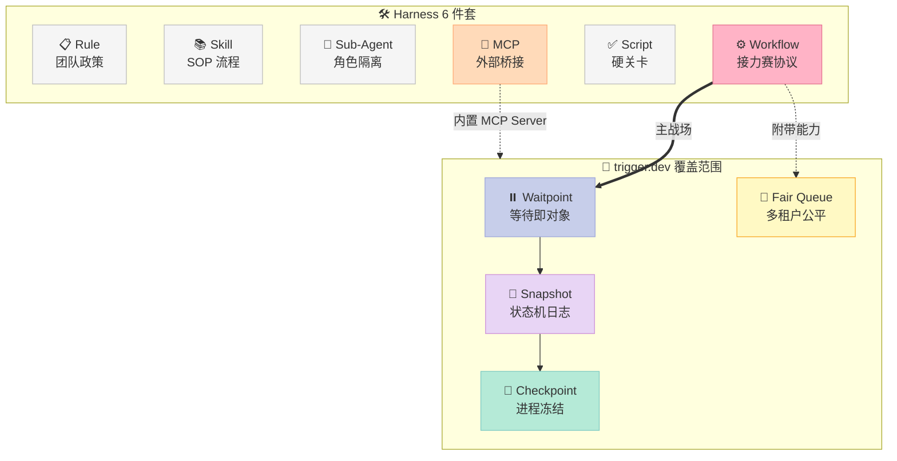
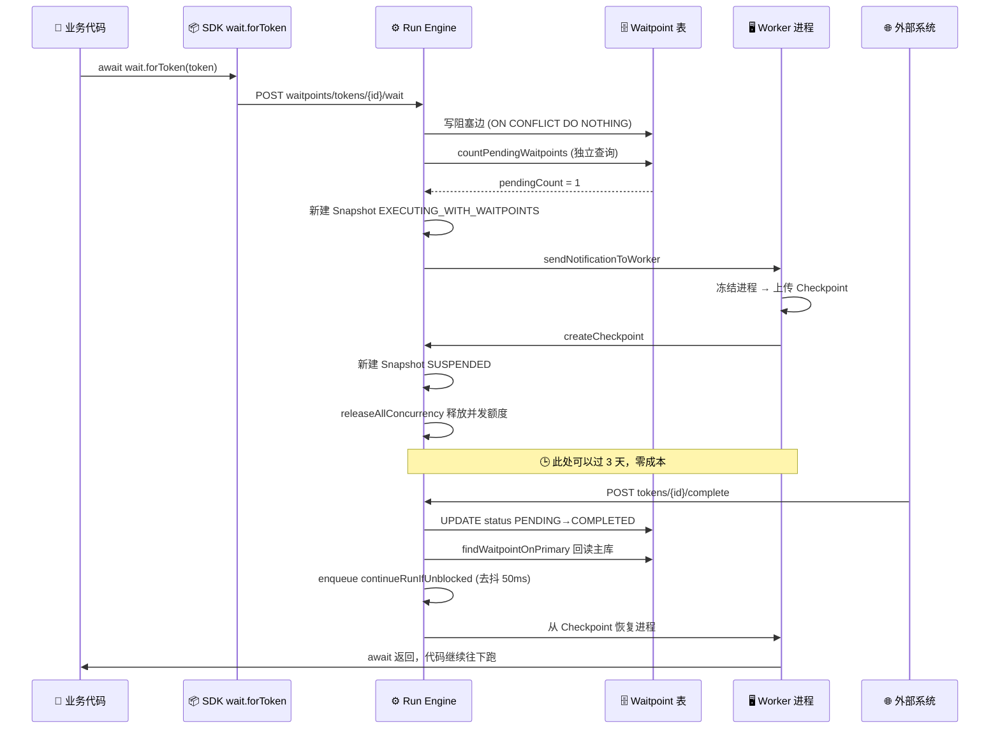
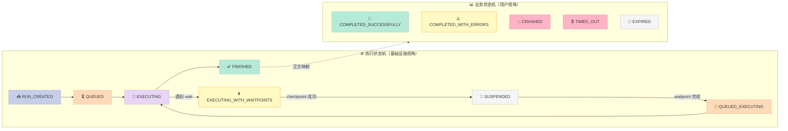
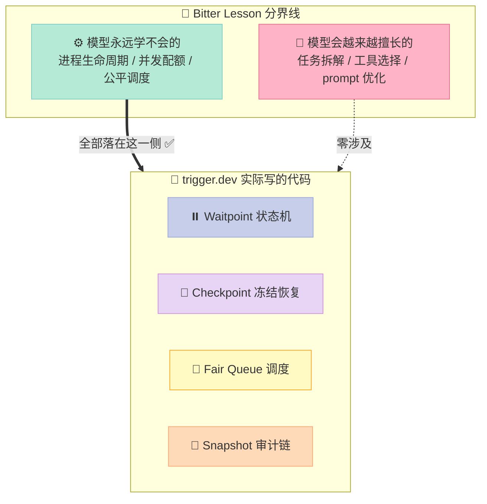

# 【trigger.dev】Waitpoint 与 Snapshot 状态机深度解析

> **一个跑了 3 天、中间等了 2 次人工审批的 Agent 任务，凭什么能在服务器重启 5 次之后还准确地从第 4 步继续？**
> 答案不在"重试逻辑"里，而在 trigger.dev 把「等待」做成了数据库里一行可以被别人 UPDATE 的记录。

## 一、引子：Agent 工程里最贵的一行代码是 `await`

先看一段几乎所有人都写过的 Agent 代码：

```typescript
const draft = await llm.generate(prompt);          // 30 秒
const approval = await waitForHumanApproval(draft); // 可能 3 天
const result = await publish(draft);                // 2 秒
```

这段代码在**逻辑上**完美无缺，在**工程上**是一场灾难。因为中间那个 `await` 意味着：

- 一个 Node.js 进程（连着内存里的 `draft`、`prompt`、闭包、连接池）要**空转 3 天**。
- 这 3 天里，进程崩了、机器被回收了、Pod 被驱逐了 —— 前面 30 秒的 LLM 调用（真金白银）全部作废。
- 你不敢重启部署，因为不知道有多少个进程正卡在这一行上。

这就是 Harness Engineering 里 **Workflow 组件**要解决的核心矛盾：

> **业务逻辑想要"一条直线的代码"，物理世界只提供"随时会死的进程"。**

2026-06-30 我写过 Restate 如何用 **journal replay（日志重放）** 解决这个问题 —— 每个副作用记到日志里，进程死了就重放日志把状态"追回来"。今天要拆的 `triggerdotdev/trigger.dev`（**16,050⭐**，Apache-2.0，2026-08-17 仍在高频提交）走的是**完全不同的第二条路**：

> **不重放，而是把「等待」这个动作本身，做成数据库里一个可被第三方写入的一等公民对象 —— Waitpoint（等待点）。**

这条路线的架构后果非常深远，也是本文的主线。

---

## 二、项目定位：它到底在 Harness 矩阵的哪一格

`trigger.dev` 常被误解为"又一个 cron / 后台任务平台"。看它的 topics 就知道野心更大：`ai-agent-framework` / `orchestration` / `mcp-server` / `workflow-automation`。

| 维度 | 事实 |
|------|------|
| Star | 16,050 |
| 语言 | TypeScript（monorepo，7288 个文件） |
| License | Apache-2.0（真开源，可自托管） |
| 首次提交 | 2022-11-30（**近 4 年积累**，不是 2026 新玩具） |
| 最近提交 | 2026-08-17（日活） |
| Fork | 1,407 |

在 Harness 6 件套矩阵里，它的位置很明确：



**价值主张一句话**：让"等 3 天"和"等 3 毫秒"在业务代码里长得一模一样，而在物理层面付出的成本相差 6 个数量级。

---

## 三、核心机制一：Waitpoint —— 把「等待」变成数据库行

### 3.1 三种 Waitpoint，一套统一抽象

trigger.dev 的 `Waitpoint` 表有三种 `type`，覆盖了 Agent 场景下几乎所有"等"：

| type | 谁来完成它 | Agent 场景 |
|------|-----------|-----------|
| `DATETIME` | 系统定时器到点自动完成 | 「等 24 小时后重新检查」 |
| `MANUAL` | **外部 HTTP 调用**（人 / 另一个系统） | 「等运营点『批准』」、「等 Webhook 回调」 |
| `RUN`（隐式） | 子任务跑完自动完成 | 「等 5 个子 Agent 都返回」 |

关键洞察在这里：**这三种在数据模型上是同一张表**。区别只在"谁有权把 `status` 从 `PENDING` 改成 `COMPLETED`"。这就是"机制与策略分离"的教科书写法 —— 机制是「一个可被完成的记录 + 一条阻塞边」，策略是「谁来完成」。

### 3.2 阻塞的真相：一条边 + 一次计数

来看 `blockRunWithWaitpoint` 的真实源码（`internal-packages/run-engine/src/engine/systems/waitpointSystem.ts`）。这段代码里藏着一个被注释写得极其明白的并发设计：

```typescript
// 源码位置：internal-packages/run-engine/src/engine/systems/waitpointSystem.ts
async blockRunWithWaitpoint({
  runId, waitpoints, projectId, organizationId, timeout, ...
}): Promise<TaskRunExecutionSnapshot> {
  const prisma = tx ?? this.$.prisma;
  let $waitpoints = typeof waitpoints === "string" ? [waitpoints] : waitpoints;

  return await this.$.runLock.lock("blockRunWithWaitpoint", [runId], async () => {
    let snapshot = await getLatestExecutionSnapshot(prisma, runId, this.$.runStore);

    // ① 写"阻塞边"：run --被阻塞于--> waitpoint
    //    ON CONFLICT DO NOTHING，天然幂等
    await this.$.runStore.blockRunWithWaitpointEdges({
      runId, waitpointIds: $waitpoints, projectId,
      spanIdToComplete, batchId: batch?.id, batchIndex: batch?.index,
    });

    // ② 独立的一次查询：还有几个 waitpoint 是 PENDING？
    const pendingCount = await this.$.runStore.countPendingWaitpoints($waitpoints, prisma, runId);
    const isRunBlocked = pendingCount > 0;

    // ③ 决定新的执行状态
    let newStatus: TaskRunExecutionStatus = "SUSPENDED";
    if (snapshot.executionStatus === "EXECUTING" ||
        snapshot.executionStatus === "EXECUTING_WITH_WAITPOINTS") {
      newStatus = "EXECUTING_WITH_WAITPOINTS";   // 还在跑，只是挂了个等待
    }

    if (newStatus !== snapshot.executionStatus) {
      snapshot = await this.executionSnapshotSystem.createExecutionSnapshot(prisma, {
        run: { id: snapshot.runId, status: snapshot.runStatus, attemptNumber: snapshot.attemptNumber },
        snapshot: { executionStatus: newStatus, description: "Run was blocked by a waitpoint." },
        previousSnapshotId: snapshot.id,
        ...
      });
      // 立刻通知 worker，让它有机会 suspend
      await sendNotificationToWorker({ runId, snapshot, eventBus: this.$.eventBus });
    }

    // ④ 超时保护：到点自动把 waitpoint 以 timeoutError 完成
    if (timeout) {
      for (const waitpoint of $waitpoints) {
        await this.$.worker.enqueue({
          id: `finishWaitpoint.${waitpoint}`,
          job: "finishWaitpoint",
          payload: { waitpointId: waitpoint, error: JSON.stringify(timeoutError(timeout)) },
          availableAt: timeout,
        });
      }
    }

    // ⑤ 边界情况：如果写完边发现根本没人拦着，50ms 后尝试继续
    if (!isRunBlocked) {
      await this.$.worker.enqueue({
        id: `continueRunIfUnblocked:${runId}`,   // 同 id 天然去抖
        job: "continueRunIfUnblocked",
        payload: { runId },
        availableAt: new Date(Date.now() + 50),
      });
    }

    return snapshot;
  });
}
```

**这段代码里最值钱的一句注释**，原文如下：

> The pending check is a **SEPARATE store call** (not folded into the edge write) on purpose: under PostgreSQL READ COMMITTED each statement gets its own snapshot, so if a concurrent `completeWaitpoint` commits between the edge write and the check, this fresh query still sees the COMPLETED status.

翻译成人话：**故意不把"写边"和"数 PENDING"合成一条 SQL**。因为 PostgreSQL 的 READ COMMITTED 隔离级别下，**每条语句各拿一次快照**。如果并发的 `completeWaitpoint` 恰好在两条语句之间提交，第二条新语句能看到最新的 `COMPLETED` —— 反而不会漏。

如果为了"性能"把它们合成一条 CTE，就会退化成同一个语句快照，**丢掉这次并发窗口的观测能力，导致任务永久卡死**。这是典型的"看起来在优化，实际在制造幽灵 bug"。

### 3.3 完成侧：为什么要读主库而不读副本

`completeWaitpoint` 里有一段更狠的注释，是被生产事故打出来的：

```typescript
// 1. 先把 waitpoint 从 PENDING 改成 COMPLETED
const [updateError, updateResult] = await tryCatch(
  store.updateManyWaitpoints({
    where: { id, status: "PENDING" },     // ← 条件更新，天然幂等
    data: {
      status: "COMPLETED",
      completedAt: new Date(),
      output: output?.value,
      outputType: output?.type,
      outputIsError: output?.isError,
    },
  })
);

// 2. 立刻回读 —— 但必须读 PRIMARY，不能读副本！
//    注释原文：the replica can miss it under lag → false "not found" → the parent hangs
const waitpoint = await store.findWaitpointOnPrimary({ where: { id } });

if (!waitpoint) throw new Error("Waitpoint not found");
if (waitpoint.status !== "COMPLETED") throw new Error("Waitpoint not completed");

// 3. 找出所有被这个 waitpoint 阻塞的 run，逐个安排"尝试继续"
const affectedTaskRuns = await this.$.runStore.findManyTaskRunWaitpoints(
  { where: { waitpointId: id }, select: { taskRunId: true, spanIdToComplete: true, createdAt: true } },
  this.$.prisma
);

for (const run of affectedTaskRuns) {
  await this.$.worker.enqueue({
    id: `continueRunIfUnblocked:${run.taskRunId}`,   // 同 id → 自动去抖
    job: "continueRunIfUnblocked",
    payload: { runId: run.taskRunId },
    availableAt: new Date(Date.now() + 50),           // 50ms 之后
  });
}
```

三个工程细节值得单独拎出来讲：

1. **`where: { id, status: "PENDING" }` 条件更新** —— 重复调用 `completeToken` 不会把已完成的结果覆盖掉。幂等性做在 SQL 的 WHERE 里，而不是应用层的 if 里，**这是唯一真正抗并发的做法**。
2. **`findWaitpointOnPrimary`** —— 刚写完就读，读副本会因为复制延迟返回 "not found"，父任务就会**永久挂死**。这个 bug 在分布式系统里极其常见，且几乎无法在测试环境复现。
3. **`id: continueRunIfUnblocked:${runId}` 去抖** —— 一个 run 同时等 100 个子任务时，100 个完成事件会入队 100 次，但因为 job id 相同，实际只执行一次。**用队列的幂等 key 当去抖器**，比自己写 debounce 干净得多。

### 3.4 完整数据流



---

## 四、核心机制二：双状态机 —— 执行态与业务态的正交分离

这是 trigger.dev 架构里我认为**最被低估**的设计。

绝大多数工作流引擎只有一套状态：`PENDING / RUNNING / SUCCESS / FAILED`。trigger.dev 有**两套完全正交的状态机**。

### 4.1 执行状态（TaskRunExecutionStatus）—— 给基础设施看的

来自 `internal-packages/run-engine/src/engine/statuses.ts`，这个文件只有 1950 字节，但信息密度极高：

```typescript
// 源码：internal-packages/run-engine/src/engine/statuses.ts
export function isDequeueableExecutionStatus(status: TaskRunExecutionStatus): boolean {
  // 只有这两种状态可以被 worker 从队列里捞出来
  return (["QUEUED", "QUEUED_EXECUTING"] as TaskRunExecutionStatus[]).includes(status);
}

export function isExecuting(status: TaskRunExecutionStatus): boolean {
  return (["EXECUTING", "EXECUTING_WITH_WAITPOINTS"] as TaskRunExecutionStatus[]).includes(status);
}

export function isCheckpointable(status: TaskRunExecutionStatus): boolean {
  return ([
    "RUN_CREATED",           // 还没开始也能 checkpoint（预热镜像）
    "QUEUED",
    "EXECUTING",
    "EXECUTING_WITH_WAITPOINTS",
    "QUEUED_EXECUTING",
  ] as TaskRunExecutionStatus[]).includes(status);
}

export function isInitialState(status: TaskRunExecutionStatus): boolean {
  return (["RUN_CREATED", "DELAYED"] as TaskRunExecutionStatus[]).includes(status);
}
```

注意 `QUEUED_EXECUTING` 这个状态 —— **它同时"在队列里"又"在执行中"**。听起来自相矛盾，实际是"进程还活着，但已经排队等重新调度"的中间态，用于**热重试**（不用等 checkpoint 完成就能重新入队）。这种状态不可能出现在只有一套状态机的设计里。

### 4.2 业务状态（TaskRunStatus）—— 给用户看的

```typescript
const finalStatuses: TaskRunStatus[] = [
  "CANCELED",
  "INTERRUPTED",
  "COMPLETED_SUCCESSFULLY",
  "COMPLETED_WITH_ERRORS",
  "SYSTEM_FAILURE",       // 平台自己的问题
  "CRASHED",              // 进程崩了
  "EXPIRED",              // TTL 过期，压根没跑
  "TIMED_OUT",            // 跑了但超时
];
```

**为什么必须分开？** 举个具体例子：

一个 Agent 任务因为 OOM 被杀，正在换更大的机器重试。这时候：
- **执行状态** = `QUEUED`（基础设施视角：在队列里等调度）
- **业务状态** = `RETRYING_AFTER_FAILURE`（用户视角：还在努力，别慌）

如果只有一套状态，你必须在这两个含义里**选一个牺牲掉** —— 要么用户看到"排队中"一脸茫然，要么调度器看到"重试中"不知道该不该捞。



### 4.3 Execution Snapshot：append-only 的状态迁移日志

两套状态的每一次变化，都不是 `UPDATE` 一行，而是**新增一条 `TaskRunExecutionSnapshot`**：

```typescript
// 每条 snapshot 都携带完整上下文
{
  executionStatus: "EXECUTING_WITH_WAITPOINTS",
  runStatus: "EXECUTING",
  description: "Run was blocked by a waitpoint.",   // ← 人类可读的原因
  previousSnapshotId: "snap_xxx",                    // ← 单向链表
  attemptNumber: 2,
  checkpointId: "chk_yyy",
  completedWaitpoints: [...],
  isValid: true,
}
```

这带来三个直接好处：

1. **可审计** —— 每一次状态变化都有 `description` 说明原因，UI 上直接渲染成时间线。
2. **可乐观并发** —— worker 上报进度时必须带上 `snapshotId`，引擎校验"这是不是最新的那条"，不是就丢弃。
3. **可回放调试** —— 出事故时，`previousSnapshotId` 链条可以完整还原"这个任务到底经历了什么"。

第 2 点的代码在 `checkpointSystem.ts` 里写得非常干净：

```typescript
// 源码：internal-packages/run-engine/src/engine/systems/checkpointSystem.ts
const snapshot = await getLatestExecutionSnapshot(prisma, runId, this.$.runStore);

const isValidSnapshot =
  // 情况 1：worker 上报的就是当前最新快照
  snapshot.id === snapshotId ||
  // 情况 2：上报的是上一条，且当前处于 QUEUED_EXECUTING（这也是合法的竞态）
  (snapshot.previousSnapshotId === snapshotId &&
    snapshot.executionStatus === "QUEUED_EXECUTING");

if (!isValidSnapshot) {
  // 不是最新的 → 这个 checkpoint 已经过时了，丢掉
  this.$.eventBus.emit("incomingCheckpointDiscarded", {
    time: new Date(),
    run: { id: runId },
    checkpoint: { discardReason: "Not the latest snapshot", metadata: checkpoint },
    snapshot: { id: snapshot.id, executionStatus: snapshot.executionStatus },
  });
  return { ok: false as const, error: "Not the latest snapshot" };
}

if (!isCheckpointable(snapshot.executionStatus)) {
  return { ok: false as const, error: `Status ${snapshot.executionStatus} is not checkpointable` };
}
```

**注意它是"丢弃 + 发事件"，不是"抛异常"**。一个迟到的 checkpoint 不是错误，是分布式系统的常态。把它当异常处理会让告警面板永远是红的。

---

## 五、核心机制三：5 秒阈值背后的成本工程

这是我在这个项目里最喜欢的一个细节，因为它把**架构决策和商业模型直接焊在了一起**。

看 SDK 侧 `packages/trigger-sdk/src/v3/wait.ts`：

```typescript
// 源码：packages/trigger-sdk/src/v3/wait.ts
const DURATION_WAIT_CHARGE_THRESHOLD_MS = 5000;   // ← 就这一行

export const wait = {
  for: async (options: WaitForOptions) => {
    const ctx = taskContext.ctx;
    if (!ctx) throw new Error("wait.forToken can only be used from inside a task.run()");

    const durationInMs = calculateDurationInMs(options);

    // 【路径 A】≤ 5 秒：就地 setTimeout，不走引擎
    if (durationInMs <= DURATION_WAIT_CHARGE_THRESHOLD_MS) {
      return tracer.startActiveSpan(`wait.for()`, async (span) => {
        if (durationInMs <= 0) return;
        printWaitBelowThreshold();   // 打印提示："≤5s 的等待计入计算用量"
        await new Promise((resolve) => setTimeout(resolve, durationInMs));
      }, { /* span attributes */ });
    }

    // 【路径 B】> 5 秒：创建 DATETIME waitpoint，走完整的挂起/恢复流程
    const date = new Date(Date.now() + durationInMs);
    const result = await apiClient.waitForDuration(ctx.run.id, {
      date,
      idempotencyKey: options.idempotencyKey,
      idempotencyKeyTTL: options.idempotencyKeyTTL,
    });

    return tracer.startActiveSpan(`wait.for()`, async (span) => {
      await runtime.waitUntil(result.waitpoint.id, date);   // ← 这里会真的挂起进程
    }, { /* ... */ });
  },
  until: async (options) => { /* 同样的双路径 */ },
  createToken, listTokens, completeToken, retrieveToken,
  forToken: <T>(token) => { /* MANUAL waitpoint 等待 */ },
};
```

**为什么阈值是 5 秒？** 因为 checkpoint 本身有成本：

| 等待时长 | 走哪条路 | 成本构成 |
|---------|---------|---------|
| 2 秒 | `setTimeout` 就地睡 | 2 秒的 CPU/内存计费，但**零 checkpoint 开销** |
| 5 分钟 | Waitpoint + Checkpoint | ~1-3 秒的冻结/上传/恢复开销，但**中间 5 分钟不计费** |
| 3 天 | Waitpoint + Checkpoint | 同上，节省 3 天计算费用 |

冻结进程（dump 内存 → 上传到对象存储 → 释放并发额度 → 恢复时下载 → restore）本身要花 1-3 秒。**如果只等 2 秒，为了省 2 秒而花 3 秒，纯亏**。

这个 `DURATION_WAIT_CHARGE_THRESHOLD_MS = 5000` 是一行**经过成本核算的常量**，不是随手写的魔法数字。这就是 Harness Engineering 里"外部物理世界必需"的典型案例 —— 模型永远学不会"什么时候挂起划算"，这必须由 harness 层硬编码。

### 5.1 挂起时释放并发额度

Checkpoint 成功后有一行容易被忽略但极其关键的代码：

```typescript
// 源码：checkpointSystem.ts
this.$.logger.debug("Releasing concurrency for run because it was checkpointed", { snapshot, newSnapshot });

if (run.organizationId) {
  await this.$.runQueue.releaseAllConcurrency(run.organizationId, run.id);
}
```

**含义**：一个挂起等审批的任务，**不再占用你的并发配额**。

这条如果做不到，Waitpoint 就毫无意义了 —— 假设你的并发限制是 100，有 100 个任务在等人工审批，那么整个系统就彻底堵死了。**"挂起"必须同时意味着"归还资源"，否则只是把内存占用换成了配额占用。**

---

## 六、核心机制四：OOM 触发的机器规格升级重试

`internal-packages/run-engine/src/engine/retrying.ts` 里有一个我第一次见到的重试策略：

```typescript
// 源码：internal-packages/run-engine/src/engine/retrying.ts
export async function retryOutcomeFromCompletion(
  prisma, runStore, { runId, attemptNumber, error, retryUsingQueue, retrySettings }
): Promise<RetryOutcome> {
  // ① 用户主动取消 → 不重试
  if (error.type === "INTERNAL_ERROR" && error.code === "TASK_RUN_CANCELLED") {
    return { outcome: "cancel_run", reason: error.message };
  }

  const sanitizedError = sanitizeError(error);

  // ② OOM 特殊处理：换台更大的机器重试，而不是原地重试
  if (isOOMRunError(error)) {
    const oomResult = await retryOOMOnMachine(prisma, runStore, runId);
    if (!oomResult) {
      return { outcome: "fail_run", sanitizedError, wasOOMError: true };
    }

    const delay = calculateNextRetryDelay(oomResult.retrySettings, attemptNumber ?? 1);
    if (!delay) return { outcome: "fail_run", sanitizedError, wasOOMError: true };

    return {
      outcome: "retry",
      method: "queue",
      machine: oomResult.machine,           // ← 关键：换机器规格
      settings: { timestamp: Date.now() + delay, delay },
      wasOOMError: true,
      usageDurationMs: oomResult.usageDurationMs,
      costInCents: oomResult.costInCents,
      machinePreset: oomResult.machinePreset,
    };
  }

  // ③ 普通错误：先判断是否可重试
  const enhancedError = taskRunErrorEnhancer(error);
  if (!shouldRetryError(enhancedError)) {
    return { outcome: "fail_run", sanitizedError };
  }

  // ④ 全局硬上限（MAX_TASK_RUN_ATTEMPTS = 250）
  if (attemptNumber !== null && attemptNumber > MAX_TASK_RUN_ATTEMPTS) {
    return { outcome: "fail_run", sanitizedError };
  }
  // ...
}
```

**为什么这个设计对 Agent 特别重要？**

Agent 任务的内存占用**极难预估**。同一个"总结这份文档"的任务，输入 1 页 PDF 用 200MB，输入 800 页 PDF 用 4GB。传统重试逻辑遇到 OOM 会**原地重试 3 次然后失败** —— 因为机器规格没变，OOM 必然复现。

trigger.dev 的做法是：**把 OOM 当成"资源判断失误"而不是"代码错误"**，重试时换更大的机器。这一条能把大量"看起来是随机失败"的 Agent 任务救回来。

另外 `MAX_TASK_RUN_ATTEMPTS = 250` 这个数字也很有意思 —— 不是常见的 3 或 5，而是 250。这暗示它的目标场景是**长时间运行的、允许大量重试的 Agent 任务**，而不是"HTTP 请求失败重试 3 次"。

---

## 七、核心机制五：Fair Queue 多租户公平调度

`fairQueueSelectionStrategy.ts` 解决的是一个纯粹的 Harness 层问题：**当一个大客户提交 10000 个任务时，小客户的 1 个任务要等多久？**

```typescript
// 源码：internal-packages/run-engine/src/run-queue/fairQueueSelectionStrategy.ts
export type FairQueueSelectionStrategyBiases = {
  /** 偏向并发限额更高的环境。0 = 无偏向，1 = 完全按限额差异分配 */
  concurrencyLimitBias: number;
  /** 偏向剩余容量更多的环境。0 = 无偏向，1 = 完全按可用容量分配 */
  availableCapacityBias: number;
  /** 环境内队列排序的随机度。0 = 严格按年龄（最老优先），1 = 完全随机 */
  queueAgeRandomization: number;
};

const defaultBiases: FairQueueSelectionStrategyBiases = {
  concurrencyLimitBias: 0,
  availableCapacityBias: 0,
  queueAgeRandomization: 0,   // 默认完全按年龄排序
};

#shuffleQueuesByEnv(snapshot: FairQueueSnapshot): Array<EnvQueues> {
  const envs = Object.keys(snapshot.envs);
  const biases = this.options.biases ?? defaultBiases;

  // 快速路径：没配置偏向 → 纯随机洗牌（每个环境机会均等）
  if (biases.concurrencyLimitBias === 0 && biases.availableCapacityBias === 0) {
    return this.#orderQueuesByEnvs(this.#shuffle(envs), snapshot);
  }

  const maxLimit = Math.max(...envs.map((envId) => snapshot.envs[envId].concurrency.limit));

  const weightedEnvs: WeightedEnv[] = envs.map((envId) => {
    const env = snapshot.envs[envId];
    let weight = 1;

    // 偏向 1：并发限额越高，权重越大（付费客户优先）
    if (biases.concurrencyLimitBias > 0) {
      const normalizedLimit = env.concurrency.limit / maxLimit;
      weight *= 1 + Math.pow(normalizedLimit * biases.concurrencyLimitBias, 2);  // 平方放大
    }

    // 偏向 2：剩余容量越多，权重越大（避免把额度已满的环境反复捞出来）
    if (biases.availableCapacityBias > 0) {
      const usedCapacityPercentage = env.concurrency.current / env.concurrency.limit;
      const availableCapacityBonus = 1 - usedCapacityPercentage;
      weight *= 1 + Math.pow(availableCapacityBonus * biases.availableCapacityBias, 2);
    }

    return { envId, weight };
  });

  return this.#orderQueuesByEnvs(this.#weightedShuffle(weightedEnvs), snapshot);
}
```

三个设计亮点：

1. **两级调度** —— 先在"环境"之间公平选择，再在环境内部按队列年龄排序。大客户的 10000 个任务全在一个环境里，**它们互相竞争，而不是挤占别人**。
2. **`seedrandom` 可复现随机** —— 用 `seedrandom(options.seed)` 而不是 `Math.random()`，意味着**调度决策在测试里可以完全复现**。这是把"随机算法"变成"可测试算法"的标准手法。
3. **默认全部偏向为 0** —— 开箱即用是"纯公平"，付费差异化需要显式配置。**默认值站在最不容易出事的一侧**。

---

## 八、横向对比：三种 Workflow 持久化路线

trigger.dev 走的路和另外两个主流方案有本质区别。这不是功能多少的问题，是**世界观不同**。

| 维度 | trigger.dev | Restate | Temporal |
|------|-------------|---------|----------|
| **核心抽象** | Waitpoint（可被外部完成的记录） | Journal（副作用日志） | Event History（事件历史） |
| **恢复方式** | 💾 **进程 Checkpoint 恢复** | 🔄 代码重放 + 日志跳过 | 🔄 代码重放 + 事件回放 |
| **代码约束** | ✅ 几乎无约束，随便写 | ⚠️ 必须确定性（禁 `Date.now()`/`Math.random()`） | ⚠️ 必须确定性 + 版本化 |
| **等待人工审批** | ✅ 一等公民（MANUAL waitpoint + HTTP complete） | ⚠️ 需用 awakeable 手工搭 | ⚠️ 需用 Signal 手工搭 |
| **改代码后旧任务** | ✅ 从内存快照恢复，与代码无关 | ❌ 重放可能撞上新逻辑 | ❌ 需要 Workflow Versioning |
| **单次挂起开销** | ⚠️ 1-3 秒（内存 dump + 上传） | ✅ 毫秒级（只写日志） | ✅ 毫秒级 |
| **多租户公平调度** | ✅ 内置 Fair Queue | ❌ 不在范围内 | ⚠️ 需 Task Queue 手工规划 |
| **对 Agent 友好度** | ✅ OOM 换机器 / 250 次重试 / 内置 MCP | ⚠️ 通用引擎，不懂 LLM | ⚠️ 通用引擎，不懂 LLM |

### 8.1 最关键的差异：确定性约束

这一条足以决定选型。

**Restate / Temporal 的重放模型要求你的代码是确定性的**。这意味着：

```typescript
// ❌ 在 Restate / Temporal 里这是错的
const jitter = Math.random() * 1000;      // 重放时值会变
const now = Date.now();                    // 重放时值会变
const result = await llm.generate(prompt); // 必须包成 journaled 的 side effect
```

问题在于：**LLM 调用天生是非确定性的**。同一个 prompt 两次调用返回不同结果。重放模型必须把每次 LLM 调用的**完整输出**记进日志，然后重放时"假装再调了一次"。这能work，但你得**处处小心**。

**trigger.dev 的 checkpoint 模型完全没有这个约束**。它保存的是**进程内存镜像**，恢复时内存里的 `draft` 变量就是原来那个 `draft`。你可以随便用 `Math.random()`、随便调 LLM、随便读全局变量。

代价是：**挂起/恢复慢一个数量级**（1-3 秒 vs 毫秒），且需要底层 checkpoint 基础设施（这也是为什么自托管 trigger.dev 比自托管 Restate 复杂得多）。

### 8.2 一句话总结三条路

- **Restate**：「我帮你把副作用记下来，你保证代码可重放」—— 适合有大量幂等步骤的确定性流程。
- **Temporal**：「我帮你把事件历史记下来，你按我的规矩写代码」—— 适合金融级、需要严格审计的长事务。
- **trigger.dev**：「你随便写，我帮你把进程冻起来」—— **适合代码不确定、要等人、要等外部系统的 Agent 场景**。

对 AI Agent 来说，第三条路的心智负担明显最低。这也解释了为什么它的 topics 里明确写着 `ai-agent-framework`。

---

## 九、优缺点分析

### 9.1 架构简洁性 / 扩展性 / 易用性

| 维度 | 评价 | 依据 |
|------|------|------|
| **架构简洁性** | ⚠️ 中等 | `run-engine` 拆成 12 个 System（waitpoint / checkpoint / dequeue / enqueue / batch / debounce / delayedRun / ttl / runAttempt / pendingVersion / executionSnapshot / raceSimulation），职责切得很干净；但 `engine/index.ts` 有 **103,934 字节**，`run-queue/index.ts` 有 **203,623 字节**，单文件体量惊人 |
| **扩展性** | ✅ 优秀 | 17 个 eventBus 事件（`runCreated` / `runAttemptFailed` / `executionSnapshotCreated` / `incomingCheckpointDiscarded` 等）全是 typed listener；`RunQueueSelectionStrategy` 是可替换接口，公平策略可自己实现 |
| **易用性** | ✅ 优秀 | 业务侧只需要 `await wait.forToken(token)`，全部复杂度隐藏在 harness 层。5 秒阈值自动分流，**用户不需要知道 checkpoint 存在** |

### 9.2 性能 / 复杂度 / 维护性

| 维度 | 评价 | 依据 |
|------|------|------|
| **性能** | ⚠️ 有明确代价 | 单次挂起 1-3 秒；Waitpoint 输出走 chunk 分批读（`WAITPOINT_CHUNK_SIZE = 100`），因为源码注释记录过真实事故：**24 个 snapshot × 236 个 waitpoint × 100KB = ~570MB**，直接触发 "Failed to convert rust String into napi string" |
| **复杂度** | ❌ 很高 | 双状态机 + append-only snapshot + 双数据库残局（源码里大量 `LEGACY` / `NEW` residency 路由注释）+ Redis 公平队列。**自托管门槛显著高于 Restate** |
| **维护性** | ✅ 意外地好 | 关键并发决策**全部有注释解释"为什么不能换一种写法"**（READ COMMITTED 快照、必须读主库、去抖靠 job id）。这种注释密度在开源项目里非常罕见，是真正的资产 |

### 9.3 最诚实的一条缺点

源码里有大量这样的注释：

> Co-location invariant: a DATETIME wait waitpoint lives on the same run-ops DB as the run that blocks on it... The minted waitpoint id is always a cuid, so without `coLocateWithRunId` the upsert would always route to LEGACY and a run-ops run on NEW would hang.

这是**正在进行的数据库拆分迁移**留下的复杂度。`LEGACY` / `NEW` 两套 run-ops 库共存，每个查询都要考虑"路由到哪个库"、"会不会跨库导致永久挂死"。

对使用者来说这是透明的；但对**想读懂源码或自托管的人**来说，这是一层沉重的、纯历史包袱的认知负担。**它是一个大规模生产系统真实的样子，不是教学示例。**

---

## 十、从零搭建启示：我自己复刻 Waitpoint 需要什么

如果只想在自己的 Agent 项目里实现「可挂起 3 天的等待」，不需要照抄整个 trigger.dev。**最小可行实现（MVP）只要 3 张表 + 2 个接口。**

### 10.1 MVP 数据模型（PostgreSQL）

```sql
-- 表 1：等待点（核心，一等公民）
CREATE TABLE waitpoint (
  id             TEXT PRIMARY KEY,
  type           TEXT NOT NULL CHECK (type IN ('DATETIME','MANUAL','RUN')),
  status         TEXT NOT NULL DEFAULT 'PENDING' CHECK (status IN ('PENDING','COMPLETED')),
  idempotency_key TEXT,
  completed_after TIMESTAMPTZ,   -- DATETIME 类型的到期时间
  output         JSONB,
  output_is_error BOOLEAN DEFAULT FALSE,
  completed_at   TIMESTAMPTZ,
  created_at     TIMESTAMPTZ NOT NULL DEFAULT now(),
  UNIQUE (idempotency_key)       -- 幂等：同 key 只创建一次
);

-- 表 2：阻塞边（run 被哪些 waitpoint 拦着）
CREATE TABLE run_waitpoint (
  run_id       TEXT NOT NULL,
  waitpoint_id TEXT NOT NULL REFERENCES waitpoint(id),
  PRIMARY KEY (run_id, waitpoint_id)   -- 天然支持 ON CONFLICT DO NOTHING
);

-- 表 3：执行快照（append-only 状态机日志）
CREATE TABLE execution_snapshot (
  id                   BIGSERIAL PRIMARY KEY,
  run_id               TEXT NOT NULL,
  execution_status     TEXT NOT NULL,
  run_status           TEXT NOT NULL,
  description          TEXT NOT NULL,     -- 人类可读的原因，别省这个字段
  previous_snapshot_id BIGINT,
  is_valid             BOOLEAN NOT NULL DEFAULT TRUE,
  created_at           TIMESTAMPTZ NOT NULL DEFAULT now()
);

CREATE INDEX ON execution_snapshot (run_id, created_at DESC) WHERE is_valid;
CREATE INDEX ON waitpoint (status, completed_after) WHERE status = 'PENDING';
```

### 10.2 MVP 核心逻辑（Python，可直接运行）

```python
"""
最小可行 Waitpoint 实现 —— 依赖：pip install psycopg[binary]
覆盖 trigger.dev 的三个关键正确性保证：
  1. 条件 UPDATE 保证完成幂等
  2. 写边与计数分成两条语句（利用 READ COMMITTED 各自快照）
  3. 完成后回读主库，避免副本延迟造成永久挂死
"""
import json
import uuid
from datetime import datetime, timedelta, timezone

import psycopg

DSN = "postgresql://localhost/agent_harness"


def new_id(prefix: str) -> str:
    return f"{prefix}_{uuid.uuid4().hex[:20]}"


def create_manual_waitpoint(conn, idempotency_key: str | None = None,
                            timeout_seconds: int | None = None) -> tuple[str, bool]:
    """创建 MANUAL waitpoint。返回 (waitpoint_id, is_cached)。"""
    wid = new_id("wp")
    key = idempotency_key or wid
    deadline = (datetime.now(timezone.utc) + timedelta(seconds=timeout_seconds)
                if timeout_seconds else None)

    with conn.cursor() as cur:
        # ON CONFLICT 让同一个 idempotency_key 只创建一次
        cur.execute(
            """
            INSERT INTO waitpoint (id, type, status, idempotency_key, completed_after)
            VALUES (%s, 'MANUAL', 'PENDING', %s, %s)
            ON CONFLICT (idempotency_key) DO NOTHING
            RETURNING id
            """,
            (wid, key, deadline),
        )
        row = cur.fetchone()
        if row:
            conn.commit()
            return row[0], False

        # 冲突了 → 复用已存在的那个
        cur.execute("SELECT id FROM waitpoint WHERE idempotency_key = %s", (key,))
        conn.commit()
        return cur.fetchone()[0], True


def block_run(conn, run_id: str, waitpoint_ids: list[str]) -> str:
    """把 run 阻塞在一组 waitpoint 上，返回新的 execution_status。"""
    with conn.cursor() as cur:
        # ① 写阻塞边（幂等）
        cur.executemany(
            """
            INSERT INTO run_waitpoint (run_id, waitpoint_id)
            VALUES (%s, %s) ON CONFLICT DO NOTHING
            """,
            [(run_id, w) for w in waitpoint_ids],
        )

        # ② 关键：独立的一条语句去数 PENDING。
        #    READ COMMITTED 下这条语句拿新快照，能看到 ① 之后并发提交的 COMPLETED。
        #    千万不要为了"优化"把 ① ② 合成一条 CTE。
        cur.execute(
            "SELECT count(*) FROM waitpoint WHERE id = ANY(%s) AND status = 'PENDING'",
            (waitpoint_ids,),
        )
        pending = cur.fetchone()[0]

        # ③ 取当前最新快照，决定新状态
        cur.execute(
            """
            SELECT id, execution_status, run_status FROM execution_snapshot
            WHERE run_id = %s AND is_valid ORDER BY created_at DESC LIMIT 1
            """,
            (run_id,),
        )
        prev = cur.fetchone()
        prev_id, prev_exec, run_status = prev if prev else (None, "RUN_CREATED", "PENDING")

        if pending == 0:
            new_status = prev_exec          # 没人拦着，状态不变
        elif prev_exec in ("EXECUTING", "EXECUTING_WITH_WAITPOINTS"):
            new_status = "EXECUTING_WITH_WAITPOINTS"
        else:
            new_status = "SUSPENDED"

        if new_status != prev_exec:
            cur.execute(
                """
                INSERT INTO execution_snapshot
                    (run_id, execution_status, run_status, description, previous_snapshot_id)
                VALUES (%s, %s, %s, %s, %s)
                """,
                (run_id, new_status, run_status, "Run was blocked by a waitpoint.", prev_id),
            )
        conn.commit()
    return new_status


def complete_waitpoint(conn, waitpoint_id: str, output: dict | None = None,
                       is_error: bool = False) -> list[str]:
    """完成一个 waitpoint，返回因此可能解除阻塞的 run_id 列表。"""
    with conn.cursor() as cur:
        # ① 条件 UPDATE：只有 PENDING 才会被改。重复调用是安全的 no-op。
        cur.execute(
            """
            UPDATE waitpoint
               SET status = 'COMPLETED', completed_at = now(),
                   output = %s, output_is_error = %s
             WHERE id = %s AND status = 'PENDING'
            """,
            (json.dumps(output) if output else None, is_error, waitpoint_id),
        )
        # ② 回读校验。生产环境这里必须显式打到主库连接，不能用只读副本。
        cur.execute("SELECT status FROM waitpoint WHERE id = %s", (waitpoint_id,))
        row = cur.fetchone()
        if not row:
            raise RuntimeError(f"Waitpoint {waitpoint_id} not found")
        if row[0] != "COMPLETED":
            raise RuntimeError(f"Waitpoint {waitpoint_id} not completed")

        # ③ 找出所有被它阻塞的 run
        cur.execute(
            "SELECT run_id FROM run_waitpoint WHERE waitpoint_id = %s", (waitpoint_id,)
        )
        run_ids = [r[0] for r in cur.fetchall()]
        conn.commit()
    return run_ids


def continue_run_if_unblocked(conn, run_id: str) -> str:
    """检查 run 是否所有 waitpoint 都完成了；是则推进状态。"""
    with conn.cursor() as cur:
        cur.execute(
            """
            SELECT count(*) FROM run_waitpoint rw
              JOIN waitpoint w ON w.id = rw.waitpoint_id
             WHERE rw.run_id = %s AND w.status <> 'COMPLETED'
            """,
            (run_id,),
        )
        if cur.fetchone()[0] > 0:
            return "blocked"

        cur.execute(
            """
            SELECT id, execution_status, run_status FROM execution_snapshot
            WHERE run_id = %s AND is_valid ORDER BY created_at DESC LIMIT 1
            """,
            (run_id,),
        )
        prev_id, prev_exec, run_status = cur.fetchone()

        # 状态机分派：只有这两个状态需要推进，其余一律 skip（不是错误！）
        if prev_exec == "EXECUTING_WITH_WAITPOINTS":
            target, desc = "EXECUTING", "Run was continued, whilst still executing."
        elif prev_exec == "SUSPENDED":
            target, desc = "QUEUED", "Run was QUEUED after waitpoints completed."
        else:
            return f"skipped: {prev_exec}"

        cur.execute(
            """
            INSERT INTO execution_snapshot
                (run_id, execution_status, run_status, description, previous_snapshot_id)
            VALUES (%s, %s, %s, %s, %s)
            """,
            (run_id, target, run_status, desc, prev_id),
        )
        conn.commit()
    return target


if __name__ == "__main__":
    with psycopg.connect(DSN) as conn:
        run_id = new_id("run")

        # 初始快照
        with conn.cursor() as cur:
            cur.execute(
                """INSERT INTO execution_snapshot
                   (run_id, execution_status, run_status, description)
                   VALUES (%s, 'EXECUTING', 'EXECUTING', 'Run started')""",
                (run_id,),
            )
            conn.commit()

        wp, cached = create_manual_waitpoint(conn, idempotency_key="approve-doc-42",
                                            timeout_seconds=86400)
        print(f"waitpoint={wp} cached={cached}")

        print("block  ->", block_run(conn, run_id, [wp]))
        # ↑ 到这里业务进程就可以安全退出了

        # === 三天后，运营在后台点了「批准」 ===
        affected = complete_waitpoint(conn, wp, output={"approved": True, "by": "alice"})
        print("affected runs ->", affected)
        for rid in affected:
            print("continue ->", continue_run_if_unblocked(conn, rid))

        # 幂等验证：再点一次「批准」不会出错，也不会覆盖结果
        print("idempotent replay ->", complete_waitpoint(conn, wp, output={"approved": False}))
        with conn.cursor() as cur:
            cur.execute("SELECT output FROM waitpoint WHERE id = %s", (wp,))
            print("output 未被覆盖 ->", cur.fetchone()[0])
```

这份代码可以直接跑。它**不含** checkpoint（进程冻结），因为那需要 CRIU / Firecracker 级别的基础设施 —— 但只要你的业务侧接受"重新拉起一个进程 + 从 waitpoint 输出重建上下文"，这个 MVP 已经能支撑真实的人工审批流。

### 10.3 哪些能省，哪些不能省

| 组件 | 能省吗 | 理由 |
|------|--------|------|
| Waitpoint 表 | ❌ **绝不能省** | 整个模型的地基 |
| 阻塞边表 | ❌ **绝不能省** | 「等 5 个子任务全完成」必须靠边的计数 |
| Execution Snapshot | ⚠️ 可退化成单行 status | 但会**永久失去审计和乐观并发能力**，出事故时无法定位。强烈建议留着 |
| 条件 UPDATE 幂等 | ❌ **绝不能省** | 省了就等着数据被重复回调覆盖 |
| 超时兜底 job | ❌ **绝不能省** | 没有它，一个没人点的审批会挂到宇宙尽头 |
| 进程 Checkpoint | ✅ **可以省** | 改成"退出进程 + 恢复时重建上下文"，代价是业务侧要能重建 |
| Fair Queue | ✅ 可以省 | 单租户场景用普通 FIFO 就够 |
| 双状态机 | ✅ 初期可省 | 但等你开始做"OOM 换机器重试"就会被迫补回来 |

### 10.4 踩坑预警（照着 trigger.dev 的源码注释抄的血泪教训）

1. **别把"写边"和"数 PENDING"合成一条 SQL**。READ COMMITTED 下各自快照才是你的朋友。合并 = 制造永久挂死的幽灵 bug。
2. **完成后回读必须打主库**。读副本会因复制延迟返回 not found，父任务永久挂起。这个 bug 在测试环境**基本不可能复现**。
3. **多 waitpoint 场景一定要给去抖 key**。100 个子任务同时完成会触发 100 次"尝试继续"，用同一个 job id 让队列帮你合并。
4. **waitpoint 的 output 可能很大**。trigger.dev 的注释记录了真实事故：24 snapshot × 236 waitpoint × 100KB ≈ **570MB**，直接把 Node.js 的字符串转换打爆。**必须分批读（chunk = 100），且只读最新一条 snapshot 的 waitpoints**。
5. **挂起时一定要释放并发配额**。否则 100 个等审批的任务会把你的并发池彻底堵死 —— "挂起"就完全失去意义了。
6. **迟到的 checkpoint 要丢弃而不是抛异常**。分布式系统里迟到是常态，当异常处理会让告警永远是红的。发个事件记录一下就好。

---

## 十一、设计哲学：它符合 Bitter Lesson 吗

Harness Engineering 有个绕不开的拷问：**你写的这些代码，会不会在下一代模型出来后全部作废？**

我按四条原则给 trigger.dev 打分：

| 原则 | 评价 | 理由 |
|------|------|------|
| **极简性** | ⚠️ 6/10 | 12 个 System 划分清晰，但单文件 20 万字节 + 双库迁移残局，谈不上极简 |
| **可拆卸性** | ✅ 9/10 | `RunQueueSelectionStrategy` 可替换、17 个 eventBus 事件全 typed、SDK 与引擎彻底解耦 |
| **模型无关性** | ✅ 10/10 | **整个 run-engine 里没有一行 LLM 相关代码**。它管的是进程、队列、状态机 |
| **面向进化** | ✅ 9/10 | append-only snapshot 让"加一个新执行状态"不需要迁移历史数据 |

**关于 Bitter Lesson，我的判断是：trigger.dev 写的几乎全是"模型永远学不会的代码"。**

理由很直白 —— 无论模型多聪明，它都无法：
- 让一个被 SIGKILL 的进程自己活过来；
- 决定"这次等待挂起划不划算"（需要知道 checkpoint 的真实成本）；
- 在 10000 个租户之间做公平调度；
- 在 OOM 时给自己换一台更大的机器。

**这些是外部物理世界的约束，不是智能问题。** 这也正是 Harness 层最应该存在的地方。

反过来看，如果一个 Harness 项目里塞满了"prompt 模板优化"、"任务拆解策略"、"该调哪个工具的启发式规则" —— 那才是真正会被下一代模型碾平的代码。trigger.dev 在这方面**非常克制**。



---

## 十二、总结与行动建议

回到开头那个问题：一个跑了 3 天、等了 2 次审批的 Agent 任务，凭什么能在服务器重启 5 次后从第 4 步继续？

答案是 trigger.dev 做了一个看起来很小、影响极大的决定：

> **不要试图让「等待」变成一段代码的执行状态，而要让它变成数据库里一条别人能改的记录。**

一旦「等待」成了一等公民，剩下的全部自然推导出来：等待可以被外部完成（MANUAL）→ 等待可以超时（DATETIME 兜底）→ 等待期间进程该冻结（Checkpoint）→ 冻结时该归还配额（releaseAllConcurrency）→ 状态变化该留痕（append-only Snapshot）。

### 分场景建议

| 你的情况 | 建议 |
|---------|------|
| **代码非确定性重（LLM 调用满天飞）+ 要等人工** | ✅ 直接上 trigger.dev。checkpoint 模型让你不用管确定性 |
| **流程确定性强、步骤幂等、追求毫秒级挂起** | 选 Restate。journal 重放开销低一个数量级 |
| **金融级审计 + 严格版本管理** | 选 Temporal。生态和治理能力最成熟 |
| **只想在自己项目里加「等 3 天」能力** | 抄第十节的 3 张表 + 4 个函数，一天能跑通 |
| **自托管顾虑** | ⚠️ 认真评估。双库路由 + Redis 公平队列 + checkpoint 存储，运维成本远高于 Restate |

### 三个立刻能做的动作

1. **读一遍 `statuses.ts`**（只有 1950 字节）。它会让你重新思考自己项目里那个"一套状态混着用"的 enum 到底埋了多少雷。
2. **检查你的重试逻辑有没有区分 OOM**。如果 OOM 也在原地重试 3 次，那 3 次必然全挂 —— 改成换更大的机器。
3. **给你的每次状态变化加一个 `description` 字段**。这是成本最低、事故时回报最高的一次改动。

最后留一个值得琢磨的问题：

> **trigger.dev 用 `DURATION_WAIT_CHARGE_THRESHOLD_MS = 5000` 把"等多久才值得挂起"硬编码成了一个常量。这个决策未来会不会被模型自己学会？**
>
> 我的答案是不会 —— 因为它不取决于智能，取决于你的对象存储带宽和机器规格价格表。**Harness 存在的意义，就是把这类"与智能无关的物理事实"从模型的肩上卸下来。**

---

**项目地址**：https://github.com/triggerdotdev/trigger.dev
**本文分析版本**：main 分支，2026-08-17 最新提交（16,050⭐ / Apache-2.0）
**核心源码路径**：`internal-packages/run-engine/src/engine/systems/`（waitpointSystem / checkpointSystem / executionSnapshotSystem）
