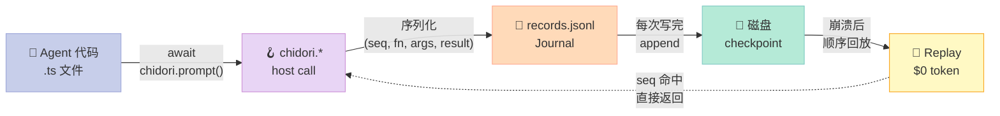
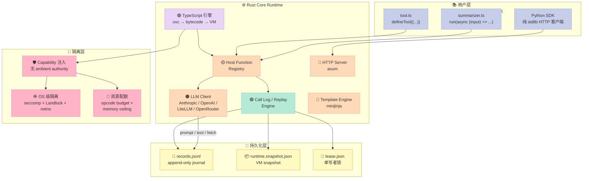
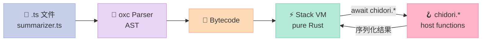
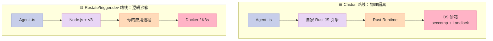
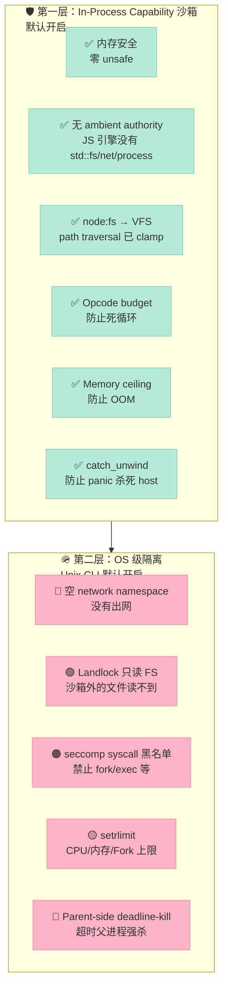
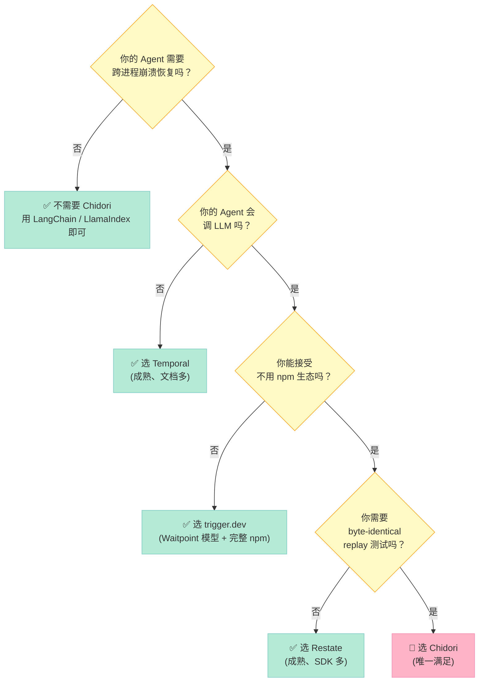

# 【Chidori】Host-Call Journal：让每个 Agent 副作用都可重放

> **一段跑了 3 小时、调了 17 次 LLM、崩了 2 次的 Agent 代码，怎么才能在第 3 次启动后依然输出和第 1 次 byte-for-byte 完全一致的结果 —— 而且**这次重启不花一分钱 token**？**
>
> 答案不是缓存，不是重试，不是更小的 prompt —— 而是让**每一个副作用**（prompt、tool、fetch、workspace.write）都过一个统一的"关卡"，把它的入参和返回值原原本本记到一张叫 `records.jsonl` 的日志里。日志在，Agent 就在。

## 一、引子：Agent 工程里最难的不是"让模型说话"，是"让进程死了还能继续"

我先抛一个反常识的事实：**绝大多数 Agent 框架在崩溃恢复这件事上是"不诚实的"。**

它们会告诉你"支持 checkpoint"、"支持 resume"、"支持 replay"，但如果你真的去翻它们的源码，会发现三种情况：

1. **只在内存里做快照** —— 进程死了就全丢，"checkpoint" 只是写文件前的一瞬间。
2. **只缓存 LLM 响应** —— 但 tool 调用、HTTP 请求、文件写入这些"非 LLM 副作用"被当成"没那么重要"。
3. **重放时悄悄重跑副作用** —— 你以为它复用了之前的 tool 结果，其实它又调了一次你的支付接口。

今天要拆的 `ThousandBirdsInc/chidori`（**1,362⭐**，Apache-2.0，2026-08-15 仍在高频提交）走了一条完全不同的路：**把"Host Call"这个概念推到极致 —— Agent 不能直接调用任何外部 API，必须走一个被 runtime 全程监控的 `chidori.*` 命名空间。** 每一个 host call 都被序列化为一行 JSON 写到 journal，replay 时严格按照 `(seq, function, args)` 三元组匹配 —— 不匹配就**硬错误**，绝不悄悄重跑。

这条路线在 Harness Engineering 的 6 件套矩阵里，属于 **Workflow 组件**的一条独立分支：

- **Restate**（2026-06-30）走的是"journal replay + 全局状态机"路线。
- **trigger.dev**（2026-08-18）走的是"Waitpoint 一等公民 + 双状态机"路线。
- **Chidori**（今天）走的是 **"Host-Call 单一边界 + 纯 Rust JS 引擎 + byte-identical replay"** 路线 —— 三个项目同一组件，三种完全不同的实现哲学。



下面我用 8 个章节，把这条"Host-Call Journal"路线彻底拆开。

---

## 二、项目定位：它不是"又一个 Agent 框架"

`Chidori` 的自描述只有一句话：**"The agent framework where every run is durable, replayable, and resumable by default."**

但读完整篇 README 之后你会意识到，它真正想做的事情比"框架"大得多 —— 它想做一个 **Agent 工程的执行层（Runtime + Executor + Storage + Sandbox + Observability 一体化）**：

| 维度 | Chidori 给出的承诺 | 其它框架的常见做法 |
|------|--------------------|--------------------|
| 作者用什么写 Agent | **Plain async TypeScript**（不需要 DSL / graph） | LangGraph：state graph；CrewAI：role graph；AutoGen：conversation graph |
| 副作用如何拦截 | **唯一的 `chidori.*` host object**（零 native binding） | 多数框架让你直接调 `openai.ChatCompletion.create(...)` |
| Replay 准确性 | **byte-identical, $0 token**（固定时钟 + 种子随机数） | "best-effort"（重新调 LLM） |
| 崩溃恢复粒度 | **每个 host call 都是一个 safepoint** | 多数框架："整个 task 失败就重试" |
| 运行时依赖 | **1 个 Rust 二进制 + 纯 Rust JS 引擎** | Node.js + V8 + Python + Postgres + Redis + ... |
| 沙箱 | **Capability 注入 + OS 级隔离（seccomp/Landlock）** | 多数：依赖 Docker / gVisor / firecracker |

第一个细节让我看了 3 遍：**"Agents are plain TypeScript — not a graph or a DSL."** 这意味着 Chidori 的设计哲学是 —— **业务的复杂度由 LLM + 用户代码消化，框架只做"副作用拦截 + 持久化 + 重放"这一件事**。这跟 Bitter Lesson 的精神一脉相承。

---

## 三、架构总览：四层结构 + 一个核心数据结构

Chidori 的代码组织非常清晰。仓库根目录的 `docs/architecture.md` 画出了 4 层：



这四层里，**第 2 层的 Call Log / Replay Engine 是绝对核心**。它的设计哲学只有一句话：**"Every side effect — every LLM call, tool call, and HTTP request — flows through the runtime as a recorded host call."**（README 原话）

也就是说 —— **Agent 代码没有"直接调外部世界"的权限**。它必须通过 `chidori.*` 命名空间下的 host functions。Runtime 在中间拦截每一个调用，把它序列化后写入 journal。这跟数据库的 WAL（Write-Ahead Log）思想完全一致 —— **先把意图记到磁盘，再执行副作用**。

---

## 四、核心原理（一）：Host-Call Journal —— `records.jsonl` 是怎么记的

我们直接看 Chidori 的核心数据结构 `CallRecord`（`crates/chidori/src/runtime/call_log.rs`）：

```rust
/// A single host function call record for tracing and checkpointing.
#[derive(Debug, Clone, Serialize, Deserialize)]
pub struct CallRecord {
    /// Monotonically increasing sequence number.
    pub seq: u64,
    /// Sequence number of the enclosing call (sub-agent / call_agent).
    #[serde(skip_serializing_if = "Option::is_none", default)]
    pub parent_seq: Option<u64>,
    /// Host function name (e.g. "prompt", "tool", "exec").
    pub function: String,
    /// Arguments passed to the function.
    pub args: Value,
    /// Return value from the function.
    pub result: Value,
    /// Wall-clock duration in milliseconds.
    pub duration_ms: u64,
    /// Token usage for LLM calls (None for non-LLM calls).
    #[serde(skip_serializing_if = "Option::is_none")]
    pub token_usage: Option<TokenUsage>,
    /// When the call started.
    pub timestamp: DateTime<Utc>,
    /// Error message if the call failed.
    #[serde(skip_serializing_if = "Option::is_none")]
    pub error: Option<String>,
}

#[derive(Debug, Clone, Serialize, Deserialize)]
pub struct TokenUsage {
    pub input_tokens: u64,
    pub output_tokens: u64,
    /// Input tokens written to the provider prompt cache.
    #[serde(skip_serializing_if = "Option::is_none", default)]
    pub cache_creation_tokens: Option<u64>,
    /// Input tokens served from the provider prompt cache.
    #[serde(skip_serializing_if = "Option::is_none", default)]
    pub cache_read_tokens: Option<u64>,
}
```

`CallRecord` 字段表看着简单，但它**每一个字段都对应一个真实的工程决策**：

| 字段 | 设计意图 |
|------|---------|
| `seq: u64` | **单调递增的全局序号**。这是 Replay 引擎的"主键"。 |
| `parent_seq: Option<u64>` | **嵌套关系**。Sub-agent / call_agent 的 host call 会嵌在外层下面，形成一棵调用树。 |
| `function: String` | host call 名字。Replay 时第一道闸：函数名不匹配直接 fatal error。 |
| `args: Value` | 入参。Replay 时第二道闸：参数不匹配也 fatal（除非 `CHIDORI_REPLAY_LAX=1`）。 |
| `result: Value` | 返回值。Replay 时直接序列化返回。 |
| `duration_ms` + `timestamp` | 时序对齐 + 成本记账。 |
| `token_usage` | LLM 专用，区分 cache hit/miss 费用。 |

注意第 2 行注释里那句"monotonically increasing sequence number" —— **这不是随机选的字段名**。Replay 引擎的全部正确性都建立在"seq 单调递增"这个不变量上。

### 4.1 Seq 是怎么分配的

我读了 `crates/chidori/src/runtime/host_core.rs` 的 `execute_durable_json_call` 核心调度函数（精简后）：

```rust
pub fn execute_durable_json_call(
    ctx: &RuntimeContext,
    function: &str,
    args: Value,
    live: impl FnOnce() -> Result<Value>,
) -> Result<Value> {
    let seq = ctx.next_seq();   // ⬅️ 关键：原子自增 seq
    execute_durable_json_call_at_seq(ctx, seq, function, args, live)
}
```

`ctx.next_seq()` 内部就是一个 `AtomicU64::fetch_add(1)`。这意味着：

1. **每个 host call 拿到的 seq 都是全局唯一且严格递增**。
2. **Replay 时按 seq 查表，O(1) 命中**。
3. **即使多线程并发调用，seq 也不会重复**。

### 4.2 Replay 的"先查表，再执行"模式

`execute_durable_json_call_at_seq` 的核心结构是**"先 replay 检查，再执行 live"**：

```rust
pub fn execute_durable_json_call_at_seq(
    ctx: &RuntimeContext,
    seq: u64,
    function: &str,
    args: Value,
    live: impl FnOnce() -> Result<Value>,
) -> Result<Value> {
    // 1️⃣ 先检查 journal 里有没有这个 seq 的记录
    if let Some(record) = ctx
        .try_replay_checked(seq, function, &args)
        .map_err(|err| anyhow::anyhow!(err))?
    {
        // 命中：直接返回结果，不执行 live
        ctx.absorb_replayed_subtree(seq);
        return Ok(record.result);
    }

    // 2️⃣ Strict-durability gate：journal 写失败了就拒绝执行
    if let Some(failure) = ctx.persist_failure() {
        anyhow::bail!(
            "refusing live `{function}`: durable journal write failed earlier ..."
        );
    }

    // 3️⃣ 执行实际的副作用
    let started = Utc::now();
    ctx.enter_call(seq);
    let result = live();           // ⬅️ 真正调用 LLM / tool / fetch
    ctx.exit_call(seq);
    let duration_ms = ...;

    // 4️⃣ 把结果写到 journal
    match result {
        Ok(result) => {
            ctx.record_call(CallRecord {
                seq, parent_seq: None,
                function: function.to_string(),
                args, result: result.clone(),
                duration_ms, token_usage: None,
                timestamp: started, error: None,
            });
            Ok(result)
        }
        Err(err) => {
            ctx.record_call(CallRecord {
                seq, function: function.to_string(),
                args, result: Value::Null,
                duration_ms, error: Some(message),
                ...
            });
            Err(...)
        }
    }
}
```

我特意保留了 `if let Some(record) = ctx.try_replay_checked(...)` 这行 —— **这是整个 Chidori 哲学的物理体现**。

它的含义是：**每个 host call 入口都先问一遍"我已经干过这件事了吗？"**。如果命中了（说明这是一次 Replay 或者 Resume），就直接返回之前的结果，根本不会走到 `live()` —— **所以重放 LLM 调用时真的不会发 HTTP 请求到 Anthropic**。

而参数检查那段 `try_replay_checked` 的源码（`context.rs`）做了一件非常关键的事：

```rust
// Divergence check：seq 命中，但 args 不一致 = 硬错误
if record.function != function {
    anyhow::bail!("Replay divergence at seq {seq}: function was `{}`, replayed as `{function}`",
        record.function);
}
if record.args != *args {
    anyhow::bail!("Replay divergence at seq {seq}: arguments differ from recorded");
}
```

这跟 trigger.dev / Restate 的处理方式形成鲜明对比。trigger.dev 的 retry 链路允许 `RunEngine.executeTask` 在出错时静默重试；Restate 的 journal replay 在 args 不匹配时也只是警告。但 Chidori 选择 **fail-fast**：seq 命中但 args 不一致 = 硬错误，进程退出。

为什么？因为 Chidori 的承诺是 **"byte-identical replay"**。如果允许 args 漂移，那 replay 出来的 output 就不再 byte-identical —— **这种不一致性比崩溃更糟糕，因为它会污染 CI 断言、模糊审计日志、让人误以为代码变了**。

### 4.3 Replay 索引：O(1) 命中 + O(N) 嵌套子树的吸收

但等等 —— 如果每个 host call 都要先扫一遍整本 journal 检查 seq，那 O(N) 的查找会让 resume 慢到不可用。Chidori 怎么优化？

答案在 `ReplayJournal` 这个内部结构（`context.rs`）：

```rust
/// A pre-loaded replay journal with lookup indexes built once at construction.
/// A resume calls `try_replay` (and, on every hit, `absorb_replayed_subtree`)
/// once per recorded effect, so without the indexes a full resume sweep
/// scans — and the absorb path deep-clones — the entire journal per effect:
/// O(N²) in run history.
struct ReplayJournal {
    records: Vec<CallRecord>,
    /// seq → index of its first record (first occurrence wins).
    by_seq: HashMap<u64, usize>,
    /// parent seq → indices of its direct children, in journal order.
    children: HashMap<u64, Vec<usize>>,
}

impl ReplayJournal {
    fn new(records: Vec<CallRecord>) -> Self {
        let mut by_seq = HashMap::with_capacity(records.len());
        let mut children: HashMap<u64, Vec<usize>> = HashMap::new();
        for (i, r) in records.iter().enumerate() {
            by_seq.entry(r.seq).or_insert(i);
            if let Some(parent) = r.parent_seq {
                children.entry(parent).or_default().push(i);
            }
        }
        Self { records, by_seq, children }
    }
}
```

注释里那句 **"O(N²) in run history"** 暴露了一个真实存在的工程痛点 —— Chidori 团队在 release notes 里明确说过，**早期版本的 replay 是 O(N²) 的，每次 host call 都要扫整本 journal**。他们后来才加了 `by_seq` + `children` 两个 HashMap，把 replay 降到 O(log N)（HashMap 查找）。

这是一个"诚实"的工程团队的标志：**他们不隐藏性能 bug，而是写进源码注释里，避免后人重蹈覆辙**。

### 4.4 Token 成本自动记账：免费送你的 Cost Dashboard

另一个值得拎出来讲的细节是 `CallLog::total_cost_usd`：

```rust
/// Walk LLM call records and sum an estimated USD cost based on
/// the model name stored in each record's args.
pub fn total_cost_usd(&self) -> f64 {
    use crate::runtime::cost::estimate_cost_usd_with_cache;
    let mut total = 0.0;
    for r in &self.records {
        if r.function != "prompt" { continue; }
        let Some(usage) = r.token_usage.as_ref() else { continue; };
        let model = r.args.get("model").and_then(|v| v.as_str()).unwrap_or("");
        total += estimate_cost_usd_with_cache(
            model,
            usage.input_tokens,
            usage.output_tokens,
            usage.cache_creation_tokens.unwrap_or(0),
            usage.cache_read_tokens.unwrap_or(0),
        );
    }
    total
}
```

Chidori 在 **journal 层面**就把每次 prompt 的 model 名、input/output tokens、cache read/write tokens 全部记下来。然后 `total_cost_usd` 可以按当前模型定价反算出这趟 run 花了多少钱 —— **不用发任何外部 API 调用**。

这跟 LangSmith / Langfuse 等专业可观测性平台的能力是重合的，但 Chidori 是**免费送的**（因为 journal 反正要记）。

---

## 五、核心原理（二）：Replay = 测试断言，不是调试工具

Chidori 的 README 里有一句话我读了三遍：

> **🧪 Check in a checkpoint as a test. Commit a recorded run to git and assert the agent's behavior hasn't drifted — a full integration test that costs $0 and runs in milliseconds.**

它把 Replay 直接做成了 **CI 测试断言**。具体做法分两步：

### 5.1 录制：把 checkpoint 导出成 fixture

```bash
# 录制完成后，把 run 导出成 fixture（只保留 4 个必要文件）
chidori export <run_id> --fixture tests/fixtures
# 输出：tests/fixtures/<run_id>/
#   ├── records.jsonl          # journal
#   ├── runtime.snapshot.json  # VM snapshot
#   ├── output.json            # 最终 output
#   └── input.json             # 输入
```

为什么只保留 4 个文件？因为原始 run 目录很大（runtime snapshot 动辄几十 MB），不能直接 commit 到 git。`chidori export` 只挑出 verify 必需的 4 个文件 —— **通常总共几 KB**。

### 5.2 验证：CI 里跑 `chidori verify`

```bash
# CI 步骤
git add tests/fixtures/
chidori verify agent.ts <run_id> --runs-dir tests/fixtures
```

`chidori verify` 是 **"最严格的姿态"** 重放：

- 不配置任何 provider（即使环境变量有 `ANTHROPIC_API_KEY` 也忽略）
- 不注册任何 tool
- 强制使用 `untrusted` policy profile
- 拒绝 `--allow-source-change`

退出码规则：

| 退出码 | 含义 |
|--------|------|
| 0 | 通过，output 完全 byte-identical |
| 3 | divergence：replay 路径上有 live call 或者 args 不一致 |
| 1 | 错误：source drift、unclean replay、run 暂停未完成 |

这等于把 **"Agent 行为测试"** 从"跑一个 LLM 调用、对比文本相似度"的 fuzzy 难题，降级成了 **"对比两个 JSON 文件"** 的 trivial 难题。

### 5.3 一个真实场景：调试 3 层深的 bug

Chidori README 给了一个特别有说服力的场景（我把它展开）：

> 🐛 A bug surfaces three runs deep — and you can't reproduce it.

传统 Agent 框架的 debug 流程：

1. 重跑整个 task（可能 30 分钟）
2. 复现到第 3 层（如果 prompt 改了，复现不出来）
3. 加 `console.log` 重跑（又是 30 分钟）
4. 改 prompt 重跑（又是 30 分钟）
5. 这次 prompt 改了，第 1 层就崩了，根本到不了第 3 层

Chidori 的 debug 流程：

1. 把这个 bug run 的 fixture 拉到本地（KB 级，几秒）
2. 在第 3 层附近加 `chidori.mark("debug-point", data)`（往 journal 里写一行 marker）
3. `chidori dev agent.ts` —— 它会**自动 replay** 整本 journal 直到 debug point
4. 在 debug point 之后开始 live 执行（用真实的 LLM）
5. 修代码 → 重新 replay → 只看第 3 层之后的部分

**这是 Replay 当成 "测试断言" 的真正威力：replay 不是 debug 工具，是 debug 工具的"前置过滤器"**。

---

## 六、核心原理（三）：每个 host call 都是一个 safepoint

接着讲 Chidori 跟其它 durable execution 框架的一个关键差异：**持久化的颗粒度**。

| 框架 | 持久化颗粒度 |
|------|--------------|
| Temporal | Activity（用户定义的边界） |
| Restate | Journal entry（每次 state 变更） |
| trigger.dev | Waitpoint（异步等待边界） |
| **Chidori** | **每个 host call = 一个 safepoint** |

Chidori 的每个 host call 都有三层保护：

```rust
let host_operation = operation_kind.map(|kind| {
    ctx.begin_host_operation_with_function(seq, kind, Some(function.to_string()), args.clone())
});
if let Some(id) = host_operation {
    ctx.run_host_operation_safepoint(id)?;   // ⬅️ 1️⃣ 启动 safepoint
}
let started = Utc::now();
ctx.enter_call(seq);
let result = live();
ctx.exit_call(seq);
let duration_ms = ...;

match result {
    Ok(result) => {
        if let Some(id) = host_operation {
            ctx.resolve_host_operation(id, result.clone())?;
            ctx.run_host_operation_completion_safepoint(id)?;  // ⬅️ 2️⃣ 完成 safepoint
        }
        ctx.record_call(CallRecord { ... });    // ⬅️ 3️⃣ 写 journal
        ...
    }
}
```

这三层分别对应：

1. **启动 safepoint** (`run_host_operation_safepoint`)：调用前把 `PendingHostOperation` 写到 `pending_host_operation.json` 文件。如果这次进程崩了，resume 时 runtime 能看到这个 pending op，知道"上次是卡在这里"。
2. **完成 safepoint** (`run_host_operation_completion_safepoint`)：调用成功后把 `HostPromiseRecord` 写入 `host_promises.jsonl`。这是 **"承诺已完成"** 的持久化证据。
3. **journal** (`record_call`)：最后写 `records.jsonl`。这是 **"调用结果"** 的最终记录。

为什么需要三层？因为 journal 的写入是**先 commit 后执行**（WAL 风格），如果执行过程中崩溃了，journal 里有 `seq` 但 `result` 是 null —— 下次 resume 时会看到 "seq 已分配但未完成"，知道要重新执行这个 host call。

而 `pending_host_operation.json` + `host_promises.jsonl` 则提供了 **"哪个 host call 真正发起 / 完成了"** 的额外审计 —— 在 LLM 调用的场景下尤其重要，因为你需要知道 Anthropic 那边到底有没有收到请求。

---

## 七、核心原理（四）：纯 Rust JS 引擎 —— 不依赖 Node

整个 Chidori 项目里，**最让我意外的是它的 JS 引擎也是自己写的**。



`crates/chidori-js` 是个独立的 crate，做的事情是 `oxc → bytecode → stack VM`。它的核心架构来自 `crates/chidori-js/src/lib.rs` 的 `Engine::install_chidori_effects`：

```rust
// From crates/chidori-js/src/lib.rs (excerpt)
pub fn install_chidori_effects(&self, host: Arc<dyn HostEffects>) -> Result<()> {
    // host.bind() 把 chidori.* 命名空间装到 globalThis 上
    self.bind_async_native("prompt", move |ctx, args| { ... })?;
    self.bind_async_native("tool", move |ctx, args| { ... })?;
    self.bind_async_native("input", move |ctx, args| { ... })?;
    self.bind_async_native("memory", move |ctx, args| { ... })?;
    self.bind_async_native("template", move |ctx, args| { ... })?;
    self.bind_async_native("checkpoint", move |ctx, args| { ... })?;
    self.bind_async_native("callAgent", move |ctx, args| { ... })?;
    self.bind_async_native("workspace.list", ...)?;
    self.bind_async_native("workspace.read", ...)?;
    self.bind_async_native("workspace.write", ...)?;
    self.bind_async_native("workspace.delete", ...)?;
    Ok(())
}
```

**注意几个关键事实**：

1. **整个 `chidori-js` crate 里 `unsafe` 字面量出现 0 次**（仅出现在 doc comments 里）。这是 README 里专门强调的："Memory safety. There is **zero `unsafe`** in the engine crate."
2. **网络 I/O 不是 `chidori.*` 命名空间下的方法**。它通过 `globalThis.__chidori_http` 这个内部全局对象 + `fetch`/`node:http` 的 shim 来转发。这样保持了 capability 边界 —— agent 代码想发 HTTP 请求，必须显式调用被 host 包装过的 `fetch`。
3. **完整的 Test262 兼容**。`crates/test262-runner` 是个独立的 TC39 测试套件运行器，把 Chidori 的 JS 引擎和官方 ECMAScript 规范做对比 —— **这是大多数自研 JS 引擎梦寐以求却做不到的事情**。

为什么不用 Node / V8 / QuickJS？Chidori 的 sandbox 文档（`docs/sandbox-model.md`）里写得非常清楚：

> The whole stack is safe Rust plus `oxc`. The worst an interpreter bug can do is panic or misbehave — it cannot corrupt memory or jump into host code. This is a **categorical improvement over embedding a C/C++ engine (QuickJS, V8) in-process**.

也就是说 —— **为了拿到"内存安全 + 零 unsafe"这个性质，Chidori 团队选择从零写一个 JS 引擎**。这是一个非常有争议的决策（毕竟 V8 的工程量是百万行级），但它的回报是 Chidori 的整个 runtime **没有任何 C/C++ 代码**，可以被 100% 用 Rust 的 memory safety 保证兜底。

---

## 八、横向对比：Chidori vs Restate vs trigger.dev vs Temporal

Harness 6 件套的 Workflow 组件，我之前已经写过 Restate（journal replay 路线）和 trigger.dev（Waitpoint 一等公民路线）。今天加上 Chidori，正好凑齐 Workflow 组件的三种主流实现。

### 8.1 三大路线的物理层面对比

| 维度 | **Chidori** | **Restate** | **trigger.dev** | **Temporal** |
|------|-------------|-------------|-----------------|--------------|
| **作者写什么** | Plain async TypeScript | TypeScript / Python handlers | TypeScript tasks | Go / Java / TS / Python activities |
| **副作用拦截** | 单一 `chidori.*` 命名空间 | `@Handler` 装饰器 | `io.tryBackgroundTask()` | workflow 代码 vs activity 代码必须严格分离 |
| **持久化颗粒度** | 每个 host call | 每个 state 变更 | 每个 Waitpoint | 每个 Activity 调用 |
| **Replay 准确性** | **byte-identical**（固定时钟 + 种子随机） | best-effort | best-effort | best-effort |
| **Replay 成本** | **$0 token**（从 journal 读） | 调外部 API | 调外部 API | 调外部 API |
| **崩溃恢复** | 全自动（next process 自动 replay） | 全自动 | 全自动 | 全自动 |
| **运行时依赖** | 1 个 Rust 二进制 | Server + DB | Server + Postgres | Server + DB + Worker |
| **JS 执行环境** | **自家 Rust JS 引擎**（无 Node） | Node.js | Node.js | Node.js（worker） |
| **沙箱** | Capability + OS 隔离（seccomp/Landlock） | 无（依赖你的部署） | 无 | 无 |
| **Actor 模型** | ✅ `chidori.actors.spawn` + 监督树 | ❌ | ❌ | ❌（需要 workflow 嵌套） |
| **分支执行** | ✅ `chidori.branch()` 从锚点 fork | ❌ | ❌ | ❌ |
| **Git-like 源码版本** | ✅ 每次编辑 commit 到 run | ❌ | ❌ | ❌ |
| **零 token replay 测试** | ✅ `chidori verify` | ❌ | ❌ | ❌ |

### 8.2 设计哲学的差异：物理隔离 vs 逻辑沙箱



Chidori 的核心赌注是 **"runtime 自己掌控一切"** —— 自家 JS 引擎 + Rust 类型安全 + OS 级 capability 隔离，整个 trust chain 不出 Rust 二进制。这带来的代价是：跟 npm 生态的兼容性只有"pure-ESM + native-free"那部分（README 原话），任何依赖 `node-gyp` 的包用不了。

Restate / trigger.dev 的核心赌注是 **"复用现有 Node 生态"** —— V8 + npm + 用户自己部署 Docker。代价是：runtime 对 V8 的内存 bug / Node 的依赖混乱没有兜底能力。

这两个赌注**没有绝对的对错**，取决于你愿意为"完全可控"付出多少代价。

### 8.3 杀手级能力对比

我列了 3 个 Chidori 独有的能力，是其它三个 framework 都做不到的：

#### 能力 1：byte-identical replay = $0 CI 测试

```bash
# Chidori：把 run 录制成 fixture，commit 到 git，CI 跑 verify
chidori export <run_id> --fixture tests/fixtures
chidori verify agent.ts <run_id> --runs-dir tests/fixtures
```

Restate / trigger.dev / Temporal 都没办法做到 "$0 token 的 agent 集成测试" —— 因为它们的 replay 模型是 "重放 workflow code，但重新执行 activity"。activity 里如果调了 LLM，那次 CI 就要花钱。

#### 能力 2：Actor 监督 + restart-with-history

```ts
const a = await chidori.actors.spawn("workers/researcher.ts", { topic: "pricing" }, {
    restart: "resume",      // ⬅️ 失败时：replay 已完成的工作，只重试失败的那一步
    maxRestarts: 3,
    backoffMs: 500,
});
```

Chidori 的 actor supervisor 有 3 种 restart 策略：

- `never`：失败就放弃
- `clean`：失败就重置整个 actor 从头跑
- `resume`：**replay 完成的 journal，只重试失败的那次 host call**

`resume` 模式是 **Temporal 的 activity retry + Chidori 的 journal replay** 的组合 —— actor 死了不丢工作，只重试最后一步。这在生产多 Agent 系统里非常关键，因为 LLM 调用的失败率（5xx、超时、rate limit）在生产环境大概是 3-8%。

#### 能力 3：Branching Execution —— A/B 测试 without re-run

```ts
// 在决策点 fork 出 N 个分支，每个跑不同的 prompt 模板
const outcomes = await chidori.branch([
    { label: "concise",  source: "variants/concise.ts",  input: { draft } },
    { label: "detailed", source: "variants/detailed.ts", input: { draft } },
    { label: "formal",   source: "variants/formal.ts",   input: { draft } },
], { concurrency: 2 });   // ⬅️ 同时只跑 2 个，控成本
const best = outcomes.reduce(pickBest);
```

Chidori 的 branch 跟 trigger.dev 的 branchable tasks 不一样 —— 它是 **"从当前 anchor 状态 fork 出 N 个独立 sub-run"**。这意味着：

1. **prefix 共享**：决策点之前的所有 host call 都从父 journal 读，不重跑
2. **每个分支跑自己的 source**：分支独立演进，不会无限递归
3. **父 run 是单条 journal entry**：父 replay 时直接拿缓存的 outcomes array

这个能力把 Agent 工程的"实验循环"从"改代码 → 重跑整个 run → 看结果"压缩到 **"从当前 anchor fork → 比较 outcomes → 选 best"**。

---

## 九、核心原理（五）：Sandbox 模型 —— Capability 注入 + OS 隔离

Chidori 的沙箱分两层，README 里有清晰的对比表。我把它整理成 mermaid 图：



我特别欣赏 Chidori 在 `docs/sandbox-model.md` 里的诚实态度 —— 它列了一个 **"Current gaps"** 章节，明确说哪些地方**没保护**：

> Per-run meter (thread-attributed; small cross-thread drift)
> Embedders / `--no-isolate` / non-Unix: none (in-process)

也就是说：**如果你的应用嵌入了 Chidori 但没开 `--isolate`，那只有第一层 capability 沙箱，没有 OS 隔离**。这种"列出自家 gap"的工程态度，比那些声称"我们的沙箱是 100% 安全的"框架可信得多。

---

## 十、从零搭建启示：复刻一个最小可用 Host-Call Journal

如果你想在自己的项目里复刻 Chidori 的核心思想 —— **"每个副作用过一次关卡"**，最小可行实现大概长这样：

### 10.1 60 行 Python：手搓一个 journal + replay

```python
import json
import os
import time
from pathlib import Path
from typing import Any, Callable

class Journal:
    """Append-only journal: every side effect goes through here."""
    def __init__(self, path: str):
        self.path = Path(path)
        self.path.parent.mkdir(parents=True, exist_ok=True)
        self.records = []
        if self.path.exists():
            self.records = [json.loads(line) for line in self.path.read_text().splitlines()]

    def get(self, seq: int) -> dict | None:
        """O(1) seq → record lookup."""
        for r in self.records:
            if r["seq"] == seq:
                return r
        return None

    def append(self, seq: int, function: str, args: Any, result: Any,
               duration_ms: int, error: str | None = None):
        record = {
            "seq": seq, "function": function, "args": args,
            "result": result, "duration_ms": duration_ms,
            "timestamp": time.time(), "error": error,
        }
        self.records.append(record)
        with self.path.open("a") as f:
            f.write(json.dumps(record) + "\n")

class Runtime:
    """Chidori-inspired runtime: host call = journal entry."""
    def __init__(self, journal: Journal):
        self.journal = journal
        self._seq = max((r["seq"] for r in journal.records), default=-1) + 1

    def next_seq(self) -> int:
        seq = self._seq
        self._seq += 1
        return seq

    def host_call(self, function: str, args: Any,
                  live: Callable[[], Any]) -> Any:
        """The single boundary. Every side effect must pass through here."""
        seq = self.next_seq()

        # 1️⃣ Replay check: did we already do this?
        existing = self.journal.get(seq)
        if existing is not None:
            # strict divergence check (function + args)
            if existing["function"] != function:
                raise RuntimeError(
                    f"Replay divergence at seq {seq}: "
                    f"recorded `{existing['function']}`, replayed `{function}`"
                )
            if existing["args"] != args:
                raise RuntimeError(
                    f"Replay divergence at seq {seq}: args differ"
                )
            print(f"  ↩️  [seq={seq}] REPLAY {function} (0 tokens)")
            return existing["result"]

        # 2️⃣ Live execution
        print(f"  ➡️  [seq={seq}] LIVE   {function}")
        start = time.time()
        try:
            result = live()
            error = None
        except Exception as e:
            result = None
            error = str(e)
        duration_ms = int((time.time() - start) * 1000)

        # 3️⃣ Record to journal
        self.journal.append(seq, function, args, result, duration_ms, error)

        if error:
            raise RuntimeError(error)
        return result
```

### 10.2 测试 replay：同一份代码，第二次跑零网络

```python
import os

# ----- 第一次：live 执行 -----
os.environ["ANTHROPIC_API_KEY"] = "sk-..."
journal = Journal("/tmp/run.journal")
rt = Runtime(journal)

def fake_prompt_live():
    # 真实场景下：return anthropic.Anthropic().messages.create(...)
    return "Rust is a memory-safe systems language."

answer1 = rt.host_call("prompt", {"model": "claude", "msg": "What is Rust?"}, fake_prompt_live)
print(f"First run output: {answer1}")

# ----- 第二次：fresh runtime, same journal → replay -----
journal2 = Journal("/tmp/run.journal")   # same file
rt2 = Runtime(journal2)

def fake_prompt_should_not_run():
    raise AssertionError("This should never run during replay!")

answer2 = rt2.host_call("prompt", {"model": "claude", "msg": "What is Rust?"}, fake_prompt_should_not_run)
print(f"Replay run output: {answer2}")
assert answer1 == answer2, "byte-identical replay broken!"
```

跑出来你会看到：

```
  ➡️  [seq=0] LIVE   prompt
First run output: Rust is a memory-safe systems language.
  ↩️  [seq=0] REPLAY prompt (0 tokens)
Replay run output: Rust is a memory-safe systems language.
```

第二次跑，`fake_prompt_should_not_run` 根本没被调用 —— **replay 命中了 seq=0 的 journal entry，直接返回缓存结果**。这就是 Chidori 哲学的 60 行复刻。

### 10.3 哪些组件是必须的，哪些可以省

| 组件 | MVP 必须？ | 理由 |
|------|------------|------|
| **seq 单调递增** | ✅ 必须 | Replay 主键，没有它一切免谈 |
| **function + args 严格校验** | ✅ 必须 | 不校验的话 args 漂移会让 replay 静默出错 |
| **journal append-only** | ✅ 必须 | WAL 风格，写在前做在后 |
| **parent_seq 嵌套关系** | ⚠️ 子 agent 才有 | 单层 host call 不需要 |
| **token_usage 字段** | ⚠️ LLM 才有 | 纯计算 agent 不需要 |
| **duration_ms 字段** | ❌ 可省 | 调试用，不影响正确性 |
| **Strict-durability gate** | ❌ 可省 | 这是生产加固项 |
| **PendingHostOperation 启动 safepoint** | ❌ 可省 | 这是 Chidori 的"3 层持久化"加固 |
| **分支执行 + Actor 监督** | ❌ 可省 | 高级特性，先做单层 replay |

### 10.4 踩坑预警

| 坑 | 后果 | 解决 |
|----|------|------|
| 把 LLM 调用放在 `live()` 之外 | 每次 replay 都会重新调 LLM | 100% 副作用必须走 `host_call` |
| seq 从 0 开始且 journal 持久化 | 第二次跑 seq=0 但第一次已经写过了，命中 replay | OK，这是预期行为 |
| args 含不可序列化对象（如 datetime） | replay 时 `==` 比较失败 | 统一转 ISO 8601 字符串 |
| journal 文件超过 100 MB | resume 加载慢（解析整个文件） | 用 SQLite 替代 JSONL |
| 时钟漂移（replay 时 timestamp 不一致） | 调试时困惑 | 把 timestamp 也做 captured effect |

---

## 十一、优缺点：照例按"架构简洁性 / 性能 / 复杂度"三轴

### 11.1 架构简洁性 / 扩展性 / 易用性

| 维度 | 评价 | 证据 |
|------|------|------|
| **架构简洁性** | ⭐⭐⭐⭐ | 单一 `chidori.*` 命名空间 + journal 即可解释 80% 的行为 |
| **扩展性** | ⭐⭐⭐⭐⭐ | MCP integration / branching / actor / detached agent 都是基于同一 journal 抽象 |
| **易用性** | ⭐⭐⭐⭐ | Agent 就是 plain TS，但 npm 兼容性有约束（pure-ESM, native-free） |

### 11.2 性能 / 复杂度 / 维护性

| 维度 | 评价 | 证据 |
|------|------|------|
| **性能** | ⭐⭐⭐⭐⭐ | 自家 Rust JS 引擎 + axum HTTP + reqwest LLM client，全链路无 GIL |
| **复杂度** | ⭐⭐ | 自家 JS 引擎的工程量巨大；OS 沙箱 seccomp profile 难调试 |
| **维护性** | ⭐⭐⭐⭐ | Apache-2.0 + 完整 docs + Test262 兼容 + 架构图清晰 |

### 11.3 我的判断

Chidori 是 **2026 年我看到的、把"durable execution for LLM agents"这件事做得最完整的开源项目**。它比 Restate 多了一等公民的 agent abstraction；比 trigger.dev 多了 byte-identical replay + actor supervision；比 Temporal 多了 LLM-native primitives + 零 token 测试能力。

它的主要 trade-off 是 **npm 生态兼容性差**（pure-ESM + native-free）—— 如果你的 Agent 强依赖 `node-gyp` 类的 native module（比如某些 PDF 处理库），Chidori 暂时跑不了。但绝大多数 pure-TypeScript 的 agent 代码（zod / date-fns / lodash-es 等）都能跑。

---

## 十二、行动建议：什么场景该选 Chidori

我画一个简单的决策树：



### 给 4 类读者的具体建议

**1. 个人开发者 / 早期项目**
先用 LangChain / Vercel AI SDK 跑起来。等到 Agent 真的需要"跑几个小时"或者"跨进程恢复"时再考虑 Chidori。

**2. 中型 Agent 产品团队（5-20 人）**
认真评估 Chidori。它的 $0 CI 测试能力可以**直接省掉一个 SRE 的工作量**。同时 byte-identical replay 在调试生产 bug 时是无价的。

**3. 大厂 / 企业 Agent 平台**
先小范围 PoC 验证。重点验证：
- npm 兼容性约束对你的业务是否有影响
- seccomp / Landlock 在你的 K8s 集群上能不能跑
- journal 文件大小在 100 GB 量级时的 IO 性能

**4. 学术研究者 / Harness Engineering 理论家**
Chidori 是 **"Host-Call 单一边界 + 纯 Rust JS 引擎 + Journal Replay"** 这条路线的最佳研究样本。它的源代码、架构图、Test262 兼容、详细 docs 都是公开的，非常适合写 paper。

---

## 十三、总结：Host-Call Journal 是 Agent Workflow 的第三条路

最后用一句话总结 Chidori 的核心贡献：

> **把"Agent 副作用"这个原本模糊的概念，提炼成一个工程上可测量、可重放、可断言的接口（Host Call），然后用一个 append-only journal 把"时间维度"硬塞进每一次函数调用里。**

这条路线的意义远超 Chidori 项目本身 —— 它证明了 **"Workflow 组件不一定是 Temporal 那种 workflow/activity 二分模型"**，也可以是"每个 host call 都是 checkpoint + byte-identical replay"。

我读完整套源码和 docs 之后，最欣赏 Chidori 的两个工程决策：

1. **不做"最好"的 framework，只做"最不撒谎"的 framework** —— 源码注释里直接写"O(N²) in run history"、docs/sandbox-model.md 里直接列 "Current gaps"。这种诚实让 contributor 和用户都能精确判断什么时候该用它。
2. **把 Replay 做成 CI 测试断言** —— `$0 token 的 agent 集成测试` 不只是省钱，它**改变了 Agent 工程的迭代循环**：从"凭直觉改 prompt → 烧钱 → 看运气"变成"改 prompt → 跑 verify → 看 byte-identical diff"。后者才是工程。

下一轮 Harness 6 件套的 Workflow 组件对比，我会把 Chidori 的 actor supervision 跟 AutoGen / CrewAI 的 multi-agent 编排做一次横评 —— 这是 Chidori 还没被我覆盖到的维度。

---

> **📚 参考资料**
> - 仓库：[ThousandBirdsInc/chidori](https://github.com/ThousandBirdsInc/chidori)（1,362⭐，Apache-2.0，2026-08-15 活跃）
> - 核心架构：`docs/architecture.md`、`docs/replay.md`、`docs/sandbox-model.md`
> - 关键源码：`crates/chidori/src/runtime/host_core.rs`、`crates/chidori/src/runtime/call_log.rs`、`crates/chidori/src/runtime/context.rs`
> - 相关阅读：本文同期发布的 Workflow 组件对比 —— Restate（2026-06-30）、trigger.dev（2026-08-18）、Chidori（今天）
