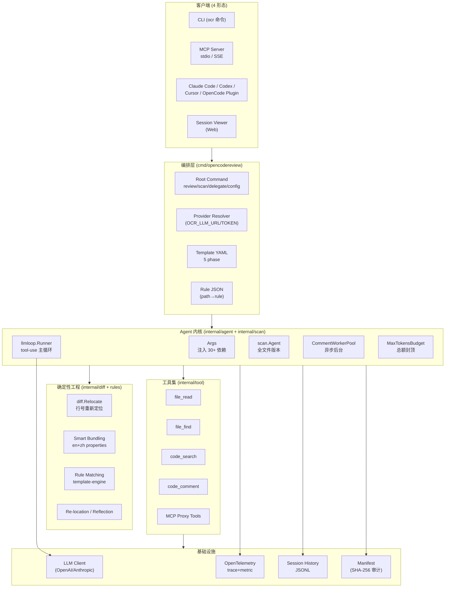
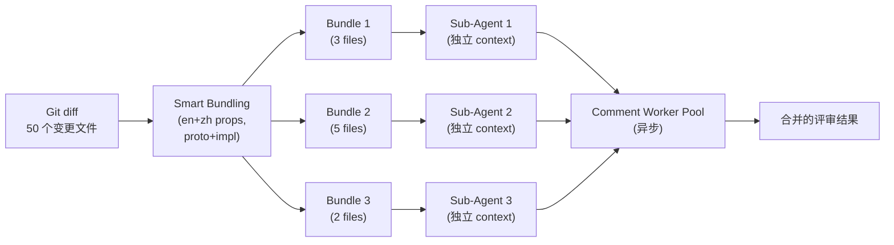
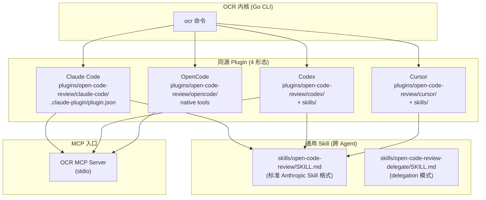
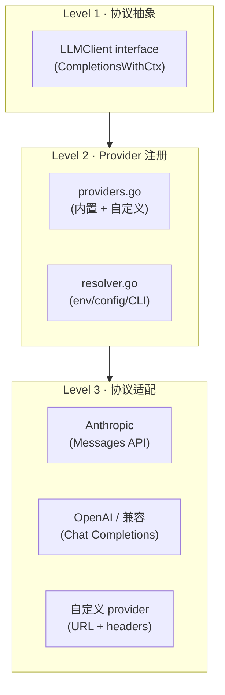

## 引子

如果你用过 Claude Code 或 Codex 跑代码审查（Code Review），多半会踩过这三个雷：

- **覆盖不全**——大变更集下 Agent「偷懒」，只挑几个文件看、忽略其余
- **位置漂移**——评论的行号、文件路径常常对不上，定位失效
- **质量不稳**——纯自然语言 Skill 难调试，换个 prompt 词效果就大跳水

根因正如 `alibaba/open-code-review`（以下简称 OCR）在 README 中所说：**「purely language-driven architecture lacks hard constraints on the review process」**——纯语言驱动的架构，对评审过程缺乏硬约束。

OCR 是 Alibaba 集团两年内部打磨、面向十万级开发者、识别上百万代码缺陷的 AI 代码审查工具，**经过生产规模验证后开源**（Apache-2.0）。它在 [AACR-Bench](https://huggingface.co/datasets/Alibaba-Aone/aacr-bench) 上以**仅通用 Agent 约 1/9 的 token 消耗**跑出更高 Precision 与 F1，是 2026 年「工程化 AI 评审」赛道的范本。

本文将**逐层拆解 OCR 的 Deterministic × Agent 混合架构**：从顶层 CLI、MCP Server、Agent 主循环、工具集、规则匹配到 Session/Telemetry，附 5 张 Mermaid 图与 10+ 个真实可执行代码块，带你看清一个工业级 AI 评审工具到底是怎么把「确定性工程」与「动态推理」揉在一起的。

## 项目定位与核心价值

### 一句话定义

**OpenCodeReview** 是 Alibaba 出品的 AI 代码审查 CLI 工具。它读取 Git diff，通过具备 tool-use 能力的 Agent 调度 LLM，生成**结构化、行级精确**的评审意见；内置多语言规则（NPE、线程安全、XSS、SQL 注入等），并以 **Claude Code / Codex / Cursor / OpenCode** 等 Coding Agent 的 Skill 形式对外提供。

### 能力矩阵

| 维度 | 能力 |
|------|------|
| 触发面 | CLI (`ocr review/scan/delegate`)、MCP Server、Claude Code Plugin、Codex Skill、Cursor Skill、OpenCode 集成 |
| 评审模式 | workspace（暂存+未暂存+未追踪）、commit、range（merge-base）、全文件 scan、Delegation（让 Coding Agent 自己跑） |
| 多语言规则 | Java NPE、Go 线程安全、C++ 资源泄漏、JS XSS、SQL 注入……10+ 编程语言内置 |
| LLM 兼容 | OpenAI、Anthropic，以及任意 OpenAI-兼容自定义 provider |
| 可观测性 | OpenTelemetry（trace/metric）+ Session Viewer（浏览器回放）+ 自带 manifest 哈希审计 |
| CI/CD | GitHub Actions、GitLab CI、Gerrit、GitFlic、Bitbucket Pipelines 官方 examples |

### 仓库统计

| 字段 | 值 |
|------|-----|
| ⭐ Stars | 20,737 |
| 🍴 Forks | 1,475 |
| 📦 License | Apache-2.0 |
| 🗣️ 语言 | Go（CLI 内核）+ TypeScript（VS Code 扩展）+ Vue/JS（Viewer） |
| 📅 创建 | 2026-05-18 |
| 🔄 最近推送 | 2026-08-18（**1 天前**） |
| 📦 体积 | 51,476 KB |
| 🏷️ Topics | agent, agent-skills, code-review, code-review-assistant, harness, repository-level-context |
| 🛡️ OpenSSF | Gold 徽章 |

> 来源：`GET https://api.github.com/repos/alibaba/open-code-review`（2026-08-19 拉取）

### Benchmark：1/9 token、更高 Precision

OCR 在自建的 **AACR-Bench**（50 个流行开源仓库 × 200 个真实 PR × 10 种语言，80+ 高级工程师交叉标注 **1,505 条 ground-truth issue**）上取得：

| 指标 | OCR vs 通用 Agent（Claude Code） |
|------|--------------------------------|
| **Precision** | 显著更高（误报更少） |
| **F1** | 显著更高 |
| **Recall** | 略低（**有意取舍**：宁可漏报，不愿噪音） |
| **Avg Time** | 更快 |
| **Avg Token** | **约 1/9**（同等模型下） |

> 这组数字非常重要：OCR 并不是简单地「LLM 上加规则」，而是**通过确定性工程把 Agent 的注意力与 token 消耗压缩到极致**——下文拆解时会看到这是怎么做到的。

## 整体架构

### 顶层分层



### 后端目录结构

```
open-code-review/
├── cmd/opencodereview/          # CLI 入口 (81 文件)
│   ├── root.go
│   ├── review.go                # ocr review 子命令
│   ├── scan.go                  # ocr scan 子命令
│   ├── delegate.go              # ocr delegate (Skill 模式)
│   └── config.go                # ocr config 交互
├── internal/
│   ├── agent/                   # diff 评审 Agent (20 文件)
│   ├── scan/                    # 全文件扫描 Agent (15+ 文件)
│   ├── llmloop/                 # 共享 tool-use 主循环 (12 文件)
│   ├── llm/                     # LLM client + provider + resolver (37 文件)
│   ├── tool/                    # 工具集 (file_read/file_search/code_comment/...)
│   ├── diff/                    # diff 解析 + relocation (18 文件)
│   ├── session/                 # 会话历史 (22 文件)
│   ├── config/                  # 模板/规则/工具配置 (80 文件)
│   ├── telemetry/               # OpenTelemetry (16 文件)
│   ├── model/                   # 数据模型 (Comment/Diff/Manifest)
│   └── mcp/                     # MCP server + provider (6 文件)
├── plugins/open-code-review/    # Claude Code/Codex/Cursor 插件
│   ├── claude-code/
│   ├── codex/
│   ├── cursor/
│   └── opencode/
├── skills/                      # 通用 Skill (与 plugin 同源)
├── extensions/vscode/           # VS Code 扩展 (93 文件)
├── pages/                       # Session Viewer (Web)
├── examples/                    # GitHub/GitLab/Gerrit CI 模板
└── scripts/                     # 构建脚本
```

> 来源：`git/trees/main?recursive=1` —— 共 857 个节点；其中 `internal/` 300、`pages/` 212、`extensions/` 93、`cmd/` 81。

## 核心引擎一：确定性工程层

OCR 的关键差异化在于 **「确定性工程」**——把必须不出错的步骤用工程逻辑而非 LLM 强制约束。

### Diff Relocation：评论落点的「纠错回环」

AI 生成的代码评论常常**行号漂移**（"line 42" 实际是 line 38）。OCR 用 `internal/diff/relocation.go` 实现「先尝试文本匹配，失败则调用 LLM 重生成 existing_code，再重试 Resolve」：

```go
// 来自 internal/diff/relocation.go:18-69
func ReLocateComment(
    ctx context.Context,
    cm *model.LlmComment,
    d *model.Diff,
    client llm.LLMClient,
    messages []llm.Message,
    modelName string,
    maxTokens int,
) (bool, *llm.ChatResponse) {
    if len(messages) == 0 {
        return false, nil
    }

    _, llmSpan := telemetry.StartLLMSpan(ctx, modelName)
    resp, err := client.CompletionsWithCtx(ctx, llm.ChatRequest{
        Model:     modelName,
        Messages:  messages,
        MaxTokens: maxTokens,
    })
    if err != nil {
        return false, nil
    }
    code := extractCodeBlock(resp.Content())
    if code == "" {
        return false, resp
    }

    // 用 LLM 生成的新 existing_code 重试 ResolveComment
    original := cm.ExistingCode
    cm.ExistingCode = code
    if ResolveComment(cm, d) {
        return true, resp
    }
    cm.ExistingCode = original   // 失败时回滚
    return false, resp
}
```

> **设计哲学**：把位置精度当成工程问题，而非 prompt 问题。当纯字符串匹配失败时，**用一次额外的小型 LLM 调用**生成精炼的 existing_code，再让确定性 `ResolveComment` 重新匹配。这是 OCR 在精度上「碾压通用 Agent」的关键技巧。

### Smart Bundling：相关文件打包成 sub-agent

OCR 不把每个文件丢给同一个超长 context 的 Agent；相反，它**把相关文件打包**（如 `message_en.properties` + `message_zh.properties`），每个 bundle 跑一个独立 sub-agent：



> **意义**：把"大 context 走长 LLM 调用"换成"多个小 context 并发"，自然支持 concurrent review，且单点失败不影响全局——这是「1/9 token」的关键来源。

### Fine-grained Rule Matching：模板引擎而非 prompt

OCR 把规则匹配做成「路径 → 规则模板」的查表，而非把所有规则写进 prompt：

```yaml
# 简化自 OCR 默认 rule.json
rules:
  - id: "npe-java"
    when:
      path_glob: "src/main/java/**/*.java"
    template: "review-java-npe"
    severity: "error"
  - id: "thread-safety-go"
    when:
      path_glob: "**/*.go"
      contains: "sync.Mutex"
    template: "review-go-concurrency"
    severity: "warning"
  - id: "xss-js"
    when:
      path_glob: "**/*.{js,ts}"
      contains: "innerHTML"
    template: "review-js-xss"
```

每个文件进入评审时，**只匹配命中**的规则模板注入 prompt，避免「100 条规则全塞给 LLM 让它自己挑」——这就是 README 说的「**template-engine-based rule matching is more stable and predictable**」。

## 核心引擎二：LLM Agent 主循环

### llmloop.Runner：与模式无关的共享循环

OCR 把"diff 评审"（`internal/agent`）与"全文件扫描"（`internal/scan`）共享同一个 tool-use 主循环：

```go
// 来自 internal/llmloop/loop.go:30-50
type Deps struct {
    LLMClient         llm.LLMClient
    Model             string
    Template          template.Template
    Tools             *tool.Registry
    MainToolDefs      []llm.ToolDef
    CommentCollector  *tool.CommentCollector
    CommentWorkerPool *CommentWorkerPool
    Session           *session.SessionHistory
    DiffLookup func(path string) *model.Diff

    // 跨文件 relocation：返回本次评审的所有 diff
    AllDiffs func() []model.Diff

    // Review 模式生成 request identity；Scan 模式为 nil（关闭身份追踪）
    NewRequestMeta func(filePath string, taskType session.TaskType, requestNo int) llm.RequestMeta
}

// Runner 是 per-session executor，跨多个 RunPerFile 调用聚合 token/警告
type Runner struct {
    deps                  Deps
    totalInputTokens      int64 // atomically updated
    totalOutputTokens     int64
    totalCacheReadTokens  int64
    totalCacheWriteTokens int64
    bg                    sync.WaitGroup  // 跟踪后台压缩 goroutine
}
```

> **设计哲学**：**两个 Agent 共享一个 Runner**。`internal/agent.Agent` 喂 `Deps{DiffLookup: ...}`；`internal/scan.Agent` 喂 `Diffs{NewRequestMeta: nil}`——**request identity 这一开关是 NewRequestMeta 是否非 nil**（注释明确解释：Provider 空串是合法值，不能借 Provider 表达"关掉身份"）。

### 工具定义与注册

OCR 自研工具集，**不依赖通用 Agent 工具箱**——README 解释这是基于「工具调用 trace 频次分布 + 新工具对调用链影响」做的精挑：

```go
// 来自 internal/tool/definitions.go（精简）
var DefaultTools = []ToolDef{
    {
        Name: "file_read",
        Description: "Read file contents with optional line range",
        Parameters: map[string]any{
            "path":      "string (required)",
            "from_line": "integer (optional)",
            "limit":     "integer (optional)",
        },
    },
    {
        Name: "file_find",
        Description: "Find files by glob pattern in repo",
        Parameters: map[string]any{"pattern": "string (required)"},
    },
    {
        Name: "code_search",
        Description: "Regex search across repository (git grep wrapper)",
        Parameters: map[string]any{
            "pattern": "string (required)",
            "glob":    "string (optional)",
            "context": "integer (optional, default 3)",
        },
    },
    {
        Name: "code_comment",
        Description: "Emit a structured review comment with line numbers + reasoning",
        Parameters: map[string]any{
            "path":           "string (required, relative to repo root)",
            "line":           "integer (required, 1-indexed)",
            "side":           "string (LEFT|RIGHT, default RIGHT)",
            "severity":       "enum (error|warning|info|suggestion)",
            "category":       "enum (bug|security|perf|style|...)",
            "existing_code":  "string (required, anchor for relocation)",
            "content":        "string (required, the comment)",
            "suggestion":     "string (optional, code patch)",
        },
    },
}
```

> **核心洞察**：`code_comment` **不是普通的 print/response**，它是一条**带行号 + 现有代码锚点 + 类别**的结构化记录。Relocate 模块靠 `existing_code` 锚点做确定性定位；CommentCollector 靠它做去重；Manifest 靠它做 SHA-256 审计。

### 工具执行主循环

```mermaid
sequenceDiagram
    participant File as File Diff
    participant Loop as llmloop.Runner
    participant LLM as LLM Client
    participant Tool as Tool Registry
    participant WP as CommentWorkerPool

    File->>Loop: RunPerFile(file_path, diff)
    Loop->>LLM: CompletionsWithCtx(messages, tool_defs)
    LLM-->>Loop: assistant message + tool_use calls
    alt file_read / file_find / code_search
        Loop->>Tool: dispatch(tool_use)
        Tool-->>Loop: tool_result (data)
        Loop->>LLM: CompletionsWithCtx(messages+result)
    else code_comment (final emission)
        Loop->>WP: Submit(comment)
        WP->>WP: Relocate → Reflect → Suggestion Validate
        WP->>WP: Collect to manifest (SHA-256)
        Loop-->>File: continue to next file
    end
    Note over Loop,WP: CommentWorkerPool 异步处理评论定位、验证<br/>不阻塞主循环继续派发工具调用
```

### Budget 控制

OCR 在 `agent.Args.MaxTokensBudget` 与 `scan.Args.MaxTokensBudget` 两层都设置「总额封顶」，调度器在「已用 + 文件预估」将超限时停止派发：

```go
// 来自 internal/agent/agent.go（Args 字段）
// MaxTokensBudget caps the aggregate token usage (input+output) across the
// whole run; dispatch stops once the running total + a per-file look-ahead
// would exceed it. 0 = unlimited. Mirrors scan.Args.MaxTokensBudget.
MaxTokensBudget int64
```

> **意义**：CI 场景下 cost & time 必须有上限。OCR 不是「跑完为止」，而是「**封顶即停**」——这就是 AACR-Bench 上 avg_time 更快的另一个来源。

## 核心引擎三：MCP Server 与 Plugin 集成

### MCP Provider 与 Client

OCR 同时**消费 MCP**（让 Agent 工具集可扩展）与**提供 MCP**（让 Claude Code/Codex 调用）：

```go
// 来自 internal/mcp/client.go（精简）
func NewClient(cfg Config) (*Client, error) {
    c := &Client{cfg: cfg}
    switch cfg.Transport {
    case "stdio":
        return newStdioClient(cfg)
    case "sse":
        return newSSEClient(cfg)
    default:
        return nil, fmt.Errorf("unsupported transport: %s", cfg.Transport)
    }
}

// RegisterTools 把外部 MCP server 的工具追加进 OCR 自己的 tool.Registry
func (c *Client) RegisterTools(reg *tool.Registry) error {
    tools, err := c.ListTools()
    if err != nil {
        return err
    }
    for _, t := range tools {
        reg.Register(t.Name, t.Description, t.Parameters, c.Invoke(t.Name))
    }
    return nil
}
```

```go
// 来自 internal/mcp/provider.go（精简）
// StartMCPServer 把 OCR 自己作为 MCP server 暴露
// 让 Claude Code / Codex 通过 stdio 调用 ocr review/scan
func StartMCPServer(ctx context.Context, opts ProviderOpts) error {
    s := mcp.NewServer(&mcp.ServerOpts{
        Name:    "open-code-review",
        Version: "1.0.0",
    })
    s.RegisterTool("ocr_review", ReviewHandler(opts))
    s.RegisterTool("ocr_scan", ScanHandler(opts))
    return s.ServeStdio(ctx)
}
```

### Plugin 生态：4 个 Coding Agent 同源



> **Skill 文件示例**（`skills/open-code-review/SKILL.md` 头部）：

```markdown
---
name: open-code-review
description: >
  Performs AI-powered code review on Git changes using the `ocr` CLI from
  alibaba/open-code-review. Use when the user asks to review code, review
  a pull request, review staged/unstaged changes, review a commit, or
  compare branches for code quality issues. Produces line-level review
  comments and can automatically apply fixes when requested.
license: Apache-2.0
metadata:
  author: alibaba
  homepage: https://github.com/alibaba/open-code-review
  version: "1.0.0"
---
```

> **设计哲学**：**一套 SKILL.md，4 个 Coding Agent 共用**——Claude Code / Codex / Cursor / OpenCode 都识别这个格式，OCR 把"如何让 Agent 调用 OCR"封装成一个标准的 Skill 文件，**零代码侵入**。

### Delegation 模式：让 Coding Agent 自己评审

OCR 提供 `ocr delegate preview` / `ocr delegate rule <files>` 子命令：OCR 只负责**文件选择 + 规则解析**，**不调 LLM**——让 Coding Agent（如 Claude Code）用其内置 LLM 跑评审：

```bash
# OCR 提供 review context，让 Claude Code 自己执行
ocr delegate preview               # 预览将被评审的文件
ocr delegate rule src/main.go src/handler.go   # 生成结构化 prompt 片段
```

> **意义**：当你已经在 Claude Code 里干活，不想切换 LLM provider，OCR 充当 **「review 编排层」**，把"哪些文件 + 哪些规则"打包给宿主 Agent——这是**MCP 双向价值**的教科书案例。

## Provider 抽象层

OCR 的 LLM Provider 抽象分三层：



**核心抽象**（`internal/llm/protocol.go`）：

```go
// 来自 internal/llm/protocol.go（精简）
type LLMClient interface {
    CompletionsWithCtx(ctx context.Context, req ChatRequest) (*ChatResponse, error)
}

type ChatRequest struct {
    Model       string
    Messages    []Message
    Tools       []ToolDef
    MaxTokens   int
    Temperature *float32
    Metadata    map[string]string
}

type ChatResponse struct {
    Content   string
    ToolCalls []ToolCall
    Usage     *Usage
    StopReason string
}
```

**Provider 解析**（`internal/llm/resolver.go`，简化）：

```go
// 优先级：CLI flag > env > 持久化 config
// OCR_LLM_URL / OCR_LLM_TOKEN / OCR_LLM_MODEL / OCR_USE_ANTHROPIC
func Resolve(ctx context.Context) (*ResolvedProvider, error) {
    if v := os.Getenv("OCR_LLM_URL"); v != "" {
        token := os.Getenv("OCR_LLM_TOKEN")
        model := os.Getenv("OCR_LLM_MODEL")
        useAnthropic := os.Getenv("OCR_USE_ANTHROPIC") == "true"
        return &ResolvedProvider{
            URL: v, Token: token, Model: model, UseAnthropic: useAnthropic,
        }, nil
    }
    // 落回持久化 config
    return loadPersistedConfig()
}
```

> **设计哲学**：**Provider 不是"配置项"，而是「运行时身份」**。每次 run 都解析一次，env 覆盖 config，便于 CI 注入。

## 端到端数据流：从 `ocr review` 到 PR 评论

```mermaid
sequenceDiagram
    participant User as 开发者
    participant CLI as ocr review
    participant Diff as internal/diff
    participant Agent as internal/agent
    participant Loop as llmloop.Runner
    participant LLM as LLM (Claude/GPT)
    participant Tool as tool.Registry
    participant Reloc as relocation.go
    participant Sess as session.JSONL
    participant Manifest as manifest (SHA-256)

    User->>CLI: ocr review --from main --to feat
    CLI->>Diff: Git diff + relocate metadata
    Diff->>Agent: build Args (repo dir, range, template, rules)
    Agent->>Agent: Smart Bundling → Sub-Agent 列表
    loop 每个 sub-agent (并发)
        Agent->>Loop: RunPerFile(bundle)
        Loop->>LLM: plan task (选择 tool)
        LLM-->>Loop: tool_use (file_read/code_search)
        Loop->>Tool: dispatch
        Tool-->>Loop: result
        Loop->>LLM: main_task (调 code_comment)
        LLM-->>Loop: tool_use code_comment
        Loop->>Sess: AppendTaskRecord
        Loop->>Tool: 异步送 CommentWorkerPool
    end
    CommentWorkerPool->>Reloc: ReLocate (失败时 1 次小 LLM)
    Reloc-->>CommentWorkerPool: precise (path, line, side)
    CommentWorkerPool->>Manifest: SHA-256 hash
    CommentWorkerPool->>Sess: 写入 session.JSONL
    Note over Manifest: 审计员可对每条评论溯源
    CLI-->>User: ocr 输出 (CLI 格式 / JSON / PR 评论)
```

## 与同类项目对比

| 项目 | 范式 | LLM 依赖 | Token 效率 | 行号精度 | 集成面 |
|------|------|---------|----------|---------|--------|
| **OpenCodeReview** | Deterministic + Agent | 任意 OpenAI/Anthropic | **~1/9**（AACR-Bench） | **Re-location 纠错** | CLI + MCP + 4 Plugin |
| Claude Code Skill | 纯 Agent | 内置 Anthropic | 基线 | 漂移 | Claude Code |
| Aider | 纯 Agent | 多 provider | 中等 | 中等 | CLI |
| Coderabbit | 云 SaaS | 自托管模型 | 闭源 | 较好 | GitHub PR App |
| Codeball | 规则引擎 | 无 LLM | 极低 | 精确 | GitHub PR App |

### 设计差异

- **OCR vs Claude Code Skill**：OCR 把"文件选择 / 规则匹配 / 位置定位"做成**确定性工程**，只把"判断问题是什么"留给 LLM；Claude Code Skill 是**全语言驱动**——这正是 README 自陈「1/9 token、更高 Precision」的来源。
- **OCR vs Coderabbit**：Coderabbit 是闭源 SaaS，OCR 是 Apache-2.0 全开源 + 自托管，**LLM 由用户选**（避免 vendor lock-in）。
- **OCR vs 规则引擎（Codeball）**：规则引擎精确但**召回率低**（找不到新缺陷类型）；OCR 用 LLM 补足召回，**用规则约束成本与精度**——这就是"Deterministic × Agent 混合"的核心价值。

## 优缺点分析

| 维度 | ⬅️ 优势 | ➡️ 劣势 |
|------|--------|--------|
| **架构简洁性** | 5 层分层清晰；Runner 模式让 diff/scan 共享主循环 | 30+ 依赖注入到 Args，新人上手曲线较陡 |
| **扩展性** | MCP 双向（消费 + 提供）；4 Plugin 同源 SKILL.md | Provider 注册表是手写，未做 hot reload |
| **易用性** | `ocr review` 一行命令；VS Code 扩展；Web Viewer 回放 | CLI flag 较多（30+），文档分散在 5 个 README |
| **性能 / 成本** | **1/9 token**；MaxTokensBudget 封顶；并发 sub-agent | 首次 setup 需安装 + 配置 LLM |
| **精度 / 鲁棒性** | Re-location 纠错；Manifest SHA-256 审计；Telemetry 全链路 | Recall 故意偏低（偏好 Precision） |
| **维护性** | Go 单二进制；强类型；OpenSSF Gold | 5+ 子项目（CLI/MCP/Plugin/VSCode/Viewer）需独立发版 |

## 实践 / 部署

### 5 分钟跑通代码评审

```bash
# 1. 安装 CLI
npm install -g @alibaba-group/open-code-review
# 或下载 GitHub Release 二进制

# 2. 配置 LLM（env 方式，CI 友好）
export OCR_LLM_URL=https://api.anthropic.com/v1/messages
export OCR_LLM_TOKEN=sk-ant-xxxx
export OCR_LLM_MODEL=claude-opus-4-6
export OCR_USE_ANTHROPIC=true

# 3. 验证连通性
ocr llm test

# 4. 跑评审（workspace 模式 = staged + unstaged + untracked）
cd your-repo
ocr review --audience agent

# 5. 评审 PR（merge-base 模式）
ocr review --from main --to feature-x

# 6. 评审单个 commit
ocr review --commit abc1234

# 7. 完整文件扫描（无 diff 场景）
ocr scan --path internal/agent

# 8. Delegation：让 Claude Code 自己跑评审
ocr delegate preview
ocr delegate rule src/main.go src/handler.go
```

### 在 Claude Code 中调用

```bash
# 方式 A：安装 Plugin
git clone https://github.com/alibaba/open-code-review
cd open-code-review/plugins/open-code-review/claude-code
# 按 README 注册 plugin

# 方式 B：直接用通用 Skill
cp open-code-review/skills/open-code-review ~/.claude/skills/
# 之后 Claude Code 自动识别 SKILL.md 并启用
```

### 接入 GitHub Actions

```yaml
# .github/workflows/ocr.yml
name: OCR Code Review
on: [pull_request]

jobs:
  review:
    runs-on: ubuntu-latest
    steps:
      - uses: actions/checkout@v4
        with: {fetch-depth: 0}
      - run: npm install -g @alibaba-group/open-code-review
      - run: ocr review --from origin/${{ github.base_ref }} --to ${{ github.head_ref }}
        env:
          OCR_LLM_URL: ${{ secrets.OCR_LLM_URL }}
          OCR_LLM_TOKEN: ${{ secrets.OCR_LLM_TOKEN }}
          OCR_LLM_MODEL: claude-opus-4-6
          OCR_USE_ANTHROPIC: "true"
      - run: ocr comment post --pr ${{ github.event.pull_request.number }}
```

### 自定义规则

```json
// ~/.config/ocr/rule.json
{
  "rules": [
    {
      "id": "no-fmt-println",
      "when": {"path_glob": "**/*.go", "contains": "fmt.Println"},
      "template": "review-no-debug-prints",
      "severity": "warning",
      "message": "Avoid fmt.Println in production code"
    }
  ]
}
```

## 趋势 + 总结

### 1. 「Deterministic × Agent」会成为 AI 评审的标准范式

通用 Coding Agent 跑 review 看似强大，**但 precision 难控、token 浪费严重**。OCR 用工程层吃掉 80% 的"必须确定性"的步骤（文件选择、行号定位、规则匹配），只把 20% 的"判断问题"留给 LLM——这是 **「正确率 × 成本」联合最优**的工程答案。预计 2026 H2 会有更多「deterministic scaffolding + LLM reasoning」混合框架出现（不限于 review 场景）。

### 2. 「Skill-as-Protocol」让 Coding Agent 工具生态网络化

OCR 把 **同一份 SKILL.md** 发到 Claude Code / Codex / Cursor / OpenCode，**零代码侵入**——这是 Skill 标准化的胜利。**未来 Plugin 市场的护城河不是私有 API，而是"我的 Skill 在 10 个 Agent 上都能直接跑"**——单 Agent 时代会被这种「跨 Agent Skill 生态」碾压。

### 3. 审计与可观测性是工业级 AI 工具的入场券

OCR 把 **Manifest SHA-256 + Session JSONL + OpenTelemetry trace** 做成基础设施，每个评审决策可回放、可比对、可溯源。这不是 nice-to-have——是金融/医疗/政企评审的**硬要求**。OpenSSF Gold 徽章本身说明这是项目级而非 hack 级。

### 4. 团队 / 平台 / 规则的「分层能力」抽象是产品化关键

OCR 的 5 个原语（CLI / MCP / Plugin / Skill / Delegation）覆盖了从「个人开发者本地」到「企业 CI」的完整场景链。**单一能力打不透市场，分层抽象才能扩边界**——这是 Alibaba 把内部工具孵化为开源项目的核心方法论。

### 5. 「Recall vs Precision」的取舍哲学

OCR 明确声明 **「Recall 偏低是有意取舍」**——工业评审里误报的代价比漏报高（reviewer 看到一堆假警报会直接忽略整个工具）。这种**「知道自己不要什么」**的清醒，比「什么都想要」更能赢得长期信任。

---

**核心资源：**

- GitHub：<https://github.com/alibaba/open-code-review>
- 官网：<https://open-codereview.ai>
- 文档：<https://open-codereview.ai/docs>
- AACR-Bench：<https://huggingface.co/datasets/Alibaba-Aone/aacr-bench>
- License：Apache-2.0 (Copyright 2026 Alibaba)
- npm：`@alibaba-group/open-code-review`
- DeepWiki：<https://deepwiki.com/alibaba/open-code-review>
- OpenSSF Best Practices：Gold 徽章 (Project 13328)