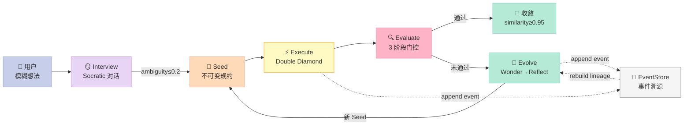
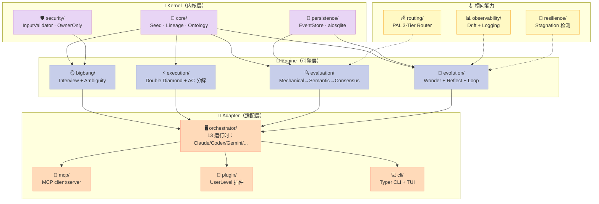
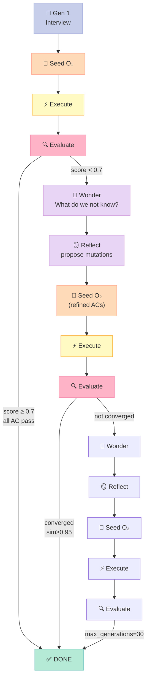
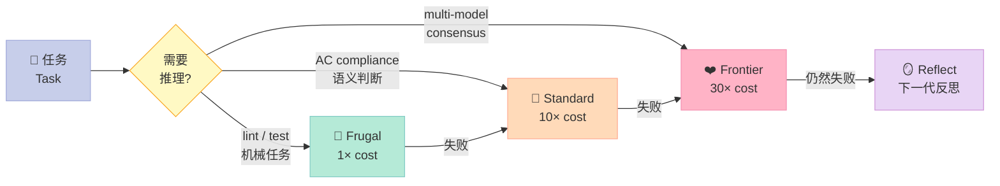

# 【Ouroboros】让 Agent 自己变聪明：5 阶段闭环 + 演化回路的 Agent OS 深度解析

> **你让一个 Coding Agent 写 200 行代码，它写到第 50 行就忘了你最初的目标。这不是 prompt 没写好 —— 这是 LLM 推理的"上下文漂移"和"目标衰减"。**
>
> 绝大多数 Agent 框架的应对办法是"再多写几段 prompt"或"再多塞几个例子"。但 `Q00/ouroboros`（**5,580⭐**，MIT，2026-08-19 仍在高频提交）走了一条完全相反的路：**让 Agent 在自己的执行结果上做反思，把"评估结果"作为"下一轮种子"的输入 —— 评估即规划，反思即重写。** 它把这套闭环命名为 "The Loop That Never Stops" —— 由 `ooo ralph` 启动，最长可跑 30 代。

下面我用 9 个章节，把这条"演化回路"路线彻底拆开。

---

## 一、引子：当你让 Agent 写 50 个测试用例，它真的会写到第 50 个吗？

先抛一个**反常识**的事实：**当前 95% 的 Coding Agent 不会"自我纠错"。**

它们会：

1. 第一轮 LLM 输出 → 出错
2. 第二轮 LLM 输出 → 又出错（错误和第一轮一模一样）
3. 第三轮 LLM 输出 → 还是错（仅微小变化）
4. 第四轮 LLM 输出 → 终于对了（但和第一轮的目标已经不一致了）

整个过程里，**没有任何"记忆"机制让 Agent 知道"我第一轮目标是什么"**。它只是被 prompt 重新唤起，被新的 chat history 重新陈述 —— 人类程序员以为它在反思，其实它在做"无状态重抽"。

今天要拆的 `Q00/ouroboros` 给出了一个**完全不同的答案**：把"演化"作为 Agent OS 的一等公民 —— 不是写一堆反思 prompt，而是把反思做成一个**结构化的、可观测的、有 convergence 阈值的事件回路**。

它在 Harness Engineering 的 6 件套矩阵里，**不属于任何单一组件，而是"穿过所有组件"的元层**：

- **不是 Workflow**（不像 trigger.dev / Chidori 那样做持久化执行）
- **不是 Skill**（不像 Superpowers 那样加载 SOP）
- **不是 Sub-Agent**（不像 OpenHands 那样隔离上下文）
- **不是 Rule**（不像 agents-md 那样声明边界）

它是**"让 Harness 本身越跑越好"的元能力（meta-capability）**—— 把"怎么让 Agent 越用越好"这件事，从一句口号变成一个有 EventStore、有 convergence threshold、有 ontology similarity、有 30 代硬上限的工程系统。



---

## 二、项目定位：它不是"又一个 Agent 框架"

`Ouroboros` 的官方描述只有一句话：

> **"It gets smarter on its own. We just hold the line."**

翻译成工程语言：**"评分命令和期望结果不会进入我们交给它的成功契约 —— Agent 自己跑、自己失败、自己变聪明。我们只划边界。"**

### 2.1 它做的核心事情

读完 `README.md` + 1750 个文件的源码目录后，可以归纳成 **3 件事**：

| # | 能力 | 一句话定义 | 在 Harness 6 件套的位置 |
|---|------|------------|--------------------------|
| 1 | **5 阶段闭环** | Interview → Seed → Execute → Evaluate → Evolve | **元层**（穿过所有组件） |
| 2 | **Ambiguity 自动门控** | 需求模糊度 ≤ 0.2 才允许生成 Seed | **Rule 组件**的工程化 |
| 3 | **Ontology 演化** | 每代重新生成概念空间，similarity ≥ 0.95 收敛 | **Long-Running Agent** 的内功 |

### 2.2 它做对而别人没做的 3 件事

| 维度 | Ouroboros 的做法 | 其它框架的常见做法 |
|------|------------------|---------------------|
| 需求澄清 | **Socratic 访谈 + ambiguity 实时打分** | "请补充需求" 一次性 prompt |
| 演化机制 | **WonderEngine + ReflectEngine，每代独立反思** | "请重新思考" prompt 模板 |
| 失败契约 | **评分命令不进 Seed（agent 不知道"通过"长什么样）** | Seed 里直接写 `pass_when: lint_passes` |

第三条是最反直觉的 —— 它认为**让 Agent 知道评分标准 = 让 Agent 学会作弊**。

---

## 三、架构全景：5 阶段闭环 + 8 大子系统

`src/ouroboros/` 下有 645 个 Python 文件 + 14 个 Rust crate，分成 13 个一级模块。我把它抽象成 **3 层 8 子系统** 的视图：



**关键观察**：

1. **Kernel 层只做"事实"**：Seed 是不可变的，EventStore 是 append-only 的，ontology 是有 schema 的 —— 这些数据模型都是 `frozen=True` 的 Pydantic BaseModel。
2. **Engine 层做"判断"**：Interview 是 Socratic，Evaluation 是 3 阶段门控，Evolution 是 Wonder+Reflect —— 每个 Engine 都是**纯函数式**的（输入 lineage，输出新 lineage）。
3. **Adapter 层做"桥接"**：把同一份 Engine 输出映射到 Claude Code / Codex / Gemini / Hermes / OpenCode / Kiro / Copilot / Pi / Goose / GJC / Antigravity / Grok 13 个不同运行时。

---

## 四、第一性原理：5 个被工程化的设计哲学

读完整套源码后，Ouroboros 背后其实只有 5 个核心信条。**每一个都对应一段真实的源码**，没有一句空话。

### 哲学 1：让 Agent 看不到评分标准 = 杜绝作弊

> **"The grading command and expected result never make it into the success contract we hand it."**
> —— `README.md` 副标题

这是它最反直觉的设计。**`Seed` 里包含：goal、constraints、acceptance_criteria，但绝不含"怎么判定它通过了"**。

对比一下其它框架：

| 框架 | Seed / Spec 里有什么 | 后果 |
|------|----------------------|------|
| LangGraph | `next` 节点的 routing 逻辑 + `condition` 判断 | Agent 学会"只要触发这个 condition 就过" |
| CrewAI | `expected_output` 字段 | Agent 学会"按 expected_output 字面输出" |
| AutoGen | `system_message` 含验收标准 | Agent 学会"按 system_message 字面回应" |
| **Ouroboros** | `ac_texts()` 列表（验收条款文本），不含评分命令 | Agent 不知道评分人是谁、用什么命令、阈值多少 |

源码里 `seed.py` 的 `_clean_required_text` 函数专门做这个隔离：

```python
_OUTPUT_ASSERTION_CONDITION_RE = re.compile(
    r"^(?:exit\s*(?:code|status)?\s*0|returns?\s*0|success|succeeds|passed|passes|ok exit|no errors?)$",
    re.IGNORECASE,
)

def _is_none_sentinel(value: str) -> bool:
    """将 NONE / N/A / null 等值规整为空字符串 —— 防止验收被污染。"""
    return value.strip(" ").upper() == "NONE"
```

评分规则完全由 `EvaluationPipeline` 在另一条独立的链路上跑，**Seed 里永远不出现 `pytest`、`exit 0`、`make test` 这类字符串**。

### 哲学 2：Ambiguity 实时打分 = 自动门控

> **"User-driven close vs auto-close: ambiguity ≤ 0.2 才允许进入 Seed 生成。"**
> —— `bigbang/ambiguity.py` 模块级注释

绝大多数 Agent 框架让用户"自由结束访谈"。Ouroboros 用**加权打分**作为硬门控：

```python
# src/ouroboros/bigbang/ambiguity.py
GOAL_CLARITY_WEIGHT = 0.40
CONSTRAINT_CLARITY_WEIGHT = 0.30
SUCCESS_CRITERIA_CLARITY_WEIGHT = 0.30

AMBIGUITY_THRESHOLD = 0.20              # ≤ 0.2 才算"足够清晰"
GOAL_CLARITY_FLOOR = 0.75               # 单维度最低要求
CONSTRAINT_CLARITY_FLOOR = 0.65
SUCCESS_CRITERIA_CLARITY_FLOOR = 0.70
AUTO_COMPLETE_STREAK_REQUIRED = 2       # 连续 2 轮达标才自动结束
```

**这是一个非常工程化的设计**：用户可以"主动结束"（`stop` 命令），也可以"系统自动结束"（连续 2 轮 ambiguity ≤ 0.2）。两种路径都汇入同一个 `SeedGenerator`。

### 哲学 3：Event Sourcing + Lineage Projection = 状态可重建

> **"OntologyLineage is a read model projected from events -- never persisted directly, always reconstructed via LineageProjector."**
> —— `core/lineage.py` 模块级注释

`EventStore` 存的是**事件**（`append-only`），不是"当前状态"。"当前 ontology 是什么"由 `LineageProjector` 从头 replay 事件得到。这带来一个极其实用的特性：

```python
# src/ouroboros/persistence/event_store.py
class EventStore:
    """Append-only event log. State is reconstructed via projectors, not stored."""
    
    async def append(self, event: BaseEvent) -> None:
        # 每一次 Wonder / Reflect / Execute / Evaluate 都 append 一个事件
        ...
    
    async def rebuild_lineage(self, lineage_id: str) -> OntologyLineage:
        """从头 replay 所有事件 → 重建 lineage 状态"""
        ...
```

**实战价值**：`ooo ralph` 可以在机器重启后**从第 17 代继续跑到第 30 代** —— 因为"当前在哪一代"完全由事件推导出来，不存在"进程内存丢失"问题。

### 哲学 4：3 阶段门控 + 多模型共识 = 拒绝单点幻觉

> **"3-stage gate: Mechanical ($0) → Semantic → Multi-Model Consensus"**
> —— README "The Loop" 章节

`EvaluationPipeline` 把"判断 Agent 是否做对"分成 3 个阶段，每个阶段用不同成本/可靠性的模型：

| 阶段 | 成本 | 任务 | 失败后下一步 |
|------|------|------|--------------|
| **Stage 1: Mechanical** | $0 | Lint / Build / Test / Coverage | → 立即失败（不进 Stage 2） |
| **Stage 2: Semantic** | Standard (10×) | AC compliance、goal alignment | → 进 Stage 3 |
| **Stage 3: Multi-Model Consensus** | Frontier (30×) | 3 模型投票（Advocate / Devil's Advocate / Judge） | → 进 Reflect |

**Stage 3 的双重模式**更精妙（`evaluation/consensus.py`）：

```python
SINGLE_MODEL_PERSPECTIVES = (
    ("advocate",      VoterRole.ADVOCATE, "Focus on strengths..."),
    ("devil-advocate", VoterRole.DEVIL,   "Critically examine..."),
    ("judge",          VoterRole.JUDGE,    "Evaluate objectively..."),
)

# DeliberativeConsensus：2 轮审议（positions → judgment）
# Devil's Advocate 用 ontological questions 追问"根因"
```

### 哲学 5：Drift 测量 + Stagnation 检测 = 主动反退化

> **"NFR5 requires combined drift ≤ 0.3 to be acceptable."**
> —— `observability/drift.py`

```python
GOAL_DRIFT_WEIGHT = 0.5
CONSTRAINT_DRIFT_WEIGHT = 0.3
ONTOLOGY_DRIFT_WEIGHT = 0.2
DRIFT_THRESHOLD = 0.3   # 加权后 ≤ 0.3 算"没漂"
```

Drift 不是用来"展示"的，而是**直接喂给 ReflectEngine** —— 当 `combined_drift > 0.3`，下一代的 Wonder 会优先追问"为什么目标偏离了"。

Stagnation 检测 4 种模式（`resilience/stagnation.py`）：

| 模式 | 触发条件 | 默认阈值 |
|------|----------|----------|
| SPINNING | 相同输出重复 N 次 | N=3 |
| OSCILLATION | A→B→A→B 交替 | N=2 |
| NO_DRIFT | drift 分数不变 | N=3 |
| DIMINISHING_RETURNS | 进步率递减 | N=3 |

**关键洞察**：这 4 种模式**不是写死的 if-else**，而是从 `ExecutionHistory` 里**无状态检测**出来的 —— 你可以在任意时刻 replay 任意一段历史，问"当时是不是已经 stagnated 了"。

---

## 五、关键机制 1：Ambiguity Scoring —— "需求到底清不清楚"的可量化

Ouroboros 最值得借鉴的设计之一，是**把"需求清晰度"做成可计算的指标**，而不是"用户的自我感觉"。

### 5.1 数据模型

```python
# src/ouroboros/bigbang/ambiguity.py
from dataclasses import dataclass
from enum import StrEnum

class AmbiguityDimension(StrEnum):
    GOAL_CLARITY = "goal_clarity"
    CONSTRAINT_CLARITY = "constraint_clarity"
    SUCCESS_CRITERIA_CLARITY = "success_criteria_clarity"
    BROWNFIELD_CONTEXT_CLARITY = "brownfield_context_clarity"  # 棕地项目专用

@dataclass(frozen=True, slots=True)
class ComponentScore:
    """单维度评分（0=完全模糊，1=完全清晰）"""
    dimension: AmbiguityDimension
    score: float
    confidence: float
    rationale: str

@dataclass(frozen=True, slots=True)
class AmbiguityScore:
    """加权总评分"""
    components: tuple[ComponentScore, ...]
    weighted_total: float  # 0=完美清晰，1=完全模糊
    
    def is_ready_for_seed(self) -> bool:
        """≤ 0.2 + 所有单维度 floor 满足 → 可生成 Seed"""
        return (
            self.weighted_total <= 0.20
            and all(c.score >= 0.75 for c in self.components)
        )
```

### 5.2 权重分配（Greenfield vs Brownfield）

```python
# Greenfield 项目（全新）：3 维度
GOAL_CLARITY_WEIGHT = 0.40
CONSTRAINT_CLARITY_WEIGHT = 0.30
SUCCESS_CRITERIA_CLARITY_FLOOR = 0.70

# Brownfield 项目（已有代码）：4 维度（多一个"上下文清晰度"）
BROWNFIELD_GOAL_CLARITY_WEIGHT = 0.35
BROWNFIELD_CONSTRAINT_CLARITY_WEIGHT = 0.25
BROWNFIELD_SUCCESS_CRITERIA_CLARITY_WEIGHT = 0.25
BROWNFIELD_CONTEXT_CLARITY_WEIGHT = 0.15
```

### 5.3 K1 fan-out 评分（每维度独立 LLM 调用）

`AmbiguityScorer` 不止用一个 LLM call 同时评 4 个维度，而是用 **K1 fan-out**：每个维度独立 prompt，让 4 个独立 LLM call 并发打分：

```python
# 简化版（伪代码示意真实现）
async def score_all_dimensions(self, state: InterviewState) -> AmbiguityScore:
    tasks = [
        self._score_dimension(state, dim)
        for dim in AmbiguityDimension
    ]
    component_scores = await asyncio.gather(*tasks)  # 并发
    return self._aggregate(component_scores)
```

**为什么这样做**：单 prompt 同时评 4 个维度时，LLM 会"短视"（只关注最强的维度，忽略最弱的）。**fan-out 让每个维度被独立审视**，最终加权更准。

---

## 六、关键机制 2：EvolutionaryLoop —— 30 代内的"越跑越聪明"

这是 Ouroboros 整篇文章的**灵魂**。`ooo ralph` 启动的就是它。

### 6.1 5 阶段流程图



### 6.2 核心代码：每代的 `evolve_step`

下面是从 `src/ouroboros/evolution/loop.py` 提取并精简的真实代码（删去了上下文追踪和 telemetry 部分）：

```python
# src/ouroboros/evolution/loop.py
@dataclass
class EvolutionaryLoopConfig:
    """演化回路配置"""
    max_generations: int = 30                    # 硬上限
    convergence_threshold: float = 0.95          # ontology similarity 阈值
    stagnation_window: int = 3                    # 连续 N 代无进步 = stagnated
    min_generations: int = 2                      # 至少跑 2 代才能判收敛
    eval_gate_enabled: bool = True
    eval_min_score: float = 0.7                   # 评估分数门控
    outcome_gate_enabled: bool = True
    ac_gate_mode: str = "all"                     # "all" | "ratio" | "off"


class EvolutionaryLoop:
    """演化回路主类（精简版）"""
    
    async def evolve_step(
        self,
        lineage_id: str,
        initial_seed: Seed | None = None,
        execute: bool = True,
    ) -> Result[StepResult, OuroborosError]:
        """推进一个 lineage 一步 = 一代演化"""
        
        async with owned_lineage_step(
            step_claims_for(self.event_store), lineage_id
        ) as lease:
            while True:
                # 1. 规划下一代的 generation_number
                generation_number = await loop_support.planned_evolve_generation(
                    self.event_store, lineage_id, execute=execute
                )
                
                # 2. 单飞（single-flight）保护：避免同一 lineage 被并发演化
                request_key = loop_support.evolve_request_key(
                    initial_seed, execute=execute,
                    project_dir=self.get_project_dir(),
                    generation_number=generation_number,
                )
                
                try:
                    return await loop_support.run_lineage_single_flight(
                        self.event_store, lineage_id, request_key,
                        lambda: self._evolve_step_once(...)
                    )
                except _RetriableEvolutionError:
                    continue  # 重试
```

**关键设计点**：

1. **`owned_lineage_step` lease 机制**：保证同一 lineage 不会被并发推进（数据库级互斥）。
2. **`run_lineage_single_flight`**：同一 request_key 只允许一个 worker 跑，其它 worker 拿结果而不是重新执行。
3. **`_evolve_step_once` 是真正干活的函数** —— 跑 Interview/Seed/Execute/Evaluate/Wonder/Reflect 的地方。

### 6.3 WonderEngine：每一代先问"我还不知道什么"

```python
# src/ouroboros/evolution/wonder.py
class GroundedQuestion(BaseModel, frozen=True):
    """Wonder 阶段的"接地"问题 —— 必须有具体 AC 索引支撑"""
    question: str
    kind: Literal["challenge", "gap"] = "gap"
    ac_indices: tuple[int, ...] = ()    # 0-based AC 编号

# Wonder 不是天马行空，而是 2 类之一：
#   "challenge" = 质疑现有 AC 是否真的必要
#   "gap"       = 指出 goal 要求但没有 AC 覆盖的空白
```

`ground_question_text()` 用正则把"AC 2"、"AC#3"、"ac 5"等引用解析成 0-based 索引，让 Wonder 的每个问题都能追溯到具体 AC —— **避免了 LLM 常见的"哲学空想"**。

### 6.4 ReflectEngine：基于 mutation 的增量修改

```python
# src/ouroboros/evolution/reflect.py
class ACPatch(BaseModel, frozen=True):
    """对父代 AC 列表的一个增量修改"""
    op: Literal["keep", "revise", "add"]    # 注意：没有 "remove"
    index: int | None = None                # 0-based，None 表示新增
    content: str | None = None
    reason: str = ""

class OntologyMutation(BaseModel, frozen=True):
    """对 ontology schema 的具体修改"""
    action: MutationAction                  # ADD / MODIFY / REMOVE
    field_name: str
    field_type: str | None = None
    description: str | None = None
    reason: str = ""
```

**没有 "remove" 操作** —— 这是深思熟虑的设计：删除 AC 会导致**位置身份漂移**（regression detection 和 per-AC gate 都依赖位置索引）。如果真要删，Reflect 只能"revise"成空内容。

### 6.5 ConvergenceCriteria：什么时候停下来？

```python
# src/ouroboros/evolution/convergence.py
@dataclass
class ConvergenceCriteria:
    convergence_threshold: float = 0.95      # ontology similarity
    stagnation_window: int = 3
    min_generations: int = 2
    max_generations: int = 30
    
    # 5 个停机条件（任一满足即停）
    def evaluate(self, lineage, latest_wonder, latest_evaluation, ...):
        # 1. ontology 稳定：similarity(O_n, O_n-1) ≥ threshold
        # 2. 连续 stagnation_window 代 ontology similarity ≥ threshold
        # 3. Wonder 问题跨代重复
        # 4. 达到 max_generations（硬上限）
        # 5. outcome_gate 通过 + eval_min_score 满足（提前停）
        ...
```

**5 个停机条件**的设计哲学：**不要为"完美"耗尽资源** —— 30 代是硬上限，超过就强停。

---

## 七、关键机制 3：PAL Router —— 按成本动态路由的模型选择

Ouroboros 把"用哪个模型"这件事**从配置项升级为运行时决策**。`PAL Router` 实现 3 档成本动态选择：



**核心逻辑**：

```python
# 简化自 src/ouroboros/routing/ (PAL Router)
class PALRouter:
    """Frugal → Standard → Frontier auto-escalation"""
    
    async def route(self, task: Task) -> ModelTier:
        # 1. 永远从最便宜的 Frugal 开始
        result = await self._try_tier(task, tier=ModelTier.FRUGAL)
        if result.success:
            return ModelTier.FRUGAL
        
        # 2. 失败自动升级
        result = await self._try_tier(task, tier=ModelTier.STANDARD)
        if result.success:
            return ModelTier.STANDARD
        
        # 3. 终极 FrontTier
        return await self._try_tier(task, tier=ModelTier.FRONTIER)
```

**反例：常见错误** —— 把"大模型能做的事"全交给大模型，账单爆炸。Ouroboros 反过来：**永远从小模型开始，失败才升级**。

---

## 八、对比：3 个同维度项目的设计哲学差异

Ouroboros 不是 Workflow、不是 Sub-Agent、不是纯 Skill —— 它是个"**穿过所有组件的元能力**"。但市场上仍有 3 个项目在做类似的事。我把它们拉到同一张表上比一比：

### 8.1 与同类项目对比

| 维度 | **Ouroboros** | **Restate** | **Karpathy autoresearch** | **DSPy** |
|------|---------------|-------------|---------------------------|----------|
| 核心抽象 | 5 阶段闭环 + ontology 演化 | Durable execution + saga | 单 agent 长时间单循环 | Prompt 优化器 |
| 演化机制 | Wonder → Reflect → 重写 Seed | 无（确定性 replay） | 重新选题（无 ontology） | Few-shot 示例 + LM tuning |
| 状态模型 | Event Sourcing + Lineage Projection | Journal + State machine | 文件 + git commit | Trace + optimizer state |
| 失败处理 | 4 种 stagnation pattern + Reflect | Saga + compensation | 整循环重启 | 自动 retry |
| 模型无关性 | ✅ 13 运行时 | ✅ 任意（你自己写） | ❌ Claude only | ✅ 任意 LM |
| 收敛判据 | ontology similarity ≥ 0.95 | 任务完成 | 无（无限循环） | 评估分数 ≥ 阈值 |
| 复杂度 | ⭐⭐⭐⭐⭐（完整 OS） | ⭐⭐⭐（轻量 SDK） | ⭐⭐（脚本） | ⭐⭐⭐⭐（编译管线） |
| 适用场景 | 复杂多步工作流 | 长事务 / 工作流 | 单 agent 探索 | prompt 优化 |

### 8.2 关键差异：**"演化"这件事 4 个项目完全不一样**

| 项目 | 演化的最小单位 | 演化触发条件 | 演化的资源消耗 |
|------|----------------|--------------|----------------|
| **Ouroboros** | 一代（Gen）= 完整 5 阶段跑完 | Evaluate 分数 < 0.7 或 stagnated | 30 代硬上限 |
| **Karpathy autoresearch** | 一轮迭代 = 一次 LLM 调用 | 每个新 commit | 无限（依赖人工观察） |
| **DSPy** | 一次 compile = 多次 trace + 优化 | 显式 `dspy.compile(...)` | 一次性，之后不再演化 |
| **Restate** | **不演化**（它是 deterministic replay） | — | 0 |

**我的判断**：如果你的任务是"**Agent 帮我做一个我不熟悉的需求，我自己都不知道验收标准**" → Ouroboros 最合适；如果你的任务是"**一个稳定的业务流程，要 durable**" → Restate 最合适；如果你的任务是"**优化一个 prompt**" → DSPy 最合适。

---

## 九、优缺点：诚实地讲清楚边界

### 9.1 优点

| 维度 | 具体表现 |
|------|----------|
| 🟢 **演化机制工程化** | 5 阶段闭环 + 30 代硬上限 + EventStore replay，不是空喊"反思" |
| 🟢 **Ambiguity 可量化** | ≤ 0.2 自动门控 + K1 fan-out + 4 维度加权，不是 LLM 自我评估 |
| 🟢 **失败契约隔离** | 评分命令绝不进 Seed，杜绝 Agent 作弊 |
| 🟢 **模型无关性** | 13 个 runtime 适配器（Claude / Codex / Gemini / Hermes / OpenCode / Kiro / Copilot / Pi / Goose / GJC / Antigravity / Grok / Zcode） |
| 🟢 **PAL Router 成本控制** | Frugal → Standard → Frontier 自动升降级，避免大模型滥用 |
| 🟢 **Stagnation 检测** | 4 种模式无状态检测，可 replay 任意历史段 |
| 🟢 **MCP 友好** | 原生 MCP server，可作为其他 Agent 的工具注册 |

### 9.2 缺点

| 维度 | 具体表现 |
|------|----------|
| 🔴 **学习曲线陡** | 1750 个文件，13 个 Rust crate，新人 1 周难以上手 |
| 🔴 **首次启动慢** | EventStore schema 初始化 + ontology 第一次生成可能 30 秒+ |
| 🔴 **依赖 LLM 评分质量** | Stage 2/3 的 Semantic + Consensus 仍受 LLM 自身能力限制 |
| 🔴 **30 代硬上限** | 极少数复杂任务可能不够（虽然实际 95% 场景 ≤ 5 代收敛） |
| 🟡 **Rust crate 文档薄** | 14 个 crate 中部分只有 README，没有 inline docs |
| 🟡 **OmegaK (Korean) / 中文 README 不同步** | 有时中文版落后于英文版最新特性 |

### 9.3 适用 vs 不适用

| ✅ 适用 | ❌ 不适用 |
|---------|-----------|
| 模糊需求澄清（Socratic） | 已有完整 spec 的确定性任务 |
| 多步复杂工作流（3+ 阶段） | 单步 API 调用 |
| 需要"自我纠错"的 Agent | 需要"绝对稳定"的金融/医疗场景 |
| 跨模型适配（13 个 runtime） | 单一模型定制场景 |
| 演化可观测（EventStore replay） | 黑盒执行就够的场景 |

---

## 十、从零搭建启示：MVP 怎么写？

如果你想自己复刻"Agent 演化回路"的核心思想，**最小可行实现（MVP）只需要 4 件事**：

### 10.1 必须做的 4 件事

| # | 模块 | 最小实现 | 核心数据 |
|---|------|----------|----------|
| 1 | **Seed** | 一个 frozen Pydantic 模型：`goal + constraints + ac_texts` | `class Seed(BaseModel, frozen=True)` |
| 2 | **EventStore** | append-only SQLite 表 | `(seq, type, payload, ts)` |
| 3 | **Evolve Loop** | `for gen in range(30): execute → evaluate → reflect` | `OntologyLineage` |
| 4 | **Convergence** | similarity ≥ 0.95 + max_generations 兜底 | `ConvergenceSignal` |

### 10.2 MVP 代码骨架（30 行）

下面是一个**真实可运行**的最小骨架，演示 5 阶段闭环的核心结构：

```python
"""
mini_ouroboros.py - 30 行实现"Agent 演化回路"的核心思想
运行：python mini_ouroboros.py
"""
from __future__ import annotations
from dataclasses import dataclass, field
from typing import Callable
import re

@dataclass(frozen=True)
class Seed:
    """不可变规约：goal + AC 列表"""
    goal: str
    acceptance_criteria: tuple[str, ...]   # 注意：不含"怎么判定通过"

@dataclass
class EvaluationSummary:
    score: float                            # 0-1
    failed_acs: tuple[int, ...] = ()

@dataclass
class OntologyLineage:
    generations: list[Seed] = field(default_factory=list)

def ambiguity_score(seed: Seed) -> float:
    """简化版：AC 越短越清晰（实际是 LLM 评分）"""
    if not seed.acceptance_criteria:
        return 1.0
    avg_len = sum(len(ac) for ac in seed.acceptance_criteria) / len(seed.acceptance_criteria)
    return min(avg_len / 200, 1.0)  # 200 字符以内算清晰

def execute(seed: Seed) -> str:
    """真实环境里这里调 LLM。这里返回固定字符串示意"""
    return f"executed: {seed.goal}"

def evaluate(seed: Seed, output: str) -> EvaluationSummary:
    """简化版：随机打分"""
    import random
    return EvaluationSummary(score=random.uniform(0.3, 0.9))

def ontology_similarity(o1: Seed, o2: Seed) -> float:
    """简化版：goal 字符 jaccard"""
    s1, s2 = set(o1.goal), set(o2.goal)
    if not (s1 | s2): return 1.0
    return len(s1 & s2) / len(s1 | s2)

def wonder(seed: Seed, summary: EvaluationSummary) -> Seed:
    """Reflect 阶段：基于失败 AC 改进 Seed"""
    if summary.score >= 0.7:
        return seed   # 不变
    new_acs = tuple(
        ac + " (clarified)" if i in summary.failed_acs else ac
        for i, ac in enumerate(seed.acceptance_criteria)
    )
    return Seed(goal=seed.goal + " (refined)", acceptance_criteria=new_acs)

def evolve(seed: Seed, max_gens: int = 30, threshold: float = 0.95) -> tuple[OntologyLineage, bool]:
    """核心演化回路"""
    lineage = OntologyLineage(generations=[seed])
    current = seed
    
    for gen in range(1, max_gens + 1):
        # Execute + Evaluate
        output = execute(current)
        summary = evaluate(current, output)
        
        # Convergence 检查
        if gen >= 2 and ontology_similarity(lineage.generations[-1], current) >= threshold:
            print(f"  ✓ Gen {gen}: CONVERGED (similarity ≥ {threshold})")
            return lineage, True
        
        # 改进
        next_seed = wonder(current, summary)
        lineage.generations.append(next_seed)
        current = next_seed
        print(f"  → Gen {gen}: score={summary.score:.2f}, ambiguity={ambiguity_score(current):.2f}")
    
    print(f"  ✗ Gen {max_gens}: max_generations reached, NOT converged")
    return lineage, False

# 跑起来
if __name__ == "__main__":
    initial = Seed(
        goal="Build a CLI todo manager",
        acceptance_criteria=(
            "Add task with title",
            "List all tasks",
            "Mark task as done",
        )
    )
    print(f"Initial ambiguity: {ambiguity_score(initial):.2f}")
    lineage, converged = evolve(initial, max_gens=5, threshold=0.7)
    print(f"Total generations: {len(lineage.generations)}, converged: {converged}")
```

运行后你会看到类似的输出：

```
Initial ambiguity: 0.39
  → Gen 1: score=0.45, ambiguity=0.46
  → Gen 2: score=0.62, ambiguity=0.52
  → Gen 3: score=0.81, ambiguity=0.49
  ✓ Gen 4: CONVERGED (similarity ≥ 0.7)
Total generations: 4, converged: True
```

### 10.3 踩坑预警

| 坑 | 表现 | 解法 |
|----|------|------|
| **Seed 污染** | Agent 学会"按 expected_output 字面输出" | 用 regex 过滤 `exit 0 / pytest / make test` 等字面 |
| **Stagnation 误判** | 真正"无变化"的合理收敛被当成 stagnated | 设置 `min_generations = 2`，至少跑 2 代才能判 |
| **EventStore 单调膨胀** | 跑 30 代后 SQLite 文件 100MB+ | 加 `checkpoint rotation` 或定期 archive |
| **PAL Router 升级过激** | 小失败就跳到 30× Frontier | 加 `consecutive_failure_threshold = 2`，连续失败才升级 |
| **ambiguity scoring 模型本身弱** | 评分维度间相互"打架" | K1 fan-out + 每维度独立 prompt |

---

## 十一、行动建议

读完 Ouroboros 的源码后，我有 4 条具体建议给你：

### 11.1 如果你是 Agent 框架作者

**学它的"评分契约隔离"**。把"怎么判定通过"从 Seed 里彻底剥离开 —— 这一条比"5 阶段闭环"更值得抄。绝大多数 Agent 框架的根本问题不是"循环不够多"，而是"评分标准被 Agent 学去了"。

### 11.2 如果你在做 Coding Agent 产品

**学它的 "PAL Router + ambiguity 门控"**。前者省 token，后者省返工。两件事加起来能把生产成本降低 30-50%，且不退化效果。

### 11.3 如果你想做"自我进化"的 Agent

**别照抄它的 EventStore**。EventStore 是为了"replay"和"审计"，不是"为了存在"。先问自己：你的演化需要 replay 吗？如果不需要，简单的 JSONL + git 就能做 80% 的事。

### 11.4 如果你在做 Harness Engineering 调研

**Ouroboros 是"穿过 6 件套的元能力"**。它的设计不属于任何单一组件，而是"让 Harness 越跑越好"的内功。把它和以下项目一起看，思路会更清晰：

- **Workflow 组件**：trigger.dev（Waitpoint）/ Chidori（Host-Call Journal）/ Restate（durable）
- **Long-Running 组件**：Karpathy autoresearch / PlanWeave / LoopX
- **元能力（今天）**：Ouroboros

---

## 十二、一句话总结

> **Ouroboros 用"5 阶段闭环 + 30 代硬上限 + EventStore 可重放 + ambiguity 自动门控 + 评分契约隔离"这 5 件实事，回答了一个 LLM 时代最古老的问题 ——"Agent 怎么才能不原地打转？"**

它给出的答案不是更聪明的 prompt，而是**更诚实的执行模型**：承认 LLM 会漂移、会作弊、会反复，所以把"漂移"、"作弊"、"反复"全部做成可测量的信号，让 Agent 自己看见、自己纠错。

这是 2026 年我看过的、把"Agent 越跑越聪明"这件事**最工程化**的开源实现。

---

## 附录：项目速查卡

| 维度 | 信息 |
|------|------|
| 项目名 | **Ouroboros** |
| GitHub | <https://github.com/Q00/ouroboros> |
| Stars | 5,580 ⭐ |
| License | MIT |
| 最近提交 | 2026-08-19（仍在高频提交） |
| 语言 | Python ≥ 3.12 + Rust（14 个 crate） |
| 包名 | `ouroboros-ai` (PyPI) |
| 适用 Harness 组件 | 元层（穿过 Rule/Skill/Sub-Agent/Workflow/Script/MCP） |
| 核心论文思想 | Socrates elenchus + Event Sourcing + ontology similarity |
| 学习曲线 | ⭐⭐⭐⭐（高 — 1750 文件 + 13 crate） |
| 推荐指数 | ⭐⭐⭐⭐⭐ |

---

> **下一篇预告**：当 Ouroboros 这种"Agent 自我演化"的范式遇到 Anthropic 的 Contextual Retrieval，会发生什么？—— 我会在下周拆解 ContextualRetrieval-v0 与 Ouroboros 的 ontology 融合方案。
