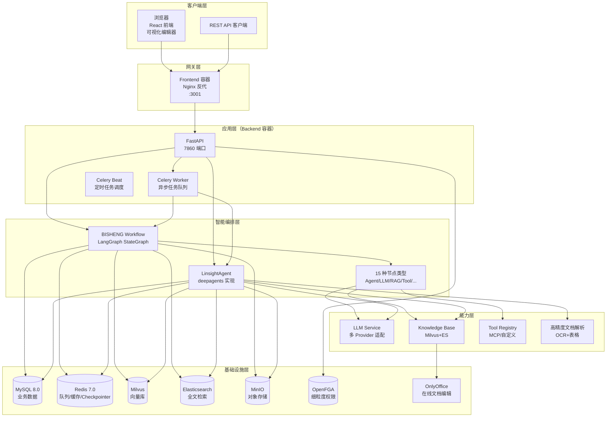
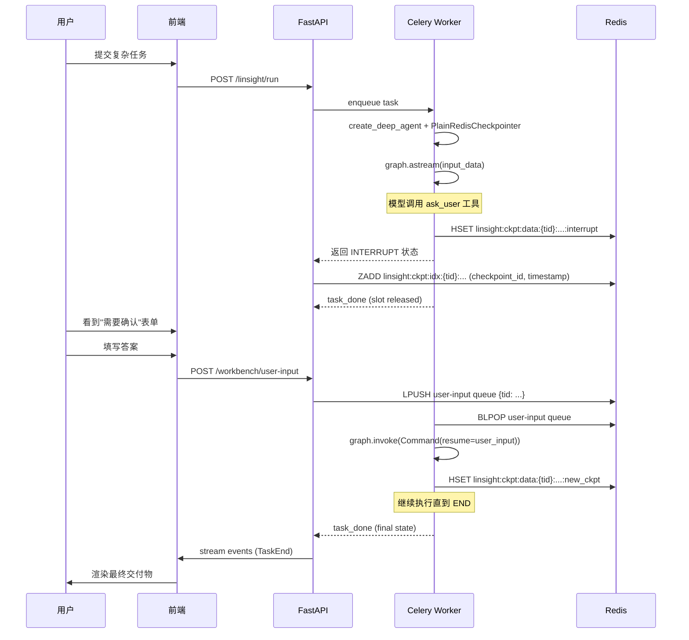
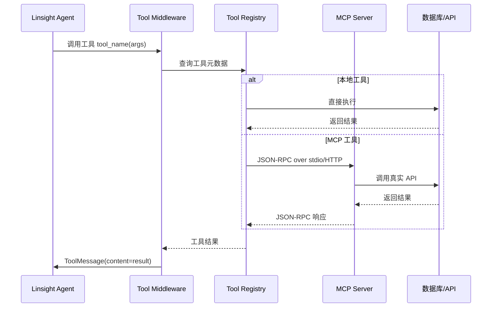
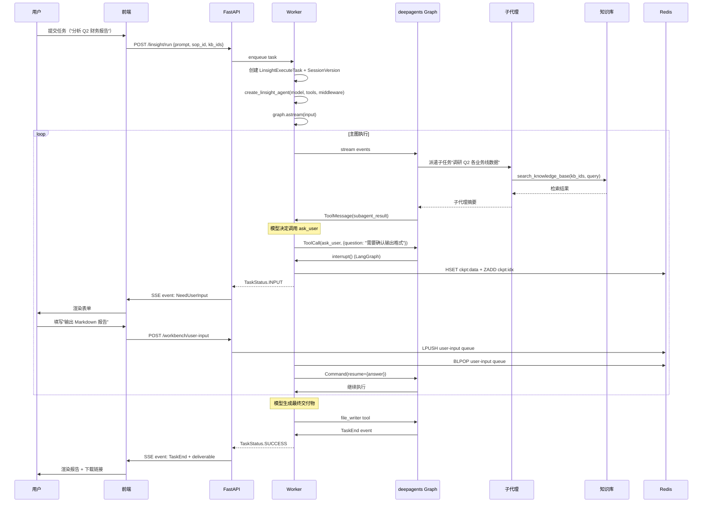

## 引子

2024 年起，AI 应用开发进入了"平台化"阶段。从 LangChain 到 LangFlow，从 Dify 到 Coze，开源社区涌现了一批 LLM 应用编排平台。但其中大部分要么止步于"玩具级 ChatFlow"，要么绑定单一云厂商。直到 **BISHENG**（毕昇）的出现——这个由 dataelement 团队主导、命名致敬活字印刷术发明者"毕昇"的 Apache-2.0 开源项目，已被大量世界 500 强企业用于生产环境，并在 GitHub 累计获得 **11.9k+ ⭐**。

BISHENG 之所以能在企业级场景站稳脚跟，源于它**完全自自**的四大核心抽象：

1. **BISHENG Workflow**——基于 LangGraph 构建的 DAG 工作流引擎，**15 种节点类型**（Agent / Code / Condition / Input / Output / KnowledgeRetriever / LLM / QARetriever / RAG / Report / Start / Tool 等），**首创可视化循环 / 并行 / 批处理**（拖拽即语义）
2. **Linsight Agent**——基于 LangChain **deepagents** 构建的通用 Agent，**首创"主智能体 + 研究员子代理"双层架构**（子代理工具白名单隔离 + HITL 工具根图专属）
3. **AGL（Agent Guidance Language）**——**首创 SOP 风格的 Agent 指令语言**，让领域专家用"写说明书"的方式编写 Agent 任务（独立于 BISHENG，遵循 MIT 协议）
4. **PlainRedisCheckpointer**——基于标准 Redis（无 RediSearch 依赖）的 LangGraph Checkpoint Saver，**解决企业部署中无法引入 Redis Stack 的痛点**

本文将围绕这四大抽象展开，结合生产源码（`graph_engine.py` / `task_exec.py` / `agent_factory.py` / `checkpointer.py`）深度解读 BISHENG 的工程哲学。

## 项目定位与核心价值

**一句话定义**：BISHENG 是面向**企业场景**的开源 LLM 应用 DevOps 平台，提供从工作流编排、智能体构建、知识库治理到模型微调的端到端能力。

**能力矩阵**：

| 维度 | 能力 | 差异化 |
|------|------|--------|
| 工作流编排 | 拖拽式 DAG（循环/并行/批处理/条件） | **首创"画圈=循环、对齐=并行、框选=批处理"** |
| 智能体 | Linsight 通用 Agent（deepagents 实现） | 主图 + 子代理双层架构 + 工具黑名单隔离 |
| 指令语言 | AGL（Agent Guidance Language） | SOP 思维 + 强制字段保证清晰度 |
| 知识库 | 高精度文档解析 + Milvus/ES 双库 | 自研 5 年训练的 OCR / 表格 / 手写识别 |
| 权限 | OpenFGA 细粒度授权 | Google 开源，支持租户/用户组/资源级权限 |
| 部署 | 一键 Docker Compose（11 容器） | 自带 SSO/LDAP、监控、漏洞扫描 |
| 持久化 | PlainRedisCheckpointer | **纯 Redis 6+**，无需 Redis Stack |
| 人机协作 | 多轮对话式暂停/恢复 | 工作流任意节点 Input/Output 中断 |

**仓库统计**：

| 字段 | 值 |
|------|-----|
| 仓库 | `dataelement/bisheng` |
| ⭐ Stars | **11,900+** |
| 主语言 | Python 100% |
| License | Apache-2.0 |
| 最近推送 | 2026-08-20（持续活跃） |
| 体积 | 200.8 MB（含前端 + 后端 + 多容器镜像） |
| 主页 | http://www.bisheng.ai |
| 文档 | https://dataelem.feishu.cn/wiki/ZxW6wZyAJicX4WkG0NqcWsbynde |

## 整体架构

BISHENG 采用**经典前后端分离 + 多 Worker** 的企业级架构：



**关键设计哲学**：
- **工作流和 Agent 是两条独立产品线**：工作流（Workflow）面向"流程图式可预期编排"，Agent（Linsight）面向"开放式目标驱动"。两者都基于 LangGraph，但抽象层级不同
- **Checkpointer 统一持久化**：工作流的暂停/恢复 + Agent 的中断/恢复，都依赖 LangGraph 的 Checkpoint 抽象
- **OpenFGA 而非 Casbin**：选择 Google 开源的 OpenFGA 而非传统 RBAC 框架，因为模型可表达任意关系图（用户 → 角色 → 资源 → 权限）

## 后端服务拆分

BISHENG 的 Docker Compose 编排了 **11 个容器**，覆盖数据库 / 向量库 / 权限 / 文档编辑全栈：

```yaml
# 来自 docker/docker-compose.yml:1-80
services:
  mysql:                  # MySQL 8.0 — 业务数据 + OpenFGA store
    image: mysql:8.0
  openfga-migrate:        # OpenFGA 数据库迁移（一次性）
  openfga:                # Google OpenFGA — 细粒度授权
    image: openfga/openfga:latest
  redis:                  # Redis 7.0 — Celery broker + Checkpointer
    image: redis:7.0.4
  elasticsearch:          # 全文检索
  milvus:                 # 向量数据库
  minio:                  # 对象存储（S3 兼容）
  onlyoffice:             # 在线文档协作
  backend:                # FastAPI 主服务（:7860）
    image: dataelement/bisheng-backend:v2.6.0-fix2
    command: sh entrypoint.sh api
  backend_worker:         # Celery 异步 Worker
    command: sh entrypoint.sh worker
  frontend:               # React 前端（:3001）
    image: dataelement/bisheng-frontend:v2.6.0-fix2
```

**为什么 backend 和 worker 是同一个镜像？**
BISHENG 把"API 服务"和"异步任务执行"分到两个容器（避免长任务阻塞 API），但代码层共享同一套 `src/backend/bisheng/` 源码。`entrypoint.sh api` 启动 FastAPI，`entrypoint.sh worker` 启动 Celery Worker，二者通过 Redis 队列通信。

## 核心引擎一：BISHENG Workflow 引擎

工作流引擎是 BISHENG 区别于普通 ChatFlow 工具的核心。它**把 LangGraph 当作底层状态机**，在上面构建了 15 种自定义节点类型 + 可视化循环/并行/批处理语义。

### 节点注册表

```python
# 来自 src/backend/bisheng/workflow/nodes/node_manage.py:1-43
from bisheng.workflow.common.node import NodeType
from bisheng.workflow.nodes.agent.agent import AgentNode
from bisheng.workflow.nodes.code.code import CodeNode
from bisheng.workflow.nodes.condition.condition import ConditionNode
from bisheng.workflow.nodes.end.end import EndNode
from bisheng.workflow.nodes.input.input import InputNode
from bisheng.workflow.nodes.knowledge_retriever.knowledge_retriever import KnowledgeRetriever
from bisheng.workflow.nodes.llm.llm import LLMNode
from bisheng.workflow.nodes.output.output import OutputNode
from bisheng.workflow.nodes.qa_retriever.qa_retriever import QARetrieverNode
from bisheng.workflow.nodes.rag.rag import RagNode
from bisheng.workflow.nodes.report.report import ReportNode
from bisheng.workflow.nodes.start.start import StartNode
from bisheng.workflow.nodes.tool.tool import ToolNode

NODE_CLASS_MAP = {
    NodeType.START.value: StartNode,
    NodeType.END.value: EndNode,
    NodeType.INPUT.value: InputNode,
    NodeType.OUTPUT.value: OutputNode,
    NodeType.TOOL.value: ToolNode,
    NodeType.RAG.value: RagNode,
    NodeType.REPORT.value: ReportNode,
    NodeType.QA_RETRIEVER.value: QARetrieverNode,
    NodeType.CONDITION.value: ConditionNode,
    NodeType.AGENT.value: AgentNode,
    NodeType.CODE.value: CodeNode,
    NodeType.LLM.value: LLMNode,
    NodeType.KNOWLEDGE_RETRIEVER.value: KnowledgeRetriever,
}


class NodeFactory:
    @classmethod
    def get_node_class(cls, node_type: str) -> 'BaseNode':
        return NODE_CLASS_MAP.get(node_type)

    @classmethod
    def instance_node(cls, node_type: str, **kwargs) -> 'BaseNode':
        node_class = cls.get_node_class(node_type)
        if node_class is None:
            raise Exception(f'Unknown node type:{node_type}')
        return node_class(**kwargs)
```

### GraphEngine：LangGraph 状态机构建

```python
# 来自 src/backend/bisheng/workflow/graph/graph_engine.py:27-90（简化）
class GraphEngine:
    def __init__(self, user_id, workflow_id, workflow_name, workflow_data,
                 async_mode=False, max_steps=0, callback=None,
                 tenant_id=None, flow_user_id=None):
        # ... 省略字段初始化 ...
        self.nodes_map = {}           # node_id: NodeInstance
        self.nodes_fan_in = {}        # node_id: [node_ids]  入度节点列表
        self.nodes_next_nodes = {}    # node_id: {node_ids}  出度节点集合
        self.node_level = {}          # 拓扑层级（最长路径）
        self.condition_nodes = []     # 互斥节点（条件 + 输出）

        self.edges = None
        self.graph_state = GraphState()

        # 关键：用 LangGraph StateGraph 作为底层执行引擎
        self.graph_builder = StateGraph(TempState)
        self.graph = None
        self.graph_config = {"configurable": {"thread_id": "1"}, "recursion_limit": 50}

        self.status = WorkflowStatus.RUNNING.value
        self.reason = ""

        self.build_edges()
        self.build_nodes()
```

**设计亮点**：
- **`temp_state`**：仅 `flag: bool` 字段的 TypedDict，因为 BISHENG 的真实状态保存在 `GraphState`（自定义全局状态管理器），LangGraph 只负责**节点调度和边触发**
- **`recursion_limit: 50`**：硬编码最大递归深度，防止工作流死循环
- **`build_edges + build_nodes`**：分两步构建 LangGraph，符合 LangGraph 的"先注册节点再注册边"API 契约

### 可视化循环/并行/批处理

BISHENG 的杀手锏特性是**用可视化方式表达原本需要编程的复杂逻辑**。README 中描述：

> Operations like loops, parallelism, and batch processing, which require specialized components in similar products, can be easily visualized in BISHENG as a "flowchart" (drawing a loop forms a loop, aligning elements creates parallelism, and selecting multiple items enables batch processing).

这背后是 BISHENG 对**前端编辑器协议**的特殊设计：

```python
# 来自 src/backend/bisheng/workflow/edges/edges.py:1-30（简化）
class EdgeBase(BaseModel):
    """边基类——前端可视化协议"""
    id: str = Field(..., description="Unique id for edge")
    source: str          # 源节点 id
    sourceHandle: str    # 源节点的"出口句柄"
    sourceType: Optional[str] = ""
    target: str          # 目标节点 id
    targetHandle: str    # 目标节点的"入口句柄"
    targetType: Optional[str] = ""


class EdgeManage:
    """边的注册表 + 路由查询"""
    def __init__(self, edges: List[Any]):
        self.edges = [EdgeBase(**one) for one in edges]
        self.source_map = {}  # source: [edges]
        self.target_map = {}  # target: [edges]
        for one in self.edges:
            self.source_map.setdefault(one.source, []).append(one)
            self.target_map.setdefault(one.target, []).append(one)
```

**前端画布的视觉约定**：
- **画一个圆环（首尾相连）= 循环**：前端把环拆成"入口边 + 出口边"，后端用 `sourceHandle` 区分
- **节点对齐排列 = 并行**：所有节点共享一个上游节点，BISHENG 后端通过 `nodes_fan_in` 自动识别并并行执行
- **框选多个节点 = 批处理**：前端在 `sourceHandle` 加 `batch` 标记，后端遍历数组输入

### Fan-In 协调：等待所有前置节点

工作流执行中，**多入度节点**（fan-in）需要等所有上游节点完成才能执行。BISHENG 的实现：

```python
# 来自 src/backend/bisheng/workflow/graph/graph_engine.py:97-115（简化）
def build_more_fan_in_node(self):
    """补全 fan-in 节点的入边"""
    for node_id, source_ids in self.nodes_fan_in.items():
        if not source_ids or len(source_ids) <= 1:
            continue
        wait_nodes, no_wait_nodes = self.parse_fan_in_node(node_id)
        logger.debug(f"node {node_id} wait nodes {wait_nodes}, no wait nodes {no_wait_nodes}")
        if wait_nodes:
            self.graph_builder.add_edge(wait_nodes, node_id)
        if no_wait_nodes:
            for one in no_wait_nodes:
                self.graph_builder.add_edge(one, node_id)

def parse_fan_in_node(self, node_id: str):
    """判断哪些上游需要等待（按拓扑层级）"""
    source_ids = self.nodes_fan_in.get(node_id)
    # 比较所有上游节点的拓扑层级与本节点的层级
    # 同级或低级的不需要等待（边已经声明）
    # 比本节点层级更高的需要显式 wait
    # ... 省略 ...
    return wait_nodes, no_wait_nodes
```

**为什么需要显式 `add_edge(wait_nodes, node_id)`？**
LangGraph 本身支持 `add_edge(list_of_nodes, target)` 来声明"等待列表全部完成才执行"。BISHENG 通过 `parse_fan_in_node` 智能判断哪些上游真的需要等待（避免无意义的"等待已完成的节点"）。

### 暂停/恢复：HITL 人机协作

工作流的暂停/恢复是 BISHENG 区别于其他 ChatFlow 工具的关键能力：

```python
# 来自 src/backend/bisheng/workflow/graph/graph_engine.py:208-260（简化）
def continue_run(self, data: Any = None):
    """接收用户输入后继续执行"""
    if data is None:
        data = {}
    # 把用户输入分配到对应节点
    for node_id, node_params in data.items():
        node_instance = self.nodes_map[node_id]
        node_instance.handle_input(node_params)
    # 恢复 LangGraph 执行
    self._run(None)

def judge_status(self):
    """判断执行状态"""
    snapshot = self.graph.get_state(self.graph_config)
    next_nodes = snapshot.next
    if len(next_nodes) == 0:
        self.status = WorkflowStatus.SUCCESS.value
        return
    # 处理需要用户输入的节点
    for node_id in next_nodes:
        node_instance = self.nodes_map[node_id]
        if node_instance.type == NodeType.INPUT.value:
            input_schema = node_instance.get_input_schema()
            if input_schema:
                self.status = WorkflowStatus.INPUT.value
                self.callback.on_user_input(
                    UserInputData(node_id=node_id, name=node_instance.name,
                                  input_schema=input_schema)
                )
                return
        elif node_instance.type == NodeType.FAKE_OUTPUT.value:
            intput_schema = node_instance.get_input_schema()
            if intput_schema:
                self.status = WorkflowStatus.INPUT.value
                return
```

**关键设计**：
- **`FAKE_OUTPUT`**：在真实 Output 节点后插入一个 fake 节点，处理中断逻辑（Output 节点收到结果后 → 暂停 → 用户确认 → 真实 Output 落地）。这是为了实现"用户对 AI 生成内容的二次审核"工作流
- **`INPUT` 节点**：在流程中显式询问用户的节点，前端动态渲染表单 schema
- **LangGraph StateGraph 作为后端**：所有暂停/恢复都通过 LangGraph 的 Checkpoint 机制持久化

## 核心引擎二：Linsight Agent 与双层架构

如果说 Workflow 是"画好的流程图"，那 Linsight Agent 就是"通用目标的开放式 Agent"。它的核心架构是**主智能体 + 调研员子代理**的双层模式。

### 主图装配

```python
# 来自 src/backend/bisheng/linsight/domain/services/agent_factory.py:1-80（简化）
"""F035 Track A · TA-3: deepagents agent factory.

create_linsight_agent is the single装配点 that replaces the legacy
LinsightAgent construction (task_exec.py::_create_agent). It calls
deepagents.create_deep_agent and returns a CompiledStateGraph driven by
agent.astream(...) in the executor.

Design references:
- §2.1 装配点改造 (_create_agent -> create_deep_agent)
- §2.2 / §2.2.1 model 注入 (LLMService, per-task model_id)
- §2.3 / C5 checkpointer (Wave1: InMemorySaver; real: PlainRedisCheckpointer)
- §2.4 system_prompt 中文化
- §3.8 历史消息压缩中间件 (SummarizationMiddleware if available)
- §5.1 工具注入: BaseTool 直传
"""
from langchain.agents.middleware.types import AgentMiddleware
from langgraph.types import interrupt
from bisheng.linsight.domain.services.resilience_middleware import build_resilience_middleware
from bisheng.linsight.domain.services.tool_loop_middleware import build_tool_loop_breaker_middleware

# 子代理工具黑名单（设计 §4.3 / §5.1，decision 4）
_SUBAGENT_TOOL_DENY = frozenset({
    "ask_user",           # HITL 中断源 — 必须固定在主图
    "add_text_to_file",   # 写副作用 — 主图专责交付物组装
    "replace_file_lines", # 写副作用
    "export_docx",        # 写副作用 — 主图专责交付物导出
    "export_pdf",         # 写副作用 — 主图专责交付物导出
})
# 双重保险：所有已知 HITL 工具名强制剥离
_KNOWN_HITL_TOOL_NAMES = frozenset({"ask_user"})
```

**关键设计哲学**：
- **子代理"默认允许，按名单禁用"**：子代理拿到主图的所有工具，但**显式拒绝** HITL 工具和写副作用工具——避免子代理中断主流程或损坏交付物
- **主图专属 `ask_user`**：HITL 工具 `ask_user` 不在子代理的 `tools` 列表中（即使子代理"忘记"调用，主图也能保持人机协作的连贯性）
- **`KNOWN_HITL_TOOL_NAMES` 兜底**：即使有人忘记把新 HITL 工具注册到 `_SUBAGENT_TOOL_DENY`，运行时也强制剥离——**纵深防御**

### 调研员子代理（Researcher Subagent）

```python
# 来自 agent_factory.py:75-90
_LINSIGHT_RESEARCHER_PROMPT_TEMPLATE_ZH = """你是调研子代理（researcher）。你的职责是深入调研主智能体派发给你的**单一**子任务，并返回结构化、有出处的摘要。

工作约定：
__KB_RESEARCH_LINE__
- 多轮逐步细化查询：先广后窄，根据已检索到的内容不断调整下一轮查询，直到信息足够支撑结论。
- 中间产物（草稿、笔记、原始检索摘录）只写入工作区 scratch/ 目录，绝不写 output/。最终交付物的撰写与拼装由主智能体负责，不归你管。
"""
```

**子代理契约**：
- **职责单一**：子代理只做"调研"，不生成最终交付物
- **工作区隔离**：所有中间产物只能写 `scratch/`，不能写 `output/`（防止子代理提前抢主图的工作）
- **多轮查询**：鼓励"先广后窄"的迭代检索，符合信息检索的最佳实践

### 工具循环熔断中间件

```python
# 来自 bisheng/linsight/domain/services/tool_loop_middleware.py
"""工具循环熔断 — 防止模型无限循环调用同一工具

设计动机：模型有时会陷入"调工具 → 失败 → 重试 → 失败"的死循环，
传统做法是给 max_steps 兜底，但反馈粒度太粗。
本中间件检测"连续 N 次相同 (tool_name, args_hash) 调用"并主动抛错。
"""
class LinsightToolLoopError(Exception):
    """工具循环熔断异常"""
    pass

def build_tool_loop_breaker_middleware(...):
    # 跟踪每个 tool_call_id 的调用历史
    # 若同一 (tool_name, args) 连续调用 ≥ MAX_LOOP 次，抛错
    # 返回 402-friendly 错误，触发"软收回"逻辑（task_exec.py:_PARTIAL_RESULT_PREAMBLE_TOOL_LOOP）
    ...
```

**为什么工具循环比 max_steps 更精准？**
- `max_steps`：粗粒度，全局计数，可能误杀"长但合理的工具链"
- **工具循环熔断**：细粒度，**只针对"重复相同调用"的死循环**——更有针对性

### 软收回（Soft Landing）

当工具循环 / 步骤上限触发时，BISHENG 不直接报错返回，而是**软收回 + 友好文案**：

```python
# 来自 src/backend/bisheng/linsight/domain/task_exec.py:79-98
# Apology preambles prepended to a salvaged partial result, keyed to the REAL
# abort cause. Why two: a single "模型未能正确调用写入工具" string used to
# cover both causes, and it was wrong every time it shipped — in the whole
# worker log the salvage path fired only on GraphRecursionError, never once
# on the tool-loop breaker. Blaming the write tool for a step-budget exhaustion
# sent everyone (users and us) down the wrong diagnostic path.

_PARTIAL_RESULT_PREAMBLE_TOOL_LOOP = (
    "抱歉，在生成报告文件时遇到问题，模型未能正确调用写入工具。"
    "以下是已完成的分析内容："
)
_PARTIAL_RESULT_PREAMBLE_STEP_LIMIT = "抱歉，任务执行步骤数已达上限，未能完全收尾。以下是已完成的内容："

_PARTIAL_NO_SALVAGE_TOOL_LOOP = (
    "任务未能完成：模型多次未能正确调用工具，且没有可供返回的中间结果。"
    "建议简化任务范围，或更换能力更强的模型后重试。"
)
_SOFT_LANDING_NOTE = "任务步骤已接近模型调用次数上限，内容基于现有材料收尾。"

_PARTIAL_NO_SALVAGE_STEP_LIMIT = (
    "任务未能完成：任务执行步骤数已达上限，且没有可供返回的中间结果。"
    "建议简化任务范围，或拆成多轮执行。"
)
```

**这是教科书级的工程文化**：
- 作者明确写下"为什么有两种前置文案"——因为**单条文案曾误导过诊断方向**（误把"步骤上限"归咎于"工具调用失败"）
- 软收回时区分"有可挽救内容" vs "无可挽救内容"，给用户不同的引导
- 正常成功但步骤用完时（`_SOFT_LANDING_NOTE`）**不道歉**，只说明收尾原因

## 核心引擎三：PlainRedisCheckpointer

LangGraph 官方提供 `langgraph-checkpoint-redis`，但**依赖 Redis Stack / RediSearch**（额外模块、集群限制）。企业生产环境往往只有标准 Redis，BISHENG 因此自研了 PlainRedisCheckpointer。

### Key Schema 设计

```python
# 来自 src/backend/bisheng/linsight/domain/services/checkpointer.py:1-65
"""Plain-Redis LangGraph checkpoint saver for Linsight HITL (F035 Track B).

Replaces langgraph-checkpoint-redis which requires Redis Stack / RediSearch.
Uses only standard Redis commands — HSET/HGETALL, ZADD/ZREVRANGEBYSCORE,
SCAN, DEL, EXPIRE — so it works with any plain Redis 6+ deployment.

Key schema (all keys are UTF-8):
  Checkpoint data:
    linsight:ckpt:data:{thread_id}:{checkpoint_ns}:{checkpoint_id}
    HASH fields: type, data (bytes), metadata_type, metadata (bytes), pid

  Chronological index (ZSET, score = Unix timestamp of put()):
    linsight:ckpt:idx:{thread_id}:{checkpoint_ns}
    member = checkpoint_id, score = time.time()

  Pending writes per task:
    linsight:ckpt:write:{thread_id}:{checkpoint_ns}:{checkpoint_id}:{task_id_b64}:{idx}
    HASH fields: task_id, channel, type, value (bytes), task_path
    task_id is base64url-encoded in the key to avoid ambiguity with the colon delimiter.

All keys expire after ttl_seconds (default: 7 days).

Thread lifecycle:
  - Park:        LangGraph interrupt() → worker releases slot
  - Resume:      /workbench/user-input lpush queue → worker picks up → Command(resume=...)
  - Terminate:   terminate endpoint marks the session TERMINATED; checkpoint keys then expire via the 7-day TTL
"""
```

**设计亮点**：

1. **三套 Key 分离**：
   - `ckpt:data` 存 checkpoint 数据本体（HASH）
   - `ckpt:idx` 存时序索引（ZSET，score = Unix timestamp）
   - `ckpt:write` 存 pending writes（HASH）
   
2. **`task_id_b64` 编码**：base64url 编码避免 `:` 与 Redis Key 分隔符冲突

3. **7 天 TTL 自动清理**：终止会话的 checkpoint 7 天后自动过期，无需手动 GC

4. **标准 Redis 命令**：仅用 `HSET/HGETALL/ZADD/ZREVRANGEBYSCORE/SCAN/DEL/EXPIRE`，**任何 Redis 6+ 部署都支持**

### 线程生命周期



**核心抽象**：把"工作线程暂停"实现成 Redis Key + Celery 队列的组合，而不是占用 Celery Worker 槽位。**Worker 释放槽位后可以去执行其他任务**，最大化吞吐。

## AGL：Agent 引导语言

BISHENG 团队把 Linsight Agent 的核心方法论抽象为独立项目 `dataelement/AgentGuidanceLanguage`（MIT 协议，独立于 BISHENG 主项目）。

### AGL 核心思想

```markdown
# 来自 dataelement/AgentGuidanceLanguage/README.md（简化）
## Background
Large language models are already "knowledgeable and intelligent," but
their default output tends to be **average and generic** to accommodate
everyone. Yet **great Agents in enterprise scenarios need "bias and taste."**

To address this, we propose AGL (Agent Guidance Language): AGL uses
natural language expression, with its overall framework drawing from the
management concept of SOP (Standard Operating Procedures), which business
experts are already familiar with.

Task descriptions written following the AGL standard are called: "AGL Manuals".
```

### AGL 三段式结构

AGL 手册遵循"问题概述 → 必要资源 → 分步指令"三段式：

```markdown
# AGL 手册模板（简化版，来自 AGL/templates/agl-manual-template.md）

# 任务：财务报告季度对比分析

## 1. 问题概述（Problem Overview）
- 任务目标：对比 Q1 与 Q2 营收数据，识别增长/下滑的业务线
- 输入：两份 Excel 财务表（Q1_2026.xlsx, Q2_2026.xlsx）
- 输出：Markdown 报告 + 关键数据图表（PNG）
- 质量阈值：所有数据点必须可追溯到原始 Excel 单元格

## 2. 必要资源（Required Resources）
- 数据文件：Q1_2026.xlsx, Q2_2026.xlsx
- 知识库：财务术语词典 KB ID `kb_finance_terms`
- 工具：excel_reader（读取 Excel）, chart_generator（生成图表）, file_writer（写入报告）

## 3. 分步指令（Step-by-Step Instructions）
### Step 1. 数据加载
- 使用 excel_reader 读取两份 Excel
- 校验 schema 一致性（列名、单位）
- 若 schema 不一致，**立即停止**并报错

### Step 2. 数据对比
- 按业务线分组，计算 Q1→Q2 增长率
- 标记增长率 ±10% 的业务线为"显著变化"
- 所有计算结果引用源单元格（行/列坐标）

### Step 3. 报告生成
- 使用 chart_generator 为每个"显著变化"业务线生成柱状图
- 使用 file_writer 写入 Markdown 报告
- **禁止**编造任何无法追溯到源数据的信息
```

### AGL 核心原则

1. **强制三段式结构**——保证清晰度和完整性
2. **质量阈值显式声明**——避免模型"平均化"输出
3. **步骤可追溯**——每个动作必须能映射到工具调用或数据源
4. **失败行为显式**——比如"若 schema 不一致，立即停止并报错"

> 笔者观点：AGL 与传统的 System Prompt 工程最大的差异是**它把 Agent 任务当作"软件需求文档"来写**——这正是企业级 Agent 部署的核心难点（专家知识 + LLM 通用能力 + 业务流程 = 三者缺一不可）。

## Provider 抽象层

BISHENG 通过 `LLMService` 统一抽象多家 LLM Provider，并支持**租户级配置**：

```python
# 来自 src/backend/bisheng/linsight/domain/services/agent_factory.py
# §2.2 / §2.2.1 model 注入 (LLMService, per-task model_id)
from bisheng.llm.domain.services import LLMService

# GraphEngine 构造时接收 tenant_id
# F022 系统配置行（LLM Provider 配置）按 tenant 隔离
self.tenant_id: int | None = kwargs.get("tenant_id")
self.flow_user_id: int | None = kwargs.get("flow_user_id") or user_id
```

**关键设计决策**：
- **租户级 LLM 配置**：不同租户可以使用不同 LLM Provider / 不同 API Key，通过 OpenFGA 控制访问
- **流程作者 vs 运行用户分离**：`flow_user_id`（配置作者）和 `user_id`（触发运行的用户）分开，**用于 F041 知识库权限隔离**——按作者的 view_file 过滤，而非按运行用户
- **配置 vs 运行时 ContextVar fallback**：当显式 `tenant_id=None` 时，回退到 Celery Worker 的 ContextVar，保证兼容旧调用

## 工具系统与 MCP

BISHENG 的工具系统支持自定义工具 + MCP 协议：

```bash
# 来自 docker/docker-compose.yml（核心服务）
mcp_manage:        # MCP 服务管理（中心化注册）
tool:              # 自定义工具（API 接入、SQL 查询、Shell 执行）
```

**工具调用流程**：



**关键设计**：
- **工具黑名单（_SUBAGENT_TOOL_DENY）**：子代理的工具过滤在 Agent 层完成，不依赖 Registry 层
- **MCP 双向支持**：BISHENG 既可作为 MCP 客户端（消费外部 MCP server），也可作为 MCP server 暴露自有工具
- **HITL 工具 `ask_user` 在主图专属**：即使 MCP server 提供 `ask_user`，子代理也拿不到（通过 `_KNOWN_HITL_TOOL_NAMES` 强制剥离）

## 端到端数据流

下图描绘一次完整的"Linsight Agent 执行 + HITL 中断 + 用户回复 + 完成"端到端流程：



## 与同类项目对比

BISHENG 属于**企业级 LLM 应用平台**赛道，与 Langflow / Dify / Coze 等开源 / 商业产品并列。我们从 6 个维度对比：

| 维度 | BISHENG | Langflow | Dify | Coze |
|------|---------|----------|------|------|
| **协议** | Apache-2.0 | MIT | 云优先 + 自托管 | 闭源（部分开源） |
| **⭐ Stars** | 11.9k | 36k+ | 100k+ | N/A（闭源） |
| **后端栈** | Python + LangGraph + deepagents | Python + FastAPI | Python + Flask | 闭源 |
| **工作流抽象** | LangGraph StateGraph + 15 节点 | 自研 DAG | 自研 DAG | 自研 DAG |
| **循环/并行可视化** | **首创（画圈=循环，对齐=并行）** | 需专门组件 | 需专门组件 | 需专门组件 |
| **Agent 抽象** | Linsight（deepagents）+ 子代理隔离 | 简单 ReAct Agent | ReAct / Function Calling | 闭源 Agent |
| **指令语言** | AGL（SOP 风格） | 无 | 无 | 无 |
| **持久化** | PlainRedisCheckpointer（无需 Redis Stack） | 内存 | Postgres + Celery | 闭源 |
| **权限模型** | OpenFGA（Google） | 简单角色 | RBAC | 闭源 |
| **HITL 中断** | **Input/Output 节点原生支持** | 仅 chat input | 审批节点 | 闭源 |
| **知识库** | Milvus + ES + OnlyOffice | Chroma/Qdrant | 内置 | 闭源 |
| **OCR/文档解析** | **5 年自研模型** | 集成第三方 | 集成第三方 | 闭源 |
| **企业部署** | Docker Compose 11 容器 / 自带 SSO | Docker | Docker Compose | SaaS only |
| **生产用例** | Fortune 500 | 中小企业 / 个人 | 中小企业 | C 端 |

**核心设计差异**：

1. **BISHENG vs Langflow**：Langflow 是"零代码 LLM Playground"，强调可视化拖拽但缺乏企业级特性（权限 / SSO / 持久化 Checkpointer）；BISHENG 是**企业生产平台**，以 Workflow 为核心但深度集成 Agent
2. **BISHENG vs Dify**：Dify 走"应用商店"路线（大量模板），BISHENG 走"工作流引擎"路线（LangGraph + 自定义节点）；Dify 没有 AGL 这样的 SOP 指令语言
3. **BISHENG vs Coze**：Coze 是字节跳动闭源产品，主要服务 C 端创作者；BISHENG 是开源 Apache-2.0，主要服务企业 IT 部门
4. **BISHENG vs LangChain/LangGraph**：LangGraph 是底层状态机框架，BISHENG 是**企业级包装**——BISHENG 复用 LangGraph 的所有能力，加上自定义节点、Human-in-the-loop、企业权限、模型微调

## 优缺点分析

### 架构简洁性 vs 性能复杂度

| 维度 | 优势 ✅ | 挑战 ⚠️ |
|------|---------|---------|
| **架构简洁性** | 基于 LangGraph / deepagents，避开"自研状态机"陷阱 | 高度依赖 LangGraph 生态，升级风险与上游绑定 |
| **扩展性** | 15+ 节点类型注册表，加新节点 = 加 NodeFactory 一行 | 节点接口抽象较深（BaseNode 9.6KB），新节点开发成本高 |
| **易用性** | 可视化编辑器 + 拖拽语义（画圈=循环），业务人员友好 | AGL 规范需要培训，领域专家写作门槛存在 |
| **性能** | PlainRedisCheckpointer 纯 Redis，部署门槛低 | Checkpoint 全量写入 Redis，大工作流内存占用高 |
| **部署复杂度** | Docker Compose 一键起 11 容器，企业友好 | 11 容器（MySQL+Redis+Milvus+ES+MinIO+OpenFGA+OnlyOffice+...）对硬件要求高（推荐 18 核 48GB） |
| **维护性** | 中文注释 + 详细 docstring（F022/F041 等设计决策可追溯） | 部分核心模块单文件过大（task_exec.py 102KB / utils.py 34KB），阅读曲线陡峭 |

### 关键设计哲学总结

**优势**：
1. **可自自研 AGL**：把"专家知识"标准化为可复用的指令语言，是企业级 Agent 部署的关键创新
2. **可深度复用 LangGraph 生态**：StateGraph / Checkpointer / ToolNode 等成熟能力无需重写
3. **可企业级原生特性**：OpenFGA + Milvus + ES + OnlyOffice 都是 Google / 开源明星项目，长期维护有保障
4. **可HITL 一等公民**：Input/Output 节点 + 假节点模式让"人机协作"成为一等抽象
5. **可深度工程注释文化**：F022 / F041 / INV-T18 等设计决策在源码中显式记录，新人 onboarding 友好

**挑战**：
1. **架构深度依赖 LangGraph**：LangGraph 大版本升级可能影响 BISHENG 工作流
2. **核心文件过大**：`task_exec.py` 102KB / `agent_factory.py` 57KB / `utils.py` 34KB，单文件极巨型对新人不友好
3. **AGL 学习曲线**：领域专家需要学习 SOP 写作范式，推广有培训成本
4. **部署门槛**：11 容器 + Milvus/ES/OpenFGA 对小团队不友好

## 实践 / 部署

BISHENG 提供了一键 Docker Compose 部署方式。

### 快速启动

```bash
# 来自 README.md:Quick start
# 硬件要求：CPU ≥ 4 核，RAM ≥ 16GB（推荐 18 核 48GB）
git clone https://github.com/dataelement/bisheng.git
cd bisheng/docker

# 启动所有服务
docker compose -f docker-compose.yml -p bisheng up -d

# 启动完成后访问 http://IP:3001
# 第一个注册的用户自动成为系统管理员
```

### 验证部署

```bash
# 检查后端健康
curl -f http://localhost:7860/health

# 查看后端日志
docker logs -f bisheng-backend

# 进入后端容器调试
docker exec -it bisheng-backend /bin/bash
```

### AGL 手册编写示例

```bash
# 克隆 AGL 规范仓库
git clone https://github.com/dataelement/AgentGuidanceLanguage.git

# 复制模板
cp AgentGuidanceLanguage/templates/agl-manual-template.md my-manual.md

# 按照三段式（问题概述 / 必要资源 / 分步指令）填写
# 在 Linsight 中通过"sop_id"引用
```

### 工作流定义示例（Python SDK）

```python
# 伪代码：BISHENG Workflow Python 定义（前端可视化对应）
from bisheng.workflow.graph.workflow import Workflow
from bisheng.workflow.callback.base_callback import BaseCallback

class MyCallback(BaseCallback):
    def on_node_start(self, node_id, node_name):
        print(f"Node started: {node_name}")
    def on_node_end(self, node_id, result):
        print(f"Node ended: {node_id}, result keys: {list(result.keys())}")
    def on_user_input(self, input_data):
        print(f"Need user input: {input_data.input_schema}")

workflow_data = {
    "nodes": [
        {"id": "start", "type": "start"},
        {"id": "input1", "type": "input", "params": {"prompt": "请输入查询"}},
        {"id": "llm1", "type": "llm", "params": {"model": "gpt-4", "prompt_template": "回答：{{input1.user_input}}"}},
        {"id": "output1", "type": "output"},
        {"id": "end", "type": "end"},
    ],
    "edges": [
        {"source": "start", "target": "input1"},
        {"source": "input1", "target": "llm1"},
        {"source": "llm1", "target": "output1"},
        {"source": "output1", "target": "end"},
    ]
}

wf = Workflow(
    workflow_id="wf-001",
    workflow_name="简单问答",
    workflow_data=workflow_data,
    callback=MyCallback(),
)

status, reason = wf.run({"input1": {"user_input": "什么是 BISHENG？"}})
print(f"Workflow finished: {status}, reason: {reason}")
```

## 趋势与总结

### 2026 H2 LLM DevOps 平台的三大趋势

**趋势一：AGL / SOP 风格指令语言成为企业级 Agent 标配**
- BISHENG 团队的 AGL 是当前最系统的"专家指令语言"
- 未来 6 个月，预计会有更多企业推出自己的 AGL（金融 / 医疗 / 法律垂直领域）
- "Agent 提示词工程"从"自由写作"转向"标准化文档工程"

**趋势二：Human-in-the-Loop 成为 LLM 应用一等公民**
- BISHENG 的 Input/Output 节点 + 多轮暂停/恢复已经证明 HITL 是企业级应用的关键
- Parlant 的 Runtime Context Engineering（见 2026-07-08 文章）也在同一方向
- 未来 LLM 平台会原生支持"在任意节点插入人工确认"——而非依赖外部审批系统

**趋势三：Checkpoint 持久化是 Agent 平台的分水岭**
- PlainRedisCheckpointer vs langgraph-checkpoint-redis 的对比，揭示了"企业部署友好性"的重要性
- 未来 Agent 框架的竞争从"功能"转向"部署门槛"
- 谁能用最少的依赖、最标准的组件（Redis / Postgres / S3）跑起来，谁就能赢得企业市场

### 工程经验提炼

1. **核心抽象用第三方，扩展能力自己做**：BISHENG 用 LangGraph 做状态机、deepagents 做 Agent，自己专注于 15 种节点类型 + AGL 规范 + 企业级特性（权限 / 持久化 / HITL）
2. **纵深防御是工具安全的基石**：`_SUBAGENT_TOOL_DENY` + `_KNOWN_HITL_TOOL_NAMES` 双层防护，避免"单点配置遗漏"导致全链路漏洞
3. **软收回优于硬失败**：工具循环熔断 + 步骤上限触发时，BISHENG 用"前置文案 + 中间产物"软收回，比直接报错的用户体验好 10 倍
4. **设计决策写在源码里**：F022 / F041 / INV-T18 等决策编号在源码注释中显式记录，新人 onboarding 不需要"考古"
5. **可视化即编程**：把循环/并行/批处理用"画圈 / 对齐 / 框选"表达，是把"程序员逻辑"降维到"业务人员直觉"的最佳实践

### 适用场景推荐

- ✅ **大型企业（500 强）**：需要本地化部署、SSO/LDAP、细粒度权限、审计日志
- ✅ **行业知识密集场景**：金融 / 医疗 / 法律，需要 AGL 规范让领域专家参与
- ✅ **多 Agent 协作工作流**：需要 Workflow + Linsight 协同的企业流程自动化
- ✅ **长期运营的 AI 应用**：需要 Checkpoint 持久化、多轮 HITL 的复杂场景
- ❌ **个人开发者 / 小团队**：部署门槛过高（推荐 Langflow / Dify）
- ❌ **纯 SaaS 应用**：BISHENG 是自托管平台，不适合"开箱即用"的 SaaS 场景

---

## 附录：关键资源

| 资源 | 链接 |
|------|------|
| GitHub 仓库 | https://github.com/dataelement/bisheng |
| AGL 规范仓库 | https://github.com/dataelement/AgentGuidanceLanguage |
| 官方文档 | https://dataelem.feishu.cn/wiki/ZxW6wZyAJicX4WkG0NqcWsbynde |
| 官网 | http://www.bisheng.ai |
| License | Apache-2.0 |
| 中文社区 | 微信群（README 顶部二维码） |
| Slack | https://bisheng.slack.com/join/shared_invite/ |
| 关键依赖 | LangGraph、deepagents、LangChain、OpenFGA、Milvus、Elasticsearch、OnlyOffice |

---

**参考阅读**：
- 2026-07-08 [Parlant 对话治理引擎深度解析](/2026/07/08/2026-07-08-parlant-conversation-control-engine-context-engineering-deep-dive/) —— Runtime Context Engineering 替代 Prompt Engineering
- 2026-07-12 [InsForge Agent BaaS 深度解析](/2026/07/12/2026-07-12-insforge-coding-agent-supabase-baas-architecture-deep-dive/) —— Coding Agent 后端中台
- 2026-07-06 [planning-with-files 深度解析](/2026/07/06/2026-07-06-planning-with-files-persistent-planning-manus-style-deep-dive/) —— Coding Agent 持久化规划层