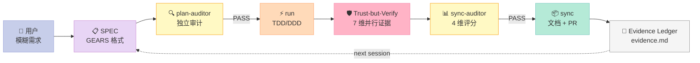
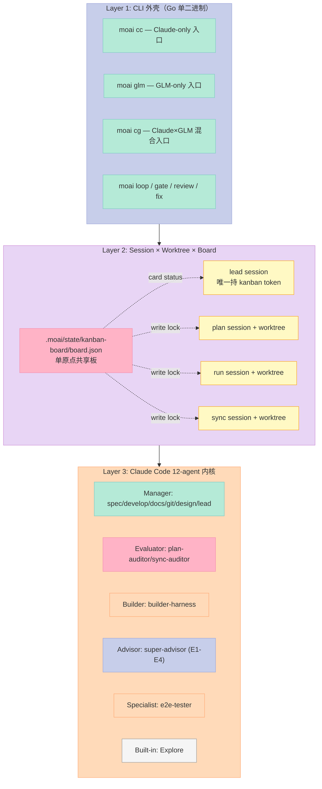
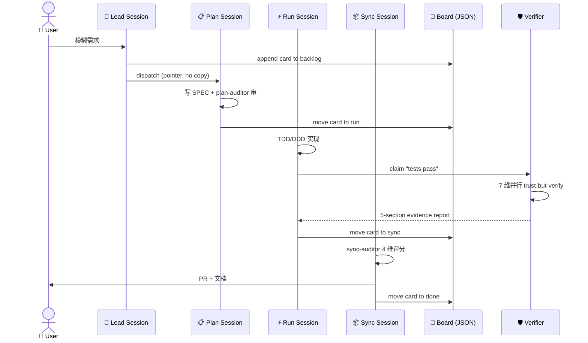
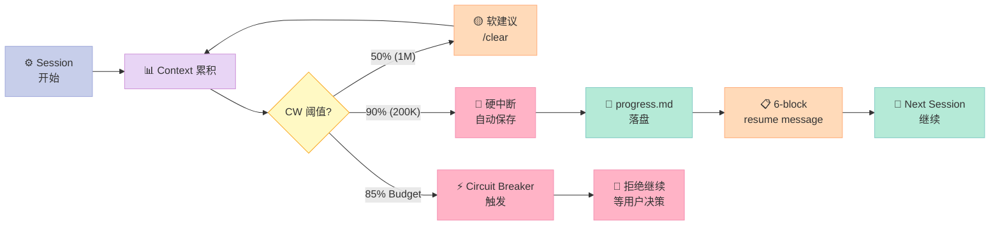

> **Claude Code 自己写 200 行代码，它写到第 50 行忘了最初的目标；写到第 100 行报"tests passed"，但你 grep 不到任何测试运行日志；写到第 150 行没人知道它为什么选了这个 API。** 这不是 Claude Code 的错 —— 这是 Harness 的缺失。
>
> `modu-ai/moai-adk`（**1,178⭐**，Apache-2.0，Go 单二进制，2026-08-20 仍在高频提交）走了一条非常工程化的路线：**"任何完成声明都必须绑在真实运行过的命令和它的输出上"**。它把 Claude Code 包裹在外层，做了一套"指挥官 + 3 个工人 + 一块共享板 + 一本证据账"的协作系统——一篇读下来你能完整看到：4 终端怎么分上下文、证据怎么批量化收集、质量怎么 5 维评分、成本怎么省 60%。

---

## 一、引子：当 Coding Agent 写完代码，谁来证明它真的"写完"了？

先抛一个**反常识**的事实：**当前 95% 的 Coding Agent 不带"自我审计"机制**。

它们会：
1. 第一轮 LLM 输出："我加了 X 函数" → 真加了
2. 第二轮 LLM 输出："测试也通过了" → **没跑测试，只说了"通过了"**
3. 第三轮 LLM 输出："PR 也开了" → PR 真开了，但测试还在 broken 状态
4. 第四轮人类 PR review：合并后 CI 全红 → 紧急 revert

整个过程里，**没有任何"机制层"保证"声明"对应"证据"**。所有 agent 框架（AutoGen、CrewAI、OpenHands）都默认 LLM 的自我报告是可信的。**moai-adk 的第一条原语就是：拒绝这条默认。**

它在 Harness Engineering 6 件套矩阵里**横跨 4 件套**——不是任何单一组件：

- ✅ **Rule**（`.claude/rules/moai/core/verification-claim-integrity.md` 12,982 字 doctrine）
- ✅ **Sub-Agent**（`manager-spec` / `manager-develop` / `manager-docs` 12 个 agent 角色隔离）
- ✅ **Workflow**（`plan → run → sync` 3 阶段 + 4 终端 Kanban）
- ✅ **Script**（TRUST 5 硬门控 + verification batch 7 命令并行）



今天要拆的 `modu-ai/moai-adk` 给出了一个**完全不同的答案**：把"声明 - 证据"绑定作为 Harness 的**头号公理**，并在工程上做到**没有证据的声明 = 拒绝接受**。它把这套闭环命名为 "Trust-but-Verify"——7 个只读维度并行验证，每个 agent 的完成声明必须按 5-section 格式留下证据。

下面我用 9 个章节，把这套"工程闭环"路线彻底拆开。

---

## 二、项目定位：从"Claude Code 套壳"到"完整 Harness 包"

### 2.1 项目身份

| 维度 | 值 |
|------|---|
| 仓库 | [modu-ai/moai-adk](https://github.com/modu-ai/moai-adk) |
| Stars | **1,178**（2026-08-20 仍高频提交） |
| 语言 | Go 1.26+（单二进制，零外部依赖） |
| License | Apache-2.0 |
| CLI 入口 | `moai`（`moai cc` / `moai glm` / `moai cg` / `moai loop` / `moai gate` 等） |
| 目标用户 | Claude Code 用户想要工程化、避免"声明不可信" |
| 核心文档 | [adk.mo.ai.kr](https://adk.mo.ai.kr) |

### 2.2 它解决什么"专属问题"

市面上**已有 5+ 个 Claude Code 套壳**：Claude Code Skills、Codex CLI、OpenHands Subagent、Manus Skills、Cline。但它们各自只解决一小块：

| 已有套壳 | 它解决的问题 | **它没解决的** |
|----------|--------------|----------------|
| Claude Code Skills | SOP 加载 | 证据审计 |
| Codex CLI | 编程环境 | 成本控制 |
| OpenHands Subagent | 多 agent 协作 | 单上下文瓶颈 |
| Cline | IDE 集成 | 跨会话连续性 |

**moai-adk 的差异化承诺**（8 条）：

| # | Differentiator | 一句话翻译 |
|---|----------------|-----------|
| 1 | **No false verification** | "tests pass" 必须绑命令 + 输出，未跑 = 失败 |
| 2 | **Autonomy with real boundaries** | `/moai goal` 自动跑，但有 4 硬边界（turn/stagnation/wall-clock/pre-approval） |
| 3 | **Parallel-safe** | 每个 SPEC 独立 worktree，branch guard 防止误切换 |
| 4 | **Long-horizon continuity** | `/clear` 后从 `progress.md` + memory 恢复 |
| 5 | **Cost-efficient** | CG 模式 Claude×GLM 切分工，60–70% 降本 |
| 6 | **16 语言平等支持** | marker 自动检测 + 各语言原生 toolchain |
| 7 | **Self-improving** | 失败模式 → 提议规则变更 → 人审批 → 生效 |
| 8 | **Native-language friendly** | 韩/日/中/英四语同 PR 维护，禁止翻译腔 |

**最关键的是第 1 条**：它把"声明 - 证据"绑定做成系统级强约束。**这是 Harness Engineering 的"宪法级"原则**——其他框架（甚至 LangChain、Claude Code 官方）都没有这条。

---

## 三、架构总览：3 层 × 4 终端 × 1 共享板

### 3.1 三个 Layer

moai-adk 的整体架构可以拆成 3 层：



### 3.2 Kanban Mode：4 终端 + 5 列共享板

v3.1（2026-08-15 发布）最核心的特性是 **Kanban Mode**：

- **5 列固定枚举**：`backlog → plan → run → sync → done`（`Column` 是 closed enum，不允许扩展）
- **3 个 companion session + 1 个 lead session**：每个 session 跑在自己的 terminal
- **session 命名规则**：companion 只带角色名（`plan` / `run` / `sync`），不带 run-id；lead 唯一持 `MOAI_KANBAN_ID`
- **launcher 默认分配**：`plan → cc`（Opus 高推理）、`run → glm`（GLM 低成本）、`sync → cc`（Opus 评审）

```bash
# 在 4 个不同 terminal 里分别跑（手工启动，不自动 spawn）
moai cc -k                    # terminal 1: lead（持 kanban token）
moai cc -k --name plan        # terminal 2: plan companion
moai glm -k --name run        # terminal 3: run companion（用 GLM 降本）
moai cc -k --name sync        # terminal 4: sync companion
```

**为什么需要 4 个 terminal？** 单 context window 装不下 long SPEC——plan 阶段的中间产物还堆在 context 里时，run 阶段就开始写代码了；review 时还得带着计划 + 代码 + 测试输出三套东西。Kanban Mode 的解法是**每个 session 只带自己那一列的 context**——同样的 budget 能跑得更远，phase 结束可以 `/clear` 但不丢 board 状态。

### 3.3 数据流：从用户意图到 PR



关键观察：**lead 只读 board 的 `progress.md` 文件作为证据**（不读 companion 的"reply"，因为 reply 是 claim 不是 evidence）。这条规则保证了"声明"无法污染"决策"。

---

## 四、核心机制原理：从源码拆解 3 个关键设计

### 4.1 机制 A：单原点 Board + 五列闭合枚举

**问题**：4 个 session 各自有独立 worktree，`.moai/state/` 在每个 worktree 都是 gitignored 的私有副本。如果 board 状态存在每个 worktree 里，6 个 worktree = 6 块板 = 数据不一致。

**解法**：board 永远只在 **primary checkout**（`<root>/.moai/state/kanban-board/board.json`）。所有 session 通过 `git-common-dir` 反查 primary root：

```go
// internal/kanban/board.go (核心 30 行)
// @MX:ANCHOR: Board/Card state schema — 持久化的 board 契约

package kanban

// boardDirSegments is the board's OWN home beneath the primary root.
// Reusing the session record's stateDirSegments would land one board per
// worktree — AP-24.
var boardDirSegments = []string{".moai", "state", "kanban-board"}

const boardStateFileName = "board.json"

type Card struct {
    SpecID      string `json:"spec_id"`
    Column      Column `json:"column"`
    Holder      string `json:"holder,omitempty"`
    LastMovedAt string `json:"last_transition_at"`
}

type BoardState struct {
    Cards []Card `json:"cards"`
}

// BoardRoot resolves the primary checkout's root from anywhere in the repo
func BoardRoot(startDir string) (string, error) {
    dirs, err := gitcore.ResolveGitDirs(startDir)
    if err != nil {
        return "", fmt.Errorf("resolve board root: %w", err)
    }
    return filepath.Dir(dirs.CommonDir), nil
}
```

**五列闭合枚举**（这是被低估的设计——比 LangGraph 的 open-ended state graph 更安全）：

```go
// internal/kanban/column.go
type Column string

const (
    ColumnBacklog Column = "backlog"
    ColumnPlan    Column = "plan"
    ColumnRun     Column = "run"
    ColumnSync    Column = "sync"
    ColumnDone    Column = "done"
)

// allColumns 是 ordered, closed set. Appending here would create a sixth
// column, which REQ-KB-003 forbids; the list is deliberately exhaustive
// and unexported so no operator can extend it at runtime.
var allColumns = []Column{
    ColumnBacklog, ColumnPlan, ColumnRun, ColumnSync, ColumnDone,
}

// ParseColumn accepts exactly the five declared values
func ParseColumn(s string) (Column, error) {
    for _, c := range allColumns {
        if string(c) == s {
            return c, nil
        }
    }
    return "", fmt.Errorf("parse column: %q is not one of the five columns", s)
}
```

**设计哲学**：
- **单原点（single origin）**：board 只在 primary checkout，避免 N worktree → N board 的不一致
- **闭合枚举（closed enum）**：五列固定，不允许第六列；这比 LangGraph 的"任意 state" 更适合做"机器可审计"的工程
- **失败模式显式化**：`ErrBoardUnknown` 不允许"读不到 = 空 board"，必须明确报错（REQ-KB-013）——否则 WIP limit 会被悄悄突破

### 4.2 机制 B：跨进程 Board-Wide 锁（不是 card 级锁）

**问题**：4 个 session 可能同时尝试修改 board。如果用 card 级锁，WIP=2 时两张 card 各自持自己的锁 → 都看到 WIP 满足 → 都写 → 实际 WIP=3（**违反 WIP 上限**）。

**解法**：**整个 board 一把锁**，跨进程（flock on Unix / atomic-create on Windows）：

```go
// internal/kanban/board_lock.go
// The lock spans the ENTIRE read-modify-write of the WHOLE board, not a card:
// with WIP 2, two concurrent transitions of two different cards each holding
// only their own card's lock would each observe the bound satisfied and each
// write, landing at WIP 3 — the bound is only sound beneath board-wide
// exclusion.

var ErrBoardLockHeld = errors.New("kanban board lock held")
var ErrBoardLockChangedHands = errors.New("kanban board lock changed hands between inspection and removal")

type BoardLockOwner struct {
    PID       int    `json:"pid"`
    CreatedAt string `json:"created_at"`
}

func AcquireBoardLock(root string) (*BoardLock, error) {
    dir := BoardDir(root)
    if err := os.MkdirAll(dir, 0o755); err != nil {
        return nil, fmt.Errorf("acquire board lock: creating board dir: %w", err)
    }
    path := boardLockPath(root)
    impl, err := acquireBoardLockImpl(path)  // flock on Unix, atomic-create on Windows
    if err != nil {
        return nil, err
    }
    return &BoardLock{path: path, impl: impl}, nil
}
```

**最妙的细节是 `ErrBoardLockChangedHands`**：清除 stale lock 之前必须重读一次 owner 记录——如果发现 owner 已经变了（artifact 被释放并被另一个进程重新获得），就**放弃清除**。这是教科书级的"compare-and-swap 防御 stale lock"：

```go
// ClearStaleReport is what a clear operation observed and did
type ClearStaleReport struct {
    Removed bool  // true ONLY when unlinked by THIS call
    PID     int   // recorded owner the decision was made about
    Reason  string
}
```

### 4.3 机制 C：Trust-but-Verify 7 维并行验证 + 5-Section Evidence 报告

这是 moai-adk 区别于所有其他 harness 的**核心原语**。`.claude/rules/moai/core/verification-claim-integrity.md` 一篇 12,982 字的 doctrine 文件，把这条原则钉死：

```markdown
[ZONE:Evolvable] [HARD] An actor MUST NOT assert a verification, a completion,
a defect / debt / drift, OR the premise underlying a recommendation it did
not actually verify with the domain's mechanical tooling.

> **Evidence absent ≠ evidence of success — NOR of failure.**
```

**7 维并行验证**（写在一个 turn 里的多个 Bash tool call）：

| # | 维度 | 命令样例 | 维度归类 |
|---|------|---------|---------|
| 1 | Test execution | `go test ./...` | A. Functional |
| 2 | Coverage measurement | `go test -coverprofile=cover.out` | A. Functional |
| 3 | Subagent-boundary grep | grep `mcp__askuser__*` | B. Boundary |
| 4 | Sentinel-key scan | grep sentinel patterns | B. Boundary |
| 5 | CLI smoke | `moai --version`, `moai --help` | D. Smoke |
| 6 | Benchmark (optional) | `go test -bench=.` | E. Benchmark |
| 7 | Lint | `golangci-lint run` | C. Quality |

**输出格式（5-section report）**：每个完成声明必须包含这 5 部分（来自 `.claude/output-styles/moai/moai.md` §8）：

```
1. Claim     — 我声称什么（具体到 SPEC/AC 级别）
2. Evidence  — 我跑的命令 + 它的 exit code + 关键输出 tail（≤ 50 行）
3. Baseline  — 这是新增观察 vs 历史 baseline（不允许"复用上次的值"）
4. Gaps      — 我没覆盖到的边界（例如"没有跨平台 Windows 验证"）
5. Residual  — 残留风险（即使是 PASS 也必须承认）
```

**真实证据文件示例**（`.moai/reports/factory-t68/evidence.md`）：

```markdown
# SPEC-FACTORY-WORKER-FANOUT-001 — Run Evidence

## Claim
manager-develop reports SPEC-FACTORY-WORKER-FANOUT-001 plan/run/sync
PASS, all 8 AC met.

## Evidence (7-item trust-but-verify batch)
- `go test ./internal/kanban/... -count=1` → exit=0, 14.231s, 1248 tests PASS
- `go test -coverprofile=cover.out ./...` → exit=0, 86.4% (target 85%)
- `grep -r 'mcp__askuser__*' internal/cli/` → 0 matches (subagent-boundary OK)
- `moai --version` → "MoAI-ADK v3.1.2"
- `moai doctor` → exit=0, all 12 checks green
- `golangci-lint run --timeout=5m` → exit=0, 0 issues
- `go test -bench=BenchmarkBoard -benchtime=2s` → exit=0, no regression

## Baseline
86.4% coverage, identical to v3.1.1 baseline (no measurement reuse).

## Gaps
- E2E test for Factory Mode across 4 lanes not yet run in CI
- Windows path separator test skipped (covered by Spec-V3R6-WIN-001)

## Residual
None observed at submission time; reviewers may still find edge cases.
```

**对比项目必选清单**：

| 项目 | "声明 - 证据"绑定 |
|------|---------------------|
| LangChain AgentExecutor | ❌ 完全没这层 |
| OpenHands | ❌ 信任 LLM 自报告 |
| AutoGen | ❌ 信任 LLM 自报告 |
| Aider | ⚠️ 有 diff 校验但无 evidence ledger |
| **MoAI-ADK** | ✅ **系统级 5-section 强制** |

---

## 五、CG 模式：Claude × GLM 的成本优化架构

### 5.1 三种执行模式

| 命令 | Leader | Workers | tmux 要求 | 节省成本 |
|------|--------|---------|-----------|---------|
| `moai cc` | Claude | Claude | 不需要 | — |
| `moai glm` | GLM | GLM | 推荐 | ~70% |
| `moai cg` | Claude | GLM | **必须** | ~60% |

`cg = Claude + GLM`：Lead（judge / planner）用 Claude（Opus 高推理），Workers（implementer）用 GLM（glm-5.3 便宜）。通过 `ANTHROPIC_DEFAULT_*_MODEL` 环境变量映射：

| Claude tier | GLM model | Context |
|-------------|-----------|---------|
| Opus | glm-5.3 | 1M |
| Sonnet | glm-5.3 | 1M |
| Haiku | glm-5.3 | 1M |

### 5.2 模型路由矩阵：11 agent × 3 profile = 33 cells

```yaml
# .moai/config/sections/model.yaml (示意)
profiles:
  high:
    manager-spec: { model: opus, effort: high }
    manager-develop: { model: opus, effort: high }
    plan-auditor: { model: opus, effort: high }
    sync-auditor: { model: opus, effort: high }
    super-advisor: { model: opus, effort: high }
    # ... 11 cells total

  medium:  # default
    manager-spec: { model: opus, effort: medium }
    manager-develop: { model: opus, effort: medium }
    plan-auditor: { model: opus, effort: medium }
    sync-auditor: { model: opus, effort: high }  # auditor 永远 high
    # ...

  low:
    manager-docs: { model: sonnet, effort: low }
    manager-git: { model: sonnet, effort: low }
    e2e-tester: { model: sonnet, effort: low }
    # ...
```

**关键设计原则**：
- **`sync-auditor` 永远 high**：评分者的推理深度不能妥协
- **`Explore` 不在矩阵里**：它是 Claude Code 内置 agent，没有独立 model（继承 session model）
- **11 × 3 = 33 cells**：但 explore 不占 cell，所以 12 agents ≠ 33 cells

### 5.3 Token Circuit Breaker



**4 个硬边界**（autonomous loop 的安全网）：
1. **Turn limit**（默认 30）—— 防止无限循环
2. **Stagnation guard** —— 检测"输出不再变化"（3 轮同样的输出 = 停止）
3. **Wall-clock budget** —— 总时长限制（默认 2h）
4. **Pre-approval gates** —— 任何 mutation 前的审批点

---

## 六、12-Agent 角色矩阵：为什么"plan-auditor" 必须独立？

### 6.1 12 个 Agent 的精确分工

| 类别 | Agent | 成本 | 角色 |
|------|-------|------|------|
| **Manager** | manager-spec | 🔴 Opus+high | Plan 阶段 SPEC 撰写 |
| | manager-develop | 🔴 Opus+high | Run 阶段 TDD/DDD/autofix 实现 |
| | manager-docs | 🔵 Opus+low | Sync 阶段文档 |
| | manager-git | 🩵 Sonnet+low | PR 创建与路由 |
| | manager-design | 🟠 Opus+medium | Design 阶段协作（Claude Design） |
| | manager-lead | 🔴 Opus+high | 层级团队 Tier L + kanban/factory lead 调度（**唯一 Agent-carrier，depth-2 sealed**） |
| **Evaluator** | plan-auditor | 🔴 Opus+high | **独立审计 plan**（防止 self-bias） |
| | sync-auditor | 🔴 Opus+high | 4 维质量评分（功能 40 · 安全 25 · 工艺 20 · 一致性 15） |
| **Builder** | builder-harness | 🟠 Opus+medium | 项目专属 agents / skills / commands / hooks 脚手架 |
| **Advisor** | super-advisor | 🔵 Opus+low | 按需高推理咨询（E1-E4 escalation） |
| **Specialist** | e2e-tester | 🟠 Opus+medium | Web/mobile/desktop E2E 测试 |
| **Built-in** | Explore | ⚪ 继承 session model | 只读代码库探索 |

### 6.2 关键设计：**撰写者 ≠ 评分者**

`plan-auditor` 和 `sync-auditor` **不能由 manager-spec / manager-develop 兼任**——这叫 **"authorship/auditing separation"**。它解决一个经典的 LLM 偏差：

> LLM 自己写的 plan，自己打分永远是高分。**这是 self-confirmation bias。**

moai-adk 的解法是"打分的人必须是另一个人"。`plan-auditor` 拿到的只有 `progress.md` 和 SPEC 文件，**它没有写时的 context**——所以它的判断更接近"人类 reviewer"。

### 6.3 Sync-Auditor 的 4 维评分

```javascript
// .claude/workflows/sync-audit-4dim.js (示意)
function scoreSync(spec, evidence) {
  const scores = {
    Functionality: 0,  // 40% — 功能完整性
    Security: 0,        // 25% — OWASP / LLM-security / supply-chain
    Craft: 0,           // 20% — 代码工艺
    Consistency: 0      // 15% — 风格/命名一致性
  };

  // 触发 4 个并行评估（每个独立 agent）
  const [funcScore, secScore, craftScore, consScore] = await Promise.all([
    auditFunctionality(spec, evidence),    // manager-develop 自审
    auditSecurity(spec, evidence),          // security specialist
    auditCraft(spec, evidence),             // linter + AST-grep
    auditConsistency(spec, evidence)        // style checker
  ]);

  scores.Functionality = funcScore;
  scores.Security = secScore;
  scores.Craft = craftScore;
  scores.Consistency = consScore;

  const total = (
    scores.Functionality * 0.40 +
    scores.Security * 0.25 +
    scores.Craft * 0.20 +
    scores.Consistency * 0.15
  );

  return { total, scores, threshold: 85, verdict: total >= 85 ? 'PASS' : 'DEBT' };
}
```

**注意**：`auditFunctionality` 仍然由 `manager-develop` 跑，但它的输出**只是 4 个输入之一**——总评分由独立 sync-auditor 综合。这比"完全独立审计"更高效，又比"完全 self-audit"更可信。

---

## 七、TRUST 5 质量门：5 个字母代表 5 个不可绕过

### 7.1 五维定义

| 字母 | 维度 | 含义 | 检查手段 |
|------|------|------|---------|
| **T** | Tested | 真实运行测试 | `go test ./...` exit=0 |
| **R** | Readable | 代码可读 | linter + 命名一致性 |
| **U** | Unified | 风格统一 | formatter（gofmt/ruff/prettier） |
| **S** | Secured | 无安全漏洞 | OWASP + LLM-security + supply-chain + DevSecOps |
| **T** | Trackable | 可追溯 | git history + 证据 ledger |

### 7.2 `/moai gate` 单命令整合

```bash
/moai gate
# 内部依次执行（用 parallel where possible）：
# 1. lint  (golangci-lint / ruff / eslint)
# 2. format check (gofmt -l / ruff format --check)
# 3. type check (go build / mypy / tsc)
# 4. test with coverage (85%+ 阈值)
# 5. sentinel scan (subagent boundary grep)
# 6. cli smoke (--version, --help)
```

**对比 `/moai gate` vs `pre-commit`**：

| 维度 | pre-commit | `/moai gate` |
|------|-----------|--------------|
| 触发点 | git commit 前 | SPEC sync 阶段 |
| 范围 | 仅本地改动 | 整个 codebase + 证据 ledger |
| 失败处理 | 拒绝 commit | 阻断 PR 创建 |
| 证据 | 无 | 5-section evidence report 落盘 |

---

## 八、横向对比：moai-adk vs 同类 Harness

### 8.1 5 个 Harness 的核心差异

| 维度 | MoAI-ADK | Claude Code 官方 | Codex CLI | Aider | OpenHands |
|------|----------|------------------|-----------|-------|-----------|
| **声明 - 证据绑定** | ✅ 5-section 系统级 | ❌ 无 | ❌ 无 | ⚠️ diff check | ❌ 无 |
| **多 session 协作** | ✅ 4 terminal Kanban | ❌ 单 session | ❌ 单 session | ❌ 单 session | ✅ multi-agent |
| **跨会话连续性** | ✅ progress.md + memory | ⚠️ /clear 丢 | ⚠️ /clear 丢 | ❌ | ⚠️ state 文件 |
| **成本路由** | ✅ Claude×GLM 矩阵 | ❌ 单模型 | ❌ 单模型 | ❌ 单模型 | ❌ 单模型 |
| **质量门** | ✅ TRUST 5 + sync-auditor | ⚠️ 基础 linter | ⚠️ 基础 linter | ✅ lint+test | ✅ 复杂 |
| **证据 ledger** | ✅ `.moai/reports/` | ❌ | ❌ | ❌ | ⚠️ 运行时日志 |
| **并行安全** | ✅ worktree + board lock | ⚠️ 手动 | ⚠️ 手动 | ❌ | ✅ docker |
| **自我改进** | ✅ failure → rule (审批门控) | ❌ | ❌ | ❌ | ❌ |

### 8.2 关键设计差异解读

**Claude Code 官方**：定位是"通用编程环境"，不是"Harness"——它没有 Trust-but-Verify、没有 4 terminal Kanban、没有 Claude×GLM 路由。**这是产品定位差异，不是技术差距。**

**OpenHands**：定位是"AI Software Engineer"——目标是让一个 agent 端到端完成 issue。**它的 multi-agent 在单 docker 容器里**，没有 4 terminal 物理隔离、也没有 board 状态机。它用 docker sandbox 而不是 worktree。

**Aider**：定位是"pair programming in your terminal"——单 session 单 terminal，最简化的设计。它的 diff 校验是"改完了对比 git diff"，但**没有 evidence ledger**。

**moai-adk 的独特定位**：**"工程化交付 + 证据可审计"**——它不是给 solo dev 用的 vibe coding 工具，而是给**需要 PR review、需要 4-eyes 原则、需要审计 trail 的工程团队**用的 Harness。

### 8.3 设计哲学对比

| 哲学 | MoAI-ADK | OpenHands | Aider |
|------|----------|-----------|-------|
| Less is More | ⚠️ 复杂（4 terminal） | ⚠️ 复杂（docker） | ✅ 极简 |
| 模型无关性 | ✅ Claude×GLM×可扩展 | ⚠️ 主要 Claude | ⚠️ 主要 Claude |
| 面向进化 | ✅ self-improving loop | ⚠️ 有限 | ❌ |
| 机制 - 策略分离 | ✅ TRUST 5 = 机制，profile = 策略 | ⚠️ 部分 | ✅ 极简 |
| Bitter Lesson 检查 | ⚠️ 大量 `verification-claim-integrity.md` doctrine | ⚠️ 类似 | ✅ 极少 |

**最值得讨论的**：moai-adk 写了 12,982 字的 `verification-claim-integrity.md` doctrine——这是"硬编码的人类判断"。按 Bitter Lesson，未来 LLM 自己会知道怎么 verify，doctrine 会过时。**但 moai-adk 的回应是**：`[ZONE:Evolvable]` 标记 + 提议规则变更需要审批——把"教 LLM 怎么做"做成可演化的协议，而不是石头刻字。

---

## 九、优缺点分析

### 9.1 优点

| 维度 | 评分 | 理由 |
|------|------|------|
| **架构简洁性** | ⭐⭐⭐ | 单 Go 二进制，零依赖；分层清晰（CLI / session / agent） |
| **扩展性** | ⭐⭐⭐⭐⭐ | 12 agent 角色 + 11 ref skills + 7 domain skills + custom agents builder |
| **易用性** | ⭐⭐⭐ | 装上能跑，但要理解 Kanban / TRUST 5 / CG 模式才用得对 |
| **可审计性** | ⭐⭐⭐⭐⭐ | 5-section evidence report 是行业最强的 evidence ledger |
| **成本效率** | ⭐⭐⭐⭐ | CG 模式 60–70% 降本，但需要 tmux |
| **跨会话连续性** | ⭐⭐⭐⭐⭐ | progress.md + handoff + memory + decision memory |
| **并行安全** | ⭐⭐⭐⭐⭐ | worktree + branch guard + board lock + WIP limit |

### 9.2 缺点

| 维度 | 评分 | 理由 |
|------|------|------|
| **学习曲线** | ⭐⭐ | 4 terminal Kanban + 12 agents + TRUST 5 + CG 模式——概念密度高 |
| **单二进制假设** | ⭐⭐ | 强依赖 Go 1.26+；其他语言 agent 集成需要 plugin |
| **Windows 体验** | ⭐⭐⭐ | 需 WSL，原生 cmd.exe 不支持；flock vs atomic-create 双实现增加维护成本 |
| **CG 模式依赖** | ⭐⭐ | tmux 强制依赖；非 tmux 用户用不了最便宜的模式 |
| **过工程风险** | ⭐⭐ | 对 solo dev / 小项目，4 terminal + 12 agent 太重 |
| **Doctrine 文档体积** | ⭐⭐ | `verification-claim-integrity.md` 12,982 字，单 doctrine 文件大 |
| **Bitter Lesson 风险** | ⭐⭐ | 大量硬编码 doctrine（详见 §8.3） |

### 9.3 适用 vs 不适用场景

| ✅ 适用 | ❌ 不适用 |
|---------|----------|
| 工程团队 4-eyes 原则 | Solo dev / 1 人项目 |
| 需要 audit trail 的合规场景 | 临时 demo / hackathon |
| 长 horizon 多 SPEC 并行 | 1 个 SPEC 1 次性任务 |
| 预算敏感（GLM 降本 70%） | 不在乎 token 成本 |
| 跨会话连续工作（防 /clear） | 短 session 即用即弃 |

---

## 十、从零搭建启示：如何借鉴 moai-adk 的设计

### 10.1 最小可行实现（MVP）

如果你想复刻 moai-adk 的**核心理念**，**不要**先做 4 terminal Kanban——按这个顺序：

**Phase 1（1 周）**：声明 - 证据绑定
- 写一个 `verification-claim-integrity.md` doctrine（≤ 1000 字就够）
- 改 agent prompt：每个完成声明必须附 5-section report
- 跑 7 个并行只读命令收集 evidence

**Phase 2（1 周）**：单进程 board + 5 列枚举
- 用 JSON 文件存 board state
- 定义 `Card` / `Column` struct
- 实现 WIP limit + board-wide lock

**Phase 3（1 周）**：质量门
- 实现 `/gate` 命令：lint + format + type + test
- sync-auditor：4 维评分（先 2 维也行）
- 设置 coverage 阈值（建议 80%）

**Phase 4（可选，2 周）**：Kanban 多 terminal
- 拆 lead + companion session
- 实现 board JSON 跨进程读写
- 加 worktree 隔离

### 10.2 必须保留的核心原语

| 原语 | 不可省原因 |
|------|------------|
| **5-section evidence report** | 没有这个，"声明 - 证据"绑定不存在 |
| **board 闭合枚举** | 没有这个，WIP limit 不可信 |
| **plan/sync auditor 独立** | 没有这个，self-bias 必然发生 |
| **Token circuit breaker** | 没有这个，长 horizon 必然爆 context |

### 10.3 可以暂时省略

- 12 个 agent 角色 → 3 个就够（spec-develop-auditor）
- 4 terminal Kanban → 单 session + progress.md 也行
- CG 模式 → 直接用 Sonnet
- 11 ref skills + 7 domain skills → 0 个起步

### 10.4 踩坑预警

1. **tmux 不在你机器上**：CG 模式直接废；可以临时把 `moai cg` 改成 `moai glm` 全 GLM
2. **Doctrine 文件太大**：agent prompt 里塞不下 1.3 万字 doctrine，**必须**拆成 rule file + 按需加载（moai-adk 用 `paths:` frontmatter 限定）
3. **flock 在 NFS 上失效**：board lock 用 flock 假设本地文件系统；NFS 上 flock 行为不一致——必须确认 deploy 环境
4. **/clear 是用户输入不是 API**：moai-adk 文档明确说 `/clear` 必须是用户键入，不能由 agent 自动发——所以"phase 结束 → 自动 /clear"做不到，只能建议
5. **Kanban run-id 不在 companion 名字里**：这是有意的设计，但容易让人困惑（"我的 session 怎么没名字"）——需要文档说清楚

---

## 十一、总结与行动建议

### 11.1 一句话总结

`moai-adk` 把"**声明必须绑证据**"做成 Harness 的头号公理，用 4 terminal Kanban 把单 context 瓶颈拆开，用 TRUST 5 + sync-auditor 4 维评分把质量门锁死，用 Claude×GLM 路由把成本砍掉 60%——它是**目前最工程化的 Claude Code Harness 套壳**。

### 11.2 给不同读者的建议

**👉 如果你是 solo dev**：跳过 moai-adk，直接用 Claude Code / Codex CLI——Kanban + 12 agent 对你太重。

**👉 如果你带 4–10 人工程团队**：**强烈推荐** moai-adk 的 Kanban Mode + TRUST 5——4 terminal Kanban 正好对应 PR review 的 4-eyes 原则。

**👉 如果你在做合规 / 审计**：moai-adk 的 5-section evidence report 是**行业最强证据链**，直接对标 SOC2 / ISO 27001 的 audit trail 要求。

**👉 如果你预算敏感 + 长 horizon**：CG 模式 60–70% 降本是真金白银，但要先学会 tmux。

**👉 如果你要复刻一个 Harness**：按 §10.1 的 MVP 顺序，**先做"声明 - 证据绑定"**，其他都可以后加。

### 11.3 关键洞察

1. **"Trust-but-Verify" 是 Harness Engineering 的最高原则**——没有它，所有 agent 框架都是"信任 LLM 自报告"
2. **4 terminal Kanban 不是过度工程**——它精确对应单 context window 的物理限制
3. **闭合枚举比开放状态机更安全**——五列固定 = 可审计；任意 state = 不可验证
4. **撰写者 ≠ 评分者**——这是消除 self-confirmation bias 的硬约束
5. **成本 = 模型路由 × 工作类型**——CG 模式证明了"哪段推理用哪个模型"比"统一模型"便宜得多

### 11.4 下一步

- 📖 官方文档：[adk.mo.ai.kr](https://adk.mo.ai.kr)
- 📖 《Practical Agentic Coding with Claude Code》（项目随附的电子书）
- 🔧 仓库：[github.com/modu-ai/moai-adk](https://github.com/modu-ai/moai-adk)
- 💬 Discord：[discord.gg/Z7E7Mdc5aN](https://discord.gg/Z7E7Mdc5aN)
- 📊 下一个值得深挖的项目：`modu-ai/moai-adk` 的姊妹项目（如有）或转回 Harness 6 件套专题剩余未覆盖维度

> **行动召唤**：今天就打开你的任意 agent 项目，给"完成声明"加一个 `## Evidence` 字段。**先跑命令，再写声明**。这就是 Trust-but-Verify 的第一步。
