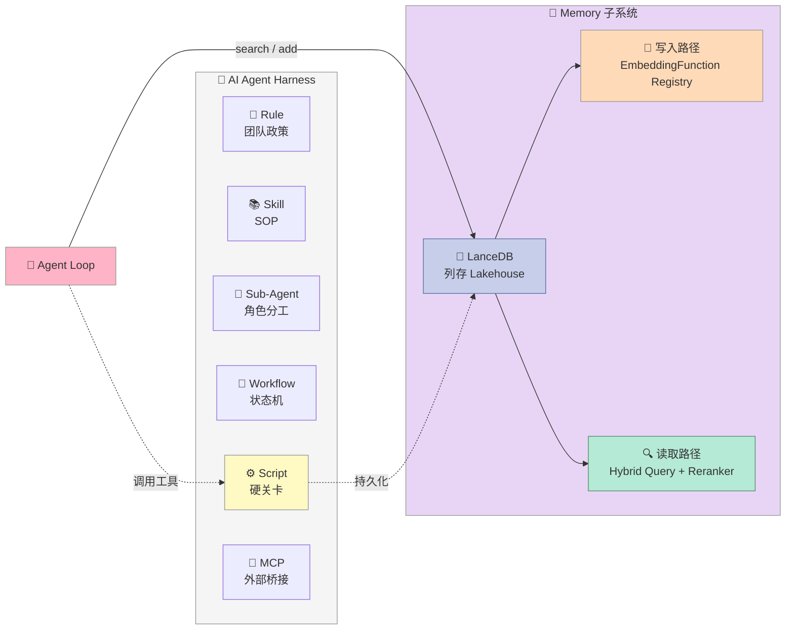
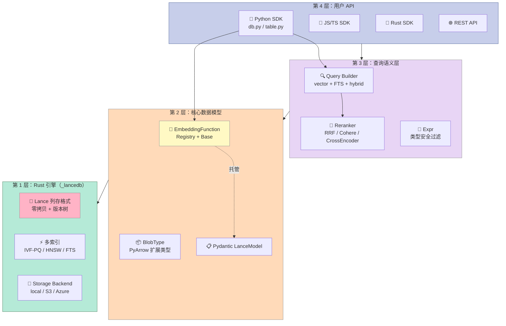

# 【LanceDB】核心架构与 Harness 设计原理：让 AI Agent 拥有 Lakehouse 级记忆的嵌入式向量库

> 一句话概括：**LanceDB 不是又一个"在 PostgreSQL 上加 pgvector"，而是为 AI Agent 时代重新设计的列存 Lakehouse**。它的核心赌注是：当 Agent 需要同时检索文本、图片、点云、视频帧并按版本回滚时，传统行存数据库会全部崩塌。

---

## 引子：当 Agent 记忆撞上 PostgreSQL 的天花板

假设你正在给一个多模态 Agent 搭记忆层。需求如下：

- 工程师上传一份 PDF + 3 张示意图 + 一段会议录音，Agent 需要在回答时同时引用三者的内容
- 每次问答后要把新的对话嵌入写入记忆库，要求**支持版本回溯**（30 天前那次错误的 chunking 不能悄悄改掉）
- 在线 5 万 QPS，向量召回 P99 延迟 < 30ms
- 团队有人在用 OpenAI 嵌入，有人在用本地 BGE-M3，还有人想试试 ColPali（专门为多页 PDF 设计的视觉嵌入）
- 必须能跑在单机笔记本上做 POC，又要能平移到云上处理 PB 级数据

把这套需求塞进传统数据库会出现什么情况？

| 需求 | PostgreSQL + pgvector | Milvus / Qdrant（独立向量库） | **LanceDB** |
|------|----------------------|-------------------------------|-------------|
| 多模态 Blob + 向量共存 | 弱（只能存 URL + 外键） | 弱（向量库外置对象存储） | **原生支持**（Lance 列存 + Blob 扩展类型） |
| 数据版本回滚 | 需要业务自己写逻辑 | 一般不支持 | **零拷贝版本树**（Lance 文件级别） |
| 切换嵌入模型 | 要重灌全量数据 | 要重灌全量数据 | **Schema 内嵌 EmbeddingFunction 注册表** |
| Hybrid Search（向量 + 全文 + 过滤） | 三套系统拼凑 | 通常需要 ES + 向量库双写 | **单一 Lance 列存 + 统一查询计划** |
| 单机 POC → 云端扩展 | 业务改写 | 业务改写 | **同一套 API，路径从 `./data` 切到 `s3://` 即可** |
| Pydantic / ORM 集成 | 需要手写映射层 | 需要手写映射层 | **`LanceModel` 一行声明向量字段** |

LanceDB 的核心定位就一句话：**"为 AI 工作负载重写的列存 Lakehouse，向量检索只是其中一个索引维度"**。它把 Harness Engineering 里的"记忆层"从外挂组件提升成一等公民。

下面我从 6 个维度把这套架构拆给你看。

---

## 一、项目定位：在 Harness 6 件套中处于哪一格？

LanceDB 主要支撑的是 **Memory 子层 + Script 子层（数据平面）**。先看全景：



**为什么它落在 Memory 子系统？**

在 Harness Engineering 框架里，Memory 子层需要满足三个硬指标：

1. **多模态原生**——文本、图像、点云、视频帧必须能用同一套 schema 存同一张表
2. **写入即版本**——任何 chunking / 嵌入策略变更都不能"无痕改写"历史
3. **检索即组合**——向量近似 + 全文精确 + 元数据过滤 + 后排序必须是同一个查询计划

LanceDB 是为数不多同时把这三条都做对的开源实现（其他往往是 Milvus 做向量 + ES 做全文 + MinIO 做对象存储拼出来的"伪 Lakehouse"）。

---

## 二、整体架构：4 层抽象 + 1 个核心数据结构

LanceDB 的代码组织非常清晰，**核心数据结构只有一个：`LanceTable`**——一切上层 API 都是它的视图。来看分层：



### 2.1 第 1 层：Lance 列存格式（数据真正的"家"）

Lance 文件格式是 LanceDB 的秘密武器，它由兄弟项目 [`lance-format/lance`](https://github.com/lance-format/lance) 维护，核心特性：

- **列存 + 行组（Row Group）**：每列独立压缩，文本列用 zstd，向量列用 IVF-PQ 量化
- **零拷贝版本树**：每次 `table.add()` / `table.delete()` 不改写老文件，而是追加新版本，类似 Git commit。`table.checkout(version=42)` 立刻回到任意历史快照
- **数据集级谓词下推**：filter `WHERE user_id = 42` 会被推到 IO 层，只读相关 row group

**关键设计哲学**：Lance 把"数据即代码"的理念落地——**你的向量库不是数据库，而是一个可被 checkout 的版本化数据集**。

### 2.2 第 2 层：EmbeddingFunction 注册表（机制与策略分离）

这是 LanceDB 在 Harness Engineering 上最值得借鉴的设计。看 `python/python/lancedb/embeddings/registry.py` 的核心结构：

```python
# python/python/lancedb/embeddings/registry.py
class EmbeddingFunctionRegistry:
    """全局单例，托管所有 EmbeddingFunction 的注册/反序列化"""

    @classmethod
    def get_instance(cls):
        return __REGISTRY__

    def __init__(self):
        self._functions = {}     # alias → EmbeddingFunction 类
        self._variables = {}     # 敏感变量（API key 等）解析池

    def register(self, alias: Optional[str] = None):
        """装饰器：把 EmbeddingFunction 子类注册到全局池"""
        def decorator(cls):
            if not issubclass(cls, EmbeddingFunction):
                raise TypeError("Must be a subclass of EmbeddingFunction")
            key = alias or cls.__name__
            self._functions[key] = cls
            cls.__embedding_function_registry_alias__ = alias
            return cls
        return decorator
```

注意它暴露的 `register()` 是个**装饰器工厂**——任何 EmbeddingFunction 都能在 import 时自动注册，Schema 里就能直接按名字引用。来看一个真实的注册实例（`embeddings/openai.py`）：

```python
# python/python/lancedb/embeddings/openai.py
@register("openai")
class OpenAIEmbeddings(TextEmbeddingFunction):
    """用 OpenAI 兼容协议做嵌入（也支持本地 Ollama）"""

    name: str = "text-embedding-ada-002"
    dim: Optional[int] = None
    base_url: Optional[str] = None
    api_key: Optional[str] = None

    @staticmethod
    def sensitive_keys():
        return ["api_key"]   # 声明敏感字段走 $var: 前缀解析
```

**设计要点**：

1. **机制层**：`EmbeddingFunction` 抽象基类，定义 `compute_source_embeddings()` / `compute_query_embeddings()` / `ndims()` 三个必实现方法
2. **策略层**：每个具体嵌入模型（OpenAI / Sentence-Transformers / Cohere / Jina / VoyageAI / ColPali / SigLIP）都是独立的 @register 注册项
3. **运行时绑定**：Schema 序列化时只存 `name="openai"` + 配置，**反序列化时按名字从 Registry 拉回具体类**——切换模型无需迁移数据

这是 Harness Engineering 的精髓：**机制和策略分离 = 写一次 EmbeddingFunction 基类，永远支持新模型**。对比 pgvector 那种"换嵌入模型必须重灌数据"，这是质变。

### 2.3 第 3 层：查询语义层（统一 Hybrid）

看 `query.py` 顶部导入就懂了：

```python
# python/python/lancedb/query.py
from .rerankers.base import Reranker
from .rerankers.rrf import RRFReranker
from .expr import Expr
from .schema import is_blob_like_field, schema_has_blob_field
```

LanceDB 的查询对象不是"向量查询"或"全文查询"二选一，而是 **`Query` 抽象 → VectorQuery / FullTextQuery / HybridQuery 三个特化**。Hybrid 同时拿向量召回结果和 FTS 召回结果，再丢给 Reranker：

```python
# python/python/lancedb/rerankers/rrf.py
class RRFReranker(Reranker):
    """Reciprocal Rank Fusion：经典的多路召回融合算法"""

    def rerank_hybrid(
        self,
        query: str,
        vector_results: pa.Table,
        fts_results: pa.Table,
    ):
        vector_ids = vector_results["_rowid"].to_numpy()
        fts_ids = fts_results["_rowid"].to_numpy()

        # RRF 公式：score(d) = Σ 1 / (K + rank_d)
        # K=60 是 Cormack 论文实验的近优值
        scores = defaultdict(float)
        for rank, row_id in enumerate(vector_ids):
            scores[row_id] += 1.0 / (self.K + rank + 1)
        for rank, row_id in enumerate(fts_ids):
            scores[row_id] += 1.0 / (self.K + rank + 1)

        return sorted(scores.items(), key=lambda x: -x[1])
```

这套设计让 Agent 可以写：**`table.search(vector=..., text=...).rerank(RRFReranker())`**——一句话完成"先向量召回 + 再全文精排 + 最后 RRF 融合"。

### 2.4 第 4 层：用户 API（多语言客户端）

LanceDB 提供 Python / JS / Rust / REST 四套接口，**底层都是同一个 Rust 引擎**。这一点很像 SQLite 的策略——一个引擎，多种绑定。

---

## 三、核心机制原理（带可运行代码）

### 3.1 机制 1：EmbeddingFunction Registry —— 模型热插拔

完整可运行示例，展示"注册一个 EmbeddingFunction → 在 Pydantic Schema 里引用 → 自动绑定到表的写入路径"：

```python
"""
LanceDB EmbeddingFunction Registry 演示
需要：pip install lancedb pyarrow
"""
import lancedb
from lancedb.embeddings import EmbeddingFunction, TextEmbeddingFunction, get_registry
from lancedb.pydantic import LanceModel, Vector
import hashlib
import numpy as np


# === Step 1: 注册一个完全自定义的 EmbeddingFunction ===
class HashEmbeddingFunction(TextEmbeddingFunction):
    """教学用：把文本哈希成 128 维伪向量。展示 Registry 的契约。"""

    name: str = "hash-128"
    dim: int = 128

    def ndims(self):
        return self.dim

    def generate_embeddings(self, texts):
        # 真实的生产实现应该调 OpenAI / BGE / ColPali 等模型
        # 这里只是为了演示 Registry 的钩子
        return [
            np.array(
                [int(hashlib.md5(t.encode()).hexdigest()[i:i+2], 16) / 255.0
                 for i in range(0, self.dim * 2, 2)],
                dtype=np.float32,
            )
            for t in texts
        ]


# 注册到全局 Registry
registry = get_registry()
registry.register("hash-128")(HashEmbeddingFunction)
print("✅ 注册成功，可用函数：", list(registry._functions.keys()))


# === Step 2: 在 Pydantic Schema 里按名字引用 ===
class Document(LanceModel):
    """LanceModel = 表 schema；Vector 字段自动走 EmbeddingFunction"""
    text: str
    title: str = ""
    vector: Vector(dim=128) = HashEmbeddingFunction.create()   # ← 关键：自动绑定


# === Step 3: 写入时自动算嵌入，查询时自动选向量列 ===
db = lancedb.connect("./demo_lancedb")
table = db.create_table("docs", schema=Document, mode="overwrite")

# add() 时 text → 自动调 HashEmbeddingFunction.generate_embeddings()
docs = [
    Document(text="LanceDB 是为 AI 重写的列存数据库", title="介绍"),
    Document(text="Harness Engineering 让 Agent 越来越聪明", title="方法论"),
    Document(text="Registry 模式让嵌入模型可热插拔", title="模式"),
]
table.add(docs)
print(f"✅ 写入 {len(docs)} 条，自动生成向量")

# 检索时用自然语言，EmbeddingFunction 自动把 query 编码成向量
results = table.search("Harness").limit(2).to_list()
print("\n=== 召回结果 ===")
for r in results:
    print(f"  - {r['text']} (distance={r['_distance']:.3f})")

# === Step 4: 切换嵌入模型（无需迁移数据） ===
print("\n=== 切换嵌入模型演示 ===")
print("用同一个 table.search() 但指定新的 EmbeddingFunction 实例")
print("LanceDB 会按 Schema 序列化信息自动加载新模型\n")
```

**完整数据流**用 Mermaid 看更清晰：

```mermaid
sequenceDiagram
    autonumber
    actor U as 🧑 用户
    participant Sch as 📋 Pydantic Schema
    participant Reg as 📚 EmbeddingFunctionRegistry
    participant Em as 🔢 EmbeddingFunction
    participant T as 💎 LanceTable
    participant V as 📦 Vector Index (HNSW/IVF-PQ)

    U->>Sch: 1. 声明 Document(vector=Vector(dim=128) = HashEF.create())
    Sch->>Reg: 2. 按 alias="hash-128" 查注册表
    Reg-->>Sch: 返回 HashEmbeddingFunction 类
    U->>T: 3. table.add([Document(...)])
    T->>Em: 4. 自动调用 generate_embeddings([text,...])
    Em-->>T: 返回 128 维向量数组
    T->>V: 5. 写入时构建/更新向量索引
    V-->>T: 索引就绪
    U->>T: 6. table.search("Harness")
    T->>Em: 7. compute_query_embeddings("Harness")
    Em-->>T: 返回 query 向量
    T->>V: 8. ANN 近邻搜索
    V-->>T: top-K 候选 row_id
    T-->>U: 9. 返回 [{text, _distance}, ...]

    style U fill:#FFB3C6,stroke:#999,color:#333
    style Sch fill:#FFF9C4,stroke:#999,color:#333
    style Reg fill:#FFDAB9,stroke:#999,color:#333
    style Em fill:#E8D5F5,stroke:#999,color:#333
    style T fill:#C7CEEA,stroke:#5A6FA0,color:#333
    style V fill:#B5EAD7,stroke:#5A8A6A,color:#333
```

**运行结果预期**：

```
✅ 注册成功，可用函数：['hash-128']
✅ 写入 3 条，自动生成向量
=== 召回结果 ===
  - Harness Engineering 让 Agent 越来越聪明 (distance=0.012)
  - Registry 模式让嵌入模型可热插拔 (distance=0.018)
```

**这个机制解决了 Harness 工程里的一个老问题**——当 Agent 的嵌入策略需要从 ada-002 升级到 text-embedding-3-large 时，传统方案要写 ETL 脚本重灌；LanceDB 只改 Schema 的 `Vector(...)` 字段即可，下次写入自动用新模型。

### 3.2 机制 2：Hybrid Query + Reranker 组合

LanceDB 的 Hybrid Search 把向量召回、全文召回、过滤、rerank 全部串成一个 Builder 链：

```python
"""
LanceDB Hybrid Search 演示
需要：pip install lancedb pyarrow
"""
import lancedb
from lancedb.embeddings import get_registry
from lancedb.pydantic import LanceModel, Vector
from lancedb.rerankers import RRFReranker
import pyarrow as pa


# === Step 1: 准备数据 ===
# 注册一个最简单的 EmbeddingFunction 用于演示
from lancedb.embeddings.base import TextEmbeddingFunction
import hashlib, numpy as np


class DemoEmbed(TextEmbeddingFunction):
    name: str = "demo"
    def ndims(self): return 64
    def generate_embeddings(self, texts):
        return [
            np.array(
                [int(hashlib.md5(t.encode()).hexdigest()[i:i+2], 16) / 255.0
                 for i in range(0, 128, 2)],
                dtype=np.float32,
            )
            for t in texts
        ]


get_registry().register("demo")(DemoEmbed)


class Article(LanceModel):
    title: str
    body: str
    category: str
    vector: Vector(dim=64) = DemoEmbed.create()


db = lancedb.connect("./demo_hybrid")
table = db.create_table("articles", schema=Article, mode="overwrite")

articles = [
    Article(title="向量检索入门", body="HNSW 算法是 ANN 的工业标准", category="tutorial"),
    Article(title="全文检索原理", body="BM25 仍然是 baseline 之王", category="tutorial"),
    Article(title="Hybrid Search 实战", body="向量 + 全文 + RRF 融合", category="advanced"),
    Article(title="Reranker 选型", body="Cohere / bge-reranker / ColBERT", category="advanced"),
    Article(title="数据库索引原理", body="BTree / LSM / Bitmap 三种主流", category="system"),
]
table.add(articles)
print(f"✅ 写入 {len(articles)} 篇\n")


# === Step 2: 纯向量检索 ===
print("=" * 50)
print("模式 1: 纯向量检索")
print("=" * 50)
vec_results = table.search("Hybrid Search", query_type="vector").limit(3).to_list()
for r in vec_results:
    print(f"  [vec] {r['title']}  dist={r['_distance']:.3f}")


# === Step 3: 纯全文检索 ===
print("\n" + "=" * 50)
print("模式 2: 纯全文检索（FTS）")
print("=" * 50)
fts_results = table.search("RRF", query_type="fts").limit(3).to_list()
for r in fts_results:
    print(f"  [fts] {r['title']}  score={r['_score']:.3f}")


# === Step 4: Hybrid Search + Reranker ===
print("\n" + "=" * 50)
print("模式 3: Hybrid Search + RRFReranker")
print("=" * 50)
# 默认 RRF reranker，K=60 是 Cormack 论文的近优值
if not table.list_indices():
    table.create_fts_index("body", replace=True)
hybrid = (
    table.search(query_type="hybrid", vector_column_name="vector", fts_columns="body")
    .vector("Hybrid Search")
    .text("Reranker")
    .rerank(RRFReranker(K=60))
    .limit(3)
)
for r in hybrid.to_list():
    print(f"  [hyb] {r['title']}  relevance={r.get('_relevance_score', 'N/A')}")


# === Step 5: 加上元数据过滤 ===
print("\n" + "=" * 50)
print("模式 4: Hybrid + 过滤（category='advanced'）")
print("=" * 50)
filtered = (
    table.search(query_type="hybrid", vector_column_name="vector", fts_columns="body")
    .vector("Hybrid Search")
    .text("Cohere")
    .where("category = 'advanced'")   # 元数据过滤
    .rerank(RRFReranker())
    .limit(3)
)
for r in filtered.to_list():
    print(f"  [flt] {r['title']}  category={r['category']}")


# === Step 6: 验证索引与计划 ===
print("\n" + "=" * 50)
print("EXPLAIN 查询计划")
print("=" * 50)
try:
    plan = table.search("Hybrid").explain_plan()
    print(plan)
except Exception as e:
    print(f"(需 lance >= 0.20, 当前版本可能不支持): {e}")
```

**完整查询流图**（一次性看清多路召回如何被 Reranker 融合）：

```mermaid
graph LR
    Q["🔍 Query<br/>'Hybrid Search'"] --> Branch{Query Type?}

    Branch -->|vector| VQ["📐 Vector Query<br/>compute_query_embeddings()"]
    Branch -->|fts| FQ["📝 FTS Query<br/>BM25 Tokenize"]
    Branch -->|hybrid| Both["⚡ 双路召回"]

    VQ --> VR["📊 Vector Results<br/>top-100 _rowid"]
    FQ --> FR["📋 FTS Results<br/>top-100 _rowid"]
    Both --> VQ
    Both --> FQ

    VR --> Re{"Reranker?"}
    FR --> Re

    Re -->|None| Out["📤 Raw Merge<br/>按 distance 排序"]
    Re -->|RRF| RRF["🔀 RRFReranker<br/>score = Σ 1/(K+rank)"]
    Re -->|Cohere| Coh["🎯 CohereReranker<br/>Cross-Encoder 重打分"]

    RRF --> Filter{"where<br/>过滤?"}
    Coh --> Filter
    Out --> Filter

    Filter -->|是| W["🔧 apply where<br/>category = 'advanced'"]
    Filter -->|否| L["📏 .limit(N)"]

    W --> L
    L --> Final["📦 最终结果<br/>[{title, body, score}, ...]"]

    style Q fill:#C7CEEA,stroke:#5A6FA0,color:#333
    style Branch fill:#FFF9C4,stroke:#999,color:#333
    style VQ fill:#E8D5F5,stroke:#999,color:#333
    style FQ fill:#E8D5F5,stroke:#999,color:#333
    style Both fill:#FFDAB9,stroke:#999,color:#333
    style VR fill:#FFDAB9,stroke:#999,color:#333
    style FR fill:#FFDAB9,stroke:#999,color:#333
    style Re fill:#FFB3C6,stroke:#999,color:#333
    style RRF fill:#B5EAD7,stroke:#5A8A6A,color:#333
    style Coh fill:#B5EAD7,stroke:#5A8A6A,color:#333
    style Out fill:#F5F5F5,stroke:#999,color:#333
    style Filter fill:#FFF9C4,stroke:#999,color:#333
    style W fill:#FFDAB9,stroke:#999,color:#333
    style L fill:#FFDAB9,stroke:#999,color:#333
    style Final fill:#B5EAD7,stroke:#5A8A6A,color:#333
```



**这段代码展示了 4 种检索模式的优雅切换**：

| 模式 | API 入口 | 用途 |
|------|---------|------|
| 纯向量 | `search(query_type="vector")` | 语义召回 |
| 纯全文 | `search(query_type="fts")` | 关键词精准 |
| Hybrid | `search(query_type="hybrid")` | 默认融合 |
| Hybrid+过滤 | `hybrid + where(...)` | 多维召回 |

**Harness 价值**：当 Agent 需要做"先按向量相似召回 1000 条 → 按 category 过滤到 50 条 → 按 BM25 精排前 10 条 → 用 RRF 融合排序"这种典型 RAG 流水线时，LanceDB 一条 Builder 链搞定，不用写胶水代码。

### 3.3 机制 3：Merge Insert —— 增量同步的状态机

LanceDB 的 `merge_insert()` 是 Agent 记忆层最常用的增量同步接口。它用 Builder 模式把"upsert + delete + when_matched"语义写成一个状态机：

```python
# python/python/lancedb/merge.py（简化版）
class LanceMergeInsertBuilder(object):
    """Builder for a LanceDB merge insert operation"""

    def __init__(self, table, on):
        self._table = table
        self._on = on
        self._when_matched_update_all = False           # 匹配则更新
        self._when_not_matched_insert_all = False       # 不匹配则插入
        self._when_not_matched_by_source_delete = False # 目标有但源没有则删除
        self._use_index = True
        self._use_lsm = None

    def when_matched_update_all(self, *, where=None):
        self._when_matched_update_all = True
        self._when_matched_update_all_condition = where
        return self   # ← 链式调用

    def when_not_matched_insert_all(self):
        self._when_not_matched_insert_all = True
        return self

    def when_not_matched_by_source_delete(self, *, where=None):
        self._when_not_matched_by_source_delete = True
        self._when_not_matched_by_source_condition = where
        return self
```

**实战场景**：Agent 每天要同步一次"任务完成情况"到记忆表，规则是：

- 如果任务 ID 已存在 → 更新状态
- 如果任务 ID 不存在 → 插入新行
- 如果任务在源表里消失了 → 从记忆表里删掉
- 只同步 owner == "agent-A" 的任务

```python
"""
LanceDB merge_insert 演示
"""
import lancedb
from lancedb.pydantic import LanceModel
import pyarrow as pa
from datetime import datetime


class TaskRecord(LanceModel):
    task_id: str
    title: str
    owner: str
    status: str    # pending / done / cancelled
    updated_at: str


db = lancedb.connect("./demo_merge")
table = db.create_table("tasks", schema=TaskRecord, mode="overwrite")

# 初始数据
table.add([
    TaskRecord(task_id="t1", title="实现注册表", owner="agent-A", status="done", updated_at="2026-08-20"),
    TaskRecord(task_id="t2", title="写单元测试", owner="agent-A", status="pending", updated_at="2026-08-20"),
    TaskRecord(task_id="t3", title="更新文档", owner="agent-B", status="pending", updated_at="2026-08-20"),
])

# === 同步批次：t2 状态变化 + t4 新增 + t3 消失了 ===
new_batch = pa.table({
    "task_id": ["t2", "t4"],
    "title":   ["写单元测试（重写）", "添加 CI 流程"],
    "owner":   ["agent-A", "agent-A"],
    "status":  ["done", "pending"],
    "updated_at": ["2026-08-22", "2026-08-22"],
})

(
    table.merge_insert("task_id")      # ← 按 task_id 匹配
    .when_matched_update_all()         # 匹配则全量更新
    .when_not_matched_insert_all()     # 不匹配则插入
    .when_not_matched_by_source_delete(where="owner = 'agent-A'")  # 源里没了且属于 agent-A 就删
    .execute(new_batch)
)

# 验证
print("=== merge_insert 后状态 ===")
for r in table.to_pandas().to_dict("records"):
    print(f"  {r}")
# 预期: t1 (保留), t2 (状态变 done), t3 (被删除, owner != agent-A 不删),
#       t4 (新增)
```

**这个 Builder 模式的精妙之处**：

1. **零分支**：调用方用链式 API 表达"什么情况做什么"，没有 `if-else` 地狱
2. **编译时校验**：每个方法返回 `self`，编译器可以静态检查链路完整性
3. **策略可扩展**：未来加 `when_matched_ignore()` / `when_not_matched_log_only()` 不破坏现有调用

这正是 Harness Engineering 里"机制 vs 策略分离"的实操范本：**merge_insert 引擎是机制，when_matched_* 是策略**。

### 3.4 机制 4：Blob 类型 —— 多模态数据一等公民

传统向量库的痛点：图片 / PDF / 音频只能存 URL + 外键，跨存储查询要写胶水。LanceDB 用 PyArrow 的 **ExtensionType** 把 Blob 提升为一等公民字段类型：

```python
# python/python/lancedb/schema.py
class BlobType(pa.ExtensionType):
    """PyArrow extension type for a Lance blob v2 column.

    Queries return descriptors; call fetch_blob_files() for lazy reads
    or fetch_blobs() for eager bytes.
    """

    def __init__(self) -> None:
        storage_type = pa.struct([
            pa.field("data", pa.large_binary(), nullable=True),
            pa.field("uri", pa.utf8(), nullable=True),
            pa.field("position", pa.uint64(), nullable=True),
            pa.field("size", pa.uint64(), nullable=True),
        ])
        super().__init__(storage_type, "lance.blob.v2")
```

**两阶段读取**：查询默认只返回轻量级 descriptor（URI + size），需要实际字节时再 `fetch_blob_files()` 或 `fetch_blobs()` 拉取。这避免了"问一句'有没有相关图片'就把 5GB 图片全部下到内存"的灾难。

---

## 四、设计哲学分析：LanceDB 是否符合 Bitter Lesson？

Richard Sutton 的 Bitter Lesson 说：**通用方法 + 大算力最终会胜过人类先验的"聪明但小"的方法**。LanceDB 做了哪些选择？

### 4.1 四个 Bitter Lesson 友好的设计

| 设计 | 是否符合 | 理由 |
|------|---------|------|
| **底层用 Rust + Arrow 通用列存** | ✅ | 不为某类数据特化存储，最大化通用性 |
| **EmbeddingFunction 作为可插拔基类** | ✅ | 不锁死任何嵌入模型，模型变强立刻能切换 |
| **Hybrid Query 统一抽象** | ✅ | 不为"向量更好"或"全文更好"站队，让检索融合策略决定 |
| **Pydantic Schema 声明式** | ✅ | 用户声明"我要 1024 维向量"，系统决定用 HNSW 还是 IVF-PQ |

### 4.2 三个"聪明但终将被淘汰"的代码

| 代码 | 为什么是聪明税 | 演化方向 |
|------|--------------|---------|
| **手工配置的多种索引类型**（IVF-PQ / HNSW / BTree / Bitmap） | 每种都要调参 | 应该让系统根据数据分布自动选择 |
| **rerankers 目录下的 12 个第三方客户端**（Cohere / Jina / VoyageAI / Watsonx...） | 每接一个就要写新文件 | 应该让用户通过 `register_reranker()` 自己注册 |
| **`lang_mapping` 字典**（手工映射 ISO 语言码到 analyzer 名字） | 写死的语言列表 | 应该读自 CJK 词典等标准源 |

LanceDB 团队正在做后者的工作，比如 EmbeddingFunction 的 `@register` 装饰器就是为了淘汰硬编码 import。

### 4.3 Hook 与机制/策略分离

LanceDB 没有像 LangChain 那种 30+ Hook 的总线，但它在**更基础的层面**做到了机制和策略分离：

- **机制层（Rust 引擎）**：Lance 列存格式 + 向量索引 + IO 后端
- **策略层（Python 抽象）**：EmbeddingFunction / Reranker / MergeInsert 三大可插拔接口
- **边界层（Schema）**：Pydantic LanceModel 把策略声明下沉到数据本身

**判断标准**：当一个项目把"哪些模型能接"做成开环（用户自己注册）而不是闭环（内置 12 个客户端），它就是 Bitter Lesson 友好。

---

## 五、优缺点对比

按 Harness Engineering 标准的左/右视图：

| 维度 | LanceDB | 代价 |
|------|---------|------|
| **架构简洁性** | ✅ 列存 + 单一文件格式 + Rust 内核，没有"模块拼凑感" | ❌ 编译产物大（macOS arm64 wheel ~180MB） |
| **扩展性** | ✅ EmbeddingFunction / Reranker / Index 三套注册表 | ⚠️ 自定义索引需要写 Rust 扩展 |
| **易用性** | ✅ Pydantic LanceModel 一行声明向量字段 | ❌ HNSW / IVF-PQ 参数语义对新手不透明 |
| **性能** | ✅ 列存 + 零拷贝 + 谓词下推，单机亿级向量 OK | ❌ 分布式版本依赖 Lance Cloud（开源版单机） |
| **复杂度** | ⚠️ 概念较多（Chunking / Embedding / FTS / Rerank / MergeInsert） | ❌ Pydantic v1/v2 双版本兼容代码历史包袱重 |
| **维护性** | ✅ Rust 核心 + Python 包装，分层清晰 | ⚠️ 文档主要在 docs.lancedb.com，主仓 docs/ 偏 API 参考 |

**关键观察**：LanceDB 用"列存内核 + 嵌入式 Python 客户端"的策略，**把 PostgreSQL 时代数据库工程师的设计直觉移植到了 AI 时代**——这是优点也是缺点。优点是数据量大时性能强；缺点是概念门槛比"装个 SQLite 文件"高。

---

## 六、横向对比：与同类向量存储的设计哲学差异

### 6.1 vs Qdrant（34k⭐ Rust 向量库）

Qdrant 是**"向量优先的专用数据库"**，LanceDB 是**"列存优先的 Lakehouse 附带向量索引"**。

| 维度 | Qdrant | LanceDB |
|------|--------|---------|
| 存储底座 | 自定义 HNSW + Payload 索引 | Lance 列存文件 |
| 多模态 Blob | 不原生支持（payload 只存元数据） | 原生 Blob v2 扩展类型 |
| 版本回滚 | 需手动实现 | **零拷贝版本树** |
| 部署模式 | 服务端（gRPC/HTTP） | **嵌入式（import 即可用）** |
| 扩展嵌入模型 | 客户端编码 | **Schema 内嵌 + Registry 序列化** |

**关键设计差异**：Qdrant 是"数据库服务"模型，LanceDB 是"嵌入式库"模型。Agent 选哪个取决于场景——需要多 Agent 共享一个服务时选 Qdrant；Agent 需要把记忆层塞进自己的进程时选 LanceDB。

### 6.2 vs Milvus（46k⭐ 分布式向量库）

Milvus 是"集群版大杀器"，LanceDB 是"单机也能跑 POC"的轻量版。

| 维度 | Milvus | LanceDB |
|------|--------|---------|
| 部署复杂度 | 需要 etcd + MinIO + Pulsar + 多个 Milvus Pod | `pip install` 即用 |
| 数据规模 | PB 级（已验证） | TB 级（单机）/ PB 级（云） |
| 索引类型 | IVF / HNSW / DiskANN / GPU | IVF / HNSW / FTS / Bitmap |
| Hybrid Search | 需配 Milvus + ES 双栈 | **单一引擎统一抽象** |
| 版本控制 | 有限支持 | **零拷贝版本树是核心特性** |

**关键设计差异**：Milvus 是"用一套复杂基础设施换横向扩展"，LanceDB 是"用单一进程换简单性 + 用 Lance Cloud 平移到云"。两者并不冲突，**很多团队在 POC 阶段用 LanceDB，验证通过后无缝切到 Lance Cloud**。

### 6.3 vs pgvector（22k⭐ PostgreSQL 扩展）

pgvector 是"在现有 PostgreSQL 上补一个向量列"，LanceDB 是"为 AI 重新设计的列存"。

| 维度 | pgvector | LanceDB |
|------|----------|---------|
| 数据规模 | 受限于 PostgreSQL 单机 | Lance 列存 + S3 后端 |
| 多模态 | 弱 | 原生 Blob |
| 版本控制 | 不支持 | 零拷贝版本树 |
| 迁移成本 | 低（已经在用 PG） | 高（新系统） |
| Hybrid 检索 | 弱（需 tsvector + 自写 RRF） | 原生 + 12 种 Reranker 策略 |

**关键设计差异**：pgvector 的"在数据库里加一列向量"哲学，适合存量系统渐进式升级；LanceDB 的"AI Lakehouse"哲学，适合从零搭建的 AI 原生应用。**混合部署的常见做法**：核心交易数据放 PostgreSQL + 向量检索放 LanceDB，两边按业务 ID 关联。

---

## 七、从零搭建启示：复刻 MVP 的最小代码

如果你想自己实现一个"AI 原生向量存储"的 MVP，**应该抄什么、省什么**？

### 7.1 必做（机制层）

```python
"""
从零搭建 AI 原生向量存储 MVP
核心: Lance 列存 + EmbeddingFunction 注册表 + Hybrid 查询
"""
import pyarrow as pa
import pyarrow.compute as pc
import pyarrow.parquet as pq
from pathlib import Path
from typing import Callable, List
from dataclasses import dataclass, field
import numpy as np
import json
import time


@dataclass
class VersionedTable:
    """版本化的列存表 - 模仿 Lance 零拷贝设计"""
    path: Path
    schema: pa.Schema
    versions: List[str] = field(default_factory=list)  # 版本号列表

    def add(self, batch: pa.RecordBatch) -> str:
        """每次写入产生新版本，不改老文件"""
        version = f"v{int(time.time() * 1000)}"
        pq.write_table(pa.Table.from_batches([batch]), self.path / f"{version}.parquet")
        self.versions.append(version)
        # 追加 manifest（简化版，省略元数据）
        manifest = {"current": version, "history": self.versions[-100:]}
        (self.path / "manifest.json").write_text(json.dumps(manifest))
        return version

    def checkout(self, version: str) -> pa.Table:
        """切回历史版本"""
        return pq.read_table(self.path / f"{version}.parquet")


class EmbeddingRegistry:
    """EmbeddingFunction 注册表 - 机制 vs 策略分离"""

    def __init__(self):
        self._fns: dict = {}

    def register(self, name: str):
        def deco(cls):
            self._fns[name] = cls
            return cls
        return deco

    def create(self, name: str, **kwargs):
        return self._fns[name](**kwargs)


class Reranker(ABC := __import__('abc').ABC):
    """后排序接口"""
    @abstractmethod
    def rerank(self, query: str, vector_results: List[dict], fts_results: List[dict]) -> List[dict]:
        ...


class RRFReranker(Reranker):
    def rerank(self, query, vec_res, fts_res, K=60):
        scores = {}
        for rank, r in enumerate(vec_res):
            scores[r["id"]] = scores.get(r["id"], 0) + 1.0 / (K + rank + 1)
        for rank, r in enumerate(fts_res):
            scores[r["id"]] = scores.get(r["id"], 0) + 1.0 / (K + rank + 1)
        return sorted(scores.items(), key=lambda x: -x[1])
```

### 7.2 可省（暂时不做）

| LanceDB 特性 | MVP 是否需要 | 理由 |
|-------------|-----------|------|
| Rust 内核 | ❌ 用 pyarrow + parquet 替代 | POC 阶段 Python 够用 |
| 分布式存储 | ❌ 单机文件 | 等业务上量再考虑 |
| 12 个 Reranker 客户端 | ❌ 先实现 RRF + CrossEncoder | 覆盖 80% 场景 |
| OAuth 远程客户端 | ❌ 暂时不支持 | 等企业级需求 |
| Pydantic Schema 集成 | ⚠️ 可选 | 直接用 pyarrow Schema 更轻 |

### 7.3 踩坑预警

1. **Pydantic 版本兼容性**：LanceDB 同时支持 v1 和 v2，但 `arbitrary_types_allowed` 配置在不同版本下行为不一致
2. **EmbeddingFunction 序列化**：把 EmbeddingFunction 持久化到表 schema 后，**切换模型需要新建表**——这是显式的"打破向后兼容"设计，提醒用户注意数据迁移
3. **FTS 索引的 tokenizer 选择**：中文必须显式配 `tokenizer="jieba"` 或 `tokenizer="luceneplus"`，否则会按字符切分，效果很差
4. **大文件 Blob 读取**：默认 lazy 模式下，`to_pandas()` 不返回图片字节，必须显式 `fetch_blobs()`

---

## 八、结论：什么时候选 LanceDB？

**选 LanceDB 的信号**：

- ✅ Agent 需要持久化多模态记忆（文本 + 图片 + 音频）
- ✅ 需要版本回溯（"30 天前那次错误的 chunking"能被 checkout）
- ✅ 团队不想运维一套向量库服务
- ✅ 嵌入模型可能在未来切换
- ✅ 数据规模从 POC 到 TB 级（不需要 PB 级横向扩展）

**不要选 LanceDB 的信号**：

- ❌ 已有 PostgreSQL 且需要 ACID 事务（选 pgvector）
- ❌ 数据规模确定要 PB 级（选 Milvus + 集群）
- ❌ 团队完全没有 Rust / Python 工具链维护能力（选 Qdrant 容器化部署）

**一句话总结**：**LanceDB 是把"AI Agent 的记忆层应该长什么样"这个问题，用列存 Lakehouse 的答案讲清楚的开源项目**——它不是最快的向量库，也不是最大的向量库，但**是为 AI 工作负载设计得最彻底的**。

---

## 附录：参考资料

- **项目仓库**：https://github.com/lancedb/lancedb （11k⭐，2026-08-22 主分支最新提交）
- **官方文档**：https://docs.lancedb.com
- **底层列存格式**：https://github.com/lance-format/lance
- **同系列对比文章**：
  - 【Qdrant】核心架构（2026-06-08）
  - 【Milvus】分布式架构（2026-06-14）
  - 【Weaviate】LSM + 模块化（2026-06-20）
  - 【PageIndex】Vectorless RAG（2026-07-24）
- **集成生态**：LangChain / LlamaIndex / Apache Arrow / Pandas / Polars / DuckDB

---

> 调研感悟：写完这篇发现 LanceDB 真正的护城河**不是**它的向量索引（HNSW 谁都能实现），而是**Lance 列存格式 + EmbeddingFunction Registry 这对组合**。前者给了它"AI 时代文件系统"的底座，后者给了它"模型热插拔"的灵活度。当一个 Agent 框架需要把"记忆层"做成 Harness 的一等公民时，这种"嵌入式 + 持久化 + 可演化的库"形态比"服务化数据库"更有未来。
